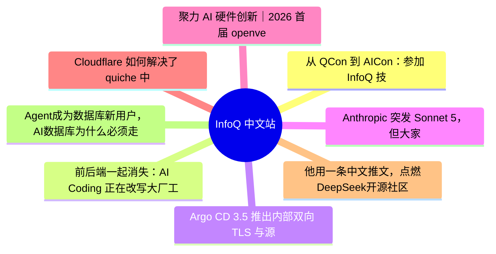

# 📰 InfoQ 中文站 Top 8 (2026-07-02)

## 思维导图

## 列表（8 条，2 条含全文）

### 1. 从 QCon 到 AICon：参加 InfoQ 技术大会的第五年
- **链接**: [https://xie.infoq.cn/article/7810d0c988001188136144c14?utm_source=rss&utm_medium=article](https://xie.infoq.cn/article/7810d0c988001188136144c14?utm_source=rss&utm_medium=article)
- **发布**: Wed, 17 Jun 2026 14:11:55 GMT
- **简介**: AI 还在快速变化，很多问题也没有标准答案。点击查看原文>

### 2. 前后端一起消失：AI Coding 正在改写大厂工程师分工
- **链接**: [https://www.infoq.cn/article/rHiSH66JZwoQG5Dfvv6x?utm_source=rss&utm_medium=article](https://www.infoq.cn/article/rHiSH66JZwoQG5Dfvv6x?utm_source=rss&utm_medium=article)
- **发布**: Wed, 01 Jul 2026 17:59:33 GMT
- **简介**: 点击查看原文>

📄 全文（4021 字符，点击展开）

大厂研发组织正在出现新的调整信号。

根据“大厂日爆”，本周，美团 CLC 食杂零售 Keemart 研发团队完成架构调整，前端与后端团队正式合并，新组织架构已生效。据报道，相关前端人员已提前一个多月进行后端开发训练。与此同时，蚂蚁网商也宣布推动测试岗位整体转向研发岗位，并为相关人员设置半年缓冲期。过渡期结束后，原测试人员将转型为全栈工程师。

Claude Code 之父 Boris Cherny 昨日也发帖分享称，随着工程、产品、设计、数据科学等职能逐渐融合成一种新的角色形态，其最近也在思考，未来的岗位分工可能会变成什么样。

通过对 Claude Code 团队的观察，Boris 看到的不是传统意义上的职能划分，而更像是五类角色原型：

- 原型探索者（Prototyper）：负责提出全新的想法，快速产出大量创意，其中大多数最终不会上线。 
- 构建者（Builder）：能够迅速把一个原型或想法，转化为生产级产品或基础设施。 
- 系统清理者（Sweeper）：负责打磨 UI、简化代码和系统、下线不必要的功能，并优化性能。 
- 产品增长者（Grower）：在产品已经被做出来之后，持续迭代，提升产品与市场的匹配度（Product-Market Fit）。 
- 系统维护者（Maintainer）：负责成熟系统的长期运转，使其在规模扩大过程中依然保持安全、可靠、快速和高效。 

“很多人会横跨其中两类角色，有时甚至会横跨三类。我也注意到，这些角色其实并不严格绑定某个具体职能。比如在 Anthropic 内部，有些设计师更接近第 1 类，有些接近第 2 类，有些接近第 3 类；工程师、产品经理、数据科学家也是如此。” Boris 说道。

只要会 React 就有机会面试的日子正在迅速离去。在 AI Coding 被快速普及的当下，技术岗位的划分也面临着一场重塑，尤其所谓前、后端工程师的边界正在重新整合成“全栈能力”。企业不再只是想要一个“纯前端开发者”，而是希望候选人能够处理后端 API，理解数据库结构，并能从头到尾独立完成一个功能的开发、部署与交付。

## 字节、阿里招聘释放的信号

“每家公司似乎都在招全栈工程师。”有开发者表示。

“前端和后端的分工边界已经消失了。大多数团队，比如我所在的团队，现在想要的是能够端到端负责的人。专业能力当然仍然是加分项，但那种只做前端、一遇到后端任务就退缩的‘纯前端工程师’，对大多数团队来说已经不再适用了。”还有开发者说道。

招聘市场中已经出现了非常明确的“岗位合并”信号。

谷歌的全栈应用工程师岗位，更像一个偏业务应用方向的岗位，前端只是其中一部分，职责覆盖了完整软件交付链路。传统前端岗位通常聚焦在“用户界面和前端工程实现”，而谷歌全栈应用工程师还要从需求进入、方案落地、上线交付到后续运营支持全流程负责。这个岗位要直接理解内部客户需求，甚至承担了一部分 BA、产品经理、解决方案工程师的角色。

字节跳动的招聘网站上也有“AI 全栈工程师-视频与边缘”岗位，虽然挂在“前端”名下，但职责边界已经扩展到 AI 产品工程化、Agent 服务编排、多端 SDK、音视频底层能力、云平台等多个方向。

这类 JD 可能岗位描述得比较宽泛，但这确实释放出了这样的信号：对于 AI Native 下的大前端，团队想要的就是全栈人才。

字节招聘页面

一些岗位虽然保留了“前端”的叫法，但具体职责已经不只是做页面和交互。前端工程师越来越需要理解后端任务系统、模型调用逻辑、AI 产品体验等，否则很难把复杂 AI 能力做成用户可用的产品。

字节 Commercial AI 团队招聘的“高级/资深前端研发工程师”，岗位要求候选人负责即创平台 Web 端业务研发与迭代，业务范围包括数字人、AIGC 口播、视频生成、Agent 等创意工具链路的产品化落地，还要参与 AI 产品形态探索。

而腾讯最新对[前端](https://careers.tencent.com/jobdesc.html?postId=2070035436079857664)工程师岗位的描述显示，其对前端工程师的要求正在从业务页面实现转向 Agent 工程平台建设。该岗位要求负责面向 Agent 的沙盒、数据、调试和可视化 Web 产品体系，独立承担高信息密度页面、多状态流程和实时数据调试场景开发，并推动传统后台研发工具向现代化、高质量产品体验转型。

腾讯前端工程师招聘页面

“2026 年的前端就业市场竞争更加激烈，但并非没有机会。它更看重深度而非广度，更看重解决问题的能力而非死记硬背，更看重适应能力而非对特定工具的依赖。”软件工程师 Gawande Sakshi 说道。

与此同时，后端相关岗位也在脱离传统后端范畴。

阿里淘天的 AI Agent [应用开发](https://www.nowcoder.com/jobs/detail/408508?urlSource=sitemap&utm_source=chatgpt.com)岗位会负责在电商场景中建设大模型智能化比价辅助决策等工具，同时要基于大模型调度多领域智能体，实现商家运营全链路提效；还要开发 AI 代码生成工具、面向运营小二的智能提效平台，以及面向企业员工办公场景的智能体架构。这要求候选人既懂服务端工程，又懂大模型应用栈，还要能把模型、工具、知识库和业务系统编排成可落地的 AI 产品。

“作为一名后端工程师，为了最大限度地提高求职成功率，我必须成为一名全栈工程师。”有开发者表示。

现在一些岗位没有做前后端之分，但在岗位需求中已经表明了需要全栈能力。比如阿里在最新招聘中，将“AI 应用研发工程师”被描述为“跨越技术栈边界、端到端解决复杂问题的系统构建者。”该岗位要深入理解业务场景，参与从需求分析、架构设计到上线运维的全链路研发工作。

当大模型行业进入 Agent 工程比拼阶段，训推、产品和工程不再能被清晰切分。

字节对“AI Agent Memory Infrastructure”的招聘就表明了这一点。该岗位处于大模型、数据系统和上下文工程交叉点，职责包括构建下一代 Agent 记忆基础设施，同时优化大规模、低延迟、高可用环境下的数据摄取、存储、索引、检索、更新、压缩和遗忘机制，并面向多模态数据设计统一记忆模型和处理流程。

可以看出，字节、阿里等代表的大厂现在招的不是“更会写代码的人”，而是在招“能把模型变成产品、把 Agent 变成系统、把 AI 能力跑进真实业务闭环的人”，是所谓前端还是后端，其实没有那么重要了。

类似地，在国外，Stripe 最新开放的全栈工程师岗位，并没有把职责拆成前端或后端，而是要求候选人设计、构建并维护用户可见体验、服务、API 和系统，同时能够在商业优先级、用户体验和可持续技术基础之间做有效权衡。Stripe 还要求工程师审视并决定产品建设中的技术和架构选择，直接与早期创业者交流，并能跨服务、跨技术栈排查生产问题。

“写代码只是软件工程中的一环，软件工程不会消失。但以岗位边界为中心的软件工程组织，正在转向以交付闭环为中心的软件工程组织。”某公司研发总监韩雨（匿名）向 InfoQ 说道。

韩雨表示，不止大厂这么干，中小厂也在这么干了。单纯靠某一层技术栈吃饭的岗位价值正在下降，岗位边界逐渐模糊。对于公司来说，这样可以减少整体摩擦成本，提升效率。

他结合自身经验总结道，以前公司买的是“某一层的编码劳动力”，现在公司更需要的是“能借助 AI 把一个问题稳定解决掉的人”。同时他也强调，每个端仍然会有领域专家，为这个端做质量兜底。

## AI 编程工具就是在消除边界

现在我们说的“全栈工程师”更像是 AI 加持下的新全栈工程师：既懂前后端，也懂 Agent 架构、系统部署、迭代优化和业务场景。

实际上，之前 McKinsey 就明确提出，AI 会推动开发者走向全栈开发能力，并要求他们成为 “AI 技术栈开发者”。而前后端边界松动的背后是 AI 编程正在改变软件开发流程。

OpenAI 关于 Codex 的最新论文显示，Codex 用户已经把代码实现、代码理解、验证、配置、文档和工程运维交给同一套 Agentic workflow。

2026 年上半年，Codex 周活用户增长超过五倍。提交超过 8 小时人类工程师工作量任务的个人用户比例较年初增长近 10 倍。在 OpenAI 内部，Codex 已经占 Codex 与 ChatGPT 合计输出 token 的 99.8%。更重要的是，重度用户同时管理多个 Agent：近三成 OpenAI 用户曾在一周内同时管理五个或更多 Agent，最重度的前 1% 用户一天累计运行约 71 小时 Agent turns。AI Coding 正从“补全代码”转向“接任务”。

如今 ，AI 编程工具在前端页面和交互实现方面表现都已不错，尤其是当组件库、样式规范和设计模式较为清晰时。因此，这类能力已经不再是全栈任务的难点。

在后端接口和业务逻辑等方面，Claude Code 和 Codex 能完成中低复杂度后端任务，但涉及复杂权限、事务一致性等时，表现就会明显不稳定，原因是它们很难完全理解业务隐含约束。现在 Claude Code、Codex、Cursor 等工具也在逐渐加强读取仓库、修改多文件、执行测试、升级依赖、改配置等后端能力。

这其中，数据库和状态管理是当前 coding agent 的明显短板之一。FullStack-Agent 论文就专门把 frontend、backend、database 分开测试，并

...（截断，原文 6238+ 字符）

### 3. Argo CD 3.5 推出内部双向 TLS 与源码完整性校验支持，强化软件供应链安全
- **链接**: [https://www.infoq.cn/article/MfHAiaeQbq6VWPHLD4pB?utm_source=rss&utm_medium=article](https://www.infoq.cn/article/MfHAiaeQbq6VWPHLD4pB?utm_source=rss&utm_medium=article)
- **发布**: Wed, 01 Jul 2026 17:32:00 GMT
- **简介**: 点击查看原文>

📄 全文（2738 字符，点击展开）

[Argo CD](https://argoproj.github.io/cd/) 项目于 2026 年 6 月发布了 [v3.5 候选版本](https://blog.argoproj.io/argo-cd-v3-5-release-candidate-02b1fbf7b419)。该版本为内部组件添加了强制双向 TLS（mTLS）支持，为供应链安全提供了 Git 提交签名验证功能，并在 UI 中实现了原生的应用集管理功能。此外，本次发布还将两项重要功能——身份模拟（Impersonation）和 源文件加载器（Source Hydrator）——从 Alpha 测试阶段提升至 Beta 测试阶段。

长期以来，大规模部署 Argo CD 一直存在内部安全防护与运维可视性短板。此前，代码库服务器与 API 服务、控制器等组件之间的通信均未加密，内部流量无法纳入团队在流量入口层部署的常规双向 TLS 保护。在供应链安全层面，旧版 Argo CD 缺乏相应的防护机制：一旦代码库遭入侵，未签名或被篡改的资源清单文件会在无感知状态下完成部署。应用集虽可批量创建应用，但此前无原生前端界面支持，运维人员只能通过查看 YAML 配置或通过 kubectl 命令才能获知某个应用集最终生成的内容。

现在，代码库服务器已支持 [mTLS](https://www.cloudflare.com/learning/access-management/what-is-mutual-tls/)，所有接入的组件均需提供客户端证书。对于未配置自定义证书的环境，代码库服务器会在内存中创建自签名证书，这样既能支撑内部健康检查，又无需依赖文件系统存储证书。。Source Integrity 验证功能允许运维人员确保 Git 源在同步前具有有效签名。这可以通过在应用规范中设置 `sourceIntegrity.required: true`，或使用 CLI 标志 `argocd app set --source-integrity-required` 来实现。应用集 UI 由来自 Intuit、Red Hat、GoTo 和 Octopus Deploy 的工程师共同开发，提供了列表、筛选和详情视图，还有一个“预览应用”（Preview Apps）标签页，可在部署前查看应用集模板即将生成的全部应用资源。

Argo CD 现在可以在服务器端任务中模拟特定的用户身份，包括日志流查看、资源删除与应用同步等操作，该功能已进入 Beta 测试阶段。当你通过 AppProject 或 [RBAC 策略](https://en.wikipedia.org/wiki/Role-based_access_control)配置身份模拟时，它将自动应用于所有服务器操作，这对于多租户集群的审计溯源工作至关重要。源码加载器功能同样进入 Beta 测试阶段。团队现在可以设置不同的 `drySource.repoURL` 和 `syncSource.repoURL` 值，支持多仓库 [GitOps](https://about.gitlab.com/gitlab-orbit/) 模式——源模板和渲染后的清单可以位于不同的仓库中，各自拥有独立的访问控制。

该版本还增加了对 [Helm 4](https://helm.sh/docs/overview/) 的支持，同时保持对 Helm 3 的向后兼容性。应用集现在可以部署在任意命名空间中，不再局限于 Argo CD 命名空间。这一特性状态稳定，满足了长期以来团队按命名空间管理 GitOps 的需求。应用集并发控制功能允许运维人员限制同时处理的应用数量，从而降低压垮集群或上游 Git API 的风险。对于遇到组声明溢出的 Azure AD 用户，现在可以通过 Microsoft Graph API 进行组解析，绕过 OIDC 令牌长度限制。Azure DevOps 仓库获得了服务主体身份验证支持，不再依赖 PAT（个人访问令牌）。

在 Argo CD 的主要竞争对手中，v3.5 的三项核心功能——内部 mTLS、源码完整性校验、应用集 UI——因各工具的架构不同而存在很大差异。[Flux](https://fluxcd.io/)（v2.8，2026 年 3 月发布）从底层架构设计上规避了内部双向 TLS 安全问题：其控制器使用 Kubernetes API 对象进行通信，而非直接的 gRPC，因此不存在需要保护的内部流量，但对外连接场景则支持双向 TLS，可通过 `certSecretRef` 配置 `GitRepository`、`HelmRepository`、`OCIRepository` 等资源的证书。在代码提交签名验证方面，Flux 早在 Argo CD 之前就通过 GitRepository API 中的 `spec.verify.mode: head` 提供原生 GPG 支持，因此 Argo CD 在这方面是在追赶 Flux。在 UI 方面，Flux 2.8 通过单独安装的 [Flux Operator](https://fluxoperator.dev/web-ui/) 引入了 Web 仪表盘，提供了 Kustomization 和 HelmRelease 视图，但没有 ApplicationSet Preview 等效功能。Flux 依靠 ArtifactGenerator API 实现模板驱动式资源生成，并不提供可视化预览。

[Rancher Fleet](https://ranchermanager.docs.rancher.com/integrations-in-rancher/fleet/overview) 使用基于 WebSocket 的代理系统而非 gRPC，因此不需要内部 mTLS。TLS 在 Rancher 入口和代理信任层进行处理。Fleet 未内置 Source Integrity 机制，要强制执行提交签名，需要使用 Git 提供商的策略或准入 Webhook。UI 集成在 Rancher 仪表盘的“持续交付”中，而非独立应用。

[Jenkins X](https://jayex.io/) 使用 [Tekton](https://tekton.dev/) 在管道层强制执行供应链控制，包括 Tekton Chains 和 GPG 签名发布。它没有提供管方的仪表盘，也缺少类似应用集预览的功能。多集群环境发布通过基于拉取请求的环境流程进行，而非通过生成模板。

### 4. Anthropic 突发 Sonnet 5，但大家更期待 Fable 5 和 Mythos 5 明天解禁
- **链接**: [https://www.infoq.cn/article/S9zHYQqfFCXt8GoLlM5W?utm_source=rss&utm_medium=article](https://www.infoq.cn/article/S9zHYQqfFCXt8GoLlM5W?utm_source=rss&utm_medium=article)
- **发布**: Wed, 01 Jul 2026 17:09:25 GMT
- **简介**: 点击查看原文>

### 5. 聚力 AI 硬件创新｜2026 首届 openvela AI 硬件开发者大赛火热报名中
- **链接**: [https://www.infoq.cn/article/arkN5tbl3ttDUTMM7v5J?utm_source=rss&utm_medium=article](https://www.infoq.cn/article/arkN5tbl3ttDUTMM7v5J?utm_source=rss&utm_medium=article)
- **发布**: Wed, 01 Jul 2026 16:02:53 GMT
- **简介**: 点击查看原文>

### 6. Cloudflare 如何解决了 quiche 中的一个拥塞漏洞
- **链接**: [https://www.infoq.cn/article/CHON5sllKKAMBg309xiZ?utm_source=rss&utm_medium=article](https://www.infoq.cn/article/CHON5sllKKAMBg309xiZ?utm_source=rss&utm_medium=article)
- **发布**: Wed, 01 Jul 2026 15:01:00 GMT
- **简介**: 点击查看原文>

### 7. 他用一条中文推文，点燃DeepSeek开源社区
- **链接**: [https://www.infoq.cn/video/7drQWlqtxBb5euT4eUYB?utm_source=rss&utm_medium=article](https://www.infoq.cn/video/7drQWlqtxBb5euT4eUYB?utm_source=rss&utm_medium=article)
- **发布**: Wed, 01 Jul 2026 14:36:45 GMT
- **简介**: 点击查看原文>

### 8. Agent成为数据库新用户，AI数据库为什么必须走向湖库一体？
- **链接**: [https://www.infoq.cn/article/1f1PdxW2458qx5gPfyeg?utm_source=rss&utm_medium=article](https://www.infoq.cn/article/1f1PdxW2458qx5gPfyeg?utm_source=rss&utm_medium=article)
- **发布**: Wed, 01 Jul 2026 14:11:36 GMT
- **简介**: 点击查看原文>
