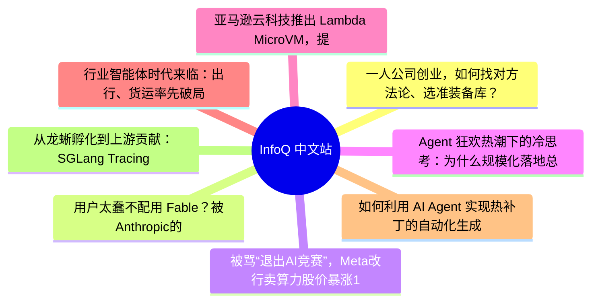

# 📰 InfoQ 中文站 Top 8 (2026-07-05)

## 思维导图

## 列表（8 条，3 条含全文）

### 1. 一人公司创业，如何找对方法论、选准装备库？
- **链接**: [https://www.infoq.cn/article/pxXOLZMIk90UTXOJ8aNE?utm_source=rss&utm_medium=article](https://www.infoq.cn/article/pxXOLZMIk90UTXOJ8aNE?utm_source=rss&utm_medium=article)
- **发布**: Thu, 02 Jul 2026 19:43:06 GMT
- **简介**: 点击查看原文>

📄 全文（4021 字符，点击展开）

AI 让一个人做产品变得更容易。

社交媒体上，快速创业的故事越来越多：一个人，用 Vibe Coding 工具几天做出产品，上线后获得第一批用户，再用订阅收入验证商业模式。产品开发变得像快消品上架一样轻盈，想法可以被快速写成代码，代码可以被快速部署成应用，应用又能被快速推到社交媒体上接受市场反馈。

这种变化也正在传导到真实的公司数据里。根据中关村人才协会《中国 OPC 发展趋势报告（2025-2030 年）》，截至 2025 年 6 月，全国一人有限责任公司已突破 1600 万家；2025 年上半年新注册 OPC 数量达到 286 万户，同比增长 47%，占全部新注册企业的 23.8%。

图片为阿里云与 AMD 联合主办的 OPC 沙龙现场，专家分享 OPC 产业观察

随着 OPC （一人公司）数量增长，围绕这一群体的服务生态也开始成形。除了政府、园区的扶持政策，私营企业也在进入这一领域。汇智智能等机构开始提供 OPC 培训和陪跑服务；端木软件等公司，则依托阿里云产品，为 OPC 社群提供开发工具和基础设施支持。

这些服务的出现，恰恰折射出 OPC 创业者普遍面临的现实问题：AI 提升了个人生产力，却没有自动解决产品判断和基础设施选型问题。

而对于一人公司而言，找对产品方法论，选对成熟的装备库，把时间留给战略判断和产品迭代，才是跑通商业闭环的关键。

在庞大的 OPC 群体中，已经有人率先蹚出了这条路径。

# 从个人痛点到产品交付，OPC 产品如何跑出最小商业闭环

“时踪”是一款面向个人的桌面 Agent 助手，由连续创业者阿泰独立研发。

和这个时代不少 OPC 一样，它是在极其有限的个人时间里长出来的产品：阿泰一边运营一家 2B Agent 公司，一边把自己的时间管理痛点，做成了一个面向 C 端用户的 AI 产品。

2025 年 3 月，时踪 1.0 版本上线。目前，时踪用户规模已超过千人，产品付费率约 10%，产品留存率约 40%。值得一提的是，时踪在产品研发中沉淀的 Agent 框架 steerable，目前也已被央企采纳，被用于提供底层工业软件的 Agent 服务和知识库服务。

图源：时踪用户使用反馈

阿泰做“时踪”的过程，为我们提供了一个 OPC 创业的参考案例：**先从个人痛点中提炼产品方向，再把需求放到真实用户中验证；与此同时，在产品落地的 Day 1，就用稳定、成本可控、具备扩展性的云基础设施承接产品交付。**

阿泰过去长期深耕 2B SaaS 和 Agent 产品，熟悉企业客户、业务流程和项目交付。按照既有经验和资源，他更容易继续做 B 端。但在这样的背景下，时踪作为他的第一个 C 端 Agent 产品，仍然较快跑出了早期验证路径。

最早的时踪，是从阿泰的个人需求里长出来的。在管理项目和交付客户的过程中，阿泰发现自己经常被任务、目标和优先级拖住。要做的事情太多，真正消耗时间的并不只是执行，更多是判断下一步该做什么、先做什么、怎么推进。于是，阿泰把目标告诉 ChatGPT，让 AI 拆解任务、生成执行脚本，再导入日历，每天按照计划推进。AI 理解目标，拆解行动，并把抽象计划落到具体日程中，对阿泰本人来说，这个流程确实缓解了决策焦虑。

但当他想把时踪推向更多用户时，真正的问题出现了：这到底是一个真实需求，还是创始人自己的投射？

这是阿泰第一次做 C 端产品。技术并不是最大的难题，AI Coding 已经加快了开发速度。真正困难的是，如何确认这个产品对别人也有价值。他选择把产品放到社交媒体上验证。第二条小红书笔记发布后，时踪收到了超过百人的内测申请。更重要的是，不少用户主动沟通、持续反馈，甚至有人专门打了两个小时电话，详细说明自己的使用体验和功能建议。

从产品形态来看，目前的时踪已经不仅是日程管理工具，它还在持续围绕“个人执行系统”延展。既包含“我的一天、目标库、日历、任务、笔记、资料库”等基础能力，也延伸出“AI 代办、AI 记忆、AI 团队、知识图谱”等功能模块。

图源：时踪用户使用反馈

新增功能意味着，时踪要承担的已经不只是日程管理。它需要理解用户目标，拆解行动路径，并调度不同工具。它还要连接本地电脑环境、MCP 和外部 Skill，在具体场景中调用 Agent 完成任务。

同时，时踪需要长期保存用户的日程、笔记、资料、记忆和知识关系，并支持多端同步。对个人 Agent 产品来说，这些数据高度私人，涉及工作安排、个人目标、文件资料和行为习惯。因此，数据存储、权限管理、隐私安全和服务稳定性，都会直接影响产品能否被长期使用。

**也正因为如此，时踪背后需要一套可以支撑 Agent 调度、数据沉淀、多端访问和安全防护的云服务体系。**

阿泰提到，**时踪目前 95% 的云服务都选择了阿里云。**

对一款处在成长早期、但已经具备多端访问、任务调度、实时通信、数据存储、文件管理与 AI 调用能力的 Agent 产品来说，云基础设施是支撑产品验证、迭代与交付效率的一整套底座。

阿泰也分享了时踪当前的云服务架构。前端覆盖 Web、桌面端、移动端和 CalDAV 客户端；入口层通过 阿里云 WAF 3.0、阿里云 ALB 负载均衡 与 Nginx 反向代理处理流量与安全问题；核心计算层由 阿里云云服务器 ECS 承载应用服务；底层则进一步接入 阿里云 RDS MySQL、RDS PostgreSQL、Redis、OSS、短信与验证码服务，并与 AI 大模型服务协同工作。这意味着，时踪从用户访问、应用运行、数据存储到内容同步、消息触达，产品关键环节的服务支撑基本都建立在阿里云产品之上。

从时踪的云服务架构来看，**阿里云云服务器 ECS 是其核心计算层之一，承载应用服务与后端能力。对于类似时踪这样的成长型 OPC 应用而言，计算资源的选择必须兼顾成本、兼容性和稳定性。阿里云云服务器 ECS 通用算力型实例 u2a，能为成长型业务提供高性价比算力支持**。

阿里云 ECS u2a 实例作为首款搭载 AMD CPU 的通用算力型实例，兼容 x86 生态，面向中小企业或企业的所有轻量应用场景提供企业级算力输出，同时最大支持 64vCPU 规格，自研双单路服务器架构，支持多种应用组件和开发框架，也能在产品持续迭代和用户增长过程中，提供相对稳定的基础算力支撑和更强的稳定性。

阿泰也强调，对一人公司来说，早期选择成本可控、兼容性强、稳定可靠的云服务，能够把有限精力从部署和运维中释放出来，回到产品迭代和用户服务本身。

# OPC 创业者需要能够适配阶段和场景的装备库

对 OPC 创业者而言，最贵的往往不是代码，而是试错成本。许多人要踩过很多坑，才知道如何针对创业阶段和场景选择合适的工具。

为了填平这道认知鸿沟，阿里云首先将 OPC 的创业生命周期拆解，打包成了三个阶段的“装备库”，让创业者可以像打游戏升级一样，按需取用。

在想法验证期，创业者需要尽快建立线上入口，把想法放到真实环境中验证迭代。为此，阿里云提供了轻量级的起步装备库 OPC Starter，并根据不同需求，提供了两种选择。

针对个人官网、项目主页、作品集、产品介绍页和预约入口等基础展示需求，OPC Starter 网络名片版套餐能帮创业者快速搞定域名和建站，让潜在客户、合作方和用户能找到创业者，也能看到项目、服务和联系方式。

当创业者已经有产品想法，需要把 Demo 或 AI 小工具放到线上验证时，可以选用 OPC Starter AI 应用版套餐。这一档更接近 MVP 阶段，重点在帮助创业者快速搭建应用运行环境。它可以承接简单 AI 应用、试用服务、轻量后端和原型项目，让产品先跑起来，尽快进入真实用户测试。

产品拿到第一批用户后，稳定使用的需求会进一步上涨。OPC Lite 套餐提供了更稳定的基础运行环境，搭配轻量应用服务器、基础计算、存储和安全能力。它适合承接已经开始有访问、有数据、有文件、有后台服务的早期产品，让应用从临时验证走向持续交付。

进入持续运营阶段，OPC 会面临更高访问量、更复杂服务和后续扩展需求。这时，OPC Pro 套餐引入了支持按量付费的应用型负载均衡，助力业务爆发和持续运营，进一步帮助成长型 OPC 在成本、兼容性和稳定性之间取得平衡。

与此同时，不同场景的创业者都会遇到一些共性问题：如何把想法做成产品，如何快速上线验证，如何降低模型调用和云资源成本，如何把重复流程沉淀下来，以及如何在后续增长中承接更多用户和数据。

针对这些共性需求，端木软件基于阿里云产品能力，梳理出了一套面向 OPC 的一站式解决方案，解决创业者在开发、部署、运营等方面的问题。

开发环节，创业者可以使用 Qoder 降低代码生产和调试门槛；部署环节可以使用秒悟 Meoo ，让创意和 AI 应用更快上线；运营环节可以使用 Qoder Work，把重复工作沉淀为可复用流程；百炼 Token Plan 与 OPC 套餐组合，精准控制模型调用成本，并无缝衔接后续的云资源扩张。

在产品和技术底座之外，工商注册、财税申报、合同审核等繁琐事务，往往会让创业者消耗大量精力，甚至踩坑交学费。

随着 OPC 群体的壮大，越来越多的服务机构开始切入这一“非技术类”的运营痛点，试图为创业者补齐后勤保障的短板。

以汇智智能为例，在捕捉到这些普遍需求后，其服务也从工具和课程，延伸到企业运营服务，覆盖工商注册、财务代账、税务申报托管和日常法律顾问支持等环节。

围绕 OPC 经济，各方正在做的事情，某种程度上是把创业过程拆得更细，也把过去只有组织才能承担

...（截断，原文 4294+ 字符）

### 2. 用户太蠢不配用 Fable？被Anthropic的回应气笑了：最贵的模型，最憋屈的体验
- **链接**: [https://www.infoq.cn/article/HDE9Hoe3RVyNlX3CCGzV?utm_source=rss&utm_medium=article](https://www.infoq.cn/article/HDE9Hoe3RVyNlX3CCGzV?utm_source=rss&utm_medium=article)
- **发布**: Thu, 02 Jul 2026 18:36:08 GMT
- **简介**: 点击查看原文>

📄 全文（4021 字符，点击展开）

## 最强 Coding 模型，把代码交给旧模型写

Fable 5 有拯救到因拉透了的 Sonnet 5 而口碑下滑的 Anthropic 吗？

Sonnet 5 发布后就有用户锐评，“可以直接扔[进垃圾桶了](https://x.com/scaling01/status/2072071305281540338)。”它“比 Opus 4.8 Max 贵 1.2 倍，比 GPT-5.5-xhigh 贵 2 倍，比 GLM-5.2 贵 5 倍，比 Kimi-K2.6 贵 7 倍，比 DeepSeek-V4-Pro 贵 57 倍。”

今天， Fable 5 回来了，Anthropic 还赠送了一次限时优惠。部分包含使用额度的付费用户，都可以在 7 月 7 日前访问 Fable 5，最多可以将每周使用额度的 50% 用于 Fable 5，达到这一上限后可以切换到其他模型，也可以通过 usage credits 继续使用 Fable。

Anthropic 还明确表示，Claude Fable 5 相比其他 Claude 模型的消耗额度更快。

Claude Fable 5 价格为 10 美元/每百万输入 token，50 美元/每百万输出 token；现有的 prompt caching 输入 token 90% 折扣仍然适用。7 月 7 日之后，Fable 将被拆分为单独额度，并从 points 中扣除。针对美国境内运行的工作负载，Fable 5 的推理过程仅在美国的基础设施上运行，输入和输出 token 均按 1.1 倍价格计费。

其中最引起争议的是这次新的回退机制。

Anthropic 更新了网络安全防护措施。短期内，相比此前 Fable 的防护机制，新防护措施会把略高比例的无害请求误判为需要拦截。当某个请求被标记时，用户会收到明确通知，并将改由 Opus 4.8 提供回复。”官方表示，“绝大多数编码工作不会受到影响。”

与此同时，生物和化学分类器与最初发布时保持不变。这些分类器目前仍比官方期望的范围更宽；它们会在一些基础的、与生物学相关的问题上触发回退到 Opus 4.8。针对这些分类器的改进后续上线。

随即，OpenCode 开发者 Dax 就反馈，“我的很多提示词都被降级处理了。我查看日志时，发现上面写着 `TOO_DUMB_TO_NEED_FABLE`（太蠢了，不配用 Fable）。这到底是怎么回事？”

Claude Code 工程师 Thariq Shihipar 则回复了一句：“说实话，我没想到你会去看日志。”

还有网友打趣道，“Dax，别忘了，现在它还会显示‘已使用 50%；。你所谓的 Fable 使用权限，本身就是个笑话。”

有用户做了这样一个贴切的比喻：

Anthropic：“我给你造了一辆 F1 法拉利。”

我：“太期待看看它能跑多快了。”

Anthropic：“当然可以，给你一辆普锐斯，玩得开心！”

有人继续说道，“当你坐进那辆普锐斯，发现里面贴着一张贴纸……‘庆幸吧，我没有把一切都删掉。’”

有愤怒的开发者直言，“我是真的搞不懂 Fable 5 到底是给谁用的。它的价格是每百万 token 输入 10 美元、输出 50 美元，正好是 Opus 4.8 的 2 倍。但现在，很多常规编码和调试请求都会被新的安全过滤器标记，然后被重新路由到……Opus 4.8。也就是说，你付了双倍价格，先等一个分类器检查你的请求，最后却拿到一个更便宜模型的回答。那这个模型的意义到底是什么？”

“在我看来，这场秀完全就是一场营销活动，仅此而已。”有网友评价 Fable 5 的回归时说道。

“他们永远不会把高质量的 Mythos 级模型开放给公众，主要原因就是钱。既然政府和私营企业能给他们带来高得多的利润率，为什么还要把这些模型提供给普通公众？这就是为什么他们会说开源 AI 模型可能存在潜在危险，也会攻击 GPT-5.5 的安全护栏太少。他们不想要竞争，他们只想赚你的钱，并把真正好的东西牢牢关起来，只提供给那些更有钱的公司。”有网友说道。

## 反蒸馏成为一次对“安全”的反噬

整个新模型的发布，尽显 Anthropic“公开说一套，实际做另一套”的风格。

此前，Anthropic 将 Mythos 描述为具有“前所未有的网络安全风险”，并表示不会公开全面发布。相反，它推出了 Project Glasswing，为 Apple、Microsoft、Google、Nvidia、AWS 和 JPMorgan 等企业提供 1 亿美元使用额度，Mythos Preview 的定价是 Opus 4.6 的 5 倍。

“Mythos 采用的是同一套打法：强调危险，限制访问，制造独家需求，然后推动下一轮融资。”有人评价道。前白宫 AI 和加密货币主管 David Sacks 质疑道，“每当 Anthropic 开始吓唬人，你都必须问：这是他们‘小鸡叫天塌了’的套路，还是这次是真的？”

过去几年，Anthropic 一直是 AI 行业里最会讲“安全故事”的公司。

相比 OpenAI 前期的商业化狂飙，Anthropic 显得更克制和审慎，Dario Amodei 及其员工在对外分享中处处强调“安全”的重要性。但原本通过”安全”建立的竞争优势，到了 Fable 5 身上，开始变成是否发布的政治考量，以及对用户产品体验的切实影响。

为了讲好“安全”故事，Dario Amodei 不惜公开反对开源，表示开源 AI 正在走上一条“非常危险的道路”。他警告称，一旦强大的模型被公开发布，企业就会失去监控滥用、撤销访问权限或更新安全防护措施的能力。

可以看出，Anthropic 不仅在卖模型，还在卖一种承诺：我们比别人更谨慎、更重视安全，更值得企业信任。正因为如此，用户对它的要求天然更高。

但它现在的核心矛盾是：既要维持安全公司的品牌形象，又要承担前沿模型高昂的推理成本；既要开放给开发者和企业客户，又要防范转售、代理、滥用和蒸馏；既要证明自己比 OpenAI 更负责任，又要在商业化压力下提高变现效率、控制资源消耗。

这些目标本来就互相拉扯：控制越强，体验越差；价格越高，用户越挑剔；安全说得越满，透明度要求越高。目前，Anthropic 似乎并没有掌握好其中的平衡。

近日，围绕 Claude Code 的隐藏标记争议，更是让用户重新审视 Anthropic 的信任边界：一家长期以“安全可信”作为核心卖点的公司，是否应该用用户难以察觉的方式，在系统提示词中编码用户的环境和路由信息？

这件事最早在 Reddit 上发酵，随后有 GitHub 技术分析报告称，Claude Code 在检测到用户设置第三方 `ANTHROPIC_BASE_URL`、而非官方 API 端点时，会检查代理主机名和系统时区。如果系统时区是 `Asia/Shanghai` 或 `Asia/Urumqi`，或者代理域名命中特定中国科技公司、中国 AI 实验室、Claude 转售站点和镜像代理服务，Claude Code 据称会修改系统提示词中 “Today’s date is …” 这一行。

修改方式非常隐蔽，例如日期分隔符从 `2026-06-30` 变成 `2026/06/30`，或者把 “Today’s date” 里的撇号替换成肉眼几乎难以区分、但 Unicode 编码不同的字符。

中转站通常会清洗 HTTP header，过滤明显的元数据字段，但很少会改写日期这种自然语言内容。如果请求最终仍然回到 Anthropic 官方 API，Anthropic 就有机会在日志中识别出请求是否来自特定时区、是否经过疑似代理、是否命中特定域名或关键词。

连蚂蚁集团的陈成在看了 Claude Code 191 版本的源代码后，也在 x 上发帖分析称，“从技术角度看，Anthropic 的反蒸馏机制设计得相当巧妙。”

他解释道，Claude Code 里有这样一段 prompt：return `Today${n}s date is ${r}.`;

“他们在这句话里使用了隐写术，把人眼几乎无法察觉的字符嵌入到系统提示词中，用来秘密编码系统时区和代理端点身份。触发条件是：你设置了第三方中转地址 ANTHROPIC_BASE_URL，并且它不是 [http://api.anthropic.com。](http://api.anthropic.com。)所以，如果你是直接连接官方 API 的用户，完全不会受到影响。换句话说，最近那波封号潮和这个机制没有关系。”

“选择 ‘Today’s date’ 这句话作为载体也很狡猾。”陈成表示，这个标记藏在系统 prompt 正文里，而不是 HTTP header 或元数据里。中转站通常会重写或过滤 header，但几乎没人会处理日期这种自然语言内容，所以这是一种 header 清洗也洗不掉的水印。

而且，currentDate 是用户上下文字段之一，和 claudeMd、userEmail 并列，会被每次请求携带，因此这个标记几乎可以 100% 稳定出现。撇号和日期分隔符的变化在语义上又是无损的，模型读起来完全一样，用户做 diff 也很难看出来，隐蔽性被最大化了。

“真正关键的是证据链如何闭环。”这个标记会跟随请求一起传递，当一个中转站或蒸馏流水线最终又回到 Anthropic 官方 API 去转售 Claude 时，携带这个标记的请求就会流回 Anthropic 自己的服务器。

于是 Anthropic 可以在自

...（截断，原文 6308+ 字符）

### 3. 被骂“退出AI竞赛”，Meta改行卖算力股价暴涨10%：卖铲子比淘金更赚？
- **链接**: [https://www.infoq.cn/article/vxgbzsNORRzQDz6xK1jv?utm_source=rss&utm_medium=article](https://www.infoq.cn/article/vxgbzsNORRzQDz6xK1jv?utm_source=rss&utm_medium=article)
- **发布**: Thu, 02 Jul 2026 18:27:05 GMT
- **简介**: 点击查看原文>

📄 全文（3293 字符，点击展开）

作者 | 华卫

过去两年里，Meta 投入数十亿美元用于开发 AI 并建设支撑其运行的数据中心，几乎买下了所能获得的每一份 AI 算力资源。如今，这家公司似乎开始考虑如何把其中一部分再卖出去，让这些数据中心承担一个更“立竿见影”的盈利角色。

据外媒援引知情人士报道，该公司正在打造一项云业务，以消化过剩的 AI 算力。这一举措或将使 Meta 与 AWS、Google Cloud 和 Microsoft Azure 等云计算巨头正面竞争，也为投资者提供了一个重新审视其高额支出的理由。消息公布后，Meta 股价上涨超过 10%。

这一消息也印证了 Meta 首席执行官马克·扎克伯格今年 5 月在股东大会上的表态：将云计算业务作为回收其在 AI“超级智能”战略中巨额投入的一种方式，“绝对在考虑之中”，并称几乎“每周都有公司”主动接洽 Meta，希望购买其 AI 模型或闲置算力的使用权。

# 新部门已成立，产品形态权衡中

报道称，这些计划仍处于早期阶段，未来仍可能发生变化。目前，Meta 尚未有公布定价或上线时间，相关人士也强调战略仍可能调整。

对于 Meta 来说，过剩算力是真实存在且正在增加的。该公司在路易斯安那州拥有一个占地 2250 英亩的超大规模园区，在美国中西部还在建设一个吉瓦级数据中心，同时还叠加了多项外部合作，例如来自 Crusoe 的新增产能，两处站点合计约 1.6 吉瓦。但这种扩张在其他地方也遇到了限制。例如，谷歌近期因算力紧张，开始限制 Meta 访问其 Gemini 模型。

据悉，Meta 正在权衡的是产品形态，而非是否推进。

一种方案是出售运行在其自有基础设施上的 AI 模型访问权限，类似 AWS Bedrock 的模式，后者允许开发者调用来自不同公司的 AI 模型。彭博社指出，Meta 的确在考虑效仿 AWS，出售运行在其 AI 基础设施上的各类模型访问权限，其中包括其近期推出的闭源模型 Muse Spark。

另一种则是直接出售原始算力，需要高性能计算资源来训练和运行 AI 模型的企业、初创公司和开发者，这也是 CoreWeave 等“新云厂商”（neocloud）赖以构建业务的模式。无论选择哪条路径，Meta 都将直面 Amazon Web Services、Google Cloud 和 Microsoft Azure 这三大市场主导者的竞争。

消息称，该项目被整合在一个名为“Meta Compute”的新部门下，由 Meta 基础设施负责人 Santosh Janardhan 牵头，与 Meta Superintelligence Labs 的 Daniel Gross 以及 Meta 总裁 Dina Powell McCormick 共同负责。

值得注意的是，Meta 此前从未运营过公共云平台，而是构建了全球最大的私有 AI 计算网络之一，用于支持其自身产品生态，包括 Facebook、Instagram、WhatsApp、Threads、Meta AI、Llama 系列模型、推荐系统、广告技术以及内容审核工具。

# 动机清晰：开辟新的收入来源

哪怕只是一个尚未落地的变现路径，也足以改变资本市场的情绪。消息公布后，市场几乎立即做出了反应。投资者将此消息视为一丝小小的慰藉，Meta 股价上涨超过 10%。对于一只此前表现疲软的股票而言，这是一个明显的反弹。截至周二，Meta 股价年内跌幅接近 15%，落后于标普 500 指数。此前数月，投资者们一直担忧 Meta 的支出规模及其回报，质疑其 AI 投入节奏。

与 Google 和 OpenAI 不同，Meta 尚未在其 AI 模型和服务上看到显著的外部需求。在财报中，Meta 并未单独披露 Meta AI 或其开源权重模型家族 Llama 的收入，管理层在公开表态中也更多强调 AI 在公司内部的应用。这或许意味着，Meta 的 AI 业务尚未形成实质性的独立收入来源。

然而，截至第一季度末，Meta 已承诺在未来几年投入 1829 亿美元用于 AI 基础设施建设，其中包括路易斯安那州和俄亥俄州的多个大型项目。扎克伯格表示，俄亥俄项目规模将相当于曼哈顿，并预计将在今年投入使用。在 2026 年，Meta 预计将投入 1150 亿至 1350 亿美元资本开支，用于芯片、土地和电力等基础设施建设。这是一笔巨额投入，而云业务几乎是少数几种能够将闲置产能转化为收入、而非沉没成本的方式之一。

瑞银交易员 Christina Dwyer 表示，Meta 的消息将叙事转向更严格的财务纪律，缓解了市场对资本支出持续攀升的担忧。"资本支出预期不再单边向上，焦点正转向自由现金流的稳定性。"

此外，有分析师指出，Meta 这一举措也加深了市场对其能否追赶 Anthropic 等领先 AI 实验室的疑问。扎克伯格已为此投入数十亿美元，甚至在去年引发了一场人才争夺战。今年 4 月，Meta 发布了由其高成本团队打造的首个 AI 模型 Muse Spark，但尚未向开发者开放。外媒上月报道称，该模型的发布时间仍未确定。

D.A. Davidson 董事总经理 Gil Luria 认为，报道中提到的 Meta 的云计算雄心表明，该公司正在“放弃前沿 AI”，转而出售算力。Luria 在报告中写道，如果 Meta 削减支出并开始将其 AI 基础设施变现，该公司“营收和现金流将有显著提升空间”。杰富瑞分析师 Brent Thill 则持有不同观点，认为 Meta“并非退出人工智能竞赛，而是将早期激进的运力投入转化为一种战略性的价值创造途径。”

因此，有一点是明确的，Meta 出售多余 AI 算力这件事的动机已经非常清晰：开辟新的收入来源。

# 大模型厂商纷纷下场，做起了“卖水”生意

一个此前四处争抢算力的公司，如今却开始考虑出售算力，这本身带有某种讽刺意味，也反映出这一轮基础设施建设的“块状特征”。算力的建设通常以巨大且不可分割的规模推进，其时间节点基于未来预测而非当下需求，这导致即便是最“饥渴”的买家，也可能在短期内持有超出使用能力的资源。

Meta 并不是第一个看到这一机会的公司。出售这些“溢出产能”，正是新云厂商以及如今它们的客户试图让商业模型成立的方式。像 Jane Street 与 CoreWeave 签订的 60 亿美元合同，就展示了这一层市场正在流动的资金规模。今年 5 月初，SpaceX 也已将 xAI 位于 Colossus 1 数据中心的全部算力出售给 Anthropic。彭博智库估算，这一合作到 2028 年可能带来超过 500 亿美元收入，到 2030 年甚至可能达到 1000 亿美元。此后，SpaceX 还与 Google 和 Reflection AI 签署了类似的租赁协议。

这种模式正在行业中逐渐成为常态：先建设远超当前需求的算力基础设施，押注未来需求增长，再在短期内出租多余产能以分摊成本。当你每年承诺向基础设施投入远超千亿美元时，为未使用部分寻找买家就不再是一个辅助项目，而更像是一种必然。

当然，这一前提是算力需求能够持续，以及数据中心本身能够维持其价值。一些质疑者警告称，当前大规模建设 AI 基础设施的竞赛，可能正在制造一个依赖快速贬值芯片的泡沫。也有人怀疑，AI 公司是否能够产生足够的终端用户收入，来支撑动辄数万亿美元规模的投入。

与此同时，新云厂商 CoreWeave 和 Nebius 股价分别下跌 10.8%和 12.4%。市场担心，作为其重要客户的 Meta 此举可能减少对其服务的支出，同时加剧行业竞争。Luria 分析道，“Meta 将算力投放到市场，对新云厂商的冲击可能大于对大型超大规模云服务商的影响。像 CoreWeave 和 Nebius 这样的公司在增长上依赖 Meta，而 Meta 未来可能不再需要它们。”

参考链接：

### 4. Agent 狂欢热潮下的冷思考：为什么规模化落地总是陷入僵局？
- **链接**: [https://www.infoq.cn/article/KmDMAvlzBGgwu5A2kf7t?utm_source=rss&utm_medium=article](https://www.infoq.cn/article/KmDMAvlzBGgwu5A2kf7t?utm_source=rss&utm_medium=article)
- **发布**: Thu, 02 Jul 2026 17:19:52 GMT
- **简介**: 点击查看原文>

### 5. 亚马逊云科技推出 Lambda MicroVM，提供隔离式智能体与用户代码运行环境
- **链接**: [https://www.infoq.cn/article/QbFT0uMbBd8rcZ0zEfit?utm_source=rss&utm_medium=article](https://www.infoq.cn/article/QbFT0uMbBd8rcZ0zEfit?utm_source=rss&utm_medium=article)
- **发布**: Thu, 02 Jul 2026 17:18:00 GMT
- **简介**: 点击查看原文>

### 6. 行业智能体时代来临：出行、货运率先破局
- **链接**: [https://www.infoq.cn/article/k8tlXTTbFmTGOLojQVZB?utm_source=rss&utm_medium=article](https://www.infoq.cn/article/k8tlXTTbFmTGOLojQVZB?utm_source=rss&utm_medium=article)
- **发布**: Thu, 02 Jul 2026 16:21:51 GMT
- **简介**: 点击查看原文>

### 7. 如何利用 AI Agent 实现热补丁的自动化生成
- **链接**: [https://www.infoq.cn/article/BXc66LG3pVL8ZMme0ehy?utm_source=rss&utm_medium=article](https://www.infoq.cn/article/BXc66LG3pVL8ZMme0ehy?utm_source=rss&utm_medium=article)
- **发布**: Thu, 02 Jul 2026 16:00:00 GMT
- **简介**: 点击查看原文>

### 8. 从龙蜥孵化到上游贡献：SGLang Tracing 与 AI Agent 调优实践
- **链接**: [https://www.infoq.cn/article/o5BOhliYRHIe4ZZPrHY9?utm_source=rss&utm_medium=article](https://www.infoq.cn/article/o5BOhliYRHIe4ZZPrHY9?utm_source=rss&utm_medium=article)
- **发布**: Thu, 02 Jul 2026 15:12:15 GMT
- **简介**: 点击查看原文>
