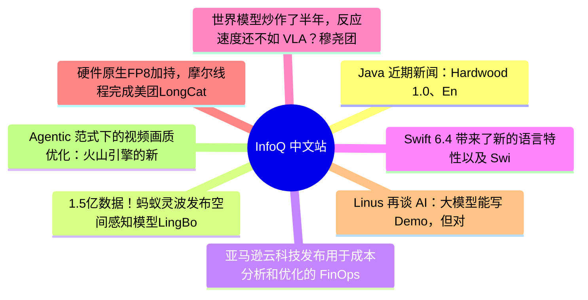

# 📰 InfoQ 中文站 Top 8 (2026-07-07)

## 思维导图

## 列表（8 条，3 条含全文）

### 1. Java 近期新闻：Hardwood 1.0、Endive 1.0、Azul Payara、Quarkus、WildFly、LangChain4j、OSSI
- **链接**: [https://www.infoq.cn/article/69BcusNft9EhAtSdqaYW?utm_source=rss&utm_medium=article](https://www.infoq.cn/article/69BcusNft9EhAtSdqaYW?utm_source=rss&utm_medium=article)
- **发布**: Tue, 07 Jul 2026 12:00:00 GMT
- **简介**: 点击查看原文>

📄 全文（4021 字符，点击展开）

#### JDK 27

JDK 27 的[早期访问构建](https://jdk.java.net/27/) [Build 28](https://github.com/openjdk/jdk/releases/tag/jdk-27%2B28) 发布，它是 Build 27 的[升级](https://github.com/openjdk/jdk/compare/jdk-27%2B27...jdk-27%2B28)，修复了各种[问题](https://bugs.openjdk.org/issues/?jql=project%20%3D%20JDK%20AND%20fixversion%20%3D%2027%20and%20%22resolved%20in%20build%22%20%3D%20b28%20order%20by%20component%2C%20subcomponent)。要了解关于这个构建的更多细节，请参阅[发布说明](https://jdk.java.net/27/release-notes)。

#### JDK 28

JDK 28 的[早期访问构建](https://jdk.java.net/28/) [Build 4](https://github.com/openjdk/jdk/releases/tag/jdk-28%2B4) 发布，它是 Build 3 的[升级](https://github.com/openjdk/jdk/compare/jdk-28%2B3...jdk-28%2B4)，修复了各种[问题](https://bugs.openjdk.org/issues/?jql=project%20%3D%20JDK%20AND%20fixversion%20%3D%2028%20and%20%22resolved%20in%20build%22%20%3D%20b04%20order%20by%20component%2C%20subcomponent)。要了解关于这个构建的更多细节，请参阅[发布说明](https://jdk.java.net/28/release-notes)。

#### Azul Payara

Azul Payara 团队[发布](https://foojay.io/today/whats-new-in-the-june-2026-azul-payara-release/)了 Azul Payara 7.1.0 的 2026 年 6 月版，其中包括社区版 7.2026.6、企业版 6.39.0 和企业版 5.88.0。除了 Bug 修复和组件升级外，这三个版本还提供了以下功能：修复了管理控制台和 REST 管理接口中存在的跨站请求伪造（CSRF）和服务器端请求伪造（SSRF）问题——该问题源于 Servlet 请求中不必要地传递了本可以通过会话信息获取的 REST URL；支持在 Jakarta Data 存储库接口上使用 Spring 框架的 [@Transactional](https://docs.spring.io/spring-framework/docs/7.0.8/javadoc-api/org/springframework/transaction/annotation/Transactional.html) 注解来覆盖方法。要了解有关这些版本的更多详细信息，请参阅[社区版 7.2026.6](https://docs.payara.fish/community/docs/Release%20Notes/Release%20Notes%207.2026.6.html)、[企业版 6.39.0](https://docs.payara.fish/enterprise/docs/6.39.0/Release%20Notes/Release%20Notes%206.39.0.html) 以及[企业版 5.88.0](https://docs.payara.fish/enterprise/docs/5.88.0/Release%20Notes/Release%20Notes%205.88.0.html) 的发布说明。

#### Quarkus

[Quarkus](https://quarkus.io/) 3.37.0 [发布](https://quarkus.io/blog/quarkus-3-37-released/)，带来了 Bug 修复和以下值得注意的变更：支持 Hibernate ORM 7.4.0.Final、Hibernate Reactive 3.4.0. Final 以及 Hibernate Search 8.4.0.Final；新增一个名为 [JLink](https://quarkus.io/extensions/io.quarkus/quarkus-jlink/) 的实验性扩展，它使用 jlink 生成自定义运行时镜像，其中仅包含应用程序必需的 JDK 模块；默认启用[无反射的 Jackson 序列化器](https://quarkus.io/blog/reflection-free-jsckson-serializers/)。要了解有关该版本的更多详细信息，请参阅[发布说明](https://github.com/quarkusio/quarkus/releases/tag/3.37.0)。

#### WildFly

[WildFly](https://www.wildfly.org/) 41 的[首个测试版](https://www.wildfly.org/news/2026/06/26/New-WildFly-41-Beta-release/)带来 Bug 修复、依赖项升级以及以下新功能：支持在[优雅关闭](https://github.com/wildfly/wildfly/blob/main/docs/src/main/asciidoc/_admin-guide/management-tasks/Suspend,_Resume_and_Graceful_shutdown.adoc)过程中处理 WildFly [事务子系统](https://docs.redhat.com/en/documentation/red_hat_jboss_enterprise_application_platform/7.3/html/configuration_guide/configuring_transactions_subsystem)中的数据；借助 WildFly [Elytron 子系统](https://github.com/wildfly-security/wildfly-elytron/blob/2.x/README.md)中的 request 和 request_uri 参数，可以对身份验证请求进行签名以及加密（可选）。要了解有关该版本的更多详细信息，请参阅[发布说明](https://github.com/wildfly/wildfly/releases/tag/41.0.0.Beta1)。

#### LangChain4j

[LangChain4j](https://github.com/langchain4j) 1.17.0 正式发布（连同第 27 个测试版），带来 Bug 修复、依赖项升级以及以下新功能：新增 [DebatePlanner](https://github.com/langchain4j/langchain4j/blob/main/langchain4j-agentic-patterns/src/main/java/dev/langchain4j/agentic/patterns/debate/DebatePlanner.java) 类，用于支持 Debate 代理模式； 新增 [OracleChatMemoryStore](https://github.com/langchain4j/langchain4j/blob/main/langchain4j-oracle/src/main/java/dev/langchain4j/store/memory/chat/oracle/OracleChatMemoryStore.java) 类，为聊天记忆添加了 Oracle 数据库；新增 onUnmappedRawEvent 流回调，允许暴露未被 LangChain4j 映射的原始流事件。要了解有关该版本的更多详细信息，请参阅[发布说明](https://github.com/langchain4j/langchain4j/releases/tag/1.17.0)。

#### Eliya JDK

Asymm Systems 推出了 [Eliya JDK](https://root.asymm.systems/product/eliya)，这是该公司推出的 OpenJDK 下游发行版，它跟踪 OpenJDK 25 的季度关键补丁更新（CPU），提供了适用于 Linux x86_64 和 Linux aarch64 的构建版本。25.0.3 的首次发布是基于 [Oracle 2026 年 4 月的关键补丁更新公告](https://www.oracle.com/security-alerts/cpuapr2026.html)。要了解有关该版本的更多详情，请参阅[发布说明](https://github.com/asymmsys

...（截断，原文 6238+ 字符）

### 2. 1.5亿数据！蚂蚁灵波发布空间感知模型LingBot-Depth 2.0，看得更懂、更准
- **链接**: [https://www.infoq.cn/article/mqY10ihiZ874id2JDeXu?utm_source=rss&utm_medium=article](https://www.infoq.cn/article/mqY10ihiZ874id2JDeXu?utm_source=rss&utm_medium=article)
- **发布**: Tue, 07 Jul 2026 11:01:57 GMT
- **简介**: 点击查看原文>

📄 全文（1721 字符，点击展开）

7 月 7 日，蚂蚁集团旗下具身智能公司灵波科技发布空间感知模型 LingBot-Depth 2.0。该模型基于 1.5 亿规模数据进行训练，在边缘清晰度、细小物体识别、远距离深度估计以及复杂场景鲁棒性等方面实现全面升级。

LingBot-Depth 是灵波自研的空间感知模型，相当于机器人在物理世界的眼睛，1.0 版解决了机器人看清透明、反光等复杂场景的空间感知难题。

相比于 LingBot-Depth 1.0，LingBot-Depth 2.0 的训练数据从 300 万扩充至 1.5 亿规模，性能全面升级：在深度补全基准的 16 项测评中获得 12 项第一；在最难的室内大面积深度缺失场景中，深度误差较上一代减半（RMSE 从 0.132 降至 0.062）；在玻璃、镜面、透明物体等传统深度相机最容易失灵的场景中表现尤为突出。

此次还同步推出了 LingBot-Depth 2.0 的视觉基座模型——LingBot-Vision，构建起机器人从“看懂”到“看准”的能力链路，旨在应对机器人视觉在空间感知、精细识别和复杂环境适应等方面的核心挑战。

图说 1：LingBot-Depth 2.0 在镜面、玻璃等困难场景中补全出完整、平整的三维结构

LingBot-Depth 2.0 的突破性进展得益于 LingBot-Vision 突出的视觉表征能力。作为一款通用视觉模型，LingBot-Vision 也是业内首个把“边界结构”作为预训练目标的视觉基础模型，实现了空间感知训练范式的突破。它拥有亚像素级的边界定位与空间结构理解能力，实现了更高精度、更稳定的空间感知能力。

LingBot-Vision 的预训练语料仅为 1.6 亿张图像，比 DINOv3 小一个数量级，深度估计精度却与优于 DINOv3；并且，LingBot-Vision 对物体边界的判定足够稳定，能在视频中连续追踪物体边界。LingBot-Vision 本次开源了 4 个版本——ViT-G/L/B/S。

据了解，LingBot-Vision 除了支持 LingBot-Depth 2.0 的训练，还具备“一模多用”的通用能力。

图说 2：LingBot-Depth 2.0 在真实传感器深度补全测试中表现领先

图说 3：与主流视觉基础模型相比，LingBot-Vision 对物体边界和空间结构的识别更清晰、更稳定

目前，LingBot-Depth 2.0 已通过奥比中光深度视觉实验室专业认证。实际场景测试显示，基于奥比中光 Gemini 330 系列双目 3D 相机提供的芯片级 3D 原始数据，LingBot-Depth 2.0 在边缘清晰度、物体轮廓完整性、细小物体识别、远距离深度估计及复杂光照、材质场景下的鲁棒性等方面均有明显提升。

图说 4：LingBot Depth 2.0 通过奥比中光深度视觉实验室专业评测，在多型号传感器的空间和时域深度估计任务上都展现了极高的精度和稳定性

在商业化方面，蚂蚁灵波已与奥比中光在诸多方面展开深度合作。

据了解，奥比中光最新推出的无本体数据采集产品矩阵中，RGB-D 版本的 EGO 设备会适配灵波科技专门为数采场景优化的 LingBot-Depth 版本，后续还将进一步集成更高级别商业版本模型，持续补全深度缺失、优化物体边缘和空间结构细节，为具身智能模型训练提供更精准、更稳定、更可用的真实世界数据底座。

此外，奥比中光将推出集成 LingBot-Depth 最新模型能力的 SDK 产品，供机器人客户在端侧使用，让使用 Gemini 330 系列相机的机器人获得更好的深度效果；并计划于年底推出集成 LingBot-Depth 商业版的一体化相机产品，实现“3D 相机 + 空间感知能力”的一体化交付。随着两款模型的发布，双方合作有望延展至更多领域。

目前，两款模型的技术报告、LingBot-Vision 的模型权重已开源。蚂蚁灵波科技表示，希望以开放的方式与行业共建机器人视觉底座，让机器人突破在真实物理世界中“看懂、看准、看稳”的行业瓶颈，加速具身产业规模化落地。

### 3. 亚马逊云科技发布用于成本分析和优化的 FinOps Agent 预览版
- **链接**: [https://www.infoq.cn/article/OtPug093U3A6NXXhxdiW?utm_source=rss&utm_medium=article](https://www.infoq.cn/article/OtPug093U3A6NXXhxdiW?utm_source=rss&utm_medium=article)
- **发布**: Tue, 07 Jul 2026 10:31:00 GMT
- **简介**: 点击查看原文>

📄 全文（2020 字符，点击展开）

亚马逊云科技发布 [AWS FinOps Agent 的公开预览版](https://aws.amazon.com/about-aws/whats-new/2026/06/aws-finops-agent-preview/)。这是一项可以自动处理多种常见 FinOps 工作流的托管服务。该代理能够排查成本异常，将支出变化与 AWS 活动数据进行关联分析，并且可以与 Slack 和 Jira 等工具集成，将分析结果转发给资源所有者。

Frontier 代理基于 [Amazon Bedrock](https://aws.amazon.com/bedrock/) 构建，能够调查由 [AWS Cost Anomaly Detection](https://aws.amazon.com/aws-cost-management/aws-cost-anomaly-detection/) 事件触发的成本异常，并将汇总报告发布到 Jira 或 Slack，然后利用成本和使用数据回答有关成本的自然语言问题。亚马逊云科技高级技术产品经理 [Jason Wu](https://www.linkedin.com/in/jasonwu001t/) 和亚马逊云科技产品管理高级经理 [Letian Feng](https://www.linkedin.com/in/letianfeng/) [写道](https://aws.amazon.com/blogs/aws-cloud-financial-management/aws-finops-agent-is-now-public-preview/)：

成本异常检测告警会通知你发生了某些变化。AWS FinOps Agent 会自动采取下一步行动：它将成本变化与 AWS CloudTrail 事件（即在你的 AWS 环境中记录谁在何时对什么做了更改的日志）进行关联，识别出导致成本激增的变更，并生成一份调查摘要，其中包含可能的根本原因和负责人。

该公开预览版包含：基于事件触发的异常调查功能（订阅 AWS Cost Anomaly Detection 事件，并将汇总报告发布到 Jira 或 Slack）、针对成本和使用数据的自然语言成本查询、可按计划生成的周期性报告（导出为 HTML/PDF/PPT 格式）、将 Cost Optimization Hub 和 Compute Optimizer 的汇总建议整合到 Jira 工单中，以及支持特定于组织的上下文文件——代理会使用这些文件来回答问题，并在不同会话中作为偏好设置加以保留。Wu 和 Feng 补充道：

AWS FinOps Agent 允许工程师使用自然语言提出与成本相关的问题，并根据你的实际成本和使用数据生成答案（……）。为了根据组织的需求来定制这个代理，你可以上传上下文文件，例如账户与所有者映射、团队定义、标签规范以及审查周期。

在 [Reddit 上一个热门的帖子](https://www.reddit.com/r/aws/comments/1u38h1o/anyone_running_the_new_aws_finops_agent_in/)中，从业者们主要讨论的是“带安全防护栏的全自主”模式。用户 ultrathink-art 评论道：

“带安全防护栏的全自主模式”听起来很安全，但存在一个盲点：智能体在撞上防护栏之前，并不知道防护栏在哪里。在前几个月里，采用“需经批准”的模式会更好：你可以准确地看到智能体的判断与你的判断在哪些地方存在分歧，并逐步扩大其自主权。

Duckbill Group 首席云经济学家 Corey Quinn 在其[新闻通讯](https://www.lastweekinaws.com/newsletter/)中写道：

一个能解释账单为何上涨的 AI，却是由当初刻意把账单设计得令人费解的那家公司开发的。这就像纵火犯摇身一变成了消防人员。

基础设施顾问 Keiran Sweet [仔细研究了这项服务](https://notes.keiran.io/posts/AWS_FinOps_Agent/)，并得出如下结论：

总体而言，这是一项尚处于起步阶段但功能完善的服务，目前处于预览阶段，设置和使用都很简单。不过需要明确的是，它并不能取代你的 FinOps 实践或负责运营的人员（……）一旦该服务结束预览，定价将成为一个关键因素。

目前，该代理仅在北弗吉尼亚地区提供预览，覆盖了大部分 AWS 区域，预览期间免费使用，但受每月使用限制和[服务配额](https://docs.aws.amazon.com/finops-agent/latest/userguide/quotas.html)的限制。在该服务正式发布之前，亚马逊云科技尚未公布任何定价方案。

### 4. Swift 6.4 带来了新的语言特性以及 Swift 与 XCTest 之间的互操作性
- **链接**: [https://www.infoq.cn/article/MrNN9S3ZTFiCaoaU3h4i?utm_source=rss&utm_medium=article](https://www.infoq.cn/article/MrNN9S3ZTFiCaoaU3h4i?utm_source=rss&utm_medium=article)
- **发布**: Tue, 07 Jul 2026 09:00:00 GMT
- **简介**: 点击查看原文>

### 5. 世界模型炒作了半年，反应速度还不如 VLA？穆尧团队和百度智能云给出最新解法
- **链接**: [https://www.infoq.cn/article/Lb4pQTNTQdq657Gzj7EI?utm_source=rss&utm_medium=article](https://www.infoq.cn/article/Lb4pQTNTQdq657Gzj7EI?utm_source=rss&utm_medium=article)
- **发布**: Mon, 06 Jul 2026 19:50:19 GMT
- **简介**: 点击查看原文>

### 6. 硬件原生FP8加持，摩尔线程完成美团LongCat-2.0 Day-0 极速适配
- **链接**: [https://www.infoq.cn/article/vRzlWZxXMaxC6aZM7Ufw?utm_source=rss&utm_medium=article](https://www.infoq.cn/article/vRzlWZxXMaxC6aZM7Ufw?utm_source=rss&utm_medium=article)
- **发布**: Mon, 06 Jul 2026 18:24:56 GMT
- **简介**: 点击查看原文>

### 7. Linus 再谈 AI：大模型能写 Demo，但对复杂系统要有敬畏之心
- **链接**: [https://www.infoq.cn/article/11fNtPYf59T76fyQkiPa?utm_source=rss&utm_medium=article](https://www.infoq.cn/article/11fNtPYf59T76fyQkiPa?utm_source=rss&utm_medium=article)
- **发布**: Mon, 06 Jul 2026 18:19:11 GMT
- **简介**: 点击查看原文>

### 8. Agentic 范式下的视频画质优化：火山引擎的新路径
- **链接**: [https://www.infoq.cn/article/Gx6eXWNCqcVkET9wFZq9?utm_source=rss&utm_medium=article](https://www.infoq.cn/article/Gx6eXWNCqcVkET9wFZq9?utm_source=rss&utm_medium=article)
- **发布**: Mon, 06 Jul 2026 17:06:04 GMT
- **简介**: 点击查看原文>
