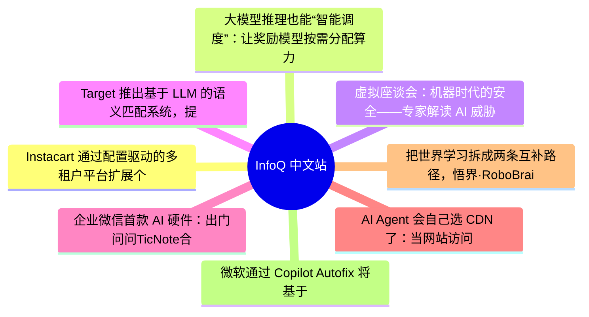

# 📰 InfoQ 中文站 Top 8 (2026-07-08)

## 思维导图

## 列表（8 条，3 条含全文）

### 1. Instacart 通过配置驱动的多租户平台扩展个性化营销
- **链接**: [https://www.infoq.cn/article/j3LVKbadKyeA1FZdpDyH?utm_source=rss&utm_medium=article](https://www.infoq.cn/article/j3LVKbadKyeA1FZdpDyH?utm_source=rss&utm_medium=article)
- **发布**: Wed, 08 Jul 2026 12:00:00 GMT
- **简介**: 点击查看原文>

📄 全文（1783 字符，点击展开）

Instacart 的工程师[介绍](https://tech.instacart.com/scaling-personalized-marketing-for-multi-tenant-commerce-platforms-816f0c6a046b)了他们如何重新设计其个性化营销系统。该系统采用配置驱动的多租户架构，旨在支持其电商平台上的数百个零售品牌，使零售商能够开展个性化营销活动，而不需要针对每个租户进行单独部署，从而取代了此前针对各零售商定制的营销系统。

Instacart 报告称，各零售商的配送成功率达到 99.9%；而得益于此次重新设计中配置层与执行层的分离，模板更新从配置变更同步到生产环境的时间现在只需不到一分钟。

Storefront Pro 构建在 Instacart Marketplace 之上，后者提供了支撑面向零售商商务体验的核心商业基础设施。随着 Storefront Pro 在数百个零售品牌中的采用率不断提高，针对每个零售商的活动定义、受众定位和执行逻辑均需单独实现，这增加了运营复杂性，并且需要反复投入工程资源在不同的租户间复制类似的功能。此外，由于各零售商的实现方式各不相同，所以协调跨零售商的变更也变得越来越困难。

为了解决这一问题，Instacart 推出了一套基于共享商业基础设施的集中式营销平台。该平台将营销活动执行整合到了一个共享系统中，同时通过结构化配置（而非代码）来体现各租户特有的行为。这使得单个执行模型能够支持多家零售商，同时还可以在定义的平台边界内保持可控的差异性。

该架构采用多租户模型，其中的共享营销活动引擎负责处理所有零售商的配置定义。各零售商通过结构化配置来定义营销活动行为，而这些配置由执行层在运行时进行评估。营销活动功能只需部署一次，即可供所有 Storefront Pro 零售商使用，不需要针对每个租户去更改集成，从而在保持扩展可控的同时减少了重复工作。

基于配置驱动的个性化多租户营销活动执行模型（图片来源：[Instacart 博文](https://tech.instacart.com/scaling-personalized-marketing-for-multi-tenant-commerce-platforms-816f0c6a046b)）

一个关键的设计约束在于在标准化与灵活性之间取得平衡。共享的多租户平台降低了运营复杂性，而基于配置的可扩展性则在统一的执行模型内为租户特定的行为提供了可控的机制。在数据层和执行层均强制实施租户隔离，这可以确保在共享系统上运行的各零售商之间保持分离。

该架构将营销活动配置、受众评估、信息生成和投放划分为不同的处理阶段。这种模块分离使得各组件能够独立演进，当单个功能发生变化时无需对整个系统进行重新设计，从而提高了系统的长期可维护性。

该平台支持利用运行时信号对营销活动行为进行迭代优化。目前正在评估的一个方向是利用早期营销活动的表现数据来调整正在进行的活动执行策略，包括在活动进行期间比较不同变体的表现，并根据观察到的互动信号来调整邮件主题行或创意变体等信息元素。

该系统还支持针对自动化内容生成工作流进行实验，包括生成符合零售商品牌规范的主题行、根据以往的营销活动表现推荐文案变体，以及在营销活动启动前评估潜在的改进方案。这些功能主要是作为辅助决策组件，而非取代营销人员的决策。

共享营销平台中的营销活动生命周期与个性化执行流程（图片来源：[Instacart 博文](https://tech.instacart.com/scaling-personalized-marketing-for-multi-tenant-commerce-platforms-816f0c6a046b)）

事件驱动架构将交付渠道抽象化，然后整合到统一的执行管道中，从而在现有的配置之外支持更多的消息传递渠道。该设计还支持未来的功能扩展，例如协调电子邮件、推送通知和短信等消息传递方式，以及根据用户层面的互动模式优化消息发送时机。

通过从针对特定零售商的实施模式转向基于共享配置的多租户模型，Instacart 不仅减少了重复工作、提高了运营一致性，还使其营销生态系统能够更快地进行迭代，同时仍然能够保持受控的租户级定制化。

### 2. 大模型推理也能“智能调度”：让奖励模型按需分配算力的动态路由机制 | ACL 2026
- **链接**: [https://www.infoq.cn/article/qYcpkTcUhClJvytSbLu1?utm_source=rss&utm_medium=article](https://www.infoq.cn/article/qYcpkTcUhClJvytSbLu1?utm_source=rss&utm_medium=article)
- **发布**: Wed, 08 Jul 2026 11:19:41 GMT
- **简介**: 点击查看原文>

📄 全文（4021 字符，点击展开）

生成式奖励模型（GRM）通过思维链（CoT）显著提升了奖励信号的质量，但其“一刀切”的推理策略让简单样本和复杂样本消耗同等计算资源，导致显著的算力浪费。腾讯混元与新南威尔士大学联合提出的 E-GRM（Efficient Generative Reward Modeling）框架，将**模型自身的不确定性**重新定义为计算资源的调度信号，仅对真正困难的样本投入完整 CoT 推理，对其余样本走短路径直接输出。本文从问题背景、动态路由机制、判别式评分器到训练与实验四个维度对该框架进行系统解读。

论文题目：Reason Only When Needed: Efficient Generative Reward Modeling via Model-Internal Uncertainty

收录会议：ACL 2026

arXiv 链接：https://arxiv.org/abs/2604.10072

## 问题背景与动机

#### 1.1 静态推理：GRM 绕不开的效率瓶颈

奖励模型是 RLHF 流程的核心组件，为策略模型的候选响应提供质量信号。从标量奖励模型到生成式奖励模型（GRM），推理链的引入显著提升了奖励信号的可解释性与判别能力，但也带来了固有的效率问题：

1. **资源同质化**：无论是“这句话是否安全”的简单判断，还是“证明这道数学题”的复杂推理，GRM 都执行相同深度的 CoT 生成，简单样本被迫消耗与复杂样本相同的 FLOPs。

2. **投票机制信息损失**：传统 GRM 从 K 条推理链中通过多数投票决定答案，这种离散决策无法区分“推理过程正确”与“”恰好蒙对答案“”，奖励信号噪声较大。

#### 1.2 E-GRM 的核心洞察：把不确定性变成调度信号

E-GRM 的核心观察是：**模型的解码行为隐含着问题复杂度的信息**。对同一输入多次解码，若输出高度一致，说明模型已有充分把握，再追加 CoT 只是冗余计算；若输出高度分散，则说明问题超出了模型的“直觉”，需要深度思考。基于这一观察，E-GRM 将不确定性从传统意义上“需要规避的风险信号”重新定义为“可被利用的计算资源调度信号”，构建了**先快速判断、再按需投入**的智能路由框架。

## E-GRM 方法论：动态路由视角

#### 2.1 共识度：路由决策的核心指标

给定输入 ，E-GRM 首先执行 次并行解码（，使用不同采样温度与 top-p 参数），得到初始响应集合 。共识度定义为：

其中 Count（y） 是答案 y 出现的次数。共识度值域 【1/M,1】，1.0 表示所有解码完全一致，接近 0 表示高度发散。这一指标具备三个优良性质：取值有界、计算成本极低（仅多解码 4 次）、且与问题难度呈强单调关系。

#### 2.2 动态路由：基于阈值的二元决策

基于共识度，E-GRM 执行二元路由决策：

• **短路径**：直接输出共识答案 ，完全跳过 CoT 生成，计算成本仅为完整流程的 15-20%。

• **长路径**：触发 K 条 CoT 链生成、判别式评分、最优选择的完整推理流程。

阈值 τ=0.8 经过网格搜索确定，在 MATH 数据集上恰好对应准确率陡降点之前，实现效率与精度的帕累托最优。

#### 2.3 并行解码的工程实现

为压低路由决策本身的开销，E-GRM 将 5 次解码组织在同一 GPU 批次内并行执行，借助张量核心的并行能力将额外延迟控制在 5%以内；同时通过差异化采样参数（温度{0.7, 0.8, 0.9, 1.0, 1.1}）保证多样性，避免参数同质化造成的“伪共识”。

#### 2.4 判别式评分器：替代投票的连续质量信号

进入长路径后，E-GRM 生成 K 条候选推理链，使用判别式评分器 SΦ 替代传统投票机制，输出连续分数 q=SΦ（x，r）∈（0，1）。评分器基于 BERT 编码器，将提示和推理链通过 [SEP] 拼接后编码，从 [CLS] 位置经线性层映射到分数，参数量约 1 亿。

评分器采用混合损失训练：

Huber 损失在小偏差时二次惩罚、大偏差时线性惩罚，兼具精细调优与抗噪声能力；铰链损失仅在正负样本分差不足时产生梯度，自动聚焦难例。 优先保证回归精度。

#### 2.5 Huber 损失的数学形式

Huber 损失分段函数定义为：

当预测误差小于阈值 δ=0.1 时使用 L2 损失提供精细梯度；超过阈值时切换为 L1 损失，防止异常标签产生过大梯度，保障训练稳定性。

#### 2.6 两阶段训练体系

**SFT 阶段**：根据动态触发将训练集划分为短路径集（学习 L=-logPΘ（y|x） ）和长路径集（学习 L=-logPΘ（r，y|x） ），让模型同时具备“”快答“”与“”慢思考“”能力。

**扩展 GRPO 阶段**：在标准 GRPO 基础上引入成对对比奖励：

优化目标：

其中 β=0.3 平衡离散答案正确性与连续推理质量。

*图 1：E-GRM 的完整框架，涵盖从动态不确定性的量化到判别式评分器的整体流程。*

*图 2：Coupled-GRPO 的成对偏好奖励机制，使用评分器差值作为质量对比信号。*

*图 3：E-GRM 训练与推理完整流程。*

## 实验评估

#### 3.1 核心效率指标

在 MATH 数据集上，E-GRM 的路由分布与传统 GRM 形成鲜明对比：58%的样本进入短路径直接输出；延迟从 3.8 秒降至 2.2 秒（-62%）；FLOPs 从 23.7T 降至 15.7T（-49%）；准确率从 75.1%提升至 78.4%（+3.3%），呈现“”既快又准“”的双赢效果。

#### 3.2 基准测试表现

#### 3.3 消融实验

消融实验揭示出一个关键发现：完整框架的增益（9.3%）大于单独移除动态触发（-3.2%）和评分器（-5.6%）的损失之和（8.8%），说明二者存在正向协同效应。其机制是：动态触发筛选出真正需要评估的复杂样本，使评分器能聚焦最有判别价值的对象。

#### 3.4 路由质量与规模扩展

短路径样本人工抽样准确率达 94.3%，证明高共识度确实对应简单样本；长路径样本相比传统 GRM 提升约 2.3%，证明评分器有效。从 7B 到 32B，E-GRM 呈现一致的性能提升（RM-Bench: 70.1%→76.4%→79.2%），且长路径样本的精度提升（约 12%）显著大于短路径（约 5%），说明大模型优势集中在复杂推理上。

#### 3.5 完整推理管道

推理阶段流程：

(1) 对输入 x 执行 M 次并行解码；

(2) 计算共识度并做出路由决策；

(3) 短路径直接输出共识答案；

(4) 长路径生成 K 条 CoT；

(5) 评分器对每条链打分；

(6) 选择最高分输出。

## 贡献与局限

#### 4.1 核心贡献

1. 首次将模型内部不确定性从“风险信号”拓展为“计算资源调度信号”，开创了按需推理的新范式。

2. 混合损失评分器在校准性与区分度之间取得最优平衡，连续质量信号替代离散投票。

3. 统一的动态触发+评分+优化框架，对模型规模与任务类型保持稳定增益。

#### 4.2 局限与展望

1. 并行解码引入约 5%固定延迟，在极低延迟场景仍需进一步优化。

2. 固定阈值 在专业领域可能需要自适应校准。

3. 评分器在分布外推理风格上的泛化性有待验证。

## 结 语

E-GRM 通过“共识度”这一简洁信号，实现了延迟降低 62%的同时精度提升 3.3%，验证了“减少不必要的推理”这一效率优化思路的有效性。动态路由机制让奖励模型第一次真正实现了“智能分配算力”，为大模型的高效部署提供了可复用的方法论模板，有望在 RLHF 推理系统中产生持续影响。

## 延伸思考

#### 6.1 动态路由的范式转换意义

E-GRM 将“动态计算分配”这一在视觉领域（如 Mixture-of-Experts、Conditional Computation）已经成熟的思想，首次系统化地引入到奖励建模领域。这一引入不是简单的技术迁移，而是将“模型自身的不确定性”作为路由信号——这是 E-GRM 最具原创性的贡献。

#### 6.2 智能资源分配的未来空间

未来的 LLM 推理系统将不再是“一刀切”的等长推理，而是根据问题难度、用户场景、SLA 要求动态分配计算资源。E-GRM 的动态路由是这一未来方向的早期里程碑，其设计思路（共识度信号+二元路由+评分器评估）有望成为通用模板。

**图表附录：**

*附图 1：Coupled-GRPO 中配对奖励函数公式。*

*附图 2：扩展 GRPO 优化目标公式。*

参考文献：

Xue, C., Wang, Y., Liu, M., Zhang, H., Chen, K., Li, X., et al. (2026). Reason Only When Needed: Efficient Generative Reward Modeling via Model-Internal Uncertainty Estimation and Dynamic Routing Mechanisms. *Proceedings of the 64th Annual Meeting of the Association for Computational Linguistics (ACL 2026)*, Main Conference Track, 

...（截断，原文 4257+ 字符）

### 3. 虚拟座谈会：机器时代的安全——专家解读 AI 威胁的演变
- **链接**: [https://www.infoq.cn/article/LhZ4t3N4yxTm3ISZvUp5?utm_source=rss&utm_medium=article](https://www.infoq.cn/article/LhZ4t3N4yxTm3ISZvUp5?utm_source=rss&utm_medium=article)
- **发布**: Wed, 08 Jul 2026 10:22:00 GMT
- **简介**: 点击查看原文>

📄 全文（4022 字符，点击展开）

## 引言

威胁行为者正在利用人工智能（AI）发起新一代的复杂攻击。我们观察到，某些对抗性机器学习技术正在改变模型的行为方式。此外，还有由生成式 AI 驱动的高度个性化的社会工程学攻击活动。最后，还存在能够实时演变的自适应威胁。与传统防御系统相比，AI 驱动的攻击方法速度更快、规模更大。这种日益加剧的威胁，正对我们关于如何检测和防范威胁的基本理念构成挑战。

这些发展迫使我们从根本性上重新思考网络安全战略。传统的事件响应手册在应对 AI 系统时往往力不从心。这些系统可能表现得难以预测，并展现出新的、意想不到的行为。如今，各组织必须制定新的取证方法、专门的监控工具和灵活的响应策略。这些方法对于应对 AI 驱动的不断变化的安全事件至关重要。

随着组织迅速采用 AI 系统，安全工程师必须转变角色。这种转变需要新的技能、方法和战略思维。本次虚拟座谈会汇聚了业界顶尖的实践者，共同探讨了 AI 威胁的演变趋势。他们还审视了传统安全方法的局限性，以及抵御未来攻击所需的关键技能。

## 虚拟座谈会成员：

- Elham Arshad：网络安全专家 | Trentino Digitale 公司 AI 驱动安全解决方案专家 
- Sabri Allani：博士 | Expleo 集团 AI 与网络安全顾问 
- Vijay Dilwale：UltraViolet Cyber 公司首席安全顾问 
- Igor Maljkovic：意大利热那亚大学 AI 安全博士后研究员 

InfoQ：在 AI 时代，要成为一名安全工程师需要掌握哪些技能？

Elham Arshad：安全说到底就是保护我们的数据和系统免受攻击者的侵害，这始终是一场试图入侵者与试图阻止入侵者之间的拉锯战。有句谚语说：“要战胜狮子，你必须成为狮子。”同样的道理也适用于这里：保护现代系统需要具备与针对它们的威胁同样先进的工具和专业知识。

在 AI 领域，这种日益增长的防御需求表现得尤为明显。AI 系统建立在数据的基础上，而传统的安全则围绕 CIA 三要素（保密性、完整性和可用性）来保护数据。但一旦 AI 介入，安全格局便变得更加复杂。模型可能会受到影响、被欺骗或被滥用，其影响范围远远超出传统软件漏洞的范畴。

正因如此，在 AI 时代，要成为一名安全工程师，仅具备网络安全的基础知识已经远远不够。你还需要切实了解机器学习的运作原理、模型的训练方式、大型语言模型（LLM）的行为模式、提示词调优或微调如何影响输出结果，以及数据管道如何影响模型性能。编程技能、机器学习算法以及数据科学的概念正在变得至关重要。

除此之外，现代 AI 安全专家还需要了解以下内容：

- 模型行为和故障模式，例如 AI 系统如何发生漂移、产生幻觉或被误导。

- 数据治理，确保训练数据安全、干净且未受恶意篡改。

- 针对 AI 的特定威胁，例如模型提取、数据中毒和提示词操纵。

Sabri Allani：安全工程师需要将工作范围从“代码和基础设施安全”扩展到“数据、模型和代理安全”。最重要的技能包括：

- AI 威胁建模（模型、数据、提示词/代理攻击面、供应链及运行时行为）。

- 数据安全与完整性（数据溯源、抗毒能力、安全标注管道、访问控制、可审计性）。

- 大型语言模型（LLM）/智能体攻击素养（提示词注入、工具滥用、通过文档进行的间接注入、模型提取风险、越狱模式）。

- 针对 RAG/代理的“安全设计”（工具的最小权限原则、检索范围控制、策略执行、安全的工具执行模式）。

- 针对 AI 系统量身定制的评估与红队测试（安全/保障测试套件、对抗性测试、行为回归测试）。

- AI 服务的可观测性与取证分析（提示词/响应的遥测数据、工具调用日志、检索轨迹、漂移检测）。

- 治理与风险管理（基于 NIST AI RMF / ISO/IEC 42001 的理念、可量化的控制措施、问责机制）。

Vijay Dilwale：最大的转变在于，从保障确定性软件的安全转向保障概率性系统的安全。你不必是机器学习（ML）专家，但你确实需要了解 AI 系统在实际应用中会因提示注入、间接提示注入、数据中毒、模型漂移、检索增强生成（RAG）滥用以及不安全的工具或代理访问等问题而发生故障。

这种理解并非停留在理论层面。这需要有意识地破坏系统，尝试不同的提示词，向检索源中植入恶意内容，并观察当上下文或权限发生变化时，系统行为会如何改变。例如，对于基于 RAG 的系统，仅仅询问“模型是否安全？”是不够的，还必须探究当攻击者控制或影响被检索的文档时会发生什么，以及模型是否会将该内容视为指令或事实。

在大多数实际部署中，模型本身并不是问题。真正的风险在于模型如何与数据、身份识别和自动化系统相连接，以及这些连接随着时间的推移有多容易被滥用。最重要的技能并非掌握某个新框架，而是学会以对抗性思维来审视那些会随着时间推移而学习和变化的系统，而不仅仅是执行固定逻辑的应用程序。这种思维方式的转变正是 AI 安全的基础。

Igor Maljkovic：首先，基本原则依然至关重要。AI 安全工程师必须培养扎实的网络安全思维。其核心逻辑始终如一：攻击者会寻找系统中的漏洞以绕过防护措施并达成目的，而防御者则必须采取主动且以攻击者的视角来思考，预判滥用行为，并随着技术的发展不断调整策略。从这个意义上说， AI 安全在很大程度上继承了传统安全领域中的“蓝队”与“红队”思维。

与此同时，AI 系统也带来了新的故障模式。故障模式的增加使得对系统的端到端理解变得至关重要。不仅要理解模型本身，还要了解数据的采集方式、模型的训练方式、部署方式、系统的监控方式，以及人类随着时间的推移如何与系统交互。AI 安全问题往往源于这些环节之间的连接方式，而非孤立的单一组件。因此，大多数 AI 安全故障都发生在组件之间的边界上，而这些边界往往是信任与责任假设最容易崩溃的地方。例如，提示注入并非模型本身的缺陷，而是发生在不可信用户输入与系统级指令边界上的故障。当用户的自然语言输入被视为可信上下文时，攻击者便能构造输入来覆盖预期行为、操纵推理过程，或将模型引导至非预期的行动。同样，数据中毒通常发生在模型之外，即外部数据源与训练管道的接口处。在那里，经过篡改的数据在未经充分验证的情况下就被纳入了系统。

工程技能同样至关重要。一名 AI 安全工程师必须能够将抽象的风险转化为具体的解决方案，从问题定义到实施落地。这种对多重技能的需求包括扎实的编码能力、熟悉生产环境，以及在现实约束条件下设计、构建、部署和维护安全机制的能力。

另一项关键技能是阅读、解读并分析前沿科学文献的能力。AI 安全领域发展迅速，工程师必须能够从关于新型攻击、防御和评估方法的研究中提炼出实用的见解，并评估哪些技术已经足够成熟，可以在实际场景中使用。

软技能至关重要。对于阐释复杂风险、理解系统和业务需求、与机器学习工程师及产品团队协作，以及向决策者明确说明安全方面的权衡取舍而言，清晰的沟通和积极倾听至关重要。

最后，对 AI 及其底层数学基础的深刻理解必不可少。安全工程师若不理解 AI 系统，就无法有效地保障其安全。例如，如果不了解 Transformer 架构、注意力机制或训练动态，就很难对大型语言模型进行防护，也难以分析诸如“幻觉”、提示词敏感性或信息泄露等故障模式。虽然通常来说，这些知识被归类为“理论”，但在实践中却是一项关键技能，因为它能让工程师预判风险、解读模型行为、评估防护措施，并区分架构限制与实现缺陷。

InfoQ：目前最具破坏性的 AI 攻击是什么？

Elham Arshad：我们可以从两个简单的角度来思考与 AI 相关的攻击。

首先，从 AI 的安全性角度来看，随着许多组织采用 AI 实现自动化和决策，AI 带来了新的攻击面，并成为比较简单的攻击目标，因为目前尚无具体的策略或指南来增强 AI 系统的安全性。

其次，在 AI 驱动的攻击中，攻击者如今利用 AI 使攻击更智能、更快，且更难被发现。AI 能能够自动实施网络钓鱼攻击，制造现代网络威胁，并发现零日漏洞。

如果将这两类攻击进行比较，目前，第一类在现实环境中更为普遍，相关记录也更为详尽。越来越多的研究、案例和安全报告表明，当 AI 模型的输入、训练数据或周围环境遭到篡改时，这些模型会变得非常脆弱。这类攻击直接威胁到 AI 系统所依赖的数据机密性和完整性，对于将 AI 集成到工作流程中的任何组织而言，都可能造成严重的后果。

如果我们看具体案例，提示词操纵、提示词注入和越狱是其中最常见且最令人担忧的攻击方式。它们都是同时针对机密性和完整性。攻击者实施这些攻击相对比较容易，通常只需要精心构造的文本或内容即可。与利用软件漏洞的传统网络攻击不同，这些聚焦 AI 的攻击利用了模型的行为、推理模式以及对输入数据的信任。由于 AI 工具经常与网页、文档和用户消息等外部内容进行交互，它们可能会在无人察觉的情况下受到恶意指令的侵害。

这些攻击发生的概率高于许多其他与 AI 相关的威胁，原因很简单：其门槛比较低，而且攻击面广泛。其潜在影响可能更为严重。一旦攻击者影响了模型的响应或决策，这种影响就会像多米诺骨牌一样波及下游系统、自动化流程或人类决策过程。

Sabri Allani：如今，当我们谈论“最具破坏性的 AI 攻击”时，我认为危害最大的类别是由 AI 增强的大规模社会工程学攻击。原因很简单：由 AI 增强的社会工程学攻击总能突破“人类防线”，而 AI 使其既高度个性化，又具备大规模可扩展性。攻击者可以结合开源情报（OSINT）和泄露的数据（例如组织

...（截断，原文 13588+ 字符）

### 4. Target 推出基于 LLM 的语义匹配系统，提升营销预测流程效率
- **链接**: [https://www.infoq.cn/article/cEfBc7qdIDe3ZVFDyjS5?utm_source=rss&utm_medium=article](https://www.infoq.cn/article/cEfBc7qdIDe3ZVFDyjS5?utm_source=rss&utm_medium=article)
- **发布**: Wed, 08 Jul 2026 09:09:33 GMT
- **简介**: 点击查看原文>

### 5. 企业微信首款 AI 硬件：出门问问TicNote合作款正式发布
- **链接**: [https://www.infoq.cn/article/CiwPd7c4oYfzqBGMbotV?utm_source=rss&utm_medium=article](https://www.infoq.cn/article/CiwPd7c4oYfzqBGMbotV?utm_source=rss&utm_medium=article)
- **发布**: Tue, 07 Jul 2026 23:00:00 GMT
- **简介**: 点击查看原文>

### 6. AI Agent 会自己选 CDN 了：当网站访问者从 “人” 扩展到 “AI”，内容分发已升级
- **链接**: [https://www.infoq.cn/article/WNWuMomRvix0FT0dZ8yI?utm_source=rss&utm_medium=article](https://www.infoq.cn/article/WNWuMomRvix0FT0dZ8yI?utm_source=rss&utm_medium=article)
- **发布**: Tue, 07 Jul 2026 19:02:25 GMT
- **简介**: 点击查看原文>

### 7. 把世界学习拆成两条互补路径，悟界·RoboBrain Orca 成通用世界基础模型基石
- **链接**: [https://www.infoq.cn/article/HpkpCVSwAHQXAhphZm34?utm_source=rss&utm_medium=article](https://www.infoq.cn/article/HpkpCVSwAHQXAhphZm34?utm_source=rss&utm_medium=article)
- **发布**: Tue, 07 Jul 2026 17:41:52 GMT
- **简介**: 点击查看原文>

### 8. 微软通过 Copilot Autofix 将基于 AI 的漏洞修复功能引入 Azure DevOps
- **链接**: [https://www.infoq.cn/article/CSS70hYSA57JBUMLdf7L?utm_source=rss&utm_medium=article](https://www.infoq.cn/article/CSS70hYSA57JBUMLdf7L?utm_source=rss&utm_medium=article)
- **发布**: Tue, 07 Jul 2026 17:23:00 GMT
- **简介**: 点击查看原文>
