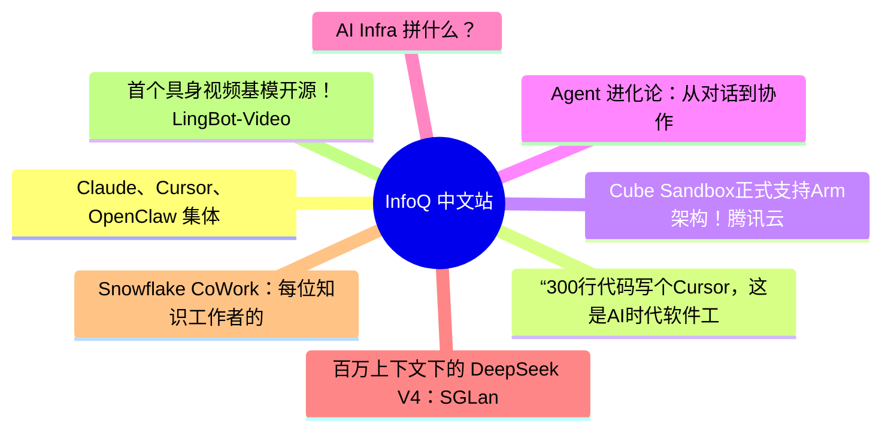

# 📰 InfoQ 中文站 Top 8 (2026-07-10)

## 思维导图

## 列表（8 条，3 条含全文）

### 1. Claude、Cursor、OpenClaw 集体上手机，不摸鱼、不请假、24h 为你打工
- **链接**: [https://www.infoq.cn/article/77YytRGDYm7T9ovQKaW9?utm_source=rss&utm_medium=article](https://www.infoq.cn/article/77YytRGDYm7T9ovQKaW9?utm_source=rss&utm_medium=article)
- **发布**: Wed, 08 Jul 2026 18:48:51 GMT
- **简介**: 点击查看原文>

📄 全文（4021 字符，点击展开）

7 月 7 日，Anthropic 宣布，Claude Cowork 开始向网页端和移动端扩展。首批开放对象为 Claude Max 用户，随后数周将覆盖更多订阅计划。

新的 Cowork 会将会话和文件保存在 Claude 账户中，并通过远程环境运行：即使用户合上电脑，任务也能继续执行；定时任务不再要求任何设备保持在线。

Anthropic 在官方介绍中给出的场景很直接：用户可以在办公桌前向 Claude 交代任务，离开电脑后在手机上继续查看。如果 Claude 遇到需要人类判断的问题，通知会发送到手机，用户完成决策后，Agent 再继续工作。

Anthropic 同时强调，邮件发送、文件交付等最终动作仍需用户审查和批准。

这意味着，Claude 移动端的定位正在改变。

手机不再只是 Claude 的另一个聊天窗口，而开始成为管理 Claude 工作的控制台。

## Claude Cowork 移动、网页端即将上线

Cowork 最初更像是“面向非程序员的 Claude Code”：用户可以把文件、资料和任务交给 Claude，让它制定计划并持续执行，而不是停留在一次问答中。

2026 年 4 月，Claude Cowork 已经在 macOS 和 Windows 桌面应用中全面上线。此次进入网页和移动端后，Cowork 最关键的变化并不是屏幕变小了，而是执行环境从用户电脑迁移到了远程基础设施。

Anthropic 表示，Cowork 可以跨越文件、日历、邮件、通信工具、网页以及其他已连接的应用完成任务。用户可以让它核对季度支出、整理合同续约风险、根据会议记录和销售数据制作客户材料，或者在每天清晨自动准备工作简报。

Anthropic 对 2026 年 5 月部分 Cowork 会话的分析显示，超过 90%的使用场景并非软件开发，其中业务运营和内容创作两类任务合计占到全部使用量的大约一半。换句话说，Cowork 的核心用户正在从程序员扩展到财务、运营、销售、咨询和内容工作者。

这也是移动端变得必要的原因。

当 AI 处理的是一次性的文案润色，电脑或手机没有本质区别，但当任务需要持续几十分钟甚至数小时，并且要横跨邮件、日历、文件和企业应用时，用户不可能始终停留在一个聊天窗口里等待。

Agent 必须能够在后台工作，而人只在关键节点出现。

Anthropic 在 X 上对这次更新的概括是：“在办公桌前把任务交给 Claude，再从手机上接收已经完成的工作。”

参与 Cowork 开发的 Anthropic 工程师 Felix Rieseberg 在 x 上兴奋地表示，“这是 Cowork 的一次‘重大更新’，因为 Claude 终于可以在电脑关闭后继续运行。”

不过，目前桌面端仍然是功能最完整的 Cowork 入口。

Anthropic 表示，本地文件和浏览器访问等能力仍以桌面版本为主。网页和移动端解决的主要问题，是任务的连续运行、跨设备接力以及远程审批，而不是完全取代桌面工作环境。

## Cursor 和“龙虾”，也在把手机变成“Agent 遥控器”

Claude Cowork 并不是第一个走向手机的 Agent 产品，在它出来之前，行业里已经有了先行者。

6 月 30 日，Cursor 推出了原生 iOS 应用公开测试版，向所有付费用户开放。用户可以在手机上选择代码仓库、启动云端 Agent，也可以远程控制仍在自己电脑上运行的 Agent。

Cursor 对移动端的设计同样不是“在手机上写代码”。

Agent 启动后，用户可以直接退出应用。任务完成、需要补充信息或等待审查时，Cursor 会通过锁屏实时活动和推送通知提醒用户。开发者可以在手机上查看代码差异、运行日志、截图和演示结果，继续下达指令，甚至直接合并 Pull Request。

Cursor 的云端 Agent 运行在独立虚拟机中，拥有完整的开发环境，可以安装依赖、运行测试并持续迭代。Cursor 将这种工作方式描述为“异步”：Agent 在后台长时间工作，人类主要负责明确目标、检查结果和决定是否合并。

与 Cursor 推出移动端同一天，OpenClaw 也推出了 iOS 和 Android 应用，但采用了另一条技术路线。

OpenClaw 手机应用本身并不承载完整 Agent，而是一个“伴随节点”。

用户仍需在 macOS、Linux 或 Windows 设备上运行 OpenClaw Gateway，再将手机与 Gateway 配对。手机可以用于对话、语音控制、查看任务状态、批准操作，并在用户授权后调用摄像头、屏幕、位置和通知等设备能力。

因此，三款产品虽然都进入了移动端，背后的执行模式并不相同。

Claude Cowork 和 Cursor 更强调云端执行：任务可以脱离用户电脑继续运行；OpenClaw 则坚持本地优先，手机主要负责连接和控制用户自行运行的 Gateway。

前者降低了部署门槛，后者则给予用户更强的数据和基础设施控制权。

这种差异也引发了社区用户的广泛讨论。

在 OpenClaw 发布移动应用的 Reddit 帖子下，有用户询问：既然此前已经能通过 Telegram 操作 Agent，为什么还需要独立应用？另一名用户回答称，原生应用更接近 OpenClaw 的控制面板，也可以通过 Tailscale 等方式直接连接私人 Gateway，避免将 Agent 对话交给第三方聊天平台。

但移动端并没有自动解决 Agent 的可靠性问题。OpenClaw 的部分用户反映，升级后曾出现 WhatsApp 连接失效、消息无法回复以及既有工作流中断等问题。一名用户因此提醒，不应把仍处于测试阶段的 Agent 系统直接视作成熟的生产工具。

这揭示了 Agent 产品当前的真实状态：能力已经能够支撑“持续工作”，但稳定性、权限边界和异常恢复仍远未达到传统企业软件的水平。

## 手机成为管理后台后，真正的竞争才刚刚开始

Agent 产品进入手机，并不是一次简单的客户端扩张，而是产品形态进入了新的阶段。

第一阶段，AI 是聊天机器人。用户提出问题，模型立即回答。交互是同步的，任务通常在一个会话中结束，AI 的价值主要取决于模型能否生成更好的答案。

第二阶段，AI 进入用户的工作环境。Claude Code、Cursor 等产品开始读取代码仓库、编辑文件、运行命令和调用工具。AI 不再只是提供建议，而是直接参与执行。但在这一阶段，Agent 通常仍依附于本地终端或桌面应用，电脑关机，任务也随之停止。

第三阶段，Agent 开始脱离具体设备。随着任务迁移到云端虚拟机、远程沙箱或持续运行的 Gateway，Agent 可以异步执行更长时间的工作。用户不再需要盯着模型逐步操作，而是像向同事交代工作一样，给出目标、约束和验收标准。

移动端正是这一阶段的管理入口。

从 Cursor 和 Claude Cowork 的设计可以看到，手机界面中最重要的功能不是长文本输入框，而是任务队列、运行状态、通知、结果预览、批准按钮和继续指令。

人与 Agent 的关系也变得和以前不同了，由“提问者和回答者”逐渐变成“管理者和执行者”。

有 x 上，有网友指出，Claude Cowork 宣传中“即使电脑关闭，任务仍会继续运行”这句话，实际上点出了整个 Agent 产品正在发生的根本变化：AI 正从一个需要人类全程监督的助手，变成可以在无人值守状态下独立工作的代理。

“这不只是多了一项后台运行功能，而是人与 AI 之间建立了一套完全不同的信任关系。过去，难点主要在于 Agent 有没有能力完成任务；现在，真正棘手的问题变成了，当它遇到信息不足、指令模糊或需要权衡的情况，而用户又不在线时，它究竟应该如何判断、是否继续执行，以及在哪个节点必须停下来等待人工介入。”

另一位网友赞同了上述观点，“即使电脑已经关闭”这部分，才是真正打开局面的关键。

他表示，“一旦你不再需要全程盯着它，就会开始把过去根本不会启动的任务也排进队列。任务范围的膨胀是双向的：Agent 能做的事情变多了，人交给它的事情也会越来越多。”

还有网友表示，Claude Cowork 成为了首个无需用户本人或设备保持在线，也能把工作完成的 AI Agent。你可以把客户准备工作设定在早上 6 点执行。等你睡着后，Claude 会自行梳理会议记录、制作简报，并起草后续跟进内容。你再也不必为了处理一份涉及 1000 万美元第三季度续约业务的追踪表，让一台价值 3000 美元的笔记本电脑整夜开着。

目前，这项测试功能正面向 Claude Max 用户陆续开放，订阅价格为每月 200 美元。其他订阅计划将在未来几周内跟进。同时，Cowork 的双倍使用额度将延长至 8 月 5 日。

仅从试用价值来看，这次提供的额度相当可观。

工作会一路跟着你走，但最终的决定仍然由你来做。而笔记本电脑，可以一直合着。

在 Reddit 上，对于把实际工作交给 Agent，有用户提出了更直接的质疑。

用户 PineappleLemur 表示，如果一个系统并不能始终按照任务要求行动，那么使用它本身是否存在过高风险？与其让一个结果不够确定的 Agent 直接执行工作，为什么不先用它开发出能够稳定运行的工具？

另一名用户 EveyVendetta 则认为，这种风险仍在自己的承受范围之内，前提是不能把一切都交给 Agent 自动处理，并且必须保留备份。在他的工作流中，Claude Cod

...（截断，原文 5165+ 字符）

### 2. “300行代码写个Cursor，这是AI时代软件工程师的新底线。”Ralph Loop创造者、Claude Code核心技术设计者的暴论
- **链接**: [https://www.infoq.cn/article/d2tmcGi9Fy6PMkNGpo9y?utm_source=rss&utm_medium=article](https://www.infoq.cn/article/d2tmcGi9Fy6PMkNGpo9y?utm_source=rss&utm_medium=article)
- **发布**: Wed, 08 Jul 2026 17:15:47 GMT
- **简介**: 点击查看原文>

📄 全文（4021 字符，点击展开）

“软件开发已经死了，因为现在任何人都可以成为软件开发者。过去六个月的变化比过去三十年都多，而大多数工程师还在当 Jira 工单猴子，浑然不觉自己已经站在了悬崖边上。”

最近，Ralph Loop 的创造者 Geoffrey Huntley 在播客节目中与主持人 Hendrik Krack 展开了一场火花四溅的对话。

这套“痴呆但管用”的内存管理方法，如今已经被 Claude Code、Cursor、Copilot 等主流工具内置进去。

Ralph Loop 最早在 2025 年 7 月由 Geoffrey 提出，到 12 月前后开始在开发者社区发酵，并被 Claude Code 吸收到自己的 harness 里。它解决的问题是：当一个任务需要持续推进、反复检查、不断修正时，怎么让 agent 不要跑一轮就停下。

在原始 Ralph Loop 里，agent 会先规划、拆任务，再开启新的 session，用干净的上下文继续推进。Claude Code 后来则进一步改进了这个 Loop：它没有完全照搬这种多 session 方式，而是在单个 session 里加入循环机制，通过最大迭代次数、safe word 和 stop hook，让 Claude 在任务没完成时继续跑下去。也就是说 Ralph Loop 最重要的意义是把 coding agent 从一次性生成，推向了长时间运行。

在这次播客中，他们从“软件开发已死”的宣言聊到“K 型分化”下的职业生存法则，从 Ralph Loop 的“痴呆”设计哲学聊到代码审查的“心理折磨”。下文基于播客视频整理，经 InfoQ 编辑。

**太长不看版：**

**Q：软件开发真的"不行"了吗？那我怎么办？**

**A： **任何人用上 Cursor 都能生成代码。如果你只把自己定义为"软件开发者"，那现在人人都是了——你正在跟时薪 10.42 美元的岗位赛跑，**麦当劳做汉堡都比这高**。但"软件工程师"依然稀缺。区别在于：你能不能用 300 行代码构建一个 Coding Agent，并讲清楚它的架构？解释不清的话，你只是个"使用者"，不是"构建者"。

**我们这一行之所以最先被 AI 冲击，恰恰因为它可以被机械地验证——软件要么编译通过，要么不通过。**但模块化、数据建模、安全这些没法"一键验证"的硬核能力，才是真正的护城河。

**Q："工单猴子（ JIRA ticket monkeys）"还有转型机会吗？**

**A： **有，但窗口期很短。技术不断变化，过去六个月的变化比过去三十年都多，员工用时间和技能换钱。如果你公司禁止用 AI，这本身就是危险信号——就像当年禁止上云一样，是在把你往死路上推。

**Q：那我该重点学什么？**

**A： **三个方向优先级最高：首先是软件验证——代码生成已经免费了，但生成的东西对不对才是瓶颈。去了解 TLA+、Lean、Coq 这类定理证明器；再次是属性测试、确定性系统测试——比单元测试高一个维度；最后是类型系统更强的语言（Rust、Haskell）——无效数据根本建模不了，编译不过就拒绝幻觉，自然到不了代码审查环节。Python 和 Ruby 生成完不跑一遍你不知道会不会炸，验证成本太高。

**Q：Ralph Loop 是什么？为什么都在聊它？**

**A：** Ralph 很简单：给一个目标，用最少的上下文，让它自回归地逼近结果，这是一种“痴呆”技术。最喜欢的用例是把一个开源项目从一种语言自动移植到另一种语言。比如.NET，转变成 Rust。但记住： Python、Rust、Go、TS 是"被祝福"的语言，而 Ruby、Java、.NET、Kotlin，前沿实验室根本不会自己内部去用这些。

**Q：我该从哪开始？最紧急的一步是什么？**

**A： 如果你不能在几个小时内重建 Cursor，你下次面试会非常艰难，因为那只是 300 行代码的一个 while 循环。**

**以下是原文：**

## 软件开发已死

**Geoffrey：**软件开发已经死了（*译者注*：Geoffrey 在自己介绍这个 Loop 的博客里曾说过：“软件开发已死——是我亲手毁了它”），因为现在任何人都可以成为软件开发者，产品经理们也能直接“吐出”代码来。但你得区分清楚：你是“写代码的人（coder）”，还是“软件工程师（software engineer）”，这两者之间有天壤之别。很多人一直只是在蒙混过关，把编程等同于敲键盘，现在这部分工作已经被取代了。任何人只要用上 Cursor 或类似的工具，就能生成代码。而如果你把自己定义为“软件开发者（software developer）”，恭喜你，现在人人都是软件开发者了。你正在跟一个时薪只有 10.42 美元的岗位赛跑，拜托，在麦当劳做汉堡的时薪都比这高。

计算机一直以来都是有门槛的，你要么是那个学会让计算机“可塑”的人，学编程、学如何塑造它、让它服从你的意志，要么你就只能乖乖用别人给你的用户界面。过去 30 年里，绝大多数人都是后者。但现在，这个局面被彻底翻转了。他们现在拥有了让计算机变得可塑的能力，他们现在也是“软件开发者”了，但这绝不意味着他们是“软件工程师”。

**Hendrik：对我们这些过去一直深陷在“写代码”这件事里的软件开发者来说，还剩下什么可做的？**

**Geoffrey：**如果你能称自己为“高级软件开发者”或“高级软件工程师”，那我问你：你能不能只用 300 行代码就给我构建一个 Coding Agent？能不能在白板上画出来，讲清楚它的架构？如果你根本解释不清这东西是怎么工作的，你只是一个消费者。

剩下可做的其实还有很多。软件模块化（modularity）、抽象（abstractions）、思考数据和数据库非常重要，身份验证、安全依然很难。但任何人都能随手生成东西了，这确实改变了游戏规则。对于那些还在纠结“我到底还有没有工作”的人，如果你保持好奇心，你就有工作。如果你在过去两年里没有保持好奇心，你就是可替代的。

## K 型分化

**Hendrik：你昨天发表了一个关于“K 型分化”（K-shape）的演讲，我们正处在一条分岔路上，大家应该注意什么？**

*译者注：K 型分化，是 Geoffrey Huntley 在 AI:Engineer Miami 大会演讲中抛出的概念。如图所示，往右上角走的是模型优先公司，往右下角走的是还在抗拒 AI 的传统大公司。模型优先公司就像顶级掠食者，它们在潜空间中构建，人更少，可以像经典的初创公司那样更灵活。传统公司，通常不会担心初创公司，因为初创公司要花很长时间才能进入市场来攻击它。但在 K 型分化的概念中，随着模型、工作流、实践变得更好，运营得更精简，会得到“坡上加坡”的加速效应，时间线将被加速、被压缩。模型优先公司的收入数字，是指数级的，可以在利润率上碾压。*

*参考链接：**https://www.youtube.com/watch?v=7Pkwv353DeI*

**Geoffrey：**如果你的公司商业模式是 SaaS，按人头收费，你要明白，没有人知道未来会怎样，包括我自己。任何声称自己百分百确定未来走向的人，都是在吹牛。但我们百分百确定的是，现在完成同样的事情，你绝对需要更少的人。而如果你的公司靠向客户收费赚钱，那些客户也需要更少的人，那么你的收入基线就会变得非常不稳定，我们管这叫“遗留 SaaS”（legacy SaaS）。从财务角度来看，变化的不仅仅是我们的职业，整个单位经济模型已经变了。

现在创始人正在思考新的单位经济模型，比如，你能不能按“动作（action）”收费，而不是按人头收费？假设我们现在做的这期视频要被转录，你可以按转录次数收费，而不是按你的音视频团队有多少人来收费，或者按存储录像的每 GB 容量来收费，基于使用量的定价（utility-based pricing）正在成为新的趋势。

当我们进入 K 型分化时，公司需要两到三年时间来完成人员转型，搞清楚如何用 AI，甚至先要搞清楚 AI 对它们到底有没有用，很多公司正在强迫 AI 做它做不到的事。

与此同时，有一类新兴公司，它们只有五到十个人，正在顺着 AI 的趋势构建产品，它们天生就是 AI native 公司。

**Hendrik：我看到的未来是，我们会拥有更多的创业公司。我们现在有能力探索更多事情，构建更多东西。你觉得我们必须为一个拥有更多小公司、但每个公司规模更小的世界做好准备吗？**

**Geoffrey：**这就要说到杰文斯悖论（Jevons Paradox）了。我认为软件开发者数量会爆炸性增长，因为现在人人都能当软件开发者。所以，软件工程师或开发者需要找到自己的区分度。软件开发本质上已经变得免费了，不过是些 token，而 token 比人便宜。但接下来往哪儿走？

现在创业比历史上任何时候都简单。但问题在于，不是每个人都适合当企业家，大多数软件工程师甚至不知道什么是产品工程师（product engineer）。如果他们不懂产品思维，就不可能成为好的创业者。这里有一个结构性障碍：如果你在一家遵循“丰田式 Spotify 敏捷流程”的公司工作，产品经理负责所有客户研究，工程师只负责给 Jira 工单估点数、写代码，如果你只是个“Jira 工单猴子（JIRA ticket monkeys）”，那你完蛋了。产品经理也一样，如果产品经理还在试图说服别人该建什么，他们也完蛋了，

...（截断，原文 9972+ 字符）

### 3. Cube Sandbox正式支持Arm架构！腾讯云与Arm联手解锁Agent多架构算力
- **链接**: [https://www.infoq.cn/article/c4GEoZLWvNZQhSSSWAoH?utm_source=rss&utm_medium=article](https://www.infoq.cn/article/c4GEoZLWvNZQhSSSWAoH?utm_source=rss&utm_medium=article)
- **发布**: Wed, 08 Jul 2026 16:00:00 GMT
- **简介**: 点击查看原文>

📄 全文（4021 字符，点击展开）

7 月 3 日，由腾讯云开源的 AI Agent 安全沙箱 Cube Sandbox v0.5.0 正式发布。

作为专为 LLM 应用设计的硬件级隔离运行底座，v0.5.0 此次面向生产环境进行了关键升级，围绕“稳、省、广”补齐了多项能力；其中，Arm 架构原生支持作为核心特性之一，已在 Arm 工程团队的重点投入下合入开源主线。（V0.5.0 详情可见：[Cube v0.5.0发布：自动暂停· Arm 支持·一键集群部署，把沙箱送进生产](https://mp.weixin.qq.com/s/vG-u-cx_DCOC-D0pQkj6jg)）开发者现在可以在 AArch64 服务器上，实现从原生构建、部署、启动到运行典型沙箱负载的完整流程。

据悉，为打通从底层构建到运行时的关键路径，腾讯云 IaaS 前沿技术团队与 Arm 工程团队开展了为期数月的深度联合研发，重点攻克 AArch64 构建、Guest Kernel、运行环境及部署链路等关键目标。

随着算力供给加速迈向“x86 + Arm”多架构并存，行业亟需 Agent 运行底座突破传统架构边界。v0.5.0 将沙箱的核心隔离能力扩展至 Arm 生态，不仅是生产级交付能力的提升，更为横跨云、边、端多元异构场景下的 Agent 提供了可靠、灵活的运行支撑。

### 一、当算力平台走向异构

如果将"AI Agent 大规模上生产"视为对底层基建能力的一次大考，你会发现有两个变量正以肉眼可见的速度发生演变。

**首先是负载侧。**当前的 Agent 已不再是简单的一次性脚本，而是演变为数十、数百次串行或并发的工具调用。每一次调用都意味着一次沙箱的启停、一段隔离的运行以及一次结果的回收。它对底层基础设施提出了极致需求：既要有**极高的算力密度**，又要有**极快的弹性响应。**

**其次是基础设施侧。**AI 时代的算力供给正快速从单一架构走向“x86 + Arm”双轨并行。凭借 Arm Neoverse 平台在云端 AI 工作负载方面的能效和性能优势，Arm 架构正在获得行业的广泛采用。随着 Amazon Graviton、Google Cloud Axion、Microsoft Azure Cobalt 等 Arm 计算平台持续扩展，以及诸多国产 Arm 处理器快速落地部署，Arm 生态正加速发展。

** “AI 跑在 Arm 上”**已从尝鲜话题转变为**真实的预算投入**。

把这两个变量叠加在一起看，结论是清晰的：Agent 沙箱不能局限于 x86，它必须在多架构服务器环境中补齐部署能力。更进一步，它不应止步于在 Arm 上“跑通”，更要在这一平台上跑出**与 x86 同等量级、甚至更优**的性能表现。

这正是 Cube 团队与 Arm 工程团队联合研发的起点。

### 二、从“能跑”到“原生”

从 Arm 工程团队最初介入，到代码正式合入主仓库，这场联合研发历时数月。真正推动项目从“能跑”迈向“能用”的，是最后阶段的高强度打磨——仅本轮合入主线的改动，便历经二十余次提交。

这一版的交付核心在于：Cube Sandbox 已具备在 AArch64 平台上**原生部署、编译、启动和运行典型沙箱工作负载**的全链路能力，项目正式进入落地阶段。具体而言，此次更新深入到了四个关键层面：

**一是原生编译与构建。**

团队清理了散落在构建脚本、Dockerfile 及组件中的 x86/amd64 默认假设，让系统能根据目标架构正确构建与输出。为降低开发门槛，团队还特别优化了构建链路，将 Guest 内核构建配置为支持跨架构交叉编译的独立目标。也就是说，开发者在 x86 机器上就能产出 Arm 内核镜像，无需依赖 Arm 架构设备也能轻松上手。

**二是原生生态的部署。**

为了适配多元算力环境，团队打通了从部署包生成到沙箱拉起的完整链路。通过优化构建工具链，开发者现在仅需一条 docker buildx 命令，即可同时产出兼容 x86 与 Arm 的多架构镜像，让 Cube Sandbox 能够无缝融入现有的 CI/CD 流程。

**三是平滑启动。**

针对 Arm 与 x86 在底层架构上的差异，团队重构了引导路径与 I/O 逻辑。通过引入 UEFI 固件替代传统的 SeaBIOS，以及对 Hypervisor 层进行深度适配，确保了沙箱在 Arm 服务器上能够像在 x86 上一样快速、稳定地启动。

**四是原生程度的高效运行。**

双方团队跳出了传统 CPU benchmark 的视角，转而聚焦 Agent 生产环境真正关心的指标：包括优化冷启动、Snapshot 创建与回滚、高并发创建以及单机部署密度等关键能力，确保 Cube Sandbox 在 Arm 架构下不仅能“跑起来”，更能“跑得快”、“跑得稳”。

如果说“能跑”是门槛，那么“能用”才是交付给开发者的入场券。这一步的跨越，意味着开发者已能将 Cube Sandbox 真正融入生产工作流。

### 三、 如何实现跨架构

这条链路之所以极具挑战，在于 Cube Sandbox 要迁移的并非一个普通应用，而是一套面向 AI Agent 的沙箱运行体系。它既涉及外部构建和镜像产物，也涉及沙箱内部的 Guest Kernel、Guest Agent，以及更底层的虚拟化和安全隔离能力。

为了在“Agent 原生指标”上拿到极致的结果，双方团队重点解决了以下关键的技术难题：

首先，**消除对 x86 架构的依赖与硬编码假设。**

** **

很多基建项目在长期演进中，都会把 x86 当成默认环境。Cube Sandbox 迁移的第一步，就是拆解构建脚本、Dockerfile 及组件中硬编码的 x86_64/amd64 设定。这不仅包括让 Go 组件的编译目标自动跟随宿主架构，还包括为网络模块的字节码生成逻辑补齐 AArch64 专属编译头文件，让项目真正具备跨架构构建与多架构输出的能力。

其次，**跨越 Hypervisor 的底层架构鸿沟。**

这是本次适配中最复杂的部分，涉及 I/O 系统、引导路径和安全机制的全面重构：

- **I/O 系统的架构跨越：**将 Guest 对 Host 的控制通知通道从原来的 PIO（Programmed I/O）改写为了 MMIO（Memory Mapped I/O），以适配 Arm 架构特性；
- **引导路径重构：**x86 机器依靠轻量化 SeaBIOS 启动，而针对 Arm 架构，团队改造了启动逻辑，现在可以正常使用 UEFI 固件开机；
- **Seccomp 沙盒对齐：**针对 x86 与 AArch64 的系统调用号差异，重写了过滤规则，确保安全隔离机制在多架构环境下依然有效。

最后，**重新验证虚拟化与安全链路。**

Cube Sandbox 的核心价值是为 Agent 提供硬件级隔离，这背后依赖 KVM、Hypervisor 等底层能力。单纯的编译通过并不够，本轮改动横跨虚拟化层、网络模块与构建工具链等多个子系统。

在双方团队的多轮交叉审查过程中，还发现并修正了一处导致基础库路径失效的隐蔽 Bug。这种对底层细节的反复校准，为系统在多架构环境下的稳定运行提供了保障。

这也是 Arm 工程团队深度介入的原因。它并未止步于代码合入，而是聚焦在 AArch64 环境中建立一条可启动、可通信、可验证的兼容性链路，确保 Cube 在异构平台上也能获得与原生环境一致的确定性与稳定性。

### 四、部署过程

- **环境**：AArch64 架构的 Linux 服务器（支持虚拟化特性的物理机）
- **操作系统**：推荐 OpenCloudOS 9（内核 6.6）
- **需在 root 用户下运行+ Docker 已运行**

⚠️ **注意**：Arm 上暂不支持 PVM 嵌套虚拟化，请使用原生 KVM 的物理机/裸金属（云 VM 需已开启 Arm Nested Virt）。

#### Step 1：下载并安装

`# 1. 下载 ARM64 one-click 包`

`wget https://github.com/TencentCloud/CubeSandbox/releases/download/v0.5.0/cube-sandbox-one-click-v0.5.0-arm64.tar.gz`

`# 国内用户可使用如下地址：`

`wget https://cnb.cool/CubeSandbox/CubeSandbox/-/releases/download/v0.5.0/cube-sandbox-one-click-v0.5.0-arm64.tar.gz`

`# 2. 解压并安装`

`tar -xzf cube-sandbox-one-click-v0.5.0-arm64.tar.gz`

`cd cube-sandbox-one-click-v0.5.0-arm64`

`# 3. 生成配置文件（大多数场景用默认值即可）`

`cp env.example .env`

`# 如果 eth0 不是主网卡，编辑 .env 显式指定 IP：`

`# CUBE_SANDBOX_NODE_IP=<你的节点IP>`

`# 如果默认 CIDR 192.168.0.0/18 与本机网络冲突，同步改：`

`# CUBE_SANDBOX_NETWORK_CIDR=<你的可用CIDR>`

`# 4. 一键安装`

`sud

...（截断，原文 5065+ 字符）

### 4. Agent 进化论：从对话到协作
- **链接**: [https://www.infoq.cn/article/6StbVmZr0cicGREVjwZu?utm_source=rss&utm_medium=article](https://www.infoq.cn/article/6StbVmZr0cicGREVjwZu?utm_source=rss&utm_medium=article)
- **发布**: Thu, 09 Jul 2026 17:58:01 GMT
- **简介**: 点击查看原文>

### 5. AI Infra 拼什么？
- **链接**: [https://www.infoq.cn/video/bN06GZ6lWP9tc5qVPOky?utm_source=rss&utm_medium=article](https://www.infoq.cn/video/bN06GZ6lWP9tc5qVPOky?utm_source=rss&utm_medium=article)
- **发布**: Thu, 09 Jul 2026 16:18:51 GMT
- **简介**: 点击查看原文>

### 6. 百万上下文下的 DeepSeek V4：SGLang 推理优化实战｜AICon深圳
- **链接**: [https://www.infoq.cn/article/qALuq71AxiG5VLmWqSzU?utm_source=rss&utm_medium=article](https://www.infoq.cn/article/qALuq71AxiG5VLmWqSzU?utm_source=rss&utm_medium=article)
- **发布**: Thu, 09 Jul 2026 16:15:15 GMT
- **简介**: 点击查看原文>

### 7. Snowflake CoWork：每位知识工作者的专属工作 Agent ｜ 技术趋势
- **链接**: [https://www.infoq.cn/article/VoJ3wVeUv5txrOYqSYpR?utm_source=rss&utm_medium=article](https://www.infoq.cn/article/VoJ3wVeUv5txrOYqSYpR?utm_source=rss&utm_medium=article)
- **发布**: Thu, 09 Jul 2026 16:00:00 GMT
- **简介**: 点击查看原文>

### 8. 首个具身视频基模开源！LingBot-Video 如何为“机器人大脑”构建物理引擎？
- **链接**: [https://www.infoq.cn/article/SCC8javdsA2zgBg0c2C1?utm_source=rss&utm_medium=article](https://www.infoq.cn/article/SCC8javdsA2zgBg0c2C1?utm_source=rss&utm_medium=article)
- **发布**: Thu, 09 Jul 2026 15:32:04 GMT
- **简介**: 点击查看原文>
