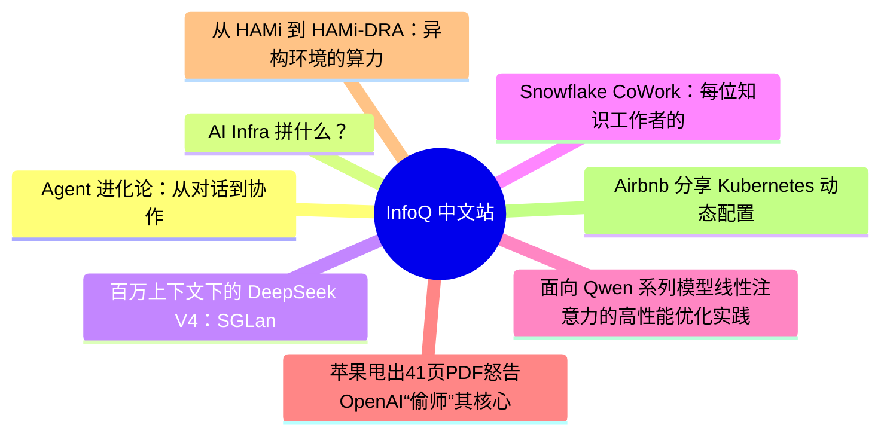

# 📰 InfoQ 中文站 Top 8 (2026-07-12)

## 思维导图

## 列表（8 条，2 条含全文）

### 1. Agent 进化论：从对话到协作
- **链接**: [https://www.infoq.cn/article/6StbVmZr0cicGREVjwZu?utm_source=rss&utm_medium=article](https://www.infoq.cn/article/6StbVmZr0cicGREVjwZu?utm_source=rss&utm_medium=article)
- **发布**: Thu, 09 Jul 2026 17:58:01 GMT
- **简介**: 点击查看原文>

📄 全文（4021 字符，点击展开）

人与 AI 的沟通正在变得越来越像人与人之间的沟通。

一位店员用 AI 制作门店宣传视频时，不再把需求列成一段非常细致的 Prompt 发给 AI，然后等待它返回结果；而是直接开启一个与 AI 的对话，告诉它“帮我剪一条今天新品上架的视频”，然后通过连续对话敲定任务的具体细节，就像与人类剪辑师一样。

同样的情况已经发生在很多具体场景中。一些程序员在通勤或散步时会用语音和 Agent 讨论一个功能该怎么设计，如何实现；有用户在玩游戏时，会不断与 AI 游戏助手沟通现在应该做哪些任务，当前的关卡还有哪些道具没有收集……

进入 Agent 时代，AI 不再只是输入框另一端的响应系统，而是开始进入需求讨论、方案判断和任务执行的全过程。这种角色变化，也让音视频对话成为越来越多人与 Agent 交互的主要方式。

数据显示，豆包 App 在今年一季度的音频用量环比增长约 200%，视频用量增长约 350%；近一年来的音视频模型日均 Token 消耗已经达到千亿级别。联想天禧 AI 看世界功能从 2025 年 8 月上线到 2026 年 5 月，人均对话轮次提升至刚上线时的 1.65 倍，是传统一问一答主对话的 3 倍。

当越来越多的人把与 Agent 的主要沟通方式从打字切换到视频或语音，多模态对话就很可能会成为人与 Agent 协作的主要交互界面。语音、视频、屏幕共享和环境信息都会成为这个界面的一部分。用户不再只是“输入问题”，而是在一个持续的上下文中，让 Agent 理解任务、补充信息、调用工具并参与执行。

但要真正实现这一点，对多模态交互能力的要求就不能只是“能听见声音”或“能看见画面”，而是要具备接近人的沟通能力，同时做好听觉、视觉、记忆和意图四项能力。只有当这些能力同时成立，多模态对话才会从一种输入方式，升级为支撑任务判断、方案形成和执行推进的协作机制，支持 Agent 完成从工具到伙伴的进化。

## 一、从等待指令到参与讨论

多模态交互真正改变的，不只是用户向 Agent 发出指令的方式，而是 Agent 进入任务的时间点。

在人与人的协作中，很多需求和答案并不是一开始就完整存在。往往先是有一个模糊的想法，然后在大家讨论中不断被追问细节，结合场景、资源和目标不断补充信息，最终才被沉淀成一个清晰的执行方案。

现在，人与 Agent 的沟通也开始从一次性发出指令，转向在多轮交流中澄清需求、形成方案。这是多模态交互改变协作方式的关键。

首先，它降低了人与 Agent 沟通的门槛。

对很多人来说，用一段文字向 AI 提需求是一个看似简单、实际上很难的问题。用户需要知道如何描述背景、目标、限制条件和期望结果，也需要提前预判模型可能会误解的地方。Prompt 写得不完整，结果就会偏差；想把 Prompt 写清晰，又需要付出一定的时间和精力进行思考、学习。

多模态交互让用户可以用自己最习惯的方式表达需求，不需要学习如何写好 Prompt，甚至也不需要掌握专业工具和术语。在开头提到的用 AI 制作门店宣传视频的场景中，店员与 Agent 协作时，就只需要想明白自己要什么样的成果，不必再变成一个既懂技术又懂业务的多面手。

其次，在人与 Agent 的充分讨论中，问题的上下文能被更完整地还原。

当前很多任务的挑战不在执行，而在没有充分向 Agent 澄清需求。尤其是编程、设计、办公、内容生产等场景，用户一开始往往只有一个方向，而不是一份完整需求文档。

如果 Agent 只接收一个静态 Prompt，它只能基于有限信息直接执行；如果能通过多模态交互和用户反复讨论，它就可以追问关键条件、澄清模糊表达、补全上下文，在理解目标、约束和实现路径的基础上，进入执行环节。

例如，在 Vibe Coding 场景中，Agent 的价值不只发生在写代码这一刻，而是更多体现在需求讨论和方案澄清阶段。TRAE Work “语音讨论”功能的数据显示，用户平均每通对话与 Agent 交互 17 轮；60%的对话属于探索发散型；70%的对话用于方案讨论，只有 30%用于代码生成。

最后，多模态交互也符合人类工作重心从执行到监督的转移趋势。

随着 Agent 能力继续增强，用户会越来越少地亲自执行具体步骤，而是转向监督和保障 Agent 执行任务的效果。未来很多工作甚至不再需要人一直守在屏幕前，而是由 Agent 持续推进，在遇到不确定、需要判断或需要授权的环节时，再提醒人介入。

这样的工作状态下，语音和视频会成为更自然的监督和介入方式。人在通勤路上，可以用语音和 Agent 讨论方案；可以通过屏幕随时观察 Agent 的执行状态和结果；也可以打开摄像头，让 Agent 结合现场画面给出新的判断。

因此，多模态对话的价值不只是让用户少打字，而是改变了 Agent 进入任务的阶段：它从结果生成环节前移到需求形成、方案讨论和执行监督环节。

## 二、类人沟通，迈向人与 Agent 协作的关键进化

Agent 的多模态交互能力让人不必始终待在传统操作界面里，也能配合其完成工作。这需要在四个方面进行增强：

第一是听觉，目标是在真实环境中保证 Agent 能与人进行顺畅、高效的沟通。

真实世界的声音环境远比实验室复杂。用户可能在地铁、咖啡厅、办公室、户外环境中和 Agent 对话，环境里往往有回声、噪音；还可能面对多人沟通场景。对人来说，我们可以自然区分“谁在跟我说话”“哪句话与我有关”；但对 Agent 来说，这需要依赖声学和语义系统实现。

火山引擎为提升 Agent 的多模态交互能力，会面向 Agent 优化回声消除、基于声纹识别的降噪，以及声学和语义的联合理解。

传统回声消除会更关注人耳的听感，但 Agent 更在意语音识别的完整性，因此需要在压制回声的同时，保护主讲人的声音频谱。声纹识别则可以帮助 Agent 锁定主讲人，减少旁人说话带来的干扰。声学和语义的联合理解，可以让 Agent 知道这句话是不是对它说的。

只有 Agent 能稳定听清用户、理解用户，用户才会愿意用自然语言持续和它交流。这对终端场景尤其重要。联想天禧 AI 看世界的使用场景包括了办公、户外、看球、健身、通勤等真实环境。借助火山引擎的听觉能力，联想将自由打断、低延迟响应和高拟真音色打造成了 AI 看世界的体验亮点。

第二是视觉，可以让 Agent 和用户共享同一个问题现场。

联想天禧 AI 看世界打通了实时对话、屏幕共享和摄像头共享三种模式。用户可以在 Excel 里问“这几个单元格怎么合并”，也可以让 AI 评价自己今天的穿搭，让 AI 陪自己看剧、估算食物热量。

实现这种视频理解体验的难点不是让 Agent 看到更多画面，而是让它看到更有效的画面。连续视频里有大量重复帧、模糊帧和低价值信息，如果全部送入模型，会带来成本和延迟压力，也会影响理解效率。

因此，服务 Agent 的多模态交互需要在端侧提升采集质量，在云端具备关键帧优选、智能抽帧能力，并能具备选择性注意力。

其中，选择性注意力是火山引擎推出的让 Agent 能进行类人沟通的关键能力之一。它能让 Agent 在处理连续画面前，先根据用户的意图去创建一个实时视觉理解任务，带着目标去看视频。比如，在服务球赛场景时，Agent 应该能通过球衣号码辨别出对应的球员，进而确认需要追踪哪位球员的场上动作。

第三是记忆，决定了 Agent 与人能否跨越单次会话，实现真正的合作。

真正的类人沟通不是只理解当前一句话，而是能记住过去发生了什么，和用户之间发生过什么。比如用户问“刚才午饭热量高吗”，Agent 需要回忆起此前看到的食物画面。这样的交流才会更接近人与人之间的相处状态。

火山引擎为多模态交互构建了三层记忆体系：第一层是增强上下文，负责将多模态解析出来的画面核心主体类型、时空位置、行为动作等信息结构化，作为上下文提供给 Agent；第二层是短期记忆，记录几分钟前看到的画面或听到的声音；第三层是长期记忆，抽象和记录用户长期交互中的关键行为、习惯特征和重要事件。

具体实践中，联想天禧 AI 会据此搭建跨端、跨会话、跨场景的记忆体系。这套记忆系统不只服务于主对话，也会接入 AI 看世界，并覆盖 PC、Phone、Pad 多端。用户无论通过文字、语音还是视频交互，记忆都可以被沉淀下来，并在下一次会话中被调用。

这会让 Agent 不再只处理单次请求，而是开始沿着用户的生活和任务脉络持续积累上下文。

第四是意图，解决 Agent 能否参与任务定义的问题。

人类沟通中，大量信息并不会被明确说出。用户说“帮我做一个权限管理系统”，真正重要的问题可能是：权限按角色分配还是按部门分配？是否需要审批？是否有管理员层级？是否要和现有系统打通？

一个只会执行的 Agent 会立刻开始生成结果；而一个更接近协作者的 Agent，则会主动追问关键约束，把模糊需求变成可执行方案。

听觉解决“听见谁”，视觉解决“看见什么”，记忆解决“记得哪些上下文”，意图解决“到底要完成什么任务”。四项能力共同构成了 Agent 从对话走向协作的基础。这也是火山引擎的多模态交互能力区别于传统问答的地方。它能在连续沟通中理解用户真正想完成什么，并达成协作共识。

## 三、当多模态对话成为通用协作界面

多模态交互最终不会只是某个 App 里的一个功能模块，而会变成通用的 Agent 任务界面。

过去，语音、视频、拍照识别、屏幕共享往往是分散功能。用户需要在不同入口之间切换：想语音就打开语音模式，想识别图片就上传图片，想让 AI 理解屏幕就截图

...（截断，原文 4804+ 字符）

### 2. AI Infra 拼什么？
- **链接**: [https://www.infoq.cn/video/bN06GZ6lWP9tc5qVPOky?utm_source=rss&utm_medium=article](https://www.infoq.cn/video/bN06GZ6lWP9tc5qVPOky?utm_source=rss&utm_medium=article)
- **发布**: Thu, 09 Jul 2026 16:18:51 GMT
- **简介**: 点击查看原文>

### 3. 百万上下文下的 DeepSeek V4：SGLang 推理优化实战｜AICon深圳
- **链接**: [https://www.infoq.cn/article/qALuq71AxiG5VLmWqSzU?utm_source=rss&utm_medium=article](https://www.infoq.cn/article/qALuq71AxiG5VLmWqSzU?utm_source=rss&utm_medium=article)
- **发布**: Thu, 09 Jul 2026 16:15:15 GMT
- **简介**: 点击查看原文>

📄 全文（4021 字符，点击展开）

Agent 时代，哪些方向正在成为行业关键变量？50 + 实战案例揭晓答案！

模型参数规模不断突破，推理成本持续下降，开源生态日益繁荣。当模型能力逐渐成为行业共识，一个新的问题开始浮现：**当人人都能获得强大的模型能力之后，真正的竞争力还剩下什么？** 答案正在从模型能力本身，转向围绕模型构建可规模化的智能系统；从单点能力提升，转向系统工程与组织级落地能力。

在这一背景下，[2026 年 AICon 人工智能开发与应用大会 · 深圳站](https://aicon.infoq.cn/2026/shenzhen/track)正式启动。本次大会将于** 8 月 21 日—22 日**举办，聚焦 AI 基础设施、大模型系统、智能体工程、数据智能、多模态技术与行业落地等关键方向，邀请来自腾讯、阿里、华为、百度、蚂蚁集团等 50 + 头部科技企业技术负责人、科研机构一线专家，系统性分享前沿洞察与实战干货，共同探讨 AI 技术从能力到系统、从实验到生产的真实路径。

SGLang, RadixArk Engineer 杨雨豪已确认出席 “[AI Infra、推理工程与异构计算](https://aicon.infoq.cn/2026/shenzhen/track/1949)” 专题，并发表题为**《**[百万上下文下的 DeepSeek V4：SGLang 推理优化实战](https://aicon.infoq.cn/2026/shenzhen/presentation/7143)**》**的主题分享。DeepSeek V4 模型采用了由 SWA（滑窗注意力）、CSA（压缩稀疏注意力，4:1 压缩+TopK 筛选）和 HCA（高压缩注意力，128:1 压缩）组成的混合注意力架构，相较于 V3 单一的 MLA 结构更为复杂，同时模型支持百万级上下文长度，对推理框架的缓存管理、算子效率和并行策略提出了严苛挑战。本次演讲分享 SGLang 团队如何通过缓存架构、算子融合和并行策略的全栈优化，实现 DeepSeek-V4 百万上下文推理的 Day-0 支持与持续性能提升，并结合 InferenceX 公开基准展示在 GB300 NVL72 上的实测结果。他在本次会议的详细演讲内容如下：

演讲提纲：

一、DeepSeek V4 推理的核心挑战

混合注意力架构的复杂性：SWA（滑窗 128）、CSA（4:1 压缩 + TopK 稀疏筛选）、HCA（128:1 纯压缩）三种异构 Attention 共存，每种有独立的 KV Cache 生命周期和索引逻辑

百万级上下文带来的内存与计算压力：KV Cache 显存占用激增，TopK 等索引操作在长序列下成为瓶颈

Compressor 机制引入跨 token 依赖：CSA/HCA 的 KV 计算需复用前序 token 中间状态，打破了传统逐 token 独立计算的假设

二、ShadowRadix：三套 KV Cache 的统一管理

在 RadixTree 上扩展虚拟地址表，每个 token 分配唯一虚拟位置，通过除法映射到三组 Shadow 页表（SWA 原始位置 / CSA 除以 4 / HCA 除以 128）

SWA 引入 Tombstone 机制，自动释放滑窗外过期 KV，Shadow B/C 无需淘汰

额外维护两个 Ring Buffer 管理 Compressor 中间状态，保证 CSA/HCA 跨 token 依赖的正确性

踩坑：三套 Cache 的页大小、淘汰策略、前缀匹配逻辑完全不同，SWA 为支持前缀缓存需保留多于 128 token 的 KV，不能简单按滑窗大小截断

三、算子级优化

FlashCompressor：将 Compressor 流程中 Softmax、bias、scale-dot 等零散操作融合为单一 kernel，HBM 读写从 5 次降至 2 次

Lightning TopK：序列分片到同一 Cluster 内的多个 CTA，各 CTA 用直方图做本地统计，通过 SM 互联（而非 HBM）完成 reduce；百万上下文 BS=1 下从 100μs 降至 15μs

MegaMoE（DeepSeek 官方）：将 dispatch / group GEMM / combine 三阶段融合重叠为单一 kernel，直接调用 DeepGEMM 实现；限制：仅支持 FP8×FP4、仅 Blackwell SM100、仅 NVLink 互联

踩坑：Kernel 语言选型——Triton 开发快但优化上限有限，CUDA 可做极致优化但开发慢，TileLang 居中；FlashCompressor 用 Triton 即可，Lightning TopK 必须用 CUDA

四、并行策略与工程化

DP Attention：V3 延续方案，提升吞吐

CP（Context Parallelism）：将长序列均匀分片到多卡，Attention 前 AllGather 所需 KV（因压缩后体积小，通信开销低）；超长输入（90 万+）下 CP 优于 TP，短输入 TP 更优（CP 额外通信开销不划算）

EP（Expert Parallelism）：GB300 NVL72 上大规模专家并行，AlltoAll 走 NVLink 带宽充足

多流并行：SWA/CSA/HCA 三种 Attention 无数据依赖，分配到不同 CUDA Stream；解码阶段 SM 利用率未饱和，多流收益明显；用 CUDA Event 控制依赖顺序

踩坑：FlashMLA 库专为 DP Attention 设计（头数完整），开启 TP 切分头数后只能 padding 到要求的头数，存在浪费，后续仍需优化；CP 的 KV AllGather 目前无法做 overlap（前后有数据依赖），计划用 Ring Attention 方案解决

五、投机采样适配

V4 MTP Layer 仅含 SWA，无 CSA/HCA，结构比主模型轻量

将 KV 位置等元数据准备移入 CUDA Graph，消除 CPU 开销；兼容 Overlap Scheduling 实现 CPU/GPU 完全并行

实测 4K 与 900K 上下文解码速度差异极小（TP=8, BS=1, MTP Len=3）

踩坑：大 Batch（512/1024）下投机采样收益下降，因 GPU 瓶颈从访存转为计算，投机采样本质优化的是访存

六、KV Cache Offloading 与 PD 分离

HiSparse：CSA pool 溢出时卸载至 CPU 内存，SWA/HCA 体积小暂留 GPU

PD 分离结合 ShadowRadix 虚拟索引，KV Cache 按配置从 P 节点传输至 D 节点

七、性能数据

InferenceX 基准（Input 8K / Output 1K）：开启 MTP 单用户交互速度 180 token/s；GB300 NVL72 高吞吐场景单 GPU 吞吐 11,500 token/s

强化学习框架 Miles Day-0 支持：Rollout 阶段用 FP8、Training 用 BF16 混合精度，奖励值与 benchmark 分数随训练步数稳步提升

实践痛点

1. 架构复杂度换性能ShadowRadix 为三种 Attention 各维护一套独立的页表、淘汰策略和前缀匹配逻辑，系统复杂度相比 V3 单一 MLA 大幅膨胀。例如 SWA 为支持前缀缓存必须保留多于 128 token 的 KV，不能按滑窗大小简单截断，即使是最基础的缓存管理也充满 corner case。三套 Cache 的联调、一致性维护和 bug 排查成本很高，后续每新增一个功能（如 PD 分离、CP）都要在三套系统上分别适配。

2. 并行策略没有通解CP 在超长输入下优于 TP，但 AllGather 目前无法做 overlap（有数据依赖），且长上下文高并发容易 OOM；TP 在短输入下更好但受限于卡间通信；EP 依赖 NVLink 带宽。本质上不存在自动化策略选择，用户需要自己在 DP/TP/CP/EP 的组合空间里反复试参，调优成本不低。运行时动态切换并行策略也不可行，涉及 CUDA Graph 重建、元数据重建等问题。

3. Kernel 开发的工程代价实际开发中 Triton、CUDA、TileLang 三种语言混用：Triton 开发快但优化上限有限，CUDA 能做极致优化但开发慢，TileLang 居中。Lightning TopK 必须用 CUDA，FlashCompressor 用 Triton，训练反向算子用 TileLang。三套工具链混合意味着团队需要同时维护三种代码风格和调试流程，且融合 kernel 一旦出现数值精度问题，排查难度远高于朴素 PyTorch 实现。

听众收益

复杂模型架构落地的工程方法论：DeepSeek V4 的三种异构 Attention 共存是业界新趋势，ShadowRadix 的虚拟地址映射 + 分层页表设计提供了一套可复用的思路——当模型架构变复杂时，如何在不重写整个缓存系统的前提下做扩展式适配，而非推倒重来。

性能优化的决策框架：分享覆盖了从算子融合（FlashCompressor 减少 HBM 读写）、到并行策略选型（短输入用 TP、超长输入用 CP、高吞吐用 EP）、再到投机采样适用边界（小 Batch 有效、大 Batch 收益下降）的完整决

...（截断，原文 4761+ 字符）

### 4. Snowflake CoWork：每位知识工作者的专属工作 Agent ｜ 技术趋势
- **链接**: [https://www.infoq.cn/article/VoJ3wVeUv5txrOYqSYpR?utm_source=rss&utm_medium=article](https://www.infoq.cn/article/VoJ3wVeUv5txrOYqSYpR?utm_source=rss&utm_medium=article)
- **发布**: Thu, 09 Jul 2026 16:00:00 GMT
- **简介**: 点击查看原文>

### 5. 面向 Qwen 系列模型线性注意力的高性能优化实践｜AICon深圳
- **链接**: [https://www.infoq.cn/article/wg5h3JBMvs5ZkoP0azha?utm_source=rss&utm_medium=article](https://www.infoq.cn/article/wg5h3JBMvs5ZkoP0azha?utm_source=rss&utm_medium=article)
- **发布**: Sun, 12 Jul 2026 10:00:00 GMT
- **简介**: 点击查看原文>

### 6. 苹果甩出41页PDF怒告OpenAI“偷师”其核心机密！网友：早知道就等印度开源了
- **链接**: [https://www.infoq.cn/article/Rzh9umgPl90MgGolBcWm?utm_source=rss&utm_medium=article](https://www.infoq.cn/article/Rzh9umgPl90MgGolBcWm?utm_source=rss&utm_medium=article)
- **发布**: Sat, 11 Jul 2026 17:00:00 GMT
- **简介**: 点击查看原文>

### 7. 从 HAMi 到 HAMi-DRA：异构环境的算力资源管理实践｜AICon深圳
- **链接**: [https://www.infoq.cn/article/fRMquPuKMsj6zkyFmO6P?utm_source=rss&utm_medium=article](https://www.infoq.cn/article/fRMquPuKMsj6zkyFmO6P?utm_source=rss&utm_medium=article)
- **发布**: Sat, 11 Jul 2026 10:00:00 GMT
- **简介**: 点击查看原文>

### 8. Airbnb 分享 Kubernetes 动态配置 Sidecar Sitar-agent 的架构
- **链接**: [https://www.infoq.cn/article/fO5byVPuZwwlBPosijBV?utm_source=rss&utm_medium=article](https://www.infoq.cn/article/fO5byVPuZwwlBPosijBV?utm_source=rss&utm_medium=article)
- **发布**: Sat, 11 Jul 2026 09:00:00 GMT
- **简介**: 点击查看原文>
