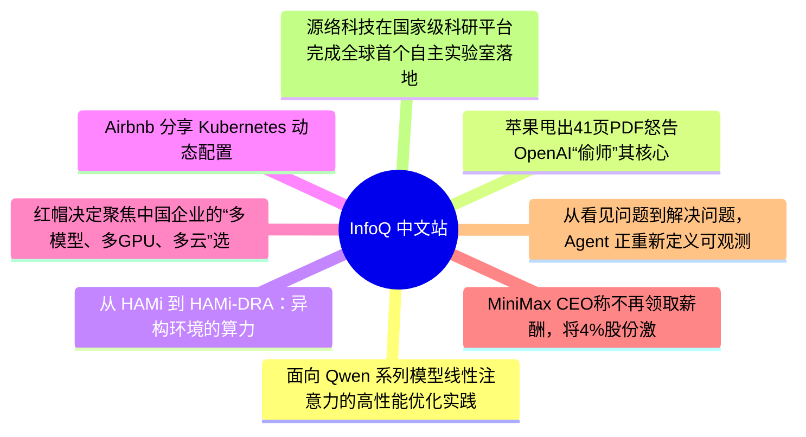

# 📰 InfoQ 中文站 Top 8 (2026-07-13)

## 思维导图

## 列表（8 条，3 条含全文）

### 1. 面向 Qwen 系列模型线性注意力的高性能优化实践｜AICon深圳
- **链接**: [https://www.infoq.cn/article/wg5h3JBMvs5ZkoP0azha?utm_source=rss&utm_medium=article](https://www.infoq.cn/article/wg5h3JBMvs5ZkoP0azha?utm_source=rss&utm_medium=article)
- **发布**: Sun, 12 Jul 2026 10:00:00 GMT
- **简介**: 点击查看原文>

📄 全文（2717 字符，点击展开）

Agent 时代，哪些方向正在成为行业关键变量？50 + 实战案例揭晓答案！

模型参数规模不断突破，推理成本持续下降，开源生态日益繁荣。当模型能力逐渐成为行业共识，一个新的问题开始浮现：**当人人都能获得强大的模型能力之后，真正的竞争力还剩下什么？** 答案正在从模型能力本身，转向围绕模型构建可规模化的智能系统；从单点能力提升，转向系统工程与组织级落地能力。

在这一背景下，[2026 年 AICon 人工智能开发与应用大会 · 深圳站](https://aicon.infoq.cn/2026/shenzhen/track)正式启动。本次大会将于** 8 月 21 日—22 日**举办，聚焦 AI 基础设施、大模型系统、智能体工程、数据智能、多模态技术与行业落地等关键方向，邀请来自腾讯、阿里、华为、百度、蚂蚁集团等 50 + 头部科技企业技术负责人、科研机构一线专家，系统性分享前沿洞察与实战干货，共同探讨 AI 技术从能力到系统、从实验到生产的真实路径。

阿里巴巴 Qwen 团队算法工程师章程瑞东已确认出席 “[AI Infra、推理工程与异构计算](https://aicon.infoq.cn/2026/shenzhen/track/1949)” 专题，并发表题为**《**[面向 Qwen 系列模型线性注意力的高性能优化实践](https://aicon.infoq.cn/2026/shenzhen/presentation/7179)**》**的主题分享。自 Qwen-3.5 采用混合注意力结构以来，Qwen 系列模型的线性注意力层 Gated Delta Network（GDN）在训练与推理中的开销日益显著。现有实现面临两大难题：一是多步算子需要反复读写 HBM，访存瓶颈严重；二是状态递推的串行性使算子并行度受限于注意力头数，在长序列、小 batch 或 TP 场景下 GPU 利用率低下。为此，他们提出 FlashQLA —— 基于 TileLang 的高性能线性注意力算子库。核心方案包括：将 GDN Chunked Prefill 的前向与反向流程各拆分为两个融合算子，通过数据复用降低访存开销，并在算子内通过 warp-specialization 实现不同计算的重叠；基于门控衰减的自动化卡内序列并行，并建立数学模型动态调节并行粒度；针对具有指数衰减特性的注意力头，舍弃昂贵的修正矩阵计算，改用轻量级预热获得精确状态。在 Hopper 显卡上，FlashQLA 相比 FLA Triton kernel 实现前向 2–3 倍、反向 2 倍加速，且在 TP 增大时加速比持续提升，显著优化了预训练与端侧推理效率。在本次演讲中，章程瑞东将对此展开详细介绍。

章程瑞东，阿里 Qwen 团队算法工程师，主要工作领域为线性注意力与稀疏注意力的算子-算法联合优化，在 Qwen 3.5 及后续模型的预训练与后训练过程中提供相关 infra 支持。曾就职于微软亚洲研究院，参与稀疏注意力优化算法 MInference(Neurips'24) / MMInference(ICML'25) / MTraining(MLSys'26)，上下文窗口拓展算法 LongRoPE(ICML'24)、分布式 LLM 服务系统 ParrotServe(OSDI'24) 等，并参与 Phi-3 系列模型研发。近期主导开发了 GDN Chunked-Prefill 优化方案 FlashQLA，在 Qwen 系列混合注意力模型的训练和推理场景下均有显著的加速效果。他在本次会议的详细演讲内容如下：

演讲提纲：

1. 背景与挑战

Qwen 模型训练与推理 Prefill 过程中 GDN 模块的耗时

性能瓶颈剖析：

访存密集型：分步 kernel 大量读写 HBM，中间变量开销大

并行度受限：状态递推依赖导致 thread block 数量不足，SM 利用率低（尤其在 TP、小 batch 场景）

2. 优化方案

设计目标：兼顾访存优化与序列并行，避免极端方案（Fully-fused / 多步算子）的缺陷

核心策略：

拆分为两个 fused kernel，在 kernel 间插入 CP 预处理，平衡数据重用与并行度

门控驱动的动态并行：根据 batch_size × num_heads 和序列长度自动开启卡内序列并行

利用门控衰减性质：采用 warmup 替代昂贵的修正矩阵计算，大幅降低预处理开销

3. 系统设计思路

对前向与反向流程做等价的代数改写，降低计算复杂度

从门控衰减到滑动窗口及背后的代数原理

自动卡内序列并行的参数设计

4. 算子实现细节

计算与访存负载分析

片上资源分析

如何用 Tilelang 手动实现 warp-specialization

5. 性能评估

6. 开放问题

GDN 模块剩余的优化空间

KDA 及其他线性注意力结构的优化方案

芯片硬件方面对线性注意力算子的限制

实践痛点

不能覆盖所有场景

算子复用性较差

听众收益

线性注意力模块在系统上的一些性质

与算法创新相结合的系统优化流程

复习线性代数

除此之外，本次大会还策划了[AI Infra、推理工程与异构计算](https://aicon.infoq.cn/2026/shenzhen/track/1949)、[超级个体与蜂群智能的共生进化](https://aicon.infoq.cn/2026/shenzhen/track/1950)、[迈向机器人 AGI 的关键技术与产业实践](https://aicon.infoq.cn/2026/shenzhen/track/1952)、[Agent 安全：从风险到可控](https://aicon.infoq.cn/2026/shenzhen/track/1953)、[端侧智能与 AI 原生终端](https://aicon.infoq.cn/2026/shenzhen/track/1955)、[AI Agent 高价值商业场景实战](https://aicon.infoq.cn/2026/shenzhen/track/1958)等 11 个专题论坛，届时将有来自不同行业、不同领域、不同企业的 50+资深专家在现场带来前沿技术洞察和一线实践经验。

大会限时早鸟票享 8 折专属优惠，现在报名立减 1160，更多详情可扫码或联系票务经理 13269078023 进行咨询。

### 2. 苹果甩出41页PDF怒告OpenAI“偷师”其核心机密！网友：早知道就等印度开源了
- **链接**: [https://www.infoq.cn/article/Rzh9umgPl90MgGolBcWm?utm_source=rss&utm_medium=article](https://www.infoq.cn/article/Rzh9umgPl90MgGolBcWm?utm_source=rss&utm_medium=article)
- **发布**: Sat, 11 Jul 2026 17:00:00 GMT
- **简介**: 点击查看原文>

📄 全文（4021 字符，点击展开）

## 苹果起诉 OpenAI “偷师” 其硬件核心机密

昨晚，苹果与 OpenAI 这对曾经的 AI 盟友，正式在法庭上撕破了脸。

当地时间 7 月 10 日，据多家外媒消息，苹果向美国加利福尼亚北区联邦地区法院提起诉讼，指控 OpenAI 及其硬件子公司 io Products 通过挖走苹果员工、获取内部文件和接触供应商等方式，盗用苹果商业秘密。

案件编号为 5:26-cv-07078，被告除 OpenAI Foundation、OpenAI Group PBC 和 io Products 外，还包括两名前苹果员工：OpenAI 首席硬件官 Tang Yew Tan，以及硬件工程师 Chang Liu。

苹果提出了四项违反《保护商业秘密法》的诉因，以及两项违反员工知识产权协议的诉因，并要求陪审团审理。

但值得注意的是，目前这些仍是苹果的单方面指控，法院尚未作出事实认定。

## 苹果拿出一条具体的证据链

苹果这次似乎下定了某种决心，起诉时拿出了一条相当具体的证据链。

诉状称，“苹果每年都以创新的硬件产品带给客户惊喜与愉悦，其大部分工作一直保密，直到成品准备就绪、可以亮相的那一刻才公之于众。在幕后，苹果对其产品开发、制造、供应链、技术研究及其他创新成果均严格保密。涵盖苹果硬件运营的各领域商业秘密，共同构成了美国商业界最具价值的知识资产之一。这些秘密使苹果能够以非凡的速度和规模，向消费者推出具有独特功能的新产品。苹果高度重视其商业秘密的保密性。”

前员工 Chang Liu 在苹果工作八年，参与过高度敏感的硬件项目，2026 年 1 月 22 日离职加入 OpenAI，却没有归还至少一台苹果笔记本，也没有配合离职安全审查。

Liu 离职后仍与当时在苹果任职的 Yu-Ting “Alyssa” Peng 保持频繁联系。Peng 随后于 2026 年 4 月 16 日离职并加入 OpenAI。

苹果援引双方通信记录称，Liu 离开苹果仅数小时后便告诉 Peng，自己“还有另一台电脑”，准备利用该设备访问苹果机密信息，以便当晚与她讨论。

诉状还称，在 Liu 已经离职、Peng 仍在苹果任职期间，Liu 曾使用 Peng 由苹果配发、并已通过公司网络认证的工作电脑访问苹果系统。

大约在 2026 年 2 月 9 日，Liu 被指尝试登录苹果的网络存储库。该存储库基于云端运行，保存有苹果的机密工程文件、项目资料及其他专有信息。按照苹果的说法，由于当时尚未被发现的身份验证漏洞，Liu 在离职数周后仍能访问该系统。

苹果称，刘发现漏洞后并未向公司报告，而是将这一情况告诉 Peng。

诉状引用的聊天记录显示，Liu 称：“哈哈，我发现我可以访问网络存储库，真好笑。”

Peng 随后回复：“我准备好了。”

苹果指控，Liu 在已经入职 OpenAI 的情况下，继续利用这一访问权限，从内部存储库中筛选、打开并下载了数十份机密文件，涉及技术演示文稿、电子表格、PDF 文件及书面工作成果。

其中包括一份超过 1000 页的技术资料汇编，记录了 Liu 及其他苹果员工此前参与的机密项目细节，多份文件被明确标记为机密。

这些电脑留言、内部服务器日志和公司设备记录，构成了苹果目前公开的核心数字证据。

上述内容目前均为苹果在诉状中提出的指控，法院尚未就相关事实作出认定。

再来说说另一名核心被告 Tang Yew Tan。据诉状，Tan 在苹果工作了 24 年，曾任 iPhone 和 Apple Watch 产品设计副总裁，目前是 OpenAI 首席硬件官。

苹果称，他离职前曾与 OpenAI 或其合作方接触，并把苹果供应商资料和消费电子行业内部报告发送到个人邮箱。

此后，他在面试苹果员工时使用苹果内部项目代号，追问某款未发布产品“下一步计划是什么”，还要求候选人把苹果的“实际零件”带到 OpenAI，进行“展示和讲解”。

诉状称，被要求携带的物品包括电池、逻辑板和屏蔽件，一名候选人甚至惊讶地表示：“我都不知道这些东西可以从办公室拿走。”

按照苹果的说法，这并非个别员工离职时顺手复制几份文件，而是一套颇有“方法论”的招聘流程。

OpenAI 被指要求候选人展示 CAD 设计资料和原型机，并讨论子系统与零部件选择、仿真工具、系统集成方法，以及供应商筛选和沟通方式。

Tan 等人还被指向新员工传播一份标有“Need to Know”的苹果内部离职安全文件，提醒他们不要向苹果透露下一家公司是 OpenAI，以避免被提前收回系统访问权限。

苹果称，目前已有超过 400 名前苹果员工进入 OpenAI。

指控还延伸到了苹果供应链。

苹果称，OpenAI 及 io Products 接触了至少两家苹果长期合作伙伴。

其中一家供应商被要求为 OpenAI 执行苹果多年积累的一套专有金属表面处理工艺，并被误导相信苹果已经授权；另一家从事电源和电池相关制造的供应商，则被 OpenAI 使用苹果内部术语追问特定部件和制造问题。

苹果认为，这表明相关信息已经不只是“被员工带走”，而是实际进入了 OpenAI 的硬件研发和供应链活动。

苹果称，公司今年 2 月已经致函 OpenAI，要求讨论机密信息可能被带走的问题，但没有收到回应。

OpenAI 发言人 Drew Pusateri 则表示，公司仍在审阅诉状，并回应称：“我们对其他公司的商业秘密不感兴趣。我们将继续专注于开发能够赋能全球用户的创新技术。”

既然提起了诉讼，苹果的诉求到底是啥呢？

事实上，苹果的诉求可不是赔钱那么简单。它要求法院发布临时及永久禁令，禁止被告继续获取、持有、使用或披露苹果商业秘密；禁止删除邮件、电子文件、元数据等证据；归还全部苹果设备、文件和数据；停止访问苹果系统。同时，苹果还要求获得实际损失赔偿、不当得利、合理许可费、惩罚性赔偿、利息和律师费，但目前没有提出具体金额。

对 OpenAI 而言，真正危险的未必是赔偿数字，而是禁令和证据开示。

如果法院同意苹果的初步禁令，OpenAI 可能需要隔离被指使用过苹果资料的研发成果、重新审查设计来源和供应商沟通，硬件项目也可能被迫延后。

进入证据开示阶段后，OpenAI 的内部邮件、招聘记录、供应商往来和硬件路线图也可能被纳入调查。

有意思的是，这场官司还引起了马斯克的注意，他刚刚在 x 上转发了这条消息，并评论了两个感叹号。

马斯克为什么会关注到这个案子呢？因为一个月前，OpenAI 刚刚成功驳回 xAI 提出的商业秘密诉讼，法官认为 xAI 没有充分证明 OpenAI 诱导员工泄密或明知其披露机密。

苹果这次显然吸取了“证据不够具体”的教训，诉状反复强调“带实际零件面试”“教人避开安全审查”“使用内部项目代号”等细节，试图直接证明 OpenAI 存在诱导、知情和实际使用行为。

苹果能否最终证明这些指控仍是未知数，但至少在诉状阶段，它带来的已经不是一团模糊的硅谷人才流动故事。

## 印度把苹果彻底“开源了”

这场官司还有一层颇具讽刺意味的背景：就在不久前，苹果尚未发布的 iPhone 18 Pro 已经因为供应链安全事故，被提前“开卷”。

6 月底，路透社报道称，勒索软件组织 World Leaks 入侵苹果印度制造伙伴塔塔电子，将超过 20 万份、总计约 630GB 的文件发布到暗网，其中包括 iPhone 18 Pro 的零部件与供应商对应关系、芯片、电池和相机资料，以及跌落测试照片。

严格来说，这不是“塔塔集团主动泄密”，而是塔塔电子遭到网络攻击后数据被盗。

也就是说，iPhone 18 的零件表和测试照片都被黑客端上桌了，苹果才想起来跟 OpenAI 还有一笔账要算是不是有点晚了？

但从技术和法律层面看，两件事并不能直接画等号。塔塔泄露的主要是特定产品的部件、供应商映射和测试影像，而苹果此次诉讼涉及的范围更广，包括金属处理流程、制造方法、项目数据、供应商合作限制、内部安全程序和未发布产品计划。

部分文件意外公开，也不意味着其他机密自动失去保护，更不能追溯性地授权此前未经许可的下载和使用。美国法律判断商业秘密时，关注信息是否具有经济价值，以及权利人是否采取了合理保密措施；向受保密协议约束的供应商有限披露，也不等于向公众公开。

不过，塔塔数据泄露仍可能成为 OpenAI 抗辩中的一块材料。OpenAI 可以针对苹果列出的具体秘密逐项质疑：这些资料是否真的不为公众所知？是否已通过暗网泄露、供应链传播或行业经验变得容易获取？苹果则需要证明，被盗用的是仍受保护、并且确实被 OpenAI 使用的特定信息，而不是泛泛的硬件从业经验。

更微妙的是，即使官司已经打到了法庭上，两家公司还没有彻底“分手”。

苹果与 OpenAI 在 2024 年宣布合作，将 ChatGPT 接入 iPhone、iPad 和 Mac，诉状也特别说明，这项软件合作并非本案争议对象。不过，苹果在 2026 年推出的新一代 Siri AI 已经转向与谷歌 Gemini 合作。曾经负责给 Siri 补充答案的 OpenAI，如今准备制造可能绕开手机和传统应用的 AI 终端，苹果眼中的合作伙伴也就迅速变成了潜在的平台级对手。

苹果在诉状中形容 OpenAI 的硬件业务“根基极不稳固，核心已经腐烂”。

这句话当然带着诉讼文书惯有的火药味。

但无论最终判决如何，这场官司已经把一个问题摆到了台面上：当 AI 公司开始从软件模型冲向消费硬件，它们需要的不只是更多苹果工程师，还得解释清楚——带走的究竟是人才的经验，还是前东家的整

...（截断，原文 4862+ 字符）

### 3. 从 HAMi 到 HAMi-DRA：异构环境的算力资源管理实践｜AICon深圳
- **链接**: [https://www.infoq.cn/article/fRMquPuKMsj6zkyFmO6P?utm_source=rss&utm_medium=article](https://www.infoq.cn/article/fRMquPuKMsj6zkyFmO6P?utm_source=rss&utm_medium=article)
- **发布**: Sat, 11 Jul 2026 10:00:00 GMT
- **简介**: 点击查看原文>

📄 全文（2613 字符，点击展开）

Agent 时代，哪些方向正在成为行业关键变量？50 + 实战案例揭晓答案！

模型参数规模不断突破，推理成本持续下降，开源生态日益繁荣。当模型能力逐渐成为行业共识，一个新的问题开始浮现：**当人人都能获得强大的模型能力之后，真正的竞争力还剩下什么？** 答案正在从模型能力本身，转向围绕模型构建可规模化的智能系统；从单点能力提升，转向系统工程与组织级落地能力。

在这一背景下，[2026 年 AICon 人工智能开发与应用大会 · 深圳站](https://aicon.infoq.cn/2026/shenzhen/track)正式启动。本次大会将于** 8 月 21 日—22 日**举办，聚焦 AI 基础设施、大模型系统、智能体工程、数据智能、多模态技术与行业落地等关键方向，邀请来自腾讯、阿里、华为、百度、蚂蚁集团等 50 + 头部科技企业技术负责人、科研机构一线专家，系统性分享前沿洞察与实战干货，共同探讨 AI 技术从能力到系统、从实验到生产的真实路径。

范式智能系统研发专家杨守仁已确认出席 “[AI Infra、推理工程与异构计算](https://aicon.infoq.cn/2026/shenzhen/track/1949)” 专题，并发表题为**《**[从 HAMi 到 HAMi-DRA：异构环境的算力资源管理实践](https://aicon.infoq.cn/2026/shenzhen/presentation/7168)**》**的主题分享。随着国产算力的发展，算力集群的从单一的 NVIDIA 设备逐步走向有更多不同国产厂商设备构成的异构算力集群，异构算力的管理这个问题逐步浮出水面。HAMi 作为范式参与发起的项目，是范式在异构算力管理上的实践的成果。HAMi 在易用性和管理能力上取得了一个较好的平衡，但是受限于 Kubernetes 的 Device Plugin 本身的缺陷，调度性能和精细化分配的能力面临瓶颈。但是随着 Kubernetes v1.34 将 Dynamic Resource Allocation（DRA） 特性正式推进至 GA，集群设备资源管理从以节点为中心的分配模型，逐步演进为以资源对象为核心的声明式管理模式，相比传统 Device Plugin 接口仅能暴露简单容量信息，DRA 通过引入 ResourceClaim 使设备资源能够在 Pod 创建之前完成表达与约束，为 GPU 等复杂硬件资源的精细化调度提供了新的基础能力。

HAMi-DRA 是 HAMi 社区在 DRA 方向上的最新实践，结合范式自身的异构算力管理实践，HAMi-DRA 能在不牺牲核心调度能力的前提下，将现有 GPU 虚拟化调度体系平滑迁移至 DRA 资源模型。从范式的实践结果来看 HAMi-DRA 在调度性能和精细化管理方面带来了显著的提升。

本次分享将从 Kubernetes 设备资源模型演进的视角出发，向大家介绍范式以及 HAMi 社区在异构设备管理的面临的挑战和实践，同时详细解析 HAMi-DRA 的整体架构设计与关键实现细节，展示如何基于 DRA 构建面向 AI 工作负载的可扩展 GPU 调度方案，并且综合说明在落地 HAMi-DRA 的过程中范式以及社区遇到的挑战。

杨守仁，范式智能（原名第四范式）工程师，系统研发专家。在范式一直关注在 AI Infra 这个方向上，作为主要的负责人之一，参与范式的 GPU 集群的建设。目前是 HAMi 社区的 maintainer 之一，主要的贡献集中于 HAMi 调度器的性能优化和 HAMi-DRA 上，并且参与 HAMi 社区的维护工作。他在本次会议的详细演讲内容如下：

演讲提纲：

背景和动机

异构设备管理的挑战

传统 Device Plugin 的局限性

2. HAMi 的如何解题

HAMi 设计思路和关键实现

HAMi 的问题和挑战

3. Kubernetes DRA 介绍

DRA API

Consumable Capacity 特性

4. HAMi-DRA 设计和实践

整体架构和设计理念

HAMi-DRA 的落地挑战

Kubernetes 版本

学习成本

有限的设备支持

基于 HAMi-DRA 的 GPU 调度方案

调度性能提升

完善的设备生命周期管理

差异化的设备资源分配

5. 总结和展望

HAMi-DRA 后续规划

多个 DRA Driver 联动支持

实践痛点

依赖高版本的 Kubernetes，生产环境推动困难

DRA API 还在持续演进，部分特性还不是特性稳定，有一定的集成成本

开箱即用的 DRA Driver 数量较少，支持的异构设备的数量有限

听众收益

详细解析异构算力管理上的挑战

深度拆解 HAMi 和 HAMi-DRA 的设计和关键实现

完整介绍基于 DRA 的 GPU 调度方案的挑战和实践

除此之外，本次大会还策划了[AI Infra、推理工程与异构计算](https://aicon.infoq.cn/2026/shenzhen/track/1949)、[超级个体与蜂群智能的共生进化](https://aicon.infoq.cn/2026/shenzhen/track/1950)、[迈向机器人 AGI 的关键技术与产业实践](https://aicon.infoq.cn/2026/shenzhen/track/1952)、[Agent 安全：从风险到可控](https://aicon.infoq.cn/2026/shenzhen/track/1953)、[端侧智能与 AI 原生终端](https://aicon.infoq.cn/2026/shenzhen/track/1955)、[AI Agent 高价值商业场景实战](https://aicon.infoq.cn/2026/shenzhen/track/1958)等 11 个专题论坛，届时将有来自不同行业、不同领域、不同企业的 50+资深专家在现场带来前沿技术洞察和一线实践经验。

大会限时早鸟票享 8 折专属优惠，现在报名立减 1160，更多详情可扫码或联系票务经理 13269078023 进行咨询。

### 4. Airbnb 分享 Kubernetes 动态配置 Sidecar Sitar-agent 的架构
- **链接**: [https://www.infoq.cn/article/fO5byVPuZwwlBPosijBV?utm_source=rss&utm_medium=article](https://www.infoq.cn/article/fO5byVPuZwwlBPosijBV?utm_source=rss&utm_medium=article)
- **发布**: Sat, 11 Jul 2026 09:00:00 GMT
- **简介**: 点击查看原文>

### 5. 红帽决定聚焦中国企业的“多模型、多GPU、多云”选择权
- **链接**: [https://www.infoq.cn/article/aIP7uI00KLecpDYZBKXl?utm_source=rss&utm_medium=article](https://www.infoq.cn/article/aIP7uI00KLecpDYZBKXl?utm_source=rss&utm_medium=article)
- **发布**: Mon, 13 Jul 2026 12:07:33 GMT
- **简介**: 点击查看原文>

### 6. MiniMax CEO称不再领取薪酬，将4%股份激励团队；吐槽DeepSeek面试的华为天才少年回应被控诈骗；宇树机器人给猪做手术登上Nature｜AI周报
- **链接**: [https://www.infoq.cn/article/ySJsUiKHrIF1zDtKsNDj?utm_source=rss&utm_medium=article](https://www.infoq.cn/article/ySJsUiKHrIF1zDtKsNDj?utm_source=rss&utm_medium=article)
- **发布**: Mon, 13 Jul 2026 12:07:24 GMT
- **简介**: 点击查看原文>

### 7. 从看见问题到解决问题，Agent 正重新定义可观测？
- **链接**: [https://www.infoq.cn/video/v00wiAfaypFe6jwaMOWP?utm_source=rss&utm_medium=article](https://www.infoq.cn/video/v00wiAfaypFe6jwaMOWP?utm_source=rss&utm_medium=article)
- **发布**: Mon, 13 Jul 2026 12:00:00 GMT
- **简介**: 点击查看原文>

### 8. 源络科技在国家级科研平台完成全球首个自主实验室落地
- **链接**: [https://www.infoq.cn/article/SikqTtFjSUbzBDz9LhKe?utm_source=rss&utm_medium=article](https://www.infoq.cn/article/SikqTtFjSUbzBDz9LhKe?utm_source=rss&utm_medium=article)
- **发布**: Mon, 13 Jul 2026 11:50:26 GMT
- **简介**: 点击查看原文>
