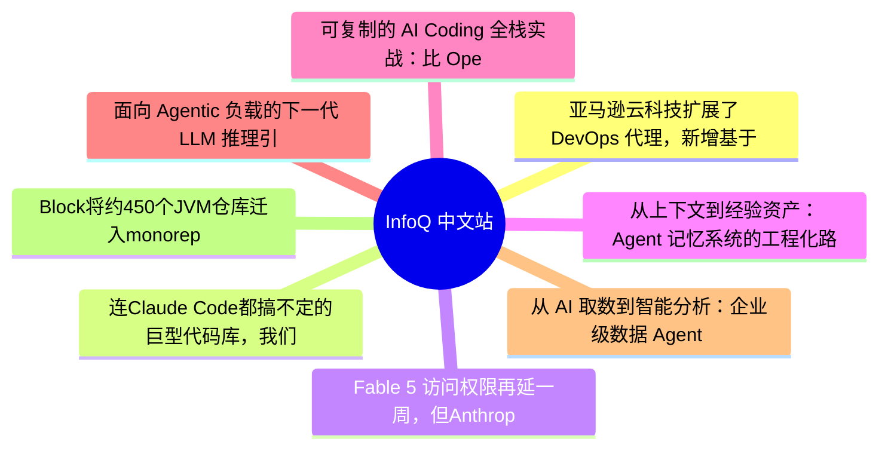

# 📰 InfoQ 中文站 Top 8 (2026-07-14)

## 思维导图

## 列表（8 条，3 条含全文）

### 1. 亚马逊云科技扩展了 DevOps 代理，新增基于 AI 的发布管理功能，可在代码投入生产前进行验证
- **链接**: [https://www.infoq.cn/article/Af9AUfyturjojjQvv6QI?utm_source=rss&utm_medium=article](https://www.infoq.cn/article/Af9AUfyturjojjQvv6QI?utm_source=rss&utm_medium=article)
- **发布**: Tue, 14 Jul 2026 11:36:00 GMT
- **简介**: 点击查看原文>

📄 全文（2595 字符，点击展开）

亚马逊云科技[宣布](https://aws.amazon.com/blogs/aws/aws-devops-agent-adds-release-management-capabilities-to-assess-code-changes-before-production-preview/)对 [AWS DevOps Agent](https://aws.amazon.com/devops-agent/) 服务进行重大扩展，推出了新的发布管理功能，旨在评估代码变更并在软件进入生产环境前进行自主测试。这些新功能（发布就绪性审查和自主发布测试）目前处于预览阶段。它们将 DevOps Agent 的应用范围从部署后运维扩展至软件交付管道，使工程团队能够在代码合并前评估生产就绪性，执行组织标准，并生成针对具体变更的测试用例。

这一公告反映了软件工程团队在 AI 时代面临的日益严峻的挑战。随着 AI 编码助手大幅增加了生成的代码量和拉取请求数量，传统的代码审查和测试流程已经难以跟上这一步伐。亚马逊云科技认为，虽然 AI 加速了代码的生成，但软件交付却受到人工审查瓶颈、合规性检查和发布验证的制约。增强版的 DevOps Agent 旨在通过充当由 AI 驱动的发布工程师来弥合这一差距。该工具能够在代码变更进入生产环境之前对其进行审查、验证和测试。

新的发布管理功能基于 AWS DevOps Agent 现有的运维功能构建。该代理原本已经具备调查生产环境故障、执行根本原因分析以及推荐修复步骤的能力。随着最新预览版的推出，该代理现在能够更早地介入软件生命周期，在代码开发过程中实时分析代码变更，而非等到部署完成后才进行分析。

发布就绪审查（Release Readiness Review）功能会根据生产环境要求、跨存储库依赖关系、组织工程标准以及 AWS Well-Architected 最佳实践，对每一处代码变更进行评估。该代理不仅依赖静态分析，还会构建关联存储库的知识图谱，理解服务之间的交互方式，并识别可能引发下游故障或安全风险的变更。工程标准可以使用自然语言定义，这使组织能够将安全、合规、网络、可观测性和运维策略进行规范化，而不需要专门的“策略即代码”框架。

除了代码审查外，亚马逊云科技还推出了自主发布测试（Autonomous Release Testing）功能。该功能可针对每次代码变更生成并执行量身定制的测试计划。与运行静态回归测试套件不同，DevOps Agent 会分析代码变更内容，并构建针对功能行为、集成场景以及与此次修改相关的潜在回归问题的测试。

测试在客户部署的类生产环境中执行，并生成包含日志、跟踪信息、指标和执行摘要的结构化输出。亚马逊云科技表示，这使得审核人员不仅能了解代码是否通过了测试，还能了解应用程序在验证过程中的行为表现。测试结果会直接显示在 [GitHub](https://github.com/) 和 [GitLab ](https://about.gitlab.com/)的拉取请求以及 AWS DevOps Agent 控制台中，或通过集成 [Kiro](https://kiro.dev/) 和 [Claude Code](https://claude.com/product/claude-code) 等工具在受支持的 IDE 中显示。

这次发布体现了软件工程领域正在发生的广泛变革。在过去的两年时间里，AI 编码助手极大地降低了编写软件所需付出的精力。然而，代码审查、验证、测试和部署已经日益成为软件交付过程中的瓶颈。

亚马逊云科技认为，AI 现在应当着力解决这些下游瓶颈。DevOps Agent 并非仅仅生成更多的代码，而是致力于确保在开发人员合并代码之前，生成的代码是安全的、符合规范的且生产环境就绪的。通过将验证环节直接嵌入到拉取请求工作流中，亚马逊云科技希望在减轻审查疲劳的同时，提高发布信心并加速交付进程。

尽管在代码进入生产环境之前，系统仍然需要人工审批，但这标志着向日益自动化的软件交付管道又迈进了一步——在这样的管道中，AI 代理会持续评估风险、验证行为并提供建议，而工程师则保留最终决策权。

在 AI 时代不断演进持续集成/持续交付（CI/CD）平台，不只是亚马逊云科技在这样做。GitHub 推出了 [Copilot Autofix](https://www.infoq.com/news/2025/06/github-ai-agent-bugfixing/)，可以让 AI 在漏洞影响生产环境之前，针对 CodeQL 检测出的问题提出安全修复方案。微软已经将这些功能[扩展](https://www.infoq.com/news/2026/06/azuredevops-copilot-autofix/)至 Azure DevOps，而 CircleCI 则在最近推出了 [Chunk Sidecars](https://www.infoq.com/news/2026/06/circleci-chunk-sidecars/)，将 CI 级别的验证直接融入了 AI 编码工作流。Dropbox 的 [Nova](https://www.infoq.com/news/2026/06/dropbox-nova-ai-coding-agents/) 平台同样支持编码代理在隔离的开发环境中运行，而且这些环境可以连接到真实的构建系统和验证管道。

尽管各平台解决问题的途径各不相同，但它们都有一个共同的目标：将 AI 的应用范围从代码生成扩展到软件保障。这些平台不再仅仅致力于帮助开发人员更快地编写代码，而是越来越注重确保由 AI 生成的软件能够像使用传统方法开发的应用程序一样经过审查、验证、测试和发布，并具备同等甚至更高的可信度。

对于工程团队而言，挑战已经不再是快速产出代码，AI 已经在很大程度上解决了这一问题。如今更大的挑战在于，在不牺牲安全性、可靠性或治理的前提下，对日益增长的 AI 生成的软件流进行验证。亚马逊云科技推出的扩展版 DevOps Agent 表明，未来的软件管道将越来越依赖 AI，不仅用于构建应用程序，还用于决定应用程序何时准备好投入生产环境。

### 2. 连Claude Code都搞不定的巨型代码库，我们靠一个“自愈循环”给盘活了
- **链接**: [https://www.infoq.cn/article/hSKvPpuMW3Y1GyyHtt3I?utm_source=rss&utm_medium=article](https://www.infoq.cn/article/hSKvPpuMW3Y1GyyHtt3I?utm_source=rss&utm_medium=article)
- **发布**: Tue, 14 Jul 2026 11:08:39 GMT
- **简介**: 点击查看原文>

📄 全文（4022 字符，点击展开）

想象一下，你手里有几百个跑在旧架构上的业务指标，每个指标背后都有一堆 5 到 10 年前写的、文档不全、写代码的人早已离职的遗留代码。你知道必须把它们迁移到新平台，但过去每一次尝试都像在翻一座山——几百个 Jira 工单、几百个工程师周、工期从季度到年，而且项目走到半路发现走不通的情况比比皆是。怎么办？

日前，ServiceTitan 首席 AI 工程师 David Stein 在 QCon 的分享中，给出了一个反常识的解法：处理大规模的遗留代码问题，你不需要让 AI 变得多聪明，只需要把任务分解到它能独立完成并验证的粒度，然后用一条自动化“组装线”，像玩游戏管理“旅鼠”一样等待验收。实际结果显示，85%的迁移工作能够由 AI 自主完成，剩余 15%的复杂案例才需要人类工程师介入，整个项目周期从几个季度压缩到几周。本文基于该分享整理，经 InfoQ 编辑。

核心观点如下：

- 作为高级工程师或架构师，我们每天都在做这件事：把一个大问题拆解成可执行的子任务。但真正的新变化是：我们可以把时间线反转过来。 
- 当你用 agent 来加速执行大型迁移项目时，验证器变得至关重要。尤其是在你需要短时间内并行跑完大量迁移任务时，你必须知道每一步都运行良好，否则你会很快偏离轨道。 
- 你只需要给 Cursor 一个非常简单的事情去做，把复杂性尽可能隐藏在验证步骤和工具背后，确保它拥有解决问题所需的所有上下文。 
- 拥有能写代码的 Agent 所带来的巨大变革之一——它不只是让单个任务跑得更快，而是让你能以前所未有的速度完成那些曾经不可能的任务，从而去尝试新东西，去做那些你原本不会去做的事。 

## 被忽视行业的 AI 落地实录

今天我想和大家聊聊软件工程里每个人最爱的话题——代码迁移。迁移就是那些大家都知道必须做的事：把一堆遗留代码从老系统搬到某个好得多、快得多、强得多的新系统上。通常，这类项目会规划数月、一个季度、甚至一年。我想讲讲在 ServiceTitan，我们如何用 AI 彻底改变这件事的玩法，让我们能够以前所未有的速度进行迁移，以及这对我们意味着什么。

先给不熟悉 ServiceTitan 的朋友一点背景知识。ServiceTitan 是为承包商和技工行业打造的技术平台，覆盖住宅、商业、建筑服务、施工、电工、管道、暖通空调、屋顶、车库门……我们为之提供端到端的技术平台。技工行业是一个一个长期被忽视的行业，大量工作还停留在纸笔和 Excel 表格的阶段，迫切需要迁移到更高效、更数字化的方式上来，而 ServiceTitan 正在引领这场变革。

现在人人都在谈 AI 用例，在整个行业中，我们看到很多用例已经近乎噱头，就是各种人展示 AI 能做什么。能真正聚焦于这些接地气、关乎核心服务的 AI 场景，真的非常棒。这包括工作价值预测，以便安排承包商，知道该把哪些人分配到哪些车辆，哪天派往哪些住宅和楼宇，从而实现效率和营收的优化，这是我们的客户喜欢我们产品的一个非常重要的功能。还有其他场景，比如能够听取通话录音或者语音留言。如果你经营一家技工公司，错过一个重要电话，这可能会错失一个能带来大量收入的重要线索，你肯定希望 AI 不停地给你的手机发提醒：“快给那个人回电话！”虽然有点过于简单化，但这大致就是“二次机会线索”的一点概念。还有其他一些我们构建和销售的产品，例如语音 Agent。我们有一项 AI 接听服务，可以帮助我们的客户 7×24 小时全天候为他们的顾客预约工作。以上这些只是我们在 ServiceTitan 构建部分用例。

## 大规模迁移如同高山

不过，我今天要聊的重点，其实不是这些具体的 AI 产品。我想说的是一个更普遍的挑战：当你手里有一堆跑在旧架构上的遗留代码，你知道必须动它，但你也知道动起来会非常痛苦。在座各位如果在公司待过超过两年，一定懂我在说什么。遗留代码就是那种你越积越多、存在时间越长，就越拖慢你添加新功能、做变更的速度的东西。

整个行业的人，或多或少都参与过某种迁移项目。如果你在领导层或参与规划，你也知道这类项目风险极高。当你决定把一大堆遗留代码迁移到新平台时，你不可能只完成 25%或 50%就收手，在很多情况下，你必须走完全程。这个“必须走完”本身就制造了巨大的风险。你绝对不想走到半路，才发现自己卡住了，进退两难。

我先澄清一下，我说的不是那种早就被自动化解决了的迁移，比如把数据库从一种格式迁移到另一种格式，写个脚本一键转换就行。那是简单问题，早就被解决了。我讨论的是那种真正的硬骨头：几十万行遗留代码，其中有些是 5 到 10 年前写的，写代码的人早就不在公司了，文档可能不全，单元测试覆盖率堪忧。这种代码，我们很多人都见过。把这些庞然大物搬进新的抽象层，简直是赫拉克勒斯式的任务。（注：一个源自希腊神话的比喻，通常用来形容极其艰巨、困难重重，甚至看似不可能完成的任务。）

## 案例分析：迁移 ServiceTitan 的报告指标

为了把问题讲具体，我接下来要分享一个案例——ServiceTitan 的报告指标迁移项目。

ServiceTitan 很大一部分应用都跟报告相关，我们让客户能够下载、查看、做各种复杂的运营、财务和其他业务指标的分析，涉及工单、发票、技术人员、客户等等。支撑这一切的底层代码，就是典型的遗留代码。有些技术组件接入生产数据库的方式，跟我们今天从头构建时会采用的方式完全不同，这是极其常见的困境。

但真正棘手的是规模问题。在我们这个场景里，有海量的业务指标，每一个指标背后都有一大块遗留代码在驱动，而每一块代码又可能有一堆隐藏的依赖关系。有些依赖是架构层面的，有些是隐性的，比如对数据库表结构的隐含假设，或者对数据形态的默认依赖。要理清所有东西，需要大量时间。按照传统方式，你会看到一个庞大的项目：需要成百上千张 Jira 工单，耗费数百个工程师周的时间，这就是数个季度乃至数年的光景。

还有一个关键问题，在 AI 出现之前，迁移项目并不总能成功。在 ServiceTitan 的报告系统上，已经有过不止一次尝试，想要重构部分遗留代码并迁移到更好的架构。这个案例就源于这样一种局面：团队花了一段时间试图拆解遗留代码，将其迁移到基于数据湖仓的新架构中，过程中遇到了重重挑战，时间线一再挣扎。最糟糕的是，当你投入了几个月甚至几年，却发现项目进展和最初的预期完全不一样。

那时你就会开始问自己：这个方向真的对吗？这种处境很糟糕，而且会让很多人在规划这类项目时彻夜难眠。在我们这个案例中，我们当时正盯着一个挣扎中的项目，一个团队在挖掘遗留代码时遇到了困难。于是我们开始用当时最前沿的编码 LLM 来审视他们正在处理的那些代码，想看看有没有可能用不同的方式、更好的方式来推进，从而在迁移到新架构的过程中获得更好的进展，这就是我们接下来要讲的故事背景。

到了 2025 年，任何问题的默认解决方案都是：能不能直接问 AI？你有几百个指标要迁移，直接扔进 Cursor 里就行了，听起来很美好，对吧？但现实是，你不能直接让 Cursor 或 Claude Code 把你的整个遗留代码库迁移到你描述的新架构中。我确实试过，结果非常糟糕。原因和一个工程师无法独自完成这件事是一样的——这个任务太大了。

就算你是非常优秀的工程师，你也不可能直接去修复几十万行代码，把它们全部迁移到最新的架构里去。你可能会取得一些初步进展，但很快你就会发现自己面对着一座大山，根本无法理解所有遗留代码背后的上下文。队友离职了，文档缺失了，你只能一点一点地挖掘，进展极其缓慢。

而换成 LLM 来写代码呢？它会幻觉，会误解任务，会发明新的指标而不是迁移旧的，做了五个然后说“剩下的我会这么做：”就停了，而那做出来的五个还是错的。哪怕用上最先进的模型，你看到的全是这种问题。

所以关键洞察是什么？把问题分解成可以逐个验证的小步骤。这不是什么新想法，作为高级工程师或架构师，我们每天都在做这件事：把一个大问题拆解成可执行的子任务。但真正的新变化是：我们可以把时间线反转过来。

## 加速原则

几年前，规划一次大型迁移意味着要进行大量的前期调查。你得做概念验证（POC），评估可用方案，看看它们如何映射到现有技术栈，是否能满足所有需求，然后做决策，购买商业软件或选定开源方案，组建团队，再开始那个耗时极长的批量迁移过程，最终价值要到项目结束时才能完全实现。这些项目天生就极难排期。

但现在不一样了，我们可以在初期多做一些额外工作，在验证环节变得极其严格，严格到每个增量步骤都能被精确验证是否完成了该做的事。这就像并行化一样，你可以把原本需要几百个步骤的苦差事压缩到更短的时间窗口内，从而更早地实现全部价值，同时也能获得关于架构敏捷性的信号，能在几周内而不是几个季度后就知道新方案是否行不通。

先看迁移一个指标的场景。假设我团队里的工程师要把一个特定指标从旧系统迁移到新的指标存储系统，比如我们用的 DBT MetricFlow 和 Semantic Layer。要完成这个任务，他需要一些上下文：需要知道旧代码在哪里，需要知道它依赖哪些数据库表，需要知道数据的真实样貌，甚至需要知道数据的分片信息。还需要了解目标模式是什么，架构师已经决定如何在新平台上下文中应用它。然后才能规划哪些文件需要改动，如何改动。接着才是编写代码，再验证这些代码工作良好，编写测试。最后才能发布工作成果。

如果把视野拉远到整个任务，不管它是 5 个步骤还是 500 个步骤，架构迁移的范畴其实都一样：架构目标会展开成这些子任务和子目标。这很简单，在 AI 时代之前我

...（截断，原文 10168+ 字符）

### 3. Fable 5 访问权限再延一周，但Anthropic 的“黑心账本”越来越藏不住了
- **链接**: [https://www.infoq.cn/article/eRwadJmvQIvuqaDZKBiz?utm_source=rss&utm_medium=article](https://www.infoq.cn/article/eRwadJmvQIvuqaDZKBiz?utm_source=rss&utm_medium=article)
- **发布**: Tue, 14 Jul 2026 11:03:37 GMT
- **简介**: 点击查看原文>

📄 全文（4021 字符，点击展开）

GPT-5.6 刚刚落地的当口，Anthropic 又给 Claude Fable 5 的使用期按了一次“续命键”。

7 月 19 日，这是付费用户眼下能看到的最后期限。在此之前，Pro、Max、Team 和 Enterprise 高级席位的订阅者，仍可在现有额度内免费调用这款能力最强的 Claude 模型，无需额外付费。

## 永远够不到的胡萝卜

这已是 Anthropic 第二次调整时间线。最初的活动截止日定在 7 月 7 日，随后被推至 7 月 12 日，如今又在旧节点到来前再度延长一周。

Anthropic 在支持文档中表示：“我们已将这项推广活动延长至 2026 年 7 月 19 日太平洋时间晚上 11 点 59 分 59 秒。”

与此同时，Claude Code 每周使用额度提高 50%的活动，也被延长至同一时间。

在活动期间，付费用户可以使用 Fable 5 消耗最多 50%的每周订阅额度，无需支付额外费用。用户不需要领取或手动激活这项权益，Fable 5 与其他 Claude 模型共用同一个每周使用额度池。不过，Anthropic 也提醒，Fable 5 消耗每周额度的速度会比其他 Claude 模型更快。

但接二连三地延期，很难不让人读出几分挽留的意味。大家很快把这种延期变成了一个“永远够不到的胡萝卜”的梗儿：Fable 5 仍然挂在所有付费计划里，但每当终点临近，胡萝卜就又被往前挪了一截。

而对 Claude 和 Claude Code 的重度用户来说，这种体验已经逐渐变成一种循环：额度耗尽，等待重置；截止日期临近，等待延期；新规则公布后，再重新计算自己还能用多久。

如果联系这段时间的一些动作来看，Anthropic 也许有一个很隐蔽的策略。

在此之前，OpenAI 对 5.6 的发布进行了多次预热。并且过去一个月里，已经有多篇新闻报道讨论各家 AI 厂商之间可能爆发的价格战，以及由此可能带来的后果。

Fable 5 发布后，Anthropic 发言人 Reem Ateyeh 在 7 月 9 日曾表示，只要算力允许，Fable 就会重新回到订阅套餐里，并希望“as quickly as we can”，即“尽可能快地”做到这一点。不过，Anthropic 没有给出具体时间，也没有说明怎样才算“容量足够”。

这给公司留下了充足的解释空间——比如等到 GPT-5.6 正式发布的那一刻，他们可能突然“找到”了足够的算力；又或者等 5.6 抢走了足够多的用户以后，再重新把 Fable 放回订阅套餐。

结合起来看，也许有这么一种可能：Anthropic 可能正在有意推动一种新的行业模式，让未来最先进的 SOTA 模型不再包含在订阅套餐里，而是只通过 API 的方式提供。

这自然也会给 OpenAI 留下同样的操作空间——一旦这种做法成为行业标准，两家公司都能避开价格战，维持更高的利润。双方都在推进可能达到 1 万亿美元估值的 IPO，价格战对谁都没有好处。当然，这终究只是基于公开信息的推演，但无论如何结果都一样——消费者永远是被动的，是唯一没有坐上牌桌的那一方。

## Fable 5 的 API 价格，接近 GPT-5.6 的三倍

[上周五，OpenAI正式发布了GPT-5.6模型系列](https://mp.weixin.qq.com/s/b0iYCLc--GRBNj7AEblF9A)——Sol、Terra 和 Luna，进一步拉低了 AI 编程的成本。

OpenAI 表示，他们“训练 GPT-5.6，让它能够从每个 token 中完成更多有用工作”。在 DeepSWE 基准测试中，Sol Max 以每项任务 8.39 美元的成本拿下 73%的最高分。相比之下，Fable 得分为 70%，每项任务成本接近 22 美元。也就是说，Sol Max 不仅得分更高，成本还降低了约 62%。

在 Agents’ Last Exam 上，Sol 创下了 53.6 分的新高。这是一项新近开发的基准测试，用于评估 55 个领域中的长时间专业工作流程。Sol 比采用自适应推理的 Fable 5 高出 13 分。即使只使用 Medium 推理强度，它也比 Fable 5 高出 11 分，而预计成本大约只有后者的四分之一。

这种效率也延伸到了较小的模型上，而较小模型对于让智能变得更普及、更便宜非常重要。GPT-5.6 Terra 和 Luna 在大约十六分之一成本的情况下，性能仍然超过了 Fable 5。

而在 API 成本上，差距进一步拉大。在几乎相同的得分下，Fable 5 花了 3,771.84 美元，GPT-5.6 Sol 仅需约 1,400 美元——Fable 5 的成本接近 Sol 的三倍。

性能、成本和订阅政策三者被摆在一起，很快引来了开发者对 Anthropic 的调侃。开发者 Corey 在评价 GPT-5.6 时写道：“我真的搞不懂 OpenAI 对 GPT-5.6 的策略。我找不到它涨价 50%的日期，也找不到它被移出订阅套餐的日期。更奇怪的是，OpenAI 员工的说法居然还和官方文档一致。很明显，这里面一定有什么问题。”

这段话通篇都是反讽，明显看不惯 Anthropic 近期围绕 Fable 5 设置的一系列复杂安排：先给出限时价格，再预告未来涨价；临近截止日期后，又一次次向后延期。

一名 OpenAI 员工随后回复称，用户可以把自己购买的套餐额度全部用于 GPT-5.6，价格也会维持不变。Corey 接着开玩笑说，OpenAI 应该招聘一位“VP of rug pulling”——专门负责突然收回权益、改变规则的副总裁。

在早期测试阶段，用户体验上也存在差异。中间有一段时间，由于监管问题，Fable 和 GPT-5.6 都被暂时撤回过。后来 Fable 率先恢复了访问权限。原本以为有 Fable 可用已经足够，但一些团队仍然因为用不上 GPT-5.6 而感到沮丧。等到 GPT-5.6 重新开放后，他们几乎立刻得出了结论：在日常工作里，GPT-5.6 就是比 Fable 更好用。

## 你订阅的钱，烧在了看不见的地方

Fable 5 反复延期，Anthropic 给的解释是“算力不足”。那算力都去哪了？把 Claude Code 和开源替代品 OpenCode 放在同一台机器、同一个模型、同一组任务上对比，会发现一个有意思的事情：Anthropic 自己的工具，是吞 token 最狠的那个。

首先，Anthropic 的工具本身有一层固定开销。 这会让 Claude Code 在处理用户提示之前，已经在烧你的额度了。

一项研究表明，让两个工具都只完成一个最简单的任务，提示词为“Reply with exactly: OK”，只有 22 个字符，没有任何代码需要阅读、没有任何文件需要修改。并隔离了基础开销：使用全新的配置目录，不接入 MCP 服务器，不加载用户设置和记忆；工作区保持为空，不包含任何指令文件；同时绕过权限检查。随后的测试每次只增加一个变量。

测试任务本身只有 22 个字符，但在用户提示词送达模型前，Claude Code 已经加载了约 32,800 个 token，包括系统提示词、27 个工具定义和自动注入的提醒内容。OpenCode 的首轮负载约为 6,900 个 token，只有前者的五分之一左右。

其中，Claude Code 约 24,000 个 token 都花在工具定义上。它提供的 27 个工具，不仅包括核心编程工具，还包含一整套后台智能体和任务编排能力，从 CronCreate、Monitor 到 Task 系列，再到 worktree 管理和推送通知。

即使关闭全部工具，它的系统提示词仍约有 6,500 个 token，是 OpenCode 的三倍以上。

这 32,800 个 token 全部是 Anthropic 自己塞进去的“平台开销”——你为它付了钱，但它没有为你完成任何实际工作。

把模型从 Sonnet 4.5 换成 Fable 5 后，差距缩小到约 3.3 倍——因为 Anthropic 删除了 Fable 5 [80%的系统提示词](https://mp.weixin.qq.com/s/yMUrsZ6ha1BBtQyIcaroCw)，但同一个模型，Claude Code 就是比开源工具更贵，倍数虽然不同，资源消耗依然很大。

在一个只用一次工具的任务的条件下，如果要求两个 harness 读取一个文件并生成摘要，两者都正确完成了任务。Claude Code 共发出 6 次 HTTP 请求，累计计量输入约 199000 个 token。OpenCode 发出 4 次请求，累计约 41000 个 token，另外还调用了一次 Haiku 模型，用于生成会话标题。

其中大部分 token 属于缓存读取，价格只有普通输入 token 的十分之一。不过，有三类开销始终会随负载规模增长：第一轮的缓存写入、每一轮的缓存读取，以及上下文窗口占用。最后一项不会因为缓存优惠而下降。

33000 个 token 的基础开销意味着，在任何代码进入对话之前，每一轮请求一开始就已经占用了 20 万上下文窗口的大约六分之一。

多步骤任务：差距反而缩小。要求是一套“编写、运行、测试、修复”循环，结果与基础开销给人的直觉正好相反。

Claude Code 把整个任务压缩进了一轮并行工具调用，其中包括两次文件写入和两次脚本执行。

OpenCode 每一轮

...（截断，原文 7233+ 字符）

### 4. 从上下文到经验资产：Agent 记忆系统的工程化路径与 MemOS 实践
- **链接**: [https://www.infoq.cn/article/RivZJwpYltVDJX5imMUX?utm_source=rss&utm_medium=article](https://www.infoq.cn/article/RivZJwpYltVDJX5imMUX?utm_source=rss&utm_medium=article)
- **发布**: Tue, 14 Jul 2026 10:30:34 GMT
- **简介**: 点击查看原文>

### 5. 可复制的 AI Coding 全栈实战：比 OpenSpec 更轻量、更丝滑
- **链接**: [https://www.infoq.cn/article/XfXRhsGiL3CchrQNV4zj?utm_source=rss&utm_medium=article](https://www.infoq.cn/article/XfXRhsGiL3CchrQNV4zj?utm_source=rss&utm_medium=article)
- **发布**: Tue, 14 Jul 2026 10:13:36 GMT
- **简介**: 点击查看原文>

### 6. 面向 Agentic 负载的下一代 LLM 推理引擎设计实践｜AICon深圳
- **链接**: [https://www.infoq.cn/article/fjkG0xhaV42S8sfCayFy?utm_source=rss&utm_medium=article](https://www.infoq.cn/article/fjkG0xhaV42S8sfCayFy?utm_source=rss&utm_medium=article)
- **发布**: Tue, 14 Jul 2026 10:00:00 GMT
- **简介**: 点击查看原文>

### 7. 从 AI 取数到智能分析：企业级数据 Agent 的多阶段演进与工程化落地
- **链接**: [https://www.infoq.cn/article/LfO7mzdhxMWTtICFuTNb?utm_source=rss&utm_medium=article](https://www.infoq.cn/article/LfO7mzdhxMWTtICFuTNb?utm_source=rss&utm_medium=article)
- **发布**: Tue, 14 Jul 2026 09:53:22 GMT
- **简介**: 点击查看原文>

### 8. Block将约450个JVM仓库迁入monorepo以降低依赖漂移
- **链接**: [https://www.infoq.cn/article/kCkoct1dbzjvDBsmjOFx?utm_source=rss&utm_medium=article](https://www.infoq.cn/article/kCkoct1dbzjvDBsmjOFx?utm_source=rss&utm_medium=article)
- **发布**: Tue, 14 Jul 2026 09:44:44 GMT
- **简介**: 点击查看原文>
