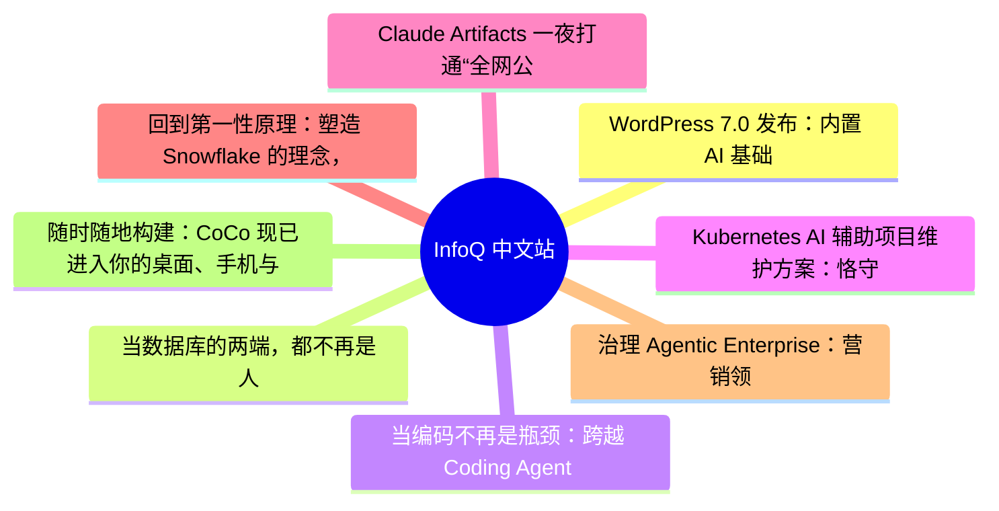

# 📰 InfoQ 中文站 Top 8 (2026-07-15)

## 思维导图

## 列表（8 条，3 条含全文）

### 1. WordPress 7.0 发布：内置 AI 基础能力、改进管理后台与设计套件
- **链接**: [https://www.infoq.cn/article/VAUIReF3N4Z4SkcosaYN?utm_source=rss&utm_medium=article](https://www.infoq.cn/article/VAUIReF3N4Z4SkcosaYN?utm_source=rss&utm_medium=article)
- **发布**: Wed, 15 Jul 2026 11:29:00 GMT
- **简介**: 点击查看原文>

📄 全文（3041 字符，点击展开）

WordPress，这个驱动着互联网大量网站的开源内容管理系统，现已发布 7.0 版本，带来了平台级 AI 基础设施、重新设计的后台管理界面，以及为区块编辑器提供的新设计工具。

WordPress 7.0 以爵士乐传奇人物 Louis Armstrong 命名，在错过原定的 4 月 9 日发布目标后，于 [2026 年 5 月 20 日](https://instawp.com/wordpress-7-0/) 正式发布。该版本由 Matias Ventura 主导，是 2026 年的首个主要版本，并开启了古腾堡（Gutenberg）项目第三阶段——以协作为核心的篇章。核心团队表示，共有[超过 875 名贡献者](https://instawp.com/wordpress-7-0/)参与，其中 200 多人是首次参与项目，为平台带来了超过 420 项增强功能和修复。

本次更新的核心变化之一是直接内置了 AI 基础能力。WordPress 7.0 引入了 AI 客户端、Abilities API，以及统一连接器管理中心，管理员只需点击几下即可认证外部 AI 服务商；同时还提供了一个[可选的官方 AI 插件](https://instawp.com/wordpress-7-0/)，用于生成图片、标题、摘要和替代文本。此外，官方 MCP 适配器还让 Cursor、Claude Code 和 Codex 等智能体能够[直接读写网站内容](https://www.reddit.com/r/Wordpress/comments/1sfmrfr/wordpress_70_ships_thursday_with_native_ai_write/)。

设计与编辑功能同样迎来大幅优化。现在按下 Cmd+K（Mac）或 Ctrl+K（Windows）快捷键可在任意界面调出命令面板；纯内容模式编辑功能能够保留页面整体结构样式，仅允许修改文字与图片；同时新增修订面板，支持对模板、模板部件及区块样式模板查看修改记录。字体库现已支持所有主题，新的 `@wordpress/grid` 包则标准化了基于网格的界面。

本次升级也存在一些门槛。程序最低 PHP 运行环境要求[提升至 7.4](https://www.whitelabeliq.com/blog/wordpress-7-0-is-the-biggest-core-release-in-8-years-heres-your-agencys-game-plan/)；此前万众期待的实时协同编辑功能，因性能与服务器负载方面的隐患，[从 7.0 版本中移除](https://www.reddit.com/r/CloudwaysbyDO/comments/1tisc3e/wordpress_70_mega_thread_features_update_risks/)。

社区对此评价两极分化，主要集中在 AI 的发展路线上。Hacker News 上有一位资深用户[写道](https://news.ycombinator.com/item?id=48212660)：“我使用 WordPress 多年，并不想要内置 AI 功能。” 还有用户表示，准备将自己的网站迁移至分支项目 ClassicPress。在 Reddit 上，开发者们提出两大顾虑：一是 AI 拥有写入权限带来的[安全隐患](https://www.reddit.com/r/Wordpress/comments/1sfmrfr/wordpress_70_ships_thursday_with_native_ai_write/)，二是更新引发的各类实际页面故障，有用户反馈升级后[网站样式错乱](https://www.reddit.com/r/Wordpress/comments/1tk66jx/wordpress_70_ruined_my_websites_styling/)。[r/ProWordPress 板块的一篇高热度帖文](https://www.reddit.com/r/ProWordPress/comments/1si2xa1/wordpress_70_the_good_the_ai_and_the_still_missing/)总结了当下社区的心态：“亮点不少、AI 褒贬不一、期待功能仍缺失。”

也有不少用户给出正面评价，尤其是在稳定性与日常工作流方面。技术服务商 eXcelisys 在评估本次版本更新价值时[总结道](https://excelisys.com/is-wordpress-7-0-worth-the-upgrade/)：“作为一次重大版本迭代，WordPress 7.0 整体稳定性表现出众，插件适配性良好，绝大多数网站都能顺畅完成升级。”

在 Reddit 上，一位参与测试版和候选版的开发者[认为连接器界面只是一个次要的噱头](https://www.reddit.com/r/Wordpress/comments/1tj4cnr/wordpress_70_explained_ai_connectors_abilities_api/)，WordPress “实际上推出了更有价值的功能：一个可供任何插件使用的 PHP AI SDK”，并配套了 Abilities API。通用的命令面板同样收获大量好评，[GoDaddy 评价该功能](https://www.godaddy.com/resources/news/wordpress-7-0-real-time-collaboration-arrives-in-core)：对于运营大量客户网站的建站服务商而言，这是一种润物细无声、长期增益显著的实用改进。

对于正在权衡替代方案的团队来说，[ClassicPress](https://www.classicpress.net/) 是一个无 AI、可选区块的选项，而对于希望采用不同管理架构的内容发布方，Drupal 和 Ghost 仍是常规备选对比方案。

准备升级的开发者应阅读 [WordPress 7.0 实操指南](https://make.wordpress.org/core/2026/05/14/wordpress-7-0-field-guide/)、[7.0 开发笔记](https://make.wordpress.org/core/tag/dev-notes+7-0/) 以及 [7.0 版本的官方文档](https://wordpress.org/documentation/wordpress-version/version-7-0/)。

WordPress 是一个开源内容管理系统，于 2003 年首次发布，由 WordPress 项目及其全球贡献者社区共同维护。它为从个人博客到大型出版商的各类网站提供支持，用户可通过网站后台面板或 WP-CLI 命令行工具完成版本更新。WordPress 7.1 [预计将于 2026 年 8 月](https://ivan-popov.medium.com/wordpress-7-0-is-almost-here-and-it-changes-more-than-you-think-3d8c842e847c)发布。

### 2. 当数据库的两端，都不再是人
- **链接**: [https://www.infoq.cn/article/sDyPWhAWPHttlQJTUwq3?utm_source=rss&utm_medium=article](https://www.infoq.cn/article/sDyPWhAWPHttlQJTUwq3?utm_source=rss&utm_medium=article)
- **发布**: Wed, 15 Jul 2026 10:42:31 GMT
- **简介**: 点击查看原文>

📄 全文（4021 字符，点击展开）

### 引言

“2026 年，超过 60％的 AI 项目，会被企业亲手放弃。”

这是 Gartner 的最新判断，问题往往不在模型，而在数据：数据接不进来，处理不充分，语义也无法对齐。

某种意义上，这也是过去两年企业付出的最贵学费：数据库的重要性，远超原本预期。

过去，许多企业忙于堆叠所谓“高质量数据库”，实现数据接入、清洗与治理。这在半年前，或许仍然奏效；但在今天，已难以支撑 AI 应用的实际需求。

变化的关键在于数据库的“使用者”正在发生转变。Databricks 在收购 Neon 后披露，其平台上约 80％的数据库实例由 Agent 自动创建。这意味着，数据库正从服务“传统应用”，转向服务“Agent”。

与传统应用不同，Agent 具备自主规划、高频访问、持续读写等特征。这种工作模式要求数据库不能只是被动存储，而是要主动适配 Agent 行为，在真实业务场景中释放数据价值。

"适配 Agent"将成为数据库的底层设计原则，这也意味着，产品形态需要被重写。日前，阿里云在「飞天发布时刻」栏目中推出 AI 原生数据库服务——以下简称 AIDBS。

AIDBS 定位为企业级 Data－Centric Agent 的一站式开发与服务平台，使数据能够被 Agent 理解、编排、流动与监管。

其架构预设了企业数据长期分布于多云、混合云及本地环境的现实，同时考虑到业务语义难以人工标注、DBA 与治理资源长期不足等问题，并尝试将这些复杂性收敛于平台之中。

换句话说，这是一款从一线真实需求出发的产品，强调落地与可用性，将实用主义推向极致。

### 一、接入只是第一步，让 Agent 读懂数据才是关键

在当下，很少有企业从零开始建设数据库。

现实情况是，企业数据早已分散在不同环境中：既有多云部署的数据，也有自建数据库，还有大量分布在各类多模态载体中。对于企业而言，任何要求“先迁移、再使用”的方案，都意味着高成本和高风险。

针对这一现实，阿里云给出的第一个答案，是“横向开放”。

具体方面，AIDBS 提供了一种全域资产管理模式：以阿里云为中心，打通企业自建库与其他云环境，目前已支持 40 余种跨云、多模态数据源。换句话说，数据无需“先搬家”，就可以被统一接入与管理。

第二个答案是“纵向打深”。

企业真正高价值的数据，往往大量存储于非结构化、多模态形态中，例如钉钉、网盘、OSS、SharePoint，甚至网页链接等各类载体。

AIDBS 通过统一元数据管理体系（OneMeta），对全域、全模态数据进行自动采集与解析。无论是文档、图片还是音视频，都可以匹配合适的模型进行语义提取，并进一步结构化沉淀，形成企业级统一的数据语义底座。

由此，数据库的边界被打开。但，仅有数据的“可接入”与“可解析”仍然不够。

长期以来，传统数据库并不算“懂”数据——把数据表原样丢给大模型，九成以上没法用起来。表太多、字段太多、语义太多，Agent 根本不知道这张表怎么用、两个语义怎么连。

因此，阿里云进一步在语义层做了两项关键设计。

其一，是构建 OneMeta 业务元数据层。将最底层的物理元数据翻译为业务语义，覆盖对象、指标、口径等，乃至行业知识。对 Agent 而言，不再是“表”和“字段”，而是“华东区域季度销售额”“近 30 天复购率”等可直接理解的业务表达。

其二，是引入 Agentic Native 的自动化数据治理机制。

从企业日常产生的 SQL、代码、命名规范及样本数据中持续提取知识，让语义以“自下而上”的方式不断沉淀与更新。基于此，AIDBS 构建 AI Ready 服务层，通过 Skill、MCP、API 等方式，让数据可被 Agent 直接调用，解决企业 Agent“找不到、用不了、用不准”数据的问题，并降低维护成本。

这一能力已经在实际业务中得到验证。

头部茶饮品牌古茗采用 AIDBS 中 Meta Agent（知识管理智能体）的实践，就是个典型注脚。这家在全国开着上万家门店的茶饮企业，过去也建过静态元数据平台，可用了半年就没人碰了——它只“展示信息”，不“解决问题”。

接入 Meta Agent 后，古茗换了思路：不让人去查它，而让它主动出现在研发流程里。研发写 SQL 时，Meta Agent 自动提示涉及哪些表、字段口径、有没有更合适的索引和同语义的现成视图；业务同学在 BI 平台拖字段时，自动告知字段的业务含义、最近谁改过、近 30 天取值分布，避免取错口径；做 DDL 审批时，自动算出血缘、影响面和风险等级，DBA 不再需要逐条人工评估。

得益于此，古茗业务系统的语义准确率大幅提升，DDL 审批的工作量下降了 30%-40%。这也表明，企业可在短时间内将数据资产推进至 AI Native 状态。

### 二、真正的实用主义，是让每种起点都能跑通

在具备业务语义的数据底座后，关键在于如何高效开发应用。

企业中的 Agent 需求多样且持续变化，单一开发路径难以适配复杂业务，也会限制数据价值的释放。

凭借深耕一线的经验，阿里云提炼出企业最常见的三类开发方式，对应不同起点与需求。

第一类：是已经构建了大量 Agent 的企业。

以去年在开发者圈层迅速走红的 Dify 为例，这类可视化 Agent 工作流编排平台（与 LangGraph 类似）已在不少企业中沉淀了丰富的 Agent 与工作流资产。

但随着更灵活的 Skill 时代到来，一个现实问题随之出现：这些存量资产是否需要推倒重来？AIDBS 给出的答案是：不需要。

一方面，AIDBS 平台可以托管 Dify、RAGFlow 等开发底座，为既有 Agent 补齐数据能力，使其能够快速接入企业数据、跑通真实业务；另一方面，还可以将已有 Agent 转化为可复用的 Skill。

不仅如此，平台还能读懂完整工作流，并自动生成对应 Skill 的使用方式和交互逻辑。例如，一个“简历匹配”Skill，只需输入 JD 即可触发匹配，并能在 Dify 中清晰看到调用过程与结果。

第二类：是拥有数据与系统，但不确定该构建什么 Agent 的企业。

这类企业的常见状态是：要么缺乏应用方向，要么需业务、技术与管理团队反复讨论，才能确定 Agent 类型，再进入预算、立项与交付流程。

在 AI 时代，这一模式明显落后。AI 不仅能够执行任务，更能判断“哪些 Agent 值得构建”。

基于此，阿里云 AIDBS 内置了智能化 Agent 开发功能 Proactive Agent。

当 AIDBS 完成对企业底层资产的梳理后，平台实际上已经具备了对业务轮廓的整体认知。在此基础上，AI 可以主动激发创意——结合行业趋势洞察，参考同类企业实践，推荐匹配的应用场景。一旦选定方向，15 分钟内即可通过 Vibe Coding 生成方案并完成验证。

第三类：是坚持自建的企业。

这类企业通常拥有成熟的技术团队和明确的架构偏好，未必采用平台化的完整开发流程，更关注如何在自建体系中高效、灵活地使用企业数据。

针对这一需求，AIDBS 可从两大维度提供支撑。

其一是专业能力，将阿里云数据库团队沉淀十余年、经过验证的企业级能力（如安全控制、数据分析、资产管理与运维等）封装为 100＋个 Data Skills，供开发者直接开箱即用节省大量数据侧的开发工作。

其二是通道，面向 Agent 访问数据，AIDBS 提供了 Agent 数据网关(Data Gateway)，把身份、权限、操作管控、敏感数据脱敏和智能路由全部集成到这一层网关上，覆盖阿里云全系数据库产品和各类数据源。网关会给企业的每个 Agent 颁发一个专属身份，Agent 凭这个身份、在自己的权限范围内访问正确的数据，敏感字段自动脱敏，全流程可审计、可追溯。

有了这两条，你本地不用囤一堆 Skill，能力过网关即取即用，访问又始终可信可控——企业里每个人、每个 Agent 都能放心地把数据用起来。

可以看到，这三种开发范式——定制化、智能化与 AI 原生——覆盖了从“已建 Agent”到“不知道建什么”再到“完全自建“的企业常见起点。从中不难看出 AIDBS 一以贯之的理念：企业不用去适配平台，而是平台主动去适配企业。

### 三、让 Agent 主动干活，深度参与企业业务

数据已接入，Agent 也已搭建，但更现实的问题是：企业投入大量成本建设的数据库，是否真正释放了价值？

答案往往是否定的。

这里面有经验的缺失——不是每家企业都养得起资深的数据分析和数据科学团队；也有能力的错配——数据大多还停在“被动等查询”的状态，很少主动参与到业务里去。

鉴于企业自建应用周期长、门槛高，阿里云将成熟的数据应用能力产品化，并直接交付企业使用。这正是 AIDBS 的智能应用层——Data Agent 系列的出发点，提供一组开箱即用的垂类 Agent，覆盖数据获取、分析与预测等核心场景。

在数据获取环节，DataBridge Agent 可以从网页及多源系统中抓取数据，并自动整理为结构化格式，适用于企业知识库等典型场景。

在数据洞察环节，Analytics Agent 能够理解业务目标，将复杂任务拆解为多步流程，逐步执行与校验；其过程中沉淀的分析资产，还可以在企业内部共享复用，形成持续积累。

在预测与决策环节，Forecast Agent 专注于解决不确定性问题。例如，某车企计划推出一款投入巨大的新车型，目标市场是否买单难以判断。通过构建多情景模拟，将业务假设与市场数据结合推演，可以提前识别风险、评估收

...（截断，原文 6470+ 字符）

### 3. 当编码不再是瓶颈：跨越 Coding Agent 规模化后的流程与成本双困局｜AICon深圳
- **链接**: [https://www.infoq.cn/article/1JIiNLEgyJ2UEPwS825r?utm_source=rss&utm_medium=article](https://www.infoq.cn/article/1JIiNLEgyJ2UEPwS825r?utm_source=rss&utm_medium=article)
- **发布**: Wed, 15 Jul 2026 10:00:00 GMT
- **简介**: 点击查看原文>

📄 全文（2291 字符，点击展开）

Agent 时代，哪些方向正在成为行业关键变量？50 + 实战案例揭晓答案！

模型参数规模不断突破，推理成本持续下降，开源生态日益繁荣。当模型能力逐渐成为行业共识，一个新的问题开始浮现：**当人人都能获得强大的模型能力之后，真正的竞争力还剩下什么？** 答案正在从模型能力本身，转向围绕模型构建可规模化的智能系统；从单点能力提升，转向系统工程与组织级落地能力。

在这一背景下，[2026 年 AICon 人工智能开发与应用大会 · 深圳站](https://aicon.infoq.cn/2026/shenzhen/track)正式启动。本次大会将于** 8 月 21 日—22 日**举办，聚焦 AI 基础设施、大模型系统、智能体工程、数据智能、多模态技术与行业落地等关键方向，邀请来自腾讯、阿里、华为、百度、蚂蚁集团等 50 + 头部科技企业技术负责人、科研机构一线专家，系统性分享前沿洞察与实战干货，共同探讨 AI 技术从能力到系统、从实验到生产的真实路径。

网易游戏 AI 产品策划专家蓝师师已确认出席 “[AI 原生新范式：Coding Agent 重构软件研发全流程](https://aicon.infoq.cn/2026/shenzhen/track/1956)” 专题，并发表题为**《**[当编码不再是瓶颈：跨越 Coding Agent 规模化后的流程与成本双困局](https://aicon.infoq.cn/2026/shenzhen/presentation/7176)**》**的主题分享。当 AI Coding 在团队的渗透率和代码生成覆盖率双双突破 80% 后，研发整体周期缩短并不明显，但月度 Token 账单却一路高歌猛进，突破千万大关。所以 AI 把“写代码”提速后，出现了两个新的困局：不适配的 AI 研发协作流程与难以治理的 AI 使用成本。

本次分享将完整拆解两大困局的解法：

- 如何通过 SDD 的全环节引入，重构研发协作全流程，解决需求质量和测试效率问题； 
- 如何通过 Auto 模型智能路由、本地代码知识图谱、上下文治理等方式，逐步降低 AI 使用成本，提高 Coding Agent 的 ROI。 

蓝师师，香港中文大学 CS 硕士，网易游戏 AI 产品策划专家，专注于游戏研发全流程提效与企业级智能知识服务搭建。她在本次会议的详细演讲内容如下：

演讲提纲：

AI 将编码环节大幅提速后，为何需求交付缩短周期未能与高额账单相匹配？

回顾自研 AI Coding 工具在网易游戏的演进历程。

Coding Agent 规模化落地后绕不开的两道困局

流程：研发瓶颈被转移到代码编写的需求上游与测试下游环节。写得快，不等于写得对、测得完。

成本：开发者在模型“降本”与“降智”之间走钢丝。Token 花得多，不等于用得对、做得好。

2. 研发流程重塑篇：全环节引入 SDD，重构研发协作全流程，解决需求质量和测试效率问题。

需求上游：SDD 左移至策划，让需求说得清。

测试下游：SDD 延续至 QA，让测试测得准。

从 Harness Engineering 到 Looping Engineering。

3. AI 成本治理篇：全流程逐级优化，不被账单牵着鼻子走。

本地代码知识图谱：不做漫无目的的地毯式代码检索。

模型智能路由：杀鸡焉用牛刀，让合适的模型做合适的事情。

上下文治理：Agent 链路指导多环节优化。

4. 长线运营：AI Coding 规模化落地三支柱。

工具建设：周边生态重于 Agent 本身。

文化建设：让 Spec First 与 Token 经济学深入人心。

流程建设：用数据倒逼流程改造。

5. 总结与展望：从“个人提效”到“组织智慧”。

这样的技术在实践过程中有哪些痛点？

如何改进流程与配套工具，调动研发链上的全职能参与 SDD。

如何在成本治理和效果保障上取得平衡。

听众收益

一套可复制的 SDD 落地实战。

一份规模化 Coding Agent 的“成本治理工程清单”。

AI 时代组织能力升级的长线运营策略。

除此之外，本次大会还策划了[AI Infra、推理工程与异构计算](https://aicon.infoq.cn/2026/shenzhen/track/1949)、[超级个体与蜂群智能的共生进化](https://aicon.infoq.cn/2026/shenzhen/track/1950)、[迈向机器人 AGI 的关键技术与产业实践](https://aicon.infoq.cn/2026/shenzhen/track/1952)、[Agent 安全：从风险到可控](https://aicon.infoq.cn/2026/shenzhen/track/1953)、[端侧智能与 AI 原生终端](https://aicon.infoq.cn/2026/shenzhen/track/1955)、[AI Agent 高价值商业场景实战](https://aicon.infoq.cn/2026/shenzhen/track/1958)等 11 个专题论坛，届时将有来自不同行业、不同领域、不同企业的 50+资深专家在现场带来前沿技术洞察和一线实践经验。

大会限时早鸟票享 8 折专属优惠，现在报名立减 1160，更多详情可扫码或联系票务经理 13269078023 进行咨询。

### 4. Kubernetes AI 辅助项目维护方案：恪守人为责任优先原则
- **链接**: [https://www.infoq.cn/article/mKDCAL0Tr0AaaXJlPIrE?utm_source=rss&utm_medium=article](https://www.infoq.cn/article/mKDCAL0Tr0AaaXJlPIrE?utm_source=rss&utm_medium=article)
- **发布**: Wed, 15 Jul 2026 09:43:44 GMT
- **简介**: 点击查看原文>

### 5. Claude Artifacts 一夜打通“全网公开分享+多人编辑”，AI 交付闭环彻底杀疯了
- **链接**: [https://www.infoq.cn/article/Pqcx0ktTdljvoQ3OMxze?utm_source=rss&utm_medium=article](https://www.infoq.cn/article/Pqcx0ktTdljvoQ3OMxze?utm_source=rss&utm_medium=article)
- **发布**: Tue, 14 Jul 2026 22:01:15 GMT
- **简介**: 点击查看原文>

### 6. 回到第一性原理：塑造 Snowflake 的理念，以及下一步 ｜ Summit 2026
- **链接**: [https://www.infoq.cn/video/ffZEu3m2LMOy0cPEbYXl?utm_source=rss&utm_medium=article](https://www.infoq.cn/video/ffZEu3m2LMOy0cPEbYXl?utm_source=rss&utm_medium=article)
- **发布**: Tue, 14 Jul 2026 19:00:00 GMT
- **简介**: 点击查看原文>

### 7. 治理 Agentic Enterprise：营销领导者当下必须知道的事 ｜ 技术趋势
- **链接**: [https://www.infoq.cn/article/kMa4NtkHgLNFMJ02bIjJ?utm_source=rss&utm_medium=article](https://www.infoq.cn/article/kMa4NtkHgLNFMJ02bIjJ?utm_source=rss&utm_medium=article)
- **发布**: Tue, 14 Jul 2026 18:40:43 GMT
- **简介**: 点击查看原文>

### 8. 随时随地构建：CoCo 现已进入你的桌面、手机与 Slack ｜ 技术趋势
- **链接**: [https://www.infoq.cn/article/GDIRmc9ZvzZVT7bWVPCz?utm_source=rss&utm_medium=article](https://www.infoq.cn/article/GDIRmc9ZvzZVT7bWVPCz?utm_source=rss&utm_medium=article)
- **发布**: Tue, 14 Jul 2026 18:01:30 GMT
- **简介**: 点击查看原文>
