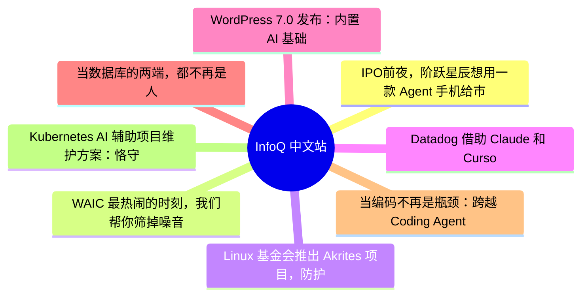

# 📰 InfoQ 中文站 Top 8 (2026-07-16)

## 思维导图

## 列表（8 条，3 条含全文）

### 1. IPO前夜，阶跃星辰想用一款 Agent 手机给市场吃一颗定心丸
- **链接**: [https://www.infoq.cn/article/PuGOGJPBElTjpCGSwrAu?utm_source=rss&utm_medium=article](https://www.infoq.cn/article/PuGOGJPBElTjpCGSwrAu?utm_source=rss&utm_medium=article)
- **发布**: Wed, 15 Jul 2026 22:19:06 GMT
- **简介**: 点击查看原文>

📄 全文（4021 字符，点击展开）

7 月 13 日晚，上海花园礼堂，阶跃星辰一口气发布了终端品牌 STEPX、智能体操作系统 Step AOS、个人智能体 Amoo，并让首款智能体手机 STEPX Neo 公开亮相。

发布会信息很多，但真正值得关注的，不仅仅是阶跃做了全球首款大模型原生 Agent 手机。

一家成立三年的大模型公司，第一次把模型、操作系统、智能体和硬件终端同时摆到台前，试图告诉外界：阶跃星辰不准备只做一家出售 API 和 Token 的模型公司，它想直接进入终端，控制从模型能力到用户体验的完整链路。

这场发布会发生在一个特殊的时间点。

2026 年 1 月，阶跃星辰宣布完成超过 50 亿元人民币的 B+轮融资，旷视科技联合创始人、千里科技董事长印奇同时出任阶跃星辰董事长，负责整体战略节奏与技术方向。5 月，多家媒体报道称，阶跃星辰正在完成一笔接近 25 亿美元的融资，已经拆除红筹架构，并推进赴港上市。

在这样的背景下，STEPX 的出现更像是阶跃星辰在 IPO 之前，对“自己究竟是一家什么公司”给出的回答。

它想讲的故事和其他模型公司很不一样，他们在做软硬件一体化这件事。

## Coding 不是一条现在才可以复制的捷径

过去一年，Anthropic 凭借 Claude Code 和企业级 Agent 快速增长，Coding 也被越来越多模型公司视为最清晰的商业化路径之一。

但在印奇看来，Anthropic 今天的结果，并不意味着中国大模型公司现在转向 Coding，就能复制同样的轨迹。

“现在全球范围最热门的是 Anthropic，但是 Anthropic 在 2021 年的时候就制订了 Coding 战略，大家看到今天的 Anthropic 是五年之后的结果。”

印奇在发布会后的媒体采访中说，“我想对于一家大模型创业公司，首先不可能后来居上，所以必须要在一开始就有选择、有取舍、有相信。”

这句话真正想表达的，并不是 Coding 没有价值，而是模型公司的战略窗口往往比产品爆发早很多年。

Anthropic 在 Coding 尚未成为行业共识时就开始投入，最终形成了模型、工具、开发者和企业客户之间的飞轮。等到 Claude Code 证明商业价值之后，再把 Coding 当作统一答案，面对的已经是一个拥有先发模型、用户习惯和生态优势的对手。

阶跃需要找到另一条路径。

智谱的优势更多体现在企业服务、开发者平台和模型 API，MiniMax 较早建立了面向消费者的产品矩阵，并通过 Talkie、海螺 AI 等产品进入海外市场，DeepSeek 则依靠开源、模型效率和低成本推理形成影响力。MiniMax 上市时，海外消费者业务已经成为其重要收入来源，DeepSeek 持续开放模型及基础设施代码，并不断压低 API 价格。

相比之下，阶跃此前虽然拥有基础模型、多模态模型以及手机、汽车合作，但缺少一个足够清晰的消费者入口。模型能力最终由谁使用、使用频率如何提升、数据怎样回流，以及商业价值如何覆盖研发投入，这些问题仍需要一个具体载体来回答。

印奇在采访中说得更直接：“任何一家公司如果不能够交付最终用户的价值，并且这个价值不能够匹配研发投入，我觉得这样的公司很难长期有价值。”

所以，阶跃选择了终端。

## 手机是产品，也是 IPO 故事的载体

STEPX Neo 目前还不是一款信息完整的消费电子产品。

发布会上，阶跃没有公布手机的芯片、屏幕、电池、价格、正式上市日期和预期出货量。公开展示的重点主要是 Step AOS、个人智能体 Amoo，以及模型如何跨应用完成任务。媒体报道也指出，此次活动没有正式展示可供体验的量产真机，产品具体配置和上市时间仍未公布。

因此，现阶段更准确的理解是：STEPX Neo 首先是一台战略样机。

它的任务不是立即与苹果、华为、小米、OPPO 争夺手机销量，而是证明阶跃所提出的模型、系统和终端闭环能够成立。

此前，阶跃主要向手机和汽车厂商提供模型能力。这种 ToB 模式仍会继续，但问题在于，模型厂商只能作为供应商进入别人设计好的设备，很难决定系统权限、数据结构、算力分配和交互逻辑。

印奇解释称，在当前手机生态中，阶跃很难将模型、操作系统和智能体产品完整地放进现有终端，因此需要先做出一台自己的设备。

“如果我们自己现在不能够率先做出这样一个创新的终端，其实我们的 Step AOS 很难形成一个价值闭环，也很难让消费者用到，这是一个特别简单的逻辑。”

换句话说，阶跃做手机，并不完全是因为它想成为一家传统手机厂商，而是因为它需要一块不受旧操作系统限制的试验田。

传统手机围绕“人操作 App”设计。算力、内存、电池、权限和后台管理，主要服务游戏、视频、社交和通信等应用。Agent 却需要长期记忆用户信息、在多个应用之间调用服务、持续访问端云模型，并在后台完成多步骤任务。

阶跃提出的 Step AOS，就是在 Android、Linux 和 RTOS 之上，增加一套面向智能体的运行环境，将计算资源、数据、权限和应用能力重新组织起来。

印奇认为，现在的 Agent 擅长写代码、写文章，却不擅长在手机和 PC 上执行大量真实指令。没有操作系统、终端和用户行为数据，它可能永远学不会这些事情。

这里包含了阶跃软硬件一体路线最关键的一层逻辑：硬件不是最终目的，数据飞轮才是。

手机让 Agent 获得摄像头、麦克风、定位、个人文件和应用服务等真实上下文；Step AOS 负责权限、记忆和任务执行；Amoo 连接用户；基础模型则通过这些真实任务数据继续迭代。

在印奇看来，仅靠公共语料和相近的模型架构，中国头部模型公司的能力最终可能趋同。

“如果只是一个基础模型，一流的公司互相之间会比较接近。如果没有一个 Super APP 来牵引你的模型，大家最终的模型会在一段时间内共同达到比较类似的水平。”

STEPX 承担的，就是阶跃为自己寻找 Super APP 和专属数据入口的任务。

## 印奇给阶跃带来的，不只是一部手机

阶跃星辰并不是在印奇加入之后，才第一次提出“AI+终端”。

公司此前已经与手机、汽车厂商合作，也一直强调多模态和端侧模型。但印奇的到来，明显加快了这一战略从合作伙伴方案走向自有操作系统和硬件品牌的速度。

他在采访中也没有把这条路线完全归功于自己。

“阶跃这样一家公司，从 Day 1 开始就相信软硬件结合，相信大模型需要通过好的硬件载体，面向消费者，是 ToC、而不是 ToB，最终能够形成我们未来的商业化闭环。这个战略是从第一天开始就存在的。我加入之后，本质上是加速这样一个战略的落地。”

印奇对阶跃的影响，更多体现在三个方面。

首先，他强化了“模型必须找到商业闭环”的紧迫感。

阶跃最初由微软前全球副总裁姜大昕创立，技术团队长期强调基座模型、多模态和系统工程能力。印奇加入后，公司没有放弃基模，反而称基础模型仍占内部投入的绝对比重，但模型研究被更明确地放入终端和商业化框架中。

这也是技术创始人与产业型董事长之间的分工：姜大昕继续负责公司的经营和技术体系，印奇则负责战略选择、产业协同以及如何把模型推向现实世界。

其次，印奇带来了明显的软硬结合倾向。

他是旷视科技联合创始人，目前同时担任千里科技董事长，已经从计算机视觉、城市和供应链项目，走到汽车、智能座舱和终端产业。阶跃宣布其出任董事长时，也明确提到将与千里科技深化合作，推动“AI+终端”战略。

在采访中，印奇反复强调自己的博士研究方向涉及硬件传感器，也把汽车视为软硬件一体的典型样本：模型只有进入一个物理载体，才可能形成数据、产品和服务的完整循环。

这种思维也被带入手机。

模型不再只是一项可以出售给不同客户的技术，而是必须与芯片、系统、感知设备、应用接口共同设计。阶跃甚至认为，现有端侧芯片尚不能满足未来 Agent 需要，智能体手机最终可能推动新的计算架构、存算一体方案和感知芯片出现。

第三，印奇带来了更强烈的资本市场视角。

他经历过上一轮计算机视觉创业潮，也经历过 AI 公司在商业化、持续融资和上市过程中的现实约束。现在，他对阶跃提出的要求不是阶段性登顶某个榜单，而是产品价值必须覆盖研发投入，公司必须拥有一个可以“养活”模型的应用。

从这个角度看，STEPX 不仅是产品战略，也是阶跃在 IPO 前补充商业叙事的关键一步。

资本市场很难长期只为模型参数、Benchmark 和技术愿景定价。它最终会追问：用户在哪里、收入来自哪里、模型调用如何增长，以及重资产研发怎样形成回报。

阶跃给出的答案是，把模型装进硬件，通过终端获得用户、数据和 Token 消费。

## 阶跃不是要靠卖手机赚钱

但这套商业闭环目前并未完全成形。

印奇明确表示，STEPX 未来“一定不是靠简单卖硬件去赚钱”，也不会依靠长尾应用预装和广告费用盈利。

他对硬件的定义是：“硬件是一个容器，大家用的还是 Agent 服务。”

这意味着，阶跃真正想出售的，可能不是一部手机，而是运行在手机上的模型和 Agent 服务。硬件负责获客和建立入口，收入最终仍可能来自订阅、Token 消耗、服务分成，以及 Step AOS 向其他设备厂商开放后的生态收益。

印奇甚至判断，用户未来可能从缴纳电话费、流量费，逐渐转向支付 Token 费用，运营商也可能继续作为基础设施提供者参与其中。

这让 STEPX 更接近一台 Agent 服务终端，而不是传统意义上的消费电子产品。

问题在于，这套模式仍然有大量未解之处。

阶跃尚未公布具体收费方式，也没有设定公开的销量

...（截断，原文 5429+ 字符）

### 2. WAIC 最热闹的时刻，我们帮你筛掉噪音
- **链接**: [https://www.infoq.cn/article/PvrHDsA3SK724SzGZXjr?utm_source=rss&utm_medium=article](https://www.infoq.cn/article/PvrHDsA3SK724SzGZXjr?utm_source=rss&utm_medium=article)
- **发布**: Wed, 15 Jul 2026 16:00:00 GMT
- **简介**: 点击查看原文>

📄 全文（4021 字符，点击展开）

再过几天，WAIC 2026 就要在上海拉开帷幕了。

每年这个时候，整座城市都像被调成了“AI 模式”——新发布、新产品、演讲金句，热搜一个接一个。热闹，是从不缺席的。

但站在人声鼎沸的场馆中、熙熙攘攘的人群里，我们时不时还会听到另一种声音。技术人在问：这些看起来很猛的 Demo，哪些真的跑进了生产线？创业者在算：Token 账单和融资节奏，到底哪个先撑不住？投资人在看：头部公司都被下注完了，下一笔钱该押给谁？一个绕不开的问题浮上来——当所有人都在为 AI 进展欢呼，我们是不是该先问一句：哪些变化是真的，哪些只是热闹？

作为一家长期跟踪技术前沿做深度报道的媒体，我们深知热闹表象背后泡沫的存在，InfoQ 这次不想只做一份“展商导览”或“发布汇总”。作为今年 WAIC 官方合作媒体，我们在现场搭了一个媒体第二直播间，策划了主题为《请回答 WAIC 2026：AI 正在重写什么》的系列直播：三天、近二十场对话，不追着热闹跑，而是带着真问题进场，把话筒递给真正写代码、做产品、搭基础设施、投赛道、做公司决策的人。**我们想做的，是在 hype 最强的现场，当那个帮你筛信号的人。**

下面是这三天我们准备聊的：

## 17 号下午｜请回答 WAIC 2026：AI 正在重写什么

作为三天系列直播的开篇，我们希望先帮观众把“看 WAIC 的问题框架”搭起来——AI 产业是不是已经从模型能力展示转到了系统性落地？什么样的 AI 产品才真正成立？从产业、资本、技术、模型与基础设施四个视角，把“新阶段 AI 竞争真正的胜负手”聊透；随后带问题进展区，以最犀利的媒体视角、最真实的现场体验，带你在热闹展馆中找到新物种出现的蛛丝马迹。

#### 13:00–14:00｜圆桌访谈：AI 产业进入新阶段了吗？

- **核心追问：**2026 年 AI 产业到底进入了什么样的新阶段？当模型能力不再是唯一胜负手，产品定义、推理成本、Agent 能力、基础设施、开发者生态、出海哪一项更值得押注？
- **现场嘉宾：**- 方汉，昆仑万维董事长兼 CEO - 吉星，L2F 光源创始人基金管理合伙人 - 郭文，北电数智技术负责人 - 刘卓涛，DeepKernel 发起人、首席科学家 

#### 14:00–16:00｜现场探展：从 Coding 到办公，AI 新物种出现了吗？

## 18 号上午｜水面之下：AI 底座正在发生什么变化

这半天我们把镜头沉到“水面之下”。当 Agent 从 Demo 被塞进企业系统，最先压垮的往往不是技术架构，而是钱包。三场连聊 Agent 基础设施：到底谁是 Infra 成本吞金大户、GPU 原生数据库为什么必要、一线 Infra 负责人真实复盘——越往底座走，越需要具体的人、具体的账、具体的瓶颈。

#### 09:30–10:25｜圆桌访谈：为了钱包考虑，你必须关注的 Agent 基础设施

- **核心追问：**计算、存储、网络，谁是吞金大户？普通人的 Agent 规划该如何进行，以避免 Token 破产？
- **现场嘉宾：**- 王凯，优刻得 CTO - 张文涛，焱融科技 CTO - 杨秋弟，阿里云智能资深产品专家 

#### 10:30–11:10｜深度对话：AI Agent 真落地，为什么需要 GPU 原生认知数据库？

- **核心追问：**哪些技术判断被 Agent 时代重新改写了？如何证明 GPU 原生认知数据库真的有价值？
- **现场嘉宾：**孙元浩，星环科技创始人、CEO

#### 11:30–12:30｜1v1 对话：来自 Agent Infra 负责人的心声、复盘、规划与思考

- **核心追问：**Agent Infra 当前的效果和影响怎么界定？未来对 AI 应用的直观影响体现在哪些方面？从时间、资源等角度，当下构建的问题和成绩分别是什么？
- **现场嘉宾：**师天麾，清程极智 联合创始人

## 18 号下午｜人人都是 AI Builder：AI 如何改变创造方式

这半天我们会把开发者和创作者一起请上台，用真实项目经验回答“AI 如何改变创造方式”。AI Coding 怎么算 ROI、一个人用 AI 能做到什么程度、生成门槛降低后创作者真正稀缺的是什么——四场连轴，从工程实践一路聊到创作现场。

#### 13:00–13:55｜圆桌访谈：当 AI Coding 成为日常，开发者真正该关心什么？

- **核心追问：**AI Coding 工具怎样才好用？当企业开始限制 Token、计算 ROI 时，应该用什么指标？AI Coding 如何改变工程师能力结构和成长路径？
- **现场嘉宾：**- 滕昱，Sirius contributor、前外企研发负责人 - 郑鑫祺，小红书 AI Coding 总架构师 - 唐飞虎，月之暗面开发者关系负责人 

#### 14:00–14:50｜1v1 对话：一个人，能用 AI 做出什么？——和一位顶级 AI Builder 深聊

- **核心追问：**你最近用 AI 做出的最有意思的东西？AI 让你一个人完成了哪些过去团队才能完成的事？怎么快速区分“自嗨需求”和“用户愿意付费的真实痛点”？长期用 Claude Code 批量开发产品，真实的 Token 消耗和成本控制方法？
- **现场嘉宾：**手工川，Lovstudio.ai 创始人、资深独立开发者、AI / OPC 布道师

#### 14:55–15:45｜圆桌访谈：AI 创作场——当生成门槛降低，真正稀缺的是什么？

- **核心追问：**当所有人都能生成内容，创作者真正的壁垒变成什么？哪些 AI 创作工具已进入真实工作流，哪些还停在 Demo 阶段？
- **现场嘉宾：**- Owen，OiiOii 产品经理 - 布鲁斯，SeaArt.ai 首席运营官 - AI 逼逼叨，抖音 AIGC 内容点评博主 

#### 15:50–16:30｜深度对话：做 AI 的最佳伙伴：定义 Token 从“生产”到“应用”的确定性旅程

- **核心追问：**Agent 全面落地，底层算力基础设施需要突破哪些技术瓶颈？底层算力架构、资源差异化供给、专属算力运维链路、客户混合 AI 部署适配哪一项更关键？
- **现场嘉宾：**首都在线 COO 董直烨

## 19 号上午｜热闹之外：什么才是值得下注的真机会

这半天我们将掰开来聊透具身智能：哪些场景真赚钱、规模化卡在哪、VLA 和世界模型谁更接近终局。在噪声最多的赛道里，帮你看清信号——具身智能到底是不是“虚假繁荣”。

#### 09:30–10:30｜圆桌访谈：具身智能的落地分水岭——哪些场景真的跑出了商业闭环？

- **核心追问：**现在具身智能真正跑出商业闭环的场景有哪些？共同特征是什么？从样板项目走向规模化交付，最大瓶颈在硬件可靠性、现场适配成本、运维成本、客户付费意愿，还是组织交付能力？
- **现场嘉宾：**- 黄盛，德马科技集团股份有限公司 战略副总裁 - 李元庆，乐享科技联席 CTO、穹明智能总经理 

#### 10:35–11:35｜1v1 对话：具身行业的“取巧”路，何时结束？

- **核心追问：**“全民数采”风下，具身智能领域的“数据红利”可能会出现在哪里？VLA 和世界模型哪条路径更有可能接近具身终局？是否还有第三条路？具身智能商业化，是否在进入一个“虚假繁荣期”？
- **现场嘉宾：**沈宇军，蚂蚁灵波科技 首席科学家

#### 11:40-12:20 | 深度对话：穿越技术周期：从时序数据库到 AI 原生的工业数据底座

- **核心追问：**生成式 AI 浪潮下，技术人和创业者如何应对颠覆和泡沫？AI 原生的工业数据底座长什么样？中国软件产品如何做全球化？
- **现场嘉宾：**陶建辉，北京涛思数据科技有限公司创始人 &CEO

## 19 号下午｜请回答 WAIC 2026：哪些变化是真的，哪些只是热闹

收官局，我们想带大家静下心来做个消化总结，将那些喧嚣的热点拉回到落地的现实，一起聊聊：哪些是真趋势？哪些是伪需求？哪些叙事被高估了？哪些技术又被低估了？最后半天，是时候把那个被反复追问的核心问题真正接住了——AI 究竟在重写什么。

#### 13:20–14:20｜圆桌访谈：收官特别场——三天后再看 WAIC，AI 正在重写什么？

- **核心追问：**用一个关键词定义 WAIC 2026 的“重写”？哪一个变化是“已经真正进入业务流”的？哪一个是热度明显高过真实进展？下一个真正的大变化会来自哪？未来一年，钱、人、技术往哪流？
- **现场嘉宾：**- 郭权玮，语生科学首席科学家 - 杜雨，未可知人工智能研究院院长、前红杉资本中国基金投资副总裁 - 连文昭，上海交通大学人工智能学院教授、源络科技创始人 - 龚珊三，扩散智能联合创始人 

#### 14:25–15:05｜深度对话：AI 耳机下半场：从录音工具到办公 Agent 入口

- **核心追问：**AI 硬件，能参考互联网或消费电子的经验吗？AI 耳机到底是不是个好赛道？除了硬件和大模型，AI 耳机还要具备什么？
- **现场嘉宾：**马啸，未来智能创始人兼 CEO

#### 15:10–15:55｜圆桌访谈：AI 产业是否已到奇点时刻——中国企业如何分层协同出海？

- **核心追问：**全球 AI 跨入智算工业化量产与推理经济时代，中国 AI 产业链如何分层协同出海？当闭源模型溢价趋零，企业的终极护城河与 RaaS 商业升级何在？单打独斗的

...（截断，原文 4726+ 字符）

### 3. Linux 基金会推出 Akrites 项目，防护核心开源软件免受 AI 网络威胁侵害
- **链接**: [https://www.infoq.cn/article/WL9yUw7LJbBFTgzwXbVZ?utm_source=rss&utm_medium=article](https://www.infoq.cn/article/WL9yUw7LJbBFTgzwXbVZ?utm_source=rss&utm_medium=article)
- **发布**: Wed, 15 Jul 2026 15:00:00 GMT
- **简介**: 点击查看原文>

📄 全文（2455 字符，点击展开）

[Linux 基金会](https://www.linuxfoundation.org/)正式发起 [Akrites](https://akrites.org/linux-foundation-and-industry-leaders-launch-akrites-to-defend-critical-open-source-software-against-ai-enabled-cyber-threats/) 倡议项目，这是一项面向全行业的全新倡议，旨在保护全球最关键的开源软件免受快速演进的 AI 驱动网络的威胁。该倡议获得了超过 20 家创始机构的支持，包括主要云服务商、AI 公司、金融机构、网络安全厂商及开源基金会。Akrites 建立了一个协调框架，用于在攻击者利用漏洞之前识别、修复并负责任地披露安全漏洞。

创始成员包括[亚马逊云科技](https://aws.amazon.com/)、[Anthropic](https://www.anthropic.com/)、[谷歌](https://www.google.com/)、[微软](https://www.microsoft.com/)、[OpenAI](https://openai.com/)、[NVIDIA](https://www.nvidia.com/en-us/)、[IBM](https://www.ibm.com/us-en)、[Red Hat](https://www.redhat.com/en)、[Cisco](https://www.cisco.com/site/za/en/index.html)、[Chainguard](https://www.chainguard.dev/)、[Sonatype](https://www.sonarype.com/) 以及多家全球金融机构。各方共同致力于通过共享的[安全事件响应团队（SIRT）](https://sirt.org/c-sirt/)和标准化的[协调漏洞披露（CVD）](https://en.wikipedia.org/wiki/Coordinated_vulnerability_disclosure)流程，协调关键开源项目的漏洞修复工作。

发起这项倡议的根源在于行业愈发担忧生成式 AI 的发展已从根本上打破了攻防双方的平衡。如今借助 AI 模型仅需数分钟就能找出通用软件中的漏洞，而非以往的数周，这大幅压缩了从漏洞暴露到被利用的窗口期。在某些情况下，安全补丁一经公开，黑客几乎能立刻生成漏洞并利用代码，给开源维护者与基础设施运营者留下的处置响应时间越来越短。

开源软件支撑着现代经济的几乎所有领域，从银行、医疗到电信、交通、能源网络、政府以及 AI 基础设施本身。尽管开源生态系统历来依赖志愿者维护者和去中心化的漏洞披露机制，但 Akrites 项目意识到，面对 AI 驱动下极速演变的网络攻击，如今软件防护工作需要项目维护者、基础设施运维方、安全研究人员以及依赖开源项目的各类企业机构协同开展工作。

Akrites 项目并非要再打造另一个安全扫描工具，而是专注于改进关键漏洞被发现后的处理方式。该倡议建立了一个共享的事件响应能力，使参与组织能够私下验证漏洞、与上游维护者协调补丁，并在细节公开之前同步进行负责任的披露。

这种协调方式旨在解决开源维护者当今面临的一大核心难题：在应对日益强大的 AI 辅助攻击者的同时，管理来自多个组织的同步漏洞报告。Akrites 提供通用工具、共享工作流程和保密优先的流程，旨在减少重复工作，同时加速关键项目的补丁可用性。

Akrites 并不会取代现有倡议，而是对开源生态中已开展的各类相关工作形成补充。该倡议建立在[开源安全基金会（OpenSSF）](https://openssf.org/)和 [Linux 基金会的 Alpha-Omega](https://alpha-omega.dev/) 项目的工作基础之上，这两个组织已在软件供应链安全、维护者支持、漏洞管理和安全开发实践方面投入了大量资源。

OpenSSF 专注于制定安全标准、最佳实践和工具，而 Akrites 则引入了一个专注于在公开披露之前协调修复关键漏洞的运营响应层。工作重心从单纯发现漏洞转向确保在攻击者有机会将其武器化之前完成修复和部署。

该倡议的启动反映出网络安全行业正在发生一场大范围转变。前沿 AI 模型的最新进展已展现出在漏洞发现、代码分析、漏洞利用生成和自动推理方面日益复杂的能力。虽然这些能力为防御方提供了守护软件安全的新式利器，但同时也大幅降低了攻击者的技术门槛，使其能够以前所未有的规模自动化开展漏洞研究。

Akrites 的创始成员认为，现在保护关键基础设施需要采用与长期以来推动开源创新相同的协作模式。该倡议不再让各组织独立发现和报告漏洞，而是促进协调工程资源、共享资金和联合修复工作，力争在漏洞公开、可被恶意利用之前守住软件生态安全。

该倡议也凸显了网络安全领域理念的转变。以往，负责任披露机制的核心是通知厂商与开源维护人员。然而，在 AI 时代，各组织逐渐认为协同修复、保密协作与快速补丁部署具备同等重要的地位。随着 AI 大幅压缩了从漏洞发现到漏洞被利用的时间窗口，快速协调整个生态系统的能力可能成为该行业最有效的防御手段之一。

Akrites 绝不只是又一项安全倡议，它反映了对开源安全所依赖的假设正在发生变化的认知。曾经推动开源软件成为现代计算基础设施的协作模式如今必须进化才能防御装备着日益强大 AI 系统的对手。

通过整合共享事件响应机制、协同漏洞披露流程与集体工程技术力量，Linux 基金会及其合作方押注：多方协同防护体系的响应速度能够跟上 AI 技术的迭代节奏。这套方案能否行之有效，不仅将决定开源安全行业的未来，更会影响高度依赖开源软件的数字基础设施整体抗风险能力。

### 4. Datadog 借助 Claude 和 Cursor 完成测试驱动式生产环境迁移
- **链接**: [https://www.infoq.cn/article/T4BhLjLfHYBC8rNfQVxe?utm_source=rss&utm_medium=article](https://www.infoq.cn/article/T4BhLjLfHYBC8rNfQVxe?utm_source=rss&utm_medium=article)
- **发布**: Wed, 15 Jul 2026 13:00:00 GMT
- **简介**: 点击查看原文>

### 5. WordPress 7.0 发布：内置 AI 基础能力、改进管理后台与设计套件
- **链接**: [https://www.infoq.cn/article/VAUIReF3N4Z4SkcosaYN?utm_source=rss&utm_medium=article](https://www.infoq.cn/article/VAUIReF3N4Z4SkcosaYN?utm_source=rss&utm_medium=article)
- **发布**: Wed, 15 Jul 2026 11:29:00 GMT
- **简介**: 点击查看原文>

### 6. 当数据库的两端，都不再是人
- **链接**: [https://www.infoq.cn/article/sDyPWhAWPHttlQJTUwq3?utm_source=rss&utm_medium=article](https://www.infoq.cn/article/sDyPWhAWPHttlQJTUwq3?utm_source=rss&utm_medium=article)
- **发布**: Wed, 15 Jul 2026 10:42:31 GMT
- **简介**: 点击查看原文>

### 7. 当编码不再是瓶颈：跨越 Coding Agent 规模化后的流程与成本双困局｜AICon深圳
- **链接**: [https://www.infoq.cn/article/1JIiNLEgyJ2UEPwS825r?utm_source=rss&utm_medium=article](https://www.infoq.cn/article/1JIiNLEgyJ2UEPwS825r?utm_source=rss&utm_medium=article)
- **发布**: Wed, 15 Jul 2026 10:00:00 GMT
- **简介**: 点击查看原文>

### 8. Kubernetes AI 辅助项目维护方案：恪守人为责任优先原则
- **链接**: [https://www.infoq.cn/article/mKDCAL0Tr0AaaXJlPIrE?utm_source=rss&utm_medium=article](https://www.infoq.cn/article/mKDCAL0Tr0AaaXJlPIrE?utm_source=rss&utm_medium=article)
- **发布**: Wed, 15 Jul 2026 09:43:44 GMT
- **简介**: 点击查看原文>
