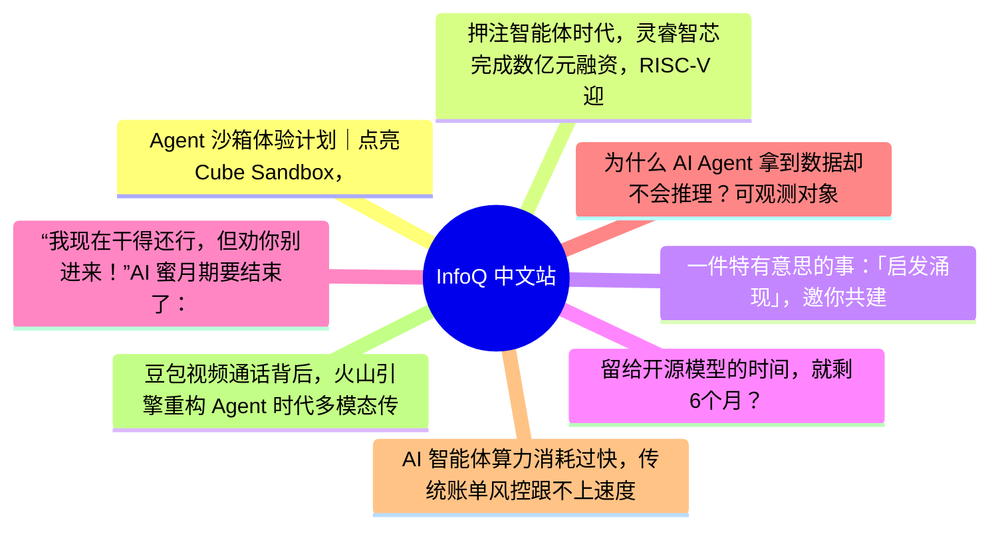
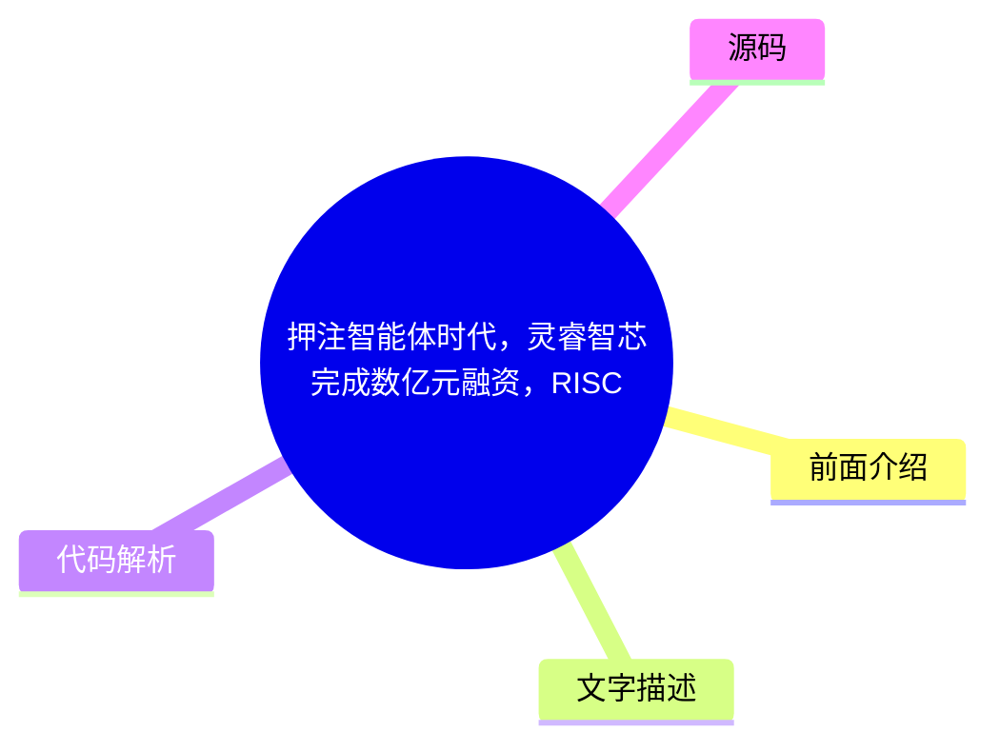
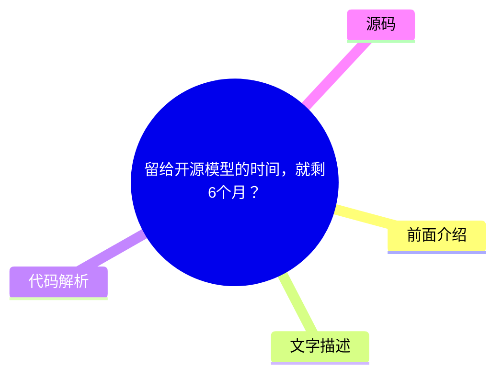
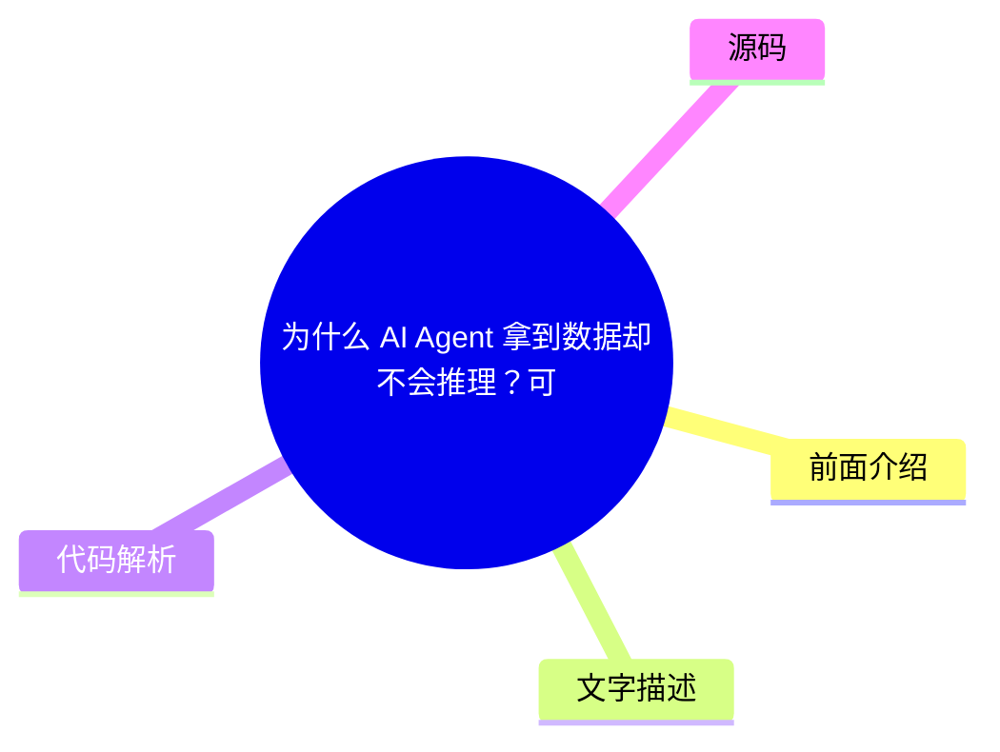

# 📰 InfoQ 中文站 Top 8 (2026-07-18)

## 前面介绍

- 数据源：InfoQ 中文站
- 抓取日期：2026-07-18
- 条目数：8
- 含完整正文：7
- 含代码片段：0
- 组织方式：前面介绍 / 树状图 / 文字描述 / 代码解析 / 源码

## 思维导图

## 详细整理（8 条，7 条含全文，0 条含代码）

### 1. Agent 沙箱体验计划｜点亮Cube Sandbox，在安全沙箱里释放你的Agent能力
- **链接**: [https://xie.infoq.cn/article/615b3f8b86b0f9df5480f5d4f?utm_source=rss&utm_medium=article](https://xie.infoq.cn/article/615b3f8b86b0f9df5480f5d4f?utm_source=rss&utm_medium=article)
- **发布**: Wed, 15 Jul 2026 18:32:58 GMT

#### 前面介绍

- 闯关Cube任务，分享真实体验，赢取京东卡！点击查看原文>
- 发布时间：Wed, 15 Jul 2026 18:32:58 GMT

#### 树状图

#### 文字描述

- 闯关Cube任务，分享真实体验，赢取京东卡！点击查看原文>

#### 代码解析

- 本文未检测到明确代码块，内容更偏新闻、观点或方法论。

#### 源码

未抓到可展示源码或原文节选。

### 2. 押注智能体时代，灵睿智芯完成数亿元融资，RISC-V 迎算力新机遇
- **链接**: [https://www.infoq.cn/article/AlwgmgVxh7Q25NxgGrEI?utm_source=rss&utm_medium=article](https://www.infoq.cn/article/AlwgmgVxh7Q25NxgGrEI?utm_source=rss&utm_medium=article)
- **发布**: Thu, 16 Jul 2026 20:33:09 GMT

#### 前面介绍

- 点击查看原文>
- 发布时间：Thu, 16 Jul 2026 20:33:09 GMT

#### 树状图

#### 文字描述

- 近日，上海灵睿智芯计算技术有限公司（以下简称“灵睿智芯”）宣布完成新一轮数亿元融资。 本轮融资由张江高科、中科创星、东方富海、成为资本、石溪资本、壁仞科技、上海天使会及行业合作伙伴等多家产业投资机构参与，老股东元禾璞华、上国投孚腾资本、华山资本等持续跟投。据悉，资金将主要用于高性能 RISC-V 内核的产业落地、智能体 CPU 产品研发，以及 AI 原生融合计算架构的持续布局。
- #### 算力重心转移：从 GPU 转向以 CPU 为中心的控制密集型结构 随着 AI 智能体正从早期的“对话式 AI”向具备主动规划与执行能力的“执行式 AI”演进，大模型运行时的算力需求结构正在发生改变。 在 Agent 交互、多步骤推理以及工具调用等高并发场景下，算力消耗的重心正在从单纯的高吞吐 GPU 计算，部分向高并发、低延迟的 CPU 控制密集型计算转移。 这一趋势让业界开始重新评估 CPU 架构的选择。相比于传统 x86 和 ARM 架构，RISC-V 凭借开源、模块化以及易于进行领域特定扩展（DSA）的特性，成为了构建智能体原生计算架构的新路径。 技术路线上，灵睿智芯于 2026 年初发布了其高性能 RISC-V CPU 内核 P100 v1。该内核针对服务器级应用和智能体高并发需求进行了针对性设计： - 动态同时多线程（SMT4）技

#### 代码解析

- 本文未检测到明确代码块，内容更偏新闻、观点或方法论。

#### 源码

#### 中文节选

近日，上海灵睿智芯计算技术有限公司（以下简称“灵睿智芯”）宣布完成新一轮数亿元融资。

本轮融资由张江高科、中科创星、东方富海、成为资本、石溪资本、壁仞科技、上海天使会及行业合作伙伴等多家产业投资机构参与，老股东元禾璞华、上国投孚腾资本、华山资本等持续跟投。据悉，资金将主要用于高性能 RISC-V 内核的产业落地、智能体 CPU 产品研发，以及 AI 原生融合计算架构的持续布局。

#### 算力重心转移：从 GPU 转向以 CPU 为中心的控制密集型结构

随着 AI 智能体正从早期的“对话式 AI”向具备主动规划与执行能力的“执行式 AI”演进，大模型运行时的算力需求结构正在发生改变。

在 Agent 交互、多步骤推理以及工具调用等高并发场景下，算力消耗的重心正在从单纯的高吞吐 GPU 计算，部分向高并发、低延迟的 CPU 控制密集型计算转移。

这一趋势让业界开始重新评估 CPU 架构的选择。相比于传统 x86 和 ARM 架构，RISC-V 凭借开源、模块化以及易于进行领域特定扩展（DSA）的特性，成为了构建智能体原生计算架构的新路径。

技术路线上，灵睿智芯于 2026 年初发布了其高性能 RISC-V CPU 内核 P100 v1。该内核针对服务器级应用和智能体高并发需求进行了针对性设计：

- 动态同时多线程（SMT4）技术：这是目前国内少数支持单核 4 线程（SMT4）技术的 RISC-V CPU 内核。在智能体处理多任务并行、Agent 协同等场景下，多线程架构能够有效提升硬件线程利用率，缓解内存延迟瓶颈。 

- 超深超宽乱序超标量流水线：通过微架构层面的乱序执行（Out-of-Order）设计，提升单核绝对性能，以应对复杂逻辑控制与推理调度。 

- 企业级 RAS 设计：针对数据中心和边缘计算的高可靠性要求，引入了企业级容错、纠错与恢复机制（RAS），确保在大规模算力集群中长时间稳定运行。 

目前，灵睿智芯正在推进基于 P100 内核的处理器芯片开发，目标是推出量产级的全国产 RISC-V AI Agent CPU。

在当前半导体投融资环境更趋务实的背景下，灵睿智芯能够获得张江高科、中科创星等产业资本以及壁仞科技等协同伙伴的数亿元注资，反映出一级市场对底层算力基础设施的持续关注。

对国内 AI 产业链而言，基于开源 RISC-V 架构全栈自研高端 CPU 内核，并与国内工艺、封测链条配合，不仅是填补高性能控制芯片空白的尝试，也是在先进计算领域构建自主生态、规避外部供应链风险的必然选择。

后续，灵睿智芯将通过 IP 授权、定制开发以及自研处理器产品等多元商业模式，尝试在 AI 数据中心、边缘计算及具身智能等场景实现商业闭环。

#### 完整正文（中文）

近日，上海灵睿智芯计算技术有限公司（以下简称“灵睿智芯”）宣布完成新一轮数亿元融资。

本轮融资由张江高科、中科创星、东方富海、成为资本、石溪资本、壁仞科技、上海天使会及行业合作伙伴等多家产业投资机构参与，老股东元禾璞华、上国投孚腾资本、华山资本等持续跟投。据悉，资金将主要用于高性能 RISC-V 内核的产业落地、智能体 CPU 产品研发，以及 AI 原生融合计算架构的持续布局。

#### 算力重心转移：从 GPU 转向以 CPU 为中心的控制密集型结构

随着 AI 智能体正从早期的“对话式 AI”向具备主动规划与执行能力的“执行式 AI”演进，大模型运行时的算力需求结构正在发生改变。

在 Agent 交互、多步骤推理以及工具调用等高并发场景下，算力消耗的重心正在从单纯的高吞吐 GPU 计算，部分向高并发、低延迟的 CPU 控制密集型计算转移。

这一趋势让业界开始重新评估 CPU 架构的选择。相比于传统 x86 和 ARM 架构，RISC-V 凭借开源、模块化以及易于进行领域特定扩展（DSA）的特性，成为了构建智能体原生计算架构的新路径。

技术路线上，灵睿智芯于 2026 年初发布了其高性能 RISC-V CPU 内核 P100 v1。该内核针对服务器级应用和智能体高并发需求进行了针对性设计：

- 动态同时多线程（SMT4）技术：这是目前国内少数支持单核 4 线程（SMT4）技术的 RISC-V CPU 内核。在智能体处理多任务并行、Agent 协同等场景下，多线程架构能够有效提升硬件线程利用率，缓解内存延迟瓶颈。 

- 超深超宽乱序超标量流水线：通过微架构层面的乱序执行（Out-of-Order）设计，提升单核绝对性能，以应对复杂逻辑控制与推理调度。 

- 企业级 RAS 设计：针对数据中心和边缘计算的高可靠性要求，引入了企业级容错、纠错与恢复机制（RAS），确保在大规模算力集群中长时间稳定运行。 

目前，灵睿智芯正在推进基于 P100 内核的处理器芯片开发，目标是推出量产级的全国产 RISC-V AI Agent CPU。

在当前半导体投融资环境更趋务实的背景下，灵睿智芯能够获得张江高科、中科创星等产业资本以及壁仞科技等协同伙伴的数亿元注资，反映出一级市场对底层算力基础设施的持续关注。

对国内 AI 产业链而言，基于开源 RISC-V 架构全栈自研高端 CPU 内核，并与国内工艺、封测链条配合，不仅是填补高性能控制芯片空白的尝试，也是在先进计算领域构建自主生态、规避外部供应链风险的必然选择。

后续，灵睿智芯将通过 IP 授权、定制开发以及自研处理器产品等多元商业模式，尝试在 AI 数据中心、边缘计算及具身智能等场景实现商业闭环。

### 3. 一件特有意思的事：「启发涌现」，邀你共建
- **链接**: [https://www.infoq.cn/article/58aLq5Y7pHsmb0PfgU4O?utm_source=rss&utm_medium=article](https://www.infoq.cn/article/58aLq5Y7pHsmb0PfgU4O?utm_source=rss&utm_medium=article)
- **发布**: Thu, 16 Jul 2026 19:58:33 GMT

#### 前面介绍

- 点击查看原文>
- 发布时间：Thu, 16 Jul 2026 19:58:33 GMT

#### 树状图

#### 文字描述

- 朋友们好啊，我是模力工场的负责人 Luke。 今天和你分享一个我们目前在尝试的，[特别有意思的事](https://mp.weixin.qq.com/s/ZT02AOklUssdeINjrIgEVw)。 这段时间，我一直在思考： 模力工场在未来，还能提供些什么价值？ 以前，我们可能说，你有一款不错的应用，来上架吧，我们来帮你冷启动；或者，我们组织些活动，大家聊聊看，说不定有合作机会。 我们也和一些政府单位，共同设立了极客部落，线下的 OPC 专属空间。 大家给我们的评价都是：你们这个氛围真不错；能遇见同频的人；活动很有趣很有意义······ 整体都很好评，但我觉得，还可以做更多更有价值的事。 哈哈，或者更确切地说，能做得再牛一点吗？
- ## 一个大胆的假设 最近我拜访交流了几十位不同行业不同身份的朋友，发现一个很底层的事情：大家很少靠闭门苦想获得启发。大量的高价值启发，**是在不断向外交流、观察和碰撞中形成判断的。** 但问题在于，这种高质量启发，太难得了，太随机了，谁都不知道怎么突然就长出来了。 于是我提了个假设：[如果AI也参与到交流当中呢？看看很多人和很多Agent，能碰撞出来什么启发？](https://mp.weixin.qq.com/s/ZT02AOklUssdeINjrIgEVw) 理论上，好像可以把随机变成每天发生。 只有你自己跟一群 AI，能达到这个效果吗？ 不能，因为缺少了很多其他真实人物独有的审美、体系和创造力。 只有一群 AI，能行吗？ 也不行，太容易跑偏了。 那如果一群人独有的审美体系创造力，乘上一群 AI 独有的信息搜集、推理、独特视角呢？ 那这件事就变
- ## 100 万人 × 100 万个 Agent 我在模力工场旗下极客 Labs 发起了第一个创新实验： **看看「100 万人 」x 「100 万个 Agent」，能不能带来启发的涌现？** 如果这个真的成立，它带来的社会价值将是极其大的。 跑通后的下一步，我会把这套模式提供给模力工场的小伙伴们，一起去加速那些可能影响世界未来的创新实验。不需要你会什么，只要你有一个想法，那么就可以通过人和 AI 共建的形式，把它加速落地。 这个应该就属于我前面说的，比较牛的事情，哈哈。 我把这次创新实验的过程完全开源： - 我们认为，好的东西一定是大家一起共创出来的，成果是属于大家的； - 我们想邀请大家一起见证一个可能影响未来的实验，是否可以长大； - 我们想给所有的早期创新者们信心：有某种方式，能提高创新成功的概率； - 更重要的是，我们希望从一个想法阶段，就
- ## 超多福利，如何参与？ 首先，打开：**labs.agicamp.com** 你就能看到实验的实时进度。 你可以： - 提出想法或问题 - 补充信息和不同视角 - 参与讨论和方案设计 - 一起动手实现 - 单纯围观，见证它如何从想法变成产品 没有技术门槛，也没有固定的参与方式。每位参与者都会获得专属身份和编号。持续贡献关键想法、推动实验落地的人，将成为实验的“奠基人”和“共建者”。 除了身份本身,你还可以获得: - **特别惊喜**: 深度共创者的一些意外权益 - **优先体验权**: 第一时间体验模力工场新功能 - **内部福利**: 公司生态内的顶级大会、课程,很多隐藏福利 - **Token 支持**: 可能送你很多 token(具体多少也可以一起共创) - **官方荣誉**: 模力工场颁发的官方证书、限量徽章或纪念奖牌 - 以及未来还会持

#### 代码解析

- 本文未检测到明确代码块，内容更偏新闻、观点或方法论。

#### 源码

#### 中文节选

朋友们好啊，我是模力工场的负责人 Luke。

今天和你分享一个我们目前在尝试的，[特别有意思的事](https://mp.weixin.qq.com/s/ZT02AOklUssdeINjrIgEVw)。

这段时间，我一直在思考：

模力工场在未来，还能提供些什么价值？

以前，我们可能说，你有一款不错的应用，来上架吧，我们来帮你冷启动；或者，我们组织些活动，大家聊聊看，说不定有合作机会。

我们也和一些政府单位，共同设立了极客部落，线下的 OPC 专属空间。

大家给我们的评价都是：你们这个氛围真不错；能遇见同频的人；活动很有趣很有意义······

整体都很好评，但我觉得，还可以做更多更有价值的事。

哈哈，或者更确切地说，能做得再牛一点吗？

## 一个大胆的假设

最近我拜访交流了几十位不同行业不同身份的朋友，发现一个很底层的事情：大家很少靠闭门苦想获得启发。大量的高价值启发，**是在不断向外交流、观察和碰撞中形成判断的。**

但问题在于，这种高质量启发，太难得了，太随机了，谁都不知道怎么突然就长出来了。

于是我提了个假设：[如果AI也参与到交流当中呢？看看很多人和很多Agent，能碰撞出来什么启发？](https://mp.weixin.qq.com/s/ZT02AOklUssdeINjrIgEVw)

理论上，好像可以把随机变成每天发生。

只有你自己跟一群 AI，能达到这个效果吗？

不能，因为缺少了很多其他真实人物独有的审美、体系和创造力。

只有一群 AI，能行吗？

也不行，太容易跑偏了。

那如果一群人独有的审美体系创造力，乘上一群 AI 独有的信息搜集、推理、独特视角呢？

那这件事就变得有意思了。

别人和 AI 可以启发你，你也可以启发别人和 AI。

当参与者越来越多，新的想法、方案和合作，也许会自然地长出来，我们就叫它「启发涌现」

所以我想邀请你一起来探索：

如果让很多人和很多 Agent 持续交互，能不能把原本靠运气发生的启发，变成一种

更高频的“启发涌现”？

## 100 万人 × 100 万个 Agent

我在模力工场旗下极客 Labs 发起了第一个创新实验：

**看看「100 万人 」x 「100 万个 Agent」，能不能带来启发的涌现？**

如果这个真的成立，它带来的社会价值将是极其大的。

跑通后的下一步，我会把这套模式提供给模力工场的小伙伴们，一起去加速那些可能影响世界未来的创新实验。不需要你会什么，只要你有一个想法，那么就可以通过人和 AI 共建的形式，把它加速落地。

这个应该就属于我前面说的，比较牛的事情，哈哈。

我把这次创新实验的过程完全开源：

- 我们认为，好的东西一定是大家一起共创出来的，成果是属于大家的； 
- 我们想邀请大家一起见证一个可能影响未来的实验，是否可以长大； 
- 我们想给所有的早期创新者们信心：有某种方式，能提高创新成功的概率； 
- 更重要的是，我们希望从一个想法阶段，就来服务好你们；而不是等产品做好以后，才提供宣传和资源。 

## 超多福利，如何参与？

首先，打开：**labs.agicamp.com**

你就能看到实验的实时进度。

你可以：

- 提出想法或问题 
- 补充信息和不同视角 
- 参与讨论和方案设计 
- 一起动手实现 
- 单纯围观，见证它如何从想法变成产品 

没有技术门槛，也没有固定的参与方式。每位参与者都会获得专属身份和编号。持续贡献关键想法、推动实验落地的人，将成为实验的“奠基人”和“共建者”。

除了身份本身,你还可以获得:

- **特别惊喜**: 深度共创者的一些意外权益
- **优先体验权**: 第一时间体验模力工场新功能
- **内部福利**: 公司生态内的顶级大会、课程,很多隐藏福利
- **Token 支持**: 可能送你很多 token(具体多少也可以一起共创)
- **官方荣誉**: 模力工场颁发的官方证书、限量徽章或纪念奖牌
- 以及未来还会持续增加的更多权益 

目前，我们已经有了一些小成果：

我已经搭建了第一版 Demo，一些 AI 给出的反馈，确实带来了意料之外的思路。

另外，我也和不少朋友、社区专家交流了这个实验，大家的兴趣和参与意愿，比预想中更高。

在一些小范围测试里，它的转化率出奇的高。

虽然这些还不能证明实验一定成立，但足以说明，它值得认真跑一次。

所以，我决定**集中用两周的时间**，来把这个实验推进上线。迭代速度会非常快，抓紧上车。但也可能会有一些卡点，需要向你求助。

来吧，我们用 10 几天的时间，见证一个可能伟大的事情的诞生。

来这里围观：labs.agicamp.com

先来加入种子用户群，这里会随机掉落福利，而且「启发涌现」的全部都从这里出发。

（如果这个二维码过期了，你可以在公众号底部菜单找到我）

最后，立个 Flag（手动 Doge）：

**7 月不上线，群里每人发价值 100 元的 token！**

#### 完整正文（中文）

朋友们好啊，我是模力工场的负责人 Luke。

今天和你分享一个我们目前在尝试的，[特别有意思的事](https://mp.weixin.qq.com/s/ZT02AOklUssdeINjrIgEVw)。

这段时间，我一直在思考：

模力工场在未来，还能提供些什么价值？

以前，我们可能说，你有一款不错的应用，来上架吧，我们来帮你冷启动；或者，我们组织些活动，大家聊聊看，说不定有合作机会。

我们也和一些政府单位，共同设立了极客部落，线下的 OPC 专属空间。

大家给我们的评价都是：你们这个氛围真不错；能遇见同频的人；活动很有趣很有意义······

整体都很好评，但我觉得，还可以做更多更有价值的事。

哈哈，或者更确切地说，能做得再牛一点吗？

## 一个大胆的假设

最近我拜访交流了几十位不同行业不同身份的朋友，发现一个很底层的事情：大家很少靠闭门苦想获得启发。大量的高价值启发，**是在不断向外交流、观察和碰撞中形成判断的。**

但问题在于，这种高质量启发，太难得了，太随机了，谁都不知道怎么突然就长出来了。

于是我提了个假设：[如果AI也参与到交流当中呢？看看很多人和很多Agent，能碰撞出来什么启发？](https://mp.weixin.qq.com/s/ZT02AOklUssdeINjrIgEVw)

理论上，好像可以把随机变成每天发生。

只有你自己跟一群 AI，能达到这个效果吗？

不能，因为缺少了很多其他真实人物独有的审美、体系和创造力。

只有一群 AI，能行吗？

也不行，太容易跑偏了。

那如果一群人独有的审美体系创造力，乘上一群 AI 独有的信息搜集、推理、独特视角呢？

那这件事就变得有意思了。

别人和 AI 可以启发你，你也可以启发别人和 AI。

当参与者越来越多，新的想法、方案和合作，也许会自然地长出来，我们就叫它「启发涌现」

所以我想邀请你一起来探索：

如果让很多人和很多 Agent 持续交互，能不能把原本靠运气发生的启发，变成一种

更高频的“启发涌现”？

## 100 万人 × 100 万个 Agent

我在模力工场旗下极客 Labs 发起了第一个创新实验：

**看看「100 万人 」x 「100 万个 Agent」，能不能带来启发的涌现？**

如果这个真的成立，它带来的社会价值将是极其大的。

跑通后的下一步，我会把这套模式提供给模力工场的小伙伴们，一起去加速那些可能影响世界未来的创新实验。不需要你会什么，只要你有一个想法，那么就可以通过人和 AI 共建的形式，把它加速落地。

这个应该就属于我前面说的，比较牛的事情，哈哈。

我把这次创新实验的过程完全开源：

- 我们认为，好的东西一定是大家一起共创出来的，成果是属于大家的； 
- 我们想邀请大家一起见证一个可能影响未来的实验，是否可以长大； 
- 我们想给所有的早期创新者们信心：有某种方式，能提高创新成功的概率； 
- 更重要的是，我们希望从一个想法阶段，就来服务好你们；而不是等产品做好以后，才提供宣传和资源。 

## 超多福利，如何参与？

首先，打开：**labs.agicamp.com**

你就能看到实验的实时进度。

你可以：

- 提出想法或问题 
- 补充信息和不同视角 
- 参与讨论和方案设计 
- 一起动手实现 
- 单纯围观，见证它如何从想法变成产品 

没有技术门槛，也没有固定的参与方式。每位参与者都会获得专属身份和编号。持续贡献关键想法、推动实验落地的人，将成为实验的“奠基人”和“共建者”。

除了身份本身,你还可以获得:

- **特别惊喜**: 深度共创者的一些意外权益
- **优先体验权**: 第一时间体验模力工场新功能
- **内部福利**: 公司生态内的顶级大会、课程,很多隐藏福利
- **Token 支持**: 可能送你很多 token(具体多少也可以一起共创)
- **官方荣誉**: 模力工场颁发的官方证书、限量徽章或纪念奖牌
- 以及未来还会持续增加的更多权益 

目前，我们已经有了一些小成果：

我已经搭建了第一版 Demo，一些 AI 给出的反馈，确实带来了意料之外的思路。

另外，我也和不少朋友、社区专家交流了这个实验，大家的兴趣和参与意愿，比预想中更高。

在一些小范围测试里，它的转化率出奇的高。

虽然这些还不能证明实验一定成立，但足以说明，它值得认真跑一次。

所以，我决定**集中用两周的时间**，来把这个实验推进上线。迭代速度会非常快，抓紧上车。但也可能会有一些卡点，需要向你求助。

来吧，我们用 10 几天的时间，见证一个可能伟大的事情的诞生。

来这里围观：labs.agicamp.com

先来加入种子用户群，这里会随机掉落福利，而且「启发涌现」的全部都从这里出发。

（如果这个二维码过期了，你可以在公众号底部菜单找到我）

最后，立个 Flag（手动 Doge）：

**7 月不上线，群里每人发价值 100 元的 token！**

### 4. 留给开源模型的时间，就剩6个月？
- **链接**: [https://www.infoq.cn/article/jdBsbJXVi22iPafARSFx?utm_source=rss&utm_medium=article](https://www.infoq.cn/article/jdBsbJXVi22iPafARSFx?utm_source=rss&utm_medium=article)
- **发布**: Thu, 16 Jul 2026 18:51:55 GMT

#### 前面介绍

- 点击查看原文>
- 发布时间：Thu, 16 Jul 2026 18:51:55 GMT

#### 树状图

#### 文字描述

- 开源模型，正在经历迄今最严峻的一次生存考验。 近日，有外媒报道称，白宫正在考虑出台一项行政命令来限制开源 AI，尤其是由中国公司开发的系统。 “如果本届政府最终对其使用开源 AI 发表明确立场，甚至限制联邦机构使用某些开源工具，我不会感到意外。”高级研究员 Adam Thierer 表示。 据悉，知情人士们几乎都表示，相关讨论仍处于早期阶段，目前尚不清楚这些讨论最终是否会转化为具体政策。不过，如果最终没有成为现实，它进一步增加了外界对特朗普政府混乱 AI 治理方式的质疑。而相关措施即便落地，最可能影响的也只是两类对象：一是来自中国的模型，二是政府部门对这些模型的使用。但第一块多米诺骨牌一旦倒下，后续影响很难控制。 当前，开源模型缺少一个强有力、利益高度集中的美国经济代表，能够向政策制定者清楚说明打压开源模型可能带来的代价。据报道，Reflection
- ## 开源模型赢 Token 流量，Anthropic 赚大部分钱 随着 AI 应用逐渐成熟，越来越多企业正在转向更轻量的模型，那么，开源模型到底有没有从硅谷前沿模型厂商那里“虎口夺食”？ AI 独角兽企业 Decagon 是典型的开源模型应用企业。Decagon 现在约 90% 的工作负载都运行在开源模型上，而不是 OpenAI 或 Anthropic 的模型。Decagon CEO Jesse Zhang 解释道，这并不是因为成本，也不是客户强制要求，真正的原因是企业几乎没有其他选择。 这并不是因为成本，也不是客户强制要求我们这么做，尽管他们通常并不反对。真正的原因是，我们几乎没有其他选择。 当你在生产环境中运行客服 AI 智能体时，延迟会直接决定产品能不能用。一次对话中，每轮回复都要等待 8 秒，这样的产品没人愿意使用。因此，你需要体量更小、速
- ## “围绕蒸馏的争论，已演变成对竞争对手的打压” 一个几乎不可避免的现实是：开源模型的能力正变得越来越强。 Dario Amodei 不久前刚攻击过开源：在 AI 领域，开源是一个干扰项，或者说是一个伪命题。“即使模型公开，你也看不到它的内部运行机制，因此业内通常把这类模型称为‘开源’，而不是‘开源’。传统开源软件可以由社区共同修改、持续迭代，并在协作中不断增强，但这种优势并不完全适用于大模型。” 因此，Amodei 表示自己看到一款新模型时，从来不会先问它是否开源。就连 DeepSeek 是否开源，对他来说也不重要。他真正关心的只有一个问题：这款模型到底够不够好，在重要任务上能不能击败我们。而且，开源从来不等于免费。模型体量如此庞大，企业仍然需要花钱在云端运行推理，也需要专业团队进行部署和优化，确保模型能够足够快速、稳定地运行。与其纠结模型是否开
- ## “开源生态无法被阻止” “我们确实需要为前沿开源模型制定合适的政策，但全面禁止大概率不是答案。”Lambert 说道，“即便只有美禁止引进某些模型，全球开源社区仍会继续发展。” 他认为，真正能够为开源发展设置上限的，只有一项关于如何管理 AI 模型风险的全球协议，而我们距离这种协议还非常遥远。其他任何延迟措施，都只会让 AI 的落地变得更不可预测、更混乱，最终的局面可能会很像 GPT-5.6 的发布过程，只不过届时受限的不只是少数公司获得开放、廉价智能的收益，而是所有恶意行为者仍能立刻获得这些能力。 “开源模型提升安全性的方式，是让更多人能够访问、理解和审视模型，而不是只把守法、正当的参与者打残。”Lambert 说道，“现实是，开源生态无法被阻止。” 要让开源摆脱这场死亡螺旋，Lambert 表示有一条短期出口，那就是让一家美企发布能力相近的

#### 代码解析

- 本文未检测到明确代码块，内容更偏新闻、观点或方法论。

#### 源码

#### 中文节选

开源模型正经历着迄今为止最严峻的一次生存考验。

近日，有外媒报道称，白宫正在考虑出台一项行政命令来限制开源 AI，尤其是由中国公司开发的系统。

“如果本届政府最终对其使用开源 AI 发表明确立场，甚至限制联邦机构使用某些开源工具，我不会感到意外。”高级研究员 Adam Thierer 表示。

据悉，知情人士们几乎都表示，相关讨论仍处于早期阶段，目前尚不清楚这些讨论最终是否会转化为具体政策。不过，如果最终没有成为现实，它进一步增加了外界对特朗普政府混乱 AI 治理方式的质疑。而相关措施即便落地，最可能影响的也只是两类对象：一是来自中国的模型，二是政府部门对这些模型的使用。但第一块多米诺骨牌一旦倒下，后续影响很难控制。

当前，开源模型缺少一个强有力、利益高度集中的美国经济代表，能够向政策制定者清楚说明打压开源模型可能带来的代价。据报道，Reflection AI 的代表曾提出，应当根据模型能力，为开源模型提供框架豁免。目前，DeepSeek 等中国开源模型明显领先于其他可用的开源模型，而 Reflection 尚未发布公开模型。

“无论采取哪一种形式的禁令，从人工智能的长期发展轨迹来看，都将是一个严重错误。”加州大学伯克利分校 AI 方向博士学位，曾在 Meta、DeepMind 和 Hugging Face 任职的机器学习研究员 Nathan Lambert 直言。

他表示，最可能出现的政策，是禁止或无限期推迟任何能力明显超过 GPT-5.5、Claude Opus 4.8 或 GLM-5.2 水平的开放权重模型。按照开源模型与闭源模型之间持续缩小的能力差距，这种情况很可能在未来 6 个月内出现。

## 开源模型赢 Token 流量，Anthropic 赚大部分钱

随着 AI 应用逐渐成熟，越来越多企业正在转向更轻量的模型，那么，开源模型到底有没有从硅谷前沿模型厂商那里“虎口夺食”？

AI 独角兽企业 Decagon 是典型的开源模型应用企业。Decagon 现在约 90% 的工作负载都运行在开源模型上，而不是 OpenAI 或 Anthropic 的模型。Decagon CEO Jesse Zhang 解释道，这并不是因为成本，也不是客户强制要求，真正的原因是企业几乎没有其他选择。

这并不是因为成本，也不是客户强制要求我们这么做，尽管他们通常并不反对。真正的原因是，我们几乎没有其他选择。

当你在生产环境中运行客服 AI 智能体时，延迟会直接决定产品能不能用。一次对话中，每轮回复都要等待 8 秒，这样的产品没人愿意使用。因此，你需要体量更小、速度更快的模型。每一次模型调用，没有必要知道立陶宛的首都，也不需要掌握高中物理知识。

但开箱即用的小模型，达不到客户要求的质量标准。只有针对特定任务进行大规模微调，它们才能满足要求。

问题在于，前沿模型实验室基本不提供这种组合。我们无法按照实际需求去微调它们最强的模型，而它们的小模型也不属于我们，无法任由我们塑造。

因此，“小模型+深度微调”本质上意味着必须使用开放权重模型。成本节省确实存在，但只是次要收益；企业对自托管模型更加放心，也只是附带好处，而不是我们选择开源模型的根本原因。

Jesse 还给出了一个“反常识”的结论：企业在昂贵前沿模型上的整体支出几乎没有下降，但开源模型的支出占比却在下降。

虽然 Jesse Zhang 并未提供太多数据来支撑这一观点，但 Techcrunch 找到了一些相关数据。

Vercel 的 AI Gateway 仪表盘显示，一周的时间里，DeepSeek 的 Token 处理量就迅速升至第一，目前已经占到 Vercel 基础设施总 Token 流量的三分之一以上。推出热门模型 GLM-5.2 的智谱，也在同期跃升至第四名。

但如果继续查看总体 Token 支出，就会发现 Anthropic 依然占据该平台 AI 总支出的半数以上。由于近期变化中有相当一部分来自 Anthropic 自身价格上涨，其支出份额在过去一个月略有下降，但降幅并不明显。

OpenRouter 的数据也呈现出类似趋势。相比 Vercel，OpenRouter 覆盖的市场规模更大，但企业用户属性略弱一些。

从整体使用量来看，DeepSeek V4 Flash 是目前最明显的赢家，每周处理约 5.3 万亿 Token。最受欢迎的前沿模型 Opus 4.8，每周处理的 Token 数量则略高于 2 万亿。

OpenRouter 并未按照模型总支出进行排名，但其数据显示，Opus 4.8 的平均 Token 成本大约是 V4 Flash 的 23 倍：Opus 4.8 每百万 Token 平均成本约为 1.37 美元，而 V4 Flash 仅为 0.06 美元。

按照这一价格差距推算，尽管 Opus 4.8 的 Token 使用量明显低于 V4 Flash，但它很可能仍然占据了平台大部分模型支出。

这些数据还没有包括最新入场的 Nvidia Nemotron。凭借 Nvidia 强大的产业关系，以及 Nemotron 本身极高的适配能力，这款模型有望迅速进入市场前列。

这些数字尚不足以完全证明 Jesse Zhang 关于 AI 应用生命周期的判断，但至少说明，Anthropic 等前沿模型实验室并没有因为开源模型崛起而受到太大冲击，至少目前还没有。

在 Jesse 看来，前沿模型和开源模型之间并不是竞争对手，开源模型的成功也并非建立在前沿模型实验室失去市场的基础上。相反，它们更像是同一个生命周期中的两个阶段：企业先使用昂贵的前沿模型验证某个应用场景是否成立，等到场景逐渐成熟，再将其迁移到成本更低的开源模型上。随着越来越多成熟场景转向轻量模型，新的应用场景也在不断涌现，因此企业在前沿模型上的总体投入并没有明显下降。

他解释称，当一个应用场景刚刚出现时，企业会优先选择能够获得的最聪明的通用模型。因为你还不知道问题最终会呈现出什么形态，所以会愿意为一些未来可能根本用不上的智能能力支付溢价。在这个阶段，这是一笔合理的交换。

但当一个应用场景已经充分成熟，企业已经了解输入数据的分布、模型需要表现出的行为，以及必须防范的失败模式时，权衡就会发生逆转。此时，通用智能反而成了额外负担。企业真正需要的是体量最小、速度最快，并且经过专门微调、能够把特定任务做到极致的模型。

前沿模型收入依然很高的一个解释是，可被 AI 覆盖的任务市场增长得太快。即便越来越多成熟场景被迁移到开源模型上，顶级模型仍然可以依靠占据新应用早期验证阶段，维持自身的市场地位。

“开源模型支出占比下降，并不是因为开源模型正在失败，而是因为整个企业 AI 市场仍处于成熟曲线的最早期。”Jesse 说道，“按照这一逻辑，今天所有使用前沿模型进行原型验证的应用场景，未来都有可能迁移到开源模型。”“不过，这个过程会比很多人预想的更漫长。”

另外，即便客户开始转向开源模型，很多应用场景本身仍然足够复杂，无法完全被价格更低的模型替代。但无论如何，这种双层模型经济都有可能成为 AI 产业中相对稳定的结构。

## “围绕蒸馏的争论，已演变成对竞争对手的打压”

#### 完整正文（中文）

开源模型正经历着迄今为止最严峻的一次生存考验。

近日，有外媒报道称，白宫正在考虑出台一项行政命令来限制开源 AI，尤其是由中国公司开发的系统。

“如果本届政府最终对其使用开源 AI 发表明确立场，甚至限制联邦机构使用某些开源工具，我不会感到意外。”高级研究员 Adam Thierer 表示。

据悉，知情人士们几乎都表示，相关讨论仍处于早期阶段，目前尚不清楚这些讨论最终是否会转化为具体政策。不过，如果最终没有成为现实，它进一步增加了外界对特朗普政府混乱 AI 治理方式的质疑。而相关措施即便落地，最可能影响的也只是两类对象：一是来自中国的模型，二是政府部门对这些模型的使用。但第一块多米诺骨牌一旦倒下，后续影响很难控制。

当前，开源模型缺少一个强有力、利益高度集中的美国经济代表，能够向政策制定者清楚说明打压开源模型可能带来的代价。据报道，Reflection AI 的代表曾提出，应当根据模型能力，为开源模型提供框架豁免。目前，DeepSeek 等中国开源模型明显领先于其他可用的开源模型，而 Reflection 尚未发布公开模型。

“无论采取哪一种形式的禁令，从人工智能的长期发展轨迹来看，都将是一个严重错误。”加州大学伯克利分校 AI 方向博士学位，曾在 Meta、DeepMind 和 Hugging Face 任职的机器学习研究员 Nathan Lambert 直言。

他表示，最可能出现的政策，是禁止或无限期推迟任何能力明显超过 GPT-5.5、Claude Opus 4.8 或 GLM-5.2 水平的开放权重模型。按照开源模型与闭源模型之间持续缩小的能力差距，这种情况很可能在未来 6 个月内出现。

## 开源模型赢 Token 流量，Anthropic 赚大部分钱

随着 AI 应用逐渐成熟，越来越多企业正在转向更轻量的模型，那么，开源模型到底有没有从硅谷前沿模型厂商那里“虎口夺食”？

AI 独角兽企业 Decagon 是典型的开源模型应用企业。Decagon 现在约 90% 的工作负载都运行在开源模型上，而不是 OpenAI 或 Anthropic 的模型。Decagon CEO Jesse Zhang 解释道，这并不是因为成本，也不是客户强制要求，真正的原因是企业几乎没有其他选择。

这并不是因为成本，也不是客户强制要求我们这么做，尽管他们通常并不反对。真正的原因是，我们几乎没有其他选择。

当你在生产环境中运行客服 AI 智能体时，延迟会直接决定产品能不能用。一次对话中，每轮回复都要等待 8 秒，这样的产品没人愿意使用。因此，你需要体量更小、速度更快的模型。每一次模型调用，没有必要知道立陶宛的首都，也不需要掌握高中物理知识。

但开箱即用的小模型，达不到客户要求的质量标准。只有针对特定任务进行大规模微调，它们才能满足要求。

问题在于，前沿模型实验室基本不提供这种组合。我们无法按照实际需求去微调它们最强的模型，而它们的小模型也不属于我们，无法任由我们塑造。

因此，“小模型+深度微调”本质上意味着必须使用开放权重模型。成本节省确实存在，但只是次要收益；企业对自托管模型更加放心，也只是附带好处，而不是我们选择开源模型的根本原因。

Jesse 还给出了一个“反常识”的结论：企业在昂贵前沿模型上的整体支出几乎没有下降，但开源模型的支出占比却在下降。

虽然 Jesse Zhang 并未提供太多数据来支撑这一观点，但 Techcrunch 找到了一些相关数据。

Vercel 的 AI Gateway 仪表盘显示，一周的时间里，DeepSeek 的 Token 处理量就迅速升至第一，目前已经占到 Vercel 基础设施总 Token 流量的三分之一以上。推出热门模型 GLM-5.2 的智谱，也在同期跃升至第四名。

但如果继续查看总体 Token 支出，就会发现 Anthropic 依然占据该平台 AI 总支出的半数以上。由于近期变化中有相当一部分来自 Anthropic 自身价格上涨，其支出份额在过去一个月略有下降，但降幅并不明显。

OpenRouter 的数据也呈现出类似趋势。相比 Vercel，OpenRouter 覆盖的市场规模更大，但企业用户属性略弱一些。

从整体使用量来看，DeepSeek V4 Flash 是目前最明显的赢家，每周处理约 5.3 万亿 Token。最受欢迎的前沿模型 Opus 4.8，每周处理的 Token 数量则略高于 2 万亿。

OpenRouter 并未按照模型总支出进行排名，但其数据显示，Opus 4.8 的平均 Token 成本大约是 V4 Flash 的 23 倍：Opus 4.8 每百万 Token 平均成本约为 1.37 美元，而 V4 Flash 仅为 0.06 美元。

按照这一价格差距推算，尽管 Opus 4.8 的 Token 使用量明显低于 V4 Flash，但它很可能仍然占据了平台大部分模型支出。

这些数据还没有包括最新入场的 Nvidia Nemotron。凭借 Nvidia 强大的产业关系，以及 Nemotron 本身极高的适配能力，这款模型有望迅速进入市场前列。

这些数字尚不足以完全证明 Jesse Zhang 关于 AI 应用生命周期的判断，但至少说明，Anthropic 等前沿模型实验室并没有因为开源模型崛起而受到太大冲击，至少目前还没有。

在 Jesse 看来，前沿模型和开源模型之间并不是竞争对手，开源模型的成功也并非建立在前沿模型实验室失去市场的基础上。相反，它们更像是同一个生命周期中的两个阶段：企业先使用昂贵的前沿模型验证某个应用场景是否成立，等到场景逐渐成熟，再将其迁移到成本更低的开源模型上。随着越来越多成熟场景转向轻量模型，新的应用场景也在不断涌现，因此企业在前沿模型上的总体投入并没有明显下降。

他解释称，当一个应用场景刚刚出现时，企业会优先选择能够获得的最聪明的通用模型。因为你还不知道问题最终会呈现出什么形态，所以会愿意为一些未来可能根本用不上的智能能力支付溢价。在这个阶段，这是一笔合理的交换。

但当一个应用场景已经充分成熟，企业已经了解输入数据的分布、模型需要表现出的行为，以及必须防范的失败模式时，权衡就会发生逆转。此时，通用智能反而成了额外负担。企业真正需要的是体量最小、速度最快，并且经过专门微调、能够把特定任务做到极致的模型。

前沿模型收入依然很高的一个解释是，可被 AI 覆盖的任务市场增长得太快。即便越来越多成熟场景被迁移到开源模型上，顶级模型仍然可以依靠占据新应用早期验证阶段，维持自身的市场地位。

“开源模型支出占比下降，并不是因为开源模型正在失败，而是因为整个企业 AI 市场仍处于成熟曲线的最早期。”Jesse 说道，“按照这一逻辑，今天所有使用前沿模型进行原型验证的应用场景，未来都有可能迁移到开源模型。”“不过，这个过程会比很多人预想的更漫长。”

另外，即便客户开始转向开源模型，很多应用场景本身仍然足够复杂，无法完全被价格更低的模型替代。但无论如何，这种双层模型经济都有可能成为 AI 产业中相对稳定的结构。

## “围绕蒸馏的争论，已演变成对竞争对手的打压”

一个几乎不可避免的现实是：开源模型的能力正变得越来越强。

Dario Amodei 不久前刚攻击过开源：在 AI 领域，开源是一个干扰项，或者说是一个伪命题。“即使模型公开，你也看不到它的内部运行机制，因此业内通常把这类模型称为‘开源’，而不是‘开源’。传统开源软件可以由社区共同修改、持续迭代，并在协作中不断增强，但这种优势并不完全适用于大模型。”

因此，Amodei 表示自己看到一款新模型时，从来不会先问它是否开源。就连 DeepSeek 是否开源，对他来说也不重要。他真正关心的只有一个问题：这款模型到底够不够好，在重要任务上能不能击败我们。而且，开源从来不等于免费。模型体量如此庞大，企业仍然需要花钱在云端运行推理，也需要专业团队进行部署和优化，确保模型能够足够快速、稳定地运行。与其纠结模型是否开源，不如关注谁的模型真正能够把你需要完成的任务做到最好。

上面发言发生在这样的一个背景下：“前沿开源模型”正越来越多地被等同于“中国模型厂商产品”，讨论“前沿开源模型能力”时，不可避免地会与蒸馏等其他争议绑定在一起。最近外媒还报道称，美国官员单方面估计，未经授权的模型蒸馏每年给美国 AI 实验室造成的收入损失最高可达 60 亿美元，但并未给出计算依据。

在 Lambert 看来，政府所谓“有权审查”的能力门槛会不断变化，但一旦这种制度建立起来，开源模型获得批准的速度，很可能会远慢于闭源模型。一方面，闭源模型确实更容易实施安全控制；另一方面，闭源模型公司在游说方面的能力也明显更强。

而开源 AI 相关政策一旦发布，开源模型获得批准的速度，很可能会远慢于闭源模型。一方面，闭源模型确实更容易实施安全控制；另一方面，闭源模型公司在游说方面的能力也明显更强。

Lambert 将矛头直接指向了 Anthropic。

“当前反对国内模型的行动主要由 Anthropic 推动。它通过博客文章、信件等方式详细描述国内公司正在做什么。Lambert 评价称，这场行动最初或许源于真实的商业担忧，但如今已经越来越像是在变相给自己建立市场壁垒了：如果 Anthropic 所指控的模型公司被禁止，其产品就会获得极大的收益保障。

“假如 Anthropic 只是以更加中立的方式提供信息，例如告诉部门‘事实在这里，如何处理由你们决定’，社区可能会给予更多理解。但现在它做的更像是在一项高速演进的前沿技术上，直接推动具体政策，而不是单纯分享信息。如果 Anthropic 的技术真像它所宣称的那样强大，强大到类似能力的开源模型理应被禁止，那么它首先应该有能力保护自己的 API 安全。我仍在等待 Anthropic 解释，为什么它做不到这一点。它现在的几种说法中，至少有一种必须被撤回。”

Lambert 继续道，Anthropic 还在以其他方式抽走通往智能能力的梯子。它以安全为名，限制竞争对手获得相关技术，因此它提出的政策建议与其更广泛的限制访问策略是一致的。“当许多员工正在走向足以改变几代人财富水平的回报时，人们很容易认同‘更加重视安全’的企业文化。我并不责怪这些员工，但我们必须把 Anthropic 的公司战略放在更大的背景中理解。”

“Anthropic 实际上要求的，是在美国大范围禁止几乎所有中国开源模型。”Lambert 直言道，围绕开源模型建立的产品，其商业逻辑都建立在模型持续进步之上：随着模型能力增强，产品市场匹配度和计算效率都会提高。一旦这些模型被禁止，正在形成的开源模型经济也会被摧毁，包括推理服务公司、微调公司、新产品以及整个产业链中的其他参与者。

Anthropic 当然可以保护自己的知识产权，但 Lambert 认为，它不应该要求官方替它固化市场地位，更不应该因此让美国与全球开源社区相互隔绝。目前，除了让各家实验室自行采取技术和商业措施进行约束，蒸馏问题并不存在好的政策解决方案。

在安全问题上，Lambert 认为，与其说复杂地微调一个参数量超过 1 万亿的模型会快速扩散危险能力，不如说不安全的 API 更可能让这些能力迅速落入恶意行为者手中。“假如 Anthropic 的模型真的包含极其危险的能力，那么逻辑上最一致的做法，应该是根本不要通过可直接查询的 API 提供这些能力，而不是先把它上线，再讨论别人是否会蒸馏它。”

因此，我们现在面对的是两场同时展开、都会影响开源模型命运的关键讨论：一场围绕模型蒸馏，另一场围绕前沿能力。这两个问题在本质、回应必要性以及可采取的政策工具上都非常不同，但它们正在合流，逐渐形成一套支持“未来 6 个月内禁止开源模型”的强势叙事。

“现在的蒸馏议题实际上在很大程度上已经变成一场‘打压行动’，因为目前摆在桌面上的所有解决方案，都会让推动这些方案的机构获得巨大利益。”Lambert 说道。

## “开源生态无法被阻止”

“我们确实需要为前沿开源模型制定合适的政策，但全面禁止大概率不是答案。”Lambert 说道，“即便只有美禁止引进某些模型，全球开源社区仍会继续发展。”

他认为，真正能够为开源发展设置上限的，只有一项关于如何管理 AI 模型风险的全球协议，而我们距离这种协议还非常遥远。其他任何延迟措施，都只会让 AI 的落地变得更不可预测、更混乱，最终的局面可能会很像 GPT-5.6 的发布过程，只不过届时受限的不只是少数公司获得开放、廉价智能的收益，而是所有恶意行为者仍能立刻获得这些能力。

“开源模型提升安全性的方式，是让更多人能够访问、理解和审视模型，而不是只把守法、正当的参与者打残。”Lambert 说道，“现实是，开源生态无法被阻止。”

要让开源摆脱这场死亡螺旋，Lambert 表示有一条短期出口，那就是让一家美企发布能力相近的开源模型。这样，讨论的焦点就会转向“所有人都身处同一个生态，应该共同处理不断变化且极其复杂的前沿问题”。

“这对开源而言是一项生存级任务。那些在商业上有理由发布开源模型的公司，例如 Microsoft 和 Meta，应该尽快行动，因为开源模型能够把它们的互补业务变成基础设施优势。”Lambert 说道，假如 Reflection 手里已经有一个尚可、但还没有达到前沿水平的模型，它可能也需要尽快发布，以挽救自己所设想的商业方向。”

比起重新训练一个新模型，更快的解决方案是立即建立联盟。Lambert 呼吁前沿实验室之外的“所有其他人”，现在就必须开始行动，思考如何继续安全地发布开源模型，并捍卫开源模型所代表的原则与价值。

### 5. “我现在干得还行，但劝你别进来！”AI 蜜月期要结束了：打工人变成“快乐的行尸走肉”
- **链接**: [https://www.infoq.cn/article/IZIwV2Qia1X1q6RQvDxW?utm_source=rss&utm_medium=article](https://www.infoq.cn/article/IZIwV2Qia1X1q6RQvDxW?utm_source=rss&utm_medium=article)
- **发布**: Thu, 16 Jul 2026 18:47:21 GMT

#### 前面介绍

- 点击查看原文>
- 发布时间：Thu, 16 Jul 2026 18:47:21 GMT

#### 树状图

#### 文字描述

- 一半的人认为 AI 让自己进入了职业生涯的最佳阶段：他们感觉能力被放大，可以更快构建产品、探索更多可能，真正成为“超级个体”；但另一半的人却陷入完全不同的状态：他们感到岗位正在失稳，价值被削弱，不知道未来几年自己是否仍然需要存在。这或许揭示了现在人们面对不断变化的 AI 的真实矛盾心理：开心和焦虑混杂在一起。 曾在 Airbnb、Meta、Twitter、Zapier、Intercom 和 Figma 等公司负责研究工作的科技行业专家 Noam Segal，和 Lenny 一起发起了年度《科技从业者情绪调查》，覆盖约 6000 名科技从业者，覆盖产品、工程、设计、研究、市场营销、数据分析和销售等多个岗位。他们希望了解当下科技行业从业者真实的职业状态，包括从业者们如何看待自己的工作、AI、职业倦怠，以及未来职业发展的方向。 他们得出了一些让人震惊的结论
- ## AI 把科技行业撕成两半：一半人起飞，一半人怕被淘汰 **主持人：我们其实已经合作很久了，只是很少有人知道。大约 10 年前我还在 Airbnb 时，你就是我们团队的研究员。** Noam：已经是 10 年前了，Lenny，变化实在太大了。 **主持人：确实，过去都变了很多，这也正好引出我们今天要聊的话题。我们做了这项调查，想知道科技行业的人现在究竟是什么感受，因为这个行业从未像今天这样疯狂。我们把结果整理成了报告。这是第 2 次开展调查，上一次是在 1 年前。我们的目标是把它做成每年一次的科技行业情绪调查，持续追踪从业者的状态。** Noam：正如你所说，这是我们第二次开展这项调查。我确实认为，它在科技行业里非常独特。据我所知，目前还没有其他调查能以这样的规模，同时研究这些问题。 去年我们首次开展科技行业情绪调查时，报告标题是“倦怠，但仍然乐
- ## AI 没有取代人，却在重塑职业认同 Noam：确实是 50 比 50。进一步深入数据后，里面还有一些更细的差别。我们现在看的这张图，对应的是你和我共同决定加入问卷的一道题：“AI 是否改变了你的职业身份认同？如果改变了，是怎样改变的？” 首先，只有 3%的受访者表示 AI 没有改变他们的身份认同。也就是说，AI 显然已经改变了我们看待自己的方式。其次，最突出的结果正如你刚才所说：近 50%的科技从业者感觉自己被“增强”了。他们觉得自己能做更多事情，也能把事情做得更好，这是一种完全正面的感受，对他们而言当然是好事。 但另外一半人又可以分成三个明确的群体。第一类占总体的 27%，他们觉得自己的岗位正在被重新定义。这个群体对正在发生的事情并没有清晰判断，也没有特别明确的正面或负面情绪，只是单纯地不理解发生了什么。他们的感受非常复杂：我很清楚自己的岗位
- ## 现在很多人都非常不快乐 **主持人：我特别喜欢的一点，把所有数据归纳成了当下科技从业者的 4 种典型画像，我觉得每个听众都会在其中认出自己。我们逐一讲讲吧。** Noam：我们之所以得到这四种画像，是因为问卷后半部分要求受访者描述自己的感受，并选择具体情绪，而且可以不限数量地多选。顺便说一个有意思的数据：平均每个人选择了 5 种不同情绪，还有少数人选了 13 种，说明他们的感受确实非常复杂。 第一种是“充满能量的科技从业者”，占总体的 41%。他们会说：“做产品重新变得有趣了，我正在探索各种可能，感觉自己置身于一个科技游乐园，所有东西都向我开放，我可以试验新的方法。我现在是一个真正的构建者，拥有过去从未拥有过的能力。”这群人对技术和自己的职业生涯都充满能量。 第二种是“矛盾的中间派”，也可以叫“摇摆不定的人群”，占 35%。一方面，无论他们是构

#### 代码解析

- 本文未检测到明确代码块，内容更偏新闻、观点或方法论。

#### 源码

#### 中文节选

一半的人认为 AI 让自己进入了职业生涯的最佳阶段：他们感觉能力被放大，可以更快构建产品、探索更多可能，真正成为“超级个体”；但另一半的人却陷入完全不同的状态：他们感到岗位正在失稳，价值被削弱，不知道未来几年自己是否仍然需要存在。这或许揭示了现在人们面对不断变化的 AI 的真实矛盾心理：开心和焦虑混杂在一起。

曾在 Airbnb、Meta、Twitter、Zapier、Intercom 和 Figma 等公司负责研究工作的科技行业专家 Noam Segal，和 Lenny 一起发起了年度《科技从业者情绪调查》，覆盖约 6000 名科技从业者，覆盖产品、工程、设计、研究、市场营销、数据分析和销售等多个岗位。他们希望了解当下科技行业从业者真实的职业状态，包括从业者们如何看待自己的工作、AI、职业倦怠，以及未来职业发展的方向。

他们得出了一些让人震惊的结论，比如大家的职业倦怠率在短短一年的时间里明显上升。基本结论如下：

调查显示，AI 已经改变了几乎所有人的职业身份认同，仅有 3%的人表示 AI 没有影响自己。近 50%的人认为自己被 AI 增强，27%的人认为岗位正在被重新定义，14%的人感觉职业基础正在动摇，5%的人认为自己的价值正在被 AI 削弱。

更令人意外的是，AI 带来的最大恐惧并不是裁员。调查显示，人们最担心的事情是：“拿着同样的工资，却被要求完成更多工作。”AI 释放出的效率并没有带来更多自由时间，反而迅速转化为更高的期待、更快的节奏和更多任务。员工可以一天完成过去数天的工作，但公司也开始要求他们承担更多原型、代码、文档、营销内容和 Agent 任务。

结果是，科技行业职业倦怠正在快速恶化。中度以上职业倦怠比例从 2025 年的 44.7%升至 2026 年的 54.7%，超过一半从业者已经处于明显疲惫状态。同时，对职业未来保持乐观的人从 54.8%下降到 48.7%。

AI 带来的另一个矛盾是：“我变强了，但我也更累了。”97.2%的人认为 AI 提升了自己的工作能力，但很多人同时发现，自己并没有真正产出更高质量的成果。一些人甚至开始担心“认知腐化”：越来越依赖 AI 生成第一版答案，减少主动思考和判断，长期可能导致自身能力退化。

科技行业正在形成一种新的情绪状态：“微笑着疲惫”。人们享受 AI 带来的创造力释放，也沉迷于过去无法实现的新可能；但与此同时，他们又被不断变化的技术、持续增长的要求和未来的不确定性消耗。

最讽刺的是，几乎没有人愿意推荐别人进入自己的岗位。无论工程师、产品经理、设计师还是研究员，大多数人都像是在说：“我现在还在这个行业里，但你最好不要进来了。”尤其是设计师和研究员，他们对 AI 改变职业价值的焦虑最强。

不过，AI 时代也存在明显赢家。连续两年调查显示，创业者和小公司员工整体状态最好。创始人在乐观度、工作享受、AI 兴奋度等指标上领先，71%的人对未来保持乐观；而公司规模越大，员工倦怠越严重，未来焦虑越明显。

调查还显示，决定员工幸福感的一个关键因素不是 AI，而是直属领导。数据显示，高效经理可以显著提升员工工作满意度，降低职业倦怠。但目前只有约 25%的员工认为自己的经理高度有效，管理质量已经成为企业应对 AI 时代变化的重要短板。

下面是 Noam 和 Lenny 两人更详细的内容分享，我们进行了翻译，并在不改变原意基础上进行了删减和整理，以飨读者。

## AI 把科技行业撕成两半：一半人起飞，一半人怕被淘汰

**主持人：我们其实已经合作很久了，只是很少有人知道。大约 10 年前我还在 Airbnb 时，你就是我们团队的研究员。**

Noam：已经是 10 年前了，Lenny，变化实在太大了。

**主持人：确实，过去都变了很多，这也正好引出我们今天要聊的话题。我们做了这项调查，想知道科技行业的人现在究竟是什么感受，因为这个行业从未像今天这样疯狂。我们把结果整理成了报告。这是第 2 次开展调查，上一次是在 1 年前。我们的目标是把它做成每年一次的科技行业情绪调查，持续追踪从业者的状态。**

Noam：正如你所说，这是我们第二次开展这项调查。我确实认为，它在科技行业里非常独特。据我所知，目前还没有其他调查能以这样的规模，同时研究这些问题。

去年我们首次开展科技行业情绪调查时，报告标题是“倦怠，但仍然乐观”。当时我们看到，职业倦怠已经处在相当高的水平，但大家对未来走向仍保持着不错的乐观情绪。之后我们又针对职业倦怠做了进一步研究，并提出了 ARMOR 框架。今年，这次调查覆盖约 6000 人，涉及产品、工程、设计、研究、市场营销等几乎所有科技行业岗位。结果非常有意思，我也很期待接下来逐一展开讨论。

**主持人：我还记得你把分析初稿发给我时，我一边读一边感叹：“这也太有意思了。”它像是把我自己的感受，以及我从很多人那里听到的感受，准确地说了出来。今天我们会讨论报告中最重要的十项结论。那假如整份报告只能让大家带走一个总体判断，你认为应该是什么？**

Noam：如今科技行业的讨论里，似乎什么都“死了”：工程和编程死了，设计死了，SaaS 也死了，诸如此类。显然，事实并非如此。接下来这些结果，是我们能够提供的、也很可能是迄今为止任何人给出的关于人们如何真实看待 AI 的最佳图景。

我们这项调查呈现出的总体图景，也是最令我们震惊的地方，是当前科技行业劳动力已经高度分化。你会看到，AI 对人们工作感受的影响异常巨大，远远超过岗位类型、所在公司、公司规模、职级等任何其他工作特征。

科技行业大约一半的人感觉状态极佳，他们充满能量，能力被放大，对技术以及自身岗位的未来感到兴奋；另一半人则觉得未来模糊不清，自己的位置正在失稳，价值感被削弱，并伴随着其他负面情绪。

**主持人：这是一个非常有意思的图景，几乎把科技行业从业者从中间一分为二。看到结果时，我的第一反应是：“对，这和我们观察到的现实太一致了。”这种分化非常明显。更让我意外的是，调查结果真的接近 50:50，我没有想到会如此均衡，这本身就是一个很有意思的结论。**

## AI 没有取代人，却在重塑职业认同

Noam：确实是 50 比 50。进一步深入数据后，里面还有一些更细的差别。我们现在看的这张图，对应的是你和我共同决定加入问卷的一道题：“AI 是否改变了你的职业身份认同？如果改变了，是怎样改变的？”

首先，只有 3%的受访者表示 AI 没有改变他们的身份认同。也就是说，AI 显然已经改变了我们看待自己的方式。其次，最突出的结果正如你刚才所说：近 50%的科技从业者感觉自己被“增强”了。他们觉得自己能做更多事情，也能把事情做得更好，这是一种完全正面的感受，对他们而言当然是好事。

但另外一半人又可以分成三个明确的群体。第一类占总体的 27%，他们觉得自己的岗位正在被重新定义。这个群体对正在发生的事情并没有清晰判断，也没有特别明确的正面或负面情绪，只是单纯地不理解发生了什么。他们的感受非常复杂：我很清楚自己的岗位正在发生根本性变化，却不知道这究竟意味着什么。

接下来是两个负面情绪更明确的群体。14%的人感到“失稳”，仿佛脚下的地

#### 完整正文（中文）

一半的人认为 AI 让自己进入了职业生涯的最佳阶段：他们感觉能力被放大，可以更快构建产品、探索更多可能，真正成为“超级个体”；但另一半的人却陷入完全不同的状态：他们感到岗位正在失稳，价值被削弱，不知道未来几年自己是否仍然需要存在。这或许揭示了现在人们面对不断变化的 AI 的真实矛盾心理：开心和焦虑混杂在一起。

曾在 Airbnb、Meta、Twitter、Zapier、Intercom 和 Figma 等公司负责研究工作的科技行业专家 Noam Segal，和 Lenny 一起发起了年度《科技从业者情绪调查》，覆盖约 6000 名科技从业者，覆盖产品、工程、设计、研究、市场营销、数据分析和销售等多个岗位。他们希望了解当下科技行业从业者真实的职业状态，包括从业者们如何看待自己的工作、AI、职业倦怠，以及未来职业发展的方向。

他们得出了一些让人震惊的结论，比如大家的职业倦怠率在短短一年的时间里明显上升。基本结论如下：

调查显示，AI 已经改变了几乎所有人的职业身份认同，仅有 3%的人表示 AI 没有影响自己。近 50%的人认为自己被 AI 增强，27%的人认为岗位正在被重新定义，14%的人感觉职业基础正在动摇，5%的人认为自己的价值正在被 AI 削弱。

更令人意外的是，AI 带来的最大恐惧并不是裁员。调查显示，人们最担心的事情是：“拿着同样的工资，却被要求完成更多工作。”AI 释放出的效率并没有带来更多自由时间，反而迅速转化为更高的期待、更快的节奏和更多任务。员工可以一天完成过去数天的工作，但公司也开始要求他们承担更多原型、代码、文档、营销内容和 Agent 任务。

结果是，科技行业职业倦怠正在快速恶化。中度以上职业倦怠比例从 2025 年的 44.7%升至 2026 年的 54.7%，超过一半从业者已经处于明显疲惫状态。同时，对职业未来保持乐观的人从 54.8%下降到 48.7%。

AI 带来的另一个矛盾是：“我变强了，但我也更累了。”97.2%的人认为 AI 提升了自己的工作能力，但很多人同时发现，自己并没有真正产出更高质量的成果。一些人甚至开始担心“认知腐化”：越来越依赖 AI 生成第一版答案，减少主动思考和判断，长期可能导致自身能力退化。

科技行业正在形成一种新的情绪状态：“微笑着疲惫”。人们享受 AI 带来的创造力释放，也沉迷于过去无法实现的新可能；但与此同时，他们又被不断变化的技术、持续增长的要求和未来的不确定性消耗。

最讽刺的是，几乎没有人愿意推荐别人进入自己的岗位。无论工程师、产品经理、设计师还是研究员，大多数人都像是在说：“我现在还在这个行业里，但你最好不要进来了。”尤其是设计师和研究员，他们对 AI 改变职业价值的焦虑最强。

不过，AI 时代也存在明显赢家。连续两年调查显示，创业者和小公司员工整体状态最好。创始人在乐观度、工作享受、AI 兴奋度等指标上领先，71%的人对未来保持乐观；而公司规模越大，员工倦怠越严重，未来焦虑越明显。

调查还显示，决定员工幸福感的一个关键因素不是 AI，而是直属领导。数据显示，高效经理可以显著提升员工工作满意度，降低职业倦怠。但目前只有约 25%的员工认为自己的经理高度有效，管理质量已经成为企业应对 AI 时代变化的重要短板。

下面是 Noam 和 Lenny 两人更详细的内容分享，我们进行了翻译，并在不改变原意基础上进行了删减和整理，以飨读者。

## AI 把科技行业撕成两半：一半人起飞，一半人怕被淘汰

**主持人：我们其实已经合作很久了，只是很少有人知道。大约 10 年前我还在 Airbnb 时，你就是我们团队的研究员。**

Noam：已经是 10 年前了，Lenny，变化实在太大了。

**主持人：确实，过去都变了很多，这也正好引出我们今天要聊的话题。我们做了这项调查，想知道科技行业的人现在究竟是什么感受，因为这个行业从未像今天这样疯狂。我们把结果整理成了报告。这是第 2 次开展调查，上一次是在 1 年前。我们的目标是把它做成每年一次的科技行业情绪调查，持续追踪从业者的状态。**

Noam：正如你所说，这是我们第二次开展这项调查。我确实认为，它在科技行业里非常独特。据我所知，目前还没有其他调查能以这样的规模，同时研究这些问题。

去年我们首次开展科技行业情绪调查时，报告标题是“倦怠，但仍然乐观”。当时我们看到，职业倦怠已经处在相当高的水平，但大家对未来走向仍保持着不错的乐观情绪。之后我们又针对职业倦怠做了进一步研究，并提出了 ARMOR 框架。今年，这次调查覆盖约 6000 人，涉及产品、工程、设计、研究、市场营销等几乎所有科技行业岗位。结果非常有意思，我也很期待接下来逐一展开讨论。

**主持人：我还记得你把分析初稿发给我时，我一边读一边感叹：“这也太有意思了。”它像是把我自己的感受，以及我从很多人那里听到的感受，准确地说了出来。今天我们会讨论报告中最重要的十项结论。那假如整份报告只能让大家带走一个总体判断，你认为应该是什么？**

Noam：如今科技行业的讨论里，似乎什么都“死了”：工程和编程死了，设计死了，SaaS 也死了，诸如此类。显然，事实并非如此。接下来这些结果，是我们能够提供的、也很可能是迄今为止任何人给出的关于人们如何真实看待 AI 的最佳图景。

我们这项调查呈现出的总体图景，也是最令我们震惊的地方，是当前科技行业劳动力已经高度分化。你会看到，AI 对人们工作感受的影响异常巨大，远远超过岗位类型、所在公司、公司规模、职级等任何其他工作特征。

科技行业大约一半的人感觉状态极佳，他们充满能量，能力被放大，对技术以及自身岗位的未来感到兴奋；另一半人则觉得未来模糊不清，自己的位置正在失稳，价值感被削弱，并伴随着其他负面情绪。

**主持人：这是一个非常有意思的图景，几乎把科技行业从业者从中间一分为二。看到结果时，我的第一反应是：“对，这和我们观察到的现实太一致了。”这种分化非常明显。更让我意外的是，调查结果真的接近 50:50，我没有想到会如此均衡，这本身就是一个很有意思的结论。**

## AI 没有取代人，却在重塑职业认同

Noam：确实是 50 比 50。进一步深入数据后，里面还有一些更细的差别。我们现在看的这张图，对应的是你和我共同决定加入问卷的一道题：“AI 是否改变了你的职业身份认同？如果改变了，是怎样改变的？”

首先，只有 3%的受访者表示 AI 没有改变他们的身份认同。也就是说，AI 显然已经改变了我们看待自己的方式。其次，最突出的结果正如你刚才所说：近 50%的科技从业者感觉自己被“增强”了。他们觉得自己能做更多事情，也能把事情做得更好，这是一种完全正面的感受，对他们而言当然是好事。

但另外一半人又可以分成三个明确的群体。第一类占总体的 27%，他们觉得自己的岗位正在被重新定义。这个群体对正在发生的事情并没有清晰判断，也没有特别明确的正面或负面情绪，只是单纯地不理解发生了什么。他们的感受非常复杂：我很清楚自己的岗位正在发生根本性变化，却不知道这究竟意味着什么。

接下来是两个负面情绪更明确的群体。14%的人感到“失稳”，仿佛脚下的地面正在晃动。他们对局势缺乏清晰认识，焦虑水平很高，对未来的判断也非常负面和悲观。还有 5%的人感到自己的价值被“削弱”。他们觉得 AI 强大的能力从自己身上夺走了某些东西，而且这些东西显然不会再回来。人们常说，今天的 AI 和大模型已经是它们今后最差的状态，因为它们只会越来越好。所以现在已经感到被削弱的人，未来很可能只会感到更加被削弱。

**主持人：抱歉，一上来就是这么多坏消息，不过里面也有一些好消息。沿着这个思路继续看，你划分出的这些群体，与几乎所有衡量个人状态的其他指标都高度相关。把它们和问卷里的其他核心问题做回归分析后，会发现这种联系非常强。**

Noam：是的，而且看到这些变量如此紧密地关联在一起，非常有意思。为了说明影响究竟有多大，我先解释两个统计学概念。科技行业有些过度迷恋统计显著性，但问题在于，只要样本足够大，无论某种差异在现实中是否真正重要，都有可能达到统计显著。

更好的观察方式，是用效应量指标，这里我们采用的是 Cohen's d。效应量回答的是一个更实际的问题：这件事究竟重要到什么程度？比如去年，我们发现的几个最大效应中，第一个是经理。你的经理是谁、他的管理是否有效，会极大影响你是否享受工作、是否对未来乐观，以及是否陷入职业倦怠，后面我们还会具体讨论。第二个大效应是“创始人幸福效应”。那些目前正在经营创业公司的创始人通常非常快乐，可能是因为与普通员工相比，他们拥有更多主动权和自主性。

但这次我们发现，AI 对职业身份认同以及工作中几乎所有其他变量的影响，大约是上述效应的 3 倍。也就是说，这项技术以及我们所处的时代，对人们工作感受产生了极端而异常巨大的影响，超过了我们此前看到的任何其他因素。

**主持人：我们先看看这组数据，观察这种分类与职业乐观度、职业倦怠等指标之间究竟有什么关系。稍后我们还会回到最核心的问题：这条分界线到底是什么，问哪一个问题就能判断一个人站在哪一边。**

Noam：图中首先呈现的是人们对 AI 带来的职业身份变化所持的态度，然后按照不同身份感受，分别比较职业乐观度、职业倦怠、裁员担忧，以及一个让我觉得很有意思、稍后还会继续讨论的问题：你是否会建议刚进入这个行业的人选择与你相同的岗位？

从“能力被增强”的人一路看到“价值被削弱”的人，会发现职业乐观度显著下降，职业倦怠报告显著上升，对裁员的担忧也明显增加。不过，可能最重要的结论是，考虑到 AI 正在带来的变化，人们并不建议初级从业者或职业生涯早期的人现在进入科技行业。所有指标都呈现出非常线性、清晰而有规律的变化，再次说明 AI 对这些变量产生了多么深刻的影响。

## 现在很多人都非常不快乐

**主持人：我特别喜欢的一点，把所有数据归纳成了当下科技从业者的 4 种典型画像，我觉得每个听众都会在其中认出自己。我们逐一讲讲吧。**

Noam：我们之所以得到这四种画像，是因为问卷后半部分要求受访者描述自己的感受，并选择具体情绪，而且可以不限数量地多选。顺便说一个有意思的数据：平均每个人选择了 5 种不同情绪，还有少数人选了 13 种，说明他们的感受确实非常复杂。

第一种是“充满能量的科技从业者”，占总体的 41%。他们会说：“做产品重新变得有趣了，我正在探索各种可能，感觉自己置身于一个科技游乐园，所有东西都向我开放，我可以试验新的方法。我现在是一个真正的构建者，拥有过去从未拥有过的能力。”这群人对技术和自己的职业生涯都充满能量。

第二种是“矛盾的中间派”，也可以叫“摇摆不定的人群”，占 35%。一方面，无论他们是构建者、产品经理（PM）、设计师还是工程师，都正在经历职业生涯中最有趣、最兴奋的阶段；另一方面，他们也感受到了职业生涯中前所未有的不确定性。他们不知道这一切将走向哪里，也不知道自己正在构建的东西，会不会最终终结自己熟悉的职业。

第三种是“迷失方向的人”。他们觉得自己的岗位一直在变化。我们看到一位受访者这样形容：“我们就像工业革命前夜的农民，完全看不清接下来会发生什么。”这个比喻非常有意思。这群人对职业正在发生什么、未来会走向哪里感到强烈迷茫。

最后一类占 12%，我们称之为“心怀怨气的人”。他们感到被施压、已经抽离，也不再享受现在的工作。他们会说：“公司逼我使用 AI，否则就可能失去工作；可即使我用了 AI，仍然看到有人被裁掉。我讨厌这一切。我不想被迫使用这种技术，我只想按自己的方式工作，甚至希望可以忽略它。”但显然，现在没有人真的能够忽略 AI。

**主持人：很明显，现在有不少人非常不快乐，心怀怨气或者完全迷失方向。我猜这群人可能很难想象，另一边竟然有那么多人感到能量爆棚；反过来，那些非常兴奋的人也未必能理解另一群人的处境。**

**这项结果提醒我们，很多人的感受与你截然不同：有人正享受职业生涯中最好的时期，也有人正经历非常糟糕的阶段。我们应该记住这一点，对另一半人保持同理心，尤其是那些状态不佳的人，因为并不是每个人都被 AI 激发了能量。**

Noam：我非常同意。面对技术如此迅猛的变化，我们把太多注意力都放在掌握技术上，拼命研究应该如何应对新版本、新模型、新能力、循环工程，以及下周又会出现的下一个概念，却没有投入足够时间经营工作关系、真正看见身边的同事，帮助同伴学会与这项技术共处、借助它成长并取得成功，也没有认真思考如何与那些对 AI 感受和我们不同的人协作。尤其是那些充满能量的人，我希望大家能把一部分精力投入身边的人，而不是把所有注意力都放在 AI 的下一项新进展上。

**主持人：我们来看下一个结论，谈谈职业倦怠和乐观度。去年职业倦怠高到令人担忧，所以我们又发布了后续研究，并提出 ARMOR 框架，帮助大家应对和缓解职业倦怠。这一次你原本期待看到什么？**

**Noam：我也不完全确定自己当时预期什么，但我至少希望乐观度能保持稳定，职业倦怠不会继续上升。毕竟，随着能力增强、模型变得更好，理论上我们或许不必像以前那样努力，也不需要在每件事上投入那么多精力，不至于把自己耗尽。但结果并非如此。**

把中度以上定义为显著职业倦怠后，这一比例从 2025 年的 44.7%上升到 2026 年的 54.7%。职业倦怠正在快速攀升，目前超过一半的受访者已经处于明显倦怠状态。与此同时，人们对岗位和职业未来的乐观度，则从 2025 年的 54.8%下降到了 2026 年的 48.7%。

**主持人：这对科技行业来说确实是坏消息。我除了说“太糟糕了”之外，也不知道还能说什么。我不喜欢这个结果，但又完全理解大家为什么会有这种感受。仅仅 1 年，职业倦怠就上升了超过 10 个百分点，幅度实在太大了，令人担忧。**

Noam：你之前邀请过几位嘉宾都谈到过与此相关的现象。我很喜欢你和 Ramp 的 Jeff 那次对话。他说，自己最严重的一次职业倦怠，反而发生在工作推进速度最低的时候。也就是说，当你把大量精力投入某件事，却看不到任何进展时，感觉会非常糟糕，并最终导致倦怠。这与一些“停滞会带来倦怠”的理论相吻合。

但我认为现在发生的恰恰相反。数据表明，我们的交付速度比以往任何时候都快，从每天提交几个 PR 变成每天提交 30 个，或者以各种形式完成更多工作。这可能很有趣，但我们的职业倦怠却比以前更严重，而且显然没有减少工作。我们只是接下了更多任务：更多原型、更多产品需求文档（PRD）、更多代码拉取请求、更多营销活动、更多 Agent、更多广告。

**主持人：最终结果就是更严重的职业倦怠，这也是我们稍后会谈到的结论之一。不过报告里仍然有一线希望：人们对工作的享受程度依然很高。也就是说，大家虽然更加倦怠，但享受工作的比例与去年基本持平，很多人仍然真的喜欢自己的工作。**

Noam：最能解释这种“仍然享受工作”的原因主要有两点。

第一，人们现在能够释放过去无法展现的某些身份和热情。比如你的正式岗位是产品经理，但内心一直住着一个设计师；或者你是市场营销人员，心里却一直有一个想要出来做事的工程师。如今，各种工具让你能够把这些人格侧面和职业愿望真正发挥出来，而人们非常享受这一点。我们正在离开传统的岗位轨道，一部分职位也在转化为其他形态。

第二，人们终于可以把过去想做、但不久前还认为不可能实现的东西真正做出来，无论是在本职工作里，还是在业余项目中。对许多科技从业者来说，这依然是一个令人兴奋、享受的时代，因为我们可以完成过去从未想过自己能做到的事：有些超出了原本的岗位边界，有些曾经在技术上不可行，还有些则受限于其他条件。

**主持人：这也与报告最后提出的一些行动建议有关。不过在进入建议之前，另一个很有意思的结论涉及裁员，以及对裁员的恐惧如何影响职业倦怠。你们询问了受访者对被裁员有多担忧，结果是什么？**

Noam：72%的受访者在不同程度上担心自己会被裁员，其中 41.2%至少达到了中度担忧。很明显，人们觉得自己在使用 AI 时，可能也在自毁根基。大家看到公司全面押注智能体和这些新技术，也感觉自己终有一天可能会被挤出去，因此担忧水平非常高。

你会逐渐发现，当前科技社区充满了矛盾情绪：我一方面精力充沛、享受工作，另一方面却并不真正看好未来；我因为工作感到疲惫，同时又担心，所有这些快乐会在某一天戛然而止，因为公司可能最终认定不再需要我。

**主持人：我想很多人都觉得这些情绪说中了自己。到目前为止，我们已经得到两个重要结论：一是科技从业者正在明显分化，并且可以进一步归纳为几种典型画像；二是从整体上看，职业倦怠大幅上升，乐观度持续下降。**

**你如何同时理解这两件事？一边是很多人比过去更快乐，正在经历职业生涯中最兴奋的时期；另一边则有很多人过得非常糟糕，而整体指标又显示乐观度下滑、倦怠加剧。**

Noam：我认为这项技术带有某种成瘾性。就我自己而言，使用这些技术时，我也体验到了职业生涯中前所未有的乐趣，每天花太多时间反复尝试和构建东西。即使是那些没有被 AI 强烈激发的人，很多人仍然觉得自己身处一个极其迷人的科技游乐场。我们很难真正离开它，去接触自然、读书，或者做任何自己在闲暇时间喜欢的事情。我们享受这项技术，是因为它打开了过去从未出现过的道路。

但另一方面，它也非常消耗人。你需要不断学习新技术，不断尝试把它应用到不同场景，还要持续承担超出传统岗位边界的工作。因为严格来说，传统岗位已经不存在了。无论公司是否正式这样定义，我们现在几乎都成了“builder”。这自然会带来相互冲突的情绪：我们对 AI 的可能性感到兴奋，使用它也非常有趣；但与此同时，我们又意识到这项技术之所以令人兴奋，正是因为它足够强大，而它既然如此强大，也可能有一天会来取代我们、夺走我们的工作。

你小时候看过《终结者》系列吗？我最近一直想到那些电影。我总忍不住想，机器人到底什么时候会来找我们？

## “别做我现在做的工作”

**主持人：所以，这项惊人的技术未来某一天可能真的会反过来对付我们。Skynet 现在就在被构建，Skynet 正在到来。围绕这一点，后面还有一个非常重要的结论。不过在进入它之前，我们先谈下一个发现：人们如何看待自己的职业，以及是否愿意向别人推荐这份工作。**

Noam：这一项结果让我非常震惊。

至少在研究行业里，大家都知道我是净推荐值（NPS）的坚定反对者，我甚至专门建了一个网站叫“NPS is the Worst”。我讨厌 NPS 到了什么程度？我连“NPS is the Best”这个域名也买了，然后把它自动跳转到“NPS is the Worst”。我反对 NPS 的决心就是这么强。

不过这一次，我们都真的很好奇：那些已经在行业里工作了几年、职位可能达到高级甚至更高层级的人，会对现在刚进入行业的人说什么？对于正在考虑进入科技行业的人，他们是否愿意向朋友或家人推荐自己的岗位，乃至整个科技行业？

答案令人震惊，真的非常震惊。在展示数据前，我先简单解释一下 NPS，因为它并不容易理解。NPS 通常会问：你有多大可能向朋友或家人推荐某个产品？在这里，我们把“产品”换成了“你的岗位”。评分从 0 到 10，10 代表你一定会推荐自己的岗位，0 代表你绝对不会推荐。最终计算出的整体 NPS 则介于-100 到+100 之间，-100 极其糟糕，+100 非常出色，0 代表中立。用 NPS 的术语说，0 意味着整个样本既不是“推荐者”，也不是“贬损者”：大家既没有积极到愿意向别人推广自己的岗位，也没有负面到明确反对它。

现在这张图显示，科技行业里没有任何一个群体真正成为自己岗位的“推荐者”。即使是目前科技行业中最快乐、最轻松愉快的创始人，也不会积极推荐别人去做创始人。销售、市场拓展、产品经理、运营、工程师同样如此，而最极端的是设计师和研究员。我的同行们是最不愿意建议新人进入自己岗位的人。

这就像在说：“我现在还在这个泳池里，水温也还算可以，但你最好别下水，这片科技行业的水不适合你。”

**主持人：天哪，这是整项研究里非常有意思的发现。几乎所有人都在说：“别做我现在做的工作。”我们稍后会谈到，创始人是科技行业里最快乐的人，但这毕竟也是一份压力巨大、极其艰难的工作。我原本以为很多创始人会说：“这是最疯狂、最艰苦的职业，你千万别来，太难受了。”有意思的是，他们虽然是最不痛苦的一群人，却仍然不太愿意推荐别人成为这样的角色。**

Noam：是的。当前有一种很强的叙事，认为现在是成为创始人的最佳时代，因为构建产品时对其他人的依赖大幅降低，大家都在讨论个人创业者或合伙创业者，也不断有人宣称这是属于创始人的时代。但真正处于这个角色中的人，却并不热衷于把它推荐给别人。

还有另一个现象：职级越低，越不愿意推荐自己的岗位。高管、副总裁（VP），甚至总监，通常比独立贡献者更有可能推荐自己的工作。对于这种差异，我看到过多种解释。比如，位于组织金字塔上层的副总裁从 AI 中获益更多，因为大量信息和知识流可以先由 AI 处理，显著减轻他们的工作负担。

与此同时，独立贡献者却在公司内部争相构建各种微型 SaaS 产品，没有人知道其他人在做什么，重复建设非常严重。如今做出一个产品更容易了，但维护它反而更困难。很多独立贡献者因此产生了一种“空挡踩满油门”的感觉：你把油门踩到底，车却挂在空挡，根本没有向前移动。他们会觉得：“我一直在做这些东西，却没有产生自己想要的影响；别人也都在做，局面混乱不堪，继续下去已经不值得。”

**主持人：这还对应着一个流行说法，“不要成为永久底层阶级的一员”。报告里有好几条线索都指向这种情绪。放到这里，就像一个产品经理在说：“我已经在这个岗位上了，但你现在再进来可能太晚了，别做这个，门正在关上。”**

Noam：而且这种变化不只发生在产品经理身上，而是发生在所有岗位。每个人都在想，也许自己应该去做点别的。我同意你的判断，也觉得这很遗憾。过去，人们常被鼓励去学计算机科学、学编程，但如今作为一名家长，我甚至不知道该建议孩子们将来做什么。

我不确定再过几年，还有哪些岗位会真正存在。这是一个极其混乱的时代，科技行业员工显然也有同样的感受。他们不知道未来在等待自己的是什么，自然也无法笃定地告诉别人：“5 年后这个职业一定很好，你应该进来。”现在没人知道答案。

**主持人：是的，稍微拉远一点看，我们正在经历的变化实在太疯狂了。这绝不是一两年前会出现的调查结果。整个环境变得非常不稳定、非常不确定，对科技行业的人来说，这是相当陌生的新体验。**

Noam：我很喜欢借用生活中其他领域的比喻来解释这些现象。你之前应该采访过 Cognition 联合创始人兼 CEO Scott Wu，也就是 Devin 背后的团队。我记得他在介绍产品时，用过一架“能力阶梯”的比喻：Devin 最初相当于高中阶段的计算机专业学生，后来变成大学实习生，再变成初级工程师，而现在可能已经接近高级工程师甚至资深工程师。

我们所有人都在看着这项技术沿着阶梯一级一级向上爬，但同时也感觉，它正在把我们脚下的阶梯抽走。一个人爬得越高，通常对职业越有信心、稳定感也越强；而处在阶梯越低位置的人，就越能感到脚下的横档正在消失。

**主持人：所以大家不愿意推荐别人也踏上这架阶梯，是完全可以理解的，因为阶梯本身正在消失。这张图还有很多值得讨论的地方，不过我先指出两个现象。第一，销售和产品经理在“别进入我的岗位”这件事上，相对没那么悲观，这很有意思。我没想到销售人员对岗位未来没有那么恐惧，产品经理也一样，这对我们这档节目庞大的产品经理听众来说可能算是个信号。相反，研究和设计从业者最强烈地表达了“不要做这一行”。你本人就是研究员，看到这个结果是什么感受？**

Noam：很难受。研究行业这些年一直背负着很多担忧、创伤和焦虑：我们是否真正拥有决策桌上的一席之地？我们的工作是否有意义？研究“民主化”之后，其他人会不会逐渐接管我们的职责，最终取代我们？所以看到这样的结果，确实很刺痛。

但我认为，在未来的产品构建中，研究仍然必须发挥极其重要的作用。随着技术继续进步，我们应该对“要构建什么”更加审慎，而不是更随意。

我经常听到一种说法：既然构建成本已经这么低，那就直接做 1000 个原型，看看哪个能跑出来。你最近的节目里应该也有人表达过类似观点。但依我看，这种做法只会让我们更加倦怠，我个人并不推荐。研究和设计在提升产品可能性的“上限”方面，仍然承担着极为重要的职责。AI 目前主要做的是降低实现门槛，却没有真正抬高上限。

至于产品经理为什么相对更愿意推荐自己的岗位，虽然他们整体仍谈不上积极推荐，我认为这并不难理解。产品经理比很多其他岗位更偏通才，而在我看来，AI 时代正是通才的时代。真正让我意外的是销售和市场拓展。如果我们真的处在所谓的“SaaS 末日”中，虽然我个人并不相信这个说法，那么销售和市场拓展人员按理不应该如此愿意推荐自己的职业。也许他们认为，至少在当前阶段，销售还无法由 AI 完成。

**主持人：这里有太多可以继续聊的内容。不过必须强调一个非常重要的前提：这并不意味着设计岗位要消失了，也不意味着研究岗位要消失了。它只说明，当前身处这些岗位的人，脑子里的叙事是“不要来做我这份工作”。这不等于这些职业真的已经走到尽头，因为它也可能只是受到行业持续炒作的影响，而我邀请的很多嘉宾，包括我自己，可能都在某种程度上放大了这种叙事。**

Noam：没错。这只是人们当下的感受，并不意味着现实一定会 100%按照他们担忧的方向发展。我们这个项目独特的地方就在于，它研究的是科技从业者“感觉如何”，而不是试图判断科技行业工作的客观现实。它关注的是情绪。我确实认为，目前没有其他研究像我们这样，系统捕捉到了这些感受。

**主持人：这是一个很重要的提醒。还有一项数据必须讲清楚。刚才的问题是“你是否会建议别人进入自己的岗位”，但我们也问了另一个问题：“你自己现在是否喜欢这个岗位？”结果却是，很多人觉得自己过得还可以。产品经理说自己挺开心，设计师和研究员也有不少人喜欢目前的工作。正如你所说，“水温尚可，但别下水”。再解释一下这种差异吧。**

Noam：当我们问人们是否享受自己的工作时，大多数人的回答总体上是肯定的，他们在当前岗位里仍然能获得乐趣。我认为真正发生的变化，是人们比过去缺乏乐观情绪，调查中的乐观度已经下降。因此，一个人如何看待“此刻的岗位”，与他根据当前趋势推演 1 年、3 年或 5 年后的结果，是两件完全不同的事。

现在的感受取决于他们已经取得的职业成就，以及自己处在阶梯的哪个位置；而他们对未来的推演，显然比当前体验更负面。总体而言，科技行业现在还过得去。我们在享受工作、尝试新事物，也正在经历工作方式的彻底范式转变，短期内这当然很有趣。但人们似乎觉得，事情正在朝一个并不理想的方向发展。我当然希望我们都判断错了。

## “我变强了，但我也更累了”

**主持人：聊到这里我才意识到，前面几乎一直没有进入真正乐观的部分，希望后面能有。下面谈第四项结论。我们来看生产力、工作质量，以及 AI 带来的正面价值。**

Noam：这一项让我觉得非常有意思。去年我们调查 AI 对生产力和工作质量的影响时，受访者对这项技术相当乐观，认为 AI 不仅让自己效率更高，也让自己真正变得更优秀。今年则出现了一些很有意思的新发现，我们先问了一个很直接的问题：“因为 AI，你现在的工作能力提高了多少？”

表面上的答案毫无疑问是肯定的：97.2%的受访者认为 AI 让自己更擅长本职工作，接近 50%的人甚至表示，AI 让自己的能力得到“很大”或“极大”提升。无论大家如何理解“变得更好”，从总体结果看，人们都认为 AI 产生了明显影响。

但继续追问“变得更好”究竟意味着什么，就会发现答案与我们原先想象的完全不同。

我最初听到大家说自己“做得更好”时，以为这是字面意义上的提升，即工作质量变高，AI 帮助他们产出更优质的成果。然而，事实恰恰相反。我们听到的主要是两件令人担忧的事。

第一，人们可以更快地做更多事情，却没有做得更好。AI 降低了完成工作的最低门槛，让人们能够产出远超以往数量的内容，无论是 PR、产品需求文档、研究项目还是原型，但产出质量并没有相应提高。

第二个问题可能更加严重，那就是使用 AI 对思考能力和判断力造成的深层代价。受访者实际上是在告诉我们：“我的大脑正在退化，我做出来的工作感觉反而更差。”这与我最近听到的“认知腐化”现象有关。它指的是，人们看到 AI 模型给出的第一版结果后，直接接受，不再运用自己的判断，也不再真正思考。久而久之，你的思维、对工作的参与度以及自主行动能力都会逐渐萎缩。

**主持人：这是一个非常有意思的结论，其中也有一些积极之处。数据表明，82%的人认为 AI 至少在中等程度上提高了自己的工

...（截断，原文 22497+ 字符）

### 6. 为什么 AI Agent 拿到数据却不会推理？可观测对象图语义层的设计与开源实践｜AICon深圳
- **链接**: [https://www.infoq.cn/article/KPd6YwU0Y1iCMGMakSmE?utm_source=rss&utm_medium=article](https://www.infoq.cn/article/KPd6YwU0Y1iCMGMakSmE?utm_source=rss&utm_medium=article)
- **发布**: Sat, 18 Jul 2026 10:00:00 GMT

#### 前面介绍

- 点击查看原文>
- 发布时间：Sat, 18 Jul 2026 10:00:00 GMT

#### 树状图

#### 文字描述

- Agent 时代，哪些方向正在成为行业关键变量？50 + 实战案例揭晓答案！ 模型参数规模不断突破，推理成本持续下降，开源生态日益繁荣。当模型能力逐渐成为行业共识，一个新的问题开始浮现：**当人人都能获得强大的模型能力之后，真正的竞争力还剩下什么？** 答案正在从模型能力本身，转向围绕模型构建可规模化的智能系统；从单点能力提升，转向系统工程与组织级落地能力。 在这一背景下，[2026 年 AICon 人工智能开发与应用大会 · 深圳站](https://aicon.infoq.cn/2026/shenzhen/track)正式启动。本次大会将于** 8 月 21 日—22 日**举办，聚焦 AI 基础设施、大模型系统、智能体工程、数据智能、多模态技术与行业落地等关键方向，邀请来自腾讯、阿里、华为、百度、蚂蚁集团等 50 + 头部科技企业技术负责人、科

#### 代码解析

- 本文未检测到明确代码块，内容更偏新闻、观点或方法论。

#### 源码

#### 中文节选

Agent 时代，哪些方向正在成为行业关键变量？50 + 实战案例揭晓答案！

模型参数规模不断突破，推理成本持续下降，开源生态日益繁荣。当模型能力逐渐成为行业共识，一个新的问题开始浮现：**当人人都能获得强大的模型能力之后，真正的竞争力还剩下什么？** 答案正在从模型能力本身，转向围绕模型构建可规模化的智能系统；从单点能力提升，转向系统工程与组织级落地能力。

在这一背景下，[2026 年 AICon 人工智能开发与应用大会 · 深圳站](https://aicon.infoq.cn/2026/shenzhen/track)正式启动。本次大会将于** 8 月 21 日—22 日**举办，聚焦 AI 基础设施、大模型系统、智能体工程、数据智能、多模态技术与行业落地等关键方向，邀请来自腾讯、阿里、华为、百度、蚂蚁集团等 50 + 头部科技企业技术负责人、科研机构一线专家，系统性分享前沿洞察与实战干货，共同探讨 AI 技术从能力到系统、从实验到生产的真实路径。

阿里云技术专家张鑫已确认出席 “[Harness Engineering：模型之外的智能体工程](https://aicon.infoq.cn/2026/shenzhen/track/1951)” 专题，并发表题为**《**[为什么 AI Agent 拿到数据却不会推理？可观测对象图语义层的设计与开源实践](https://aicon.infoq.cn/2026/shenzhen/presentation/7149)**》**的主题分享。把 AI Agent 接入企业系统时，主流做法是堆 RAG 或把数据塞进上下文。但可观测数据天然是分散的指标、日志、拓扑、变更——Agent 拿到的是碎片，回答不了“谁影响了谁”“为什么慢”“这次故障谁的锅”。本质问题不是数据不够，而是数据没有“意义”。对此，本次分享提出一条不同路线：先建一层可观测对象图语义层，把实体、关系、拓扑、指标、日志统一成 Agent 能查询、能多跳推理的上下文，并讲清它与 OpenTelemetry / Prometheus / CMDB 是补充而非替代。技术上覆盖三块：统一的 SPL 查询面（一套契约同时服务人、CLI、Web、REST 与 AI Agent）；通过 MCP 把对象图安全暴露给 Agent；以及专为 Agent 设计的 plan/data 查询契约与紧凑响应信封。在本次演讲中，张鑫将对此展开详细介绍。

张鑫，阿里巴巴云原生应用平台可观测技术专家，Apache SkyWalking PMC 成员，专注可观测 10 年。现负责开源项目 UnifiedModel，主导面向 AI Agent 的可观测对象图语义层设计与开源。他在本次会议的详细演讲内容如下：

演讲提纲：

为什么“更多数据 / 更大模型”解决不了 Agent 的可观测问题（含踩坑）

三种常见失败模式：直接把日志/指标塞进上下文、纯向量 RAG、给 Agent 开一堆领域专用 API

踩坑实录：碎片化导致 Agent 看不到关系、token 爆炸、关系靠 LLM 脑补产生幻觉根因

结论：缺的不是数据量，是“对象图 + 关系语义”这一层

2. 对象图语义层怎么建

核心对象：EntitySet（对象类型）、关系/拓扑、数据集（指标/日志/事件）、存储与字段映射

一套 SPL 查询面（.umodel / .entity / .topo / entity-call）同时服务人和 AI——为什么坚持“单一读取面”而不是领域专用 API

与 OTel / Prometheus / CMDB 的映射姿势：补充而非替代

3. 把对象图接给 AI Agent

MCP 工具/资源面设计：默认只读、写操作默认关闭的安全边界

plan vs data 范式：开源侧只产出“查询计划”，把执行留给下游 executor，为什么这么设计

踩坑：给人用的响应信封对 Agent 不友好（双层 JSON 嵌套、噪声字段占 ~85% token），如何重做出 ?format=agent 紧凑信封——上下文体积压缩约数倍

4. 真实场景：Agent 走一遍故障定位（开源 demo）

定位 degraded 服务 → 拉自身指标/日志 → 加载 Runbook → 查上游变更 → 排除“红鲱鱼”无关发布 → 跨域发现促销流量放大 → 关联出根因并给建议

关键设计：Runbook 引导的结构化诊断 vs Agent 自由发挥；为什么故意埋一个“看似元凶”的干扰项

5. 落地 tradeoff 与开源共建

建模成本、语义层维护、与现有可观测栈的边界

开源路线：GraphStore Provider / Domain Profile / 一致性验证的共建入口

这样的技术在实践过程中有哪些痛点？

前期建模有成本，不是开箱即得：要把“藏在人脑里的系统知识”（谁调用谁、变更影响哪些服务）显式建模出来，初期投入不小。

语义层会 rot：对象图必须跟系统演进同步维护，否则会和现实漂移，反而误导 Agent——这是长期维护负担。

价值强依赖关系数据质量：关系缺失或错误会让多跳推理走偏；对象图放大了“关系正确性”的重要性。

不是银弹：它解决“上下文结构与可推理性”，不解决底层采集质量；与现有可观测栈是补充关系，不能替代。

plan/data 分离的代价：灵活性换来的是——纯开源侧拿到的是查询计划而非数据，真正取数需要下游 executor 承接。

要维护“两套表达”：给人看的响应和给 Agent 看的紧凑信封需要分别设计，多一份契约维护成本。

听众收益

一套可复用方法论：如何把分散的指标/日志/拓扑/变更组织成 AI 能推理的对象图语义层，而不是无脑堆 RAG 或换更大的模型——附判断“该不该建、怎么建”的决策依据。

面向 Agent 的 API / 契约设计经验：plan vs data 范式、把上下文 token 成本压缩约数倍的响应信封设计，可直接迁移到自己的 Agent 平台。

一个开源可复现的 AI 故障定位范式 + 诚实的 tradeoff 清单，帮助技术决策者少踩坑、看清边界。

除此之外，本次大会还策划了[AI Infra、推理工程与异构计算](https://aicon.infoq.cn/2026/shenzhen/track/1949)、[超级个体与蜂群智能的共生进化](https://aicon.infoq.cn/2026/shenzhen/track/1950)、[迈向机器人 AGI 的关键技术与产业实践](https://aicon.infoq.cn/2026/shenzhen/track/1952)、[Agent 安全：从风险到可控](https://aicon.infoq.cn/2026/shenzhen/track/1953)、[端侧智能与 AI 原生终端](https://aicon.infoq.cn/2026/shenzhen/track/1955)、[AI Agent 高价值商业场景实战](https://aicon.infoq.cn/2026/

#### 完整正文（中文）

Agent 时代，哪些方向正在成为行业关键变量？50 + 实战案例揭晓答案！

模型参数规模不断突破，推理成本持续下降，开源生态日益繁荣。当模型能力逐渐成为行业共识，一个新的问题开始浮现：**当人人都能获得强大的模型能力之后，真正的竞争力还剩下什么？** 答案正在从模型能力本身，转向围绕模型构建可规模化的智能系统；从单点能力提升，转向系统工程与组织级落地能力。

在这一背景下，[2026 年 AICon 人工智能开发与应用大会 · 深圳站](https://aicon.infoq.cn/2026/shenzhen/track)正式启动。本次大会将于** 8 月 21 日—22 日**举办，聚焦 AI 基础设施、大模型系统、智能体工程、数据智能、多模态技术与行业落地等关键方向，邀请来自腾讯、阿里、华为、百度、蚂蚁集团等 50 + 头部科技企业技术负责人、科研机构一线专家，系统性分享前沿洞察与实战干货，共同探讨 AI 技术从能力到系统、从实验到生产的真实路径。

阿里云技术专家张鑫已确认出席 “[Harness Engineering：模型之外的智能体工程](https://aicon.infoq.cn/2026/shenzhen/track/1951)” 专题，并发表题为**《**[为什么 AI Agent 拿到数据却不会推理？可观测对象图语义层的设计与开源实践](https://aicon.infoq.cn/2026/shenzhen/presentation/7149)**》**的主题分享。把 AI Agent 接入企业系统时，主流做法是堆 RAG 或把数据塞进上下文。但可观测数据天然是分散的指标、日志、拓扑、变更——Agent 拿到的是碎片，回答不了“谁影响了谁”“为什么慢”“这次故障谁的锅”。本质问题不是数据不够，而是数据没有“意义”。对此，本次分享提出一条不同路线：先建一层可观测对象图语义层，把实体、关系、拓扑、指标、日志统一成 Agent 能查询、能多跳推理的上下文，并讲清它与 OpenTelemetry / Prometheus / CMDB 是补充而非替代。技术上覆盖三块：统一的 SPL 查询面（一套契约同时服务人、CLI、Web、REST 与 AI Agent）；通过 MCP 把对象图安全暴露给 Agent；以及专为 Agent 设计的 plan/data 查询契约与紧凑响应信封。在本次演讲中，张鑫将对此展开详细介绍。

张鑫，阿里巴巴云原生应用平台可观测技术专家，Apache SkyWalking PMC 成员，专注可观测 10 年。现负责开源项目 UnifiedModel，主导面向 AI Agent 的可观测对象图语义层设计与开源。他在本次会议的详细演讲内容如下：

演讲提纲：

为什么“更多数据 / 更大模型”解决不了 Agent 的可观测问题（含踩坑）

三种常见失败模式：直接把日志/指标塞进上下文、纯向量 RAG、给 Agent 开一堆领域专用 API

踩坑实录：碎片化导致 Agent 看不到关系、token 爆炸、关系靠 LLM 脑补产生幻觉根因

结论：缺的不是数据量，是“对象图 + 关系语义”这一层

2. 对象图语义层怎么建

核心对象：EntitySet（对象类型）、关系/拓扑、数据集（指标/日志/事件）、存储与字段映射

一套 SPL 查询面（.umodel / .entity / .topo / entity-call）同时服务人和 AI——为什么坚持“单一读取面”而不是领域专用 API

与 OTel / Prometheus / CMDB 的映射姿势：补充而非替代

3. 把对象图接给 AI Agent

MCP 工具/资源面设计：默认只读、写操作默认关闭的安全边界

plan vs data 范式：开源侧只产出“查询计划”，把执行留给下游 executor，为什么这么设计

踩坑：给人用的响应信封对 Agent 不友好（双层 JSON 嵌套、噪声字段占 ~85% token），如何重做出 ?format=agent 紧凑信封——上下文体积压缩约数倍

4. 真实场景：Agent 走一遍故障定位（开源 demo）

定位 degraded 服务 → 拉自身指标/日志 → 加载 Runbook → 查上游变更 → 排除“红鲱鱼”无关发布 → 跨域发现促销流量放大 → 关联出根因并给建议

关键设计：Runbook 引导的结构化诊断 vs Agent 自由发挥；为什么故意埋一个“看似元凶”的干扰项

5. 落地 tradeoff 与开源共建

建模成本、语义层维护、与现有可观测栈的边界

开源路线：GraphStore Provider / Domain Profile / 一致性验证的共建入口

这样的技术在实践过程中有哪些痛点？

前期建模有成本，不是开箱即得：要把“藏在人脑里的系统知识”（谁调用谁、变更影响哪些服务）显式建模出来，初期投入不小。

语义层会 rot：对象图必须跟系统演进同步维护，否则会和现实漂移，反而误导 Agent——这是长期维护负担。

价值强依赖关系数据质量：关系缺失或错误会让多跳推理走偏；对象图放大了“关系正确性”的重要性。

不是银弹：它解决“上下文结构与可推理性”，不解决底层采集质量；与现有可观测栈是补充关系，不能替代。

plan/data 分离的代价：灵活性换来的是——纯开源侧拿到的是查询计划而非数据，真正取数需要下游 executor 承接。

要维护“两套表达”：给人看的响应和给 Agent 看的紧凑信封需要分别设计，多一份契约维护成本。

听众收益

一套可复用方法论：如何把分散的指标/日志/拓扑/变更组织成 AI 能推理的对象图语义层，而不是无脑堆 RAG 或换更大的模型——附判断“该不该建、怎么建”的决策依据。

面向 Agent 的 API / 契约设计经验：plan vs data 范式、把上下文 token 成本压缩约数倍的响应信封设计，可直接迁移到自己的 Agent 平台。

一个开源可复现的 AI 故障定位范式 + 诚实的 tradeoff 清单，帮助技术决策者少踩坑、看清边界。

除此之外，本次大会还策划了[AI Infra、推理工程与异构计算](https://aicon.infoq.cn/2026/shenzhen/track/1949)、[超级个体与蜂群智能的共生进化](https://aicon.infoq.cn/2026/shenzhen/track/1950)、[迈向机器人 AGI 的关键技术与产业实践](https://aicon.infoq.cn/2026/shenzhen/track/1952)、[Agent 安全：从风险到可控](https://aicon.infoq.cn/2026/shenzhen/track/1953)、[端侧智能与 AI 原生终端](https://aicon.infoq.cn/2026/shenzhen/track/1955)、[AI Agent 高价值商业场景实战](https://aicon.infoq.cn/2026/shenzhen/track/1958)等 11 个专题论坛，届时将有来自不同行业、不同领域、不同企业的 50+资深专家在现场带来前沿技术洞察和一线实践经验。

大会限时早鸟票享 8 折专属优惠，现在报名立减 1160，更多详情可扫码或联系票务经理 13269078023 进行咨询。

### 7. AI 智能体算力消耗过快，传统账单风控跟不上速度
- **链接**: [https://www.infoq.cn/article/secM60Za0CNxIYvQO47m?utm_source=rss&utm_medium=article](https://www.infoq.cn/article/secM60Za0CNxIYvQO47m?utm_source=rss&utm_medium=article)
- **发布**: Sat, 18 Jul 2026 09:00:00 GMT

#### 前面介绍

- 点击查看原文>
- 发布时间：Sat, 18 Jul 2026 09:00:00 GMT

#### 树状图

#### 文字描述

- 一家仅有三名员工的公司，平日的 AWS 月度账单仅 10 至 15 美元，但在攻击者从一个 EC2 实例中窃取静态访问密钥后，疯狂调用亚马逊 Bedrock 平台上的 Claude 大模型，单日产生高达 14000 美元的扣费。 亚马逊云科技顾问 Tobias Schmidt [在 LinkedIn 上描述了这起事件](https://www.linkedin.com/posts/tpschmidt_a-3-person-agency-just-got-a-14k-aws-bill-activity-7475079465962934272-N9Et)：该团队曾使用现有访问密钥试验 Bedrock 聊天机器人，两项默认配置放大了此次损失。这些密钥拥有 Bedrock 完全访问权限，而 AWS 在 2025 年移除了模型访问开关，默认启用了所有模型。此外

#### 代码解析

- 本文未检测到明确代码块，内容更偏新闻、观点或方法论。

#### 源码

#### 中文节选

一家仅有三名员工的公司，平日的 AWS 月度账单仅 10 至 15 美元，但在攻击者从一个 EC2 实例中窃取静态访问密钥后，疯狂调用亚马逊 Bedrock 平台上的 Claude 大模型，单日产生高达 14000 美元的扣费。

亚马逊云科技顾问 Tobias Schmidt [在 LinkedIn 上描述了这起事件](https://www.linkedin.com/posts/tpschmidt_a-3-person-agency-just-got-a-14k-aws-bill-activity-7475079465962934272-N9Et)：该团队曾使用现有访问密钥试验 Bedrock 聊天机器人，两项默认配置放大了此次损失。这些密钥拥有 Bedrock 完全访问权限，而 AWS 在 2025 年移除了模型访问开关，默认启用了所有模型。此外，该应用原本设定调用 Haiku 模型，预估账单成本不足 100 美元。

此类事件并非首例，云成本相关论坛上已出现多起高度相似的案例。一个 AI 智能体程序或其凭证泄露在被察觉之前就产生数千美元的高额费用，因为云平台账单告警相比实际消费存在约一天的延迟。两起事件均由亲历从业者完整记录，暴露出自动化程序的消费增长速度与人工操作的慢速护栏之间的结构性错配。

最详细的案例是 5 月份的 DN42 事件，[由网络工程师 Lan Tian 记录](https://lantian.pub/en/article/fun/ai-agent-bankrupted-their-operator-scan-dn42lantian.lantian/)，并在 [Hacker News](https://news.ycombinator.com/item?id=48500012) 上引发广泛讨论。一名运维人员授予自主智能体完整的 AWS 访问权限，并设定了一个扫描 DN42 的截止时间——这是一个业余 BGP 网络，大多数节点运行在小的 VPS 实例上。该智能体认为这项工作需要五台 m8g.12xlarge 实例（每台 48 个 vCPU 和 22.5 Gbps 带宽）以及负载均衡器和 Lambda 函数，目标是实现 “20 吉比特每秒扫描速率，同时具备冗余备份与故障转移能力”。然后智能体反复应用 CloudFormation 模板，不断复制整个资源栈。运维人员在一天后才发现异常，当时他们的信用卡已被扣 6531.30 美元。事后经协商，AWS 将账单减免至 1894 美元。据圈内从业者估算，这项扫描工作实际上仅需一台月租 5 美元的虚拟服务器。

两起事件存在一个共性：用户都是通过信用卡扣款记录才察觉异常，而非来自 AWS 的告警。Cost Explorer 中的计费数据滞后长达 24 小时。AWS Budgets 基于这份滞后数据进行校验，因此预算拦截措施只会在费用已经产生后才触发。云架构师、前 AWS 员工 Magnus Eriksson [在 Schmidt 帖子的评论区](https://www.linkedin.com/posts/tpschmidt_a-3-person-agency-just-got-a-14k-aws-bill-activity-7475079465962934272-N9Et)直白地写道：

遗憾的是，AWS 预算控制效率不高，因为计费延迟 24 小时。真正的客户至上应该让 AWS 将计费延迟至少变为”准实时“的。

Regula 的解决方案架构师 Igor Zhdanko 解释了为什么 GenAI 凭证已成为一个独特的攻击目标类别：

我不断看到更多类似这起 Bedrock 的安全事故。传统云资源被盗后，攻击者还得寻找能变现的基础设施。但生成式 AI 接口一旦泄露凭证，几乎瞬间就能产生数千美元的调用费用。IAM 角色、最小权限、模型限制、预算和终止开关应该从项目上线之初就应当作为标准配置。

这种区别重塑了安全威胁模型。如果被盗密钥仅能用于加密货币挖矿，攻击者需要配置实例、逃避检测，并在数天内将计算转化为货币。而具有 Bedrock 访问权限的密钥被盗，会直接以 API 速度转化为可转售的模型调用，攻击者无需运行任何基础设施，盗窃与变现之间不存在时间差。

Schmidt 的[后续分析](https://www.linkedin.com/posts/tpschmidt_another-my-ai-agent-blew-up-my-aws-bill-share-7480877670000590848-oRHy/)认为，在自动化程序部署前就启用现有管控策略，而非等到事后补救，本可以避免这一系列问题：

通过服务控制策略（SCP）限制成员账号创建高成本实例。如果自动化智能体仅能创建小型实例，就能从源头控制损失规模。为云追踪日志（CloudTrail）配置大型实例启动操作告警，几分钟内即可捕获异常，不必等到信用卡扣款才发现问题。而当其他防护手段全部失效时，AWS 预算工具与成本异常检测功能可作为兜底安全防线。

他对当前现状的总结如下：

我们现在都在将云凭证交给智能体。应当先设护栏，再给自主性。

即使是这种多层防护方案也存在一个时间缺口，另一位从业者在评论中给出了量化说明：预算控制策略按照 AWS 固定的预算刷新周期执行校验，因此密钥盗窃爆发可以在 SCP 生效前运行数小时，以 Bedrock 上的 Claude 费率计算，这数小时产生的费用刚好就是那笔 14000 美元的账单。针对 Bedrock 而非账户总额的服务级异常检测可以缩短这个窗口。核心矛盾在于时序颠倒：CloudTrail 在几分钟内记录 RunInstances 或 InvokeModel 调用，而其成本在一天后才出现在计费数据中。对配置事件发出警报的团队在行动时就能发现失控的智能体；对支出发出警报的团队要等到账单生成后才能发现。对于会循环批量创建资源的智能体，两种方式的差距就是一整笔高额账单。

身份验证模式与警报同样重要。那笔 14000 美元的高额账单事件，根源是 EC2 实例中存放的静态访问密钥——IAM 角色在十多年前就能替代这种过时的密钥方案。DN42 事件的问题则在于，单组凭证拥有无限制的资源创建权限，且未设置任何费用使用范围约束。有限定权限范围的凭证、短期令牌以及拒绝向智能体操作账户提供昂贵实例的 SCP，就能把原本会造成上万损失的安全事故直接拦截在 API 调用阶段。

对于现金需要给智能体分配云凭证的团队，都应当基于上述两类典型故障模式搭建基础防护架构。使用专用成员账户运行每个智能体工作负载，这样 SCP 就可以拒绝创建大型实例和未使用的模型，而不会影响其他任何东西。在发出第一个凭证之前，为 RunInstances、InvokeModel 和 CreateStack 配置 CloudTrail 事件警报，因为这种警报能在操作发生瞬间触发，而所有基于预算的管控措施都要等到账单生成后才生效。仅使用 IAM 角色或短期临时令牌鉴权，并将 Bedrock 访问范围限定为应用调用的特定模型，而不是接受完全访问默认设置。这些都不需要使用新工具，在两

#### 完整正文（中文）

一家仅有三名员工的公司，平日的 AWS 月度账单仅 10 至 15 美元，但在攻击者从一个 EC2 实例中窃取静态访问密钥后，疯狂调用亚马逊 Bedrock 平台上的 Claude 大模型，单日产生高达 14000 美元的扣费。

亚马逊云科技顾问 Tobias Schmidt [在 LinkedIn 上描述了这起事件](https://www.linkedin.com/posts/tpschmidt_a-3-person-agency-just-got-a-14k-aws-bill-activity-7475079465962934272-N9Et)：该团队曾使用现有访问密钥试验 Bedrock 聊天机器人，两项默认配置放大了此次损失。这些密钥拥有 Bedrock 完全访问权限，而 AWS 在 2025 年移除了模型访问开关，默认启用了所有模型。此外，该应用原本设定调用 Haiku 模型，预估账单成本不足 100 美元。

此类事件并非首例，云成本相关论坛上已出现多起高度相似的案例。一个 AI 智能体程序或其凭证泄露在被察觉之前就产生数千美元的高额费用，因为云平台账单告警相比实际消费存在约一天的延迟。两起事件均由亲历从业者完整记录，暴露出自动化程序的消费增长速度与人工操作的慢速护栏之间的结构性错配。

最详细的案例是 5 月份的 DN42 事件，[由网络工程师 Lan Tian 记录](https://lantian.pub/en/article/fun/ai-agent-bankrupted-their-operator-scan-dn42lantian.lantian/)，并在 [Hacker News](https://news.ycombinator.com/item?id=48500012) 上引发广泛讨论。一名运维人员授予自主智能体完整的 AWS 访问权限，并设定了一个扫描 DN42 的截止时间——这是一个业余 BGP 网络，大多数节点运行在小的 VPS 实例上。该智能体认为这项工作需要五台 m8g.12xlarge 实例（每台 48 个 vCPU 和 22.5 Gbps 带宽）以及负载均衡器和 Lambda 函数，目标是实现 “20 吉比特每秒扫描速率，同时具备冗余备份与故障转移能力”。然后智能体反复应用 CloudFormation 模板，不断复制整个资源栈。运维人员在一天后才发现异常，当时他们的信用卡已被扣 6531.30 美元。事后经协商，AWS 将账单减免至 1894 美元。据圈内从业者估算，这项扫描工作实际上仅需一台月租 5 美元的虚拟服务器。

两起事件存在一个共性：用户都是通过信用卡扣款记录才察觉异常，而非来自 AWS 的告警。Cost Explorer 中的计费数据滞后长达 24 小时。AWS Budgets 基于这份滞后数据进行校验，因此预算拦截措施只会在费用已经产生后才触发。云架构师、前 AWS 员工 Magnus Eriksson [在 Schmidt 帖子的评论区](https://www.linkedin.com/posts/tpschmidt_a-3-person-agency-just-got-a-14k-aws-bill-activity-7475079465962934272-N9Et)直白地写道：

遗憾的是，AWS 预算控制效率不高，因为计费延迟 24 小时。真正的客户至上应该让 AWS 将计费延迟至少变为”准实时“的。

Regula 的解决方案架构师 Igor Zhdanko 解释了为什么 GenAI 凭证已成为一个独特的攻击目标类别：

我不断看到更多类似这起 Bedrock 的安全事故。传统云资源被盗后，攻击者还得寻找能变现的基础设施。但生成式 AI 接口一旦泄露凭证，几乎瞬间就能产生数千美元的调用费用。IAM 角色、最小权限、模型限制、预算和终止开关应该从项目上线之初就应当作为标准配置。

这种区别重塑了安全威胁模型。如果被盗密钥仅能用于加密货币挖矿，攻击者需要配置实例、逃避检测，并在数天内将计算转化为货币。而具有 Bedrock 访问权限的密钥被盗，会直接以 API 速度转化为可转售的模型调用，攻击者无需运行任何基础设施，盗窃与变现之间不存在时间差。

Schmidt 的[后续分析](https://www.linkedin.com/posts/tpschmidt_another-my-ai-agent-blew-up-my-aws-bill-share-7480877670000590848-oRHy/)认为，在自动化程序部署前就启用现有管控策略，而非等到事后补救，本可以避免这一系列问题：

通过服务控制策略（SCP）限制成员账号创建高成本实例。如果自动化智能体仅能创建小型实例，就能从源头控制损失规模。为云追踪日志（CloudTrail）配置大型实例启动操作告警，几分钟内即可捕获异常，不必等到信用卡扣款才发现问题。而当其他防护手段全部失效时，AWS 预算工具与成本异常检测功能可作为兜底安全防线。

他对当前现状的总结如下：

我们现在都在将云凭证交给智能体。应当先设护栏，再给自主性。

即使是这种多层防护方案也存在一个时间缺口，另一位从业者在评论中给出了量化说明：预算控制策略按照 AWS 固定的预算刷新周期执行校验，因此密钥盗窃爆发可以在 SCP 生效前运行数小时，以 Bedrock 上的 Claude 费率计算，这数小时产生的费用刚好就是那笔 14000 美元的账单。针对 Bedrock 而非账户总额的服务级异常检测可以缩短这个窗口。核心矛盾在于时序颠倒：CloudTrail 在几分钟内记录 RunInstances 或 InvokeModel 调用，而其成本在一天后才出现在计费数据中。对配置事件发出警报的团队在行动时就能发现失控的智能体；对支出发出警报的团队要等到账单生成后才能发现。对于会循环批量创建资源的智能体，两种方式的差距就是一整笔高额账单。

身份验证模式与警报同样重要。那笔 14000 美元的高额账单事件，根源是 EC2 实例中存放的静态访问密钥——IAM 角色在十多年前就能替代这种过时的密钥方案。DN42 事件的问题则在于，单组凭证拥有无限制的资源创建权限，且未设置任何费用使用范围约束。有限定权限范围的凭证、短期令牌以及拒绝向智能体操作账户提供昂贵实例的 SCP，就能把原本会造成上万损失的安全事故直接拦截在 API 调用阶段。

对于现金需要给智能体分配云凭证的团队，都应当基于上述两类典型故障模式搭建基础防护架构。使用专用成员账户运行每个智能体工作负载，这样 SCP 就可以拒绝创建大型实例和未使用的模型，而不会影响其他任何东西。在发出第一个凭证之前，为 RunInstances、InvokeModel 和 CreateStack 配置 CloudTrail 事件警报，因为这种警报能在操作发生瞬间触发，而所有基于预算的管控措施都要等到账单生成后才生效。仅使用 IAM 角色或短期临时令牌鉴权，并将 Bedrock 访问范围限定为应用调用的特定模型，而不是接受完全访问默认设置。这些都不需要使用新工具，在两起事件中，这些存在多年的控制措施都可以让扣费在 API 调用阶段就直接被拦截。

根据 Lan Tian 的聊天记录，DN42 运维人员自己总结的教训是”下次需要一个更好的智能体。“DN42 社区在 IRC 上的反应是禁止该智能体并设置新的规则：仅允许真人手动操作接入网络。但在这两种治标不治本的应对之外才是真正该落地的方案：云厂商需要消除资源消耗与费用可视性之间的时间差，平台运维团队对待智能代理凭证时，要像对待生产环境部署密钥一样，从爆炸影响范围的维度评估风险。

### 8. 豆包视频通话背后，火山引擎重构 Agent 时代多模态传输底座
- **链接**: [https://www.infoq.cn/article/GICIrEsTJwEgGsDYFvCM?utm_source=rss&utm_medium=article](https://www.infoq.cn/article/GICIrEsTJwEgGsDYFvCM?utm_source=rss&utm_medium=article)
- **发布**: Sat, 18 Jul 2026 08:54:38 GMT

#### 前面介绍

- 点击查看原文>
- 发布时间：Sat, 18 Jul 2026 08:54:38 GMT

#### 树状图

#### 文字描述

- 对通用 Agent 来说，多模态交互正在成为一项能大幅提升用户体验的关键基础技术。 过去，用户和 AI 的交互更多是输入文字、上传图片，然后等待回答。现在，家长希望可以直接把镜头对准孩子正在做的题目，让 AI 一步步讲解；在穿搭建议、视障人群视频导航等场景里，用户也希望 AI 不再是一问一答，而是在整个任务过程中持续倾听、对话。 这种变化提高的不只是功能丰富度，还有用户与 AI 建立连接的频率和深度。 火山引擎智能视频技术负责人裴志伟在分享中提到，视频通话等多模态场景“极大地拓宽了技术方案的普适性，带来了更多的想象力”，同时也帮助豆包获得了更多流量，“几乎是在没有做太多投放的情况下，业务规模翻了 10 倍，从千万级 DAU 变成了亿级 DAU”。 这种多模态体验不是模型能力单独决定的。用户打开摄像头和麦克风后，真正影响体验的还有传输质量——连接是否足
- # 音视频传输技术不够用了 火山引擎和 OpenAI 在介绍自己的多模态交互技术时，都提到了传统音视频传输技术与 Agent 时代的多模态交互需求存在落差。 具体来看，豆包不是一开始就选择攻关复杂的视频通话问题，而是从相对简单的语音交互开始进行探索。 WebSocket 是最先被选择的技术方案。它简单、标准、支持全双工和长连接，也有不错的穿透性。对于当时聚焦语音交互体验的豆包来说，先用这个技术把用户和模型连接起来，验证方向的有效性，比直接搭建一套复杂音视频系统更重要。 但 WebSocket 很快就不够用了。WebSocket 的弱网体验差，会出现视频丢包、延迟不可控等问题，直接影响了模型的反应和回答效果。裴志伟介绍，在日常应用中，延迟抖动超过 1 秒，模型接收到的信息就会变形，造成回答失真或直接不回答。 为了解决弱网优化问题，豆包引入了 QUIC 
- # 重构实时多模态传输链路 豆包需要一套面向 AI 交互的多模态传输链路。这个链路建联要更快，最好从秒级压到数百毫秒；端到端延迟要对齐 RTC，不能因为系统改造牺牲用户体验；弱网体验要更稳定，适应移动、出境、地铁、电梯等复杂场景；同时还要支撑亿级并发，并把长期成本控制在可接受范围内。 为此，火山引擎选择利用 C/S 架构来搭建这套系统来支持复杂的网络传输策略、传控策略、播控策略；面向多模态传输的多模态会话系统；以及交互能力的进一步拓展。 具体实践上，火山引擎在客户端没有完全推倒过去的音视频能力，而是把成熟的采集、编码、回声消除等能力保留下来，同时把最底层的网络库换成 QUIC 库，增加弱网恢复、多路复用和连接迁移能力。这样一来，用户侧的声音和画面可以更快、更稳地被传送出去。 传输层则基于 MoQ 协议实现了更好的会话控制。面向 AI 交互的多模态传输
- # 多模态传输成为 Agent 时代新底座 这也意味着，豆包的视频通话只是一个前台入口。火山引擎在豆包超大规模 C 端流量和自身产品化能力之间，快速沉淀了一套自己的多模态传输系统，然后通过豆包真正验证了这套系统能否在真实流量、复杂网络和高频交互中跑通。 火山引擎这套多模态传输系统的意义不仅限于体验的提升。长远来看，多模态传输很可能会从通信管道，变成 Agent 时代的人机交互技术底座。 过去两年，大模型竞争更多围绕参数、推理、上下文、多模态理解能力展开。行业评价 AI 能力的重要坐标往往是谁能回答更准确，谁能推理更复杂，谁能理解更长上下文。但当 AI 从聊天框走向更多真实场景，保证体验下限就会变得同样重要。 没有稳定、低延迟、低成本的多模态传输能力，再强的模型也很难进入高频、长时、移动化、硬件化的真实场景。用户不会关心底层协议是什么，但能感知到模型是

#### 代码解析

- 本文未检测到明确代码块，内容更偏新闻、观点或方法论。

#### 源码

#### 中文节选

对通用 Agent 来说，多模态交互正在成为一项能大幅提升用户体验的关键基础技术。

过去，用户和 AI 的交互更多是输入文字、上传图片，然后等待回答。现在，家长希望可以直接把镜头对准孩子正在做的题目，让 AI 一步步讲解；在穿搭建议、视障人群视频导航等场景里，用户也希望 AI 不再是一问一答，而是在整个任务过程中持续倾听、对话。

这种变化提高的不只是功能丰富度，还有用户与 AI 建立连接的频率和深度。

火山引擎智能视频技术负责人裴志伟在分享中提到，视频通话等多模态场景“极大地拓宽了技术方案的普适性，带来了更多的想象力”，同时也帮助豆包获得了更多流量，“几乎是在没有做太多投放的情况下，业务规模翻了 10 倍，从千万级 DAU 变成了亿级 DAU”。

这种多模态体验不是模型能力单独决定的。用户打开摄像头和麦克风后，真正影响体验的还有传输质量——连接是否足够快，弱网下是否稳定，音画是否同步，用户打断能否被及时响应，以及模型能否在正确时间拿到正确的信息。

也因此，国内的豆包和海外的 ChatGPT，都在构建让 AI 与人自然沟通的更成熟技术底座。

OpenAI 在 7 月 8 日推出了新的 GPT-Live，将连续对话与更深入的搜索、推理和智能体任务解耦，打造了一个相对独立的、低延迟、可打断、可持续的多模态信息交互层。更早举办的 2026 火山引擎 FORCE 原动力大会上，火山引擎也介绍了背后支撑豆包进行实时多模态交互的多模态传输系统（MMT）。

最终，火山引擎和 OpenAI 要解决的，都不是单纯的音视频性能问题，而是如何为 Agent 时代搭建一套支撑大规模、多场景、低延迟、可打断、可同步的多模态传输系统。

# 音视频传输技术不够用了

火山引擎和 OpenAI 在介绍自己的多模态交互技术时，都提到了传统音视频传输技术与 Agent 时代的多模态交互需求存在落差。

具体来看，豆包不是一开始就选择攻关复杂的视频通话问题，而是从相对简单的语音交互开始进行探索。

WebSocket 是最先被选择的技术方案。它简单、标准、支持全双工和长连接，也有不错的穿透性。对于当时聚焦语音交互体验的豆包来说，先用这个技术把用户和模型连接起来，验证方向的有效性，比直接搭建一套复杂音视频系统更重要。

但 WebSocket 很快就不够用了。WebSocket 的弱网体验差，会出现视频丢包、延迟不可控等问题，直接影响了模型的反应和回答效果。裴志伟介绍，在日常应用中，延迟抖动超过 1 秒，模型接收到的信息就会变形，造成回答失真或直接不回答。

为了解决弱网优化问题，豆包引入了 QUIC 方案。相比 WebSocket ，QUIC 在弱网恢复、多路复用和连接迁移上更适合移动端场景。QUIC 的引入，让豆包在耳机、车载、机器人、智能眼镜等更多路、更复杂的场景中，也能实现稳定高效的传输。

当豆包开始把视频通话作为重点能力建设时，QUIC 也不能满足需求了。这时候就要上 WebRTC。WebRTC 能做到超低时延，端到端延迟能比 QUIC 优化 10%；同时还具备完整的视频链路能力，内置音视频编解码、回声消除，也有浏览器原生支持。这些能力共同构成了一个直观体验：豆包反应更快，能被自然打断，声音和画面更接近真人交流。

但是，WebRTC 也不是面向 AI 交互的多模态传输的最优解决方案。火山引擎判断这类多模态传输系统可能是目前最复杂或规模最大的 RTC 系统，可能有此前 RTC 需求的 100 倍到 500 倍的服务体量。这种亿级用户、长时间在线和高频调用的 AI 场景会不断放大成本和稳定性压力。

此外，在人与人通话中，音视频内容是按时间连续产生的，系统要做的是尽量稳定地把一端传到另一端。但 AI 交互中，模型可能在短时间内集中生成大量内容，用户也可能随时打断、追问、切换画面。多模态传输链路要做到实时中的异步，提前缓存，减少加载时间。

更核心的差别在于，传输链路的目标变了。人与 Agent 交互追求的是模型能在正确时间拿到最有价值的信息。用户问屏幕上一行小字时，继续传一段低码率视频未必是最优解，更合理的方式可能是要触发高清图、抽帧或局部增强，让模型先看清问题本身。

WebSocket、QUIC、WebRTC 虽然在不同阶段解决了豆包的现实问题，但难以单独支撑未来规模更大、场景更复杂的实时多模态交互需求。

# 重构实时多模态传输链路

豆包需要一套面向 AI 交互的多模态传输链路。这个链路建联要更快，最好从秒级压到数百毫秒；端到端延迟要对齐 RTC，不能因为系统改造牺牲用户体验；弱网体验要更稳定，适应移动、出境、地铁、电梯等复杂场景；同时还要支撑亿级并发，并把长期成本控制在可接受范围内。

为此，火山引擎选择利用 C/S 架构来搭建这套系统来支持复杂的网络传输策略、传控策略、播控策略；面向多模态传输的多模态会话系统；以及交互能力的进一步拓展。

具体实践上，火山引擎在客户端没有完全推倒过去的音视频能力，而是把成熟的采集、编码、回声消除等能力保留下来，同时把最底层的网络库换成 QUIC 库，增加弱网恢复、多路复用和连接迁移能力。这样一来，用户侧的声音和画面可以更快、更稳地被传送出去。

传输层则基于 MoQ 协议实现了更好的会话控制。面向 AI 交互的多模态传输还要判断不同模态之间的关系。哪一路音频要优先，哪一帧视频更值得送给模型，哪些内容需要可靠传输，哪些内容可以为了低延迟做取舍，这些都不再是单纯的网络问题，而是会话控制问题。MoQ 信令上会有分层的逻辑单元支持更精细的会话控制。

在服务侧，网关开始承担更关键的角色。用户传来一句话，网关可以选择是否直接送往模型；用户打开摄像头，网关需要判断是否需要抽帧、是否需要高清图、是否要结合模型反馈改变处理策略。在这个环节中，火山引擎引入了 MediaKit 同源的处理算法，让其服务于实时的传输场景。

目前，这套系统已经开始在豆包中落地。近期更新过豆包的用户，已有相当一部分开始使用新的多模态传输链路。这意味着，这套面向 AI 交互的多模态传输链路已经进入真实的 C 端高并发场景，而不是只在内部测试中验证。

火山引擎会继续将这套在豆包内部跑通的新系统，输出给更多客户：需要一站式服务的客户，可以直接获得多模态交互 Agent；希望保留 Agent 定制空间的客户，可以获得 Agent 前后处理能力；自身有较强音视频处理能力和高度定制化 Agent 需求的客户，可以直接采购多模态传输和基础处理能力。

火山引擎不是简单把豆包的视频通话能力外溢出去，而是把一套被真实高并发场景验证过的多模态传输能力，拆成实时传输网络、传输 SDK、传输网关、处理网关等不同模块。对内部，它能支撑豆包的多模态体验；对外部，它让不同开发深度的 AI 应用，都能按需接入实时多模态能力。

# 多模态传输成为 Agent 时代新底座

这也意味着，豆包的视频通话只是一个前台入口。火山引擎在豆包超大规模 C 端流量和自身产品化能力之间，快速沉淀了一套自己的多模态传输系统，然后通过豆包真正验证了这套系统能否在真实流量、复杂网络和高频交互中跑通。

火山引擎这套多模态传输系统的意义不仅限于体验的

#### 完整正文（中文）

对通用 Agent 来说，多模态交互正在成为一项能大幅提升用户体验的关键基础技术。

过去，用户和 AI 的交互更多是输入文字、上传图片，然后等待回答。现在，家长希望可以直接把镜头对准孩子正在做的题目，让 AI 一步步讲解；在穿搭建议、视障人群视频导航等场景里，用户也希望 AI 不再是一问一答，而是在整个任务过程中持续倾听、对话。

这种变化提高的不只是功能丰富度，还有用户与 AI 建立连接的频率和深度。

火山引擎智能视频技术负责人裴志伟在分享中提到，视频通话等多模态场景“极大地拓宽了技术方案的普适性，带来了更多的想象力”，同时也帮助豆包获得了更多流量，“几乎是在没有做太多投放的情况下，业务规模翻了 10 倍，从千万级 DAU 变成了亿级 DAU”。

这种多模态体验不是模型能力单独决定的。用户打开摄像头和麦克风后，真正影响体验的还有传输质量——连接是否足够快，弱网下是否稳定，音画是否同步，用户打断能否被及时响应，以及模型能否在正确时间拿到正确的信息。

也因此，国内的豆包和海外的 ChatGPT，都在构建让 AI 与人自然沟通的更成熟技术底座。

OpenAI 在 7 月 8 日推出了新的 GPT-Live，将连续对话与更深入的搜索、推理和智能体任务解耦，打造了一个相对独立的、低延迟、可打断、可持续的多模态信息交互层。更早举办的 2026 火山引擎 FORCE 原动力大会上，火山引擎也介绍了背后支撑豆包进行实时多模态交互的多模态传输系统（MMT）。

最终，火山引擎和 OpenAI 要解决的，都不是单纯的音视频性能问题，而是如何为 Agent 时代搭建一套支撑大规模、多场景、低延迟、可打断、可同步的多模态传输系统。

# 音视频传输技术不够用了

火山引擎和 OpenAI 在介绍自己的多模态交互技术时，都提到了传统音视频传输技术与 Agent 时代的多模态交互需求存在落差。

具体来看，豆包不是一开始就选择攻关复杂的视频通话问题，而是从相对简单的语音交互开始进行探索。

WebSocket 是最先被选择的技术方案。它简单、标准、支持全双工和长连接，也有不错的穿透性。对于当时聚焦语音交互体验的豆包来说，先用这个技术把用户和模型连接起来，验证方向的有效性，比直接搭建一套复杂音视频系统更重要。

但 WebSocket 很快就不够用了。WebSocket 的弱网体验差，会出现视频丢包、延迟不可控等问题，直接影响了模型的反应和回答效果。裴志伟介绍，在日常应用中，延迟抖动超过 1 秒，模型接收到的信息就会变形，造成回答失真或直接不回答。

为了解决弱网优化问题，豆包引入了 QUIC 方案。相比 WebSocket ，QUIC 在弱网恢复、多路复用和连接迁移上更适合移动端场景。QUIC 的引入，让豆包在耳机、车载、机器人、智能眼镜等更多路、更复杂的场景中，也能实现稳定高效的传输。

当豆包开始把视频通话作为重点能力建设时，QUIC 也不能满足需求了。这时候就要上 WebRTC。WebRTC 能做到超低时延，端到端延迟能比 QUIC 优化 10%；同时还具备完整的视频链路能力，内置音视频编解码、回声消除，也有浏览器原生支持。这些能力共同构成了一个直观体验：豆包反应更快，能被自然打断，声音和画面更接近真人交流。

但是，WebRTC 也不是面向 AI 交互的多模态传输的最优解决方案。火山引擎判断这类多模态传输系统可能是目前最复杂或规模最大的 RTC 系统，可能有此前 RTC 需求的 100 倍到 500 倍的服务体量。这种亿级用户、长时间在线和高频调用的 AI 场景会不断放大成本和稳定性压力。

此外，在人与人通话中，音视频内容是按时间连续产生的，系统要做的是尽量稳定地把一端传到另一端。但 AI 交互中，模型可能在短时间内集中生成大量内容，用户也可能随时打断、追问、切换画面。多模态传输链路要做到实时中的异步，提前缓存，减少加载时间。

更核心的差别在于，传输链路的目标变了。人与 Agent 交互追求的是模型能在正确时间拿到最有价值的信息。用户问屏幕上一行小字时，继续传一段低码率视频未必是最优解，更合理的方式可能是要触发高清图、抽帧或局部增强，让模型先看清问题本身。

WebSocket、QUIC、WebRTC 虽然在不同阶段解决了豆包的现实问题，但难以单独支撑未来规模更大、场景更复杂的实时多模态交互需求。

# 重构实时多模态传输链路

豆包需要一套面向 AI 交互的多模态传输链路。这个链路建联要更快，最好从秒级压到数百毫秒；端到端延迟要对齐 RTC，不能因为系统改造牺牲用户体验；弱网体验要更稳定，适应移动、出境、地铁、电梯等复杂场景；同时还要支撑亿级并发，并把长期成本控制在可接受范围内。

为此，火山引擎选择利用 C/S 架构来搭建这套系统来支持复杂的网络传输策略、传控策略、播控策略；面向多模态传输的多模态会话系统；以及交互能力的进一步拓展。

具体实践上，火山引擎在客户端没有完全推倒过去的音视频能力，而是把成熟的采集、编码、回声消除等能力保留下来，同时把最底层的网络库换成 QUIC 库，增加弱网恢复、多路复用和连接迁移能力。这样一来，用户侧的声音和画面可以更快、更稳地被传送出去。

传输层则基于 MoQ 协议实现了更好的会话控制。面向 AI 交互的多模态传输还要判断不同模态之间的关系。哪一路音频要优先，哪一帧视频更值得送给模型，哪些内容需要可靠传输，哪些内容可以为了低延迟做取舍，这些都不再是单纯的网络问题，而是会话控制问题。MoQ 信令上会有分层的逻辑单元支持更精细的会话控制。

在服务侧，网关开始承担更关键的角色。用户传来一句话，网关可以选择是否直接送往模型；用户打开摄像头，网关需要判断是否需要抽帧、是否需要高清图、是否要结合模型反馈改变处理策略。在这个环节中，火山引擎引入了 MediaKit 同源的处理算法，让其服务于实时的传输场景。

目前，这套系统已经开始在豆包中落地。近期更新过豆包的用户，已有相当一部分开始使用新的多模态传输链路。这意味着，这套面向 AI 交互的多模态传输链路已经进入真实的 C 端高并发场景，而不是只在内部测试中验证。

火山引擎会继续将这套在豆包内部跑通的新系统，输出给更多客户：需要一站式服务的客户，可以直接获得多模态交互 Agent；希望保留 Agent 定制空间的客户，可以获得 Agent 前后处理能力；自身有较强音视频处理能力和高度定制化 Agent 需求的客户，可以直接采购多模态传输和基础处理能力。

火山引擎不是简单把豆包的视频通话能力外溢出去，而是把一套被真实高并发场景验证过的多模态传输能力，拆成实时传输网络、传输 SDK、传输网关、处理网关等不同模块。对内部，它能支撑豆包的多模态体验；对外部，它让不同开发深度的 AI 应用，都能按需接入实时多模态能力。

# 多模态传输成为 Agent 时代新底座

这也意味着，豆包的视频通话只是一个前台入口。火山引擎在豆包超大规模 C 端流量和自身产品化能力之间，快速沉淀了一套自己的多模态传输系统，然后通过豆包真正验证了这套系统能否在真实流量、复杂网络和高频交互中跑通。

火山引擎这套多模态传输系统的意义不仅限于体验的提升。长远来看，多模态传输很可能会从通信管道，变成 Agent 时代的人机交互技术底座。

过去两年，大模型竞争更多围绕参数、推理、上下文、多模态理解能力展开。行业评价 AI 能力的重要坐标往往是谁能回答更准确，谁能推理更复杂，谁能理解更长上下文。但当 AI 从聊天框走向更多真实场景，保证体验下限就会变得同样重要。

没有稳定、低延迟、低成本的多模态传输能力，再强的模型也很难进入高频、长时、移动化、硬件化的真实场景。用户不会关心底层协议是什么，但能感知到模型是否真的“跟上了自己”。如果一个 AI 能理解世界，却总是慢半拍进入现场，它很难成为高频入口；如果一次连续会话成本过高，它也很难成为随时可用的基础能力。

模型决定智能上限，传输决定体验下限。这是对 AI 产品化的硬约束。正因如此，火山引擎、OpenAI 等公司都在构建新的多模态传输技术底座。

OpenAI 最新推出的 GPT-Live 可以将任务交给另一个模型，同时自己继续维持对话。这种架构变化的本质，是把“自然交互”和“深度智能”拆成两个协作层：前者负责低延迟、持续、可打断；后者负责复杂任务和更强推理。

豆包的视频通话之所以深受用户喜爱不是因为简单“增加了摄像头”，而是因为多模态传输让 AI 从工具变成了更接近“在场者”的角色。

随着 Agent 竞争继续从模型能力延伸到工程能力，行业会需要一套完善的 AI 原生基础设施。从这个角度看，火山引擎在多模态传输上的投入，不只是为豆包补齐一条技术链路，而是在为 Agent 时代进行底层基建。

当 AI 开始实时进入真实世界，谁能长期、稳定、低成本地支撑这种交互，谁就更接近下一代 AI 应用的基础设施位置。

