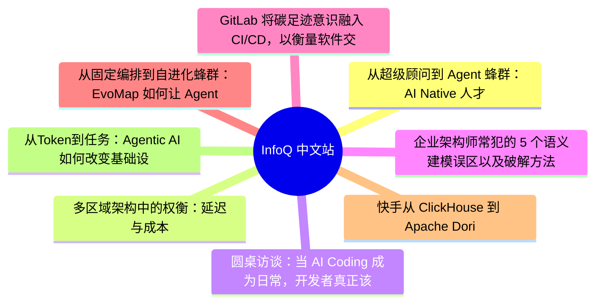
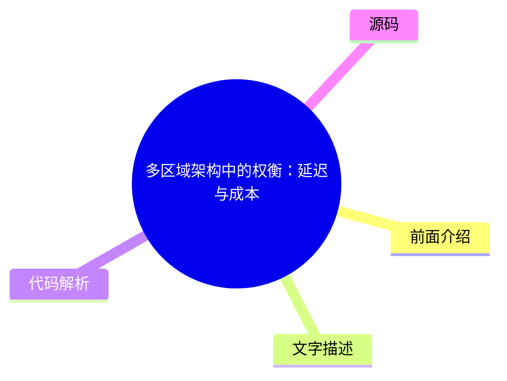
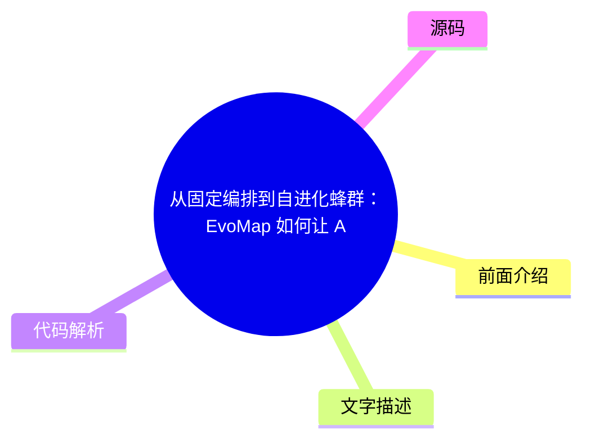

# 📰 InfoQ 中文站 Top 8 (2026-07-28)

## 前面介绍

- 数据源：InfoQ 中文站
- 抓取日期：2026-07-28
- 条目数：8
- 含完整正文：7
- 含代码片段：0
- 组织方式：前面介绍 / 树状图 / 文字描述 / 代码解析 / 源码

## 思维导图

## 详细整理（8 条，7 条含全文，0 条含代码）

### 1. 从超级顾问到 Agent 蜂群：AI Native 人才服务组织的共生进化
- **链接**: [https://www.infoq.cn/article/2YUiVa3OsKab7LQ36LS9?utm_source=rss&utm_medium=article](https://www.infoq.cn/article/2YUiVa3OsKab7LQ36LS9?utm_source=rss&utm_medium=article)
- **发布**: Tue, 28 Jul 2026 10:00:00 GMT

#### 前面介绍

- 高端人才服务正从“顾问个人经验驱动”走向“人机共生的组织智能”。
- TTC 构建了数千个 Agent 的协同网络，形成客户对接、内部协调、人才匹配等闭环。
- 系统通过 Supervisor 巡检和 Skill 沉淀，将 bad case 转化为可复用的组织能力。

#### 树状图

#### 文字描述

- 传统高端人才服务依赖顾问个人经验，存在沟通分散、人才库更新滞后、项目复盘难以规模化等痛点。
- TTC 判断 Agent 不应只是工具，而应成为人才服务组织中的新协作单元，构建多 Agent 蜂群架构。
- 系统以业务对象（客户、职位、候选人等）为核心建模，而非仅围绕 Chat Session，实现可控协作。
- 通过多源数据接入和事件驱动机制，Agent 能够处理碎片化上下文，并实现权限隔离与质量巡检。
- 顾问从信息处理者升级为 Agent 指挥者，人才库从静态简历库进化为动态认知网络。
- 组织经验从“留在个人脑子里”变成可沉淀、可复用的 Knowledge 和 Skill，形成共生进化体系。

#### 代码解析

- 本文未提供源码，以下为实现思路或结构解析
- 采用多 Agent 协作模式，每个客户配置 3 个基础 Agent（客户对接、客户主管、内部协调），并接入 OpenMai 工作台、Sourcing 与 Supervisor Agent。
- 通过 Skill Registry 管理可复用经验，Supervisor 负责巡检 Agent 工作质量，区分高风险 bad case 并沉淀 Knowledge。
- 系统通过事件驱动机制触发任务更新、候选人推荐和项目风险提醒，实现业务闭环。

#### 源码

#### 中文节选

Agent 时代，哪些方向正在成为行业关键变量？50 + 实战案例揭晓答案！

模型参数规模不断突破，推理成本持续下降，开源生态日益繁荣。当模型能力逐渐成为行业共识，一个新的问题开始浮现：**当人人都能获得强大的模型能力之后，真正的竞争力还剩下什么？** 答案正在从模型能力本身，转向围绕模型构建可规模化的智能系统；从单点能力提升，转向系统工程与组织级落地能力。

在这一背景下，[2026 年 AICon 人工智能开发与应用大会 · 深圳站](https://aicon.infoq.cn/2026/shenzhen/track)正式启动。本次大会将于** 8 月 21 日—22 日**举办，聚焦 AI 基础设施、大模型系统、智能体工程、数据智能、多模态技术与行业落地等关键方向，邀请来自腾讯、阿里、华为、百度、蚂蚁集团等 50 + 头部科技企业技术负责人、科研机构一线专家，系统性分享前沿洞察与实战干货，共同探讨 AI 技术从能力到系统、从实验到生产的真实路径。

TTC（True Talents Connect）Cofounder & CTO 宁辽原已确认出席 “[超级个体与蜂群智能的共生进化](https://aicon.infoq.cn/2026/shenzhen/track/1950)” 专题，并发表题为**《**[从超级顾问到 Agent 蜂群：AI Native 人才服务组织的共生进化](https://aicon.infoq.cn/2026/shenzhen/presentation/7192)**》**的主题分享。高端人才服务正从“顾问个人经验驱动”走向“人机共生的组织智能”：客户沟通碎片化、人才库更新滞后、项目协同与复盘难以规模化。TTC 基于 2000+ 客户、上千活跃客户和 300 万人才库，构建多 Agent 蜂群架构：每个客户配置客户对接、客户主管、内部协调 3 个 Agent，并接入 OpenMai 工作台、人才库、Sourcing 与 Supervisor Agent，形成数千个不同类型 Agent 的协同网络。系统通过微信群/飞书/人才库/外网数据接入、任务编排、权限审计、Knowledge/Skill 沉淀与跨 Agent 复用，实现客户响应、人才匹配、项目管理和质量巡检闭环，让 bad case 持续转化为可复用组织能力。在本次演讲中，宁辽原将对此展开详细介绍。

宁辽原，TTC（True Talents Connect）Cofounder & CTO，曾任微软研究院（美国）AI 产研总监，曾任字节跳动飞书首席架构师。2022 年创办 TTC（True Talents Connect），担任 CTO。该企业已服务超 2000 家 AI 和科技企业，提供科技人才寻访和招聘服务，品牌理念为找 AI 人才就找 TTC。目前已完成四轮融资，投资方包括源码资本、创新工场等，企业年收入突破 1 亿元，2026 年预计收入超 2 亿元。他在本次会议的详细演讲内容如下：

演讲提纲：

1. 背景

人才服务为什么需要 Agent 蜂群高端人才服务不是简单招聘流程，而是客户需求理解、候选人判断、项目推进、关系斡旋和知识沉淀的复杂协作系统

传统模式高度依赖顾问个人经验，客户沟通分散在微信/飞书/电话中，人才库更新滞后，项目复盘难以规模化

TTC 的判断：Agent 不应只是顾问工具，而应成为人才服务组织中的新协作单元

2. TTC 的多 Agent 服务架构

构建了数千个 Agent 参与的服务网络。每个客户配置 3 个基础 Agent：客户对接 Agent、客户主管 Agent、内部协调 Agent

顾问侧有 OpenMai 工作台 Agent，支持项目管理、候选人匹配、分析与推荐

供给侧有人才库 Agent 和 Sourcing Agent，负责人才打标、数据更新、外部信息收集

上层有 Supervisor Agent，巡检 Agent 工作质量，发现 bad case，并沉淀 Knowledge/Skill

3. 核心技术点

如何让数千 Agent 可控协作以业务对象为核心建模：客户、职位、候选人、项目、沟通记录、任务、Skill，而不是只围绕 Chat Session

通过微信群、飞书、人才库、外网信息等多源数据接入，形成持续更新的业务上下文。不同 Agent 拥有不同上下文、权限和工具调用范围，客户可见信息与内部判断严格隔离

采用事件驱动机制触发任务更新、候选人推荐、项目风险提醒和质量巡检

通过 Skill Registry 管理可复用经验，让不同种类 Agent 能受控学习和复用能力

4. 踩坑经验

从“会回答”到“会服务”只靠长上下文不够，群聊中的省略表达必须落到结构化业务状态里。只让 Agent “推荐候选人”，容易退化成简历搜索，必须拆成硬条件、行业匹配、职业路径、动机风险等维度

Agent 自动总结 know-how 容易空泛，真正有用的 Skill 必须是可执行、可验证、可复用的操作方法。Supervisor 不能只制造告警噪音，需要区分高风险 bad case 和普通低质量输出

5. 实施效果与组织进化

TTC 已在真实客户服务中运行数千个不同类型 Agent，覆盖客户沟通、内部协作、人才管理、外部 sourcing、质量巡检等环节。顾问从信息处理者升级为 Agent 指挥者、关键判断者和关系经营者。人才库从静态简历库进化为动态人才认知网络。组织经验从“留在个人脑子里”变成可沉淀、可复用、可迭代的 Knowledge 和 Skill。最终形成“人类顾问 + Agent 蜂群 + 组织知识”的共生进化体系。

演讲痛点

最大的痛点不是“让 Agent 工作”，而是让大量 Agent 在真实业务中可控、可信、可持续进化

人才服务上下文高度碎片化，微信群/飞书里的省略表达、客户隐含偏好、候选人动态状态，不能只靠长上下文解决，必须沉淀为结构化业务对象，但这会增加建模成本

Agent 越多，职责越细，响应越快，但协作、权限、成本和故障定位复杂度也会上升

自动化越深，效率越高，但客户沟通、候选人推荐、状态写回等高风险动作必须保留人工确认，否则容易出现错误承诺和权限越界

Supervisor 和 Skill 机制能让 bad case 变成组织能力，但也需要评估与版本治理，避免错误经验被规模化复用

听众收益

1. 获得大规模 Agent 落地的组织级架构参考

了解如何从单个 AI 助手升级到数千 Agent 协作网络，包括角色拆分、事件驱动、权限隔离、Supervisor 巡检和 Skill 复用机制

2. 理解 Agent 与业务系统融合的关键工程取舍

学习在微信、飞书、人才库、外网数据等复杂上下文中，如何处理长上下文不足、业务对象建模、工具调用边界、人工确认和成本控制等问题

3. 看到 AI Native 组织进化的真实案例

从 TTC 的人才服务实践中，理解 Agent 如何与人类专家共生：Agent 负责信息处理、流程推进和经验沉淀，人类负责判断、信任、关系和关键决策

除此之外，

#### 完整正文（中文）

Agent 时代，哪些方向正在成为行业关键变量？50 + 实战案例揭晓答案！

模型参数规模不断突破，推理成本持续下降，开源生态日益繁荣。当模型能力逐渐成为行业共识，一个新的问题开始浮现：**当人人都能获得强大的模型能力之后，真正的竞争力还剩下什么？** 答案正在从模型能力本身，转向围绕模型构建可规模化的智能系统；从单点能力提升，转向系统工程与组织级落地能力。

在这一背景下，[2026 年 AICon 人工智能开发与应用大会 · 深圳站](https://aicon.infoq.cn/2026/shenzhen/track)正式启动。本次大会将于** 8 月 21 日—22 日**举办，聚焦 AI 基础设施、大模型系统、智能体工程、数据智能、多模态技术与行业落地等关键方向，邀请来自腾讯、阿里、华为、百度、蚂蚁集团等 50 + 头部科技企业技术负责人、科研机构一线专家，系统性分享前沿洞察与实战干货，共同探讨 AI 技术从能力到系统、从实验到生产的真实路径。

TTC（True Talents Connect）Cofounder & CTO 宁辽原已确认出席 “[超级个体与蜂群智能的共生进化](https://aicon.infoq.cn/2026/shenzhen/track/1950)” 专题，并发表题为**《**[从超级顾问到 Agent 蜂群：AI Native 人才服务组织的共生进化](https://aicon.infoq.cn/2026/shenzhen/presentation/7192)**》**的主题分享。高端人才服务正从“顾问个人经验驱动”走向“人机共生的组织智能”：客户沟通碎片化、人才库更新滞后、项目协同与复盘难以规模化。TTC 基于 2000+ 客户、上千活跃客户和 300 万人才库，构建多 Agent 蜂群架构：每个客户配置客户对接、客户主管、内部协调 3 个 Agent，并接入 OpenMai 工作台、人才库、Sourcing 与 Supervisor Agent，形成数千个不同类型 Agent 的协同网络。系统通过微信群/飞书/人才库/外网数据接入、任务编排、权限审计、Knowledge/Skill 沉淀与跨 Agent 复用，实现客户响应、人才匹配、项目管理和质量巡检闭环，让 bad case 持续转化为可复用组织能力。在本次演讲中，宁辽原将对此展开详细介绍。

宁辽原，TTC（True Talents Connect）Cofounder & CTO，曾任微软研究院（美国）AI 产研总监，曾任字节跳动飞书首席架构师。2022 年创办 TTC（True Talents Connect），担任 CTO。该企业已服务超 2000 家 AI 和科技企业，提供科技人才寻访和招聘服务，品牌理念为找 AI 人才就找 TTC。目前已完成四轮融资，投资方包括源码资本、创新工场等，企业年收入突破 1 亿元，2026 年预计收入超 2 亿元。他在本次会议的详细演讲内容如下：

演讲提纲：

1. 背景

人才服务为什么需要 Agent 蜂群高端人才服务不是简单招聘流程，而是客户需求理解、候选人判断、项目推进、关系斡旋和知识沉淀的复杂协作系统

传统模式高度依赖顾问个人经验，客户沟通分散在微信/飞书/电话中，人才库更新滞后，项目复盘难以规模化

TTC 的判断：Agent 不应只是顾问工具，而应成为人才服务组织中的新协作单元

2. TTC 的多 Agent 服务架构

构建了数千个 Agent 参与的服务网络。每个客户配置 3 个基础 Agent：客户对接 Agent、客户主管 Agent、内部协调 Agent

顾问侧有 OpenMai 工作台 Agent，支持项目管理、候选人匹配、分析与推荐

供给侧有人才库 Agent 和 Sourcing Agent，负责人才打标、数据更新、外部信息收集

上层有 Supervisor Agent，巡检 Agent 工作质量，发现 bad case，并沉淀 Knowledge/Skill

3. 核心技术点

如何让数千 Agent 可控协作以业务对象为核心建模：客户、职位、候选人、项目、沟通记录、任务、Skill，而不是只围绕 Chat Session

通过微信群、飞书、人才库、外网信息等多源数据接入，形成持续更新的业务上下文。不同 Agent 拥有不同上下文、权限和工具调用范围，客户可见信息与内部判断严格隔离

采用事件驱动机制触发任务更新、候选人推荐、项目风险提醒和质量巡检

通过 Skill Registry 管理可复用经验，让不同种类 Agent 能受控学习和复用能力

4. 踩坑经验

从“会回答”到“会服务”只靠长上下文不够，群聊中的省略表达必须落到结构化业务状态里。只让 Agent “推荐候选人”，容易退化成简历搜索，必须拆成硬条件、行业匹配、职业路径、动机风险等维度

Agent 自动总结 know-how 容易空泛，真正有用的 Skill 必须是可执行、可验证、可复用的操作方法。Supervisor 不能只制造告警噪音，需要区分高风险 bad case 和普通低质量输出

5. 实施效果与组织进化

TTC 已在真实客户服务中运行数千个不同类型的 Agent，覆盖客户沟通、内部协作、人才管理、外部 sourcing、质量巡检等环节。顾问从信息处理者升级为 Agent 指挥者、关键判断者和关系经营者。人才库从静态简历库进化为动态人才认知网络。组织经验从“留在个人脑子里”变成可沉淀、可复用、可迭代的 Knowledge 和 Skill。最终形成“人类顾问 + Agent 蜂群 + 组织知识”的共生进化体系。

演讲痛点

最大的痛点不是“让 Agent 工作”，而是让大量 Agent 在真实业务中可控、可信、可持续进化

人才服务上下文高度碎片化，微信群/飞书里的省略表达、客户隐含偏好、候选人动态状态，不能只靠长上下文解决，必须沉淀为结构化业务对象，但这会增加建模成本

Agent 越多，职责越细，响应越快，但协作、权限、成本和故障定位复杂度也会上升

自动化越深，效率越高，但客户沟通、候选人推荐、状态写回等高风险动作必须保留人工确认，否则容易出现错误承诺和权限越界

Supervisor 和 Skill 机制能让 bad case 变成组织能力，但也需要评估与版本治理，避免错误经验被规模化复用

听众收益

1. 获得大规模 Agent 落地的组织级架构参考

了解如何从单个 AI 助手升级到数千 Agent 协作网络，包括角色拆分、事件驱动、权限隔离、Supervisor 巡检和 Skill 复用机制

2. 理解 Agent 与业务系统融合的关键工程取舍

学习在微信、飞书、人才库、外网数据等复杂上下文中，如何处理长上下文不足、业务对象建模、工具调用边界、人工确认和成本控制等问题

3. 看到 AI Native 组织进化的真实案例

从 TTC 的人才服务实践中，理解 Agent 如何与人类专家共生：Agent 负责信息处理、流程推进和经验沉淀，人类负责判断、信任、关系和关键决策

除此之外，本次大会还策划了[AI Infra、推理工程与异构计算](https://aicon.infoq.cn/2026/shenzhen/track/1949)、[超级个体与蜂群智能的共生进化](https://aicon.infoq.cn/2026/shenzhen/track/1950)、[迈向机器人 AGI 的关键技术与产业实践](https://aicon.infoq.cn/2026/shenzhen/track/1952)、[Agent 安全：从风险到可控](https://aicon.infoq.cn/2026/shenzhen/track/1953)、[大模型效率工程与 Agent 系统实践](https://aicon.infoq.cn/2026/shenzhen/track/1955)、[AI Agent 高价值商业场景实战](https://aicon.infoq.cn/2026/shenzhen/track/1958)等 10 个专题论坛，届时将有来自不同行业、不同领域、不同企业的 50+资深专家在现场带来前沿技术洞察和一线实践经验。

大会限时早鸟票享 9 折专属优惠，现在报名立减 580，更多详情可扫码或联系票务经理 13269078023 进行咨询。

### 2. 多区域架构中的权衡：延迟与成本
- **链接**: [https://www.infoq.cn/article/i84fFL01baIXa1P6Kqcl?utm_source=rss&utm_medium=article](https://www.infoq.cn/article/i84fFL01baIXa1P6Kqcl?utm_source=rss&utm_medium=article)
- **发布**: Tue, 28 Jul 2026 09:24:24 GMT

#### 前面介绍

- 新增区域不仅改变延迟，还会显著增加基础设施、运营和跨区域流量成本。
- 延迟改善往往源于路由优化而非新增区域本身，需优先解决非地理因素。
- 数据主权、合规要求及 Active-Active 灾备是新增区域的合理理由。
- 通过消除跨区域依赖和优化基础设施规模，可经济高效地运营多区域基础设施。

#### 树状图

#### 文字描述

- 新增区域的总拥有成本包括基础设施资本支出、服务上线开销、复制与同步成本、运营开销及跨区域流量成本。
- 延迟预算中很大一部分源于非地理因素（如服务依赖、重复认证），通过架构调整可更高效地解决。
- 多区域部署模式包括全栈 Active-Active、本地读取/全局写入和 Active-Passive，各有不同的延迟与成本权衡。
- 一致性策略应设定在数据类型层面，而非系统层面，以避免过度投资或保护不足。
- 消除关键路径中的跨区域依赖关系是实现区域数据自给自足的关键，能显著降低延迟和成本。
- 自动化投资收益与区域规模成正比，通过自动化可大幅减少人工协调工作量。

#### 代码解析

- 本文未提供源码，以下为实现思路或结构解析
- 决策框架应综合考虑数据主权、延迟要求（如 <50ms）、Active-Active 灾备需求及市场扩张因素。
- 部署架构模式选择需权衡延迟优势与运维成本，如 Active-Active 模式适合写入密集型且用户分布全球的系统。
- 运营成本控制重点在于消除跨区域同步调用、优化基础设施规模并投资于自动化部署与监控。

#### 源码

#### 中文节选

当超大规模云服务商仅在一个地理区域内部署时，架构选择相对简单。工程师只需要针单个区域的可用性进行优化，选择合适的数据库一致性模型，并调整自动扩展策略。成本结构透明，延迟特征可预测。而增加第二个或第十四个区域，则会同时从根本上改变这两个维度，而且几乎从来都不会只有好处。

我曾经多次在跨区域部署过程中做过这种权衡。塑造这一框架的关键决策包括：采用同步还是异步复制、哪些依赖关系需要跨区域边界进行连接，以及在何种情况下新增区域能降低成本而非增加成本。

## 多区域决策框架：为何简单的数学方法行不通

在接触区域扩展的初期，我曾经将这种决策视为一个简单的算术问题。我们在亚洲的用户面临着 250 毫秒的延迟。在新加坡新增一个区域可以将延迟降至 30 毫秒。如果该区域的月成本为 X 美元，改善延迟带来的收入为 Y 美元，那么当 Y > X 时则进行扩展。

随着时间的推移，这种模型被证明是不够完善的。区域成本并非固定不变，复杂性会不断累积，而且延迟改善中有相当大一部分往往是源于路由优化，而非增加区域本身。

### 新增区域的真实成本剖析

新增区域的总拥有成本包括一些在初步商业案例中通常被低估的方面。

### 基础设施资本支出

硬件、网络与设施成本（含跨区域网络架构），在我们绝大多数服务上线项目中，约占区域基础设施总成本的 25%。

### 服务上线开销

在新增区域中运行的每项服务都会产生配置、验证和上线成本。在数百项服务中，我们在正式上线前识别并解决了数千个服务间的依赖关系问题（例如：未记录、循环依赖、冗余，以及在成本或性能方面未达到最优）。

### 复制与同步成本

跨区域同步复制可能会使写入延迟增加多达一百毫秒。而异步复制虽然能减轻对写入延迟的影响，但会引入最终一致性窗口，需要应用程序层进行处理。

### 运营开销

运营开销包括额外的值班覆盖、部署管道以及事件响应范围。我们的自动化工作（在十二个月内使数十个服务团队的手动工作量减少了 89%）正是出于防止运营开销随区域覆盖范围扩大呈线性增长的考虑。例如，以前在每次里程碑发布时，区域服务部署都需要由技术项目经理（TPM）手动协调各团队的就绪信号。通过将这些检查点信号自动化，并直接从服务监控中提取健康指标（而非依赖人工确认），我们消除了协调工作中最大的一块协调时间。

### 跨区域流量成本

跨区域数据传输是云基础设施中每千兆字节成本最高的项目之一。需要频繁进行跨区域数据交换的架构，其持续产生的成本可能在 12 到 18 个月内就会超过一次性部署的投资。

### 延迟：你真正购买的是什么

降低延迟是扩展区域时最常被提及的理由，却也是最常被误解的。在决定承担新区域的成本之前，值得仔细分析你的延迟预算究竟花在了哪里。

### 延迟预算分解

表 1：按组成和区域可寻址性划分的延迟预算分解

从本质上讲，网络传播是唯一与地理位置相关的因素，因此必须通过物理上的邻近性来解决。所有其他因素均可以通过架构调整、CDN 部署、连接池、查询优化以及消除依赖关系等方式加以改进；相比新增区域，每种方案的成本都更低。

实际上，经过仔细地延迟监测，结果一再表明，观测到的延迟中很大一部分（通常接近一半）源于非地理因素。优先解决这些问题几乎总是更明智的投资。

### 什么时候新增区域才是正确的答案

尽管有上述提醒，但在某些场景下，新增区域确实是合理的选择。

### 数据主权与合规要求

当数据必须根据《通用数据保护条例》（GDPR）、联邦风险与授权管理计划（FedRAMP）或类似框架的要求，在特定司法管辖区内物理存储时，新增一个区域便成为合规的必要条件，而非针对延迟的投资。成本分析的重点也从“每美元的延迟成本”转向“每美元的合规风险”。数据主权与地缘政治风险——无论是源于监管不稳定、政府的数据访问要求，还是供应链连续性方面的担忧——如今已成为区域选择的首要考量因素，对于企业和政府客户而言尤其如此。

### 要求延迟低于 50 毫秒的一级用户群体

对于实时交易、互动游戏和视频会议而言，受光速传播的物理限制，当大规模用户群体距离现有最近的服务区域超过 3000 公里时，地理就近部署就成了硬性要求。

### 满足 Active-Active 要求的灾难恢复

若恢复时间目标（RTO）需要控制在 15 分钟以内，则必须在至少两个地理位置上相互隔离的区域部署主动式基础设施。这是一项针对系统韧性的投资；延迟改善则是其带来的一个有益的副作用。

### 通过本地化运营实现市场扩张

在与具有低延迟 API 要求的本地支付处理商、身份提供商或政府系统进行集成时，出于功能性考虑，无论终端用户的延迟情况如何，可能都需要部署本地区域。

## 部署架构模式及其权衡

一旦决定增加一个区域，所选的架构模式将决定后续延迟优势与运维成本之间的动态平衡关系。

### 模式 1：全栈 Active-Active 模式

每个区域都托管着应用程序栈的一个完整且独立运行的副本。用户将被路由到距离最近的区域；每个区域同时处理读写操作。数据以异步方式进行复制，通常采用“最后写入者胜出”机制来处理写入冲突。该模式能带来最大的延迟优势，但运营成本也最高：需要完全复制基础设施、持续进行跨区域数据传输、处理应用层的一致性、解决冲突，以及整个集群的可观测性。

最适合的情况是：写入密集型工作负载且用户分布于全球各地，即在所服务的每个司法管辖区内都有数据驻留要求的系统。

### 模式 2：本地读取 / 全局写入

其中一个区域是全局写入区域；所有区域均通过本地副本处理读取请求。来自非主区域的写入请求在获得确认前会被代理到全局写入区域。读取请求在本地处理，从而在全球范围内提供比较低的读取延迟，但非主区域用户的写入延迟会受到跨区域往返时延的影响。

### 模式 3：Active-Passive 模式（带自动故障转移）

一个功能完备的主区域处理所有生产流量；辅助区域接收持续复制，但在正常情况下不处理任何流量。辅助区域可以缩减规模（即转为温备）或仅在存储层进行配置（即指示灯模式），这使得该模式在三种模式中具有最佳的成本效益。其权衡在于故障转移时间：5 到 20 分钟，而 Active-Active 模式的故障转移时间则不到 30 秒。

其中存在一个隐性的运营风险：从未经过测试的故障转移路径在实际调用时往往会发生故障。请定期进行测试，并在规划中纳入实际故障转移时间，而非理论上的恢复时间目标（RTO）。

表 2：多区域部署模式比较

有一项设计考量贯穿了这三种模式：一致性策略应设定在数据类型层面，而非系统层面。在我们的存储服务中，对象元数据需要强一致性；而复制状态则可以容忍暂时的不一致。那些对所有数据统一应用单个一致性策略的系统，要么对不需要复制的数据进行了过度投资，要么对数据保护不足。Active-Active 模式尤其容易犯这种错误，因为其复杂性使得按类型分析一致性变得更加困难。

## 经济高效地运营多区域基础设施

是否新增一个区域的决策，与如何经济高效地运营所有区域密不可分。在我们至少三次发布中，运营成本在前两年内的增长速度超过了客户采用率的支撑能力。最具杠杆效应的成本控制措施

#### 完整正文（中文）

当超大规模云服务商仅在一个地理区域内部署时，架构选择相对简单。工程师只需要针单个区域的可用性进行优化，选择合适的数据库一致性模型，并调整自动扩展策略。成本结构透明，延迟特征可预测。而增加第二个或第十四个区域，则会同时从根本上改变这两个维度，而且几乎从来都不会只有好处。

我曾经多次在跨区域部署过程中做过这种权衡。塑造这一框架的关键决策包括：采用同步还是异步复制、哪些依赖关系需要跨区域边界进行连接，以及在何种情况下新增区域能降低成本而非增加成本。

## 多区域决策框架：为何简单的数学方法行不通

在接触区域扩展的初期，我曾经将这种决策视为一个简单的算术问题。我们在亚洲的用户面临着 250 毫秒的延迟。在新加坡新增一个区域可以将延迟降至 30 毫秒。如果该区域的月成本为 X 美元，改善延迟带来的收入为 Y 美元，那么当 Y > X 时则进行扩展。

随着时间的推移，这种模型被证明是不够完善的。区域成本并非固定不变，复杂性会不断累积，而且延迟改善中有相当大一部分往往是源于路由优化，而非增加区域本身。

### 新增区域的真实成本剖析

新增区域的总拥有成本包括一些在初步商业案例中通常被低估的方面。

### 基础设施资本支出

硬件、网络与设施成本（含跨区域网络架构），在我们绝大多数服务上线项目中，约占区域基础设施总成本的 25%。

### 服务上线开销

在新增区域中运行的每项服务都会产生配置、验证和上线成本。在数百项服务中，我们在正式上线前识别并解决了数千个服务间的依赖关系问题（例如：未记录、循环依赖、冗余，以及在成本或性能方面未达到最优）。

### 复制与同步成本

跨区域同步复制可能会使写入延迟增加多达一百毫秒。而异步复制虽然能减轻对写入延迟的影响，但会引入最终一致性窗口，需要应用程序层进行处理。

### 运营开销

运营开销包括额外的值班覆盖、部署管道以及事件响应范围。我们的自动化工作（在十二个月内使数十个服务团队的手动工作量减少了 89%）正是出于防止运营开销随区域覆盖范围扩大呈线性增长的考虑。例如，以前在每次里程碑发布时，区域服务部署都需要由技术项目经理（TPM）手动协调各团队的就绪信号。通过将这些检查点信号自动化，并直接从服务监控中提取健康指标（而非依赖人工确认），我们消除了协调工作中最大的一块协调时间。

### 跨区域流量成本

跨区域数据传输是云基础设施中每千兆字节成本最高的项目之一。需要频繁进行跨区域数据交换的架构，其持续产生的成本可能在 12 到 18 个月内就会超过一次性部署的投资。

### 延迟：你真正购买的是什么

降低延迟是扩展区域时最常被提及的理由，却也是最常被误解的。在决定承担新区域的成本之前，值得仔细分析你的延迟预算究竟花在了哪里。

### 延迟预算分解

表 1：按组成和区域可寻址性划分的延迟预算分解

从本质上讲，网络传播是唯一与地理位置相关的因素，因此必须通过物理上的邻近性来解决。所有其他因素均可以通过架构调整、CDN 部署、连接池、查询优化以及消除依赖关系等方式加以改进；相比新增区域，每种方案的成本都更低。

实际上，经过仔细地延迟监测，结果一再表明，观测到的延迟中很大一部分（通常接近一半）源于非地理因素。优先解决这些问题几乎总是更明智的投资。

### 什么时候新增区域才是正确的答案

尽管有上述提醒，但在某些场景下，新增区域确实是合理的选择。

### 数据主权与合规要求

当数据必须根据《通用数据保护条例》（GDPR）、联邦风险与授权管理计划（FedRAMP）或类似框架的要求，在特定司法管辖区内物理存储时，新增一个区域便成为合规的必要条件，而非针对延迟的投资。成本分析的重点也从“每美元的延迟成本”转向“每美元的合规风险”。数据主权与地缘政治风险——无论是源于监管不稳定、政府的数据访问要求，还是供应链连续性方面的担忧——如今已成为区域选择的首要考量因素，对于企业和政府客户而言尤其如此。

### 要求延迟低于 50 毫秒的一级用户群体

对于实时交易、互动游戏和视频会议而言，受光速传播的物理限制，当大规模用户群体距离现有最近的服务区域超过 3000 公里时，地理就近部署就成了硬性要求。

### 满足 Active-Active 要求的灾难恢复

若恢复时间目标（RTO）需要控制在 15 分钟以内，则必须在至少两个地理位置上相互隔离的区域部署主动式基础设施。这是一项针对系统韧性的投资；延迟改善则是其带来的一个有益的副作用。

### 通过本地化运营实现市场扩张

在与具有低延迟 API 要求的本地支付处理商、身份提供商或政府系统进行集成时，出于功能性考虑，无论终端用户的延迟情况如何，可能都需要部署本地区域。

## 部署架构模式及其权衡

一旦决定增加一个区域，所选的架构模式将决定后续延迟优势与运维成本之间的动态平衡关系。

### 模式 1：全栈 Active-Active 模式

每个区域都托管着应用程序栈的一个完整且独立运行的副本。用户将被路由到距离最近的区域；每个区域同时处理读写操作。数据以异步方式进行复制，通常采用“最后写入者胜出”机制来处理写入冲突。该模式能带来最大的延迟优势，但运营成本也最高：需要完全复制基础设施、持续进行跨区域数据传输、处理应用层的一致性、解决冲突，以及整个集群的可观测性。

最适合的情况是：写入密集型工作负载且用户分布于全球各地，即在所服务的每个司法管辖区内都有数据驻留要求的系统。

### 模式 2：本地读取 / 全局写入

其中一个区域是全局写入区域；所有区域均通过本地副本处理读取请求。来自非主区域的写入请求在获得确认前会被代理到全局写入区域。读取请求在本地处理，从而在全球范围内提供比较低的读取延迟，但非主区域用户的写入延迟会受到跨区域往返时延的影响。

### 模式 3：Active-Passive 模式（带自动故障转移）

一个功能完备的主区域处理所有生产流量；辅助区域接收持续复制，但在正常情况下不处理任何流量。辅助区域可以缩减规模（即转为温备）或仅在存储层进行配置（即指示灯模式），这使得该模式在三种模式中具有最佳的成本效益。其权衡在于故障转移时间：5 到 20 分钟，而 Active-Active 模式的故障转移时间则不到 30 秒。

其中存在一个隐性的运营风险：从未经过测试的故障转移路径在实际调用时往往会发生故障。请定期进行测试，并在规划中纳入实际故障转移时间，而非理论上的恢复时间目标（RTO）。

表 2：多区域部署模式比较

有一项设计考量贯穿了这三种模式：一致性策略应设定在数据类型层面，而非系统层面。在我们的存储服务中，对象元数据需要强一致性；而复制状态则可以容忍暂时的不一致。那些对所有数据统一应用单个一致性策略的系统，要么对不需要复制的数据进行了过度投资，要么对数据保护不足。Active-Active 模式尤其容易犯这种错误，因为其复杂性使得按类型分析一致性变得更加困难。

## 经济高效地运营多区域基础设施

是否新增一个区域的决策，与如何经济高效地运营所有区域密不可分。在我们至少三次发布中，运营成本在前两年内的增长速度超过了客户采用率的支撑能力。最具杠杆效应的成本控制措施主要集中在三个方面。

### 消除关键路径中的跨区域依赖关系

大多数跨区域边界的同步调用都会增加延迟并产生成本。对跨区域请求路径进行分布式追踪时，经常会发现令人惊讶的依赖链：对区域 A 的请求会触发区域 B 的配置查询，进而又触发区域 A 的授权检查，这使得原本通过合理的数据布局便可以在 20 毫秒内完成的操作，将延迟增加了超过 100 毫秒。

解决之道在于实现区域数据自给自足：每个区域都保留处理请求所需的所有数据的本地副本，从而避免在热路径中进行跨区域调用。虽然复制基础设施需要前期投资，但在规模扩大后能带来复利回报，因为跨区域调用的成本会随流量增长而增加，而复制成本则基本是固定的。

在我们的扩展计划中，填补数千个服务依赖缺口——其中大部分是未记录的跨区域调用依赖关系——是发布准备工作中效益最高的举措之一。每个缺口的填补都意味着可靠性的提升和成本的降低。

### 优化基础设施规模并投资于自动化

无论流量成熟度如何，在各区域采用相同的基础设施规模都会导致新区域的容量利用率不足。通过审核成熟区域中的资源浪费，并合理调整新部署的规模，能够不断降低每次上线的资本支出（CapEx）。那些能够揭示现有区域中资源浪费的容量分析技能，直接提升了新区域规划所需的严谨性。

另一项倍增器是自动化。多区域集群的运营成本主要由人力投入构成，例如部署、配置变更、健康检查和事件响应。一个每个区域需要四小时人工协调的流程，在 3 个区域时尚可应对；但在拥有数百项服务的 14 个区域中，同一流程每年累计耗时将达数千小时。我们在 12 个月内通过跨数十个服务团队的人工干预接近为零的自动化，将人工工作量减少了 89%。这正是源于以下现实：自动化投资的收益与区域规模成正比，在规模化运营中绝非可有可无。

## 项目管理维度：大规模上线执行

在不影响现有区域运营的前提下，快速将新区域推向市场，其重要性不亚于架构本身，却往往未受到应有的重视。

### 关键路径优化

多区域发布涉及数百至数千项任务的依赖关系图。关键路径（即最长的顺序链）决定了无论投入多少资源，项目能达成的最短时间表。在我们的项目中，最具影响力的举措是识别出那些仅因“我们一直都这样做”而非真正存在技术顺序要求而必须按顺序执行的任务。围绕真实的依赖关系重新调整执行计划，在无需额外工程投入的情况下，将时间表压缩了约 25%。

### 可视化与上线后优化

要在保持开发速度的同时，确保数十个服务团队、基础设施部门和高管利益相关方之间的协同一致，需要专门构建的可视化基础设施。一个自助式数据湖和洞察仪表盘消除了跨多个 TPM 的手动报告工作，其投资回报率将远超预期，使原本需要数天汇总工作才能进行的、基于数据的优先级讨论成为可能。

工作不会在正式上线后结束。生产运营的前 90 天通常会出现客户需求变化、延迟异常以及复制调优需求等情况。一个结构化的上线后优化阶段，配备专门资源进行持续的监控和调整，与初始部署配置相比，可以使成本效率提高 20% 至 30%。

## 一个用于多区域扩展的决策框架

表 3：多区域扩展决策框架

## 扩展至新区域：实际案例

在一次区域扩展发布中，我们接到任务，需要为亚洲地区快速增长的用户群改善延迟问题。初步指标显示，端到端延迟约为 260 毫秒。当即提出的方案是上线一个新区域。

在正式实施前，我们对完整的延迟路径进行了模拟。结果发现，仅约 45% 的延迟源于地理因素，其余部分则来自低效的服务依赖关系、重复的身份验证调用以及未重用连接。

我们评估了三种方案：

- 立即上线一个新区域。 
- 优化路由并消除跨区域依赖关系。 
- 分阶段采用这两种方法。 

我们选择了分阶段实施的方法。

关于下文中的数据说明：本案例研究中的延迟数值（260 毫秒、160 毫秒和 60 毫秒）是实际上线时测得的数值，已进行四舍五入处理。22% 的复制开销和 35% 的延迟降低率均来自实际测量的遥测数据，而非概括性估计。

首先，我们引入了基于延迟的路由机制，并从请求路径中移除了两个关键的跨区域服务调用。仅此一项就将延迟降低了约 35%，使其降至约 160 毫秒，不需要任何新的基础设施投资。通过优化数据库访问模式并启用连接池，又进一步缩短了 30 毫秒。

直到此时，我们才着手上线新区域。由于系统已经过优化，增量效益更加明显，成本效益也更为合理。上线后，本地用户的延迟降至 60 毫秒以下。

成本方面的实际情况却更为复杂。在高峰时段，跨区域数据传输产生的复制开销比预测值高出约 22%，这主要归因于元数据的扇出效应。每次向新区域写入对象时，都会触发该对象本身及其关联元数据（包括访问控制记录、版本标记、复制状态标志）的复制，而这些元数据均作为独立的操作通过跨区域链路进行传输。在高峰时段，仅元数据流量就占到了总复制流量的约三分之一。这是我们上线前的流量模型未能捕捉到的因素，因为元数据写入在应用层是不可见的。第二个主要驱动因素是复制重试流量：当跨区域链路在峰值负载下性能下降时，复制失败会触发重试，而这些重试又给本已拥堵的链路增加了负载，这种反馈循环导致传输成本远远超过了稳态预测值。处理这些故障占用了本来应该分配给其他任务的工程资源。关键的经验教训在于：操作顺序至关重要。在扩展之前优化架构并实现运维自动化，既能保证我们从新区域中获取到最大价值，又能避免不必要的成本激增。

## 小结

多区域架构的选择是云基础设施中影响最为深远的决策之一。其优势显而易见：降低延迟、提升灾难恢复能力、符合监管要求以及拓展市场。但随之而来的成本也不容忽视：基础设施冗余、复制复杂性、一致性权衡，以及随规模扩大而不断累积的运营开销。

那些能够有效地应对这一选择的企业，会将区域扩展视为一个持续的优化问题，而非一次性的建设。他们会积极部署监控工具、对成本进行纵向建模、不懈地推进自动化，并保持架构选择与业务成果之间的可追溯性。

根据上线多个区域以及运营 PB 和 EB 级全球基础设施的实践经验，我们得出的结论是一致的：在多区域成本效率方面取得成功的团队，并非那些在上线时选择最便宜架构的团队。相反，成功的团队是那些投资于系统、自动化以及协调基础设施的团队，这些投资使他们能够在上线后持续进行优化。最困难的部分并非上线一个区域，而是长期运营得当。

### 3. 圆桌访谈：当 AI Coding 成为日常，开发者真正该关心什么？
- **链接**: [https://www.infoq.cn/video/hTlgBWF6rgBKDi7TEb7i?utm_source=rss&utm_medium=article](https://www.infoq.cn/video/hTlgBWF6rgBKDi7TEb7i?utm_source=rss&utm_medium=article)
- **发布**: Mon, 27 Jul 2026 18:03:04 GMT

#### 前面介绍

- AI 编码助手已从辅助工具转变为开发者日常工作流的核心组成部分。
- 开发者需要关注 AI 生成代码的安全性、可维护性及与现有系统的集成。
- 人机协作模式正在重塑开发者的角色，从具体编码转向架构设计与质量把控。

#### 树状图

#### 文字描述

- 随着 AI 编码能力的普及，开发者面临如何有效利用这些工具、避免过度依赖以及确保代码质量的新挑战。
- 开发者需要关注 AI 生成代码的上下文理解能力、错误处理机制以及与团队开发规范的兼容性。
- 未来的开发者角色将更多地转向定义需求、审查代码和优化系统架构，而非编写基础代码。
- 企业需要建立相应的流程和工具来管理 AI 生成的代码，确保其符合安全和性能标准。

#### 代码解析

- 本文未提供源码，以下为实现思路或结构解析
- 开发者应关注 AI 编码工具的上下文窗口管理、工具调用边界及人工确认机制。
- 建立代码审查流程，重点检查 AI 生成代码的安全漏洞、性能瓶颈及可维护性。
- 制定团队内部的 AI 编码规范，确保生成的代码风格一致且易于集成。

#### 源码

未抓到可展示源码或原文节选。

### 4. 企业架构师常犯的 5 个语义建模误区以及破解方法
- **链接**: [https://www.infoq.cn/article/BjNkMC0utTMMzATPzkdC?utm_source=rss&utm_medium=article](https://www.infoq.cn/article/BjNkMC0utTMMzATPzkdC?utm_source=rss&utm_medium=article)
- **发布**: Mon, 27 Jul 2026 18:00:03 GMT

#### 前面介绍

- 语义建模是 AI 系统理解数据含义的关键，但常被误解为纯工程问题。
- 不应从零开始构建，而应整合现有资产，建立统一的语义层。
- 采用中心辐射式架构，核心层由平台团队维护，领域层由业务团队扩展。
- 上下文应存放在语义模型中而非系统提示词中，并作为交付物持续维护。

#### 树状图

#### 文字描述

- 误区一：认为必须从零开始。应整合现有维度模型、dbt 项目和 BI 语义层，避免碎片化。
- 误区二：把语义建模当作工程问题。应由数据团队负责技术结构，业务负责人定义领域权威。
- 误区三：构建单体式中央模型。应采用中心辐射式架构，核心层统一，领域层扩展。
- 误区四：未决定上下文存放位置。应将通用定义放入语义模型，特定交互内容放入其他位置。
- 误区五：把语义模型当作交付物。需建立模式变更检测和测试机制，确保与数据仓库同步。

#### 代码解析

- 本文未提供源码，以下为实现思路或结构解析
- 语义建模应采用分级模型：核心层（通用实体）、领域层（特定扩展）、探索层（草稿）。
- 通过基于角色的访问控制（RBAC）实现分级管理，领域团队拥有本领域扩展的写入权限。
- 建立 CI/CD 流水线集成模式变更检测和语义模型测试，确保数据一致性。

#### 源码

#### 中文节选

*2026 年，智能体将在企业级应用中取得哪些实质性突破？*[点击下载](https://www.infoq.cn/minibook/keTZm4fpOmFEzmx77Zpq)*《2026 年 AI 与数据发展预测》白皮书，获悉专家一手前瞻，抢先拥抱新的工作方式！*

我最近面向欧洲、中东和非洲地区的 800 多名数据专业人士，做了一场关于主动式语义建模的在线演示。演示过程中收到的问题，是我见过最犀利的一批。而且，它们直指我经常看到团队反复犯下的五类架构错误。

**这篇文章，是我尝试为这些问题补上一份它们本应得到的长篇回答。**

语义建模正在经历一场复兴。我们当然都明白，为数据附加语义，也就是赋予数据明确的含义，能够极大促进人们对数据形成共同理解。但智能体 AI 系统的兴起，终于让“这些数据究竟意味着什么”这个问题变得前所未有地紧迫。当查询流程中还有人类参与时，这个问题并没有如此突出。人类分析师可以运用自身掌握的特定领域知识，实时消除歧义。AI 智能体却做不到。它会选择一种解释，沿着这个解释继续执行，并自信地返回一个错误答案，或者充其量只是一个不完整的答案。

语义层正是防止这种情况发生的关键。它以受治理、机器可读的方式定义数据的含义：指标如何计算、维度之间如何关联，以及“活跃客户”或“净收入”等术语在你的具体业务语境中究竟意味着什么。没有语义层，你构建的每一个 AI 系统，都只能依据一种隐含且未经验证的数据解释开展工作。

当我们对 AI 的推理结果感到失望时，往往是因为我们意识到，自己才是这个主题上更专业的人，也能够做得更好。而问题的根源，在于 AI 不理解底层数据，也就是它没有获得足够的上下文。

挑战在于，构建语义层并不是一个一次性的项目。它是一套需要长期坚持的工作方法，是一种必须不断锻炼和维护的能力。但大多数组织采用的方式，往往制造了比原有问题更多的脆弱性。以下是我最常见到的五种模式，以及更合适的做法。

## 错误一：认为必须从零开始

引出这个问题的提问是：“纯维度建模与 Snowflake 语义视图之间有什么区别？我们能否对现有模型进行逆向工程？应该如何与 Erwin／IBM IDA 集成？SqlDBM 生成的是 dbt SQL，还是只生成 YAML？”

很明显，提出这些问题的团队都已经拥有一些基础资产：维度模型、dbt 项目、BI 语义层，以及多年积累在数据转换、视图和文档中的业务逻辑。而这些问题真正想问的，其实都是同一件事：我必须把这些东西全部推倒重来吗？

**架构现实：**现有资产并不是问题，碎片化才是问题。大多数企业的语义同时存在于四个位置：数据仓库层，包括维度模型和视图；数据转换层，包括 dbt 指标定义和暂存模型；BI 层，包括 Power BI 数据集和 Tableau 数据源；以及散落在电子表格和 Wiki 中的经验性知识。这些内容彼此之间无法沟通。当 AI 智能体提出一个问题时，它只会访问其中某一层，而忽略其他层，最终生成一个局部一致、但从全局来看错误的答案。

**理想状态：**不要替换，而要整合。将现有维度模型作为结构基础，因为它已经编码了实体关系和数据粒度定义，而这些内容很难重新构建。将 dbt 模型作为数据转换和指标逻辑层。然后在这些基础之上构建语义模型，通过引用现有内容，而不是重新定义它们。对于具备逆向工程能力的工具，可以利用这些能力将已有定义提取到语义建模工具中，再对其进行审核和正式化。大语言模型在逆向工程方面的表现好得出人意料。

目标架构应当是建立一个统一的语义层，并让它成为所有使用方的规范性参考，包括 BI 工具、AI 智能体和 API。数据仓库层和转换层应当作为位于语义层之下的实现细节，而不是与语义层相互竞争的语义载体。

**需要避免的反模式：**因为从零构建一个平行的语义模型看起来更加整洁，就选择完全重建。它的确会很整洁——但大约只能维持三个月。之后，它就会逐渐偏离数据仓库，而 BI 工具仍然会继续使用自己的定义。最终，你不仅没有解决问题，反而从一个语义载体变成了三个。

## 错误二：把语义建模当作一个工程问题

**引出这个问题的提问是：**“业务专家掌握着相关知识，是否有适合他们编写和管理语义模型的界面，还是所有工作都必须由数据工程师完成？”还有：“是否支持业务术语表？能否嵌入企业级的统一定义？”

这些问题揭示了一种极其常见的根本性误解：语义模型应当由数据团队负责构建和维护。事实并非如此。或者更准确地说，在大规模应用中，这根本行不通。

**架构现实：**数据团队具备构建语义模型的技术能力，但他们并不具备定义“客户流失”“活跃账户”或“净收入”对业务而言究竟意味着什么的领域权威，也就是领域知识。更准确地说，他们无法定义这些概念对你的业务究竟意味着什么。真正的定义权掌握在那些依据这些数字做出决策的人手中，包括财务、商业、产品和运营团队。当数据团队单独完成这些定义时，他们实际上做出了一系列隐含选择，而业务部门要么根本不知道这些选择的存在，要么明确不认同它们。这些分歧最终会暴露出来，而且通常会发生在最糟糕的时刻，例如周一早上，董事会正在查看财务报告的时候。

**理想状态：**围绕两个彼此独立的角色设计语义治理模式。语义架构师，也就是数据团队，负责技术结构，包括维度和指标如何实现、模型如何连接数据仓库，以及模型如何测试和部署。语义治理负责人，也就是业务领域负责人，则负责定义，包括指标意味着什么、边界在哪里、排除了哪些边缘情况，以及谁有权修改它。

这种角色分离要求工具能够将定义层开放给非工程人员。理想情况下，业务分析师应当能够通过一个界面审核、标注指标定义，或者提出修改建议，而不必接触底层 YAML 或 SQL。与此同时，还需要建立审核与批准流程：对核心业务定义的修改，应当经历与修改财务报告类似的审查流程。

将业务术语表嵌入语义模型，而不是将其作为一份独立的文档维护，是正确的架构选择。这样可以建立一个供人类和 AI 系统共同引用的单一事实来源，而不是维护一个逐渐落后于实际实现的文档层。

如果你已经拥有业务术语表，大语言模型同样非常适合将其逆向转换为语义模型中的各类要素。

**需要避免的反模式：**将语义定义记录在 Confluence 或 Wiki 中，让文档与技术模型相邻存在，却彼此分离。它们最终一定会发生偏离。文档往往只编写一次，之后便无人维护。语义模型则不同。如果治理得当，人们会持续维护它，因为一旦定义错误，系统就会出现故障。

## 错误三：构建单体式中央模型

**引出这个问题的提问是：**“在不向去中心化团队授予广泛访问权限的情况下，怎样让它们扩展中央语义模型？我们希望建立一个中央基础模型，同时允许各团队增加更多维度。”

这是大规模应用中最常见的架构错误，而它源于一种非常合理的直觉：既然希望保持一致性，就应该由中央团队统一构建。但单体式中央语义模型最终会成为瓶颈。领域团队无法自行扩展模型，除非所有修改都经过中央团队。中央团队会逐渐变成一个排队队列，变更速度越来越慢。随后，领域团队便会开始在 BI 工具或临时 SQL 视图中构建各自的平行模型，于是你又回到了四套相互竞争的语义载体。

**架构现实：**

#### 完整正文（中文）

*2026 年，智能体将在企业级应用中取得哪些实质性突破？*[点击下载](https://www.infoq.cn/minibook/keTZm4fpOmFEzmx77Zpq)*《2026 年 AI 与数据发展预测》白皮书，获悉专家一手前瞻，抢先拥抱新的工作方式！*

我最近面向欧洲、中东和非洲地区的 800 多名数据专业人士，做了一场关于主动式语义建模的在线演示。演示过程中收到的问题，是我见过最犀利的一批。而且，它们直指我经常看到团队反复犯下的五类架构错误。

**这篇文章，是我尝试为这些问题补上一份它们本应得到的长篇回答。**

语义建模正在经历一场复兴。我们当然都明白，为数据附加语义，也就是赋予数据明确的含义，能够极大促进人们对数据形成共同理解。但智能体 AI 系统的兴起，终于让“这些数据究竟意味着什么”这个问题变得前所未有地紧迫。当查询流程中还有人类参与时，这个问题并没有如此突出。人类分析师可以运用自身掌握的特定领域知识，实时消除歧义。AI 智能体却做不到。它会选择一种解释，沿着这个解释继续执行，并自信地返回一个错误答案，或者充其量只是一个不完整的答案。

语义层正是防止这种情况发生的关键。它以受治理、机器可读的方式定义数据的含义：指标如何计算、维度之间如何关联，以及“活跃客户”或“净收入”等术语在你的具体业务语境中究竟意味着什么。没有语义层，你构建的每一个 AI 系统，都只能依据一种隐含且未经验证的数据解释开展工作。

当我们对 AI 的推理结果感到失望时，往往是因为我们意识到，自己才是这个主题上更专业的人，也能够做得更好。而问题的根源，在于 AI 不理解底层数据，也就是它没有获得足够的上下文。

挑战在于，构建语义层并不是一个一次性的项目。它是一套需要长期坚持的工作方法，是一种必须不断锻炼和维护的能力。但大多数组织采用的方式，往往制造了比原有问题更多的脆弱性。以下是我最常见到的五种模式，以及更合适的做法。

## 错误一：认为必须从零开始

引出这个问题的提问是：“纯维度建模与 Snowflake 语义视图之间有什么区别？我们能否对现有模型进行逆向工程？应该如何与 Erwin／IBM IDA 集成？SqlDBM 生成的是 dbt SQL，还是只生成 YAML？”

很明显，提出这些问题的团队都已经拥有一些基础资产：维度模型、dbt 项目、BI 语义层，以及多年积累在数据转换、视图和文档中的业务逻辑。而这些问题真正想问的，其实都是同一件事：我必须把这些东西全部推倒重来吗？

**架构现实：**现有资产并不是问题，碎片化才是问题。大多数企业的语义同时存在于四个位置：数据仓库层，包括维度模型和视图；数据转换层，包括 dbt 指标定义和暂存模型；BI 层，包括 Power BI 数据集和 Tableau 数据源；以及散落在电子表格和 Wiki 中的经验性知识。这些内容彼此之间无法沟通。当 AI 智能体提出一个问题时，它只会访问其中某一层，而忽略其他层，最终生成一个局部一致、但从全局来看错误的答案。

**理想状态：**不要替换，而要整合。将现有维度模型作为结构基础，因为它已经编码了实体关系和数据粒度定义，而这些内容很难重新构建。将 dbt 模型作为数据转换和指标逻辑层。然后在这些基础之上构建语义模型，通过引用现有内容，而不是重新定义它们。对于具备逆向工程能力的工具，可以利用这些能力将已有定义提取到语义建模工具中，再对其进行审核和正式化。大语言模型在逆向工程方面的表现好得出人意料。

目标架构应当是建立一个统一的语义层，并让它成为所有使用方的规范性参考，包括 BI 工具、AI 智能体和 API。数据仓库层和转换层应当作为位于语义层之下的实现细节，而不是与语义层相互竞争的语义载体。

**需要避免的反模式：**因为从零构建一个平行的语义模型看起来更加整洁，就选择完全重建。它的确会很整洁——但大约只能维持三个月。之后，它就会逐渐偏离数据仓库，而 BI 工具仍然会继续使用自己的定义。最终，你不仅没有解决问题，反而从一个语义载体变成了三个。

## 错误二：把语义建模当作一个工程问题

**引出这个问题的提问是：**“业务专家掌握着相关知识，是否有适合他们编写和管理语义模型的界面，还是所有工作都必须由数据工程师完成？”还有：“是否支持业务术语表？能否嵌入企业级的统一定义？”

这些问题揭示了一种极其常见的根本性误解：语义模型应当由数据团队负责构建和维护。事实并非如此。或者更准确地说，在大规模应用中，这根本行不通。

**架构现实：**数据团队具备构建语义模型的技术能力，但他们并不具备定义“客户流失”“活跃账户”或“净收入”对业务而言究竟意味着什么的领域权威，也就是领域知识。更准确地说，他们无法定义这些概念对你的业务究竟意味着什么。真正的定义权掌握在那些依据这些数字做出决策的人手中，包括财务、商业、产品和运营团队。当数据团队单独完成这些定义时，他们实际上做出了一系列隐含选择，而业务部门要么根本不知道这些选择的存在，要么明确不认同它们。这些分歧最终会暴露出来，而且通常会发生在最糟糕的时刻，例如周一早上，董事会正在查看财务报告的时候。

**理想状态：**围绕两个彼此独立的角色设计语义治理模式。语义架构师，也就是数据团队，负责技术结构，包括维度和指标如何实现、模型如何连接数据仓库，以及模型如何测试和部署。语义治理负责人，也就是业务领域负责人，则负责定义，包括指标意味着什么、边界在哪里、排除了哪些边缘情况，以及谁有权修改它。

这种角色分离要求工具能够将定义层开放给非工程人员。理想情况下，业务分析师应当能够通过一个界面审核、标注指标定义，或者提出修改建议，而不必接触底层 YAML 或 SQL。与此同时，还需要建立审核与批准流程：对核心业务定义的修改，应当经历与修改财务报告类似的审查流程。

将业务术语表嵌入语义模型，而不是将其作为一份独立的文档维护，是正确的架构选择。这样可以建立一个供人类和 AI 系统共同引用的单一事实来源，而不是维护一个逐渐落后于实际实现的文档层。

如果你已经拥有业务术语表，大语言模型同样非常适合将其逆向转换为语义模型中的各类要素。

**需要避免的反模式：**将语义定义记录在 Confluence 或 Wiki 中，让文档与技术模型相邻存在，却彼此分离。它们最终一定会发生偏离。文档往往只编写一次，之后便无人维护。语义模型则不同。如果治理得当，人们会持续维护它，因为一旦定义错误，系统就会出现故障。

## 错误三：构建单体式中央模型

**引出这个问题的提问是：**“在不向去中心化团队授予广泛访问权限的情况下，怎样让它们扩展中央语义模型？我们希望建立一个中央基础模型，同时允许各团队增加更多维度。”

这是大规模应用中最常见的架构错误，而它源于一种非常合理的直觉：既然希望保持一致性，就应该由中央团队统一构建。但单体式中央语义模型最终会成为瓶颈。领域团队无法自行扩展模型，除非所有修改都经过中央团队。中央团队会逐渐变成一个排队队列，变更速度越来越慢。随后，领域团队便会开始在 BI 工具或临时 SQL 视图中构建各自的平行模型，于是你又回到了四套相互竞争的语义载体。

**架构现实：**我们并不需要向远处寻找答案。许多组织已经采用去中心化的数据治理模式，现在可以把这种方式进一步扩展到数据语义治理。解决方案是建立一种中心辐射式语义架构，参考成熟的数据网格组织划分所有权的方式。中央模型，也就是中心节点，定义整个组织必须保持一致的核心实体和指标，例如客户、账户、收入和日期。这些定义由平台团队负责，经过严格的版本管理，并通过受治理的流程进行修改。领域团队，也就是辐射节点，则可以在核心模型基础上扩展自己的维度、指标和关系，但无权修改核心定义。

**理想状态：**为语义层设计清晰的分级模型：

- **第一级——核心层：**通用实体和指标。由平台团队负责。任何修改都必须经过跨职能审核。例如：客户、账户、收入、日期、员工；
- **第二级——领域层：**针对核心实体进行的特定领域扩展。由领域团队负责。任何修改都必须经过领域内部审核。例如：营销活动，作为账户的扩展；产品 SKU，作为收入的扩展；
- **第三级——探索层：**草稿或实验性定义。由各个团队自行负责。在晋升到第二级之前，不得用于生产环境中的 AI 系统。

访问控制应当遵循这一分级方式：领域团队拥有本领域第二级和第三级内容的写入权限，拥有第一级内容的读取权限，但无权写入其他领域的第二级内容。任何现代语义建模工具都可以通过基于角色的访问控制实现这一机制。

关键设计原则是：扩展必须引用核心实体，而不能重新定义它们。领域团队可以为“客户”实体添加属性，但不能改变“客户”的含义。

需要避免的反模式：为了追求速度，向中央模型开放广泛的写入权限。某个团队出于“提高便利性”而添加的指标定义，很可能在六个月内与另一个团队的定义发生冲突，随后你将花费数周时间协调和统一这些定义。

## 错误四：没有决定上下文应该存放在哪里

引出这个问题的提问是：“对于通过包含知识的 Skills 提供上下文，与扩展数据模型、加入额外定义和上下文这两种方式，你怎么看？”

这个问题的重要性被严重低估了。大多数团队不会有意识地做出这一架构选择，而只是默认使用其 AI 工具最容易实现的机制，并在之后为此付出代价。随着 AI 系统逐渐成熟，当你拥有多个智能体、多个应用场景，以及多个基于同一套数据进行开发的团队时，上下文究竟存放在哪里，就会成为最具影响力的架构决策之一。

**架构现实：**在 AI 系统中，上下文可以存在于三个位置：语义模型中，其特点是结构化、可进行版本管理且受到治理；Skills 和知识库等检索制品中，其特点是灵活、可搜索，但结构化程度较低；以及系统提示词中，其特点是可以即时使用，但十分脆弱，而且通常不受版本管理。大多数团队会同时使用这三种方式，却没有明确规定在什么情况下应该使用哪一种。

**理想状态：**应用以下判断框架：

判断某项内容是否应当放入语义模型的标准是：无论提出问题的是哪个 AI 智能体、哪个 BI 工具或哪个 API 端点，这一定义是否都应该保持一致？如果答案是肯定的，它就应当放在语义模型中。如果某项上下文只对特定交互或特定智能体有意义，就应当存放在其他位置。

**需要避免的反模式：**因为系统提示词使用起来更快，就把业务指标定义写入系统提示词。最终，你会拥有 12 个智能体，而每个智能体的系统提示词中都包含一个略有不同的“活跃客户”定义。当业务定义发生变化时，你却没有任何集中更新这些定义的方式。直到某个智能体针对一项后果重大的问题给出实质性错误答案时，你才会发现这个问题。

## 错误五：把语义模型当作一个交付物

引出这个问题的提问是：“如果我基于一张表构建了语义模型，之后这张表发生变化，语义模型会自动更新吗，还是会出现偏移？”

这个问题，能够区分真正在线上生产环境中运营过语义模型的团队，与那些只是构建过语义模型的团队。坦率的答案是：在大多数实现方式中，它都会发生偏移。数据仓库中的模式变更会在没有提示的情况下破坏语义模型的既有假设。新增字段不会自动作为可用维度出现。字段重命名会导致 AI 智能体在运行时发生查询失败，而不是在构建阶段就被发现。业务定义也会不断演变，但语义模型却未必会同步更新。

偏移是语义准确性的无声杀手。而且，它几乎总是流程问题，而不是技术问题。

**架构现实：**生产环境中的语义模型，需要与其他生产系统相同的运维纪律。这意味着：

- **模式变更检测。**任何模式迁移完成后，CI／CD 流水线都应当包含一个步骤，用于验证语义模型与当前数据仓库模式是否一致。破坏性变更，包括字段重命名、数据表删除和数据类型变化，都应当导致流水线失败，并要求在部署前明确更新语义模型；
- **语义模型测试。**语义模型中的每一个指标和维度都应当具有相应测试：该指标在过去 30 天内是否能够返回非空结果？该维度的空值比例是否低于 N%？该连接是否返回预期的数据粒度？这些测试应当定期运行，而不能只在部署时运行，因为数据在两次部署之间同样会发生变化；
- **定义版本管理。**应当像对待代码一样对待语义模型定义。使用版本控制，维护变更日志。当业务定义发生变化时，应当保留旧版本，并确保变更过程可追溯，从而能够回答这样的问题：“为什么这个指标在 3 月 1 日之前和之后呈现出不同的表现？”
- **所有权分配。**语义模型中的每一个实体、指标和维度，都应当指定一位明确的负责人。这个具体的人需要对其准确性负责，并在测试失败或模式变化影响相关定义时收到通知。如果没有明确的个人所有权，维护任务就会落入所谓的集体责任之中，而实际上没有任何人真正负责。
- **弃用流程。**语义模型也会积累技术债务。不再使用的指标、已经被替代的维度，以及仍然反映两年前业务现实的定义，都需要被识别出来，通知相关使用方，并经过正式的弃用流程。AI 智能体一旦查询到已经弃用的指标，就会成为一种风险。

**理想状态：**如果语义模型已经投入生产，那么在任何一天，你都应当能够回答以下问题：过去 30 天发生了哪些变化？所有测试是否都已通过？哪些指标在过去 90 天内从未被查询？每一项定义由谁负责？当前版本是什么？

如果你无法回答这些问题，就说明你并没有真正运营一个语义模型——你只是在寄希望于它仍然准确。

**需要避免的反模式：**把语义模型维护当成一个伴随数据工程项目开展的阶段性工作，并在项目结束时一并停止。语义模型的生命周期不会结束。它要么永久运行下去，要么逐渐成为一种负担。

## 从哪里开始

如果你是一名企业架构师，看到这份清单后感到压力巨大，可以从以下几点开始：

- **先做盘点。**在构建任何新内容之前，先梳理现有资产：维度模型、dbt 指标定义、BI 语义层，以及所有已经形成文档的业务术语表。目标是明确当前各项定义分别存放在哪里，以及哪些定义相互冲突；
- **定义核心内容。**选择五到十个必须在所有场景下保持一致的指标和实体，也就是一旦出现错误，就会对业务造成实际损害的内容。在受治理的层中对它们进行一次性定义，并为其指定明确负责人。不要试图在第一天就为所有内容建模；
- **选择工具时，应优先考虑联邦化能力，而不只是功能强大程度。**真正的问题不是哪一种工具能够构建最复杂的语义模型，而是哪一种工具能够让分布式团队安全地扩展模型，同时又不制造中央团队瓶颈；
- **从一开始就建立运维保障体系。**模式变更检测、自动化测试和所有权分配，并不是可以留到以后再添加的东西。如果现在不做，以后很可能永远也不会做；
- **将 AI 接入作为一种倒逼机制。**AI 可靠性带来的压力，是推动组织真正重视语义治理的最佳杠杆。利用好这一点。

最终能够构建可靠 AI 的组织，并不是那些拥有最复杂模型的组织，而是那些把语义视为基础设施的组织——谨慎建设、持续治理，并像运营生产系统一样运营它。

至于其他组织，则会把时间花在排查智能体为什么给出了错误答案上。

点击链接立即报名注册：[Ascent - Snowflake Platform Training - China](https://www.snowflake.com/events/ascent-snowflake-platform-training-china-cn/)，*更多 Snowflake 精彩活动请关注**专区**。*

### 5. GitLab 将碳足迹意识融入 CI/CD，以衡量软件交付的环境成本
- **链接**: [https://www.infoq.cn/article/hJjOFog5ObigvYFod90j?utm_source=rss&utm_medium=article](https://www.infoq.cn/article/hJjOFog5ObigvYFod90j?utm_source=rss&utm_medium=article)
- **发布**: Mon, 27 Jul 2026 17:14:00 GMT

#### 前面介绍

- GitLab 推出“绿色 DevOps”方法，将碳排放纳入软件交付的可观测指标。
- 通过关联管道执行数据、外部碳强度和能耗模型，估算单次构建的碳排放量。
- 优化 CI/CD 管道（如智能缓存、并行执行）不仅能降低成本，还能减少排放。
- 可持续发展应成为优秀工程实践的自然结果，而非与业务目标冲突的独立目标。

#### 树状图

#### 文字描述

- GitLab 通过结合 CI/CD 执行数据、外部碳强度信息和能耗模型，估算软件交付过程中的碳排放量。
- 碳排放指标可整合到工程仪表盘中，帮助团队识别低效工作流并评估架构变更对环境的影响。
- 减少排放往往与提高工程效率天然契合，如消除不必要的任务、避免重复构建和优化执行器配置。
- 随着 AI 辅助软件开发普及，具有碳意识的 CI/CD 为评估工程效率提供了全新视角。
- GitLab 的工作突显了如何将可持续性指标直接融入日常工程工作流，而非仅局限于基础设施报告。

#### 代码解析

- 本文未提供源码，以下为实现思路或结构解析
- 集成 Cloud Carbon Footprint、Scaphandre 等工具，估算 Kubernetes 环境中的能耗指标。
- 在 CI/CD 管道中嵌入环境数据，使团队能够在评估构建时长和成本的同时，一并评估环境影响。
- 利用智能缓存、并行执行和构建产物复用等技术优化管道，实现成本与碳排的双降。

#### 源码

#### 中文节选

[GitLab](https://about.gitlab.com/) 推出了一种全新的“绿色 DevOps”方法，展示了软件工程团队如何衡量其 CI/CD 管道产生的碳排放量。GitLab 认为，不应该只把可持续发展视为基础设施层面的问题，而是应该从环境的角度出发观测软件交付管道本身，使工程团队能够在关注执行时间和成本等传统指标的同时，了解构建、测试、部署以及执行器利用率对碳排放的影响。

尽管长期以来各组织一直致力于优化持续集成/持续交付（CI/CD）管道的速度、可靠性和成本，但 GitLab 认为，碳排放应该逐步成为软件质量的另一个可量化维度。通过在现有的 DevOps 工作流中展示环境数据，团队可以在不从根本上改变软件开发方式的前提下，做出明智的决策，达到同时提升运营效率和环境表现的效果。

本文展示了工程团队如何结合持续集成/持续交付（CI/CD）执行数据、外部碳强度信息以及能耗模型，来估算软件交付过程中产生的碳排放量。GitLab 提出的方法并非试图直接测量每台构建服务器的用电量，而是通过关联管道执行时长、执行器利用率、计算资源以及区域电网碳强度，来估算单次管道执行对环境的影响。

所得的测量结果可以整合到现有的工程仪表盘中，使团队能够比较不同项目、识别低效工作流，并观察架构或管道变更随时间推移对可持续性的影响。就像监控构建时长或部署频率一样，碳排放成了软件交付过程中另一项可观测的指标。

在 GitLab 上的讨论中，一个贯穿始终的核心主题是：减少排放往往与提高工程效率天然契合。那些执行不必要任务、重新构建未更改的构建产物、过度配置执行器或反复运行冗余测试的管道，不仅会消耗额外的计算资源，还会增加成本和碳排放。

因此，通过[智能缓存](https://docs.gitlab.com/development/caching/)、[并行执行](https://about.gitlab.com/blog/basics-of-gitlab-ci-updated/)、[选择性测试](https://docs.gitlab.com/development/testing_guide/end_to_end/)、[构建产物复用](https://docs.gitlab.com/ci/jobs/job_artifacts/)、[临时基础设施](https://forum.gitlab.com/t/gitlab-ephemeral-environment/105309)以及规模适配的构建环境等技术来优化 CI/CD 管道，能够同时带来多重效益。企业利用许多相同的工程实践，既能降低基础设施成本、加速软件交付，又能减少对环境的影响。这进一步印证了这样一个观点：可持续发展可以成为优秀工程实践的自然结果，而非与业务目标相冲突的独立目标。

随着企业越来越多地采用 AI 辅助软件开发，这种可见性可能会变得更加重要。AI 生成的代码有可能显著提高构建频率、自动化测试和部署活动，但在缺乏全面遥测数据的情况下，这可以会更难以理解开发实践对运营的影响。具有碳意识的持续集成/持续交付（CI/CD）为企业提供了一个评估工程效率的全新视角。

通过将环境指标直接嵌入交付工作流，平台团队可以制定全组织范围的工程标准，在确保安全、可靠性和性能的同时，兼顾资源效率。平台不要求各个开发团队手动计算碳排放量，而是自动提供有意义的可持续发展洞察。

在探索更环保的软件交付方面，GitLab 并非孤军奋战。[绿色软件基金会](https://greensoftware.foundation/)（Green Software Foundation）制定了“[软件碳强度](https://sci.greensoftware.foundation/)”（SCI）规范，帮助组织衡量与软件系统相关的排放量；而包括[微软 Azure](https://azure.microsoft.com/en-us)、[谷歌云](https://cloud.google.com/)和[亚马逊云科技](https://aws.amazon.com/)在内的超大规模云服务提供商，如今也提供了碳报告仪表盘，用于展示云基础设施对环境的影响。工程组织也越来越多地集成 [Cloud Carbon Footprint](https://www.cloudcarbonfootprint.org/)、[Scaphandre](https://github.com/hubblo-org/scaphandre) 和 [Kepler（基于 Kubernetes 的高效能耗指标导出工具](https://sustainable-computing.io/)）等工具，估算 Kubernetes 环境中的应用级能耗。

然而，在持续集成/持续交付（CI/CD）层面上，环境可观测性相对来说还不成熟。GitLab 的工作突显了如何将可持续性指标直接融入软件交付管道，而非仅局限于基础设施报告工具之中。各组织也在不断采用 FinOps 实践来优化云支出。

GitLab 的提案展示了可持续性指标如何从基础设施报告中融入日常工程工作流，使团队能够在评估部署频率、构建时长和成本的同时，一并评估环境影响。

#### 完整正文（中文）

[GitLab](https://about.gitlab.com/) 推出了一种全新的“绿色 DevOps”方法，展示了软件工程团队如何衡量其 CI/CD 管道产生的碳排放量。GitLab 认为，不应该只把可持续发展视为基础设施层面的问题，而是应该从环境的角度出发观测软件交付管道本身，使工程团队能够在关注执行时间和成本等传统指标的同时，了解构建、测试、部署以及执行器利用率对碳排放的影响。

尽管长期以来各组织一直致力于优化持续集成/持续交付（CI/CD）管道的速度、可靠性和成本，但 GitLab 认为，碳排放应该逐步成为软件质量的另一个可量化维度。通过在现有的 DevOps 工作流中展示环境数据，团队可以在不从根本上改变软件开发方式的前提下，做出明智的决策，达到同时提升运营效率和环境表现的效果。

本文展示了工程团队如何结合持续集成/持续交付（CI/CD）执行数据、外部碳强度信息以及能耗模型，来估算软件交付过程中产生的碳排放量。GitLab 提出的方法并非试图直接测量每台构建服务器的用电量，而是通过关联管道执行时长、执行器利用率、计算资源以及区域电网碳强度，来估算单次管道执行对环境的影响。

所得的测量结果可以整合到现有的工程仪表盘中，使团队能够比较不同项目、识别低效工作流，并观察架构或管道变更随时间推移对可持续性的影响。就像监控构建时长或部署频率一样，碳排放成了软件交付过程中另一项可观测的指标。

在 GitLab 上的讨论中，一个贯穿始终的核心主题是：减少排放往往与提高工程效率天然契合。那些执行不必要任务、重新构建未更改的构建产物、过度配置执行器或反复运行冗余测试的管道，不仅会消耗额外的计算资源，还会增加成本和碳排放。

因此，通过[智能缓存](https://docs.gitlab.com/development/caching/)、[并行执行](https://about.gitlab.com/blog/basics-of-gitlab-ci-updated/)、[选择性测试](https://docs.gitlab.com/development/testing_guide/end_to_end/)、[构建产物复用](https://docs.gitlab.com/ci/jobs/job_artifacts/)、[临时基础设施](https://forum.gitlab.com/t/gitlab-ephemeral-environment/105309)以及规模适配的构建环境等技术来优化 CI/CD 管道，能够同时带来多重效益。企业利用许多相同的工程实践，既能降低基础设施成本、加速软件交付，又能减少对环境的影响。这进一步印证了这样一个观点：可持续发展可以成为优秀工程实践的自然结果，而非与业务目标相冲突的独立目标。

随着企业越来越多地采用 AI 辅助软件开发，这种可见性可能会变得更加重要。AI 生成的代码有可能显著提高构建频率、自动化测试和部署活动，但在缺乏全面遥测数据的情况下，这可以会更难以理解开发实践对运营的影响。具有碳意识的持续集成/持续交付（CI/CD）为企业提供了一个评估工程效率的全新视角。

通过将环境指标直接嵌入交付工作流，平台团队可以制定全组织范围的工程标准，在确保安全、可靠性和性能的同时，兼顾资源效率。平台不要求各个开发团队手动计算碳排放量，而是自动提供有意义的可持续发展洞察。

在探索更环保的软件交付方面，GitLab 并非孤军奋战。[绿色软件基金会](https://greensoftware.foundation/)（Green Software Foundation）制定了“[软件碳强度](https://sci.greensoftware.foundation/)”（SCI）规范，帮助组织衡量与软件系统相关的排放量；而包括[微软 Azure](https://azure.microsoft.com/en-us)、[谷歌云](https://cloud.google.com/)和[亚马逊云科技](https://aws.amazon.com/)在内的超大规模云服务提供商，如今也提供了碳报告仪表盘，用于展示云基础设施对环境的影响。工程组织也越来越多地集成 [Cloud Carbon Footprint](https://www.cloudcarbonfootprint.org/)、[Scaphandre](https://github.com/hubblo-org/scaphandre) 和 [Kepler（基于 Kubernetes 的高效能耗指标导出工具](https://sustainable-computing.io/)）等工具，估算 Kubernetes 环境中的应用级能耗。

然而，在持续集成/持续交付（CI/CD）层面上，环境可观测性相对来说还不成熟。GitLab 的工作突显了如何将可持续性指标直接融入软件交付管道，而非仅局限于基础设施报告工具之中。各组织也在不断采用 FinOps 实践来优化云支出。

GitLab 的提案展示了可持续性指标如何从基础设施报告中融入日常工程工作流，使团队能够在评估部署频率、构建时长和成本的同时，一并评估环境影响。

### 6. 从固定编排到自进化蜂群：EvoMap 如何让 Agent 继承经验
- **链接**: [https://www.infoq.cn/article/e5SNCwkIFNXylsQOEaQ6?utm_source=rss&utm_medium=article](https://www.infoq.cn/article/e5SNCwkIFNXylsQOEaQ6?utm_source=rss&utm_medium=article)
- **发布**: Mon, 27 Jul 2026 17:05:25 GMT

#### 前面介绍

- 传统多 Agent 系统因固定路由和长 Prompt 在复杂业务中容易失效。
- EvoMap 提出 GEP（基因组进化协议），将失败经验压缩成策略基因。
- 通过共享基因池，新 Agent 在任务开始前即可继承前人的失败教训。
- 人类角色从流程微操转向定义边界、反馈和进化规则，实现组织能力的复利积累。

#### 树状图

#### 文字描述

- 传统多 Agent 系统常采用固定路由、长 Prompt 和工具堆叠，导致维护成本高、协作混乱。
- EvoMap 通过 4590 组真实环境实验发现，过程式技能在变化环境中容易失灵，需要保存和复用失败经验。
- GEP 核心思路是将专家判断、失败教训和处理策略压缩成可调用的策略基因，包含触发条件、失败原因和处理路径。
- 全量基因池帮助新 Agent 在任务开始前获得前人经验，实现从“按流程执行”到“带经验行动”的转变。
- 系统通过报错日志、执行过程和人工修正提取可复用经验，验证并更新基因池，实现“单点踩坑，全员免疫”。

#### 代码解析

- 本文未提供源码，以下为实现思路或结构解析
- GEP 协议将失败日志和专家判断压缩为策略基因，包含触发条件、失败原因和处理路径。
- 建立共享基因池，新 Agent 在执行任务前通过基因池继承前人经验，避免重复踩坑。
- 设计反馈闭环，从报错日志中提取经验，验证并更新基因池，确保错误经验不被污染。

#### 源码

#### 中文节选

Agent 时代，哪些方向正在成为行业关键变量？50 + 实战案例揭晓答案！

模型参数规模不断突破，推理成本持续下降，开源生态日益繁荣。当模型能力逐渐成为行业共识，一个新的问题开始浮现：**当人人都能获得强大的模型能力之后，真正的竞争力还剩下什么？** 答案正在从模型能力本身，转向围绕模型构建可规模化的智能系统；从单点能力提升，转向系统工程与组织级落地能力。

在这一背景下，[2026 年 AICon 人工智能开发与应用大会 · 深圳站](https://aicon.infoq.cn/2026/shenzhen/track)正式启动。本次大会将于** 8 月 21 日—22 日**举办，聚焦 AI 基础设施、大模型系统、智能体工程、数据智能、多模态技术与行业落地等关键方向，邀请来自腾讯、阿里、华为、百度、蚂蚁集团等 50 + 头部科技企业技术负责人、科研机构一线专家，系统性分享前沿洞察与实战干货，共同探讨 AI 技术从能力到系统、从实验到生产的真实路径。

EvoMap 创始人张昊阳已确认出席 “[超级个体与蜂群智能的共生进化](https://aicon.infoq.cn/2026/shenzhen/track/1950)” 专题，并发表题为**《**[从固定编排到自进化蜂群：EvoMap 如何让 Agent 继承经验](https://aicon.infoq.cn/2026/shenzhen/presentation/7186)**》**的主题分享。本次分享将结合 EvoMap 在真实业务中的实验和推演，介绍如何从固定编排走向基于 GEP（基因组进化协议）的自进化 Swarm。重点拆解经验如何被压缩成“策略基因”，如何进入共享基因池，如何让新 Agent 在执行任务前继承前人的失败教训。同时也会进一步讨论，当 Agent 系统具备经验遗传能力后，人类在其中的角色会如何变化，以及支撑这种持续进化的底层基础设施需要具备什么能力。

张昊阳（17），EvoMap 创始人，多智能体框架 GameGPT、自进化引擎 Evolver 作者，OpenClaw 社区头部开源贡献者。曾任和平精英技术策划、AIGC 研发负责人，早年有虚拟数字人及 VR 领域的多次连续创业经历，11 岁自学编程，14 岁时成为中国最小的 Unity 开发者。拥有超过 10 年产品设计与技术架构经验。他在本次会议的详细演讲内容如下：

演讲提纲：

1. 为什么传统多智能体会在复杂业务里失效

多智能体落地中的常见做法：固定路由、长 Prompt、工具堆叠和流程脚本

业务复杂度上升后，if-else 编排为何会带来维护成本、误判和协作混乱

上下文窗口不是无限空间：把 SOP 和工具说明全部塞进 Prompt，为什么反而会稀释模型注意力

多 Agent 不等于群体智能：没有反馈和继承，系统只是更复杂的自动化脚本

2. EvoMap 的实验发现：过程式技能的边界在哪里

基于 4590 组真实环境实验，观察 Agent 在动态任务中的失效模式

过程式技能在稳定流程中为什么有效，在变化环境中为什么容易失灵

工具误选、幻觉、任务中断和重复踩坑背后的共同原因

系统需要的不只是更多规则，而是让失败经验被保存、压缩和复用

3. GEP：让 Agent 从“按流程执行”变成“带经验行动”

GEP 的核心思路：把专家判断、失败教训和处理策略压缩成可调用的策略基因

策略基因包含什么：触发条件、失败原因、处理路径和适用边界

全量基因池如何帮助新 Agent 在任务开始前获得前人经验

从指令分发到经验传递：多 Agent 协作质量如何发生变化

4. 从踩坑到免疫：自进化 Swarm 的工程闭环

Agent 面对边缘 Case 时的失败，如何变成系统进化的原材料

如何从报错日志、执行过程和人工修正中提取可复用经验

策略基因如何被验证、更新并注入基因池

“单点踩坑，全员免疫”在真实业务中的落地路径

5. 人类角色如何变化：从流程微操到进化规则设计

当 Agent 能持续吸收经验后，人类为什么不该继续只做任务分配者

人类需要定义什么：目标边界、权限范围、痛感反馈和淘汰规则

如何在放权和可控之间建立反馈闭环

当经验可以遗传，组织能力如何从线性扩张走向复利积累

实践痛点

Agent 数量越堆越多，为什么系统没有更聪明，反而更容易乱？

复杂 if-else 路由和超长 SOP Prompt，为什么会让多智能体系统越来越难维护？

上下文窗口有限，如何避免把所有流程、工具和规则都塞给模型？

系统经历了大量失败，为什么新 Agent 仍然会重复踩老坑？

报错日志和执行废料如何变成可复用的策略经验，而不是沉睡的历史记录？

策略基因如何进入共享基因池，又如何避免错误经验污染整个系统？

哪些决策可以交给 Agent 自主完成，哪些节点必须保留人类反馈？

听众收益

理解多智能体系统为什么常常停留在“伪协作”阶段：问题不只是 Agent 不够多，而是缺少反馈、继承和经验流动机制。

获得一套基于 GEP 的自进化 Swarm 思路：如何把失败日志、专家判断和人工修正压缩成策略基因，让 Agent 团队越用越有经验。

重新理解人在 Agent 系统中的位置：从微操流程的人，转向定义边界、反馈和进化规则的人，用更低的协调成本驾驭更复杂的智能体系统。

除此之外，本次大会还策划了[AI Infra、推理工程与异构计算](https://aicon.infoq.cn/2026/shenzhen/track/1949)、[超级个体与蜂群智能的共生进化](https://aicon.infoq.cn/2026/shenzhen/track/1950)、[迈向机器人 AGI 的关键技术与产业实践](https://aicon.infoq.cn/2026/shenzhen/track/1952)、[Agent 安全：从风险到可控](https://aicon.infoq.cn/2026/shenzhen/track/1953)、[大模型效率工程与 Agent 系统实践](https://aicon.infoq.cn/2026/shenzhen/track/1955)、[AI Agent 高价值商业场景实战](https://aicon.infoq.cn/2026/shenzhen/track/1958)等 10 个专题论坛，届时将有来自不同行业、不同领域、不同企业的 50+资深专家在现场带来前沿技术洞察和一线实践经验。

大会限时早鸟票享 9 折专属优惠，现在报名立减 580，更多详情可扫码或联系票务经理 13269078023 进行咨

#### 完整正文（中文）

Agent 时代，哪些方向正在成为行业关键变量？50 + 实战案例揭晓答案！

模型参数规模不断突破，推理成本持续下降，开源生态日益繁荣。当模型能力逐渐成为行业共识，一个新的问题开始浮现：**当人人都能获得强大的模型能力之后，真正的竞争力还剩下什么？** 答案正在从模型能力本身，转向围绕模型构建可规模化的智能系统；从单点能力提升，转向系统工程与组织级落地能力。

在这一背景下，[2026 年 AICon 人工智能开发与应用大会 · 深圳站](https://aicon.infoq.cn/2026/shenzhen/track)正式启动。本次大会将于** 8 月 21 日—22 日**举办，聚焦 AI 基础设施、大模型系统、智能体工程、数据智能、多模态技术与行业落地等关键方向，邀请来自腾讯、阿里、华为、百度、蚂蚁集团等 50 + 头部科技企业技术负责人、科研机构一线专家，系统性分享前沿洞察与实战干货，共同探讨 AI 技术从能力到系统、从实验到生产的真实路径。

EvoMap 创始人张昊阳已确认出席 “[超级个体与蜂群智能的共生进化](https://aicon.infoq.cn/2026/shenzhen/track/1950)” 专题，并发表题为**《**[从固定编排到自进化蜂群：EvoMap 如何让 Agent 继承经验](https://aicon.infoq.cn/2026/shenzhen/presentation/7186)**》**的主题分享。本次分享将结合 EvoMap 在真实业务中的实验和推演，介绍如何从固定编排走向基于 GEP（基因组进化协议）的自进化 Swarm。重点拆解经验如何被压缩成“策略基因”，如何进入共享基因池，如何让新 Agent 在执行任务前继承前人的失败教训。同时也会进一步讨论，当 Agent 系统具备经验遗传能力后，人类在其中的角色会如何变化，以及支撑这种持续进化的底层基础设施需要具备什么能力。

张昊阳（17），EvoMap 创始人，多智能体框架 GameGPT、自进化引擎 Evolver 作者，OpenClaw 社区头部开源贡献者。曾任和平精英技术策划、AIGC 研发负责人，早年有虚拟数字人及 VR 领域的多次连续创业经历，11 岁自学编程，14 岁时成为中国最小的 Unity 开发者。拥有超过 10 年产品设计与技术架构经验。他在本次会议的详细演讲内容如下：

演讲提纲：

1. 为什么传统多智能体会在复杂业务里失效

多智能体落地中的常见做法：固定路由、长 Prompt、工具堆叠和流程脚本

业务复杂度上升后，if-else 编排为何会带来维护成本、误判和协作混乱

上下文窗口不是无限空间：把 SOP 和工具说明全部塞进 Prompt，为什么反而会稀释模型注意力

多 Agent 不等于群体智能：没有反馈和继承，系统只是更复杂的自动化脚本

2. EvoMap 的实验发现：过程式技能的边界在哪里

基于 4590 组真实环境实验，观察 Agent 在动态任务中的失效模式

过程式技能在稳定流程中为什么有效，在变化环境中为什么容易失灵

工具误选、幻觉、任务中断和重复踩坑背后的共同原因

系统需要的不只是更多规则，而是让失败经验被保存、压缩和复用

3. GEP：让 Agent 从“按流程执行”变成“带经验行动”

GEP 的核心思路：把专家判断、失败教训和处理策略压缩成可调用的策略基因

策略基因包含什么：触发条件、失败原因、处理路径和适用边界

全量基因池如何帮助新 Agent 在任务开始前获得前人经验

从指令分发到经验传递：多 Agent 协作质量如何发生变化

4. 从踩坑到免疫：自进化 Swarm 的工程闭环

Agent 面对边缘 Case 时的失败，如何变成系统进化的原材料

如何从报错日志、执行过程和人工修正中提取可复用经验

策略基因如何被验证、更新并注入基因池

“单点踩坑，全员免疫”在真实业务中的落地路径

5. 人类角色如何变化：从流程微操到进化规则设计

当 Agent 能持续吸收经验后，人类为什么不该继续只做任务分配者

人类需要定义什么：目标边界、权限范围、痛感反馈和淘汰规则

如何在放权和可控之间建立反馈闭环

当经验可以遗传，组织能力如何从线性扩张走向复利积累

实践痛点

Agent 数量越堆越多，为什么系统没有更聪明，反而更容易乱？

复杂 if-else 路由和超长 SOP Prompt，为什么会让多智能体系统越来越难维护？

上下文窗口有限，如何避免把所有流程、工具和规则都塞给模型？

系统经历了大量失败，为什么新 Agent 仍然会重复踩老坑？

报错日志和执行废料如何变成可复用的策略经验，而不是沉睡的历史记录？

策略基因如何进入共享基因池，又如何避免错误经验污染整个系统？

哪些决策可以交给 Agent 自主完成，哪些节点必须保留人类反馈？

听众收益

理解多智能体系统为什么常常停留在“伪协作”阶段：问题不只是 Agent 不够多，而是缺少反馈、继承和经验流动机制。

获得一套基于 GEP 的自进化 Swarm 思路：如何把失败日志、专家判断和人工修正压缩成策略基因，让 Agent 团队越用越有经验。

重新理解人在 Agent 系统中的位置：从微操流程的人，转向定义边界、反馈和进化规则的人，用更低的协调成本驾驭更复杂的智能体系统。

除此之外，本次大会还策划了[AI Infra、推理工程与异构计算](https://aicon.infoq.cn/2026/shenzhen/track/1949)、[超级个体与蜂群智能的共生进化](https://aicon.infoq.cn/2026/shenzhen/track/1950)、[迈向机器人 AGI 的关键技术与产业实践](https://aicon.infoq.cn/2026/shenzhen/track/1952)、[Agent 安全：从风险到可控](https://aicon.infoq.cn/2026/shenzhen/track/1953)、[大模型效率工程与 Agent 系统实践](https://aicon.infoq.cn/2026/shenzhen/track/1955)、[AI Agent 高价值商业场景实战](https://aicon.infoq.cn/2026/shenzhen/track/1958)等 10 个专题论坛，届时将有来自不同行业、不同领域、不同企业的 50+资深专家在现场带来前沿技术洞察和一线实践经验。

大会限时早鸟票享 9 折专属优惠，现在报名立减 580，更多详情可扫码或联系票务经理 13269078023 进行咨

### 7. 快手从 ClickHouse 到 Apache Doris 的百 PB 数据、200+集群迁移实践
- **链接**: [https://www.infoq.cn/article/1YYoykV4gk0eRGE5HpTO?utm_source=rss&utm_medium=article](https://www.infoq.cn/article/1YYoykV4gk0eRGE5HpTO?utm_source=rss&utm_medium=article)
- **发布**: Mon, 27 Jul 2026 16:55:43 GMT

#### 前面介绍

- 快手基于 Apache Doris 引入更完善的多表 Join、湖仓一体和存算分离能力。
- 通过“星移”平台实现 DDL 转换、任务复制和存量数据迁移的平台化、自动化。
- 支撑了百 PB 级数据、200+集群、数千张表的平滑迁移，缩短了数据加工链路。
- 迁移后 Doris 成为统一 OLAP 分析底座，为指标查询、向量检索及 Agent 分析提供支持。

#### 树状图

#### 文字描述

- 快手面临 OLAP 日均查询量超 20 亿次、200 多个集群、百 PB 级数据规模的挑战，需解决复杂分析、湖仓查询和运维复杂度问题。
- 迁移架构采用 OneSQL 透明路由，实现 ClickHouse 与 Doris 双跑，业务查询无感知。
- “星移”平台将迁移流程拆分为 8 个步骤，支持 DDL 自动转换、任务一键复制、存量数据迁移和数据校验。
- 存量迁移采用 ClickHouse to Doris、Doris to Doris 和离线补数三条链路，实测导出速度达 1GB/s。
- 通过四阶段校验机制（基础数据量、核心维度聚合、精度阈值、SQL 回放）确保迁移结果可信。
- Doris 承担了工作负载承接、简化数据链路和统一 OLAP 底座三重角色，未来将支持多模湖仓和 Agent 分析。

#### 代码解析

- 本文未提供源码，以下为实现思路或结构解析
- 星移平台自动解析 ClickHouse 表结构，支持 22 种数据类型转换，推导 Doris 分桶策略和 Colocation Group。
- 任务复制支持 Hive to ClickHouse 和 Kafka to ClickHouse 任务的双跑，利用 SeaTunnel 和 KwaiFlow 实现离线与实时导入。
- 存量迁移采用 Dump 集群通过 HardLink 快速获取源数据视图，利用 Doris 的并行导入和分区覆盖写入能力。

#### 源码

#### 中文节选

针对 ClickHouse 在 Join 能力、湖仓一体、存算分离和运维复杂度等方面的局限，快手基于 Apache Doris 引入了更完善的多表 Join、湖仓查询、 存算分离等能力，建设自动化迁移平台“星移”，将 DDL 转换、任务复制、存量数据迁移等流程平台化、自动化。

通过这套体系，**支撑了百 PB 级数据、 200+集群、数千张表的平滑迁移**，在保障业务无感切换的同时，缩短了复杂数据加工链路，降低了集群运维和业务使用成本，也为统一内部 OLAP 分析底座打下基础。

本文整理自快手数据平台部数据引擎技术中心严炜琦在 Apache Doris × 快手北京线下 Meetup 上的演讲。

## 为什么要从 ClickHouse 迁移至 Apache Doris？

在快手内部，ClickHouse 曾长期作为主力分析引擎，承载了商业化、电商、AB、KwaiBI 等多个业务线的大量 OLAP 查询场景。**随着业务规模增长，快手 OLAP 查询量已经达到日均 20 亿次以上，同时内部存在 200 多个集群、百 PB 级数据量，以及数千张表的数据规模**。

在这样的背景下，继续依赖 ClickHouse，逐渐面临复杂分析、湖仓查询、资源弹性和集群运维等方面的问题。快手希望通过迁移至 Apache Doris / Bleem，在承接现有查询负载的同时，进一步简化数据链路和平台运维，逐步建设统一的 OLAP 分析底座。

*注：Bleem 是快手内部基于 Apache Doris 的发行版，下文统一使用 Doris / Bleem 表述。*

**从架构层面来看，迁移主要解决以下四类问题**：

## 百 PB 数据迁移面临哪些核心挑战？

**从业务和实施层面来看**，从 ClickHouse 迁移至 Doris / Bleem，并不是简单的数据导出和导入。快手内部业务规模大、数据链路复杂，整个迁移过程主要面临以下五方面挑战：

- 数据类型和表类型复杂。ClickHouse 支持大量数据类型，也包含聚合表、Replacing 表等多种表类型。迁移时需要将这些数据类型和表类型完整映射到 Doris / Bleem 上。 
- 表数量多。ClickHouse 在快手长期作为主力分析引擎，业务内部已有数千张表。如果每张表都需要独立处理 DDL、任务复制、任务校验和数据校验，人工成本会非常高。 
- 查询量大。快手是数据驱动型公司，OLAP 日均查询量超过 20 亿次。迁移过程中必须保证业务零感知，不能影响线上查询稳定性。 
- 业务覆盖广。ClickHouse 覆盖商业化、电商、AB、KwaiBI 等多个核心业务线，迁移过程需要兼顾不同业务场景的差异化诉求。 
- 数据规模大。快手内部存在 200 多个集群，累计数据规模达到百 PB 级，存量数据迁移链路必须具备高吞吐、可扩展和低影响能力。 

**这些挑战决定了迁移不能依赖人工脚本和单点经验，而必须通过平台化方式，将流程标准化、自动化并实现全链路可追踪。同时，目标引擎也需要具备完善的数据模型、导入机制和集群管理能力，以承接持续写入和大规模历史补数**。

## 整体迁移架构如何设计？

快手内部业务通过 SDK 接入查询，并通过 OneSQL SQL 层实现透明路由。OneSQL 可以将查询透明转发到 ClickHouse 或 Doris / Bleem 集群，为迁移过程中的双跑、校验和灰度切换提供基础。

在 Doris / Bleem 侧，集群提供三种存储模式供业务选择：内表磁盘、内表 S3 和外表。通过不同的数据存储与访问方式，Doris / Bleem 可以根据查询时效、性能和成本要求承载不同类型的数据，逐步将原本分散在 ClickHouse 和其他分析链路中的能力统一到同一套查询体系中。

**从迁移阶段来看，整体可以分为迁移前、迁移中和迁移后三个阶段**。

**迁移前：ClickHouse 承载线上业务**

业务查询通过 OneSQL 路由到 ClickHouse。ClickHouse 的数据导入主要有两条链路：Hive to ClickHouse 主要用于离线覆盖，通常是 T+1 或小时级数据覆盖；Kafka to ClickHouse 主要提供近实时能力，达到分钟级数据可见性。

**迁移中：ClickHouse 与 Doris / Bleem 双跑**

迁移过程中，平台会先创建 Doris / Bleem 表，并复制 Hive to ClickHouse、Kafka to ClickHouse 两类导入任务，使新增数据同时写入 ClickHouse 和 Doris / Bleem。同时，通过 OneSQL 将部分查询打到 ClickHouse，部分查询打到 Doris / Bleem，用于验证数据一致性和查询性能。此时业务仍然主要在 ClickHouse 上运行，对业务侧保持无感知。

**迁移后，业务查询全部切换至 Doris / Bleem**

当数据校验、性能验证和灰度切换完成后，业务查询最终切换到 Doris / Bleem，并开始作为业务统一的 OLAP 查询入口，承接实时分析、多表 Join、看板查询和湖上数据分析等场景。随后逐步下线 ClickHouse 集群、ClickHouse 表以及 ClickHouse 导入任务。

## 如何通过“星移”平台实现迁移自动化？

针对表结构复杂、任务数量多、存量数据大和校验难等问题，快手将迁移流程拆成 8 个步骤，并通过内部“星移”平台进行自动编排：DDL 转换、任务复制、存量数据迁移、数据校验、SQL 回放、灰度切换和 ClickHouse 下线。

**其中，DDL 转换、任务复制、存量数据迁移和数据校验是迁移前中期的核心环节，后文也将基于这几个环点介绍**。

星移平台不仅负责迁移流程自动化，也负责将 ClickHouse 中的表结构、导入任务和查询模式转换为更适合 Doris / Bleem 的实现方式。整体主要承担两类能力：

- 自动编排迁移流程。平台将七个步骤标准化、一键化，支持迁移任务自动管理、批量操作、自动重试和幂等导入。 
- 对接外部基础设施。平台依赖 SeaTunnel、KwaiFlow 调度平台和 OneSQL 查询路由等组件。其中，SeaTunnel 用于 ETL 任务处理，KwaiFlow 用于离线任务调度，OneSQL 则承担查询透明路由和迁移灰度能力。 

在效率方面，星移平台将大量依赖人工的流程自动化。具体到单张表，**人工操作时间可以从原来的 8 小时以上降低到约 5 分钟；任务复制可以在 1 分钟内完成**；迁移过程中的分区导入也具备幂等和失败自动重试能力。

**接下来，重点看几个核心环节**。

### DDL 转换：自动完成表结构映射

ClickHouse 与 Doris / Bleem 在表类型、分桶策略、Colocation 和 Key 策略上存在差异。星移平台会自动解析 ClickHouse 表结构，它支持 ClickHouse 的 22 种数据类型转换，并可根据分区数据量推导 Doris / B

#### 完整正文（中文）

针对 ClickHouse 在 Join 能力、湖仓一体、存算分离和运维复杂度等方面的局限，快手基于 Apache Doris 引入了更完善的多表 Join、湖仓查询、 存算分离等能力，建设自动化迁移平台“星移”，将 DDL 转换、任务复制、存量数据迁移等流程平台化、自动化。

通过这套体系，**支撑了百 PB 级数据、 200+集群、数千张表的平滑迁移**，在保障业务无感切换的同时，缩短了复杂数据加工链路，降低了集群运维和业务使用成本，也为统一内部 OLAP 分析底座打下基础。

本文整理自快手数据平台部数据引擎技术中心严炜琦在 Apache Doris × 快手北京线下 Meetup 上的演讲。

## 为什么要从 ClickHouse 迁移至 Apache Doris？

在快手内部，ClickHouse 曾长期作为主力分析引擎，承载了商业化、电商、AB、KwaiBI 等多个业务线的大量 OLAP 查询场景。**随着业务规模增长，快手 OLAP 查询量已经达到日均 20 亿次以上，同时内部存在 200 多个集群、百 PB 级数据量，以及数千张表的数据规模**。

在这样的背景下，继续依赖 ClickHouse，逐渐面临复杂分析、湖仓查询、资源弹性和集群运维等方面的问题。快手希望通过迁移至 Apache Doris / Bleem，在承接现有查询负载的同时，进一步简化数据链路和平台运维，逐步建设统一的 OLAP 分析底座。

*注：Bleem 是快手内部基于 Apache Doris 的发行版，下文统一使用 Doris / Bleem 表述。*

**从架构层面来看，迁移主要解决以下四类问题**：

## 百 PB 数据迁移面临哪些核心挑战？

**从业务和实施层面来看**，从 ClickHouse 迁移至 Doris / Bleem，并不是简单的数据导出和导入。快手内部业务规模大、数据链路复杂，整个迁移过程主要面临以下五方面挑战：

- 数据类型和表类型复杂。ClickHouse 支持大量数据类型，也包含聚合表、Replacing 表等多种表类型。迁移时需要将这些数据类型和表类型完整映射到 Doris / Bleem 上。 
- 表数量多。ClickHouse 在快手长期作为主力分析引擎，业务内部已有数千张表。如果每张表都需要独立处理 DDL、任务复制、任务校验和数据校验，人工成本会非常高。 
- 查询量大。快手是数据驱动型公司，OLAP 日均查询量超过 20 亿次。迁移过程中必须保证业务零感知，不能影响线上查询稳定性。 
- 业务覆盖广。ClickHouse 覆盖商业化、电商、AB、KwaiBI 等多个核心业务线，迁移过程需要兼顾不同业务场景的差异化诉求。 
- 数据规模大。快手内部存在 200 多个集群，累计数据规模达到百 PB 级，存量数据迁移链路必须具备高吞吐、可扩展和低影响能力。 

**这些挑战决定了迁移不能依赖人工脚本和单点经验，而必须通过平台化方式，将流程标准化、自动化并实现全链路可追踪。同时，目标引擎也需要具备完善的数据模型、导入机制和集群管理能力，以承接持续写入和大规模历史补数**。

## 整体迁移架构如何设计？

快手内部业务通过 SDK 接入查询，并通过 OneSQL SQL 层实现透明路由。OneSQL 可以将查询透明转发到 ClickHouse 或 Doris / Bleem 集群，为迁移过程中的双跑、校验和灰度切换提供基础。

在 Doris / Bleem 侧，集群提供三种存储模式供业务选择：内表磁盘、内表 S3 和外表。通过不同的数据存储与访问方式，Doris / Bleem 可以根据查询时效、性能和成本要求承载不同类型的数据，逐步将原本分散在 ClickHouse 和其他分析链路中的能力统一到同一套查询体系中。

**从迁移阶段来看，整体可以分为迁移前、迁移中和迁移后三个阶段**。

**迁移前：ClickHouse 承载线上业务**

业务查询通过 OneSQL 路由到 ClickHouse。ClickHouse 的数据导入主要有两条链路：Hive to ClickHouse 主要用于离线覆盖，通常是 T+1 或小时级数据覆盖；Kafka to ClickHouse 主要提供近实时能力，达到分钟级数据可见性。

**迁移中：ClickHouse 与 Doris / Bleem 双跑**

迁移过程中，平台会先创建 Doris / Bleem 表，并复制 Hive to ClickHouse、Kafka to ClickHouse 两类导入任务，使新增数据同时写入 ClickHouse 和 Doris / Bleem。同时，通过 OneSQL 将部分查询打到 ClickHouse，部分查询打到 Doris / Bleem，用于验证数据一致性和查询性能。此时业务仍然主要在 ClickHouse 上运行，对业务侧保持无感知。

**迁移后，业务查询全部切换至 Doris / Bleem**

当数据校验、性能验证和灰度切换完成后，业务查询最终切换到 Doris / Bleem，并开始作为业务统一的 OLAP 查询入口，承接实时分析、多表 Join、看板查询和湖上数据分析等场景。随后逐步下线 ClickHouse 集群、ClickHouse 表以及 ClickHouse 导入任务。

## 如何通过“星移”平台实现迁移自动化？

针对表结构复杂、任务数量多、存量数据大和校验难等问题，快手将迁移流程拆成 8 个步骤，并通过内部“星移”平台进行自动编排：DDL 转换、任务复制、存量数据迁移、数据校验、SQL 回放、灰度切换和 ClickHouse 下线。

**其中，DDL 转换、任务复制、存量数据迁移和数据校验是迁移前中期的核心环节，后文也将基于这几个环点介绍**。

星移平台不仅负责迁移流程自动化，也负责将 ClickHouse 中的表结构、导入任务和查询模式转换为更适合 Doris / Bleem 的实现方式。整体主要承担两类能力：

- 自动编排迁移流程。平台将七个步骤标准化、一键化，支持迁移任务自动管理、批量操作、自动重试和幂等导入。 
- 对接外部基础设施。平台依赖 SeaTunnel、KwaiFlow 调度平台和 OneSQL 查询路由等组件。其中，SeaTunnel 用于 ETL 任务处理，KwaiFlow 用于离线任务调度，OneSQL 则承担查询透明路由和迁移灰度能力。 

在效率方面，星移平台将大量依赖人工的流程自动化。具体到单张表，**人工操作时间可以从原来的 8 小时以上降低到约 5 分钟；任务复制可以在 1 分钟内完成**；迁移过程中的分区导入也具备幂等和失败自动重试能力。

**接下来，重点看几个核心环节**。

### DDL 转换：自动完成表结构映射

ClickHouse 与 Doris / Bleem 在表类型、分桶策略、Colocation 和 Key 策略上存在差异。星移平台会自动解析 ClickHouse 表结构，它支持 ClickHouse 的 22 种数据类型转换，并可根据分区数据量推导 Doris / Bleem 的 bucket 数，在查询性能和 FE 元数据压力之间取得平衡。

同时，平台会从 Order By、Primary Key、Hash Column 等信息中推导分桶 Key，并根据可能发生 Join 的表组自动生成 Colocation Group，减少后续查询中的 Shuffle 开销。

因此，DDL 转换并不只是语法翻译，也包含面向 Doris 的模型适配和局部优化。平台会将 ClickHouse 中依赖人工设计的分片、排序和本地 Join 策略，转换为 Doris 的分桶、Key 模型和 Colocation 设计。

### 任务复制：一键启动导入双跑

平台会将原有 Hive to ClickHouse、Kafka to ClickHouse 任务复制为 Hive to Doris、Kafka to Doris 任务，并启动双跑。新增数据同时写入 ClickHouse 和 Doris / Bleem，业务查询仍保持在 ClickHouse 上，等数据一致性和性能验证通过后再灰度切换。

离线任务依赖 KwaiFlow API 调度，历史数据可通过 Rerun Service 回刷；实时链路则通过 SeaTunnel、Stream Load 以及 Flink Engine 完成写入。为了保障可靠性，平台还支持 Exactly Once、分区级 overwrite 等特殊机制，避免重复写入。

通过 Doris 的 Stream Load、分区覆盖写入和批流导入能力，平台能够将离线与实时数据统一接入 Doris，同时保持迁移期间数据持续更新，避免因全量迁移造成长时间停写。

### 存量数据迁移：按场景选择补数链路

存量数据迁移是整个迁移过程中最关键的部分之一。快手主要设计了三条链路。

- ClickHouse to Doris：适用于上游 Hive 数据不完整的场景。例如 ClickHouse 表生命周期是 365 天，但 Hive 只保留 30 天数据，此时缺失的历史数据需要从 ClickHouse 侧补齐。 
- Doris to Doris：适用于 Doris 集群之间的主备同步，或小表快速迁移。 
- 离线补数：适用于上游 Hive 数据完整的场景，可以直接复用 Hive to Doris DAG，通过 KwaiFlow 的 Rerun Service 在 Spark 上完成历史数据补齐。 

对于最关键的 ClickHouse to Doris 链路，快手没有直接从线上 ClickHouse 大表导出，而是基于读写分离架构构建 Dump 集群，将导出压力与线上查询隔离，并通过 HardLink 方式快速获得源集群数据视图。**实测可达到约 1GB/s**，Doris 侧则通过并行导入、分区级写入和弹性计算资源承接大规模补数，使存量迁移与实时数据写入可以并行推进，且业务查询无感知。

### 数据校验：保证迁移结果可信

快手采用四阶段校验机制：先做基础数据量和统计值校验，再做核心维度聚合校验；对于 Float 等存在精度偏差的字段设置容忍阈值，超过阈值则由平台阻断迁移；最终，校验结果、任务状态、补数进度和异常信息都在星移平台统一展示。

除了验证数据本身，后续 SQL 回放还用于确认同一查询在 Doris / Bleem 上的结果一致性、执行稳定性和性能表现，从而验证 Doris 对原有业务查询的完整承接能力。

通过这套流程，迁移从人工经验驱动转变为平台化、可验证、可追踪的标准流程。

## 结束语

在迁移进展方面，快手已率先完成 Bitmap 业务场景的首批迁移，已迁移集群数据规模达到 PB 级。在不计算平台研发投入的情况下，双跑任务和补数任务均可在约两天内启动，整体补数耗时主要取决于集群吞吐，约为 10 天。

总体而言，Doris / Bleem 在这次演进中承担了三重角色：首先，它是 ClickHouse 工作负载的承接引擎，保证存量业务平滑迁移；其次，它通过更强的 Join、索引和湖仓查询能力，帮助业务减少宽表与数据搬运；最后，它作为统一 OLAP 底座，推动快手将分散的查询、存储和集群运维能力逐步平台化。

长期来看，快手希望以 Doris / Bleem 为基础，打造统一的多模湖仓查询引擎，打通实时、离线与湖上数据，减少数据在不同引擎之间的搬运。在此基础上，平台将承载指标查询、即席分析、向量检索以及面向 Agent 的自然语言数据分析等多样化负载，为业务提供高性能、低延迟的数据查询服务。

### 8. 从Token到任务：Agentic AI 如何改变基础设施的关注焦点
- **链接**: [https://www.infoq.cn/article/vhx0VYNXpieSIuq0YIR6?utm_source=rss&utm_medium=article](https://www.infoq.cn/article/vhx0VYNXpieSIuq0YIR6?utm_source=rss&utm_medium=article)
- **发布**: Mon, 27 Jul 2026 16:51:36 GMT

#### 前面介绍

- 智能体 AI 让推理演变为一个分布式系统问题，性能衡量维度从 Token 转向任务交付。
- CPU 在智能体工作流中发挥决定性作用，负责编排、检索、工具调用和状态管理。
- 头节点演变为整个系统的控制中枢，协调异构资源（CPU、GPU、加速器等）。
- 下一代 AI 基础设施评判标准是能否快速、准确、安全、可观测且高效地完成任务。

#### 树状图

#### 文字描述

- 智能体 AI 工作流涉及任务规划、上下文检索、状态管理、工具调用、沙箱运行和结果验证，远超传统模型执行。
- 传统推理基准（如 Token 吞吐量）无法全面衡量系统性能，需采用工作流级别的指标（如任务完成成本、工具调用延迟）。
- CPU 在智能体 AI 中承担大量协调工作，包括请求解析、Token 化、批处理、输出验证和故障归类，是系统性能的关键。
- 头节点作为控制中枢，负责路由请求、管理状态、协调加速器和调用工具，是异构 AI 系统协同运作的核心。
- Arm 提供了为异构基础设施打造的计算平台，其 Arm AGI CPU 专注于优化全链路智能体工作流，而非仅优化 Token 流。

#### 代码解析

- 本文未提供源码，以下为实现思路或结构解析
- 智能体基础设施应优化任务图而非 Token 流，关注单项任务成本、工具调用延迟和检索延迟等指标。
- 头节点需具备强大的编排能力，协调 CPU、GPU、加速器、内存、存储和网络资源，确保工作流可观测性。
- 采用异构计算架构，根据不同工作负载（如模型执行、编排、沙箱运行）选择最优计算资源，提升整体效率。

#### 源码

#### 中文节选

上午 8:42，一名开发者打开笔记本电脑，映入眼帘的是环境构建失败、测试报错，还有一条等待发布的代码分支。过去，她可能需要花费大量时间逐一排查日志、比对代码提交记录、追溯仓库历史；而如今，她只需向 AI 编码智能体下达一句简单指令：

"修复失败的测试。找出 bug、提交补丁、重跑测试并汇总改动内容。”

敲几下键盘，喝上一口茶的时间，智能体就返回了已通过测试的补丁，并附上简洁的说明。对用户而言，效果如同瞬时魔法：输入需求，输出结果。但在系统内部，实现这一结果的过程一点也不简单。

仅一条提示词就可以触发请求解析、任务创建、策略检查、代码库检索、上下文拼接、Token（词元）编码、模型调用、工具验证、沙箱路由、文件编辑、测试运行、遥测采集与最终结果核验。模型调用固然关键，但它只是工作负载的一环，真正体现工程能力的是对任务图的协调与编排。

智能体 AI 会进行规划、检索、执行、校验、重试和反馈。随着 AI 从孤立的提示-响应交互模式转向持续工作流模式，性能的衡量维度也从 Token 转向完整的任务交付。

## 模型调用已不再等同于全部工作负载

长期以来，AI 基础设施主要以模型执行为衡量标准：预填充(prefill)、解码(decode)、每秒生成 Token 数、首 Token 延迟、吞吐量、批处理效率、内存占用以及加速器利用率。这些指标依然重要，但随着智能体 AI 的兴起，系统的关键路径已不再局限于模型执行本身。

传统的推理请求有明确的边界：从提示词到结果输出。而智能体工作流可能涉及任务规划、上下文检索、状态管理、工具与 API 调用、沙箱运行、结果验证、遥测采集以及重试。最终输出可能是一个答案、一段代码变更、一条数据库查询、一次工具调用，或是一个搜集更多信息的决策。

简而言之，智能体 AI 让推理演变为一个分布式系统问题。GPU 对于高强度模型执行仍然不可或缺，但围绕 GPU 展开的工作正日益成为系统性能的决定性因素：哪些任务在运行、在哪里运行、伴随哪些上下文、允许使用哪些工具，结果是否满足用户需求。

这个周边的技术栈为模型增加了多个层级，其中大量协调工作都由 CPU 承担，包括编排、内存与检索、工具调用、运行时与沙箱、策略系统以及可观测性等。模型则提供智能、推理和生成能力，而外围系统能将这些能力转化为可执行的行动。

## 为什么传统推理基准已无法全面衡量系统性能

对于聊天机器人，Token 吞吐量可以体现出模型响应速度与生成效率，以及系统能服务多少用户。但对于智能体 AI，这个评判视角并不够全面。

开发者并不会以每秒多少原始 Token 来感知系统性能。她真正关注的是：bug 是否定位准确、补丁修复是否正确、测试是否全部通过、权限是否合规、结果是否可信且可验证。对于企业、科研、安全、运营以及物理世界的各类智能体而言，同样如此，用户关心的是最终成果。

这意味着，智能体 AI 时代需要采用工作流级别的性能指标，包括：单项任务完成成本、工具调用延迟、检索延迟、沙箱启动时间以及单节点智能体数量。核心评判标准从“模型生成得有多快？”转变为“系统完成任务的效率有多高？”

## CPU 发挥决定性的作用

** **

CPU 在智能体 AI 中的价值，体现在围绕模型调用的各环节中。模型运行前，系统解析请求、初始化运行环境、加载策略、读取工程文件、查询检索系统、排序上下文、统计 Token 数量并准备请求。模型调用期间，CPU 负责处理路由、Token 化、批处理、流式传输和 Schema 配置。调用完成后，CPU 验证输出、路由工具调用、管理沙箱与子进程、采集日志、归类故障、更新状态并整合遥测数据。

在编码智能体的例子中，一些最耗费 CPU 资源的工作往往发生在模型生成修复方案之后：运行测试、调用编译器、启动子进程、归类故障、自主选择重试逻辑。这些操作会对 CPU 核心、缓存、内存、存储和编排软件形成压力。

这正是智能体 AI 看似“瞬间完成任务”背后隐藏的关键计算工作。

## 头节点正演变为整个系统的控制中枢

随着智能体系统规模化，头节点（head node）的角色变得具有战略意义。AI 头节点不只是加速器旁边的一颗 CPU。它是核心控制中枢，负责让异构 AI 系统以统一、可靠的方式协同运作：路由请求、管理状态、准备上下文、协调加速器、调用管理 API 与工具、执行策略、采集遥测，并保持工作流的可观测性。

编排的本质，在于决定执行什么任务、在哪里执行、携带哪些上下文、允许调用哪些工具，以及如何判断任务已经完成。而头节点则是支撑这一能力的基础设施控制中枢，负责在 CPU、GPU、加速器、内存、存储、网络、运行时、数据库、规则管理系统以及可观测性工具之间协调资源，并将这些编排决策贯穿整个系统。

随着 AI 基础设施日益异构化，模型、工具、内存、加速器、API、沙箱、规则管理、追踪和评估循环都必须保持同步协作。而头节点正是这一协调能力得以统一执行和运转的控制中枢。

## Arm 的机遇：全链路智能体工作流优化

对 Arm 而言，智能体 AI 代表着一次平台级机遇。其对基础设施的要求，正对应了云基础设施建设者最关心的关键能力：性能、能效、扩展性、软件成熟度以及选择自由度。行业评判标准不再局限于 Token 生成速度，而是平台能否在延迟、功耗、成本、资源利用率、稳定性、开发迭代效率等现实约束下，高效完成更多工作流。

Arm 提供了一个为异构基础设施打造的计算平台。在智能体时代，AI 系统由 CPU、GPU、加速器、内存、存储、网络、运行时、API、工具、可观测系统和规则控制协同组成。Arm 的核心价值，在于帮助整个系统实现更高效率、更强扩展能力，并使系统级优化更加容易。

这一价值始于 Arm 深厚的技术底座：基于灵活的 Arm Neoverse IP 与计算子系统(CSS) 打造的计算平台、软件支持体系以及合作伙伴生态，为 AI 基础设施建设者提供了针对特定工作负载设计和部署基础设施的多元路径。智能体 AI 让这种选择灵活性变得更加重要，因为没有任何单一计算配置能够高效承载工作流的每一个环节。

这也是为什么 Arm 的价值应当从工作流层面来衡量。更优秀的智能体基础设施应当体现在这些成果上：更低的单项任务成本、更低的延迟、更高的资源利用率、更可预测的执行效果。这些关键指标能够直接体现 CPU 和头节点的价值，并将其与业务成果紧密关联起来。

Arm 将这一理念继续延伸，推出面向智能体 AI 基础设施的自研芯片 Arm AGI CPU，提供另一种部署 Arm 架构算力的选择。在这套方案中，CPU 协调围绕模型展开的工作：控制、内存、检索、工具、API、运行时、沙箱以及可观测性。

其目标并不是削弱 GPU 或其他加速器的作用，而是让整个异构系统更好地协同运作。智能体 AI 时代，真正占据优势的将是那些能够优化整个任务图(Task Graph)，而非仅仅优化 Token 流的基础设施。

## 下一代基准：以任务完成为核心

回到前文那位等待修复结果的开发者，她需要的不是 Token，而是问题修复 bug。这就是智能体

#### 完整正文（中文）

上午 8:42，一名开发者打开笔记本电脑，映入眼帘的是环境构建失败、测试报错，还有一条等待发布的代码分支。过去，她可能需要花费大量时间逐一排查日志、比对代码提交记录、追溯仓库历史；而如今，她只需向 AI 编码智能体下达一句简单指令：

"修复失败的测试。找出 bug、提交补丁、重跑测试并汇总改动内容。”

敲几下键盘，喝上一口茶的时间，智能体就返回了已通过测试的补丁，并附上简洁的说明。对用户而言，效果如同瞬时魔法：输入需求，输出结果。但在系统内部，实现这一结果的过程一点也不简单。

仅一条提示词就可以触发请求解析、任务创建、策略检查、代码库检索、上下文拼接、Token（词元）编码、模型调用、工具验证、沙箱路由、文件编辑、测试运行、遥测采集与最终结果核验。模型调用固然关键，但它只是工作负载的一环，真正体现工程能力的是对任务图的协调与编排。

智能体 AI 会进行规划、检索、执行、校验、重试和反馈。随着 AI 从孤立的提示-响应交互模式转向持续工作流模式，性能的衡量维度也从 Token 转向完整的任务交付。

## 模型调用已不再等同于全部工作负载

长期以来，AI 基础设施主要以模型执行为衡量标准：预填充(prefill)、解码(decode)、每秒生成 Token 数、首 Token 延迟、吞吐量、批处理效率、内存占用以及加速器利用率。这些指标依然重要，但随着智能体 AI 的兴起，系统的关键路径已不再局限于模型执行本身。

传统的推理请求有明确的边界：从提示词到结果输出。而智能体工作流可能涉及任务规划、上下文检索、状态管理、工具与 API 调用、沙箱运行、结果验证、遥测采集以及重试。最终输出可能是一个答案、一段代码变更、一条数据库查询、一次工具调用，或是一个搜集更多信息的决策。

简而言之，智能体 AI 让推理演变为一个分布式系统问题。GPU 对于高强度模型执行仍然不可或缺，但围绕 GPU 展开的工作正日益成为系统性能的决定性因素：哪些任务在运行、在哪里运行、伴随哪些上下文、允许使用哪些工具，结果是否满足用户需求。

这个周边的技术栈为模型增加了多个层级，其中大量协调工作都由 CPU 承担，包括编排、内存与检索、工具调用、运行时与沙箱、策略系统以及可观测性等。模型则提供智能、推理和生成能力，而外围系统能将这些能力转化为可执行的行动。

## 为什么传统推理基准已无法全面衡量系统性能

对于聊天机器人，Token 吞吐量可以体现出模型响应速度与生成效率，以及系统能服务多少用户。但对于智能体 AI，这个评判视角并不够全面。

开发者并不会以每秒多少原始 Token 来感知系统性能。她真正关注的是：bug 是否定位准确、补丁修复是否正确、测试是否全部通过、权限是否合规、结果是否可信且可验证。对于企业、科研、安全、运营以及物理世界的各类智能体而言，同样如此，用户关心的是最终成果。

这意味着，智能体 AI 时代需要采用工作流级别的性能指标，包括：单项任务完成成本、工具调用延迟、检索延迟、沙箱启动时间以及单节点智能体数量。核心评判标准从“模型生成得有多快？”转变为“系统完成任务的效率有多高？”

## CPU 发挥决定性的作用

** **

CPU 在智能体 AI 中的价值，体现在围绕模型调用的各环节中。模型运行前，系统解析请求、初始化运行环境、加载策略、读取工程文件、查询检索系统、排序上下文、统计 Token 数量并准备请求。模型调用期间，CPU 负责处理路由、Token 化、批处理、流式传输和 Schema 配置。调用完成后，CPU 验证输出、路由工具调用、管理沙箱与子进程、采集日志、归类故障、更新状态并整合遥测数据。

在编码智能体的例子中，一些最耗费 CPU 资源的工作往往发生在模型生成修复方案之后：运行测试、调用编译器、启动子进程、归类故障、自主选择重试逻辑。这些操作会对 CPU 核心、缓存、内存、存储和编排软件形成压力。

这正是智能体 AI 看似“瞬间完成任务”背后隐藏的关键计算工作。

## 头节点正演变为整个系统的控制中枢

随着智能体系统规模化，头节点（head node）的角色变得具有战略意义。AI 头节点不只是加速器旁边的一颗 CPU。它是核心控制中枢，负责让异构 AI 系统以统一、可靠的方式协同运作：路由请求、管理状态、准备上下文、协调加速器、调用管理 API 与工具、执行策略、采集遥测，并保持工作流的可观测性。

编排的本质，在于决定执行什么任务、在哪里执行、携带哪些上下文、允许调用哪些工具，以及如何判断任务已经完成。而头节点则是支撑这一能力的基础设施控制中枢，负责在 CPU、GPU、加速器、内存、存储、网络、运行时、数据库、规则管理系统以及可观测性工具之间协调资源，并将这些编排决策贯穿整个系统。

随着 AI 基础设施日益异构化，模型、工具、内存、加速器、API、沙箱、规则管理、追踪和评估循环都必须保持同步协作。而头节点正是这一协调能力得以统一执行和运转的控制中枢。

## Arm 的机遇：全链路智能体工作流优化

对 Arm 而言，智能体 AI 代表着一次平台级机遇。其对基础设施的要求，正对应了云基础设施建设者最关心的关键能力：性能、能效、扩展性、软件成熟度以及选择自由度。行业评判标准不再局限于 Token 生成速度，而是平台能否在延迟、功耗、成本、资源利用率、稳定性、开发迭代效率等现实约束下，高效完成更多工作流。

Arm 提供了一个为异构基础设施打造的计算平台。在智能体时代，AI 系统由 CPU、GPU、加速器、内存、存储、网络、运行时、API、工具、可观测系统和规则控制协同组成。Arm 的核心价值，在于帮助整个系统实现更高效率、更强扩展能力，并使系统级优化更加容易。

这一价值始于 Arm 深厚的技术底座：基于灵活的 Arm Neoverse IP 与计算子系统(CSS) 打造的计算平台、软件支持体系以及合作伙伴生态，为 AI 基础设施建设者提供了针对特定工作负载设计和部署基础设施的多元路径。智能体 AI 让这种选择灵活性变得更加重要，因为没有任何单一计算配置能够高效承载工作流的每一个环节。

这也是为什么 Arm 的价值应当从工作流层面来衡量。更优秀的智能体基础设施应当体现在这些成果上：更低的单项任务成本、更低的延迟、更高的资源利用率、更可预测的执行效果。这些关键指标能够直接体现 CPU 和头节点的价值，并将其与业务成果紧密关联起来。

Arm 将这一理念继续延伸，推出面向智能体 AI 基础设施的自研芯片 Arm AGI CPU，提供另一种部署 Arm 架构算力的选择。在这套方案中，CPU 协调围绕模型展开的工作：控制、内存、检索、工具、API、运行时、沙箱以及可观测性。

其目标并不是削弱 GPU 或其他加速器的作用，而是让整个异构系统更好地协同运作。智能体 AI 时代，真正占据优势的将是那些能够优化整个任务图(Task Graph)，而非仅仅优化 Token 流的基础设施。

## 下一代基准：以任务完成为核心

回到前文那位等待修复结果的开发者，她需要的不是 Token，而是问题修复 bug。这就是智能体 AI 带来的基础设施架构转变。在提示词驱动的传统问答时代，模型性能是显而易见的重心。在智能体时代，系统必须优化全链路闭环：模型智能、内存、工具、状态、规则管理、执行、验证与可观测性。

下一代 AI 基础设施的评判标准，将是它能否快速、准确、安全、可观测且高效地完成任务。在此背景下，Arm AGI CPU 为 AI 基础设施建设者提供了部署 Arm 架构算力的新选择，用于承载编排与任务执行等关键工作负载，帮助将模型输出转化为真正有价值的行动。

