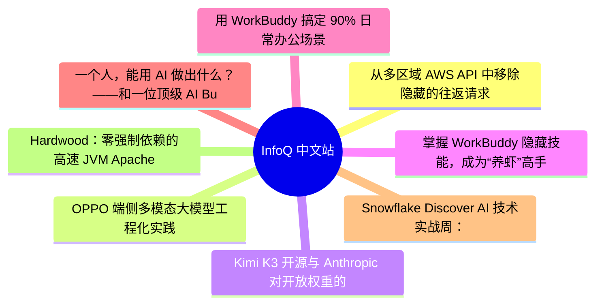
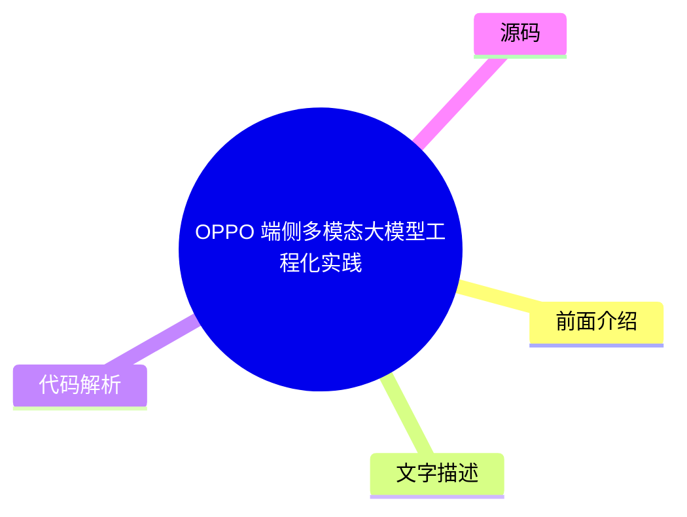
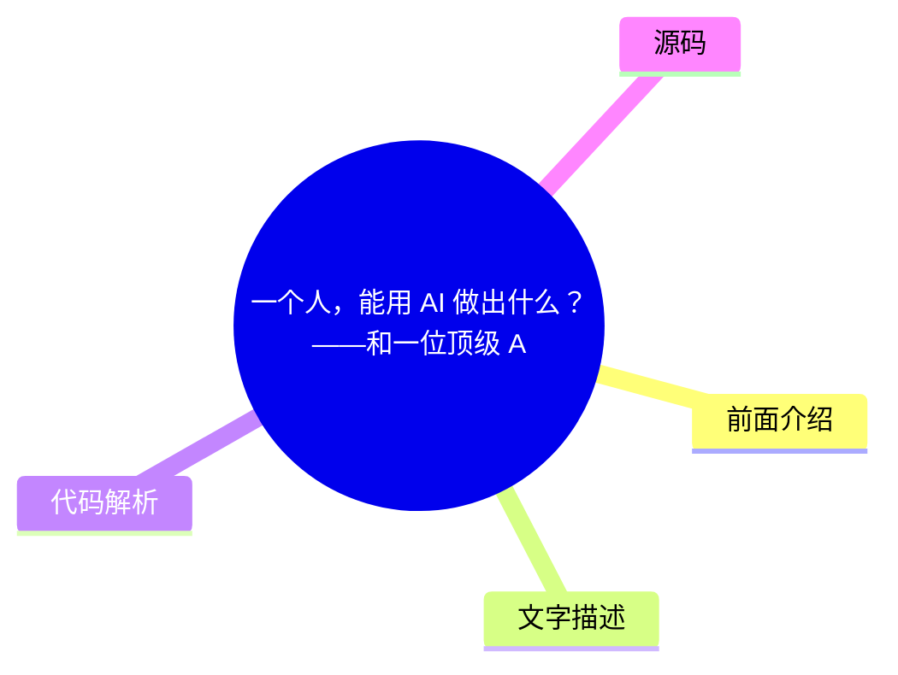

# 📰 InfoQ 中文站 Top 8 (2026-07-29)

## 前面介绍

- 数据源：InfoQ 中文站
- 抓取日期：2026-07-29
- 条目数：8
- 含完整正文：4
- 含代码片段：0
- 组织方式：前面介绍 / 树状图 / 文字描述 / 代码解析 / 源码

## 思维导图



## 详细整理（8 条，4 条含全文，0 条含代码）

### 1. 从多区域 AWS API 中移除隐藏的往返请求
- **链接**: [https://www.infoq.cn/article/ND7YIcuCmbwKZXmtrFia?utm_source=rss&utm_medium=article](https://www.infoq.cn/article/ND7YIcuCmbwKZXmtrFia?utm_source=rss&utm_medium=article)
- **发布**: Wed, 29 Jul 2026 10:07:09 GMT

#### 前面介绍

- SigV4 签名机制将请求与特定区域绑定，导致基础设施无法灵活切换区域。
- 原有的区域探测机制在服务中断时无法快速恢复，且增加了客户端延迟。
- 利用 AWS SigV4a 非对称签名算法，实现了针对区域集的签名，无需预先知道目标区域。

#### 树状图


#### 文字描述

- SigV4 签名将区域信息嵌入凭证作用域，导致请求在加密层面与特定区域绑定。
- 当区域发生故障时，客户端缓存的签名请求无法被其他区域验证，必须重新执行发现流程。
- SigV4a 使用 ECDSA-P256 算法，允许客户端针对一组区域进行签名，基础设施负责路由。
- 迁移过程中采用新旧端点并行运行，通过 SDK 版本管理控制流量切换，并处理企业防火墙白名单限制。
- 移除区域发现步骤后，重试逻辑变得简单，基础设施可以在客户端不知情的情况下切换流量。

#### 代码解析

- SigV4 签名锁定单一区域：sign(request, region="us-west-2")
- SigV4a 签名支持区域集合：sign(request, regionSet=["us-west-2", "eu-west-1"])

#### 源码

#### 中文节选

直到最近，亚马逊云科技全球路由服务的每个新客户端会话都会以一个请求开始。该请求的唯一目的是确定应使用哪个 AWS 区域进行身份验证。我们采用这一临时解决方案多年，直到最近才将其移除。推动我们这样做的原因并非出于延迟方面的考虑，而是源于一系列区域性服务中断事件。

## 我们构建服务时的限制条件

本文将要介绍的是由我和我的团队在亚马逊云科技内部运行的一项用户设置服务。该服务供其他需要快速、低延迟访问用户设置的亚马逊云科技团队在内部使用。我们的服务存储着在应用程序启动时会被调用的用户状态，可以将其看成是无论用户身处何地都需要快速加载的设置。该服务的架构如下：在两个区域内部署 API Gateway（APIGW）REST API，配置基于延迟的 Route 53 路由，并让基础设施自动决定流量的着陆点。

在集成 AWS Identity and Access Management (IAM) 时，我们遇到了一个限制。由于我们是按身份存储设置，所以需要在 APIGW 中使用 IAM 身份验证。当时，唯一的选择是使用 AWS Signature Version 4 （SigV4）。

SigV4 是用于受 IAM 保护的 API Gateway 请求的身份验证方案。它将每个已签名的请求与特定的服务和区域绑定。在签名过程中，区域信息会被嵌入到[凭证作用域](https://docs.aws.amazon.com/IAM/latest/UserGuide/reference_sigv-signing-elements.html)中。也就是说，如果针对 us-west-2（俄勒冈）签名的请求到达 eu-west-1（爱尔兰），则该请求在加密层面上将被视为无效。在请求被处理之前，签名验证就会失败。

这种区域绑定限制导致了一种权衡：我们希望让基础设施（DNS 服务 Route 53）来决定由哪个区域提供服务，但客户端必须先确定一个区域，才能构建出有效的请求。因此，我们围绕这一限制构建了我们的服务。

作为临时解决方案，我们实现了一个云区域上线前的探测步骤。首先，客户端会调用一个轻量级的 DiscoverRegion 端点。由于其唯一作用是返回区域名称，所以不需要身份验证。这样可以确定哪个区域“最近”，将该结果缓存起来，然后使用 SigV4 对该区域内的所有后续调用进行签名。总体而言，初始请求时需要发送两个请求才能完成一项操作。

这成为了我们的生产架构，并且多年来运行良好。然而，us-east-1（北弗吉尼亚）地区发生的一系列事件，包括网络问题（[2021 年 12 月](https://aws.amazon.com/message/12721/)）、Lambda 故障（[2023 年 6 月](https://aws.amazon.com/message/061323/)）和 DynamoDB 故障（[2025 年 10 月](https://aws.amazon.com/message/101925/)），直接影响了我们的服务。由于我们依赖 API Gateway、Lambda 和 DynamoDB，尽管该服务在架构上是全球性的，但我们无法将流量从受影响的区域转移出去。那些已完成区域发现并为 us-east-1 签署请求的客户端，在加密层面上与该区域绑定了。如果将请求重定向到 us-west-2，针对 us-east-1 的 SigV4 签名将失效。唯一的恢复途径是重新执行发现流程。

这些事件促使我们在 2025 年第四季度对设置服务进行了重构，实现了区域级弹性，而“发现”步骤以及其所需的客户端区域固定机制却成了障碍。当时，非对称签名第 4 版（[SigV4a](https://docs.aws.amazon.com/IAM/latest/UserGuide/reference_sigv.html#how-sigv4a-works)）已经推出有一段时间了（[于 2021 年第三季度发布](https://x.com/colmmacc/status/1436075103834435584)）；只是在此之前，我们根本没有理由采用它。

## 我们从跟踪记录中发现了什么

在将请求流程纳入整体重构范围进行分析后，我们注意到了延迟带来的影响。在第 90 百分位（p90），当用户与被发现的端点位于同一区域时，新客户端会话的 DiscoverEndpoint 延迟为 75–100 毫秒。在一般情况下（例如用户位于 us-west-2，而被发现的端点位于 us-east-1，相距不算太远但也不算太近），DiscoverEndpoint 的 p90 延迟会增加到约 315 毫秒。在最坏的情况下，例如 us-west-2 的用户访问 ap-south-1（孟买），p90 延迟则高达 1 秒。

虽然这可以归因于多种因素，例如客户端往返时间、区域路由效率低下、网络连接速度慢等，但我们仍然希望避免这类请求往返，并以此来降低延迟。

当架构稳定，而且除了构建新的全球服务之外没有其他明显的替代方案时，这种延迟开销还算是一个可以接受的折中方案。然而，在服务中断事件发生后，我们得知 SigV4a 可以完全省去发现步骤。因此，在重新设计的全球服务中，我们就不愿意继续保留每个新会话 100 毫秒的延迟了。

延迟数据显而易见，但成本不限于此，只有当我们开始围绕这些成本进行设计时，它们才变得清晰。

客户端状态。一旦客户端将某个区域设为固定区域，它就会在整个会话期间保持该选择。如果该区域在发现调用后出现性能下降，客户端的签名请求就会开始失败——此时重试逻辑必须检测到这一情况，使缓存的区域失效，并在重试原始调用之前重新执行发现操作。这一失败路径比看起来要复杂得多。

运行态耦合。为实现全局故障转移而进行的设计，意味着我们需要在区域之间干净利落地切换流量。这就要求更新发现端点的响应，并确保客户端能在合理的时限内获取到新的选择结果。在稳态运行期间，发现层原本只是一个次要的细节，如今却直接成了故障转移设计的关键路径。

客户端库的复杂性。由于要将该服务对外开放给多个内部调用方，所以我们发布了一个封装了服务发现和签名功能的客户端库。该库需要管理区域缓存的生命周期、重试逻辑以及凭证作用域。这绝非简单的抽象。

具体流程如下：客户端调用 GET /discover（无需身份验证），返回一个区域名称（如 us-west-2），随后对该区域的 POST /settings 请求进行签名并发送。身份验证需要两次往返。发现步骤通常不会出现在大多数架构图中——它位于客户端库内部，但总会增加延迟。

图 1：SigV4 流程——客户端首先调用 DiscoverRegion 端点，缓存返回的区域，然后对绑定到该单一区域的请求进行签名并发送（图片由作者制作）

## SigV4a 改变了什么

AWS Signature Version 4A（SigV4a）改变了签名范围。SigV4a 签名对一组区域有效，而非仅对单一区域有效。之所以能够实现这一点，是因为 SigV4a 使用的是 ECDSA-P256（一种非对称椭圆曲线签名算法），而非 HMAC-SHA256

#### 完整正文（中文）

直到最近，亚马逊云科技全球路由服务的每个新客户端会话都会以一个请求开始。该请求的唯一目的是确定应使用哪个 AWS 区域进行身份验证。我们采用这一临时解决方案多年，直到最近才将其移除。推动我们这样做的原因并非出于延迟方面的考虑，而是源于一系列区域性服务中断事件。

## 我们构建服务时的限制条件

本文将要介绍的是由我和我的团队在亚马逊云科技内部运行的一项用户设置服务。该服务供其他需要快速、低延迟访问用户设置的亚马逊云科技团队在内部使用。我们的服务存储着在应用程序启动时会被调用的用户状态，可以将其看成是无论用户身处何地都需要快速加载的设置。该服务的架构如下：在两个区域内部署 API Gateway（APIGW）REST API，配置基于延迟的 Route 53 路由，并让基础设施自动决定流量的着陆点。

在集成 AWS Identity and Access Management (IAM) 时，我们遇到了一个限制。由于我们是按身份存储设置，所以需要在 APIGW 中使用 IAM 身份验证。当时，唯一的选择是使用 AWS Signature Version 4 （SigV4）。

SigV4 是用于受 IAM 保护的 API Gateway 请求的身份验证方案。它将每个已签名的请求与特定的服务和区域绑定。在签名过程中，区域信息会被嵌入到[凭证作用域](https://docs.aws.amazon.com/IAM/latest/UserGuide/reference_sigv-signing-elements.html)中。也就是说，如果针对 us-west-2（俄勒冈）签名的请求到达 eu-west-1（爱尔兰），则该请求在加密层面上将被视为无效。在请求被处理之前，签名验证就会失败。

这种区域绑定限制导致了一种权衡：我们希望让基础设施（DNS 服务 Route 53）来决定由哪个区域提供服务，但客户端必须先确定一个区域，才能构建出有效的请求。因此，我们围绕这一限制构建了我们的服务。

作为临时解决方案，我们实现了一个云区域上线前的探测步骤。首先，客户端会调用一个轻量级的 DiscoverRegion 端点。由于其唯一作用是返回区域名称，所以不需要身份验证。这样可以确定哪个区域“最近”，将该结果缓存起来，然后使用 SigV4 对该区域内的所有后续调用进行签名。总体而言，初始请求时需要发送两个请求才能完成一项操作。

这成为了我们的生产架构，并且多年来运行良好。然而，us-east-1（北弗吉尼亚）地区发生的一系列事件，包括网络问题（[2021 年 12 月](https://aws.amazon.com/message/12721/)）、Lambda 故障（[2023 年 6 月](https://aws.amazon.com/message/061323/)）和 DynamoDB 故障（[2025 年 10 月](https://aws.amazon.com/message/101925/)），直接影响了我们的服务。由于我们依赖 API Gateway、Lambda 和 DynamoDB，尽管该服务在架构上是全球性的，但我们无法将流量从受影响的区域转移出去。那些已完成区域发现并为 us-east-1 签署请求的客户端，在加密层面上与该区域绑定了。如果将请求重定向到 us-west-2，针对 us-east-1 的 SigV4 签名将失效。唯一的恢复途径是重新执行发现流程。

这些事件促使我们在 2025 年第四季度对设置服务进行了重构，实现了区域级弹性，而“发现”步骤以及其所需的客户端区域固定机制却成了障碍。当时，非对称签名第 4 版（[SigV4a](https://docs.aws.amazon.com/IAM/latest/UserGuide/reference_sigv.html#how-sigv4a-works)）已经推出有一段时间了（[于 2021 年第三季度发布](https://x.com/colmmacc/status/1436075103834435584)）；只是在此之前，我们根本没有理由采用它。

## 我们从跟踪记录中发现了什么

在将请求流程纳入整体重构范围进行分析后，我们注意到了延迟带来的影响。在第 90 百分位（p90），当用户与被发现的端点位于同一区域时，新客户端会话的 DiscoverEndpoint 延迟为 75–100 毫秒。在一般情况下（例如用户位于 us-west-2，而被发现的端点位于 us-east-1，相距不算太远但也不算太近），DiscoverEndpoint 的 p90 延迟会增加到约 315 毫秒。在最坏的情况下，例如 us-west-2 的用户访问 ap-south-1（孟买），p90 延迟则高达 1 秒。

虽然这可以归因于多种因素，例如客户端往返时间、区域路由效率低下、网络连接速度慢等，但我们仍然希望避免这类请求往返，并以此来降低延迟。

当架构稳定，而且除了构建新的全球服务之外没有其他明显的替代方案时，这种延迟开销还算是一个可以接受的折中方案。然而，在服务中断事件发生后，我们得知 SigV4a 可以完全省去发现步骤。因此，在重新设计的全球服务中，我们就不愿意继续保留每个新会话 100 毫秒的延迟了。

延迟数据显而易见，但成本不限于此，只有当我们开始围绕这些成本进行设计时，它们才变得清晰。

客户端状态。一旦客户端将某个区域设为固定区域，它就会在整个会话期间保持该选择。如果该区域在发现调用后出现性能下降，客户端的签名请求就会开始失败——此时重试逻辑必须检测到这一情况，使缓存的区域失效，并在重试原始调用之前重新执行发现操作。这一失败路径比看起来要复杂得多。

运行态耦合。为实现全局故障转移而进行的设计，意味着我们需要在区域之间干净利落地切换流量。这就要求更新发现端点的响应，并确保客户端能在合理的时限内获取到新的选择结果。在稳态运行期间，发现层原本只是一个次要的细节，如今却直接成了故障转移设计的关键路径。

客户端库的复杂性。由于要将该服务对外开放给多个内部调用方，所以我们发布了一个封装了服务发现和签名功能的客户端库。该库需要管理区域缓存的生命周期、重试逻辑以及凭证作用域。这绝非简单的抽象。

具体流程如下：客户端调用 GET /discover（无需身份验证），返回一个区域名称（如 us-west-2），随后对该区域的 POST /settings 请求进行签名并发送。身份验证需要两次往返。发现步骤通常不会出现在大多数架构图中——它位于客户端库内部，但总会增加延迟。

图 1：SigV4 流程——客户端首先调用 DiscoverRegion 端点，缓存返回的区域，然后对绑定到该单一区域的请求进行签名并发送（图片由作者制作）

## SigV4a 改变了什么

AWS Signature Version 4A（SigV4a）改变了签名范围。SigV4a 签名对一组区域有效，而非仅对单一区域有效。之所以能够实现这一点，是因为 SigV4a 使用的是 ECDSA-P256（一种非对称椭圆曲线签名算法），而非 HMAC-SHA256：使用这种非对称模型，服务不用确切地知道生成该签名的区域就可以进行验证签名，只要该签名对允许的区域集有效即可。

因此，客户端在对请求进行签名时，不再需要事先知道目标区域。它可以针对声明的区域集进行一次签名，然后发送至全局入口点。全局基础设施（例如 Route 53 或 Global Accelerator）会解析出实际的端点。无论最终由哪个区域的部署来处理该请求，该请求在加密层面上始终是有效的。

图 2：SigV4a 流程——客户端针对一组区域进行一次签名，并将签名发送至全局入口点，该入口点会将其路由至最近的正常运行区域（图片由作者制作）

切换完成后，客户端针对区域集 {us-west-2，eu-west-1} 给一个 POST /settings 请求签名，并将其发送至全局入口点（https://global.settings.service——这是一个基于延迟的路由端点，而非 https://region.settings.service）。Route 53 负责解析目标。客户端永远不会知道是哪个区域处理了该请求，也不需要知道。此外，全局入口点也可以是一个 CloudFront 目标，这样就可以将请求引入亚马逊的骨干网，并在其网络内部进行高效地路由。重试逻辑也变得更简单了——如果请求失败，只需要重试即可。由于签名在两个区域都有效，所以基础设施可以在客户端不知情的情况下将重试请求路由到其他地方。

## 此次迁移实际涉及的内容

我们之前架构中的区域发现步骤并非疏忽所致。在构建该服务时，SigV4 是唯一可用的选项，而当时采用的变通方案是正确的决定。此次迁移并非在纠正错误，而是利用了初始设计时尚不存在的一项功能。

签名机制的变更本身微乎其微。在库的层面上，主要区别在于：不再需要在签名时锁定单个区域字符串，而是声明一个区域集合：

`// SigV4:  为一个区域签名 —— 必须匹配目标区域``sign (request, region= "us-west-2")``// SigV4a: 为区域集签名 —— 基础设施解析目标区域``sign (request, regionSet= ["us-west-2", "eu-west-1"])`区域集只是一个列表——它可以小到仅包含两个相邻的区域，用于 Active-Passive 故障转移；也可以限定为单个地理区域（例如：所有欧盟的区域），以满足数据驻留的要求。它还[支持通配符](https://docs.aws.amazon.com/IAM/latest/UserGuide/reference_sigv-create-signed-request.html#create-canonical-request)，例如 X-Amz-Region-Set=us-west-*，此时请求可以在 us-west-1（旧金山）或 us-west-2（俄勒冈）中发起。除此之外，SDK 调用的结构完全相同。如果你的签名逻辑封装在客户端库中（我们的就是如此），那么差异仅集中在一个地方。

**困难之处在于部署，而非代码本身。**由于有多个内部团队依赖我们的客户端库，所以我们无法一蹴而就：保持现有的 SigV4 端点不变，我们并行部署了一个与 SigV4a 兼容的新端点。虽然 SigV4a 本身并不严格要求创建新端点，但此举使得迁移过程更易于理解：新设计将区域发现和手动路由整合为单个全局入口点，为未来的工作（如 IPv6）提供了更简洁的 DNS 架构，同时也与更广泛的安全驱动型基础设施变更（新的 API 网关部署在不同的 AWS 账户中）相契合。

两个端点并行运行。我们新发布了客户端库的一个大版本。该版本采用 SigV4a 签名并指向新端点，同时开展了一项迁移活动：在内部渠道发布公告，并直接联系调用量较大的团队，提前充分沟通了弃用时间表。并行运行期持续了约三个月，我们通过服务指标跟踪了各个库版本的采用情况——观察随着各团队进行更新，SigV4 与 SigV4a 请求的比例变化。

此次部署遇到的问题主要与流程相关，而非算法问题。

首先，部分客户的环境中存在企业防火墙或网络控制措施。这些措施将旧域名列入了白名单，但未将新域名列入。在更新这些白名单之前，发往新端点的请求会被静默丢弃。

其次，并非所有团队都在使用我们提供的 SDK 客户端。有些团队实现了自定义签名逻辑，需要直接联系。这时仅更新库依赖关系是不够的。

第三，SDK 版本管理成为了一项实际限制。部分客户端仍然在使用旧版 SDK，若不先进行许多无关的重构以升级到新版，则无法支持 SigV4a。

当旧端点的流量降至可忽略不计的水平，且剩余调用方已确认迁移计划后，我们将其连同 DiscoverRegion 端点一同退役。整个迁移过程历时约六个月：构建并部署 SigV4a 端点耗时约三个月，随后又花了三个月进行并行运行以及完成调用方迁移。技术变更本身微乎其微，但协调成本却不容小觑。

迁移完成后，我们确认，发现过程的往返延迟已不复存在。我们并未测量 ECDSA 签名与 HMAC 的 CPU 开销——在现代硬件上，前者耗时不足一毫秒，与网络往返延迟相比根本不值一提。

## 在哪些情况下 SigV4 仍然是最佳选择

SigV4a 并非一个通用的改进方案。它解决的是一个特定的问题——在签名时不知道目标区域的动态路由。如果你的系统中不存在这个问题，那么 SigV4 将是一个更简单的解决方案。

首先需要确认的一个硬性限制是：并非所有 AWS 服务和 API 类型都支持 SigV4a。例如，S3 虽然支持 SigV4a，但仅限于多区域访问点，而不支持标准区域端点。支持 IAM 身份验证的 API Gateway REST API 支持 SigV4a；而 HTTP API 则不支持。在评估 SigV4a 是否能从架构层面解决你的问题之前，请先确认你所使用的具体服务和端点类型是否接受 SigV4a 签名。

SigV4a 的支持范围可能比你预想的要窄。当缺少支持时，它会返回 403 错误，而且其中不会提供任何有用的诊断信息。

何时使用 SigV4 ：

- 你正在使用的 AWS 服务或 API 类型不支持 SigV4a。 
- 你的服务部署在单个区域中，或者客户端始终针对已知的稳定区域。 
- 受监管要求或数据驻留要求限制，请求必须限定在单个特定区域内——在这种情况下，SigV4 的区域范围限定是一项功能，而非限制。 
- 你的客户端工具不提供可靠的 SigV4a 支持。 

何时考虑 SigV4a ：

- 你正在使用的服务明确支持此功能。 
- 客户端进行预检发现步骤，纯粹是为了满足区域范围内的身份验证要求。 
- 你正在跨区域构建基于延迟的路由或 Active-Passive 故障转移方案。 
- 简化客户端实现（移除区域缓存状态）是一个有意义的目标。 

## 是什么让这件事值得去做

在构建该服务时，采用发现步骤是正确的决策——当时，SigV4 是唯一的选择，而且多年来一直运行良好。当区域性故障迫使我们认真对待全球故障转移时，迁移工作才开始变得值得一做，而发现步骤恰恰成了阻碍这一进程的障碍。

核心问题在于耦合：SigV4 的区域范围模型迫使客户端做出本应由基础设施负责的路由决策。SigV4a 消除了这一限制。如果你的客户端正在执行一个预检步骤，而该步骤的唯一目的是确定应为哪个区域进行签名，那么这就是信号。该步骤的存在源于身份验证模型，而非因为它本身能带来什么附加价值。


### 2. OPPO 端侧多模态大模型工程化实践
- **链接**: [https://www.infoq.cn/article/ButxqDt3qZqzILoSZx4m?utm_source=rss&utm_medium=article](https://www.infoq.cn/article/ButxqDt3qZqzILoSZx4m?utm_source=rss&utm_medium=article)
- **发布**: Wed, 29 Jul 2026 10:00:00 GMT

#### 前面介绍

- 端侧大模型面临长上下文推理时延高、工程链路复杂及个性化迭代难等挑战。
- 通过 QAT 量化感知训练与稀疏化压缩，实现了模型压缩、长上下文与解码加速的全链路协同。
- 引入 QALFT 自动化流水线与 0 阶端侧训练，解决了多平台适配复杂与用户个性化需求问题。

#### 树状图



#### 文字描述

- 端侧化全栈链路打通了从模型压缩、编译部署到垂域落地与本地个性化的技术栈。
- QAT 训练架构将 sparse 训练、Eviction-aware QAT 等能力模块化接入，支持全链路协同优化。
- QALFT 自动化流水线覆盖数据准备、PTQ/QAT、微调及性能 profiling，支持 MTK、高通等多硬件平台。
- 0 阶端侧训练利用稀疏扰动技术，在隐私约束下完成轻量适配，避免高昂的端侧模型迭代成本。
- 端侧模型已覆盖 10 余垂域场景，并支持端侧 Agent 能力的快速迭代与 SOP 复制。

#### 代码解析

- 本文未提供源码，以下为实现思路或结构解析
- QAT 协同训练体系：将稀疏化、Cache Eviction、解码加速训练模块化接入同一框架
- QALFT 自动化流水线：统一多硬件平台训练与差异化输出，覆盖全链路工程环节

#### 源码

#### 中文节选

Agent 时代，哪些方向正在成为行业关键变量？50 + 实战案例揭晓答案！

模型参数规模不断突破，推理成本持续下降，开源生态日益繁荣。当模型能力逐渐成为行业共识，一个新的问题开始浮现：**当人人都能获得强大的模型能力之后，真正的竞争力还剩下什么？** 答案正在从模型能力本身，转向围绕模型构建可规模化的智能系统；从单点能力提升，转向系统工程与组织级落地能力。

在这一背景下，[2026 年 AICon 人工智能开发与应用大会 · 深圳站](https://aicon.infoq.cn/2026/shenzhen/track)正式启动。本次大会将于** 8 月 21 日—22 日**举办，聚焦 AI 基础设施、大模型系统、智能体工程、数据智能、多模态技术与行业落地等关键方向，邀请来自腾讯、阿里、华为、百度、蚂蚁集团等 50 + 头部科技企业技术负责人、科研机构一线专家，系统性分享前沿洞察与实战干货，共同探讨 AI 技术从能力到系统、从实验到生产的真实路径。

OPPO 多模态算法专家余席宇博士已确认出席 “[大模型效率工程与 Agent 系统实践](https://aicon.infoq.cn/2026/shenzhen/track/1955)” 专题，并发表题为**《**[OPPO 端侧多模态大模型工程化实践](https://aicon.infoq.cn/2026/shenzhen/presentation/7188)**》**的主题分享。随着端侧多模态场景扩展与长上下文需求增长，端侧大模型在 prefill / decoding 时延、工程链路复杂度、模型迭代周期上面临多重约束。本次分享围绕 OPPO 端侧化全栈实践，介绍以 QAT 量化感知训练 为核心的协同训练体系，覆盖稀疏化压缩、长上下文 Cache Eviction、解码加速训练，并结合 QALFT 自动化工程化 与 0 阶端侧训练，打通从模型压缩、编译部署到垂域落地与本地个性化的完整链路。

余席宇博士，OPPO 多模态算法专家，长期从事端侧大模型算法研究与工程落地。在大模型量化感知训练、编解码加速等方向具备丰富实践经验，主导/参与多项端侧化关键技术攻关。多年深耕模型端侧化，覆盖感知、理解、推理等跨平台、多业务场景的轻量化模型设计与训练，以及高效率推理部署系统构建。他在本次会议的详细演讲内容如下：


演讲提纲：

端侧大模型的核心挑战


推理效率瓶颈：长上下文场景下，prefill 与 decoding 时延显著上升

工程链路复杂：端侧化涉及 训练压缩 → 量化校准 → 编译部署 → 业务集成，链路长、协作成本高

模型迭代与个性化难覆盖：端侧模型版本迭代周期长，难以快速响应业务变化，用户个性化需求很难满足

2. 多模态大模型端侧化工程实践：全栈链路设计


端侧化系统架构：打通模型压缩 → 编解码加速 → 编译部署 → 应用集成 → 端侧个性化迭代的全链路技术栈

3. 技术建设


模块化 QAT 训练架构

将 sparse 训练、Eviction-aware QAT、解码加速训练等能力模块化接入同一训练框架

支持从 prefill 到 decoding 的全链路协同优化，而非单点优化

QALFT 工程化架构：自动化交付

工程化痛点：端侧大模型落地常面临 PTQ 量化 + QALFT 微调 流程复杂、平台差异大、人工环节多

QALFT 自动化流水线：覆盖数据准备 → PTQ/QAT → QALFT → 精度校验 → 性能 profiling 等全链路环节，支持 MTK、高通等多硬件平台的统一训练与差异化输出

端侧训练：0 阶优化

利用稀疏扰动等技术显著提升 0 阶优化性能

在隐私约束下，完成用户侧轻量适配，满足用户个性化需求，同时避免重成本端侧模型迭代

4. 应用场景与展望


应用场景

垂域业务交付：端侧模型覆盖 10 余垂域场景业务

端侧化 SOP 快速复制：支持端侧 Agent 能力快速迭代

未来展望

更长上下文下的高效注意力与 KV Cache 管理

更低存储与带宽开销，比如低比特量化训练等

端侧多模态理解与 Agent 规划能力的统一优化

5. 结语


端侧大模型的规模化落地，依赖 算法、工程、系统 三者的协同共振：以 QAT 协同训练打通模型压缩、长上下文与解码加速；以 QALFT 自动化缩短跨平台交付周期；以 0 阶端侧训练 满足个性化与隐私需求。面向更长上下文、更低功耗与更高隐私的端侧智能，关键不在单点突破，而在全链路工程化能力的持续升级。


这样的技术在实践过程中有哪些痛点？

成本高（端侧算力、存储与带宽预算紧张，长上下文推理成本陡增）

量化与效果之间的权衡（BPV 极致压缩对 IO 与精度的双重约束）

多片商、多平台适配复杂度高

Cache Eviction、投机解码与训练目标的对齐难度大


听众收益

算法融合系统（混合注意力架构 + 量化感知训练 + Cache Eviction + 投机解码端到端协同）

端侧训练的高性能实践

端侧 Agent 系统架构实践


除此之外，本次大会还策划了[AI Infra、推理工程与异构计算](https://aicon.infoq.cn/2026/shenzhen/track/1949)、[超级个体与蜂群智能的共生进化](https://aicon.infoq.cn/2026/shenzhen/track/1950)、[迈向机器人 AGI 的关键技术与产业实践](https://aicon.infoq.cn/2026/shenzhen/track/1952)、[Agent 安全：从风险到可控](https://aicon.infoq.cn/2026/shenzhen/track/1953)、[大模型效率工程与 Agent 系统实践](https://aicon.infoq.cn/2026/shenzhen/track/1955)、[AI Agent 高价值商业场景实战](https://aicon.infoq.cn/2026/shenzhen/track/1958)等 10 个专题论坛，届时将有来自不同行业、不同领域、不同企业的 50+资深专家在现场带来前沿技术洞察和一线实践经验。

AICon 全球人工智能开发与应用大会·深圳站，限时 9 折专属优惠，现在报名立减 580，更多详情可扫码或联系票务经理 13269078023 进行咨询。

#### 完整正文（中文）

Agent 时代，哪些方向正在成为行业关键变量？50 + 实战案例揭晓答案！

模型参数规模不断突破，推理成本持续下降，开源生态日益繁荣。当模型能力逐渐成为行业共识，一个新的问题开始浮现：**当人人都能获得强大的模型能力之后，真正的竞争力还剩下什么？** 答案正在从模型能力本身，转向围绕模型构建可规模化的智能系统；从单点能力提升，转向系统工程与组织级落地能力。

在这一背景下，[2026 年 AICon 人工智能开发与应用大会 · 深圳站](https://aicon.infoq.cn/2026/shenzhen/track)正式启动。本次大会将于** 8 月 21 日—22 日**举办，聚焦 AI 基础设施、大模型系统、智能体工程、数据智能、多模态技术与行业落地等关键方向，邀请来自腾讯、阿里、华为、百度、蚂蚁集团等 50 + 头部科技企业技术负责人、科研机构一线专家，系统性分享前沿洞察与实战干货，共同探讨 AI 技术从能力到系统、从实验到生产的真实路径。

OPPO 多模态算法专家余席宇博士已确认出席 “[大模型效率工程与 Agent 系统实践](https://aicon.infoq.cn/2026/shenzhen/track/1955)” 专题，并发表题为**《**[OPPO 端侧多模态大模型工程化实践](https://aicon.infoq.cn/2026/shenzhen/presentation/7188)**》**的主题分享。随着端侧多模态场景扩展与长上下文需求增长，端侧大模型在 prefill / decoding 时延、工程链路复杂度、模型迭代周期上面临多重约束。本次分享围绕 OPPO 端侧化全栈实践，介绍以 QAT 量化感知训练 为核心的协同训练体系，覆盖稀疏化压缩、长上下文 Cache Eviction、解码加速训练，并结合 QALFT 自动化工程化 与 0 阶端侧训练，打通从模型压缩、编译部署到垂域落地与本地个性化的完整链路。

余席宇博士，OPPO 多模态算法专家，长期从事端侧大模型算法研究与工程落地。在大模型量化感知训练、编解码加速等方向具备丰富实践经验，主导/参与多项端侧化关键技术攻关。多年深耕模型端侧化，覆盖感知、理解、推理等跨平台、多业务场景的轻量化模型设计与训练，以及高效率推理部署系统构建。他在本次会议的详细演讲内容如下：


演讲提纲：

端侧大模型的核心挑战


推理效率瓶颈：长上下文场景下，prefill 与 decoding 时延显著上升

工程链路复杂：端侧化涉及 训练压缩 → 量化校准 → 编译部署 → 业务集成，链路长、协作成本高

模型迭代与个性化难覆盖：端侧模型版本迭代周期长，难以快速响应业务变化，用户个性化需求很难满足

2. 多模态大模型端侧化工程实践：全栈链路设计


端侧化系统架构：打通模型压缩 → 编解码加速 → 编译部署 → 应用集成 → 端侧个性化迭代的全链路技术栈

3. 技术建设


模块化 QAT 训练架构

将 sparse 训练、Eviction-aware QAT、解码加速训练等能力模块化接入同一训练框架

支持从 prefill 到 decoding 的全链路协同优化，而非单点优化

QALFT 工程化架构：自动化交付

工程化痛点：端侧大模型落地常面临 PTQ 量化 + QALFT 微调 流程复杂、平台差异大、人工环节多

QALFT 自动化流水线：覆盖数据准备 → PTQ/QAT → QALFT → 精度校验 → 性能 profiling 等全链路环节，支持 MTK、高通等多硬件平台的统一训练与差异化输出

端侧训练：0 阶优化

利用稀疏扰动等技术显著提升 0 阶优化性能

在隐私约束下，完成用户侧轻量适配，满足用户个性化需求，同时避免重成本端侧模型迭代

4. 应用场景与展望


应用场景

垂域业务交付：端侧模型覆盖 10 余垂域场景业务

端侧化 SOP 快速复制：支持端侧 Agent 能力快速迭代

未来展望

更长上下文下的高效注意力与 KV Cache 管理

更低存储与带宽开销，比如低比特量化训练等

端侧多模态理解与 Agent 规划能力的统一优化

5. 结语


端侧大模型的规模化落地，依赖 算法、工程、系统 三者的协同共振：以 QAT 协同训练打通模型压缩、长上下文与解码加速；以 QALFT 自动化缩短跨平台交付周期；以 0 阶端侧训练 满足个性化与隐私需求。面向更长上下文、更低功耗与更高隐私的端侧智能，关键不在单点突破，而在全链路工程化能力的持续升级。


这样的技术在实践过程中有哪些痛点？

成本高（端侧算力、存储与带宽预算紧张，长上下文推理成本陡增）

量化与效果之间的权衡（BPV 极致压缩对 IO 与精度的双重约束）

多片商、多平台适配复杂度高

Cache Eviction、投机解码与训练目标的对齐难度大


听众收益

算法融合系统（混合注意力架构 + 量化感知训练 + Cache Eviction + 投机解码端到端协同）

端侧训练的高性能实践

端侧 Agent 系统架构实践


除此之外，本次大会还策划了[AI Infra、推理工程与异构计算](https://aicon.infoq.cn/2026/shenzhen/track/1949)、[超级个体与蜂群智能的共生进化](https://aicon.infoq.cn/2026/shenzhen/track/1950)、[迈向机器人 AGI 的关键技术与产业实践](https://aicon.infoq.cn/2026/shenzhen/track/1952)、[Agent 安全：从风险到可控](https://aicon.infoq.cn/2026/shenzhen/track/1953)、[大模型效率工程与 Agent 系统实践](https://aicon.infoq.cn/2026/shenzhen/track/1955)、[AI Agent 高价值商业场景实战](https://aicon.infoq.cn/2026/shenzhen/track/1958)等 10 个专题论坛，届时将有来自不同行业、不同领域、不同企业的 50+资深专家在现场带来前沿技术洞察和一线实践经验。

AICon 全球人工智能开发与应用大会·深圳站，限时 9 折专属优惠，现在报名立减 580，更多详情可扫码或联系票务经理 13269078023 进行咨询。


### 3. Kimi K3 开源与 Anthropic 对开放权重的表态
- **链接**: [https://www.infoq.cn/article/jZ394NO5PIZIqNVbN4mD?utm_source=rss&utm_medium=article](https://www.infoq.cn/article/jZ394NO5PIZIqNVbN4mD?utm_source=rss&utm_medium=article)
- **发布**: Wed, 29 Jul 2026 09:57:08 GMT

#### 前面介绍

- Kimi K3 模型权重开源，但 2.8T 参数的部署成本极高，个人与企业难以本地化运行。
- Anthropic 明确表示从未主张禁止开放权重模型，但担忧安全风险与蒸馏活动。
- 开放权重解决的是供应商依赖问题的一部分，无法完全解决智能体授权与审计等治理问题。

#### 树状图


#### 文字描述

- Kimi K3 最低部署配置需 8 张 AMD MI355X 加速卡，整机成本约 170 万至 240 万元。
- 64 张加速卡集群部署成本预计达千万级，且需考虑电力、散热及运维成本，直接调用 API 更具性价比。
- Anthropic 的核心担忧在于安全风险、蒸馏绕过芯片禁令以及国家间的军事优势竞争。
- Amodei 认为开放权重扩大了参与 AI 经济的机会，但反对全面禁止，主张通过针对性法律框架解决蒸馏问题。
- 签署开放权重公开信的 77 家企业中未包含 Amazon 和 Anthropic，反映出行业内部的利益分歧。

#### 代码解析

- 本文未提供源码，以下为实现思路或结构解析
- T 级模型开源改变了传统认知，个人用户只能分析架构或使用蒸馏小版本，无法直接运行完整模型

#### 源码

#### 中文节选

北京时间 7 月 27 日晚，月之暗面 Kimi 正式开放了 K3 的模型权重、技术报告和关键 Infra 技术。

几乎同时，Anthropic 联合创始人兼首席执行官 Dario Amodei 发布文章，对近期围绕开放权重模型的讨论进行了回应。Amodei 明确表示，“Anthropic 公司从未主张禁止开放权重模型。”

“不具备危险能力的开放权重模型是一种公共产品：除运行模型所需的算力成本外，它们不需要支付其他费用，同时能够为企业、开发者和研究人员创造价值。” Amodei 说道。

这份声明的背景是，Kimi K3 发布以来，海外出现了针对特定来源开放权重模型实施使用限制的讨论。与此同时，多家科技企业公开表达了对开放权重生态的支持，也有观点认为，部分闭源模型公司，如 Anthropic，可能出于商业竞争考虑推动相关限制政策的实施。

Kimi K3 开源和 Amodei 声明，这两条线放在一起可以看出，随着能力越来越强，模型的开、闭源之争也日益激烈，而开源趋势很难抵挡。

## 舆论压力下的一次回应，核心主张没变

在回应中，Amodei 依然从安全方面强调了自己的担忧。

他最主要的担忧是其他国家可能会开发出比美国更强大的 AI 模型，并利用这些模型获得永久性的军事优势，或者对本国人们实施极其严密的压制。他表示，这一担忧在美国政府内部得到了广泛认同。在这种情况下，模型是否以开放权重形式发布并不重要，它们是否被美国企业使用当然也不重要。

其次，他担心强大的 AI 模型可能会被滥用于发动网络攻击或生物攻击，也可能存在严重的对齐问题。“开放权重模型确实可能比闭源模型带来更高风险，因为很难为其设置有效的安全护栏，也很难监控其使用情况；而且模型权重一旦发布，就无法收回。”Amodei 补充道，“但是，禁止美国企业使用这些模型并不能解决这一风险，因为恶意行为者本来就不太可能是合法经营的美国企业。这样的禁令或许可以保护美国 AI 公司免受竞争，但这从来不是我的目标。”

之后，Amodei 给了三个他之前反复提到过的主张措施：

第一，不向中国出售高性能芯片或芯片制造设备，同时打击通过其他规避手段获取这些芯片的行为。Amodei 的原话是，“中国国内的先进芯片产能有限，因此在 Scaling Laws 的作用下，如果无法获得美国芯片，中国就无法训练出比美国更强大的模型。”

第二，打击工业规模的蒸馏活动。“它可以让中国利用有限的芯片资源训练出远超正常水平的模型，从而部分绕过禁令。”Amodei 强调，“我们应当通过政策干预来遏制这种行为。全面禁止开放权重模型既不是正确的解决办法，也不是我们曾经主张过的措施。”

第三，所有能力足够强的模型，无论开放还是闭源，都应接受强制性安全测试。他强调，要使安全测试真正有效，就必须在全球范围内执行。

他的针对性指向其实没变，不过是多次减少了对开源模型的“攻击”。而这次 Amodei 公开正式回应的另一个原因是前几天黄仁勋转发的《Open Weights and American AI Leadership（开放权重与美国 AI 领导力）》公开信带来的海外舆论压力。

7 月 24 日，黄仁勋在 X 发布首条帖子并转发了该公开信，呼吁美国政府不要限制可下载的 AI 模型。信中表示，开放权重能够降低供应商锁定风险，提升企业对模型、数据和基础设施的控制权。公开信最初由 25 家公司签署，随后迅速扩至 50 家，新增签署方包括 OpenAI、Google、AMD、Cisco、Cloudflare、GitHub、Block 和 Ollama 等，截至发稿，现在已经有 77 家企业签署。

签署方在一天内翻倍，反映出开放权重正在快速成为美国 AI 政策讨论的核心议题。

值得注意的是，Anthropic 与 Amazon 仍未出现在签署名单中。Amazon 是 Anthropic 最大的投资方之一，Anthropic 也使用 Amazon Trainium 芯片训练和部署模型。两家公司尚未解释缺席原因。

Amodei 表示自己对公开信的很多内容表示认同：“开放权重扩大了人们参与 AI 经济的机会，至少在部分应用场景中增强了竞争，也赋予客户更大的控制权。对于蒸馏的担忧，应当通过有针对性的法律和商业框架来解决，也就是我上面提到的措施。”

但他也称自己并不认同公开信中的另外一些说法，例如开放权重模型必然更有利于开发安全防护措施，或者广泛开放模型能力必然会给防御者带来比攻击者更大的帮助。“在我看来，相反的结果至少同样有可能发生。”

这依然是很耳熟的话术。Amodei 这次回应更多还是安抚美国内的舆论情绪。

值得注意的是，公开信提到的这种“开放”主要集中在模型层。组织公开信的英伟达仍掌握专有的 CUDA 软件生态，微软也在 Azure 上销售闭源模型，多数签署方所倡导的“开放”并未触及自身最核心的竞争壁垒。

对于企业而言，开放权重首先意味着可以下载、检查和重新训练模型，也可以将数据保留在自有基础设施中。但模型能否真正运行，仍取决于芯片供应、算力成本和部署能力；模型开放也无法解决智能体授权、版本追踪和审计等问题。


即使企业能够读取模型权重，也无法仅凭模型本身证明某个智能体是否获得授权，或确认不同地区运行的模型是否与安全团队批准的版本一致。因此，开放权重解决的是供应商依赖问题的一部分，而不是完整的 AI 治理问题。

## T 级别模型开源，200 万元只是“入场券”

之前，海外就一直担心国内有对标 Fable 5 的开源模型出现，K3 的发布加剧了这种担忧。而随着 K3 技术报告的发布，我们也可以看到 T 级模型开源可能带来的影响。

“现在，每个人都可以下载并部署 Kimi K3 模型——无论是用于内部研发，还是嵌入到面向终端用户的产品中，均可自由使用。”月之暗面官宣文中的这句话激发了网友们的热情。不过，也有网友发现，到了 K3 这种级别模型的开源，个人部署基本不太可能了。

截至目前，Kimi K3 能够完成公开验证的最低部署配置，是一台搭载 8 张 AMD MI355X 加速卡的服务器，整机成本预计约 170 万至 240 万元。但这一配置解决的只是“把模型加载起来”，距离具备可接受速度、并发能力和长上下文支持的生产级服务仍有明显差距。

知乎答主“平凡”推测，按照 Kimi 官方技术文章提出的 64 张以上加速卡部署建议，真正面向商业服务的硬件投入可能达到千万元级别。这意味着，2.8T 参数规模的 K3 基本已经脱离个人本地部署范畴，对绝大多数普通企业而言，自建推理集群的经济性也十分有限，直接调用 API 可能仍是更现实的选择。

具体来看，Kimi K3 模型文件约为 1.5609TB，总参数量达到 2.8T，每次生成仅激活约 104B 参数，模型权重采用 MXFP4 格式。尽管其采用混合专家架构，单次推理不需要调用全部参数，但完整模型权重、KV 缓存和运行状态仍需要占据极大的显存空间。

根据 AMD 披露的测试结果，单张 MI355X 配备 288GB HBM 显存，8 张卡合计拥有 2.304TB 显存，能够容纳 K3 的模型权重及必要运行数据

#### 完整正文（中文）

北京时间 7 月 27 日晚，月之暗面 Kimi 正式开放了 K3 的模型权重、技术报告和关键 Infra 技术。

几乎同时，Anthropic 联合创始人兼首席执行官 Dario Amodei 发布文章，对近期围绕开放权重模型的讨论进行了回应。Amodei 明确表示，“Anthropic 公司从未主张禁止开放权重模型。”

“不具备危险能力的开放权重模型是一种公共产品：除运行模型所需的算力成本外，它们不需要支付其他费用，同时能够为企业、开发者和研究人员创造价值。” Amodei 说道。

这份声明的背景是，Kimi K3 发布以来，海外出现了针对特定来源开放权重模型实施使用限制的讨论。与此同时，多家科技企业公开表达了对开放权重生态的支持，也有观点认为，部分闭源模型公司，如 Anthropic，可能出于商业竞争考虑推动相关限制政策的实施。

Kimi K3 开源和 Amodei 声明，这两条线放在一起可以看出，随着能力越来越强，模型的开、闭源之争也日益激烈，而开源趋势很难抵挡。

## 舆论压力下的一次回应，核心主张没变

在回应中，Amodei 依然从安全方面强调了自己的担忧。

他最主要的担忧是其他国家可能会开发出比美国更强大的 AI 模型，并利用这些模型获得永久性的军事优势，或者对本国人们实施极其严密的压制。他表示，这一担忧在美国政府内部得到了广泛认同。在这种情况下，模型是否以开放权重形式发布并不重要，它们是否被美国企业使用当然也不重要。

其次，他担心强大的 AI 模型可能会被滥用于发动网络攻击或生物攻击，也可能存在严重的对齐问题。“开放权重模型确实可能比闭源模型带来更高风险，因为很难为其设置有效的安全护栏，也很难监控其使用情况；而且模型权重一旦发布，就无法收回。”Amodei 补充道，“但是，禁止美国企业使用这些模型并不能解决这一风险，因为恶意行为者本来就不太可能是合法经营的美国企业。这样的禁令或许可以保护美国 AI 公司免受竞争，但这从来不是我的目标。”

之后，Amodei 给了三个他之前反复提到过的主张措施：

第一，不向中国出售高性能芯片或芯片制造设备，同时打击通过其他规避手段获取这些芯片的行为。Amodei 的原话是，“中国国内的先进芯片产能有限，因此在 Scaling Laws 的作用下，如果无法获得美国芯片，中国就无法训练出比美国更强大的模型。”

第二，打击工业规模的蒸馏活动。“它可以让中国利用有限的芯片资源训练出远超正常水平的模型，从而部分绕过禁令。”Amodei 强调，“我们应当通过政策干预来遏制这种行为。全面禁止开放权重模型既不是正确的解决办法，也不是我们曾经主张过的措施。”

第三，所有能力足够强的模型，无论开放还是闭源，都应接受强制性安全测试。他强调，要使安全测试真正有效，就必须在全球范围内执行。

他的针对性指向其实没变，不过是多次减少了对开源模型的“攻击”。而这次 Amodei 公开正式回应的另一个原因是前几天黄仁勋转发的《Open Weights and American AI Leadership（开放权重与美国 AI 领导力）》公开信带来的海外舆论压力。

7 月 24 日，黄仁勋在 X 发布首条帖子并转发了该公开信，呼吁美国政府不要限制可下载的 AI 模型。信中表示，开放权重能够降低供应商锁定风险，提升企业对模型、数据和基础设施的控制权。公开信最初由 25 家公司签署，随后迅速扩至 50 家，新增签署方包括 OpenAI、Google、AMD、Cisco、Cloudflare、GitHub、Block 和 Ollama 等，截至发稿，现在已经有 77 家企业签署。

签署方在一天内翻倍，反映出开放权重正在快速成为美国 AI 政策讨论的核心议题。

值得注意的是，Anthropic 与 Amazon 仍未出现在签署名单中。Amazon 是 Anthropic 最大的投资方之一，Anthropic 也使用 Amazon Trainium 芯片训练和部署模型。两家公司尚未解释缺席原因。

Amodei 表示自己对公开信的很多内容表示认同：“开放权重扩大了人们参与 AI 经济的机会，至少在部分应用场景中增强了竞争，也赋予客户更大的控制权。对于蒸馏的担忧，应当通过有针对性的法律和商业框架来解决，也就是我上面提到的措施。”

但他也称自己并不认同公开信中的另外一些说法，例如开放权重模型必然更有利于开发安全防护措施，或者广泛开放模型能力必然会给防御者带来比攻击者更大的帮助。“在我看来，相反的结果至少同样有可能发生。”

这依然是很耳熟的话术。Amodei 这次回应更多还是安抚美国内的舆论情绪。

值得注意的是，公开信提到的这种“开放”主要集中在模型层。组织公开信的英伟达仍掌握专有的 CUDA 软件生态，微软也在 Azure 上销售闭源模型，多数签署方所倡导的“开放”并未触及自身最核心的竞争壁垒。

对于企业而言，开放权重首先意味着可以下载、检查和重新训练模型，也可以将数据保留在自有基础设施中。但模型能否真正运行，仍取决于芯片供应、算力成本和部署能力；模型开放也无法解决智能体授权、版本追踪和审计等问题。

即使企业能够读取模型权重，也无法仅凭模型本身证明某个智能体是否获得授权，或确认不同地区运行的模型是否与安全团队批准的版本一致。因此，开放权重解决的是供应商依赖问题的一部分，而不是完整的 AI 治理问题。

## T 级别模型开源，200 万元只是“入场券”

之前，海外就一直担心国内有对标 Fable 5 的开源模型出现，K3 的发布加剧了这种担忧。而随着 K3 技术报告的发布，我们也可以看到 T 级模型开源可能带来的影响。

“现在，每个人都可以下载并部署 Kimi K3 模型——无论是用于内部研发，还是嵌入到面向终端用户的产品中，均可自由使用。”月之暗面官宣文中的这句话激发了网友们的热情。不过，也有网友发现，到了 K3 这种级别模型的开源，个人部署基本不太可能了。

截至目前，Kimi K3 能够完成公开验证的最低部署配置，是一台搭载 8 张 AMD MI355X 加速卡的服务器，整机成本预计约 170 万至 240 万元。但这一配置解决的只是“把模型加载起来”，距离具备可接受速度、并发能力和长上下文支持的生产级服务仍有明显差距。

知乎答主“平凡”推测，按照 Kimi 官方技术文章提出的 64 张以上加速卡部署建议，真正面向商业服务的硬件投入可能达到千万元级别。这意味着，2.8T 参数规模的 K3 基本已经脱离个人本地部署范畴，对绝大多数普通企业而言，自建推理集群的经济性也十分有限，直接调用 API 可能仍是更现实的选择。

具体来看，Kimi K3 模型文件约为 1.5609TB，总参数量达到 2.8T，每次生成仅激活约 104B 参数，模型权重采用 MXFP4 格式。尽管其采用混合专家架构，单次推理不需要调用全部参数，但完整模型权重、KV 缓存和运行状态仍需要占据极大的显存空间。

根据 AMD 披露的测试结果，单张 MI355X 配备 288GB HBM 显存，8 张卡合计拥有 2.304TB 显存，能够容纳 K3 的模型权重及必要运行数据。AMD 已经验证了 8×MI355X、张量并行度 TP8 的部署方案，vLLM 也将 8 张 MI355X 或 8 张 B300 列为目前相对容易部署 K3 的配置。值得注意的是，AMD 目前公布的首日测试最大上下文仅为 16K，尚未披露生成速度、首 Token 延迟、吞吐量和并发能力等关键指标。

“像之前买一台 512GB 的 Mac Studio，就可以部署一个几百 B 的大模型，那个时代已经一去不返了。那个级别的模型，在现在已经不够看了。”该答主总结道。另外，对于 K3 这样的 2.8T 模型，即使权重已经采用低精度格式，普通工作站的内存容量、带宽和计算能力也无法满足部署需求。

答主大概列出了四种方案，从低到高基本上是刚刚能跑，以及勉强能够实现正常使用。

其中，8 张 MI355X 是目前公开配置中成本最低、验证程度最高的方案。由于 MI355X 整机没有统一公开报价，市场只能通过服务器和单卡报价进行估算。Supermicro 支持 MI350 系列的 8 卡服务器起价约 24.5 万美元，结合 MI355X 单卡约 2.5 万美元的市场估值，一套完整 8 卡服务器成本预计在 25 万至 35 万美元之间，折合人民币约 170 万至 240 万元。

其他方案的成本更高。16 张 H200 合计显存约 2.256TB，理论上能够容纳模型，但通常需要跨两台服务器部署，硬件成本预计约 435 万-570 万元；16 张 B200 合计显存约 2.88TB，由于单台 8 卡 B200 服务器显存仍不足，需要两台服务器，成本约 540 万-680 万元；24 张 H100 合计显存约 1.92TB，虽然勉强能够放下模型，但运行余量较小，跨服务器通信也会成为明显瓶颈，若采用云服务，全年租赁成本可能超过 870 万元。

即使是成本最低的 8×MI355X 方案，也很难保证 K3 具备理想的实际使用体验。K3 接近 3T 参数规模，每生成一个 Token 都需要在大量模型权重和专家模块之间调度数据，单机 8 卡虽然能够完成加载，但吞吐速度、并发能力和长上下文性能可能受到明显限制。对于用户而言，“能够加载模型”和“能够提供生产级服务”是两个完全不同的概念。

K3 的架构进一步放大了集群通信的重要性。该模型拥有 896 个专家，每个 Token 会从中选择 16 个专家参与计算。当不同专家被分配到不同 GPU 时，系统需要频繁在加速卡之间传输激活数据。随着并发量和上下文长度增加，GPU 之间的互联带宽将直接影响 Token 生成速度。

因此，Kimi 官方技术文章并不建议大型服务仅依靠一台 8 卡服务器，而是建议使用 64 张以上、位于同一个高速互联域内的加速卡。按照 64 张 MI355X 计算，部署 K3 需要 8 台八卡服务器，仅硬件投入预计约 1360 万至 1900 万元。若使用云资源，按照 Oracle 相对较低的实例价格估算，全年成本约 409 万元；按照 Vultr 现有价格计算，全年成本可能达到 986 万元。

此外，64 张 MI355X 集群的整体电力需求可能接近 100kW。如果全年持续运行，仅电费就可能接近百万元，这还没有计入机房、散热、网络、存储、运维人员和冗余设备等成本。

“200 万元只是 K3 的‘入场券’，千万级才更接近商业化服务的起点。”该答主总结道。

T 级开放权重模型的出现，也正在改变“开源模型能够普惠本地部署”的传统认知。

开放权重意味着开发者可以下载、研究和修改模型，却不意味着个人和中小企业具备运行这些模型的硬件条件。对于普通个人用户而言，未来更多只能分析模型架构、研究技术报告，或使用经过大幅蒸馏和量化的小型版本，而无法直接运行完整模型。

即使对一般企业而言，本地部署 K3 这样的模型也很难体现成本优势。除非企业拥有长期、稳定且规模极大的推理需求，并具备成熟的集群调度和模型工程能力，否则千万级硬件投入、持续电力成本和运维负担，可能不如直接采购 API 服务来的划算。

答主“平凡”总结称，K3 这类模型更适合大型云服务商、头部互联网企业、科研机构，甚至希望建设自主 AI 基础设施的国家级项目。例如，一些缺乏自主基础模型能力的国家或大型组织，可以集中采购数千乃至上万张加速卡，以 K3 等开放权重模型为基座进行微调、后训练和本地化部署，从而建立自己的模型服务体系。

而这背后带来的不止是个别企业利润，而是会鼓励更多公司和开发者使用 K3，进而围绕该模型构建起一个完整的工具和基础设施生态系统。随着时间的推移，这有助于模型成为“事实上的标准”，这也是一些海外专家和企业担心的点之一。

最后，需要提醒的是，月之暗面公布的 Kimi K3 许可证显示，个人开发者和普通企业可以免费使用、部署、微调及商业化 Kimi K3，也可以基于模型开发衍生产品，但需保留版权和许可证声明。

另外，许可证同时对大型商业使用设置限制。如果企业通过 API 等方式对外提供 Kimi K3 推理或微调服务，且企业及关联方任意连续 12 个月总收入超过 2000 万美元，需提前与月之暗面另行签署协议。此外，如果使用 Kimi K3 的商业产品月活超过 1 亿，或月收入超过 2000 万美元，必须在产品界面显著标注“Kimi K3”。企业内部使用以及通过官方产品或认证合作伙伴调用，不受上述限制。

参考链接：


### 4. 掌握 WorkBuddy 隐藏技能，成为“养虾”高手
- **链接**: [https://www.infoq.cn/video/ToLqXgzTqeDtE6dAGLRs?utm_source=rss&utm_medium=article](https://www.infoq.cn/video/ToLqXgzTqeDtE6dAGLRs?utm_source=rss&utm_medium=article)
- **发布**: Wed, 29 Jul 2026 09:44:30 GMT

#### 前面介绍

- WorkBuddy 提供了隐藏的高级功能，帮助用户更高效地完成特定任务。
- 通过掌握这些技能，用户可以优化工作流程，提升整体生产力。
- 本文将详细介绍 WorkBuddy 的隐藏特性和使用技巧。

#### 树状图


#### 文字描述

- WorkBuddy 是一款专注于提升办公效率的工具，其隐藏技能往往被普通用户忽略。
- “养虾”可能指代特定的操作模式或策略，通过熟练运用可以解决复杂问题。
- 掌握这些技能需要一定的实践和探索，建议用户多加尝试以发现更多可能性。

#### 代码解析

- 本文未提供源码，以下为实现思路或结构解析
- WorkBuddy 的隐藏功能可能涉及高级设置或快捷操作，需结合具体场景灵活运用

#### 源码

未抓到可展示源码或原文节选。


### 5. 用 WorkBuddy 搞定 90% 日常办公场景
- **链接**: [https://www.infoq.cn/video/HYeFbBAkNC8v5tOU0XzS?utm_source=rss&utm_medium=article](https://www.infoq.cn/video/HYeFbBAkNC8v5tOU0XzS?utm_source=rss&utm_medium=article)
- **发布**: Wed, 29 Jul 2026 09:40:48 GMT

#### 前面介绍

- WorkBuddy 能够覆盖绝大多数常见的办公需求，极大简化工作流程。
- 通过简单的配置和操作，用户可以快速上手并提升工作效率。
- 本文展示了 WorkBuddy 在日常办公中的实际应用案例和效果。

#### 树状图


#### 文字描述

- WorkBuddy 的设计初衷是解决日常办公中的痛点，提供一站式解决方案。
- 无论是文档处理、数据整理还是团队协作，WorkBuddy 都能提供有力的支持。
- 用户反馈表明，使用 WorkBuddy 后，日常办公任务的处理时间显著缩短。

#### 代码解析

- 本文未提供源码，以下为实现思路或结构解析
- WorkBuddy 的核心优势在于其广泛的适用性和易用性，适合各类办公人群

#### 源码

未抓到可展示源码或原文节选。


### 6. 一个人，能用 AI 做出什么？——和一位顶级 AI Builder 深聊
- **链接**: [https://www.infoq.cn/video/spVFUewcp2VRtKCSo1kB?utm_source=rss&utm_medium=article](https://www.infoq.cn/video/spVFUewcp2VRtKCSo1kB?utm_source=rss&utm_medium=article)
- **发布**: Tue, 28 Jul 2026 19:30:29 GMT

#### 前面介绍

- 一位顶级 AI Builder 分享了个人利用 AI 技术创造价值的经验和故事。
- 通过深度对话，揭示了 AI 在个人项目中的巨大潜力和实际应用路径。
- 本文探讨了从零开始构建 AI 项目的挑战与机遇。

#### 树状图



#### 文字描述

- AI Builder 展示了如何将 AI 技术应用于个人兴趣和职业发展中，实现自我提升。
- 对话中提到了具体的工具、方法和心态调整，对读者具有启发意义。
- 个人利用 AI 的关键在于持续学习和实践，不断探索新的应用场景。

#### 代码解析

- 本文未提供源码，以下为实现思路或结构解析
- AI Builder 的成功经验强调了创意、执行力和持续迭代的重要性

#### 源码

未抓到可展示源码或原文节选。


### 7. Snowflake Discover AI 技术实战周：底座焕新
- **链接**: [https://www.infoq.cn/video/6O7gpdxB3UHJigcLAb37?utm_source=rss&utm_medium=article](https://www.infoq.cn/video/6O7gpdxB3UHJigcLAb37?utm_source=rss&utm_medium=article)
- **发布**: Tue, 28 Jul 2026 17:26:13 GMT

#### 前面介绍

- 本次实战周聚焦于复杂迁移、数据工程与智能开发的底座重构。
- 通过实战案例，展示了如何利用 Snowflake 的 AI 能力提升开发效率。
- 底座焕新旨在解决传统数据架构中的痛点，实现更高效的智能开发。

#### 树状图


#### 文字描述

- Snowflake Discover AI 技术实战周提供了深入的技术解析和实战指导。
- 内容涵盖了从数据迁移到智能开发的完整流程，帮助开发者构建现代化的数据底座。
- 通过底座焕新，企业可以更好地应对数据爆炸和智能化转型的挑战。

#### 代码解析

- 本文未提供源码，以下为实现思路或结构解析
- Snowflake 的 AI 能力在底座重构中起到了关键作用，提供了强大的数据处理和分析支持

#### 源码

未抓到可展示源码或原文节选。


### 8. Hardwood：零强制依赖的高速 JVM Apache Parquet 处理
- **链接**: [https://www.infoq.cn/article/3xRJkEU4NiR1QgMIlsh8?utm_source=rss&utm_medium=article](https://www.infoq.cn/article/3xRJkEU4NiR1QgMIlsh8?utm_source=rss&utm_medium=article)
- **发布**: Tue, 28 Jul 2026 17:00:00 GMT

#### 前面介绍

- Hardwood 是一个高性能的 JVM Apache Parquet 读取库，旨在替代传统的重依赖实现。
- 通过零强制依赖和多线程页面解码，显著提升了读取性能。
- 项目提供了 Row Reader 和 Column Reader 两套 API，满足不同场景需求。

#### 树状图


#### 文字描述

- Hardwood 采用模块化设计，提供通用记录访问的结构化 Row Reader API 和高吞吐的 Column Reader API。
- 通过无分支、按批次评估的谓词优化，减少了 CPU 开销，提升了过滤扫描效率。
- CLI 工具支持交互式 TUI，方便开发者检查 Parquet 文件的 schema 与元数据。
- 基准测试显示，在 8 虚拟 CPU 下，吞吐量达到每秒 1650 万行，性能随硬件线性扩展。

#### 代码解析

- 本文未提供源码，以下为实现思路或结构解析
- Hardwood 使用最小日志抽象，通过可选依赖支持压缩算法和对象存储

#### 源码

#### 中文节选

开源库 Hardwood 发布，该库旨在优化在 JVM 环境中读取 Apache Parquet 文件的性能。本项目由 Gunnar Morling 启动，目标是为传统的 Apache Parquet Java 实现提供一个更快、更轻量的替代方案，后者通常会带来较重的依赖开销并依赖单线程的核心读取器。Hardwood 通过几乎零强制依赖的实现与多线程页面解码来充分利用 CPU，减少序列化页面处理带来的延迟。自 2026 年初启动以来，项目已经发布了 1.0 版本，当前仅提供了读取能力，对写入的支持列入了后续计划中。

Hardwood 的设计强调模块化的数据访问。它提供了两套针对不同需求的 API：适用于通用记录访问的结构化 Row Reader API 与面向高吞吐分析型工作负载的批量化 Column Reader API。与按顺序处理数据的传统实现不同，Hardwood 将 Parque 页面解码分散到可用的所有 CPU 核心上，从而降低与串行解码相关的延迟。

Row Reader 示例：

`try (ParquetFileReader fileReader = ParquetFileReader.open(```        InputFile.of(path));```    RowReader rowReader = fileReader.rowReader()) {``    while (rowReader.hasNext()) {``        rowReader.next();``        long id = rowReader.getLong("id");``        String name = rowReader.getString("name");``        LocalDate birthDate = rowReader.getDate("birth_date");``        Instant createdAt = rowReader.getTimestamp("created_at");``    }``}`该库采用零强制依赖策略，以实现供应链攻击风险和类路径冲突的最小化。为此，它使用自 Java 9 起提供的最小日志抽象，从而避免引入外部的日志依赖。对特定压缩算法（比如，LZ4、GZip）或对象存储（比如，S3）的支持则通过可选依赖提供，用户按需引入即可。

Hardwood 还实现了优化的谓词评估（predicate evaluation）。在过滤扫描时采用无分支、按批次评估的方法，以尽量减少因分支预测失败带来的 CPU 开销，这在现代分析型数据处理场景中对性能尤为关键。

项目同时提供了面向开发者与数据工程师的命令行工具（CLI）。该 CLI 包含交互式的文本用户界面（TUI），允许用户在无需编写模版代码或引入重量级数据处理框架的情况下，检查 Parquet 文件的 schema 与元数据，作为开发周期中验证文件完整性与结构的诊断工具。

基准测试结果显示，相较于常规模块，Hardwood 在吞吐量上实现了显著提升。在使用 8 个虚拟 CPU 的扁平数据集扫描中，读取器了达到每秒 1650 万行的吞吐量。性能优势主要源自库能够随硬件规模线性扩展。在单线程配置下，性能受限于序列化解码，而多线程方案能更有效地饱和使用主机的 I/O 与 CPU 带宽。Hardwood 以其模块化设计、高性能、多线程解码与零强制依赖的特性，为 JVM 场景带来了实质性收益并简化了依赖管理。

除发起人 Gunnar Morling 外，项目已经吸引了约 20 名开源贡献者参与，其中包括 Java 领域的资深贡献者，如 Andres Almiray 与 Bruno Borges。社区反馈总体是正面的，潜在用户普遍期待加入 Parquet 的写入能力，该项改进已列入路线图并预计很快推出。

Hardwood 1.0 在短短五个月内从构思到发布首个稳定版本，标志着 JVM 高性能数据处理领域的重要进展。项目在开发中使用了 AI 协助编码，但设计与代码评审仍由人类主导。凭借零依赖架构与创新的多线程解码引擎，Hardwood 为寻求在分析型工作负载中最大化资源效率的数据工程师提供了轻量而强大的替代方案。随着模块化设计与写入能力的明确路线图，Hardwood 有望成为 JVM 环境中重要的基础工具。

查看英文原文：[Hardwood Promises High-Speed JVM Apache Parquet Processing with Zero Mandatory Dependencies](https://hardwood.dev/)

#### 完整正文（中文）

开源库 Hardwood 发布，该库旨在优化在 JVM 环境中读取 Apache Parquet 文件的性能。本项目由 Gunnar Morling 启动，目标是为传统的 Apache Parquet Java 实现提供一个更快、更轻量的替代方案，后者通常会带来较重的依赖开销并依赖单线程的核心读取器。Hardwood 通过几乎零强制依赖的实现与多线程页面解码来充分利用 CPU，减少序列化页面处理带来的延迟。自 2026 年初启动以来，项目已经发布了 1.0 版本，当前仅提供了读取能力，对写入的支持列入了后续计划中。

Hardwood 的设计强调模块化的数据访问。它提供了两套针对不同需求的 API：适用于通用记录访问的结构化 Row Reader API 与面向高吞吐分析型工作负载的批量化 Column Reader API。与按顺序处理数据的传统实现不同，Hardwood 将 Parque 页面解码分散到可用的所有 CPU 核心上，从而降低与串行解码相关的延迟。

Row Reader 示例：

`try (ParquetFileReader fileReader = ParquetFileReader.open(```        InputFile.of(path));```    RowReader rowReader = fileReader.rowReader()) {``    while (rowReader.hasNext()) {``        rowReader.next();``        long id = rowReader.getLong("id");``        String name = rowReader.getString("name");``        LocalDate birthDate = rowReader.getDate("birth_date");``        Instant createdAt = rowReader.getTimestamp("created_at");``    }``}`该库采用零强制依赖策略，以实现供应链攻击风险和类路径冲突的最小化。为此，它使用自 Java 9 起提供的最小日志抽象，从而避免引入外部的日志依赖。对特定压缩算法（比如，LZ4、GZip）或对象存储（比如，S3）的支持则通过可选依赖提供，用户按需引入即可。

Hardwood 还实现了优化的谓词评估（predicate evaluation）。在过滤扫描时采用无分支、按批次评估的方法，以尽量减少因分支预测失败带来的 CPU 开销，这在现代分析型数据处理场景中对性能尤为关键。

项目同时提供了面向开发者与数据工程师的命令行工具（CLI）。该 CLI 包含交互式的文本用户界面（TUI），允许用户在无需编写模版代码或引入重量级数据处理框架的情况下，检查 Parquet 文件的 schema 与元数据，作为开发周期中验证文件完整性与结构的诊断工具。

基准测试结果显示，相较于常规模块，Hardwood 在吞吐量上实现了显著提升。在使用 8 个虚拟 CPU 的扁平数据集扫描中，读取器了达到每秒 1650 万行的吞吐量。性能优势主要源自库能够随硬件规模线性扩展。在单线程配置下，性能受限于序列化解码，而多线程方案能更有效地饱和使用主机的 I/O 与 CPU 带宽。Hardwood 以其模块化设计、高性能、多线程解码与零强制依赖的特性，为 JVM 场景带来了实质性收益并简化了依赖管理。

除发起人 Gunnar Morling 外，项目已经吸引了约 20 名开源贡献者参与，其中包括 Java 领域的资深贡献者，如 Andres Almiray 与 Bruno Borges。社区反馈总体是正面的，潜在用户普遍期待加入 Parquet 的写入能力，该项改进已列入路线图并预计很快推出。

Hardwood 1.0 在短短五个月内从构思到发布首个稳定版本，标志着 JVM 高性能数据处理领域的重要进展。项目在开发中使用了 AI 协助编码，但设计与代码评审仍由人类主导。凭借零依赖架构与创新的多线程解码引擎，Hardwood 为寻求在分析型工作负载中最大化资源效率的数据工程师提供了轻量而强大的替代方案。随着模块化设计与写入能力的明确路线图，Hardwood 有望成为 JVM 环境中重要的基础工具。

查看英文原文：[Hardwood Promises High-Speed JVM Apache Parquet Processing with Zero Mandatory Dependencies](https://hardwood.dev/)

