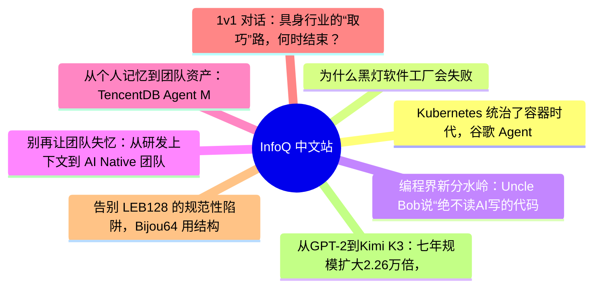
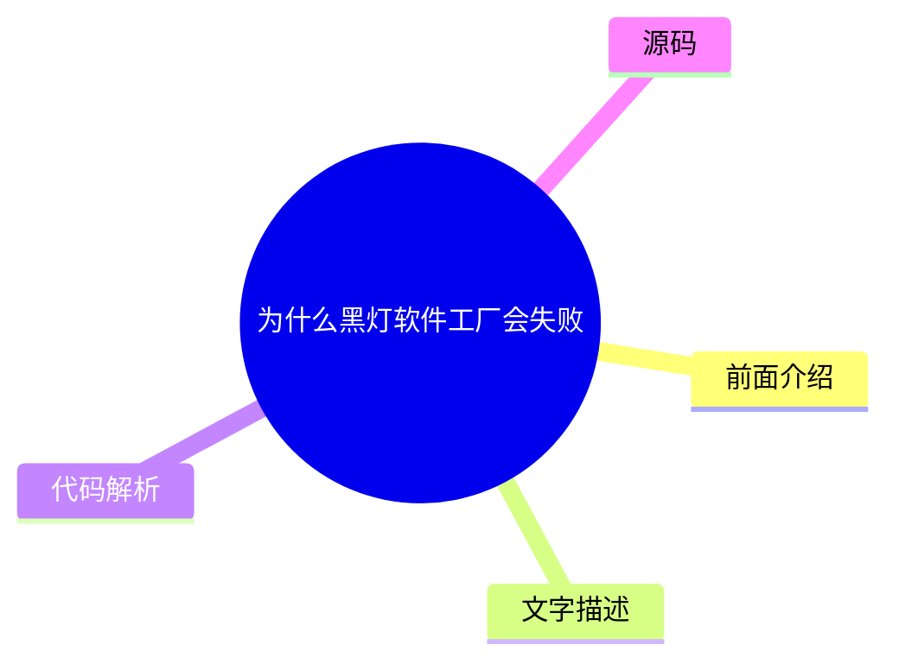
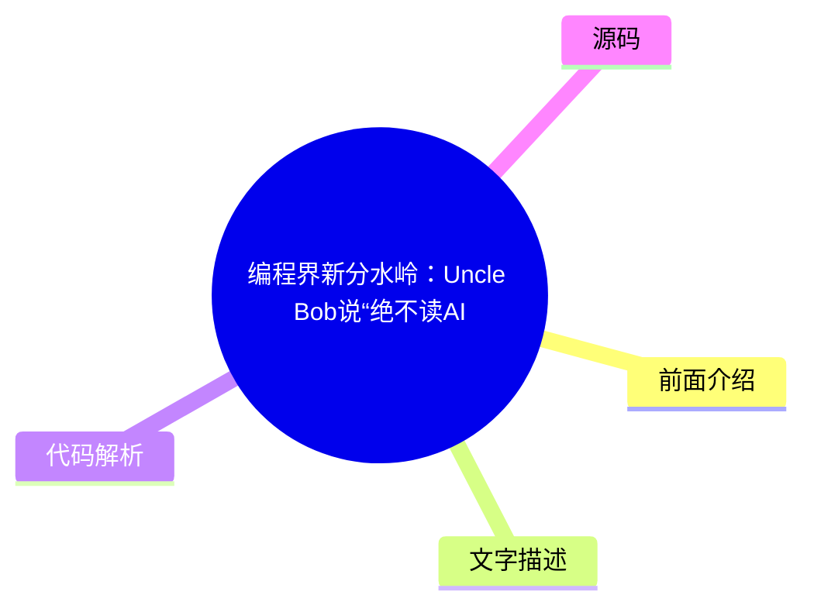
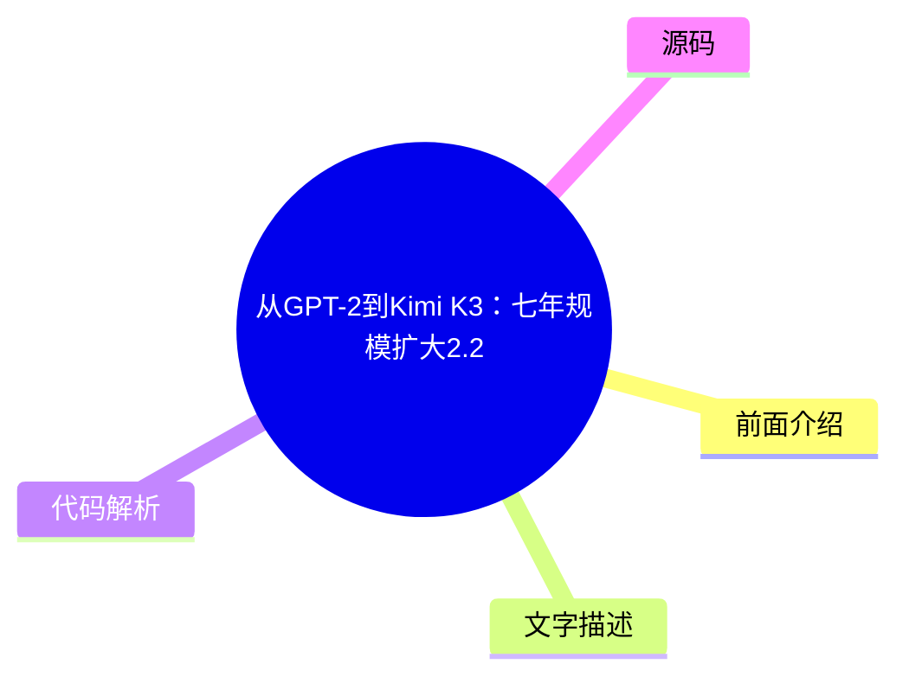

# 📰 InfoQ 中文站 Top 8 (2026-07-31)

## 前面介绍

- 数据源：InfoQ 中文站
- 抓取日期：2026-07-31
- 条目数：8
- 含完整正文：5
- 含代码片段：0
- 组织方式：前面介绍 / 树状图 / 文字描述 / 代码解析 / 源码

## 思维导图

## 详细整理（8 条，5 条含全文，0 条含代码）

### 1. Kubernetes 统治了容器时代，谷歌 Agent Substrate 意在拿下下一个十年
- **链接**: [https://www.infoq.cn/article/h0WG6p7z3tyTk3hxQIhT?utm_source=rss&utm_medium=article](https://www.infoq.cn/article/h0WG6p7z3tyTk3hxQIhT?utm_source=rss&utm_medium=article)
- **发布**: Thu, 30 Jul 2026 19:50:44 GMT

#### 前面介绍

- 点击查看原文>
- 发布时间：Thu, 30 Jul 2026 19:50:44 GMT

#### 树状图

#### 文字描述

- 谷歌于 2026 年 5 月份推出 GKE Agent Sandbox，并在公告中介绍了另一个名为 Agent Substrate 的项目。这两项公告间接承认了一个 Kubernetes 资深人士一直不愿公开点明的事实。 那个曾称霸容器时代的平台并不适合作为 AI 智能体的控制平面。Agent Sandbox 为智能体提供了一个运行不可信代码的安全环境。Agent Substrate 则增加了一个调度层，绕过了 Kubernetes 控制平面，因为 API 服务器的设计初衷从未考虑过智能体的行为模式。 如果将智能体比作操作系统中的进程，而不是数据中心里的服务，这种不匹配就显而易见了。现代操作系统运行着成千上万个进程，它们大部分时间都处于休眠状态。操作系统会在事件触发时唤醒它们，分配一小片 CPU 时间，然后将它们闲置的内存分页到磁盘，以便为下一个进程
- ### 智能体作为工作负载的本质 智能体是长期运行、有状态的会话，其生命周期的大部分时间处于空闲状态，被唤醒执行一阵代码后，再次归于沉寂。它执行的代码是由大模型在运行时生成的。运行宿主必须默认将其视为不可信的负载。每个会话都需要一个稳定的身份标识，能够在不丢失内存的情况下暂停和恢复，并且与其他会话实现硬性隔离。 不妨把智能体想象成分时操作系统中的进程。就像调度器挂起一个休眠进程并在键盘输入到达时立即恢复它一样，智能体运行时环境也必须在会话空闲时将其休眠，并在恢复时保持其工作内存完好无损。唤醒链路直接决定用户等待时长，因此路径上的每一毫秒延迟都能被感知到。 试想一个开发者在一下午都保持打开状态的编程智能体。当提示词到达时，它运行 10 秒，然后等待 20 分钟，直到下一个提示词到达。将这个数字乘以团队中的开发者数量，你就有了成千上万个名义上“活跃”但实
- ### 沉睡数小时的会话 智能体会话的流量突发特性与 Web 服务截然不同。为每个空闲会话保留一个完整的 Pod 会浪费 Pod 预留的内存和 CPU，这就是为什么新一代运行时会将空闲会话的状态快照从计算资源中剥离。
- ### 平台无法预定义的代码 由于智能体执行的代码由大模型生成，运行时无法假定负载具备良性行为。它必须能够运行一个能够执行任何操作的进程，这将隔离责任从容器边界转移到了内核边界。

#### 代码解析

- 本文未检测到明确代码块，内容更偏新闻、观点或方法论。

#### 源码

#### 中文节选

谷歌于 2026 年 5 月份推出 GKE Agent Sandbox，并在公告中介绍了另一个名为 Agent Substrate 的项目。这两项公告间接承认了一个 Kubernetes 资深人士一直不愿公开点明的事实。

那个曾称霸容器时代的平台并不适合作为 AI 智能体的控制平面。Agent Sandbox 为智能体提供了一个运行不可信代码的安全环境。Agent Substrate 则增加了一个调度层，绕过了 Kubernetes 控制平面，因为 API 服务器的设计初衷从未考虑过智能体的行为模式。

如果将智能体比作操作系统中的进程，而不是数据中心里的服务，这种不匹配就显而易见了。现代操作系统运行着成千上万个进程，它们大部分时间都处于休眠状态。操作系统会在事件触发时唤醒它们，分配一小片 CPU 时间，然后将它们闲置的内存分页到磁盘，以便为下一个进程腾出空间。智能体的行为几乎与这些进程完全一致。Kubernetes 最初是为了管理一组固定的、长期运行的复制服务而设计的。这种根本性的设计差异解释了为什么现在的智能体基础设施大多是在 Kubernetes 之上运行，而不是像 Deployment 或 StatefulSet 那样作为工作负载被集成到 Kubernetes 中。

### 智能体作为工作负载的本质

智能体是长期运行、有状态的会话，其生命周期的大部分时间处于空闲状态，被唤醒执行一阵代码后，再次归于沉寂。它执行的代码是由大模型在运行时生成的。运行宿主必须默认将其视为不可信的负载。每个会话都需要一个稳定的身份标识，能够在不丢失内存的情况下暂停和恢复，并且与其他会话实现硬性隔离。

不妨把智能体想象成分时操作系统中的进程。就像调度器挂起一个休眠进程并在键盘输入到达时立即恢复它一样，智能体运行时环境也必须在会话空闲时将其休眠，并在恢复时保持其工作内存完好无损。唤醒链路直接决定用户等待时长，因此路径上的每一毫秒延迟都能被感知到。

试想一个开发者在一下午都保持打开状态的编程智能体。当提示词到达时，它运行 10 秒，然后等待 20 分钟，直到下一个提示词到达。将这个数字乘以团队中的开发者数量，你就有了成千上万个名义上“活跃”但实际在“沉睡”的会话。

超大规模云厂商已经在朝这个方向布局。这种具有会话感知能力、隔离的智能体运行时已成为继虚拟机、容器和无服务器计算之后的第四种计算形态。

### 沉睡数小时的会话

智能体会话的流量突发特性与 Web 服务截然不同。为每个空闲会话保留一个完整的 Pod 会浪费 Pod 预留的内存和 CPU，这就是为什么新一代运行时会将空闲会话的状态快照从计算资源中剥离。

### 平台无法预定义的代码

由于智能体执行的代码由大模型生成，运行时无法假定负载具备良性行为。它必须能够运行一个能够执行任何操作的进程，这将隔离责任从容器边界转移到了内核边界。

### 休眠期间必须持久留存的状态

如果一个智能体每次挂起时都丢失上下文，它将变得无法使用。因此，运行时必须在休眠期间保存其易失性 RAM 和文件系统状态，并在恢复时还原它们。

### 为什么 Kubernetes 控制平面的架构定位是错的

Kubernetes 通过中心化 API 服务器和为数量适中长时间运行的 Pod 而设计的调度器来调度作业。这种设计假设调度决策发生频次低且决策时持久的。智能体通过生成持续不断的细粒度调度事件打破了这一假设，使控制平面成为瓶颈而不是调度仲裁者。

调度策略最先面临压力。研究智能体调度的研究人员已经证明，Kubernetes 集群中常见的轮询和随机放置策略在请求短且到达率高时效果很好，因为错误的决策会被迅速摊销。智能体请求运行时间更长且到达频率更低，因此糟糕的路由选择会持续存在，放大被困在后面的用户的尾部延迟。

第二个承压点正是 API 服务器本身。将每个智能体（无论活跃还是空闲）都存储为 Kubernetes 对象，这意味着在一个从未为此规模设计的系统中会有数百万个资源实例。Agent Substrate 的架构文档对此直言不讳，承认没有巧妙的方法能让标准控制平面容纳这么多对象，因此运行时将大多数智能体排除在外。路由也采取了类似的绕行方式，使用专用的网络层将每个请求直接发送到正确的会话，如果处于休眠状态则将其唤醒。

Kubernetes 是一个优秀的数据中心调度器，在配置底层机器资源方面仍然很有用。但对于一大群休眠进程形态的负载而言，它并不是合适的调度器。

### Agent Sandbox：不可信代码的安全沙箱

Agent Sandbox 用于解决隔离性问题。它是一个基于 Kubernetes 构建的开源执行环境，为每个智能体提供了一个加固的空间来运行大模型生成的代码。在不到 5 个月的时间里，沙箱采用规模增长了约 16 倍，谷歌随后将其推向了全面可用阶段。

可以将其理解为隔离“监牢”而非普通容器。普通容器共享宿主机内核并信任工作负载会守规矩，而 Sandbox 假设工作负载具备攻击风险，并在其周围设置了安全边界。Agent Sandbox 默认通过 gVisor 实现这一边界，添加了默认拒绝的网络策略，并暴露了一个可插拔接口，以便团队可以替换为 Kata Containers 来实现完整的内核隔离。

LangChain 和 Lovable 等客户已经在上面运行了数百万个智能体，这迫使团队进行性能优化。最终打造出的这套运行时将安全性与性能视作同一问题的两面，而非相互对立的目标。

### 解决冷启动问题的预热池

为每个请求启动一个新的 Sandbox 会增加数秒的延迟，因此 Agent Sandbox 保持了一个预配置的副本预热池。谷歌的报告显示，每个集群每秒可以分配 300 个 Sandbox，其中 90% 的分配在 200 毫秒内完成。

### 空闲会话的 Pod 快照

空闲智能体通过 Pod 快照挂起，可按需在数秒内恢复运行，这样可以释放底层计算资源，而不是付费让休眠会话常驻内存。

### 默认的内核隔离

这种隔离并非为极端安全需求额外附加的组件。gVisor 和网络访问限制属于出厂基线配置，假设任意智能体都可能运行它不应该运行的东西。

### Agent Substrate：可支撑数百万闲置智能体的运行时

如果 Agent Sandbox 是安全沙箱，那么 Agent Substrate 就是决定哪个智能体在哪里运行的运行时。它重用了 Agent Sandbox 的安全运行时和快照功能，并将它们与一个位于 Kubernetes 集群旁边的小型控制平面配对，将标准控制平面从关键路径上移除。

这个方案的核心思路是将虚拟内存超分配机制运用到计算资源调度领域。操作系统允许程序寻址远超机器物理内存的内存，方法是将冷页分页到磁盘。Agent Substrate 对智能体会话采用同类思路，将大量有状态执行智能体的注册表复用到一小部分预热的工作 Pod 池上，并将空闲的会话快照进行持久化。该项目的数据显示，由于事件到达时工作 Pod 已经在运行且从不等待 Kubernetes 调度器，因此实现了 30 倍或更高的超额订阅率和亚秒级激活速度。

#### 完整正文（中文）

谷歌于 2026 年 5 月份推出 GKE Agent Sandbox，并在公告中介绍了另一个名为 Agent Substrate 的项目。这两项公告间接承认了一个 Kubernetes 资深人士一直不愿公开点明的事实。

那个曾称霸容器时代的平台并不适合作为 AI 智能体的控制平面。Agent Sandbox 为智能体提供了一个运行不可信代码的安全环境。Agent Substrate 则增加了一个调度层，绕过了 Kubernetes 控制平面，因为 API 服务器的设计初衷从未考虑过智能体的行为模式。

如果将智能体比作操作系统中的进程，而不是数据中心里的服务，这种不匹配就显而易见了。现代操作系统运行着成千上万个进程，它们大部分时间都处于休眠状态。操作系统会在事件触发时唤醒它们，分配一小片 CPU 时间，然后将它们闲置的内存分页到磁盘，以便为下一个进程腾出空间。智能体的行为几乎与这些进程完全一致。Kubernetes 最初是为了管理一组固定的、长期运行的复制服务而设计的。这种根本性的设计差异解释了为什么现在的智能体基础设施大多是在 Kubernetes 之上运行，而不是像 Deployment 或 StatefulSet 那样作为工作负载被集成到 Kubernetes 中。

### 智能体作为工作负载的本质

智能体是长期运行、有状态的会话，其生命周期的大部分时间处于空闲状态，被唤醒执行一阵代码后，再次归于沉寂。它执行的代码是由大模型在运行时生成的。运行宿主必须默认将其视为不可信的负载。每个会话都需要一个稳定的身份标识，能够在不丢失内存的情况下暂停和恢复，并且与其他会话实现硬性隔离。

不妨把智能体想象成分时操作系统中的进程。就像调度器挂起一个休眠进程并在键盘输入到达时立即恢复它一样，智能体运行时环境也必须在会话空闲时将其休眠，并在恢复时保持其工作内存完好无损。唤醒链路直接决定用户等待时长，因此路径上的每一毫秒延迟都能被感知到。

试想一个开发者在一下午都保持打开状态的编程智能体。当提示词到达时，它运行 10 秒，然后等待 20 分钟，直到下一个提示词到达。将这个数字乘以团队中的开发者数量，你就有了成千上万名义上“活跃”但实际在“沉睡”的会话。

超大规模云厂商已经在朝这个方向布局。这种具有会话感知能力、隔离的智能体运行时已成为继虚拟机、容器和无服务器计算之后的第四种计算形态。

### 沉睡数小时的会话

智能体会话的流量突发特性与 Web 服务截然不同。为每个空闲会话保留一个完整的 Pod 会浪费 Pod 预留的内存和 CPU，这就是为什么新一代运行时会将空闲会话的状态快照从计算资源中剥离。

### 平台无法预定义的代码

由于智能体执行的代码由大模型生成，运行时无法假定负载具备良性行为。它必须能够运行一个能够执行任何操作的进程，这将隔离责任从容器边界转移到了内核边界。

### 休眠期间必须持久留存的状态

如果一个智能体每次挂起时都丢失上下文，它将变得无法使用。因此，运行时必须在休眠期间保存其易失性 RAM 和文件系统状态，并在恢复时还原它们。

### 为什么 Kubernetes 控制平面的架构定位是错的

Kubernetes 通过中心化 API 服务器和为数量适中长时间运行的 Pod 而设计的调度器来调度作业。这种设计假设调度决策发生频次低且决策时持久的。智能体通过生成持续不断的细粒度调度事件打破了这一假设，使控制平面成为瓶颈而不是调度仲裁者。

调度策略最先面临压力。研究智能体调度的研究人员已经证明，Kubernetes 集群中常见的轮询和随机放置策略在请求短且到达率高时效果很好，因为错误的决策会被迅速摊销。智能体请求运行时间更长且到达频率更低，因此糟糕的路由选择会持续存在，放大被困在后面的用户的尾部延迟。

第二个承压点正是 API 服务器本身。将每个智能体（无论活跃还是空闲）都存储为 Kubernetes 对象，这意味着在一个从未为此规模设计的系统中会有数百万个资源实例。Agent Substrate 的架构文档对此直言不讳，承认没有巧妙的方法能让标准控制平面容纳这么多对象，因此运行时将大多数智能体排除在外。路由也采取了类似的绕行方式，使用专用的网络层将每个请求直接发送到正确的会话，如果处于休眠状态则将其唤醒。

Kubernetes 是一个优秀的数据中心调度器，在配置底层机器资源方面仍然很有用。但对于一大群休眠进程形态的负载而言，它并不是合适的调度器。

### Agent Sandbox：不可信代码的安全沙箱

Agent Sandbox 用于解决隔离性问题。它是一个基于 Kubernetes 构建的开源执行环境，为每个智能体提供了一个加固的空间来运行大模型生成的代码。在不到 5 个月的时间里，沙箱采用规模增长了约 16 倍，谷歌随后将其推向了全面可用阶段。

可以将其理解为隔离“监牢”而非普通容器。普通容器共享宿主机内核并信任工作负载会守规矩，而 Sandbox 假设工作负载具备攻击风险，并在其周围设置了安全边界。Agent Sandbox 默认通过 gVisor 实现这一边界，添加了默认拒绝的网络策略，并暴露了一个可插拔接口，以便团队可以替换为 Kata Containers 来实现完整的内核隔离。

LangChain 和 Lovable 等客户已经在上面运行了数百万个智能体，这迫使团队进行性能优化。最终打造出的这套运行时将安全性与性能视作同一问题的两面，而非相互对立的目标。

### 解决冷启动问题的预热池

为每个请求启动一个新的 Sandbox 会增加数秒的延迟，因此 Agent Sandbox 保持了一个预配置的副本预热池。谷歌的报告显示，每个集群每秒可以分配 300 个 Sandbox，其中 90% 的分配在 200 毫秒内完成。

### 空闲会话的 Pod 快照

空闲智能体通过 Pod 快照挂起，可按需在数秒内恢复运行，这样可以释放底层计算资源，而不是付费让休眠会话常驻内存。

### 默认的内核隔离

这种隔离并非为极端安全需求额外附加的组件。gVisor 和网络访问限制属于出厂基线配置，假设任意智能体都可能运行它不应该运行的东西。

### Agent Substrate：可支撑数百万闲置智能体的运行时

如果 Agent Sandbox 是安全沙箱，那么 Agent Substrate 就是决定哪个智能体在哪里运行的运行时。它重用了 Agent Sandbox 的安全运行时和快照功能，并将它们与一个位于 Kubernetes 集群旁边的小型控制平面配对，将标准控制平面从关键路径上移除。

这个方案的核心思路是将虚拟内存超分配机制运用到计算资源调度领域。操作系统允许程序寻址远超机器物理内存的内存，方法是将冷页分页到磁盘。Agent Substrate 对智能体会话采用同类思路，将大量有状态执行智能体的注册表复用到一小部分预热的工作 Pod 池上，并将空闲的会话快照进行持久化。该项目的数据显示，由于事件到达时工作 Pod 已经在运行且从不等待 Kubernetes 调度器，因此实现了 30 倍或更高的超额订阅率和亚秒级激活速度。

面向开发者的形态由两个自定义资源组成：定义就绪计算的 WorkerPool 和定义智能体的 ActorTemplate。Substrate 是框架无关的，可以将 ADK、LangChain、Claude Code 或任意 OCI 容器作为执行者运行，这使其能够托管完整的智能体框架而不仅仅是单个智能体。

### 位于 Kubernetes 旁边的控制平面，而非内部

Substrate 并非 Kubernetes 的替代品。它使用 Pod 和自动扩缩容完成资源配置，并在上层叠加自己的调度器，处理 Kubernetes 难以胜任的智能体调度决策。

### 通过 kagent 走向生产

Solo.io 已经将 Substrate 集成到 kagent 中，将 Agent Substrate 作为可选运行时，因此可以在统一的 UI 上将类似 OpenClaw 的框架作为执行者调度到工作资源池中。

### 选择智能体运行的位置

这两个项目不是竞争对手，也不会取代底层的集群。架构决策在于哪一层负责哪项工作，绝大多数实际部署场景会将三者协同使用。

在实践中，大多数团队不会只选择其中一个。一个大规模运行编程智能体的团队可能会沙盒化代码，通过 Substrate 进行调度，并让 Kubernetes 配置两者之下的节点。

### 这对云原生生态系统意味着什么

运维过高负载集群的人都能轻易理解这个模式。智能体是进程，资源预热池对应一组 CPU 核心，空闲会话快照等同于内存页置换至磁盘，而资源超配背后的思路和虚拟内存机制一贯的设计逻辑如出一辙。Kubernetes 仍然是底层机器，调度智能体的层正在这个底层机器上被重建，以便更好地匹配智能体的实际运行方式。

悬而未决的问题：谁会主导这一层？Agent Substrate 目前尚处于早期探索阶段，并非定型产品；kagent 也处于早期阶段，随着空闲智能体的成本成为平台团队无法忽视的开支项目，竞争对手的运行时也将陆续面世。接下来值得关注的是，这个智能体控制平面能否像当年容器编排赛道最终收敛到 Kubernetes 一样收敛成一个单一的开源项目。另一种可能性则是各大超大规模云厂商各自推出自研方案，智能体原本想要摆脱的生态割裂问题会向上转移到这一层基础设施再度出现。

### 2. 为什么黑灯软件工厂会失败
- **链接**: [https://www.infoq.cn/article/zaRGeRH3RSKub9tALUj6?utm_source=rss&utm_medium=article](https://www.infoq.cn/article/zaRGeRH3RSKub9tALUj6?utm_source=rss&utm_medium=article)
- **发布**: Thu, 30 Jul 2026 19:44:11 GMT

#### 前面介绍

- 点击查看原文>
- 发布时间：Thu, 30 Jul 2026 19:44:11 GMT

#### 树状图

#### 文字描述

- 我经营着一家叫作 HumanLayer 的公司，致力于研发人类与智能体协作的工具。因此，我下面要说的内容可能会带点主观色彩。不过，即便如此，我还是希望你能觉得这个话题对你有所帮助，或者至少和我一样对它感兴趣。
- ## 我猜我们都在循环工程的路上了 我们都在争先恐后地将 AI 编码投入生产。关于循环工程（Loop Engineering），人们已讨论了很多，目前普遍的看法是：我们或许应该多构建一些循环流程。 StrongDM 曾撰文介绍他们的“黑灯”软件工厂：在那里，没有人阅读代码，也没有人编写代码。 大致的说法是这样的： - 你就是瓶颈。 - 模型已经足够好。 - 代码是免费的。 - 抓紧交付就好。 OpenAI 的 Ryan Lopopolo 曾在 2 月份撰文探讨了这一话题，并于 4 月份就 OpenAI 的软件工厂项目 Symphony 发表了演讲。 这些人个个都聪明绝顶，我由衷地敬佩他们。但若从最刻薄的角度解读，这不过又是一种说辞，好让风险投资家们往这个烂摊子里再砸钱。
- ## 它正在…… 我们的朋友 Mario 在 AI 工程师欧洲大会上登台呼吁大家放缓脚步——因为那些本不该因编码智能体失误而出现故障的公司，偏偏因为编码智能体的失误遭遇故障。 正如 Matt Pocock 所言，代码库崩坏的速度达到了前所未有的水平。 我没能找到 StrongDM 针对这套黑灯工厂项目进展发布任何确切的数据与结论。他们的项目气象报告从今年 2 月份到 6 月份仅有零星更新。不过，7 月 23 日团队在 Hacker News 参与了讨论，听上去我们很快有望看到一份更为正式的进展通报！ Faros AI 团队发布了一份报告：自今年一二月份大家陆续用上各类 AI 编码工具以来，PR 的评审质量大幅下滑。 - 评审留言变多、篇幅变长，还有大量 PR 在没有评审的情况下就被合并。 - 线上故障数量大幅上升。 - 每位开发人员的缺陷数量也显著增
- ## “是你使用方式不对”（事实并非如此） 很多人会跟你说，问题出在使用者技能不足——如果你没能获得理想的效果，那是你自己的问题。 但无论你选择怎样去用它，我敢肯定一定会有人对你说：如果极致消耗词元这条路行不通，那就是你的技能问题。你只需要消耗更多词元，不要再纠结于读懂代码了。而且，如果你刚开始走到这个阶段，我可以保证，这正是成长过程的一部分。去年夏天，我也曾这样想过。 遗憾的是，因为我的虚荣心，我之前随口说了些关于“如何更好地驾驭它”的傻话，结果居然被录了下来，如今在 YouTube 上的累计观看量已接近百万。我并非想炫耀，只是想借此说明，我早已深入研究如何最有效地利用编码智能体，并且发现了一些对许多人来说确实很有用的见解。 网上铺天盖地、让人不胜其烦的这套论调——“使劲堆词元就行了”，它的核心逻辑就是：只要做好充分的 harness 工程设计，我

#### 代码解析

- 本文未检测到明确代码块，内容更偏新闻、观点或方法论。

#### 源码

#### 中文节选

我经营着一家叫作 HumanLayer 的公司，致力于研发人类与智能体协作的工具。因此，我下面要说的内容可能会带点主观色彩。不过，即便如此，我还是希望你能觉得这个话题对你有所帮助，或者至少和我一样对它感兴趣。

## 我猜我们都在循环工程的路上了

我们都在争先恐后地将 AI 编码投入生产。关于循环工程，人们已讨论了很多，目前普遍的看法是：我们或许应该多构建一些循环流程。

StrongDM 曾撰文介绍他们的“黑灯”软件工厂：在那里，没有人阅读代码，也没有人编写代码。

大致的说法是这样的：

- 你就是瓶颈。
- 模型已经足够好。
- 代码是免费的。
- 抓紧交付就好。

OpenAI 的 Ryan Lopopolo 曾在 2 月份撰文探讨了这一话题，并于 4 月份就 OpenAI 的软件工厂项目 Symphony 发表了演讲。

这些人个个都聪明绝顶，我由衷地敬佩他们。但若从最刻薄的角度解读，这不过又是一种说辞，好让风险投资家们往这个烂摊子里再砸钱。

## 它正在……

我们的朋友 Mario 在 AI 工程师欧洲大会上登台呼吁大家放缓脚步——因为那些本不该因编码智能体失误而出现故障的公司，偏偏因为编码智能体的失误遭遇故障。

正如 Matt Pocock 所言，代码库崩坏的速度达到了前所未有的水平。

我没能找到 StrongDM 针对这套黑灯工厂项目进展发布任何确切的数据与结论。他们的项目气象报告从今年 2 月份到 6 月份仅有零星更新。不过，7 月 23 日团队在 Hacker News 参与了讨论，听上去我们很快有望看到一份更为正式的进展通报！

Faros AI 团队发布了一份报告：自今年一二月份大家陆续用上各类 AI 编码工具以来，PR 的评审质量大幅下滑。

- 评审留言变多、篇幅变长，还有大量 PR 在没有评审的情况下就被合并。
- 线上故障数量大幅上升。
- 每位开发人员的缺陷数量也显著增加。

这份报告更像是一种相关性信号，而不是确凿的铁证。这篇文章的核心目的在于提醒大家警惕垃圾数据，不过结合我自身观察来看，报告反映的趋势还是可靠的。

## “是你使用方式不对”（事实并非如此）

很多人会跟你说，问题出在使用者技能不足——如果你没能获得理想的效果，那是你自己的问题。

但无论你选择怎样去用它，我敢肯定一定会有人对你说：如果极致消耗词元这条路行不通，那就是你的技能问题。你只需要消耗更多词元，不要再纠结于读懂代码了。而且，如果你刚开始走到这个阶段，我可以保证，这正是成长过程的一部分。去年夏天，我也曾这样想过。

遗憾的是，因为我的虚荣心，我之前随口说了些关于“如何更好地驾驭它”的傻话，结果居然被录了下来，如今在 YouTube 上的累计观看量已接近百万。我并非想炫耀，只是想借此说明，我早已深入研究如何最有效地利用编码智能体，并且发现了一些对许多人来说确实很有用的见解。

网上铺天盖地、让人不胜其烦的这套论调——“使劲堆词元就行了”，它的核心逻辑就是：只要做好充分的 harness 工程设计，我们便能鱼与熊掌兼得：

- 10 到 100 倍效率提升；
- 高质量；
- 再也不用做所有人都头疼的代码评审。

我们所要做的，无非是配置更多代码检查工具，再给足够多的 PR 评审机器人加上一些“对抗性评审”之类的神奇词汇，然后软件就能顺顺利利自动构建，不会出错。

## 这不是技能问题

我要努力说服你的是，无论怎样优化硬件设计或提升循环峰值性能，都无法从根本上解决一个本质上属于模型训练的问题。

为把这件事讲清楚，我深入研究了代码模型实际的训练与评估机制，包括可验证奖励强化学习（RLVR）及基准评测方面的内容。

在这篇文章中，我会依次讲解：

- 软件工厂的历史可追溯到 1968 年，它们经历了怎样的演变？AI 又是如何改变了它们？
- 为什么模型即使在各项基准测试中表现优异（甚至包括全新的“前沿”基准测试），仍能生成大量垃圾内容？
- 尽管存在上述问题，我们依旧可以高效推进开发，同时不至于把代码库搞得一团糟。

我打算抛开每天层出不穷的 Skill 插件以及 AI 狂热与过度追求极致性能的炒作建议，以更宏观的视角来谈谈那些真正有效的方法，不会提及任何特定的 Skill 或框架。

## 软件工厂简史

我的整个职业生涯都在构建和研究软件工厂，但直到最近才了解到：这一术语最早可追溯到 1968 年的一次北约会议——正是那次大会提出了“软件工程”这一概念。

自那以后，我唯一觉得特别有趣的一点是，美国国防部写了一篇长达 31 页的 PDF 文件，内容大致是关于国防部需要更好地使用 Jenkins 之类的事项。

### 2022 年的软件工厂

让我们以 2022 年——即 AI 出现之前——为基准来界定我们的“软件工厂”概念。在典型的软件工厂里：

- 人们决定要构建什么——工程师、项目经理和引领愿景的领导层共同推动。
- 它会进入一个跟踪器——Linear、Jira 或者其他的什么东西：一个描述所需完成事项的状态机。
- 有人领取工单，然后开始构建——很可能在构建过程中还会做一些手动或自动测试。

- 拉取请求——自动检查，由人工审查代码，或许还有人将代码拉下来做测试。 
- 发现问题？回到开发环节。 
- 发布到生产环境——正式面向用户。 
- 添加监控——整个行业都围绕着在凌晨 3 点某个地方出问题时给工程师发寻呼而建立起来的。 
- 用户反馈——提出需求、发现漏洞、提交功能请求，流转回团队，录入任务追踪系统。 

如此循环往复。我们甚至还没触及 AI，这张图里就已经出现了好几个循环了。

### 对齐前置

数十年前的团队就已明白：开发需要数小时或数天，代码评审也是如此。

因此，团队会把工作前置——包括规划、架构方案和冲刺迭代计划。这意味着：

- 更少的返工，因为我们是在写代码之前就已达成一致。 
- 减少逐行评审的时间。 

我们稍后再回过头来讨论这个——现在我们来看看引入编码智能体时会发生什么。

### 智能体软件工厂

现如今几乎所有公司都在跟风

- Ramp 
- Stripe 
- WorkOS 
- Brex 

今年的大部分时间，他们都在宣扬自己如何打造了一个智能体工厂，产出的代码占比高达 75%。

智能体工厂看起来基本上就是将“人工开发某个功能”替换为“智能体开发某个功能”——这里面涉及一些内容，比如编排、工具箱、沙盒、模型、计算机使用等等。我就不深入探讨这些细节了，因为说实话，这类内容我已经看得审美疲劳，而且我敢肯定，你们也一样。

当由智能体开发功能时：

- 开发耗时从数小时乃至数天缩短至几分钟或几小时。 
- 但代码评审依旧要耗费数小时、甚至数日。仍然需要人工通读代码、验证改动。于是，评审环节成了新的瓶颈。 

于是你也加快评审速度：

- 用智能体评审代码，检查代码规范、发现缺陷与安全漏洞。 
- 用智能体进行回归测试，通过浏览器、计算机操作能力对系统进行探测；完成后说不定还会给你发一段可爱的小视频。 

现在评审速度更快了，但可能仍然存在瓶颈。不过，我们可

#### 完整正文（中文）

我经营着一家叫作 HumanLayer 的公司，致力于研发人类与智能体协作的工具。因此，我下面要说的内容可能会带点主观色彩。不过，即便如此，我还是希望你能觉得这个话题对你有所帮助，或者至少和我一样对它感兴趣。

## 我猜我们都在循环工程的路上了

我们都在争先恐后地将 AI 编码投入生产。关于循环工程，人们已讨论了很多，目前普遍的看法是：我们或许应该多构建一些循环流程。

StrongDM 曾撰文介绍他们的“黑灯”软件工厂：在那里，没有人阅读代码，也没有人编写代码。

大致的说法是这样的：

- 你就是瓶颈。
- 模型已经足够好。
- 代码是免费的。
- 抓紧交付就好。

OpenAI 的 Ryan Lopopolo 曾在 2 月份撰文探讨了这一话题，并于 4 月份就 OpenAI 的软件工厂项目 Symphony 发表了演讲。

这些人个个都聪明绝顶，我由衷地敬佩他们。但若从最刻薄的角度解读，这不过又是一种说辞，好让风险投资家们往这个烂摊子里再砸钱。

## 它正在……

我们的朋友 Mario 在 AI 工程师欧洲大会上登台呼吁大家放缓脚步——因为那些本不该因编码智能体失误而出现故障的公司，偏偏因为编码智能体的失误遭遇故障。

正如 Matt Pocock 所言，代码库崩坏的速度达到了前所未有的水平。

我没能找到 StrongDM 针对这套黑灯工厂项目进展发布任何确切的数据与结论。他们的项目气象报告从今年 2 月份到 6 月份仅有零星更新。不过，7 月 23 日团队在 Hacker News 参与了讨论，听上去我们很快有望看到一份更为正式的进展通报！

Faros AI 团队发布了一份报告：自今年一二月份大家陆续用上各类 AI 编码工具以来，PR 的评审质量大幅下滑。

- 评审留言变多、篇幅变长，还有大量 PR 在没有评审的情况下就被合并。
- 线上故障数量大幅上升。
- 每位开发人员的缺陷数量也显著增加。

这份报告更像是一种相关性信号，而不是确凿的铁证。这篇文章的核心目的在于提醒大家警惕垃圾数据，不过结合我自身观察来看，报告反映的趋势还是可靠的。

## “是你使用方式不对”（事实并非如此）

很多人会跟你说，问题出在使用者技能不足——如果你没能获得理想的效果，那是你自己的问题。

但无论你选择怎样去用它，我敢肯定一定会有人对你说：如果极致消耗词元这条路行不通，那就是你的技能问题。你只需要消耗更多词元，不要再纠结于读懂代码了。而且，如果你刚开始走到这个阶段，我可以保证，这正是成长过程的一部分。去年夏天，我也曾这样想过。

遗憾的是，因为我的虚荣心，我之前随口说了些关于“如何更好地驾驭它”的傻话，结果居然被录了下来，如今在 YouTube 上的累计观看量已接近百万。我并非想炫耀，只是想借此说明，我早已深入研究如何最有效地利用编码智能体，并且发现了一些对许多人来说确实很有用的见解。

网上铺天盖地、让人不胜其烦的这套论调——“使劲堆词元就行了”，它的核心逻辑就是：只要做好充分的 harness 工程设计，我们便能鱼与熊掌兼得：

- 10 到 100 倍效率提升；
- 高质量；
- 再也不用做所有人都头疼的代码评审。

我们所要做的，无非是配置更多代码检查工具，再给足够多的 PR 评审机器人加上一些“对抗性评审”之类的神奇词汇，然后软件就能顺顺利利自动构建，不会出错。

## 这不是技能问题

我要努力说服你的是，无论怎样优化硬件设计或提升循环峰值性能，都无法从根本上解决一个本质上属于模型训练的问题。

为把这件事讲清楚，我深入研究了代码模型实际的训练与评估机制，包括可验证奖励强化学习（RLVR）及基准评测方面的内容。

在这篇文章中，我会依次讲解：

- 软件工厂的历史可追溯到 1968 年，它们经历了怎样的演变？AI 又是如何改变了它们？
- 为什么模型即使在各项基准测试中表现优异（甚至包括全新的“前沿”基准测试），仍能生成大量垃圾内容？
- 尽管存在上述问题，我们依旧可以高效推进开发，同时不至于把代码库搞得一团糟。

我打算抛开每天层出不穷的 Skill 插件以及 AI 狂热与过度追求极致性能的炒作建议，以更宏观的视角来谈谈那些真正有效的方法，不会提及任何特定的 Skill 或框架。

## 软件工厂简史

我的整个职业生涯都在构建和研究软件工厂，但直到最近才了解到：这一术语最早可追溯到 1968 年的一次北约会议——正是那次大会提出了“软件工程”这一概念。

自那以后，我唯一觉得特别有趣的一点是，美国国防部写了一篇长达 31 页的 PDF 文件，内容大致是关于国防部需要更好地使用 Jenkins 之类的事项。

### 2022 年的软件工厂

让我们以 2022 年——即 AI 出现之前——为基准来界定我们的“软件工厂”概念。在典型的软件工厂里：

- 人们决定要构建什么——工程师、项目经理和引领愿景的领导层共同推动。
- 它会进入一个跟踪器——Linear、Jira 或者其他的什么东西：一个描述所需完成事项的状态机。
- 有人领取工单，然后开始构建——很可能在构建过程中还会做一些手动或自动测试。

- 拉取请求——自动检查，由人工审查代码，或许还有人将代码拉下来做测试。 
- 发现问题？回到开发环节。 
- 发布到生产环境——正式面向用户。 
- 添加监控——整个行业都围绕着在凌晨 3 点某个地方出问题时给工程师发寻呼而建立起来的。 
- 用户反馈——提出需求、发现漏洞、提交功能请求，流转回团队，录入任务追踪系统。 

如此循环往复。我们甚至还没触及 AI，这张图里就已经出现了好几个循环了。

### 对齐前置

数十年前的团队就已明白：开发需要数小时或数天，代码评审也是如此。

因此，团队会把工作前置——包括规划、架构方案和冲刺迭代计划。这意味着：

- 更少的返工，因为我们是在写代码之前就已达成一致。 
- 减少逐行评审的时间。 

我们稍后再回过头来讨论这个——现在我们来看看引入编码智能体时会发生什么。

### 智能体软件工厂

现如今几乎所有公司都在跟风

- Ramp 
- Stripe 
- WorkOS 
- Brex 

今年的大部分时间，他们都在宣扬自己如何打造了一个智能体工厂，产出的代码占比高达 75%。

智能体工厂看起来基本上就是将“人工开发某个功能”替换为“智能体开发某个功能”——这里面涉及一些内容，比如编排、工具箱、沙盒、模型、计算机使用等等。我就不深入探讨这些细节了，因为说实话，这类内容我已经看得审美疲劳，而且我敢肯定，你们也一样。

当由智能体开发功能时：

- 开发耗时从数小时乃至数天缩短至几分钟或几小时。 
- 但代码评审依旧要耗费数小时、甚至数日。仍然需要人工通读代码、验证改动。于是，评审环节成了新的瓶颈。 

于是你也加快评审速度：

- 用智能体评审代码，检查代码规范、发现缺陷与安全漏洞。 
- 用智能体进行回归测试，通过浏览器、计算机操作能力对系统进行探测；完成后说不定还会给你发一段可爱的小视频。 

现在评审速度更快了，但可能仍然存在瓶颈。不过，我们可以增加更多循环。

接下来，你可能还会将线上故障直接转接到工厂。这样一来，他们不必在凌晨 3 点被叫醒去处理，而是在一觉醒来时看到一个已经完成修复的 PR。

我们还可以将用户反馈直接接入到工厂。用户提出需求，产品就会被制造出来。

此时，这里只剩下两个问题：你能往任务队列里塞多少需求，以及你能以多快的速度完成评审和测试？

这就引出了黑灯软件工厂。

### 黑灯软件工厂

Dan Shapiro 发明了这个术语，而 Simon Willison 则撰文介绍了 StrongDM 的落地实现——在这个实现中，人类不再阅读代码了。

你看着自己精心搭建的软件工厂，却被那个烦人的代码评审环节给毁了。于是你心想：那个由人来逐行审阅每处改动的流程？算了吧，我才不要呢。

于是你舍弃人工代码评审，把精力放到其他地方：

- 测试，让智能体自行验证自己的产出； 
- 沙箱和编排； 
- 自动化代码评审； 
- 监控； 
- 发布； 
- 收集用户反馈。 

至此，问题就只剩一个：我们能让智能体开发多少东西？我们打算多大程度上“竭泽而渔”？

## 看起来很棒（事实并不会）

我要提出一个可能颇具争议的观点：黑灯软件工厂行不通。

让我们来探讨一下黑灯软件工厂为何会失败。

## 我们尝试过了

2025 年 7 月，我们全面进入黑灯工厂模式：智能体只需要阅读需求规范和工单，中小型开发任务全部交由后台智能体处理，整个流程就搞定啦。

如果你认真尝试几个月，就知道结局会怎样。你一定会碰到至少一个极度棘手的难题，即使你使用了最前沿的提示词和工作流，智能体依旧束手无策。

- 你进行深度的上下文感知排查，将所有相关的要素整合起来供模型分析。 
- 你让智能体尝试以 10 种不同的方式重现。 

最终，你不得不硬着头皮去翻阅那个三个月前就不再看的代码库，试图弄清楚哪里出了问题。

与此同时：

- 你的网站瘫痪了。 
- 你的用户生气了。 
- 而你呢，如果你和我一样，一定会痛苦不堪——读着那些你不小心引入系统的垃圾代码。 

第一次遇到这种情况时，我毫不在意地把它抛诸脑后。尽管我花了近两周时间梳理那些乱七八糟的代码，但依然觉得“潜在风险换来开发速度是值得的”。到了 11 月，这类问题第三次出现，我们干脆决定从头开始重写，我的联合创始人甚至整整花了两周时间使用 VS Code（连 Cursor 都没用）纯靠手写把所有模式都梳理了一遍。

## 随着时间推移，大模型会拉低代码库质量

我想强调的是：模型存在一个缺陷——它们无法长期持续提升代码库的质量，除非有相当程度的人工干预。

我所说的可维护性，指的是这样一种情况：想要修改代码库中的某一处代码，极大概率会引发其他地方报错。这正是 Martin Fowler 所说的“霰弹式手术”。

我就不多谈可维护性了。关于这方面的书有很多，可以去读一读。

- John Ousterhout 的《软件设计哲学》 
- Robert C. Martin 的《代码整洁之道》 
- Martin Fowler 的《重构》 

那么，为什么大模型无法实现软件可维护性呢？

## 但毫无疑问，大模型变得越来越好了

此时，你可能迫不及待地想说：自 7 月份以来，这些模型可已经进步不少了！

在某些方面，它们是的。而在某些方面，它们在原地踏步。

- 解决一次性问题或快速搭建新的网站？这方面确实好很多了。 
- 但要说长期持续提升代码库质量？依我看，并没有好多少。 

这一点我无法证实，你同样也无法证实。目前尚无可靠的基准测试可用来衡量大模型保持代码库质量的能力。

但如果你已经使用编码智能体一段时间——而且很多人都在讨论这个问题——你可能早已有所察觉：随着时间推移，它们往往会让情况变得更糟，使代码库更难维护。

为了弄清楚为什么会发生这种情况，我想将视角拉回到第一个伟大的编码助手。

## Claude Code 之所以获胜，是因为它采用了强化学习

Claude Code 在不到一年时间里，营收从零一路攀升至约 40 亿美元，如今年化营收大约达到 90 亿美元。

这有点儿令人匪夷所思，因为此前已经有不少优秀的命令行工具智能体了——Aider、Cline、Codebuff——它们全都早于 Claude Code 问世，而且都内置了出色的上下文处理功能，而且具备大家以为是 Claude Code 首创的全套工具能力：读、写、编辑、文本检索、命令行终端。我都用过，确实不错。但与此同时，这些工具有时会彻底失效——你会眼睁睁看着它对着同一段编辑内容折腾三次，最后只好自己打开编辑器重新动手编辑。

2024 年的 SWE-Agent 论文指出工具形态的细微变化会如何带来显著差异，例如在 ReadFile 返回的结果中加入行号，或将 Edit 工具从查找/替换改为按行范围编辑。

随后，Claude Code 一经推出业务规模便迅速一路走高。你可以简单将其归因于渠道推广优势，但业界公认的解释是：Claude Code 之所以胜出，是因为它更优秀，而它之所以更优秀，是因为 Anthropic 在训练模型时采用了强化学习技术——这是首次有研究机构针对未来实际部署的工具来训练模型。因此，Claude Code 在以智能体方式调用这些工具时表现得极为出色。

不断调整工具定义、反复调试评测方案，直到摸索出模型最适配的交互形式，这是一回事——我为此耗费了好几周时间，针对各种不同的应用场景。但当你掌握了权重，并能直接修改模型本身，让它在特定工具组合上表现得更好时，这就完全是另一番境界了。

OpenAI 的团队在 11 月份的一次演讲中对此做了很好的阐述：如果你只打造了一个支架，不拥有权重，也无法对支架内的模型进行强化学习，那么你始终会处于劣势，而那些同时拥有两者的团队则占据明显优势。

## 60 秒完成编码智能体强化学习

我围绕这个话题做了一大堆研究，并制作了不少可视化图表，试图解释其中的关键点。不过，我发现 Calvin French-Owen（曾在 Codex 团队，也是 Segment 的创始人）在 AI Council 上做的一场演讲讲得更好、更简洁明了。因此，我索性直接把受他幻灯片启发而制作的这段动画放在这里：

为了让大模型写出更好的代码，你需要：

- 生成编码智能体执行轨迹来解决问题（例如，修复测试）； 
- 根据某些标准对轨迹进行评分（验证器）； 
- 更新模型权重，让优质执行轨迹出现的概率变高，劣质轨迹出现的概率变低。 

然后，你在数周或数月的时间里重复这个过程数百万次。

不过，这个流程里的“评分”环节往往会有些随意且维度单一。

## 糟糕的设计不会受到惩罚

以 SWE-bench 多语言版为例。这些任务规模较小——每项大约只需要十五分钟时间就可完成——均取自 Redis、jq 和 Django 等开源代码库。奖励结果为 1 或 0，具体取决于：

- `FAIL_TO_PASS`——是否修复了被要求修复的问题？
- `PASS_TO_PASS`——有没有破坏了其他功能？

这里有一个真实的例子，`fastlane__fastlane-19304`，来自 fastlane —— 一个 Ruby 项目。它的 zip 操作会接受两个可选参数，并立即对它们调用 `.empty?` 方法，如果你不传 `include` 和 `exclude` 参数，它会直接报错：

'zip_command': undefined method 'empty?' for nil:NilClass

人类开发者解决这个问题只需要修改两行代码：

在评估过程中，大模型

- 以一个基础提交作为起点——也就是代码仓库切换到修复合并之前的那个提交节点 
- 错误报告——在本例中为 - `'zip_command': undefined method 'empty?' for nil:NilClass`

智能体根据这条工单信息独立编写代码。它看不到标准答案补丁或测试补丁：

然后：

- 我们保留它生成的补丁 
- 丢弃它对测试文件所做的修改（我们发现模型会悄悄地注释掉失败的测试，或插入一个使测试失去意义的模拟对象） 
- 在代码之上应用基准的测试补丁 
- 运行整个测试套件：包括现有的 zip 测试（ - `PASS_TO_PASS`）以及新增的测试（- `FAIL_TO_PASS`），检验它们是否都能通过。

模型如何得出正确答案并不重要。只要测试通过，我们就赢了。而导致代码库可维护性降低，我们无需受到任何惩罚。

这就是为什么模型会到处滥用 try-catch 包裹代码：

以及那些偷懒的类型转换，它们从根本上消解了类型系统原本所能带来的价值。

## 验证代码质量的难度比“测试是否通过”高出几个数量级

运行测试可在短短几秒内给出通过或失败结果。正因如此，强化学习才能运行数百万次迭代，优化模型的每一次生成。

但糟糕的架构让我们付出的代价可能以周、月甚至年为单位来衡量。这种情况往往在第一次有人打开那个文件，仅仅为了做一行小小的改动时就出现了——他们这才意识到，根本无法通过修改一行代码搞定。之前开发的人图省事、凑出了能跑通的方案，如今我们不得不在十一个地方做出同样的修改，还得祈祷改动不会悄无声息地造成另外三个文件出问题。

糟糕的设计正是当今基准测试无法评估的一环。强化学习并不等同于基准测试，但如果这个问题能在强化学习中得到解决，我敢肯定，它迟早也会反映在我们基准测试的设计方式上。

无论如何，我并不认为模型在现有评测基准上取得的任何性能提升能够证明它们突然学会了不再胡乱糟蹋你的代码库。

## 前沿模型的能力正在缓慢进步

当然，许多聪明人都在为此努力。我的观点并不是说这件事做不成，而是说炒作的热度已经超过了应有的严谨性。

我认为一些努力方向是正确的：

- SWE-Marathon（Abundant AI）：约 400 小时的任务，例如“克隆 Excel 的所有功能”——采用复合奖励机制，而非单一的通过/失败一元判定。 
- DeepSWE（Datacurve）：OSS 代码库中那些从未在现实世界中真正被实现的大型任务，因此从本质上讲，它们不可能存在于训练集中（可解决污染问题，但无法保证质量）。 
- Frontier Code（Cognition）：多项 PR 任务，以及一项巧妙的设计——以确定性方式评估质量：如果模型编写的测试在预补丁代码上未能通过，便会受到惩罚。此外，它还会用评判模型来检查差异内容。 

但依靠模型来评判代码质量，终究存在局限。

事实上，不难想象，如果一个模型能够可靠地分辨出好代码与坏代码，它或许从一开始就写出了更好的版本。强化学习需要一个快速且可靠的“预言者”，而我们目前尚不具备这样一个用于衡量可维护性的“预言者”。

当然，使用更多的评审智能体和更多的词元确实能起到作用 —— 它们抬高了下限，能捕捉到那些低级的错误。

但它们无法突破上限，因为上限就是我们在强化学习中成功教会模型的东西；而所谓优秀的设计，恰恰是我们目前仍不知如何教会模型的那些东西。

所以，我仍然不会把代码库的质量押注在这些工具上。但它们是我见过的首批尝试评估可维护性而不仅仅是停留在判定通过或失败层面的工具。

## 重新把灯打开

现在，你是评判者——所以我们把代码评审重新放回原位：

我们将沿用自 AI 出现之前就一直采用的做法——事先做一点规划，降低经历漫长而艰难审查的可能性。

我们将找到突破口，并借助 AI 在四个阶段中进行助力：

- 产品需求 
- 系统架构 
- 程序设计 
- 垂直切片 

### 产品评审

一切从产品评审开始：这是一份简短的文档，精准地阐明了我们正在构建什么以及为何要这么做。我们的目标是能够将两句话或一段冗长的语音笔记整理成某种半结构化的内容。

首先，我们要明确需要解决的问题——即用户真正面临的痛点，并用用户的语言来表述。其次，明确成功的标准——我们可以在产品上线后通过哪些指标来判断这项功能确实值得开发。理想情况下，这些成功指标应该是用户层面的成果，比如“能以更短的时间完成 XYZ 工作流程”或“提前达成 ABC 上手目标”。有时，这些指标可能更偏向底层，比如错误率或延迟数值；有时则简单地表现为“与 X 相关的客服工单数量减少”。

我们尽量将讨论重点放在产品领域，而非技术层面。作为一位一脚踏在产品世界、另一脚踏在技术领域的从业者，我常常发现自己会不自觉地陷入技术细节的讨论中。每当这时，我都会先随手记下这些内容，留在后续阶段深入探讨，然后尽快回到用户体验这一核心问题上来。如果技术决策阻碍了产品决策，我们就先确定现有方案，着手进行架构设计，或者进行更多的原型研究，探索可行的解决方案。

由于大部分都是关于用户可见的内容，我并不会用文字去描述——而是直接进行原型设计。一份简单的 HTML 原型就能一锤定音，若是用三段文字阐述，只会让分歧持续拉锯。

这里有一个正在推进的真实案例——用 JSON 大纲明确了功能，随后提供了两个粗略的 HTML 界面原型。

当然，并非所有东西都会评审。对于文案微调、一次性脚本或是明显可复现的错误——我们依然直接一次性交给智能体处理。这尤其适用于那些一旦智能体误解了我们的意图就会带来高昂代价的改动。

对于所有相关文档，我们采用作者主动参与的评审方式。如果你希望在评审过程中节省时间，可以选定一位负责评审该 PR 的人员，并与他/她一起快速过一遍产品和技术规范——这既可以采用异步方式，通过文档评论进行（我们自己就用 HumanLayer 来实现这一流程，不过你也可以在 GitHub、Notion、Plannotator 等工具中完成）。

### 系统架构

产品评审一旦敲定，我们便开始进行系统架构设计。这其实并不算什么新鲜事，甚至依靠 AI 即兴编码的开发者也开始推崇这一做法了。

在这一阶段，我们确定服务、端点、模式、队列和存储之间如何相互通信，无需深入探讨程序设计的细节。为了最大限度地提升人与智能体之间的沟通带宽，我们在这个阶段大量使用可视化手段——例如序列图：

契约/端点：

PUT /api/resources/:slug

request: { destination: string }

response: { resource: Resource }

数据模型与转换：

-- new tables

CREATE TABLE resource (

slug TEXT PRIMARY KEY,

destination TEXT NOT NULL,

created_at TIMESTAMPTZ NOT NULL DEFAULT now()

);

-- new query shapes

-- SELECT ... FROM ...

使用 Mermaid 绘图固然可行，但有时可能用力过猛，还容易让人产生一种“各方已对齐”的错觉。架构具有相当高的杠杆效应，这一阶段可以有效避免许多潜在的不良建模习惯。然而，仅靠架构还无法产出高质量的代码；为此，我们还需要进行程序设计。

### 程序设计

在架构完成之后，我们需要做一件我认为在智能体编程中被严重低估的事情：程序设计。

大多数人以为，只要架构设计得当，大模型就能自动搞定一切。你确实可以这么做，但可能并不会喜欢最终的结果。

但从实践来看，行之有效的做法是：在开始编写实现代码（无论是人类还是智能体）之前先从架构层面深入到代码的具体形态：包括类型、方法签名、程序布局以及调用栈。

我们程序设计的第一版简直烂透了。代码难懂，让人精疲力尽。我们试过 Mermaid，它确实有其用武之地，但其实我们更喜欢用伪代码进行轻量级的可视化呈现：

涉及流程编排或控制逻辑变更时，我们就采用调用栈树。如果重点在于对比改动内容，请使用差异语法：

Dillon Mulroy 提到他将调用图作为规划流程的一部分，我认为这完全正确。

文件树差异——让你随时掌握代码库的布局以及各种内容所处的位置。

关键功能的类型和方法签名——这些内容过于细节，不适合写在架构文档中，但智能体依然很容易在这里出错。

interface Item {

id: ItemId

parentId: ItemId | null

// ...

}

interface Cursor {

position: ItemId

direction: 'up' | 'down'

// ...

}

resolveTarget(items: Item[], cursor: Cursor) -> ItemId | null

这些都不需要花费很长时间来完成（由大模型起草，你再与之讨论），而且每项决定都相当于你在代码审查过程中原本会不自觉做出的决定——而此时此刻正是你最难以改变主意、成本最高的时候。

### 垂直切片

接下来，我们喜欢做一种我称之为“垂直切片”的事情——2026 年 1 月，Matt Pocock 和我在一场直播中聊过垂直切片或“追踪弹”——这也被称为追踪弹。

大模型往往倾向于采用我所说的横向规划（Horizontal Plan）——也就是按照技术栈分层顺序依次构建：

- 数据库迁移 
- 服务层 
- API 
- 前端 

实际上，这意味着在开发过程中根本无法真正“触碰”解决方案。你可以用代码测试一些东西，但就我开发过的几乎所有功能而言，仅阅读测试用例还只是个开始；在开发过程中，总要时不时地在浏览器中打开看看，或者用 curl 直接调用一下才行。

在 AI 普及之前，很少有人能在编写代码时做到不中途检查就写出 2000 多行甚至哪怕 500 多行代码。

我花了一段时间才注意到与我以往习惯的不同——以前在没有 AI 辅助的情况下写代码，我总是从中间开始，然后向外扩展。大致是这样：

- 创建 API 契约并提供模拟数据，使用 curl 进行测试。 
- 创建前端来消费模拟数据，在浏览器中迭代并优化。 
- 将 API 连接到服务层（服务提供模拟数据/行为）。 
- 添加数据库迁移，将服务连接到数据库。 
- 添加大量业务逻辑。 
- 添加大量错误处理。 

而且我会在每个步骤中进行测试、迭代和打磨。

如果我对这段代码质量要求很高，或者怀疑模型难以在代码库的这一模块写出可靠代码，我也会在每个步骤都仔细审查代码。每次检查 100 到 200 行代码，并进行调整，这样做成本要低得多。

大多数前沿模型在没有人类引导的情况下都不会设计出这样的方案。而且，这种方案很难直接套用到所有代码库，甚至不能直接照搬到每一项开发任务上，所以我更倾向于全程参与其中。相信我，如果能将这部分思考外包出去，我早就这么做了。

## 30 分钟规划可节省数小时评审时间

因此，我认为如果想在不耗费大量精力去清理堆积如山的烂代码的情况下，仍能保持接近人类水平的质量，那么有些步骤是必须由人类参与把控的。

- 产品设计 
- 系统架构 
- 程序设计 

- 垂直切片 

显然，我们并不会对所有上线功能都完整执行这个流程（参见下文的二八法则）。我大致预估工作量分布情况如下：

- 约 40% 的任务采用一次性生成，或在经过 1 到 2 轮轻度反馈后一次性完成。 
- 对于中等规模的任务，我们会在一份计划文档中完成产品和系统设计，无需费心将工作拆分成多个阶段。 
- 对于大型项目，我们会完成所有步骤。对于大型重构这类不适合做产品设计的工作，我们会跳过产品设计环节。 

而且，在大多数情况下，我会让模型一次完成 1 至 3 个垂直切片，边做边检查代码。尽早进行调整要容易得多——无论是调整内部实现还是实际功能——总比到了 2000 多行代码之后却完全摸不着头脑、不知哪里出了问题要好得多。

## 你可能会觉得这样创建了太多 PR

你的 PR 并不多，是不好的 PR 太多了。

早在 AI 普及之前，我们就已经评审过大量需要返工的 PR。

但一个高质量的 PR 评审起来会让人十分舒心。你翻阅着每一个文件，代码整洁规范，完全遵循了你在软件开发过程中所做出的所有决策、讨论以及来之不易的观点。

反之，如果一个 PR 需要 20% 的返工（这已经算是很宽松的估计了，我认为大多数 AI 一次性生成的 PR 实际返工比例更接近 50%），这对提交者和评审者来说都既是智力上的负担，也是情感上的负担。（即便提交者是 AI，也多半是因为有人启动了这项任务，或是对 AI 的生成结果进行了润色打磨。）

## 约束理论（2026 年版）

看完本文的核心观点，人们难免会感到些许沮丧：“目前，我们还是不得不亲自阅读代码”。

我也曾对这样的一种世界充满期待：我们只需提出需求，让大模型自动完成开发，无需阅读代码就能获得高质量且不断进化的生产级软件，再也不用担心它会变得一团糟。

但我在此竭力阐述的不过是一系列客观存在的现实约束。大模型在某些方面表现优异，而在另一些方面则不尽如人意。面对这些约束，你该如何优化你的流程呢？

你可能正一心追求追求 10 到 100 倍的开发提速，还试图说服自己代码质量已无关紧要。但其实如果你能接纳这些客观约束，反而能更安全地实现 2 到 3 倍的提速。

我这里想给出的总结性建议基本上是：

- 充分了解约束条件，在与模型大量协作的过程中积累经验直觉 
- 在这些约束条件下优化系统 
- 寻找效率杠杆 
- 务必审阅代码 

正文到此结束。希望这能帮你避免灾难，或者至少让你在观看这些可爱的动画时感到愉快。

【声明：本文由 InfoQ 翻译，未经许可禁止转载。】

### 3. 编程界新分水岭：Uncle Bob说“绝不读AI写的代码”，Hashimoto却说他“逐行阅读”，你站谁？
- **链接**: [https://www.infoq.cn/article/WbtENUlDowovNCHxECMf?utm_source=rss&utm_medium=article](https://www.infoq.cn/article/WbtENUlDowovNCHxECMf?utm_source=rss&utm_medium=article)
- **发布**: Thu, 30 Jul 2026 19:31:15 GMT

#### 前面介绍

- 点击查看原文>
- 发布时间：Thu, 30 Jul 2026 19:31:15 GMT

#### 树状图

#### 文字描述

- 7 月 3 日，HashiCorp 联合创始人 、Ghostty 作者 Mitchell Hashimoto 发了一条推文，“I read the code”，获得近 83 万次浏览。 20 天后，Robert C. Martin，也就是《代码整洁之道》的作者、写了六十年代码的 Uncle Bob，给出了一个截然相反的答案：“我完全不去读 Agent 写出来的任何代码。” 两条推文，两位世界级开发者，两种完全相反的做法，把整个开发者圈卷进了一场持续数周的混战。
- ## “我读代码”：理解仍然是工程责任的一部分 AI 写出来的代码，Mitchell Hashimoto 会自己读。 当时 Anthropic 的 Fable、GPT-5.6 等新模型刚刚发布，编程智能体的能力不断提升，Vibe Coding 的拥护者正觉得，“跟着感觉写代码”这条路已经得到了新一轮验证。于是，原本只是在陈述个人工作习惯的三个词，很快被解读成了对 Vibe Coding 的公开反驳。 那么，AI 写出来的代码，人到底还要不要读？ 有人认为，读代码是开发者不可放弃的职业底线。只要代码最终由你提交、部署和维护，你就必须理解它在做什么，也必须有能力在出错时接手调试。有人则认为，逐行阅读正在变成一种刻舟求剑的工作方式：AI 生成代码的速度早已超过人类检查代码的速度，假如仍然要求开发者逐行读完，刚刚被释放出来的生产力，很快又会被人工审查的速度重
- ## “我不读”：Uncle Bob 用约束取代逐行审查 20 天后，另一个更具分量的声音加入了这场争论。 Robert C. Martin，也就是开发者熟悉的 Uncle Bob，《代码整洁之道》的作者。从 20 世纪 60 年代末开始编程，至今已经从事编程超过 60 年。面对“你是否阅读 AI 生成的代码”这个问题，他的回答很干脆：“我不读。” 起因是另一位开发者 Ori Pomerantz 在 X 上发了一段话：“我正试着让 Claude 帮我写点东西，但我总觉得让 AI 直接编辑我的文件不太舒服。有人有同感吗？如果我要对代码负责，我就必须理解它，哪怕只是心理上需要这么做。” 他还补了一句：“1983 年开始编程，算老了吗？” Uncle Bob 回复说，自己开始写代码的时间比 Pomerantz 还早得多，从事编程已经超过 60 年了，但他现
- ## 读代码是旧世界的习惯？！ 互联网上的技术争论，很容易被简化成非黑即白的两派：读代码还是不读？立场越极端，声音越大，中间那些复杂的考量反而被淹没。围绕 AI 代码吵了这么久，背后其实是一个更根本的问题：你认为自己写的代码究竟有多重要？ 如果把代码的重要性想象成一条光谱：一端是粗制滥造的个人项目，另一端是支撑关键基础设施、医疗设备等不能轻易出错的系统。后者每一行代码当然都很重要，毕竟一旦弄错，真可能造成严重后果。但大多数开发者生活在两端之间，既容易高估自己代码的重要性，也没有充分意识到，今天已经可以生成大量“不那么重要”的代码。 t3.gg 创始人 Theo 的观点是：对绝大多数工程师来说，目前阅读的代码比例很可能太高了，但生成的代码还远远不够多：我们应该从 AI 生成的代码中获得尽可能多的价值。 如果你真的在编写极其重要的代码，反而更应该生成大量

#### 代码解析

- 本文未检测到明确代码块，内容更偏新闻、观点或方法论。

#### 源码

#### 中文节选

7 月 3 日，HashiCorp 联合创始人、Ghostty 作者 Mitchell Hashimoto 发了一条推文，“I read the code”，获得近 83 万次浏览。

20 天后，Robert C. Martin，也就是《代码整洁之道》的作者、写了六十年代码的 Uncle Bob，给出了一个截然相反的答案：“我完全不去读 Agent 写出来的任何代码。”

两条推文，两位世界级开发者，两种完全相反的做法，把整个开发者圈卷进了一场持续数周的混战。

## “我读代码”：理解仍然是工程责任的一部分

AI 写出来的代码，Mitchell Hashimoto 会自己读。

当时 Anthropic 的 Fable、GPT-5.6 等新模型刚刚发布，编程智能体的能力不断提升，Vibe Coding 的拥护者正觉得，“跟着感觉写代码”这条路已经得到了新一轮验证。于是，原本只是在陈述个人工作习惯的三个词，很快被解读成了对 Vibe Coding 的公开反驳。

那么，AI 写出来的代码，人到底还要不要读？

有人认为，读代码是开发者不可放弃的职业底线。只要代码最终由你提交、部署和维护，你就必须理解它在做什么，也必须有能力在出错时接手调试。有人则认为，逐行阅读正在变成一种刻舟求剑的工作方式：AI 生成代码的速度早已超过人类检查代码的速度，假如仍然要求开发者逐行读完，刚刚被释放出来的生产力，很快又会被人工审查的速度重新限制住。

分布式系统工程师、《分布式系统可观测性》作者 Cindy Sridharan 给出了一个很强硬的立场：“每当我听见有人说，‘代码全是 Claude 写的，我不知道它是怎么工作的’，我就会认定，这个人根本没有能力调试这些代码。没什么好争的。你调试不了它，就没资格说自己拥有它、掌控它。而一套代码连你自己都掌控不了，那么任何真正看重可靠性和稳定性的人，都不可能信任你这样的供应商。”

在她看来，能否调试代码，是开发者是否真正掌控代码的一条明确界线。她经常看到开发者直接采用 Claude 生成的错误修复方案，而一旦遇到稍微棘手的 Bug，他们往往需要反复尝试好几轮，才能真正定位并解决问题。

开源软件工程师 Christine Lemmer-Webber 则把这种现象称为[“Vibe 滑坡”](https://dustycloud.org/blog/faulty-towers-vibe-sickness-and-the-vibe-bobsled/)：一开始，人们只是谨慎地借助 AI 写代码，也会认真做代码审查；但随着速度越来越快，审查会一点点被放松，最后一路滑向完全凭感觉写代码的 Vibe Coding。她认为，这个过程很多时候并非开发者主动做出的选择，更像是顺着惯性越滑越快。

“人们对这段旅程的掌控力，远不如他们自认为的那样强大。”

在追求速度的过程中，每一个环节的监督都可能被进一步削弱，现实中也很难找到一个真正有效的刹车点。更麻烦的是，即便经验丰富的程序员，也未必能发现一个只有 100 行代码的程序里所有的 Bug。如今，大语言模型一次就能生成远超 100 行的代码，人类想要完整审查这些不断膨胀的输出，也会变得越来越困难。

## “我不读”：Uncle Bob 用约束取代逐行审查

20 天后，另一个更具分量的声音加入了这场争论。

Robert C. Martin，也就是开发者熟悉的 Uncle Bob，《代码整洁之道》的作者。从 20 世纪 60 年代末开始编程，至今已经从事编程超过 60 年。面对“你是否阅读 AI 生成的代码”这个问题，他的回答很干脆：“我不读。”

起因是另一位开发者 Ori Pomerantz 在 X 上发了一段话：“我正试着让 Claude 帮我写点东西，但我总觉得让 AI 直接编辑我的文件不太舒服。有人有同感吗？如果我要对代码负责，我就必须理解它，哪怕只是心理上需要这么做。”

他还补了一句：“1983 年开始编程，算老了吗？”

Uncle Bob 回复说，自己开始写代码的时间比 Pomerantz 还早得多，从事编程已经超过 60 年了，但他现在采取的策略，是“完全不去读 Agent 写出来的任何代码”。

他的做法是给 Agent 设置极其严格的约束，包括单元测试、Gherkin 测试、QA 流程、质量指标、变异测试、测试覆盖率，以及大量其他机制。当 Agent 生成的代码通过这些约束和测试的重重考验后，他便会对最终结果抱有“很高的信心”。

不过，Uncle Bob 的回复并没有结束这场争论，反而招来了更多追问。他这条推文也因此获得了超过 480 万次浏览，远远超过 Mitchell Hashimoto 那条“I read the code”。

其中一个提问是：如果真正保障质量的是那些约束，那么谁来保证约束本身是可靠的？

有开发者追问道，如果单元测试、质量指标和检查工具承担了主要工作，那么这些约束的质量，岂不是成了真正的工程难题？Uncle Bob 的回答是，他同样让智能体去编写检查约束的工具。这些工具是确定性的，规模相对较小，可以用来检查代码质量、测试覆盖率，或者对代码进行修改，再观察是否能暴露错误。

随即又来了一层追问：那你会审查这些检查工具的代码吗？

Uncle Bob 依然回答：“不会，还是同样的流程。”这些工具也会被大量单元测试和验收测试包围。对他来说，判断工具是否可信的依据仍然是它能否持续通过验证、稳定完成任务。

这听起来近乎无限递归：智能体写代码，智能体写测试，智能体再写工具检查测试与代码。Uncle Bob 的做法，是用变异测试、QA 流程、Gherkin 测试等方式，把测试体系做得非常严密。智能体需要修改的并不只是一项测试，而是一大批相互关联的测试，这会显著增加篡改测试来蒙混过关的难度。同时，他也会亲自检查 Gherkin 验收测试和 QA 流程，根据任务的关键程度进行全面审核或抽查，并定期做最终的人工测试。

有意思的是，他这套思路很快被其他开发者做成了可以直接使用的工具。开发者 AmazingAng 推出了一个名为 old-coder 的开源 Skill，核心理念直接取自 Uncle Bob：不要逐行阅读 Agent 生成的代码，而是让代码先闯过一整套验证关卡。

还有人问，测试或许可以保证产品功能符合预期，但代码本身的质量怎么办？既然如今修改代码已经如此便宜、容易，代码是否整洁、结构是否清晰，还像过去那样重要吗？

在这个问题上，Uncle Bob 认为“代码质量依然重要，而且重要得多”。混乱的代码不仅会拖慢人，也会拖慢 Agent。他见过 Agent 被自己制造的混乱结构困住，来回折腾却始终无法解决问题，最后仍然需要他亲自介入，把这些乱麻重新理顺。

因此，他会对函数长度、圈复杂度和测试覆盖率设置极其严格的限制，尽量从一开始就阻止智能体制造难以维护的结构。在他看来，这些约束能够让智能体持续顺畅地推进任务。

## 读代码是旧世界的习惯？！

互联网上的技术争论，很容易被简化成非黑即白的两派：读代码还是不读？立场越极端，声音越大，中间那些复杂的考量反而被淹没。围绕 AI 代码吵了这么

#### 完整正文（中文）

7 月 3 日，HashiCorp 联合创始人、Ghostty 作者 Mitchell Hashimoto 发了一条推文，“I read the code”，获得近 83 万次浏览。

20 天后，Robert C. Martin，也就是《代码整洁之道》的作者、写了六十年代码的 Uncle Bob，给出了一个截然相反的答案：“我完全不去读 Agent 写出来的任何代码。”

两条推文，两位世界级开发者，两种完全相反的做法，把整个开发者圈卷进了一场持续数周的混战。

## “我读代码”：理解仍然是工程责任的一部分

AI 写出来的代码，Mitchell Hashimoto 会自己读。

当时 Anthropic 的 Fable、GPT-5.6 等新模型刚刚发布，编程智能体的能力不断提升，Vibe Coding 的拥护者正觉得，“跟着感觉写代码”这条路已经得到了新一轮验证。于是，原本只是在陈述个人工作习惯的三个词，很快被解读成了对 Vibe Coding 的公开反驳。

那么，AI 写出来的代码，人到底还要不要读？

有人认为，读代码是开发者不可放弃的职业底线。只要代码最终由你提交、部署和维护，你就必须理解它在做什么，也必须有能力在出错时接手调试。有人则认为，逐行阅读正在变成一种刻舟求剑的工作方式：AI 生成代码的速度早已超过人类检查代码的速度，假如仍然要求开发者逐行读完，刚刚被释放出来的生产力，很快又会被人工审查的速度重新限制住。

分布式系统工程师、《分布式系统可观测性》作者 Cindy Sridharan 给出了一个很强硬的立场：“每当我听见有人说，‘代码全是 Claude 写的，我不知道它是怎么工作的’，我就会认定，这个人根本没有能力调试这些代码。没什么好争的。你调试不了它，就没资格说自己拥有它、掌控它。而一套代码连你自己都掌控不了，那么任何真正看重可靠性和稳定性的人，都不可能信任你这样的供应商。”

在她看来，能否调试代码，是开发者是否真正掌控代码的一条明确界线。她经常看到开发者直接采用 Claude 生成的错误修复方案，而一旦遇到稍微棘手的 Bug，他们往往需要反复尝试好几轮，才能真正定位并解决问题。

开源软件工程师 Christine Lemmer-Webber 则把这种现象称为[“Vibe 滑坡”](https://dustycloud.org/blog/faulty-towers-vibe-sickness-and-the-vibe-bobsled/)：一开始，人们只是谨慎地借助 AI 写代码，也会认真做代码审查；但随着速度越来越快，审查会一点点被放松，最后一路滑向完全凭感觉写代码的 Vibe Coding。她认为，这个过程很多时候并非开发者主动做出的选择，更像是顺着惯性越滑越快。

“人们对这段旅程的掌控力，远不如他们自认为的那样强大。”

在追求速度的过程中，每一个环节的监督都可能被进一步削弱，现实中也很难找到一个真正有效的刹车点。更麻烦的是，即便经验丰富的程序员，也未必能发现一个只有 100 行代码的程序里所有的 Bug。如今，大语言模型一次就能生成远超 100 行的代码，人类想要完整审查这些不断膨胀的输出，也会变得越来越困难。

## “我不读”：Uncle Bob 用约束取代逐行审查

20 天后，另一个更具分量的声音加入了这场争论。

Robert C. Martin，也就是开发者熟悉的 Uncle Bob，《代码整洁之道》的作者。从 20 世纪 60 年代末开始编程，至今已经从事编程超过 60 年。面对“你是否阅读 AI 生成的代码”这个问题，他的回答很干脆：“我不读。”

起因是另一位开发者 Ori Pomerantz 在 X 上发了一段话：“我正试着让 Claude 帮我写点东西，但我总觉得让 AI 直接编辑我的文件不太舒服。有人有同感吗？如果我要对代码负责，我就必须理解它，哪怕只是心理上需要这么做。”

他还补了一句：“1983 年开始编程，算老了吗？”

Uncle Bob 回复说，自己开始写代码的时间比 Pomerantz 还早得多，从事编程已经超过 60 年了，但他现在采取的策略，是“完全不去读 Agent 写出来的任何代码”。

他的做法是给 Agent 设置极其严格的约束，包括单元测试、Gherkin 测试、QA 流程、质量指标、变异测试、测试覆盖率，以及大量其他机制。当 Agent 生成的代码通过这些约束和测试的重重考验后，他便会对最终结果抱有“很高的信心”。

不过，Uncle Bob 的回复并没有结束这场争论，反而招来了更多追问。他这条推文也因此获得了超过 480 万次浏览，远远超过 Mitchell Hashimoto 那条“I read the code”。

其中一个提问是：如果真正保障质量的是那些约束，那么谁来保证约束本身是可靠的？

有开发者追问道，如果单元测试、质量指标和检查工具承担了主要工作，那么这些约束的质量，岂不是成了真正的工程难题？Uncle Bob 的回答是，他同样让智能体去编写检查约束的工具。这些工具是确定性的，规模相对较小，可以用来检查代码质量、测试覆盖率，或者对代码进行修改，再观察是否能暴露错误。

随即又来了一层追问：那你会审查这些检查工具的代码吗？

Uncle Bob 依然回答：“不会，还是同样的流程。”这些工具也会被大量单元测试和验收测试包围。对他来说，判断工具是否可信的依据仍然是它能否持续通过验证、稳定完成任务。

这听起来近乎无限递归：智能体写代码，智能体写测试，智能体再写工具检查测试与代码。Uncle Bob 的做法，是用变异测试、QA 流程、Gherkin 测试等方式，把测试体系做得非常严密。智能体需要修改的并不只是一项测试，而是一大批相互关联的测试，这会显著增加篡改测试来蒙混过关的难度。同时，他也会亲自检查 Gherkin 验收测试和 QA 流程，根据任务的关键程度进行全面审核或抽查，并定期做最终的人工测试。

有意思的是，他这套思路很快被其他开发者做成了可以直接使用的工具。开发者 AmazingAng 推出了一个名为 old-coder 的开源 Skill，核心理念直接取自 Uncle Bob：不要逐行阅读 Agent 生成的代码，而是让代码先闯过一整套验证关卡。

还有人问，测试或许可以保证产品功能符合预期，但代码本身的质量怎么办？既然如今修改代码已经如此便宜、容易，代码是否整洁、结构是否清晰，还像过去那样重要吗？

在这个问题上，Uncle Bob 认为“代码质量依然重要，而且重要得多”。混乱的代码不仅会拖慢人，也会拖慢 Agent。他见过 Agent 被自己制造的混乱结构困住，来回折腾却始终无法解决问题，最后仍然需要他亲自介入，把这些乱麻重新理顺。

因此，他会对函数长度、圈复杂度和测试覆盖率设置极其严格的限制，尽量从一开始就阻止智能体制造难以维护的结构。在他看来，这些约束能够让智能体持续顺畅地推进任务。

## 读代码是旧世界的习惯？！

互联网上的技术争论，很容易被简化成非黑即白的两派：读代码还是不读？立场越极端，声音越大，中间那些复杂的考量反而被淹没。围绕 AI 代码吵了这么久，背后其实是一个更根本的问题：你认为自己写的代码究竟有多重要？

如果把代码的重要性想象成一条光谱：一端是粗制滥造的个人项目，另一端是支撑关键基础设施、医疗设备等不能轻易出错的系统。后者每一行代码当然都很重要，毕竟一旦弄错，真可能造成严重后果。但大多数开发者生活在两端之间，既容易高估自己代码的重要性，也没有充分意识到，今天已经可以生成大量“不那么重要”的代码。

t3.gg 创始人 Theo 的观点是：对绝大多数工程师来说，目前阅读的代码比例很可能太高了，但生成的代码还远远不够多：我们应该从 AI 生成的代码中获得尽可能多的价值。

如果你真的在编写极其重要的代码，反而更应该生成大量一次性代码，去测试那些真正不能出错的部分。这个思路与 Uncle Bob 用约束和验证体系替代逐行理解的做法，本质上相通。

在那个写代码成本很高、所有合并代码都很重要的时代，我们必须花时间阅读其他人大量编写的代码。为了验证一行核心代码是否正确而写 1000 行测试代码，完全不划算。但现在，情况已经变了，代码便宜多了。让 AI 瞬间生成 1000 行测试代码，成本近乎为零。你可以为每一行生产环境的核心代码生成 100 行、1000 行、甚至 1 万行验证代码，用来做压力测试、做变异测试、做专门的运行时分析器。

定制 lint 规则？过去一辈子只写过一两条，现在随时生成。一次性调试工具？以前只会依赖浏览器自带的工具，现在可以构建专属的调试器和编译器 Hook。过去做压力测试需要协调人员和环境，现在可以让智能体直接启动云资源，反复探测系统极限。

当代码的生成成本下降后，“代码”便不只指最终合并进主干的产品代码。它还可以是一次性实验、临时脚本、边缘情况测试、替代实现，或者为了回答某个问题而存在几个小时的工具。

假设一名工程师每天仍然手写并逐行验证 80 行核心代码，这部分标准完全不必降低。但在此之外，他还可以让 AI 生成 800 行甚至 8000 行代码，用来验证那 80 行。这些代码不会进入产品，却能测试更多边缘情况，暴露隐藏问题，提升核心代码的可信度。

没有人会主张把心脏起搏器里的代码交给 AI 随意生成。但如果一套系统真的重要到不能出错，那么为它建立更庞大的验证体系，也应该同样值得。关键代码越重要，围绕它生成的测试、模拟和验证代码就应该越多。

可以把代码分成四个层级。最顶层是纯粹的垃圾代码，写出来只是为了整理文件或回答某个一次性问题，看一眼都觉得被冒犯；第二层是希望它能正常工作，出了问题会很烦；第三层是它最好别出问题，否则可能会被解雇；最底层是它一旦出错，可能有人死亡。

过去，手写代码的成本太高，以至于大家几乎把所有时间都花在最底层和第三层，根本没有余力去上面两层做探索。而现在，AI 让上面两层的代码变得几乎免费——你应该大量进入这些上层区域，用廉价的代码去验证昂贵的代码，而不是用“所有代码都很重要”这个理由把自己锁死在底层。

就是 Uncle Bob 那套“无限递归”测试策略的延伸：用大量廉价代码构建一个测试金字塔，在底部堆满垃圾，用这座塔去保护塔尖上那一小撮真正不能出错的东西。

参考链接：

### 4. 别再让团队失忆：从研发上下文到 AI Native 团队资产基础设施 | 腾讯云数据库 DBTalk
- **链接**: [https://www.infoq.cn/video/YCKedQpovL6VPFGUALxZ?utm_source=rss&utm_medium=article](https://www.infoq.cn/video/YCKedQpovL6VPFGUALxZ?utm_source=rss&utm_medium=article)
- **发布**: Thu, 30 Jul 2026 19:00:00 GMT

#### 前面介绍

- 点击查看原文>
- 发布时间：Thu, 30 Jul 2026 19:00:00 GMT

#### 树状图

#### 文字描述

- 点击查看原文>

#### 代码解析

- 本文未检测到明确代码块，内容更偏新闻、观点或方法论。

#### 源码

未抓到可展示源码或原文节选。

### 5. 从个人记忆到团队资产：TencentDB Agent Memory 团队记忆版本解析 | 腾讯云数据库 DBTalk
- **链接**: [https://www.infoq.cn/video/1s7xwm0Y6GaN8ff5rVyO?utm_source=rss&utm_medium=article](https://www.infoq.cn/video/1s7xwm0Y6GaN8ff5rVyO?utm_source=rss&utm_medium=article)
- **发布**: Thu, 30 Jul 2026 17:53:56 GMT

#### 前面介绍

- 点击查看原文>
- 发布时间：Thu, 30 Jul 2026 17:53:56 GMT

#### 树状图

#### 文字描述

- 点击查看原文>

#### 代码解析

- 本文未检测到明确代码块，内容更偏新闻、观点或方法论。

#### 源码

未抓到可展示源码或原文节选。

### 6. 1v1 对话：具身行业的“取巧”路，何时结束？
- **链接**: [https://www.infoq.cn/video/Fb2cph8EEHQH3mGhkCCF?utm_source=rss&utm_medium=article](https://www.infoq.cn/video/Fb2cph8EEHQH3mGhkCCF?utm_source=rss&utm_medium=article)
- **发布**: Thu, 30 Jul 2026 17:33:00 GMT

#### 前面介绍

- 点击查看原文>
- 发布时间：Thu, 30 Jul 2026 17:33:00 GMT

#### 树状图

#### 文字描述

- 点击查看原文>

#### 代码解析

- 本文未检测到明确代码块，内容更偏新闻、观点或方法论。

#### 源码

未抓到可展示源码或原文节选。

### 7. 告别 LEB128 的规范性陷阱，Bijou64 用结构设计解决安全问题
- **链接**: [https://www.infoq.cn/article/bJwPR37hbb5stH238hyS?utm_source=rss&utm_medium=article](https://www.infoq.cn/article/bJwPR37hbb5stH238hyS?utm_source=rss&utm_medium=article)
- **发布**: Thu, 30 Jul 2026 17:19:00 GMT

#### 前面介绍

- 点击查看原文>
- 发布时间：Thu, 30 Jul 2026 17:19:00 GMT

#### 树状图

#### 文字描述

- 研究实验室 Ink & Switch 发布了 [bijou64](https://www.inkandswitch.com/tangents/bijou64/)，这是一种可变长度整数（varint）编码格式，确保每个整数都映射到唯一有效的字节序列。该设计由 Brooklyn Zelenka 开发，通过消除经常影响二进制协议的一类规范性漏洞，在基准测试中也超过了标准标量 LEB128 解码器。 传统的可变长度整数格式（例如 [LEB128](https://en.wikipedia.org/wiki/LEB128)）会将整数拆分为多个 7 位数据块，并在每个字节中加入一个表示后续字节存在的标志位。这种方式导致同一个数字可能存在多个有效字节序列（例如，0 可以编码为 0x00，也可以编码为 0x80 0x00）。在使用加密签名、内容寻址或分布式共识的系统

#### 代码解析

- 本文未检测到明确代码块，内容更偏新闻、观点或方法论。

#### 源码

#### 中文节选

研究实验室 Ink & Switch 发布了 [bijou64](https://www.inkandswitch.com/tangents/bijou64/)，这是一种可变长度整数（varint）编码格式，确保每个整数都映射到唯一有效的字节序列。该设计由 Brooklyn Zelenka 开发，通过消除经常影响二进制协议的一类规范性漏洞，在基准测试中也超过了标准标量 LEB128 解码器。

传统的可变长度整数格式（例如 [LEB128](https://en.wikipedia.org/wiki/LEB128)）会将整数拆分为多个 7 位数据块，并在每个字节中加入一个表示后续字节存在的标志位。这种方式导致同一个数字可能存在多个有效字节序列（例如，0 可以编码为 0x00，也可以编码为 0x80 0x00）。在使用加密签名、内容寻址或分布式共识的系统中，这些冗余编码会形成攻击面。虽然规范要求解码器拒绝非规范输入，但 Zelenka 指出，开发者经常会遗漏这些独立的验证检查，或者为了优化性能将其移除，从而导致安全漏洞。这类问题类似于历史上 PKCS#1 v1.5、GnuTLS 以及比特币交易可塑性漏洞中的问题。

Bijou64 通过让替代编码在结构层面上无法存在，解决了这一问题。Zelenka 在文章中这样描述：

这是 bijou64 设计目标中希望彻底消除的一类漏洞。它不是通过增加更多检查来实现，而是移除了那个真正重要的检查，并让格式本身保证：即使完全没有规范性检查，对于任何给定值，存在的唯一编码就是规范编码。

该设计依赖两种主要的结构机制：

- 直接值（0–247）：这一范围内的初始字节直接表示整数值，不需要额外元数据。 
- 标签字节和偏移量（248–255）：这一范围内的字节表示后续需要跟随多少个负载字节。每个长度级别都会增加一个固定常量偏移量，因此较小的值无法通过填充方式被编码到更大的字节长度中。 

由于负载部分是连续的大端整数，编译器可以将解码转换为一次加载操作和字节交换操作。在 x86 和 ARM 硬件上，bijou64 对小数字的解码速度大约是 LEB128 的两倍，而对于较大的数字，由于避免了 LEB128 中的位掩码操作以及遍历连续位时产生的大量分支判断，其速度提升可达到 8 到 10 倍。

[Hacker News](https://news.ycombinator.com/item?id=48323992) 社区针对该格式提出了多个权衡方面的讨论。一位评论者引用 BONJSON 格式的基准测试结果，认为仅与标量解码器进行比较，忽略了高性能解析的发展方向：

测试证明，当你转向 SIMD 指令时，ULEB128 或 sentinel values 每次都会获胜，因为它们拥有并行化机会。真正讽刺的是，即使是 SIMD 文本解析也会超过这个方案！SIMD 的能力就是这么强大。

另一位评论者 dzaima 则质疑了其核心安全论点，指出 bijou64 缩小了需要检查的边界范围，但并没有完全消除运行时验证：

忘记检查 first_byte==255 情况下的范围限制，然后直接让它发生 64 位溢出，这和遗漏 LEB128 的范围检查一样，是一种完全合理的漏洞。从某种意义上来说，bijou64 甚至可能更容易出问题：它会让人认为较小输入根本不需要任何范围检查，因此开发者可能忘记为最大长度情况添加特殊处理。

其他反馈还指出，像 LEB128 这样的非规范格式在 WebAssembly 和 DWARF 的链接器中被有意使用，用于为未链接引用填充空间，以便进行原地修补。这说明可变长度填充对于某些特定工具链来说仍然是一项有意保留的需求。

参考[实现 bijou64](https://crates.io/crates/bijou64) 已使用 Rust 发布在 crates.io 上，采用 MIT/Apache 2.0 双许可证。同时，项目还提供了 npm 上的 JavaScript 封装，以及由社区维护的 Elixir、Go、Perl 和 Java 移植版本。规范中也涵盖了不同位宽版本 bijou32 和 bijou128。

原文连接：

#### 完整正文（中文）

研究实验室 Ink & Switch 发布了 [bijou64](https://www.inkandswitch.com/tangents/bijou64/)，这是一种可变长度整数（varint）编码格式，确保每个整数都映射到唯一有效的字节序列。该设计由 Brooklyn Zelenka 开发，通过消除经常影响二进制协议的一类规范性漏洞，在基准测试中也超过了标准标量 LEB128 解码器。

传统的可变长度整数格式（例如 [LEB128](https://en.wikipedia.org/wiki/LEB128)）会将整数拆分为多个 7 位数据块，并在每个字节中加入一个表示后续字节存在的标志位。这种方式导致同一个数字可能存在多个有效字节序列（例如，0 可以编码为 0x00，也可以编码为 0x80 0x00）。在使用加密签名、内容寻址或分布式共识的系统中，这些冗余编码会形成攻击面。虽然规范要求解码器拒绝非规范输入，但 Zelenka 指出，开发者经常会遗漏这些独立的验证检查，或者为了优化性能将其移除，从而导致安全漏洞。这类问题类似于历史上 PKCS#1 v1.5、GnuTLS 以及比特币交易可塑性漏洞中的问题。

Bijou64 通过让替代编码在结构层面上无法存在，解决了这一问题。Zelenka 在文章中这样描述：

这是 bijou64 设计目标中希望彻底消除的一类漏洞。它不是通过增加更多检查来实现，而是移除了那个真正重要的检查，并让格式本身保证：即使完全没有规范性检查，对于任何给定值，存在的唯一编码就是规范编码。

该设计依赖两种主要的结构机制：

- 直接值（0–247）：这一范围内的初始字节直接表示整数值，不需要额外元数据。 
- 标签字节和偏移量（248–255）：这一范围内的字节表示后续需要跟随多少个负载字节。每个长度级别都会增加一个固定常量偏移量，因此较小的值无法通过填充方式被编码到更大的字节长度中。 

由于负载部分是连续的大端整数，编译器可以将解码转换为一次加载操作和字节交换操作。在 x86 和 ARM 硬件上，bijou64 对小数字的解码速度大约是 LEB128 的两倍，而对于较大的数字，由于避免了 LEB128 中的位掩码操作以及遍历连续位时产生的大量分支判断，其速度提升可达到 8 到 10 倍。

[Hacker News](https://news.ycombinator.com/item?id=48323992) 社区针对该格式提出了多个权衡方面的讨论。一位评论者引用 BONJSON 格式的基准测试结果，认为仅与标量解码器进行比较，忽略了高性能解析的发展方向：

测试证明，当你转向 SIMD 指令时，ULEB128 或 sentinel values 每次都会获胜，因为它们拥有并行化机会。真正讽刺的是，即使是 SIMD 文本解析也会超过这个方案！SIMD 的能力就是这么强大。

另一位评论者 dzaima 则质疑了其核心安全论点，指出 bijou64 缩小了需要检查的边界范围，但并没有完全消除运行时验证：

忘记检查 first_byte==255 情况下的范围限制，然后直接让它发生 64 位溢出，这和遗漏 LEB128 的范围检查一样，是一种完全合理的漏洞。从某种意义上来说，bijou64 甚至可能更容易出问题：它会让人认为较小输入根本不需要任何范围检查，因此开发者可能忘记为最大长度情况添加特殊处理。

其他反馈还指出，像 LEB128 这样的非规范格式在 WebAssembly 和 DWARF 的链接器中被有意使用，用于为未链接引用填充空间，以便进行原地修补。这说明可变长度填充对于某些特定工具链来说仍然是一项有意保留的需求。

参考[实现 bijou64](https://crates.io/crates/bijou64) 已使用 Rust 发布在 crates.io 上，采用 MIT/Apache 2.0 双许可证。同时，项目还提供了 npm 上的 JavaScript 封装，以及由社区维护的 Elixir、Go、Perl 和 Java 移植版本。规范中也涵盖了不同位宽版本 bijou32 和 bijou128。

原文连接：

### 8. 从GPT-2到Kimi K3：七年规模扩大2.26万倍，大模型架构主线是在建立一套“记忆操作系统”
- **链接**: [https://www.infoq.cn/article/NMXxssS9qB8LtRlWMr5V?utm_source=rss&utm_medium=article](https://www.infoq.cn/article/NMXxssS9qB8LtRlWMr5V?utm_source=rss&utm_medium=article)
- **发布**: Thu, 30 Jul 2026 17:12:29 GMT

#### 前面介绍

- 点击查看原文>
- 发布时间：Thu, 30 Jul 2026 17:12:29 GMT

#### 树状图

#### 文字描述

- 摘要：从 GPT-2 到 Kimi K3，大模型技术演进路线展示了 AI 架构如何从“记住一切”，走向“选择性记忆”。KV Cache 解决生成效率问题，Linear Attention 探索更高效的长期记忆，DeltaNet 和 Kimi Linear 则进一步让模型学会更新、遗忘和管理信息。 这篇文章将沿着七年的架构演进，解析大模型规模增长背后的技术变化，以及 Kimi K3 如何通过新的记忆机制突破传统 Transformer 的限制。 22580 个，这是 Kimi K3（2026）模型相当于多少个 GPT-2（2019）模型。七年间，我们将模型规模扩大了 22,580 倍。但这仅仅是……规模扩大吗？在这篇工作日志中，我将回顾我们是如何走到今天这一步的，以及自那时以来，究竟发生了多少变化（或者说，变化有多小）。我们将追溯促成 Kimi K3 
- ## 线性注意力（Linear Attention） Softmax 注意力机制会在 q·k 点积之后应用非线性变换，使每个 Query 与每个 Key 相互关联。而线性注意力则分别对 q 和 k 应用特征映射（例如 ELU + 1）。这使得矩阵乘法具备重新结合的特性，从而可以将不断增长的 K 和 V 向量集合压缩为一个固定大小的 D×D 状态矩阵。 论文中关于 O(N²) 的描述曾让我感到困惑：“Transformer 每个时间步的计算成本与当前序列长度的平方成正比。”这种说法并不完全准确。这其实是 Flash Attention 所解决的问题……后来我发现，Flash Attention 是在 2020 年发布的。 在当时，训练过程中通常会显式构造完整的 N×N 注意力矩阵。Flash Attention 尚未出现，而参考实现中的自回归生成通常会
- ## DeltaNet（快速权重程序员 / Fast Weight Programmers） 有限大小的缓存必须覆盖或合并已经存储的信息。来自第 i−1 个 Token 的状态不会拥有自己的独立存储位置；它会被累加到同一个 D×D 矩阵中。因此，新的 Query 无法再检索每个此前 Token 的完全独立表示。 这种改进也是效率提升的来源。采用累加而非拼接的方式更新缓存，可以避免缓存以 O(N)的速度增长，但同样的操作也会导致信息相互干扰。DeltaNet 解决了这种信息可恢复性的损失。 Schlag 在其论文《Fast Weight Programmers》中对此进行了精辟描述：“当序列长度超过存储容量时，模型可能会进入容量过载状态。为了在这种状态下正常运行，模型应该学习动态地与内存内容交互，并选择性地决定保留哪些键值关联、删除哪些关联。纯粹的加法
- ## DeltaNet（使用 Delta 规则并行化线性 Transformer） 这是本文中最难理解的部分。我花了大约七个小时才真正理解它，因此我会从实现角度展开解释。简单来说，DeltaNet 实现了一种带有广义 Householder 转换矩阵的一阶线性递归，使其能够进行分块并行（Chunkwise Parallel）的前向计算，从而实现硬件高效的线性时间训练。它将输入和输出划分为多个大小为 C 的块，并根据前一个块的最终状态，以及当前块中的 Query、Key、Value 块来计算每个块的输出。 实际问题出现在 Prefill（预填充）阶段。对于长度为 T 的 Token 序列，直接应用 Delta 规则的顺序实现如下： `S = torch.zeros(b, h, dh, dh) if cache is None else cache``o

#### 代码解析

- 本文未检测到明确代码块，内容更偏新闻、观点或方法论。

#### 源码

#### 中文节选

摘要：从 GPT-2 到 Kimi K3，大模型技术演进路线展示了 AI 架构如何从“记住一切”，走向“选择性记忆”。KV Cache 解决生成效率问题，Linear Attention 探索更高效的长期记忆，DeltaNet 和 Kimi Linear 则进一步让模型学会更新、遗忘和管理信息。

这篇文章将沿着七年的架构演进，解析大模型规模增长背后的技术变化，以及 Kimi K3 如何通过新的记忆机制突破传统 Transformer 的限制。

22580 个，这是 Kimi K3（2026）模型相当于多少个 GPT-2（2019）模型。七年间，我们将模型规模扩大了 22,580 倍。但这仅仅是……规模扩大吗？在这篇工作日志中，我将回顾我们是如何走到今天这一步的，以及自那时以来，究竟发生了多少变化（或者说，变化有多小）。我们将追溯促成 Kimi K3 诞生的主要架构发展历程。

GPT-2GPT-2 采用仅解码器（decoder-only）架构：

`tok_emb = self.transformer.wte(idx) # 形状为 (b, t, n_embd) 的词元嵌入``pos_emb = self.transformer.wpe(pos) # 形状为 (t, n_embd) 的位置嵌入``x = self.transformer.drop(tok_emb + pos_emb)``for block in self.transformer.h:``x = block(x)``x = self.transformer.ln_f(x)``logits = self.lm_head(x)``return logits`输入会获得词元嵌入和位置嵌入：

GPT-2 输入嵌入（Token Embedding + Position Embedding）结构图

放大来看，每个 Transformer 块的结构如下：

`class Block(nn.Module):``    def __init__(self, config):``        super().__init__()``        self.ln_1 = LayerNorm(config.n_embd, bias=config.bias)``        self.attn = CausalSelfAttention(config)``        self.ln_2 = LayerNorm(config.n_embd, bias=config.bias)``        self.mlp = MLP(config)``    def forward(self, x):``        x = x + self.attn(self.ln_1(x))``        x = x + self.mlp(self.ln_2(x))``        return x`GPT-2 Block 结构示意图（包含 Attention 与 MLP 的残差连接）

注意力计算过程如下：

`B, T, C = x.size() # 批次大小、序列长度、嵌入维度（n_embd）``# 为批次中的所有注意力头计算 query、key 和 value，并将注意力头维度移到前面``q, k, v = self.c_attn(x).split(self.n_embd, dim=2)``k = k.view(B, T, self.n_head, C // self.n_head).transpose(1, 2) # (B, nh, T, hs)``q = q.view(B, T, self.n_head, C // self.n_head).transpose(1, 2) # (B, nh, T, hs)``v = v.view(B, T, self.n_head, C // self.n_head).transpose(1, 2) # (B, nh, T, hs)``# 手动实现注意力计算``att = (q @ k.transpose(-2, -1)) * (1.0 / math.sqrt(k.size(-1)))``att = att.masked_fill(self.bias[:, :, :T, :T] == 0, float('-inf'))``att = F.softmax(att, dim=-1)``att = self.attn_dropout(att)``y = att @ v # (B, nh, T, T) x (B, nh, T, hs) -> (B, nh, T, hs)``y = y.transpose(1, 2).contiguous().view(B, T, C) # 将所有注意力头的输出重新拼接起来``# 输出投影``y = self.resid_dropout(self.c_proj(y))``return y`最终的隐藏状态矩阵生成后，语言模型头（LM Head）会将其映射为词表上的 logits。在自回归解码过程中，只需要最后一个位置的 logits 来选择下一个词元。这是仅解码器生成方式中的一个低效点：模型会计算每个输入位置的表示，但每个解码步骤只使用最后一个位置的 logits。如果没有缓存，其中许多计算都会在生成下一个词元时重复进行。

自回归解码过程及最后一个位置 logits 的提取示意图

KV 缓存（KV Cache）源于一个直观的观察：将新生成的词元追加到输入后，模型原本需要重新计算此前所有词元的投影。存储这些词元的键（Key）和值（Value）向量，可以避免这种重复计算。

这个存储空间就是 KV 缓存。它保存了此前 N−1 个词元的向量，并且可能变得非常庞大，甚至造成内存带宽瓶颈。

总体而言，在词表包含约 5 万个词元、网络包含 12 个 Block 和 12 个注意力头、嵌入维度为 768 的情况下，我们的基准模型大约拥有 1.24 亿个参数。

`vocab_size: int = 50304 # GPT-2 的词表大小为 50257，为提升效率而填充至最接近的 64 的倍数``n_layer: int = 12``n_head: int = 12``n_embd: int = 768`Kimi K3 拥有 2.8 万亿（2.8T）个参数。就参数量而言，一个 Kimi K3 模型大约相当于 22,580 个 GPT-2 模型。

## 线性注意力（Linear Attention）

Softmax 注意力机制会在 q·k 点积之后应用非线性变换，使每个 Query 与每个 Key 相互关联。而线性注意力则分别对 q 和 k 应用特征映射（例如 ELU + 1）。这使得矩阵乘法具备重新结合的特性，从而可以将不断增长的 K 和 V 向量集合压缩为一个固定大小的 D×D 状态矩阵。

论文中关于 O(N²) 的描述曾让我感到困惑：“Transformer 每个时间步的计算成本与当前序列长度的平方成正比。”这种说法并不完全准确。这其实是 Flash Attention 所解决的

#### 完整正文（中文）

摘要：从 GPT-2 到 Kimi K3，大模型技术演进路线展示了 AI 架构如何从“记住一切”，走向“选择性记忆”。KV Cache 解决生成效率问题，Linear Attention 探索更高效的长期记忆，DeltaNet 和 Kimi Linear 则进一步让模型学会更新、遗忘和管理信息。

这篇文章将沿着七年的架构演进，解析大模型规模增长背后的技术变化，以及 Kimi K3 如何通过新的记忆机制突破传统 Transformer 的限制。

22580 个，这是 Kimi K3（2026）模型相当于多少个 GPT-2（2019）模型。七年间，我们将模型规模扩大了 22,580 倍。但这仅仅是……规模扩大吗？在这篇工作日志中，我将回顾我们是如何走到今天这一步的，以及自那时以来，究竟发生了多少变化（或者说，变化有多小）。我们将追溯促成 Kimi K3 诞生的主要架构发展历程。

GPT-2GPT-2 采用仅解码器（decoder-only）架构：

`tok_emb = self.transformer.wte(idx) # 形状为 (b, t, n_embd) 的词元嵌入``pos_emb = self.transformer.wpe(pos) # 形状为 (t, n_embd) 的位置嵌入``x = self.transformer.drop(tok_emb + pos_emb)``for block in self.transformer.h:``x = block(x)``x = self.transformer.ln_f(x)``logits = self.lm_head(x)``return logits`输入会获得词元嵌入和位置嵌入：

GPT-2 输入嵌入（Token Embedding + Position Embedding）结构图

放大来看，每个 Transformer 块的结构如下：

`class Block(nn.Module):``    def __init__(self, config):``        super().__init__()``        self.ln_1 = LayerNorm(config.n_embd, bias=config.bias)``        self.attn = CausalSelfAttention(config)``        self.ln_2 = LayerNorm(config.n_embd, bias=config.bias)``        self.mlp = MLP(config)``    def forward(self, x):``        x = x + self.attn(self.ln_1(x))``        x = x + self.mlp(self.ln_2(x))``        return x`GPT-2 Block 结构示意图（包含 Attention 与 MLP 的残差连接）

注意力计算过程如下：

`B, T, C = x.size() # 批次大小、序列长度、嵌入维度（n_embd）``# 为批次中的所有注意力头计算 query、key 和 value，并将注意力头维度移到前面``q, k, v = self.c_attn(x).split(self.n_embd, dim=2)``k = k.view(B, T, self.n_head, C // self.n_head).transpose(1, 2) # (B, nh, T, hs)``q = q.view(B, T, self.n_head, C // self.n_head).transpose(1, 2) # (B, nh, T, hs)``v = v.view(B, T, self.n_head, C // self.n_head).transpose(1, 2) # (B, nh, T, hs)``# 手动实现注意力计算``att = (q @ k.transpose(-2, -1)) * (1.0 / math.sqrt(k.size(-1)))``att = att.masked_fill(self.bias[:, :, :T, :T] == 0, float('-inf'))``att = F.softmax(att, dim=-1)``att = self.attn_dropout(att)``y = att @ v # (B, nh, T, T) x (B, nh, T, hs) -> (B, nh, T, hs)``y = y.transpose(1, 2).contiguous().view(B, T, C) # 将所有注意力头的输出重新拼接起来``# 输出投影``y = self.resid_dropout(self.c_proj(y))``return y`最终的隐藏状态矩阵生成后，语言模型头（LM Head）会将其映射为词表上的 logits。在自回归解码过程中，只需要最后一个位置的 logits 来选择下一个词元。这是仅解码器生成方式中的一个低效点：模型会计算每个输入位置的表示，但每个解码步骤只使用最后一个位置的 logits。如果没有缓存，其中许多计算都会在生成下一个词元时重复进行。

自回归解码过程及最后一个位置 logits 的提取示意图

KV 缓存（KV Cache）源于一个直观的观察：将新生成的词元追加到输入后，模型原本需要重新计算此前所有词元的投影。存储这些词元的键（Key）和值（Value）向量，可以避免这种重复计算。

这个存储空间就是 KV 缓存。它保存了此前 N−1 个词元的向量，并且可能变得非常庞大，甚至造成内存带宽瓶颈。

总体而言，在词表包含约 5 万个词元、网络包含 12 个 Block 和 12 个注意力头、嵌入维度为 768 的情况下，我们的基准模型大约拥有 1.24 亿个参数。

`vocab_size: int = 50304 # GPT-2 的词表大小为 50257，为提升效率而填充至最接近的 64 的倍数``n_layer: int = 12``n_head: int = 12``n_embd: int = 768`Kimi K3 拥有 2.8 万亿（2.8T）个参数。就参数量而言，一个 Kimi K3 模型大约相当于 22,580 个 GPT-2 模型。

## 线性注意力（Linear Attention）

Softmax 注意力机制会在 q·k 点积之后应用非线性变换，使每个 Query 与每个 Key 相互关联。而线性注意力则分别对 q 和 k 应用特征映射（例如 ELU + 1）。这使得矩阵乘法具备重新结合的特性，从而可以将不断增长的 K 和 V 向量集合压缩为一个固定大小的 D×D 状态矩阵。

论文中关于 O(N²) 的描述曾让我感到困惑：“Transformer 每个时间步的计算成本与当前序列长度的平方成正比。”这种说法并不完全准确。这其实是 Flash Attention 所解决的问题……后来我发现，Flash Attention 是在 2020 年发布的。

在当时，训练过程中通常会显式构造完整的 N×N 注意力矩阵。Flash Attention 尚未出现，而参考实现中的自回归生成通常会在没有 KV 缓存的情况下重新计算历史 Token。

`def forward(self, x, mask=None, past_kv=None):``    # x 形状为 b,t,d``    b,t,d=x.shape``    d_head=d//self.num_heads``    h=self.num_heads``    qkv=self.qkv_proj(x)``    q=qkv[:, :, :d].view(b,t,h,d_head).transpose(1,2)``    k=qkv[:, :, d:2*d].view(b,t,h,d_head).transpose(1,2)``    v=qkv[:, :, 2*d:].view(b,t,h,d_head).transpose(1,2)``    # 在 prefill 阶段，q,k,v 的形状为 b,h,t,d``    # 在 decode 阶段，形状为 b,h,1,d``    # 因此需要在时间维度（dim=2）上进行拼接``    if past_kv is not None:``        k_past=past_kv[0]``        v_past=past_kv[1]``        k=torch.cat((k_past,k),dim=2)``        v=torch.cat((v_past,v),dim=2)``    scores=(q@k.transpose(-1,-2))/math.sqrt(d_head)``    if past_kv is None: # 当前处于 prefill 阶段，需要进行掩码``        causal_mask=torch.ones(t,t,dtype=bool, device=q.device)``        causal_mask=torch.triu(causal_mask, diagonal=1)``        scores=scores.masked_fill(causal_mask, float('-inf'))``    if mask is not None:``        scores=scores.masked_fill(~mask, float('-inf'))``    attn=scores.softmax(-1)``    o=attn@v``    o=o.transpose(1,2).contiguous().view(b,t,d)``    o_proj=self.o_proj(o)``    past_kv=(k,v)``    return o_proj,past_kv`同样的过程用图示会更容易理解。每个解码步骤都会对高带宽内存（HBM）执行两次二维读取和两次一维写入，而 KV 缓存则会随着序列长度线性增长，复杂度为 O(N)。

传统 KV Cache 在解码过程中的内存读写流转示意图

请注意其中大量的读写操作，而线性注意力将其替换为：

`def forward(self, x, mask=None, cache=None):``    # x 形状为 b,t,d``    b,t,d=x.shape``    d_head=d//self.num_heads``    h=self.num_heads``    qkv=self.qkv_proj(x)``    q=qkv[:, :, :d].view(b,t,h,d_head).transpose(1,2)``    k=qkv[:, :, d:2*d].view(b,t,h,d_head).transpose(1,2)``    v=qkv[:, :, 2*d:].view(b,t,h,d_head).transpose(1,2)``    k=F.elu(k)+1``    k=k.transpose(-1,-2)``    q=F.elu(q)+1``    S,z=cache if cache is not None else (0.0,0.0)``    S=S+k@v``    z=z+k``    o=q@S``    denom=q@z``    o_scaled=o/denom``    o_scaled=o_scaled.transpose(1,2).contiguous().view(b,t,d)``    o_proj=self.o_proj(o_scaled)``    cache=(S,z)``    return o_proj,cache`这里存在一个权衡。

我们将 Softmax 中使用的指数函数替换为分别应用于 q 和 k 的 ELU + 1，然后再让二者进行交互。两种方法都会对最终得到的分数进行归一化，但线性注意力使用的特征映射只是 Softmax 核的一种表达能力较弱的近似。这种近似可能会降低模型的保真度，不过实际精度损失取决于具体架构和工作负载。

注意，我们仍然需要除以 qk 的总和（为了简化图示，后续图中省略了这一归一化项）。从宏观角度来看，注意力机制包含三个步骤：使 qk 分数变为非负值。线性注意力使用 ELU + 1，而 Softmax 使用指数运算。除以总和进行归一化。计算这些值对应的加权平均。

这样既保留了注意力机制的基本约束，又使用表达能力较弱的特征映射，使 QK 分数保持非负。

## DeltaNet（快速权重程序员 / Fast Weight Programmers）

有限大小的缓存必须覆盖或合并已经存储的信息。来自第 i−1 个 Token 的状态不会拥有自己的独立存储位置；它会被累加到同一个 D×D 矩阵中。因此，新的 Query 无法再检索每个此前 Token 的完全独立表示。

这种改进也是效率提升的来源。采用累加而非拼接的方式更新缓存，可以避免缓存以 O(N)的速度增长，但同样的操作也会导致信息相互干扰。DeltaNet 解决了这种信息可恢复性的损失。

Schlag 在其论文《Fast Weight Programmers》中对此进行了精辟描述：“当序列长度超过存储容量时，模型可能会进入容量过载状态。为了在这种状态下正常运行，模型应该学习动态地与内存内容交互，并选择性地决定保留哪些键值关联、删除哪些关联。纯粹的加法更新可能并不适用于这一目的……不断向有限大小的内存中添加新的关联，最终必然会达到极限。”

当 N≫DN 时，线性注意力机制展现出很强的吸引力，但这也暴露了它的主要局限。一旦状态超过其有效容量，关联就会开始相互干扰，因为更新方式是纯累加的，缓存中不会淘汰旧信息。

`def forward(self, x, mask=None, cache=None):``    # x 形状为 b, t, d``    b, t, d = x.shape``    d_head = d // self.num_heads``    h = self.num_heads``    qkv = self.qkv_proj(x)``    q = qkv[:, :, :d].view(b, t, h, d_head).transpose(1, 2)``    k = qkv[:, :, d:2*d].view(b, t, h, d_head).transpose(1, 2)``    v = qkv[:, :, 2*d:].view(b, t, h, d_head).transpose(1, 2)``    q = F.normalize(F.silu(q), dim=-1)``    k = F.normalize(F.silu(k), dim=-1)``    beta = torch.sigmoid(self.w_beta(x)).view(b, 1, t, 1)``    # 新增：每个 Token 的写入强度``    S = cache if cache is not None else 0.0``    v_old = k @ S                   # 在当前 key 位置读取已有记忆``    u = beta * (v - v_old)          # Delta：仅保留真正的新信息``    S = S + k.transpose(-1, -2) @ u # 通过外积写入矩阵状态``    o = q @ S                       # 读取，无需分母归一化``    o = o.transpose(1, 2).contiguous().view(b, t, d)``    return self.o_proj(o), S`用图示说明会更容易理解：

考虑一个关联关系：

## DeltaNet（使用 Delta 规则并行化线性 Transformer）

这是本文中最难理解的部分。我花了大约七个小时才真正理解它，因此我会从实现角度展开解释。简单来说，DeltaNet 实现了一种带有广义 Householder 转换矩阵的一阶线性递归，使其能够进行分块并行（Chunkwise Parallel）的前向计算，从而实现硬件高效的线性时间训练。它将输入和输出划分为多个大小为 C 的块，并根据前一个块的最终状态，以及当前块中的 Query、Key、Value 块来计算每个块的输出。

实际问题出现在 Prefill（预填充）阶段。对于长度为 T 的 Token 序列，直接应用 Delta 规则的顺序实现如下：

`S = torch.zeros(b, h, dh, dh) if cache is None else cache``outs = []``for i in range(t):``    k_i = k[:, :, i:i+1]  ``    v_i = v[:, :, i:i+1]``    b_i = beta[:, :, i:i+1]``    v_old = k_i @ S                  ``    u_i  = b_i * (v_i - v_old)``    S = S + k_i.transpose(-1, -2) @ u_i # write``    outs.append(q[:, :, i:i+1] @ S)     ``o = torch.cat(outs, dim=2)  `与标准注意力机制不同，这种形式需要对每个 Key 向量进行修正，因此想要实现并行矩阵乘法并不直观。即使没有 Delta 规则，直接的线性注意力 Prefill 过程仍然是顺序执行的：

`S = torch.zeros(b, h, dh, dh) if cache is None else cache``outs = []``for i in range(t):``    q_i = q[:, :, i:i+1]``    k_i = k[:, :, i:i+1]``    v_i = v[:, :, i:i+1]``    S = S + k_i @ v_i``    o = q_i @ S``    o = self.norm(o)``    o = o.transpose(1, 2).contiguous().view(b, t, d)``    out = self.o_proj(o)``    outs.append(out)``o = torch.cat(outs, dim=2)`分块公式提供了一种更高效的方法。通过一个例子可以更容易理解其机制：

将 C=N 设置为标准的 O(N²) 注意力机制，而 C=1 则对应普通线性注意力机制。我们可以在两者之间进行权衡：通过增加块内计算量，换取更好的硬件利用率。实际应用中，C 通常取 64 或 128，因为张量核心（Tensor Core）指令在这一粒度下运行效率更高。

中间块会在状态更新过程中被折叠进 S：

`S = torch.zeros(b, h, dh, dh) if cache is None else cache``outs = []``for i in range(t // C):``    q_c = q[:, :, i*C:(i+1)*C]``    k_c = k[:, :, i*C:(i+1)*C]``    v_c = v[:, :, i*C:(i+1)*C]``    o_prev = q_c @ S                            # 当前块之前累积状态的输出``    attn = (q_c @ k_c.transpose(-1, -2)).tril() # 块内的因果注意力``    o_curr = attn @ v_c``    o = o_prev + o_curr``    S_new = k_c.transpose(-1, -2) @ v_c         # 循环更新状态``    S = S + S_new``    outs.append(o)``o = torch.cat(outs, dim=2)`在一个块内，我们执行：

因此，计算成本被分成两部分：

从纯 FLOPs 角度来看，C=1 是最节省计算量的选择，但实际运行时间未必最低。当计算任务能够高效映射到 GPU 的矩阵乘法硬件上时，GPU 可以更快完成更多计算。

下一步是将同样的方法扩展到 DeltaNet。

核心问题很简单：用于纯加性注意力的分块方法，并不能直接应用于 Delta 更新：

`v_old = k_i @ S                  ``u_i = b_i * (v_i - v_old)`我们需要知道每一个状态，才能计算需要被减去的信息。如果不进行某种数学上的重新参数化，就无法以相同方式实现并行化。因此，作者将 Delta 更新从：

`u=v_new-v_old``S_t= S_(t-1)+K.T@u``o=q@S_T`重新表示为：

这里，顺序循环会在每次迭代中计算一个 Delta。

重新参数化后的形式，使分块代码能够一次性计算所有 C 个 Delta：

`def chunk_delta_rule_forward(Q, K, V, beta, C):``        # L: sequence length, d: head dimension``        L, d = Q.shape``        # chunking``        Q, K, V = map(lambda x: x.reshape(-1,C,d), [Q, K, V])``        beta = beta.reshape(-1, C)``        K_beta = K * beta.unsqueeze(-1)``        V_beta = V * beta.unsqueeze(-1)``        ``        # 使用向量化前向替换计算公式 (10)，实现快速求逆``        T = -(K_beta @ K.t()).tril(-1)``        for i in range(1, C):``                T[i, :i] = T[i, :i] + (T[i, :, None] * T[:, :i]).sum(-2)``        ``        T += torch.eye(C)``        W = T @ K_beta``        U = T @ V_beta``        # 块间并行，计算公式 (8-9)``        S = torch.zeros(d, d)``        O = torch.empty_like(V)``        ``        for i in range(L//C):``                q_i, k_i, w_i = Q[i], K[i], W[i]``                u_i = U[i] - w_i @ S # 计算当前块的所有修正量``                o_inter = q_i @ S``                A_i = (q_i @ k_i.t()).tril() # qk.t``                o_intra = A_i @ u_i # attention @ v（带修正量）``                S += k_i.t() @ u_i # 使用加法更新状态``                O[i] = o_intra + o_inter # 更新输出：Flash + Recurrent``        return O.reshape(L, d)`这就引出了我们的第一个比较点：MHA 与 DeltaNet Transformer 的对比：

## 门控 DeltaNet（Gated DeltaNet）

我们现在已经拥有了一种精确修改缓存的方法。对于每个新的事实（每个新的 Key 向量），我们都可以准确查看当前存储的旧信息，并将其替换为我们希望存储的新信息。

然而，这种机制只能遗忘那些存在明确替代项的关联。它无法在上下文切换期间有效清除多个关联，也无法通过整体衰减记忆来释放容量。

如果我们使用纯粹的加性线性注意力：

添加遗忘机制非常简单。我们只需要一个控制遗忘状态的参数：

`S_old=cache``S_new=k@v``# cache=S_old+S_new``cache=alpha * S_old + S_new`这就是 Mamba-2 的贡献。我们先对之前的缓存进行衰减，然后再以完整强度添加新的缓存，从而防止状态无限增长。

在每个时间步中，以动态比例统一衰减所有键值关联是一种可行的方法，这也是 Mamba 所采用的方法。但它没有考虑不同键值关联的重要性差异。

也就是说，如果模型需要遗忘某一个特定关联，那么所有关联都会被同等程度地遗忘。相比之下，Delta 规则可以更新单个事实，但无法让其他事实整体衰减。

因此，门控 Delta 规则（Gated Delta Rule）将 Mamba 的门控更新规则与 Delta 规则结合起来。它增加了一个参数 α：当 α=1 时，切换到纯 Delta 规则；当 α=0 时，清空记忆。难点在于，如何使用相同的分块并行方法实现这一机制。

该实现采用了上一节介绍的相同 DeltaNet 重参数化方法。其数学形式几乎完全一致，只增加了一个与数据相关的 0 到 1 之间的标量，用于控制之前状态的衰减。这将高效的键值关联学习与自适应记忆管理结合在了一起。

相应的代码修改如下：

γʳ/γⁱ 项表示累积衰减。一个在时间步 x 写入、并在 x+t 时读取的 Token，会经过：

的连续乘法衰减。这相当于前缀和计算的乘法形式。

最终的架构如下所示：

## KDA / Kimi Linear

此时，研究人员开始尝试将多种形式的注意力机制结合到同一个架构中，形成混合模型，例如将 Gated DeltaNet 与 Mamba 结合。

Kimi Linear 因一个核心优势而受到关注：在受控对比实验中，它的性能超过了全注意力机制。作者将其描述为一种可以直接替代的架构，在保持更高质量的同时，实现了最高 6 倍的解码吞吐量提升。

Kimi Linear 通过引入细粒度门控机制改进了 Gated DeltaNet。它不再使用单一标量控制衰减，而是为每个通道学习独立的衰减值。

KDA 更新规则保持类似，但代码现在更接近下面这样：

在这里，alpha.reshape(nb, C, d) 体现了论文最重要的贡献：对记忆衰减进行细粒度控制。

与 DeltaNet Transformer 相比，Kimi Linear 架构引入了三个主要变化：

- 它采用混合系统，在架构中交错使用多头潜在注意力（MLA，Multi-Head Latent Attention）层。 
- 它使用混合专家（MoE，Mixture of Experts）层替代 MLP。 
- 它通过 α 投影为 DeltaNet 增加了容量。 

后续章节将更详细地介绍 MLA 和 MoE。目前，重要的是理解这并非盲目的规模扩展。新增容量具有明确的数学目的：按通道控制衰减，使模型能够更精细地管理记忆衰减。

扩展规律（Scaling Laws）仍然有效，但容量必须增加在正确的位置，并以系统能够有效利用的形式存在。这一演进过程中的每种架构，都通过增加特定形式的容量，来解决前一个系统中的具体限制。

## Kimi K3

最终，Kimi K3 的语言骨干网络与上述 Kimi Linear 模型类似。它包含 23 个四层宏环（Macro-loops）。在每个宏环中，三层使用 Kimi Delta Attention（KDA），第四层使用多头潜在注意力机制（MLA）。第一层使用密集前馈网络（Dense FFN）；其余所有层均使用潜在混合专家模型（Latent MoE）。

乍看之下，Kimi Lin

...（截断，原文 14569+ 字符）

