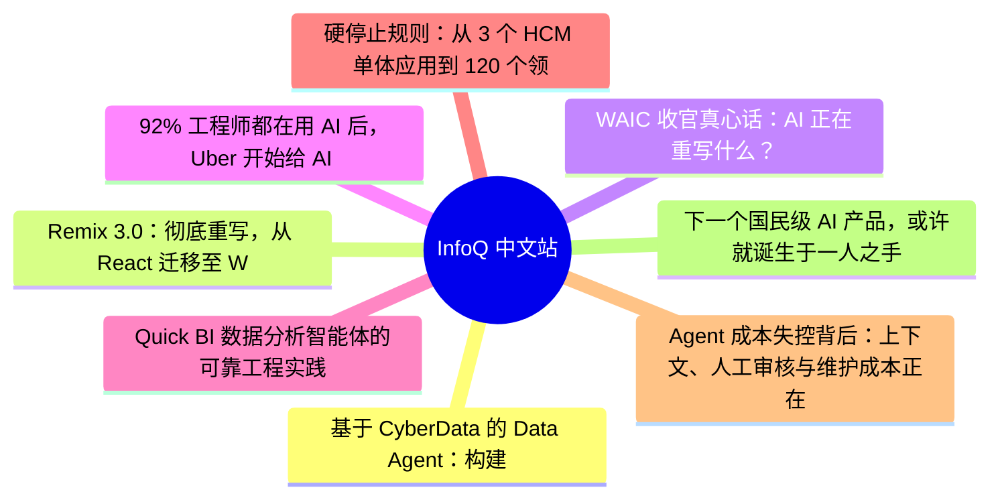
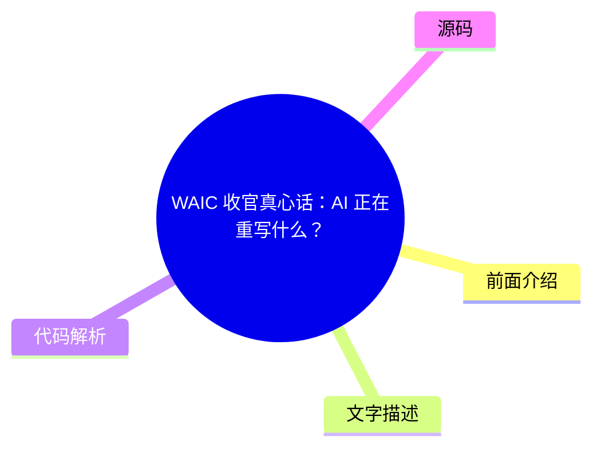
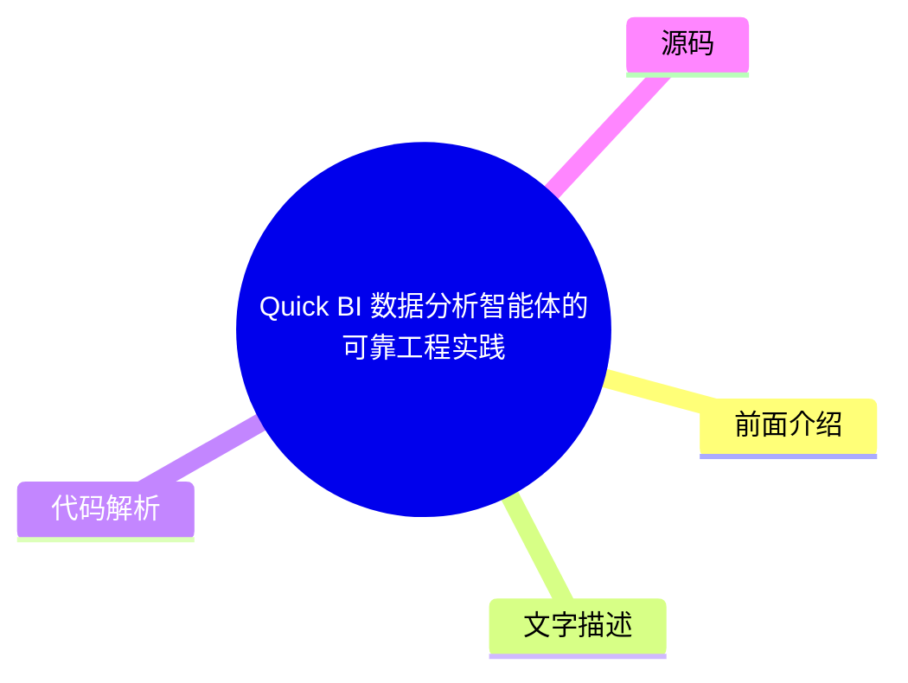
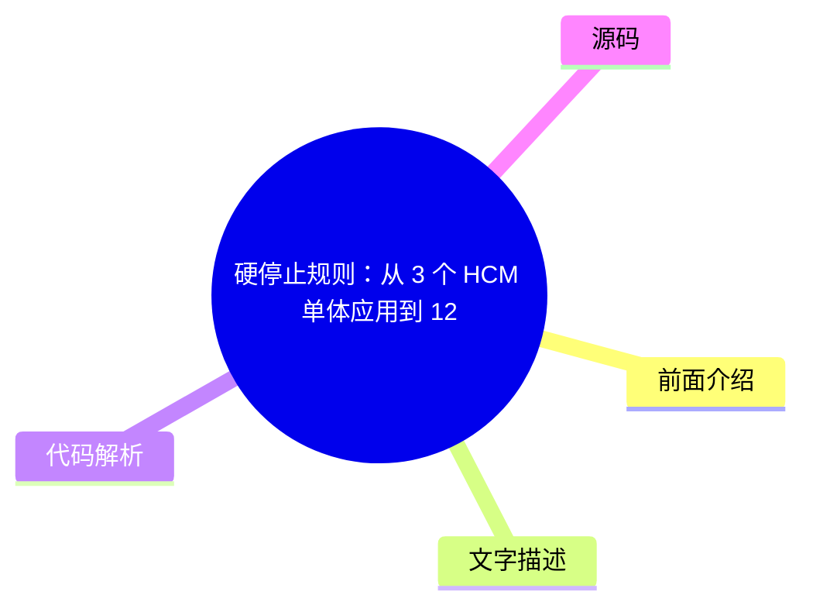

# 📰 InfoQ 中文站 Top 8 (2026-08-02)

## 前面介绍

- 数据源：InfoQ 中文站
- 抓取日期：2026-08-02
- 条目数：8
- 含完整正文：8
- 含代码片段：0
- 组织方式：前面介绍 / 树状图 / 文字描述 / 代码解析 / 源码

## 思维导图

## 详细整理（8 条，8 条含全文，0 条含代码）

### 1. 基于 CyberData 的 Data Agent：构建企业数据智能中枢的工程范式
- **链接**: [https://www.infoq.cn/article/5KYVt93chdBrtDsvTEcK?utm_source=rss&utm_medium=article](https://www.infoq.cn/article/5KYVt93chdBrtDsvTEcK?utm_source=rss&utm_medium=article)
- **发布**: Sun, 02 Aug 2026 10:00:00 GMT

#### 前面介绍

- 从 Copilot 到 Agent，数据系统的角色从支撑报表转向为智能体提供可理解、可追溯的数据服务。
- 提出可记忆的公式 SRW + GPME，将数据研发做成可复制的系统能力。
- 解决数据沉睡与 AI 悬浮并存的困境，实现从人机协同到目标委派的自主阶段。

#### 树状图

#### 文字描述

- 企业 AI 从 Copilot 走向 Agent 时，数据系统的角色被重写，不再只是支撑报表与训练，而是要为智能体提供可理解、可访问、可追溯、可治理的数据服务。
- 真正的困境往往不是「没有模型」，而是数据沉睡与 AI 悬浮并存——资产存而不通、通而不用。
- 通用 Agent 会聊天、会调工具，却进不了核心数据研发与治理流程，不敢被委派目标后自主跑通闭环。
- CyberData 中的 Data Agent 提出构建企业数据智能中枢的工程范式，用 SRW（Skill·Role·Workflow）把数据研发做成可复制的系统能力。
- 用 GPME（Goal·Policy·Memory·Eval）回答如何从「人机协同操作」工程化走到「目标委派、结果审阅」的自主阶段。
- 分享会明确与「分析可信」「Runtime 可控」议题的边界，本场聚焦数据供给与治理中枢，以及研发/治理闭环如何被 Agent 安全地规模化。

#### 代码解析

- 本文未提供源码，以下为实现思路或结构解析
- SRW 模型：Skill（原子能力+契约规范）、Role（研发动线身份+权限边界）、Workflow（主链完整/分支敏捷+节点级I/O门禁）。
- GPME 模型：Goal（目标+验收）、Policy（风险分级放权+HITL门禁）、Memory（组织口径/纠错分层沉淀）、Eval（达成率/介入率解锁自主度）。

#### 源码

#### 中文节选

Agent 时代，哪些方向正在成为行业关键变量？50 + 实战案例揭晓答案！

模型参数规模不断突破，推理成本持续下降，开源生态日益繁荣。当模型能力逐渐成为行业共识，一个新的问题开始浮现：**当人人都能获得强大的模型能力之后，真正的竞争力还剩下什么？** 答案正在从模型能力本身，转向围绕模型构建可规模化的智能系统；从单点能力提升，转向系统工程与组织级落地能力。

在这一背景下，[2026 年 AICon 人工智能开发与应用大会 · 深圳站](https://aicon.infoq.cn/2026/shenzhen/track)正式启动。本次大会将于** 8 月 21 日—22 日**举办，聚焦 AI 基础设施、大模型系统、智能体工程、数据智能、多模态技术与行业落地等关键方向，邀请来自腾讯、阿里、华为、百度、蚂蚁集团等 50 + 头部科技企业技术负责人、科研机构一线专家，系统性分享前沿洞察与实战干货，共同探讨 AI 技术从能力到系统、从实验到生产的真实路径。

数新智能总架构师许锡彬已确认出席 “[智能体时代的数据供给与治理](https://aicon.infoq.cn/2026/shenzhen/track/1954)” 专题，并发表题为**《**[基于 CyberData 的 Data Agent：构建企业数据智能中枢的工程范式](https://aicon.infoq.cn/2026/shenzhen/presentation/7205)**》**的主题分享。

随着企业 AI 从 Copilot 走向 Agent，数据系统的角色正在被重写：它不再只是支撑报表与训练，而是要为智能体提供可理解、可访问、可追溯、可治理的数据服务。企业真正的困境往往不是「没有模型」，而是数据沉睡与 AI 悬浮并存——资产存而不通、通而不用；通用 Agent 会聊天、会调工具，却进不了核心数据研发与治理流程，更不敢被委派目标后自主跑通闭环。

本次分享围绕 CyberData 中的 Data Agent，提出构建企业数据智能中枢的工程范式。他们将给出一个可记忆的公式 **SRW + GPME**：用 Skill · Role · Workflow（执行三角）把数据研发做成可复制的系统能力；用 Goal · Policy · Memory · Eval（治理四件套）回答如何从「人机协同操作」工程化走到「目标委派、结果审阅」的自主阶段。分享会明确与同场「分析可信」「Runtime 可控」议题的边界：本场聚焦数据供给与治理中枢，以及研发/治理闭环如何被 Agent 安全地规模化。

许锡彬，数新智能总架构师，近 20 年大数据、数据中台、大模型智能 Agent 研发管理经验。先后任职阿里云、数澜科技、华廷数据，历任高级技术专家、CTO，曾主导 DataWorks、AIMaster&Zerg、数栖平台等多款核心产品落地应用，统筹操盘行业亿级大数据重点项目。具有顶尖技术架构能力，精通大数据平台、数据中台、业务中台、知识图谱、智能 Agent 等架构搭建。他在本次会议的详细演讲内容如下：

演讲提纲：

1. 智能体时代，为何需要数据智能中枢

从 Copilot 到 Agent：数据平台角色变迁

双重困境：数据沉睡与 AI 悬浮

三阶段定位：辅助 → 协同 → 自主，当前关键在 2→3

2. 中枢最小架构：让 Agent「吃得到、用得对、留得住痕迹」

CyberData 底座：湖仓一体、统一调度、资产与元数据工具面

语义与资产层：口径、血缘、指标——中枢大脑

MCP 工具面：业务增强优先、平台原生兜底

一图看懂：底座 → 语义 → Agent → 研发/治理/运维闭环

3. 范式内核 SRW：把专家经验变成可执行系统通用 AI 在数据研发上的四个失败：不稳、难学、无闭环、无语义

Skill：原子能力 + 契约与规范前置（可测、可追溯）

Role：研发动线身份 + 权限与协作边界

Workflow：主链完整 / 分支敏捷，节点级 I/O 与门禁

微案例：从需求文档到建模产物的分钟级闭环切片

4. 治理四件套 GPME：工程化走到阶段 3 的钥匙

Goal：产品单元从「会话」升级为「目标 + 验收」

Policy：按读/写/生产变更等风险分级放权，HITL 从逐步确认变为少而硬的门禁

Memory：组织口径、纠错与最佳实践分层沉淀

Eval：用达成率/介入率等指标解锁自主度，外环回写 Skill（人审合入）

公式收束：SRW 负责做完，GPME 负责做对、做稳、做越来越强

5. 实践收益、能力边界与行动建议

效能与规范：端到端达成率、规范执行率、人日到分钟的跃迁

坦诚边界：语义冷启动、写生产强门禁、跨域自进化未完成

实践痛点

1. 会聊天不等于能进生产。通用 Agent 可以生成 SQL、调用工具，但缺业务语义、缺规范门禁、缺发布闭环时，结果是「可用但不可信」——研发仍要人肉托底，管理者看到的只是 Demo 效率，不是生产效率。

2. 协同很忙，自主不敢。人机协同阶段 Agent 已能接管大量操作，但目标拆解、写生产、上线发布仍处处人工点头。不敢放权，是因为没有 Goal 验收、没有风险策略、没有评测仪表盘——自主变成了「更长的 ReAct」，不是可委派系统。

3. 规范靠人，规模化必垮。命名、分层、生命周期、质量规则若只写在文档和专家脑子里，Agent 跑得越快，低水平重复和口径漂移越快。没有「规范进 Skill / 校验进门禁」，提效与「做对」必然打架。

4. 分析可信、执行可控之外，供给中枢缺位最致命。问数要准、动作要稳，前提都是底层数据可理解、可治理、可审计。若中枢缺位，两端都会在真实业务里翻车——企业缺的往往不是又一个 Bot，而是 Agent 时代的数据供给与治理操作系统。

听众收益

1. 一套可对外复述的中枢心智：数据智能中枢 = 可调用底座 + 语义大脑 + Agent 闭环

2. 一个记忆锚点公式：SRW + GPME（执行三角 · 治理四件套），可用于设计自家 Data Agent 范式

3. 一条从阶段 2 到阶段 3 的工程路径：Goal 对象化、Policy 门禁、Memory 沉淀、Eval 解锁自主度

4. MCP 双向集成策略：业务增强优先、平台原生兜底，兼顾贴合度与完备性

5. 一份可执行的起步清单：Skill 拆解、Role 定义、主链 Workflow、HITL 风险分级与评测看板

除此之外，本次大会还策划了[AI Infra、推理工程与异构计算](https://aicon.infoq.cn/2026/shenzhen/track/1949)、[超级个体与蜂群智能的共生进化](https://aicon.infoq.cn/2026/shenzhen/track/1950)、[迈向机器人 AGI 的关键技术与产业实践](https://aicon.infoq.cn/2026/shenzhen/track/1952)、[Agent 安全：从风险到可控](https://aicon.infoq.cn/202

#### 完整正文（中文）

Agent 时代，哪些方向正在成为行业关键变量？50 + 实战案例揭晓答案！

模型参数规模不断突破，推理成本持续下降，开源生态日益繁荣。当模型能力逐渐成为行业共识，一个新的问题开始浮现：**当人人都能获得强大的模型能力之后，真正的竞争力还剩下什么？** 答案正在从模型能力本身，转向围绕模型构建可规模化的智能系统；从单点能力提升，转向系统工程与组织级落地能力。

在这一背景下，[2026 年 AICon 人工智能开发与应用大会 · 深圳站](https://aicon.infoq.cn/2026/shenzhen/track)正式启动。本次大会将于** 8 月 21 日—22 日**举办，聚焦 AI 基础设施、大模型系统、智能体工程、数据智能、多模态技术与行业落地等关键方向，邀请来自腾讯、阿里、华为、百度、蚂蚁集团等 50 + 头部科技企业技术负责人、科研机构一线专家，系统性分享前沿洞察与实战干货，共同探讨 AI 技术从能力到系统、从实验到生产的真实路径。

数新智能总架构师许锡彬已确认出席 “[智能体时代的数据供给与治理](https://aicon.infoq.cn/2026/shenzhen/track/1954)” 专题，并发表题为**《**[基于 CyberData 的 Data Agent：构建企业数据智能中枢的工程范式](https://aicon.infoq.cn/2026/shenzhen/presentation/7205)**》**的主题分享。

随着企业 AI 从 Copilot 走向 Agent，数据系统的角色正在被重写：它不再只是支撑报表与训练，而是要为智能体提供可理解、可访问、可追溯、可治理的数据服务。企业真正的困境往往不是「没有模型」，而是数据沉睡与 AI 悬浮并存——资产存而不通、通而不用；通用 Agent 会聊天、会调工具，却进不了核心数据研发与治理流程，更不敢被委派目标后自主跑通闭环。

本次分享围绕 CyberData 中的 Data Agent，提出构建企业数据智能中枢的工程范式。他们将给出一个可记忆的公式 **SRW + GPME**：用 Skill · Role · Workflow（执行三角）把数据研发做成可复制的系统能力；用 Goal · Policy · Memory · Eval（治理四件套）回答如何从「人机协同操作」工程化走到「目标委派、结果审阅」的自主阶段。分享会明确与同场「分析可信」「Runtime 可控」议题的边界：本场聚焦数据供给与治理中枢，以及研发/治理闭环如何被 Agent 安全地规模化。

许锡彬，数新智能总架构师，近 20 年大数据、数据中台、大模型智能 Agent 研发管理经验。先后任职阿里云、数澜科技、华廷数据，历任高级技术专家、CTO，曾主导 DataWorks、AIMaster&Zerg、数栖平台等多款核心产品落地应用，统筹操盘行业亿级大数据重点项目。具有顶尖技术架构能力，精通大数据平台、数据中台、业务中台、知识图谱、智能 Agent 等架构搭建。他在本次会议的详细演讲内容如下：

演讲提纲：

1. 智能体时代，为何需要数据智能中枢

从 Copilot 到 Agent：数据平台角色变迁

双重困境：数据沉睡与 AI 悬浮

三阶段定位：辅助 → 协同 → 自主，当前关键在 2→3

2. 中枢最小架构：让 Agent「吃得到、用得对、留得住痕迹」

CyberData 底座：湖仓一体、统一调度、资产与元数据工具面

语义与资产层：口径、血缘、指标——中枢大脑

MCP 工具面：业务增强优先、平台原生兜底

一图看懂：底座 → 语义 → Agent → 研发/治理/运维闭环

3. 范式内核 SRW：把专家经验变成可执行系统通用 AI 在数据研发上的四个失败：不稳、难学、无闭环、无语义

Skill：原子能力 + 契约与规范前置（可测、可追溯）

Role：研发动线身份 + 权限与协作边界

Workflow：主链完整 / 分支敏捷，节点级 I/O 与门禁

微案例：从需求文档到建模产物的分钟级闭环切片

4. 治理四件套 GPME：工程化走到阶段 3 的钥匙

Goal：产品单元从「会话」升级为「目标 + 验收」

Policy：按读/写/生产变更等风险分级放权，HITL 从逐步确认变为少而硬的门禁

Memory：组织口径、纠错与最佳实践分层沉淀

Eval：用达成率/介入率等指标解锁自主度，外环回写 Skill（人审合入）

公式收束：SRW 负责做完，GPME 负责做对、做稳、做越来越强

5. 实践收益、能力边界与行动建议

效能与规范：端到端达成率、规范执行率、人日到分钟的跃迁

坦诚边界：语义冷启动、写生产强门禁、跨域自进化未完成

实践痛点

1. 会聊天不等于能进生产。通用 Agent 可以生成 SQL、调用工具，但缺业务语义、缺规范门禁、缺发布闭环时，结果是「可用但不可信」——研发仍要人肉托底，管理者看到的只是 Demo 效率，不是生产效率。

2. 协同很忙，自主不敢。人机协同阶段 Agent 已能接管大量操作，但目标拆解、写生产、上线发布仍处处人工点头。不敢放权，是因为没有 Goal 验收、没有风险策略、没有评测仪表盘——自主变成了「更长的 ReAct」，不是可委派系统。

3. 规范靠人，规模化必垮。命名、分层、生命周期、质量规则若只写在文档和专家脑子里，Agent 跑得越快，低水平重复和口径漂移越快。没有「规范进 Skill / 校验进门禁」，提效与「做对」必然打架。

4. 分析可信、执行可控之外，供给中枢缺位最致命。问数要准、动作要稳，前提都是底层数据可理解、可治理、可审计。若中枢缺位，两端都会在真实业务里翻车——企业缺的往往不是又一个 Bot，而是 Agent 时代的数据供给与治理操作系统。

听众收益

1. 一套可对外复述的中枢心智：数据智能中枢 = 可调用底座 + 语义大脑 + Agent 闭环

2. 一个记忆锚点公式：SRW + GPME（执行三角 · 治理四件套），可用于设计自家 Data Agent 范式

3. 一条从阶段 2 到阶段 3 的工程路径：Goal 对象化、Policy 门禁、Memory 沉淀、Eval 解锁自主度

4. MCP 双向集成策略：业务增强优先、平台原生兜底，兼顾贴合度与完备性

5. 一份可执行的起步清单：Skill 拆解、Role 定义、主链 Workflow、HITL 风险分级与评测看板

除此之外，本次大会还策划了[AI Infra、推理工程与异构计算](https://aicon.infoq.cn/2026/shenzhen/track/1949)、[超级个体与蜂群智能的共生进化](https://aicon.infoq.cn/2026/shenzhen/track/1950)、[迈向机器人 AGI 的关键技术与产业实践](https://aicon.infoq.cn/2026/shenzhen/track/1952)、[Agent 安全：从风险到可控](https://aicon.infoq.cn/2026/shenzhen/track/1953)、[大模型效率工程与 Agent 系统实践](https://aicon.infoq.cn/2026/shenzhen/track/1955)、[AI Agent 高价值商业场景实战](https://aicon.infoq.cn/2026/shenzhen/track/1958)等 10 个专题论坛，届时将有来自不同行业、不同领域、不同企业的 50+资深专家在现场带来前沿技术洞察和一线实践经验。

AICon 全球人工智能开发与应用大会·深圳站，限时 9 折专属优惠，现在报名立减 580，更多详情可扫码或联系票务经理 13269078023 进行咨询。

### 2. Remix 3.0：彻底重写，从 React 迁移至 Web 平台原生能力
- **链接**: [https://www.infoq.cn/article/s8IA8KgdrizgCEsQAOXr?utm_source=rss&utm_medium=article](https://www.infoq.cn/article/s8IA8KgdrizgCEsQAOXr?utm_source=rss&utm_medium=article)
- **发布**: Sun, 02 Aug 2026 09:11:00 GMT

#### 前面介绍

- Remix 3.0 是一次从底层重新构建的版本，将项目从 React 迁移到了 Web 平台原生基础能力之上。
- 框架定位从「中心栈」变为完整的全栈体系，路由、请求处理、中间件、会话等能力统一纳入。
- 放弃 React 运行时，采用基于 Preact 的分支版本和命令式模型，状态变为普通变量。

#### 树状图

#### 文字描述

- Remix 3.0 由 React Router 团队打造，将框架重新定位为一个完整的全栈体系，路由、请求处理器、中间件、会话、身份认证、表单、上传、资源、数据和数据库管理等能力都纳入统一的 remix 体系。
- 路由现在是基于 Fetch API 的路由，控制器返回 Web Response 对象，表单提交到 URL，请求生命周期由服务器负责管理。
- 前端方面，Remix 保留了 JSX，但移除了 React 运行时，转而采用一个基于 Preact 的分支版本以及命令式模型，状态只是一个普通变量，调用 this.update() 表示内容变化。
- 事件系统使用统一的 on 属性，异步任务通过标准的 AbortController 信号进行取消，服务器驱动 UI 通过「frames」实现，这是一种带有 src 属性的服务器渲染片段。
- 引入「unbundling」理念，运行时成为事实来源，资源由 Remix 编译并提供服务，import 语句不再拥有特殊语义。
- 现有 Remix 2 应用被引导迁移到 React Router v7，Remix 3 被定位为一次重新开始。

#### 代码解析

- 本文未提供源码，以下为实现思路或结构解析
- 命令式模型示例：状态作为普通变量，通过 this.update() 触发视图更新，而非 React 的声明式渲染。
- 服务器驱动 UI 示例：使用带有 src 属性的 frame 元素，由服务器渲染片段并独立加载，类似于 HTMX 的交互方式。

#### 源码

#### 中文节选

Remix，这个由 React Router 背后团队打造的全栈 Web 框架，已经发布了 [Remix 3 beta 预览版](https://remix.run/blog/remix-3-beta-preview)。这是一次从底层重新构建的版本，将项目从 React 迁移到了 Web 平台原生基础能力之上。

由联合创始人 Michael Jackson 宣布的 Remix 3，将框架重新定位为一个完整的全栈体系，而不再是早期版本所处的“中心栈”（center stack）——仅负责路由和渲染。如今，它将路由、请求处理器、中间件、会话、身份认证、表单、上传、资源、数据和数据库管理、UI 组件、主题、网络以及测试等能力，都纳入统一的 remix 体系之下，并通过小型可组合的软件包构建。目前，该预览版本为 [v3.0.0-beta.5](https://github.com/remix-run/remix/releases)，团队表示未来将每周持续发布新版本。

其中许多变化都属于架构层面的调整。路由现在是基于 Fetch API 的路由，控制器返回 Web Response 对象，表单提交到 URL，因此请求生命周期由服务器负责管理。在前端方面，Remix 保留了 JSX，但移除了 React 运行时，转而采用一个基于 Preact 的分支版本以及命令式模型。在这种模型中，状态只是一个普通变量，而调用 this.update() 则表示某些内容发生了变化。

事件系统使用统一的 on 属性，异步任务通过标准的 AbortController 信号进行取消，而服务器驱动 UI 则通过“frames”实现——这是一种带有 src 属性的服务器渲染片段，可以独立加载和重新加载。这种方式被一些观察者认为类似于 [HTMX](https://frantic.im/remix-3/)。Remix 还引入了“unbundling”（取消打包）的理念，其中运行时而不是打包器成为事实来源，资源由 Remix 编译并提供服务，而 import 语句不再拥有特殊语义。

社区对此的评价明显分化。在自己的博客中，Alex Kotliarskyi 称 [Remix 3](https://frantic.im/remix-3/) 是“Next.js 本该成为的 Grug Brain 版本”，并认为这标志着从函数式编程向命令式编程的钟摆正在摆回。

Kent C. Dodds 则强调了该框架依赖的一项 TypeScript 技巧，即像参数一样对 this 进行类型定义。

Zenn 上的一篇实践[评测](https://zenn.dev/coji/articles/remix-3-beta-firstlook?locale=en)认为，“单一软件包、接近 Web 标准、显式优于约定”的设计非常适合 AI 辅助编程，不过作者也认为它目前仍处于不适合生产环境的早期阶段。

质疑者则主要关注生态变化带来的成本。一篇在 [r/reactjs](https://www.reddit.com/r/reactjs/comments/1t6cej2/remix_changed_the_direction_yet_again_this_time/) 中广受关注的讨论认为 Remix 已经“完全无法辨认”，并将其与 Next.js 进行了比较：

……你爱怎么喷 Next.js 都行，它的大版本升级确实经常搞事情，也经常让旧代码崩掉。但至少它一直还是那个做 SSR 的框架。Remix 现在倒好，已经彻底变成另一个东西了，完全看不出以前那个 Remix 的影子……

在 [Hacker News](https://news.ycombinator.com/item?id=47967218) 上，一名开发者质疑 Remix 3 相比 React Router 加 Vite 的价值所在，而其他人则指出该团队“因频繁破坏性改动而闻名”。

迁移并不是一次简单的升级。由于 Remix 3 放弃了 React，现有的 Remix 2 应用被引导迁移到 [React Router v7](https://reactrouter.com/) 作为后续路线，而 Remix 3 则被定位为一次重新开始，正如《[Wake Up, Remix](https://remix.run/blog/wake-up-remix)》一文中所描述的那样。早期采用者已经在[公开迁移 PR](https://github.com/coji/remix-task-manager/pull/8) 中记录了完整重写过程。

与 Next.js、SolidStart 和 SvelteKit 相比，Remix 3 是目前最激进的一次押注——选择 Web 标准，而不是框架抽象。开发者现在可以通过以下命令体验它：

`npx remix@next new my-remix-app`

Remix 是一个开源的全栈 Web 框架，由 React Router 背后的团队创建，并由 [Shopify](https://www.shopify.com/) 维护。Shopify 于 2022 年收购了该项目。该项目采用 MIT 许可证发布，源码以及每周发布的 beta 版本均可在 [GitHub](https://github.com/remix-run/remix) 上获取。

原文链接：

#### 完整正文（中文）

Remix，这个由 React Router 背后团队打造的全栈 Web 框架，已经发布了 [Remix 3 beta 预览版](https://remix.run/blog/remix-3-beta-preview)。这是一次从底层重新构建的版本，将项目从 React 迁移到了 Web 平台原生基础能力之上。

由联合创始人 Michael Jackson 宣布的 Remix 3，将框架重新定位为一个完整的全栈体系，而不再是早期版本所处的“中心栈”（center stack）——仅负责路由和渲染。如今，它将路由、请求处理器、中间件、会话、身份认证、表单、上传、资源、数据和数据库管理、UI 组件、主题、网络以及测试等能力，都纳入统一的 remix 体系之下，并通过小型可组合的软件包构建。目前，该预览版本为 [v3.0.0-beta.5](https://github.com/remix-run/remix/releases)，团队表示未来将每周持续发布新版本。

其中许多变化都属于架构层面的调整。路由现在是基于 Fetch API 的路由，控制器返回 Web Response 对象，表单提交到 URL，因此请求生命周期由服务器负责管理。在前端方面，Remix 保留了 JSX，但移除了 React 运行时，转而采用一个基于 Preact 的分支版本以及命令式模型。在这种模型中，状态只是一个普通变量，而调用 this.update() 则表示某些内容发生了变化。

事件系统使用统一的 on 属性，异步任务通过标准的 AbortController 信号进行取消，而服务器驱动 UI 则通过“frames”实现——这是一种带有 src 属性的服务器渲染片段，可以独立加载和重新加载。这种方式被一些观察者认为类似于 [HTMX](https://frantic.im/remix-3/)。Remix 还引入了“unbundling”（取消打包）的理念，其中运行时而不是打包器成为事实来源，资源由 Remix 编译并提供服务，而 import 语句不再拥有特殊语义。

社区对此的评价明显分化。在自己的博客中，Alex Kotliarskyi 称 [Remix 3](https://frantic.im/remix-3/) 是“Next.js 本该成为的 Grug Brain 版本”，并认为这标志着从函数式编程向命令式编程的钟摆正在摆回。

Kent C. Dodds 则强调了该框架依赖的一项 TypeScript 技巧，即像参数一样对 this 进行类型定义。

Zenn 上的一篇实践[评测](https://zenn.dev/coji/articles/remix-3-beta-firstlook?locale=en)认为，“单一软件包、接近 Web 标准、显式优于约定”的设计非常适合 AI 辅助编程，不过作者也认为它目前仍处于不适合生产环境的早期阶段。

质疑者则主要关注生态变化带来的成本。一篇在 [r/reactjs](https://www.reddit.com/r/reactjs/comments/1t6cej2/remix_changed_the_direction_yet_again_this_time/) 中广受关注的讨论认为 Remix 已经“完全无法辨认”，并将其与 Next.js 进行了比较：

……你爱怎么喷 Next.js 都行，它的大版本升级确实经常搞事情，也经常让旧代码崩掉。但至少它一直还是那个做 SSR 的框架。Remix 现在倒好，已经彻底变成另一个东西了，完全看不出以前那个 Remix 的影子……

在 [Hacker News](https://news.ycombinator.com/item?id=47967218) 上，一名开发者质疑 Remix 3 相比 React Router 加 Vite 的价值所在，而其他人则指出该团队“因频繁破坏性改动而闻名”。

迁移并不是一次简单的升级。由于 Remix 3 放弃了 React，现有的 Remix 2 应用被引导迁移到 [React Router v7](https://reactrouter.com/) 作为后续路线，而 Remix 3 则被定位为一次重新开始，正如《[Wake Up, Remix](https://remix.run/blog/wake-up-remix)》一文中所描述的那样。早期采用者已经在[公开迁移 PR](https://github.com/coji/remix-task-manager/pull/8) 中记录了完整重写过程。

与 Next.js、SolidStart 和 SvelteKit 相比，Remix 3 是目前最激进的一次押注——选择 Web 标准，而不是框架抽象。开发者现在可以通过以下命令体验它：

`npx remix@next new my-remix-app`

Remix 是一个开源的全栈 Web 框架，由 React Router 背后的团队创建，并由 [Shopify](https://www.shopify.com/) 维护。Shopify 于 2022 年收购了该项目。该项目采用 MIT 许可证发布，源码以及每周发布的 beta 版本均可在 [GitHub](https://github.com/remix-run/remix) 上获取。

原文链接：

### 3. WAIC 收官真心话：AI 正在重写什么？
- **链接**: [https://www.infoq.cn/article/D9d8F0SUE4gCrXbbyU8N?utm_source=rss&utm_medium=article](https://www.infoq.cn/article/D9d8F0SUE4gCrXbbyU8N?utm_source=rss&utm_medium=article)
- **发布**: Sat, 01 Aug 2026 17:20:20 GMT

#### 前面介绍

- AI 正在重写工作流、产业链和技术范式，从数字世界走向物理世界。
- 具身智能被视为移动互联网时代的 iPhone，是设备层，未来将围绕其产生应用生态。
- 真实需求主要集中在 Coding 和日常办公场景，伪需求则多见于没有真正用语言模型解决问题的产品。

#### 树状图

#### 文字描述

- AI 首先重写的是「速率」，很多事情的完成速度被重新定义，如编程效率提升 10 倍以上，内容生成以指数级速度提升。
- AI 正在重写「边界」，从数字世界走向物理世界，具身智能能进入不确定、开放的环境，扩展人类能力的边界。
- AI 正在重写工作和生活方式，从云端走向本地端，本地模型的兴起是为了守住隐私，普通人也可以用它进行创作。
- AI 的 Coding 能力提升很快，已能参与更长程、底层的任务，如模型 serving、infra 工作，甚至自己写加速算子。
- 具身智能离「稳定干活」还有距离，目前 locomotion（底盘、双足、四足）已进入真实场景，但 manipulation（灵巧操作）仍是圣杯。
- 判断具身智能是否真正落地，标准是机器人推到客户那里后，工程师走了客户第二天愿不愿意自己开机使用。

#### 代码解析

- 本文未提供源码，以下为实现思路或结构解析
- 从移动互联到 AI 的产业节奏：底层算力最先赚钱，中间是云和设备，最后才是贴近消费者的应用。
- 具身智能的落地标准：客户持续使用而非吃灰，证明其具备真实价值。

#### 源码

#### 中文节选

在 WAIC 2026 的最后一天，InfoQ 直播间迎来收官特别圆桌。过去三天，我们把镜头带进主论坛、展区和一线发布现场，也对话了各路技术负责人、创业者、投资人和 AI Builder，从大模型、Agent，聊到到具身智能、AI Infra、AI for Science，几乎每一个热词都被重新聚焦了一遍。

但行业越是喧嚣，从业者越需要回归理性与本质：哪些变化真的发生了，哪些还只是 Demo、概念和资本故事？AI 到底是在重写工作流、产业链、技术范式，还是只是用新的语言重复上一轮技术周期？

围绕这个问题，InfoQ 邀请到四位来自不同位置的一线观察者：

- 上海交通大学人工智能学院教授、源络科技创始人连文昭，长期关注具身智能与机器人产业落地； 
- 语生科学首席科学家郭权玮，身处在产研孵化一线，判断 AI 真需求、本地智能体和新模型范式； 
- 扩散智能联合创始人、香港大学博士生龚珊三，从扩散语言模型和基础模型路线切入创业； 
- 未可知人工智能研究院院长、前红杉资本中国基金投资副总裁杜雨，带来资本周期、商业化和产业收入视角。 

这场讨论并非简单复盘 WAIC 的热闹，而是试图把热词放回真实场景里检验：AI 是否真的改变了人的工作方式？哪些应用已经进入业务生产？具身智能离“稳定干活”还有多远？Scaling Law 之后，模型范式会往哪里走？未来一年，钱、人才和算力又会流向哪些方向？以下是圆桌的实录整理。

## 一、AI 在重写什么

**01｜InfoQ：过去几天，我们带着问题在 WAIC 现场走了很多展台，也和来自不同公司的嘉宾聊了许多变化。今天这场收官圆桌，想请大家一起回到一个核心问题：AI 到底正在重写什么？它可能是一个场景、一条生产链，也可能是一种工作方式。过去一年或半年里，哪件被 AI 重写的事情让你印象最深？**

**连文昭：**我觉得 AI 首先重写的是“速率”。很多事情的完成速度被重新定义了，比如编程，以前可能需要很久，现在效率可以提升 10 倍、20 倍，甚至更多。内容生成也是一样，文字、视频、宣传物料等，都在以指数级速度提升。

但我更期待 AI 重写的是“边界”。现在很多 AI 的价值还是把人本来要做的事情做得更快，但我更希望它去做人不愿意干、或者人干不了的事情。比如 AI for Science 里，AlphaFold 就是一个典型例子，它把过去很难解决的蛋白质结构预测问题变成了可能。

再往后，我更期待 AI 从数字世界走向物理世界。具身智能为什么重要，是因为过去工业机器人主要面向结构化、确定性的生产环境，通过预设程序完成高重复性任务。但未来智能机器人如果能进入不确定、开放的环境，比如家庭、服务、养老等场景，它真正扩展的是人类能力的边界。

**郭权玮：**AI 正在重写我们的工作和生活方式。过去做 PPT，需要打开特定软件，手动调整格式和内容；现在，我们可以通过智能助手直接生成、修改，甚至重塑整个工作流程。

但更关键的变化是，我们正在从完全依赖云端，走向“在本地端就能完成”。“破圈”很重要。以前 AI 几乎是程序员群体专属，但现在普通人也可以用它写歌、做创作。问题在于：你是否愿意把自己的数据、记忆和文件都上传到云端？本地模型的兴起，正是为了守住隐私。

所以在我看来，AI 重写的核心，不只是 AI 能做什么，而是你如何定义自己的工作模式。而这个模式能不能成立，取决于你是否信任它、是否愿意把数据交给它。比起“AI 能做什么”，我更关注“怎么用”，以及它如何真正走进普通人的日常。

**龚珊三：**我会从更具体的科研和技术角度来看。过去一年，AI 的 Coding 能力提升非常快。以前它可能只能完成一些简单代码任务，现在已经可以参与更长程、更底层的任务，比如模型 serving、infra 相关工作，甚至可以自己写加速算子。

在科研里，我们现在也基本离不开 AI。它是一个非常好的执行者。未来如果它的思维方式和 planning 能力进一步提升，再配合已经很强的执行能力，就有可能逐步参与更前沿的科学研究，甚至帮助人类开展更复杂的探索。

**杜雨：**我对“重写”这个词的理解可能不太一样。很多人会把它理解成重新改写，但我第一反应是“重复写”。AI 确实改变了一些事情，但从商业规律看，它也在重复互联网时代的路径。

移动互联网大概经历过三波浪潮：第一波是高通、ARM 这类芯片公司受益；第二波是云计算和设备层，比如苹果、三星；第三波才是应用层，比如谷歌、亚马逊。现在 AI 也有类似节奏：底层算力最先赚钱，中间是云和设备，最后才会轮到真正贴近消费者的应用。

今年 WAIC 的场馆结构也很有意思。H1 更多是大模型和应用，H2 是算力和芯片，H3 则是具身智能。从现场体感和参展结构来看，今年 WAIC 几乎可以说是“世界具身智能大会”。在我看来，具身智能更像移动互联网时代的 iPhone 或三星，是设备层。未来如果每个人家里都有机器人，真正更大的市场，可能不是这台机器本身，而是围绕机器人的每一个动作、每一个能力、每一个服务产生的应用生态。

**02｜InfoQ：AI 用多了以后，大家会不会担心自己的某些能力退化？过去需要自己思考和完成的事情，现在 AI 直接给出答案，这会不会削弱人的能力？**

**连文昭：**一些机械性的、辅助性的事情可以交给 AI，但核心的创造力、拓展边界、提升维度这些事情，我认为 AI 还是比人差不少。真正关键的东西，还是要人自己去做。

**郭权玮：**这个时代的关键，是你怎么思考问题、定义问题，以及是否真的清楚一件事该怎么做。AI 很难替代真正的专业人员。

比如创作漫画，作为编辑，最重要的永远是故事本身。你可以用 AI 生成很多画面、很多版本，但故事属于你自己。你得清楚自己要做什么，也要知道过程中每一步怎么验证，什么是对，什么是错。这才是比工具更值得关注的能力。

**龚珊三：**从我的使用体验来看，AI 确实比我知道得多，但我不认为它会替代我。尤其做科研，需要完整、严密的思维方式。AI 可以回答问题，但能提出好问题、能发现关键细节，这本身不是所有人都具备的能力。

我也会有一点担心：我们这一代人在 AI 大规模普及之前，经历过比较严谨的科研训练。但现在更年轻的一代，可能一开始做研究就有 AI 帮忙，这会不会让他们跳过一些本该经历的训练？这件事还不好简单判断。

**杜雨：**我反而很感谢 AI。做自媒体时，我发现自己有很强的知识诅咒，经常不知道大众不知道什么。我会使用很多自己以为大家都懂的专业词汇，但网友未必能理解。用了 AI 之后，它能帮我把专业内容讲给更多没有背景知识的人，我的视频数据也变好了。

所以我觉得 AI 不只是语言之间的翻译，它也在帮助不同学科背景、不同教育背景、不同城市的人互相理解。这不是重写，而是增强。

## 二、需求真伪

**03｜InfoQ：现在很多 AI 产品、机器人和解决方案都在展示。大家看来，哪些已经真正进入业务生产？哪些热度明显高过实际落地价值？**

**杜雨：**我感触最深的是，大厂的一些业务已经实实在在产生收入。比如 AI 生成内容，我们讲了好几年，但从过去一两年的数据看，快手可

#### 完整正文（中文）

在 WAIC 2026 的最后一天，InfoQ 直播间迎来收官特别圆桌。过去三天，我们把镜头带进主论坛、展区和一线发布现场，也对话了各路技术负责人、创业者、投资人和 AI Builder，从大模型、Agent，聊到到具身智能、AI Infra、AI for Science，几乎每一个热词都被重新聚焦了一遍。

但行业越是喧嚣，从业者越需要回归理性与本质：哪些变化真的发生了，哪些还只是 Demo、概念和资本故事？AI 到底是在重写工作流、产业链、技术范式，还是只是用新的语言重复上一轮技术周期？

围绕这个问题，InfoQ 邀请到四位来自不同位置的一线观察者：

- 上海交通大学人工智能学院教授、源络科技创始人连文昭，长期关注具身智能与机器人产业落地； 
- 语生科学首席科学家郭权玮，身处在产研孵化一线，判断 AI 真需求、本地智能体和新模型范式； 
- 扩散智能联合创始人、香港大学博士生龚珊三，从扩散语言模型和基础模型路线切入创业； 
- 未可知人工智能研究院院长、前红杉资本中国基金投资副总裁杜雨，带来资本周期、商业化和产业收入视角。 

这场讨论并非简单复盘 WAIC 的热闹，而是试图把热词放回真实场景里检验：AI 是否真的改变了人的工作方式？哪些应用已经进入业务生产？具身智能离“稳定干活”还有多远？Scaling Law 之后，模型范式会往哪里走？未来一年，钱、人才和算力又会流向哪些方向？以下是圆桌的实录整理。

## 一、AI 在重写什么

**01｜InfoQ：过去几天，我们带着问题在 WAIC 现场走了很多展台，也和来自不同公司的嘉宾聊了许多变化。今天这场收官圆桌，想请大家一起回到一个核心问题：AI 到底正在重写什么？它可能是一个场景、一条生产链，也可能是一种工作方式。过去一年或半年里，哪件被 AI 重写的事情让你印象最深？**

**连文昭：**我觉得 AI 首先重写的是“速率”。很多事情的完成速度被重新定义了，比如编程，以前可能需要很久，现在效率可以提升 10 倍、20 倍，甚至更多。内容生成也是一样，文字、视频、宣传物料等，都在以指数级速度提升。

但我更期待 AI 重写的是“边界”。现在很多 AI 的价值还是把人本来要做的事情做得更快，但我更希望它去做人不愿意干、或者人干不了的事情。比如 AI for Science 里，AlphaFold 就是一个典型例子，它把过去很难解决的蛋白质结构预测问题变成了可能。

再往后，我更期待 AI 从数字世界走向物理世界。具身智能为什么重要，是因为过去工业机器人主要面向结构化、确定性的生产环境，通过预设程序完成高重复性任务。但未来智能机器人如果能进入不确定、开放的环境，比如家庭、服务、养老等场景，它真正扩展的是人类能力的边界。

**郭权玮：**AI 正在重写我们的工作和生活方式。过去做 PPT，需要打开特定软件，手动调整格式和内容；现在，我们可以通过智能助手直接生成、修改，甚至重塑整个工作流程。

但更关键的变化是，我们正在从完全依赖云端，走向“在本地端就能完成”。“破圈”很重要。以前 AI 几乎是程序员群体专属，但现在普通人也可以用它写歌、做创作。问题在于：你是否愿意把自己的数据、记忆和文件都上传到云端？本地模型的兴起，正是为了守住隐私。

所以在我看来，AI 重写的核心，不只是 AI 能做什么，而是你如何定义自己的工作模式。而这个模式能不能成立，取决于你是否信任它、是否愿意把数据交给它。比起“AI 能做什么”，我更关注“怎么用”，以及它如何真正走进普通人的日常。

**龚珊三：**我会从更具体的科研和技术角度来看。过去一年，AI 的 Coding 能力提升非常快。以前它可能只能完成一些简单代码任务，现在已经可以参与更长程、更底层的任务，比如模型 serving、infra 相关工作，甚至可以自己写加速算子。

在科研里，我们现在也基本离不开 AI。它是一个非常好的执行者。未来如果它的思维方式和 planning 能力进一步提升，再配合已经很强的执行能力，就有可能逐步参与更前沿的科学研究，甚至帮助人类开展更复杂的探索。

**杜雨：**我对“重写”这个词的理解可能不太一样。很多人会把它理解成重新改写，但我第一反应是“重复写”。AI 确实改变了一些事情，但从商业规律看，它也在重复互联网时代的路径。

移动互联网大概经历过三波浪潮：第一波是高通、ARM 这类芯片公司受益；第二波是云计算和设备层，比如苹果、三星；第三波才是应用层，比如谷歌、亚马逊。现在 AI 也有类似节奏：底层算力最先赚钱，中间是云和设备，最后才会轮到真正贴近消费者的应用。

今年 WAIC 的场馆结构也很有意思。H1 更多是大模型和应用，H2 是算力和芯片，H3 则是具身智能。从现场体感和参展结构来看，今年 WAIC 几乎可以说是“世界具身智能大会”。在我看来，具身智能更像移动互联网时代的 iPhone 或三星，是设备层。未来如果每个人家里都有机器人，真正更大的市场，可能不是这台机器本身，而是围绕机器人的每一个动作、每一个能力、每一个服务产生的应用生态。

**02｜InfoQ：AI 用多了以后，大家会不会担心自己的某些能力退化？过去需要自己思考和完成的事情，现在 AI 直接给出答案，这会不会削弱人的能力？**

**连文昭：**一些机械性的、辅助性的事情可以交给 AI，但核心的创造力、拓展边界、提升维度这些事情，我认为 AI 还是比人差不少。真正关键的东西，还是要人自己去做。

**郭权玮：**这个时代的关键，是你怎么思考问题、定义问题，以及是否真的清楚一件事该怎么做。AI 很难替代真正的专业人员。

比如创作漫画，作为编辑，最重要的永远是故事本身。你可以用 AI 生成很多画面、很多版本，但故事属于你自己。你得清楚自己要做什么，也要知道过程中每一步怎么验证，什么是对，什么是错。这才是比工具更值得关注的能力。

**龚珊三：**从我的使用体验来看，AI 确实比我知道得多，但我不认为它会替代我。尤其做科研，需要完整、严密的思维方式。AI 可以回答问题，但能提出好问题、能发现关键细节，这本身不是所有人都具备的能力。

我也会有一点担心：我们这一代人在 AI 大规模普及之前，经历过比较严谨的科研训练。但现在更年轻的一代，可能一开始做研究就有 AI 帮忙，这会不会让他们跳过一些本该经历的训练？这件事还不好简单判断。

**杜雨：**我反而很感谢 AI。做自媒体时，我发现自己有很强的知识诅咒，经常不知道大众不知道什么。我会使用很多自己以为大家都懂的专业词汇，但网友未必能理解。用了 AI 之后，它能帮我把专业内容讲给更多没有背景知识的人，我的视频数据也变好了。

所以我觉得 AI 不只是语言之间的翻译，它也在帮助不同学科背景、不同教育背景、不同城市的人互相理解。这不是重写，而是增强。

## 二、需求真伪

**03｜InfoQ：现在很多 AI 产品、机器人和解决方案都在展示。大家看来，哪些已经真正进入业务生产？哪些热度明显高过实际落地价值？**

**杜雨：**我感触最深的是，大厂的一些业务已经实实在在产生收入。比如 AI 生成内容，我们讲了好几年，但从过去一两年的数据看，快手可灵、字节即梦、美图等 AI 相关业务都在快速增长，而且不是只有用户增长，而是收入增长。收入增长说明用户愿意为它付费。

具身智能也一样。像宇树，从招股书披露的信息看，机器人业务收入增长很快，而且已经有利润，并不是大家想象中的纯烧钱。所以用户是在用脚投票的。

但每个赛道里也有伪需求。有些公司打着 AI 或机器人旗号，但到现在没有收入，或者亏损远大于收入。到了 AI 下半场，企业必须更认真地思考：你的用户核心场景到底是什么？到底有多少人愿意为什么样的价值付钱？

另外，AI Coding 和办公智能体也已经在进入真实工作流。很多大厂都提到，代码中相当一部分已经由 AI 参与协作完成。写代码正在从程序员专利，变成一种新的工作方式。问题在于，目前 AI 服务的经济账还没完全算明白。搜索时代每次查询成本很低，但 AI 问答的推理成本高得多。如果技术不能继续突破，很多公司会面临越多人用、亏得越多的压力。

**龚珊三：**我觉得真实需求主要集中在 Coding 和日常办公场景，比如帮你写代码、做 PPT、生成网页等，这些确实极大便利了学习和工作。

伪需求则是有些产品没有真正用语言模型解决问题，只是和 AI 扯上一点关系，就开始讲故事。用户真正用过之后会发现，它和以前并没有本质区别，甚至有点多此一举。这类产品更像是为了吸引消费者或资本注意，而不是真正解决需求。

**郭权玮：**我判断 AI 能否真正进入生产，关键看它有没有改变企业或个人的习惯。

比如 Palantir，它提出了一个很有意思的概念，叫 Ontology。它会派驻很多 FDE，也就是 Forward Deployed Engineer，直接进入企业现场，了解这家公司的人员配置、设备情况、工作流程和验证标准。只有把这些搞清楚，AI 才能真正在企业里用起来。只是给一个框架让企业套用，很可能就是伪需求。愿意深耕一个领域、做出实质改变，并且客户愿意买单，这才是真需求。

相对而言，我认为“数字员工”这类概念里有不少伪需求。比如用 AI 模拟 HR、行政等岗位，但每个岗位都有自己的 know-how，不可能靠一个 prompt 或简单流程就完全替代。每项工作都有细致流程和验证标准，如果没有办法梳理清楚每个人的 know-how 和验证逻辑，就很难说真正做出了一个“数字员工”。

**连文昭：**我主要从具身智能角度看。现在像宇树这类做 locomotion，也就是底盘、双足、四足、轮式移动能力的公司，已经在进入一些真实场景。比如舞蹈表演，看似是展示型应用，但它满足了真实的演艺需求，也体现了机器人在人机交互和情绪价值方面的探索。

但我更关心 manipulation，也就是机器人灵巧操作。这一直被认为是机器人领域的圣杯。机器人能不能在开放、不确定的场景里完成精细操作，这是更难的事情。过去工业机器人适合在工厂里重复运动，但一旦流程经常变化，比如家庭、实验室、服务等环境，非智能方式就很难解决。

判断具身智能是否真正落地，我觉得有一个很简单的标准：把机器人推到客户那里，工程师走了以后，客户第二天愿不愿意自己开机？如果机器人帮忙少、添乱多，它就会吃灰。只要客户愿意持续使用，就证明它确实有价值。

## 三、落地路径

**04｜InfoQ：从 Demo 到产业化，具身智能到底卡在哪里？以源络科技为例，为什么会选择 AI for Science、生物医药和实验室这类场景？**

**连文昭：**我们源络科技现在主切的是 AI for Science，包括生物医药、生化环材等行业里的实验室研发和分析检测场景。这是一个室内场景，之所以选它，是因为它同时符合两个条件：第一，人不愿意干、人干有危险，或者人干不好；第二，它是高价值场景，能承受目前机器人还比较高的成本。

在生物医药和实验室里，很多工作是高学历研发人员在做脑力加体力劳动。他们一边设计实验，一边根据实验结果调整操作，很难把脑力和体力完全拆开。结果就是，高价值的人在做大量低价值、重复性的体力工作。

更重要的是，人做实验很容易出错，且不可复现。在生命科学等复杂实验领域，实验条件、操作习惯和环境变量都会影响结果，提升实验流程的标准化和可重复性，一直是科研和产业共同关注的问题。机器人如果能稳定完成实验操作，所有动作都可以数字化记录，而且 24 小时持续工作，就能从根本上提升实验的一致性和可复现性。

从具身智能研发角度看，这也是一个很好的练兵场。实验室任务往往是长序列，有几十步甚至上百步，每一步又要求精细操作。如果我们能解决这些问题，未来去做家庭、服务等场景，很多能力就可以降维迁移。

**05｜InfoQ：对于 AI 应用而言，如何识别一个场景是真需求，而不是为了新技术生造出来的需求？**

**龚珊三：**我觉得首先要切身使用，站在消费者角度去感受自己是否真的有需求，也要看周围的人是否有类似需求。人的需求其实很多，也不难发现。比如家务机器人、写代码、做实验、办公文档，这些都是很真实的场景。

我们做的是偏基础模型的方向，但现在基础模型和应用也走得非常近。一家基模公司，很多时候同时也是应用公司。从追求 AGI 的角度看，我们追求的是更高智能上限。只要技术上能够实现更强能力，它就一定可以进一步满足更多真实需求。

**郭权玮：**我想先泼一盆冷水。技术每天都有新进展，但如果为了某个新技术去制造一个需求，Demo 可以做得非常漂亮，但落地往往不行。

真正应该做的是“Neo Lab”式思路：先调研，确认用户到底需要什么，再去研发。我现在特别关注本地智能体和本地大模型，就是因为它来自一个真实且普遍的痛点。我们每天都在用各种智能助手，数据、文件、聊天内容都被它看到。如果你是金融、法律、投资或科研从业者，你既需要 AI 能力，又不想把敏感数据传上云端。企业也一样，不愿意一直连海外 API。

这个矛盾催生了本地部署的刚需。现在硬件也在迭代，已经有设备可以在本地跑不错的模型。但这中间还要解决几个问题：模型和智能体框架要磨合，包括记忆系统、上下文、知识库；推理引擎也要优化，让本地运行速度足够舒服。用户其实不关心你用了什么技术名词，他只关心这东西能不能干活、能不能让我安心。

本地部署的价值在于，数据留在自己的机器上，花的是自己的算力。甚至可以趁你睡觉时扫描电脑，理解你的资料，把网络一关，也不用担心数据上传。所以对我来说，本地 AI 是一个极其真实的需求。

**杜雨：**我观察到，中国市场的 AI 需求变化非常快。2023 年时，很多企业家的诉求是“怎么部署 AI”，当时很多人甚至分不清开源和闭源，只是觉得 AI 很强，先部署起来再说。那时比较多的是部署 Llama 2 之类的开源模型。

到了 2025 年，DeepSeek 出来后，企业发现可以不用海外开源模型，但新的问题变成了幻觉。所以那一年增长很快的需求，是本地知识库，帮助企业减少幻觉。

到了 2026 年初，又出现了 GEO 需求。消费者开始越来越多问豆包、DeepSeek：这个品牌好不好，奶粉买哪个？企业发现 AI 的答案可以被干预，于是开始做内容，影响 AI 上游数据源。

所以我觉得中国市场一直有生意机会，但生意生命周期很短。创业大概有两种模式：一种是“难而正确的事”，比如英伟达、华为昇腾、Kimi、豆包、DeepSeek 这类，门槛越来越高；另一种是大量“低垂的果实”，很多从大厂出来的人都在接企业真实诉求，靠卖产品赚钱。两种模式没有高低，关键是根据自己的能力和业务禀赋来选择。

## 四、范式拐点

**06｜InfoQ：现在基础模型能力还在继续摸高，但也有人认为边际效应在收窄。投入越来越大，收益是不是越来越小？基础模型的提升曲线还会继续陡峭吗？**

**龚珊三：**要看对象。对普通用户来说，很多模型已经够用了。比如豆包既能提供情绪价值，又能回答很多知识问题，幻觉问题也在逐渐缓解。对普通用户来说，今天的大部分模型基本已经可以满足很多需求。

但像 Kimi、OpenAI 这样的公司，追求的是更高的智能上限，是出于对 AGI 的追求。这可能带来我们短时间内难以想象的变化。比如模型可以自我迭代、自我进化，可以发现人类还没有发现的东西。历史上，牛顿、爱因斯坦这样的伟大科学家推动了科学进步，科学进步又带来技术进步，最终造福全人类。如果模型真的突破人类智能极限，发现新的科学原理、材料、芯片设计方式，那可能会带来完全不同的世界。

**郭权玮：**我从产业研发角度看，个人认为由 Scaling Law 主导大模型的时代基本已经结束了。现在很难再靠堆大量数据带来巨大跃迁，接下来要看有没有新范式、新结构。

我观察到一个方向是，不要再孤立地看单个模型，而是构建模型生态系统，让多个模型彼此调配协作。比如日本 Sakana AI 的 Fugu，可以调度不同公司的模型 API 去执行任务，效果会有明显提升。如果再进一步，让这些模型在工作过程中参数可以相互影响、共同演变，那整个生态会变成一种全新的形态。

问题可能不只在参数多少，而在于如何在有限计算单元里，把智能深度做透。人类大脑皮层也只有十几个 billion 的神经元，但人可以进行很深层的思考。

我们自己大约两年前就开始关注扩散语言模型。扩散语言模型可以分为离散扩散和连续扩散。过去几年离散扩散更受关注，最近何恺明团队又在推动连续扩散，相当于让扩散模型范式发生新的变化。但我个人更看好的是，自回归和扩散不一定要二选一，可以结合起来。自回归模型基于上下文逐步生成，前文会影响后文，因此因果关系很强；扩散模型则以 block 为单位，在去噪和还原过程中，中间状态可以不断修改。如果把自回归的前后依赖能力，和扩散模型可以反复修改的特点结合，可能会得到更好的效果。

我们也在和中科院合作研究类脑神经网络。面对几百万、几千万 token 的超长上下文，压缩之后可能会丢失很多信息。我们在探索，能不能借鉴类似人脑神经突触的连接方式，把信息关系绑定得更好，进一步提升模型能力。当然这还属于研究项目，也可能会结合混合注意力等方法。我的核心观点是：技术路线是多样的，关键是选择更合适的技术，拿到自己的场景中使用。

**龚珊三：**我补充一点。扩散语言模型和自回归模型在思维方式上是不一样的。自回归模型通过 reasoning 生成很长内容，是一个 token 一个 token 往后生成，这意味着效率不一定高。扩散语言模型关注的是思考深度。人类有时并不是在脑子里把每一个字都说出来，而是有一种隐式的、latent reasoning 的过程。连续扩散语言模型在高维空间中反复变换、迭代修改，和这种隐式思考有一定相似性。

从实验经验看，扩散语言模型在端侧推理上也有优势。现在很多自回归模型是在云端 serving，通过 batch 处理大量用户 query。但扩散语言模型在 batch size 等于 1，也就是只服务一个用户时，速度优势更明显。这刚好契合本地模型，因为本地模型就是为单个用户服务。

**07｜InfoQ：具身智能里，VLA 和世界模型是两个常被讨论的路线。你更倾向哪一个？为什么？**

**连文昭：**我觉得大家有点过度抽象了。很多时候大家希望提炼出一条路线，但一旦抽象过度，结论往往容易错。VLA 和世界模型各有优势，但很可能两者都不是物理 AI 最终需要的答案。

VLA 的优势是语言带来了很强的泛化能力。比如训练时抓过某种圆瓶子，换成另一种瓶子、不同颜色的瓶子，也可能可以泛化。但它的问题是，模型大量参数空间可能都在建模文本语言，这对物理世界未必合理。

世界模型则更像锚定在图像上，通过预测未来图像或像素空间变化来理解世界，也可以把动作接进来，这确实比纯语言往前走了一步。但它仍然基于二维图像像素空间。物理 AI 的复杂之处在于，输入空间和输出空间是不一样的。文本是输入文本、输出文本；图像是输入图像、生成图像。但机器人可能输入视觉、语言、力、本体状态等多种模态，而且带宽和频率都不同；输出则是各个关节的高频控制。

所以最终不是简单选择 VLA 或世界模型，而是把每条路线里有价值的东西沉淀下来。VLA 带来泛化，世界模型带来对隐空间的约束和预测能力。最终可能是取各家之长，再往上聚合成一个大系统。

而且真正部署机器人时，模型只是庞大链路中的一个点。还包括数据怎么采、怎么洗、怎么标注，硬件如何保证可靠性和重复精度，模型推理如何实时，如何设计兜底方案，部署成本怎么降低，末端执行器怎么调整等。物理 AI 更像一个登月工程，不是一个单点模型问题。

**08｜InfoQ：这个过程会不会类似几年前的智能驾驶？一开始大家想做整车，后来发现做智驾解决方案更现实。具身智能会不会也出现类似趋势？**

**连文昭：**这个类比很好，但机器人比智驾更难。智驾的问题定义相对清晰，基本是从 A 点到 B 点移动，要安全、舒适地完成。它可以比较明确地约简成一个控制问题，输出加速、减速、方向盘控制。

但机器人、机械臂、移动机械臂、人形机器人面对的问题往往是不清晰的。不同场景完全不一样：打磨、切割、抓包裹、搬箱子、实验室里的试管、配液、动物实验、植物实验，每一类任务都不同。这涉及更接近人类级别的常识，而不是一个简单控制问题。所以具身智能的难度，可能比智驾更高。

## 五、钱往哪儿流

**09｜InfoQ：对投资人来说，问题可能没有那么复杂，核心还是有没有市场、有没有用户、多少人愿意为什么价值付钱。但在 AI 时代，早期投资是否还会为账本之外的东西买单？会为什么样的东西买单？**

**杜雨：**我也想借这个机会给科学家背景的创业者做一个小科普：早期怎么拿到投资人的钱。投资人不是每天扎根科研的人，人脑都喜欢简单的东西。

以世界模型为例，李飞飞有一篇很知名的综述，把世界模型分成三个部分：第一是看见，第二是理解，第三是行动。看见对应渲染器，理解对应模拟器，行动对应规划器。

在一个赛道早期还没有赚钱时，基金会做 mapping，也就是画地图。这个地图来自行业 KOL 的观点，也来自我们看了大量项目之后形成的逻辑。创业者也在影响这张地图。投资人会问：你怎么看这个行业 5 年、10 年后的样子？为什么你选择这个位置？同样的问题问十个创业者，答案会有高低，但也会形成共性。投资里有一个不难的地方：当你扫赛道时，如果问很多创业者“你最佩服的竞品是谁”，某一个名字被反复提及，那它大概率是必须要看的项目。

**10｜InfoQ：未来一年，钱、人才、算力和硬件等生产要素会往哪里流？**

**杜雨：**从融资数据看，2026 年上半年融资排名靠前的公司里，有不少和世界模型相关，也有很多和机器人相关。虽然大量资金仍然流向大语言模型，但那些通常是已经上岸的公司，比如 DeepSeek、阶跃星辰、Kimi 这类。

如果看早期项目，我观察到大量项目都在世界模型、机器人、物理 AI 方向。现在这些概念之间边界还比较模糊，很难严格区分物理 AI、世界模型和机器人，但总的趋势是，资金正在往现实世界走。

**龚珊三：**基模方向仍然会持续投入，但大家确实会逐渐转向更应用的东西。以扩散语言模型为例，我们是国内第一家专注扩散语言模型的公司，美国也有一家直接竞对。现在很多大厂也在小规模探索，比如 Google DeepMind、NVIDIA，国内的蚂蚁、字节 Seed 等都有团队在看这个方向。

所以在探索不同智能范式、不同语言模型建模方式上，大家仍然愿意投入。只是现在有很大一部分注意力被具身智能吸引过去了。我们也认为具身非常重要，而且扩散语言模型也可能为具身智能提供一个很好的智能基座。

**郭权玮：**我看好的，是本地 AI 这个还没有被充分定价的方向。接下来一年，隐私和成本这两大痛点，会推动本地 AI 概念变得越来越强。投资人现在可能还没有完全意识到，但我判断半年到一年后，它会成为投资主力之一。

本地 AI 本质上是一套 Agent 基础设施。它把模型、智能体框架、推理引擎、知识库和数据层打包在一起。做扎实之后，可以延伸到 AI Science、医疗、金融、法律等各个垂直领域。

这已经不只是 Palantir 那种深度驻场定制，而是一套通用且完善的基础设施，再去适配不同企业。海内外目前还没有特别明确的标的，但我认为这就是未来。模型 size 只是一个参考，没人真正关心参数大小，大家只关心一件事：这东西到底能不能把活干好。

**连文昭：**我觉得现在国内很多投资是共识投资，大家容易一窝蜂往一个方向上冲。美国硅谷最有价值的地方，是它容许多样性，鼓励不同方向。我希望未来国内也能有更多资金和人才，透过噪声看本质。

回到机器人，本质还是那个标准：你能不能把机器人推到客户那里，第二天客户愿不愿意自己开机使用。未来无论是资金还是人才，我相信都会有越来越多人愿意投入到真正能解决本质问题的方向上。

### 4. 92% 工程师都在用 AI 后，Uber 开始给 AI “限额”了
- **链接**: [https://www.infoq.cn/article/Iu2dhFs8JiFqoUGuXJ4m?utm_source=rss&utm_medium=article](https://www.infoq.cn/article/Iu2dhFs8JiFqoUGuXJ4m?utm_source=rss&utm_medium=article)
- **发布**: Sat, 01 Aug 2026 14:05:00 GMT

#### 前面介绍

- Uber 的「零增长技术栈」通过自动化运行时优化和严格的 AI 生命周期管理，解耦容量增长与业务需求。
- 开发 GOGCTunner 动态调整 Go 运行时参数，在 30 个关键任务服务中回收了 70,000 个 CPU 核心。
- AI 成本快速增长，每位开发者月度成本达 2000 美元，公司转向严格的成本治理模式，将使用额度限制在 1500 美元以内。

#### 树状图

#### 文字描述

- Uber 的「零增长技术栈」提供了一种可扩展的基础设施解决方案，将容量增长与业务需求增长解耦，使公司能够在显著扩展服务规模的同时，减少物理硬件占用。
- 核心支柱之一是对 Go 运行时性能进行系统性优化，开发 GOGCTunner 库，自动调整 GOGC 值，直接集成 cgroup 内存限制，监控实时对象使用情况。
- 这套自动化方案在 30 个关键任务服务中成功回收了 70,000 个 CPU 核心，用一个控制循环替代了静态配置，平衡堆大小与严格的 70% 内存使用率阈值。
- Uber 将生成式 AI 集成到软件开发生命周期中，包含平台层、上下文层、专用层和审查层，目前 92% 的工程师每月都会使用这些 Agent。
- 31% 的新代码由 AI 编写，Autocover 每月生成超过 5,000 个单元测试，但自 2024 年以来 AI 相关成本增长了六倍。
- 为了解决挑战，Uber 从无限制采用模式转向严格的成本治理模式，将每位开发者的使用额度限制在 1500 美元以内。
- 公司正在审查 AI 生成代码的实际效果，衡量「净代码质量比」和「每个功能的计算效率」，确保基础设施优化与实际功能交付保持同步。

#### 代码解析

- 本文未提供源码，以下为实现思路或结构解析
- GOGCTunner 控制循环逻辑：在堆大小（保持为实时对象大小的 1.25 倍）与严格的 70% 内存使用率阈值之间进行平衡，避免 OOM 事件。
- 成本治理策略：从整体成本追踪转向更细粒度的衡量方式，如净代码质量比和每个功能的计算效率。

#### 源码

#### 中文节选

Uber 的“零增长技术栈”（Zero Growth Stack）提供了一种可扩展的基础设施解决方案，将容量增长与业务需求增长解耦，使公司能够在显著扩展服务规模的同时，减少物理硬件占用。通过优先推进自动化运行时优化以及严格的 AI 生命周期管理，这一战略转型降低了传统资源扩容带来的额外开销。该方法的核心在于系统性地转向动态系统控制，确保即使内部软件复杂度不断提升，基础设施性能依然能够保持高效。

这一计划的核心支柱之一，是对 Go 运行时性能进行系统性优化。Uber 发现，静态垃圾回收（GC）调优通常无法解决内存占用差异巨大的服务问题——这些服务的内存占用范围从 100MB 到 1GB 不等。因此，Uber 开发了一套动态解决方案：[GOGCTunner](https://github.com/uber-go/gogctunner)。该库能够自动调整 GOGC 值，而 GOGC 决定了相对于堆增长速度而言，垃圾回收周期触发的频率。通过直接集成 cgroup 内存限制，并监控实时对象使用情况，该工具可以动态调整运行时参数。虽然这套自动化方案已经在 30 个关键任务服务中成功回收了 70,000 个 CPU 核心，但它也用一个控制循环替代了静态配置，该控制循环必须在堆大小（保持为实时对象大小的 1.25 倍）与严格的 70% 内存使用率阈值之间进行平衡，以避免发生 OOM（内存溢出）事件。

图片来源：Uber Engineering Blog

除了基础设施之外，Uber 还将生成式 AI 集成到了软件开发生命周期中，以提升开发效率。该架构包含多个层级：平台层（利用 [Michelangelo AI](https://www.uber.com/blog/michelangelo-machine-learning-platform/) 作为模型网关）、上下文层（通过 [MCP Gateway](https://modelcontextprotocol.io/introduction) 注入内部源代码）、专用层（部署 Minion 和 Shepherd 等后台 Agent），以及审查层（使用 uReview 和 Code Inbox 等工具）。目前，92% 的工程师每月都会使用这些 Agent，其中 31% 的新代码由 AI 编写，Autocover 每月生成超过 5,000 个单元测试。然而，快速采用这些工具也带来了显著的经济压力。自 2024 年以来，AI 相关成本增长了六倍，因为基于 Token 的计费模式导致预算耗尽，到 2026 年初，单个开发者的月度成本已经达到 2,000 美元。

为了解决这些挑战，Uber 从无限制采用模式转向严格的成本治理模式，将每位开发者的使用额度限制在 1,500 美元以内。公司目前正在审查 AI 生成代码的实际效果，希望量化自动化产出效率与基础设施开销之间的直接影响。为了进一步完善这些指标，各团队正在从整体成本追踪转向更细粒度的衡量方式。Uber 不再仅依赖单位劳动收入和 AI 计算支出来评估效率，而是建议衡量“净代码质量比”（net code quality ratio），即比较 AI 编写代码与人工编写代码在上线后出现热修复的频率。建立“每个功能的计算效率”（compute efficiency per feature）指标，可以帮助工程负责人判断 AI 生成代码所带来的额外开销——尤其是在考虑 [Autocover](https://github.com/SitoCH/autocover) 等工具生成的大量冗余测试之后——是否符合长期基础设施可持续发展的目标，从而确保基础设施优化能够与实际功能交付保持同步。

原文链接：

#### 完整正文（中文）

Uber 的“零增长技术栈”（Zero Growth Stack）提供了一种可扩展的基础设施解决方案，将容量增长与业务需求增长解耦，使公司能够在显著扩展服务规模的同时，减少物理硬件占用。通过优先推进自动化运行时优化以及严格的 AI 生命周期管理，这一战略转型降低了传统资源扩容带来的额外开销。该方法的核心在于系统性地转向动态系统控制，确保即使内部软件复杂度不断提升，基础设施性能依然能够保持高效。

这一计划的核心支柱之一，是对 Go 运行时性能进行系统性优化。Uber 发现，静态垃圾回收（GC）调优通常无法解决内存占用差异巨大的服务问题——这些服务的内存占用范围从 100MB 到 1GB 不等。因此，Uber 开发了一套动态解决方案：[GOGCTunner](https://github.com/uber-go/gogctunner)。该库能够自动调整 GOGC 值，而 GOGC 决定了相对于堆增长速度而言，垃圾回收周期触发的频率。通过直接集成 cgroup 内存限制，并监控实时对象使用情况，该工具可以动态调整运行时参数。虽然这套自动化方案已经在 30 个关键任务服务中成功回收了 70,000 个 CPU 核心，但它也用一个控制循环替代了静态配置，该控制循环必须在堆大小（保持为实时对象大小的 1.25 倍）与严格的 70% 内存使用率阈值之间进行平衡，以避免发生 OOM（内存溢出）事件。

图片来源：Uber Engineering Blog

除了基础设施之外，Uber 还将生成式 AI 集成到了软件开发生命周期中，以提升开发效率。该架构包含多个层级：平台层（利用 [Michelangelo AI](https://www.uber.com/blog/michelangelo-machine-learning-platform/) 作为模型网关）、上下文层（通过 [MCP Gateway](https://modelcontextprotocol.io/introduction) 注入内部源代码）、专用层（部署 Minion 和 Shepherd 等后台 Agent），以及审查层（使用 uReview 和 Code Inbox 等工具）。目前，92% 的工程师每月都会使用这些 Agent，其中 31% 的新代码由 AI 编写，Autocover 每月生成超过 5,000 个单元测试。然而，快速采用这些工具也带来了显著的经济压力。自 2024 年以来，AI 相关成本增长了六倍，因为基于 Token 的计费模式导致预算耗尽，到 2026 年初，单个开发者的月度成本已经达到 2,000 美元。

为了解决这些挑战，Uber 从无限制采用模式转向严格的成本治理模式，将每位开发者的使用额度限制在 1,500 美元以内。公司目前正在审查 AI 生成代码的实际效果，希望量化自动化产出效率与基础设施开销之间的直接影响。为了进一步完善这些指标，各团队正在从整体成本追踪转向更细粒度的衡量方式。Uber 不再仅依赖单位劳动收入和 AI 计算支出来评估效率，而是建议衡量“净代码质量比”（net code quality ratio），即比较 AI 编写代码与人工编写代码在上线后出现热修复的频率。建立“每个功能的计算效率”（compute efficiency per feature）指标，可以帮助工程负责人判断 AI 生成代码所带来的额外开销——尤其是在考虑 [Autocover](https://github.com/SitoCH/autocover) 等工具生成的大量冗余测试之后——是否符合长期基础设施可持续发展的目标，从而确保基础设施优化能够与实际功能交付保持同步。

原文链接：

### 5. Quick BI 数据分析智能体的可靠工程实践
- **链接**: [https://www.infoq.cn/article/VJ3s26QZUG1C5ANF2O4Q?utm_source=rss&utm_medium=article](https://www.infoq.cn/article/VJ3s26QZUG1C5ANF2O4Q?utm_source=rss&utm_medium=article)
- **发布**: Sat, 01 Aug 2026 10:00:00 GMT

#### 前面介绍

- 数据智能体从「能对话」到「能信赖」，瓶颈从模型推理能力转向数据的可理解性和系统的可控性。
- 基于 BI 语义层消除数据歧义，让 Agent 在海量异构资产中精准路由。
- 设计数据分析 Harness 架构，让 Agent 在分析行为上可编排、可溯源，并内嵌权限。

#### 树状图

#### 文字描述

- 数据智能体从「能对话」到「能信赖」，瓶颈从模型推理能力已逐渐转到数据的可理解性和系统的可控性上。
- 当分析场景从单一数仓的 ChatBI 扩展到多源异构数据的混合查询时，Agent 面临的不再只是 NL2SQL 的准确性问题，而是「在大量的表、文件、内部知识中找到正确的那部分、用正确的口径、给出数据权限范围内可验证的答案」。
- 演讲将围绕三个核心问题展开：如何用 BI 语义层消除数据歧义，如何设计数据分析的 Harness 架构，以及端到端评测闭环如何覆盖从意图理解到业务可解释性的全链路。
- 典型失败模式包括 Demo 惊艳生产翻车、Agent 越用越飘、结构化数据未搞定非结构化数据又压过来，以及从「Agent 说了什么」到「业务敢用」的鸿沟。
- Quick BI 的数据智能体设计包括数据分析 Harness 架构、多步推理编排和上下文窗口管理、数据权限与安全、知识与记忆、多源异构数据的融合分析。
- 端到端评测设计四层评测维度，构建评测体系和纠错飞轮，驱动 Agent 持续进化而非漂移。

#### 代码解析

- 本文未提供源码，以下为实现思路或结构解析
- Harness 架构设计：将数据分析能力封装为可编排的组件，内嵌权限控制和溯源机制。
- 四层评测维度：意图理解层、数据检索层、推理分析层、业务可解释层，形成闭环评测体系。

#### 源码

#### 中文节选

Agent 时代，哪些方向正在成为行业关键变量？50 + 实战案例揭晓答案！

模型参数规模不断突破，推理成本持续下降，开源生态日益繁荣。当模型能力逐渐成为行业共识，一个新的问题开始浮现：**当人人都能获得强大的模型能力之后，真正的竞争力还剩下什么？** 答案正在从模型能力本身，转向围绕模型构建可规模化的智能系统；从单点能力提升，转向系统工程与组织级落地能力。

在这一背景下，[2026 年 AICon 人工智能开发与应用大会 · 深圳站](https://aicon.infoq.cn/2026/shenzhen/track)正式启动。本次大会将于** 8 月 21 日—22 日**举办，聚焦 AI 基础设施、大模型系统、智能体工程、数据智能、多模态技术与行业落地等关键方向，邀请来自腾讯、阿里、华为、百度、蚂蚁集团等 50 + 头部科技企业技术负责人、科研机构一线专家，系统性分享前沿洞察与实战干货，共同探讨 AI 技术从能力到系统、从实验到生产的真实路径。

阿里云智能集团高级技术专家王璟尧已确认出席 “[智能体时代的数据供给与治理](https://aicon.infoq.cn/2026/shenzhen/track/1954)” 专题，并发表题为**《**[Quick BI 数据分析智能体的可靠工程实践](https://aicon.infoq.cn/2026/shenzhen/presentation/7189)**》**的主题分享。数据智能体从"能对话"到"能信赖"，瓶颈从模型推理能力已逐渐转到数据的可理解性和系统的可控性上。当分析场景从单一数仓的 ChatBI 扩展到多源异构数据的混合查询——Agent 面临的不再只是 NL2SQL 的准确性问题，而是"在大量的表、文件、内部知识中找到正确的那部分、用正确的口径、给出数据权限范围内可验证的答案"。本次分享将基于 QuickBI AI Pro 的落地实践，围绕三个核心问题展开：第一，如何用 BI 语义层消除数据歧义，让 Agent 在海量异构资产中精准路由；第二，如何设计数据分析的 Harness 架构，让 Agent 在分析等行为上可编排、可溯源，并内嵌权限；第三，端到端评测闭环如何覆盖从意图理解到业务可解释性的全链路，驱动 Agent 持续进化而非漂移。

王璟尧，阿里云智能集团高级技术专家，10 余年数据产品建设和技术架构经验。先后负责或重度参与了数据地图、MaxCompute 元仓、QuickBI、智能 小 Q 等产品的研发。现任阿里云智能集团高级技术专家，负责 Quick BI 的研发工作，带领团队完成阿里巴巴分析 Agent 从 0 到 1 落地，在 BI+ AI 及数据 Agent 应用等方向上有丰富实践经验与理解。他在本次会议的详细演讲内容如下：

演讲提纲：

1. 数据智能体落地的真实困境

几个典型失败模式

待解决的关键问题

2. 数据基础设施：语义层和数据质量

为什么自动化元数据检索不够

面向 BI 的语义设计和分层架构

指标、血缘和溯源

多源异构及非结构化数据的分析

数据治理：数据如何被 Agent 理解的更好

3. Quick BI 的数据智能体设计

数据分析 Harness 架构

多步推理编排和上下文窗口管理

数据权限与安全

知识与记忆

多源异构数据的融合分析

4. 端到端评测：数据智能体的进化引擎

数据分析评测为什么难

四层评测维度设计

评测体系和纠错飞轮

5. 用户实践和展望

用户实践案例

能力边界和未来发展展望

演讲痛点

Demo 惊艳，生产翻车。在演示时数准确率 90%，一上生产就掉到 50% 以下。同一个"销售额"，销售部门和财务部门问出两个不同的数，业务方追问"到底哪个对"，答不上来。POC 拿到预算，规模化后被投诉——这是绝大多数 Data Agent 项目正经历的窘境

Agent "越用越飘"。上周还答对的问题，这周突然错了。是模型漂了还是 Schema 变了？或是知识库里写脏了？没有评测体系时，团队只能靠"用户投诉→人工救火"来发现问题，永远在追着 bug 跑

结构化数据都还没搞定，非结构化数据又压过来。业务开始要求 Agent 分析 PDF 合同、销售录音、客户评论、Excel、CRM 数据。多源异构不是简单叠加，是把每类失败模式都放大一个数量级

从" Agent 说了什么"到"业务敢用"，中间隔着一道天堑。老板问"这个数怎么来的"，Agent 答不出，业务方问"我能信这个结论吗"也给不出置信度。数据权限在 Agent 环节形同虚设——不该看的数据混进了推理链

听众收益

基于 BI 的语义层的构建、数据治理的落地顺序

数据智能体的 Harness 架构设计要点和工程落地

多源异构数据在推理分析中协同的编排模式

DataAgent 评测体系、构建方法及纠错飞轮

一份真实的踩坑清单、边界、案例启发和实践经验

除此之外，本次大会还策划了[AI Infra、推理工程与异构计算](https://aicon.infoq.cn/2026/shenzhen/track/1949)、[超级个体与蜂群智能的共生进化](https://aicon.infoq.cn/2026/shenzhen/track/1950)、[迈向机器人 AGI 的关键技术与产业实践](https://aicon.infoq.cn/2026/shenzhen/track/1952)、[Agent 安全：从风险到可控](https://aicon.infoq.cn/2026/shenzhen/track/1953)、[大模型效率工程与 Agent 系统实践](https://aicon.infoq.cn/2026/shenzhen/track/1955)、[AI Agent 高价值商业场景实战](https://aicon.infoq.cn/2026/shenzhen/track/1958)等 10 个专题论坛，届时将有来自不同行业、不同领域、不同企业的 50+资深专家在现场带来前沿技术洞察和一线实践经验。

AICon 全球人工智能开发与应用大会·深圳站，限时 9 折专属优惠，现在报名立减 580，更多详情可扫码或联系票务经理 13269078023 进行咨询。

#### 完整正文（中文）

Agent 时代，哪些方向正在成为行业关键变量？50 + 实战案例揭晓答案！

模型参数规模不断突破，推理成本持续下降，开源生态日益繁荣。当模型能力逐渐成为行业共识，一个新的问题开始浮现：**当人人都能获得强大的模型能力之后，真正的竞争力还剩下什么？** 答案正在从模型能力本身，转向围绕模型构建可规模化的智能系统；从单点能力提升，转向系统工程与组织级落地能力。

在这一背景下，[2026 年 AICon 人工智能开发与应用大会 · 深圳站](https://aicon.infoq.cn/2026/shenzhen/track)正式启动。本次大会将于** 8 月 21 日—22 日**举办，聚焦 AI 基础设施、大模型系统、智能体工程、数据智能、多模态技术与行业落地等关键方向，邀请来自腾讯、阿里、华为、百度、蚂蚁集团等 50 + 头部科技企业技术负责人、科研机构一线专家，系统性分享前沿洞察与实战干货，共同探讨 AI 技术从能力到系统、从实验到生产的真实路径。

阿里云智能集团高级技术专家王璟尧已确认出席 “[智能体时代的数据供给与治理](https://aicon.infoq.cn/2026/shenzhen/track/1954)” 专题，并发表题为**《**[Quick BI 数据分析智能体的可靠工程实践](https://aicon.infoq.cn/2026/shenzhen/presentation/7189)**》**的主题分享。数据智能体从"能对话"到"能信赖"，瓶颈从模型推理能力已逐渐转到数据的可理解性和系统的可控性上。当分析场景从单一数仓的 ChatBI 扩展到多源异构数据的混合查询——Agent 面临的不再只是 NL2SQL 的准确性问题，而是"在大量的表、文件、内部知识中找到正确的那部分、用正确的口径、给出数据权限范围内可验证的答案"。本次分享将基于 QuickBI AI Pro 的落地实践，围绕三个核心问题展开：第一，如何用 BI 语义层消除数据歧义，让 Agent 在海量异构资产中精准路由；第二，如何设计数据分析的 Harness 架构，让 Agent 在分析等行为上可编排、可溯源，并内嵌权限；第三，端到端评测闭环如何覆盖从意图理解到业务可解释性的全链路，驱动 Agent 持续进化而非漂移。

王璟尧，阿里云智能集团高级技术专家，10 余年数据产品建设和技术架构经验。先后负责或重度参与了数据地图、MaxCompute 元仓、QuickBI、智能 小 Q 等产品的研发。现任阿里云智能集团高级技术专家，负责 Quick BI 的研发工作，带领团队完成阿里巴巴分析 Agent 从 0 到 1 落地，在 BI+ AI 及数据 Agent 应用等方向上有丰富实践经验与理解。他在本次会议的详细演讲内容如下：

演讲提纲：

1. 数据智能体落地的真实困境

几个典型失败模式

待解决的关键问题

2. 数据基础设施：语义层和数据质量

为什么自动化元数据检索不够

面向 BI 的语义设计和分层架构

指标、血缘和溯源

多源异构及非结构化数据的分析

数据治理：数据如何被 Agent 理解的更好

3. Quick BI 的数据智能体设计

数据分析 Harness 架构

多步推理编排和上下文窗口管理

数据权限与安全

知识与记忆

多源异构数据的融合分析

4. 端到端评测：数据智能体的进化引擎

数据分析评测为什么难

四层评测维度设计

评测体系和纠错飞轮

5. 用户实践和展望

用户实践案例

能力边界和未来发展展望

演讲痛点

Demo 惊艳，生产翻车。在演示时数准确率 90%，一上生产就掉到 50% 以下。同一个"销售额"，销售部门和财务部门问出两个不同的数，业务方追问"到底哪个对"，答不上来。POC 拿到预算，规模化后被投诉——这是绝大多数 Data Agent 项目正经历的窘境

Agent "越用越飘"。上周还答对的问题，这周突然错了。是模型漂了还是 Schema 变了？或是知识库里写脏了？没有评测体系时，团队只能靠"用户投诉→人工救火"来发现问题，永远在追着 bug 跑

结构化数据都还没搞定，非结构化数据又压过来。业务开始要求 Agent 分析 PDF 合同、销售录音、客户评论、Excel、CRM 数据。多源异构不是简单叠加，是把每类失败模式都放大一个数量级

从" Agent 说了什么"到"业务敢用"，中间隔着一道天堑。老板问"这个数怎么来的"，Agent 答不出，业务方问"我能信这个结论吗"也给不出置信度。数据权限在 Agent 环节形同虚设——不该看的数据混进了推理链

听众收益

基于 BI 的语义层的构建、数据治理的落地顺序

数据智能体的 Harness 架构设计要点和工程落地

多源异构数据在推理分析中协同的编排模式

DataAgent 评测体系、构建方法及纠错飞轮

一份真实的踩坑清单、边界、案例启发和实践经验

除此之外，本次大会还策划了[AI Infra、推理工程与异构计算](https://aicon.infoq.cn/2026/shenzhen/track/1949)、[超级个体与蜂群智能的共生进化](https://aicon.infoq.cn/2026/shenzhen/track/1950)、[迈向机器人 AGI 的关键技术与产业实践](https://aicon.infoq.cn/2026/shenzhen/track/1952)、[Agent 安全：从风险到可控](https://aicon.infoq.cn/2026/shenzhen/track/1953)、[大模型效率工程与 Agent 系统实践](https://aicon.infoq.cn/2026/shenzhen/track/1955)、[AI Agent 高价值商业场景实战](https://aicon.infoq.cn/2026/shenzhen/track/1958)等 10 个专题论坛，届时将有来自不同行业、不同领域、不同企业的 50+资深专家在现场带来前沿技术洞察和一线实践经验。

AICon 全球人工智能开发与应用大会·深圳站，限时 9 折专属优惠，现在报名立减 580，更多详情可扫码或联系票务经理 13269078023 进行咨询。

### 6. 硬停止规则：从 3 个 HCM 单体应用到 120 个领域微服务
- **链接**: [https://www.infoq.cn/article/1GC0U88AkvaWbqO1DNlR?utm_source=rss&utm_medium=article](https://www.infoq.cn/article/1GC0U88AkvaWbqO1DNlR?utm_source=rss&utm_medium=article)
- **发布**: Sat, 01 Aug 2026 10:00:00 GMT

#### 前面介绍

- 停止对单体架构的改动，制定规则：任何涉及单体应用的改动都要拆分出新领域服务。
- 通过「每个产品领域一个订阅」的 Azure 按域订阅模式，实现成本归属、影响范围隔离和团队责任感。
- 使用 APIM 作为路由衔接层和功能开关，实现流量分流、渐进式发布和近乎瞬时的回滚。

#### 树状图

#### 文字描述

- 2021 年 5 月，Paycor 团队停止了对单体架构的改动，制定规则：每个新功能、Bug 修复、功能增强，任何涉及单体应用的改动都要拆分出来，创建一个新的领域服务。
- 这种基于拉动的迁移将作为常规路线图工作的副产品自然发生，所需经费与其他所有工作共用同一预算，实现了零停机迁移。
- 解锁三大平台：Azure 上的按域订阅、APIM 作为路由衔接层、通过 Azure 应用配置实现功能开关并使用 Redis 缓存封装器。
- 每个产品领域一个订阅模式带来了成本归属、影响范围隔离和团队责任感，部署模板将新服务上线时间从两到四周缩短为几分钟的自助服务。
- APIM 负责管理接口规范，流量分流由部署配置决定，客户端完全不知道正在进行的切换，移动应用和公共 API 调用者毫不知情。
- 功能开关层使用 Azure App Configuration，通过 Redis 缓存封装，支持渐进式发布和近乎瞬时的回滚，几秒内即可传播到每个节点。
- 考勤系统必须支持从十个来源采集打卡数据，每个数据源的首要任务都是将打卡数据写入 Service Bus 队列，随后写入表存储成为持久化记录。
- Event Hub 扇出将数据广播给四个下游消费者：打卡处理、记录数据库、报表、最近打卡列表，每个消费者独立扩展、独立发生故障。
- 薪资系统在美国的两个 Azure 区域之间采用多区域 Active-Active 架构运行，审计日志在两个区域均得到完整保留。
- 通过定时扩展、反应式自动扩展和无服务器扇出，将突发时段的支出削减了约 70%，实现了成本优化。

#### 代码解析

- 本文未提供源码，以下为实现思路或结构解析
- 按域订阅模式：每个产品领域一个订阅，包含 AKS 命名空间、数据库、Service Bus、Event Hub 配置、Key Vault、可观测性钩子和网络配置。
- 流量分流策略：通过 APIM 注册端点，部署配置决定流量分流，先 1% 流量导向新服务，观察一天后逐步增加比例。

#### 源码

#### 中文节选

## 为什么资金问题其实并不是真正的资金问题

2021 年 5 月，我和我在 Paycor（一家人力资本管理平台，现已被 Paychex 收购）的团队做了一个决定，那个决定最终塑造了我们平台未来五年的发展方向。我们停止了对单体架构的改动。

当时共有三个单体应用：规模庞大、支持多租户，并且与我们负责的人力资本管理（HCM）产品的业务边界深度交织。我们早就想把它们拆分了。我们研究过[扼杀者模式](https://learn.microsoft.com/en-us/azure/architecture/patterns/strangler-fig)，也起草过一份为期多年的迁移计划。

但这些计划始终未能获得资金支持。每个季度，迁移提案都要与能带来收入的功能需求竞争，结果总是败下阵来。

于是我们尝试了另一种做法。不再单独做项目，而是制定了一条简单的规则：每个新功能、每个 Bug 修复、每次功能增强——任何原本会涉及单体应用的改动，现在都要拆分出来，创建一个新的领域服务。

这种迁移将作为常规路线图工作的副产品自然发生，所需经费与其他所有工作共用同一预算。这是一种基于拉动机制的迁移。

成本是切实存在的。在单体架构中原本只需要四个小时的变更，现在需要六个小时。我们将这部分成本分摊到数百个用户故事中，而不是试图将其打包成一项极有可能无法获批的资本支出申请。

目前，我们在 Azure 上运行着 120 多个领域微服务，整个迁移过程实现了零停机。那三个单体应用仍然在运行，仅承载着无人需要改动的极小一部分功能，其余所有业务都已经完成迁移。

本文将详细介绍该方法的实际运转情况：支撑这一过程的平台投资、我们被迫做出的架构选择、确保成本可控的成本优化措施，以及如果今天重新开始，我会采取哪些不同的做法。

## 解锁三大平台，让基于拉动的迁移成为可能

基于拉动的迁移——即每次产品驱动的代码变更都会独立拆分出一个服务，而不是让某个独立的程序按照自己的时间表进行迁移——从原理上讲似乎很简单。但在实践中，这取决于三项平台投资。因为我们刚开始时并不具备这三项条件，所以在最初大约一个季度的时间里，迁移过程相当艰难。一旦这三项条件都到位，迁移工作便变得顺理成章。

### Azure 上的按域订阅

首次投资是结构性的。我们采用了“每个产品领域一个订阅”的模式。考勤系统有一个独立的订阅，薪资系统有一个独立的订阅，报表、排班、集成等功能也各自拥有独立的订阅。

这在纸面上听起来有些繁琐。但在实际应用中，它为我们带来了三项超出预期的关键收益。

首先是成本归属。考勤订阅的账单每月都会精确地显示该领域在云资源上的具体支出。我们不会将共享云成本在不同的领域之间进行分摊。每个团队都能看到自己的账单，并对此负责。

这种架构还实现了影响范围隔离。无论是配置错误、脚本失控，还是过于严格的 IAM 新策略，所有问题都局限在该域的订阅范围内。在过去的五年中，我们从未发生过因配置变更导致的多域服务中断事件。

此外，还有第三个较为隐性的效果：团队责任感。当工程师能够看到自己的资源消耗和平台占用情况时，他们在代码审查中会做出不同的决策。虽然这是一个隐性的结果，但已经在数据中体现出来了。

是部署模板让订阅模式真正变得可用。当 DevOps 团队部署新服务时，该模板包含 Azure Kubernetes Service（AKS） 命名空间、数据库、Service Bus 和 Event Hub 配置、Key Vault、可观测性钩子以及网络配置。过去需要通过工单进行处理的、耗时两到四周的部署工作，如今已缩短为几分钟的自助服务。

这是此次迁移带来的最大的行为变化。如果搭建新服务需要三周时间，工程师们就绝不会为此支付 50% 的前期成本；但如果新服务只需十分钟就能上线，他们就会愿意支付这笔钱。

### APIM 作为路由衔接层

第二项投资是运维层面的。我们在预计要迁移的每个端点前都部署了 API 管理（APIM）。

单体架构的端点和新的域服务都可以通过同一路径向 APIM 注册。流量分流由部署配置决定，而非客户端变更。我们可以先将 1% 的流量导向新服务，观察一天，然后再逐步增加比例。

客户端完全不知道正在进行的切换。移动应用毫不知情，合作伙伴的公共 API 调用者也毫不知情。APIM 负责管理接口规范，新服务则实现了该规范。流量在我们指定的时间点顺利完成了切换。

### 通过 Azure 应用配置实现功能开关，并使用 Redis 缓存封装器

第三项投资属于战术性投资。我们需要一个生产环境可以信赖的功能开关层。

[Azure App Configuration](https://learn.microsoft.com/en-us/azure/azure-app-configuration/overview) 具备满足此需求的语义机制。但在我们的流量规模下，每次请求都调用该功能会带来高昂的成本。因此，我们构建了一个轻量级封装层，将值缓存到 Redis 中，并设置了比较短的 TTL 以及显式的失效触发机制。从应用程序的角度来看，功能开关检查等同于一次 Redis 查询，这几乎不产生任何成本。

该封装层主要承担两项任务。第一项是渐进式发布：先为 1% 的租户开启某个功能开关，观察指标，再逐步扩展。第二项是近乎瞬时的回滚。如果某个版本出现异常，在 App Configuration 中切换该功能开关，几秒内即可传播到每个节点。

渐进式发布是大多数工程师关注的部分。而近乎瞬时的回滚，则曾不止一次地拯救了我们。

图 1：解锁三大平台，使基于拉动的迁移成为可能（图片由作者制作）

## HCM 服务水平目标（SLO）与考勤系统数据采集路径

在人力资源管理（HCM）领域，有两个服务水平目标（SLO）几乎影响着我们做出的每一项架构决策。

第一个是针对考勤系统的。当按小时计薪的员工打卡上下班时，我们绝不能丢失该条记录。对于本就入不敷出的员工来说，一次打卡记录的丢失就意味着一笔工资的损失。这方面绝不容许有任何误差。

第二个是关于薪资系统的。一旦到了薪资处理时间，系统就必须正常运行。在薪资处理窗口期内发生系统停机，绝非单纯的不便，而是涉及合规报告的重大事件。

这两项 SLO 推动我们做出了一系列具体的架构承诺。

### 十个摄入来源，一份持久记录

该考勤系统必须支持从大量设备和渠道接收打卡数据。目前，我们从以下十个来源采集数据：

- 员工自助服务门户 
- 工作现场的实体考勤机 
- 休息室的自助终端 
- 面向零售和餐饮服务客户的销售点系统 
- 现场运营中的 iPad 应用程序 
- iOS 和 Android 平台上的移动应用 
- 集成所使用的合作伙伴公共 API 
- 基于电话的系统 
- 管理员在管理界面中手动录入的考勤记录 
- 针对特定垂直领域的边缘设备 

每个数据源都有其独特之处。远程站点的物理时钟连接不稳定。合作伙伴 API 设有我们无法控制的速率限制。POS 系统会在业务淡季批量提交数据。移动应用会在离线时将数据放入队列，并在恢复连接后进行重放。

无论通过何种渠道，每个数据源的首要任务都是将打卡数据写入

#### 完整正文（中文）

## 为什么资金问题其实并不是真正的资金问题

2021 年 5 月，我和我在 Paycor（一家人力资本管理平台，现已被 Paychex 收购）的团队做了一个决定，那个决定最终塑造了我们平台未来五年的发展方向。我们停止了对单体架构的改动。

当时共有三个单体应用：规模庞大、支持多租户，并且与我们负责的人力资本管理（HCM）产品的业务边界深度交织。我们早就想把它们拆分了。我们研究过[扼杀者模式](https://learn.microsoft.com/en-us/azure/architecture/patterns/strangler-fig)，也起草过一份为期多年的迁移计划。

但这些计划始终未能获得资金支持。每个季度，迁移提案都要与能带来收入的功能需求竞争，结果总是败下阵来。

于是我们尝试了另一种做法。不再单独做项目，而是制定了一条简单的规则：每个新功能、每个 Bug 修复、每次功能增强——任何原本会涉及单体应用的改动，现在都要拆分出来，创建一个新的领域服务。

这种迁移将作为常规路线图工作的副产品自然发生，所需经费与其他所有工作共用同一预算。这是一种基于拉动机制的迁移。

成本是切实存在的。在单体架构中原本只需要四个小时的变更，现在需要六个小时。我们将这部分成本分摊到数百个用户故事中，而不是试图将其打包成一项极有可能无法获批的资本支出申请。

目前，我们在 Azure 上运行着 120 多个领域微服务，整个迁移过程实现了零停机。那三个单体应用仍然在运行，仅承载着无人需要改动的极小一部分功能，其余所有业务都已经完成迁移。

本文将详细介绍该方法的实际运转情况：支撑这一过程的平台投资、我们被迫做出的架构选择、确保成本可控的成本优化措施，以及如果今天重新开始，我会采取哪些不同的做法。

## 解锁三大平台，让基于拉动的迁移成为可能

基于拉动的迁移——即每次产品驱动的代码变更都会独立拆分出一个服务，而不是让某个独立的程序按照自己的时间表进行迁移——从原理上讲似乎很简单。但在实践中，这取决于三项平台投资。因为我们刚开始时并不具备这三项条件，所以在最初大约一个季度的时间里，迁移过程相当艰难。一旦这三项条件都到位，迁移工作便变得顺理成章。

### Azure 上的按域订阅

首次投资是结构性的。我们采用了“每个产品领域一个订阅”的模式。考勤系统有一个独立的订阅，薪资系统有一个独立的订阅，报表、排班、集成等功能也各自拥有独立的订阅。

这在纸面上听起来有些繁琐。但在实际应用中，它为我们带来了三项超出预期的关键收益。

首先是成本归属。考勤订阅的账单每月都会精确地显示该领域在云资源上的具体支出。我们不会将共享云成本在不同的领域之间进行分摊。每个团队都能看到自己的账单，并对此负责。

这种架构还实现了影响范围隔离。无论是配置错误、脚本失控，还是过于严格的 IAM 新策略，所有问题都局限在该域的订阅范围内。在过去的五年中，我们从未发生过因配置变更导致的多域服务中断事件。

此外，还有第三个较为隐性的效果：团队责任感。当工程师能够看到自己的资源消耗和平台占用情况时，他们在代码审查中会做出不同的决策。虽然这是一个隐性的结果，但已经在数据中体现出来了。

是部署模板让订阅模式真正变得可用。当 DevOps 团队部署新服务时，该模板包含 Azure Kubernetes Service（AKS） 命名空间、数据库、Service Bus 和 Event Hub 配置、Key Vault、可观测性钩子以及网络配置。过去需要通过工单进行处理的、耗时两到四周的部署工作，如今已缩短为几分钟的自助服务。

这是此次迁移带来的最大的行为变化。如果搭建新服务需要三周时间，工程师们就绝不会为此支付 50% 的前期成本；但如果新服务只需十分钟就能上线，他们就会愿意支付这笔钱。

### APIM 作为路由衔接层

第二项投资是运维层面的。我们在预计要迁移的每个端点前都部署了 API 管理（APIM）。

单体架构的端点和新的域服务都可以通过同一路径向 APIM 注册。流量分流由部署配置决定，而非客户端变更。我们可以先将 1% 的流量导向新服务，观察一天，然后再逐步增加比例。

客户端完全不知道正在进行的切换。移动应用毫不知情，合作伙伴的公共 API 调用者也毫不知情。APIM 负责管理接口规范，新服务则实现了该规范。流量在我们指定的时间点顺利完成了切换。

### 通过 Azure 应用配置实现功能开关，并使用 Redis 缓存封装器

第三项投资属于战术性投资。我们需要一个生产环境可以信赖的功能开关层。

[Azure App Configuration](https://learn.microsoft.com/en-us/azure/azure-app-configuration/overview) 具备满足此需求的语义机制。但在我们的流量规模下，每次请求都调用该功能会带来高昂的成本。因此，我们构建了一个轻量级封装层，将值缓存到 Redis 中，并设置了比较短的 TTL 以及显式的失效触发机制。从应用程序的角度来看，功能开关检查等同于一次 Redis 查询，这几乎不产生任何成本。

该封装层主要承担两项任务。第一项是渐进式发布：先为 1% 的租户开启某个功能开关，观察指标，再逐步扩展。第二项是近乎瞬时的回滚。如果某个版本出现异常，在 App Configuration 中切换该功能开关，几秒内即可传播到每个节点。

渐进式发布是大多数工程师关注的部分。而近乎瞬时的回滚，则曾不止一次地拯救了我们。

图 1：解锁三大平台，使基于拉动的迁移成为可能（图片由作者制作）

## HCM 服务水平目标（SLO）与考勤系统数据采集路径

在人力资源管理（HCM）领域，有两个服务水平目标（SLO）几乎影响着我们做出的每一项架构决策。

第一个是针对考勤系统的。当按小时计薪的员工打卡上下班时，我们绝不能丢失该条记录。对于本就入不敷出的员工来说，一次打卡记录的丢失就意味着一笔工资的损失。这方面绝不容许有任何误差。

第二个是关于薪资系统的。一旦到了薪资处理时间，系统就必须正常运行。在薪资处理窗口期内发生系统停机，绝非单纯的不便，而是涉及合规报告的重大事件。

这两项 SLO 推动我们做出了一系列具体的架构承诺。

### 十个摄入来源，一份持久记录

该考勤系统必须支持从大量设备和渠道接收打卡数据。目前，我们从以下十个来源采集数据：

- 员工自助服务门户 
- 工作现场的实体考勤机 
- 休息室的自助终端 
- 面向零售和餐饮服务客户的销售点系统 
- 现场运营中的 iPad 应用程序 
- iOS 和 Android 平台上的移动应用 
- 集成所使用的合作伙伴公共 API 
- 基于电话的系统 
- 管理员在管理界面中手动录入的考勤记录 
- 针对特定垂直领域的边缘设备 

每个数据源都有其独特之处。远程站点的物理时钟连接不稳定。合作伙伴 API 设有我们无法控制的速率限制。POS 系统会在业务淡季批量提交数据。移动应用会在离线时将数据放入队列，并在恢复连接后进行重放。

无论通过何种渠道，每个数据源的首要任务都是将打卡数据写入 Service Bus 队列。随后，该打卡数据会从队列写入表存储，成为持久化记录。只有在持久化写入成功后，我们才会向数据源发出确认。

这一流程（进入队列、写入持久化记录、确认）是 SLO 的核心。一旦数据拥有了持久化记录，我们就能从任何下游故障中恢复。在拥有持久化记录之前，我们无法确认该数据已经被接收。

### Event Hub 扇出

根据持久化记录， [Azure Event Hub](https://learn.microsoft.com/en-us/azure/event-hubs/event-hubs-features) 会向四个下游消费者广播数据：

- 打卡处理：应用策略并计算工资事件。 
- 记录数据库：作为打卡数据的权威来源。 
- 报表：用于分析和合规性检查。 
- 最近打卡列表：用户打卡后在 UI 中立即看到的列表。 

每个消费者都从各自的消费者组中读取数据。它们独立扩展，独立发生故障，而且彼此之间不会相互阻塞。

从对用户感知的影响来看，最近打卡列表是最重要的消费者。当员工在手机上点击“打卡”时，用户界面会在不到一秒钟的时间内确认接受或拒绝。该确认由持久化写入驱动，而非由下游操作的完成情况决定。手机不会等待工资计算完成。

### 确定性回填

下游消费者会出现故障。虽然不常见，但确实会发生。当它们发生故障时，我们会运行一个确定性的回填流，从持久化记录开始按顺序向前重放数据，将其写入正在恢复的任何下游系统。

在消费端，重放操作具有幂等性：每个下游系统都维护着自己的水印，并且会跳过已经处理过的事件。

其结果是，下游系统中断绝不会导致事件丢失。从事件被确认的那一刻起，它就已经保存在持久化记录中。无论下游发生什么情况，都能恢复。

这正是将每个事件持久化存储所带来的实际收益。

### 薪资系统

薪资系统在美国的两个 Azure 区域（东部和西部）之间采用多区域 Active-Active 架构运行。这两个区域属于同一监管范围，区域间延迟较低，而且由同一运维团队负责。审计日志在两个区域中均得到了完整的保留。每个季度都会通过计划性的区域数据迁移测试故障转移功能。

我们刻意没有将其他组件部署为多区域架构。哪些组件采用多区域部署、哪些不采用，这是一个预算层面的抉择。大多数组件完全能够适应单区域运行，而过度复制所产生的成本将超过其节省的成本。

图 2：考勤系统数据摄取路径——十个数据源将数据发送到 Service Bus 和 Azure 表存储，成为持久化记录；Event Hub 将数据分发给四个下游消费者，并提供一个用于系统恢复的确定性回填流（图片由作者制作）

## 如何度过上午 8、9 点的早高峰

该考勤系统的日流量模式决定了其成本结构。当地时间上午 8 点至 9 点之间，在首班员工集中打卡的时段，各区域的打卡量高达数百万次，实际的流量峰值被压缩在约五分钟的时间窗内。

这种流量形态既有好处也有坏处。好处在于它具有可预测性：我们确切地知道峰值何时到来以及规模有多大。坏处在于，若仅根据这种形态简单地配置云资源，成本会迅速攀升。该峰值还呈现出周模式：工作日流量模式相似，周末则明显降低（零售和酒店业仍有打卡需求，但不足以改变总体趋势）。我们的调度规则同时采用了日曲线和周曲线。

如果我们将常驻容量按峰值进行配置，那么在 24 小时中，计算资源的利用率将有 23 个小时仅为 5%，而我们却要支付全天的全额费用。此外，在全年大部分时间里，员工工作模式稳定时，我们也会支付过高的费用。

我们不会这样做。与根据峰值配置常驻容量相比，我们目前采用的综合方案将突发时段的支出削减了约 70%。其运作原理如下。

### 定时扩展

我们有一条定时规则，会在每个区域预计达到峰值前 15 分钟预热容量。该规则了解该区域一天里的时间曲线。不同区域的情况各不相同，而且北美东海岸和西海岸达到峰值的绝对时间也不同。

预热机制的存在仅出于一个原因：对于五分钟的峰值而言，仅靠反应式自动扩展速度太慢。等到反应式自动扩展器检测到负载、决定添加节点、安排调度并启动容器时，峰值早已经过去。通过定时规则进行的预热为我们提供了基线，而反应式自动扩展则负责吸收在此基础上出现的波动。

### 反应式自动扩展

这种差异确实存在。不同客户的班次开始时间各不相同。有些员工准时在 8:00 开始工作，有些则在 8:15 或 8:30 开始。节假日会打乱所有安排。每年两次，夏令时转换会使预定规则偏离一小时。

面对所有这些变化，基于 CPU 和队列深度的反应式自动扩展可以处理长尾需求。预热机制为我们提供了冗余空间，而反应式扩展器则在此范围内进行更精细地调整。

### 无服务器扇出

Event Hub 消费者不是运行在 AKS 上。它们是 Azure Functions ，在消费计划中运行，按调用次数计费。

扇出型工作负载具有突发性和无状态性。当没有事件需要处理时，我们不希望为节点付费。函数可以在数秒内完成横向扩展以应对突发的流量高峰，并在高峰过后迅速缩减至零。对于运行五分钟后即进入空闲状态的工作负载，按使用量计费的方案，成本远低于持续运行的同等计算资源。该方案对每个函数应用的并发实例数设有上限，我们在高峰期间触及了该上限。解决方案是将扇出工作负载拆分为多个与下游消费者对齐的函数应用，使每个函数应用拥有独立的并发配额。其故障模式表现为队列的无声增长，而非明显的错误——请关注 Event Hub 的延迟。冷启动的痛点比预期要小，因为预热后的 AKS 层吸收了最初几百毫秒的开销。

### 缓存

缓存机制在每一层上都至关重要。最重要的缓存包括：

- 位于应用配置前端的 Redis，用于存储功能开关和租户级设置。 
- 租户配置：指定哪些客户端使用哪些功能，以及相应的限制。 
- 考勤查询：用于根据考勤记录与考勤政策进行匹配的排班数据。 
- 政策数据：用于判定考勤记录是否被接受、是否迟到、是否早到、是否加班等的规则。 

我们之前低估了功能开关缓存。在我们的请求量下，应用配置调用会不断累积。如果没有前端的 Redis 层，高峰期我们将不得不向应用配置发起数百万次的跨网络调用。通过设置短 TTL Redis 缓存，这一数值降至数万次。

我们确实曾经因为一次缓存踩踏事件而吃了苦头。一次计划中的数据更新使一个被大量共享的缓存键失效，随后来自数千个进程的下一个请求同时试图从“权威数据源”重新填充缓存。这差点导致“权威数据源”崩溃。为此，我们在重新填充路径上添加了抖动 TTL 机制，并采用了单次调用模式。

### APIM 和 Traffic Manager

在区域边界处，APIM 和 Traffic Manager 会平滑地处理流量饱和情况。如果某个区域在高峰期接近了容量上限，流量就会转移到另一个区域。我们没有时刻对考勤系统运行 Active-Active 负载均衡。但在需要时，故障转移和溢出容量始终可用。

综合来看，针对已知突发流量设计的工作负载，其成本远低于针对“始终最坏情况”设计的工作负载。

## 重复了 100 多次的切换模式

平台搭建完成后，迁移流程便实现了可重复性。在过去的五年里，我们已经按照这个模式执行了超过 100 次切换：

- 构建域服务。这是一个基于标准配置模板的新服务，属于新的域订阅。它实现了与即将被替换的单体应用端点相同的契约。 
- 通过功能开关实现双路运行。应用程序代码会检查该开关的状态。若开关开启，则调用新服务；若开关关闭，则继续沿用单体架构路径。起初，在生产环境中，该开关对所有用户均处于关闭状态。 
- 为内部流量开启该开关。包括我们自己的质量保证流量、内部测试账户以及负载测试。对比响应结果以确保一致性，并针对任何差异进行修复。 
- 调整 APIM 权重。一旦响应一致性得到保证，便通过 APIM 权重将一小部分生产环境流量切换至新服务。密切监控 SLO。 
- 逐步增加权重。如果 SLO 达标，每隔几天便将权重提高一个数量级：1%、10%、50%、100%。 
- 停用单体架构路径。当新服务承载 100% 的流量时间足够长且运行稳定后，即可移除单体架构路径。 

### “迁移完成”指标

我们通过一个明确的指标来判定端点是否已经迁移完成。该指标为二元指标：要么该端点的生产流量已经 100% 由新服务处理至少 30 天，且服务水平目标（SLO）未受影响；要么该端点尚未完成迁移。不存在中间状态。

这听起来可能有些吹毛求疵，但至关重要。如果没有对“迁移完成”的明确定义，团队就会无休止地对新服务进行微调，并依靠单体应用作为后备方案来规避风险，从而永远无法完全投入到新服务中。

### 回滚

大多数切换过程都很顺利，但也有例外。以下是一些典型的故障案例。

某项新服务对一个单体数据库字段存在隐式依赖，而我们此前并未意识到该字段会被读取。通过回滚功能开关，我们在一秒钟内恢复了原状，但修复问题却花了两天时间。

将 APIM 权重调整至 50% 时，新服务中出现了连接池耗尽的问题，而此前在 10% 时并未显现。通过回滚功能开关，新服务的 APIM 权重立即恢复到了 0%。我们对连接池进行了调优，并重新执行了切换操作。

有一次计划中的负载测试在切换窗口期间运行了，导致 SLO 数据出现偏差。由此，我们学会了将测试计划与切换窗口进行协调。

在所有情况下，回滚机制都是功能开关层。开关切换在几秒内即可传播，这正是生产环境故障处理所需的响应速度。APIM 权重调整速度较慢（以分钟计，而非秒），主要用于流量整形，而非紧急回滚。这两层机制结合起来，完全满足了我们的需求。

## 如果重来我会怎么做，以及一份为期 90 天的计划

五年来，实践“拉动迁移”的经验让我明白了这种方法的适用场景及其局限性。

### 何时无效

基于拉动的方法之所以有效，是因为每次代码修改都是进行迁移的机会。但另一方面，那些无人修改的代码则不会被迁移。单体应用中仍然存在“冷角”：多年前发布、运行正常、一年来无人触碰且客户依赖的功能。

我们曾经以为，这个问题会自行解决，但事实并非如此。五年过去了，这些“冷角”依然“冷”。它们不会自动迁移。

基于拉动的方法大约能处理系统中 80% 的部分，剩下的 20% 需要采取不同的方法：要么是有计划的一次性项目，要么是愿意让其永远留在单体应用中。目前，我们正在同时采取这两种方法。

### 在提供第二项服务之前应标准化哪些事项

如果今天让我从头开始，在以下五项准备就绪之前，我不会允许创建第二个域服务：

- 完全自助式的“按域订阅”配置模板。 
- 功能开关层，即带有缓存封装器的应用配置，已经在预发布环境中经过测试。 
- 用于路由接口的 APIM 契约。 
- 可观测性套件，其中指标、追踪和日志流向已知的目标。 
- 针对任何高风险数据摄取的持久化模式：Service Bus、持久化记录、Event Hub 扇出、确定性回填。 

如果忽略其中任何一项，第二项服务都将需要返工，第三个服务也将需要返工。先将这些标准化，后续每个服务的开发成本就会很低。

### 组织层面的关键举措

有三项非技术举措对迁移的贡献，甚至超过了大部分平台层面的工作。

第一项是代码审查门禁，其中明确提出：“此变更是否开辟了一个新的领域服务，还是扩展了单体架构？”如果扩展了单体架构，审查者就会追问原因。大多数情况都有充分的理由。如果没有，该变更就会在审查过程中被重新调整。

第二项是针对“架构接缝映射”（即哪些端点应归属于哪个领域）的架构审查，我们尽早开展了这项工作，并每六个月重新审视一次。接缝映射在两次审查之间会发生偏移，而审查过程恰好能捕捉到这种偏移。

第三项是跟踪一项关于“前期成本”的工程师体验指标。对于针对单体架构变更构建新领域服务的用户故事，我们观察了周期时间。只要差距保持在预期的 4 小时至 6 小时范围内，我们就继续推进。如果差距扩大，我们会暂停并查找导致新路径成本高昂的原因。该指标是检验平台是否兑现其承诺的依据。

### 一份为期 90 天的计划

如果你是一位身处单体架构中且没有迁移预算的工程负责人，以下计划能帮助你判断这种方法是否适合你：

- 第 1-30 天。选择一个领域。构建配置模板。在某个端点前部署 APIM。搭建功能开关层。 
- 第 31-60 天。拆分第一个领域服务。将某个端点迁移至新架构。衡量前期成本。 
- 第 61-90 天。拆分第二个服务。将所学经验标准化。为下一个领域编写接缝映射文档。 

到第 90 天时，你将知道这种方法是否适合你的组织。你还将知道你的团队是否具备组织层面的纪律性，可以长期持续地承担这样的前期成本。这才是更难的问题。

### 7. Agent 成本失控背后：上下文、人工审核与维护成本正在被低估
- **链接**: [https://www.infoq.cn/article/x4PTF8mgDBvtQQYa8B97?utm_source=rss&utm_medium=article](https://www.infoq.cn/article/x4PTF8mgDBvtQQYa8B97?utm_source=rss&utm_medium=article)
- **发布**: Fri, 31 Jul 2026 18:48:26 GMT

#### 前面介绍

- Agent 任务背后包含目标理解、任务拆解、信息检索、工具调用等环节，任何偏差都可能导致重新规划。
- 企业不应只关注 Token 单价，而应关注完成一次有效任务所消耗的全部资源，包括上下文膨胀、人工审核和代码维护成本。
- 企业需要建立可量化的任务评价机制，明确目标、结果标准和成功一次允许付出的资源。

#### 树状图

#### 文字描述

- 一次普通对话可能只调用一次模型，但一次 Agent 任务背后往往包含目标理解、任务拆解、信息检索、工具调用、上下文读取、记忆存储和结果验证。
- 随着上下文不断累积，任务链越来越长，计算、存储和人工干预成本也随之增长，模型单价虽然不断下降，企业的调用总量、基础设施压力和人工维护成本却可能持续上涨。
- 企业不应只问「Token 贵不贵」，而应该先问「这些 Token 花得值不值得」，建立可量化的任务评价机制：解决什么问题，什么结果算成功，成功一次允许付出多少资源。
- Token 是模型厂商衡量资源消耗的一种方式，但从企业视角看，更重要的是 Token 最终转化成了多少业务产出，如代码单元测试的产出是否足以覆盖模型费用和后续人工审核成本。
- 企业最容易忽略三部分成本：人的时间、结果质量和后续维护，AI 生成代码后仍需工程师进行代码审查、测试、安全检查和结果验收。
- Agent 的记忆和上下文还会持续增长，缺少记忆压缩、摘要提取和缓存机制，同一任务后期的调用成本可能远高于初期。
- AI Coding 不是生成代码，而是重构软件工程流程，需要完整体系：如何拆解需求、定义不同 Agent 的角色、设计测试、如何评价结果。
- 企业真正需要的不是为了「多模型」而多模型，而是一套清晰的编排架构，明确不同基础设施层分别提供什么能力，以及某项服务被替换后其他环节是否仍能正常运行。
- 企业不能只发一个 Key，然后对使用情况一无所知，需要具备用量可见、日志审计、多 Key 管理、限速和限流等基础能力。

#### 代码解析

- 本文未提供源码，以下为实现思路或结构解析
- 任务评价机制示例：定义成功标准，如代码审查通过率、测试覆盖率，并设定单次任务的最大资源消耗上限。
- 编排架构示例：将模型、搜索、存储、网络等能力服务化调用，支持在不同供应商之间切换，降低锁定风险。

#### 源码

#### 中文节选

WAIC 2026 的展馆里，最不缺的是关于未来的答案。

有人展示能够自主操作电脑的 Agent，有人讨论模型下一步的推理能力，也有人试图证明，AI 已经可以进入研发、办公和企业生产系统。

世博展览馆的会议室几乎场场爆满，热门展位前排起长队，社交平台上的大会话题持续升温。模型越来越强、Agent 越来越自主，构成了这届大会最直观的叙事。

但在 InfoQ 的第二直播间里，我们提出了一个不那么热闹、却越来越现实的问题：这些能力最终要花多少钱？

这不是一个简单的 Token 定价问题。

一次普通对话可能只调用一次模型，但一次 Agent 任务背后，往往包含目标理解、任务拆解、信息检索、工具调用、上下文读取、记忆存储和结果验证。任何一个环节出现偏差，Agent 都可能重新规划、重新调用，甚至从头执行。于是，模型单价虽然不断下降，企业的调用总量、基础设施压力和人工维护成本却可能持续上涨。

设定这个问题，也与 InfoQ 在 WAIC 2026 期间所做的整体尝试有关。围绕“请回答 WAIC 2026｜AI 正在重写什么？”这一主题，我们在现场用三天时间进行了多场对话。

与追逐模型参数、产品发布和热门概念相比，我们更关心 AI 离开展台之后发生的事情：它如何进入企业，如何改变技术系统，又如何改变一家公司计算投入和产出的方式。

因此，在“为了钱包考虑，你必须关注的 AI 基础设施”这场对话中，我们邀请了优刻得 CTO 王凯和焱融科技 CTO 张文涛。王凯长期关注云计算、GPU 算力和模型推理服务，张文涛则从 AI 训练与推理存储的角度观察 Agent 基础设施的变化。

直播回放视频链接：https://www.infoq.cn/video/ZTqtrHdYa75f8FhvVOIR

讨论从一个看似简单的问题开始：为什么 Demo 阶段看起来成本不高的 Agent，一旦进入企业生产流程，账单就可能迅速失控？

但随着对话展开，两位嘉宾谈到的远不只是 Token。他们将这笔账逐渐拆解为任务成功率、上下文膨胀、人工审核、代码维护、多模型编排和企业内部治理。

到最后，问题也变得更加清晰：Agent 时代，企业真正需要控制的不是 Token 数量，而是一次有效任务所消耗的全部资源。

## Agent 越来越聪明，企业账单为何反而失控？

在大模型调用价格持续下降的同时，企业的 AI 账单却未必同步下降。

原因并不难理解。普通聊天通常只需要一问一答，但 Agent 要完成的往往是一整条任务链：理解目标、拆解任务、调用工具、检索数据、生成内容、检查结果，失败后还要重新规划和再次尝试。随着上下文不断累积，任务链越来越长，计算、存储和人工干预成本也随之增长。

但一个越来越现实问题摆在行业面前：当模型单价不断下降，企业使用 Agent 的总成本为什么还在增加？企业真正应该优化的，究竟是每百万 Token 的价格，还是完成一次有效任务所付出的全部成本？

谈到 Agent 的成本，王凯首先提出，企业不应只问“Token 贵不贵”，而应该先问“这些 Token 花得值不值得”。

在他看来，随着 AI 应用快速增长，企业使用的 Token 数量出现大幅上升是正常现象。AI 正在尝试替代原有的软件流程和知识工作，一套生产流程在被重新设计的阶段，本身就需要大量实验和投入。

问题在于，许多企业尚未清晰定义自己希望 AI 完成什么任务、达到什么质量，以及愿意为这个结果付出多少成本。

“很多时候我们说 AI 贵，贵在我们为了一个自己没有定义清楚的问题，让 AI 不断地尝试，给出无数个答案。”王凯说。

例如，同样是让 AI 写文章，如果目标、受众、结构和评价标准足够明确，模型可能在少量尝试后完成任务；但如果企业只是要求模型先生成数百个版本，再从中挑选一个，同时又没有明确的筛选标准，成本自然会迅速上升。

因此，王凯认为，当前阶段企业最需要建立的并不是单纯的 Token 限额，而是一套可量化的任务评价机制：要解决什么问题，什么结果算成功，成功一次允许付出多少资源。只有先回答这些问题，企业才能判断 AI 到底是贵还是便宜。

张文涛也认同这一判断。他指出，Token 是模型厂商衡量资源消耗的一种方式，但从企业视角看，更重要的是 Token 最终转化成了多少业务产出。

以代码单元测试为例，企业不能只统计调用了多少 Token，而应该比较：过去一名工程师一天可以完成多少测试，引入 AI 后又能够完成多少；新增的产出是否足以覆盖模型费用和后续人工审核成本。

一旦工作流程明确并逐渐固化，Token 成本通常可以变得可预测。真正容易造成账单失控的，往往是目标尚未确定、流程尚未稳定时的重复试错。

## 企业最容易漏算的，是人、时间和维护成本

Token 账单至少是可见的。更难处理的是那些没有直接出现在云平台账单里的隐性成本。

张文涛认为，企业最容易忽略三部分成本：人的时间、结果质量和后续维护。

AI 生成代码后，企业通常不可能直接将其投入生产。工程师仍然需要进行代码审查、测试、安全检查和结果验收。即使代码最初能够运行，也不意味着它具备长期可维护性。

与此同时，Agent 的记忆和上下文还会持续增长。随着对话历史、任务状态和外部数据不断写入 Memory，每一次模型调用所携带的上下文可能越来越长。如果缺少记忆压缩、摘要提取和缓存机制，同一任务后期的调用成本可能远高于初期。

王凯进一步指出，Agent 在运行过程中需要反复重构上下文，而上下文叠加会推动计算资源快速增加。这也是 KV Cache、上下文压缩和信息提取逐渐成为推理基础设施关键环节的原因。

除了运行成本，企业还需要投入人员构建 Agent 工作流、评价体系和维护机制。AI 生成的代码如果只能继续由 AI 维护，企业还必须建立一套用于评价、更新和纠错的体系，而这些体系仍然离不开人。

“不能因为有了 AI，就认为所有事情都应该很快、很容易。”王凯表示。企业在没有明确边界的情况下将 AI 用到所有环节，最终可能不是减少成本，而是同时增加模型费用和组织管理成本。

## AI Coding 不是生成代码，而是重构软件工程流程

AI Coding 被普遍认为是当前落地最快的 Agent 场景之一，但从生成代码到真正投入生产，中间仍然存在很长的距离。

张文涛提出，企业要构建 AI 原生的软件开发流程，需要的不只是一个代码模型，而是一整套完整体系：如何拆解需求、如何定义不同 Agent 的角色、如何设计测试、如何评价结果，以及新增功能后能否自动完成回归测试和验收。

只有需求、开发、测试和评价被完整串联起来，AI 生成的软件才有可能保持可控。

在此基础上，王凯总结出两条可能的 AI 软件工程路线。

第一条路线，是沿用传统软件工程的基本结构，使用 AI 分别改造需求分析、编码、测试、审查和运维等环节。人仍然负责流程设计，AI 逐步替代其中可以被明确评价的工作。

第二条路线则更加激进：企业只定义输入和最终输出，让 Agent 自主完成中间的规划、编码、测试和迭代，人主要负责评价最终结果。

对于真正从零开始的 AI Native 公司，第二种路径可

#### 完整正文（中文）

WAIC 2026 的展馆里，最不缺的是关于未来的答案。

有人展示能够自主操作电脑的 Agent，有人讨论模型下一步的推理能力，也有人试图证明，AI 已经可以进入研发、办公和企业生产系统。

世博展览馆的会议室几乎场场爆满，热门展位前排起长队，社交平台上的大会话题持续升温。模型越来越强、Agent 越来越自主，构成了这届大会最直观的叙事。

但在 InfoQ 的第二直播间里，我们提出了一个不那么热闹、却越来越现实的问题：这些能力最终要花多少钱？

这不是一个简单的 Token 定价问题。

一次普通对话可能只调用一次模型，但一次 Agent 任务背后，往往包含目标理解、任务拆解、信息检索、工具调用、上下文读取、记忆存储和结果验证。任何一个环节出现偏差，Agent 都可能重新规划、重新调用，甚至从头执行。于是，模型单价虽然不断下降，企业的调用总量、基础设施压力和人工维护成本却可能持续上涨。

设定这个问题，也与 InfoQ 在 WAIC 2026 期间所做的整体尝试有关。围绕“请回答 WAIC 2026｜AI 正在重写什么？”这一主题，我们在现场用三天时间进行了多场对话。

与追逐模型参数、产品发布和热门概念相比，我们更关心 AI 离开展台之后发生的事情：它如何进入企业，如何改变技术系统，又如何改变一家公司计算投入和产出的方式。

因此，在“为了钱包考虑，你必须关注的 AI 基础设施”这场对话中，我们邀请了优刻得 CTO 王凯和焱融科技 CTO 张文涛。王凯长期关注云计算、GPU 算力和模型推理服务，张文涛则从 AI 训练与推理存储的角度观察 Agent 基础设施的变化。

直播回放视频链接：https://www.infoq.cn/video/ZTqtrHdYa75f8FhvVOIR

讨论从一个看似简单的问题开始：为什么 Demo 阶段看起来成本不高的 Agent，一旦进入企业生产流程，账单就可能迅速失控？

但随着对话展开，两位嘉宾谈到的远不只是 Token。他们将这笔账逐渐拆解为任务成功率、上下文膨胀、人工审核、代码维护、多模型编排和企业内部治理。

到最后，问题也变得更加清晰：Agent 时代，企业真正需要控制的不是 Token 数量，而是一次有效任务所消耗的全部资源。

## Agent 越来越聪明，企业账单为何反而失控？

在大模型调用价格持续下降的同时，企业的 AI 账单却未必同步下降。

原因并不难理解。普通聊天通常只需要一问一答，但 Agent 要完成的往往是一整条任务链：理解目标、拆解任务、调用工具、检索数据、生成内容、检查结果，失败后还要重新规划和再次尝试。随着上下文不断累积，任务链越来越长，计算、存储和人工干预成本也随之增长。

但一个越来越现实问题摆在行业面前：当模型单价不断下降，企业使用 Agent 的总成本为什么还在增加？企业真正应该优化的，究竟是每百万 Token 的价格，还是完成一次有效任务所付出的全部成本？

谈到 Agent 的成本，王凯首先提出，企业不应只问“Token 贵不贵”，而应该先问“这些 Token 花得值不值得”。

在他看来，随着 AI 应用快速增长，企业使用的 Token 数量出现大幅上升是正常现象。AI 正在尝试替代原有的软件流程和知识工作，一套生产流程在被重新设计的阶段，本身就需要大量实验和投入。

问题在于，许多企业尚未清晰定义自己希望 AI 完成什么任务、达到什么质量，以及愿意为这个结果付出多少成本。

“很多时候我们说 AI 贵，贵在我们为了一个自己没有定义清楚的问题，让 AI 不断地尝试，给出无数个答案。”王凯说。

例如，同样是让 AI 写文章，如果目标、受众、结构和评价标准足够明确，模型可能在少量尝试后完成任务；但如果企业只是要求模型先生成数百个版本，再从中挑选一个，同时又没有明确的筛选标准，成本自然会迅速上升。

因此，王凯认为，当前阶段企业最需要建立的并不是单纯的 Token 限额，而是一套可量化的任务评价机制：要解决什么问题，什么结果算成功，成功一次允许付出多少资源。只有先回答这些问题，企业才能判断 AI 到底是贵还是便宜。

张文涛也认同这一判断。他指出，Token 是模型厂商衡量资源消耗的一种方式，但从企业视角看，更重要的是 Token 最终转化成了多少业务产出。

以代码单元测试为例，企业不能只统计调用了多少 Token，而应该比较：过去一名工程师一天可以完成多少测试，引入 AI 后又能够完成多少；新增的产出是否足以覆盖模型费用和后续人工审核成本。

一旦工作流程明确并逐渐固化，Token 成本通常可以变得可预测。真正容易造成账单失控的，往往是目标尚未确定、流程尚未稳定时的重复试错。

## 企业最容易漏算的，是人、时间和维护成本

Token 账单至少是可见的。更难处理的是那些没有直接出现在云平台账单里的隐性成本。

张文涛认为，企业最容易忽略三部分成本：人的时间、结果质量和后续维护。

AI 生成代码后，企业通常不可能直接将其投入生产。工程师仍然需要进行代码审查、测试、安全检查和结果验收。即使代码最初能够运行，也不意味着它具备长期可维护性。

与此同时，Agent 的记忆和上下文还会持续增长。随着对话历史、任务状态和外部数据不断写入 Memory，每一次模型调用所携带的上下文可能越来越长。如果缺少记忆压缩、摘要提取和缓存机制，同一任务后期的调用成本可能远高于初期。

王凯进一步指出，Agent 在运行过程中需要反复重构上下文，而上下文叠加会推动计算资源快速增加。这也是 KV Cache、上下文压缩和信息提取逐渐成为推理基础设施关键环节的原因。

除了运行成本，企业还需要投入人员构建 Agent 工作流、评价体系和维护机制。AI 生成的代码如果只能继续由 AI 维护，企业还必须建立一套用于评价、更新和纠错的体系，而这些体系仍然离不开人。

“不能因为有了 AI，就认为所有事情都应该很快、很容易。”王凯表示。企业在没有明确边界的情况下将 AI 用到所有环节，最终可能不是减少成本，而是同时增加模型费用和组织管理成本。

## AI Coding 不是生成代码，而是重构软件工程流程

AI Coding 被普遍认为是当前落地最快的 Agent 场景之一，但从生成代码到真正投入生产，中间仍然存在很长的距离。

张文涛提出，企业要构建 AI 原生的软件开发流程，需要的不只是一个代码模型，而是一整套完整体系：如何拆解需求、如何定义不同 Agent 的角色、如何设计测试、如何评价结果，以及新增功能后能否自动完成回归测试和验收。

只有需求、开发、测试和评价被完整串联起来，AI 生成的软件才有可能保持可控。

在此基础上，王凯总结出两条可能的 AI 软件工程路线。

第一条路线，是沿用传统软件工程的基本结构，使用 AI 分别改造需求分析、编码、测试、审查和运维等环节。人仍然负责流程设计，AI 逐步替代其中可以被明确评价的工作。

第二条路线则更加激进：企业只定义输入和最终输出，让 Agent 自主完成中间的规划、编码、测试和迭代，人主要负责评价最终结果。

对于真正从零开始的 AI Native 公司，第二种路径可能带来更高效率。一名工程师借助多个 Agent，理论上可以完成过去一个团队的工作。但对于大部分传统企业，王凯认为这种做法风险较高。

传统企业现有的生产流程，是长期经验、制度和组织协作形成的结果。如果突然将整个流程交给 Agent，相当于一次性击穿原有的信息化和管理体系。一旦效果不及预期，企业不仅无法获得效率提升，还可能额外承担系统失控、数据安全和流程中断风险。

因此，对大多数企业而言，更稳妥的办法仍然是逐环节拆解：先找到可以被清晰评价和稳定替代的任务，再逐步引入 AI，而不是一开始就将全部生产流程交给模型。

## 多模型不是目的，可替换才是能力

随着模型数量不断增加，企业往往希望同时接入多个模型、平台和 Agent 框架，以降低被单一供应商锁定的风险。

但多技术栈本身也会增加学习、适配和运维成本。

王凯认为，企业真正需要的不是为了“多模型”而多模型，而是一套清晰的编排架构。企业应明确不同基础设施层分别提供什么能力、上下层之间以什么接口连接，以及某项服务被替换后，其他环节是否仍能正常运行。

在这种架构下，模型、搜索、存储、网络、支付等能力都可以被服务化调用。企业选择多个供应商，不是为了形式上的分散，而是为了在价格、能力或供应发生变化时，能够以较低成本完成替换。

张文涛补充称，与传统云计算相比，公开模型 API 已经具备一定程度的标准化。企业通过 API 调用模型时，可以根据效果和价格在不同模型之间切换，锁定问题相对较弱。

真正容易产生绑定的是私有化部署。不同 GPU、推理框架、模型和存储系统之间仍然存在大量适配工作。一旦企业围绕特定供应商进行了深度开发，后续迁移可能涉及模型格式、硬件环境和工程工具链的整体调整。

此外，企业还需要考虑 Agent 工具和框架本身停止维护、版本更新或突然下架的风险。张文涛认为，企业应将自身积累的工作流程、提示词、规则和操作经验沉淀为可迁移的 Skill，而不是将核心能力完全绑定在某一款工具中。

王凯则从服务形态上进一步解释了 AI 为什么天然具备较强的可替换性。在他看来，大模型调用与传统信息化服务不同：它相对无状态，响应时间通常以秒计算，对延迟的容忍度更高，同时也允许一定程度的不确定性。

模型本身还在高速迭代。即使企业始终使用同一家供应商，新版本与旧版本的能力和行为也可能存在明显差异。对 AI Native 企业而言，模型切换可能不是一次性的迁移项目，而会成为一种常态化操作。

## 不要先比较 Token 单价，要先比较任务成功率

当企业面对多个模型时，一个常见问题是：应该选择单价更低但成功率一般的模型，还是选择价格更高但任务完成率更高的模型？

两位嘉宾的答案都很明确：先看成功率。

王凯认为，企业引入 AI 的第一阶段，核心问题是任务能否真正完成，而不是完成得是否足够便宜。失败的调用不仅意味着模型费用被浪费，还可能让人沿着错误方向继续重试，而错误判断和反复试错往往是最高的成本。

更合理的路径是，先使用能力较强的模型跑通工作流，证明 AI 确实能够解决问题；随后再拆解流程，判断哪些环节存在“智力过剩”，可以替换成更便宜的小模型、传统程序或固定规则。

张文涛以信用审核为例说明，一套完整流程可能同时包含图片转文字、关键词提取和风险判断。其中，图片识别和信息提取已经是相对成熟、固定的任务，没有必要每次都调用最强的大模型；只有最终的综合分析和结论生成，才需要能力更强的模型。

因此，企业的成本优化并不是简单地将所有模型替换为低价模型，而是在任务成功的前提下，将工作流拆解成不同复杂度的环节，为每个环节配置合适的工具。

## 企业不能只发一个 Key，然后对使用情况一无所知

当 AI 从个别员工的实验变成企业级工具，成本问题也会逐渐转化为治理问题：谁来承担费用，如何分配预算，是否限制 Token，以及怎样判断一个团队用得过多还是过少。

张文涛表示，目前很多企业还处于边使用、边建立规则的阶段。不同团队对 AI 的使用方式差异很大，很难简单按照部门人数或者统一 Token 配额分配预算。

焱融科技目前的做法是先将具体任务固化。例如代码审查、补丁生成和模块开发分别使用什么模型，大致需要多少 Token，再根据任务类型观察团队和个人的消耗。

但 Token 使用量本身并不能说明效率。一个人使用量增加，可能意味着工作方式低效，也可能意味着产出明显提升。因此，企业仍然需要回到 ROI，判断新增消耗是否带来了更多有效产出。

王凯认为，企业至少需要具备用量可见、日志审计、多 Key 管理、限速和限流等基础能力。企业不能只向所有员工发放同一个 Key，之后既不知道谁在使用，也无法在成本异常时关闭“水龙头”。

在此基础上，不同类型的团队应采取不同的管理方式。

对于刚开始进行 AI 转型的传统企业，可以适度鼓励员工多使用，以降低学习门槛；对于 AI 制药、AI for Science 等不确定性较强的创新研发，应采用项目预算管理，允许试错，但设置投入上限；对于已经进入稳定生产的流程，则需要持续计算单位产出和单位成本。

王凯用无人驾驶汽车做了一个类比。如果一辆无人车价格为 50 万元，但仍然需要一名司机全程坐在车内，那么企业同时承担了车辆和人员两份成本，自然显得昂贵。但如果车辆能够真正替代司机，按照五年折旧计算，它可能反而比长期雇佣司机便宜。

当前许多企业使用 AI 的状态，正类似于“车里的人还没有离开”：AI 已经产生了成本，但原有人员和流程并未减少。要判断 AI 是否真正降本，企业必须明确它替代了哪部分工作，以及单位产出是否因此增加。

## 下一阶段的 AI Infra，不只是 GPU 和存储

企业之外，个人用户也开始面对 AI 订阅叠加的问题。单个平台的月费看起来并不高，但同时订阅多个聊天、编程、图片和视频工具后，长期成本同样不可忽视。

王凯认为，对于大多数个人用户，包月套餐通常比直接调用 API 更合适。模型厂商希望通过套餐降低普通用户使用 AI 的门槛，同时大量用户并不会完全用满额度，因此包月产品往往具有较高的综合性价比。

API 更适合需要自动化调用、批量处理或者构建产品的开发者和“超级个体”。普通用户很少需要直接管理多个模型的 API Key、计费和调用逻辑。

一种更现实的组合是：选择一款最常使用的包月产品，同时保留一个支持多模型、按量付费的平台，用于偶尔调用其他模型。

张文涛也认为，对于生成 PPT、整理会议纪要等低频任务，包月还是按量使用差别并不明显；但如果个人将 AI 深度用于编程、内容生产和日常工作，Token 消耗较大，包月模式通常更具性价比。

在对话的最后，问题回到了 AI 基础设施未来会演变成什么形态。

张文涛坦言，当前行业变化速度很快，很难准确预测一年后的具体格局。但一个比较确定的方向是，GPU、推理框架、模型和存储之间的兼容性需要进一步提升。

目前，不同国产 GPU、推理引擎、模型格式和存储产品仍处于分别发展的阶段，厂商之间的适配成本较高。随着推理需求增长，行业需要更标准的接口，让不同硬件和软件组件可以更容易接入和替换。

王凯则判断，未来一年，新一代 AI Infra 的产品形态会逐渐变得清晰。云计算时代形成了计算实例、数据库、对象存储等标准产品，而 Agent 时代也会出现属于自己的基础设施组件。

这些组件可能包括 Agent 身份认证、AI 邮箱、支付账户、Key 管理、计量计费、日志审计，以及用于限制 Agent 权限的运行沙箱。

尤其是沙箱。Agent 既需要获得文件、代码、浏览器和企业系统权限，企业又不希望它在缺乏约束的环境中直接运行。如何在赋予能力的同时隔离风险，将成为 Agent 基础设施必须解决的问题。

从这个角度看，AI Infra 的下一阶段并不只是寻找更多 GPU，也不仅仅是降低每个 Token 的推理价格。它需要回答的是：如何让模型、数据、工具和组织流程组合成一个稳定、可替换、可治理，同时能够持续计算投入产出比的生产系统。

Agent 越来越聪明并不必然意味着企业成本越来越低。只有当任务目标被定义清楚、工作流程可以被评价、模型能够被替换、使用成本可以被看见，并且 AI 真正替代了原有环节，Token 单价的下降才可能转化为企业实际成本的下降。

否则，企业购买的可能不是生产力，而是一场不断追加预算的试验。

### 8. 下一个国民级 AI 产品，或许就诞生于一人之手
- **链接**: [https://www.infoq.cn/article/uZNH5KLzR1efgGEG0wEq?utm_source=rss&utm_medium=article](https://www.infoq.cn/article/uZNH5KLzR1efgGEG0wEq?utm_source=rss&utm_medium=article)
- **发布**: Fri, 31 Jul 2026 18:44:43 GMT

#### 前面介绍

- OPC（One Person Company）让一个人负责提出目标、作出判断，再调用不同的 Agent、软件和专业服务完成执行。
- AI 正在把专业服务产品化，重新划定市场边界，聚焦那些太小、太碎、太非标却长期存在真实需求的行业缝隙。
- AI 降低了产品门槛，却提高了商业判断门槛，从生产环节推向市场环节，真正的挑战在于从真实需求到持续收入的完整路径。

#### 树状图

#### 文字描述

- OPC 中的「One Person」可以被理解为「One Orchestrator」：一个人握住指挥棒，让不同的智能能力各自发声，共同完成一件过去需要一支团队才能完成的任务。
- DeepPath 时踪让 AI 从等待指令的工具变成围绕长期目标持续参与行动的助手，用户不在场时 AI 仍在替用户工作。
- AI 来办关注个人开发者如何把能力转化为可交易的产品，解决开发者「能够做出工具，却缺少分发和变现能力」的困境。
- Ahoy 从企业对话和工作数据中自动识别决策、任务和重要上下文，将其沉淀为可追溯的企业知识。
- Simple GPT 把阅读、总结、翻译和网页操作能力放进浏览器，让 AI 直接参与用户正在进行的工作。
- 虎啸云创面向小微商家，希望通过 AI 降低内容营销的生产成本和操作门槛，解决商家「知道要做内容，却做不起来」的状态。
- 品牌优化方案关注大模型如何描述品牌，帮助品牌识别其中的错误信息、认知偏差与潜在风险。
- URUPAI 超级个体 AI 内容工作台面向超级个体和成熟小型企业，将 AI 工具、专家方法和陪跑服务结合。
- AI 让产品更容易被做出来，却没有自动让产品更容易被卖出去，创作能力正在快速普及，商业化能力却不会同步普及。
- 北京市发布《北京市关于加快智能体引领发展的若干措施》，明确提出支持以 OPC 为代表的创新创业新模式，搭建 OPC 社区和全周期服务站。
- 极客部落希望成为连接器，不只提供一张工位，更帮助有创造力的个人把 Demo 带到真实用户和真实市场面前。

#### 代码解析

- 本文未提供源码，以下为实现思路或结构解析
- OPC 运作模式：一人负责目标确定、判断和结果负责，调用不同的 Agent、软件和专业服务完成执行。
- 市场定位策略：聚焦那些太小、太碎、太非标却长期存在真实需求的行业缝隙，而非挑战庞大的通用市场。

#### 源码

#### 中文节选

7 月 30 日下午，极客部落 OPC 入驻路演评审活动在北京望京 SOHO T2 星禾 AI 智体创新谷·极客部落举行。

望京街道副主任盛骥，凯旋基金投资经理郭佳惠，领骏资本创始合伙人刘霄，星禾集团创始人、北京万楼数据 CEO 孙晓琳，极客邦科技董秘、CFO 王智鹏共同担任本次活动评委，从产品价值、用户需求、技术能力、商业模式及发展潜力等维度，对参与路演的项目进行评审。

活动现场，星禾产业空间总经理张洋先生介绍了星禾 AI 智体创新谷的空间定位与产业服务体系；极客邦科技 CFO 王智鹏先生介绍了极客部落面向 AI 创业者、独立开发者、AI Builder 和 OPC 构建的创业加速服务。

12 组 AI 创业项目依次完成项目展示与评审问答，覆盖企业风险排查、浏览器 Agent、个人 AI 行动助手、AI 工具交易、品牌与内容增长、企业知识管理、家居空间焕新及独立游戏等多个方向。

这不仅是一次空间入驻评审，也是一次对 AI 创业真实进度的集中检验：

AI 已经让更多人能够做出产品，但产品能力和生产效率的提升，能否进一步转化为真实用户、稳定交付和持续收入？

通过这次路演，我们或许能窥见一点 AI 时代发展的轨迹，AI 不会消灭公司，它只是让一个人得以轻松的握住指挥棒：调动代码、设计、内容与服务的每一个声部，让脑海中的一瞬灵感，最终汇成一部可以被世界听见的交响曲。

# 01. OPC 的诞生，是创作权利的重新分配

人们谈论“一人公司”，很容易把它想象成一个什么都亲自完成的超级个体。

但本次路演中呈现出的 OPC，并不是把一家公司的全部工作量压到一个人身上，而是让一个人负责提出目标、作出判断，再调用不同的 Agent、软件和专业服务完成执行。

DeepPath 时踪试图让 AI 从一个等待指令的工具，变成围绕长期目标持续参与行动的助手。它帮助用户探索目标、拆解计划、整合知识并持续反馈。

正如项目负责人在现场所说：

“用户不在场的时候，AI 仍然在替你工作。”

AI 来办——AI 微软件集市，则关注个人开发者如何把能力转化为可交易的产品。

越来越多人已经能够借助 AI 制作智能体、微软件和小程序，但开发完成之后，还要面对测试、包装、支付、分发、交付和变现等问题。AI 来办希望将这些分散环节重新组织起来，让创作者可以更轻量地进入市场。

Ahoy 则将这种变化带入企业协作场景。

它希望从组织内部的对话和工作数据中，自动识别决策、任务和重要上下文，并将其沉淀为可追溯的企业知识。过去需要专人整理的沟通记录和组织记忆，开始有机会由 AI 持续完成。

Simple GPT 把阅读、总结、翻译和网页操作能力放进浏览器，让 AI 直接参与用户正在进行的工作；一人游戏公司则更直接地展示了一个人如何调用不同 AI 能力，完成过去需要多个岗位协作的开发任务。

这些项目展示的，并不是一个人变得无所不能。

恰恰相反，是个人不再需要拥有全部能力，才有机会组织一家公司。

在这种新的能力网络中，人最重要的角色，不再是亲自完成每一道工序，而是：

确定方向、组合能力、校准结果，并对最终结果负责。

因此，OPC 中的“One Person”，也许可以被进一步理解为“One Orchestrator”：

**一个人握住指挥棒，让不同的智能能力各自发声，共同完成一件过去需要一支团队才能完成的任务。**

# 02. 当服务成本下降，原本不可服务的需求开始成为市场

本次路演中，多个项目都没有选择直接挑战一个庞大的通用市场，而是聚焦于过去难以被有效服务的具体人群。

虎啸云创面向小微商家，希望通过 AI 降低内容营销的生产成本和操作门槛。

对于许多小微商家而言，内容获客不是没有需求，而是很难承担一支完整营销团队的成本。请人太贵、自己做缺乏方法、纯工具又无法解决策略问题，最终导致大量商家长期处于“知道要做内容，却做不起来”的状态。

AI 驱动的品牌优化方案关注的是另一个正在出现的新问题：

随着越来越多用户通过大模型了解品牌、企业和产品，品牌在 AI 回答中的呈现，也开始影响外界判断。过去很少有企业系统监测大模型如何描述自己，而该项目希望帮助品牌识别其中的错误信息、认知偏差与潜在风险。

增力数字聚焦运动健康行业，尝试将品牌策略、AI 内容生产和弹性交付结合起来，为运动健康品牌提供更轻量的内容增长服务。

URUPAI 超级个体 AI 内容工作台则面向超级个体和成熟小型企业，将 AI 工具、专家方法和陪跑服务结合，帮助专业服务者建立内容生产和获客体系。

这些项目共同面对的是一类长期存在、却没有被充分满足的需求：

客户需要专业服务，但预算不足以长期雇佣完整团队；需求真实存在，却因为过于零散、非标准化或客单价有限，难以被传统服务商覆盖。

空间焕新也是同样的逻辑。

传统家居改造涉及设计、获客、门店、供应链和施工等多个环节。对于换家具、换窗帘和局部空间调整等需求，传统服务商往往难以用可持续的成本提供完整服务。

项目希望通过 AI 参与空间诊断、需求分析、效果呈现和产品建议，降低前期设计与沟通成本。

这不只是把服务做得更便宜。

更重要的是，当服务成本下降，过去因为“不值得服务”而被排除在市场之外的人，第一次可能成为客户。

AI 正在把专业服务产品化，也在重新划定市场边界。

OPC 的机会，往往不只在巨头擅长的通用市场，而在那些：**太小、太碎、太非标，却长期存在真实需求的行业缝隙。**

# 03. AI 降低了产品门槛，却提高了商业判断门槛

AI 让产品更容易被做出来，却没有自动让产品更容易被卖出去。

这也是本次路演中，评委最集中追问的问题。

AI 来办想解决的，正是大量开发者“能够做出工具，却缺少分发和变现能力”的困境。

DeepPath 时踪需要进一步验证，持续推进目标的 AI 能力如何转化为稳定使用、留存和付费。

Ahoy 需要证明，企业沟通与知识沉淀的价值，如何进入真实组织流程，并形成长期采购和使用。

虎啸云创、增力数字和 URUPAI 已经能够为客户提供内容与增长服务，但它们仍需要回答：

AI 究竟降低了多少交付成本？

客户获得了什么可以衡量的结果？

服务在离开创始人个人经验后，是否仍然能够稳定复制？

Simple GPT、AI 比一比等工具型项目，也会面对类似问题：

有用户并不等于有收入；有人使用，并不等于形成稳定付费；产品功能成立，也不等于商业模式成立。

这些项目共同揭示了 AI 创业中的一个矛盾：

**创作能力正在快速普及，商业化能力却不会同步普及。**

过去，很多创业想法死在“做不出来”。

未来，更多产品可能停在：

有人使用，却没人付费；能够交付，却无法复制；内容可以生成，却不能稳定带来客户；功能已经成立，却没有找到合适的市场和分发渠道。

因此，AI 并没有让创业本身变简单。

它只是把最难的问题，从生产环节进一步推向了市场环节。

路演过程中，评委不断追问客户数量、付费比例、获客方式、冷启动路径、交付成本和规模化能力。

正因为 AI 可以证明一个产品能够被做出来，却不能证明它值得被市场购买。

AI 时代真正昂贵的，不是代码

#### 完整正文（中文）

7 月 30 日下午，极客部落 OPC 入驻路演评审活动在北京望京 SOHO T2 星禾 AI 智体创新谷·极客部落举行。

望京街道副主任盛骥，凯旋基金投资经理郭佳惠，领骏资本创始合伙人刘霄，星禾集团创始人、北京万楼数据 CEO 孙晓琳，极客邦科技董秘、CFO 王智鹏共同担任本次活动评委，从产品价值、用户需求、技术能力、商业模式及发展潜力等维度，对参与路演的项目进行评审。

活动现场，星禾产业空间总经理张洋先生介绍了星禾 AI 智体创新谷的空间定位与产业服务体系；极客邦科技 CFO 王智鹏先生介绍了极客部落面向 AI 创业者、独立开发者、AI Builder 和 OPC 构建的创业加速服务。

12 组 AI 创业项目依次完成项目展示与评审问答，覆盖企业风险排查、浏览器 Agent、个人 AI 行动助手、AI 工具交易、品牌与内容增长、企业知识管理、家居空间焕新及独立游戏等多个方向。

这不仅是一次空间入驻评审，也是一次对 AI 创业真实进度的集中检验：

AI 已经让更多人能够做出产品，但产品能力和生产效率的提升，能否进一步转化为真实用户、稳定交付和持续收入？

通过这次路演，我们或许能窥见一点 AI 时代发展的轨迹，AI 不会消灭公司，它只是让一个人得以轻松的握住指挥棒：调动代码、设计、内容与服务的每一个声部，让脑海中的一瞬灵感，最终汇成一部可以被世界听见的交响曲。

# 01. OPC 的诞生，是创作权利的重新分配

人们谈论“一人公司”，很容易把它想象成一个什么都亲自完成的超级个体。

但本次路演中呈现出的 OPC，并不是把一家公司的全部工作量压到一个人身上，而是让一个人负责提出目标、作出判断，再调用不同的 Agent、软件和专业服务完成执行。

DeepPath 时踪试图让 AI 从一个等待指令的工具，变成围绕长期目标持续参与行动的助手。它帮助用户探索目标、拆解计划、整合知识并持续反馈。

正如项目负责人在现场所说：

“用户不在场的时候，AI 仍然在替你工作。”

AI 来办——AI 微软件集市，则关注个人开发者如何把能力转化为可交易的产品。

越来越多人已经能够借助 AI 制作智能体、微软件和小程序，但开发完成之后，还要面对测试、包装、支付、分发、交付和变现等问题。AI 来办希望将这些分散环节重新组织起来，让创作者可以更轻量地进入市场。

Ahoy 则将这种变化带入企业协作场景。

它希望从组织内部的对话和工作数据中，自动识别决策、任务和重要上下文，并将其沉淀为可追溯的企业知识。过去需要专人整理的沟通记录和组织记忆，开始有机会由 AI 持续完成。

Simple GPT 把阅读、总结、翻译和网页操作能力放进浏览器，让 AI 直接参与用户正在进行的工作；一人游戏公司则更直接地展示了一个人如何调用不同 AI 能力，完成过去需要多个岗位协作的开发任务。

这些项目展示的，并不是一个人变得无所不能。

恰恰相反，是个人不再需要拥有全部能力，才有机会组织一家公司。

在这种新的能力网络中，人最重要的角色，不再是亲自完成每一道工序，而是：

确定方向、组合能力、校准结果，并对最终结果负责。

因此，OPC 中的“One Person”，也许可以被进一步理解为“One Orchestrator”：

**一个人握住指挥棒，让不同的智能能力各自发声，共同完成一件过去需要一支团队才能完成的任务。**

# 02. 当服务成本下降，原本不可服务的需求开始成为市场

本次路演中，多个项目都没有选择直接挑战一个庞大的通用市场，而是聚焦于过去难以被有效服务的具体人群。

虎啸云创面向小微商家，希望通过 AI 降低内容营销的生产成本和操作门槛。

对于许多小微商家而言，内容获客不是没有需求，而是很难承担一支完整营销团队的成本。请人太贵、自己做缺乏方法、纯工具又无法解决策略问题，最终导致大量商家长期处于“知道要做内容，却做不起来”的状态。

AI 驱动的品牌优化方案关注的是另一个正在出现的新问题：

随着越来越多用户通过大模型了解品牌、企业和产品，品牌在 AI 回答中的呈现，也开始影响外界判断。过去很少有企业系统监测大模型如何描述自己，而该项目希望帮助品牌识别其中的错误信息、认知偏差与潜在风险。

增力数字聚焦运动健康行业，尝试将品牌策略、AI 内容生产和弹性交付结合起来，为运动健康品牌提供更轻量的内容增长服务。

URUPAI 超级个体 AI 内容工作台则面向超级个体和成熟小型企业，将 AI 工具、专家方法和陪跑服务结合，帮助专业服务者建立内容生产和获客体系。

这些项目共同面对的是一类长期存在、却没有被充分满足的需求：

客户需要专业服务，但预算不足以长期雇佣完整团队；需求真实存在，却因为过于零散、非标准化或客单价有限，难以被传统服务商覆盖。

空间焕新也是同样的逻辑。

传统家居改造涉及设计、获客、门店、供应链和施工等多个环节。对于换家具、换窗帘和局部空间调整等需求，传统服务商往往难以用可持续的成本提供完整服务。

项目希望通过 AI 参与空间诊断、需求分析、效果呈现和产品建议，降低前期设计与沟通成本。

这不只是把服务做得更便宜。

更重要的是，当服务成本下降，过去因为“不值得服务”而被排除在市场之外的人，第一次可能成为客户。

AI 正在把专业服务产品化，也在重新划定市场边界。

OPC 的机会，往往不只在巨头擅长的通用市场，而在那些：**太小、太碎、太非标，却长期存在真实需求的行业缝隙。**

# 03. AI 降低了产品门槛，却提高了商业判断门槛

AI 让产品更容易被做出来，却没有自动让产品更容易被卖出去。

这也是本次路演中，评委最集中追问的问题。

AI 来办想解决的，正是大量开发者“能够做出工具，却缺少分发和变现能力”的困境。

DeepPath 时踪需要进一步验证，持续推进目标的 AI 能力如何转化为稳定使用、留存和付费。

Ahoy 需要证明，企业沟通与知识沉淀的价值，如何进入真实组织流程，并形成长期采购和使用。

虎啸云创、增力数字和 URUPAI 已经能够为客户提供内容与增长服务，但它们仍需要回答：

AI 究竟降低了多少交付成本？

客户获得了什么可以衡量的结果？

服务在离开创始人个人经验后，是否仍然能够稳定复制？

Simple GPT、AI 比一比等工具型项目，也会面对类似问题：

有用户并不等于有收入；有人使用，并不等于形成稳定付费；产品功能成立，也不等于商业模式成立。

这些项目共同揭示了 AI 创业中的一个矛盾：

**创作能力正在快速普及，商业化能力却不会同步普及。**

过去，很多创业想法死在“做不出来”。

未来，更多产品可能停在：

有人使用，却没人付费；能够交付，却无法复制；内容可以生成，却不能稳定带来客户；功能已经成立，却没有找到合适的市场和分发渠道。

因此，AI 并没有让创业本身变简单。

它只是把最难的问题，从生产环节进一步推向了市场环节。

路演过程中，评委不断追问客户数量、付费比例、获客方式、冷启动路径、交付成本和规模化能力。

正因为 AI 可以证明一个产品能够被做出来，却不能证明它值得被市场购买。

AI 时代真正昂贵的，不是代码和内容，而是：

从真实需求出发，经过传播、成交、交付与复购，最终形成持续收入的完整路径。

# 04. 当制度开始承认新的生产单位

7 月 23 日，北京市正式发布《北京市关于加快智能体引领发展的若干措施》。

文件明确提出，支持以 OPC 为代表的创新创业新模式。

政策提出，围绕弹性算力供给、专业孵化、创业辅导、科技金融、知识产权和政策咨询等方向建设公共服务平台，推动有条件的区域建设开放共享、协同创新的 OPC 社区和全周期服务站。

文件还提出，搭建常态化供需对接平台，支持 OPC 与头部企业开展合作，为细分领域提供定制化解决方案；探索低成本、标准化算力服务，推动更多 Token 相关产品服务纳入中小企业服务券支持范围。

相关主体需符合相应条件，具体支持对象、申报程序和兑现方式，以政府部门发布的正式要求及最终审核结果为准。

这意味着，OPC 并不是传统公司的简单缩小版。

AI 降低了个人做出产品的成本，而 OPC 社区需要进一步降低个人经营企业的成本，帮助创业者连接空间、算力、场景、客户、专业服务和市场信任。

极客部落希望成为这样的连接器。

不只提供一张工位，更帮助有创造力的个人，把 Demo 带到真实用户和真实市场面前。

本次评审并非按照名次决定项目是否入选，而是依据评委评分对应的综合等级，判断项目是否达到极客部落 OPC 入驻标准。

12 个项目均已完成现场展示与评审问答，最终评审结果预计于 8 月 3 日 正式公布。

后续，极客部落将与通过评审的项目进一步对接实际办公工位、企业新设或迁址等需求，并根据项目发展阶段，连接空间服务、政策咨询、创业辅导、产业资源及市场合作机会。

## 05. 极客部落 8 月 OPC 入驻路演即将启动

自始至终，真正决定一个项目能否继续向前的，仍然是创业者能否发现真实需求、作出独立判断、建立用户信任，并对最终结果负责。

因此，极客部落寻找的，不只是会使用 AI 工具的人。

我们更希望遇见这样的人：

你在某个行业工作了很久，发现了一个长期没有被认真解决的问题；

你已经做出了一个 Demo，但希望它不只停留在朋友圈和产品展示中；

你拥有不同于别人的经验、审美或方法，希望把它转化为一个真实产品；

你愿意让产品面对用户、价格、竞争和市场，而不只是在概念中证明它成立。

AI 正在把生产产品的权力交给更多人。

而下一步，是把这份权力变成真正的价值。

下一个国民级 AI 产品，也许暂时没有完整团队，没有正式办公室，也没有一份宏大的融资计划。

它始于你。

而你已经开始调动一整张能力网络，解决一群人的真实的问题。

极客部落 8 月 OPC 入驻路演招募即将启动。

如果你正在创造一个新鲜的产品，并准备让它面对真实市场，欢迎来到极客部落。

(扫描图片中的二维码咨询极客部落相关资讯）

