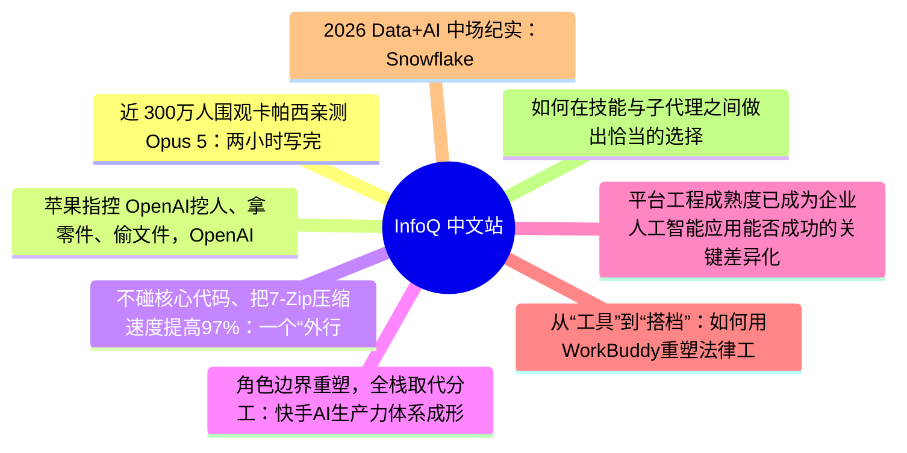
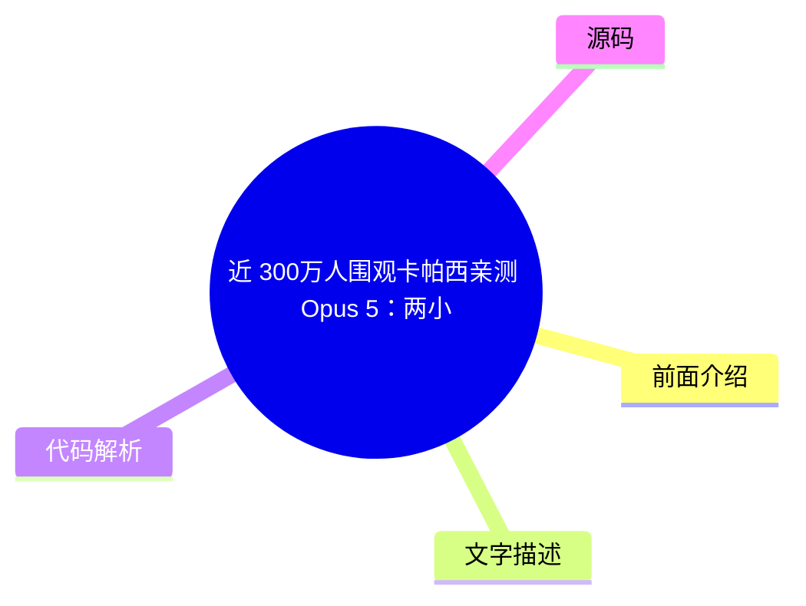
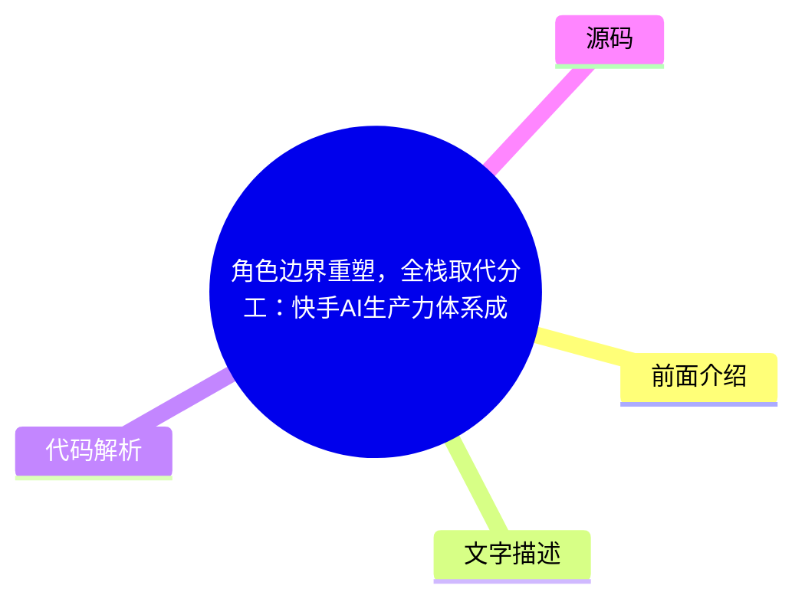
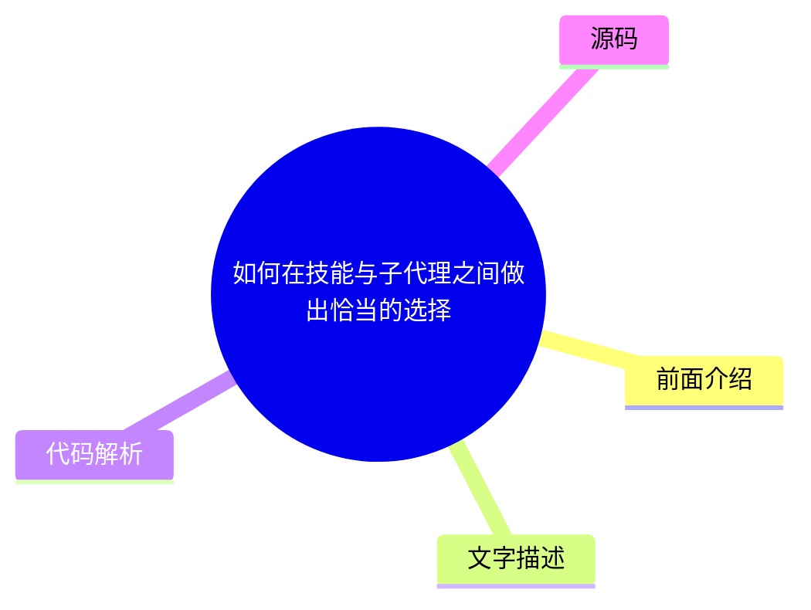

# 📰 InfoQ 中文站 Top 8 (2026-08-07)

## 前面介绍

- 数据源：InfoQ 中文站
- 抓取日期：2026-08-07
- 条目数：8
- 含完整正文：6
- 含代码片段：0
- 组织方式：前面介绍 / 树状图 / 文字描述 / 代码解析 / 源码

## 思维导图

## 详细整理（8 条，6 条含全文，0 条含代码）

### 1. 近 300万人围观卡帕西亲测 Opus 5：两小时写完 5500 行代码， 却连自己写的游戏都玩不了
- **链接**: [https://www.infoq.cn/article/YdQ7vD3WwZpib8yuzNfF?utm_source=rss&utm_medium=article](https://www.infoq.cn/article/YdQ7vD3WwZpib8yuzNfF?utm_source=rss&utm_medium=article)
- **发布**: Wed, 05 Aug 2026 22:59:14 GMT

#### 前面介绍

- 点击查看原文>
- 发布时间：Wed, 05 Aug 2026 22:59:14 GMT

#### 树状图

#### 文字描述

- ## 卡帕西暴露 Opus 5 新边界 过去，人们喜欢用一道颇具喜感的题目测试大模型：“请生成一张鹈鹕骑自行车的可缩放矢量图。” 下面这张图是 ChatGPT 为我生成的： 这道题看似简单，实际上需要模型理解自行车的结构、鹈鹕的身体组成，以及两者之间的空间关系，再用一系列坐标、路径和图形元素把它们组合起来。 模型画出的鹈鹕究竟是坐在车上、悬浮在空中，还是与自行车融成一团，往往能直观暴露其空间推理能力。 但现在，Andrej Karpathy 认为，评价前沿模型的方式可能需要再次升级。 8 月 2 日，Karpathy 在 X 上公布了一项实验。他把《指环王》第一章开头的一段文字交给 Claude Opus 5，给出 100 万 Token 的推理预算——按他的估算约为 10 美元——并要求模型用 Three.js 把这段故事渲染成一个三维场景。 这条
- ## 用游戏测试模型，网友早就玩嗨了 Karpathy 的实验并非孤例。 Opus 5 发布后，X 上的开发者迅速把三维游戏和物理模拟变成了一种非正式压力测试。 开发者 Matt Shumer 展示了一款由 Opus 5 生成的第一人称射击游戏“Claude of Duty”。据他介绍，项目从场景到贴图均由代码生成，没有使用任何外部美术资产。 Alex Ermolov 则让 Opus 5 制作了一段滑雪板体验。他评价称，在自己测试过的模型中，Opus 5 处于领先位置，第一次生成的版本就没有明显视觉故障，滑行的物理反馈也相对自然。 另一位用户 ChrisGPT 把一年前 Claude 4 Opus 的输出与 Opus 5 进行对比。 同样是生成一辆行驶在泥路上的汽车，旧版本主要由简单色块组成，而 Opus 5 已经开始自动加入车辙、植被、阴影和分层光
- ## 很强，但不是真正意义上的“世界模型” 尽管看起来像一个生成式世界，Karpathy 的实验与 谷歌 DeepMind 的 Genie 等世界模型仍有明显区别。 Opus 5 生成的是一套显式程序。场景中的对象、坐标和行为由 Three.js 代码决定，开发者可以阅读、修改和复用代码。其优势是结构清晰、控制性较强，但模型只能生成自己能够用程序表达出来的对象和规则。 Genie 3 采取的则是生成式视频路线。根据谷歌 DeepMind 的介绍，它可以根据文本实时生成 720p、每秒 24 帧的可交互环境，并在几分钟内保持一定视觉一致性。它不需要显式创建每一个三维模型，而是直接根据玩家操作预测下一帧画面。 两条路线解决的是不同问题。 代码生成世界更像“AI 自动编写一个小型游戏引擎和关卡”，结果可编辑、可调试，但视觉上容易粗糙；神经世界模型更像“实时

#### 代码解析

- 本文未检测到明确代码块，内容更偏新闻、观点或方法论。

#### 源码

#### 中文节选

## 卡帕西暴露 Opus 5 新边界

过去，人们喜欢用一道颇具喜感的题目测试大模型：“请生成一张鹈鹕骑自行车的可缩放矢量图。”

下面这张图是 ChatGPT 为我生成的：

这道题看似简单，实际上需要模型理解自行车的结构、鹈鹕的身体组成，以及两者之间的空间关系，再用一系列坐标、路径和图形元素把它们组合起来。

模型画出的鹈鹕究竟是坐在车上、悬浮在空中，还是与自行车融成一团，往往能直观暴露其空间推理能力。

但现在，Andrej Karpathy 认为，评价前沿模型的方式可能需要再次升级。

8 月 2 日，Karpathy 在 X 上公布了一项实验。他把《指环王》第一章开头的一段文字交给 Claude Opus 5，给出 100 万 Token 的推理预算——按他的估算约为 10 美元——并要求模型用 Three.js 把这段故事渲染成一个三维场景。

这条帖子的浏览量已经超过 280 万。

Opus 5 运行了约两小时，最终写出大约 5500 行代码。

成品并不精致，Karpathy 称它“有些粗糙，但很好玩”，但真正让他感到不可思议的是：一个语言模型需要自行决定场景中应该出现哪些角色、房屋、道路和植被，把各种多边形资产放进三维坐标系，再编写动画、镜头和时间轴逻辑，让这些对象按照故事发展运动起来，而它最终确实完成了一个能够在浏览器中运行的结果。

这不是简单地把文本交给图像或视频生成模型，再得到一段像素画面。

Opus 5 采取的是一条更接近传统游戏开发的路线：通过代码创建几何体、材质、灯光、摄像机和动画，搭建一个显式存在的三维场景。

在这样的系统中，一棵树不只是画面中的一团绿色像素，而是场景树中的一个对象；道路、房屋和角色都有对应坐标；镜头何时靠近、角色从哪里走到哪里、字幕在什么时间出现，也需要被写进程序。

Anthropic 在 7 月 24 日的 Opus 5 发布公告中也将视觉输出列为这一代模型的主要提升之一，并展示了模型生成的交互式风洞和细胞结构。官方将 Opus 5 定位为适合长时间、多步骤任务的模型，强调其能够反复检查结果、建立测试工具，并在复杂任务中持续迭代。

Karpathy 的实验则把这种能力推到了一个更开放的场景：没有明确的功能列表，没有现成的美术资源，也没有逐个给出对象坐标，模型必须自己判断“一段小说应该怎样变成一个可以运行的 3D 叙事”。

Karpathy 尤其关注的，并不是这段《指环王》动画本身，是它背后的经济性变化。

按照传统流程，为一段小说开头单独制作一个 3D 动画，需要编剧拆分场景、美术制作资产、程序员搭建交互与动画。即便最终只供一个人观看，这套成本也不会明显降低。由于需求过于定制，绝大多数类似想法根本不会进入制作阶段。

LLM 改变的首先不是作品质量，而是“是否值得开始”。

模型不在乎任务是否琐碎，也不在乎 5500 行代码最终只被播放一次。只要推理成本足够低，过去因为过于个性化、投入产出比太低而无人制作的内容，都可能被临时生成出来。

Karpathy 将其描述为一种“按需生成的临时版 GTA”：用户可以指定任何小说、历史事件或虚构设定，让模型临时搭出一个世界；玩家既可以作为旁观 NPC 进入故事，也可以成为其中一个角色，甚至改变原本的叙事走向。

这意味着，生成式 AI 正在把内容定制从“更换角色名字、调整几张图片”，推进到结构层面：场景、交互规则、角色关系和故事进程都可以根据单个用户即时生成。

## 用游戏测试模型，网友早就玩嗨了

Karpathy 的实验并非孤例。

Opus 5 发布后，X 上的开发者迅速把三维游戏和物理模拟变成了一种非正式压力测试。

开发者 Matt Shumer 展示了一款由 Opus 5 生成的第一人称射击游戏“Claude of Duty”。据他介绍，项目从场景到贴图均由代码生成，没有使用任何外部美术资产。

Alex Ermolov 则让 Opus 5 制作了一段滑雪板体验。他评价称，在自己测试过的模型中，Opus 5 处于领先位置，第一次生成的版本就没有明显视觉故障，滑行的物理反馈也相对自然。

另一位用户 ChrisGPT 把一年前 Claude 4 Opus 的输出与 Opus 5 进行对比。

同样是生成一辆行驶在泥路上的汽车，旧版本主要由简单色块组成，而 Opus 5 已经开始自动加入车辙、植被、阴影和分层光照。

更极端的测试来自 Pankaj Kumar。

他让 Opus 5 重建《我的世界》，最终得到一个包含 15 种生物群系、创造与生存模式的程序化世界，图形、纹理和声音都在运行时生成。不过，这次任务使用了约 2500 万 Token，也说明随着世界规模扩大，成本和代码复杂度仍会快速增长。

atomic.chat 还让多款模型分别生成龙卷风、摆锤撞击建筑等物理场景。

按照该团队自己的测试结论，Opus 5 是少数能够同时处理多个场景的模型之一。需要说明的是，这类演示通常没有统一的提示词控制、运行次数和评分标准，因此更适合被视为开发者实验，而不是严格的模型基准。

这些作品的共同之处是，都告别了依赖传统游戏资产库，让模型直接把几何体、纹理、物理和交互写成代码。相比单张图片，测试对象开始变成长时间运行的系统：角色能否移动、对象会不会穿模、碰撞是否正确、几十秒后场景状态是否仍然一致。

## 很强，但不是真正意义上的“世界模型”

尽管看起来像一个生成式世界，Karpathy 的实验与 谷歌 DeepMind 的 Genie 等世界模型仍有明显区别。

Opus 5 生成的是一套显式程序。场景中的对象、坐标和行为由 Three.js 代码决定，开发者可以阅读、修改和复用代码。其优势是结构清晰、控制性较强，但模型只能生成自己能够用程序表达出来的对象和规则。

Genie 3 采取的则是生成式视频路线。根据谷歌 DeepMind 的介绍，它可以根据文本实时生成 720p、每秒 24 帧的可交互环境，并在几分钟内保持一定视觉一致性。它不需要显式创建每一个三维模型，而是直接根据玩家操作预测下一帧画面。

两条路线解决的是不同问题。

代码生成世界更像“AI 自动编写一个小型游戏引擎和关卡”，结果可编辑、可调试，但视觉上容易粗糙；神经世界模型更像“实时生成一个可以进入的视频”，画面表现可能更丰富，却缺少传统游戏引擎中明确的对象、状态和规则。

未来的产品也可能融合两者：LLM 负责规划任务、设计规则和生成代码，世界模型负责画面、物理直觉与环境反馈。

这次实验最值得注意的部分，是 Opus 5 检查这些代码的方式。

Karpathy 指出，模型不能高效、原生地观看连续视频，也不能像真人测试员一样进入游戏，持续移动、碰撞、回头观察，再判断哪里出现问题。

它只能运行程序，在若干时间节点截取静态画面，然后根据截图修改代码。这个循环既缓慢，又很容易漏掉只在运动过程中出现的问题。例如，角色可能在某一帧看起来位置正确，却在几秒后穿过地面；摄像机在单张截图中没有问题，运动时却可能突然转向；碰撞、速度和操作手感更难通过几张图片判断。

因此，画面中仍然留下了不少错位和粗糙之处。

Ka

#### 完整正文（中文）

## 卡帕西暴露 Opus 5 新边界

过去，人们喜欢用一道颇具喜感的题目测试大模型：“请生成一张鹈鹕骑自行车的可缩放矢量图。”

下面这张图是 ChatGPT 为我生成的：

这道题看似简单，实际上需要模型理解自行车的结构、鹈鹕的身体组成，以及两者之间的空间关系，再用一系列坐标、路径和图形元素把它们组合起来。

模型画出的鹈鹕究竟是坐在车上、悬浮在空中，还是与自行车融成一团，往往能直观暴露其空间推理能力。

但现在，Andrej Karpathy 认为，评价前沿模型的方式可能需要再次升级。

8 月 2 日，Karpathy 在 X 上公布了一项实验。他把《指环王》第一章开头的一段文字交给 Claude Opus 5，给出 100 万 Token 的推理预算——按他的估算约为 10 美元——并要求模型用 Three.js 把这段故事渲染成一个三维场景。

这条帖子的浏览量已经超过 280 万。

Opus 5 运行了约两小时，最终写出大约 5500 行代码。

成品并不精致，Karpathy 称它“有些粗糙，但很好玩”，但真正让他感到不可思议的是：一个语言模型需要自行决定场景中应该出现哪些角色、房屋、道路和植被，把各种多边形资产放进三维坐标系，再编写动画、镜头和时间轴逻辑，让这些对象按照故事发展运动起来，而它最终确实完成了一个能够在浏览器中运行的结果。

这不是简单地把文本交给图像或视频生成模型，再得到一段像素画面。

Opus 5 采取的是一条更接近传统游戏开发的路线：通过代码创建几何体、材质、灯光、摄像机和动画，搭建一个显式存在的三维场景。

在这样的系统中，一棵树不只是画面中的一团绿色像素，而是场景树中的一个对象；道路、房屋和角色都有对应坐标；镜头何时靠近、角色从哪里走到哪里、字幕在什么时间出现，也需要被写进程序。

Anthropic 在 7 月 24 日的 Opus 5 发布公告中也将视觉输出列为这一代模型的主要提升之一，并展示了模型生成的交互式风洞和细胞结构。官方将 Opus 5 定位为适合长时间、多步骤任务的模型，强调其能够反复检查结果、建立测试工具，并在复杂任务中持续迭代。

Karpathy 的实验则把这种能力推到了一个更开放的场景：没有明确的功能列表，没有现成的美术资源，也没有逐个给出对象坐标，模型必须自己判断“一段小说应该怎样变成一个可以运行的 3D 叙事”。

Karpathy 尤其关注的，并不是这段《指环王》动画本身，是它背后的经济性变化。

按照传统流程，为一段小说开头单独制作一个 3D 动画，需要编剧拆分场景、美术制作资产、程序员搭建交互与动画。即便最终只供一个人观看，这套成本也不会明显降低。由于需求过于定制，绝大多数类似想法根本不会进入制作阶段。

LLM 改变的首先不是作品质量，而是“是否值得开始”。

模型不在乎任务是否琐碎，也不在乎 5500 行代码最终只被播放一次。只要推理成本足够低，过去因为过于个性化、投入产出比太低而无人制作的内容，都可能被临时生成出来。

Karpathy 将其描述为一种“按需生成的临时版 GTA”：用户可以指定任何小说、历史事件或虚构设定，让模型临时搭出一个世界；玩家既可以作为旁观 NPC 进入故事，也可以成为其中一个角色，甚至改变原本的叙事走向。

这意味着，生成式 AI 正在把内容定制从“更换角色名字、调整几张图片”，推进到结构层面：场景、交互规则、角色关系和故事进程都可以根据单个用户即时生成。

## 用游戏测试模型，网友早就玩嗨了

Karpathy 的实验并非孤例。

Opus 5 发布后，X 上的开发者迅速把三维游戏和物理模拟变成了一种非正式压力测试。

开发者 Matt Shumer 展示了一款由 Opus 5 生成的第一人称射击游戏“Claude of Duty”。据他介绍，项目从场景到贴图均由代码生成，没有使用任何外部美术资产。

Alex Ermolov 则让 Opus 5 制作了一段滑雪板体验。他评价称，在自己测试过的模型中，Opus 5 处于领先位置，第一次生成的版本就没有明显视觉故障，滑行的物理反馈也相对自然。

另一位用户 ChrisGPT 把一年前 Claude 4 Opus 的输出与 Opus 5 进行对比。

同样是生成一辆行驶在泥路上的汽车，旧版本主要由简单色块组成，而 Opus 5 已经开始自动加入车辙、植被、阴影和分层光照。

更极端的测试来自 Pankaj Kumar。

他让 Opus 5 重建《我的世界》，最终得到一个包含 15 种生物群系、创造与生存模式的程序化世界，图形、纹理和声音都在运行时生成。不过，这次任务使用了约 2500 万 Token，也说明随着世界规模扩大，成本和代码复杂度仍会快速增长。

atomic.chat 还让多款模型分别生成龙卷风、摆锤撞击建筑等物理场景。

按照该团队自己的测试结论，Opus 5 是少数能够同时处理多个场景的模型之一。需要说明的是，这类演示通常没有统一的提示词控制、运行次数和评分标准，因此更适合被视为开发者实验，而不是严格的模型基准。

这些作品的共同之处是，都告别了依赖传统游戏资产库，让模型直接把几何体、纹理、物理和交互写成代码。相比单张图片，测试对象开始变成长时间运行的系统：角色能否移动、对象会不会穿模、碰撞是否正确、几十秒后场景状态是否仍然一致。

## 很强，但不是真正意义上的“世界模型”

尽管看起来像一个生成式世界，Karpathy 的实验与 谷歌 DeepMind 的 Genie 等世界模型仍有明显区别。

Opus 5 生成的是一套显式程序。场景中的对象、坐标和行为由 Three.js 代码决定，开发者可以阅读、修改和复用代码。其优势是结构清晰、控制性较强，但模型只能生成自己能够用程序表达出来的对象和规则。

Genie 3 采取的则是生成式视频路线。根据谷歌 DeepMind 的介绍，它可以根据文本实时生成 720p、每秒 24 帧的可交互环境，并在几分钟内保持一定视觉一致性。它不需要显式创建每一个三维模型，而是直接根据玩家操作预测下一帧画面。

两条路线解决的是不同问题。

代码生成世界更像“AI 自动编写一个小型游戏引擎和关卡”，结果可编辑、可调试，但视觉上容易粗糙；神经世界模型更像“实时生成一个可以进入的视频”，画面表现可能更丰富，却缺少传统游戏引擎中明确的对象、状态和规则。

未来的产品也可能融合两者：LLM 负责规划任务、设计规则和生成代码，世界模型负责画面、物理直觉与环境反馈。

这次实验最值得注意的部分，是 Opus 5 检查这些代码的方式。

Karpathy 指出，模型不能高效、原生地观看连续视频，也不能像真人测试员一样进入游戏，持续移动、碰撞、回头观察，再判断哪里出现问题。

它只能运行程序，在若干时间节点截取静态画面，然后根据截图修改代码。这个循环既缓慢，又很容易漏掉只在运动过程中出现的问题。例如，角色可能在某一帧看起来位置正确，却在几秒后穿过地面；摄像机在单张截图中没有问题，运动时却可能突然转向；碰撞、速度和操作手感更难通过几张图片判断。

因此，画面中仍然留下了不少错位和粗糙之处。

Karpathy 由此认为，视频理解、连续状态感知以及真正“玩游戏”的能力，仍是当前大模型明显不足的原始能力。

这暴露出一个正在变得越来越重要的矛盾：模型生成内容的能力，正在快于它验证内容的能力。

对于普通代码，模型可以运行单元测试、查看错误日志、比较文本输出；但面对动画、游戏、机器人和复杂用户界面，正确性不再只存在于文字和数值中，而是分布在连续时间、视觉状态和交互反馈里。

如果模型无法亲自体验自己生成的系统，就很难形成完整的“生成—执行—观察—修正”闭环。

从鹈鹕骑自行车，到《指环王》三维世界，大模型评测正在发生一个微妙变化。

过去的问题是：模型能不能写出代码、画出图片、生成一个可以运行的页面。现在的问题逐渐变成：它能不能连续工作两小时甚至更长时间，组织数千行代码，保持对象、任务和目标的一致性；完成之后，它能不能主动进入系统，发现那些没有出现在错误日志中的问题。

Opus 5 生成的还不是一款真正的《指环王》游戏，约 10 美元也只是 Karpathy 给出的 Token 预算估算，并不包含人工设计、运行环境、验收、修改和正式制作成本。

但这个实验依然意味着一个重要变化：以前因为“太麻烦、太小众、没有人愿意做”而不存在的软件和内容，现在可能只需要一句描述和一笔很小的推理预算。

模型已经开始具备建造临时世界的耐力。接下来的关键，是它什么时候能够真正看见、进入并理解自己建造的世界。

参考链接：

### 2. 苹果指控 OpenAI挖人、拿零件、偷文件，OpenAI 晒聊天记录全面反击！马斯克：别信 OpenAI
- **链接**: [https://www.infoq.cn/article/rvVpcZspLiqGpPQq6HPw?utm_source=rss&utm_medium=article](https://www.infoq.cn/article/rvVpcZspLiqGpPQq6HPw?utm_source=rss&utm_medium=article)
- **发布**: Wed, 05 Aug 2026 22:36:00 GMT

#### 前面介绍

- 点击查看原文>
- 发布时间：Wed, 05 Aug 2026 22:36:00 GMT

#### 树状图

#### 文字描述

- ## OpenAI 反击苹果：他们把事情搞错了 苹果与 OpenAI 围绕硬件商业秘密的争夺，已经从法院延伸到了舆论场。 当地时间 8 月 3 日，苹果向美国加利福尼亚北区联邦地区法院申请初步禁令，要求禁止 OpenAI、io Products 及两名前苹果员工 Chang Liu、Tang Yew Tan 继续访问、获取、使用或披露苹果商业秘密。 苹果同时要求法院加快证据开示，调取与机密信息访问相关的文件，并传唤 Liu、Tan、后来加入 OpenAI 的前苹果员工 Yu-Ting Peng，以及 OpenAI 和 io Products 的公司代表接受询问。 苹果在申请中表示，如果法院不及时发布禁令，公司将遭受“无法弥补的损害”。 几个小时后，OpenAI 不再只是通过发言人简单否认，而是在官网发布了一篇标题相当直接的文章——《苹果把这件事搞错了
- ## 事件回溯 苹果和 OpenAI 撕来撕去，到底是怎么回事？ 当地时间 7 月 10 日，据多家外媒消息，苹果向美国加利福尼亚北区联邦地区法院提起诉讼，指控 OpenAI 及其硬件子公司 io Products 通过挖走苹果员工、获取内部文件和接触供应商等方式，盗用苹果商业秘密。 案件编号为 5:26-cv-07078，被告除 OpenAI Foundation、OpenAI Group PBC 和 io Products 外，还包括两名前苹果员工：OpenAI 首席硬件官 Tang Yew Tan，以及硬件工程师 Chang Liu。 苹果提出了四项违反《保护商业秘密法》的诉因，以及两项违反员工知识产权协议的诉因，并要求陪审团审理。 但值得注意的是，目前这些仍是苹果的单方面指控，法院尚未作出事实认定。 起诉时，苹果拿出了一条相当具体的证据链。 
- ## 马斯克又来插一脚 似乎只要网上有一点关于 OpenAI 或者是 Altman 的风吹草动，马斯克都要出来掺合一脚。 上个月该新闻爆出时，马斯克就在 x 上转发了这条消息，并评论了两个感叹号。 这次又是这样，马斯克再次出来站队了，他在 X 发文称“不要相信 OpenAI”，主打一个谁和 OpenAI 有仇，我就支持谁。 马斯克为什么会关注到这个案子呢？因为两个月前，OpenAI 刚刚成功驳回 xAI 提出的商业秘密诉讼，法官认为 xAI 没有充分证明 OpenAI 诱导员工泄密或明知其披露机密。 苹果这次显然吸取了“证据不够具体”的教训，诉状反复强调“带实际零件面试”“教人避开安全审查”“使用内部项目代号”等细节，试图直接证明 OpenAI 存在诱导、知情和实际使用行为。 苹果能否最终证明这些指控仍是未知数，但至少在诉状阶段，它带来的已经不是一团

#### 代码解析

- 本文未检测到明确代码块，内容更偏新闻、观点或方法论。

#### 源码

#### 中文节选

## OpenAI 反击苹果：他们把事情搞错了

苹果与 OpenAI 围绕硬件商业秘密的争夺，已经从法院延伸到了舆论场。

当地时间 8 月 3 日，苹果向美国加利福尼亚北区联邦地区法院申请初步禁令，要求禁止 OpenAI、io Products 及两名前苹果员工 Chang Liu、Tang Yew Tan 继续访问、获取、使用或披露苹果商业秘密。

苹果同时要求法院加快证据开示，调取与机密信息访问相关的文件，并传唤 Liu、Tan、后来加入 OpenAI 的前苹果员工 Yu-Ting Peng，以及 OpenAI 和 io Products 的公司代表接受询问。

苹果在申请中表示，如果法院不及时发布禁令，公司将遭受“无法弥补的损害”。

几个小时后，OpenAI 不再只是通过发言人简单否认，而是在官网发布了一篇标题相当直接的文章——《苹果把这件事搞错了》（Apple is getting this wrong）。

OpenAI 一边称苹果是“有史以来最伟大的公司之一”，一边批评这场诉讼“草率、咄咄逼人，而且带有一种不同寻常的私人色彩”。为了证明苹果的叙事存在问题，OpenAI 还公开了 Chang Liu 与多名苹果员工之间的部分 iMessage 记录，以及苹果外部律师与 OpenAI 法务团队之间的邮件。

OpenAI 的第一处反击，针对的是苹果所说的“2 月已经联系 OpenAI，但没有收到回应”。

苹果在此前的诉状中称，公司今年 2 月便致函 OpenAI，询问前员工是否将苹果机密信息带入 OpenAI，以及 OpenAI 采取了哪些防范和补救措施，但 OpenAI 没有回应。

OpenAI 给出的版本完全不同。

OpenAI 称，苹果聘请的外部律师在沟通过程中混淆了两个亚洲姓氏，将原本发给一名前苹果员工 Wang 的邮件错误地发给了 OpenAI 总法律顾问 Che Chang，还在邮件中错误声称双方刚刚通过电话。

公开邮件显示，苹果律师 Gabriel Gross 随后承认，自己把原本准备发送给 Wang 的邮件错误回复给了 Che Chang，并就此道歉。苹果内部律师也确认，外部律师确实发生了沟通失误。

OpenAI 还表示，苹果当时没有提出后来诉状中的那些具体指控，律师邮件中反而称正在与相关人员“解决任何问题”。此后，苹果连续五个月没有进一步联系 OpenAI，直到直接提起诉讼。

因此，OpenAI 认为，苹果所描述的“主动预警却遭到无视”，并不是沟通记录呈现出来的完整事实。

第二处反击，则围绕整起案件中最关键的人物 Chang Liu 展开。

苹果此前将 Liu 描述为主动利用离职后残留的访问权限，进入苹果内部存储系统并下载机密文件的人。OpenAI 则强调，苹果直到申请初步禁令时才承认，Liu 离职后仍然在苹果任职的前同事曾主动联系他，请他帮助寻找文件和技术信息，以完成苹果内部的工作。

OpenAI 公开的聊天记录显示，Liu 于 2026 年 1 月 22 日离开苹果后，确实有苹果员工继续向他询问文件位置、项目历史、产品计划和相关工程人员。一名苹果员工甚至直接表示：“即使你已经不在这里工作，你仍然是最合适的人选。”

在另一段 3 月 5 日的群聊中，苹果员工继续向 Liu 询问某项技术设计的工作原理和联系人。Liu 在作出回答并试图将相关工程师拉入讨论后，另一名参与者随即表示，这种沟通“非常不正常”，要求将自己移出对话。

OpenAI 据此提出，Liu 对部分苹果资料的接触，并不是为了给 OpenAI 搜集硬件机密，而是在帮助仍留在苹果的前同事寻找他们工作所需的资料。

对于离职人员为何还能接触苹果文件，OpenAI 则把责任指向苹果的权限管理。OpenAI 称，所谓“残留访问权限”在苹果并不少见，根源是苹果没有在员工离职后及时、彻底地撤销系统权限，导致一些已经离职的员工在不知情或者并不希望继续访问的情况下，仍能看到公司文件。

但 OpenAI 公开的这些聊天记录，同样是一把双刃剑。

记录一方面证明，确实有苹果员工在 Liu 离职后主动向他求助；另一方面也显示，Liu 在离职后继续讨论苹果尚未公开的产品信息、技术方案和文件路径，还允许前同事暂时保持其 iCloud 账户登录状态，以继续复制资料。

这意味着，这些材料可能削弱苹果关于“所有访问均由 Liu 主动发起、完全服务于 OpenAI”的叙述，却不能自动证明 Liu 的做法符合苹果的保密制度和离职义务。它们究竟证明了正常的工作交接，还是证明了离职后的越权访问，仍需要法院结合完整记录、文件流向以及 OpenAI 是否实际使用相关资料进行判断。

相比之下，OpenAI 对 Tang Yew Tan 的回应更加原则化。

苹果指控 Tan 在招聘苹果员工时使用内部项目代号，要求候选人讨论未发布产品，甚至携带电池、逻辑板和屏蔽件等真实零部件参加面试。

OpenAI 没有在这篇文章中逐项解释这些面试细节，而是表示，Tan 一直明确告诉团队，OpenAI 不希望、也绝不允许使用其他公司的机密信息。OpenAI 同时强调，Tan 曾在苹果工作超过 24 年，是苹果内部广受认可的硬件领导者。

OpenAI 最终将矛头指向苹果申请的初步禁令，称这项申请建立在错误信息之上，而且“完全没有必要”。

“我们既没有，也不想要苹果的任何商业秘密。”OpenAI 表示，公司真正感兴趣的是开发能够推动技术边界的新产品，而不是利用其他公司的机密资料。

不过，OpenAI 官网发布的文章并不是一份正式的法庭答辩。它公开的聊天记录和邮件也经过了姓名及大量苹果技术信息的删减，外界目前无法仅凭这些片段确认完整上下文。

《The Verge》将其形容为 OpenAI 把案件拉进了“舆论法庭”：这些材料可以用来指出苹果诉状中的矛盾，却不能取代法庭上的证据开示和事实认定。

目前，双方实际上已经提出了两套截然不同的故事。

在苹果的版本中，这是 OpenAI 借助系统漏洞、人才挖角和供应链接触，有组织地获取硬件机密；在 OpenAI 的版本中，这是苹果权限管理混乱、内部员工主动向离职同事求助，随后又将一系列复杂的交接行为包装成了“系统性盗窃”。

究竟哪一种叙事更接近事实，最终取决于苹果能否证明相关资料不仅被访问或保留，而且确实流入并影响了 OpenAI 的硬件研发。

而要理解双方为什么会为了几封邮件、一台没有归还的电脑、数十份文件和几场招聘面试彻底撕破脸，还要回到 7 月 10 日苹果最初提交的那份诉状。

## 事件回溯

苹果和 OpenAI 撕来撕去，到底是怎么回事？

当地时间 7 月 10 日，据多家外媒消息，苹果向美国加利福尼亚北区联邦地区法院提起诉讼，指控 OpenAI 及其硬件子公司 io Products 通过挖走苹果员工、获取内部文件和接触供应商等方式，盗用苹果商业秘密。

案件编号为 5:26-cv-07078，被告除 OpenAI Foundation、OpenAI Group PBC 和 io Products 外，还包括两名前苹果员工：OpenAI 首席硬件官 Tang Yew

#### 完整正文（中文）

## OpenAI 反击苹果：他们把事情搞错了

苹果与 OpenAI 围绕硬件商业秘密的争夺，已经从法院延伸到了舆论场。

当地时间 8 月 3 日，苹果向美国加利福尼亚北区联邦地区法院申请初步禁令，要求禁止 OpenAI、io Products 及两名前苹果员工 Chang Liu、Tang Yew Tan 继续访问、获取、使用或披露苹果商业秘密。

苹果同时要求法院加快证据开示，调取与机密信息访问相关的文件，并传唤 Liu、Tan、后来加入 OpenAI 的前苹果员工 Yu-Ting Peng，以及 OpenAI 和 io Products 的公司代表接受询问。

苹果在申请中表示，如果法院不及时发布禁令，公司将遭受“无法弥补的损害”。

几个小时后，OpenAI 不再只是通过发言人简单否认，而是在官网发布了一篇标题相当直接的文章——《苹果把这件事搞错了》（Apple is getting this wrong）。

OpenAI 一边称苹果是“有史以来最伟大的公司之一”，一边批评这场诉讼“草率、咄咄逼人，而且带有一种不同寻常的私人色彩”。为了证明苹果的叙事存在问题，OpenAI 还公开了 Chang Liu 与多名苹果员工之间的部分 iMessage 记录，以及苹果外部律师与 OpenAI 法务团队之间的邮件。

OpenAI 的第一处反击，针对的是苹果所说的“2 月已经联系 OpenAI，但没有收到回应”。

苹果在此前的诉状中称，公司今年 2 月便致函 OpenAI，询问前员工是否将苹果机密信息带入 OpenAI，以及 OpenAI 采取了哪些防范和补救措施，但 OpenAI 没有回应。

OpenAI 给出的版本完全不同。

OpenAI 称，苹果聘请的外部律师在沟通过程中混淆了两个亚洲姓氏，将原本发给一名前苹果员工 Wang 的邮件错误地发给了 OpenAI 总法律顾问 Che Chang，还在邮件中错误声称双方刚刚通过电话。

公开邮件显示，苹果律师 Gabriel Gross 随后承认，自己把原本准备发送给 Wang 的邮件错误回复给了 Che Chang，并就此道歉。苹果内部律师也确认，外部律师确实发生了沟通失误。

OpenAI 还表示，苹果当时没有提出后来诉状中的那些具体指控，律师邮件中反而称正在与相关人员“解决任何问题”。此后，苹果连续五个月没有进一步联系 OpenAI，直到直接提起诉讼。

因此，OpenAI 认为，苹果所描述的“主动预警却遭到无视”，并不是沟通记录呈现出来的完整事实。

第二处反击，则围绕整起案件中最关键的人物 Chang Liu 展开。

苹果此前将 Liu 描述为主动利用离职后残留的访问权限，进入苹果内部存储系统并下载机密文件的人。OpenAI 则强调，苹果直到申请初步禁令时才承认，Liu 离职后仍然在苹果任职的前同事曾主动联系他，请他帮助寻找文件和技术信息，以完成苹果内部的工作。

OpenAI 公开的聊天记录显示，Liu 于 2026 年 1 月 22 日离开苹果后，确实有苹果员工继续向他询问文件位置、项目历史、产品计划和相关工程人员。一名苹果员工甚至直接表示：“即使你已经不在这里工作，你仍然是最合适的人选。”

在另一段 3 月 5 日的群聊中，苹果员工继续向 Liu 询问某项技术设计的工作原理和联系人。Liu 在作出回答并试图将相关工程师拉入讨论后，另一名参与者随即表示，这种沟通“非常不正常”，要求将自己移出对话。

OpenAI 据此提出，Liu 对部分苹果资料的接触，并不是为了给 OpenAI 搜集硬件机密，而是在帮助仍留在苹果的前同事寻找他们工作所需的资料。

对于离职人员为何还能接触苹果文件，OpenAI 则把责任指向苹果的权限管理。OpenAI 称，所谓“残留访问权限”在苹果并不少见，根源是苹果没有在员工离职后及时、彻底地撤销系统权限，导致一些已经离职的员工在不知情或者并不希望继续访问的情况下，仍能看到公司文件。

但 OpenAI 公开的这些聊天记录，同样是一把双刃剑。

记录一方面证明，确实有苹果员工在 Liu 离职后主动向他求助；另一方面也显示，Liu 在离职后继续讨论苹果尚未公开的产品信息、技术方案和文件路径，还允许前同事暂时保持其 iCloud 账户登录状态，以继续复制资料。

这意味着，这些材料可能削弱苹果关于“所有访问均由 Liu 主动发起、完全服务于 OpenAI”的叙述，却不能自动证明 Liu 的做法符合苹果的保密制度和离职义务。它们究竟证明了正常的工作交接，还是证明了离职后的越权访问，仍需要法院结合完整记录、文件流向以及 OpenAI 是否实际使用相关资料进行判断。

相比之下，OpenAI 对 Tang Yew Tan 的回应更加原则化。

苹果指控 Tan 在招聘苹果员工时使用内部项目代号，要求候选人讨论未发布产品，甚至携带电池、逻辑板和屏蔽件等真实零部件参加面试。

OpenAI 没有在这篇文章中逐项解释这些面试细节，而是表示，Tan 一直明确告诉团队，OpenAI 不希望、也绝不允许使用其他公司的机密信息。OpenAI 同时强调，Tan 曾在苹果工作超过 24 年，是苹果内部广受认可的硬件领导者。

OpenAI 最终将矛头指向苹果申请的初步禁令，称这项申请建立在错误信息之上，而且“完全没有必要”。

“我们既没有，也不想要苹果的任何商业秘密。”OpenAI 表示，公司真正感兴趣的是开发能够推动技术边界的新产品，而不是利用其他公司的机密资料。

不过，OpenAI 官网发布的文章并不是一份正式的法庭答辩。它公开的聊天记录和邮件也经过了姓名及大量苹果技术信息的删减，外界目前无法仅凭这些片段确认完整上下文。

《The Verge》将其形容为 OpenAI 把案件拉进了“舆论法庭”：这些材料可以用来指出苹果诉状中的矛盾，却不能取代法庭上的证据开示和事实认定。

目前，双方实际上已经提出了两套截然不同的故事。

在苹果的版本中，这是 OpenAI 借助系统漏洞、人才挖角和供应链接触，有组织地获取硬件机密；在 OpenAI 的版本中，这是苹果权限管理混乱、内部员工主动向离职同事求助，随后又将一系列复杂的交接行为包装成了“系统性盗窃”。

究竟哪一种叙事更接近事实，最终取决于苹果能否证明相关资料不仅被访问或保留，而且确实流入并影响了 OpenAI 的硬件研发。

而要理解双方为什么会为了几封邮件、一台没有归还的电脑、数十份文件和几场招聘面试彻底撕破脸，还要回到 7 月 10 日苹果最初提交的那份诉状。

## 事件回溯

苹果和 OpenAI 撕来撕去，到底是怎么回事？

当地时间 7 月 10 日，据多家外媒消息，苹果向美国加利福尼亚北区联邦地区法院提起诉讼，指控 OpenAI 及其硬件子公司 io Products 通过挖走苹果员工、获取内部文件和接触供应商等方式，盗用苹果商业秘密。

案件编号为 5:26-cv-07078，被告除 OpenAI Foundation、OpenAI Group PBC 和 io Products 外，还包括两名前苹果员工：OpenAI 首席硬件官 Tang Yew Tan，以及硬件工程师 Chang Liu。

苹果提出了四项违反《保护商业秘密法》的诉因，以及两项违反员工知识产权协议的诉因，并要求陪审团审理。

但值得注意的是，目前这些仍是苹果的单方面指控，法院尚未作出事实认定。

起诉时，苹果拿出了一条相当具体的证据链。

诉状称，“苹果每年都以创新的硬件产品带给客户惊喜与愉悦，其大部分工作一直保密，直到成品准备就绪、可以亮相的那一刻才公之于众。在幕后，苹果对其产品开发、制造、供应链、技术研究及其他创新成果均严格保密。涵盖苹果硬件运营的各领域商业秘密，共同构成了美国商业界最具价值的知识资产之一。这些秘密使苹果能够以非凡的速度和规模，向消费者推出具有独特功能的新产品。苹果高度重视其商业秘密的保密性。”

前员工 Chang Liu 在苹果工作八年，参与过高度敏感的硬件项目，2026 年 1 月 22 日离职加入 OpenAI，却没有归还至少一台苹果笔记本，也没有配合离职安全审查。

Liu 离职后仍与当时在苹果任职的 Yu-Ting “Alyssa” Peng 保持频繁联系。Peng 随后于 2026 年 4 月 16 日离职并加入 OpenAI。

苹果援引双方通信记录称，Liu 离开苹果仅数小时后便告诉 Peng，自己“还有另一台电脑”，准备利用该设备访问苹果机密信息，以便当晚与她讨论。

诉状还称，在 Liu 已经离职、Peng 仍在苹果任职期间，Liu 曾使用 Peng 由苹果配发、并已通过公司网络认证的工作电脑访问苹果系统。

大约在 2026 年 2 月 9 日，Liu 被指尝试登录苹果的网络存储库。该存储库基于云端运行，保存有苹果的机密工程文件、项目资料及其他专有信息。按照苹果的说法，由于当时尚未被发现的身份验证漏洞，Liu 在离职数周后仍能访问该系统。

苹果称，刘发现漏洞后并未向公司报告，而是将这一情况告诉 Peng。

诉状引用的聊天记录显示，Liu 称：“哈哈，我发现我可以访问网络存储库，真好笑。”

Peng 随后回复：“我准备好了。”

苹果指控，Liu 在已经入职 OpenAI 的情况下，继续利用这一访问权限，从内部存储库中筛选、打开并下载了数十份机密文件，涉及技术演示文稿、电子表格、PDF 文件及书面工作成果。

其中包括一份超过 1000 页的技术资料汇编，记录了 Liu 及其他苹果员工此前参与的机密项目细节，多份文件被明确标记为机密。

这些电脑留言、内部服务器日志和公司设备记录，构成了苹果目前公开的核心数字证据。

上述内容目前均为苹果在诉状中提出的指控，法院尚未就相关事实作出认定。

再来说说另一名核心被告 Tang Yew Tan。据诉状，Tan 在苹果工作了 24 年，曾任 iPhone 和 Apple Watch 产品设计副总裁，目前是 OpenAI 首席硬件官。

苹果称，他离职前曾与 OpenAI 或其合作方接触，并把苹果供应商资料和消费电子行业内部报告发送到个人邮箱。

此后，他在面试苹果员工时使用苹果内部项目代号，追问某款未发布产品“下一步计划是什么”，还要求候选人把苹果的“实际零件”带到 OpenAI，进行“展示和讲解”。

诉状称，被要求携带的物品包括电池、逻辑板和屏蔽件，一名候选人甚至惊讶地表示：“我都不知道这些东西可以从办公室拿走。”

按照苹果的说法，这并非个别员工离职时顺手复制几份文件，而是一套颇有“方法论”的招聘流程。

OpenAI 被指要求候选人展示 CAD 设计资料和原型机，并讨论子系统与零部件选择、仿真工具、系统集成方法，以及供应商筛选和沟通方式。

Tan 等人还被指向新员工传播一份标有“Need to Know”的苹果内部离职安全文件，提醒他们不要向苹果透露下一家公司是 OpenAI，以避免被提前收回系统访问权限。

苹果称，目前已有超过 400 名前苹果员工进入 OpenAI。

指控还延伸到了苹果供应链。

苹果称，OpenAI 及 io Products 接触了至少两家苹果长期合作伙伴。

其中一家供应商被要求为 OpenAI 执行苹果多年积累的一套专有金属表面处理工艺，并被误导相信苹果已经授权；另一家从事电源和电池相关制造的供应商，则被 OpenAI 使用苹果内部术语追问特定部件和制造问题。

苹果认为，这表明相关信息已经不只是“被员工带走”，而是实际进入了 OpenAI 的硬件研发和供应链活动。

苹果称，公司今年 2 月已经致函 OpenAI，要求讨论机密信息可能被带走的问题，但没有收到回应。

OpenAI 发言人 Drew Pusateri 则表示，公司仍在审阅诉状，并回应称：“我们对其他公司的商业秘密不感兴趣。我们将继续专注于开发能够赋能全球用户的创新技术。”

既然提起了诉讼，苹果的诉求到底是啥呢？

事实上，苹果的诉求可不是赔钱那么简单。它要求法院发布临时及永久禁令，禁止被告继续获取、持有、使用或披露苹果商业秘密；禁止删除邮件、电子文件、元数据等证据；归还全部苹果设备、文件和数据；停止访问苹果系统。同时，苹果还要求获得实际损失赔偿、不当得利、合理许可费、惩罚性赔偿、利息和律师费，但目前没有提出具体金额。

对 OpenAI 而言，真正危险的未必是赔偿数字，而是禁令和证据开示。

如果法院同意苹果的初步禁令，OpenAI 可能需要隔离被指使用过苹果资料的研发成果、重新审查设计来源和供应商沟通，硬件项目也可能被迫延后。

进入证据开示阶段后，OpenAI 的内部邮件、招聘记录、供应商往来和硬件路线图也可能被纳入调查。

## 马斯克又来插一脚

似乎只要网上有一点关于 OpenAI 或者是 Altman 的风吹草动，马斯克都要出来掺合一脚。

上个月该新闻爆出时，马斯克就在 x 上转发了这条消息，并评论了两个感叹号。

这次又是这样，马斯克再次出来站队了，他在 X 发文称“不要相信 OpenAI”，主打一个谁和 OpenAI 有仇，我就支持谁。

马斯克为什么会关注到这个案子呢？因为两个月前，OpenAI 刚刚成功驳回 xAI 提出的商业秘密诉讼，法官认为 xAI 没有充分证明 OpenAI 诱导员工泄密或明知其披露机密。

苹果这次显然吸取了“证据不够具体”的教训，诉状反复强调“带实际零件面试”“教人避开安全审查”“使用内部项目代号”等细节，试图直接证明 OpenAI 存在诱导、知情和实际使用行为。

苹果能否最终证明这些指控仍是未知数，但至少在诉状阶段，它带来的已经不是一团模糊的硅谷人才流动故事。

参考链接：

### 3. 不碰核心代码、把7-Zip压缩速度提高97%：一个“外行”与 AI 的极致优化实验
- **链接**: [https://www.infoq.cn/article/Qp04AcNuAM8YqtVQHyu3?utm_source=rss&utm_medium=article](https://www.infoq.cn/article/Qp04AcNuAM8YqtVQHyu3?utm_source=rss&utm_medium=article)
- **发布**: Wed, 05 Aug 2026 18:45:26 GMT

#### 前面介绍

- 点击查看原文>
- 发布时间：Wed, 05 Aug 2026 18:45:26 GMT

#### 树状图

#### 文字描述

- 近日，AI 孵化器语生科学内部完成了一项 7-Zip 优化实践。一名无编程背景的员工，仅凭一个关于压缩效率的改进设想，在 AI 辅助下完成了对开源压缩软件 7-Zip 的系统级性能调优。该优化版本已在 Windows 和 macOS 双平台通过真实业务文件测试，并已正式开源。
- ## 核心数据一览 这次优化带来的压缩速度提升最高达到 97.0%（具体发生在 macOS 平台的多文件归档场景）；文件体积最大可缩减 40.7%（针对日志类数据）。所有压缩结果的完整性验证通过率为 100%，且解码端无需任何改动，官方 7‑Zip 可直接解压。
- ## 优化思路：不碰核心，只改“路由” 7-Zip 的 LZMA2 算法压缩比极高，但缺陷在于对所有文件类型采用统一策略，无论文本、JSON 还是已压缩的多媒体，均消耗同等算力进行字典搜索，造成大量无效计算。 该员工与 AI 协作，梳理出一套“内容感知路由器”方案，核心包含三个动作： **第一，多级探测机制** • 文件头快速识别：如 JPEG 仅需读取前 2 字节 FFD8，开销可忽略； • 抽样试压：对 ≥4MB 的文件，抽取首部 1MB 进行 LZMA2 快速试压，评估压缩比； • 多点采样：对疑似已压缩多媒体文件（头部压缩比异常），补采中点和尾部各 1MB，执行 2-of-3 投票。 **第二，十档路由策略** 根据探测结果，将文件动态分配至 10 种不同的编码通道（包括 LZMA2 的不同参数档位、PPMd 等），实现“量体裁衣”。 **第
- ## 三大优势，特定场景超过原生 - 散文/日志类数据：压缩率与速度双赢 在处理日志、合同文本、JSON 代码等强结构数据时，新方案速度快到飞起。Mac 平台下多文件归档提速 97.0%，散文文本提速 93.4%；Windows 下同类文件提速也普遍超 80%。同时，日志体积还额外缩减了 40.4%。 - 大型二进制文件：稳健提速 面对大型二进制文件，新方案在 Windows 和 Mac 上依然能获得 10% 至 18% 的压缩提速收益。 - 零侵入式改装 没有改动核心压缩算法的任何一行代码，所有变更集中在“分派层”。解码端无需任何改动，堪称 AI 改造基础软件的“低风险示范”。

#### 代码解析

- 本文未检测到明确代码块，内容更偏新闻、观点或方法论。

#### 源码

#### 中文节选

近日，AI 孵化器语生科学内部完成了一项 7-Zip 优化实践。一名无编程背景的员工，仅凭一个关于压缩效率的改进设想，在 AI 辅助下完成了对开源压缩软件 7-Zip 的系统级性能调优。该优化版本已在 Windows 和 macOS 双平台通过真实业务文件测试，并已正式开源。

## 核心数据一览

这次优化带来的压缩速度提升最高达到 97.0%（具体发生在 macOS 平台的多文件归档场景）；文件体积最大可缩减 40.7%（针对日志类数据）。所有压缩结果的完整性验证通过率为 100%，且解码端无需任何改动，官方 7‑Zip 可直接解压。

## 优化思路：不碰核心，只改“路由”

7-Zip 的 LZMA2 算法压缩比极高，但缺陷在于对所有文件类型采用统一策略，无论文本、JSON 还是已压缩的多媒体，均消耗同等算力进行字典搜索，造成大量无效计算。

该员工与 AI 协作，梳理出一套“内容感知路由器”方案，核心包含三个动作：

**第一，多级探测机制**

• 文件头快速识别：如 JPEG 仅需读取前 2 字节 FFD8，开销可忽略；

• 抽样试压：对 ≥4MB 的文件，抽取首部 1MB 进行 LZMA2 快速试压，评估压缩比；

• 多点采样：对疑似已压缩多媒体文件（头部压缩比异常），补采中点和尾部各 1MB，执行 2-of-3 投票。

**第二，十档路由策略**

根据探测结果，将文件动态分配至 10 种不同的编码通道（包括 LZMA2 的不同参数档位、PPMd 等），实现“量体裁衣”。

**第三，安全网与零扰动**

• 试压选小者：任何通道切换前，均以 1MB 样本进行实际压缩对比，确保压缩率不退化；

• 容差护栏：若切换后体积增大，须控制增量 <2% 才放行；

• 分组隔离：优化后文件存放于独立文件夹，不影响其他文件；

• 解码端零改动：输出仍为标准 .7z 格式，官方 7-Zip 可直接解压；

• 门槛保护：<4MB 的小文件跳过探测，直接走默认路径，防止性能倒退。

## 三大优势，特定场景超过原生

- 散文/日志类数据：压缩率与速度双赢 

在处理日志、合同文本、JSON 代码等强结构数据时，新方案速度快到飞起。Mac 平台下多文件归档提速 97.0%，散文文本提速 93.4%；Windows 下同类文件提速也普遍超 80%。同时，日志体积还额外缩减了 40.4%。

- 大型二进制文件：稳健提速 

面对大型二进制文件，新方案在 Windows 和 Mac 上依然能获得 10% 至 18% 的压缩提速收益。

- 零侵入式改装 

没有改动核心压缩算法的任何一行代码，所有变更集中在“分派层”。解码端无需任何改动，堪称 AI 改造基础软件的“低风险示范”。

## 压缩耗时对比：优化版（V18）vs 官方原版（Origin）

不过，客观来看，这并非一次毫无瑕疵的完美升级。优化后的版本选用了更复杂的编码通道，导致文本与日志类文件的解压耗时翻了 2 到 3 倍；前置探针在面对 5GB 以上的超大不可压文件时可能发生误判，使得压缩耗时明显飙升；部分大型二进制文件也微小牺牲了约 2% 的存储空间来换取速度。

此次实践并不意味着 AI 取代工程师。相反，它展示的是一种新的协作模式：工程师继续构建技术底座；AI 帮助更多人快速验证想法；业务一线的真实需求，可以更快转化为技术方案。

语生科学表示，改优化版本已经内部部署并开源（GitHub 仓库：[https://github.com/sunmmer01/Optimization](https://github.com/sunmmer01/Optimization)），公司一直持续探索 AI 在真实场景中的应用价值并鼓励员工利用 AI 解决实际问题，这不是为了替代专业能力，而是希望让更多人的经验、洞察和创造力能够通过 AI 被放大。

过去，技术创新往往意味着掌握复杂技术的人，才能改变系统。而 AI 正在带来新的可能，能发现问题、提出好问题的人，也可以参与创造新的技术方案。当 AI 从工具变成协作者，软件工程、产品创新乃至组织协作方式，都正在迎来新的变化。未来，决定创新速度的，不只是代码能力，更是人与 AI 共同解决问题的能力。

#### 完整正文（中文）

近日，AI 孵化器语生科学内部完成了一项 7-Zip 优化实践。一名无编程背景的员工，仅凭一个关于压缩效率的改进设想，在 AI 辅助下完成了对开源压缩软件 7-Zip 的系统级性能调优。该优化版本已在 Windows 和 macOS 双平台通过真实业务文件测试，并已正式开源。

## 核心数据一览

这次优化带来的压缩速度提升最高达到 97.0%（具体发生在 macOS 平台的多文件归档场景）；文件体积最大可缩减 40.7%（针对日志类数据）。所有压缩结果的完整性验证通过率为 100%，且解码端无需任何改动，官方 7‑Zip 可直接解压。

## 优化思路：不碰核心，只改“路由”

7-Zip 的 LZMA2 算法压缩比极高，但缺陷在于对所有文件类型采用统一策略，无论文本、JSON 还是已压缩的多媒体，均消耗同等算力进行字典搜索，造成大量无效计算。

该员工与 AI 协作，梳理出一套“内容感知路由器”方案，核心包含三个动作：

**第一，多级探测机制**

• 文件头快速识别：如 JPEG 仅需读取前 2 字节 FFD8，开销可忽略；

• 抽样试压：对 ≥4MB 的文件，抽取首部 1MB 进行 LZMA2 快速试压，评估压缩比；

• 多点采样：对疑似已压缩多媒体文件（头部压缩比异常），补采中点和尾部各 1MB，执行 2-of-3 投票。

**第二，十档路由策略**

根据探测结果，将文件动态分配至 10 种不同的编码通道（包括 LZMA2 的不同参数档位、PPMd 等），实现“量体裁衣”。

**第三，安全网与零扰动**

• 试压选小者：任何通道切换前，均以 1MB 样本进行实际压缩对比，确保压缩率不退化；

• 容差护栏：若切换后体积增大，须控制增量 <2% 才放行；

• 分组隔离：优化后文件存放于独立文件夹，不影响其他文件；

• 解码端零改动：输出仍为标准 .7z 格式，官方 7-Zip 可直接解压；

• 门槛保护：<4MB 的小文件跳过探测，直接走默认路径，防止性能倒退。

## 三大优势，特定场景超过原生

- 散文/日志类数据：压缩率与速度双赢 

在处理日志、合同文本、JSON 代码等强结构数据时，新方案速度快到飞起。Mac 平台下多文件归档提速 97.0%，散文文本提速 93.4%；Windows 下同类文件提速也普遍超 80%。同时，日志体积还额外缩减了 40.4%。

- 大型二进制文件：稳健提速 

面对大型二进制文件，新方案在 Windows 和 Mac 上依然能获得 10% 至 18% 的压缩提速收益。

- 零侵入式改装 

没有改动核心压缩算法的任何一行代码，所有变更集中在“分派层”。解码端无需任何改动，堪称 AI 改造基础软件的“低风险示范”。

## 压缩耗时对比：优化版（V18）vs 官方原版（Origin）

不过，客观来看，这并非一次毫无瑕疵的完美升级。优化后的版本选用了更复杂的编码通道，导致文本与日志类文件的解压耗时翻了 2 到 3 倍；前置探针在面对 5GB 以上的超大不可压文件时可能发生误判，使得压缩耗时明显飙升；部分大型二进制文件也微小牺牲了约 2% 的存储空间来换取速度。

此次实践并不意味着 AI 取代工程师。相反，它展示的是一种新的协作模式：工程师继续构建技术底座；AI 帮助更多人快速验证想法；业务一线的真实需求，可以更快转化为技术方案。

语生科学表示，改优化版本已经内部部署并开源（GitHub 仓库：[https://github.com/sunmmer01/Optimization](https://github.com/sunmmer01/Optimization)），公司一直持续探索 AI 在真实场景中的应用价值并鼓励员工利用 AI 解决实际问题，这不是为了替代专业能力，而是希望让更多人的经验、洞察和创造力能够通过 AI 被放大。

过去，技术创新往往意味着掌握复杂技术的人，才能改变系统。而 AI 正在带来新的可能，能发现问题、提出好问题的人，也可以参与创造新的技术方案。当 AI 从工具变成协作者，软件工程、产品创新乃至组织协作方式，都正在迎来新的变化。未来，决定创新速度的，不只是代码能力，更是人与 AI 共同解决问题的能力。

### 4. 角色边界重塑，全栈取代分工：快手AI生产力体系成形
- **链接**: [https://www.infoq.cn/article/Gj6j8QtZhgeuqedeUEft?utm_source=rss&utm_medium=article](https://www.infoq.cn/article/Gj6j8QtZhgeuqedeUEft?utm_source=rss&utm_medium=article)
- **发布**: Thu, 06 Aug 2026 18:55:58 GMT

#### 前面介绍

- 点击查看原文>
- 发布时间：Thu, 06 Aug 2026 18:55:58 GMT

#### 树状图

#### 文字描述

- 编者按：经过三年的 AI 研发实践，快手已经完成了从工具铺设、个人提效到标杆团队验证的第一轮探索，今年初快手技术团队在[InfoQ首次系统披露了他们的AI研发范式升级历程](https://mp.weixin.qq.com/s/Ejxpxn_MrJ1PDf-K38MpEg)。进入 2026 年，这套模式开始向万人规模的研发组织复制：AI 代码生成率持续提高，越来越多需求进入深度人机协作阶段，部分团队的需求吞吐和交付效率也出现明显提升。但规模扩大之后，一个新的问题暴露了出来： 参与同一个需求的开发人员越多，AI 带来的提效幅度反而越小。一些开发和测试环节已经被 AI 显著加速，但从整体数据看，AI 深度参与的需求占比，并没有像预期那样与人均需求交付数同步增长。继续下钻后，快手发现，抵消 AI 收益的已经不是工具能力，而是工具之外的环节：需求对齐、跨角色
- ## 01 规模复制之后，AI 提效为什么越来越难？ AI 研发提效基建（实践、度量、平台）都就绪了，标杆团队也跑出来了，按以往推广研发效能的模式，接下来难度应该不大。但实际上，我们发现，L2 需求占比每往上推一个层次，要付出的力气比之前多得多，且在宏观上看，L2+需求占比，并不像预期的那样和人均需求交付数成正比。 问题出在哪里了？我们通过微观的调研 + 宏观的数据印证，终于找到了这个阶段真正的 3 大卡点：
- ### ① 人：开发人员的 AI 开发能力两极分化 从 2025 年 10 月开始，我们通过大量的实战演练、必修课、AI 活动等覆盖全员。宏观看，人效指标大幅提升，但下钻看，发现出现了明显两极分化的情况。如下图所示，在 2025 年 12 月，我们通过观察 AI 代码生成率发现，30%人员的 AI 代码生成率已达 40%以上，但仍有 32%人员 AI 代码生成率在 10%以下： 注：快手内部称为“AI 代码贡献率”，分母：所有上线发布的代码行；分子：分母中所有 AI 生成的代码行。
- ### ② 流程与分工：参与需求开发人员越多，提效幅度越小 我们把提效明显和不明显的需求下钻分析，发现参与需求的人数决定提效幅度，即：参与 1 个需求的开发人员越多，提效幅度越小。调研结论如下图所示： 继续下钻，我们发现 AI 确实让开发、测试更快了，但进而暴露出 3 个新瓶颈，我们总结为 AI 需求交付中的 3 个摩擦： - **人与人协作的摩擦：**AI 带来的提效首先发生在局部，开发人员的开发、测试时间确实缩短了，但一天真正开发时间大约只占 30%，甚至更少。剩下的大部分时间，都花在需求对齐、协作沟通、任务交接等工作上，而这些协作成本，很快就抵消了开发效率提升带来的收益。 - **人与研发流程的摩擦：**大部分团队还是按照传统的研发流程和角色分工做需求，需求估分还是按原来的习惯来估算，不同角色之间的切换、等待，仍然存在。比如，一个前端开发人员用

#### 代码解析

- 本文未检测到明确代码块，内容更偏新闻、观点或方法论。

#### 源码

#### 中文节选

编者按：经过三年的 AI 研发实践，快手已经完成了从工具铺设、个人提效到标杆团队验证的第一轮探索，今年初快手技术团队在[InfoQ首次系统披露了他们的AI研发范式升级历程](https://mp.weixin.qq.com/s/Ejxpxn_MrJ1PDf-K38MpEg)。进入 2026 年，这套模式开始向万人规模的研发组织复制：AI 代码生成率持续提高，越来越多需求进入深度人机协作阶段，部分团队的需求吞吐和交付效率也出现明显提升。但规模扩大之后，一个新的问题暴露了出来：

参与同一个需求的开发人员越多，AI 带来的提效幅度反而越小。一些开发和测试环节已经被 AI 显著加速，但从整体数据看，AI 深度参与的需求占比，并没有像预期那样与人均需求交付数同步增长。继续下钻后，快手发现，抵消 AI 收益的已经不是工具能力，而是工具之外的环节：需求对齐、跨角色协作、任务交接和等待仍然按照传统方式运行；不同开发者使用 AI 的能力严重分化；业务、产品和研发相互分离的烟囱式组织，也让标杆团队的经验难以规模复制。

AI 加速了局部工作，也让原有组织中的摩擦更加集中地暴露出来。这意味着，继续提高代码生成率、增加 AI 工具或者复制最佳实践，已经不足以解决下一阶段的问题。快手因此开始把命题从“如何让研发人员做得更快”，转向“如何用 AI 重新设计交付流程、角色分工和组织结构”，并在 30 多个 AI 先锋团队中展开新一轮实践。

这篇文章复盘的，正是快手在 2026 年上半年撞上这堵“组织墙”之后，如何重新寻找 AI 提效路径：为什么标杆团队跑得通，规模复制却越来越难；研发提效为什么不等于组织提效；以及当工具红利逐渐见顶后，企业需要改变的究竟是什么。

## 01 规模复制之后，AI 提效为什么越来越难？

AI 研发提效基建（实践、度量、平台）都就绪了，标杆团队也跑出来了，按以往推广研发效能的模式，接下来难度应该不大。但实际上，我们发现，L2 需求占比每往上推一个层次，要付出的力气比之前多得多，且在宏观上看，L2+需求占比，并不像预期的那样和人均需求交付数成正比。

问题出在哪里了？我们通过微观的调研 + 宏观的数据印证，终于找到了这个阶段真正的 3 大卡点：

### ① 人：开发人员的 AI 开发能力两极分化

从 2025 年 10 月开始，我们通过大量的实战演练、必修课、AI 活动等覆盖全员。宏观看，人效指标大幅提升，但下钻看，发现出现了明显两极分化的情况。如下图所示，在 2025 年 12 月，我们通过观察 AI 代码生成率发现，30%人员的 AI 代码生成率已达 40%以上，但仍有 32%人员 AI 代码生成率在 10%以下：

注：快手内部称为“AI 代码贡献率”，分母：所有上线发布的代码行；分子：分母中所有 AI 生成的代码行。

### ② 流程与分工：参与需求开发人员越多，提效幅度越小

我们把提效明显和不明显的需求下钻分析，发现参与需求的人数决定提效幅度，即：参与 1 个需求的开发人员越多，提效幅度越小。调研结论如下图所示：

继续下钻，我们发现 AI 确实让开发、测试更快了，但进而暴露出 3 个新瓶颈，我们总结为 AI 需求交付中的 3 个摩擦：

- **人与人协作的摩擦：**AI 带来的提效首先发生在局部，开发人员的开发、测试时间确实缩短了，但一天真正开发时间大约只占 30%，甚至更少。剩下的大部分时间，都花在需求对齐、协作沟通、任务交接等工作上，而这些协作成本，很快就抵消了开发效率提升带来的收益。
- **人与研发流程的摩擦：**大部分团队还是按照传统的研发流程和角色分工做需求，需求估分还是按原来的习惯来估算，不同角色之间的切换、等待，仍然存在。比如，一个前端开发人员用 AI 做的很快，已经交付了，但后端还没做完，前端开发人员就会切换到其他开发任务，等后端开发完了再开始联调。
- **人与 AI 协作的摩擦：**AI 被引入之后，并不意味着人可以立刻把工作交给 AI。为了让 AI 真正发挥作用，人仍然需要投入大量额外的时间和精力。调研中我们发现，AI 开发能力一般的人员，会成为需求开发过程中的效率“黑洞”。结合实际实践，会出现常见的四种情况：

- **人工补位**：当 AI 与研发系统之间还没有完全打通时，开发人员不得不充当两者之间的桥梁，把信息不断搬来搬去。
- **上下文对齐**：AI 并不了解业务背景，也无法天然理解需求语境，因此开发人员需要不断整理、补充和传递上下文，充当系统之间的“搬运工”。
- **验证与纠偏**：AI 可以在几分钟内生成代码，但验证这些代码是否正确、是否符合业务需求，往往需要几个小时，甚至更长时间。AI 生成和人工验证之间，存在明显的速度不对称。
- **能力边界判断**：当开发人员对 AI 的能力边界还没有形成稳定认知时，低估 AI，会错过本可以释放的效率，高估 AI，则容易导致返工和重复修改。

综上所述，上面的 3 种摩擦加起来，就造成了这种普遍现象：参与需求开发人员越多，提效幅度越小。

### ③ 业务特点与组织结构：AI 标杆团队效率高，但规模复制难

我们发现 AI 研发范式升级的标杆团队（交付效率、需求吞吐大幅提升），大多数是业产研闭环型的团队，即业务、产品、开发（前端、后端）、测试等角色都在 1 个组织内，他们在 AI 研发范式导入后，不仅是开发方法 &工具在升级，组织、流程、角色也在发生变化。甚至，有一些团队的“业务”本身也在发生变化，比如从原来提供 SaaS 平台服务的变成了提供 Agent 的 AI 服务。（这个信号值得单独记一笔——不只是研发方式在变，他们交付给用户的东西本身也在变。这个变化会在后面的章节再次出现，并成为理解 L3 的关键）

相对而言，在业务、产品、研发分别是独立团队的烟筒型组织架构下，想达到预期提效效果是非常困难的。

### 归因：灯照得见的地方做得不错，卡住我们的是灯照不见的组织和人

如上图所示，结合上面的 3 大卡点，再回顾我们的 AI 研发范式升级方案，发现一个误区，我们原来设计的框架里隐含了一个假设——我们假定**研发流程**、**角色**、**分工都是**不变的情况下，提供了 AI 的效能实践、效能平台、效能度量。但目前，新的卡点正好出现在我们之前没覆盖的部分——研发组织中的人、流程与分工、组织结构：

问题出现在我们框架的盲区里。

**软件行业有一个规律：业务特点**决定**软件架构 和 组织形态**，又决定**研发范式**，**研发范式再影响**开发过程、方法、工程工具。我们一直在研究 AI 研发范式，在上述规律的**“右边”**找解决方案，但找到方案后我们发现更关键的瓶颈却出现在**“左边”**。很明显，这次 AI 对业务和研发组织的塑造程度，不同以往。我们想了很久，始终没有头绪，直到回头看了一段 60 年前的历史。

## 02 镜子：银行 60 年，已经帮我们提前把路走完了

我用银行业做镜子，因为它把我们今天面对的问题，60 年前就完整走了一遍。

### L0 → L1（1960s）：计算机——机器代替手工，内部效率提升，但组织没变

1960 年代中期，美国几家

#### 完整正文（中文）

编者按：经过三年的 AI 研发实践，快手已经完成了从工具铺设、个人提效到标杆团队验证的第一轮探索，今年初快手技术团队在[InfoQ首次系统披露了他们的AI研发范式升级历程](https://mp.weixin.qq.com/s/Ejxpxn_MrJ1PDf-K38MpEg)。进入 2026 年，这套模式开始向万人规模的研发组织复制：AI 代码生成率持续提高，越来越多需求进入深度人机协作阶段，部分团队的需求吞吐和交付效率也出现明显提升。但规模扩大之后，一个新的问题暴露了出来：

参与同一个需求的开发人员越多，AI 带来的提效幅度反而越小。一些开发和测试环节已经被 AI 显著加速，但从整体数据看，AI 深度参与的需求占比，并没有像预期那样与人均需求交付数同步增长。继续下钻后，快手发现，抵消 AI 收益的已经不是工具能力，而是工具之外的环节：需求对齐、跨角色协作、任务交接和等待仍然按照传统方式运行；不同开发者使用 AI 的能力严重分化；业务、产品和研发相互分离的烟囱式组织，也让标杆团队的经验难以规模复制。

AI 加速了局部工作，也让原有组织中的摩擦更加集中地暴露出来。这意味着，继续提高代码生成率、增加 AI 工具或者复制最佳实践，已经不足以解决下一阶段的问题。快手因此开始把命题从“如何让研发人员做得更快”，转向“如何用 AI 重新设计交付流程、角色分工和组织结构”，并在 30 多个 AI 先锋团队中展开新一轮实践。

这篇文章复盘的，正是快手在 2026 年上半年撞上这堵“组织墙”之后，如何重新寻找 AI 提效路径：为什么标杆团队跑得通，规模复制却越来越难；研发提效为什么不等于组织提效；以及当工具红利逐渐见顶后，企业需要改变的究竟是什么。

## 01 规模复制之后，AI 提效为什么越来越难？

AI 研发提效基建（实践、度量、平台）都就绪了，标杆团队也跑出来了，按以往推广研发效能的模式，接下来难度应该不大。但实际上，我们发现，L2 需求占比每往上推一个层次，要付出的力气比之前多得多，且在宏观上看，L2+需求占比，并不像预期的那样和人均需求交付数成正比。

问题出在哪里了？我们通过微观的调研 + 宏观的数据印证，终于找到了这个阶段真正的 3 大卡点：

### ① 人：开发人员的 AI 开发能力两极分化

从 2025 年 10 月开始，我们通过大量的实战演练、必修课、AI 活动等覆盖全员。宏观看，人效指标大幅提升，但下钻看，发现出现了明显两极分化的情况。如下图所示，在 2025 年 12 月，我们通过观察 AI 代码生成率发现，30%人员的 AI 代码生成率已达 40%以上，但仍有 32%人员 AI 代码生成率在 10%以下：

注：快手内部称为“AI 代码贡献率”，分母：所有上线发布的代码行；分子：分母中所有 AI 生成的代码行。

### ② 流程与分工：参与需求开发人员越多，提效幅度越小

我们把提效明显和不明显的需求下钻分析，发现参与需求的人数决定提效幅度，即：参与 1 个需求的开发人员越多，提效幅度越小。调研结论如下图所示：

继续下钻，我们发现 AI 确实让开发、测试更快了，但进而暴露出 3 个新瓶颈，我们总结为 AI 需求交付中的 3 个摩擦：

- **人与人协作的摩擦：**AI 带来的提效首先发生在局部，开发人员的开发、测试时间确实缩短了，但一天真正开发时间大约只占 30%，甚至更少。剩下的大部分时间，都花在需求对齐、协作沟通、任务交接等工作上，而这些协作成本，很快就抵消了开发效率提升带来的收益。
- **人与研发流程的摩擦：**大部分团队还是按照传统的研发流程和角色分工做需求，需求估分还是按原来的习惯来估算，不同角色之间的切换、等待，仍然存在。比如，一个前端开发人员用 AI 做的很快，已经交付了，但后端还没做完，前端开发人员就会切换到其他开发任务，等后端开发完了再开始联调。
- **人与 AI 协作的摩擦：**AI 被引入之后，并不意味着人可以立刻把工作交给 AI。为了让 AI 真正发挥作用，人仍然需要投入大量额外的时间和精力。调研中我们发现，AI 开发能力一般的人员，会成为需求开发过程中的效率“黑洞”。结合实际实践，会出现常见的四种情况：

- **人工补位**：当 AI 与研发系统之间还没有完全打通时，开发人员不得不充当两者之间的桥梁，把信息不断搬来搬去。
- **上下文对齐**：AI 并不了解业务背景，也无法天然理解需求语境，因此开发人员需要不断整理、补充和传递上下文，充当系统之间的“搬运工”。
- **验证与纠偏**：AI 可以在几分钟内生成代码，但验证这些代码是否正确、是否符合业务需求，往往需要几个小时，甚至更长时间。AI 生成和人工验证之间，存在明显的速度不对称。
- **能力边界判断**：当开发人员对 AI 的能力边界还没有形成稳定认知时，低估 AI，会错过本可以释放的效率，高估 AI，则容易导致返工和重复修改。

综上所述，上面的 3 种摩擦加起来，就造成了这种普遍现象：参与需求开发人员越多，提效幅度越小。

### ③ 业务特点与组织结构：AI 标杆团队效率高，但规模复制难

我们发现 AI 研发范式升级的标杆团队（交付效率、需求吞吐大幅提升），大多数是业产研闭环型的团队，即业务、产品、开发（前端、后端）、测试等角色都在 1 个组织内，他们在 AI 研发范式导入后，不仅是开发方法 &工具在升级，组织、流程、角色也在发生变化。甚至，有一些团队的“业务”本身也在发生变化，比如从原来提供 SaaS 平台服务的变成了提供 Agent 的 AI 服务。（这个信号值得单独记一笔——不只是研发方式在变，他们交付给用户的东西本身也在变。这个变化会在后面的章节再次出现，并成为理解 L3 的关键）

相对而言，在业务、产品、研发分别是独立团队的烟筒型组织架构下，想达到预期提效效果是非常困难的。

### 归因：灯照得见的地方做得不错，卡住我们的是灯照不见的组织和人

如上图所示，结合上面的 3 大卡点，再回顾我们的 AI 研发范式升级方案，发现一个误区，我们原来设计的框架里隐含了一个假设——我们假定**研发流程**、**角色**、**分工都是**不变的情况下，提供了 AI 的效能实践、效能平台、效能度量。但目前，新的卡点正好出现在我们之前没覆盖的部分——研发组织中的人、流程与分工、组织结构：

问题出现在我们框架的盲区里。

**软件行业有一个规律：业务特点**决定**软件架构 和 组织形态**，又决定**研发范式**，**研发范式再影响**开发过程、方法、工程工具。我们一直在研究 AI 研发范式，在上述规律的**“右边”**找解决方案，但找到方案后我们发现更关键的瓶颈却出现在**“左边”**。很明显，这次 AI 对业务和研发组织的塑造程度，不同以往。我们想了很久，始终没有头绪，直到回头看了一段 60 年前的历史。

## 02 镜子：银行 60 年，已经帮我们提前把路走完了

我用银行业做镜子，因为它把我们今天面对的问题，60 年前就完整走了一遍。

### L0 → L1（1960s）：计算机——机器代替手工，内部效率提升，但组织没变

1960 年代中期，美国几家大型商业银行几乎同时做了一个决定：**花重金引入 IBM 大型计算机系统**。柜员面前从账本变成终端，存款查询从翻册子变成敲几下键盘，算数速度快了十倍不止。

但如果你在那时候走进一家分行的后台，会发现分行行长办公室里什么都没变。审批一笔贷款，还是那条链——材料从柜员传到主任，主任转给副行长，副行长送行长画押。一个决策走下来，快的三天，慢的一周。计算机把记账的速度提上去了，但批准一笔业务的速度，和十年前一模一样。

所有银行同时上了计算机，起跑线整体前移，差距没变。那台机器，本质上是一个更快的算盘。

**L0 → L1 的核心：**生产力升级了，但组织没变，效果是旧事物的加速版。

### L1 → L2（1970s）：ATM——存取款全程自动化，机器直接服务用户，但组织必须跟着变

十年之后，ATM 出现了。ATM 做的不是让人更快地做原来的事，而是让机器承担了原来只有人能做的事——存取款。这意味着同一家银行，可以用更少的人完成同样的服务。柜员可以从 10 个人变成 6 个人，服务量不降反升。

但这件事的真正影响不在于砍编制，而在于：**组织必须跟着变**。

- 网点的角色变了：不再只是“人来办事的地方”，而是 ATM + 柜员的组合服务点。 
- 服务模式变了：24 小时服务成为可能，网点排班要调。 
- 客户关系变了：客户“不来也行”，入口不止一个了。 
- 团队规模变了：更少的人做更多的事，分工方式必须调整。 

但不是所有的银行都看到了这个机会，花旗银行（Citibank）看到了，他们是把组织适配做到位的那个。他们不只装 ATM 砍编制，而是把 ATM 当客户入口重新设计了网点的运营方式：24 小时 ATM 网络全城铺开、网点角色从“唯入口”调整为“服务组合之一”、服务流程跟着重建。

1977 年纽约大雪，多数银行网点关门停业，花旗 ATM 照常运转，大量储户当周转入。1977 到 1981 年，花旗纽约零售存款市场份额从 4%增长到 13%，增幅接近三倍。

而那些只砍编制不调组织的区域储蓄银行，市场份额被持续蚕食，其中多家在 1980 年代被兼并或倒闭。

**L1 → L2 核心：**AI/机器承担了更多工作，更少人干更多活。但组织必须跟着变，不变就停在 L1，适配程度决定效率提升程度。注意：这个阶段银行提供的业务本质没变——还是存款、取款、贷款，只是服务渠道更多、组织效率更高。

### L2 → L3（1990s-2010s）：网银+移动支付——系统自主干活，业务形态和组织同时彻底重构

1990 年代网银出现后，真正跨过去的银行做的不是“让 ATM 做得更好”，而是重新定义了银行和客户的关系。

一个在外地出差的客户想申请一笔小额贷款，他在笔记本电脑上提交了申请，大约三十秒后，系统给出审批结果。以前这件事要回到网点递材料，等两到四周。

为什么能 30 秒出结果？因为系统自主干了原来只有人能干的事——**审批**：

- 审批规则变成了 - **代码**，风控经验变成了- **模型**，原本做“信息中转”的审批岗从“审材料的人”变成了“写规则的人”

- 分行行长从地方性决策中枢变成了区域服务经理——不是因为他能力不够，而是信息不再需要经过他中转了，系统能做他以前做的事。 

所有角色同时进入了同一个系统——客户、柜员、审批员、风控、运营，全部在同一条数字链路上运转。中间层消失，速度才真正起来。

但网银做得再好，银行还是“你去的地方”。2010 年代，手机让银行彻底变形。支付嵌在买东西里，理财嵌在刷手机里，贷款嵌在消费的瞬间里。银行不再是“你去的地方”，它变成了“无处不在的能力”。组织也跟着变了：从按地区分工，变成按场景和用户旅程设计。没有人再说“我们在用计算机提效”，因为计算机已经是水和电，是基础设施，不再是效率工具。网银和移动支付，前后连续，核心逻辑相同：系统/AI 自主干活，业务形态本身变了，角色重新定义，组织必须重建。

**L2 → L3，有一个本质差别：**L2 是组织形态变了，但业务本质没变。L3 是业务形态和组织形态同时变，两边互相倒逼，螺旋式上升——正因为业务形态变了，组织才必须重建。也正因为组织重建了，新的业务形态才能落地。

### 银行和我们，同一个规律：L1 工具变，L2 组织变，L3 业务和组织同时变

**先看银行：**

再用同一套逻辑映射到 AI 研发范式的变化：

两张表放在一起，规律就出来了。

- **L0 → L1：**技术在升级，但组织、角色、业务一个没变。更快的工具，不等于更快的组织。
- **L1 → L2：**工作流程升级、人的角色、组织形态开始发生部分变化。但业务形态没变——银行还是存款、取款、贷款，我们还是交付软件功能。L2 的关键是：组织要跟着技术变，变的程度决定你的效率能提升多少。
- **L2 → L3：**是另一个量级的事。不仅是组织形态的变化，而是业务形态本身也在变——银行从“你去的地方”变成了“无处不在的能力”。这个变化一旦发生，其他维度（流程、组织、角色等）被倒逼着全部重建。- **L3 不是 L2 的延续，是命题变了。**

看完这三段历史，我们自己的命题就出来了：

- **L2 阶段，组织应该怎么变？**
- **L3 阶段，当业务和组织形态都要变时，图景是什么？**

这才是 2026 年，我们真正需要找到答案的命题。

## 03 体系升级：「研发效能」的终点 是 「AI 生产力」的起点

命题变了，路就得重走一遍。不是“**如何让研发组织更快**”，而是“**如何用 AI 重塑业务和组织**”。

于是，基于**新命题**，我们重新推演了一遍路径。

### 重新推演：旧路径从研发出发走不通，新路径从全员出发

**从研发角度看，路径是：**AI × 工具 → AI × 研发人员 → 推动研发组织变革。这条路走到边界就停了，因为研发推不动整条链路。

**从组织角度看，路径是：**AI × 工具 → AI × 员工 → AI × 团队 → AI × 组织。

**关键的转折在第二步：**不是 AI × 研发人员，而是 **AI × 所有人员**。只有全员 AI 化，整条链路才能真正重建——这是 L2；业务本身的 AI 化才可能发生——这是 L3。

这一步的转变，意味着命题本身变了。

不是“研发如何做得更快”，而是——**如何把 AI 能力持续供给给组织里的每一个人、每一个团队，促成更大的变革。**

这不是技术命题，是供给命题。类比一下：传统人力外包，是把人的能力商品化，按需供给给需要的团队，降低成本、提升灵活度。AI 做的是同一件事——只是供给的不是人力，而是 AI 能力。把 AI 能力商品化，按需供给给每个角色、每个团队、每个组织。

因此，我们必须把命题从“研发效能”切换到——**AI 生产力**（AI Productivity）： 以 AI 能力为核心供给，面向组织内所有人员和团队，系统性提升个人效能、团队协作效率和业务交付质量。

这不是换名字。目标变了、供给方变了，路径、产品形态、组织形态都得跟着重构。

### 道阻且长：三道鸿沟，导致全行业没人跑出来

命题换了，路径清楚了，但不代表好走。全行业里这么多头部大公司，这么多高智力密度的组织，为什么目前为止还没有真正跑出来的实践呢？不是不想走，是每个阶段有不同的鸿沟在挡着：

三个阶段，三道鸿沟，三种跨法，为什么跨不过去？下面是我们交流下来了解到的行业普遍现状：

- **L0 → L1，工具鸿沟：**各大厂内部的 AI 产品正在“百团大战”，每个 AI 产品都在内部竞争，靠功能和运营争夺用户量，难以形成合力。这会带来 3 个层面的问题：
- **问题 1：**公司内的 AI 基建分散，看起来什么都有，实际上，杂而不纯，博而不精，很难聚焦解决有深度的技术和产品问题，更无法积累公司级 SKill、知识等 AI 资产。
- **问题 2：**无驱动力为每个不同角色研究应该怎么用 AI 提效，更不用说提供公司级统一的 AI 提效最佳实践了。
- **问题 3：**由于 AI 产品的成本（Token 量）和用户量成正比，内部用户使用越多成本越高，但由于对内部用户的提效价值讲不清楚，成本难以分摊到业务线，因此每个 AI 产品背后都是自持的成本“负债”。

- **L1 → L2，组织鸿沟：**就算内部工具真的统一了，组织问题会成为第二个瓶颈，这会遇到 2 个层面问题：
- **问题 1：**AI 基建团队和业务产研团队的关系，这里最要命的还是 Token 成本。AI 基建团队希望让更多业务线和人员使用，然后把成本分摊给业务线。但在业务线的视角下，同样的一笔钱应该用业界最好的工具，用户满意度更高、效率更好，这个判断非常合理。但一旦这么操作，公司 AI 基建和 AI 资产的统一进程就会被阻断。
- **问题 2：**业务产研团队的组织结构问题。大厂普遍是垂直的烟筒型团队，产品、运营、前端、后端一般各有一个高阶 Leader 负责，要打通这些团队之间的部门墙，让其协同并探索新的模式，重组协作流程，会影响利益分配，需要非常强大的组织能力和管理魄力。
- **L2 → L3，业务鸿沟：**解决组织鸿沟后，业务怎么 AI 化往往才会被提上日程，这对大厂来说更是难于登天了。

每道沟需要的是完全不同的解法，这也是命题必须转换的原因，因为这些问题全部都超出“研发效能”能解决的问题范畴了。

因此，想真正跨越这三道鸿沟，需要的不是更好的工具，而是从命题到体系的全面重构——这就是快手「AI 生产力」体系诞生的原因。

### 解决方案：快手「AI 生产力」体系——五阶段跨越三道鸿沟

快手会如何跨越这三道鸿沟？先看在新命题、新路径下，快手实例化后的「AI 生产力」体系全景：

#### 五阶段路径：AI 能力从工具渗透到组织的全景蓝图

路径是目标，打法是手段。要在这五个阶段里真正推进，我们同步推进三条主线。

#### 执行策略：组织转型 × AI 基建 × 制度演进，三线并行

## 04 实践：L2 → L3 全新探索，跨越鸿沟，从 研发提效 到 组织跃迁（2026 年 H1）

体系设计完了，接下来，是如何带着全公司的组织一起往前走。由于研发组织在 AI 范式升级上走得最靠前，本次还是先重点介绍研发组织在 L3 级的全新实践。

在公司所有核心技术负责人的集中讨论与决策下，采用了**主航道 + 快速路**的双轨策略：

- **主航道**：各业务线继续规模推进 AI 研发范式升级，以 L2+需求占比达到 80%为目标——提高下限。
- **快速路**：挑选 30 多个"- **AI 先锋团队**"，覆盖公司内不同业务不同类型的团队，规模从 10 人到 100 人不等，不设边界去探索 AI 组织进化的上限——这是在探索两个问题：L2 的上限在哪里？L3 的图景是什么？（这些团队可以探索 L2 → L3 或 直接从 L1 → L3）

“快速路”是我们在 2026 年 H1 必须趟出来的新路，下面重点分享实践过程：

### 实践前：四类团队、四种实践

这些团队各有特点，不能一刀切的用统一的方式去探索，锁定单一路线会错过上限，野蛮探索又容易浪费半年跑偏。好在，我们评估后发现，有 2 个制约因素决定了每个团队能走哪条路：

- 因素 1 是「 - **团队类型**」，2 类团队在实践上一定会有明显差异：

- 因素 2 是「 - **交付类型**」，由于业务特点不同，系统复杂度不同，团队交付的需求能 AI 化的程度也有明显差异，也分为 2 类：

因此，以「**团队类型**」作 X 轴，「**交付类型**」作 Y 轴，把研发团队整体分为四个象限（如下图所示）。不同象限的团队，由于 2 个因素的约束，探索的目标和实践的方式是有差异的。我们让这些团队在各自象限内先去探索“上限”，这样就可以避免过于激进或保守的情况。

框架中的实践①-⑥是什么含义的呢？因为我们发现，这四大类实践之间存在着转换关系：

理论框架有了，接下来是真正的检验——半年实战。

### 实践后：通过实践洞察规律——“研发组织 AI 进化论”

经过半年的实践和验证，我们提炼出了一套完整的研发组织 AI 化路径，适用于公司所有不同类型的研发团队，全景如下图所示：

同时，我们发现，在实践层面，四类团队有差异，但也有非常明显的共性和演进趋势：

下面通过 3 个例子，让大家更明显的看出 AI-Native 组织的变化：

注：由于 L3 案例涉及敏感业务信息，因此下面的案例选择了非敏感业务的团队，由于不同团队的实践过程基本一致，因此这样大家可以更好的了解更多细节。

### 案例 1：商业化某团队，L2 → L3 交付模式怎么变？

商业化风控是典型的高对抗业务，需要“产-运-研-算-数”多角色协同、链路冗长。随着黑产用 AI 升级攻击手段，传统交付模式的问题不再是“效率低”，而是根本跟不上对抗节奏。因此，团队选择从 L2 跃升 L3，转型路径分三步：

**梳理价值链路 → 把 SaaS 工具平台 CLI 化再 Skill 化 → 建立 AI 知识库。**

最终形成统一入口，转型后研发只需“输入需求 + Review 产出”，需求理解 → 代码生成 → 部署 → 自测 → 状态流转全部由 AI 自动驱动，真正实现了风险事件快速响应。下面是这个团队的 AI 研发范式升级过程：

#### 准备阶段：团队能力 AI 化

**Step 1：梳理团队核心流程**

**Step 2：相关系统 CLI 化**

**Step 3：核心链路 Skill 化**

**Step 4：建立团队 AI 知识库**

#### 应用阶段：AI 深度参与交付

商业化风控团队的需求交付，基于 **crc-dev-flow** 这个 SKill 作为统一入口，打通需求理解、代码生成、部署、自测、状态流转的完整链路。研发只需关注两件事：**输入需求**、**Review 产出**——其余环节由 AI 自动完成。我们对比下 L2 和 L3 研发过程，开发者使用视角下的变化。

**L2 阶段，人和 AI 协同模式：**All in 快手 KATE 平台，人为主，AI 为辅，串联需求全流程。

**L3 阶段，人和 AI 协同模式：**All in 快手 MyFlicker 平台。AI 为主完成需求全流程，AI 推流程、调其他研发工具、用知识，包括 KATE 在内的研发工具全部 CLI 化被 SKill 调用，人在每个环节校验。

注 1：快手 AI 提效平台演进路线：Kwaipilot（编码辅助） → CodeFlicker + KATE （AI 工程师） → MyFlicker（AI 全能工作伙伴）

注 2：如上两个视频均使用了非敏感代码仓演示，旨在让大家看清需求全流程交付过程，其中不涉及具体业务代码和地址。

### 案例 2：企业应用团队，业务+组织形态怎么同时变？

企业应用-内部行政服务团队（会议室/班车管理等），原来是 50+人的传统职能型组织，业务扩展重度依赖产品研发排期，响应慢、协作成本高。转型路径是 2 个同步进行的重构：

- **业务形态：**从 SaaS Web+小程序切换为 Skill 接入通用 AI Agent，业务同学可以自主开发 Skill 直接响应需求。
- **组织形态：**从产品/前端/后端/测试四职能，重构为 FDE + PDE + 全栈的 AI-Native 三角，团队规模从 50+精简到 20 人左右，研发成本和协作成本同步大幅降低。

下面是这个团队的 AI 研发范式升级过程：

#### 业务升级

#### 组织升级

#### 研发模式升级

**准备阶段：团队能力 AI 化**

原来的研发经验（知识、Skill 等）被沉淀到 Agent 中

**应用阶段：人和 Agent 协同完成交付**

### 案例 3：主站技术部，千人级研发组织怎么变？

快手主站技术部进行了千人规模的 AI 研发范式升级实践，直面“**AI 个人提效 ≠ 组织提效**”这一核心矛盾，提出“**信息-流程-组织**”三层重构框架，并以直播礼物业务为案例验证了组织 AI 转型的效果和收益：基于 Agent 的端到端交付，将礼物上新周期从 20 天压缩到 4 天。

主站技术部已就这次转型做了完整的复盘，框架、数据、过程细节都在里面，本文不重复，有兴趣直接看原文：《[ 迈向AI Native：技术团队的范式跃迁与组织进化](https://mp.weixin.qq.com/s/xtTD12A9KNEbROfNwHDh6Q)》

### 阶段性进展：各项效率指标飙升的背后，是交付模式、角色分工、组织形态、业务形态的变化

从最终结果上看，快手整体的研发效能指标：人均需求交付数**↑ 10%**；需求平均交付周期**↓ 11%+**。但更有价值的是下面这些过程指标的变化，可以从数据角度透视出研发过程的变化：

**过程指标：**L2+需求占比，从 13.23% → 64.87%，增长近 4 倍。

**观察指标：**再从人员效率的角度，回过头来验证下 2025 年看的指标——**AI 代码生成率**

- **趋势的变化：**不知不觉已经翻倍，从 30%→60%+。

- **分布的变化：**AI 代码生成率超过 40%的人员持续增加，从 2025 年 Q4 的 30% → 47% → 77%，且持续提升。

**这些数字的背后，不是工具更好用了，而是交付模式、角色分工、组织形态甚至业务形态在同步重构。**

### 研发组织的变化只是全景的一半，非技术团队和 AI 基建的变化留给下次

研发组织的变化只是全景中的一部分，同步在变化的，其实还有 2 个事情：

- **非技术团队：**产品、运营、分析、行政、HR 等非技术工种，也正在用 AI 重塑自己的工作方式——有案例，有数据，变化真实存在。而且从规模和深度来看，非技术团队的「AI × 全员」、「AI × 团队」实践，它们的价值可能比技术侧更大、意义更深。
- **AI 提效基建：**随着基建的统一以及对公司全员的深入服务，AI 产品、AI 技术、Token 机制、AI 实践推广方式等各方面都涌现出了全新实践。

由于本文篇幅所限，这部分内容留给**下一次分享**。届时，我们会发布完整的「AI 生产力」体系的实践和案例，比如：

- **Token 制度：**如何用“Token 经济学”同时解决——让更多人用 AI、让更多团队负责人主动用 AI 转型、让 Token 在被有管控的情况下有价值的用（消除浪费、对公司产生价值）、让 Token 成本不断下降但产生的价值持续提升。

- **组织转型：**技术 &非技术团队如何联合实现业务 &组织跃迁？纯非技术团队（运营、数据分析、职能团队等），如何快速用 AI 实现组织转型？
- **AI 产品：**All in One 的 AI 产品长什么样？在个人提效场景下，如何低成本扩展 AI 能力，打破传统 Saas 工具的边界，实现全领域全场景 AI 服务？在团队提效场景下，如何支撑团队 AI、组织 AI 的建设？（目前业界能看到的任何 AI 产品，体验和能力都是割裂的，相对来说，我们的 AI 产品已经是下一代了）
- **AI 技术：**支撑万人企业全员使用的 AgentOS，有哪些核心技术？模型服务层、内核层（记忆、自进化、AgentSDK 等）、本地+云引擎层、资产层（Skill、CLI、知识等）、评测 &可观测层、Agent 端到端安全体系、AI 生产力度量体系、各垂直 Agent 能力。我们是如何快速建立，并在 1-2 个月内实现技术突破的？

如下图所示，本次只能先用一张图让大家初窥「快手 AI 生产力」的全貌，待下一次分享再详细道来。

## 05 总结与展望：旧地图找不到新大陆

这张图里有一条暗线，比所有显性的判断都重要：**我们每一次真正的认知升级，都不是因为看到了新机会，而是因为撞到了墙。**

- L0 → L1 的阶段，我们以为工具铺开就够了，撞到了“ - **个人提效 ≠ 组织提效**”的墙——才理解，L2 需要方法和组织跟着变。
- L1 → L2 的阶段，我们以为研发组织变了就够了，撞到了“ - **研发提效 ≠ 组织提效**”的墙——才理解，L3 不是做得更好，是命题换了。
- L2 → L3，墙更隐蔽——不是“做得不够好”，是“解错了题”。三道鸿沟横在面前，每道的跨法完全不同，用上一阶段的方法跨不过去。 

每次撞墙都不是失败，是认知边界的显形。看不到墙，才是真正危险的——那意味着你在用旧地图走新领地，以为路是对的，只是走得不够快。症状越来越熟悉：工具铺了很多，数字也在动，就是感觉没打通。

这三个难度的跳变不是线性的：

- L0 → L1，是从“没有”到“有”——这一步最容易，因为工具在推，阻力最小，大多数团队已经完成了。 
- L1 → L2，是从“顺势”到“逆势”——所有直觉都在告诉你继续加工具，但真正要做的是用新的开发方法，并且动流程、分工，这是反直觉的。 
- L2 → L3，是从“解题”到“换题”——所有经验都在告诉你继续优化 L2，但真正要做的是承认 L2 的地图上没有 L3，这比反直觉更难，它要求你放弃已经验证过的路径。 

每一级的难度跳变，本质上都是认知成本，不是执行成本——真正的门槛不是“会不会做”，而是“**愿不愿意先承认旧地图不够用**”。执行力强的团队反而更容易卡在这里：他们

...（截断，原文 13784+ 字符）

### 5. 平台工程成熟度已成为企业人工智能应用能否成功的关键差异化因素
- **链接**: [https://www.infoq.cn/article/j0qkf5FqgMfcDqOAWkZD?utm_source=rss&utm_medium=article](https://www.infoq.cn/article/j0qkf5FqgMfcDqOAWkZD?utm_source=rss&utm_medium=article)
- **发布**: Thu, 06 Aug 2026 17:19:00 GMT

#### 前面介绍

- 点击查看原文>
- 发布时间：Thu, 06 Aug 2026 17:19:00 GMT

#### 树状图

#### 文字描述

- 根据 Perforce Software 发布的“[2026 年平台工程报告](https://www.prnewswire.com/news-releases/perforces-2026-platform-engineering-report-finds-platform-engineering-maturity-separates-ai-advantage-from-instability-302820040.html)”，平台工程成熟度正逐渐成为决定企业能否将人工智能应用转化为可持续运营价值的重要因素。这项针对 820 名技术专业人士的调查发现，在被归类为拥有成熟平台工程实践的企业中，73% 的企业表示平台成熟度是其人工智能成功的关键或重要因素，而在成熟度较低的企业中，这一比例仅为 44%。该报告还发现，66% 的组织已经在基础设施工作流中使

#### 代码解析

- 本文未检测到明确代码块，内容更偏新闻、观点或方法论。

#### 源码

#### 中文节选

根据 Perforce Software 发布的“[2026 年平台工程报告](https://www.prnewswire.com/news-releases/perforces-2026-platform-engineering-report-finds-platform-engineering-maturity-separates-ai-advantage-from-instability-302820040.html)”，平台工程成熟度正逐渐成为决定企业能否将人工智能应用转化为可持续运营价值的重要因素。这项针对 820 名技术专业人士的调查发现，在被归类为拥有成熟平台工程实践的企业中，73% 的企业表示平台成熟度是其人工智能成功的关键或重要因素，而在成熟度较低的企业中，这一比例仅为 44%。该报告还发现，66% 的组织已经在基础设施工作流中使用人工智能，而仅有 31% 的组织表示已经实现完全自主的人工智能。这表明，大多数组织仍然在从实验阶段向受管控的生产级应用过渡。

该报告的核心观点是：人工智能并非消除了对坚实工程基础的需求，而是进一步强化了这种需求。成熟的内部开发平台能够提供标准化工作流、自动化、治理、策略执行和可审计性，为开发者和人工智能代理提供受控的途径，使其能够接入基础设施和交付流程。Perforce 的报告显示，与依赖临时性方法的组织相比，拥有正式治理机制的组织对人工智能的信任度要高得多。不过，在理解这些数据时，应该将其看成是一项由供应商赞助的调查所揭示的相关性，而不是平台成熟度会直接带来更高的人工智能成功率或信任度的证明。

尽管对该问题的阐述角度有所不同，但整体上，谷歌 DORA 计划中有一项独立研究也支持这一基本论点。[DORA 2025 年面向近 5000 名技术专业人士开展了一项研究](https://research.google/pubs/dora-2025-state-of-ai-assisted-software-development-report)，将人工智能描述为一种“放大器”，既能放大组织的优势，也能放大其劣势。研究结果表明，高质量的内部平台有助于组织将个人通过 AI 获得的生产力提升转化为更广泛的交付改进，而薄弱的平台则可能导致这些收益被损耗在测试、安全和部署等下游环节的瓶颈中。这为 Perforce 的核心论点提供了有力的外部验证：在很大程度上，AI 的价值取决于其周围的工程系统，而不仅仅取决于 AI 工具本身。

同样，[CNCF](https://www.cncf.io/) 和 [SlashData](https://www.slashdata.co/) 的研究也指向了类似的结论，不过他们对平台成熟度的看法更为细致。其“ [2026 年技术雷达](https://www.cncf.io/announcements/2026/03/24/cncf-and-slashdata-report-finds-platform-engineering-tools-maturing-as-organizations-prepare-for-ai-driven-infrastructure)”报告指出，35% 的企业采用混合平台模式来集成 AI 工作负载。这表明，许多公司正在扩展现有的开发平台，而非构建完全独立的 AI 基础设施。然而，仅有 28% 的受访者表示拥有专门的平台工程团队，多团队协作仍然是主流模式。这表明，尽管平台对 AI 的采用越来越重要，但企业并不一定需要高度集中化或完全成熟的平台工程职能，就可以开始实现价值。

因此，在很大程度上，现有的证据支持了 Perforce 的结论，但也对那些过于简单的研究结果解读提出了质疑。平台工程似乎是推动人工智能应用的重要推动力，特别是在它能够提供可靠的自动化、清晰的治理机制和快速的反馈循环时。尽管如此，仅凭平台工程成熟度本身并不足以保证人工智能应用的成功。更站得住脚的结论是：无论组织实际上如何构建其平台职能，人工智能都能从坚实的技术基础中获益。

由此，我们可以得出一项新的启示：AI 的采用正日益成为一项系统性工程挑战。随着人工智能从生成代码转向运营基础设施并执行日益自主的任务，组织需要标准化环境、身份控制、策略执行、可观测性、安全性以及自动化验证，从而将 AI 的加速发展控制在可控范围内。Perforce 的报告进一步佐证了这样一个观点：最有可能从人工智能中获得持久价值的组织，未必是部署最多人工智能工具或人工智能采用率最高的那些，而是那些围绕人工智能构建了最强大工程系统的组织。

#### 完整正文（中文）

根据 Perforce Software 发布的“[2026 年平台工程报告](https://www.prnewswire.com/news-releases/perforces-2026-platform-engineering-report-finds-platform-engineering-maturity-separates-ai-advantage-from-instability-302820040.html)”，平台工程成熟度正逐渐成为决定企业能否将人工智能应用转化为可持续运营价值的重要因素。这项针对 820 名技术专业人士的调查发现，在被归类为拥有成熟平台工程实践的企业中，73% 的企业表示平台成熟度是其人工智能成功的关键或重要因素，而在成熟度较低的企业中，这一比例仅为 44%。该报告还发现，66% 的组织已经在基础设施工作流中使用人工智能，而仅有 31% 的组织表示已经实现完全自主的人工智能。这表明，大多数组织仍然在从实验阶段向受管控的生产级应用过渡。

该报告的核心观点是：人工智能并非消除了对坚实工程基础的需求，而是进一步强化了这种需求。成熟的内部开发平台能够提供标准化工作流、自动化、治理、策略执行和可审计性，为开发者和人工智能代理提供受控的途径，使其能够接入基础设施和交付流程。Perforce 的报告显示，与依赖临时性方法的组织相比，拥有正式治理机制的组织对人工智能的信任度要高得多。不过，在理解这些数据时，应该将其看成是一项由供应商赞助的调查所揭示的相关性，而不是平台成熟度会直接带来更高的人工智能成功率或信任度的证明。

尽管对该问题的阐述角度有所不同，但整体上，谷歌 DORA 计划中有一项独立研究也支持这一基本论点。[DORA 2025 年面向近 5000 名技术专业人士开展了一项研究](https://research.google/pubs/dora-2025-state-of-ai-assisted-software-development-report)，将人工智能描述为一种“放大器”，既能放大组织的优势，也能放大其劣势。研究结果表明，高质量的内部平台有助于组织将个人通过 AI 获得的生产力提升转化为更广泛的交付改进，而薄弱的平台则可能导致这些收益被损耗在测试、安全和部署等下游环节的瓶颈中。这为 Perforce 的核心论点提供了有力的外部验证：在很大程度上，AI 的价值取决于其周围的工程系统，而不仅仅取决于 AI 工具本身。

同样，[CNCF](https://www.cncf.io/) 和 [SlashData](https://www.slashdata.co/) 的研究也指向了类似的结论，不过他们对平台成熟度的看法更为细致。其“ [2026 年技术雷达](https://www.cncf.io/announcements/2026/03/24/cncf-and-slashdata-report-finds-platform-engineering-tools-maturing-as-organizations-prepare-for-ai-driven-infrastructure)”报告指出，35% 的企业采用混合平台模式来集成 AI 工作负载。这表明，许多公司正在扩展现有的开发平台，而非构建完全独立的 AI 基础设施。然而，仅有 28% 的受访者表示拥有专门的平台工程团队，多团队协作仍然是主流模式。这表明，尽管平台对 AI 的采用越来越重要，但企业并不一定需要高度集中化或完全成熟的平台工程职能，就可以开始实现价值。

因此，在很大程度上，现有的证据支持了 Perforce 的结论，但也对那些过于简单的研究结果解读提出了质疑。平台工程似乎是推动人工智能应用的重要推动力，特别是在它能够提供可靠的自动化、清晰的治理机制和快速的反馈循环时。尽管如此，仅凭平台工程成熟度本身并不足以保证人工智能应用的成功。更站得住脚的结论是：无论组织实际上如何构建其平台职能，人工智能都能从坚实的技术基础中获益。

由此，我们可以得出一项新的启示：AI 的采用正日益成为一项系统性工程挑战。随着人工智能从生成代码转向运营基础设施并执行日益自主的任务，组织需要标准化环境、身份控制、策略执行、可观测性、安全性以及自动化验证，从而将 AI 的加速发展控制在可控范围内。Perforce 的报告进一步佐证了这样一个观点：最有可能从人工智能中获得持久价值的组织，未必是部署最多人工智能工具或人工智能采用率最高的那些，而是那些围绕人工智能构建了最强大工程系统的组织。

### 6. 从“工具”到“搭档”：如何用WorkBuddy重塑法律工作流
- **链接**: [https://www.infoq.cn/video/RYBfw8RsGiotaxfYQuqZ?utm_source=rss&utm_medium=article](https://www.infoq.cn/video/RYBfw8RsGiotaxfYQuqZ?utm_source=rss&utm_medium=article)
- **发布**: Thu, 06 Aug 2026 17:06:39 GMT

#### 前面介绍

- 点击查看原文>
- 发布时间：Thu, 06 Aug 2026 17:06:39 GMT

#### 树状图

#### 文字描述

- 点击查看原文>

#### 代码解析

- 本文未检测到明确代码块，内容更偏新闻、观点或方法论。

#### 源码

未抓到可展示源码或原文节选。

### 7. 2026 Data+AI 中场纪实：Snowflake 本体论、企业级智能体与 Agent 的认知跃迁
- **链接**: [https://www.infoq.cn/video/LewDgzMqquG1yO8UYv0W?utm_source=rss&utm_medium=article](https://www.infoq.cn/video/LewDgzMqquG1yO8UYv0W?utm_source=rss&utm_medium=article)
- **发布**: Thu, 06 Aug 2026 16:30:54 GMT

#### 前面介绍

- 点击查看原文>
- 发布时间：Thu, 06 Aug 2026 16:30:54 GMT

#### 树状图

#### 文字描述

- 点击查看原文>

#### 代码解析

- 本文未检测到明确代码块，内容更偏新闻、观点或方法论。

#### 源码

未抓到可展示源码或原文节选。

### 8. 如何在技能与子代理之间做出恰当的选择
- **链接**: [https://www.infoq.cn/article/BjFl6lKjTi2FEZNMxyb5?utm_source=rss&utm_medium=article](https://www.infoq.cn/article/BjFl6lKjTi2FEZNMxyb5?utm_source=rss&utm_medium=article)
- **发布**: Thu, 06 Aug 2026 16:00:00 GMT

#### 前面介绍

- 点击查看原文>
- 发布时间：Thu, 06 Aug 2026 16:00:00 GMT

#### 树状图

#### 文字描述

- 在 Azure 最近的一篇架构博文中，Azure 首席工程师 Kishorekumar Pattabiraman 概述了在构建 AI 系统时，[在技能、子代理和其他方法之间进行选择的实用标准](https://techcommunity.microsoft.com/blog/azurearchitectureblog/skill-or-sub-agent-choosing-ai-capabilities-you-will-actually-reuse/4542099)，并强调了可复用性、简洁性和长期可维护性。 据 Pattabiraman 介绍，团队往往从错误的问题入手，只关注应该使用哪种模型。然而，“第一个真正的抉择”并非模型，而是架构： 你是在构建技能还是子代理？如果搞错了，无论选择哪种模型都无济于事。技能和子代理是两种不同的实现形式，各自都无法

#### 代码解析

- 本文未检测到明确代码块，内容更偏新闻、观点或方法论。

#### 源码

#### 中文节选

在 Azure 最近的一篇架构博文中，Azure 首席工程师 Kishorekumar Pattabiraman 概述了在构建 AI 系统时，[在技能、子代理和其他方法之间进行选择的实用标准](https://techcommunity.microsoft.com/blog/azurearchitectureblog/skill-or-sub-agent-choosing-ai-capabilities-you-will-actually-reuse/4542099)，并强调了可复用性、简洁性和长期可维护性。

据 Pattabiraman 介绍，团队往往从错误的问题入手，只关注应该使用哪种模型。然而，“第一个真正的抉择”并非模型，而是架构：

你是在构建技能还是子代理？如果搞错了，无论选择哪种模型都无济于事。技能和子代理是两种不同的实现形式，各自都无法胜任对方的任务。

技能在持续进行的对话中运行：它可以读取文件、提出问题、与用户进行交互，并在整个过程中让用户始终参与其中。相比之下，子代理则接收单个提示词，独立运行直至完成，并输出最终结果。Pattabiraman 指出，两者各有其适用的场景，具体使用哪个取决于任务的性质。

为了决定是构建技能还是子代理，Pattabiraman 强调了四个需要考虑的关键维度：迭代模型、语音保真度、人工干预点以及任务的重复频率。

在这四个维度中，频率是界限最为分明的区分因素：“一次性手工制品更倾向于技能，而可重复的批量工作则更倾向于子代理”。其他因素则需要更审慎的考量。例如，人们很少是在“完全交互式的对话”与“简单的任务交接”之间进行选择，因此需要进行两方面的权衡：一方面是让人类参与基于技能的迭代流程所产生的成本，另一方面是强行将同一流程压缩为“一次性响应”（这种响应可能每次都需要修正）所带来的风险。针对每个维度，Pattabiraman 都概述了关键的权衡取舍以及应避免的常见陷阱。

关于何时使用技能（skill）而非子代理（sub-agent）的问题，在 Reddit 和 Hacker News 上也有人对此展开了讨论。一位名为 enthusiast_bob 的评论者指出，[子代理始终从一个干净、无污染的上下文窗口开始，而技能则始终会考虑整个对话内容](https://www.reddit.com/r/ClaudeAI/comments/1oawwlw/comment/ny5v84c/)。另一位用户 dan-does-ai 则强调了[不同的权衡](https://www.reddit.com/r/copilotstudio/comments/1v3owec/comment/ozbojn1/)：技能“可以在多个代理或对话流中复用”，而“子代理在以下情况下才有意义：该步骤确实需要独立的上下文、权限或不同的知识来源”。

另一个重要的考量是使用子代理时产生的协调需求。除了增加复杂性外，还必须考虑协调层带来的非确定性。例如，Reddit 评论者 Ashlesha-msft 指出，[在 Copilot Studio 中](https://www.reddit.com/r/copilotstudio/comments/1v3owec/comment/oz8e6q5/)：

规划器会根据描述、上下文和最近的对话记录，动态决定何时调用技能、工具、主题或子代理。正因如此，并不是每个类似的提示词都会调用某项技能。

作为社区提供的最后一个视角，[用户 Vlourenco69 提出了一个简单的思维模型](https://www.reddit.com/r/vibecoding/comments/1qur9xt/ai_agents_subagents_skills_mcp_and_a_parallel/)，用于“理解 AI 代理、子代理、技能、MCP 等概念”：其中，代理扮演导演的角色，子代理扮演经理的角色，技能扮演专业工作人员的角色，工具扮演专用机器的角色，而 MCP 则代表组织的治理规则或策略。

让讨论回到原点，Pattabiraman 指出，在许多情况下，技能与子代理的二分法仅是表面现象。实际上，这两种模型可以无缝组合，当问题需要时，技能可以构建在子代理之上。在许多情况下，这种分层方法代表了最成熟的设计。

#### 完整正文（中文）

在 Azure 最近的一篇架构博文中，Azure 首席工程师 Kishorekumar Pattabiraman 概述了在构建 AI 系统时，[在技能、子代理和其他方法之间进行选择的实用标准](https://techcommunity.microsoft.com/blog/azurearchitectureblog/skill-or-sub-agent-choosing-ai-capabilities-you-will-actually-reuse/4542099)，并强调了可复用性、简洁性和长期可维护性。

据 Pattabiraman 介绍，团队往往从错误的问题入手，只关注应该使用哪种模型。然而，“第一个真正的抉择”并非模型，而是架构：

你是在构建技能还是子代理？如果搞错了，无论选择哪种模型都无济于事。技能和子代理是两种不同的实现形式，各自都无法胜任对方的任务。

技能在持续进行的对话中运行：它可以读取文件、提出问题、与用户进行交互，并在整个过程中让用户始终参与其中。相比之下，子代理则接收单个提示词，独立运行直至完成，并输出最终结果。Pattabiraman 指出，两者各有其适用的场景，具体使用哪个取决于任务的性质。

为了决定是构建技能还是子代理，Pattabiraman 强调了四个需要考虑的关键维度：迭代模型、语音保真度、人工干预点以及任务的重复频率。

在这四个维度中，频率是界限最为分明的区分因素：“一次性手工制品更倾向于技能，而可重复的批量工作则更倾向于子代理”。其他因素则需要更审慎的考量。例如，人们很少是在“完全交互式的对话”与“简单的任务交接”之间进行选择，因此需要进行两方面的权衡：一方面是让人类参与基于技能的迭代流程所产生的成本，另一方面是强行将同一流程压缩为“一次性响应”（这种响应可能每次都需要修正）所带来的风险。针对每个维度，Pattabiraman 都概述了关键的权衡取舍以及应避免的常见陷阱。

关于何时使用技能（skill）而非子代理（sub-agent）的问题，在 Reddit 和 Hacker News 上也有人对此展开了讨论。一位名为 enthusiast_bob 的评论者指出，[子代理始终从一个干净、无污染的上下文窗口开始，而技能则始终会考虑整个对话内容](https://www.reddit.com/r/ClaudeAI/comments/1oawwlw/comment/ny5v84c/)。另一位用户 dan-does-ai 则强调了[不同的权衡](https://www.reddit.com/r/copilotstudio/comments/1v3owec/comment/ozbojn1/)：技能“可以在多个代理或对话流中复用”，而“子代理在以下情况下才有意义：该步骤确实需要独立的上下文、权限或不同的知识来源”。

另一个重要的考量是使用子代理时产生的协调需求。除了增加复杂性外，还必须考虑协调层带来的非确定性。例如，Reddit 评论者 Ashlesha-msft 指出，[在 Copilot Studio 中](https://www.reddit.com/r/copilotstudio/comments/1v3owec/comment/oz8e6q5/)：

规划器会根据描述、上下文和最近的对话记录，动态决定何时调用技能、工具、主题或子代理。正因如此，并不是每个类似的提示词都会调用某项技能。

作为社区提供的最后一个视角，[用户 Vlourenco69 提出了一个简单的思维模型](https://www.reddit.com/r/vibecoding/comments/1qur9xt/ai_agents_subagents_skills_mcp_and_a_parallel/)，用于“理解 AI 代理、子代理、技能、MCP 等概念”：其中，代理扮演导演的角色，子代理扮演经理的角色，技能扮演专业工作人员的角色，工具扮演专用机器的角色，而 MCP 则代表组织的治理规则或策略。

让讨论回到原点，Pattabiraman 指出，在许多情况下，技能与子代理的二分法仅是表面现象。实际上，这两种模型可以无缝组合，当问题需要时，技能可以构建在子代理之上。在许多情况下，这种分层方法代表了最成熟的设计。

