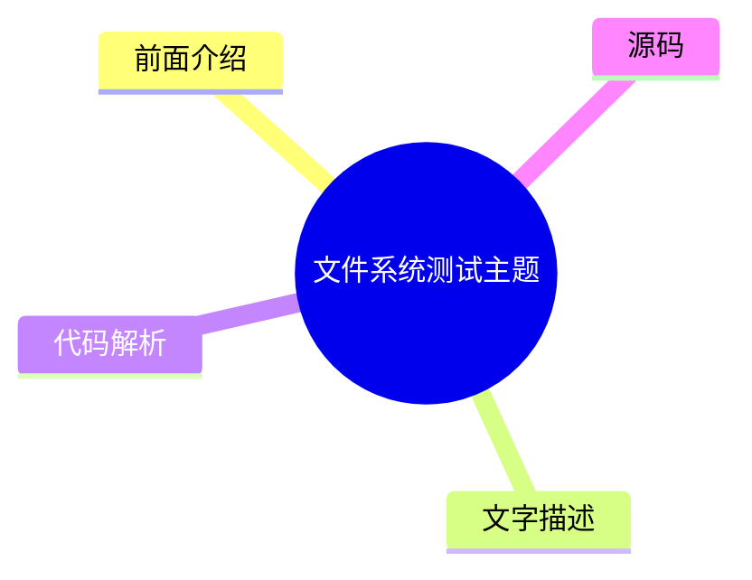
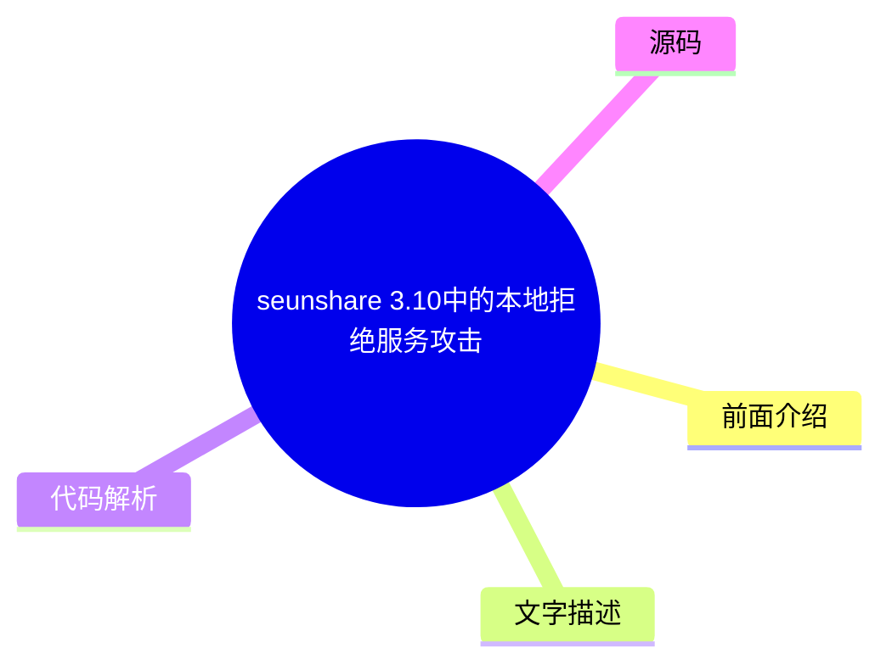
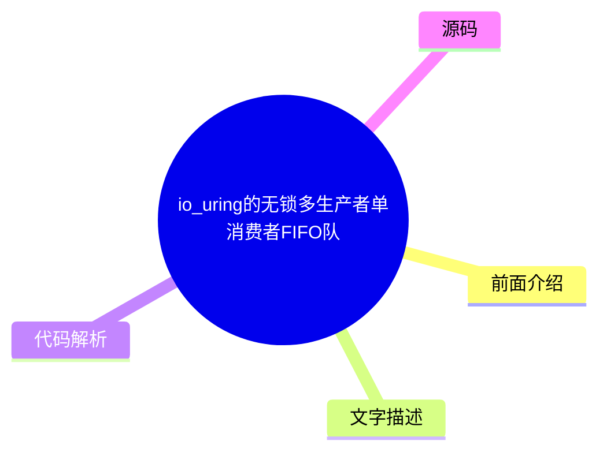
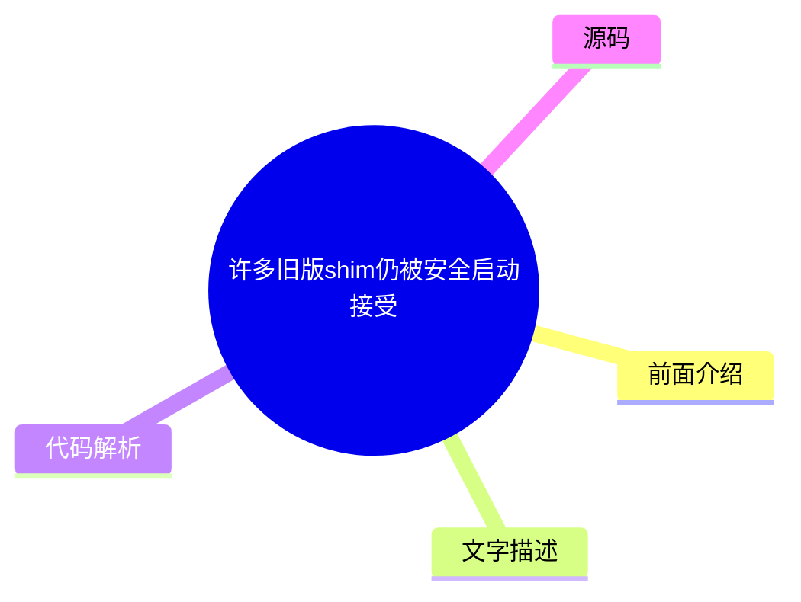
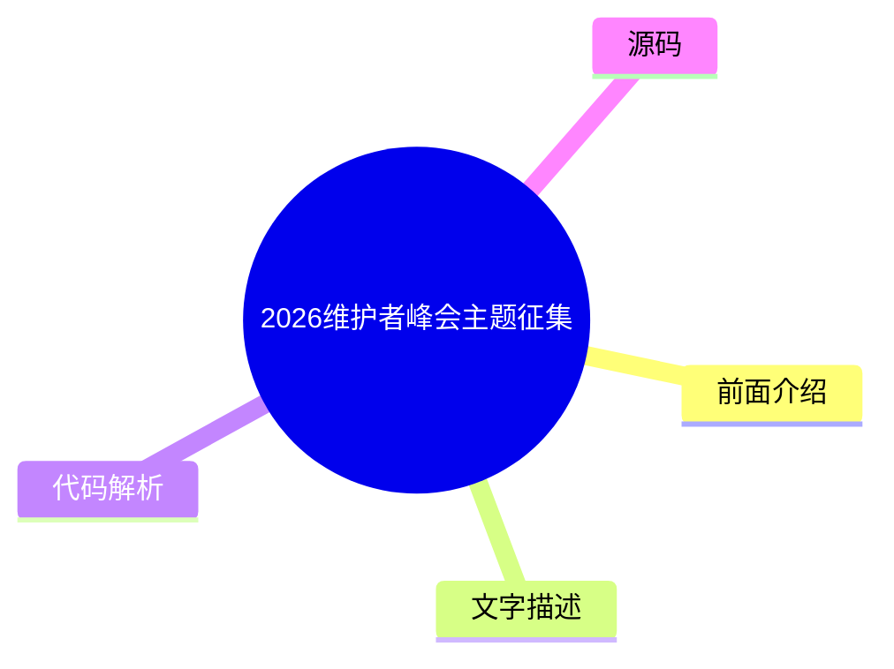
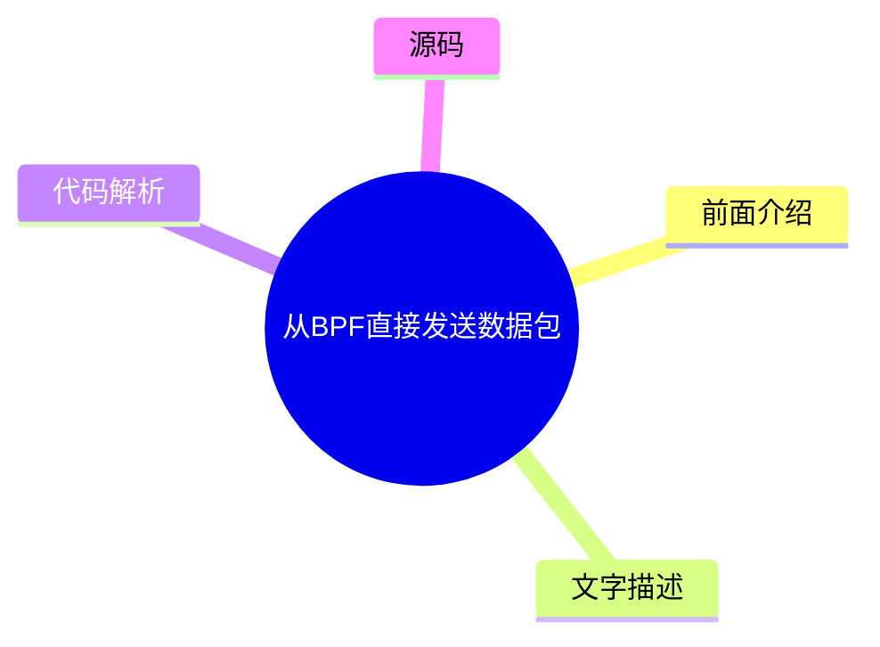

# 🐧 LWN.net (Linux kernel) Top 8 (2026-07-18)

## 前面介绍

- 数据源：LWN.net (Linux kernel)
- 抓取日期：2026-07-18
- 条目数：8
- 含完整正文：5
- 含代码片段：0
- 组织方式：前面介绍 / 树状图 / 文字描述 / 代码解析 / 源码

## 思维导图

```mermaid
mindmap
  root((LWN.net (Linux kernel)))
    文件系统测试主题
    seunshare 3.10中的本地拒绝服务攻击向量
    io_uring的无锁多生产者单消费者FIFO队列
    周三安全更新汇总
    许多旧版shim仍被安全启动接受
    Linux.org的兴衰史
    2026维护者峰会主题征集
    从BPF直接发送数据包
```

## 详细整理（8 条，5 条含全文，0 条含代码）

### 1. 文件系统测试主题
- **链接**: [https://lwn.net/Articles/1082342/](https://lwn.net/Articles/1082342/)
- **作者**: jake
- **发布**: Wed, 15 Jul 2026 16:19:26 +0000

#### 前面介绍

- 文件系统开发者聚集讨论测试策略
- 该主题是Linux存储、文件系统、内存管理和BPF峰会的主要议题之一
- 2026年峰会延续了这一传统

#### 树状图



#### 文字描述

- 文件系统测试是Linux生态系统中的关键环节，确保存储系统的稳定性和可靠性
- 开发者们通过聚集讨论，分享测试方法、工具和最佳实践，以应对日益复杂的文件系统需求
- 这种定期的交流有助于推动文件系统技术的进步和标准化

#### 代码解析

- 本文未提供源码，以下为实现思路或结构解析

#### 源码

未抓到可展示源码或原文节选。


### 2. seunshare 3.10中的本地拒绝服务攻击向量
- **链接**: [https://lwn.net/Articles/1083076/](https://lwn.net/Articles/1083076/)
- **作者**: jzb
- **发布**: Wed, 15 Jul 2026 15:52:13 +0000

#### 前面介绍

- SUSE安全团队在seunshare 3.10中发现了两个本地拒绝服务漏洞
- 该工具用于SELinux隔离不可信程序，存在提权风险
- 漏洞已在3.11版本中修复

#### 树状图



#### 文字描述

- seunshare是一个用于SELinux隔离不可信程序的setuid-root二进制文件，其安全性至关重要
- 在目标SELinux策略下，交互用户执行seunshare时仍处于未限制域，导致漏洞利用可造成类似root的权限提升
- 攻击者可利用这些漏洞在SELinux强制模式下实现权限提升

#### 代码解析

- 本文未提供源码，以下为实现思路或结构解析

#### 源码

#### 中文节选

# seunshare 3.10 中的本地拒绝服务攻击向量 (SUSE 安全团队博客)

SUSE 安全团队博客有一篇[文章](https://security.opensuse.org/2026/07/15/selinux-seunshare.html)，分析了[ seunshare](https://man7.org/linux/man-pages/man8/seunshare.8.html)，这是 SELinux 用于隔离不受信任程序的组件。在审查该程序的[版本 3.10](https://github.com/SELinuxProject/selinux/releases/tag/3.10)时，团队发现了两个本地拒绝服务 (DoS) 攻击向量。

由于 seunshare 旨在在启用了 SELinux 的系统上运行，因此了解在利用此类 setuid-root 二进制文件中的漏洞时可以实现何种权限提升非常重要。许多启用了 SELinux 的系统（如 Fedora 和 openSUSE）默认使用“目标化”SELinux 策略。该策略专注于隔离知名的系统服务，但默认为交互式用户分配不受限的 SELinux 上下文，以在安全性和可用性之间取得平衡。目前，在 SELinux 策略中，从不受限域到 seunshare_t（定义于 seunshare 的 SELinux 策略中）没有域转换。这意味着 seunshare 的执行继续在不受限域中进行。因此，在交互式用户发起的攻击背景下，即使系统处于 SELinux 强制模式，以下漏洞的影响也将是类似 root 的权限提升。

请查看该文章以了解团队发现和时间的完整分析。漏洞已在[版本 3.11](https://github.com/SELinuxProject/selinux/releases/tag/3.11)中修复。

#### 完整正文（中文）

# seunshare 3.10 中的本地拒绝服务攻击向量 (SUSE 安全团队博客)

SUSE 安全团队博客有一篇[文章](https://security.opensuse.org/2026/07/15/selinux-seunshare.html)，分析了[ seunshare](https://man7.org/linux/man-pages/man8/seunshare.8.html)，这是 SELinux 用于隔离不受信任程序的组件。在审查该程序的[版本 3.10](https://github.com/SELinuxProject/selinux/releases/tag/3.10)时，团队发现了两个本地拒绝服务 (DoS) 攻击向量。

由于 seunshare 旨在在启用了 SELinux 的系统上运行，因此了解在利用此类 setuid-root 二进制文件中的漏洞时可以实现何种权限提升非常重要。许多启用了 SELinux 的系统（如 Fedora 和 openSUSE）默认使用“目标化”SELinux 策略。该策略专注于隔离知名的系统服务，但默认为交互式用户分配不受限的 SELinux 上下文，以在安全性和可用性之间取得平衡。目前，在 SELinux 策略中，从不受限域到 seunshare_t（定义于 seunshare 的 SELinux 策略中）没有域转换。这意味着 seunshare 的执行继续在不受限域中进行。因此，在交互式用户发起的攻击背景下，即使系统处于 SELinux 强制模式，以下漏洞的影响也将是类似 root 的权限提升。

请查看该文章以了解团队发现和时间的完整分析。漏洞已在[版本 3.11](https://github.com/SELinuxProject/selinux/releases/tag/3.11)中修复。


### 3. io_uring的无锁多生产者单消费者FIFO队列
- **链接**: [https://lwn.net/Articles/1081871/](https://lwn.net/Articles/1081871/)
- **作者**: corbet
- **发布**: Wed, 15 Jul 2026 13:35:43 +0000

#### 前面介绍

- io_uring旨在处理大量并发操作
- 需要高效管理大量进行中的操作
- 引入无锁队列以提升性能

#### 树状图



#### 文字描述

- 使用io_uring的进程通常需要同时处理大量操作，这是该API设计的核心目的
- io_uring子系统必须跟踪大量进行中的操作，这对数据结构和同步机制提出了高要求
- 无锁多生产者单消费者（MPSC）FIFO队列能有效减少锁竞争，提高吞吐量

#### 代码解析

- 本文未提供源码，以下为实现思路或结构解析

#### 源码

未抓到可展示源码或原文节选。


### 4. 周三安全更新汇总
- **链接**: [https://lwn.net/Articles/1083044/](https://lwn.net/Articles/1083044/)
- **作者**: jzb
- **发布**: Wed, 15 Jul 2026 13:19:02 +0000

#### 前面介绍

- AlmaLinux发布了包括内核、OpenSSL、Nginx等在内的多项安全更新
- Debian和Fedora也同步更新了多个软件包
- Oracle Linux更新了kernel、vim等关键组件

#### 树状图


#### 文字描述

- AlmaLinux更新了cifs-utils、corosync、cups、freerdp、git-lfs、openssl、nginx、php8.4、python-pillow等软件包
- Debian更新了grub2、libxfont、opam、wolfssl等LTS和稳定版软件包
- Fedora更新了freerdp、kernel、prometheus等软件包，涉及F43和F44版本
- Oracle Linux更新了kernel、nginx、vim、xorg-x11-server等软件包，涉及OL8和OL9版本
- Red Hat更新了python3.12，SUSE更新了afterburn

#### 代码解析

- 本文未提供源码，以下为实现思路或结构解析

#### 源码

#### 中文节选

# 周三安全更新

| 发行版 | ID | 发布 | 包 | 日期 | 
|---|---|---|---|---|
| AlmaLinux | [ALSA-2026:39575](https://lwn.net/Articles/1082951/) | 8 | cifs-utils | 2026-07-15 | 
| AlmaLinux | [ALSA-2026:19043](https://lwn.net/Articles/1082952/) | 10 | corosync | 2026-07-15 | 
| AlmaLinux | [ALSA-2026:39302](https://lwn.net/Articles/1082953/) | 10 | cups | 2026-07-15 | 
| AlmaLinux | [ALSA-2026:38501](https://lwn.net/Articles/1082954/) | 8 | freerdp | 2026-07-14 | 
| AlmaLinux | [ALSA-2026:39266](https://lwn.net/Articles/1082955/) | 8 | git-lfs | 2026-07-14 | 
| AlmaLinux | [ALSA-2026:22141](https://lwn.net/Articles/1082956/) | 10 | go-fdo-client 和 go-fdo-server | 2026-07-15 | 
| AlmaLinux | [ALSA-2026:38995](https://lwn.net/Articles/1082957/) | 8 | go-toolset:rhel8 | 2026-07-14 | 
| AlmaLinux | [ALSA-2026:39179](https://lwn.net/Articles/1082958/) | 8 | kernel | 2026-07-15 | 
| AlmaLinux | [ALSA-2026:39083](https://lwn.net/Articles/1082959/) | 8 | kernel | 2026-07-14 | 
| AlmaLinux | [ALSA-2026:39082](https://lwn.net/Articles/1082960/) | 8 | kernel-rt | 2026-07-14 | 
| AlmaLinux | [ALSA-2026:39180](https://lwn.net/Articles/1082961/) | 8 | kernel-rt | 2026-07-14 | 
| AlmaLinux | [ALSA-2026:39296](https://lwn.net/Articles/1082962/) | 10 | libinput | 2026-07-15 | 
| AlmaLinux | [ALSA-2026:39304](https://lwn.net/Articles/1082963/) | 10 | libxml2 | 2026-07-15 | 
| AlmaLinux | [ALSA-2026:38847](https://lwn.net/Articles/1082964/) | 8 | nginx:1.24 | 2026-07-14 | 
| AlmaLinux | [ALSA-2026:38503](https://lwn.net/Articles/1082965/) | 8 | openssl | 2026-07-14 | 
| AlmaLinux | [ALSA-2026:39322](https://lwn.net/Articles/1082966/) | 8 | pacemaker | 2026-07-15 | 
| AlmaLinux | [ALSA-2026:38901](https://lwn.net/Articles/1082967/) | 8 | perl-DBI:1.641 | 2026-07-14 | 
| AlmaLinux | [ALSA-2026:22649](https://lwn.net/Articles/1082968/) | 10 | php8.4 | 2026-07-15 | 
| AlmaLinux | [ALSA-2026:39127](https://lwn.net/Articles/1082969/) | 8 | python-pillow | 2026-07-14 | 
| AlmaLinux | [ALSA-2026:39320](https://lwn.net/Articles/1082970/) | 8 | python3 | 2026-07-15 | 
| AlmaLinux | [ALSA-2026:39183](https://lwn.net/Articles/1082971/) | 10 | python3.12 | 2026-07-15 |

| Debian | [DLA-4685-1](https://lwn.net/Articles/1082972/) | LTS | grub2 | 2026-07-15 | 
| Debian | [DSA-6388-1](https://lwn.net/Articles/1082973/) | stable | libxfont | 2026-07-15 | 
| Debian | [DLA-4684-1](https://lwn.net/Articles/1082974/) | LTS | opam | 2026-07-15 | 
| Debian | [DLA-4683-1](https://lwn.net/Articles/1082975/) | LTS | wolfssl | 2026-07-15 | 
| Fedora | [FEDORA-2026-e2afc3151d](https://lwn.net/Articles/1082977/) | F43 | freerdp | 2026-07-15 | 
| Fedora | [FEDORA-2026-931f893f1b](https://lwn.net/Articles/1082976/) | F44 | freerdp | 2026-07-15 | 
| Fedora | [FEDORA-2026-085c9e92a4](https://lwn.net/Articles/1082978/) | F43 | kernel | 2026-07-14 | 
| Fedora | [FEDORA-2026-e8e294a7fa](https://lwn.net/Articles/1082979/) | F44 | kernel | 2026-07-14 | 
| Fedora | [FEDORA-2026-6a4

#### 完整正文（中文）

# 周三安全更新

| 发行版 | ID | 发布 | 包 | 日期 | 
|---|---|---|---|---|
| AlmaLinux | [ALSA-2026:39575](https://lwn.net/Articles/1082951/) | 8 | cifs-utils | 2026-07-15 | 
| AlmaLinux | [ALSA-2026:19043](https://lwn.net/Articles/1082952/) | 10 | corosync | 2026-07-15 | 
| AlmaLinux | [ALSA-2026:39302](https://lwn.net/Articles/1082953/) | 10 | cups | 2026-07-15 | 
| AlmaLinux | [ALSA-2026:38501](https://lwn.net/Articles/1082954/) | 8 | freerdp | 2026-07-14 | 
| AlmaLinux | [ALSA-2026:39266](https://lwn.net/Articles/1082955/) | 8 | git-lfs | 2026-07-14 | 
| AlmaLinux | [ALSA-2026:22141](https://lwn.net/Articles/1082956/) | 10 | go-fdo-client 和 go-fdo-server | 2026-07-15 | 
| AlmaLinux | [ALSA-2026:38995](https://lwn.net/Articles/1082957/) | 8 | go-toolset:rhel8 | 2026-07-14 | 
| AlmaLinux | [ALSA-2026:39179](https://lwn.net/Articles/1082958/) | 8 | kernel | 2026-07-15 | 
| AlmaLinux | [ALSA-2026:39083](https://lwn.net/Articles/1082959/) | 8 | kernel | 2026-07-14 | 
| AlmaLinux | [ALSA-2026:39082](https://lwn.net/Articles/1082960/) | 8 | kernel-rt | 2026-07-14 | 
| AlmaLinux | [ALSA-2026:39180](https://lwn.net/Articles/1082961/) | 8 | kernel-rt | 2026-07-14 | 
| AlmaLinux | [ALSA-2026:39296](https://lwn.net/Articles/1082962/) | 10 | libinput | 2026-07-15 | 
| AlmaLinux | [ALSA-2026:39304](https://lwn.net/Articles/1082963/) | 10 | libxml2 | 2026-07-15 | 
| AlmaLinux | [ALSA-2026:38847](https://lwn.net/Articles/1082964/) | 8 | nginx:1.24 | 2026-07-14 | 
| AlmaLinux | [ALSA-2026:38503](https://lwn.net/Articles/1082965/) | 8 | openssl | 2026-07-14 | 
| AlmaLinux | [ALSA-2026:39322](https://lwn.net/Articles/1082966/) | 8 | pacemaker | 2026-07-15 | 
| AlmaLinux | [ALSA-2026:38901](https://lwn.net/Articles/1082967/) | 8 | perl-DBI:1.641 | 2026-07-14 | 
| AlmaLinux | [ALSA-2026:22649](https://lwn.net/Articles/1082968/) | 10 | php8.4 | 2026-07-15 | 
| AlmaLinux | [ALSA-2026:39127](https://lwn.net/Articles/1082969/) | 8 | python-pillow | 2026-07-14 | 
| AlmaLinux | [ALSA-2026:39320](https://lwn.net/Articles/1082970/) | 8 | python3 | 2026-07-15 | 
| AlmaLinux | [ALSA-2026:39183](https://lwn.net/Articles/1082971/) | 10 | python3.12 | 2026-07-15 |

| Debian | [DLA-4685-1](https://lwn.net/Articles/1082972/) | LTS | grub2 | 2026-07-15 | 
| Debian | [DSA-6388-1](https://lwn.net/Articles/1082973/) | stable | libxfont | 2026-07-15 | 
| Debian | [DLA-4684-1](https://lwn.net/Articles/1082974/) | LTS | opam | 2026-07-15 | 
| Debian | [DLA-4683-1](https://lwn.net/Articles/1082975/) | LTS | wolfssl | 2026-07-15 | 
| Fedora | [FEDORA-2026-e2afc3151d](https://lwn.net/Articles/1082977/) | F43 | freerdp | 2026-07-15 | 
| Fedora | [FEDORA-2026-931f893f1b](https://lwn.net/Articles/1082976/) | F44 | freerdp | 2026-07-15 | 
| Fedora | [FEDORA-2026-085c9e92a4](https://lwn.net/Articles/1082978/) | F43 | kernel | 2026-07-14 | 
| Fedora | [FEDORA-2026-e8e294a7fa](https://lwn.net/Articles/1082979/) | F44 | kernel | 2026-07-14 | 
| Fedora | [FEDORA-2026-6a44db4fa9](https://lwn.net/Articles/1082980/) | F43 | prometheus | 2026-07-14 | 
| Fedora | [FEDORA-2026-e07fd81708](https://lwn.net/Articles/1082981/) | F44 | prometheus | 2026-07-14 | 
| Mageia | [MGASA-2026-0252](https://lwn.net/Articles/1082982/) | 10 | imagemagick | 2026-07-14 | 
| Oracle | [ELSA-2026-38493](https://lwn.net/Articles/1082983/) | OL9 | buildah | 2026-07-14 | 
| Oracle | [ELSA-2026-38501](https://lwn.net/Articles/1082984/) | OL8 | freerdp | 2026-07-14 | 
| Oracle | [ELSA-2026-38496](https://lwn.net/Articles/1082985/) | OL9 | gimp | 2026-07-14 | 
| Oracle | [ELSA-2026-33743](https://lwn.net/Articles/1082986/) | OL8 | kernel | 2026-07-14 | 
| Oracle | [ELSA-2026-36366](https://lwn.net/Articles/1082987/) | OL8 | kernel | 2026-07-14 | 
| Oracle | [ELSA-2026-36957](https://lwn.net/Articles/1082988/) | OL9 | kernel | 2026-07-14 | 
| Oracle | [ELSA-2026-36331](https://lwn.net/Articles/1082989/) | OL9 | nginx | 2026-07-14 | 
| Oracle | [ELSA-2026-38498](https://lwn.net/Articles/1082990/) | OL9 | openexr | 2026-07-14 | 
| Oracle | [ELSA-2026-38503](https://lwn.net/Articles/1082991/) | OL8 | openssl | 2026-07-14 | 
| Oracle | [ELSA-2026-38512](https://lwn.net/Articles/1082992/) | OL9 | perl-DBI | 2026-07-14 | 
| Oracle | [ELSA-2026-38878](https://lwn.net/Articles/1082993/) | OL9 | podman | 2026-07-14 |

| Oracle | [ELSA-2026-38510](https://lwn.net/Articles/1082994/) | OL8 | vim | 2026-07-14 | 
| Oracle | [ELSA-2026-38511](https://lwn.net/Articles/1082995/) | OL9 | vim | 2026-07-14 | 
| Oracle | [ELSA-2026-38486](https://lwn.net/Articles/1082996/) | OL9 | xorg-x11-server | 2026-07-14 | 
| Oracle | [ELSA-2026-38488](https://lwn.net/Articles/1082997/) | OL8 | xorg-x11-server-Xwayland | 2026-07-14 | 
| Red Hat | [RHSA-2026:39893-01](https://lwn.net/Articles/1082947/) | EL8 | python3.12 | 2026-07-15 | 
| SUSE | [openSUSE-SU-2026:11255-1](https://lwn.net/Articles/1082998/) | TW | afterburn | 2026-07-14 | 
| SUSE | [openSUSE-SU-2026:0243-1](https://lwn.net/Articles/1082999/) | osB15 | afterburn | 2026-07-14 | 
| SUSE | [SUSE-SU-2026:2964-1](https://lwn.net/Articles/1083000/) | SLE15 oS15.4 | buildah | 2026-07-14 | 
| SUSE | [openSUSE-SU-2026:11256-1](https://lwn.net/Articles/1083001/) | TW | busybox | 2026-07-14 | 
| SUSE | [openSUSE-SU-2026:0245-1](https://lwn.net/Articles/1083002/) | osB15 | enc | 2026-07-15 | 
| SUSE | [openSUSE-SU-2026:11257-1](https://lwn.net/Articles/1083003/) | TW | freetype2-devel | 2026-07-14 | 
| SUSE | [openSUSE-SU-2026:21324-1](https://lwn.net/Articles/1083004/) | oS16.0 | go1.25 | 2026-07-15 | 
| SUSE | [openSUSE-SU-2026:21319-1](https://lwn.net/Articles/1083005/) | oS16.0 | go1.25-openssl | 2026-07-15 | 
| SUSE | [openSUSE-SU-2026:21321-1](https://lwn.net/Articles/1083006/) | oS16.0 | go1.26-openssl | 2026-07-15 | 
| SUSE | [openSUSE-SU-2026:0244-1](https://lwn.net/Articles/1083007/) | osB15 | gosec | 2026-07-15 | 
| SUSE | [openSUSE-SU-2026:21351-1](https://lwn.net/Articles/1083008/) | oS16.0 | grafana | 2026-07-15 | 
| SUSE | [openSUSE-SU-2026:21331-1](https://lwn.net/Articles/1083009/) | oS16.0 | helm | 2026-07-15 | 
| SUSE | [SUSE-SU-2026:2954-1](https://lwn.net/Articles/1083010/) | SLE15 SLE5.3 SLE5.4 SLE-m5.3 SLE-m5.4 oS15.4 | krb5 | 2026-07-14 | 
| SUSE | [SUSE-SU-2026:2965-1](https://lwn.net/Articles/1083011/) | SLE15 oS15.6 | kubernetes-old | 2026-07-14 | 
| SUSE | [openSUSE-SU-2026:11259-1](https://lwn.net/Articles/1083012/) | TW | libopenbabel8 | 2026-07-14 |

| SUSE | [openSUSE-SU-2026:11258-1](https://lwn.net/Articles/1083014/) | TW | libxml2-16 | 2026-07-14 | 
| SUSE | [openSUSE-SU-2026:21317-1](https://lwn.net/Articles/1083013/) | oS16.0 | libxml2 | 2026-07-15 | 
| SUSE | [openSUSE-SU-2026:21333-1](https://lwn.net/Articles/1083015/) | oS16.0 | nasm | 2026-07-15 | 
| SUSE | [SUSE-SU-2026:3005-1](https://lwn.net/Articles/1083017/) | SLE15 oS15.5 | openssl-3 | 2026-07-15 | 
| SUSE | [SUSE-SU-2026:3004-1](https://lwn.net/Articles/1083016/) | SLE15 oS15.6 | openssl-3 | 2026-07-15 | 
| SUSE | [openSUSE-SU-2026:11260-1](https://lwn.net/Articles/1083019/) | TW | patch | 2026-07-14 | 
| SUSE | [openSUSE-SU-2026:21332-1](https://lwn.net/Articles/1083018/) | oS16.0 | patch | 2026-07-15 | 
| SUSE | [SUSE-SU-2026:2968-1](https://lwn.net/Articles/1083020/) | SLE15 oS15.6 | python-Authlib | 2026-07-14 | 
| SUSE | [SUSE-SU-2026:2949-1](https://lwn.net/Articles/1083022/) | SLE15 oS15.4 | python-mistune | 2026-07-14 | 
| SUSE | [openSUSE-SU-2026:21339-1](https://lwn.net/Articles/1083021/) | oS16.0 | python-mistune | 2026-07-15 | 
| SUSE | [openSUSE-SU-2026:21342-1](https://lwn.net/Articles/1083023/) | oS16.0 | python-soupsieve | 2026-07-15 | 
| SUSE | [openSUSE-SU-2026:21343-1](https://lwn.net/Articles/1083024/) | oS16.0 | python-sqlparse | 2026-07-15 | 
| SUSE | [SUSE-SU-2026:2984-1](https://lwn.net/Articles/1083025/) | SLE15 oS15.4 | python3-dulwich | 2026-07-14 | 
| SUSE | [openSUSE-SU-2026:11261-1](https://lwn.net/Articles/1083026/) | TW | python313-Pillow | 2026-07-14 | 
| SUSE | [SUSE-SU-2026:3000-1](https://lwn.net/Articles/1083027/) | SLE15 oS15.6 | rootlesskit | 2026-07-15 | 
| SUSE | [openSUSE-SU-2026:11262-1](https://lwn.net/Articles/1083028/) | TW | sbootutil-1 | 2026-07-14 | 
| SUSE | [openSUSE-SU-2026:21327-1](https://lwn.net/Articles/1083029/) | oS16.0 | tomcat | 2026-07-15 | 
| SUSE | [openSUSE-SU-2026:21329-1](https://lwn.net/Articles/1083030/) | oS16.0 | tomcat11 | 2026-07-15 | 
| Ubuntu | [USN-8538-1](https://lwn.net/Articles/1083031/) | 22.04 24.04 26.04 | alsa-lib | 2026-07-14 | 
| Ubuntu | [USN-8542-1](https://lwn.net/Articles/1083032/) | 16.04 18.04 20.04 22.04 24.04 26.04 | dnsmasq | 2026-07-14 |

| Ubuntu | [USN-8539-1](https://lwn.net/Articles/1083033/) | 16.04 18.04 20.04 | gnutls28 | 2026-07-14 | 
| Ubuntu | [USN-8526-2](https://lwn.net/Articles/1083034/) | 24.04 | libheif | 2026-07-14 | 
| Ubuntu | [USN-8548-1](https://lwn.net/Articles/1083035/) | 14.04 16.04 | linux-aws, linux-fips, linux-lts-xenial | 2026-07-15 | 
| Ubuntu | [USN-8547-1](https://lwn.net/Articles/1083036/) | 20.04 | linux-gcp-5.15, linux-intel-iotg-5.15 | 2026-07-15 | 
| Ubuntu | [USN-8545-1](https://lwn.net/Articles/1083037/) | 24.04 | linux-hwe-6.17 | 2026-07-15 | 
| Ubuntu | [USN-8546-1](https://lwn.net/Articles/1083038/) | 25.10 | linux-raspi | 2026-07-15 | 
| Ubuntu | [USN-8536-1](https://lwn.net/Articles/1083039/) | 26.04 | mariadb | 2026-07-14 | 
| Ubuntu | [USN-8540-1](https://lwn.net/Articles/1083040/) | 22.04 24.04 26.04 | openvpn | 2026-07-14 | 
| Ubuntu | [USN-8537-1](https://lwn.net/Articles/1083041/) | 22.04 24.04 26.04 | python-httplib2 | 2026-07-14 | 
| Ubuntu | [USN-8541-1](https://lwn.net/Articles/1083042/) | 14.04 16.04 18.04 20.04 22.04 24.04 26.04 | vim | 2026-07-14 | 
| Ubuntu | [USN-8543-1](https://lwn.net/Articles/1083043/) | 14.04 16.04 18.04 20.04 22.04 24.04 26.04 | wget | 2026-07-14 |


### 5. 许多旧版shim仍被安全启动接受
- **链接**: [https://lwn.net/Articles/1082940/](https://lwn.net/Articles/1082940/)
- **作者**: corbet
- **发布**: Wed, 15 Jul 2026 12:49:36 +0000

#### 前面介绍

- CERT协调中心发布警告，许多可利用的shim版本未加入撤销列表
- 攻击者可利用漏洞绕过安全启动保护
- 可能导致系统持久性被攻陷

#### 树状图



#### 文字描述

- UEFI安全启动使用的shim二进制文件中，许多可利用版本从未被加入撤销列表
- 攻击者若具备管理权限或修改启动流程的能力，可利用漏洞绕过安全启动保护
- 在操作系统加载前执行任意代码，可能导致平台持久性被攻陷，包括加载未签名或恶意内核组件

#### 代码解析

- 本文未提供源码，以下为实现思路或结构解析

#### 源码

#### 中文节选

# 许多旧版本的 shim 仍被安全启动接受

[安全公告](https://kb.cert.org/vuls/id/616257)指出，许多可被利用的 shim 二进制文件版本从未被添加到撤销列表中，这些 shim 二进制文件用于在启用 UEFI 安全启动的系统上启动 Linux。

拥有管理员权限或能够修改启动过程的攻击者，可以使用其中一个易受攻击的 shim 引导加载程序来绕过安全启动保护，并在操作系统加载之前执行任意代码。在此早期启动阶段执行的代码可能会实现对平台的持久性入侵，包括加载未签名或恶意内核组件的能力，这些组件能够经受住系统重启，并在某些情况下经受住操作系统的重新安装。

该公告包含一个易受攻击的 shim 列表。

#### 完整正文（中文）

# 许多旧版本的 shim 仍被安全启动接受

[安全公告](https://kb.cert.org/vuls/id/616257)指出，许多可被利用的 shim 二进制文件版本从未被添加到撤销列表中，这些 shim 二进制文件用于在启用 UEFI 安全启动的系统上启动 Linux。

拥有管理员权限或能够修改启动过程的攻击者，可以使用其中一个易受攻击的 shim 引导加载程序来绕过安全启动保护，并在操作系统加载之前执行任意代码。在此早期启动阶段执行的代码可能会实现对平台的持久性入侵，包括加载未签名或恶意内核组件的能力，这些组件能够经受住系统重启，并在某些情况下经受住操作系统的重新安装。

该公告包含一个易受攻击的 shim 列表。


### 6. Linux.org的兴衰史
- **链接**: [https://lwn.net/Articles/1082901/](https://lwn.net/Articles/1082901/)
- **作者**: corbet
- **发布**: Tue, 14 Jul 2026 16:50:47 +0000

#### 前面介绍

- Linux.org是最早的Linux相关网站之一，由Michael McLagan于1994年创立
- 该网站填补了Linux早期缺乏信息基础设施的空白
- 近期该网站经历了重生

#### 树状图


#### 文字描述

- Linux.org成立于1994年5月，当时Linux仅发布三年，Linus Torvalds刚刚向世界发布
- 当时没有搜索引擎、维基百科，新手很难找到学习资源，Michael McLagan建立了该网站以填补这一空白
- 该网站旨在让人们了解Linux并关注其发展历程，近期经历了重生

#### 代码解析

- 本文未提供源码，以下为实现思路或结构解析

#### 源码

#### 中文节选

# Linux.org 的故事

[发布了故事](https://www.linux.org/threads/the-linux-org-story.68810/)，讲述了

[Linux.org](https://linux.org/)—— 一个最早的 Linux 相关网站之一——及其近期的重生。

该网站由 Michael McLagan 于 1994 年 5 月创立，当时 Linux 本身还不到三岁。Linus Torvalds 刚刚将其发布到世界上，对于新手来说没有真正的方法来站稳脚跟，没有搜索引擎，没有维基百科，没有人们现在理所当然地用于了解一项新技术的任何基础设施。Michael 建立了 linux.org 来填补这一空白，这是一个让人们了解 Linux 并随着其发展而关注该运动的地方。

#### 完整正文（中文）

# Linux.org 的故事

[发布了故事](https://www.linux.org/threads/the-linux-org-story.68810/)，讲述了

[Linux.org](https://linux.org/)—— 一个最早的 Linux 相关网站之一——及其近期的重生。

该网站由 Michael McLagan 于 1994 年 5 月创立，当时 Linux 本身还不到三岁。Linus Torvalds 刚刚将其发布到世界上，对于新手来说没有真正的方法来站稳脚跟，没有搜索引擎，没有维基百科，没有人们现在理所当然地用于了解一项新技术的任何基础设施。Michael 建立了 linux.org 来填补这一空白，这是一个让人们了解 Linux 并随着其发展而关注该运动的地方。


### 7. 2026维护者峰会主题征集
- **链接**: [https://lwn.net/Articles/1082838/](https://lwn.net/Articles/1082838/)
- **作者**: corbet
- **发布**: Tue, 14 Jul 2026 13:41:12 +0000

#### 前面介绍

- 维护者峰会是年度邀请制开发者会议
- 旨在讨论开发流程问题
- 提交主题有助于获得参会邀请

#### 树状图



#### 文字描述

- 维护者峰会是年度邀请制开发者会议，旨在讨论开发流程问题
- 2026年峰会将于10月8日在布拉格举行，现已发出主题征集
- 提交高质量主题是获得邀请的最佳方式之一，建议在7月24日前提交

#### 代码解析

- 本文未提供源码，以下为实现思路或结构解析

#### 源码

#### 中文节选

# 2026 维护者峰会主题征集

[LWN 对 2025 年维护者峰会的报道](/Articles/1049982/)可作为示例。2026 年大会（布拉格，10 月 8 日）的[主题征集](/ml/all/alW3eJ9x6iJ8Juhi@mit.edu)已发出。获得峰会邀请的最佳方式之一是提交一份优秀的主题提案。为了获得最佳考虑，主题应在 7 月 24 日前提交。

#### 完整正文（中文）

# 2026 维护者峰会主题征集

[LWN 对 2025 年维护者峰会的报道](/Articles/1049982/)可作为示例。2026 年大会（布拉格，10 月 8 日）的[主题征集](/ml/all/alW3eJ9x6iJ8Juhi@mit.edu)已发出。获得峰会邀请的最佳方式之一是提交一份优秀的主题提案。为了获得最佳考虑，主题应在 7 月 24 日前提交。


### 8. 从BPF直接发送数据包
- **链接**: [https://lwn.net/Articles/1081696/](https://lwn.net/Articles/1081696/)
- **作者**: daroc
- **发布**: Tue, 14 Jul 2026 13:16:52 +0000

#### 前面介绍

- Tetragon是基于BPF的安全监控工具
- 使用BPF监控内核运行并执行策略
- 将数据转发给用户空间监控服务

#### 树状图



#### 文字描述

- Tetragon是一个基于BPF的安全监控工具，用于监控运行中的内核不同方面并执行用户指定的策略
- 它将监控数据发送给用户空间进程，该进程再将数据转发给中央监控服务
- 这种架构允许在内核态进行高效监控，同时保持用户空间逻辑的灵活性

#### 代码解析

- 本文未提供源码，以下为实现思路或结构解析

#### 源码

未抓到可展示源码或原文节选。

