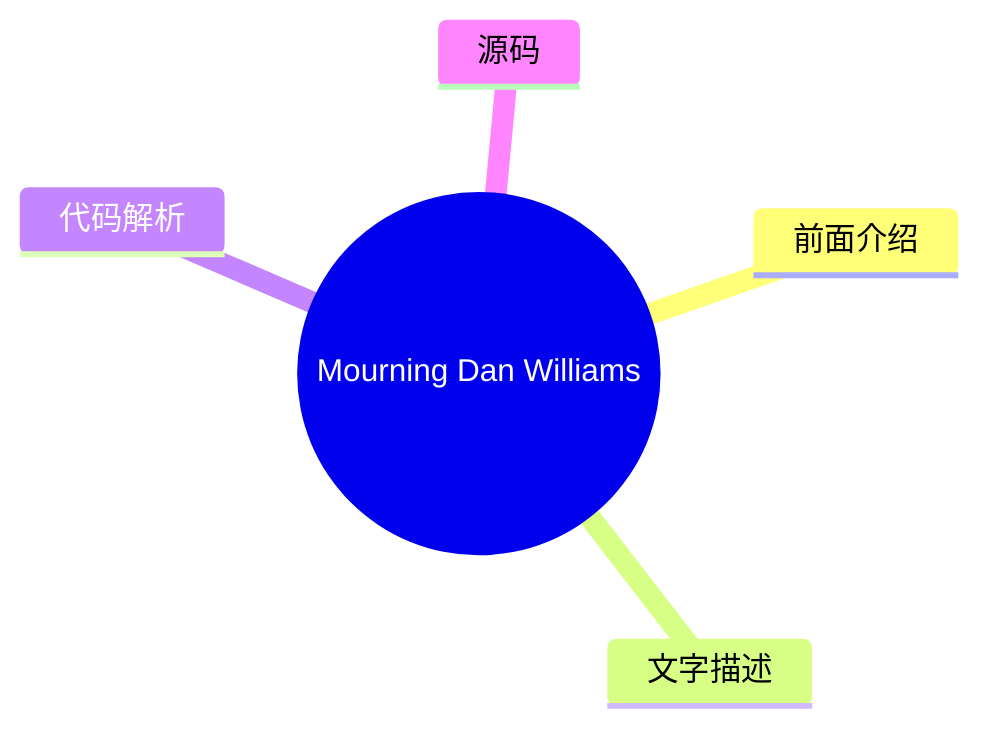
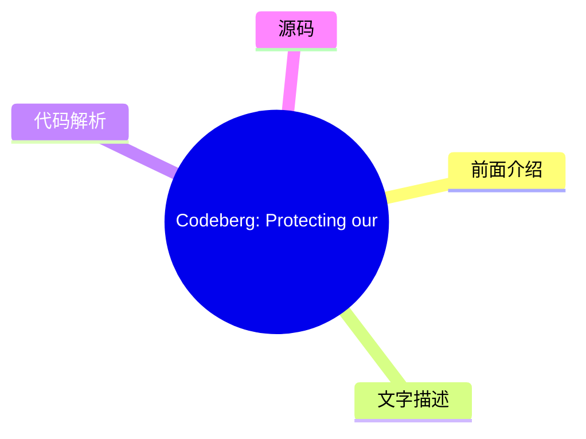
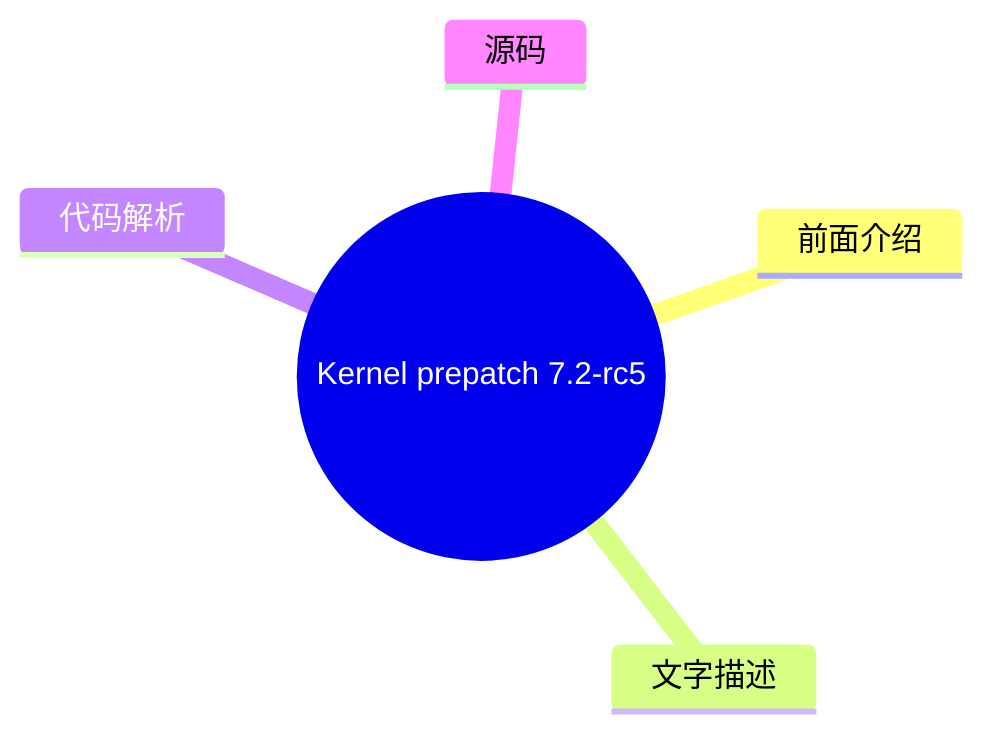
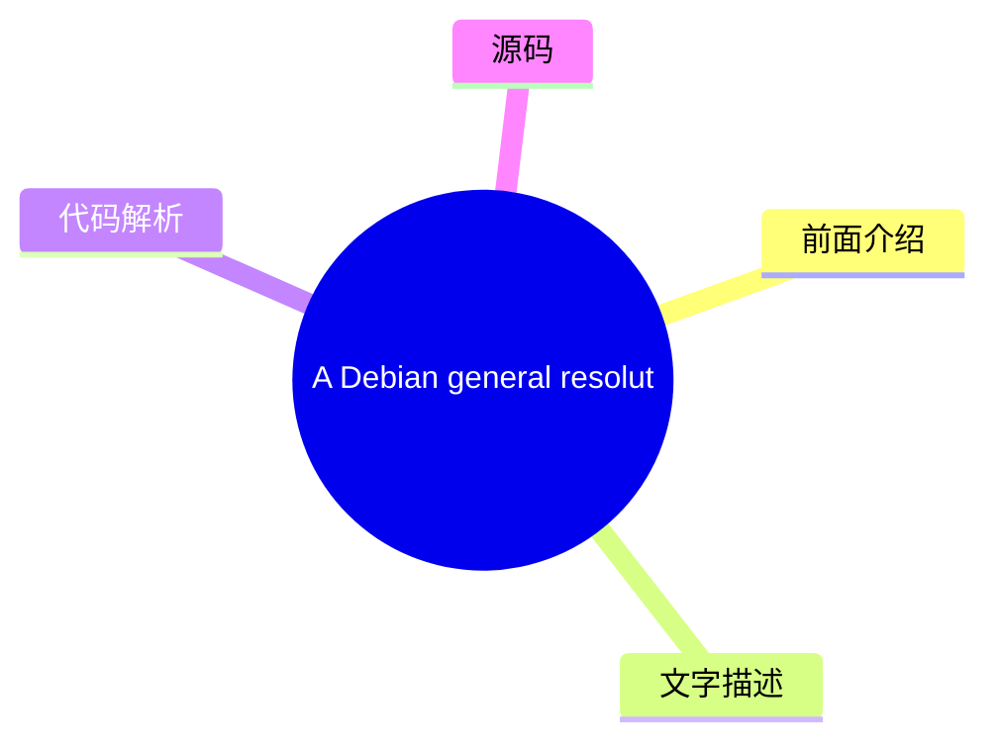
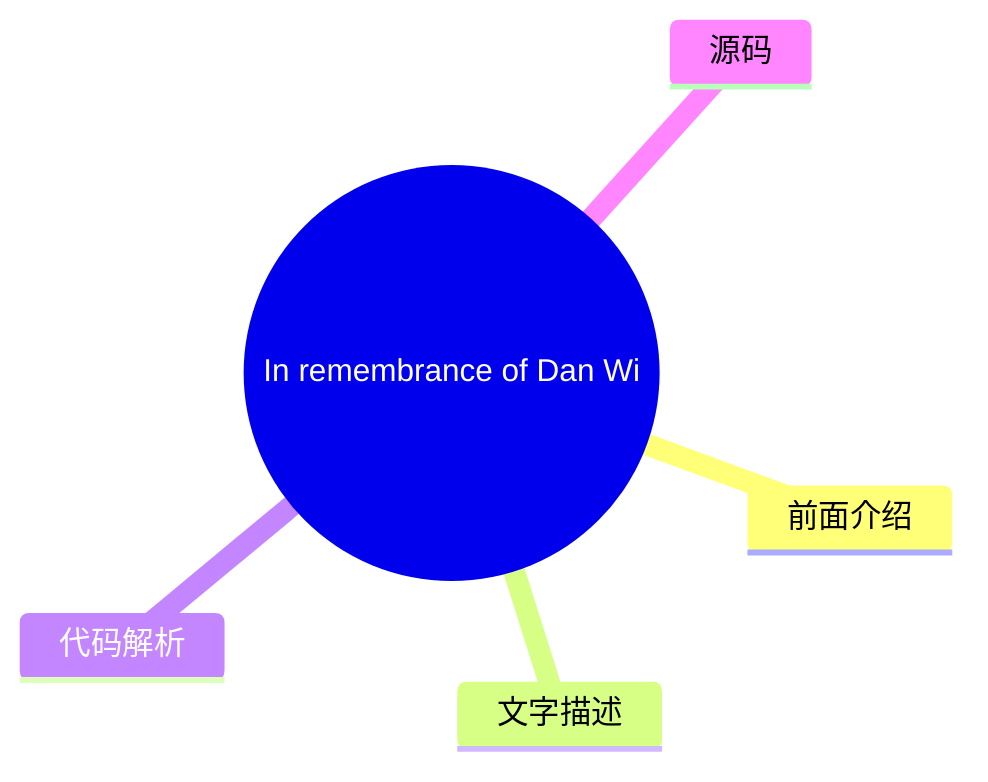
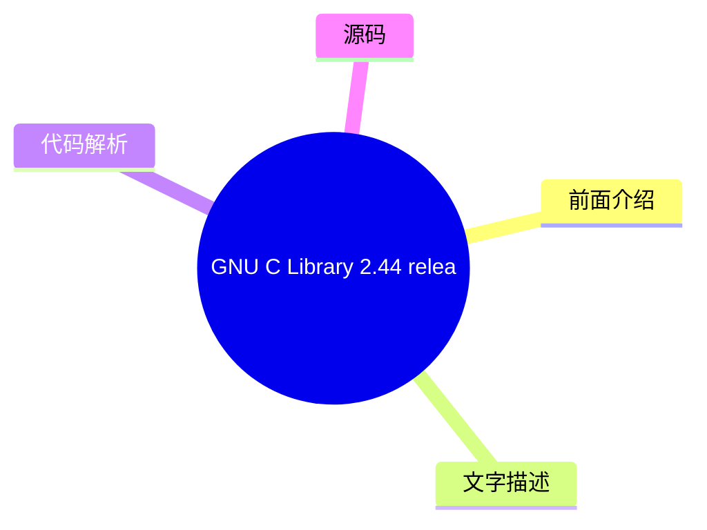

# 🐧 LWN.net (Linux kernel) Top 8 (2026-07-27)

## 前面介绍

- 数据源：LWN.net (Linux kernel)
- 抓取日期：2026-07-27
- 条目数：8
- 含完整正文：7
- 含代码片段：0
- 组织方式：前面介绍 / 树状图 / 文字描述 / 代码解析 / 源码

## 思维导图

```mermaid
mindmap
  root((LWN.net (Linux kernel)))
    Mourning Dan Williams
    [$] An operations structure 
    Codeberg: Protecting our FLO
    Kernel prepatch 7.2-rc5
    A Debian general resolution 
    In remembrance of Dan Willia
    Security updates for Saturda
    GNU C Library 2.44 released
```

## 详细整理（8 条，7 条含全文，0 条含代码）

### 1. Mourning Dan Williams
- **链接**: [https://lwn.net/Articles/1084545/](https://lwn.net/Articles/1084545/)
- **作者**: corbet
- **发布**: Thu, 23 Jul 2026 18:44:26 +0000

#### 前面介绍

- I have just received the shocking news that Dan Williams, a longtime,
high-profile kernel developer, has passed away.  I knew him primarily
through his long service on the Linux Foundation Technical Advisory Board;
he was always a strong, thoughtfu
- 作者：corbet
- 发布时间：Thu, 23 Jul 2026 18:44:26 +0000

#### 树状图



#### 文字描述

- # Mourning Dan Williams [I have just received the shocking news that Dan Williams, a longtime, high-profile kernel developer, has passed away. I knew him primarily through his long service on the Linux Foundation Technical Advisory Board; he was always a strong, thoughtful, and intelligent presence. Dan will be deeply missed.](/Articles/1072861/) There is [a support effort](htt

#### 代码解析

- 本文未检测到明确代码块，内容更偏新闻、观点或方法论。

#### 源码

#### 中文节选

# Mourning Dan Williams

[I have just received the shocking news that Dan Williams, a longtime, high-profile kernel developer, has passed away. I knew him primarily through his long service on the Linux Foundation Technical Advisory Board; he was always a strong, thoughtful, and intelligent presence. Dan will be deeply missed.](/Articles/1072861/)

There is [a support
effort](https://www.mealtrain.com/trains/mekrzl) underway for Dan's family as they come to terms with this loss.

The LWN site is currently under high scraper load, so comment display has been suppressed for anonymous users. If you are a human, you may read the comments by clicking the button below:


    **Note**: you can avoid this step in the future by logging
    into your LWN account.

#### 完整正文（中文）

# 哀悼 Dan Williams

[我刚刚收到了令人震惊的消息，长期且高调的内核开发者 Dan Williams 已经去世。我主要通过他在 Linux 基金会技术顾问委员会的长期任职了解他；他始终是一个强大、深思熟虑且充满智慧的存在。Dan 将被深深怀念。](/Articles/1072861/)

目前有一项[支持行动](https://www.mealtrain.com/trains/mekrzl)正在进行，以帮助 Dan 的家人应对这一损失。

LWN 网站目前正承受着高强度的爬虫负载，因此已对匿名用户的评论显示进行了屏蔽。如果您是人类，可以通过点击下方的按钮阅读评论：


    **注意**：您可以通过登录您的 LWN 账户在未来避免此步骤。


### 2. [$] An operations structure for swap devices
- **链接**: [https://lwn.net/Articles/1083094/](https://lwn.net/Articles/1083094/)
- **作者**: corbet
- **发布**: Thu, 23 Jul 2026 14:25:40 +0000

#### 前面介绍

- One of the ideas raised at the 2026 Linux
Storage, Filesystem, Memory Management, and BPF Summit (LSFMM+BPF) was
the creation of an
operations structure for the swap subsystem.  Like many parts of the
kernel, the swap layer evolved over time, with pi
- 作者：corbet
- 发布时间：Thu, 23 Jul 2026 14:25:40 +0000

#### 树状图

```mermaid
mindmap
  root(([$] An operations struct))
    前面介绍
    文字描述
    代码解析
    源码
```

#### 文字描述

- One of the ideas raised at the 2026 Linux
Storage, Filesystem, Memory Management, and BPF Summit (LSFMM+BPF) was
the creation of an
operations structure for the swap subsystem.  Like many parts of the
kernel, the swap layer evolved over time, with pi

#### 代码解析

- 本文未检测到明确代码块，内容更偏新闻、观点或方法论。

#### 源码

未抓到可展示源码或原文节选。


### 3. Codeberg: Protecting our FLOSS commons from LLMs
- **链接**: [https://lwn.net/Articles/1084404/](https://lwn.net/Articles/1084404/)
- **作者**: corbet
- **发布**: Thu, 23 Jul 2026 13:27:38 +0000

#### 前面介绍

- The Codeberg forge has adopted a pair of new policies, promising not to use
hosted projects to train LLMs and, more controversially, banning the
hosting of LLM-generated software.  The site's blog describes
and justifies these policies.


	Although o
- 作者：corbet
- 发布时间：Thu, 23 Jul 2026 13:27:38 +0000

#### 树状图



#### 文字描述

- # Codeberg: Protecting our FLOSS commons from LLMs [describes and justifies](https://blog.codeberg.org/protecting-our-floss-commons-from-llms.html)these policies. Although often well intentioned, sharing the result of a prompt and calling it "libre software" does not make the world a better place. Codeberg is not and does not want to be a place to dump such generated single-use

#### 代码解析

- 本文未检测到明确代码块，内容更偏新闻、观点或方法论。

#### 源码

#### 中文节选

# Codeberg：保护我们的 FLOSS 公共领域免受 LLMs 侵害

[描述并论证](https://blog.codeberg.org/protecting-our-floss-commons-from-llms.html)了这些政策。


尽管往往出于好意，但分享提示词的结果并将其称为“自由软件”并不能让世界变得更美好。Codeberg 不是，也不想成为一个倾倒此类生成的、仅使用一次且无人会查看的软件的地方。我们是一个让人们协作并共同改进软件的地方。在此背景下，最近的投票可以被视为对这些原则的重申：既然我们要以人类协作为中心，我们将不会积极支持或参与创建 LLMs，也不会将我们有限的资源用于存储会污染我们 FLOSS 公共领域的此类一次性软件。

LWN 网站目前正承受着高强度的爬虫负载，因此已对匿名用户屏蔽了评论显示。如果您是人类，可以通过点击下面的按钮阅读评论：


    **注意**：您可以通过登录您的 LWN 账户在未来避免此步骤。

#### 完整正文（中文）

# Codeberg：保护我们的 FLOSS 公共领域免受 LLMs 侵害

[描述并论证](https://blog.codeberg.org/protecting-our-floss-commons-from-llms.html)了这些政策。


尽管往往出于好意，但分享提示词的结果并将其称为“自由软件”并不能让世界变得更美好。Codeberg 不是，也不想成为一个倾倒此类生成的、仅使用一次且无人会查看的软件的地方。我们是一个让人们协作并共同改进软件的地方。在此背景下，最近的投票可以被视为对这些原则的重申：既然我们要以人类协作为中心，我们将不会积极支持或参与创建 LLMs，也不会将我们有限的资源用于存储会污染我们 FLOSS 公共领域的此类一次性软件。

LWN 网站目前正承受着高强度的爬虫负载，因此已对匿名用户屏蔽了评论显示。如果您是人类，可以通过点击下面的按钮阅读评论：


    **注意**：您可以通过登录您的 LWN 账户在未来避免此步骤。


### 4. Kernel prepatch 7.2-rc5
- **链接**: [https://lwn.net/Articles/1085422/](https://lwn.net/Articles/1085422/)
- **作者**: corbet
- **发布**: Sun, 26 Jul 2026 22:10:54 +0000

#### 前面介绍

- The 7.2-rc5 kernel prepatch is out for
testing.  Linus said: "So it's a bit too big for my liking, but nothing
in there strikes me as particularly strange or scary".
- 作者：corbet
- 发布时间：Sun, 26 Jul 2026 22:10:54 +0000

#### 树状图



#### 文字描述

- The 7.2-rc5 kernel prepatch is out for testing. Linus said: "So it's a bit too big for my liking, but nothing in there strikes me as particularly strange or scary".

#### 代码解析

- 本文未检测到明确代码块，内容更偏新闻、观点或方法论。

#### 源码

#### 中文节选

The 7.2-rc5 kernel prepatch is out for
testing. Linus said: "So it's a bit too big for my liking, but nothing
in there strikes me as particularly strange or scary".

#### 完整正文（中文）

The 7.2-rc5 kernel prepatch is out for
testing. Linus said: "So it's a bit too big for my liking, but nothing
in there strikes me as particularly strange or scary".


### 5. A Debian general resolution on LLM usage
- **链接**: [https://lwn.net/Articles/1085314/](https://lwn.net/Articles/1085314/)
- **作者**: corbet
- **发布**: Sat, 25 Jul 2026 23:14:16 +0000

#### 前面介绍

- The Debian project is considering a general
resolution on the use of large language models in the creation of the
distribution.  There are three alternatives to consider: a
total ban on LLM usage, rejecting LLMs "as far as practical", or
explicitly a
- 作者：corbet
- 发布时间：Sat, 25 Jul 2026 23:14:16 +0000

#### 树状图



#### 文字描述

- # A Debian general resolution on LLM usage [considering a general resolution](https://www.debian.org/vote/2026/vote_002)on the use of large language models in the creation of the distribution. There are three alternatives to consider: a total ban on LLM usage, rejecting LLMs " as far as practical", or explicitly allowing LLM usage subject to a set of conditions. The discussion 

#### 代码解析

- 本文未检测到明确代码块，内容更偏新闻、观点或方法论。

#### 源码

#### 中文节选

# A Debian general resolution on LLM usage

[considering a general resolution](https://www.debian.org/vote/2026/vote_002)on the use of large language models in the creation of the distribution. There are three alternatives to consider: a total ban on LLM usage, rejecting LLMs "

as far as practical", or explicitly allowing LLM usage subject to a set of conditions. The discussion period has just begun; the beginning of the voting period does not yet appear to have been set. Those who want to look over the discussion ahead of the inevitable LWN article can find it

[over here](/ml/all/til24c.3ns3jl2mkmzmn@riseup.net).

The LWN site is currently under high scraper load, so comment display has been suppressed for anonymous users. If you are a human, you may read the comments by clicking the button below:


    **Note**: you can avoid this step in the future by logging
    into your LWN account.

#### 完整正文（中文）

# A Debian general resolution on LLM usage

[considering a general resolution](https://www.debian.org/vote/2026/vote_002)on the use of large language models in the creation of the distribution. There are three alternatives to consider: a total ban on LLM usage, rejecting LLMs "

as far as practical", or explicitly allowing LLM usage subject to a set of conditions. The discussion period has just begun; the beginning of the voting period does not yet appear to have been set. Those who want to look over the discussion ahead of the inevitable LWN article can find it

[over here](/ml/all/til24c.3ns3jl2mkmzmn@riseup.net).

The LWN site is currently under high scraper load, so comment display has been suppressed for anonymous users. If you are a human, you may read the comments by clicking the button below:


    **Note**: you can avoid this step in the future by logging
    into your LWN account.


### 6. In remembrance of Dan Williams
- **链接**: [https://lwn.net/Articles/1085021/](https://lwn.net/Articles/1085021/)
- **作者**: corbet
- **发布**: Sat, 25 Jul 2026 14:29:51 +0000

#### 前面介绍

- On July 21, the kernel community lost Dan Williams, one of its most beloved
contributors.  Dave Hansen and Thomas Gleixner, both of whom worked with
Williams extensively, have written an obituary and allowed LWN to publish
it.  He will be deeply miss
- 作者：corbet
- 发布时间：Sat, 25 Jul 2026 14:29:51 +0000

#### 树状图



#### 文字描述

- # In remembrance of Dan Williams The following was written by Dave Hansen and Thomas Gleixner. The Linux Kernel community mourns the unexpected and premature [passing](https://www.facebook.com/1073351052/posts/10237727098491388/?rdid=XB7FMKpbsH50G6jy) of Dan Williams. Dan was a computer scientist with a focus on storage, persistent memory, filesystems and trusted computing. Asi

#### 代码解析

- 本文未检测到明确代码块，内容更偏新闻、观点或方法论。

#### 源码

#### 中文节选

# 致 Dan Williams

以下内容由 Dave Hansen 和 Thomas Gleixner 撰写。

Linux 内核社区为 Dan Williams 的意外早逝感到悲痛。

Dan 是一位计算机科学家，专注于存储、持久内存、文件系统和可信计算领域。除了他卓越的技术贡献外，他还曾担任并担任过 Linux 基金会技术顾问委员会的成员及主席。

他与 Linux 内核的接触始于一次实习。当时，IT 部门的一位同事向他介绍了内核和开源的概念。在实习期间，他不得不使用昂贵的高端 RAID 存储设备，他真的希望自己的家庭电脑也能拥有这样的设备。当他发现 Linux 最近获得了软件 RAID 支持时，他在家中建立 RAID 存储系统的梦想只需下载即可实现。能够自由下载、使用和修改代码让他着迷；尤其是当他理解到可以回馈社区，与他人分享他的改进时，这种感觉更加强烈。从那时起，成为一名专业的 Linux 内核开发者就成了他顺理成章的职业选择。他在内核社区最早的活跃记录可以追溯到 2004 年。

[
他早期的工作主要集中在存储技术相关的驱动程序上。在那之后，他被赋予了近乎不可能的任务：在硬件问世之前就引入对一种新型存储技术——持久内存的支持。尽管文件系统和存储维护者对迎合某家硬件公司的技术远大计划持犹豫态度，但 Dan 在为这种设备引入根本性的新概念（DAX）并将其应用于现有文件系统方面发挥了关键作用。在此基础上，他主导了下一代技术 Compute Express Link (CXL) 的引入，并参与了可信计算背景下安全设备的规范和概念工作。
](/Articles/1050294/)

Equally important as his technical achievements - if not more so - are his contributions to the human side of the Linux community and society at large. Due to his own life experience of navigating his mixed heritage, he was a dedicated advocate and mentor for minorities in the kernel community, in the corporate context and in general society. His remarkable ability to calm down heated discussions with a well received portion of humor and playful infectious laughter, but also with a clear and honest reminder to everyone involved to focus on facts, will be truly missed.

His engagement as a member and chairman of the Linux Foundation Technical Advisory Board is a testimony for this. He significantly contributed to the interpretation of the Code of Conduct and the actual implementation in practice, to the Kernel Contribution Maturity model and the documentation of Inclusive Terminology.

One o

#### 完整正文（中文）

# 致 Dan Williams

以下内容由 Dave Hansen 和 Thomas Gleixner 撰写。

Linux 内核社区为 Dan Williams 的意外早逝感到悲痛。

Dan 是一位计算机科学家，专注于存储、持久内存、文件系统和可信计算领域。除了他卓越的技术贡献外，他还曾担任并担任过 Linux 基金会技术顾问委员会的成员及主席。

他与 Linux 内核的接触始于一次实习。当时，IT 部门的一位同事向他介绍了内核和开源的概念。在实习期间，他不得不使用昂贵的高端 RAID 存储设备，他真的希望自己的家庭电脑也能拥有这样的设备。当他发现 Linux 最近获得了软件 RAID 支持时，他在家中建立 RAID 存储系统的梦想只需下载即可实现。能够自由下载、使用和修改代码让他着迷；尤其是当他理解到可以回馈社区，与他人分享他的改进时，这种感觉更加强烈。从那时起，成为一名专业的 Linux 内核开发者就成了他顺理成章的职业选择。他在内核社区最早的活跃记录可以追溯到 2004 年。

[
他早期的工作主要集中在存储技术相关的驱动程序上。在那之后，他被赋予了近乎不可能的任务：在硬件问世之前就引入对一种新型存储技术——持久内存的支持。尽管文件系统和存储维护者对迎合某家硬件公司的技术远大计划持犹豫态度，但 Dan 在为这种设备引入根本性的新概念（DAX）并将其应用于现有文件系统方面发挥了关键作用。在此基础上，他主导了下一代技术 Compute Express Link (CXL) 的引入，并参与了可信计算背景下安全设备的规范和概念工作。
](/Articles/1050294/)

Equally important as his technical achievements - if not more so - are his contributions to the human side of the Linux community and society at large. Due to his own life experience of navigating his mixed heritage, he was a dedicated advocate and mentor for minorities in the kernel community, in the corporate context and in general society. His remarkable ability to calm down heated discussions with a well received portion of humor and playful infectious laughter, but also with a clear and honest reminder to everyone involved to focus on facts, will be truly missed.

His engagement as a member and chairman of the Linux Foundation Technical Advisory Board is a testimony for this. He significantly contributed to the interpretation of the Code of Conduct and the actual implementation in practice, to the Kernel Contribution Maturity model and the documentation of Inclusive Terminology.

One of his former managers said about him: "He's the kindest and, at the same time, the most unwavering person on the planet". That's definitely an exception in the Linux kernel community where a lot of people are unwavering, but not necessarily kind about it.

His interests went way beyond all of this. He was generally interested in all aspects of life, from human interaction to politics, technology of all sorts, philosophy and beyond. A conversation with him in and outside of the technical space was always enriching, enjoyable and filled with a good portion of his wicked humor.

He was also a passionate competitive Latin ballroom dancer. A passion which made him meet and which he shared with the love of his life Catherine, who supported him through all the highs and lows of his career, but definitely with an opinion. When Dan shared a flight with Linus, he texted her to ask what she wanted to say to him. Her answer was a dry "Merge windows suck!".

His love for Catherine and his dedication for their three kids are known to everyone who had the privilege and the pleasure to get close to him. It's heartbreaking that they are suddenly left behind without him. Our hearts and thoughts are with Catherine, their kids and their families.


For sure everyone would prefer to suffer through merge windows than having to grieve his absence, though the traces Dan left through his kindness, friendship, technical work, his humor and incredible laughter will remain woven into our lives. The French poet Antoine de Saint-Exupéry wrote in 'The Little Prince': "In one of the stars I shall be living. In one of them I shall be laughing."

Dan's traces will always bring back grief, but they should also make us look up to the laughing star he left to comfort us.

If you want to express your condolences please send an email to
djbw@tglx.de. It will be passed on to the ones who he loved most.

The LWN site is currently under high scraper load, so comment display has been suppressed for anonymous users. If you are a human, you may read the comments by clicking the button below:


    **Note**: you can avoid this step in the future by logging
    into your LWN account.


### 7. Security updates for Saturday
- **链接**: [https://lwn.net/Articles/1085272/](https://lwn.net/Articles/1085272/)
- **作者**: corbet
- **发布**: Sat, 25 Jul 2026 14:00:47 +0000

#### 前面介绍

- Security updates have been issued by AlmaLinux (compat-openssl11, java-1.8.0-openjdk, java-17-openjdk, kernel, kernel-rt, and sssd), Debian (exim4), Fedora (chromium, dotnet10.0, mbedtls, mupdf, netatalk, python-django5, skopeo, sssd, and wget1), Mag
- 作者：corbet
- 发布时间：Sat, 25 Jul 2026 14:00:47 +0000

#### 树状图


#### 文字描述

- | Dist. | ID | Release | Package | Date | |---| | AlmaLinux | [ALSA-2026:44438](https://lwn.net/Articles/1085033/) | 9 | compat-openssl11 | 2026-07-24 | | AlmaLinux | [ALSA-2026:42877](https://lwn.net/Articles/1085035/) | 8 | java-1.8.0-openjdk | 2026-07-24 | | AlmaLinux | [ALSA-2026:42877](https://lwn.net/Articles/1085034/) | 9 | java-1.8.0-openjdk | 2026-07-24 | | AlmaLinux |

#### 代码解析

- 本文未检测到明确代码块，内容更偏新闻、观点或方法论。

#### 源码

#### 中文节选

| 发行版 | ID | 版本 | 包 | 日期 | 
|---|
| AlmaLinux | [ALSA-2026:44438](https://lwn.net/Articles/1085033/) | 9 | compat-openssl11 | 2026-07-24 | 
| AlmaLinux | [ALSA-2026:42877](https://lwn.net/Articles/1085035/) | 8 | java-1.8.0-openjdk | 2026-07-24 | 
| AlmaLinux | [ALSA-2026:42877](https://lwn.net/Articles/1085034/) | 9 | java-1.8.0-openjdk | 2026-07-24 | 
| AlmaLinux | [ALSA-2026:42887](https://lwn.net/Articles/1085037/) | 8 | java-17-openjdk | 2026-07-24 | 
| AlmaLinux | [ALSA-2026:42887](https://lwn.net/Articles/1085036/) | 9 | java-17-openjdk | 2026-07-24 | 
| AlmaLinux | [ALSA-2026:44270](https://lwn.net/Articles/1085040/) | 10 | kernel | 2026-07-25 | 
| AlmaLinux | [ALSA-2026:45115](https://lwn.net/Articles/1085039/) | 8 | kernel | 2026-07-24 | 
| AlmaLinux | [ALSA-2026:43307](https://lwn.net/Articles/1085038/) | 9 | kernel | 2026-07-24 | 
| AlmaLinux | [ALSA-2026:45116](https://lwn.net/Articles/1085041/) | 8 | kernel-rt | 2026-07-24 | 
| AlmaLinux | [ALSA-2026:42122](https://lwn.net/Articles/1085042/) | 9 | sssd | 2026-07-24 | 
| Debian | [DSA-6400-1](https://lwn.net/Articles/1085043/) | stable | exim4 | 2026-07-24 | 
| Fedora | [FEDORA-2026-acf674bc6a](https://lwn.net/Articles/1085045/) | F43 | chromium | 2026-07-25 | 
| Fedora | [FEDORA-2026-4870f59184](https://lwn.net/Articles/1085044/) | F44 | chromium | 2026-07-25 | 
| Fedora | [FEDORA-2026-d9817786d6](https://lwn.net/Articles/1085047/) | F43 | dotnet10.0 | 2026-07-25 | 
| Fedora | [FEDORA-2026-f738966fc9](https://lwn.net/Articles/1085046/) | F44 | dotnet10.0 | 2026-07-25 | 
| Fedora | [FEDORA-2026-0bb141710c](https://lwn.net/Articles/1085048/) | F43 | mbedtls | 2026-07-25 | 
| Fedora | [FEDORA-2026-8870088088](https://lwn.net/Articles/1085049/) | F43 | mupdf | 2026-07-25 | 
| Fedora | [FEDORA-2026-d085110cf3](https://lwn.net/Articles/1085050/) | F44 | netatalk | 2026-07-25 | 
| Fedora | [FEDORA-2026-fbb9501b22](https://lwn.net/Articles/1085051/) | F43 | python-django5 | 2026-07-25 | 
| Fedora | [FEDORA-2026-9b2e56edf5](https://lwn.net/Articles/1085052/) | F44 | skopeo | 2026-07-25 | 
| Fedora | [FEDORA-2026-9ab663dcd4](https://lwn.net/Articles/1085053/) | F43 | sssd | 2026-07-25 |

| Fedora | [FEDORA-2026-7bbb52b49d](https://lwn.net/Articles/1085054/) | F43 | wget1 | 2026-07-25 | 
| Mageia | [MGASA-2026-0294](https://lwn.net/Articles/1085055/) | 10, 9 | libevent | 2026-07-24 | 
| Mageia | [MGASA-2026-0293](https://lwn.net/Articles/1085056/) | 10 | transmission | 2026-07-24 | 
| Oracle | [ELSA-2026-41893](https://lwn.net/Articles/1085057/) | OL10 | .NET 8.0 | 2026-07-22 | 
| Oracle | [ELSA-2026-36196](https://lwn.net/Articles/1085058/) | OL10 | 389-ds-base | 2026-07-22 | 
| Oracle | [ELSA-2026-36782](https://lwn.net/Articles/1085059/) | OL10 | aardvark-dns | 2026-07-22 | 
| Oracle | [ELSA-2026-42739](https://lwn.net/Articles/1085060/) | OL10 | acl | 2026-07-22 | 
| Oracle | [ELSA-2026-38494](https://lwn.net/Articles/1085061/) | OL10 | buildah | 2026-07-22 | 
| Oracle | [EL

#### 完整正文（中文）

| 发行版 | ID | 版本 | 包 | 日期 | 
|---|
| AlmaLinux | [ALSA-2026:44438](https://lwn.net/Articles/1085033/) | 9 | compat-openssl11 | 2026-07-24 | 
| AlmaLinux | [ALSA-2026:42877](https://lwn.net/Articles/1085035/) | 8 | java-1.8.0-openjdk | 2026-07-24 | 
| AlmaLinux | [ALSA-2026:42877](https://lwn.net/Articles/1085034/) | 9 | java-1.8.0-openjdk | 2026-07-24 | 
| AlmaLinux | [ALSA-2026:42887](https://lwn.net/Articles/1085037/) | 8 | java-17-openjdk | 2026-07-24 | 
| AlmaLinux | [ALSA-2026:42887](https://lwn.net/Articles/1085036/) | 9 | java-17-openjdk | 2026-07-24 | 
| AlmaLinux | [ALSA-2026:44270](https://lwn.net/Articles/1085040/) | 10 | kernel | 2026-07-25 | 
| AlmaLinux | [ALSA-2026:45115](https://lwn.net/Articles/1085039/) | 8 | kernel | 2026-07-24 | 
| AlmaLinux | [ALSA-2026:43307](https://lwn.net/Articles/1085038/) | 9 | kernel | 2026-07-24 | 
| AlmaLinux | [ALSA-2026:45116](https://lwn.net/Articles/1085041/) | 8 | kernel-rt | 2026-07-24 | 
| AlmaLinux | [ALSA-2026:42122](https://lwn.net/Articles/1085042/) | 9 | sssd | 2026-07-24 | 
| Debian | [DSA-6400-1](https://lwn.net/Articles/1085043/) | stable | exim4 | 2026-07-24 | 
| Fedora | [FEDORA-2026-acf674bc6a](https://lwn.net/Articles/1085045/) | F43 | chromium | 2026-07-25 | 
| Fedora | [FEDORA-2026-4870f59184](https://lwn.net/Articles/1085044/) | F44 | chromium | 2026-07-25 | 
| Fedora | [FEDORA-2026-d9817786d6](https://lwn.net/Articles/1085047/) | F43 | dotnet10.0 | 2026-07-25 | 
| Fedora | [FEDORA-2026-f738966fc9](https://lwn.net/Articles/1085046/) | F44 | dotnet10.0 | 2026-07-25 | 
| Fedora | [FEDORA-2026-0bb141710c](https://lwn.net/Articles/1085048/) | F43 | mbedtls | 2026-07-25 | 
| Fedora | [FEDORA-2026-8870088088](https://lwn.net/Articles/1085049/) | F43 | mupdf | 2026-07-25 | 
| Fedora | [FEDORA-2026-d085110cf3](https://lwn.net/Articles/1085050/) | F44 | netatalk | 2026-07-25 | 
| Fedora | [FEDORA-2026-fbb9501b22](https://lwn.net/Articles/1085051/) | F43 | python-django5 | 2026-07-25 | 
| Fedora | [FEDORA-2026-9b2e56edf5](https://lwn.net/Articles/1085052/) | F44 | skopeo | 2026-07-25 | 
| Fedora | [FEDORA-2026-9ab663dcd4](https://lwn.net/Articles/1085053/) | F43 | sssd | 2026-07-25 |

| Fedora | [FEDORA-2026-7bbb52b49d](https://lwn.net/Articles/1085054/) | F43 | wget1 | 2026-07-25 | 
| Mageia | [MGASA-2026-0294](https://lwn.net/Articles/1085055/) | 10, 9 | libevent | 2026-07-24 | 
| Mageia | [MGASA-2026-0293](https://lwn.net/Articles/1085056/) | 10 | transmission | 2026-07-24 | 
| Oracle | [ELSA-2026-41893](https://lwn.net/Articles/1085057/) | OL10 | .NET 8.0 | 2026-07-22 | 
| Oracle | [ELSA-2026-36196](https://lwn.net/Articles/1085058/) | OL10 | 389-ds-base | 2026-07-22 | 
| Oracle | [ELSA-2026-36782](https://lwn.net/Articles/1085059/) | OL10 | aardvark-dns | 2026-07-22 | 
| Oracle | [ELSA-2026-42739](https://lwn.net/Articles/1085060/) | OL10 | acl | 2026-07-22 | 
| Oracle | [ELSA-2026-38494](https://lwn.net/Articles/1085061/) | OL10 | buildah | 2026-07-22 | 
| Oracle | [ELSA-2026-32990](https://lwn.net/Articles/1085062/) | OL10 | cifs-utils | 2026-07-22 | 
| Oracle | [ELSA-2026-41988](https://lwn.net/Articles/1085063/) | OL10 | dovecot | 2026-07-22 | 
| Oracle | [ELSA-2026-26532](https://lwn.net/Articles/1085064/) | OL10 | dracut | 2026-07-22 | 
| Oracle | [ELSA-2026-33412](https://lwn.net/Articles/1085065/) | OL10 | galera and mariadb11.8 | 2026-07-22 | 
| Oracle | [ELSA-2026-18139](https://lwn.net/Articles/1085066/) | OL10 | glibc | 2026-07-22 | 
| Oracle | [ELSA-2026-20594](https://lwn.net/Articles/1085067/) | OL10 | glibc | 2026-07-22 | 
| Oracle | [ELSA-2026-39976](https://lwn.net/Articles/1085068/) | OL10 | hplip | 2026-07-22 | 
| Oracle | [ELSA-2026-18134](https://lwn.net/Articles/1085069/) | OL10 | kernel | 2026-07-22 | 
| Oracle | [ELSA-2026-39304](https://lwn.net/Articles/1085070/) | OL10 | libxml2 | 2026-07-22 | 
| Oracle | [ELSA-2026-36364](https://lwn.net/Articles/1085071/) | OL10 | nginx | 2026-07-22 | 
| Oracle | [ELSA-2026-38499](https://lwn.net/Articles/1085072/) | OL10 | openexr | 2026-07-22 | 
| Oracle | [ELSA-2026-38495](https://lwn.net/Articles/1085073/) | OL10 | podman | 2026-07-22 | 
| Oracle | [ELSA-2026-27742](https://lwn.net/Articles/1085074/) | OL10 | postgresql18 | 2026-07-22 | 
| Oracle | [ELSA-2026-19152](https://lwn.net/Articles/1085075/) | OL10 | rsync | 2026-07-22 | 

| Oracle | [ELSA-2026-19153](https://lwn.net/Articles/1085076/) | OL10 | thunderbird | 2026-07-22 | 
| Oracle | [ELSA-2026-22711](https://lwn.net/Articles/1085077/) | OL10 | vim | 2026-07-22 | 
| SUSE | [SUSE-SU-2026:3138-1](https://lwn.net/Articles/1085078/) | SLE15 | 389-ds | 2026-07-20 | 
| SUSE | [SUSE-SU-2026:3024-1](https://lwn.net/Articles/1085127/) | SLE12 | ImageMagick | 2026-07-15 | 
| SUSE | [SUSE-SU-2026:3192-1](https://lwn.net/Articles/1085130/) | SLE12 | ImageMagick | 2026-07-22 | 
| SUSE | [SUSE-SU-2026:3194-1](https://lwn.net/Articles/1085129/) | SLE15 | ImageMagick | 2026-07-22 | 
| SUSE | [SUSE-SU-2026:22620-1](https://lwn.net/Articles/1085128/) | SLE16.0 | ImageMagick | 2026-07-16 | 
| SUSE | [SUSE-SU-2026:22787-1](https://lwn.net/Articles/1085079/) | SLE-m6.2 | afterburn | 2026-07-23 | 
| SUSE | [SUSE-SU-2026:22622-1](https://lwn.net/Articles/1085080/) | SLE16.0 | agama | 2026-07-16 | 
| SUSE | [SUSE-SU-2026:22667-1](https://lwn.net/Articles/1085081/) | SLE-m6.1 | alsa | 2026-07-20 | 
| SUSE | [SUSE-SU-2026:3225-1](https://lwn.net/Articles/1085082/) | SLE15 | apache-commons-compress, apache-ivy, brotli-java, zstd-jni | 2026-07-24 | 
| SUSE | [SUSE-SU-2026:3216-1](https://lwn.net/Articles/1085083/) | SLE12 | avahi | 2026-07-24 | 
| SUSE | [openSUSE-SU-2026:21417-1](https://lwn.net/Articles/1085084/) | oS16.0 | avahi | 2026-07-24 | 
| SUSE | [openSUSE-SU-2026:21406-1](https://lwn.net/Articles/1085085/) | oS16.0 | aws-nitro-enclaves-cli | 2026-07-24 | 
| SUSE | [SUSE-SU-2026:22770-1](https://lwn.net/Articles/1085086/) | SLE-m6.2 | cockpit, cockpit-machines, cockpit-packages, cockpit- podman, cockpit-repos, cockpit-subscriptions | 2026-07-22 | 
| SUSE | [SUSE-SU-2026:3048-1](https://lwn.net/Articles/1085087/) | SLE15 | container-suseconnect | 2026-07-15 | 
| SUSE | [SUSE-SU-2026:3052-1](https://lwn.net/Articles/1085088/) | SLE15 SLE5.3 SLE5.4 SLE5.5 SLE-m5.3 SLE-m5.4 SLE-m5.5 | containerd | 2026-07-15 | 
| SUSE | [SUSE-SU-2026:22613-1](https://lwn.net/Articles/1085089/) | SLE16.0 | cosign | 2026-07-16 | 
| SUSE | [SUSE-SU-2026:22602-1](https://lwn.net/Articles/1085090/) | SLE-m6.2 | cryptsetup | 2026-07-15 | 

| SUSE | [SUSE-SU-2026:22645-1](https://lwn.net/Articles/1085091/) | SLE16.0 | cryptsetup | 2026-07-16 | 
| SUSE | [SUSE-SU-2026:22709-1](https://lwn.net/Articles/1085092/) | SLE-m6.0 | curl | 2026-07-22 | 
| SUSE | [SUSE-SU-2026:3099-1](https://lwn.net/Articles/1085093/) | SLE15 | dash | 2026-07-17 | 
| SUSE | [SUSE-SU-2026:22706-1](https://lwn.net/Articles/1085095/) | SLE-m6.0 | dnsmasq | 2026-07-22 | 
| SUSE | [SUSE-SU-2026:22668-1](https://lwn.net/Articles/1085094/) | SLE-m6.1 | dnsmasq | 2026-07-20 | 
| SUSE | [SUSE-SU-2026:3064-1](https://lwn.net/Articles/1085096/) | SLE15 SLE5.3 SLE5.4 SLE5.5 SLE-m5.3 SLE-m5.4 SLE-m5.5 | docker | 2026-07-15 | 
| SUSE | [SUSE-SU-2026:22703-1](https://lwn.net/Articles/1085097/) | SLE-m6.0 | docker-compose | 2026-07-22 | 
| SUSE | [SUSE-SU-2026:3149-1](https://lwn.net/Articles/1085098/) | SLE15 | ffmpeg | 2026-07-21 | 
| SUSE | [SUSE-SU-2026:3200-1](https://lwn.net/Articles/1085099/) | SLE12 | firefox | 2026-07-23 | 
| SUSE | [SUSE-SU-2026:3221-1](https://lwn.net/Articles/1085100/) | SLE15 | firefox | 2026-07-24 | 
| SUSE | [SUSE-SU-2026:22750-1](https://lwn.net/Articles/1085101/) | SLE-m6.2 | freetype2 | 2026-07-22 | 
| SUSE | [SUSE-SU-2026:22767-1](https://lwn.net/Articles/1085102/) | SLE-m6.2 | gawk | 2026-07-22 | 
| SUSE | [SUSE-SU-2026:3211-1](https://lwn.net/Articles/1085103/) | SLE12 | gawk | 2026-07-23 | 
| SUSE | [openSUSE-SU-2026:21432-1](https://lwn.net/Articles/1085105/) | oS16.0 | gh | 2026-07-24 | 
| SUSE | [openSUSE-SU-2026:0259-1](https://lwn.net/Articles/1085104/) | osB15 | gh | 2026-07-24 | 
| SUSE | [SUSE-SU-2026:3121-1](https://lwn.net/Articles/1085106/) | SLE12 | glib-networking | 2026-07-20 | 
| SUSE | [openSUSE-SU-2026:21410-1](https://lwn.net/Articles/1085107/) | oS16.0 | glib2 | 2026-07-24 | 
| SUSE | [SUSE-SU-2026:22643-1](https://lwn.net/Articles/1085108/) | SLE16.0 | go1.25 | 2026-07-16 | 
| SUSE | [SUSE-SU-2026:3046-1](https://lwn.net/Articles/1085109/) | SLE15 | go1.25-openssl | 2026-07-15 | 
| SUSE | [SUSE-SU-2026:22638-1](https://lwn.net/Articles/1085110/) | SLE16.0 | go1.25-openssl | 2026-07-16 | 

| SUSE | [SUSE-SU-2026:22656-1](https://lwn.net/Articles/1085111/) | SLE16.0 | go1.26 | 2026-07-16 | 
| SUSE | [SUSE-SU-2026:3047-1](https://lwn.net/Articles/1085112/) | SLE15 | go1.26-openssl | 2026-07-15 | 
| SUSE | [SUSE-SU-2026:22641-1](https://lwn.net/Articles/1085113/) | SLE16.0 | go1.26-openssl | 2026-07-16 | 
| SUSE | [SUSE-SU-2026:3210-1](https://lwn.net/Articles/1085114/) | MP4.3 SLE15 SLE5.5 SLE-m5.5 | google-guest-agent | 2026-07-23 | 
| SUSE | [SUSE-SU-2026:3209-1](https://lwn.net/Articles/1085115/) | SLE12 | google-osconfig-agent | 2026-07-23 | 
| SUSE | [SUSE-SU-2026:22757-1](https://lwn.net/Articles/1085116/) | SLE-m6.2 | gpg2 | 2026-07-22 | 
| SUSE | [SUSE-SU-2026:22631-1](https://lwn.net/Articles/1085117/) | SLE16.0 | gsasl | 2026-07-16 | 
| SUSE | [SUSE-SU-2026:22752-1](https://lwn.net/Articles/1085118/) | SLE-m6.2 | gstreamer-plugins-bad | 2026-07-22 | 
| SUSE | [SUSE-SU-2026:22753-1](https://lwn.net/Articles/1085119/) | SLE-m6.2 | gzip | 2026-07-22 | 
| SUSE | [SUSE-SU-2026:22663-1](https://lwn.net/Articles/1085120/) | SLE-m6.1 | haproxy | 2026-07-20 | 
| SUSE | [openSUSE-SU-2026:21433-1](https://lwn.net/Articles/1085121/) | oS16.0 | hauler | 2026-07-24 | 
| SUSE | [SUSE-SU-2026:22603-1](https://lwn.net/Articles/1085122/) | SLE-m6.2 | helm | 2026-07-15 | 
| SUSE | [SUSE-SU-2026:3050-1](https://lwn.net/Articles/1085123/) | SLE15 SLE5.5 SLE-m5.5 | helm | 2026-07-15 | 
| SUSE | [SUSE-SU-2026:22650-1](https://lwn.net/Articles/1085124/) | SLE16.0 | helm | 2026-07-16 | 
| SUSE | [openSUSE-SU-2026:21422-1](https://lwn.net/Articles/1085125/) | oS16.0 | helm | 2026-07-24 | 
| SUSE | [openSUSE-SU-2026:11334-1](https://lwn.net/Articles/1085126/) | TW | helm3 | 2026-07-24 | 
| SUSE | [openSUSE-SU-2026:21426-1](https://lwn.net/Articles/1085131/) | oS16.0 | imagemagick | 2026-07-24 | 
| SUSE | [SUSE-SU-2026:3150-1](https://lwn.net/Articles/1085132/) | SLE12 | iproute2 | 2026-07-21 | 
| SUSE | [openSUSE-SU-2026:11335-1](https://lwn.net/Articles/1085133/) | TW | java-11-openjdk | 2026-07-24 | 
| SUSE | [openSUSE-SU-2026:11337-1](https://lwn.net/Articles/1085134/) | TW | java-26-openjdk | 2026-07-24 | 

| SUSE | [openSUSE-SU-2026:21423-1](https://lwn.net/Articles/1085135/) | oS16.0 | jline3 | 2026-07-24 | 
| SUSE | [SUSE-SU-2026:3196-1](https://lwn.net/Articles/1085137/) | SLE12 | joe | 2026-07-22 | 
| SUSE | [SUSE-SU-2026:3108-1](https://lwn.net/Articles/1085136/) | SLE15 | joe | 2026-07-17 | 
| SUSE | [openSUSE-SU-2026:21408-1](https://lwn.net/Articles/1085138/) | oS16.0 | joe | 2026-07-24 | 
| SUSE | [SUSE-SU-2026:22705-1](https://lwn.net/Articles/1085142/) | SLE-m6.0 | jq | 2026-07-22 | 
| SUSE | [SUSE-SU-2026:22664-1](https://lwn.net/Articles/1085141/) | SLE-m6.1 | jq | 2026-07-20 | 
| SUSE | [SUSE-SU-2026:22597-1](https://lwn.net/Articles/1085139/) | SLE-m6.2 | jq | 2026-07-15 | 
| SUSE | [SUSE-SU-2026:22637-1](https://lwn.net/Articles/1085140/) | SLE16.0 | jq | 2026-07-16 | 
| SUSE | [SUSE-SU-2026:3130-1](https://lwn.net/Articles/1085146/) | SLE15 | kernel | 2026-07-20 | 
| SUSE | [SUSE-SU-2026:3166-1](https://lwn.net/Articles/1085147/) | SLE15 | kernel | 2026-07-22 | 
| SUSE | [SUSE-SU-2026:22769-1](https://lwn.net/Articles/1085148/) | SLE16.0 SLE-m6.2 | kernel | 2026-07-22 | 
| SUSE | [SUSE-SU-2026:22742-1](https://lwn.net/Articles/1085149/) | SLE16.0 SLE-m6.2 | kernel | 2026-07-22 | 
| SUSE | [SUSE-SU-2026:3131-1](https://lwn.net/Articles/1085150/) | SLE15 | kernel | 2026-07-20 | 
| SUSE | [SUSE-SU-2026:3170-1](https://lwn.net/Articles/1085151/) | SLE15 | kernel | 2026-07-22 | 
| SUSE | [SUSE-SU-2026:3171-1](https://lwn.net/Articles/1085152/) | SLE15 | kernel | 2026-07-22 | 
| SUSE | [SUSE-SU-2026:3172-1](https://lwn.net/Articles/1085153/) | SLE15 | kernel | 2026-07-22 | 
| SUSE | [SUSE-SU-2026:3173-1](https://lwn.net/Articles/1085154/) | SLE15 | kernel | 2026-07-22 | 
| SUSE | [SUSE-SU-2026:3174-1](https://lwn.net/Articles/1085155/) | SLE15 | kernel | 2026-07-22 | 
| SUSE | [SUSE-SU-2026:3175-1](https://lwn.net/Articles/1085156/) | SLE15 | kernel | 2026-07-22 | 
| SUSE | [SUSE-SU-2026:3176-1](https://lwn.net/Articles/1085157/) | SLE15 | kernel | 2026-07-22 | 
| SUSE | [SUSE-SU-2026:3177-1](https://lwn.net/Articles/1085158/) | SLE15 | kernel | 2026-07-22 | 
| SUSE | [SUSE-SU-2026:3178-1](https://lwn.net/Articles/1085159/) | SLE15 | kernel | 2026-07-22 | 
| SUSE | [SUSE-SU-2026:3179-1](https://lwn.net/Articles/1085160/) | SLE15 | kernel | 2026-07-22 | 
| SUSE | [SUSE-SU-2026:3180-1](https://lwn.net/Articles/1085161/) | SLE15 | kernel | 2026-07-22 | 
| SUSE | [SUSE-SU-2026:3181-1](https://lwn.net/Articles/1085162/) | SLE15 | kernel | 2026-07-22 | 
| SUSE | [SUSE-SU-2026:3182-1](https://lwn.net/Articles/1085163/) | SLE15 | kernel | 2026-07-22 | 
| SUSE | [SUSE-SU-2026:3183-1](https://lwn.net/Articles/1085164/) | SLE15 | kernel | 2026-07-22 | 
| SUSE | [SUSE-SU-2026:3184-1](https://lwn.net/Articles/1085165/) | SLE15 | kernel | 2026-07-22 | 
| SUSE | [SUSE-SU-2026:3185-1](https://lwn.net/Articles/1085166/) | SLE15 | kernel | 2026-07-22 | 
| SUSE | [SUSE-SU-2026:3186-1](https://lwn.net/Articles/1085167/) | SLE15 | kernel | 2026-07-22 | 
| SUSE | [SUSE-SU-2026:3187-1](https://lwn.net/Articles/1085168/) | SLE15 | kernel | 2026-07-22 | 
| SUSE | [SUSE-SU-2026:3188-1](https://lwn.net/Articles/1085169/) | SLE15 | kernel | 2026-07-22 | 
| SUSE | [SUSE-SU-2026:3189-1](https://lwn.net/Articles/1085170/) | SLE15 | kernel | 2026-07-22 | 
| SUSE | [SUSE-SU-2026:3190-1](https://lwn.net/Articles/1085171/) | SLE15 | kernel | 2026-07-22 | 
| SUSE | [SUSE-SU-2026:3191-1](https://lwn.net/Articles/1085172/) | SLE15 | kernel | 2026-07-22 | 
| SUSE | [SUSE-SU-2026:3192-1](https://lwn.net/Articles/1085173/) | SLE15 | kernel | 2026-07-22 | 
| SUSE | [SUSE-SU-2026:3193-1](https://lwn.net/Articles/1085174/) | SLE15 | kernel | 2026-07-22 | 
| SUSE | [SUSE-SU-2026:3194-1](https://lwn.net/Articles/1085175/) | SLE15 | kernel | 2026-07-22 | 
| SUSE | [SUSE-SU-2026:3195-1](https://lwn.net/Articles/1085176/) | SLE15 | kernel | 2026-07-22 | 
| SUSE | [SUSE-SU-2026:3197-1](https://lwn.net/Articles/1085177/) | SLE15 | kernel | 2026-07-22 | 
| SUSE | [SUSE-SU-2026:3198-1](https://lwn.net/Articles/1085178/) | SLE15 | kernel | 2026-07-22 | 
| SUSE | [SUSE-SU-2026:3199-1](https://lwn.net/Articles/1085179/) | SLE15 | kernel | 2026-07-22 | 
| SUSE | [SUSE-SU-2026:3200-1](https://lwn.net/Articles/1085180/) | SLE15 | kernel | 2026-07-22 | 
| SUSE | [SUSE-SU-2026:3201-1](https://lwn.net/Articles/1085181/) | SLE15 | kernel | 2026-07-22 | 
| SUSE | [SUSE-SU-2026:3202-1](https://lwn.net/Articles/1085182/) | SLE15 | kernel | 2026-07-22 | 
| SUSE | [SUSE-SU-2026:3203-1](https://lwn.net/Articles/1085183/) | SLE15 | kernel | 2026-07-22 | 
| SUSE | [SUSE-SU-2026:3204-1](https://lwn.net/Articles/1085184/) | SLE15 | kernel | 2026-07-22 | 
| SUSE | [SUSE-SU-2026:3205-1](https://lwn.net/Articles/1085185/) | SLE15 | kernel | 2026-07-22 | 
| SUSE | [SUSE-SU-2026:3206-1](https://lwn.net/Articles/1085186/) | SLE15 | kernel | 2026-07-22 | 
| SUSE | [SUSE-SU-2026:3207-1](https://lwn.net/Articles/1085187/) | SLE15 | kernel | 2026-07-22 | 
| SUSE | [SUSE-SU-2026:3208-1](https://lwn.net/Articles/1085188/) | SLE15 | kernel | 2026-07-22 | 
| SUSE | [SUSE-SU-2026:3209-1](https://lwn.net/Articles/1085189/) | SLE15 | kernel | 2026-07-22 | 
| SUSE | [SUSE-SU-2026:3210-1](https://lwn.net/Articles/1085190/) | SLE15 | kernel | 2026-07-22 | 
| SUSE | [SUSE-SU-2026:3211-1](https://lwn.net/Articles/1085191/) | SLE15 | kernel | 2026-07-22 | 
| SUSE | [SUSE-SU-2026:3212-1](https://lwn.net/Articles/1085192/) | SLE15 | kernel | 2026-07-22 | 
| SUSE | [SUSE-SU-2026:3213-1](https://lwn.net/Articles/1085193/) | SLE15 | kernel | 2026-07-22 | 
| SUSE | [SUSE-SU-2026:3214-1](https://lwn.net/Articles/1085194/) | SLE15 | kernel | 2026-07-22 | 
| SUSE | [SUSE-SU-2026:3215-1](https://lwn.net/Articles/1085195/) | SLE15 | kernel | 2026-07-22 | 
| SUSE | [SUSE-SU-2026:3216-1](https://lwn.net/Articles/1085196/) | SLE15 | kernel | 2026-07-22 | 
| SUSE | [SUSE-SU-2026:3217-1](https://lwn.net/Articles/1085197/) | SLE15 | kernel | 2026-07-22 | 
| SUSE | [SUSE-SU-2026:3218-1](https://lwn.net/Articles/1085198/) | SLE15 | kernel | 2026-07-22 | 
| SUSE | [SUSE-SU-2026:3219-1](https://lwn.net/Articles/1085199/) | SLE15 | kernel | 2026-07-22 | 
| SUSE


### 8. GNU C Library 2.44 released
- **链接**: [https://lwn.net/Articles/1085030/](https://lwn.net/Articles/1085030/)
- **作者**: corbet
- **发布**: Sat, 25 Jul 2026 13:44:53 +0000

#### 前面介绍

- Version 2.44 of the
GNU C Library has been released.  Changes include a new
/etc/tunables.conf file for the system-wide setting of tunable
parameters, a new tunable to control the use of transparent huge pages for
read-only executable segments, a num
- 作者：corbet
- 发布时间：Sat, 25 Jul 2026 13:44:53 +0000

#### 树状图



#### 文字描述

- # GNU C Library 2.44 released [Version 2.44](/ml/all/teaVXxrfQH2qv0xBul7sXg@gentoo.org)of the GNU C Library has been released. Changes include a new `/etc/tunables.conf`file for the system-wide setting of tunable parameters, a new tunable to control the use of transparent huge pages for read-only executable segments, a number of math-function improvements, a handful of security

#### 代码解析

- 本文未检测到明确代码块，内容更偏新闻、观点或方法论。

#### 源码

#### 中文节选

# GNU C Library 2.44 released

[Version 2.44](/ml/all/teaVXxrfQH2qv0xBul7sXg@gentoo.org)of the GNU C Library has been released. Changes include a new

`/etc/tunables.conf`file for the system-wide setting of tunable parameters, a new tunable to control the use of transparent huge pages for read-only executable segments, a number of math-function improvements, a handful of security fixes, and more.

#### 完整正文（中文）

# GNU C Library 2.44 released

[Version 2.44](/ml/all/teaVXxrfQH2qv0xBul7sXg@gentoo.org)of the GNU C Library has been released. Changes include a new

`/etc/tunables.conf`file for the system-wide setting of tunable parameters, a new tunable to control the use of transparent huge pages for read-only executable segments, a number of math-function improvements, a handful of security fixes, and more.

