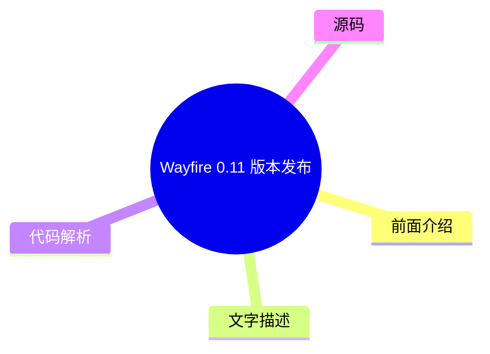
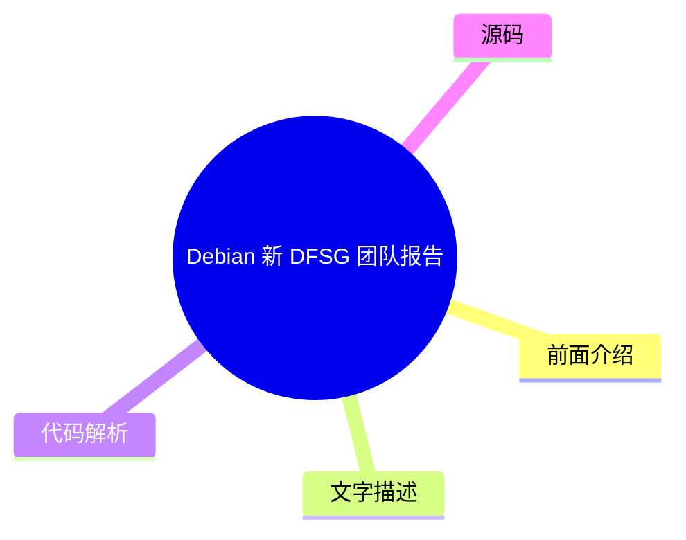
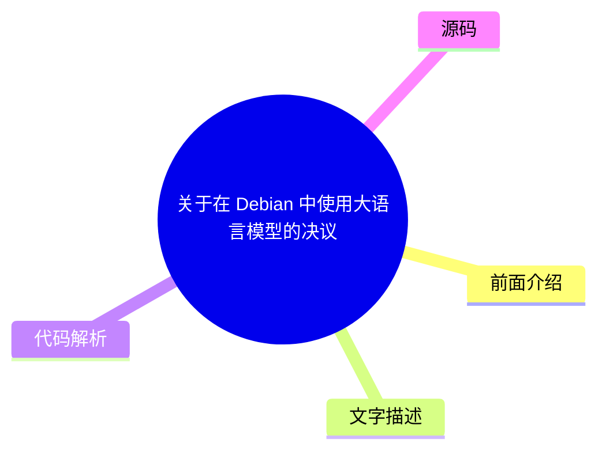
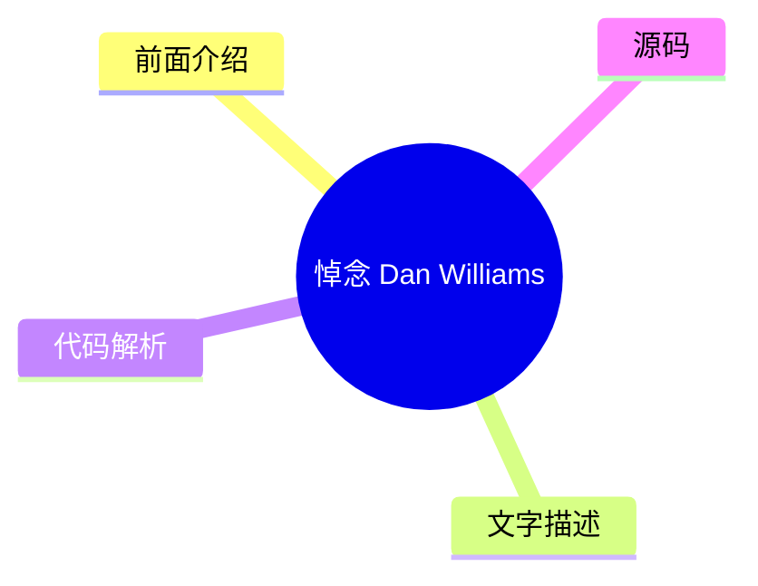

# 🐧 LWN.net (Linux kernel) Top 8 (2026-07-29)

## 前面介绍

- 数据源：LWN.net (Linux kernel)
- 抓取日期：2026-07-29
- 条目数：8
- 含完整正文：6
- 含代码片段：0
- 组织方式：前面介绍 / 树状图 / 文字描述 / 代码解析 / 源码

## 思维导图

```mermaid
mindmap
  root((LWN.net (Linux kernel)))
    使用 gccrs 编译 Linux 内核的进展
    Wayfire 0.11 版本发布
    Debian 新 DFSG 团队报告
    周二安全更新汇总
    Linux 内核 7.2-rc5 预发布补丁
    关于在 Debian 中使用大语言模型的决议
    悼念 Dan Williams
    周六安全更新汇总
```

## 详细整理（8 条，6 条含全文，0 条含代码）

### 1. 使用 gccrs 编译 Linux 内核的进展
- **链接**: [https://lwn.net/Articles/1083202/](https://lwn.net/Articles/1083202/)
- **作者**: daroc
- **发布**: Tue, 28 Jul 2026 17:40:01 +0000

#### 前面介绍

- gccrs 项目正致力于为 GCC 编译器创建 Rust 前端。
- 团队在 2026 年上半年专注于测试编译器与 Linux 内核 crates 的兼容性。
- 通过测试，开发团队取得了显著进展。

#### 树状图


#### 文字描述

- gccrs 是一个旨在为 GCC 编译器添加 Rust 语言支持的项目。
- 在 2026 年上半年，该项目的开发重点转移到了 Linux 内核的编译测试上。
- 开发团队通过将编译器与 Linux 内核的各个 crate 进行交叉测试，验证了 Rust 在内核开发中的可行性。
- 这种测试不仅验证了语法兼容性，还涉及了内存管理和类型系统的交互。
- 这些进展表明，Linux 内核向 Rust 迁移的路径正在变得清晰。

#### 代码解析

- 本文未提供源码，以下为实现思路或结构解析

#### 源码

未抓到可展示源码或原文节选。


### 2. Wayfire 0.11 版本发布
- **链接**: [https://lwn.net/Articles/1085894/](https://lwn.net/Articles/1085894/)
- **作者**: jzb
- **发布**: Tue, 28 Jul 2026 14:54:01 +0000

#### 前面介绍

- 基于 wlroots 的 Wayfire Wayland 合成器发布了 0.11 版本。
- 主要更新包括改进的分数缩放和每个输出设备的 ICC 配置文件支持。
- 还增加了对更多 Wayland 协议的支持。

#### 树状图



#### 文字描述

- Wayfire 是一个基于 wlroots 库构建的 Wayland 合成器。
- 0.11 版本引入了更好的分数缩放功能，解决了高分屏显示模糊的问题。
- 新增了针对每个显示输出设备的 ICC 配置文件支持，允许用户为不同的显示器设置不同的色彩配置。
- 该版本还扩展了对额外 Wayland 协议的支持，提升了与其他 Wayland 客户端和服务器集成的能力。

#### 代码解析

- 本文未提供源码，以下为实现思路或结构解析

#### 源码

#### 中文节选

# Wayfire 0.11 发布

[版本 0.11](https://wayfire.org/2026/07/24/Wayfire-0.11.html) 基于 [wlroots](https://gitlab.freedesktop.org/wlroots/wlroots#wlroots) 的 [Wayfire](https://wayfire.org/) Wayland 合成器已发布。主要变更包括更好的小数缩放、每个输出设备的 [ICC 配置文件](https://en.wikipedia.org/wiki/ICC_profile)、对额外 Wayland 协议的支持等。

[版本 0.11](https://wayfire.org/2026/07/24/Wayfire-0.11.html) 基于 [wlroots](https://gitlab.freedesktop.org/wlroots/wlroots#wlroots) 的 [Wayfire](https://wayfire.org/) Wayland 合成器已发布。主要变更包括更好的小数缩放、每个输出设备的 [ICC 配置文件](https://en.wikipedia.org/wiki/ICC_profile)、对额外 Wayland 协议的支持等。

            
            Copyright © 2026, Eklektix, Inc.

            
            评论和公开帖子版权归其创作者所有。

            Linux 是 Linus Torvalds 的注册商标

#### 完整正文（中文）

# Wayfire 0.11 发布

[版本 0.11](https://wayfire.org/2026/07/24/Wayfire-0.11.html) 基于 [wlroots](https://gitlab.freedesktop.org/wlroots/wlroots#wlroots) 的 [Wayfire](https://wayfire.org/) Wayland 合成器已发布。主要变更包括更好的小数缩放、每个输出设备的 [ICC 配置文件](https://en.wikipedia.org/wiki/ICC_profile)、对额外 Wayland 协议的支持等。

[版本 0.11](https://wayfire.org/2026/07/24/Wayfire-0.11.html) 基于 [wlroots](https://gitlab.freedesktop.org/wlroots/wlroots#wlroots) 的 [Wayfire](https://wayfire.org/) Wayland 合成器已发布。主要变更包括更好的小数缩放、每个输出设备的 [ICC 配置文件](https://en.wikipedia.org/wiki/ICC_profile)、对额外 Wayland 协议的支持等。

            
            Copyright © 2026, Eklektix, Inc.

            
            评论和公开帖子版权归其创作者所有。

            Linux 是 Linus Torvalds 的注册商标


### 3. Debian 新 DFSG 团队报告
- **链接**: [https://lwn.net/Articles/1084499/](https://lwn.net/Articles/1084499/)
- **作者**: jzb
- **发布**: Tue, 28 Jul 2026 14:21:44 +0000

#### 前面介绍

- Debian 的 DFSG、许可和新包团队于 2025 年 10 月成立。
- 该团队负责审查新队列中的软件包是否符合 Debian 自由软件指南 (DFSG)。
- 这是 ftpmaster 团队拆分后的一部分工作。

#### 树状图



#### 文字描述

- DFSG 团队（全称 Licensing & New Packages Team）是 Debian 项目管理结构的一部分。
- 该团队成立于 2025 年 10 月，作为 ftpmaster 团队拆分后的产物。
- 其主要职责是审查提交到 Debian 新包队列中的软件包，确保它们符合 Debian 自由软件指南 (DFSG) 的规定。
- 这一举措旨在提高 Debian 发行版在软件许可合规性方面的透明度和效率。

#### 代码解析

- 本文未提供源码，以下为实现思路或结构解析

#### 源码

未抓到可展示源码或原文节选。


### 4. 周二安全更新汇总
- **链接**: [https://lwn.net/Articles/1085855/](https://lwn.net/Articles/1085855/)
- **作者**: jzb
- **发布**: Tue, 28 Jul 2026 13:11:16 +0000

#### 前面介绍

- AlmaLinux、Debian、Fedora、Mageia 和 Oracle 等多个发行版发布了安全更新。
- 更新涵盖了 Grafana、OpenJDK、OpenSSH、Perl Mojolicious、RPM 等多个关键软件包。
- Oracle Linux 更新了包括 .NET 8.0、Kernel、glibc 和 Go 在内的广泛软件。

#### 树状图


#### 文字描述

- 本周多个 Linux 发行版发布了针对各种软件包的安全补丁。
- AlmaLinux 修复了 Grafana 和 LibreSwan 的漏洞。
- Debian LTS 版本更新了 OpenJDK 11 和 17。
- Fedora 发布了 OpenSSH、Perl Mojolicious 和 RPM 的更新。
- Mageia 更新了 libyang、memcached、nginx 和 sqlite3。
- Oracle Linux 发布了 .NET 8.0、Kernel、glibc、golang 和 openssl 等大量更新。

#### 代码解析

- 本文未提供源码，以下为实现思路或结构解析

#### 源码

#### 中文节选

| 发行版 | ID | 版本 | 包 | 日期 | 
|---|
| AlmaLinux | [ALSA-2026:46391](https://lwn.net/Articles/1085681/) | 8 | grafana | 2026-07-27 | 
| AlmaLinux | [ALSA-2026:46398](https://lwn.net/Articles/1085684/) | 10 | libreswan | 2026-07-27 | 
| AlmaLinux | [ALSA-2026:46396](https://lwn.net/Articles/1085682/) | 8 | libreswan | 2026-07-27 | 
| AlmaLinux | [ALSA-2026:46397](https://lwn.net/Articles/1085683/) | 9 | libreswan | 2026-07-27 | 
| Debian | [DLA-4702-1](https://lwn.net/Articles/1085685/) | LTS | openjdk-11 | 2026-07-28 | 
| Debian | [DLA-4703-1](https://lwn.net/Articles/1085686/) | LTS | openjdk-17 | 2026-07-28 | 
| Fedora | [FEDORA-2026-168280f3c4](https://lwn.net/Articles/1085688/) | F43 | opkssh | 2026-07-28 | 
| Fedora | [FEDORA-2026-a0bf40ecfe](https://lwn.net/Articles/1085687/) | F44 | opkssh | 2026-07-28 | 
| Fedora | [FEDORA-2026-6f12b08313](https://lwn.net/Articles/1085690/) | F43 | perl-Mojolicious | 2026-07-28 | 
| Fedora | [FEDORA-2026-4334fd85bc](https://lwn.net/Articles/1085689/) | F44 | perl-Mojolicious | 2026-07-28 | 
| Fedora | [FEDORA-2026-a9f0d5370e](https://lwn.net/Articles/1085692/) | F43 | rpm | 2026-07-28 | 
| Fedora | [FEDORA-2026-9985882270](https://lwn.net/Articles/1085691/) | F44 | rpm | 2026-07-28 | 
| Mageia | [MGASA-2026-0302](https://lwn.net/Articles/1085693/) | 10 | libyang | 2026-07-28 | 
| Mageia | [MGASA-2026-0304](https://lwn.net/Articles/1085694/) | 10, 9 | memcached | 2026-07-28 | 
| Mageia | [MGASA-2026-0301](https://lwn.net/Articles/1085695/) | 10, 9 | nginx | 2026-07-28 | 
| Mageia | [MGASA-2026-0303](https://lwn.net/Articles/1085696/) | 10 | packages | 2026-07-28 | 
| Mageia | [MGASA-2026-0305](https://lwn.net/Articles/1085697/) | 10, 9 | sqlite3 | 2026-07-28 | 
| Oracle | [ELSA-2026-21286](https://lwn.net/Articles/1085698/) | OL10 | .NET 8.0 | 2026-07-28 | 
| Oracle | [ELSA-2026-19345](https://lwn.net/Articles/1085718/) | OL9 | LibRaw | 2026-07-28 | 
| Oracle | [ELSA-2026-43420](https://lwn.net/Articles/1085699/) | OL8 | acl | 2026-07-28 | 
| Oracle | [ELSA-2026-29195](https://lwn.net/Articles/1085700/) | OL10 | buildah | 2026-07-28 |

| Oracle | [ELSA-2026-44438](https://lwn.net/Articles/1085701/) | OL9 | compat-openssl11 | 2026-07-28 | 
| Oracle | [ELSA-2026-29952](https://lwn.net/Articles/1085702/) | OL7 | compat-poppler022 | 2026-07-28 | 
| Oracle | [ELSA-2026-43400](https://lwn.net/Articles/1085703/) | OL10 | dogtag-pki | 2026-07-28 | 
| Oracle | [ELSA-2026-30855](https://lwn.net/Articles/1085704/) | OL10 | git-lfs | 2026-07-28 | 
| Oracle | [ELSA-2026-42952](https://lwn.net/Articles/1085705/) | OL9 | glibc | 2026-07-28 | 
| Oracle | [ELSA-2026-46394](https://lwn.net/Articles/1085706/) | OL10 | go-fdo-client | 2026-07-28 | 
| Oracle | [ELSA-2026-22120](https://lwn.net/Articles/1085707/) | OL10 | golang | 2026-07-28 | 
| Oracle | [ELSA-2026-29980](https://lwn.net/Articles/1085708/) | OL10 | golang | 2026-07-28 | 
| Oracle | [ELSA-2026-42828](https://lwn.net/Articles/1085709/) | OL8 | httpd:

#### 完整正文（中文）

| 发行版 | ID | 版本 | 包 | 日期 | 
|---|
| AlmaLinux | [ALSA-2026:46391](https://lwn.net/Articles/1085681/) | 8 | grafana | 2026-07-27 | 
| AlmaLinux | [ALSA-2026:46398](https://lwn.net/Articles/1085684/) | 10 | libreswan | 2026-07-27 | 
| AlmaLinux | [ALSA-2026:46396](https://lwn.net/Articles/1085682/) | 8 | libreswan | 2026-07-27 | 
| AlmaLinux | [ALSA-2026:46397](https://lwn.net/Articles/1085683/) | 9 | libreswan | 2026-07-27 | 
| Debian | [DLA-4702-1](https://lwn.net/Articles/1085685/) | LTS | openjdk-11 | 2026-07-28 | 
| Debian | [DLA-4703-1](https://lwn.net/Articles/1085686/) | LTS | openjdk-17 | 2026-07-28 | 
| Fedora | [FEDORA-2026-168280f3c4](https://lwn.net/Articles/1085688/) | F43 | opkssh | 2026-07-28 | 
| Fedora | [FEDORA-2026-a0bf40ecfe](https://lwn.net/Articles/1085687/) | F44 | opkssh | 2026-07-28 | 
| Fedora | [FEDORA-2026-6f12b08313](https://lwn.net/Articles/1085690/) | F43 | perl-Mojolicious | 2026-07-28 | 
| Fedora | [FEDORA-2026-4334fd85bc](https://lwn.net/Articles/1085689/) | F44 | perl-Mojolicious | 2026-07-28 | 
| Fedora | [FEDORA-2026-a9f0d5370e](https://lwn.net/Articles/1085692/) | F43 | rpm | 2026-07-28 | 
| Fedora | [FEDORA-2026-9985882270](https://lwn.net/Articles/1085691/) | F44 | rpm | 2026-07-28 | 
| Mageia | [MGASA-2026-0302](https://lwn.net/Articles/1085693/) | 10 | libyang | 2026-07-28 | 
| Mageia | [MGASA-2026-0304](https://lwn.net/Articles/1085694/) | 10, 9 | memcached | 2026-07-28 | 
| Mageia | [MGASA-2026-0301](https://lwn.net/Articles/1085695/) | 10, 9 | nginx | 2026-07-28 | 
| Mageia | [MGASA-2026-0303](https://lwn.net/Articles/1085696/) | 10 | packages | 2026-07-28 | 
| Mageia | [MGASA-2026-0305](https://lwn.net/Articles/1085697/) | 10, 9 | sqlite3 | 2026-07-28 | 
| Oracle | [ELSA-2026-21286](https://lwn.net/Articles/1085698/) | OL10 | .NET 8.0 | 2026-07-28 | 
| Oracle | [ELSA-2026-19345](https://lwn.net/Articles/1085718/) | OL9 | LibRaw | 2026-07-28 | 
| Oracle | [ELSA-2026-43420](https://lwn.net/Articles/1085699/) | OL8 | acl | 2026-07-28 | 
| Oracle | [ELSA-2026-29195](https://lwn.net/Articles/1085700/) | OL10 | buildah | 2026-07-28 |

| Oracle | [ELSA-2026-44438](https://lwn.net/Articles/1085701/) | OL9 | compat-openssl11 | 2026-07-28 | 
| Oracle | [ELSA-2026-29952](https://lwn.net/Articles/1085702/) | OL7 | compat-poppler022 | 2026-07-28 | 
| Oracle | [ELSA-2026-43400](https://lwn.net/Articles/1085703/) | OL10 | dogtag-pki | 2026-07-28 | 
| Oracle | [ELSA-2026-30855](https://lwn.net/Articles/1085704/) | OL10 | git-lfs | 2026-07-28 | 
| Oracle | [ELSA-2026-42952](https://lwn.net/Articles/1085705/) | OL9 | glibc | 2026-07-28 | 
| Oracle | [ELSA-2026-46394](https://lwn.net/Articles/1085706/) | OL10 | go-fdo-client | 2026-07-28 | 
| Oracle | [ELSA-2026-22120](https://lwn.net/Articles/1085707/) | OL10 | golang | 2026-07-28 | 
| Oracle | [ELSA-2026-29980](https://lwn.net/Articles/1085708/) | OL10 | golang | 2026-07-28 | 
| Oracle | [ELSA-2026-42828](https://lwn.net/Articles/1085709/) | OL8 | httpd:2.4 | 2026-07-28 | 
| Oracle | [ELSA-2026-40895](https://lwn.net/Articles/1085710/) | OL9 | jackson-annotations, jackson-core, jackson-databind, jackson-jaxrs-providers, and jackson-modules-base | 2026-07-28 | 
| Oracle | [ELSA-2026-19569](https://lwn.net/Articles/1085713/) | OL10 | kernel | 2026-07-28 | 
| Oracle | [ELSA-2026-44270](https://lwn.net/Articles/1085714/) | OL10 | kernel | 2026-07-28 | 
| Oracle | [ELSA-2026-42919](https://lwn.net/Articles/1085715/) | OL10 | kernel | 2026-07-28 | 
| Oracle | [ELSA-2026-42552](https://lwn.net/Articles/1085711/) | OL8 | kernel | 2026-07-28 | 
| Oracle | [ELSA-2026-43307](https://lwn.net/Articles/1085712/) | OL9 | kernel | 2026-07-28 | 
| Oracle | [ELSA-2026-44391](https://lwn.net/Articles/1085717/) | OL10 | libpq | 2026-07-28 | 
| Oracle | [ELSA-2026-44308](https://lwn.net/Articles/1085716/) | OL9 | libpq | 2026-07-28 | 
| Oracle | [ELSA-2026-40841](https://lwn.net/Articles/1085719/) | OL8 | maven:3.8 | 2026-07-28 | 
| Oracle | [ELSA-2026-20693](https://lwn.net/Articles/1085720/) | OL10 | mysql8.4 | 2026-07-28 | 
| Oracle | [ELSA-2026-41947](https://lwn.net/Articles/1085721/) | OL8 | nodejs:22 | 2026-07-28 | 
| Oracle | [ELSA-2026-39868](https://lwn.net/Articles/1085722/) | OL8 | nodejs:24 | 2026-07-28 |

| Oracle | [ELSA-2026-22314](https://lwn.net/Articles/1085723/) | OL10 | openssl | 2026-07-28 | 
| Oracle | [ELSA-2026-18289](https://lwn.net/Articles/1085724/) | OL10 | podman | 2026-07-28 | 
| Oracle | [ELSA-2026-24386](https://lwn.net/Articles/1085725/) | OL10 | podman | 2026-07-28 | 
| Oracle | [ELSA-2026-24470](https://lwn.net/Articles/1085726/) | OL10 | podman | 2026-07-28 | 
| Oracle | [ELSA-2026-37072](https://lwn.net/Articles/1085727/) | OL10 | podman | 2026-07-28 | 
| Oracle | [ELSA-2026-30044](https://lwn.net/Articles/1085728/) | OL7 | poppler | 2026-07-28 | 
| Oracle | [ELSA-2026-41949](https://lwn.net/Articles/1085729/) | OL9 | python3.14 | 2026-07-28 | 
| Oracle | [ELSA-2026-28132](https://lwn.net/Articles/1085730/) | OL7 | samba | 2026-07-28 | 
| Oracle | [ELSA-2026-42122](https://lwn.net/Articles/1085731/) | OL9 | sssd | 2026-07-28 | 
| Oracle | [ELSA-2026-18537](https://lwn.net/Articles/1085732/) | OL10 | tomcat | 2026-07-28 | 
| Oracle | [ELSA-2026-25341](https://lwn.net/Articles/1085733/) | OL10 | tomcat9 | 2026-07-28 | 
| Oracle | [ELSA-2026-28210](https://lwn.net/Articles/1085734/) | OL10 | vim | 2026-07-28 | 
| Oracle | [ELSA-2026-19126](https://lwn.net/Articles/1085735/) | OL10 | yggdrasil | 2026-07-28 | 
| Red Hat | [RHSA-2026:36749-01](https://lwn.net/Articles/1085680/) | EL10 | gstreamer1-plugins-bad-free | 2026-07-28 | 
| Red Hat | [RHSA-2026:37130-01](https://lwn.net/Articles/1085678/) | EL8 | gstreamer1-plugins-bad-free | 2026-07-28 | 
| Red Hat | [RHSA-2026:47076-01](https://lwn.net/Articles/1085677/) | EL8.4 | gstreamer1-plugins-bad-free | 2026-07-28 | 
| Red Hat | [RHSA-2026:36834-01](https://lwn.net/Articles/1085679/) | EL9 | gstreamer1-plugins-bad-free | 2026-07-28 | 
| SUSE | [SUSE-SU-2026:22829-1](https://lwn.net/Articles/1085769/) | SLE16.0 | ImageMagick | 2026-07-27 | 
| SUSE | [SUSE-SU-2026:22861-1](https://lwn.net/Articles/1085770/) | SLE16.0 | ImageMagick | 2026-07-27 | 
| SUSE | [SUSE-SU-2026:22860-1](https://lwn.net/Articles/1085797/) | SLE16.0 | PackageKit | 2026-07-27 | 
| SUSE | [SUSE-SU-2026:22917-1](https://lwn.net/Articles/1085736/) | SLE-m6.0 | afterburn | 2026-07-27 |

| SUSE | [SUSE-SU-2026:22827-1](https://lwn.net/Articles/1085737/) | SLE16.0 | afterburn | 2026-07-27 | 
| SUSE | [SUSE-SU-2026:3270-1](https://lwn.net/Articles/1085738/) | SLE15 oS15.6 | alsa | 2026-07-27 | 
| SUSE | [SUSE-SU-2026:22858-1](https://lwn.net/Articles/1085739/) | SLE16.0 | apache-ivy | 2026-07-27 | 
| SUSE | [SUSE-SU-2026:22853-1](https://lwn.net/Articles/1085740/) | SLE16.0 | avahi | 2026-07-27 | 
| SUSE | [SUSE-SU-2026:22841-1](https://lwn.net/Articles/1085741/) | SLE16.0 | aws-nitro-enclaves-cli | 2026-07-27 | 
| SUSE | [openSUSE-SU-2026:0264-1](https://lwn.net/Articles/1085742/) | osB15 | chromium | 2026-07-27 | 
| SUSE | [SUSE-SU-2026:22888-1](https://lwn.net/Articles/1085743/) | SLE-m6.1 | cifs-utils | 2026-07-27 | 
| SUSE | [SUSE-SU-2026:22837-1](https://lwn.net/Articles/1085744/) | SLE16.0 | cockpit, cockpit-machines, cockpit-packages, cockpit- podman, cockpit-repos, cockpit-subscriptions | 2026-07-27 | 
| SUSE | [SUSE-SU-2026:22800-1](https://lwn.net/Articles/1085745/) | SLE-m6.0 | containerd | 2026-07-27 | 
| SUSE | [SUSE-SU-2026:22892-1](https://lwn.net/Articles/1085746/) | SLE-m6.1 | containerd | 2026-07-27 | 
| SUSE | [SUSE-SU-2026:22889-1](https://lwn.net/Articles/1085747/) | SLE-m6.1 | curl | 2026-07-27 | 
| SUSE | [SUSE-SU-2026:22887-1](https://lwn.net/Articles/1085748/) | SLE-m6.1 | docker-compose | 2026-07-27 | 
| SUSE | [SUSE-SU-2026:22922-1](https://lwn.net/Articles/1085749/) | SLE-m6.0 | freetype2 | 2026-07-27 | 
| SUSE | [SUSE-SU-2026:22815-1](https://lwn.net/Articles/1085750/) | SLE16.0 | freetype2 | 2026-07-27 | 
| SUSE | [SUSE-SU-2026:22831-1](https://lwn.net/Articles/1085751/) | SLE16.0 | gawk | 2026-07-27 | 
| SUSE | [SUSE-SU-2026:3236-1](https://lwn.net/Articles/1085754/) | SLE12 | glib2 | 2026-07-27 | 
| SUSE | [SUSE-SU-2026:3235-1](https://lwn.net/Articles/1085753/) | SLE15 SLE5.3 SLE5.4 SLE5.5 SLE-m5.3 SLE-m5.4 SLE-m5.5 oS15.4 | glib2 | 2026-07-27 | 
| SUSE | [SUSE-SU-2026:22846-1](https://lwn.net/Articles/1085752/) | SLE16.0 | glib2 | 2026-07-27 | 
| SUSE | [SUSE-SU-2026:22848-1](https://lwn.net/Articles/1085755/) | SLE16.0 | google-cloud-sap-agent | 2026-07-27 | 

| SUSE | [SUSE-SU-2026:22923-1](https://lwn.net/Articles/1085756/) | SLE-m6.1 | gpg2 | 2026-07-27 | 
| SUSE | [SUSE-SU-2026:22825-1](https://lwn.net/Articles/1085757/) | SLE16.0 | gpg2 | 2026-07-27 | 
| SUSE | [SUSE-SU-2026:22817-1](https://lwn.net/Articles/1085758/) | SLE16.0 | gstreamer-plugins-bad | 2026-07-27 | 
| SUSE | [SUSE-SU-2026:22918-1](https://lwn.net/Articles/1085760/) | SLE-m6.0 | gzip | 2026-07-27 | 
| SUSE | [SUSE-SU-2026:22906-1](https://lwn.net/Articles/1085763/) | SLE-m6.1 | gzip | 2026-07-27 | 
| SUSE | [SUSE-SU-2026:3241-1](https://lwn.net/Articles/1085762/) | SLE12 | gzip | 2026-07-27 | 
| SUSE | [SUSE-SU-2026:3269-1](https://lwn.net/Articles/1085759/) | SLE15 SLE5.3 SLE5.4 SLE5.5 SLE-m5.3 SLE-m5.4 SLE-m5.5 | gzip | 2026-07-27 | 
| SUSE | [SUSE-SU-2026:22818-1](https://lwn.net/Articles/1085761/) | SLE16.0 | gzip | 2026-07-27 | 
| SUSE | [SUSE-SU-2026:22855-1](https://lwn.net/Articles/1085764/) | SLE16.0 | helm | 2026-07-27 | 
| SUSE | [SUSE-SU-2026:3300-1](https://lwn.net/Articles/1085765/) | SLE15 oS15.4 | ignition | 2026-07-28 | 
| SUSE | [SUSE-SU-2026:3267-1](https://lwn.net/Articles/1085766/) | SLE5.3 SLE-m5.3 | ignition | 2026-07-27 | 
| SUSE | [SUSE-SU-2026:3266-1](https://lwn.net/Articles/1085767/) | SLE5.4 SLE-m5.4 | ignition | 2026-07-27 | 
| SUSE | [SUSE-SU-2026:3265-1](https://lwn.net/Articles/1085768/) | SLE5.5 SLE-m5.5 | ignition | 2026-07-27 | 
| SUSE | [SUSE-SU-2026:3273-1](https://lwn.net/Articles/1085771/) | SLE15 | jackson-annotations, jackson-bom, jackson-core, jackson- databind, jackson-dataformats-binary, jackson-modules-base | 2026-07-27 | 
| SUSE | [SUSE-SU-2026:22822-1](https://lwn.net/Articles/1085772/) | SLE16.0 | jackson-annotations, jackson-core, jackson-databind | 2026-07-27 | 
| SUSE | [SUSE-SU-2026:3284-1](https://lwn.net/Articles/1085773/) | SLE12 | java-11-openjdk | 2026-07-27 | 
| SUSE | [SUSE-SU-2026:22856-1](https://lwn.net/Articles/1085774/) | SLE16.0 | jline3 | 2026-07-27 | 
| SUSE | [SUSE-SU-2026:22843-1](https://lwn.net/Articles/1085775/) | SLE16.0 | joe | 2026-07-27 | 
| SUSE | [SUSE-SU-2026:22900-1](https://lwn.net/Articles/1085776/) | SLE-m6.1 | jq | 2026-07-27 |

| SUSE | [SUSE-SU-2026:22812-1](https://lwn.net/Articles/1085777/) | SLE16.0 | kernel | 2026-07-27 | 
| SUSE | [SUSE-SU-2026:22835-1](https://lwn.net/Articles/1085778/) | SLE16.0 | kernel | 2026-07-27 | 
| SUSE | [SUSE-SU-2026:22791-1](https://lwn.net/Articles/1085780/) | SLE6.0 SLE-m6.0 | kernel | 2026-07-27 | 
| SUSE | [SUSE-SU-2026:22790-1](https://lwn.net/Articles/1085781/) | SLE6.0 SLE-m6.0 | kernel | 2026-07-27 | 
| SUSE | [SUSE-SU-2026:22883-1](https://lwn.net/Articles/1085779/) | SLE6.0 SLE-m6.0 SLE-m6.1 | kernel | 2026-07-27 | 
| SUSE | [SUSE-SU-2026:22904-1](https://lwn.net/Articles/1085782/) | SLE6.0 SLE-m6.0 SLE-m6.1 | kernel | 2026-07-27 | 
| SUSE | [SUSE-SU-2026:22903-1](https://lwn.net/Articles/1085783/) | SLE6.0 SLE-m6.0 SLE-m6.1 | kernel | 2026-07-27 | 
| SUSE | [SUSE-SU-2026:22919-1](https://lwn.net/Articles/1085784/) | SLE-m6.0 | libgcrypt | 2026-07-27 | 
| SUSE | [SUSE-SU-2026:22907-1](https://lwn.net/Articles/1085786/) | SLE-m6.1 | libgcrypt | 2026-07-27 | 
| SUSE | [SUSE-SU-2026:22826-1](https://lwn.net/Articles/1085785/) | SLE16.0 | libgcrypt | 2026-07-27 | 
| SUSE | [openSUSE-SU-2026:11364-1](https://lwn.net/Articles/1085787/) | TW | libknet-devel | 2026-07-27 | 
| SUSE | [SUSE-SU-2026:22920-1](https://lwn.net/Articl

...（截断，原文 19037+ 字符）


### 5. Linux 内核 7.2-rc5 预发布补丁
- **链接**: [https://lwn.net/Articles/1085422/](https://lwn.net/Articles/1085422/)
- **作者**: corbet
- **发布**: Sun, 26 Jul 2026 22:10:54 +0000

#### 前面介绍

- Linux 内核 7.2-rc5 预发布补丁已发布用于测试。
- Linus Torvalds 表示补丁集虽然偏大，但没有发现特别奇怪或可怕的问题。

#### 树状图


#### 文字描述

- Linux 内核 7.2-rc5 是 7.2 系列的第五个候选版本，旨在收集测试反馈。
- Linus Torvalds 在评论中指出，虽然补丁集的规模对他来说有点大，但并没有发现任何特别奇怪或令人担忧的问题。
- 这表明 7.2 内核的开发进度基本正常，没有出现阻碍合并的严重缺陷。

#### 代码解析

- 本文未提供源码，以下为实现思路或结构解析

#### 源码

#### 中文节选

7.2-rc5 内核预补丁已发布，用于测试。Linus 表示：“所以它对我来说有点太大了，但里面没有什么东西让我觉得特别奇怪或可怕”。

#### 完整正文（中文）

7.2-rc5 内核预补丁已发布，用于测试。Linus 表示：“所以它对我来说有点太大了，但里面没有什么东西让我觉得特别奇怪或可怕”。


### 6. 关于在 Debian 中使用大语言模型的决议
- **链接**: [https://lwn.net/Articles/1085314/](https://lwn.net/Articles/1085314/)
- **作者**: corbet
- **发布**: Sat, 25 Jul 2026 23:14:16 +0000

#### 前面介绍

- Debian 项目正在考虑通过一项关于在发行版创建过程中使用大语言模型的决议。
- 决议草案提供了三种选择：全面禁止使用 LLM、尽可能拒绝使用 LLM 或在特定条件下明确允许使用。

#### 树状图



#### 文字描述

- Debian 项目正在讨论一项关于在发行版创建过程中使用大语言模型（LLM）的通用决议。
- 讨论的焦点在于如何规范 LLM 在文档编写、代码审查等环节中的作用。
- 目前提出了三种替代方案：一是全面禁止使用 LLM；二是尽可能拒绝使用 LLM；三是在特定条件下明确允许使用。
- 投票和讨论期尚未开始，社区对此议题高度关注。

#### 代码解析

- 本文未提供源码，以下为实现思路或结构解析

#### 源码

#### 中文节选

# 关于 Debian 在分发制作中使用 LLM 的通用决议

[考虑一项通用决议](https://www.debian.org/vote/2026/vote_002)关于在分发制作中使用大型语言模型。有三个替代方案需要考虑：完全禁止使用 LLM，拒绝“在可行范围内”使用 LLM，或者明确允许在特定条件下使用 LLM。讨论期刚刚开始；投票期的开始时间似乎尚未确定。想要在不可避免的 LWN 文章之前查阅讨论的人可以在这里找到它

[这里](/ml/all/til24c.3ns3jl2mkmzmn@riseup.net)。

#### 完整正文（中文）

# 关于 Debian 在分发制作中使用 LLM 的通用决议

[考虑一项通用决议](https://www.debian.org/vote/2026/vote_002)关于在分发制作中使用大型语言模型。有三个替代方案需要考虑：完全禁止使用 LLM，拒绝“在可行范围内”使用 LLM，或者明确允许在特定条件下使用 LLM。讨论期刚刚开始；投票期的开始时间似乎尚未确定。想要在不可避免的 LWN 文章之前查阅讨论的人可以在这里找到它

[这里](/ml/all/til24c.3ns3jl2mkmzmn@riseup.net)。


### 7. 悼念 Dan Williams
- **链接**: [https://lwn.net/Articles/1085021/](https://lwn.net/Articles/1085021/)
- **作者**: corbet
- **发布**: Sat, 25 Jul 2026 14:29:51 +0000

#### 前面介绍

- Linux 内核社区痛失核心贡献者 Dan Williams。
- 他在存储、持久内存、文件系统和可信计算领域做出了杰出贡献。
- 他也是 Linux 基金会技术顾问委员会的成员和主席。

#### 树状图



#### 文字描述

- Dan Williams 是 Linux 内核社区备受爱戴的成员，于 7 月 21 日不幸去世。
- 他在存储技术、持久内存（PMEM）、文件系统以及可信计算领域做出了开创性的贡献。
- 他主导了 DAX（直接访问）概念的引入，并领导了下一代技术 Compute Express Link (CXL) 的开发。
- 除了技术成就，他还是包容性术语的倡导者和导师，致力于改善社区多样性。
- 他的去世对 Linux 内核社区和开源世界是一个巨大的损失。

#### 代码解析

- 本文未提供源码，以下为实现思路或结构解析

#### 源码

#### 中文节选

# 致 Dan Williams

以下内容由 Dave Hansen 和 Thomas Gleixner 撰写。

Linux 内核社区为 Dan Williams 的意外早逝感到悲痛。

Dan 是一位专注于存储、持久内存、文件系统和可信计算的计算机科学家。除了他卓越的技术贡献外，他还担任过 Linux 基金会技术顾问委员会的成员和主席。

他与 Linux 内核的接触始于一次实习，当时 IT 部门的某个人向他介绍了内核和开源的概念。在实习期间，他不得不使用昂贵的高端 RAID 存储设备，他真的希望自己的家庭电脑也能拥有这样的设备。当他发现 Linux 最近获得了软件 RAID 支持时，他在家中建立 RAID 存储系统的梦想只需下载即可实现。能够自由地下载、使用和修改代码让他着迷；尤其是当他意识到可以回馈社区，与他人分享他的改进时，这种感觉更加强烈。从那时起，成为一名专业的 Linux 内核开发者就成了他顺理成章的职业选择。他在内核社区最早的活动记录可以追溯到 2004 年。

[
他的早期工作主要集中在存储技术相关的驱动程序上。在那之后，他被委以一项近乎不可能的任务：在硬件问世之前，引入对新存储技术——持久内存的支持。尽管文件系统和存储维护者对迎合一家硬件公司的技术远见计划持犹豫态度，但 Dan 在为这种设备引入根本性新概念（DAX）并将其应用于现有文件系统方面发挥了关键作用。在此基础上，他主导了下一代技术 Compute Express Link (CXL) 的引入，并在可信计算的背景下，为安全设备的规范和概念做出了贡献。
](/Articles/1050294/)

同样重要的是他的技术成就——如果不说更重要的话——他对 Linux 社区乃至整个社会的“人”这一层面的贡献。鉴于他自己在处理混血背景方面的亲身经历，他一直是内核社区、企业环境以及更广泛社会中少数群体的坚定倡导者和导师。他拥有非凡的能力，能够通过广受欢迎的幽默和富有感染力的笑声平息激烈的讨论，同时也会向所有相关人员发出清晰而诚实的提醒，让大家关注事实，这一点将让人深感怀念。

作为 Linux 基金会技术顾问委员会成员及主席，他的参与充分证明了这一点。他在《行为准则》的解读及实际实践中的落实、内核贡献成熟度模型以及包容性术语的文档编写方面做出了重要贡献。

一

#### 完整正文（中文）

# 致 Dan Williams

以下内容由 Dave Hansen 和 Thomas Gleixner 撰写。

Linux 内核社区为 Dan Williams 的意外早逝感到悲痛。

Dan 是一位专注于存储、持久内存、文件系统和可信计算的计算机科学家。除了他卓越的技术贡献外，他还担任过 Linux 基金会技术顾问委员会的成员和主席。

他与 Linux 内核的接触始于一次实习，当时 IT 部门的某个人向他介绍了内核和开源的概念。在实习期间，他不得不使用昂贵的高端 RAID 存储设备，他真的希望自己的家庭电脑也能拥有这样的设备。当他发现 Linux 最近获得了软件 RAID 支持时，他在家中建立 RAID 存储系统的梦想只需下载即可实现。能够自由地下载、使用和修改代码让他着迷；尤其是当他意识到可以回馈社区，与他人分享他的改进时，这种感觉更加强烈。从那时起，成为一名专业的 Linux 内核开发者就成了他顺理成章的职业选择。他在内核社区最早的活动记录可以追溯到 2004 年。

[
他的早期工作主要集中在存储技术相关的驱动程序上。在那之后，他被委以一项近乎不可能的任务：在硬件问世之前，引入对新存储技术——持久内存的支持。尽管文件系统和存储维护者对迎合一家硬件公司的技术远见计划持犹豫态度，但 Dan 在为这种设备引入根本性新概念（DAX）并将其应用于现有文件系统方面发挥了关键作用。在此基础上，他主导了下一代技术 Compute Express Link (CXL) 的引入，并在可信计算的背景下，为安全设备的规范和概念做出了贡献。
](/Articles/1050294/)

与其技术成就同等重要——甚至更为重要——的是他对 Linux 社区乃至整个社会的“人”这一层面的贡献。鉴于他自身在应对混合文化背景方面的经历，他一直是内核社区、企业环境以及更广泛社会中少数族裔的坚定倡导者和导师。他拥有非凡的能力，能够通过广受欢迎的幽默和充满感染力的笑声平息激烈的讨论，同时也会以清晰、诚实的提醒让所有相关人员回归事实，这种特质将真正被怀念。

作为 Linux 基金会技术顾问委员会成员兼主席，他的参与充分证明了这一点。他在《行为准则》的解读及其实际落地实践、内核贡献成熟度模型以及包容性术语的文档编写方面做出了显著贡献。

他的一位前经理曾这样评价他：“他是世界上最善良的人，同时也是最坚定不移的人”。这在 Linux 内核社区绝对是一个例外，因为那里有很多人坚定不移，但未必因此而友善。

他的兴趣远不止于此。他对生活的方方面面都充满好奇，从人际关系到政治，各种技术，哲学等等。无论是在技术领域内还是技术领域外，与他交谈总是令人充实、愉快，并且充满了大量他独特的幽默感。

他还是一位充满激情的竞技拉丁舞者。正是这份热情让他结识了并最终与他一生的挚爱凯瑟琳分享，凯瑟琳支持他度过了职业生涯中的所有高光与低谷，当然，她也有自己的看法。当 Dan 和 Linus 同乘一架飞机时，他给她发短信询问想对 Linus 说什么。她的回答是干巴巴的一句：“合并窗口很烂！”

他的爱以及他对三个孩子的奉献，所有有幸且愉快地接近过他的人都知道。他突然离去，让他们被抛在身后，这令人心碎。我们的心与思念与凯瑟琳、他们的孩子以及他们的家人同在。

当然，大家都宁愿忍受合并窗口的痛苦，也不愿面对他的离去，尽管丹留下的痕迹——他的善良、友谊、技术工作、幽默和难以置信的笑声——将永远交织在我们的生活中。法国诗人安托万·德·圣-埃克苏佩里在《小王子》中写道：“在群星之中，有一个地方属于我。在那里，我会笑。”

丹留下的痕迹总会唤起悲伤，但它们也应该让我们仰望他留下的那颗抚慰我们的笑星。

如果你想表达哀悼，请发送电子邮件至
djbw@tglx.de。这封邮件将转交给那些他最爱的人。


### 8. 周六安全更新汇总
- **链接**: [https://lwn.net/Articles/1085272/](https://lwn.net/Articles/1085272/)
- **作者**: corbet
- **发布**: Sat, 25 Jul 2026 14:00:47 +0000

#### 前面介绍

- AlmaLinux、Debian、Fedora、Mageia、Oracle 和 SUSE 发布了本周的安全更新。
- 更新涉及 Java、Kernel、Chromium、.NET、Podman 等大量软件包。
- Debian 稳定版更新了 Exim4，SUSE 更新了 389-ds 和 ImageMagick。

#### 树状图


#### 文字描述

- 本周六，多个 Linux 发行版发布了安全更新补丁。
- AlmaLinux 更新了 compat-openssl11、OpenJDK、Kernel、Kernel-RT 和 sssd。
- Debian 稳定版更新了邮件传输代理 Exim4。
- Fedora 更新了 Chromium、.NET 10.0、mbedTLS、MuPDF、Python Django 5 等软件。
- Mageia 更新了 libevent 和 transmission。
- Oracle Linux 更新了 .NET 8.0、Kernel、glibc、PostgreSQL 18、Podman 等软件。
- SUSE 更新了 389-ds 和 ImageMagick。

#### 代码解析

- 本文未提供源码，以下为实现思路或结构解析

#### 源码

#### 中文节选

| 发行版 | ID | 版本 | 包 | 日期 | 
|---|
| AlmaLinux | [ALSA-2026:44438](https://lwn.net/Articles/1085033/) | 9 | compat-openssl11 | 2026-07-24 | 
| AlmaLinux | [ALSA-2026:42877](https://lwn.net/Articles/1085035/) | 8 | java-1.8.0-openjdk | 2026-07-24 | 
| AlmaLinux | [ALSA-2026:42877](https://lwn.net/Articles/1085034/) | 9 | java-1.8.0-openjdk | 2026-07-24 | 
| AlmaLinux | [ALSA-2026:42887](https://lwn.net/Articles/1085037/) | 8 | java-17-openjdk | 2026-07-24 | 
| AlmaLinux | [ALSA-2026:42887](https://lwn.net/Articles/1085036/) | 9 | java-17-openjdk | 2026-07-24 | 
| AlmaLinux | [ALSA-2026:44270](https://lwn.net/Articles/1085040/) | 10 | kernel | 2026-07-25 | 
| AlmaLinux | [ALSA-2026:45115](https://lwn.net/Articles/1085039/) | 8 | kernel | 2026-07-24 | 
| AlmaLinux | [ALSA-2026:43307](https://lwn.net/Articles/1085038/) | 9 | kernel | 2026-07-24 | 
| AlmaLinux | [ALSA-2026:45116](https://lwn.net/Articles/1085041/) | 8 | kernel-rt | 2026-07-24 | 
| AlmaLinux | [ALSA-2026:42122](https://lwn.net/Articles/1085042/) | 9 | sssd | 2026-07-24 | 
| Debian | [DSA-6400-1](https://lwn.net/Articles/1085043/) | stable | exim4 | 2026-07-24 | 
| Fedora | [FEDORA-2026-acf674bc6a](https://lwn.net/Articles/1085045/) | F43 | chromium | 2026-07-25 | 
| Fedora | [FEDORA-2026-4870f59184](https://lwn.net/Articles/1085044/) | F44 | chromium | 2026-07-25 | 
| Fedora | [FEDORA-2026-d9817786d6](https://lwn.net/Articles/1085047/) | F43 | dotnet10.0 | 2026-07-25 | 
| Fedora | [FEDORA-2026-f738966fc9](https://lwn.net/Articles/1085046/) | F44 | dotnet10.0 | 2026-07-25 | 
| Fedora | [FEDORA-2026-0bb141710c](https://lwn.net/Articles/1085048/) | F43 | mbedtls | 2026-07-25 | 
| Fedora | [FEDORA-2026-8870088088](https://lwn.net/Articles/1085049/) | F43 | mupdf | 2026-07-25 | 
| Fedora | [FEDORA-2026-d085110cf3](https://lwn.net/Articles/1085050/) | F44 | netatalk | 2026-07-25 | 
| Fedora | [FEDORA-2026-fbb9501b22](https://lwn.net/Articles/1085051/) | F43 | python-django5 | 2026-07-25 | 
| Fedora | [FEDORA-2026-9b2e56edf5](https://lwn.net/Articles/1085052/) | F44 | skopeo | 2026-07-25 | 
| Fedora | [FEDORA-2026-9ab663dcd4](https://lwn.net/Articles/1085053/) | F43 | sssd | 2026-07-25 |

| Fedora | [FEDORA-2026-7bbb52b49d](https://lwn.net/Articles/1085054/) | F43 | wget1 | 2026-07-25 | 
| Mageia | [MGASA-2026-0294](https://lwn.net/Articles/1085055/) | 10, 9 | libevent | 2026-07-24 | 
| Mageia | [MGASA-2026-0293](https://lwn.net/Articles/1085056/) | 10 | transmission | 2026-07-24 | 
| Oracle | [ELSA-2026-41893](https://lwn.net/Articles/1085057/) | OL10 | .NET 8.0 | 2026-07-22 | 
| Oracle | [ELSA-2026-36196](https://lwn.net/Articles/1085058/) | OL10 | 389-ds-base | 2026-07-22 | 
| Oracle | [ELSA-2026-36782](https://lwn.net/Articles/1085059/) | OL10 | aardvark-dns | 2026-07-22 | 
| Oracle | [ELSA-2026-42739](https://lwn.net/Articles/1085060/) | OL10 | acl | 2026-07-22 | 
| Oracle | [ELSA-2026-38494](https://lwn.net/Articles/1085061/) | OL10 | buildah | 2026-07-22 | 
| Oracle | [EL

#### 完整正文（中文）

| 发行版 | ID | 版本 | 包 | 日期 | 
|---|
| AlmaLinux | [ALSA-2026:44438](https://lwn.net/Articles/1085033/) | 9 | compat-openssl11 | 2026-07-24 | 
| AlmaLinux | [ALSA-2026:42877](https://lwn.net/Articles/1085035/) | 8 | java-1.8.0-openjdk | 2026-07-24 | 
| AlmaLinux | [ALSA-2026:42877](https://lwn.net/Articles/1085034/) | 9 | java-1.8.0-openjdk | 2026-07-24 | 
| AlmaLinux | [ALSA-2026:42887](https://lwn.net/Articles/1085037/) | 8 | java-17-openjdk | 2026-07-24 | 
| AlmaLinux | [ALSA-2026:42887](https://lwn.net/Articles/1085036/) | 9 | java-17-openjdk | 2026-07-24 | 
| AlmaLinux | [ALSA-2026:44270](https://lwn.net/Articles/1085040/) | 10 | kernel | 2026-07-25 | 
| AlmaLinux | [ALSA-2026:45115](https://lwn.net/Articles/1085039/) | 8 | kernel | 2026-07-24 | 
| AlmaLinux | [ALSA-2026:43307](https://lwn.net/Articles/1085038/) | 9 | kernel | 2026-07-24 | 
| AlmaLinux | [ALSA-2026:45116](https://lwn.net/Articles/1085041/) | 8 | kernel-rt | 2026-07-24 | 
| AlmaLinux | [ALSA-2026:42122](https://lwn.net/Articles/1085042/) | 9 | sssd | 2026-07-24 | 
| Debian | [DSA-6400-1](https://lwn.net/Articles/1085043/) | stable | exim4 | 2026-07-24 | 
| Fedora | [FEDORA-2026-acf674bc6a](https://lwn.net/Articles/1085045/) | F43 | chromium | 2026-07-25 | 
| Fedora | [FEDORA-2026-4870f59184](https://lwn.net/Articles/1085044/) | F44 | chromium | 2026-07-25 | 
| Fedora | [FEDORA-2026-d9817786d6](https://lwn.net/Articles/1085047/) | F43 | dotnet10.0 | 2026-07-25 | 
| Fedora | [FEDORA-2026-f738966fc9](https://lwn.net/Articles/1085046/) | F44 | dotnet10.0 | 2026-07-25 | 
| Fedora | [FEDORA-2026-0bb141710c](https://lwn.net/Articles/1085048/) | F43 | mbedtls | 2026-07-25 | 
| Fedora | [FEDORA-2026-8870088088](https://lwn.net/Articles/1085049/) | F43 | mupdf | 2026-07-25 | 
| Fedora | [FEDORA-2026-d085110cf3](https://lwn.net/Articles/1085050/) | F44 | netatalk | 2026-07-25 | 
| Fedora | [FEDORA-2026-fbb9501b22](https://lwn.net/Articles/1085051/) | F43 | python-django5 | 2026-07-25 | 
| Fedora | [FEDORA-2026-9b2e56edf5](https://lwn.net/Articles/1085052/) | F44 | skopeo | 2026-07-25 | 
| Fedora | [FEDORA-2026-9ab663dcd4](https://lwn.net/Articles/1085053/) | F43 | sssd | 2026-07-25 |

| Fedora | [FEDORA-2026-7bbb52b49d](https://lwn.net/Articles/1085054/) | F43 | wget1 | 2026-07-25 | 
| Mageia | [MGASA-2026-0294](https://lwn.net/Articles/1085055/) | 10, 9 | libevent | 2026-07-24 | 
| Mageia | [MGASA-2026-0293](https://lwn.net/Articles/1085056/) | 10 | transmission | 2026-07-24 | 
| Oracle | [ELSA-2026-41893](https://lwn.net/Articles/1085057/) | OL10 | .NET 8.0 | 2026-07-22 | 
| Oracle | [ELSA-2026-36196](https://lwn.net/Articles/1085058/) | OL10 | 389-ds-base | 2026-07-22 | 
| Oracle | [ELSA-2026-36782](https://lwn.net/Articles/1085059/) | OL10 | aardvark-dns | 2026-07-22 | 
| Oracle | [ELSA-2026-42739](https://lwn.net/Articles/1085060/) | OL10 | acl | 2026-07-22 | 
| Oracle | [ELSA-2026-38494](https://lwn.net/Articles/1085061/) | OL10 | buildah | 2026-07-22 | 
| Oracle | [ELSA-2026-32990](https://lwn.net/Articles/1085062/) | OL10 | cifs-utils | 2026-07-22 | 
| Oracle | [ELSA-2026-41988](https://lwn.net/Articles/1085063/) | OL10 | dovecot | 2026-07-22 | 
| Oracle | [ELSA-2026-26532](https://lwn.net/Articles/1085064/) | OL10 | dracut | 2026-07-22 | 
| Oracle | [ELSA-2026-33412](https://lwn.net/Articles/1085065/) | OL10 | galera and mariadb11.8 | 2026-07-22 | 
| Oracle | [ELSA-2026-18139](https://lwn.net/Articles/1085066/) | OL10 | glibc | 2026-07-22 | 
| Oracle | [ELSA-2026-20594](https://lwn.net/Articles/1085067/) | OL10 | glibc | 2026-07-22 | 
| Oracle | [ELSA-2026-39976](https://lwn.net/Articles/1085068/) | OL10 | hplip | 2026-07-22 | 
| Oracle | [ELSA-2026-18134](https://lwn.net/Articles/1085069/) | OL10 | kernel | 2026-07-22 | 
| Oracle | [ELSA-2026-39304](https://lwn.net/Articles/1085070/) | OL10 | libxml2 | 2026-07-22 | 
| Oracle | [ELSA-2026-36364](https://lwn.net/Articles/1085071/) | OL10 | nginx | 2026-07-22 | 
| Oracle | [ELSA-2026-38499](https://lwn.net/Articles/1085072/) | OL10 | openexr | 2026-07-22 | 
| Oracle | [ELSA-2026-38495](https://lwn.net/Articles/1085073/) | OL10 | podman | 2026-07-22 | 
| Oracle | [ELSA-2026-27742](https://lwn.net/Articles/1085074/) | OL10 | postgresql18 | 2026-07-22 | 
| Oracle | [ELSA-2026-19152](https://lwn.net/Articles/1085075/) | OL10 | rsync | 2026-07-22 |

| Oracle | [ELSA-2026-19153](https://lwn.net/Articles/1085076/) | OL10 | thunderbird | 2026-07-22 | 
| Oracle | [ELSA-2026-22711](https://lwn.net/Articles/1085077/) | OL10 | vim | 2026-07-22 | 
| SUSE | [SUSE-SU-2026:3138-1](https://lwn.net/Articles/1085078/) | SLE15 | 389-ds | 2026-07-20 | 
| SUSE | [SUSE-SU-2026:3024-1](https://lwn.net/Articles/1085127/) | SLE12 | ImageMagick | 2026-07-15 | 
| SUSE | [SUSE-SU-2026:3192-1](https://lwn.net/Articles/1085130/) | SLE12 | ImageMagick | 2026-07-22 | 
| SUSE | [SUSE-SU-2026:3194-1](https://lwn.net/Articles/1085129/) | SLE15 | ImageMagick | 2026-07-22 | 
| SUSE | [SUSE-SU-2026:22620-1](https://lwn.net/Articles/1085128/) | SLE16.0 | ImageMagick | 2026-07-16 | 
| SUSE | [SUSE-SU-2026:22787-1](https://lwn.net/Articles/1085079/) | SLE-m6.2 | afterburn | 2026-07-23 | 
| SUSE | [SUSE-SU-2026:22622-1](https://lwn.net/Articles/1085080/) | SLE16.0 | agama | 2026-07-16 | 
| SUSE | [SUSE-SU-2026:22667-1](https://lwn.net/Articles/1085081/) | SLE-m6.1 | alsa | 2026-07-20 | 
| SUSE | [SUSE-SU-2026:3225-1](https://lwn.net/Articles/1085082/) | SLE15 | apache-commons-compress, apache-ivy, brotli-java, zstd-jni | 2026-07-24 | 
| SUSE | [SUSE-SU-2026:3216-1](https://lwn.net/Articles/1085083/) | SLE12 | avahi | 2026-07-24 | 
| SUSE | [openSUSE-SU-2026:21417-1](https://lwn.net/Articles/1085084/) | oS16.0 | avahi | 2026-07-24 | 
| SUSE | [openSUSE-SU-2026:21406-1](https://lwn.net/Articles/1085085/) | oS16.0 | aws-nitro-enclaves-cli | 2026-07-24 | 
| SUSE | [SUSE-SU-2026:22770-1](https://lwn.net/Articles/1085086/) | SLE-m6.2 | cockpit, cockpit-machines, cockpit-packages, cockpit- podman, cockpit-repos, cockpit-subscriptions | 2026-07-22 | 
| SUSE | [SUSE-SU-2026:3048-1](https://lwn.net/Articles/1085087/) | SLE15 | container-suseconnect | 2026-07-15 | 
| SUSE | [SUSE-SU-2026:3052-1](https://lwn.net/Articles/1085088/) | SLE15 SLE5.3 SLE5.4 SLE5.5 SLE-m5.3 SLE-m5.4 SLE-m5.5 | containerd | 2026-07-15 | 
| SUSE | [SUSE-SU-2026:22613-1](https://lwn.net/Articles/1085089/) | SLE16.0 | cosign | 2026-07-16 | 
| SUSE | [SUSE-SU-2026:22602-1](https://lwn.net/Articles/1085090/) | SLE-m6.2 | cryptsetup | 2026-07-15 |

| SUSE | [SUSE-SU-2026:22645-1](https://lwn.net/Articles/1085091/) | SLE16.0 | cryptsetup | 2026-07-16 | 
| SUSE | [SUSE-SU-2026:22709-1](https://lwn.net/Articles/1085092/) | SLE-m6.0 | curl | 2026-07-22 | 
| SUSE | [SUSE-SU-2026:3099-1](https://lwn.net/Articles/1085093/) | SLE15 | dash | 2026-07-17 | 
| SUSE | [SUSE-SU-2026:22706-1](https://lwn.net/Articles/1085095/) | SLE-m6.0 | dnsmasq | 2026-07-22 | 
| SUSE | [SUSE-SU-2026:22668-1](https://lwn.net/Articles/1085094/) | SLE-m6.1 | dnsmasq | 2026-07-20 | 
| SUSE | [SUSE-SU-2026:3064-1](https://lwn.net/Articles/1085096/) | SLE15 SLE5.3 SLE5.4 SLE5.5 SLE-m5.3 SLE-m5.4 SLE-m5.5 | docker | 2026-07-15 | 
| SUSE | [SUSE-SU-2026:22703-1](https://lwn.net/Articles/1085097/) | SLE-m6.0 | docker-compose | 2026-07-22 | 
| SUSE | [SUSE-SU-2026:3149-1](https://lwn.net/Articles/1085098/) | SLE15 | ffmpeg | 2026-07-21 | 
| SUSE | [SUSE-SU-2026:3200-1](https://lwn.net/Articles/1085099/) | SLE12 | firefox | 2026-07-23 | 
| SUSE | [SUSE-SU-2026:3221-1](https://lwn.net/Articles/1085100/) | SLE15 | firefox | 2026-07-24 | 
| SUSE | [SUSE-SU-2026:22750-1](https://lwn.net/Articles/1085101/) | SLE-m6.2 | freetype2 | 2026-07-22 | 
| SUSE | [SUSE-SU-2026:22767-1](https://lwn.net/Articles/1085102/) | SLE-m6.2 | gawk | 2026-07-22 | 
| SUSE | [SUSE-SU-2026:3211-1](https://lwn.net/Articles/1085103/) | SLE12 | gawk | 2026-07-23 | 
| SUSE | [openSUSE-SU-2026:21432-1](https://lwn.net/Articles/1085105/) | oS16.0 | gh | 2026-07-24 | 
| SUSE | [openSUSE-SU-2026:0259-1](https://lwn.net/Articles/1085104/) | osB15 | gh | 2026-07-24 | 
| SUSE | [SUSE-SU-2026:3121-1](https://lwn.net/Articles/1085106/) | SLE12 | glib-networking | 2026-07-20 | 
| SUSE | [openSUSE-SU-2026:21410-1](https://lwn.net/Articles/1085107/) | oS16.0 | glib2 | 2026-07-24 | 
| SUSE | [SUSE-SU-2026:22643-1](https://lwn.net/Articles/1085108/) | SLE16.0 | go1.25 | 2026-07-16 | 
| SUSE | [SUSE-SU-2026:3046-1](https://lwn.net/Articles/1085109/) | SLE15 | go1.25-openssl | 2026-07-15 | 
| SUSE | [SUSE-SU-2026:22638-1](https://lwn.net/Articles/1085110/) | SLE16.0 | go1.25-openssl | 2026-07-16 |

| SUSE | [SUSE-SU-2026:22656-1](https://lwn.net/Articles/1085111/) | SLE16.0 | go1.26 | 2026-07-16 | 
| SUSE | [SUSE-SU-2026:3047-1](https://lwn.net/Articles/1085112/) | SLE15 | go1.26-openssl | 2026-07-15 | 
| SUSE | [SUSE-SU-2026:22641-1](https://lwn.net/Articles/1085113/) | SLE16.0 | go1.26-openssl | 2026-07-16 | 
| SUSE | [SUSE-SU-2026:3210-1](https://lwn.net/Articles/1085114/) | MP4.3 SLE15 SLE5.5 SLE-m5.5 | google-guest-agent | 2026-07-23 | 
| SUSE | [SUSE-SU-2026:3209-1](https://lwn.net/Articles/1085115/) | SLE12 | google-osconfig-agent | 2026-07-23 | 
| SUSE | [SUSE-SU-2026:22757-1](https://lwn.net/Articles/1085116/) | SLE-m6.2 | gpg2 | 2026-07-22 | 
| SUSE | [SUSE-SU-2026:22631-1](https://lwn.net/Articles/1085117/) | SLE16.0 | gsasl | 2026-07-16 | 
| SUSE | [SUSE-SU-2026:22752-1](https://lwn.net/Articles/1085118/) | SLE-m6.2 | gstreamer-plugins-bad | 2026-07-22 | 
| SUSE | [SUSE-SU-2026:22753-1](https://lwn.net/Articles/1085119/) | SLE-m6.2 | gzip | 2026-07-22 | 
| SUSE | [SUSE-SU-2026:22663-1](https://lwn.net/Articles/1085120/) | SLE-m6.1 | haproxy | 2026-07-20 | 
| SUSE | [openSUSE-SU-2026:21433-1](https://lwn.net/Articles/1085121/) | oS16.0 | hauler | 2026-07-24 | 
| SUSE | [SUSE-SU-2026:22603-1](https://lwn.net/Articles/1085122/) | SLE-m6.2 | helm | 2026-07-15 | 
| SUSE | [SUSE-SU-2026:3050-1](https://lwn.net/Articles/1085123/) | SLE15 SLE5.5 SLE-m5.5 | helm | 2026-07-15 | 
| SUSE | [SUSE-SU-2026:22650-1](https://lwn.net/Articles/1085124/) | SLE16.0 | helm | 2026-07-16 | 
| SUSE | [openSUSE-SU-2026:21422-1](https://lwn.net/Articles/1085125/) | oS16.0 | helm | 2026-07-24 | 
| SUSE | [openSUSE-SU-2026:11334-1](https://lwn.net/Articles/1085126/) | TW | helm3 | 2026-07-24 | 
| SUSE | [openSUSE-SU-2026:21426-1](https://lwn.net/Articles/1085131/) | oS16.0 | imagemagick | 2026-07-24 | 
| SUSE | [SUSE-SU-2026:3150-1](https://lwn.net/Articles/1085132/) | SLE12 | iproute2 | 2026-07-21 | 
| SUSE | [openSUSE-SU-2026:11335-1](https://lwn.net/Articles/1085133/) | TW | java-11-openjdk | 2026-07-24 | 
| SUSE | [openSUSE-SU-2026:11337-1](https://lwn.net/Articles/1085134/) | TW | java-26-openjdk | 2026-07-24 |

| SUSE | [openSUSE-SU-2026:21423-1](https://lwn.net/Articles/1085135/) | oS16.0 | jline3 | 2026-07-24 | 
| SUSE | [SUSE-SU-2026:3196-1](https://lwn.net/Articles/1085137/) | SLE12 | joe | 2026-07-22 | 
| SUSE | [SUSE-SU-2026:3108-1](https://lwn.net/Articles/1085136/) | SLE15 | joe | 2026-07-17 | 
| SUSE | [openSUSE-SU-2026:21408-1](https://lwn.net/Articles/1085138/) | oS16.0 | joe | 2026-07-24 | 
| SUSE | [SUSE-SU-2026:22705-1](https://lwn.net/Articles/1085142/) | SLE-m6.0 | jq | 2026-07-22 | 
| SUSE | [SUSE-SU-2026:22664-1](https://lwn.net/Articles/1085141/) | SLE-m6.1 | jq | 2026-07-20 | 
| SUSE | [SUSE-SU-2026:22597-1](https://lwn.net/Articles/1085139/) | SLE-m6.2 | jq | 2026-07-15 | 
| SUSE | [SUSE-SU-2026:22637-1](https://lwn.net/Articles/1085140/) | SLE16.0 | jq | 2026-07-16 | 
| SUSE | [SUSE-SU-2026:3130-1](https://lwn.net/Articles/1085146/) | SLE15 | kernel | 2026-07-20 | 
| SUSE | [SUSE-SU-2026:3166-1](https://lwn.net/Articles/1085147/) | SLE15 | kernel | 2026-07-22 | 
| SUSE | [SUSE-SU-2026:22769-1](https://lwn.net/Articles/1085148/) | SLE16.0 SLE-m6.2 | kernel | 2026-07-22 | 
| SUSE | [SUSE-SU-2026:22742-1](https://lwn.net/Articles/1085149/) | SLE16.0 SLE-m6.2 | kernel | 2026-07-22 | 
| SUSE | [SUSE-SU-2026:22743-1](https://lwn.net/Articles/1085150/) | SLE16.0 SLE-m6.2 | kernel | 2026-07-22 | 
| SUSE | [SUSE-SU-2026:22744-1](https://lwn.net/Articles/1085151/) | SLE16.0 SLE-m6.2 | kernel | 2026-07-22 | 
| SUSE | [SUSE-SU-2026:22745-1](https://lwn.net/Articles/1085152/) | SLE16.0 SLE-m6.2 | kernel | 2026-07-22 | 
| SUSE | [SUSE-SU-2026:22746-1](https://lwn.net/Articles/1085153/) | SLE16.0 SLE-m6.2 | kernel | 2026-07-22 | 
| SUSE | [SUSE-SU-2026:22747-1](https://lwn.net/Articles/1085154/) | SLE16.0 SLE-m6.2 | kernel | 2026-07-22 | 
| SUSE | [SUSE-SU-2026:22748-1](https://lwn.net/Articles/1085155/) | SLE16.0 SLE-m6.2 | kernel | 2026-07-22 | 
| SUSE | [SUSE-SU-2026:22749-1](https://lwn.net/Articles/1085156/) | SLE16.0 SLE-m6.2 | kernel | 2026-07-22 | 
| SUSE | [SUSE-SU-2026:22750-1](https://lwn.net/Articles/1085157/) | SLE16.0 SLE-m6.2 | kernel | 2026-07-22 | 
| SUSE | [SUSE-SU-2026:22751-1](https://lwn.net/Articles/1085158/) | SLE16.0 SLE-m6.2 | kernel | 2026-07-22 | 
| SUSE | [SUSE-SU-2026:22752-1](https://lwn.net/Articles/1085159/) | SLE16.0 SLE-m6.2 | kernel | 2026-07-22 | 
| SUSE | [SUSE-SU-2026:22753-1](https://lwn.net/Articles/1085160/) | SLE16.0 SLE-m6.2 | kernel | 2026-07-22 | 
| SUSE | [SUSE-SU-2026:22754-1](https://lwn.net/Articles/1085161/) | SLE16.0 SLE-m6.2 | kernel | 2026-07-22 | 
| SUSE | [SUSE-SU-2026:22755-1](https://lwn.net/Articles/1085162/) | SLE16.0 SLE-m6.2 | kernel | 2026-07-22 | 
| SUSE | [SUSE-SU-2026:22756-1](https://lwn.net/Articles/1085163/) | SLE16.0 SLE-m6.2 | kernel | 2026-07-22 | 
| SUSE | [SUSE-SU-2026:22757-1](https://lwn.net/Articles/1085164/) | SLE16.0 SLE-m6.2 | kernel | 2026-07-22 | 
| SUSE | [SUSE-SU-2026:22758-1](https://lwn.net/Articles/1085165/) | SLE16.0 SLE-m6.2 | kernel | 2026-07-22 | 
| SUSE | [SUSE-SU-2026:22759-1](https://lwn.net/Articles/1085166/) | SLE16.0 SLE-m6.2 | kernel | 2026-07-22 | 
| SUSE | [SUSE-SU-2026:22760-1](https://lwn.net/Articles/1085167/) | SLE16.0 SLE-m6.2 | kernel | 2026-07-22 | 
| SUSE | [SUSE-SU-2026:22761-1](https://lwn.net/Articles/1085168/) | SLE16.0 SLE-m6.2 | kernel | 2026-07-22 | 
| SUSE | [SUSE-SU-2026:22762-1](https://lwn.net/Articles/1085169/) | SLE16.0 SLE-m6.2 | kernel | 2026-07-22 | 
| SUSE | [SUSE-SU-2026:22763-1](https://lwn.net/Articles/1085170/) | SLE16.0 SLE-m6.2 | kernel | 2026-07-22 | 
| SUSE | [SUSE-SU-2026:22764-1](https://lwn.net/Articles/1085171/) | SLE16.0 SLE-m6.2 | kernel | 2026-07-22 | 
| SUSE | [SUSE-SU-2026:22765-1](https://lwn.net/Articles/1085172/) | SLE16.0 SLE-m6.2 | kernel | 2026-07-22 | 
| SUSE | [SUSE-SU-2026:22766-1](https://lwn.net/Articles/1085173/) | SLE16.0 SLE-m6.2 | kernel | 2026-07-22 | 
| SUSE | [SUSE-SU-2026:22767-1](https://lwn.net/Articles/1085174/) | SLE16.0 SLE-m6.2 | kernel | 2026-07-22 | 
| SUSE | [SUSE-SU-2026:22768-1](https://lwn.net/Articles/1085175/) | SLE16.0 SLE-m6.2 | kernel | 2026-07-22 | 
| SUSE | [SUSE-SU-2026:22770-1](https://lwn.net/Articles/1085176/) | SLE16.0 SLE-m6.2 | kernel | 2026-07-22 | 
| SUSE | [SUSE-SU-2026:22771-1](https://lwn.net/Articles/1085177/) | SLE16.0 SLE-m6.2 | kernel | 2026-07-22 | 
| SUSE | [SUSE-SU-2026:22772-1](https://lwn.net/Articles/1085178/) | SLE16.0 SLE-m6.2 | kernel | 2026-07-22 | 
| SUSE | [SUSE-SU-2026:22773-1](https://lwn.net/Articles/1085179/) | SLE16.0 SLE-m6.2 | kernel | 2026-07-22 | 
| SUSE | [SUSE-SU-2026:22774-1](https://lwn.net/Articles/1085180/) | SLE16.0 SLE-m6.2 | kernel | 2026-07-22 | 
| SUSE | [SUSE-SU-2026:22775-1](https://lwn.net/Articles/1085181/) | SLE16.0 SLE-m6.2 | kernel | 2026-07-22 | 
| SUSE | [SUSE-SU-2026:22776-1](https://lwn.net/Articles/1085182/) | SLE16.0 SLE-m6.2 | kernel | 2026-07-22 | 
| SUSE | [SUSE-SU-2026:22777-1](https://lwn.net/Articles/1085183/) | SLE16.0 SLE-m6.2 | kernel | 2026-07-22 | 
| SUSE | [SUSE-SU-2026:22778-1](https://lwn.net/Articles/1085184/) | SLE16.0 SLE-m6.2 | kernel | 2026-07-22 | 
| SUSE | [SUSE-SU-2026:22779-1](https://lwn.net/Articles/1085185/) | SLE16.0 SLE-m6.2 | kernel | 2026-07-22 | 
| SUSE | [SUSE-SU-2026:22780-1](https://lwn.net/Articles/1085186/) | SLE16.0 SLE-m6.2 | kernel | 2026-07-22 | 
| SUSE | [SUSE-SU-2026:22781-1](https://lwn.net/Articles/1085187/) | SLE16.0 SLE-m6.2 | kernel | 2026-07-22 | 
| SUSE | [SUSE-SU-2026:22782-1](https://lwn.net/Articles/1085188/) | SLE16.0 SLE-m6.2 | kernel | 2026-07-22 | 
| SUSE | [SUSE-SU-2026:22783-1](https://lwn.net/Articles/1085189/) | SLE16.0 SLE-m6.2 | kernel | 2026-07-22 | 
| SUSE | [SUSE-SU-2026:22784-1](https://lwn.net/Articles/1085190/) | SLE16.0 SLE-m6.2 | kernel | 2026-07-22 | 
| SUSE | [SUSE-SU-2026:22785-1](https://lwn.net/Articles/1085191/) | SLE16.0 SLE-m6.2 | kernel | 2026-07-22 | 
| SUSE | [SUSE-SU-2026:22786-1](https://lwn.net/Articles/1085192/) | SLE16.0 SLE-m

