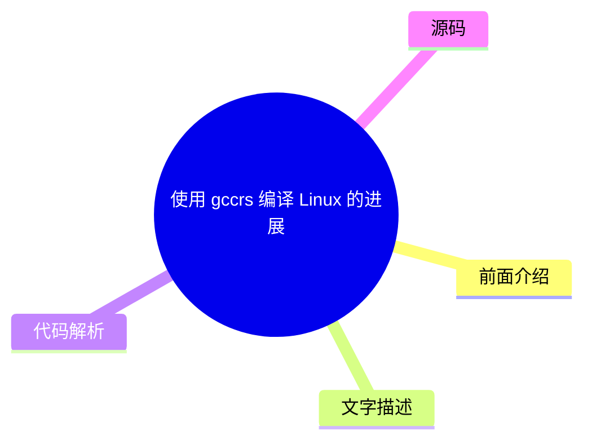
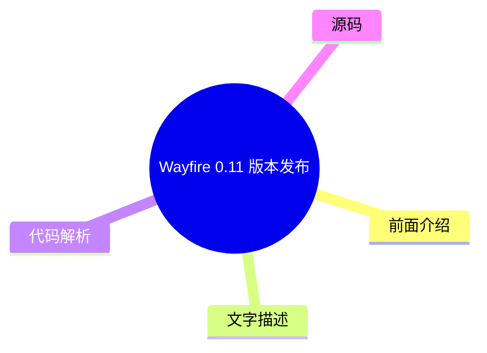
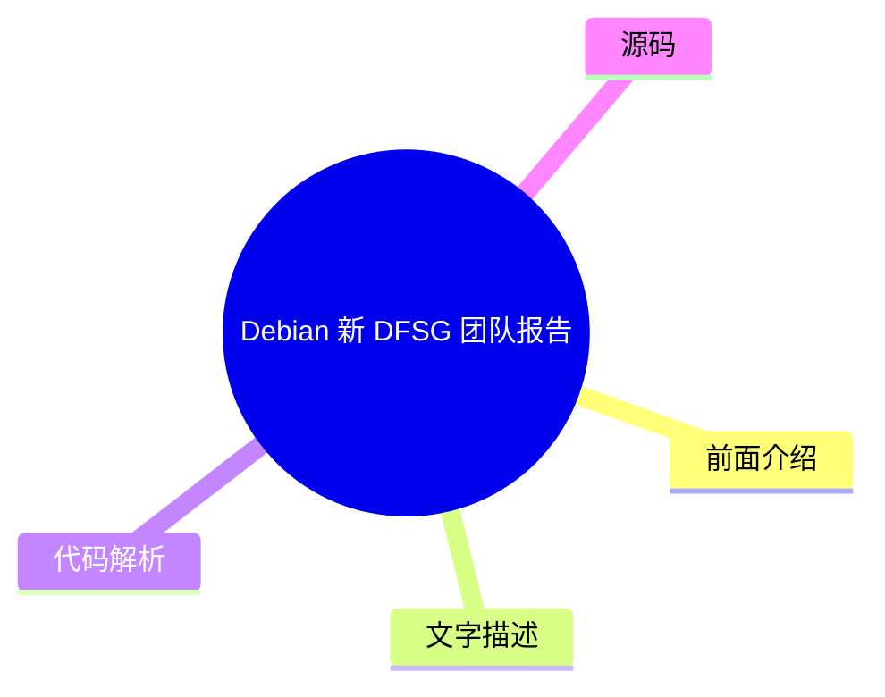

# 🐧 LWN.net (Linux kernel) Top 8 (2026-07-30)

## 前面介绍

- 数据源：LWN.net (Linux kernel)
- 抓取日期：2026-07-30
- 条目数：8
- 含完整正文：4
- 含代码片段：0
- 组织方式：前面介绍 / 树状图 / 文字描述 / 代码解析 / 源码

## 思维导图

```mermaid
mindmap
  root((LWN.net (Linux kernel)))
    内联函数的调试信息
    周三发布三个稳定版内核修复单一回归
    Fedora 批准更精简的 GRUB 版本
    GCC 委员会宣布 AI 贡献政策
    周三安全更新汇总
    使用 gccrs 编译 Linux 的进展
    Wayfire 0.11 版本发布
    Debian 新 DFSG 团队报告
```

## 详细整理（8 条，4 条含全文，0 条含代码）

### 1. 内联函数的调试信息
- **链接**: [https://lwn.net/Articles/1083985/](https://lwn.net/Articles/1083985/)
- **作者**: daroc
- **发布**: Wed, 29 Jul 2026 18:05:21 +0000

#### 前面介绍

- BPF 程序使用 BPF 类型格式 (BTF) 调试信息来确定如何与内核函数交互。
- 追踪内核函数需要找到其在内核 BTF 段中的地址。

#### 树状图


#### 文字描述

- BPF（Berkeley Packet Filter）程序运行在内核空间，需要通过调试信息来理解内核函数的签名和结构。
- BTF（BPF Type Format）是 eBPF 的元数据格式，它提供了内核类型和函数的调试信息。
- 通过 BTF，eBPF 程序可以安全地访问内核数据结构，而无需硬编码偏移量。
- 文章指出，仅查找函数地址在 BTF 段中并不总是有效，暗示可能存在地址解析或符号表加载的问题。

#### 代码解析

- 本文未提供源码，以下为实现思路或结构解析

#### 源码

未抓到可展示源码或原文节选。


### 2. 周三发布三个稳定版内核修复单一回归
- **链接**: [https://lwn.net/Articles/1086047/](https://lwn.net/Articles/1086047/)
- **作者**: jzb
- **发布**: Wed, 29 Jul 2026 17:00:36 +0000

#### 前面介绍

- Greg Kroah-Hartman 发布了 6.12.99、6.6.146 和 6.1.179 三个稳定版内核。
- 本次更新仅包含一个回归修复，由特定提交引起。
- 建议相关用户尽快升级以修复该问题。

#### 树状图


#### 文字描述

- Linux 内核维护团队定期发布稳定版内核，用于修复生产环境中的严重问题。
- 本次发布的版本涵盖了不同的长期支持分支（LTS），确保不同版本的系统都能获得修复。
- 回归是指新版本引入的破坏现有功能的错误，修复此类问题对系统稳定性至关重要。
- 用户应关注官方公告，及时应用安全补丁和功能修复。

#### 代码解析

- 本文未提供源码，以下为实现思路或结构解析

#### 源码

#### 中文节选

# Three stable kernels for Wednesday fix a single regression

Greg Kroah-Hartman has announced the release of the [6.12.99](/Articles/1086049/), [6.6.146](/Articles/1086050/), and [6.1.179](/Articles/1086051/) stable kernels. This batch of
stable kernels includes a single fix for a [regression](https://lore.kernel.org/all/CAHmU7GkfHNdA-sph9mBf-s+a=9m22KcGTq6r=78=qSf5BKBgag@mail.gmail.com/)
caused by [this
commit](https://git.kernel.org/pub/scm/linux/kernel/git/stable/linux.git/commit/?id=6650527444dadc63d84aa939d14ecba4fadb2f69). Users of those kernels should upgrade.

#### 完整正文（中文）

# Three stable kernels for Wednesday fix a single regression

Greg Kroah-Hartman has announced the release of the [6.12.99](/Articles/1086049/), [6.6.146](/Articles/1086050/), and [6.1.179](/Articles/1086051/) stable kernels. This batch of
stable kernels includes a single fix for a [regression](https://lore.kernel.org/all/CAHmU7GkfHNdA-sph9mBf-s+a=9m22KcGTq6r=78=qSf5BKBgag@mail.gmail.com/)
caused by [this
commit](https://git.kernel.org/pub/scm/linux/kernel/git/stable/linux.git/commit/?id=6650527444dadc63d84aa939d14ecba4fadb2f69). Users of those kernels should upgrade.


### 3. Fedora 批准更精简的 GRUB 版本
- **链接**: [https://lwn.net/Articles/1085609/](https://lwn.net/Articles/1085609/)
- **作者**: jzb
- **发布**: Wed, 29 Jul 2026 15:44:01 +0000

#### 前面介绍

- Fedora 45 计划引入一个精简版的 GRUB 包。
- 该版本旨在满足特定的边缘使用场景需求。
- 新包将与主 GRUB 包并存，而非替换它。

#### 树状图


#### 文字描述

- GRUB（Grand Unified Bootloader）是 Linux 系统的启动引导加载程序。
- 为了减少不必要的依赖和体积，Fedora 计划为特定场景提供轻量级 GRUB。
- 这种设计允许用户在保持标准 GRUB 功能的同时，为嵌入式或特殊环境提供更小的启动镜像。
- 这一变更提案预计将在 Fedora 45（2026年10月）发布时实施。

#### 代码解析

- 本文未提供源码，以下为实现思路或结构解析

#### 源码

未抓到可展示源码或原文节选。


### 4. GCC 委员会宣布 AI 贡献政策
- **链接**: [https://lwn.net/Articles/1086041/](https://lwn.net/Articles/1086041/)
- **作者**: jzb
- **发布**: Wed, 29 Jul 2026 14:38:44 +0000

#### 前面介绍

- GCC 委员会接受了 AI 政策工作组的建议。
- 政策规定将拒绝包含 LLM 生成内容或由此衍生的“法律上重要”的贡献。
- 该政策基于 GNU 项目维护者指南中关于“法律上重要”的定义。

#### 树状图


#### 文字描述

- GCC（GNU Compiler Collection）是开源编译器套件，其贡献政策旨在维护代码质量和版权清晰度。
- 政策将“法律上重要”定义为大约 15 行代码和/或文本，这通常是版权归属的关键阈值。
- 虽然禁止将 LLM 生成的输出作为贡献提交，但允许使用 LLM 进行研究、分析、Bug 发现和补丁审查。
- 委员会表示该政策将随着时间推移而演变，并会定期重新评估。

#### 代码解析

- 本文未提供源码，以下为实现思路或结构解析

#### 源码

#### 中文节选

# GCC指导委员会宣布 AI 政策

GCC 指导委员会已宣布，它已接受 GCC AI 政策工作组推荐的 [一项 AI 贡献政策](https://forge.sourceware.org/redi/gcc-wwwdocs/commit/4d0793a6a14bf9bfe9e92ac1599840780355199d)。

该政策部分规定，项目将拒绝任何包含 LLM 生成内容或源自 LLM 生成内容的“具有法律意义的贡献”。它使用了 GNU 项目维护者指南中关于“具有法律意义”的定义，该定义认为，为了版权目的，其门槛是“大约 15 行代码和/或文本”。然而，GCC 维护者可以选择接受由 LLM 生成的具有法律意义的测试用例。

只要输出内容不包含在贡献中，该政策并不禁止使用 LLM 进行研究、分析、发现和报告错误、审查补丁等。委员会表示，它预计该政策将不断发展，并将定期进行审查。

#### 完整正文（中文）

# GCC指导委员会宣布 AI 政策

GCC 指导委员会已宣布，它已接受 GCC AI 政策工作组推荐的 [一项 AI 贡献政策](https://forge.sourceware.org/redi/gcc-wwwdocs/commit/4d0793a6a14bf9bfe9e92ac1599840780355199d)。

该政策部分规定，项目将拒绝任何包含 LLM 生成内容或源自 LLM 生成内容的“具有法律意义的贡献”。它使用了 GNU 项目维护者指南中关于“具有法律意义”的定义，该定义认为，为了版权目的，其门槛是“大约 15 行代码和/或文本”。然而，GCC 维护者可以选择接受由 LLM 生成的具有法律意义的测试用例。

只要输出内容不包含在贡献中，该政策并不禁止使用 LLM 进行研究、分析、发现和报告错误、审查补丁等。委员会表示，它预计该政策将不断发展，并将定期进行审查。


### 5. 周三安全更新汇总
- **链接**: [https://lwn.net/Articles/1086031/](https://lwn.net/Articles/1086031/)
- **作者**: jzb
- **发布**: Wed, 29 Jul 2026 13:11:23 +0000

#### 前面介绍

- AlmaLinux、Debian、Fedora、Mageia 等多个发行版发布了安全更新。
- 更新涉及内核、浏览器、存储工具等多个关键组件。
- 用户应尽快检查并应用相关安全补丁。

#### 树状图


#### 文字描述

- 安全更新通常用于修复可能导致远程代码执行、权限提升或数据泄露的漏洞。
- 本周更新的包包括：AlmaLinux 的 kernel、kernel-rt 和 sssd；Debian 的 samba 和 libraw；Fedora 的 chromium 和 restic。
- Mageia 更新了 gstreamer1.0-libav 和 libslirp；Slackware 更新了 samba 和 seamonkey。
- SUSE 系列发行版更新了包括 nginx、glib2 和 python-urllib3 在内的多个包。

#### 代码解析

- 本文未提供源码，以下为实现思路或结构解析

#### 源码

#### 中文节选

# Security updates for Wednesday

| Dist. | ID | Release | Package | Date | 
|---|
| AlmaLinux | [ALSA-2026:46532](https://lwn.net/Articles/1085976/) | 8 | dovecot | 2026-07-28 | 
| AlmaLinux | [ALSA-2026:46394](https://lwn.net/Articles/1085977/) | 10 | go-fdo-client | 2026-07-28 | 
| AlmaLinux | [ALSA-2026:46395](https://lwn.net/Articles/1085978/) | 10 | go-fdo-server | 2026-07-28 | 
| AlmaLinux | [ALSA-2026:47011](https://lwn.net/Articles/1085979/) | 8 | kernel | 2026-07-28 | 
| AlmaLinux | [ALSA-2026:47010](https://lwn.net/Articles/1085980/) | 8 | kernel-rt | 2026-07-28 | 
| AlmaLinux | [ALSA-2026:46990](https://lwn.net/Articles/1085981/) | 8 | sssd | 2026-07-28 | 
| Debian | [DLA-4705-1](https://lwn.net/Articles/1085982/) | LTS | calibre | 2026-07-29 | 
| Debian | [DSA-6402-1](https://lwn.net/Articles/1085983/) | stable | hplip | 2026-07-28 | 
| Debian | [DLA-4704-1](https://lwn.net/Articles/1085984/) | LTS | libraw | 2026-07-29 | 
| Debian | [DSA-6401-1](https://lwn.net/Articles/1085985/) | stable | samba | 2026-07-28 | 
| Fedora | [FEDORA-2026-1528cb06a7](https://lwn.net/Articles/1085986/) | F43 | btrbk | 2026-07-29 | 
| Fedora | [FEDORA-2026-8a09a7af63](https://lwn.net/Articles/1085988/) | F43 | chromium | 2026-07-29 | 
| Fedora | [FEDORA-2026-e48156418f](https://lwn.net/Articles/1085987/) | F44 | chromium | 2026-07-29 | 
| Fedora | [FEDORA-2026-d61fcb86ed](https://lwn.net/Articles/1085989/) | F43 | gpsd | 2026-07-29 | 
| Fedora | [FEDORA-2026-56568b6fe8](https://lwn.net/Articles/1085991/) | F43 | kronosnet | 2026-07-29 | 
| Fedora | [FEDORA-2026-db53330c8f](https://lwn.net/Articles/1085990/) | F44 | kronosnet | 2026-07-29 | 
| Fedora | [FEDORA-2026-a006788209](https://lwn.net/Articles/1085993/) | F43 | restic | 2026-07-29 | 
| Fedora | [FEDORA-2026-c87cc5b948](https://lwn.net/Articles/1085992/) | F44 | restic | 2026-07-29 | 
| Mageia | [MGASA-2026-0307](https://lwn.net/Articles/1085994/) | 10 | gstreamer1.0-libav | 2026-07-28 | 
| Mageia | [MGASA-2026-0306](https://lwn.net/Articles/1085995/) | 10, 9 | libslirp | 2026-07-28 | 
| Slackware | [SSA:2026-209-01](https://lwn.net/Articles/1085996/) |  | libarchive | 2026-07-28 | 

| Slackware | [SSA:2026-209-03](https://lwn.net/Articles/1085997/) |  | samba | 2026-07-28 | 
| Slackware | [SSA:2026-209-02](https://lwn.net/Articles/1085998/) |  | seamonkey | 2026-07-28 | 
| SUSE | [SUSE-SU-2026:3395-1](https://lwn.net/Articles/1086003/) | SLE15 oS15.6 | GraphicsMagick | 2026-07-29 | 
| SUSE | [SUSE-SU-2026:3335-1](https://lwn.net/Articles/1086005/) | SLE15 oS15.4 | ImageMagick | 2026-07-28 | 
| SUSE | [openSUSE-SU-2026:21448-1](https://lwn.net/Articles/1085999/) | oS16.0 | agama-web-ui | 2026-07-28 | 
| SUSE | [openSUSE-SU-2026:21453-1](https://lwn.net/Articles/1086000/) | oS16.0 | chromium | 2026-07-28 | 
| SUSE | [SUSE-SU-2026:3399-1](https://lwn.net/Articles/1086001/) | SLE15 oS15.4 | gimp | 2026-07-29 | 
| SUSE | [SUSE-SU-2026:3341-1](https://lwn.net/Articles/1086002/) | SLE15 oS15.6 | glib2 | 2

#### 完整正文（中文）

# Security updates for Wednesday

| Dist. | ID | Release | Package | Date | 
|---|
| AlmaLinux | [ALSA-2026:46532](https://lwn.net/Articles/1085976/) | 8 | dovecot | 2026-07-28 | 
| AlmaLinux | [ALSA-2026:46394](https://lwn.net/Articles/1085977/) | 10 | go-fdo-client | 2026-07-28 | 
| AlmaLinux | [ALSA-2026:46395](https://lwn.net/Articles/1085978/) | 10 | go-fdo-server | 2026-07-28 | 
| AlmaLinux | [ALSA-2026:47011](https://lwn.net/Articles/1085979/) | 8 | kernel | 2026-07-28 | 
| AlmaLinux | [ALSA-2026:47010](https://lwn.net/Articles/1085980/) | 8 | kernel-rt | 2026-07-28 | 
| AlmaLinux | [ALSA-2026:46990](https://lwn.net/Articles/1085981/) | 8 | sssd | 2026-07-28 | 
| Debian | [DLA-4705-1](https://lwn.net/Articles/1085982/) | LTS | calibre | 2026-07-29 | 
| Debian | [DSA-6402-1](https://lwn.net/Articles/1085983/) | stable | hplip | 2026-07-28 | 
| Debian | [DLA-4704-1](https://lwn.net/Articles/1085984/) | LTS | libraw | 2026-07-29 | 
| Debian | [DSA-6401-1](https://lwn.net/Articles/1085985/) | stable | samba | 2026-07-28 | 
| Fedora | [FEDORA-2026-1528cb06a7](https://lwn.net/Articles/1085986/) | F43 | btrbk | 2026-07-29 | 
| Fedora | [FEDORA-2026-8a09a7af63](https://lwn.net/Articles/1085988/) | F43 | chromium | 2026-07-29 | 
| Fedora | [FEDORA-2026-e48156418f](https://lwn.net/Articles/1085987/) | F44 | chromium | 2026-07-29 | 
| Fedora | [FEDORA-2026-d61fcb86ed](https://lwn.net/Articles/1085989/) | F43 | gpsd | 2026-07-29 | 
| Fedora | [FEDORA-2026-56568b6fe8](https://lwn.net/Articles/1085991/) | F43 | kronosnet | 2026-07-29 | 
| Fedora | [FEDORA-2026-db53330c8f](https://lwn.net/Articles/1085990/) | F44 | kronosnet | 2026-07-29 | 
| Fedora | [FEDORA-2026-a006788209](https://lwn.net/Articles/1085993/) | F43 | restic | 2026-07-29 | 
| Fedora | [FEDORA-2026-c87cc5b948](https://lwn.net/Articles/1085992/) | F44 | restic | 2026-07-29 | 
| Mageia | [MGASA-2026-0307](https://lwn.net/Articles/1085994/) | 10 | gstreamer1.0-libav | 2026-07-28 | 
| Mageia | [MGASA-2026-0306](https://lwn.net/Articles/1085995/) | 10, 9 | libslirp | 2026-07-28 | 
| Slackware | [SSA:2026-209-01](https://lwn.net/Articles/1085996/) |  | libarchive | 2026-07-28 | 

| Slackware | [SSA:2026-209-03](https://lwn.net/Articles/1085997/) |  | samba | 2026-07-28 | 
| Slackware | [SSA:2026-209-02](https://lwn.net/Articles/1085998/) |  | seamonkey | 2026-07-28 | 
| SUSE | [SUSE-SU-2026:3395-1](https://lwn.net/Articles/1086003/) | SLE15 oS15.6 | GraphicsMagick | 2026-07-29 | 
| SUSE | [SUSE-SU-2026:3335-1](https://lwn.net/Articles/1086005/) | SLE15 oS15.4 | ImageMagick | 2026-07-28 | 
| SUSE | [openSUSE-SU-2026:21448-1](https://lwn.net/Articles/1085999/) | oS16.0 | agama-web-ui | 2026-07-28 | 
| SUSE | [openSUSE-SU-2026:21453-1](https://lwn.net/Articles/1086000/) | oS16.0 | chromium | 2026-07-28 | 
| SUSE | [SUSE-SU-2026:3399-1](https://lwn.net/Articles/1086001/) | SLE15 oS15.4 | gimp | 2026-07-29 | 
| SUSE | [SUSE-SU-2026:3341-1](https://lwn.net/Articles/1086002/) | SLE15 oS15.6 | glib2 | 2026-07-28 | 
| SUSE | [openSUSE-SU-2026:11376-1](https://lwn.net/Articles/1086004/) | TW | ignition | 2026-07-28 | 
| SUSE | [SUSE-SU-2026:3332-1](https://lwn.net/Articles/1086006/) | SLE15 oS15.6 | java-21-openjdk | 2026-07-28 | 
| SUSE | [SUSE-SU-2026:3330-1](https://lwn.net/Articles/1086007/) | SLE15 oS15.6 | libssh | 2026-07-28 | 
| SUSE | [openSUSE-SU-2026:11377-1](https://lwn.net/Articles/1086008/) | TW | libssh-config | 2026-07-28 | 
| SUSE | [SUSE-SU-2026:3329-1](https://lwn.net/Articles/1086009/) | SLE15 oS15.6 | nginx | 2026-07-28 | 
| SUSE | [SUSE-SU-2026:3340-1](https://lwn.net/Articles/1086010/) | SLE15 oS15.6 | nmap | 2026-07-28 | 
| SUSE | [openSUSE-SU-2026:0265-1](https://lwn.net/Articles/1086011/) | osB15 | nsd | 2026-07-29 | 
| SUSE | [SUSE-SU-2026:3397-1](https://lwn.net/Articles/1086012/) | MP4.3 SLE15 oS15.4 | python-urllib3 | 2026-07-29 | 
| SUSE | [openSUSE-SU-2026:11378-1](https://lwn.net/Articles/1086013/) | TW | python313-CherryPy | 2026-07-28 | 
| SUSE | [SUSE-SU-2026:3398-1](https://lwn.net/Articles/1086014/) | SLE15 oS15.6 | rsyslog | 2026-07-29 | 
| SUSE | [SUSE-SU-2026:3362-1](https://lwn.net/Articles/1086018/) | MP4.3 SLE15 SLE5.3 SLE5.4 SLE-m5.3 SLE-m5.4 oS15.4 | samba | 2026-07-28 | 
| SUSE | [SUSE-SU-2026:3366-1](https://lwn.net/Articles/1086015/) | SLE15 SES7.1 oS15.3 | samba | 2026-07-28 | 

| SUSE | [SUSE-SU-2026:3365-1](https://lwn.net/Articles/1086016/) | SLE15 SLE5.5 SLE-m5.5 oS15.5 | samba | 2026-07-28 | 
| SUSE | [SUSE-SU-2026:3364-1](https://lwn.net/Articles/1086017/) | SLE15 oS15.6 | samba | 2026-07-28 | 
| SUSE | [SUSE-SU-2026:3368-1](https://lwn.net/Articles/1086019/) | SLE5.3 SLE5.4 SLE-m5.3 SLE-m5.4 oS15.4 | sssd | 2026-07-28 | 
| SUSE | [openSUSE-SU-2026:11381-1](https://lwn.net/Articles/1086020/) | TW | valkey | 2026-07-28 | 
| SUSE | [SUSE-SU-2026:3396-1](https://lwn.net/Articles/1086021/) | SLE15 oS15.4 | webkit2gtk3 | 2026-07-29 | 
| SUSE | [SUSE-SU-2026:3338-1](https://lwn.net/Articles/1086022/) | SLE15 oS15.6 | webkit2gtk3 | 2026-07-28 | 
| SUSE | [SUSE-SU-2026:3327-1](https://lwn.net/Articles/1086023/) | SLE15 oS15.5 | yq | 2026-07-28 | 
| Ubuntu | [USN-8561-2](https://lwn.net/Articles/1086024/) | 24.04 26.04 | freerdp3 | 2026-07-28 | 
| Ubuntu | [USN-8615-1](https://lwn.net/Articles/1086025/) | 18.04 20.04 | linux, linux-aws, linux-aws-5.4, linux-aws-fips, linux-azure, linux-azure-5.4, linux-azure-fips, linux-bluefield, linux-fips, linux-gcp, linux-gcp-5.4, linux-gcp-fips, linux-hwe-5.4, linux-iot, linux-oracle, linux-oracle-5.4, linux-xilinx-zynqmp | 2026-07-28 | 
| Ubuntu | [USN-8620-2](https://lwn.net/Articles/1086026/) | 22.04 | linux-azure-fips | 2026-07-29 | 
| Ubuntu | [USN-8547-2](https://lwn.net/Articles/1086027/) | 22.04 | linux-azure-fips | 2026-07-28 | 
| Ubuntu | [USN-8616-1](https://lwn.net/Articles/1086028/) | 18.04 20.04 | linux-ibm, linux-ibm-5.4 | 2026-07-28 | 
| Ubuntu | [USN-8617-1](https://lwn.net/Articles/1086029/) | 20.04 | linux-kvm | 2026-07-28 | 
| Ubuntu | [USN-8615-2](https://lwn.net/Articles/1086030/) | 18.04 20.04 | linux-raspi, linux-raspi-5.4 | 2026-07-29 |


### 6. 使用 gccrs 编译 Linux 的进展
- **链接**: [https://lwn.net/Articles/1083202/](https://lwn.net/Articles/1083202/)
- **作者**: daroc
- **发布**: Tue, 28 Jul 2026 17:40:01 +0000

#### 前面介绍

- gccrs 项目致力于为 GCC 编译器创建 Rust 前端。
- 项目在 2026 年上半年专注于测试编译 Linux 内核。
- 团队在内核 crate 的测试中取得了显著进展。

#### 树状图



#### 文字描述

- gccrs 是一个实验性的项目，旨在让 Rust 代码能够被 GCC 编译器编译。
- 将 Linux 内核迁移到 Rust 是一个长期目标，目前主要使用 Clang 编译器。
- 通过测试 gccrs 对 Linux 内核 crate 的兼容性，开发者可以验证 Rust 在复杂内核环境下的可行性。
- 这一进展表明 Rust 在系统编程领域的编译器支持正在逐步完善。

#### 代码解析

- 本文未提供源码，以下为实现思路或结构解析

#### 源码

未抓到可展示源码或原文节选。


### 7. Wayfire 0.11 版本发布
- **链接**: [https://lwn.net/Articles/1085894/](https://lwn.net/Articles/1085894/)
- **作者**: jzb
- **发布**: Tue, 28 Jul 2026 14:54:01 +0000

#### 前面介绍

- 基于 wlroots 的 Wayfire Wayland 合成器发布了 0.11 版本。
- 主要更新包括改进的分数缩放和每个输出独立的 ICC 配置文件。
- 还增加了对更多 Wayland 协议的支持。

#### 树状图



#### 文字描述

- Wayfire 是一个基于 wlroots 库的 Wayland 合成器，以其高度可配置性著称。
- 分数缩放支持允许显示器以非整数比例（如 1.25x、1.5x）显示，解决了高 DPI 屏幕的模糊问题。
- ICC 配置文件支持确保不同显示器可以应用各自的颜色配置，从而保持色彩一致性。
- Wayland 协议的扩展支持使得 Wayfire 能够与更多现代桌面应用无缝集成。

#### 代码解析

- 本文未提供源码，以下为实现思路或结构解析

#### 源码

#### 中文节选

# Wayfire 0.11 released

[Version
0.11](https://wayfire.org/2026/07/24/Wayfire-0-11.html) of the [wlroots](https://gitlab.freedesktop.org/wlroots/wlroots#wlroots)-based
[Wayfire](https://wayfire.org/) Wayland compositor has been
released. Notable changes include better fractional scaling,
per-output [ICC
profiles](https://en.wikipedia.org/wiki/ICC_profile), support for additional Wayland protocols, and more.

[Version
0.11](https://wayfire.org/2026/07/24/Wayfire-0-11.html) of the [wlroots](https://gitlab.freedesktop.org/wlroots/wlroots#wlroots)-based
[Wayfire](https://wayfire.org/) Wayland compositor has been
released. Notable changes include better fractional scaling,
per-output [ICC
profiles](https://en.wikipedia.org/wiki/ICC_profile), support for additional Wayland protocols, and more.

            
            Copyright © 2026, Eklektix, Inc.

            
            Comments and public postings are copyrighted by their creators.

            Linux  is a registered trademark of Linus Torvalds

#### 完整正文（中文）

# Wayfire 0.11 发布

[版本
0.11](https://wayfire.org/2026/07/24/Wayfire-0.11.html) 基于 [wlroots](https://gitlab.freedesktop.org/wlroots/wlroots#wlroots) 的 [Wayfire](https://wayfire.org/) Wayland 合成器已发布。主要变更包括更好的小数缩放、每个输出设备的 [ICC 配置文件](https://en.wikipedia.org/wiki/ICC_profile)、对额外 Wayland 协议的支持等。

[版本
0.11](https://wayfire.org/2026/07/24/Wayfire-0-11.html) 基于 [wlroots](https://gitlab.freedesktop.org/wlroots/wlroots#wlroots) 的 [Wayfire](https://wayfire.org/) Wayland 合成器已发布。主要变更包括更好的小数缩放、每个输出设备的 [ICC 配置文件](https://en.wikipedia.org/wiki/ICC_profile)、对额外 Wayland 协议的支持等。

            
            Copyright © 2026, Eklektix, Inc.

            
            评论和公开帖子版权归其创作者所有。

            Linux  是 Linus Torvalds 的注册商标


### 8. Debian 新 DFSG 团队报告
- **链接**: [https://lwn.net/Articles/1084499/](https://lwn.net/Articles/1084499/)
- **作者**: jzb
- **发布**: Tue, 28 Jul 2026 14:21:44 +0000

#### 前面介绍

- Debian 自由软件指导方针（DFSG）许可与新包团队（DFSG team）成立于 2025 年 10 月。
- 该团队负责审查新队列中的包是否符合 DFSG 标准。
- 其工作旨在确保 Debian 仓库中软件的自由和合规性。

#### 树状图



#### 文字描述

- Debian 自由软件指导方针（DFSG）是 Debian 项目的基本原则，定义了什么是“自由软件”。
- 随着 Debian 仓库的庞大，新包的审查工作变得复杂，因此成立了专门的团队来处理。
- 该团队隶属于 ftpmaster 团队，专注于新提交包的初步筛选和合规性检查。
- 这一举措有助于维护 Debian 生态系统的健康，防止非自由软件混入主仓库。

#### 代码解析

- 本文未提供源码，以下为实现思路或结构解析

#### 源码

未抓到可展示源码或原文节选。

