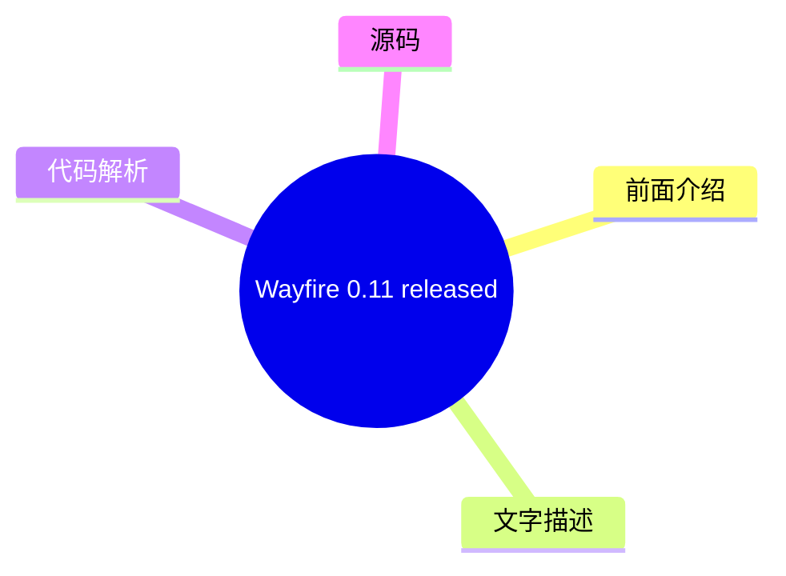

# 🐧 LWN.net (Linux kernel) Top 8 (2026-07-31)

## 前面介绍

- 数据源：LWN.net (Linux kernel)
- 抓取日期：2026-07-31
- 条目数：8
- 含完整正文：4
- 含代码片段：0
- 组织方式：前面介绍 / 树状图 / 文字描述 / 代码解析 / 源码

## 思维导图

```mermaid
mindmap
  root((LWN.net (Linux kernel)))
    [$] Debugging information fo
    Three stable kernels for Wed
    [$] Fedora approves a smalle
    GCC steering committee annou
    Security updates for Wednesd
    [$] Progress toward compilin
    Wayfire 0.11 released
    [$] A report from Debian's n
```

## 详细整理（8 条，4 条含全文，0 条含代码）

### 1. [$] Debugging information for inlined functions
- **链接**: [https://lwn.net/Articles/1083985/](https://lwn.net/Articles/1083985/)
- **作者**: daroc
- **发布**: Wed, 29 Jul 2026 18:05:21 +0000

#### 前面介绍

- BPF programs use

BPF type format (BTF) debugging information in order to
determine how to interact with functions in the kernel. Specifically, tracing a
kernel function involves finding its address in the kernel's BTF section — but
that doesn't wor
- 作者：daroc
- 发布时间：Wed, 29 Jul 2026 18:05:21 +0000

#### 树状图

```mermaid
mindmap
  root(([$] Debugging informatio))
    前面介绍
    文字描述
    代码解析
    源码
```

#### 文字描述

- BPF programs use

BPF type format (BTF) debugging information in order to
determine how to interact with functions in the kernel. Specifically, tracing a
kernel function involves finding its address in the kernel's BTF section — but
that doesn't wor

#### 代码解析

- 本文未检测到明确代码块，内容更偏新闻、观点或方法论。

#### 源码

未抓到可展示源码或原文节选。


### 2. Three stable kernels for Wednesday fix a single regression
- **链接**: [https://lwn.net/Articles/1086047/](https://lwn.net/Articles/1086047/)
- **作者**: jzb
- **发布**: Wed, 29 Jul 2026 17:00:36 +0000

#### 前面介绍

- Greg Kroah-Hartman has announced the release of the 6.12.99, 6.6.146, and 6.1.179 stable kernels. This batch of
stable kernels includes a single fix for a regression
caused by this
commit. Users of those kernels should upgrade.
- 作者：jzb
- 发布时间：Wed, 29 Jul 2026 17:00:36 +0000

#### 树状图


#### 文字描述

- # Three stable kernels for Wednesday fix a single regression Greg Kroah-Hartman has announced the release of the [6.12.99](/Articles/1086049/), [6.6.146](/Articles/1086050/), and [6.1.179](/Articles/1086051/) stable kernels. This batch of stable kernels includes a single fix for a [regression](https://lore.kernel.org/all/CAHmU7GkfHNdA-sph9mBf-s+a=9m22KcGTq6r=78=qSf5BKBgag@mail.

#### 代码解析

- 本文未检测到明确代码块，内容更偏新闻、观点或方法论。

#### 源码

#### 中文节选

# Three stable kernels for Wednesday fix a single regression

Greg Kroah-Hartman has announced the release of the [6.12.99](/Articles/1086049/), [6.6.146](/Articles/1086050/), and [6.1.179](/Articles/1086051/) stable kernels. This batch of
stable kernels includes a single fix for a [regression](https://lore.kernel.org/all/CAHmU7GkfHNdA-sph9mBf-s+a=9m22KcGTq6r=78=qSf5BKBgag@mail.gmail.com/)
caused by [this
commit](https://git.kernel.org/pub/scm/linux/kernel/git/stable/linux.git/commit/?id=6650527444dadc63d84aa939d14ecba4fadb2f69). Users of those kernels should upgrade.

#### 完整正文（中文）

# Three stable kernels for Wednesday fix a single regression

Greg Kroah-Hartman has announced the release of the [6.12.99](/Articles/1086049/), [6.6.146](/Articles/1086050/), and [6.1.179](/Articles/1086051/) stable kernels. This batch of
stable kernels includes a single fix for a [regression](https://lore.kernel.org/all/CAHmU7GkfHNdA-sph9mBf-s+a=9m22KcGTq6r=78=qSf5BKBgag@mail.gmail.com/)
caused by [this
commit](https://git.kernel.org/pub/scm/linux/kernel/git/stable/linux.git/commit/?id=6650527444dadc63d84aa939d14ecba4fadb2f69). Users of those kernels should upgrade.


### 3. [$] Fedora approves a smaller GRUB
- **链接**: [https://lwn.net/Articles/1085609/](https://lwn.net/Articles/1085609/)
- **作者**: jzb
- **发布**: Wed, 29 Jul 2026 15:44:01 +0000

#### 前面介绍

- Leo Sandoval and Marta Lewandowska have put forward a change
proposal for Fedora&#160;45, which is expected in October, to
provide a separate, slimmed-down version of GRUB for a niche use
case. The new package would be in addition to the main GRUB pa
- 作者：jzb
- 发布时间：Wed, 29 Jul 2026 15:44:01 +0000

#### 树状图

```mermaid
mindmap
  root(([$] Fedora approves a sm))
    前面介绍
    文字描述
    代码解析
    源码
```

#### 文字描述

- Leo Sandoval and Marta Lewandowska have put forward a change
proposal for Fedora&#160;45, which is expected in October, to
provide a separate, slimmed-down version of GRUB for a niche use
case. The new package would be in addition to the main GRUB pa

#### 代码解析

- 本文未检测到明确代码块，内容更偏新闻、观点或方法论。

#### 源码

未抓到可展示源码或原文节选。


### 4. GCC steering committee announces AI policy
- **链接**: [https://lwn.net/Articles/1086041/](https://lwn.net/Articles/1086041/)
- **作者**: jzb
- **发布**: Wed, 29 Jul 2026 14:38:44 +0000

#### 前面介绍

- The GCC steering committee has announced
that it has accepted an
AI contributions policy recommended by the GCC AI policy working
group.

The policy, in part, states that the project will decline any
"legally significant contributions which include L
- 作者：jzb
- 发布时间：Wed, 29 Jul 2026 14:38:44 +0000

#### 树状图


#### 文字描述

- # GCC steering committee announces AI policy The GCC steering committee has [announced](https://lwn.net/ml/all/CAGWvny=KZcazorvmCU3gdT4dBcMJm6S_769Ne+aTfbO_nZ_HsQ@mail.gmail.com/) that it has accepted [an AI contributions policy](https://forge.sourceware.org/redi/gcc-wwwdocs/commit/4d0793a6a14bf9bfe9e92ac1599840780355199d) recommended by the GCC AI policy working group. The pol

#### 代码解析

- 本文未检测到明确代码块，内容更偏新闻、观点或方法论。

#### 源码

#### 中文节选

# GCC steering committee announces AI policy

The GCC steering committee has [announced](https://lwn.net/ml/all/CAGWvny=KZcazorvmCU3gdT4dBcMJm6S_769Ne+aTfbO_nZ_HsQ@mail.gmail.com/)
that it has accepted [an
AI contributions policy](https://forge.sourceware.org/redi/gcc-wwwdocs/commit/4d0793a6a14bf9bfe9e92ac1599840780355199d) recommended by the GCC AI policy working
group.

The policy, in part, states that the project will decline any
"legally significant contributions which include LLM-generated
content or are derived from LLM-generated content

". It uses the [definition](https://www.gnu.org/prep/maintain/maintain.html#Legally-Significant)
of "legally significant" from the GNU Project maintainer guidelines,
which holds that the threshold is "around 15 lines of code and/or
text

" to qualify as significant for copyright purposes. GCC
maintainers may, however, choose to accept legally significant test
cases that are generated by an LLM.

The policy does not forbid use of LLMs for research, analysis, bug discovery and reporting, patch review, etc. as long as the output is not included in contributions. The committee says that it expects the policy will evolve and will be revisited periodically.

#### 完整正文（中文）

# GCC steering committee announces AI policy

The GCC steering committee has [announced](https://lwn.net/ml/all/CAGWvny=KZcazorvmCU3gdT4dBcMJm6S_769Ne+aTfbO_nZ_HsQ@mail.gmail.com/)
that it has accepted [an
AI contributions policy](https://forge.sourceware.org/redi/gcc-wwwdocs/commit/4d0793a6a14bf9bfe9e92ac1599840780355199d) recommended by the GCC AI policy working
group.

The policy, in part, states that the project will decline any
"legally significant contributions which include LLM-generated
content or are derived from LLM-generated content

". It uses the [definition](https://www.gnu.org/prep/maintain/maintain.html#Legally-Significant)
of "legally significant" from the GNU Project maintainer guidelines,
which holds that the threshold is "around 15 lines of code and/or
text

" to qualify as significant for copyright purposes. GCC
maintainers may, however, choose to accept legally significant test
cases that are generated by an LLM.

The policy does not forbid use of LLMs for research, analysis, bug discovery and reporting, patch review, etc. as long as the output is not included in contributions. The committee says that it expects the policy will evolve and will be revisited periodically.


### 5. Security updates for Wednesday
- **链接**: [https://lwn.net/Articles/1086031/](https://lwn.net/Articles/1086031/)
- **作者**: jzb
- **发布**: Wed, 29 Jul 2026 13:11:23 +0000

#### 前面介绍

- Security updates have been issued by AlmaLinux (dovecot, go-fdo-client, go-fdo-server, kernel, kernel-rt, and sssd), Debian (calibre, hplip, libraw, and samba), Fedora (btrbk, chromium, gpsd, kronosnet, and restic), Mageia (gstreamer1.0-libav and lib
- 作者：jzb
- 发布时间：Wed, 29 Jul 2026 13:11:23 +0000

#### 树状图


#### 文字描述

- # Security updates for Wednesday | Dist. | ID | Release | Package | Date | |---| | AlmaLinux | [ALSA-2026:46532](https://lwn.net/Articles/1085976/) | 8 | dovecot | 2026-07-28 | | AlmaLinux | [ALSA-2026:46394](https://lwn.net/Articles/1085977/) | 10 | go-fdo-client | 2026-07-28 | | AlmaLinux | [ALSA-2026:46395](https://lwn.net/Articles/1085978/) | 10 | go-fdo-server | 2026-07-28

#### 代码解析

- 本文未检测到明确代码块，内容更偏新闻、观点或方法论。

#### 源码

#### 中文节选

# 周三安全更新

| 发行版 | ID | 发布版本 | 包 | 日期 |
|---|
| AlmaLinux | [ALSA-2026:46532](https://lwn.net/Articles/1085976/) | 8 | dovecot | 2026-07-28 | 
| AlmaLinux | [ALSA-2026:46394](https://lwn.net/Articles/1085977/) | 10 | go-fdo-client | 2026-07-28 | 
| AlmaLinux | [ALSA-2026:46395](https://lwn.net/Articles/1085978/) | 10 | go-fdo-server | 2026-07-28 | 
| AlmaLinux | [ALSA-2026:47011](https://lwn.net/Articles/1085979/) | 8 | kernel | 2026-07-28 | 
| AlmaLinux | [ALSA-2026:47010](https://lwn.net/Articles/1085980/) | 8 | kernel-rt | 2026-07-28 | 
| AlmaLinux | [ALSA-2026:46990](https://lwn.net/Articles/1085981/) | 8 | sssd | 2026-07-28 | 
| Debian | [DLA-4705-1](https://lwn.net/Articles/1085982/) | LTS | calibre | 2026-07-29 | 
| Debian | [DSA-6402-1](https://lwn.net/Articles/1085983/) | stable | hplip | 2026-07-28 | 
| Debian | [DLA-4704-1](https://lwn.net/Articles/1085984/) | LTS | libraw | 2026-07-29 | 
| Debian | [DSA-6401-1](https://lwn.net/Articles/1085985/) | stable | samba | 2026-07-28 | 
| Fedora | [FEDORA-2026-1528cb06a7](https://lwn.net/Articles/1085986/) | F43 | btrbk | 2026-07-29 | 
| Fedora | [FEDORA-2026-8a09a7af63](https://lwn.net/Articles/1085988/) | F43 | chromium | 2026-07-29 | 
| Fedora | [FEDORA-2026-e48156418f](https://lwn.net/Articles/1085987/) | F44 | chromium | 2026-07-29 | 
| Fedora | [FEDORA-2026-d61fcb86ed](https://lwn.net/Articles/1085989/) | F43 | gpsd | 2026-07-29 | 
| Fedora | [FEDORA-2026-56568b6fe8](https://lwn.net/Articles/1085991/) | F43 | kronosnet | 2026-07-29 | 
| Fedora | [FEDORA-2026-db53330c8f](https://lwn.net/Articles/1085990/) | F44 | kronosnet | 2026-07-29 | 
| Fedora | [FEDORA-2026-a006788209](https://lwn.net/Articles/1085993/) | F43 | restic | 2026-07-29 | 
| Fedora | [FEDORA-2026-c87cc5b948](https://lwn.net/Articles/1085992/) | F44 | restic | 2026-07-29 | 
| Mageia | [MGASA-2026-0307](https://lwn.net/Articles/1085994/) | 10 | gstreamer1.0-libav | 2026-07-28 | 
| Mageia | [MGASA-2026-0306](https://lwn.net/Articles/1085995/) | 10, 9 | libslirp | 2026-07-28 | 
| Slackware | [SSA:2026-209-01](https://lwn.net/Articles/1085996/) |  | libarchive | 2026-07-28 |

| Slackware | [SSA:2026-209-03](https://lwn.net/Articles/1085997/) |  | samba | 2026-07-28 | 
| Slackware | [SSA:2026-209-02](https://lwn.net/Articles/1085998/) |  | seamonkey | 2026-07-28 | 
| SUSE | [SUSE-SU-2026:3395-1](https://lwn.net/Articles/1086003/) | SLE15 oS15.6 | GraphicsMagick | 2026-07-29 | 
| SUSE | [SUSE-SU-2026:3335-1](https://lwn.net/Articles/1086005/) | SLE15 oS15.4 | ImageMagick | 2026-07-28 | 
| SUSE | [openSUSE-SU-2026:21448-1](https://lwn.net/Articles/1085999/) | oS16.0 | agama-web-ui | 2026-07-28 | 
| SUSE | [openSUSE-SU-2026:21453-1](https://lwn.net/Articles/1086000/) | oS16.0 | chromium | 2026-07-28 | 
| SUSE | [SUSE-SU-2026:3399-1](https://lwn.net/Articles/1086001/) | SLE15 oS15.4 | gimp | 2026-07-29 | 
| SUSE | [SUSE-SU-2026:3341-1](https://lwn.net/Articles/1086002/) | SLE15 oS15.6 | glib2 | 2

#### 完整正文（中文）

# 周三安全更新

| 发行版 | ID | 发布版本 | 包 | 日期 |
|---|
| AlmaLinux | [ALSA-2026:46532](https://lwn.net/Articles/1085976/) | 8 | dovecot | 2026-07-28 | 
| AlmaLinux | [ALSA-2026:46394](https://lwn.net/Articles/1085977/) | 10 | go-fdo-client | 2026-07-28 | 
| AlmaLinux | [ALSA-2026:46395](https://lwn.net/Articles/1085978/) | 10 | go-fdo-server | 2026-07-28 | 
| AlmaLinux | [ALSA-2026:47011](https://lwn.net/Articles/1085979/) | 8 | kernel | 2026-07-28 | 
| AlmaLinux | [ALSA-2026:47010](https://lwn.net/Articles/1085980/) | 8 | kernel-rt | 2026-07-28 | 
| AlmaLinux | [ALSA-2026:46990](https://lwn.net/Articles/1085981/) | 8 | sssd | 2026-07-28 | 
| Debian | [DLA-4705-1](https://lwn.net/Articles/1085982/) | LTS | calibre | 2026-07-29 | 
| Debian | [DSA-6402-1](https://lwn.net/Articles/1085983/) | stable | hplip | 2026-07-28 | 
| Debian | [DLA-4704-1](https://lwn.net/Articles/1085984/) | LTS | libraw | 2026-07-29 | 
| Debian | [DSA-6401-1](https://lwn.net/Articles/1085985/) | stable | samba | 2026-07-28 | 
| Fedora | [FEDORA-2026-1528cb06a7](https://lwn.net/Articles/1085986/) | F43 | btrbk | 2026-07-29 | 
| Fedora | [FEDORA-2026-8a09a7af63](https://lwn.net/Articles/1085988/) | F43 | chromium | 2026-07-29 | 
| Fedora | [FEDORA-2026-e48156418f](https://lwn.net/Articles/1085987/) | F44 | chromium | 2026-07-29 | 
| Fedora | [FEDORA-2026-d61fcb86ed](https://lwn.net/Articles/1085989/) | F43 | gpsd | 2026-07-29 | 
| Fedora | [FEDORA-2026-56568b6fe8](https://lwn.net/Articles/1085991/) | F43 | kronosnet | 2026-07-29 | 
| Fedora | [FEDORA-2026-db53330c8f](https://lwn.net/Articles/1085990/) | F44 | kronosnet | 2026-07-29 | 
| Fedora | [FEDORA-2026-a006788209](https://lwn.net/Articles/1085993/) | F43 | restic | 2026-07-29 | 
| Fedora | [FEDORA-2026-c87cc5b948](https://lwn.net/Articles/1085992/) | F44 | restic | 2026-07-29 | 
| Mageia | [MGASA-2026-0307](https://lwn.net/Articles/1085994/) | 10 | gstreamer1.0-libav | 2026-07-28 | 
| Mageia | [MGASA-2026-0306](https://lwn.net/Articles/1085995/) | 10, 9 | libslirp | 2026-07-28 | 
| Slackware | [SSA:2026-209-01](https://lwn.net/Articles/1085996/) |  | libarchive | 2026-07-28 |

| Slackware | [SSA:2026-209-03](https://lwn.net/Articles/1085997/) |  | samba | 2026-07-28 | 
| Slackware | [SSA:2026-209-02](https://lwn.net/Articles/1085998/) |  | seamonkey | 2026-07-28 | 
| SUSE | [SUSE-SU-2026:3395-1](https://lwn.net/Articles/1086003/) | SLE15 oS15.6 | GraphicsMagick | 2026-07-29 | 
| SUSE | [SUSE-SU-2026:3335-1](https://lwn.net/Articles/1086005/) | SLE15 oS15.4 | ImageMagick | 2026-07-28 | 
| SUSE | [openSUSE-SU-2026:21448-1](https://lwn.net/Articles/1085999/) | oS16.0 | agama-web-ui | 2026-07-28 | 
| SUSE | [openSUSE-SU-2026:21453-1](https://lwn.net/Articles/1086000/) | oS16.0 | chromium | 2026-07-28 | 
| SUSE | [SUSE-SU-2026:3399-1](https://lwn.net/Articles/1086001/) | SLE15 oS15.4 | gimp | 2026-07-29 | 
| SUSE | [SUSE-SU-2026:3341-1](https://lwn.net/Articles/1086002/) | SLE15 oS15.6 | glib2 | 2026-07-28 | 
| SUSE | [openSUSE-SU-2026:11376-1](https://lwn.net/Articles/1086004/) | TW | ignition | 2026-07-28 | 
| SUSE | [SUSE-SU-2026:3332-1](https://lwn.net/Articles/1086006/) | SLE15 oS15.6 | java-21-openjdk | 2026-07-28 | 
| SUSE | [SUSE-SU-2026:3330-1](https://lwn.net/Articles/1086007/) | SLE15 oS15.6 | libssh | 2026-07-28 | 
| SUSE | [openSUSE-SU-2026:11377-1](https://lwn.net/Articles/1086008/) | TW | libssh-config | 2026-07-28 | 
| SUSE | [SUSE-SU-2026:3329-1](https://lwn.net/Articles/1086009/) | SLE15 oS15.6 | nginx | 2026-07-28 | 
| SUSE | [SUSE-SU-2026:3340-1](https://lwn.net/Articles/1086010/) | SLE15 oS15.6 | nmap | 2026-07-28 | 
| SUSE | [openSUSE-SU-2026:0265-1](https://lwn.net/Articles/1086011/) | osB15 | nsd | 2026-07-29 | 
| SUSE | [SUSE-SU-2026:3397-1](https://lwn.net/Articles/1086012/) | MP4.3 SLE15 oS15.4 | python-urllib3 | 2026-07-29 | 
| SUSE | [openSUSE-SU-2026:11378-1](https://lwn.net/Articles/1086013/) | TW | python313-CherryPy | 2026-07-28 | 
| SUSE | [SUSE-SU-2026:3398-1](https://lwn.net/Articles/1086014/) | SLE15 oS15.6 | rsyslog | 2026-07-29 | 
| SUSE | [SUSE-SU-2026:3362-1](https://lwn.net/Articles/1086018/) | MP4.3 SLE15 SLE5.3 SLE5.4 SLE-m5.3 SLE-m5.4 oS15.4 | samba | 2026-07-28 | 
| SUSE | [SUSE-SU-2026:3366-1](https://lwn.net/Articles/1086015/) | SLE15 SES7.1 oS15.3 | samba | 2026-07-28 | 

| SUSE | [SUSE-SU-2026:3365-1](https://lwn.net/Articles/1086016/) | SLE15 SLE5.5 SLE-m5.5 oS15.5 | samba | 2026-07-28 | 
| SUSE | [SUSE-SU-2026:3364-1](https://lwn.net/Articles/1086017/) | SLE15 oS15.6 | samba | 2026-07-28 | 
| SUSE | [SUSE-SU-2026:3368-1](https://lwn.net/Articles/1086019/) | SLE5.3 SLE5.4 SLE-m5.3 SLE-m5.4 oS15.4 | sssd | 2026-07-28 | 
| SUSE | [openSUSE-SU-2026:11381-1](https://lwn.net/Articles/1086020/) | TW | valkey | 2026-07-28 | 
| SUSE | [SUSE-SU-2026:3396-1](https://lwn.net/Articles/1086021/) | SLE15 oS15.4 | webkit2gtk3 | 2026-07-29 | 
| SUSE | [SUSE-SU-2026:3338-1](https://lwn.net/Articles/1086022/) | SLE15 oS15.6 | webkit2gtk3 | 2026-07-28 | 
| SUSE | [SUSE-SU-2026:3327-1](https://lwn.net/Articles/1086023/) | SLE15 oS15.5 | yq | 2026-07-28 | 
| Ubuntu | [USN-8561-2](https://lwn.net/Articles/1086024/) | 24.04 26.04 | freerdp3 | 2026-07-28 | 
| Ubuntu | [USN-8615-1](https://lwn.net/Articles/1086025/) | 18.04 20.04 | linux, linux-aws, linux-aws-5.4, linux-aws-fips, linux-azure, linux-azure-5.4, linux-azure-fips, linux-bluefield, linux-fips, linux-gcp, linux-gcp-5.4, linux-gcp-fips, linux-hwe-5.4, linux-iot, linux-oracle, linux-oracle-5.4, linux-xilinx-zynqmp | 2026-07-28 | 
| Ubuntu | [USN-8620-2](https://lwn.net/Articles/1086026/) | 22.04 | linux-azure-fips | 2026-07-29 | 
| Ubuntu | [USN-8547-2](https://lwn.net/Articles/1086027/) | 22.04 | linux-azure-fips | 2026-07-28 | 
| Ubuntu | [USN-8616-1](https://lwn.net/Articles/1086028/) | 18.04 20.04 | linux-ibm, linux-ibm-5.4 | 2026-07-28 | 
| Ubuntu | [USN-8617-1](https://lwn.net/Articles/1086029/) | 20.04 | linux-kvm | 2026-07-28 | 
| Ubuntu | [USN-8615-2](https://lwn.net/Articles/1086030/) | 18.04 20.04 | linux-raspi, linux-raspi-5.4 | 2026-07-29 |


### 6. [$] Progress toward compiling Linux with gccrs
- **链接**: [https://lwn.net/Articles/1083202/](https://lwn.net/Articles/1083202/)
- **作者**: daroc
- **发布**: Tue, 28 Jul 2026 17:40:01 +0000

#### 前面介绍

- The 
gccrs project, which is creating a Rust frontend for the GCC compiler, has
spent the first half of 2026 focusing on compiling the Linux
kernel. By testing the compiler against the kernel crates, the
development team has made significant progres
- 作者：daroc
- 发布时间：Tue, 28 Jul 2026 17:40:01 +0000

#### 树状图

```mermaid
mindmap
  root(([$] Progress toward comp))
    前面介绍
    文字描述
    代码解析
    源码
```

#### 文字描述

- The 
gccrs project, which is creating a Rust frontend for the GCC compiler, has
spent the first half of 2026 focusing on compiling the Linux
kernel. By testing the compiler against the kernel crates, the
development team has made significant progres

#### 代码解析

- 本文未检测到明确代码块，内容更偏新闻、观点或方法论。

#### 源码

未抓到可展示源码或原文节选。


### 7. Wayfire 0.11 released
- **链接**: [https://lwn.net/Articles/1085894/](https://lwn.net/Articles/1085894/)
- **作者**: jzb
- **发布**: Tue, 28 Jul 2026 14:54:01 +0000

#### 前面介绍

- Version
0.11 of the wlroots-based
Wayfire Wayland compositor has been
released. Notable changes include better fractional scaling,
per-output ICC
profiles, support for additional Wayland protocols, and more.
- 作者：jzb
- 发布时间：Tue, 28 Jul 2026 14:54:01 +0000

#### 树状图



#### 文字描述

- # Wayfire 0.11 released [Version 0.11](https://wayfire.org/2026/07/24/Wayfire-0-11.html) of the [wlroots](https://gitlab.freedesktop.org/wlroots/wlroots#wlroots)-based [Wayfire](https://wayfire.org/) Wayland compositor has been released. Notable changes include better fractional scaling, per-output [ICC profiles](https://en.wikipedia.org/wiki/ICC_profile), support for additiona

#### 代码解析

- 本文未检测到明确代码块，内容更偏新闻、观点或方法论。

#### 源码

#### 中文节选

# Wayfire 0.11 发布

[版本 0.11](https://wayfire.org/2026/07/24/Wayfire-0.11.html) 基于 [wlroots](https://gitlab.freedesktop.org/wlroots/wlroots#wlroots) 的 [Wayfire](https://wayfire.org/) Wayland 合成器已发布。主要更改包括更好的小数缩放、每个输出设备的 [ICC 配置文件](https://en.wikipedia.org/wiki/ICC_profile)、对额外 Wayland 协议的支持等。

[版本 0.11](https://wayfire.org/2026/07/24/Wayfire-0.11.html) 基于 [wlroots](https://gitlab.freedesktop.org/wlroots/wlroots#wlroots) 的 [Wayfire](https://wayfire.org/) Wayland 合成器已发布。主要更改包括更好的小数缩放、每个输出设备的 [ICC 配置文件](https://en.wikipedia.org/wiki/ICC_profile)、对额外 Wayland 协议的支持等。

            
            Copyright © 2026, Eklektix, Inc.

            
            评论和公开帖子版权归其创作者所有。

            Linux 是 Linus Torvalds 的注册商标

#### 完整正文（中文）

# Wayfire 0.11 发布

[版本 0.11](https://wayfire.org/2026/07/24/Wayfire-0.11.html) 基于 [wlroots](https://gitlab.freedesktop.org/wlroots/wlroots#wlroots) 的 [Wayfire](https://wayfire.org/) Wayland 合成器已发布。主要更改包括更好的小数缩放、每个输出设备的 [ICC 配置文件](https://en.wikipedia.org/wiki/ICC_profile)、对额外 Wayland 协议的支持等。

[版本 0.11](https://wayfire.org/2026/07/24/Wayfire-0.11.html) 基于 [wlroots](https://gitlab.freedesktop.org/wlroots/wlroots#wlroots) 的 [Wayfire](https://wayfire.org/) Wayland 合成器已发布。主要更改包括更好的小数缩放、每个输出设备的 [ICC 配置文件](https://en.wikipedia.org/wiki/ICC_profile)、对额外 Wayland 协议的支持等。

            
            Copyright © 2026, Eklektix, Inc.

            
            评论和公开帖子版权归其创作者所有。

            Linux 是 Linus Torvalds 的注册商标


### 8. [$] A report from Debian's new DFSG team
- **链接**: [https://lwn.net/Articles/1084499/](https://lwn.net/Articles/1084499/)
- **作者**: jzb
- **发布**: Tue, 28 Jul 2026 14:21:44 +0000

#### 前面介绍

- The DFSG, Licensing
&amp; New Packages Team (usually shortened to "DFSG team") was
created in October 2025 as part of the ftpmaster team split. Its
job is to review packages in the new queue for compliance
with the Debian
Free Software Guidelines (DF
- 作者：jzb
- 发布时间：Tue, 28 Jul 2026 14:21:44 +0000

#### 树状图

```mermaid
mindmap
  root(([$] A report from Debian))
    前面介绍
    文字描述
    代码解析
    源码
```

#### 文字描述

- The DFSG, Licensing
&amp; New Packages Team (usually shortened to "DFSG team") was
created in October 2025 as part of the ftpmaster team split. Its
job is to review packages in the new queue for compliance
with the Debian
Free Software Guidelines (DF

#### 代码解析

- 本文未检测到明确代码块，内容更偏新闻、观点或方法论。

#### 源码

未抓到可展示源码或原文节选。

