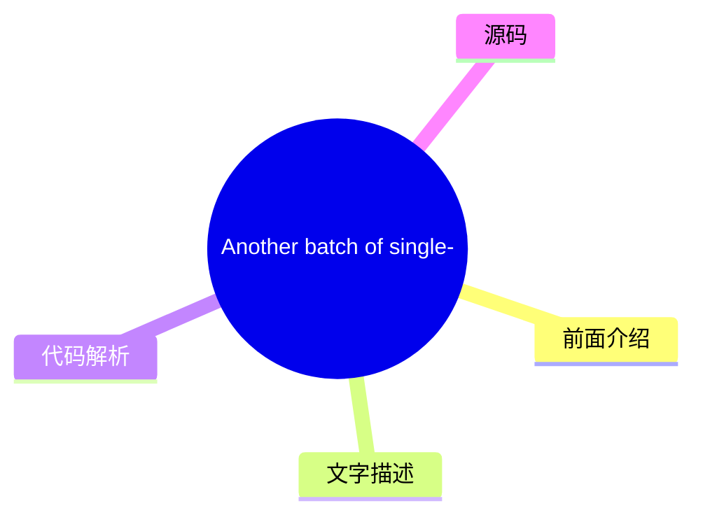
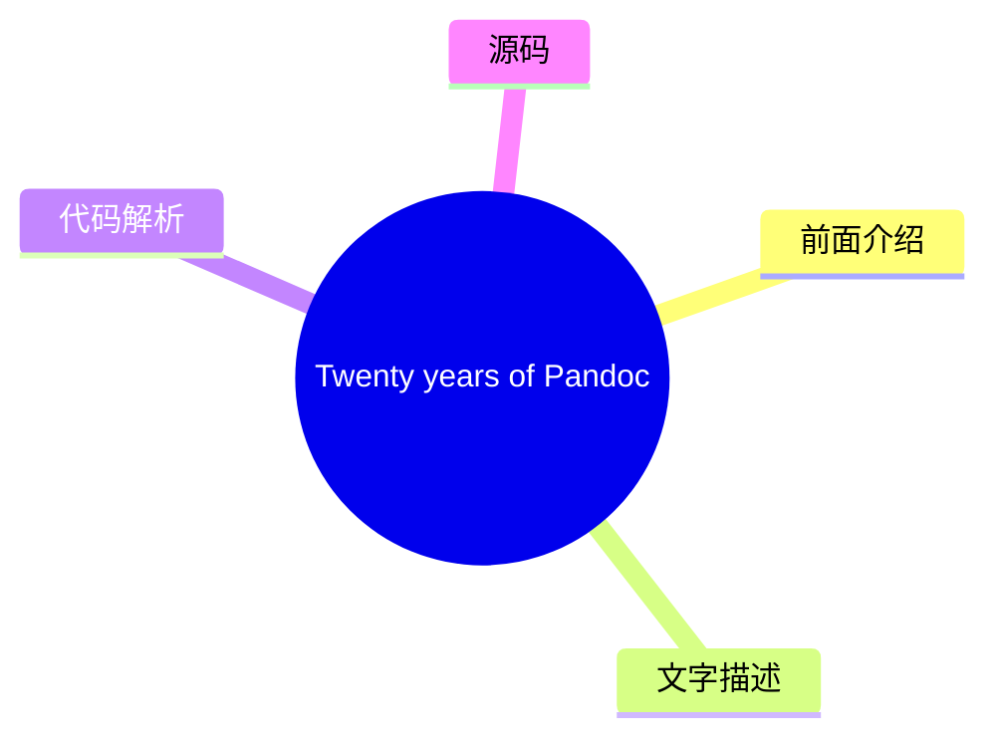
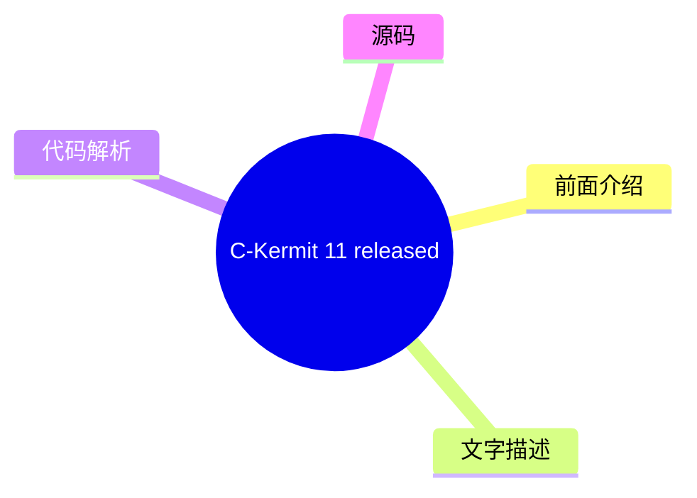
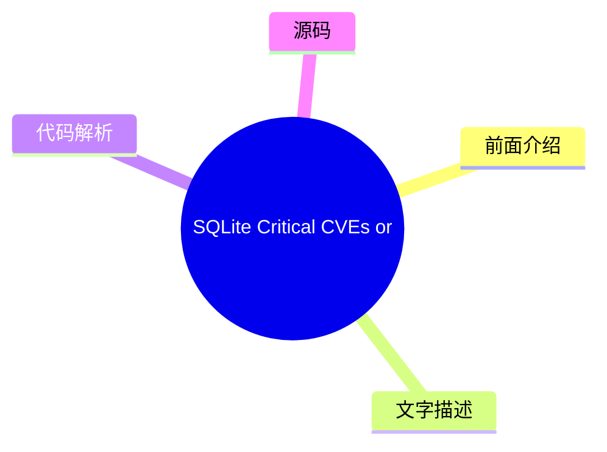
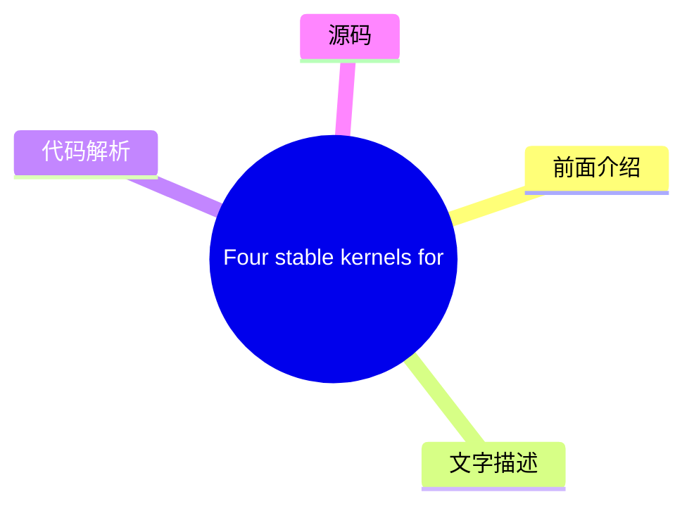

# 🐧 LWN.net (Linux kernel) Top 8 (2026-08-04)

## 前面介绍

- 数据源：LWN.net (Linux kernel)
- 抓取日期：2026-08-04
- 条目数：8
- 含完整正文：6
- 含代码片段：0
- 组织方式：前面介绍 / 树状图 / 文字描述 / 代码解析 / 源码

## 思维导图

```mermaid
mindmap
  root((LWN.net (Linux kernel)))
    [$] Reconsidering O_CREAT|O_
    Another batch of single-fix 
    Security updates for Thursda
    Twenty years of Pandoc
    C-Kermit 11 released
    [$] Buffer sizes for FUSE io
    SQLite Critical CVEs or LLM 
    Four stable kernels for Mond
```

## 详细整理（8 条，6 条含全文，0 条含代码）

### 1. [$] Reconsidering O_CREAT|O_DIRECTORY
- **链接**: [https://lwn.net/Articles/1085617/](https://lwn.net/Articles/1085617/)
- **作者**: corbet
- **发布**: Thu, 30 Jul 2026 14:00:40 +0000

#### 前面介绍

- Linux provides a system call (mkdir())
to create a directory, and a few variants of
open() that can open a directory.  There is, however, no
system call in Linux that can create and open a directory in a single,
race-free call.   Jori Koolstra has be
- 作者：corbet
- 发布时间：Thu, 30 Jul 2026 14:00:40 +0000

#### 树状图

```mermaid
mindmap
  root(([$] Reconsidering O_CREA))
    前面介绍
    文字描述
    代码解析
    源码
```

#### 文字描述

- Linux provides a system call (mkdir())
to create a directory, and a few variants of
open() that can open a directory.  There is, however, no
system call in Linux that can create and open a directory in a single,
race-free call.   Jori Koolstra has be

#### 代码解析

- 本文未检测到明确代码块，内容更偏新闻、观点或方法论。

#### 源码

未抓到可展示源码或原文节选。


### 2. Another batch of single-fix stable kernels
- **链接**: [https://lwn.net/Articles/1086226/](https://lwn.net/Articles/1086226/)
- **作者**: jzb
- **发布**: Thu, 30 Jul 2026 13:47:45 +0000

#### 前面介绍

- Greg Kroah-Hartman has announced the release of the 6.18.41, 6.12.100, 6.6.147, 6.1.180, 5.15.213, and 5.10.262 stable kernels.

Each of these kernels contains a single fix for a use-after-free
vulnerability (CVE-2026-64560). Users
of these kernels a
- 作者：jzb
- 发布时间：Thu, 30 Jul 2026 13:47:45 +0000

#### 树状图



#### 文字描述

- # Another batch of single-fix stable kernels Greg Kroah-Hartman has announced the release of the [6.18.41](/Articles/1086227/), [6.12.100](/Articles/1086228/), [6.6.147](/Articles/1086229/), [6.1.180](/Articles/1086230/), [5.15.213](/Articles/1086231/), and [5.10.262](/Articles/1086233/) stable kernels. Each of these kernels contains a single fix for a [use-after-free vulnerabi

#### 代码解析

- 本文未检测到明确代码块，内容更偏新闻、观点或方法论。

#### 源码

#### 中文节选

# Another batch of single-fix stable kernels

Greg Kroah-Hartman has announced the release of the [6.18.41](/Articles/1086227/), [6.12.100](/Articles/1086228/), [6.6.147](/Articles/1086229/), [6.1.180](/Articles/1086230/), [5.15.213](/Articles/1086231/), and [5.10.262](/Articles/1086233/) stable kernels.

Each of these kernels contains a single fix for a [use-after-free
vulnerability](https://git.kernel.org/pub/scm/linux/security/vulns.git/commit/?id=081d2ff9592751aa400828237f17c108e4e1f513) ([CVE-2026-64560](https://www.cve.org/CVERecord?id=CVE-2026-64560)). Users
of these kernels are advised to upgrade.

#### 完整正文（中文）

# 另一批单修复稳定内核

Greg Kroah-Hartman 宣布发布了 [6.18.41](/Articles/1086227/)、[6.12.100](/Articles/1086228/)、[6.6.147](/Articles/1086229/)、[6.1.180](/Articles/1086230/)、[5.15.213](/Articles/1086231/) 和 [5.10.262](/Articles/1086233/) 稳定内核。

这些内核中的每一个都包含一个 [use-after-free 漏洞](https://git.kernel.org/pub/scm/linux/security/vulns.git/commit/?id=081d2ff9592751aa400828237f17c108e4e1f513) ([CVE-2026-64560](https://www.cve.org/CVERecord?id=CVE-2026-64560)) 的单次修复。建议这些内核的用户进行升级。


### 3. Security updates for Thursday
- **链接**: [https://lwn.net/Articles/1086225/](https://lwn.net/Articles/1086225/)
- **作者**: jzb
- **发布**: Thu, 30 Jul 2026 13:12:34 +0000

#### 前面介绍

- Security updates have been issued by AlmaLinux (gstreamer1-plugins-bad-free, libtiff, libXfont2, nodejs:22, nodejs:24, and rest), Debian (expat and nss), Fedora (libssh, nginx, nginx-mod-brotli, nginx-mod-fancyindex, nginx-mod-headers-more, nginx-mod
- 作者：jzb
- 发布时间：Thu, 30 Jul 2026 13:12:34 +0000

#### 树状图


#### 文字描述

- # Security updates for Thursday | Dist. | ID | Release | Package | Date | |---| | AlmaLinux | [ALSA-2026:47180](https://lwn.net/Articles/1086141/) | 10 | gstreamer1-plugins-bad-free | 2026-07-29 | | AlmaLinux | [ALSA-2026:47731](https://lwn.net/Articles/1086140/) | 8 | gstreamer1-plugins-bad-free | 2026-07-29 | | AlmaLinux | [ALSA-2026:47079](https://lwn.net/Articles/1086144/) 

#### 代码解析

- 本文未检测到明确代码块，内容更偏新闻、观点或方法论。

#### 源码

#### 中文节选

# Security updates for Thursday

| Dist. | ID | Release | Package | Date | 
|---|
| AlmaLinux | [ALSA-2026:47180](https://lwn.net/Articles/1086141/) | 10 | gstreamer1-plugins-bad-free | 2026-07-29 | 
| AlmaLinux | [ALSA-2026:47731](https://lwn.net/Articles/1086140/) | 8 | gstreamer1-plugins-bad-free | 2026-07-29 | 
| AlmaLinux | [ALSA-2026:47079](https://lwn.net/Articles/1086144/) | 10 | libXfont2 | 2026-07-29 | 
| AlmaLinux | [ALSA-2026:47103](https://lwn.net/Articles/1086143/) | 8 | libXfont2 | 2026-07-29 | 
| AlmaLinux | [ALSA-2026:47184](https://lwn.net/Articles/1086142/) | 8 | libtiff | 2026-07-29 | 
| AlmaLinux | [ALSA-2026:47059](https://lwn.net/Articles/1086145/) | 8 | nodejs:22 | 2026-07-29 | 
| AlmaLinux | [ALSA-2026:47060](https://lwn.net/Articles/1086146/) | 8 | nodejs:24 | 2026-07-29 | 
| AlmaLinux | [ALSA-2026:47085](https://lwn.net/Articles/1086147/) | 10 | rest | 2026-07-29 | 
| Debian | [DSA-6404-1](https://lwn.net/Articles/1086148/) | stable | expat | 2026-07-30 | 
| Debian | [DSA-6403-1](https://lwn.net/Articles/1086149/) | stable | nss | 2026-07-29 | 
| Fedora | [FEDORA-2026-c60881e04b](https://lwn.net/Articles/1086150/) | F44 | libssh | 2026-07-30 | 
| Fedora | [FEDORA-2026-3b93aae2d6](https://lwn.net/Articles/1086151/) | F43 | nginx | 2026-07-30 | 
| Fedora | [FEDORA-2026-3b93aae2d6](https://lwn.net/Articles/1086152/) | F43 | nginx-mod-brotli | 2026-07-30 | 
| Fedora | [FEDORA-2026-3b93aae2d6](https://lwn.net/Articles/1086153/) | F43 | nginx-mod-fancyindex | 2026-07-30 | 
| Fedora | [FEDORA-2026-3b93aae2d6](https://lwn.net/Articles/1086154/) | F43 | nginx-mod-headers-more | 2026-07-30 | 
| Fedora | [FEDORA-2026-3b93aae2d6](https://lwn.net/Articles/1086155/) | F43 | nginx-mod-modsecurity | 2026-07-30 | 
| Fedora | [FEDORA-2026-3b93aae2d6](https://lwn.net/Articles/1086156/) | F43 | nginx-mod-naxsi | 2026-07-30 | 
| Fedora | [FEDORA-2026-3b93aae2d6](https://lwn.net/Articles/1086157/) | F43 | nginx-mod-vts | 2026-07-30 | 
| Fedora | [FEDORA-2026-ce5dac2ed8](https://lwn.net/Articles/1086158/) | F44 | nodejs24 | 2026-07-30 | 
| Fedora | [FEDORA-2026-b1bdb7c518](https://lwn.net/Articles/1086159/) | F43 | perl-HTTP-Date | 2026-07-30 | 

| Fedora | [FEDORA-2026-d314ce6051](https://lwn.net/Articles/1086160/) | F43 | proftpd | 2026-07-30 | 
| Fedora | [FEDORA-2026-2994824419](https://lwn.net/Articles/1086161/) | F44 | proftpd | 2026-07-30 | 
| Fedora | [FEDORA-2026-e6bbab8aa8](https://lwn.net/Articles/1086162/) | F44 | squid | 2026-07-30 | 
| Fedora | [FEDORA-2026-e495bd59ef](https://lwn.net/Articles/1086163/) | F44 | unbound | 2026-07-30 | 
| Fedora | [FEDORA-2026-46346e9637](https://lwn.net/Articles/1086164/) | F43 | wordpress | 2026-07-30 | 
| Fedora | [FEDORA-2026-2b8250197a](https://lwn.net/Articles/1086165/) | F44 | wordpress | 2026-07-30 | 
| Oracle | [ELSA-2026-42096](https://lwn.net/Articles/1086166/) | OL10 | c-ares | 2026-07-28 | 
| Oracle | [ELSA-2026-18320](https://lwn.net/Articles/1086167/) | OL10 | edk2 | 2026-07-28 | 
|

#### 完整正文（中文）

# Security updates for Thursday

| Dist. | ID | Release | Package | Date | 
|---|
| AlmaLinux | [ALSA-2026:47180](https://lwn.net/Articles/1086141/) | 10 | gstreamer1-plugins-bad-free | 2026-07-29 | 
| AlmaLinux | [ALSA-2026:47731](https://lwn.net/Articles/1086140/) | 8 | gstreamer1-plugins-bad-free | 2026-07-29 | 
| AlmaLinux | [ALSA-2026:47079](https://lwn.net/Articles/1086144/) | 10 | libXfont2 | 2026-07-29 | 
| AlmaLinux | [ALSA-2026:47103](https://lwn.net/Articles/1086143/) | 8 | libXfont2 | 2026-07-29 | 
| AlmaLinux | [ALSA-2026:47184](https://lwn.net/Articles/1086142/) | 8 | libtiff | 2026-07-29 | 
| AlmaLinux | [ALSA-2026:47059](https://lwn.net/Articles/1086145/) | 8 | nodejs:22 | 2026-07-29 | 
| AlmaLinux | [ALSA-2026:47060](https://lwn.net/Articles/1086146/) | 8 | nodejs:24 | 2026-07-29 | 
| AlmaLinux | [ALSA-2026:47085](https://lwn.net/Articles/1086147/) | 10 | rest | 2026-07-29 | 
| Debian | [DSA-6404-1](https://lwn.net/Articles/1086148/) | stable | expat | 2026-07-30 | 
| Debian | [DSA-6403-1](https://lwn.net/Articles/1086149/) | stable | nss | 2026-07-29 | 
| Fedora | [FEDORA-2026-c60881e04b](https://lwn.net/Articles/1086150/) | F44 | libssh | 2026-07-30 | 
| Fedora | [FEDORA-2026-3b93aae2d6](https://lwn.net/Articles/1086151/) | F43 | nginx | 2026-07-30 | 
| Fedora | [FEDORA-2026-3b93aae2d6](https://lwn.net/Articles/1086152/) | F43 | nginx-mod-brotli | 2026-07-30 | 
| Fedora | [FEDORA-2026-3b93aae2d6](https://lwn.net/Articles/1086153/) | F43 | nginx-mod-fancyindex | 2026-07-30 | 
| Fedora | [FEDORA-2026-3b93aae2d6](https://lwn.net/Articles/1086154/) | F43 | nginx-mod-headers-more | 2026-07-30 | 
| Fedora | [FEDORA-2026-3b93aae2d6](https://lwn.net/Articles/1086155/) | F43 | nginx-mod-modsecurity | 2026-07-30 | 
| Fedora | [FEDORA-2026-3b93aae2d6](https://lwn.net/Articles/1086156/) | F43 | nginx-mod-naxsi | 2026-07-30 | 
| Fedora | [FEDORA-2026-3b93aae2d6](https://lwn.net/Articles/1086157/) | F43 | nginx-mod-vts | 2026-07-30 | 
| Fedora | [FEDORA-2026-ce5dac2ed8](https://lwn.net/Articles/1086158/) | F44 | nodejs24 | 2026-07-30 | 
| Fedora | [FEDORA-2026-b1bdb7c518](https://lwn.net/Articles/1086159/) | F43 | perl-HTTP-Date | 2026-07-30 | 

| Fedora | [FEDORA-2026-d314ce6051](https://lwn.net/Articles/1086160/) | F43 | proftpd | 2026-07-30 | 
| Fedora | [FEDORA-2026-2994824419](https://lwn.net/Articles/1086161/) | F44 | proftpd | 2026-07-30 | 
| Fedora | [FEDORA-2026-e6bbab8aa8](https://lwn.net/Articles/1086162/) | F44 | squid | 2026-07-30 | 
| Fedora | [FEDORA-2026-e495bd59ef](https://lwn.net/Articles/1086163/) | F44 | unbound | 2026-07-30 | 
| Fedora | [FEDORA-2026-46346e9637](https://lwn.net/Articles/1086164/) | F43 | wordpress | 2026-07-30 | 
| Fedora | [FEDORA-2026-2b8250197a](https://lwn.net/Articles/1086165/) | F44 | wordpress | 2026-07-30 | 
| Oracle | [ELSA-2026-42096](https://lwn.net/Articles/1086166/) | OL10 | c-ares | 2026-07-28 | 
| Oracle | [ELSA-2026-18320](https://lwn.net/Articles/1086167/) | OL10 | edk2 | 2026-07-28 | 
| Oracle | [ELSA-2026-19142](https://lwn.net/Articles/1086168/) | OL10 | freerdp | 2026-07-28 | 
| Oracle | [ELSA-2026-46395](https://lwn.net/Articles/1086169/) | OL10 | go-fdo-server | 2026-07-28 | 
| Oracle | [ELSA-2026-46398](https://lwn.net/Articles/1086170/) | OL10 | libreswan | 2026-07-28 | 
| Oracle | [ELSA-2026-43505](https://lwn.net/Articles/1086171/) | OL10 | mariadb-connector-c | 2026-07-28 | 
| Oracle | [ELSA-2026-29874](https://lwn.net/Articles/1086172/) | OL10 | nginx | 2026-07-28 | 
| SUSE | [SUSE-SU-2026:3298-1](https://lwn.net/Articles/1086189/) | SLE12 | ImageMagick | 2026-07-28 | 
| SUSE | [SUSE-SU-2026:3336-1](https://lwn.net/Articles/1086188/) | SLE15 | ImageMagick | 2026-07-28 | 
| SUSE | [SUSE-SU-2026:3413-1](https://lwn.net/Articles/1086187/) | SLE15 oS15.4 | ImageMagick | 2026-07-30 | 
| SUSE | [SUSE-SU-2026:3404-1](https://lwn.net/Articles/1086203/) | SLE15 oS15.6 | PackageKit | 2026-07-29 | 
| SUSE | [SUSE-SU-2026:22954-1](https://lwn.net/Articles/1086173/) | SLE16.0 | alloy | 2026-07-28 | 
| SUSE | [SUSE-SU-2026:22946-1](https://lwn.net/Articles/1086174/) | SLE16.0 | alloy | 2026-07-28 | 
| SUSE | [SUSE-SU-2026:3390-1](https://lwn.net/Articles/1086175/) | SLE15 | apache-commons-lang3, google-guice, maven, maven-resolver, xmvn | 2026-07-28 |

| SUSE | [SUSE-SU-2026:3339-1](https://lwn.net/Articles/1086176/) | SLE15 | apache-sshd | 2026-07-28 | 
| SUSE | [SUSE-SU-2026:3417-1](https://lwn.net/Articles/1086177/) | SLE15 oS15.6 | apptainer | 2026-07-30 | 
| SUSE | [SUSE-SU-2026:22932-1](https://lwn.net/Articles/1086178/) | SLE-m6.2 | avahi | 2026-07-28 | 
| SUSE | [SUSE-SU-2026:22945-1](https://lwn.net/Articles/1086179/) | SLE16.0 | distribution | 2026-07-28 | 
| SUSE | [SUSE-SU-2026:22952-1](https://lwn.net/Articles/1086180/) | SLE16.0 | distribution | 2026-07-28 | 
| SUSE | [SUSE-SU-2026:22928-1](https://lwn.net/Articles/1086181/) | SLE-m6.2 | glib2 | 2026-07-28 | 
| SUSE | [SUSE-SU-2026:22950-1](https://lwn.net/Articles/1086182/) | SLE16.0 | go1.26-openssl, go1.25-openssl, go1.24-openssl, go1.23-openssl, go1.22-openssl, go1.26, go1.25, go1.24, go1.23, go1.22, go1.21 | 2026-07-28 | 
| SUSE | [SUSE-SU-2026:22958-1](https://lwn.net/Articles/1086183/) | SLE16.0 | go1.26-openssl, go1.25-openssl, go1.24-openssl, go1.23-openssl, go1.22-openssl, go1.26, go1.25, go1.24, go1.23, go1.22, go1.21 | 2026-07-28 | 
| SUSE | [SUSE-SU-2026:3299-1](https://lwn.net/Articles/1086184/) | SLE12 | gstreamer-plugins-bad | 2026-07-28 | 
| SUSE | [SUSE-SU-2026:22934-1](https://lwn.net/Articles/1086185/) | SLE-m6.2 | helm | 2026-07-28 | 
| SUSE | [SUSE-SU-2026:3342-1](https://lwn.net/Articles/1086186/) | SLE15 SLE5.5 SLE-m5.5 | helm | 2026-07-28 | 
| SUSE | [SUSE-SU-2026:3406-1](https://lwn.net/Articles/1086190/) | SLE15 oS15.4 | java-17-openjdk | 2026-07-29 | 
| SUSE | [SUSE-SU-2026:3331-1](https://lwn.net/Articles/1086191/) | SLE15 | java-25-openjdk | 2026-07-28 | 
| SUSE | [SUSE-SU-2026:3420-1](https://lwn.net/Articles/1086192/) | SLE15 oS15.6 | liboqs, oqs-provider | 2026-07-30 | 
| SUSE | [SUSE-SU-2026:22940-1](https://lwn.net/Articles/1086193/) | SLE-m6.2 | libssh | 2026-07-28 | 
| SUSE | [SUSE-SU-2026:3302-1](https://lwn.net/Articles/1086196/) | SLE12 | libssh | 2026-07-28 | 
| SUSE | [SUSE-SU-2026:22956-1](https://lwn.net/Articles/1086194/) | SLE16.0 | libssh | 2026-07-28 | 
| SUSE | [SUSE-SU-2026:22948-1](https://lwn.net/Articles/1086195/) | SLE16.0 | libssh | 2026-07-28 |

| SUSE | [SUSE-SU-2026:22951-1](https://lwn.net/Articles/1086197/) | SLE16.0 | nginx | 2026-07-28 | 
| SUSE | [SUSE-SU-2026:22943-1](https://lwn.net/Articles/1086198/) | SLE16.0 | nginx | 2026-07-28 | 
| SUSE | [SUSE-SU-2026:22935-1](https://lwn.net/Articles/1086199/) | SLE-m6.2 | nm-configurator | 2026-07-28 | 
| SUSE | [SUSE-SU-2026:3333-1](https://lwn.net/Articles/1086200/) | SLE12 | nmap | 2026-07-28 | 
| SUSE | [SUSE-SU-2026:22947-1](https://lwn.net/Articles/1086201/) | SLE16.0 | openssl-3 | 2026-07-28 | 
| SUSE | [SUSE-SU-2026:3407-1](https://lwn.net/Articles/1086202/) | SLE15 oS15.6 | openvpn | 2026-07-29 | 
| SUSE | [SUSE-SU-2026:22926-1](https://lwn.net/Articles/1086205/) | SLE-m6.2 | perl-DBI | 2026-07-28 | 
| SUSE | [SUSE-SU-2026:3415-1](https://lwn.net/Articles/1086206/) | SLE15 oS15.6 | perl-DBI | 2026-07-30 | 
| SUSE | [SUSE-SU-2026:3334-1](https://lwn.net/Articles/1086207/) | SLE12 | perl-HTTP-Date | 2026-07-28 | 
| SUSE | [SUSE-SU-2026:22929-1](https://lwn.net/Articles/1086204/) | SLE-m6.2 | perl | 2026-07-28 | 
| SUSE | [SUSE-SU-2026:3403-1](https://lwn.net/Articles/1086208/) | SLE15 | perl-XML-Bare | 2026-07-29 | 
| SUSE | [SUSE-SU-2026:3297-1](https://lwn.net/Articles/1086209/) | SLE12 | python-msgpack-python | 2026-07-28 | 
| SUSE | [SUSE-SU-2026:3422-1](https://lwn.net/Articles/1086210/) | SLE15 oS15.4 | python-sh | 2026-07-30 | 
| SUSE | [SUSE-SU-2026:3402-1](https://lwn.net/Articles/1086211/) | oS15.6 | python-ujson | 2026-07-29 | 
| SUSE | [SUSE-SU-2026:22937-1](https://lwn.net/Articles/1086212/) | SLE-m6.2 | python-urllib3 | 2026-07-28 | 
| SUSE | [SUSE-SU-2026:22938-1](https://lwn.net/Articles/1086213/) | SLE-m6.2 | runc | 2026-07-28 | 
| SUSE | [SUSE-SU-2026:22942-1](https://lwn.net/Articles/1086214/) | SLE16.0 | runc | 2026-07-28 | 
| SUSE | [SUSE-SU-2026:3367-1](https://lwn.net/Articles/1086216/) | SLE12 | samba | 2026-07-28 | 
| SUSE | [SUSE-SU-2026:3363-1](https://lwn.net/Articles/1086215/) | SLE15 | samba | 2026-07-28 | 
| SUSE | [SUSE-SU-2026:3394-1](https://lwn.net/Articles/1086217/) | SLE12 | sssd | 2026-07-29 | 
| SUSE | [SUSE-SU-2026:3401-1](https://lwn.net/Articles/1086218/) | SLE15 | sssd | 2026-07-29 |

| SUSE | [SUSE-SU-2026:3337-1](https://lwn.net/Articles/1086219/) | SLE15 | wget | 2026-07-28 | 
| SUSE | [SUSE-SU-2026:22931-1](https://lwn.net/Articles/1086220/) | SLE-m6.2 | wpa_supplicant | 2026-07-28 | 
| SUSE | [SUSE-SU-2026:3423-1](https://lwn.net/Articles/1086222/) | SLE15 SLE5.5 SLE-m5.5 oS15.5 | xen | 2026-07-30 | 
| SUSE | [SUSE-SU-2026:3409-1](https://lwn.net/Articles/1086221/) | SLE15 oS15.6 | xen | 2026-07-29 | 
| Ubuntu | [USN-8622-1](https://lwn.net/Articles/1086223/) | 24.04 26.04 | linux-nvidia, linux-nvidia-7.0 | 2026-07-29 | 
| Ubuntu | [USN-8623-1](https://lwn.net/Articles/1086224/) | 24.04 | linux-nvidia-6.17 | 2026-07-29 |


### 4. Twenty years of Pandoc
- **链接**: [https://lwn.net/Articles/1086976/](https://lwn.net/Articles/1086976/)
- **作者**: jzb
- **发布**: Mon, 03 Aug 2026 21:18:31 +0000

#### 前面介绍

- John MacFarlane has published a lengthy
retrospective to commemorate twenty years of the Pandoc document converter.


On August 3, 2006, I uploaded the first version of pandoc to my
website, releasing it under the free GPL license. Pandoc 0.1 consist
- 作者：jzb
- 发布时间：Mon, 03 Aug 2026 21:18:31 +0000

#### 树状图



#### 文字描述

- # Twenty years of Pandoc John MacFarlane has published a [lengthy retrospective](https://pandoc.org/twenty-years-of-pandoc.html) to commemorate twenty years of the [Pandoc](https://pandoc.org/) document converter. On August 3, 2006, I uploaded the first version of pandoc to my website, releasing it under the free GPL license. Pandoc 0.1 consisted of about 3000 lines of Haskell 

#### 代码解析

- 本文未检测到明确代码块，内容更偏新闻、观点或方法论。

#### 源码

#### 中文节选

# Pandoc 的二十年

John MacFarlane 发布了一篇[长篇回顾文章](https://pandoc.org/twenty-years-of-pandoc.html)，以纪念 [Pandoc](https://pandoc.org/) 文档转换器诞生二十周年。

2006 年 8 月 3 日，我将 pandoc 的第一个版本上传到我的网站上，并按照免费的 GPL 许可证发布。Pandoc 0.1 大约有 3000 行 Haskell 代码，除了 GHC 的标准库外没有其他依赖项。它可以将这些格式（Markdown、reStructuredText、HTML 和 LaTeX）中的任何一种转换为这些格式中的任何一种，外加 RTF 或 S5。当时我并不知道这将是未来二十多年里两百多个版本中的第一个；该项目将成为[用 Haskell 编写的最受欢迎的程序](https://github.com/EvanLi/Github-Ranking/blob/master/Top100/Haskell.md)；我会投入无数个小时进行错误修复、改进和项目管理；我会与许多其他国家的程序员合作；pandoc 将支持超过五十种文档格式；它将允许自动生成引文和参考文献；它将集成到 [Quarto](https://quarto.org/) 和 [Jupyter Notebook](https://jupyter.org/) 等学术写作工具中；它将安装在世界各地的数百万台计算机上。

这一切是如何发生的？我想利用 pandoc 的生日来讲述这个项目的故事，尽我所能地回忆。

#### 完整正文（中文）

# Pandoc 的二十年

John MacFarlane 发布了一篇[长篇回顾文章](https://pandoc.org/twenty-years-of-pandoc.html)，以纪念 [Pandoc](https://pandoc.org/) 文档转换器诞生二十周年。

2006 年 8 月 3 日，我将 pandoc 的第一个版本上传到我的网站上，并按照免费的 GPL 许可证发布。Pandoc 0.1 大约有 3000 行 Haskell 代码，除了 GHC 的标准库外没有其他依赖项。它可以将这些格式（Markdown、reStructuredText、HTML 和 LaTeX）中的任何一种转换为这些格式中的任何一种，外加 RTF 或 S5。当时我并不知道这将是未来二十多年里两百多个版本中的第一个；该项目将成为[用 Haskell 编写的最受欢迎的程序](https://github.com/EvanLi/Github-Ranking/blob/master/Top100/Haskell.md)；我会投入无数个小时进行错误修复、改进和项目管理；我会与许多其他国家的程序员合作；pandoc 将支持超过五十种文档格式；它将允许自动生成引文和参考文献；它将集成到 [Quarto](https://quarto.org/) 和 [Jupyter Notebook](https://jupyter.org/) 等学术写作工具中；它将安装在世界各地的数百万台计算机上。

这一切是如何发生的？我想利用 pandoc 的生日来讲述这个项目的故事，尽我所能地回忆。


### 5. C-Kermit 11 released
- **链接**: [https://lwn.net/Articles/1086953/](https://lwn.net/Articles/1086953/)
- **作者**: corbet
- **发布**: Mon, 03 Aug 2026 18:15:59 +0000

#### 前面介绍

- For those of us with a long memory: John Goerzen has announced
the release of C-Kermit&#160;11, the first release of this file-transfer
utility in 15&#160;years.


	As Debian maintainer of Kermit, I noticed some areas where it
	wasn't matching modern
- 作者：corbet
- 发布时间：Mon, 03 Aug 2026 18:15:59 +0000

#### 树状图



#### 文字描述

- # C-Kermit 11 released [announced](https://changelog.complete.org/archives/44456-celebrating-45-years-of-kermit-with-the-first-new-c-kermit-release-in-15-years-and-working-with-a-decades-old-c-codebase)the release of C-Kermit 11, the first release of this file-transfer utility in 15 years. As Debian maintainer of Kermit, I noticed some areas where it wasn't matching modern expe

#### 代码解析

- 本文未检测到明确代码块，内容更偏新闻、观点或方法论。

#### 源码

#### 中文节选

# C-Kermit 11 发布

[宣布](https://changelog.complete.org/archives/44456-celebrating-45-years-of-kermit-with-the-first-new-c-kermit-release-in-15-years-and-working-with-a-decades-old-c-codebase)了 C-Kermit 11 的发布，这是该文件传输工具在 15 年来的首个版本。

作为 Kermit 的 Debian 维护者，我注意到它在某些方面不符合现代的预期。其中一个方面是，对于一个如此古老的项目来说，安全性不足并不令人意外。另一个方面是，其字符集或行尾转换现在通常是不需要的；我们已经习惯了字节完全相同的二进制传输，而默认设置导致了混淆，甚至偶尔会出现数据损坏的情况。因此，我去年开始制作了一些补丁。

有关所做工作的详细信息，请参阅[更改日志](https://github.com/OpenKermit/ckermit/releases/tag/v11.0.506)。

我们大多数人可能已经多年（甚至从未）考虑过 C-Kermit，但在过去，它是机器之间传输文件的必备工具。

#### 完整正文（中文）

# C-Kermit 11 发布

[宣布](https://changelog.complete.org/archives/44456-celebrating-45-years-of-kermit-with-the-first-new-c-kermit-release-in-15-years-and-working-with-a-decades-old-c-codebase)了 C-Kermit 11 的发布，这是该文件传输工具在 15 年来的首个版本。

作为 Kermit 的 Debian 维护者，我注意到它在某些方面不符合现代的预期。其中一个方面是，对于一个如此古老的项目来说，安全性不足并不令人意外。另一个方面是，其字符集或行尾转换现在通常是不需要的；我们已经习惯了字节完全相同的二进制传输，而默认设置导致了混淆，甚至偶尔会出现数据损坏的情况。因此，我去年开始制作了一些补丁。

有关所做工作的详细信息，请参阅[更改日志](https://github.com/OpenKermit/ckermit/releases/tag/v11.0.506)。

我们大多数人可能已经多年（甚至从未）考虑过 C-Kermit，但在过去，它是机器之间传输文件的必备工具。


### 6. [$] Buffer sizes for FUSE io_uring
- **链接**: [https://lwn.net/Articles/1085618/](https://lwn.net/Articles/1085618/)
- **作者**: jake
- **发布**: Mon, 03 Aug 2026 16:05:10 +0000

#### 前面介绍

- The Filesystem in
Userspace (FUSE) subsystem provides a way to service filesystem
requests from a user-space server, which moves the format-handling code out
of the kernel.  The FUSE server can use the io_uring
facility for better performance, but Be
- 作者：jake
- 发布时间：Mon, 03 Aug 2026 16:05:10 +0000

#### 树状图

```mermaid
mindmap
  root(([$] Buffer sizes for FUS))
    前面介绍
    文字描述
    代码解析
    源码
```

#### 文字描述

- The Filesystem in
Userspace (FUSE) subsystem provides a way to service filesystem
requests from a user-space server, which moves the format-handling code out
of the kernel.  The FUSE server can use the io_uring
facility for better performance, but Be

#### 代码解析

- 本文未检测到明确代码块，内容更偏新闻、观点或方法论。

#### 源码

未抓到可展示源码或原文节选。


### 7. SQLite Critical CVEs or LLM Slop? (JFrog blog)
- **链接**: [https://lwn.net/Articles/1086936/](https://lwn.net/Articles/1086936/)
- **作者**: corbet
- **发布**: Mon, 03 Aug 2026 14:59:31 +0000

#### 前面介绍

- The JFrog blog examines
some reported vulnerabilities in SQLite, some of which made their way
into high-profile vulnerability databases, that turned out to be entirely
fabricated by LLMs.


	These LLM slop CVEs can cause organizations to waste time
- 作者：corbet
- 发布时间：Mon, 03 Aug 2026 14:59:31 +0000

#### 树状图



#### 文字描述

- # SQLite Critical CVEs or LLM Slop? (JFrog blog) [examines some reported vulnerabilities in SQLite](https://research.jfrog.com/post/sqlite-critical-cves-or-llm-slops/), some of which made their way into high-profile vulnerability databases, that turned out to be entirely fabricated by LLMs. These LLM slop CVEs can cause organizations to waste time investigating and patching vul

#### 代码解析

- 本文未检测到明确代码块，内容更偏新闻、观点或方法论。

#### 源码

#### 中文节选

# SQLite 关键 CVE 或 LLM 垃圾内容？ (JFrog 博客)

[检查了一些报告的 SQLite 漏洞](https://research.jfrog.com/post/sqlite-critical-cves-or-llm-slops/)，其中一些进入了高知名度漏洞数据库，结果发现完全是由 LLM 编造的。

这些 LLM 垃圾 CVE 可能导致组织浪费时间去调查和修补实际上并不存在的漏洞，以及污染漏洞数据库。在自动优先处理关键漏洞或根据漏洞分数创建工单的环境中，此类编造的 CVE 可能会变成真正的负担。在使用 AI 自动化漏洞分类和修复的环境中，这变得更加令人担忧。遇到编造 CVE 的 AI 代理可能会尝试定位易受攻击的函数、生成补丁，或基于根本不存在的代码推荐更改。它不仅不能帮助安全团队修复真实漏洞，反而可能将其引向完全错误的方向，从而引入不必要的更改并浪费时间。

#### 完整正文（中文）

# SQLite 关键 CVE 或 LLM 垃圾内容？ (JFrog 博客)

[检查了一些报告的 SQLite 漏洞](https://research.jfrog.com/post/sqlite-critical-cves-or-llm-slops/)，其中一些进入了高知名度漏洞数据库，结果发现完全是由 LLM 编造的。

这些 LLM 垃圾 CVE 可能导致组织浪费时间去调查和修补实际上并不存在的漏洞，以及污染漏洞数据库。在自动优先处理关键漏洞或根据漏洞分数创建工单的环境中，此类编造的 CVE 可能会变成真正的负担。在使用 AI 自动化漏洞分类和修复的环境中，这变得更加令人担忧。遇到编造 CVE 的 AI 代理可能会尝试定位易受攻击的函数、生成补丁，或基于根本不存在的代码推荐更改。它不仅不能帮助安全团队修复真实漏洞，反而可能将其引向完全错误的方向，从而引入不必要的更改并浪费时间。


### 8. Four stable kernels for Monday
- **链接**: [https://lwn.net/Articles/1086900/](https://lwn.net/Articles/1086900/)
- **作者**: jzb
- **发布**: Mon, 03 Aug 2026 13:42:58 +0000

#### 前面介绍

- Greg Kroah-Hartman has announced the release of the 7.1.6, 6.18.42, 6.12.101, and 6.6.148 stable kernels. Each contains
hundreds of patches&mdash;the 7.1.6 kernel has more than
700&mdash;with fixes throughout the tree. Users are advised to
upgrade.
- 作者：jzb
- 发布时间：Mon, 03 Aug 2026 13:42:58 +0000

#### 树状图



#### 文字描述

- Greg Kroah-Hartman has announced the release of the 7.1.6, 6.18.42, 6.12.101, and 6.6.148 stable kernels. Each contains hundreds of patches—the 7.1.6 kernel has more than 700—with fixes throughout the tree. Users are advised to upgrade.

#### 代码解析

- 本文未检测到明确代码块，内容更偏新闻、观点或方法论。

#### 源码

#### 中文节选

Greg Kroah-Hartman 宣布发布了 7.1.6、6.18.42、6.12.101 和 6.6.148 稳定版内核。每个内核都包含数百个补丁——7.1.6 内核超过 700 个——修复了整个内核树中的问题。建议用户升级。

#### 完整正文（中文）

Greg Kroah-Hartman 宣布发布了 7.1.6、6.18.42、6.12.101 和 6.6.148 稳定版内核。每个内核都包含数百个补丁——7.1.6 内核超过 700 个——修复了整个内核树中的问题。建议用户升级。

