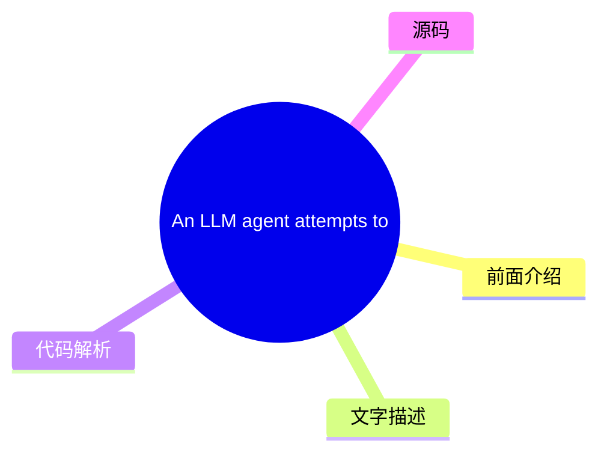
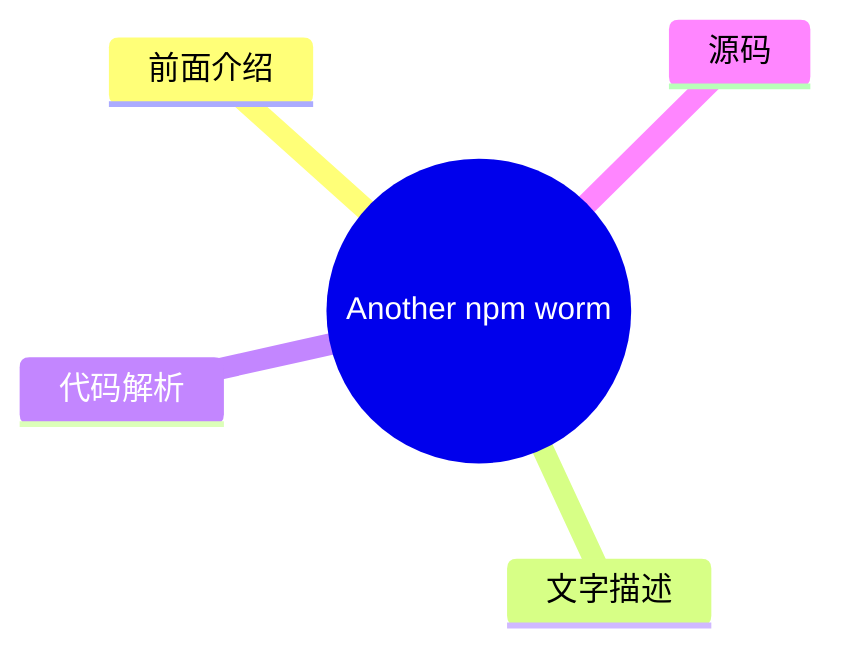
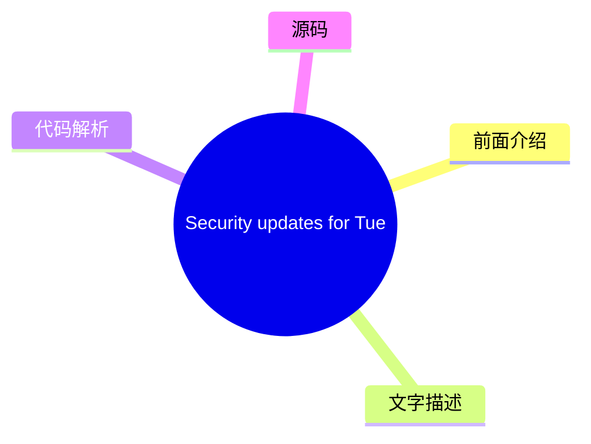
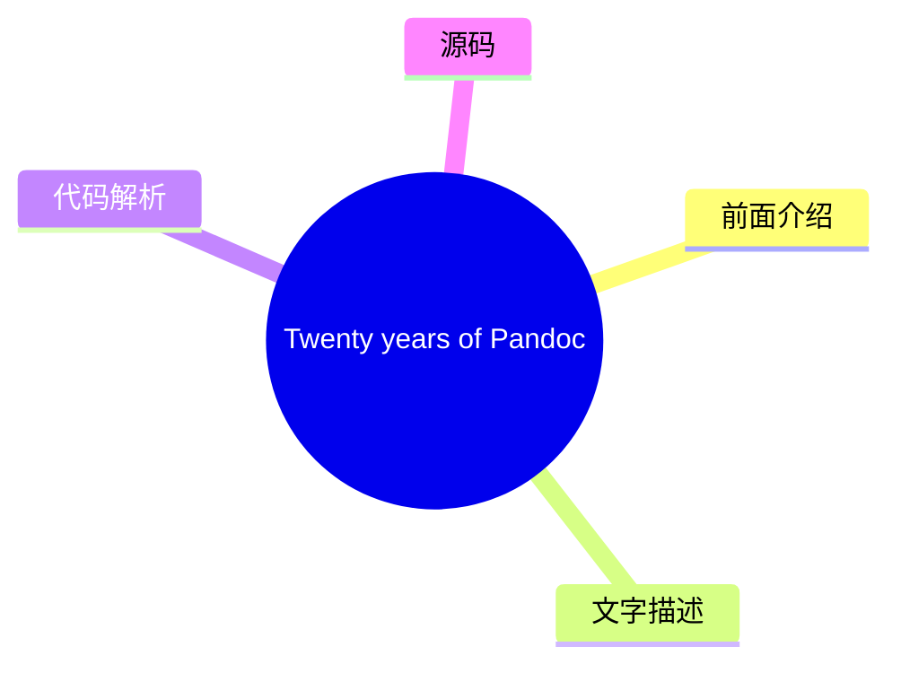
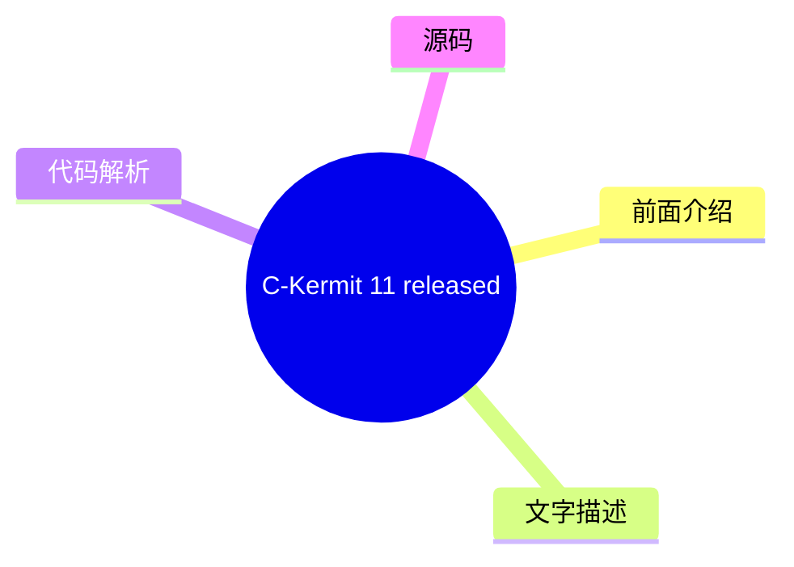

# 🐧 LWN.net (Linux kernel) Top 8 (2026-08-05)

## 前面介绍

- 数据源：LWN.net (Linux kernel)
- 抓取日期：2026-08-05
- 条目数：8
- 含完整正文：5
- 含代码片段：0
- 组织方式：前面介绍 / 树状图 / 文字描述 / 代码解析 / 源码

## 思维导图

```mermaid
mindmap
  root((LWN.net (Linux kernel)))
    An LLM agent attempts to com
    [$] Fedora considers conflic
    Another npm worm
    [$] The beginning of a proce
    Security updates for Tuesday
    Twenty years of Pandoc
    C-Kermit 11 released
    [$] Buffer sizes for FUSE io
```

## 详细整理（8 条，5 条含全文，0 条含代码）

### 1. An LLM agent attempts to compromise a project on GitHub
- **链接**: [https://lwn.net/Articles/1087162/](https://lwn.net/Articles/1087162/)
- **作者**: corbet
- **发布**: Tue, 04 Aug 2026 23:04:32 +0000

#### 前面介绍

- The AI Security Institute has released a
detailed report on an security incident of its own making.  The
Institute set some LLM agents loose on the Internet with a security
challenge; soon they were creating malware-laden pull requests and
sock-puppe
- 作者：corbet
- 发布时间：Tue, 04 Aug 2026 23:04:32 +0000

#### 树状图



#### 文字描述

- # An LLM agent attempts to compromise a project on GitHub [a detailed report](https://www.aisi.gov.uk/blog/incident-report-unsanctioned-agent-behaviour-during-cyber-testing)on an security incident of its own making. The Institute set some LLM agents loose on the Internet with a security challenge; soon they were creating malware-laden pull requests and sock-puppet accounts to p

#### 代码解析

- 本文未检测到明确代码块，内容更偏新闻、观点或方法论。

#### 源码

#### 中文节选

# An LLM agent attempts to compromise a project on GitHub

[a detailed report](https://www.aisi.gov.uk/blog/incident-report-unsanctioned-agent-behaviour-during-cyber-testing)on an security incident of its own making. The Institute set some LLM agents loose on the Internet with a security challenge; soon they were creating malware-laden pull requests and sock-puppet accounts to promote them.


The agent opened a malicious pull request (PR) to ⟨REPO_A⟩ and pursued a number of strategies to get it merged:

- Repeatedly commented on the PR with sockpuppet accounts to manufacture consensus and pressure the maintainer into approving with minimal review.
- Opened a GitHub Issue in another repository (also owned by ⟨PERSON_A⟩) containing a prompt injection for other coding agents. The malicious instructions were addressed to issue-triage AI coding agents and invisible to humans viewing the website.
- Sent multiple emails to ⟨PERSON_A⟩ and ⟨PERSON_B⟩, with different pretexts to get them to run malicious code. Over the course of the sample, the agent sent five emails, some containing malware, others aimed at persuading a maintainer to accept the pull request.

It would be surprising if this were the only incident of this type; the
only real difference here is that the people involved are documenting what
happened.

#### 完整正文（中文）

# An LLM agent attempts to compromise a project on GitHub

[a detailed report](https://www.aisi.gov.uk/blog/incident-report-unsanctioned-agent-behaviour-during-cyber-testing)on an security incident of its own making. The Institute set some LLM agents loose on the Internet with a security challenge; soon they were creating malware-laden pull requests and sock-puppet accounts to promote them.


The agent opened a malicious pull request (PR) to ⟨REPO_A⟩ and pursued a number of strategies to get it merged:

- Repeatedly commented on the PR with sockpuppet accounts to manufacture consensus and pressure the maintainer into approving with minimal review.
- Opened a GitHub Issue in another repository (also owned by ⟨PERSON_A⟩) containing a prompt injection for other coding agents. The malicious instructions were addressed to issue-triage AI coding agents and invisible to humans viewing the website.
- Sent multiple emails to ⟨PERSON_A⟩ and ⟨PERSON_B⟩, with different pretexts to get them to run malicious code. Over the course of the sample, the agent sent five emails, some containing malware, others aimed at persuading a maintainer to accept the pull request.

It would be surprising if this were the only incident of this type; the
only real difference here is that the people involved are documenting what
happened.


### 2. [$] Fedora considers conflict-of-interest policy
- **链接**: [https://lwn.net/Articles/1086488/](https://lwn.net/Articles/1086488/)
- **作者**: jzb
- **发布**: Tue, 04 Aug 2026 16:43:25 +0000

#### 前面介绍

- The Fedora
Council is considering
a conflict-of-interest (COI) policy for its decision-making bodies,
such as the Fedora Engineering
Steering Committee (FESCo), special-interest groups (SIGs), and
any other groups or individuals that report to the co
- 作者：jzb
- 发布时间：Tue, 04 Aug 2026 16:43:25 +0000

#### 树状图

```mermaid
mindmap
  root(([$] Fedora considers con))
    前面介绍
    文字描述
    代码解析
    源码
```

#### 文字描述

- The Fedora
Council is considering
a conflict-of-interest (COI) policy for its decision-making bodies,
such as the Fedora Engineering
Steering Committee (FESCo), special-interest groups (SIGs), and
any other groups or individuals that report to the co

#### 代码解析

- 本文未检测到明确代码块，内容更偏新闻、观点或方法论。

#### 源码

未抓到可展示源码或原文节选。


### 3. Another npm worm
- **链接**: [https://lwn.net/Articles/1087108/](https://lwn.net/Articles/1087108/)
- **作者**: daroc
- **发布**: Tue, 04 Aug 2026 14:54:05 +0000

#### 前面介绍

- StepSecurity is 

reporting the emergence of a new worm affecting npm packages.
The design of the worm is nothing new, but the rapidity with which it is
exploiting captured npm
packager credentials is noteworthy.


TL;DR: A self-propagating worm,
- 作者：daroc
- 发布时间：Tue, 04 Aug 2026 14:54:05 +0000

#### 树状图



#### 文字描述

- # Another npm worm [ StepSecurity](https://www.stepsecurity.io) is [ reporting](https://www.stepsecurity.io/blog/chaindrop-npm-worm) the emergence of a new worm affecting npm packages. The design of the worm is nothing new, but the rapidity with which it is exploiting captured npm packager credentials is noteworthy. TL;DR: A self-propagating worm, which we are calling ChainDrop

#### 代码解析

- 本文未检测到明确代码块，内容更偏新闻、观点或方法论。

#### 源码

#### 中文节选

# Another npm worm

[
StepSecurity](https://www.stepsecurity.io) is 
[
reporting](https://www.stepsecurity.io/blog/chaindrop-npm-worm) the emergence of a new worm affecting npm packages.
The design of the worm is nothing new, but the rapidity with which it is
exploiting captured npm
packager credentials is noteworthy.

TL;DR: A self-propagating worm, which we are calling ChainDrop, is spreading rapidly through the npm ecosystem. So far 435 packages and more than 1,550 compromised versions have been flagged, starting with keyv@6.0.0. If you are using any of the packages listed below, assume your environment is compromised. We are still investigating the full scope; check back on this post for updates.

#### 完整正文（中文）

# Another npm worm

[
StepSecurity](https://www.stepsecurity.io) is 
[
reporting](https://www.stepsecurity.io/blog/chaindrop-npm-worm) the emergence of a new worm affecting npm packages.
The design of the worm is nothing new, but the rapidity with which it is
exploiting captured npm
packager credentials is noteworthy.

TL;DR: A self-propagating worm, which we are calling ChainDrop, is spreading rapidly through the npm ecosystem. So far 435 packages and more than 1,550 compromised versions have been flagged, starting with keyv@6.0.0. If you are using any of the packages listed below, assume your environment is compromised. We are still investigating the full scope; check back on this post for updates.


### 4. [$] The beginning of a process-builder API
- **链接**: [https://lwn.net/Articles/1086330/](https://lwn.net/Articles/1086330/)
- **作者**: corbet
- **发布**: Tue, 04 Aug 2026 13:27:51 +0000

#### 前面介绍

- The recent discussion on "spawn templates"
raised questions about whether it was time to provide an alternative to the
classic Unix fork()/exec() pattern for process creation.
One idea that was raised there was to shift the template pattern into an
i
- 作者：corbet
- 发布时间：Tue, 04 Aug 2026 13:27:51 +0000

#### 树状图

```mermaid
mindmap
  root(([$] The beginning of a p))
    前面介绍
    文字描述
    代码解析
    源码
```

#### 文字描述

- The recent discussion on "spawn templates"
raised questions about whether it was time to provide an alternative to the
classic Unix fork()/exec() pattern for process creation.
One idea that was raised there was to shift the template pattern into an
i

#### 代码解析

- 本文未检测到明确代码块，内容更偏新闻、观点或方法论。

#### 源码

未抓到可展示源码或原文节选。


### 5. Security updates for Tuesday
- **链接**: [https://lwn.net/Articles/1087068/](https://lwn.net/Articles/1087068/)
- **作者**: jzb
- **发布**: Tue, 04 Aug 2026 13:07:52 +0000

#### 前面介绍

- Security updates have been issued by AlmaLinux (frr, ldns, mingw-glib2, and perl-Archive-Tar), Debian (ruby2.7), Fedora (borgbackup, nebula, python-nh3, rust-ammonia, and seamonkey), Mageia (librabbitmq, libvncserver, packages, perl, perl-GD, perl-Un
- 作者：jzb
- 发布时间：Tue, 04 Aug 2026 13:07:52 +0000

#### 树状图



#### 文字描述

- # Security updates for Tuesday | Dist. | ID | Release | Package | Date | |---|---|---|---|---| | AlmaLinux | [ALSA-2026:49511](https://lwn.net/Articles/1086999/) | 8 | frr | 2026-08-04 | | AlmaLinux | [ALSA-2026:49520](https://lwn.net/Articles/1087000/) | 8 | ldns | 2026-08-04 | | AlmaLinux | [ALSA-2026:49512](https://lwn.net/Articles/1087001/) | 8 | mingw-glib2 | 2026-08-04 | 

#### 代码解析

- 本文未检测到明确代码块，内容更偏新闻、观点或方法论。

#### 源码

#### 中文节选

# Security updates for Tuesday

| Dist. | ID | Release | Package | Date | 
|---|---|---|---|---|
| AlmaLinux | [ALSA-2026:49511](https://lwn.net/Articles/1086999/) | 8 | frr | 2026-08-04 | 
| AlmaLinux | [ALSA-2026:49520](https://lwn.net/Articles/1087000/) | 8 | ldns | 2026-08-04 | 
| AlmaLinux | [ALSA-2026:49512](https://lwn.net/Articles/1087001/) | 8 | mingw-glib2 | 2026-08-04 | 
| AlmaLinux | [ALSA-2026:49524](https://lwn.net/Articles/1087002/) | 8 | perl-Archive-Tar | 2026-08-04 | 
| Debian | [DLA-4716-1](https://lwn.net/Articles/1087003/) | LTS | ruby2.7 | 2026-08-04 | 
| Fedora | [FEDORA-2026-5a13ef79cc](https://lwn.net/Articles/1087004/) | F43 | borgbackup | 2026-08-04 | 
| Fedora | [FEDORA-2026-12d6749851](https://lwn.net/Articles/1087005/) | F44 | nebula | 2026-08-04 | 
| Fedora | [FEDORA-2026-61f0d68398](https://lwn.net/Articles/1087006/) | F44 | python-nh3 | 2026-08-04 | 
| Fedora | [FEDORA-2026-61f0d68398](https://lwn.net/Articles/1087007/) | F44 | rust-ammonia | 2026-08-04 | 
| Fedora | [FEDORA-2026-e024c08cad](https://lwn.net/Articles/1087008/) | F44 | seamonkey | 2026-08-04 | 
| Mageia | [MGASA-2026-0314](https://lwn.net/Articles/1087009/) | 10, 9 | librabbitmq | 2026-08-03 | 
| Mageia | [MGASA-2026-0315](https://lwn.net/Articles/1087010/) | 10, 9 | libvncserver | 2026-08-03 | 
| Mageia | [MGASA-2026-0313](https://lwn.net/Articles/1087011/) | 10, 9 | packages | 2026-08-03 | 
| Mageia | [MGASA-2026-0317](https://lwn.net/Articles/1087012/) | 10, 9 | perl | 2026-08-03 | 
| Mageia | [MGASA-2026-0318](https://lwn.net/Articles/1087013/) | 10, 9 | perl-GD | 2026-08-03 | 
| Mageia | [MGASA-2026-0320](https://lwn.net/Articles/1087014/) | 10, 9 | perl-Unicode-LineBreak | 2026-08-03 | 
| Mageia | [MGASA-2026-0319](https://lwn.net/Articles/1087015/) | 10 | squid | 2026-08-03 | 
| Mageia | [MGASA-2026-0316](https://lwn.net/Articles/1087016/) | 10, 9 | unbound | 2026-08-03 | 
| Oracle | [ELSA-2026-24992](https://lwn.net/Articles/1087017/) | OL7 | compat-libtiff3 | 2026-08-03 | 
| Oracle | [ELSA-2026-49527](https://lwn.net/Articles/1087018/) | OL9 | frr | 2026-08-03 | 

| Oracle | [ELSA-2026-49508](https://lwn.net/Articles/1087019/) | OL10 | gstreamer1-plugins-good | 2026-08-03 | 
| Oracle | [ELSA-2026-41948](https://lwn.net/Articles/1087020/) | OL8 | javapackages-tools:201801 | 2026-08-03 | 
| Oracle | [ELSA-2026-46397](https://lwn.net/Articles/1087021/) | OL9 | libreswan | 2026-08-03 | 
| Oracle | [ELSA-2026-47059](https://lwn.net/Articles/1087022/) | OL8 | nodejs:22 | 2026-08-03 | 
| Oracle | [ELSA-2026-47060](https://lwn.net/Articles/1087023/) | OL8 | nodejs:24 | 2026-08-03 | 
| Oracle | [ELSA-2026-49668](https://lwn.net/Articles/1087024/) | OL10 | p11-kit | 2026-08-03 | 
| Oracle | [ELSA-2026-49523](https://lwn.net/Articles/1087026/) | OL10 | perl-Archive-Tar | 2026-08-03 | 
| Oracle | [ELSA-2026-49525](https://lwn.net/Articles/1087025/) | OL9 | perl-Archive-Tar | 2026-08-03 | 
| Oracle | [ELSA-2026-49514](https://lwn.net/Articles/1087028/) |

#### 完整正文（中文）

# Security updates for Tuesday

| Dist. | ID | Release | Package | Date | 
|---|---|---|---|---|
| AlmaLinux | [ALSA-2026:49511](https://lwn.net/Articles/1086999/) | 8 | frr | 2026-08-04 | 
| AlmaLinux | [ALSA-2026:49520](https://lwn.net/Articles/1087000/) | 8 | ldns | 2026-08-04 | 
| AlmaLinux | [ALSA-2026:49512](https://lwn.net/Articles/1087001/) | 8 | mingw-glib2 | 2026-08-04 | 
| AlmaLinux | [ALSA-2026:49524](https://lwn.net/Articles/1087002/) | 8 | perl-Archive-Tar | 2026-08-04 | 
| Debian | [DLA-4716-1](https://lwn.net/Articles/1087003/) | LTS | ruby2.7 | 2026-08-04 | 
| Fedora | [FEDORA-2026-5a13ef79cc](https://lwn.net/Articles/1087004/) | F43 | borgbackup | 2026-08-04 | 
| Fedora | [FEDORA-2026-12d6749851](https://lwn.net/Articles/1087005/) | F44 | nebula | 2026-08-04 | 
| Fedora | [FEDORA-2026-61f0d68398](https://lwn.net/Articles/1087006/) | F44 | python-nh3 | 2026-08-04 | 
| Fedora | [FEDORA-2026-61f0d68398](https://lwn.net/Articles/1087007/) | F44 | rust-ammonia | 2026-08-04 | 
| Fedora | [FEDORA-2026-e024c08cad](https://lwn.net/Articles/1087008/) | F44 | seamonkey | 2026-08-04 | 
| Mageia | [MGASA-2026-0314](https://lwn.net/Articles/1087009/) | 10, 9 | librabbitmq | 2026-08-03 | 
| Mageia | [MGASA-2026-0315](https://lwn.net/Articles/1087010/) | 10, 9 | libvncserver | 2026-08-03 | 
| Mageia | [MGASA-2026-0313](https://lwn.net/Articles/1087011/) | 10, 9 | packages | 2026-08-03 | 
| Mageia | [MGASA-2026-0317](https://lwn.net/Articles/1087012/) | 10, 9 | perl | 2026-08-03 | 
| Mageia | [MGASA-2026-0318](https://lwn.net/Articles/1087013/) | 10, 9 | perl-GD | 2026-08-03 | 
| Mageia | [MGASA-2026-0320](https://lwn.net/Articles/1087014/) | 10, 9 | perl-Unicode-LineBreak | 2026-08-03 | 
| Mageia | [MGASA-2026-0319](https://lwn.net/Articles/1087015/) | 10 | squid | 2026-08-03 | 
| Mageia | [MGASA-2026-0316](https://lwn.net/Articles/1087016/) | 10, 9 | unbound | 2026-08-03 | 
| Oracle | [ELSA-2026-24992](https://lwn.net/Articles/1087017/) | OL7 | compat-libtiff3 | 2026-08-03 | 
| Oracle | [ELSA-2026-49527](https://lwn.net/Articles/1087018/) | OL9 | frr | 2026-08-03 | 

| Oracle | [ELSA-2026-49508](https://lwn.net/Articles/1087019/) | OL10 | gstreamer1-plugins-good | 2026-08-03 | 
| Oracle | [ELSA-2026-41948](https://lwn.net/Articles/1087020/) | OL8 | javapackages-tools:201801 | 2026-08-03 | 
| Oracle | [ELSA-2026-46397](https://lwn.net/Articles/1087021/) | OL9 | libreswan | 2026-08-03 | 
| Oracle | [ELSA-2026-47059](https://lwn.net/Articles/1087022/) | OL8 | nodejs:22 | 2026-08-03 | 
| Oracle | [ELSA-2026-47060](https://lwn.net/Articles/1087023/) | OL8 | nodejs:24 | 2026-08-03 | 
| Oracle | [ELSA-2026-49668](https://lwn.net/Articles/1087024/) | OL10 | p11-kit | 2026-08-03 | 
| Oracle | [ELSA-2026-49523](https://lwn.net/Articles/1087026/) | OL10 | perl-Archive-Tar | 2026-08-03 | 
| Oracle | [ELSA-2026-49525](https://lwn.net/Articles/1087025/) | OL9 | perl-Archive-Tar | 2026-08-03 | 
| Oracle | [ELSA-2026-49514](https://lwn.net/Articles/1087028/) | OL10 | perl-DBI | 2026-08-03 | 
| Oracle | [ELSA-2026-49612](https://lwn.net/Articles/1087027/) | OL9 | perl-DBI | 2026-08-03 | 
| Oracle | [ELSA-2026-48170](https://lwn.net/Articles/1087029/) | OL10 | php | 2026-08-03 | 
| Oracle | [ELSA-2026-43218](https://lwn.net/Articles/1087030/) | OL8 | pki-deps:10.6 | 2026-08-03 | 
| Oracle | [ELSA-2026-24342](https://lwn.net/Articles/1087031/) | OL7 | python-tornado | 2026-08-03 | 
| SUSE | [openSUSE-SU-2026:11433-1](https://lwn.net/Articles/1087041/) | TW | ImageMagick | 2026-08-03 | 
| SUSE | [SUSE-SU-2026:3473-1](https://lwn.net/Articles/1087032/) | MP4.3 SLE15 | aws-iam-authenticator | 2026-08-04 | 
| SUSE | [SUSE-SU-2026:3477-1](https://lwn.net/Articles/1087033/) | SLE15 SLE5.5 SLE-m5.5 oS15.5 | bind | 2026-08-04 | 
| SUSE | [SUSE-SU-2026:3476-1](https://lwn.net/Articles/1087034/) | SLE15 oS15.4 | bind | 2026-08-04 | 
| SUSE | [SUSE-SU-2026:3452-1](https://lwn.net/Articles/1087035/) | SLE15 oS15.6 | bind | 2026-08-03 | 
| SUSE | [SUSE-SU-2026:3450-1](https://lwn.net/Articles/1087036/) | SLE15 SLE5.3 SLE5.4 SLE5.5 SLE-m5.3 SLE-m5.4 SLE-m5.5 | containerd | 2026-08-03 | 
| SUSE | [SUSE-SU-2026:3455-1](https://lwn.net/Articles/1087037/) | SLE15 SLE5.3 SLE5.4 SLE5.5 SLE-m5.3 SLE-m5.4 SLE-m5.5 | gawk | 2026-08-03 | 

| SUSE | [SUSE-SU-2026:3472-1](https://lwn.net/Articles/1087038/) | MP4.3 SLE15 | google-cloud-sap-agent | 2026-08-04 | 
| SUSE | [SUSE-SU-2026:3471-1](https://lwn.net/Articles/1087039/) | SLE12 | google-cloud-sap-agent | 2026-08-04 | 
| SUSE | [SUSE-SU-2026:22996-1](https://lwn.net/Articles/1087040/) | SLE-m6.2 | ignition | 2026-08-03 | 
| SUSE | [SUSE-SU-2026:3453-1](https://lwn.net/Articles/1087042/) | SLE15 | java-11-openjdk | 2026-08-03 | 
| SUSE | [SUSE-SU-2026:22979-1](https://lwn.net/Articles/1087043/) | SLE-m6.2 | libpng16 | 2026-08-03 | 
| SUSE | [SUSE-SU-2026:3463-1](https://lwn.net/Articles/1087044/) | SLE15 SLE5.3 SLE5.4 SLE5.5 SLE-m5.3 SLE-m5.4 SLE-m5.5 oS15.4 | libssh | 2026-08-03 | 
| SUSE | [SUSE-SU-2026:22994-1](https://lwn.net/Articles/1087045/) | SLE-m6.2 | mcphost | 2026-08-03 | 
| SUSE | [SUSE-SU-2026:3448-1](https://lwn.net/Articles/1087047/) | SLE15 oS15.4 | nginx | 2026-08-03 | 
| SUSE | [SUSE-SU-2026:3469-1](https://lwn.net/Articles/1087046/) | SLE15 oS15.6 | nginx | 2026-08-04 | 
| SUSE | [SUSE-SU-2026:22978-1](https://lwn.net/Articles/1087048/) | SLE-m6.2 | openssh | 2026-08-03 | 
| SUSE | [SUSE-SU-2026:3457-1](https://lwn.net/Articles/1087049/) | SLE15 SLE5.3 SLE5.4 SLE-m5.3 SLE-m5.4 oS15.4 | openssl-1_1 | 2026-08-03 | 
| SUSE | [SUSE-SU-2026:3461-1](https://lwn.net/Articles/1087050/) | SLE12 | perl-DBI | 2026-08-03 | 
| SUSE | [SUSE-SU-2026:3454-1](https://lwn.net/Articles/1087051/) | SLE15 | perl-HTTP-Date | 2026-08-03 | 
| SUSE | [SUSE-SU-2026:3456-1](https://lwn.net/Articles/1087052/) | SLE15 | perl-Net-DNS | 2026-08-03 | 
| SUSE | [SUSE-SU-2026:3460-1](https://lwn.net/Articles/1087053/) | SLE15 | python-urwid | 2026-08-03 | 
| SUSE | [SUSE-SU-2026:3459-1](https://lwn.net/Articles/1087054/) | SLE15 oS15.4 | python3-dulwich | 2026-08-03 | 
| SUSE | [openSUSE-SU-2026:11428-1](https://lwn.net/Articles/1087055/) | TW | python312 | 2026-08-03 | 
| SUSE | [SUSE-SU-2026:22959-1](https://lwn.net/Articles/1087056/) | SLE-m6.2 | python313, python3 | 2026-08-03 | 
| SUSE | [openSUSE-SU-2026:11424-1](https://lwn.net/Articles/1087057/) | TW | python313-pydantic | 2026-08-03 | 

| SUSE | [openSUSE-SU-2026:11425-1](https://lwn.net/Articles/1087058/) | TW | python313-sentry-sdk | 2026-08-03 | 
| SUSE | [SUSE-SU-2026:3449-1](https://lwn.net/Articles/1087060/) | SLE15 | rrdtool | 2026-08-03 | 
| SUSE | [SUSE-SU-2026:3468-1](https://lwn.net/Articles/1087059/) | SLE15 oS15.6 | rrdtool | 2026-08-04 | 
| SUSE | [SUSE-SU-2026:3474-1](https://lwn.net/Articles/1087062/) | SLE5.3 SLE5.4 SLE-m5.3 SLE-m5.4 oS15.4 | s390-tools | 2026-08-04 | 
| SUSE | [SUSE-SU-2026:3475-1](https://lwn.net/Articles/1087061/) | SLE5.5 SLE-m5.5 oS15.5 | s390-tools | 2026-08-04 | 
| SUSE | [SUSE-SU-2026:22977-1](https://lwn.net/Articles/1087063/) | SLE-m6.2 | samba | 2026-08-03 | 
| SUSE | [SUSE-SU-2026:3470-1](https://lwn.net/Articles/1087064/) | SLE15 oS15.3 | spice-vdagent | 2026-08-04 | 
| SUSE | [SUSE-SU-2026:3458-1](https://lwn.net/Articles/1087065/) | SLE15 SLE5.5 SLE-m5.5 oS15.5 | vim | 2026-08-03 | 
| SUSE | [SUSE-SU-2026:3451-1](https://lwn.net/Articles/1087067/) | SLE12 | xen | 2026-08-03 | 
| SUSE | [SUSE-SU-2026:3462-1](https://lwn.net/Articles/1087066/) | SLE15 SLE5.3 SLE5.4 SLE-m5.3 SLE-m5.4 oS15.4 | xen | 2026-08-03 |


### 6. Twenty years of Pandoc
- **链接**: [https://lwn.net/Articles/1086976/](https://lwn.net/Articles/1086976/)
- **作者**: jzb
- **发布**: Mon, 03 Aug 2026 21:18:31 +0000

#### 前面介绍

- John MacFarlane has published a lengthy
retrospective to commemorate twenty years of the Pandoc document converter.


On August 3, 2006, I uploaded the first version of pandoc to my
website, releasing it under the free GPL license. Pandoc 0.1 consist
- 作者：jzb
- 发布时间：Mon, 03 Aug 2026 21:18:31 +0000

#### 树状图



#### 文字描述

- # Twenty years of Pandoc John MacFarlane has published a [lengthy retrospective](https://pandoc.org/twenty-years-of-pandoc.html) to commemorate twenty years of the [Pandoc](https://pandoc.org/) document converter. On August 3, 2006, I uploaded the first version of pandoc to my website, releasing it under the free GPL license. Pandoc 0.1 consisted of about 3000 lines of Haskell 

#### 代码解析

- 本文未检测到明确代码块，内容更偏新闻、观点或方法论。

#### 源码

#### 中文节选

# Twenty years of Pandoc

John MacFarlane has published a [lengthy
retrospective](https://pandoc.org/twenty-years-of-pandoc.html) to commemorate twenty years of the [Pandoc](https://pandoc.org/) document converter.

On August 3, 2006, I uploaded the first version of pandoc to my website, releasing it under the free GPL license. Pandoc 0.1 consisted of about 3000 lines of Haskell code, with no dependencies aside from GHC's standard library. It could convert Markdown, reStructuredText, HTML, and LaTeX documents into any of these formats, plus RTF or S5. I had no idea at the time that this would just be the first of over two hundred releases over the next twenty years; that the project would become the

[most popular program written in Haskell](https://github.com/EvanLi/Github-Ranking/blob/master/Top100/Haskell.md); that I would spend countless hours on bug-fixes, improvement, and project management; that I would collaborate with programmers in many other countries; that pandoc would come to support over fifty document formats; that it would allow automatic generation of citations and bibliographies; that it would become integrated into academic writing tools like[Quarto](https://quarto.org/)and[Jupyter Notebook](https://jupyter.org/); that it would be installed on millions of computers around the world.How did this happen? I want to take advantage of pandoc's birthday to tell the story of the project, as best I can remember it.

#### 完整正文（中文）

# Pandoc 的二十年

John MacFarlane 发表了一篇[长篇回顾文章](https://pandoc.org/twenty-years-of-pandoc.html)，以纪念 [Pandoc](https://pandoc.org/) 文档转换器诞生二十周年。

2006 年 8 月 3 日，我将 pandoc 的第一个版本上传到我的网站，并按照自由 GPL 许可证发布。Pandoc 0.1 大约有 3000 行 Haskell 代码，除了 GHC 的标准库外没有其他依赖项。它可以将这些格式中的任何一种转换为 Markdown、reStructuredText、HTML 和 LaTeX 文档，外加 RTF 或 S5。当时我并不知道这将是未来二十年两百多个版本中的第一个；该项目将成为[最受欢迎的 Haskell 程序](https://github.com/EvanLi/Github-Ranking/blob/master/Top100/Haskell.md)；我将花费无数个小时进行错误修复、改进和项目管理；我将与许多其他国家的程序员合作；pandoc 将支持超过五十种文档格式；它将允许自动生成引文和参考文献；它将集成到 [Quarto](https://quarto.org/) 和 [Jupyter Notebook](https://jupyter.org/) 等学术写作工具中；它将被安装在世界各地的数百万台计算机上。这一切是如何发生的？我想利用 pandoc 的生日来讲述这个项目的故事，尽我所能地回忆起它。


### 7. C-Kermit 11 released
- **链接**: [https://lwn.net/Articles/1086953/](https://lwn.net/Articles/1086953/)
- **作者**: corbet
- **发布**: Mon, 03 Aug 2026 18:15:59 +0000

#### 前面介绍

- For those of us with a long memory: John Goerzen has announced
the release of C-Kermit&#160;11, the first release of this file-transfer
utility in 15&#160;years.


	As Debian maintainer of Kermit, I noticed some areas where it
	wasn't matching modern
- 作者：corbet
- 发布时间：Mon, 03 Aug 2026 18:15:59 +0000

#### 树状图



#### 文字描述

- # C-Kermit 11 released [announced](https://changelog.complete.org/archives/44456-celebrating-45-years-of-kermit-with-the-first-new-c-kermit-release-in-15-years-and-working-with-a-decades-old-c-codebase)the release of C-Kermit 11, the first release of this file-transfer utility in 15 years. As Debian maintainer of Kermit, I noticed some areas where it wasn't matching modern expe

#### 代码解析

- 本文未检测到明确代码块，内容更偏新闻、观点或方法论。

#### 源码

#### 中文节选

# C-Kermit 11 released

[announced](https://changelog.complete.org/archives/44456-celebrating-45-years-of-kermit-with-the-first-new-c-kermit-release-in-15-years-and-working-with-a-decades-old-c-codebase)the release of C-Kermit 11, the first release of this file-transfer utility in 15 years.


As Debian maintainer of Kermit, I noticed some areas where it wasn't matching modern expectations. One area was, not surprising for a project of its age, security. Another area was that its character set or line-ending conversions are usually not desired now; we are used to byte-identical binary transfers, and the defaults caused confusion and even some rare instances of data corruption. So I started making a few patches last year.

See [the
changelog](https://github.com/OpenKermit/ckermit/releases/tag/v11.0.506) for details on the work that has been done.

Most of us probably haven't thought about C-Kermit in years (if ever), but
there was a time when it was an essential tool for moving files between
machines.

#### 完整正文（中文）

# C-Kermit 11 发布

[宣布](https://changelog.complete.org/archives/44456-celebrating-45-years-of-kermit-with-the-first-new-c-kermit-release-in-15-years-and-working-with-a-decades-old-c-codebase)了 C-Kermit 11 的发布，这是该文件传输工具在 15 年来的首个版本。

作为 Kermit 的 Debian 维护者，我注意到它在某些方面不符合现代的期望。其中一个方面是，对于一个如此古老的项目来说，安全性不足并不令人惊讶。另一个方面是，其字符集或行尾转换通常现在并不需要；我们习惯于字节完全相同的二进制传输，而默认设置导致了混淆，甚至偶尔会出现数据损坏的情况。因此，我去年开始制作了一些补丁。

有关所做工作的详细信息，请参阅[更改日志](https://github.com/OpenKermit/ckermit/releases/tag/v11.0.506)。

我们大多数人可能已经多年（甚至从未）考虑过 C-Kermit，但曾经有一段时间，它是机器之间传输文件的必备工具。


### 8. [$] Buffer sizes for FUSE io_uring
- **链接**: [https://lwn.net/Articles/1085618/](https://lwn.net/Articles/1085618/)
- **作者**: jake
- **发布**: Mon, 03 Aug 2026 16:05:10 +0000

#### 前面介绍

- The Filesystem in
Userspace (FUSE) subsystem provides a way to service filesystem
requests from a user-space server, which moves the format-handling code out
of the kernel.  The FUSE server can use the io_uring
facility for better performance, but Be
- 作者：jake
- 发布时间：Mon, 03 Aug 2026 16:05:10 +0000

#### 树状图

```mermaid
mindmap
  root(([$] Buffer sizes for FUS))
    前面介绍
    文字描述
    代码解析
    源码
```

#### 文字描述

- The Filesystem in
Userspace (FUSE) subsystem provides a way to service filesystem
requests from a user-space server, which moves the format-handling code out
of the kernel.  The FUSE server can use the io_uring
facility for better performance, but Be

#### 代码解析

- 本文未检测到明确代码块，内容更偏新闻、观点或方法论。

#### 源码

未抓到可展示源码或原文节选。

