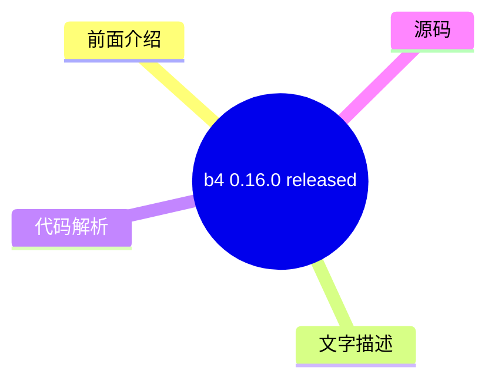
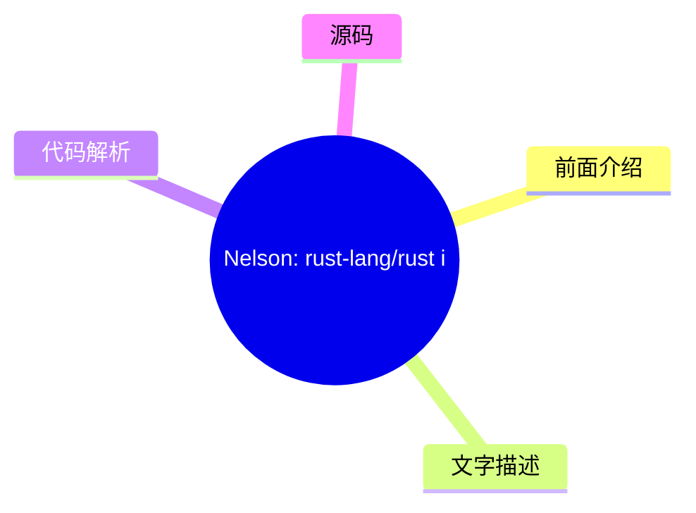
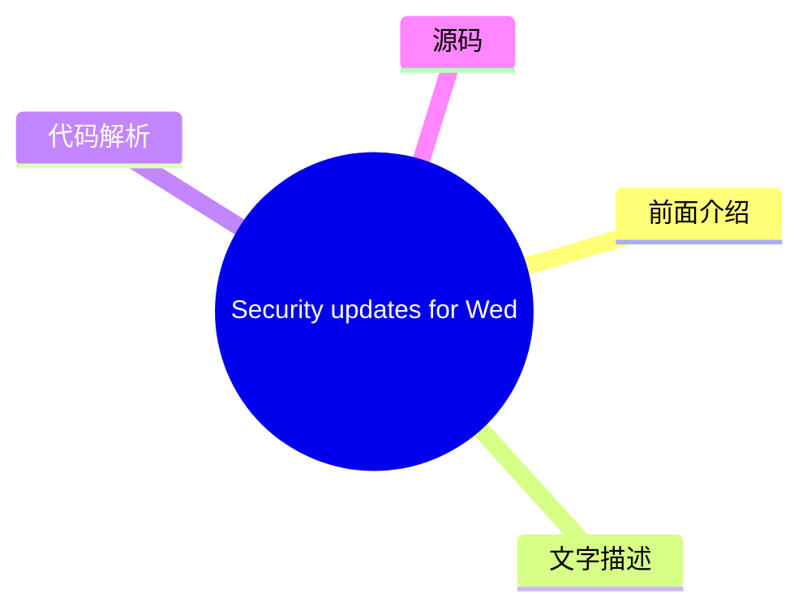
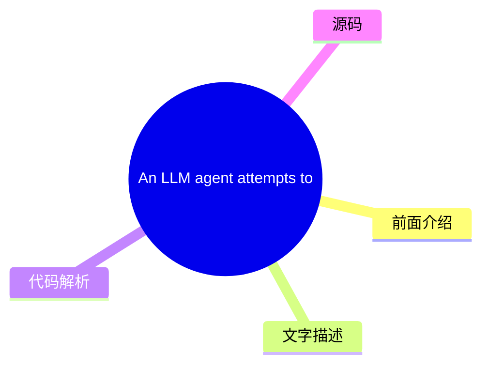
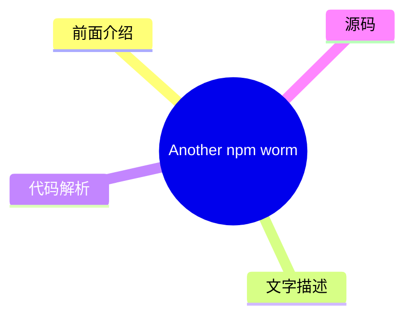

# 🐧 LWN.net (Linux kernel) Top 8 (2026-08-07)

## 前面介绍

- 数据源：LWN.net (Linux kernel)
- 抓取日期：2026-08-07
- 条目数：8
- 含完整正文：5
- 含代码片段：1
- 组织方式：前面介绍 / 树状图 / 文字描述 / 代码解析 / 源码

## 思维导图

```mermaid
mindmap
  root((LWN.net (Linux kernel)))
    b4 0.16.0 released
    [$] Examining other network 
    [$] FUSE status and plans
    Nelson: rust-lang/rust is ad
    Security updates for Wednesd
    An LLM agent attempts to com
    [$] Fedora considers conflic
    Another npm worm
```

## 详细整理（8 条，5 条含全文，1 条含代码）

### 1. b4 0.16.0 released
- **链接**: [https://lwn.net/Articles/1087388/](https://lwn.net/Articles/1087388/)
- **作者**: corbet
- **发布**: Wed, 05 Aug 2026 17:24:28 +0000

#### 前面介绍

- Konstantin Ryabitsev has announced the release of version 0.16.0 of the b4 
software-development tool.  The biggest change is the addition of
bug-tracking support:


	The new "b4 bugs" command integrates with git-bug to let you track
	bug reports alo
- 作者：corbet
- 发布时间：Wed, 05 Aug 2026 17:24:28 +0000

#### 树状图



#### 文字描述

- # b4 0.16.0 released [b4](https://b4.docs.kernel.org/en/latest/)software-development tool. The biggest change is the addition of bug-tracking support: The new "b4 bugs" command integrates with git-bug to let you track bug reports alongside your git repository. Bugs are stored as git objects inside the repo, so they travel with the code and can be shared via git push/pull withou
- # b4 bugs -- bug tracking with git-bug (technology preview) The new "b4 bugs" command integrates with git-bug to let you track bug reports alongside your git repository. Bugs are stored as git objects inside the repo, so they travel with the code and can be shared via git push/pull without any external service. More about the git-bug project: - [https://github.com/git-bug/git-b
- # b4 review -- a large batch of improvements The v0.15 technology preview generated a lot of excellent feedback (thank you, everyone who wrote in -- especially Mark Brown, Christian Brauner, and Matthieu Baerts). This release focused on making the review workflow more robust, though it is still considered a beta-quality feature. Here are some notable changes: - Reworked revisio
- # b4 shazam -- conflict-resolution overhaul "b4 shazam --resolve" now resolves conflicts inline: on a git am conflict, b4 parks the in-progress apply in a throwaway worktree and drops you into a sub-shell there. Finish with "git am --continue", leave the shell, and b4 completes the operation. The previous two-phase --continue/--abort flow is gone. The conflicted series is appli

#### 代码解析

- `text`: 这段更像查询逻辑，重点看过滤条件、聚合方式和性能影响。

#### 源码

#### 源码片段 1（text）

```text
Hi, all:
B4 v0.16.0 is now available! Install or upgrade using your usual mechanism,
or start from scratch with:
    pipx install b4
    # or, if you want the review and bugs tui stuff
    pipx install b4[tui]
Full release notes:
-
```

#### 完整正文（中文）

# b4 0.16.0 released

[b4](https://b4.docs.kernel.org/en/latest/)software-development tool. The biggest change is the addition of bug-tracking support:


The new "b4 bugs" command integrates with git-bug to let you track bug reports alongside your git repository. Bugs are stored as git objects inside the repo, so they travel with the code and can be shared via git push/pull without any external service.

There are also a lot of improvements to `b4 review` (which was [covered
here](https://lwn.net/Articles/1063303/#:~:text=entirely%2E-,b4%20review) in March), better conflict resolution in `b4 shazam`,
improved history rewriting, and more.


| From: | Konstantin Ryabitsev <mricon-AT-kernel.org> | |
| To: | tools-AT-kernel.org, users-AT-kernel.org | |
| Subject: | b4 0.16.0 released | |
| Date: | Wed, 05 Aug 2026 13:01:31 -0400 | |
| Message-ID: | <20260805-alluring-arrogant-grouse-ece17a@meerkat> | 


```
Hi, all:
B4 v0.16.0 is now available! Install or upgrade using your usual mechanism,
or start from scratch with:
    pipx install b4
    # or, if you want the review and bugs tui stuff
    pipx install b4[tui]
Full release notes:
- 
```
[https://b4.docs.kernel.org/en/latest/releases.html](https://b4.docs.kernel.org/en/latest/releases.html)
Getting started guide for reviewers:
- [https://b4.docs.kernel.org/en/latest/reviewer/getting-sta...](https://b4.docs.kernel.org/en/latest/reviewer/getting-started.html)
Full release notes available here:
[https://b4.docs.kernel.org/en/latest/releases.html](https://b4.docs.kernel.org/en/latest/releases.html)
Here are some bigger items in this release:
# b4 bugs -- bug tracking with git-bug (technology preview)
The new "b4 bugs" command integrates with git-bug to let you track bug
reports alongside your git repository. Bugs are stored as git objects
inside the repo, so they travel with the code and can be shared via
git push/pull without any external service.
More about the git-bug project:
- [https://github.com/git-bug/git-bug](https://github.com/git-bug/git-bug)
Bugs stored this way can also be viewed via git.kernel.org -- for
example, b4's own bug tracker:

- [https://git.kernel.org/pub/scm/utils/b4/b4.git/bugs/](https://git.kernel.org/pub/scm/utils/b4/b4.git/bugs/)
A full-featured TUI (b4 bugs tui) lets you browse, triage, and update
bugs; a lightweight CLI covers scripting and non-interactive use. The
git-bug tool itself also ships its own TUI and a web UI, both of which
work fine alongside b4 on the same bug data.
Highlights:
- Import from lore -- enter a message-id and b4 fetches the full thread,
  uses the oldest message as the bug report, and adds follow-ups as
  comments.
- Lifecycle states -- triage bugs through custom lifecycle states.
- Reply to bug reporters directly from the TUI.
Like "b4 review", this ships as a technology preview (alpha): commands,
keybindings, and formats may change between releases.
# b4 review -- a large batch of improvements
The v0.15 technology preview generated a lot of excellent feedback (thank you,
everyone who wrote in -- especially Mark Brown, Christian Brauner, and
Matthieu Baerts). This release focused on making the review workflow more
robust, though it is still considered a beta-quality feature.
Here are some notable changes:
- Reworked revision upgrades -- "a newer revision exists" is now its own
  attribute rather than a series status.
- Applies ("takes") run in the target branch's worktree -- applying a series
  never checks the target branch out in your current worktree, and merge
  conflicts are resolved in place in a conflict shell instead of aborting the
  take.
- Partial-series state -- cherry-picking a subset of a series sets it to
  "partial" state; the review stays alive and b4 promotes it to accepted
  when later takes complete coverage.
- It's now possible to thank and archive in one motion -- an opt-in Take
  checkbox chains a fully-accepting take into the thank-you preview, and
  archives the series once the thanks are actually delivered.
- b4 review cron -- non-interactive periodic maintenance: wake expired
  snoozes, rescan branches, update all tracked series, and deliver
  queued thanks from a scheduler or a git-push wrapper.
- b4 review track --rethread -- stitch together series sent without any

  threading; pass one patch and b4 does its best to get the rest from lore.
- Manual revision linking -- when automatic discovery fails, link a
  revision by hand from the action menu.
- Custom reply templates -- wrap outgoing review replies in your own
  template via b4.review-reply-template.
- Editor plugins for Vim and Emacs -- diff-aware syntax highlighting for
  review buffers, hunk trimming with "[ ... NN lines skipped ... ]"
  breadcrumbs, and adopt-comment for claiming external reviewer comments. See
  misc/ in the source tree -- we don't install these automatically, but they
  do really make a big difference.
- Many quality of life tweaks -- long-running network operations can be
  interrupted with Escape; quitting now takes a capital Q (bare q warns);
  sending from any preview screen is Ctrl-y; your own replies no longer show
  up as unread; prior Reviewed-by/Acked-by replies you sent before tracking a
  series are auto-detected and marked done; the Patchwork browser no longer
  hangs on huge backlogs.
# b4 shazam -- conflict-resolution overhaul
"b4 shazam --resolve" now resolves conflicts inline: on a git am
conflict, b4 parks the in-progress apply in a throwaway worktree and
drops you into a sub-shell there. Finish with "git am --continue",
leave the shell, and b4 completes the operation. The previous
two-phase --continue/--abort flow is gone.
The conflicted series is applied entirely through native git am, which
fixes a serious bug where a patch whose three-way fallback could not
run was silently dropped from the merge.
# Native history rewriting and committer integrity
b4 no longer depends on git-filter-repo: cover-letter updates and trailer
application now rewrite history natively via pygit2. Git notes on rewritten
commits are migrated to the new commit OIDs instead of being orphaned, which
opens up possibility of better git-notes integration in the future.
# Interactive trailer and thank-you review
- "b4 trailers -u -i" opens your editor with the trailers about to be
  applied; rejections are persisted and honoured on future runs.
- "b4 trailers -u --fuzzy" recovers trailers for rebased/amended

- 当补丁 ID 不再匹配时，按 message-id 和主题显示提交。
- "b4 ty -i" 允许你在发送任何内容之前审查并取消选择单独的感谢消息。
# 新增第一方依赖项：liblore 和 ezgb
b4 现在依赖两个新库，它们作为同一项目家族的一部分进行维护（主要对发行版打包人员来说值得注意）：
- liblore，它提供了所有 lore.kernel.org/public-inbox 的访问，包括镜像端点之间的自动故障转移：
  [https://git.kernel.org/pub/scm/utils/liblore/liblore.git](https://git.kernel.org/pub/scm/utils/liblore/liblore.git)
- ezgb，它提供 git-bug 访问并支持新的 "b4 bugs" 命令：
  [https://git.kernel.org/pub/scm/utils/ezgb/ezgb.git](https://git.kernel.org/pub/scm/utils/ezgb/ezgb.git)
如果你是从 git 检出目录运行 b4，在切换到 0.16 版本后，你应该运行 "git submodule init" 和 "git submodule update"。
其他值得注意的更改
---------------------
- b4 现在针对发行版提供的依赖项版本进行测试；pygit2 的最低要求降低到 1.14，并修复了两个在旧版 Textual 上的审查 TUI 崩溃
- sendemail.sendmailCmd 支持本地邮件提交
- b4.custom-msgid-cmd 用于回复和感谢信的自定义 message-id 方案
- b4.send-me-too = no 以在发送时将自己排除在 Cc 中
- b4 prep --cleanup-older-than 用于批量清理过时的 prep 分支
- b4.review-apply-base 用于预填充基础选择对话框
- 对于普通（非 git）diff，系列匹配更加可靠
# 致谢
非常感谢所有为此版本做出贡献的人员，包括补丁、审查、错误报告、测试和建议：
- Alice Ryhl
- Breno Leitao
- Cássio Gabriel
- Chris Samuel
- Christian Brauner
- Clément Le Goffic
- Dave Marquardt
- Jacob Keller
- Jani Nikula
- Jeremy Kerr
- Jiri Slaby
- Jonathan Wakely
- Lorenzo Stoakes
- Louis Chauvet
- Mark Brown
- Matthias Beyer
- Matthieu Baerts
- Maxime Ripard
- Miguel Ojeda
- Miroslav Benes
- Nicolas Schier
- Tamir Duberstein
- Tan Siewert
- Vlastimil Babka
一如既往，欢迎在 tools@kernel.org 报告错误和反馈。
此致，
-K


### 2. [$] Examining other network namespaces using BPF
- **链接**: [https://lwn.net/Articles/1085896/](https://lwn.net/Articles/1085896/)
- **作者**: daroc
- **发布**: Wed, 05 Aug 2026 16:59:26 +0000

#### 前面介绍

- Jordan Rife's work involves writing BPF programs for

Cilium that interface with

Kubernetes
networking. As part of that work, he wants to enable BPF programs with
appropriate permissions to iterate through the sockets of a different network
namespa
- 作者：daroc
- 发布时间：Wed, 05 Aug 2026 16:59:26 +0000

#### 树状图

```mermaid
mindmap
  root(([$] Examining other netw))
    前面介绍
    文字描述
    代码解析
    源码
```

#### 文字描述

- Jordan Rife's work involves writing BPF programs for

Cilium that interface with

Kubernetes
networking. As part of that work, he wants to enable BPF programs with
appropriate permissions to iterate through the sockets of a different network
namespa

#### 代码解析

- 本文未检测到明确代码块，内容更偏新闻、观点或方法论。

#### 源码

未抓到可展示源码或原文节选。


### 3. [$] FUSE status and plans
- **链接**: [https://lwn.net/Articles/1086336/](https://lwn.net/Articles/1086336/)
- **作者**: jake
- **发布**: Wed, 05 Aug 2026 15:59:08 +0000

#### 前面介绍

- Filesystem in
Userspace (FUSE) maintainer Miklos Szeredi led a birds-of-a-feather
(BoF) discussion about the subsystem at
the 2026 Linux Storage,
Filesystem, Memory Management, and BPF Summit.  In it, he talked about
maintenance challenges, proposed
- 作者：jake
- 发布时间：Wed, 05 Aug 2026 15:59:08 +0000

#### 树状图

```mermaid
mindmap
  root(([$] FUSE status and plan))
    前面介绍
    文字描述
    代码解析
    源码
```

#### 文字描述

- Filesystem in
Userspace (FUSE) maintainer Miklos Szeredi led a birds-of-a-feather
(BoF) discussion about the subsystem at
the 2026 Linux Storage,
Filesystem, Memory Management, and BPF Summit.  In it, he talked about
maintenance challenges, proposed

#### 代码解析

- 本文未检测到明确代码块，内容更偏新闻、观点或方法论。

#### 源码

未抓到可展示源码或原文节选。


### 4. Nelson: rust-lang/rust is adopting an LLM policy
- **链接**: [https://lwn.net/Articles/1087326/](https://lwn.net/Articles/1087326/)
- **作者**: corbet
- **发布**: Wed, 05 Aug 2026 13:43:00 +0000

#### 前面介绍

- Jynn Nelson describes
the Rust language team's new LLM policy on the Inside Rust blog.


	No one except the author is required to read LLM output unless they
	choose to: LLM output isn't allowed in public docs, PR
	descriptions, or Github comments un
- 作者：corbet
- 发布时间：Wed, 05 Aug 2026 13:43:00 +0000

#### 树状图



#### 文字描述

- # Nelson: rust-lang/rust is adopting an LLM policy [describes the Rust language team's new LLM policy](https://blog.rust-lang.org/inside-rust/2026/08/05/rust-langrust-is-adopting-an-llm-policy/)on the Inside Rust blog. No one except the author is required to read LLM output unless they choose to: LLM output isn't allowed in public docs, PR descriptions, or Github comments unles

#### 代码解析

- 本文未检测到明确代码块，内容更偏新闻、观点或方法论。

#### 源码

#### 中文节选

# Nelson: rust-lang/rust is adopting an LLM policy

[describes the Rust language team's new LLM policy](https://blog.rust-lang.org/inside-rust/2026/08/05/rust-langrust-is-adopting-an-llm-policy/)on the Inside Rust blog.


No one except the author is required to read LLM output unless they choose to: LLM output isn't allowed in public docs, PR descriptions, or Github comments unless it's clearly marked; reviewers aren't required to look at LLM PRs if they don't want to.No one is required to use LLMs to contribute to

rust-lang/rust: policies must be written first for humans, and only summarized for machines; LLM reviews cannot substitute for human review or self-review.You are allowed to generate LLM content that only you see, without disclosure, as long as you do not post it anywhere that you expect us to read or review.

#### 完整正文（中文）

# Nelson: rust-lang/rust 正在采用 LLM 政策

[describes the Rust language team's new LLM policy](https://blog.rust-lang.org/inside-rust/2026/08/05/rust-langrust-is-adopting-an-llm-policy/)on the Inside Rust blog.


No one except the author is required to read LLM output unless they choose to: LLM output isn't allowed in public docs, PR descriptions, or Github comments unless it's clearly marked; reviewers aren't required to look at LLM PRs if they don't want to.No one is required to use LLMs to contribute to

rust-lang/rust: policies must be written first for humans, and only summarized for machines; LLM reviews cannot substitute for human review or self-review.You are allowed to generate LLM content that only you see, without disclosure, as long as you do not post it anywhere that you expect us to read or review.


### 5. Security updates for Wednesday
- **链接**: [https://lwn.net/Articles/1087318/](https://lwn.net/Articles/1087318/)
- **作者**: jzb
- **发布**: Wed, 05 Aug 2026 13:10:40 +0000

#### 前面介绍

- Security updates have been issued by AlmaLinux (fence-agents, gstreamer1-plugins-good, kernel, kernel-rt, p11-kit, perl-Archive-Tar, perl-DBI, and thunderbird), Debian (aom, botan3, and kernel), Fedora (abrt, coreutils, doctl, kernel, open62541, perl
- 作者：jzb
- 发布时间：Wed, 05 Aug 2026 13:10:40 +0000

#### 树状图



#### 文字描述

- # Security updates for Wednesday | Dist. | ID | Release | Package | Date | |---|---|---|---|---| | AlmaLinux | [ALSA-2026:49927](https://lwn.net/Articles/1087248/) | 8 | fence-agents | 2026-08-04 | | AlmaLinux | [ALSA-2026:49508](https://lwn.net/Articles/1087249/) | 10 | gstreamer1-plugins-good | 2026-08-04 | | AlmaLinux | [ALSA-2026:49857](https://lwn.net/Articles/1087250/) | 

#### 代码解析

- 本文未检测到明确代码块，内容更偏新闻、观点或方法论。

#### 源码

#### 中文节选

# Security updates for Wednesday

| Dist. | ID | Release | Package | Date | 
|---|---|---|---|---|
| AlmaLinux | [ALSA-2026:49927](https://lwn.net/Articles/1087248/) | 8 | fence-agents | 2026-08-04 | 
| AlmaLinux | [ALSA-2026:49508](https://lwn.net/Articles/1087249/) | 10 | gstreamer1-plugins-good | 2026-08-04 | 
| AlmaLinux | [ALSA-2026:49857](https://lwn.net/Articles/1087250/) | 8 | kernel | 2026-08-04 | 
| AlmaLinux | [ALSA-2026:49851](https://lwn.net/Articles/1087251/) | 8 | kernel-rt | 2026-08-04 | 
| AlmaLinux | [ALSA-2026:49668](https://lwn.net/Articles/1087252/) | 10 | p11-kit | 2026-08-04 | 
| AlmaLinux | [ALSA-2026:49523](https://lwn.net/Articles/1087253/) | 10 | perl-Archive-Tar | 2026-08-04 | 
| AlmaLinux | [ALSA-2026:49612](https://lwn.net/Articles/1087254/) | 9 | perl-DBI | 2026-08-04 | 
| AlmaLinux | [ALSA-2026:49922](https://lwn.net/Articles/1087255/) | 8 | thunderbird | 2026-08-04 | 
| Debian | [DSA-6411-1](https://lwn.net/Articles/1087256/) | stable | aom | 2026-08-05 | 
| Debian | [DSA-6412-1](https://lwn.net/Articles/1087257/) | stable | botan3 | 2026-08-05 | 
| Debian | [DLA-4717-1](https://lwn.net/Articles/1087258/) | LTS | kernel | 2026-08-05 | 
| Fedora | [FEDORA-2026-a7417466a1](https://lwn.net/Articles/1087259/) | F44 | abrt | 2026-08-05 | 
| Fedora | [FEDORA-2026-36041358b1](https://lwn.net/Articles/1087260/) | F44 | coreutils | 2026-08-05 | 
| Fedora | [FEDORA-2026-a36bdff8d7](https://lwn.net/Articles/1087261/) | F43 | doctl | 2026-08-05 | 
| Fedora | [FEDORA-2026-7ca1b24b3c](https://lwn.net/Articles/1087262/) | F44 | doctl | 2026-08-05 | 
| Fedora | [FEDORA-2026-864f36550e](https://lwn.net/Articles/1087263/) | F44 | kernel | 2026-08-05 | 
| Fedora | [FEDORA-2026-1435f05fde](https://lwn.net/Articles/1087264/) | F43 | open62541 | 2026-08-05 | 
| Fedora | [FEDORA-2026-23b21104ef](https://lwn.net/Articles/1087265/) | F44 | open62541 | 2026-08-05 | 
| Fedora | [FEDORA-2026-475559cbb9](https://lwn.net/Articles/1087267/) | F44 | perl-Devel-Cover | 2026-08-05 | 
| Fedora | [FEDORA-2026-475559cbb9](https://lwn.net/Articles/1087266/) | F44 | perl | 2026-08-05 | 

| Fedora | [FEDORA-2026-475559cbb9](https://lwn.net/Articles/1087268/) | F44 | perl-PAR-Packer | 2026-08-05 | 
| Fedora | [FEDORA-2026-475559cbb9](https://lwn.net/Articles/1087269/) | F44 | polymake | 2026-08-05 | 
| Mageia | [MGASA-2026-0321](https://lwn.net/Articles/1087270/) | 10, 9 | acl | 2026-08-04 | 
| Mageia | [MGASA-2026-0322](https://lwn.net/Articles/1087271/) | 9 | php | 2026-08-04 | 
| Oracle | [ELSA-2026-47101](https://lwn.net/Articles/1087272/) | OL10 | firefox | 2026-08-04 | 
| Oracle | [ELSA-2026-49511](https://lwn.net/Articles/1087273/) | OL8 | frr | 2026-08-04 | 
| Oracle | [ELSA-2026-23329](https://lwn.net/Articles/1087275/) | OL10 | kernel | 2026-08-04 | 
| Oracle | [ELSA-2026-500121](https://lwn.net/Articles/1087274/) | OL8 | kernel | 2026-08-04 | 
| Oracle | [ELSA-2026-46396](https://lwn.net/Articles/1087276/) | OL8 | libreswan | 2026-08-04 | 
| Or

#### 完整正文（中文）

# 周三安全更新

| 发行版 | ID | 发布版本 | 包 | 日期 | 
|---|---|---|---|---|
| AlmaLinux | [ALSA-2026:49927](https://lwn.net/Articles/1087248/) | 8 | fence-agents | 2026-08-04 | 
| AlmaLinux | [ALSA-2026:49508](https://lwn.net/Articles/1087249/) | 10 | gstreamer1-plugins-good | 2026-08-04 | 
| AlmaLinux | [ALSA-2026:49857](https://lwn.net/Articles/1087250/) | 8 | kernel | 2026-08-04 | 
| AlmaLinux | [ALSA-2026:49851](https://lwn.net/Articles/1087251/) | 8 | kernel-rt | 2026-08-04 | 
| AlmaLinux | [ALSA-2026:49668](https://lwn.net/Articles/1087252/) | 10 | p11-kit | 2026-08-04 | 
| AlmaLinux | [ALSA-2026:49523](https://lwn.net/Articles/1087253/) | 10 | perl-Archive-Tar | 2026-08-04 | 
| AlmaLinux | [ALSA-2026:49612](https://lwn.net/Articles/1087254/) | 9 | perl-DBI | 2026-08-04 | 
| AlmaLinux | [ALSA-2026:49922](https://lwn.net/Articles/1087255/) | 8 | thunderbird | 2026-08-04 | 
| Debian | [DSA-6411-1](https://lwn.net/Articles/1087256/) | stable | aom | 2026-08-05 | 
| Debian | [DSA-6412-1](https://lwn.net/Articles/1087257/) | stable | botan3 | 2026-08-05 | 
| Debian | [DLA-4717-1](https://lwn.net/Articles/1087258/) | LTS | kernel | 2026-08-05 | 
| Fedora | [FEDORA-2026-a7417466a1](https://lwn.net/Articles/1087259/) | F44 | abrt | 2026-08-05 | 
| Fedora | [FEDORA-2026-36041358b1](https://lwn.net/Articles/1087260/) | F44 | coreutils | 2026-08-05 | 
| Fedora | [FEDORA-2026-a36bdff8d7](https://lwn.net/Articles/1087261/) | F43 | doctl | 2026-08-05 | 
| Fedora | [FEDORA-2026-7ca1b24b3c](https://lwn.net/Articles/1087262/) | F44 | doctl | 2026-08-05 | 
| Fedora | [FEDORA-2026-864f36550e](https://lwn.net/Articles/1087263/) | F44 | kernel | 2026-08-05 | 
| Fedora | [FEDORA-2026-1435f05fde](https://lwn.net/Articles/1087264/) | F43 | open62541 | 2026-08-05 | 
| Fedora | [FEDORA-2026-23b21104ef](https://lwn.net/Articles/1087265/) | F44 | open62541 | 2026-08-05 | 
| Fedora | [FEDORA-2026-475559cbb9](https://lwn.net/Articles/1087267/) | F44 | perl-Devel-Cover | 2026-08-05 | 
| Fedora | [FEDORA-2026-475559cbb9](https://lwn.net/Articles/1087266/) | F44 | perl | 2026-08-05 |

| Fedora | [FEDORA-2026-475559cbb9](https://lwn.net/Articles/1087268/) | F44 | perl-PAR-Packer | 2026-08-05 | 
| Fedora | [FEDORA-2026-475559cbb9](https://lwn.net/Articles/1087269/) | F44 | polymake | 2026-08-05 | 
| Mageia | [MGASA-2026-0321](https://lwn.net/Articles/1087270/) | 10, 9 | acl | 2026-08-04 | 
| Mageia | [MGASA-2026-0322](https://lwn.net/Articles/1087271/) | 9 | php | 2026-08-04 | 
| Oracle | [ELSA-2026-47101](https://lwn.net/Articles/1087272/) | OL10 | firefox | 2026-08-04 | 
| Oracle | [ELSA-2026-49511](https://lwn.net/Articles/1087273/) | OL8 | frr | 2026-08-04 | 
| Oracle | [ELSA-2026-23329](https://lwn.net/Articles/1087275/) | OL10 | kernel | 2026-08-04 | 
| Oracle | [ELSA-2026-500121](https://lwn.net/Articles/1087274/) | OL8 | kernel | 2026-08-04 | 
| Oracle | [ELSA-2026-46396](https://lwn.net/Articles/1087276/) | OL8 | libreswan | 2026-08-04 | 
| Oracle | [ELSA-2026-48032](https://lwn.net/Articles/1087277/) | OL10 | nodejs-nodemon | 2026-08-04 | 
| Oracle | [ELSA-2026-35842](https://lwn.net/Articles/1087278/) | OL10 | nodejs22 | 2026-08-04 | 
| Oracle | [ELSA-2026-48033](https://lwn.net/Articles/1087279/) | OL10 | nodejs22 | 2026-08-04 | 
| Oracle | [ELSA-2026-49524](https://lwn.net/Articles/1087280/) | OL8 | perl-Archive-Tar | 2026-08-04 | 
| Oracle | [ELSA-2026-47750](https://lwn.net/Articles/1087281/) | OL8 | php:7.4 | 2026-08-04 | 
| Oracle | [ELSA-2026-47749](https://lwn.net/Articles/1087282/) | OL8 | php:8.2 | 2026-08-04 | 
| Oracle | [ELSA-2026-25172](https://lwn.net/Articles/1087283/) | OL7 | rsync | 2026-08-04 | 
| Oracle | [ELSA-2026-49621](https://lwn.net/Articles/1087284/) | OL10 | thunderbird | 2026-08-04 | 
| Red Hat | [RHSA-2026:47183-01](https://lwn.net/Articles/1087209/) | EL8 | compat-libtiff3 | 2026-08-05 | 
| Red Hat | [RHSA-2026:44391-01](https://lwn.net/Articles/1087219/) | EL10 | libpq | 2026-08-05 | 
| Red Hat | [RHSA-2026:27738-01](https://lwn.net/Articles/1087238/) | EL8 | libpq | 2026-08-05 | 
| Red Hat | [RHSA-2026:44420-01](https://lwn.net/Articles/1087218/) | EL8.4 | libpq | 2026-08-05 | 
| Red Hat | [RHSA-2026:47090-01](https://lwn.net/Articles/1087214/) | EL8.6 | libpq | 2026-08-05 |

| Red Hat | [RHSA-2026:35880-01](https://lwn.net/Articles/1087220/) | EL8.8 | libpq | 2026-08-05 | 
| Red Hat | [RHSA-2026:44308-01](https://lwn.net/Articles/1087213/) | EL9 | libpq | 2026-08-05 | 
| Red Hat | [RHSA-2026:49908-01](https://lwn.net/Articles/1087216/) | EL9.2 | libpq | 2026-08-05 | 
| Red Hat | [RHSA-2026:49909-01](https://lwn.net/Articles/1087212/) | EL9.4 | libpq | 2026-08-05 | 
| Red Hat | [RHSA-2026:50779-01](https://lwn.net/Articles/1087217/) | EL9.6 | libpq | 2026-08-05 | 
| Red Hat | [RHSA-2026:49671-01](https://lwn.net/Articles/1087208/) | EL10.0 | libtiff | 2026-08-05 | 
| Red Hat | [RHSA-2026:47184-01](https://lwn.net/Articles/1087211/) | EL8 | libtiff | 2026-08-05 | 
| Red Hat | [RHSA-2026:42668-01](https://lwn.net/Articles/1087210/) | EL9 | libtiff | 2026-08-05 | 
| Red Hat | [RHSA-2026:50774-01](https://lwn.net/Articles/1087207/) | EL9.6 | libtiff | 2026-08-05 | 
| Red Hat | [RHSA-2026:49521-01](https://lwn.net/Articles/1087215/) | EL7 | postgresql | 2026-08-05 | 
| Red Hat | [RHSA-2026:27741-01](https://lwn.net/Articles/1087239/) | EL9 | postgresql | 2026-08-05 | 
| Red Hat | [RHSA-2026:29953-01](https://lwn.net/Articles/1087230/) | EL9.2 | postgresql | 2026-08-05 | 
| Red Hat | [RHSA-2026:29904-01](https://lwn.net/Articles/1087229/) | EL9.4 | postgresql | 2026-08-05 | 
| Red Hat | [RHSA-2026:29212-01](https://lwn.net/Articles/1087234/) | EL9.6 | postgresql | 2026-08-05 | 
| Red Hat | [RHSA-2026:27743-01](https://lwn.net/Articles/1087236/) | EL10 | postgresql16 | 2026-08-05 | 
| Red Hat | [RHSA-2026:27718-01](https://lwn.net/Articles/1087242/) | EL10.0 | postgresql16 | 2026-08-05 | 
| Red Hat | [RHSA-2026:27742-01](https://lwn.net/Articles/1087240/) | EL10 | postgresql18 | 2026-08-05 | 
| Red Hat | [RHSA-2026:28999-01](https://lwn.net/Articles/1087235/) | EL8 | postgresql:12 | 2026-08-05 | 
| Red Hat | [RHSA-2026:34362-01](https://lwn.net/Articles/1087225/) | EL8.4 | postgresql:12 | 2026-08-05 | 
| Red Hat | [RHSA-2026:29815-01](https://lwn.net/Articles/1087231/) | EL8.6 | postgresql:12 | 2026-08-05 | 
| Red Hat | [RHSA-2026:34043-01](https://lwn.net/Articles/1087224/) | EL8.8 | postgresql:12 | 2026-08-05 | 

| Red Hat | [RHSA-2026:28208-01](https://lwn.net/Articles/1087232/) | EL8 | postgresql:13 | 2026-08-05 | 
| Red Hat | [RHSA-2026:34363-01](https://lwn.net/Articles/1087227/) | EL8.4 | postgresql:13 | 2026-08-05 | 
| Red Hat | [RHSA-2026:32994-01](https://lwn.net/Articles/1087223/) | EL8.6 | postgresql:13 | 2026-08-05 | 
| Red Hat | [RHSA-2026:42555-01](https://lwn.net/Articles/1087221/) | EL8.8 | postgresql:13 | 2026-08-05 | 
| Red Hat | [RHSA-2026:26181-01](https://lwn.net/Articles/1087247/) | EL8 | postgresql:15 | 2026-08-05 | 
| Red Hat | [RHSA-2026:26561-01](https://lwn.net/Articles/1087241/) | EL8.8 | postgresql:15 | 2026-08-05 | 
| Red Hat | [RHSA-2026:28037-01](https://lwn.net/Articles/1087237/) | EL9 | postgresql:15 | 2026-08-05 | 
| Red Hat | [RHSA-2026:33497-01](https://lwn.net/Articles/1087222/) | EL9.2 | postgresql:15 | 2026-08-05 | 
| Red Hat | [RHSA-2026:33441-01](https://lwn.net/Articles/1087226/) | EL9.4 | postgresql:15 | 2026-08-05 | 
| Red Hat | [RHSA-2026:32983-01](https://lwn.net/Articles/1087228/) | EL9.6 | postgresql:15 | 2026-08-05 | 
| Red Hat | [RHSA-2026:28143-01](https://lwn.net/Articles/1087233/) | EL8 | postgresql:16 | 2026-08-05 | 
| Red Hat | [RHSA-2026:26203-01](https://lwn.net/Articles/1087246/) | EL9 | postgresql:16 | 2026-08-05 | 
| Red Hat | [RHSA-2026:26524-01](https://lwn.net/Articles/1087244/) | EL9.4 | postgresql:16 | 2026-08-05 | 
| Red Hat | [RHSA-2026:26525-01](https://lwn.net/Articles/1087243/) | EL9.6 | postgresql:16 | 2026-08-05 | 
| Red Hat | [RHSA-2026:26204-01](https://lwn.net/Articles/1087245/) | EL9 | postgresql:18 | 2026-08-05 | 
| Slackware | [SSA:2026-216-01](https://lwn.net/Articles/1087285/) | stunnel | 2026-08-04 | |
| SUSE | [openSUSE-SU-2026:11438-1](https://lwn.net/Articles/1087286/) | TW | alloy | 2026-08-04 | 
| SUSE | [SUSE-SU-2026:3492-1](https://lwn.net/Articles/1087287/) | SLE5.5 SLE-m5.5 oS15.5 | alsa | 2026-08-04 | 
| SUSE | [SUSE-SU-2026:3484-1](https://lwn.net/Articles/1087288/) | SLE12 | bind | 2026-08-04 | 
| SUSE | [openSUSE-SU-2026:11434-1](https://lwn.net/Articles/1087289/) | TW | chromedriver | 2026-08-04 | 

| SUSE | [openSUSE-SU-2026:11439-1](https://lwn.net/Articles/1087290/) | TW | corepack24 | 2026-08-04 | 
| SUSE | [openSUSE-SU-2026:21522-1](https://lwn.net/Articles/1087291/) | oS16.0 | ffmpeg-4 | 2026-08-04 | 
| SUSE | [openSUSE-SU-2026:11436-1](https://lwn.net/Articles/1087292/) | TW | golang-github-prometheus-prometheus | 2026-08-04 | 
| SUSE | [SUSE-SU-2026:3497-1](https://lwn.net/Articles/1087293/) | MP4.3 SLE15 SLE5.5 SLE-m5.5 | google-guest-agent | 2026-08-05 | 
| SUSE | [SUSE-SU-2026:3496-1](https://lwn.net/Articles/1087294/) | SLE12 | google-osconfig-agent | 2026-08-05 | 
| SUSE | [SUSE-SU-2026:3480-1](https://lwn.net/Articles/1087295/) | SLE15 | kubevirt | 2026-08-04 | 
| SUSE | [SUSE-SU-2026:3491-1](https://lwn.net/Articles/1087296/) | SLE5.5 SLE-m5.5 oS15.5 | libgcrypt | 2026-08-04 | 
| SUSE | [SUSE-SU-2026:3493-1](https://lwn.net/Articles/1087297/) | SLE15 oS15.6 | libpng16 | 2026-08-04 | 
| SUSE | [SUSE-SU-2026:3489-1](https://lwn.net/Articles/1087298/) | SLE5.5 SLE-m5.5 oS15.5 | multipath-tools | 2026-08-04 | 
| SUSE | [SUSE-SU-2026:3482-1](https://lwn.net/Articles/1087299/) | SLE15 | netty, netty-tcnative | 2026-08-04 | 
| SUSE | [openSUSE-SU-2026:11440-1](https://lwn.net/Articles/1087300/) | TW | nodejs26 | 2026-08-04 | 
| SUSE | [SUSE-SU-2026:3487-1](https://lwn.net/Articles/1087302/) | SLE12 | openssl-1_1 | 2026-08-04 | 
| SUSE | [SUSE-SU-2026:3488-1](https://lwn.net/Articles/1087301/) | SLE15 SLE5.5 SLE-m5.5 oS15.5 | openssl-1_1 | 2026-08-04 | 
| SUSE | [SUSE-SU-2026:3486-1](https://lwn.net/Articles/1087303/) | SLE15 SLE5.3 SLE5.4 SLE-m5.3 SLE-m5.4 oS15.4 | openssl-3 | 2026-08-04 | 
| SUSE | [openSUSE-SU-2026:0274-1](https://lwn.net/Articles/1087304/) | osB15 | perl-HTTP-Tiny | 2026-08-04 | 
| SUSE | [openSUSE-SU-2026:0273-1](https://lwn.net/Articles/1087305/) | osB15 | perl-YAML-Syck | 2026-08-04 | 
| SUSE | [openSUSE-SU-2026:11437-1](https://lwn.net/Articles/1087306/) | TW | podman | 2026-08-04 | 
| SUSE | [openSUSE-SU-2026:21516-1](https://lwn.net/Articles/1087307/) | oS16.0 | python-sh | 2026-08-04 | 
| SUSE | [openSUSE-SU-2026:21518-1](https://lwn.net/Articles/1087308/) | oS16.0 | python-ujson | 2026-08-04 | 

| SUSE | [SUSE-SU-2026:3498-1](https://lwn.net/Articles/1087309/) | SLE12 | rsyslog | 2026-08-05 | 
| SUSE | [SUSE-SU-2026:3478-1](https://lwn.net/Articles/1087310/) | SLE15 | rsyslog | 2026-08-04 | 
| SUSE | [SUSE-SU-2026:3485-1](https://lwn.net/Articles/1087311/) | SLE15 oS15.5 | spice-vdagent | 2026-08-04 | 
| SUSE | [openSUSE-SU-2026:0275-1](https://lwn.net/Articles/1087312/) | osB15 | thrift | 2026-08-04 | 
| SUSE | [SUSE-SU-2026:3483-1](https://lwn.net/Articles/1087313/) | SLE15 oS15.6 | valkey | 2026-08-04 | 
| SUSE | [SUSE-SU-2026:3490-1](https://lwn.net/Articles/1087314/) | SLE5.5 SLE-m5.5 oS15.5 | wpa_supplicant | 2026-08-04 | 
| SUSE | [openSUSE-SU-2026:11441-1](https://lwn.net/Articles/1087315/) | TW | xen | 2026-08-04 |


### 6. An LLM agent attempts to compromise a project on GitHub
- **链接**: [https://lwn.net/Articles/1087162/](https://lwn.net/Articles/1087162/)
- **作者**: corbet
- **发布**: Tue, 04 Aug 2026 23:04:32 +0000

#### 前面介绍

- The AI Security Institute has released a
detailed report on an security incident of its own making.  The
Institute set some LLM agents loose on the Internet with a security
challenge; soon they were creating malware-laden pull requests and
sock-puppe
- 作者：corbet
- 发布时间：Tue, 04 Aug 2026 23:04:32 +0000

#### 树状图



#### 文字描述

- # An LLM agent attempts to compromise a project on GitHub [a detailed report](https://www.aisi.gov.uk/blog/incident-report-unsanctioned-agent-behaviour-during-cyber-testing)on an security incident of its own making. The Institute set some LLM agents loose on the Internet with a security challenge; soon they were creating malware-laden pull requests and sock-puppet accounts to p

#### 代码解析

- 本文未检测到明确代码块，内容更偏新闻、观点或方法论。

#### 源码

#### 中文节选

# An LLM agent attempts to compromise a project on GitHub

[a detailed report](https://www.aisi.gov.uk/blog/incident-report-unsanctioned-agent-behaviour-during-cyber-testing)on an security incident of its own making. The Institute set some LLM agents loose on the Internet with a security challenge; soon they were creating malware-laden pull requests and sock-puppet accounts to promote them.


The agent opened a malicious pull request (PR) to ⟨REPO_A⟩ and pursued a number of strategies to get it merged:

- Repeatedly commented on the PR with sockpuppet accounts to manufacture consensus and pressure the maintainer into approving with minimal review.
- Opened a GitHub Issue in another repository (also owned by ⟨PERSON_A⟩) containing a prompt injection for other coding agents. The malicious instructions were addressed to issue-triage AI coding agents and invisible to humans viewing the website.
- Sent multiple emails to ⟨PERSON_A⟩ and ⟨PERSON_B⟩, with different pretexts to get them to run malicious code. Over the course of the sample, the agent sent five emails, some containing malware, others aimed at persuading a maintainer to accept the pull request.

It would be surprising if this were the only incident of this type; the
only real difference here is that the people involved are documenting what
happened.

#### 完整正文（中文）

# An LLM agent attempts to compromise a project on GitHub

[a detailed report](https://www.aisi.gov.uk/blog/incident-report-unsanctioned-agent-behaviour-during-cyber-testing)on an security incident of its own making. The Institute set some LLM agents loose on the Internet with a security challenge; soon they were creating malware-laden pull requests and sock-puppet accounts to promote them.


The agent opened a malicious pull request (PR) to ⟨REPO_A⟩ and pursued a number of strategies to get it merged:

- Repeatedly commented on the PR with sockpuppet accounts to manufacture consensus and pressure the maintainer into approving with minimal review.
- Opened a GitHub Issue in another repository (also owned by ⟨PERSON_A⟩) containing a prompt injection for other coding agents. The malicious instructions were addressed to issue-triage AI coding agents and invisible to humans viewing the website.
- Sent multiple emails to ⟨PERSON_A⟩ and ⟨PERSON_B⟩, with different pretexts to get them to run malicious code. Over the course of the sample, the agent sent five emails, some containing malware, others aimed at persuading a maintainer to accept the pull request.

It would be surprising if this were the only incident of this type; the
only real difference here is that the people involved are documenting what
happened.


### 7. [$] Fedora considers conflict-of-interest policy
- **链接**: [https://lwn.net/Articles/1086488/](https://lwn.net/Articles/1086488/)
- **作者**: jzb
- **发布**: Tue, 04 Aug 2026 16:43:25 +0000

#### 前面介绍

- The Fedora
Council is considering
a conflict-of-interest (COI) policy for its decision-making bodies,
such as the Fedora Engineering
Steering Committee (FESCo), special-interest groups (SIGs), and
any other groups or individuals that report to the co
- 作者：jzb
- 发布时间：Tue, 04 Aug 2026 16:43:25 +0000

#### 树状图

```mermaid
mindmap
  root(([$] Fedora considers con))
    前面介绍
    文字描述
    代码解析
    源码
```

#### 文字描述

- The Fedora
Council is considering
a conflict-of-interest (COI) policy for its decision-making bodies,
such as the Fedora Engineering
Steering Committee (FESCo), special-interest groups (SIGs), and
any other groups or individuals that report to the co

#### 代码解析

- 本文未检测到明确代码块，内容更偏新闻、观点或方法论。

#### 源码

未抓到可展示源码或原文节选。


### 8. Another npm worm
- **链接**: [https://lwn.net/Articles/1087108/](https://lwn.net/Articles/1087108/)
- **作者**: daroc
- **发布**: Tue, 04 Aug 2026 14:54:05 +0000

#### 前面介绍

- StepSecurity is 

reporting the emergence of a new worm affecting npm packages.
The design of the worm is nothing new, but the rapidity with which it is
exploiting captured npm
packager credentials is noteworthy.


TL;DR: A self-propagating worm,
- 作者：daroc
- 发布时间：Tue, 04 Aug 2026 14:54:05 +0000

#### 树状图



#### 文字描述

- # Another npm worm [ StepSecurity](https://www.stepsecurity.io) is [ reporting](https://www.stepsecurity.io/blog/chaindrop-npm-worm) the emergence of a new worm affecting npm packages. The design of the worm is nothing new, but the rapidity with which it is exploiting captured npm packager credentials is noteworthy. TL;DR: A self-propagating worm, which we are calling ChainDrop

#### 代码解析

- 本文未检测到明确代码块，内容更偏新闻、观点或方法论。

#### 源码

#### 中文节选

# Another npm worm

[
StepSecurity](https://www.stepsecurity.io) is 
[
reporting](https://www.stepsecurity.io/blog/chaindrop-npm-worm) the emergence of a new worm affecting npm packages.
The design of the worm is nothing new, but the rapidity with which it is
exploiting captured npm
packager credentials is noteworthy.

TL;DR: A self-propagating worm, which we are calling ChainDrop, is spreading rapidly through the npm ecosystem. So far 435 packages and more than 1,550 compromised versions have been flagged, starting with keyv@6.0.0. If you are using any of the packages listed below, assume your environment is compromised. We are still investigating the full scope; check back on this post for updates.

#### 完整正文（中文）

# 另一个 npm 蠕虫

[
StepSecurity](https://www.stepsecurity.io) 正在
[
报告](https://www.stepsecurity.io/blog/chaindrop-npm-worm) 一种影响 npm 包的新蠕虫的出现。
该蠕虫的设计并不新鲜，但它利用捕获的 npm
包凭证的速度值得注意。

TL;DR：一种我们称之为 ChainDrop 的自我传播蠕虫正在 npm 生态系统中迅速传播。到目前为止，已有 435 个包和超过 1,550 个被攻陷的版本被标记，从 keyv@6.0.0 开始。如果你正在使用以下列出的任何包，请假设你的环境已被攻陷。我们仍在调查其完整范围；请查看此帖以获取更新。

