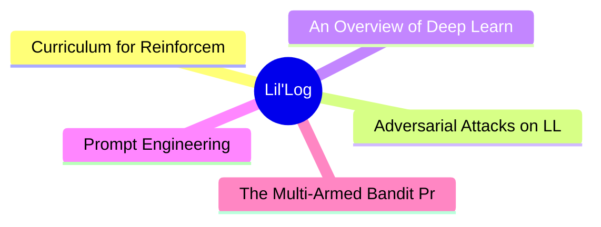

# 🧪 Lil'Log Top 5 (2026-06-15)

## 思维导图

## 列表（5 条）

### 1. Curriculum for Reinforcement Learning
- **链接**: [https://lilianweng.github.io/posts/2020-01-29-curriculum-rl/](https://lilianweng.github.io/posts/2020-01-29-curriculum-rl/)
- **发布**: Wed, 29 Jan 2020 00:00:00 +0000
- **简介**: [Updated on 2020-02-03: mentioning PCG in the &ldquo;Task-Specific Curriculum&rdquo; section.
[Updated on 2020-02-04: Add a new &ldquo;curriculum through distillation&rdquo; section.

### 2. Adversarial Attacks on LLMs
- **链接**: [https://lilianweng.github.io/posts/2023-10-25-adv-attack-llm/](https://lilianweng.github.io/posts/2023-10-25-adv-attack-llm/)
- **发布**: Wed, 25 Oct 2023 00:00:00 +0000
- **简介**: The use of large language models in the real world has strongly accelerated by the launch of ChatGPT. We (including my team at OpenAI, shoutout to them) have invested a lot of effort to build default safe behavior into t

### 3. An Overview of Deep Learning for Curious People
- **链接**: [https://lilianweng.github.io/posts/2017-06-21-overview/](https://lilianweng.github.io/posts/2017-06-21-overview/)
- **发布**: Wed, 21 Jun 2017 00:00:00 +0000
- **简介**: (The post was originated from my talk for WiMLDS x Fintech meetup hosted by Affirm.)
I believe many of you have watched or heard of the games between AlphaGo and professional Go player Lee Sedol in 2016. Lee has the high

### 4. Prompt Engineering
- **链接**: [https://lilianweng.github.io/posts/2023-03-15-prompt-engineering/](https://lilianweng.github.io/posts/2023-03-15-prompt-engineering/)
- **发布**: Wed, 15 Mar 2023 00:00:00 +0000
- **简介**: Prompt Engineering, also known as In-Context Prompting, refers to methods for how to communicate with LLM to steer its behavior for desired outcomes without updating the model weights. It is an empirical science and the 

### 5. The Multi-Armed Bandit Problem and Its Solutions
- **链接**: [https://lilianweng.github.io/posts/2018-01-23-multi-armed-bandit/](https://lilianweng.github.io/posts/2018-01-23-multi-armed-bandit/)
- **发布**: Tue, 23 Jan 2018 00:00:00 +0000
- **简介**: The algorithms are implemented for Bernoulli bandit in lilianweng/multi-armed-bandit.
Exploitation vs Exploration
The exploration vs exploitation dilemma exists in many aspects of our life. Say, your favorite restaurant 
