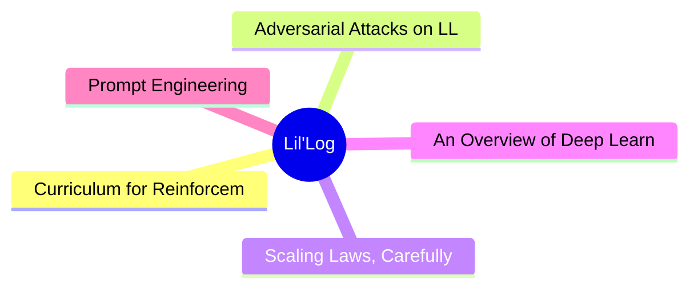

# 🧪 Lil'Log Top 5 (2026-07-05)

## 思维导图

## 列表（5 条，2 条含全文）

### 1. Curriculum for Reinforcement Learning
- **链接**: [https://lilianweng.github.io/posts/2020-01-29-curriculum-rl/](https://lilianweng.github.io/posts/2020-01-29-curriculum-rl/)
- **发布**: Wed, 29 Jan 2020 00:00:00 +0000
- **简介**: [Updated on 2020-02-03: mentioning PCG in the &ldquo;Task-Specific Curriculum&rdquo; section.
[Updated on 2020-02-04: Add a new &ldquo;curriculum through distillation&rdquo; section.

📄 全文（4022 字符，点击展开）

[Updated on 2020-02-03: mentioning [PCG](#pcg) in the “Task-Specific Curriculum” section.

[Updated on 2020-02-04: Add a new [“curriculum through distillation”](#curriculum-through-distillation) section.

It sounds like an impossible task if we want to teach integral or derivative to a 3-year-old who does not even know basic arithmetics. That’s why education is important, as it provides a systematic way to break down complex knowledge and a nice curriculum for teaching concepts from simple to hard. A curriculum makes learning difficult things easier and approachable for us humans. But, how about machine learning models? Can we train our models more efficiently with a curriculum? Can we design a curriculum to speed up learning?

Back in 1993, Jeffrey Elman has proposed the idea of training neural networks with a curriculum. His early work on learning simple language grammar demonstrated the importance of such a strategy: starting with a restricted set of simple data and gradually increasing the complexity of training samples; otherwise the model was not able to learn at all.

Compared to training without a curriculum, we would expect the adoption of the curriculum to expedite the speed of convergence and may or may not improve the final model performance. To design an efficient and effective curriculum is not easy. Keep in mind that, a bad curriculum may even hamper learning.

Next, we will look into several categories of curriculum learning, as illustrated in Most cases are applied to Reinforcement Learning, with a few exceptions on Supervised Learning.

In “The importance of starting small” paper ([Elman 1993](http://citeseerx.ist.psu.edu/viewdoc/download?doi=10.1.1.128.4487&rep=rep1&type=pdf)), I especially like the starting sentences and find them both inspiring and affecting:

“Humans differ from other species along many dimensions, but two are particularly noteworthy. Humans display an exceptional capacity to learn; and humans are remarkable for the unusually long time it takes to reach maturity. The adaptive advantage of learning is clear, and it may be argued that, through culture, learning has created the basis for a non-genetically based transmission of behaviors which may accelerate the evolution of our species.”

Indeed, learning is probably the best superpower we humans have.

# Task-Specific Curriculum[#](#task-specific-curriculum)

[Bengio, et al. (2009)](https://www.researchgate.net/profile/Y_Bengio/publication/221344862_Curriculum_learning/links/546cd2570cf2193b94c577ac/Curriculum-learning.pdf) provided a good overview of curriculum learning in the old days. The paper presented two ideas with toy experiments using a manually designed task-specific curriculum:

- Cleaner Examples may yield better generalization faster.
- Introducing gradually more difficult examples speeds up online training.

It is plausible that some curriculum strategies could be useless or even harmful. A good question to answer in the field is: *What could be the general principles that make some curriculum strategies work better than others?* The Bengio 2009 paper hypothesized it would be beneficial to make learning focus on “interesting” examples that are neither too hard or too easy.

If our naive curriculum is to train the model on samples with a gradually increasing level of complexity, we need a way to quantify the difficulty of a task first. One idea is to use its minimal loss with respect to another model while this model is pretrained on other tasks ([Weinshall, et al. 2018](https://arxiv.org/abs/1802.03796)). In this way, the knowledge of the pretrained model can be transferred to the new model by suggesting a rank of training samples. Fig. 2 shows the effectiveness of the `curriculum` group (green), compared to `control` (random order; yellow) and `anti` (reverse the order; red) groups.

[Zaremba & Sutskever (2014)](https://arxiv.org/abs/1410.4615) did an interesting experiment on training LSTM to predict the output of a short P

...（截断，原文 31549+ 字符）

### 2. Adversarial Attacks on LLMs
- **链接**: [https://lilianweng.github.io/posts/2023-10-25-adv-attack-llm/](https://lilianweng.github.io/posts/2023-10-25-adv-attack-llm/)
- **发布**: Wed, 25 Oct 2023 00:00:00 +0000
- **简介**: The use of large language models in the real world has strongly accelerated by the launch of ChatGPT. We (including my team at OpenAI, shoutout to them) have invested a lot of effort to build default safe behavior into t

📄 全文（4022 字符，点击展开）

The use of large language models in the real world has strongly accelerated by the launch of ChatGPT. We (including my team at OpenAI, shoutout to them) have invested a lot of effort to build default safe behavior into the model during the alignment process (e.g. via [RLHF](https://openai.com/research/learning-to-summarize-with-human-feedback)). However, adversarial attacks or jailbreak prompts could potentially trigger the model to output something undesired.

A large body of ground work on adversarial attacks is on images, and differently it operates in the continuous, high-dimensional space. Attacks for discrete data like text have been considered to be a lot more challenging, due to lack of direct gradient signals. My past post on [Controllable Text Generation](https://lilianweng.github.io/posts/2021-01-02-controllable-text-generation/) is quite relevant to this topic, as attacking LLMs is essentially to control the model to output a certain type of (unsafe) content.

There is also a branch of work on attacking LLMs to extract pre-training data, private knowledge ([Carlini et al, 2020](https://arxiv.org/abs/2012.07805)) or attacking model training process via data poisoning ([Carlini et al. 2023](https://arxiv.org/abs/2302.10149)). We would not cover those topics in this post.

# Basics[#](#basics)

## Threat Model[#](#threat-model)

Adversarial attacks are inputs that trigger the model to output something undesired. Much early literature focused on classification tasks, while recent effort starts to investigate more into outputs of generative models. In the context of large language models In this post we assume the attacks only happen **at inference time**, meaning that **model weights are fixed**.

### Classification[#](#classification)

Adversarial attacks on classifiers have attracted more attention in the research community in the past, many in the image domain. LLMs can be used for classification too. Given an input $\mathbf{x}$ and a classifier $f(.)$, we would like to find an adversarial version of the input, denoted as $\mathbf{x}_\text{adv}$, with imperceptible difference from $\mathbf{x}$, such that $f(\mathbf{x}) \neq f(\mathbf{x}_\text{adv})$.

### Text Generation[#](#text-generation)

Given an input $\mathbf{x}$ and a generative model $p(.)$, we have the model output a sample $\mathbf{y} \sim p(.\vert\mathbf{x})$ . An adversarial attack would identify such $p(\mathbf{x})$ that $\mathbf{y}$ would violate the built-in safe behavior of the model $p$; E.g. output unsafe content on illegal topics, leak private information or model training data. For generative tasks, it is not easy to judge the success of an attack, which demands a super high-quality classifier to judge whether $\mathbf{y}$ is unsafe or human review.

### White-box vs Black-box[#](#white-box-vs-black-box)

White-box attacks assume that attackers have full access to the model weights, architecture and training pipeline, such that attackers can obtain gradient signals. We don’t assume attackers have access to the full training data. This is only possible for open-sourced models. Black-box attacks assume that attackers only have access to an API-like service where they provide input $\mathbf{x}$ and get back sample $\mathbf{y}$, without knowing further information about the model.

# Types of Adversarial Attacks[#](#types-of-adversarial-attacks)

There are various means to find adversarial inputs to trigger LLMs to output something undesired. We present five approaches here.

| Attack | Type | Description | 
|---|---|---|
| Token manipulation | Black-box | Alter a small fraction of tokens in the text input such that it triggers model failure but still remain its original semantic meanings. | 
| Gradient based attack | White-box | Rely on gradient signals to learn an effective attack. | 
| Jailbreak prompting | Black-box | Often heuristic based prompting to “jailbreak” built-in model safety. | 
| Human red-teaming | Black-box | Human attacks the mode

...（截断，原文 46582+ 字符）

### 3. Scaling Laws, Carefully
- **链接**: [https://lilianweng.github.io/posts/2026-06-24-scaling-laws/](https://lilianweng.github.io/posts/2026-06-24-scaling-laws/)
- **发布**: Wed, 24 Jun 2026 00:00:00 +0000
- **简介**: Scaling laws are one of the most critical empirical findings in deep learning. The observation is simple in form: the training loss $L$ decreases predictably as we scale up model size $N$, dataset size $D$, and compute $

### 4. An Overview of Deep Learning for Curious People
- **链接**: [https://lilianweng.github.io/posts/2017-06-21-overview/](https://lilianweng.github.io/posts/2017-06-21-overview/)
- **发布**: Wed, 21 Jun 2017 00:00:00 +0000
- **简介**: (The post was originated from my talk for WiMLDS x Fintech meetup hosted by Affirm.)
I believe many of you have watched or heard of the games between AlphaGo and professional Go player Lee Sedol in 2016. Lee has the high

### 5. Prompt Engineering
- **链接**: [https://lilianweng.github.io/posts/2023-03-15-prompt-engineering/](https://lilianweng.github.io/posts/2023-03-15-prompt-engineering/)
- **发布**: Wed, 15 Mar 2023 00:00:00 +0000
- **简介**: Prompt Engineering, also known as In-Context Prompting, refers to methods for how to communicate with LLM to steer its behavior for desired outcomes without updating the model weights. It is an empirical science and the 
