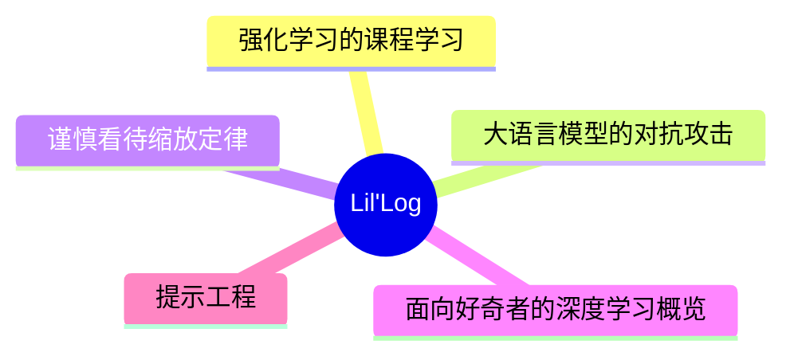
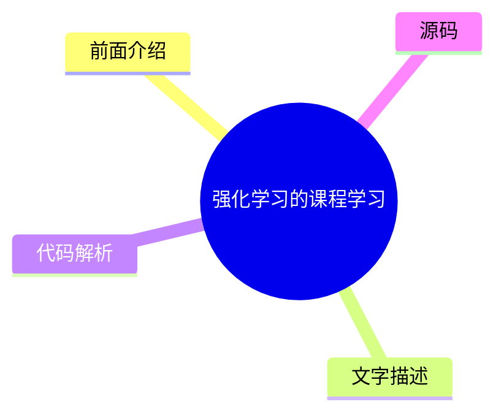
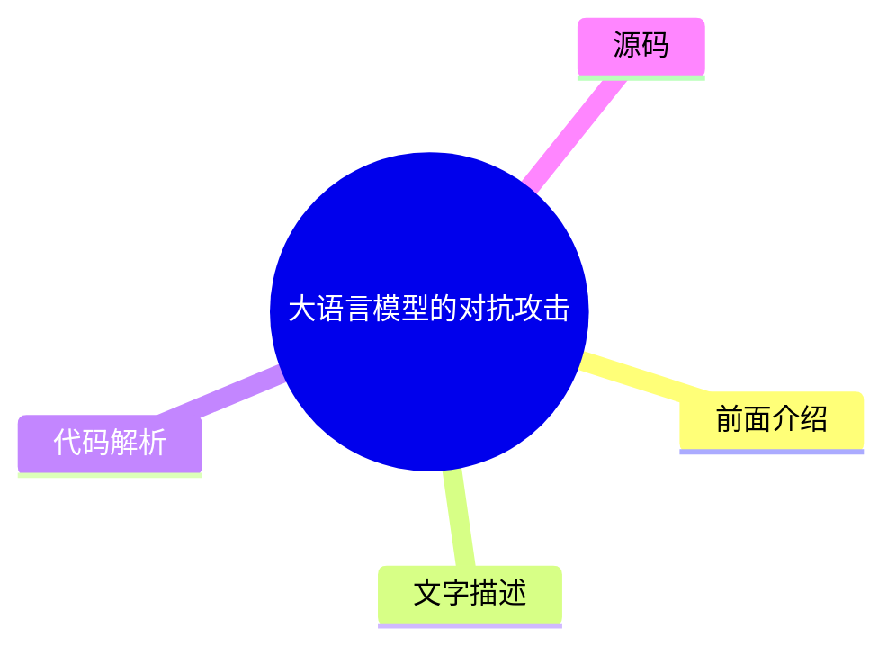
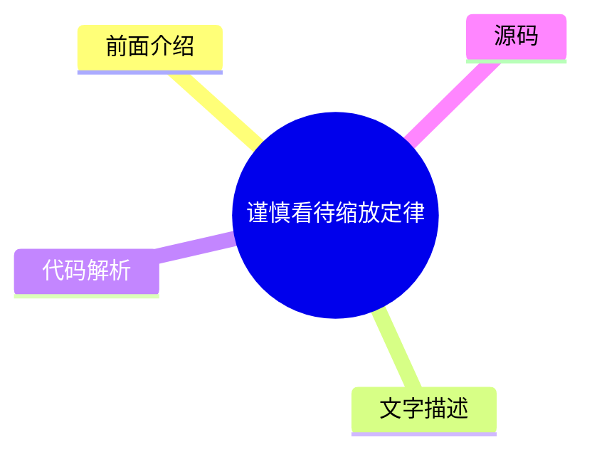
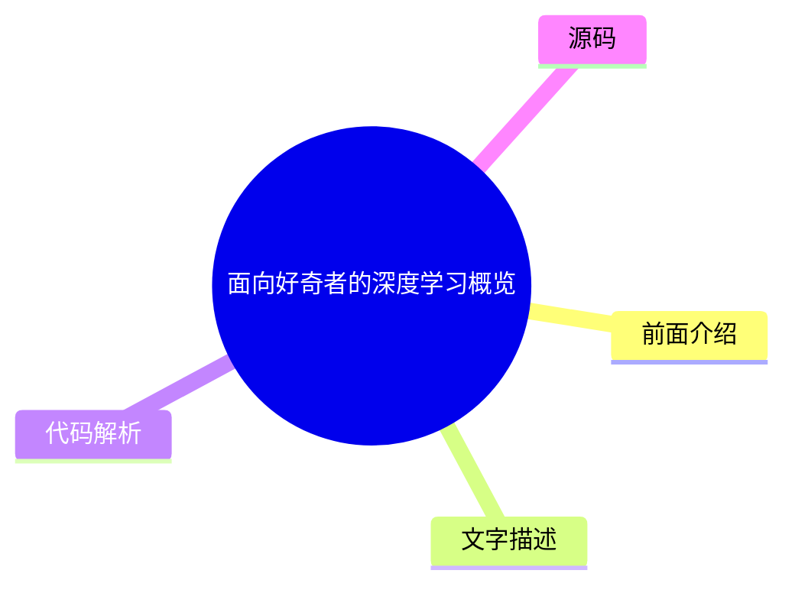
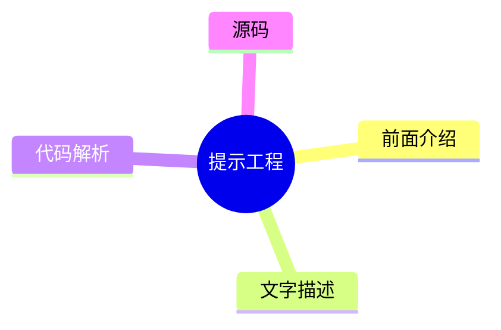

# 🧪 Lil'Log Top 5 (2026-07-27)

## 前面介绍

- 数据源：Lil'Log
- 抓取日期：2026-07-27
- 条目数：5
- 含完整正文：5
- 含代码片段：1
- 组织方式：前面介绍 / 树状图 / 文字描述 / 代码解析 / 源码

## 思维导图



## 详细整理（5 条，5 条含全文，1 条含代码）

### 1. 强化学习的课程学习
- **链接**: [https://lilianweng.github.io/posts/2020-01-29-curriculum-rl/](https://lilianweng.github.io/posts/2020-01-29-curriculum-rl/)
- **发布**: Wed, 29 Jan 2020 00:00:00 +0000

#### 前面介绍

- 课程学习通过逐步增加训练样本的难度来加速模型收敛。
- 早期研究表明，从简单数据开始训练神经网络比直接使用复杂数据更有效。
- 课程学习可能加速收敛，但不一定能提高最终模型性能，设计不当甚至可能阻碍学习。

#### 树状图



#### 文字描述

- Elman (1993) 最早提出神经网络课程学习概念，通过限制简单数据集并逐步增加复杂度来训练模型。
- Bengio 等人 (2009) 提出了课程学习的两个核心观点：更清洁的例子能带来更好的泛化，引入更难例子能加速在线训练。
- Zaremba 和 Sutskever (2014) 的实验表明，单纯的渐进式课程学习不如混合策略有效，混合策略有助于避免遗忘。
- 程序化内容生成 (PCG) 是一种创建不同难度游戏的方法，涉及算法随机性和人类专家设计。

#### 代码解析

- 本文未提供源码，以下为实现思路或结构解析

#### 源码

#### 中文节选

[Updated on 2020-02-03: 在“任务特定课程”部分提及了 [PCG](#pcg)。

[Updated on 2020-02-04: 新增了一个 [“通过蒸馏进行课程学习”](#curriculum-through-distillation) 部分。

如果我们想教一个连基本算术都不懂的三岁小孩积分或导数，这听起来像是一项不可能完成的任务。这就是为什么教育很重要，因为它提供了一种系统性的方法来分解复杂知识，并为从简单到困难的概念教学提供了一个很好的课程。课程让学习困难的事情对我们人类来说变得更容易、更易于接受。但是，机器学习模型呢？我们能否通过课程学习更高效地训练模型？我们能否设计一个课程来加速学习？

早在 1993 年，Jeffrey Elman 就提出了使用课程训练神经网络的想法。他在学习简单语言语法方面的早期工作证明了这种策略的重要性：从一组受限的简单数据开始，并逐渐增加训练样本的复杂性；否则，模型根本无法学习。

与没有课程的学习相比，我们预计采用课程学习将加速收敛速度，并且可能会或可能不会提高最终模型的性能。设计一个高效且有效的课程并不容易。请记住，糟糕的课程甚至可能会阻碍学习。

接下来，我们将研究几种类别的课程学习，如上图所示。大多数情况应用于强化学习，监督学习只有少数例外。

在“The importance of starting small”论文（[Elman 1993](http://citeseerx.ist.psu.edu/viewdoc/download?doi=10.1.1.128.4487&rep=rep1&type=pdf)）中，我特别喜欢开篇的句子，发现它们既鼓舞人心又发人深省：

“Humans differ from other species along many dimensions, but two are particularly noteworthy. Humans display an exceptional capacity to learn; and humans are remarkable for the unusually long time it takes to reach maturity. The adaptive advantage of learning is clear, and it may be argued that, through culture, learning has created the basis for a non-genetically based transmission of behaviors which may accelerate the evolution of our species.”


Indeed, learning is probably the best superpower we humans have.

# Task-Specific Curriculum[#](#task-specific-curriculum)

[Bengio, et al. (2009)](https://www.researchgate.net/profile/Y_Bengio/publication/221344862_Curriculum_learning/links/546cd2570cf2193b94c577ac/Curriculum-learning.pdf) provided a good overview of curriculum learning in the old days. The paper presented two ideas with toy experiments using a manually designed task-specific curriculum:

- Cleaner Examples may yield better generalization faster.
- Introducing gradually more difficult examples speeds up online training.

It is plausible that some curriculum strategies could be useless or even harmful. A good question to answer in the field is: *What could be

#### 完整正文（中文）

[Updated on 2020-02-03: 在“任务特定课程”部分提及了 [PCG](#pcg)。

[Updated on 2020-02-04: 新增了一个 [“通过蒸馏进行课程学习”](#curriculum-through-distillation) 部分。

如果我们想教一个连基本算术都不懂的三岁小孩积分或导数，这听起来像是一项不可能完成的任务。这就是为什么教育很重要，因为它提供了一种系统性的方法来分解复杂知识，并为从简单到困难的概念教学提供了一个很好的课程。课程让学习困难的事情对我们人类来说变得更容易、更易于接受。但是，机器学习模型呢？我们能否通过课程学习更高效地训练模型？我们能否设计一个课程来加速学习？

早在 1993 年，Jeffrey Elman 就提出了使用课程训练神经网络的想法。他在学习简单语言语法方面的早期工作证明了这种策略的重要性：从一组受限的简单数据开始，并逐渐增加训练样本的复杂性；否则，模型根本无法学习。

与没有课程的学习相比，我们预计采用课程学习将加速收敛速度，并且可能会或可能不会提高最终模型的性能。设计一个高效且有效的课程并不容易。请记住，糟糕的课程甚至可能会阻碍学习。

接下来，我们将研究几种类别的课程学习，如上图所示。大多数情况应用于强化学习，监督学习只有少数例外。

在“The importance of starting small”论文（[Elman 1993](http://citeseerx.ist.psu.edu/viewdoc/download?doi=10.1.1.128.4487&rep=rep1&type=pdf)）中，我特别喜欢开篇的句子，发现它们既鼓舞人心又发人深省：

“Humans differ from other species along many dimensions, but two are particularly noteworthy. Humans display an exceptional capacity to learn; and humans are remarkable for the unusually long time it takes to reach maturity. The adaptive advantage of learning is clear, and it may be argued that, through culture, learning has created the basis for a non-genetically based transmission of behaviors which may accelerate the evolution of our species.”


Indeed, learning is probably the best superpower we humans have.

# Task-Specific Curriculum[#](#task-specific-curriculum)

[Bengio, et al. (2009)](https://www.researchgate.net/profile/Y_Bengio/publication/221344862_Curriculum_learning/links/546cd2570cf2193b94c577ac/Curriculum-learning.pdf) provided a good overview of curriculum learning in the old days. The paper presented two ideas with toy experiments using a manually designed task-specific curriculum:

- Cleaner Examples may yield better generalization faster.
- Introducing gradually more difficult examples speeds up online training.

It is plausible that some curriculum strategies could be useless or even harmful. A good question to answer in the field is: *What could be the general principles that make some curriculum strategies work better than others?* The Bengio 2009 paper hypothesized it would be beneficial to make learning focus on “interesting” examples that are neither too hard or too easy.

If our naive curriculum is to train the model on samples with a gradually increasing level of complexity, we need a way to quantify the difficulty of a task first. One idea is to use its minimal loss with respect to another model while this model is pretrained on other tasks ([Weinshall, et al. 2018](https://arxiv.org/abs/1802.03796)). In this way, the knowledge of the pretrained model can be transferred to the new model by suggesting a rank of training samples. Fig. 2 shows the effectiveness of the `curriculum` group (green), compared to `control` (random order; yellow) and `anti` (reverse the order; red) groups.


[Zaremba & Sutskever (2014)](https://arxiv.org/abs/1410.4615) 做了一个有趣的实验，训练 LSTM 来预测短 Python 程序的输出，该程序用于数学运算，而无需实际执行代码。他们发现课程学习对于学习是必要的。程序的复杂性由两个参数控制，`length` ∈ [1, a] 和 `nesting`∈ [1, b]。考虑了三种策略：

- **朴素课程**：首先增加 `length` 直到达到 `a`；然后增加 `nesting` 并将 `length` 重置为 1；重复此过程直到两者都达到最大值。
- **混合课程**：采样 `length`~ [1, a] 和 `nesting`~ [1, b]
- **组合**：朴素 + 混合。

他们注意到组合策略总是优于朴素课程，并且通常（但并非总是）优于混合策略——这表明在训练期间混合简单任务对于 *避免遗忘* 非常重要。

[Procedural content generation (][PCG](https://en.wikipedia.org/wiki/Procedural_generation)) is a popular approach for creating video games of various levels of difficulty. PCG involves algorithmic randomness and a heavy dose of human expertise in designing game elements and dependencies among them. Procedurally generated levels have been introduced into several benchmark environments for evaluating whether an RL agent can generalize to a new level that it is not trained on ([meta-RL](https://lilianweng.github.io/posts/2019-06-23-meta-rl/)!), such as [GVGAI](http://www.gvgai.net/), OpenAI [CoinRun](https://openai.com/blog/quantifying-generalization-in-reinforcement-learning/) and [Procgen benchmark](https://openai.com/blog/procgen-benchmark/). Using GVGAI, [Justesen, et al. (2018)](https://arxiv.org/abs/1806.10729) demonstrated that an RL policy can easily overfit to a specific game but training over a simple curriculum that grows the task difficulty together with the model performance helps its generalization to new human-designed levels. Similar results are also found in CoinRun ([Cobbe, et al. 2018](https://arxiv.org/abs/1812.02341)). POET ([Wang et al, 2019](https://arxiv.org/abs/1901.01753)) is another example for leveraging evolutionary algorithm and procedural generated game levels to improve RL generalization, which I’ve described in details in my [meta-RL post](https://lilianweng.github.io/posts/2019-06-23-meta-rl/#evolutionary-algorithm-on-environment-generation).

To follow the curriculum learning approaches described above, generally we need to figure out two problems in the training procedure:

- Design a metric to quantify how hard a task is so that we can sort tasks accordingly.
- Provide a sequence of tasks with an increasing level of difficulty to the model during training.


然而，任务的顺序不必是顺序的。在我们的魔方论文中，我们依赖于*自动领域随机化*（**ADR**）通过 growing 一个复杂度递增的环境分布来生成课程。每个任务的难度（即在特定环境中解开魔方）取决于各种环境参数的随机化范围。即使假设所有环境参数都不相关，我们也能为我们的机械手创建一个不错的课程。

# Teacher-Guided Curriculum[#](#teacher-guided-curriculum)

*自动课程学习*的概念由 [Graves 等人 2017](https://arxiv.org/abs/1704.03003) 稍早提出。它将一个 N 任务课程视为一个 [$N$ 臂老虎机](https://lilianweng.github.io/posts/2018-01-23-multi-armed-bandit/) 问题，以及一个学习优化该老虎机回报的自适应策略。

论文中考虑了两类学习信号：

- 损失驱动的进度：一次梯度更新前后的损失函数变化。这种类型的奖励信号跟踪学习过程的速度，因为最大的任务损失减少等同于最快的学习。
- 复杂度驱动的进度：网络权重后验分布与先验分布之间的 KL 散度。这种类型的学习信号受到 [MDL](https://en.wikipedia.org/wiki/Minimum_description_length) 原则的启发，“增加一定量的模型复杂度只有在压缩数据量更大的情况下才是值得的”。因此，模型复杂度预期会在模型很好地泛化到训练样本时增长最多。

[通过另一个 RL 代理自动提出课程的方法被形式化为 ]*Teacher-Student Curriculum Learning* (**TSCL**; [Matiisen, et al. 2017](https://arxiv.org/abs/1707.00183))。在 TSCL 中，一个 *student*（学生）是正在处理实际任务的 RL 代理，而一个 *teacher*（教师）代理则是用于选择任务的策略。学生的目标是掌握一个可能很难直接学习的复杂任务。为了使这个任务更容易学习，我们设置教师代理通过选择适当的子任务来指导学生的训练过程。

在这个过程中，学生应该学习能够：

- 帮助学生取得最快学习进度的任务，或者
- 有被遗忘风险的任务。

注意：将教师模型构建为 RL 问题的设置感觉与神经架构搜索（NAS）非常相似，但不同的是 TSCL 中的 RL 模型在任务空间上操作，而 NAS 在主模型架构空间上操作。

训练教师模型是解决一个 [POMDP](https://en.wikipedia.org/wiki/Partially_observable_Markov_decision_process) 问题：

- 未观测到的 $s_t$ 是学生模型的完整状态。
- 观测到的 $o = (x_t^{(1)}, \dots, x_t^{(N)})$ 是 $N$ 个任务的分数列表。
- 动作 $a$ 是选择一个子任务。
- 每一步的奖励是分数差。$r_t = \sum_{i=1}^N x_t^{(i)} - x_{t-1}^{(i)}$（即，相当于在回合结束时最大化所有任务的分数）。

从嘈杂的任务分数中估计学习进度，同时平衡探索与利用的方法可以借鉴非平稳多臂老虎机问题——使用 [ε-greedy](https://lilianweng.github.io/posts/2018-01-23-multi-armed-bandit/#%CE%B5-greedy-algorithm)，或 [Thompson sampling](https://lilianweng.github.io/posts/2018-01-23-multi-armed-bandit/#thompson-sampling)。

总结来说，核心思想是使用一个策略为另一个策略提出任务，以便后者能学得更好。有趣的是，上述两项工作（在离散任务空间中）都发现从所有任务中均匀采样是一个出奇强大的基准。

如果任务空间是连续的呢？[Portelas, et al. (2019)](https://arxiv.org/abs/1910.07224) 研究了一个连续的教师-学生框架，其中教师必须从连续任务空间中采样参数来生成学习课程。给定一个新采样的参数 $p$，绝对学习进度（Absolute Learning Progress，简称 ALP）被测量为 $\text{ALP}_p = \vert r - r_\text{old} \vert$，其中 $r$ 是与 $p$ 相关的回合奖励，$r_\text{old}$ 是与 $p_\text{old}$ 相关的奖励。这里，$p_\text{old}$ 是任务空间中距离 $p$ 最近的先前采样的参数，可以通过最近邻检索。请注意，这个 ALP 分数与上面 [TSCL](#TSCL) 或 [Grave, et al. 2017](#grave-et-al-2017) 中的学习信号有何不同：ALP 分数测量的是两个任务之间的奖励差异，而不是同一任务在两个时间步上的性能。

在任务参数空间之上，训练了一个高斯混合模型来拟合 $\text{ALP}_p$ 在 $p$ 上的分布。采样任务时使用 ε-greedy 策略：以一定概率采样一个随机任务；否则，从 GMM 模型中按 ALP 分数比例采样。

# Curriculum through Self-Play[#](#curriculum-through-self-play)

与教师-学生框架不同，两个智能体在做非常不同的事情。教师学习为学生选择任务，而无需了解实际的任务内容。如果我们想让它们都直接在主任务上进行训练呢？甚至让它们互相竞争怎么样？

[Sukhb


### 2. 大语言模型的对抗攻击
- **链接**: [https://lilianweng.github.io/posts/2023-10-25-adv-attack-llm/](https://lilianweng.github.io/posts/2023-10-25-adv-attack-llm/)
- **发布**: Wed, 25 Oct 2023 00:00:00 +0000

#### 前面介绍

- 对抗攻击旨在通过精心设计的输入触发模型输出不受欢迎的内容。
- 文本攻击比图像攻击更具挑战性，因为文本缺乏直接的梯度信号。
- 攻击类型包括 Token 操作、基于梯度的攻击、越狱提示、人工红队测试和模型红队测试。

#### 树状图



#### 文字描述

- 威胁模型假设攻击仅发生在推理时间，模型权重固定。白盒攻击假设攻击者拥有模型权重和架构信息，黑盒攻击仅通过 API 访问模型。
- Token 操作攻击通过替换同义词等微小操作来触发模型错误预测，TextAttack 等框架实现了多种此类方法。
- 越狱提示通常基于启发式方法，旨在绕过模型内置的安全行为。
- 对抗攻击的目标包括生成非法内容、泄露私有知识或训练数据，以及通过数据投毒攻击训练过程。

#### 代码解析

- 本文未提供源码，以下为实现思路或结构解析

#### 源码

#### 中文节选

The use of large language models in the real world has strongly accelerated by the launch of ChatGPT. We (including my team at OpenAI, shoutout to them) have invested a lot of effort to build default safe behavior into the model during the alignment process (e.g. via [RLHF](https://openai.com/research/learning-to-summarize-with-human-feedback)). However, adversarial attacks or jailbreak prompts could potentially trigger the model to output something undesired.

A large body of ground work on adversarial attacks is on images, and differently it operates in the continuous, high-dimensional space. Attacks for discrete data like text have been considered to be a lot more challenging, due to lack of direct gradient signals. My past post on [Controllable Text Generation](https://lilianweng.github.io/posts/2021-01-02-controllable-text-generation/) is quite relevant to this topic, as attacking LLMs is essentially to control the model to output a certain type of (unsafe) content.

There is also a branch of work on attacking LLMs to extract pre-training data, private knowledge ([Carlini et al, 2020](https://arxiv.org/abs/2012.07805)) or attacking model training process via data poisoning ([Carlini et al. 2023](https://arxiv.org/abs/2302.10149)). We would not cover those topics in this post.

# Basics[#](#basics)

## Threat Model[#](#threat-model)

Adversarial attacks are inputs that trigger the model to output something undesired. Much early literature focused on classification tasks, while recent effort starts to investigate more into outputs of generative models. In the context of large language models In this post we assume the attacks only happen **at inference time**, meaning that **model weights are fixed**.

### Classification[#](#classification)

Adversarial attacks on classifiers have attracted more attention in the research community in the past, many in the image domain. LLMs can be used for classification too. Given an input $\mathbf{x}$ and a classifier $f(.)$, we would like to find an adversarial version of the input, denoted as $\mathbf{x}_\text{adv}$, with imperceptible difference from $\mathbf{x}$, such that $f(\mathbf{x}) \neq f(\mathbf{x}_\text{adv})$.


### Text Generation[#](#text-generation)

Given an input $\mathbf{x}$ and a generative model $p(.)$, we have the model output a sample $\mathbf{y} \sim p(.\vert\mathbf{x})$ . An adversarial attack would identify such $p(\mathbf{x})$ that $\mathbf{y}$ would violate the built-in safe behavior of the model $p$; E.g. output unsafe content on illegal topics, leak private information or model training data. For generative tasks, it is not easy to judge the success of an attack, which demands a super high-quality classifier to judge whether $\mathbf{y}$ is unsafe or human review.

### White-box vs Black-box[#](#white-box-vs-black-box)

White-box attacks assume that attackers have full access to the model weights, architecture and training pipeline, such that attackers can obtain gradient signals

#### 完整正文（中文）

The use of large language models in the real world has strongly accelerated by the launch of ChatGPT. We (including my team at OpenAI, shoutout to them) have invested a lot of effort to build default safe behavior into the model during the alignment process (e.g. via [RLHF](https://openai.com/research/learning-to-summarize-with-human-feedback)). However, adversarial attacks or jailbreak prompts could potentially trigger the model to output something undesired.

A large body of ground work on adversarial attacks is on images, and differently it operates in the continuous, high-dimensional space. Attacks for discrete data like text have been considered to be a lot more challenging, due to lack of direct gradient signals. My past post on [Controllable Text Generation](https://lilianweng.github.io/posts/2021-01-02-controllable-text-generation/) is quite relevant to this topic, as attacking LLMs is essentially to control the model to output a certain type of (unsafe) content.

There is also a branch of work on attacking LLMs to extract pre-training data, private knowledge ([Carlini et al, 2020](https://arxiv.org/abs/2012.07805)) or attacking model training process via data poisoning ([Carlini et al. 2023](https://arxiv.org/abs/2302.10149)). We would not cover those topics in this post.

# Basics[#](#basics)

## Threat Model[#](#threat-model)

Adversarial attacks are inputs that trigger the model to output something undesired. Much early literature focused on classification tasks, while recent effort starts to investigate more into outputs of generative models. In the context of large language models In this post we assume the attacks only happen **at inference time**, meaning that **model weights are fixed**.

### Classification[#](#classification)

Adversarial attacks on classifiers have attracted more attention in the research community in the past, many in the image domain. LLMs can be used for classification too. Given an input $\mathbf{x}$ and a classifier $f(.)$, we would like to find an adversarial version of the input, denoted as $\mathbf{x}_\text{adv}$, with imperceptible difference from $\mathbf{x}$, such that $f(\mathbf{x}) \neq f(\mathbf{x}_\text{adv})$.

### 文本生成[#](#text-generation)

给定输入 $\mathbf{x}$ 和生成模型 $p(.)$，模型输出一个样本 $\mathbf{y} \sim p(.\vert\mathbf{x})$。对抗性攻击将识别出这样的 $p(\mathbf{x})$，使得 $\mathbf{y}$ 违反模型的内置安全行为；例如，在非法话题上输出不安全内容，泄露私人信息或模型训练数据。对于生成任务，判断攻击是否成功并不容易，这需要一个非常高质量的分类器来判断 $\mathbf{y}$ 是否不安全，或者进行人工审查。

### 白盒与黑盒[#](#white-box-vs-black-box)

白盒攻击假设攻击者拥有对模型权重、架构和训练流程的完全访问权限，从而攻击者可以获得梯度信号。我们假设攻击者无法访问完整的训练数据。这仅适用于开源模型。黑盒攻击假设攻击者只能访问类似 API 的服务，他们提供输入 $\mathbf{x}$ 并返回样本 $\mathbf{y}$，而不知道关于模型的任何其他信息。

# 对抗性攻击的类型[#](#types-of-adversarial-attacks)

有多种方法可以找到对抗性输入，以触发 LLM 输出不需要的内容。我们在此介绍五种方法。

| 攻击 | 类型 | 描述 | 
|---|---|---|
| Token 操作 | 黑盒 | 改变文本输入中一小部分 token，使其触发模型故障，但仍保持其原始语义含义。 | 
| 基于梯度的攻击 | 白盒 | 依赖梯度信号来学习有效的攻击。 | 
| 越狱提示词 | 黑盒 | 通常基于启发式提示词来“越狱”内置的模型安全机制。 | 
| 人工红队测试 | 黑盒 | 人工攻击模型，有时会借助其他模型的协助。 | 
| 模型红队测试 | 黑盒 | 模型攻击模型，其中攻击模型可以被微调。 | 

## Token 操作[#](#token-manipulation)

Given a piece of text input containing a sequence of tokens, we can apply simple token operations like replacement with synonyms to trigger the model to make the incorrect predictions. Token manipulation based attacks work in **black box** settings. The Python framework, TextAttack ([Morris et al. 2020](https://arxiv.org/abs/2005.05909)), implemented many word and token manipulation attack methods to create adversarial examples for NLP models. Most work in this area experimented with classification and entailment prediction.

[Ribeiro et al (2018)](https://www.aclweb.org/anthology/P18-1079/) relied on manually proposed Semantically Equivalent Adversaries Rules (SEARs) to do minimal token manipulation such that the model would fail to generate the right answers. Example rules include (*What  NOUN→Which NOUN*), (

*), (*

`WP` is → `WP`’s’*was→is*), etc. The semantic equivalence after adversarial operation is checked via back-translation. Those rules are proposed via a pretty manual, heuristic process and the type of model “bugs” SEARs are probing for are only limited on sensitivity to minimal token variation, which should not be an issue with increased base LLM capability.

In comparison, [EDA](https://lilianweng.github.io/posts/2022-04-15-data-gen/#EDA) (Easy Data Augmentation; [Wei & Zou 2019](https://arxiv.org/abs/1901.11196)) defines a set of simple and more general operations to augment text: synonym replacement, random insertion, random swap or random deletion. EDA augmentation is shown to improve the classification accuracy on several benchmarks.

TextFooler ([Jin et al. 2019](https://arxiv.org/abs/1907.11932)) and [BERT-Attack (][Li et al. 2020](https://aclanthology.org/2020.emnlp-main.500.pdf)) follows the same process of first identifying the most important and vulnerable words that alter the model prediction the most and then replace those words in some way.

Given a classifier $f$ and an input text string $\mathbf{x}$, the importance score of each word can be measured by:


其中 $f_y$ 是标签 $y$ 的预测对数几率，$x_{\setminus w_i}$ 是排除了目标词 $w_i$ 的输入文本。重要性高的词是很好的替换候选词，但应跳过停用词以避免破坏语法。

TextFooler 基于词嵌入余弦相似度用顶级同义词替换这些词，然后通过检查替换词是否仍具有相同的词性标注以及句子级相似度是否高于阈值来进行进一步过滤。BERT-Attack 则通过 BERT 用语义相似的词替换词，因为上下文感知预测是掩码语言模型非常自然的用例。通过这种方式发现的对抗样本在不同模型之间具有一定的可迁移性，具体取决于模型和任务。

## 基于梯度的攻击[#](#gradient-based-attacks)

在白盒设置中，我们可以完全访问模型参数和架构。因此，我们可以依赖梯度下降来编程学习最有效的攻击。基于梯度的攻击仅在白盒设置中有效，例如对于开源大语言模型。

**GBDA**（“基于梯度的分布攻击”；[Guo et al. 2021](https://arxiv.org/abs/2104.13733)）使用 Gumbel-Softmax 近似技巧使对抗损失优化*可微*，其中使用 BERTScore 和困惑度来保证可感知性和流畅性。给定一个标记序列 $\mathbf{x}=[x_1, x_2 \dots x_n]$，其中单个标记 $x_i$ 可以从分类分布 $P_\Theta$ 中采样，其中 $\Theta \in \mathbb{R}^{n \times V}$ 且 $V$ 是标记词表大小。考虑到 $V$ 通常约为 $O(10,000)$ 且大多数对抗示例只需要替换几个标记，它具有高度过参数化的特点。我们有：

$$ x_i \sim P_{\Theta_i} = \text{Categorical}(\pi_i) = \text{Categorical}(\text{Softmax}(\Theta_i)) $$

where $\pi_i \in \mathbb{R}^V$ is a vector of token probabilities for the $i$-th token. The adversarial objective function to minimize is to produce incorrect label different from the correct label $y$ for a classifier $f$: $\min_{\Theta \in \mathbb{R}^{n \times V}} \mathbb{E}_{\mathbf{x} \sim P_{\Theta}} \mathcal{L}_\text{adv}(\mathbf{X}, y; f)$. However, on the surface, this is not differentiable because of the categorical distribution. Using Gumbel-softmax approximation ([Jang et al. 2016](https://arxiv.org/abs/1611.01144)) we approximate the categorical distribution from the Gumbel distribution $\tilde{P}_\Theta$ by $\tilde{\boldsymbol{\pi}}$:

where $g_{ij} \sim \text{Gumbel}(0, 1)$; the temperature $\tau > 0$ controls the smoothness of the distribution.

Gumbel distribution is used to model the *extreme* value, maximum or minimum, of a number of samples, irrespective of the sample distribution. The additional Gumbel noise brings in the stochastic decisioning that mimic the sampling process from the categorical distribution.

A low temperature $\tau \to 0$ pushes the convergence to categorical distribution, since sampling from softmax with temperature 0 is deterministic. The “sampling” portion only depends on the value of $g_{ij}$, which is mostly centered around 0.

Let $\mathbf{e}_j$ be the embedding representation of token $j$. We can approximate $\mathbf{x}$ with $\bar{e}(\tilde{\boldsymbol{\pi}})$, a weighted average of the embedding vector corresponding to the token probabilities: $\bar{e}(\pi_i) = \sum_{j=1}^V \pi_i^{(j)} \mathbf{e}_j$. Note that when $\pi_i$ is a one-hot vector corresponding to the token $x_i$, we would have $\bar{e}(\pi_i) = \mathbf{e}_{z_i}$. Combining the embedding representation with the Gumbel-softmax approximation, we have a differentiable objective to minimize: $\min_{\Theta \in \mathbb{R}^{n \times V}} \mathbb{E}_{\tilde{\boldsymbol{\pi}} \sim \tilde{P}_{\Theta}} \mathcal{L}_\text{adv}(\bar{e}(\tilde{\boldsymbol{\pi}}), y; f)$.


与此同时，在白盒攻击中应用可微软约束也非常容易。GBDA 实验了（1）使用 NLL（负对数似然）的软流畅度约束和（2）BERTScore（*“一种用于评估文本生成的相似度分数，它捕捉了 Transformer 模型上下文嵌入中成对标记之间的语义相似度。”*；[Zhang et al. 2019](https://arxiv.org/abs/1904.09675)）来衡量两个文本输入之间的相似度，以确保扰动后的版本不会与原始版本偏离太远。结合所有约束，最终的目标函数如下，其中 $\lambda_\text{lm}, \lambda_\text{sim} > 0$ 是预设的超参数，用于控制软约束的强度：

Gumbel-softmax 技巧很难扩展到标记删除或添加，因此它仅限于标记替换操作，不包括删除或添加。

**HotFlip** ([Ebrahimi et al. 2018](https://arxiv.org/abs/1712.06751)) 将文本操作视为向量空间中的输入，并测量损失对这些向量的导数。这里假设输入向量是一个字符级独热编码矩阵，$\mathbf{x} \in {0, 1}^{m \times n \times V}$ 且 $\mathbf{x}_{ij} \in {0, 1}^V$，其中 $m$ 是单词的最大数量，$n$ 是每个单词的最大字符数，$V$ 是字母表大小。给定原始输入向量 $\mathbf{x}$，我们构造一个新的向量 $\mathbf{x}_{ij, a\to b}$，其中第 $i$ 个单词的第 $j$ 个字符从 $a \to b$ 发生变化，因此我们有 $x_{ij}^{(a)} = 1$ 但 $x_{ij, a\to b}^{(a)} = 0, x_{ij, a\to b}^{(b)} = 1$。

根据一阶泰勒展开，损失的变化为：

该目标函数经过优化，以选择仅使用一次反向传播就能最小化对抗损失的向量。

为了应用多次翻转，我们可以运行一个 $r$ 步的束搜索

...（截断，原文 46582+ 字符）


### 3. 谨慎看待缩放定律
- **链接**: [https://lilianweng.github.io/posts/2026-06-24-scaling-laws/](https://lilianweng.github.io/posts/2026-06-24-scaling-laws/)
- **发布**: Wed, 24 Jun 2026 00:00:00 +0000

#### 前面介绍

- 缩放定律描述了模型大小、数据集大小和计算量与训练损失之间的幂律关系。
- 该定律为优化计算资源分配提供了框架，是深度学习中的关键经验发现。
- 早期研究表明，泛化误差随数据规模呈幂律下降，且模型架构变化通常只影响偏移量而不改变指数。

#### 树状图



#### 文字描述

- Amari 等人 (1992) 使用贝叶斯方法推导了四种类型的学习曲线，包括确定性算法、噪声数据等情况，均遵循幂律。
- Hestness 等人 (2017) 在多个领域观察到泛化误差随数据规模呈幂律下降，且模型改进只改变误差曲线位置。
- Rosenfeld 等人 (2020) 提出了联合模型大小和数据规模的预测模型，通过拟合较小配置来预测较大配置的损失。
- 缩放定律的可预测性使得在小规模实验后可以外推估算更大模型的计算需求。

#### 代码解析

- 本文未提供源码，以下为实现思路或结构解析

#### 源码

#### 中文节选

Scaling laws are one of the most critical empirical findings in deep learning. The observation is simple in form: the training loss $L$ decreases predictably as we scale up model size $N$, dataset size $D$, and compute $C$, following a power-law curve, which appears as a straight line on a log-log plot. We can view scaling laws as a framework for describing the relationship between compute, loss, model size and data; at its core, it is about how to allocate precious compute optimally between $N$ and $D$.

This predictability makes scaling laws highly valuable in practice. A common workflow is to fit scaling laws on a handful of small runs and then extrapolate to estimate the token and compute requirements for larger models.

| Symbol | Note | 
|---|---|
| $N$ | Model size, measured in parameter count. | 
| $D$ | Training dataset size, usually measured in token count. | 
| $C$ | Training compute in FLOPs. As a useful approximation, $C \approx 6ND$ ( [Kaplan et al. 2020](https://arxiv.org/abs/2001.08361)), where $2ND$ accounts for the forward pass and $4ND$ for backpropagation. | 
| $E$ | Irreducible loss | 
| $L, \hat{L}(.)$ | Test loss / test loss prediction function; can also refer to training loss, since they are strongly correlated. | 
| $\epsilon$ | Generalization error. | 

# Early days: ML loss predictability[#](#early-days-ml-loss-predictability)

The predictability of generalization error with scale had already been investigated before scaling laws became a mainstream concept.

[Amari et al. (1992)](https://ieeexplore.ieee.org/document/6796972) derived four types of learning curves using a Bayesian approach and the annealed approximation.

- Deterministic learning algorithm, noiseless data, one unique solution: $\epsilon \sim c \cdot D^{-1}$, where $c$ is some constant.
- Deterministic learning algorithm, noiseless data, multiple equivalent solutions: $\epsilon \sim c \cdot D^{-2}$; the learning is faster with each new data point, because the model only learns the optimal manifold of parameters, instead of finding the single solution point.

- Deterministic learning algorithm, noisy data: $\epsilon \sim c \cdot D^{-1/2}$; noises in data make learning harder.
- Stochastic learning algorithm, noisy data: $\epsilon \sim c \cdot D^{-1} + E$; here the irreducible loss $E$ is the residual error that a stochastic learner cannot reduce further, for example when the model runs out of capacity on large data. All four types of learning curves follow a power law:

where $E$ can be 0 and $\alpha = -2, -1, -1/2$. Although their theoretical setup is based on a simplified binary classification task, it points in a useful direction for building empirical ML loss prediction models.

One of the earliest empirical studies by [Hestness et al. (2017)](https://arxiv.org/abs/1712.00409) explained the relationship between generalization error, model size and data. For a given training data size, they identified the best-fit model size via grid search and then plot

#### 完整正文（中文）

缩放定律是深度学习中最关键的实证发现之一。其观察结果形式简单：随着模型大小 $N$、数据集大小 $D$ 和计算量 $C$ 的增加，训练损失 $L$ 会按照幂律曲线下降，这在双对数图上表现为一条直线。我们可以将缩放定律视为描述计算量、损失、模型大小和数据之间关系的框架；其核心在于如何在 $N$ 和 $D$ 之间最优地分配宝贵的计算资源。

这种可预测性使缩放定律在实践中极具价值。常见的工作流程是在少量小规模运行中拟合缩放定律，然后外推以估算更大模型的代币和计算需求。

| 符号 | 备注 |
|---|---|
| $N$ | 模型大小，以参数数量衡量。 |
| $D$ | 训练数据集大小，通常以代币数量衡量。 |
| $C$ | 以 FLOPs 为单位的训练计算量。作为一个有用的近似，$C \approx 6ND$（[Kaplan 等人 2020](https://arxiv.org/abs/2001.08361)），其中 $2ND$ 用于前向传播，$4ND$ 用于反向传播。 |
| $E$ | 不可约损失 |
| $L, \hat{L}(.)$ | 测试损失 / 测试损失预测函数；也可以指训练损失，因为它们之间存在强相关性。 |
| $\epsilon$ | 泛化误差。 |

# 早期：机器学习损失的可预测性[#](#early-days-ml-loss-predictability)

在缩放定律成为主流概念之前，泛化误差的可预测性就已经被研究过了。

[Amari 等人 (1992)](https://ieeexplore.ieee.org/document/6796972) 使用贝叶斯方法和退火近似推导出了四种类型的学习曲线。

- 确定性学习算法，无噪声数据，唯一解：$\epsilon \sim c \cdot D^{-1}$，其中 $c$ 是某个常数。
- 确定性学习算法，无噪声数据，多个等价解：$\epsilon \sim c \cdot D^{-2}$；随着每个新数据点的加入，学习速度更快，因为模型只学习参数的最优流形，而不是寻找单个解点。

- 确定性学习算法，噪声数据：$\epsilon \sim c \cdot D^{-1/2}$；数据中的噪声使得学习变得更困难。
- 随机学习算法，噪声数据：$\epsilon \sim c \cdot D^{-1} + E$；这里的不可约损失 $E$ 是随机学习者无法进一步降低的残差误差，例如当模型在大数据上耗尽容量时。所有四种类型的学习曲线都遵循幂律：

其中 $E$ 可以是 0，且 $\alpha = -2, -1, -1/2$。尽管其理论设定基于简化的二分类任务，但它为构建经验式机器学习损失预测模型指明了一个有用的方向。

[Hestness et al. (2017)](https://arxiv.org/abs/1712.00409) 最早的经验研究之一解释了泛化误差、模型大小和数据之间的关系。对于给定的训练数据大小，他们通过网格搜索确定了最佳拟合模型大小，然后将损失相对于训练数据集大小进行绘图。在深度学习的四个不同领域（神经机器翻译、图像分类、语言建模和语音识别）中，观察到了一种反复出现的模式，即：

- 泛化误差随一组因素（例如数据大小）按幂律缩放。
- 模型改进会移动误差曲线，但似乎不影响幂律指数。
- 有趣的是，架构改变了幂律拟合的偏移量（$E$），但不会改变指数（$\alpha$）。幂律的斜率似乎是问题域的属性，而不是模型架构的属性。
- 拟合大小为 $D$ 的数据集所需的模型参数数量 $N$ 也按幂律缩放。

一个概念性示意图将学习曲线分解为三个阶段。在小数据区域，由于学习信号不足，模型的性能仅略好于随机猜测。在中间区域（“幂律区域”），我们观察到损失、数据和模型大小之间存在幂律关系。最终的不可约误差区域可以归因于数据中的噪声等因素。

[Rosenfeld 等人 (2020)](https://arxiv.org/abs/1909.12673) 通过尝试将误差建模为模型大小 $N$ 和数据大小 $D$ 的联合函数，在多种架构（ResNet、WRN、LSTM、Transformer）和优化器（Adam、SGD 变体）上进一步推进了这一工作。实证观察表明，在固定一个轴的情况下，误差会随着另一个轴呈幂律衰减：

这可以合并为一个联合形式：

其中 $A > 0, B > 0, \alpha \geq 0, \beta \geq 0$ 是标量常数，且 $E$ 不依赖于 $N$ 或 $D$。

因此，他们可以构建一个参数化函数形式的预测模型，其参数为 $\boldsymbol{\theta} = \langle A, B, E, \alpha, \beta \rangle$，仅通过在一系列较小的训练配置 $(D, N)$（小于某些阈值）上进行训练，来预测 $(D, N)$ 大于某些阈值时的预期损失。

附注：这些早期工作依赖于经典的机器学习理论直觉，例如 [VC 维度](https://en.wikipedia.org/wiki/Vapnik%E2%80%93Chervonenkis_dimension)（模型能够打散的最大点集的基数）作为容量的代理，但在现代深度学习工作中，VC 维度往往过于粗糙，无法解释其行为，而经验幂律结果比理论提供的最坏情况界限要清晰得多且更具实用性。

# 数据无限区域的缩放定律[#](#scaling-laws-in-data-infinite-region)

## Kaplan 等人的缩放定律[#](#kaplan-et-als-scaling-laws)

[Kaplan et al. (2020)](https://arxiv.org/abs/2001.08361) 在语言建模社区普及了缩放定律的概念。他们发现，交叉熵测试损失 $L$ 随模型大小 $N$（不包括嵌入层）、数据集大小 $D$ 和训练计算量 $C$ 的变化呈幂律关系，且跨越了多个数量级。这些发现与上一节中的早期工作一致，但 Kaplan 等人通过专注于 Transformer 语言模型并在更大规模上进行实证实验，正式化了这一概念，模型大小范围从 7.68 亿到 15 亿个非嵌入参数，数据集大小范围从 2200 万到 230 亿个 token。论文中的所有训练运行都使用了学习率调度，包含 3000 步的线性预热，随后是衰减至零的余弦衰减。

关键发现列表：

- 损失 $L$ 分别与 $N$、$D$ 和 $C$ 呈幂律关系；为了获得最佳性能，这三者必须同步缩放。
- 训练曲线遵循可预测的幂律，其参数大致与模型大小无关。
- 更大的模型具有更高的样本效率，这意味着它们比小模型在更少的优化步数和更少的数据点下达到给定的损失。
- 架构细节（宽度、长宽比等）的重要性不如单纯的规模。
- 训练损失和测试损失呈正相关。（这听起来很 trivial，但这是预训练工作的基础。另一方面，预训练损失的改进是否能转移到后训练评估中，需要单独研究。）
- 在固定的计算预算下，训练一个非常大的模型并在收敛*之前*停止，比训练一个较小的模型直到收敛更高效。**这一发现与 Chinchilla 缩放定律（下一节）相矛盾：Kaplan 等人高估了最佳模型大小，因为其拟合的指数较大。**

他们在一个方程中总结了 $N$ 和 $D$ 的联合依赖关系：

这种形式的一个很好的后果是，过拟合的程度（即模型复杂或数据量小）主要取决于比率 $N^{\alpha / \beta} / D$，这表明数据需要以特定的比例随模型大小的增长而增长，以避免训练受限于数据。

Kaplan 等人发现 $N_\text{opt} \propto C^{0.73}$ 并得出结论，模型大小的增长应快于数据集大小的增长。具体来说，对于计算量的 10 倍增加，他们建议将模型大小增加约 5.5 倍，但仅将训练标记增加约 1.8 倍。Chinchilla 论文后来推翻了这一建议，认为这会导致大型模型严重*欠训练*。

Kaplan 等人进行的另一个有用的分析基于 $D$ 和 $N$ 近似计算所需的训练 FLOPs。每次乘加运算被计为约 2 FLOPs。

假设标准配置为 $d_\text{attn} = d_\text{model} = d_\text{ff}/4$，并且从 $N$ 中排除嵌入层和每个标记的前向计算：

然后我们将反向传播的 FLOPs 计为前向传播 FLOPs 的两倍，因为反向传播运行两次矩阵乘法，分别用于计算相对于输入激活值和权重的梯度。因此，每个标记的总训练 FLOPs 约为 $6N$，而 $D$ 个标记的总训练 FLOPs 为 $C \approx 6ND$。

## Chinchilla 缩放定律[#](#chinchilla-scaling-laws)

Chinchilla 论文 ([Hoffmann et al. 2022](https://arxiv.org/abs/2203.15556)) 在更仔细的实验设计下研究了在固定计算预算 $C$ 下，最优模型大小 $N$（总参数，*包括*嵌入）与标记数量 $D$ 之间的关系，得出了与 Kaplan 等人略有不同的答案。

核心问题是在约束条件 $\text{FLOPs}(N, D) = C \approx 6ND$ 下，如何分配资源。换句话说，当我们只有有限的 FLOPs（给定数量的 GPU 运行给定的时间）时，我们应如何在更多的数据标记和更多的模型参数之间进行选择？

The Chinchilla paper presented three neatly designed methods for scaling laws fitting.

The empirical experiments scanned over 400 models, with sizes from 70M to over 16B parameters and training tokens from 5B to 500B. The experiments were under the assumption that every training token is unique (the infinite-data regime). All runs used a cosine learning-rate schedule decaying by 10x over the training horizon. Sweeping over model sizes traces out the compute-optimal frontier.

### Method 1: Fix model sizes, vary the token budget[#](#method-1-fix-model-sizes-vary-the-token-budget)

For each parameter count $N$, train several runs with different token budgets, and record the minimal loss achieved per FLOP budget $C$.

### Method 2: IsoFLOP profiles[#](#method-2-isoflop-profiles)

Fix a compute budget $C$ and plot the final loss against parameter count $N$. Each iso-FLOP curve is roughly a parabola in log-space, and its minimum flags the optimal model size for that compute budget. Then repeating across budgets traces a power-law line in the plot.

### Method 3: Parametric fit[#](#method-3-parametric-fit)

[Fit the same parametric function as in ][Rosenfeld et al. (2020)](https://arxiv.org/abs/1909.12673) directly,

We can actually get a closed form approximation of optimal $N_\text{opt}(C), D_\text{opt}(C)$ by minimizing $\hat{L}(N, D)$ under the constraint $\text{FLOPs}(N,D) = C \approx 6ND$.

First let’s reduce the expression to contain only $N$:

When $\alpha \approx \beta$, model size and training tokens should scale at equal rates.

To find the optimal $\boldsymbol{\theta} = \langle A, B, E, \alpha, \beta\rangle$, the Chinchilla paper adopts a [Huber loss](https://en.wikipedia.org/wiki/Huber_loss) (robust to outliers; $\delta=10^{-3}$) and the [L-BFGS algorithm](https://en.wikipedia.org/wiki/Limited-memory_BFGS) (good for curve fitting with a small number of parameters).

Chinchilla arrives at its answer through three complementary methods whose final results agree with each other, and this is part of why the result was quite convincing.


Chinchilla 论文中关于当时（约 2022 年）大多数大模型训练不足的论断，得到了一个著名的演示的支持：在相同的计算预算下（与 Gopher 相同，[Rae et al. 2021](https://arxiv.org/abs/2112.11446)；280B 参数数量，

...（截断，原文 29101+ 字符）


### 4. 面向好奇者的深度学习概览
- **链接**: [https://lilianweng.github.io/posts/2017-06-21-overview/](https://lilianweng.github.io/posts/2017-06-21-overview/)
- **发布**: Wed, 21 Jun 2017 00:00:00 +0000

#### 前面介绍

- 深度学习模型之所以现在有效，是因为拥有大量数据和强大的计算能力。
- 与传统机器学习相比，神经网络具有更多参数，能自动学习复杂的非线性模式。
- 卷积神经网络 (CNN) 受视觉皮层启发，通过卷积层提取边缘和特征。

#### 树状图



#### 文字描述

- AlphaGo 与李世石的对局在 2016 年引起了广泛关注，展示了深度学习在复杂游戏中的突破。
- 深度学习模型可以用有向无环图表示，输入层接收信号，隐藏层处理输出。
- 残差网络 (ResNet) 引入了跳跃连接，允许输入直接传递到后续层，解决了深层网络的退化问题。
- 卷积操作通过滑动核矩阵与输入图像进行元素级乘法，可以用于模糊、锐化、边缘检测等图像处理任务。

#### 代码解析

- 本文未提供源码，以下为实现思路或结构解析

#### 源码

#### 中文节选

（本文源自我在 [WiMLDS x Fintech meetup](http://wimlds.org/chapters/about-bay-area/) 上发表的演讲，该活动由 [Affirm](www.affirm.com) 主办。）

我相信你们中的许多人都在 2016 年看过或听说过 [AlphaGo 与职业围棋手 [李世石](https://en.wikipedia.org/wiki/Lee_Sedol) 之间的对局](https://youtu.be/vFr3K2DORc8)。李世石拥有九段最高段位和许多世界冠军头衔。毫无疑问，他是世界上最优秀的围棋手之一，但在这场系列赛中他以 1-4 输给了 AlphaGo。在此之前，围棋被认为是一个计算机难以掌握的难题，因为其简单的规则在棋盘位置上产生了指数级的变化，远多于国际象棋。这一事件无疑将 2016 年标记为 AI 的大年。由于 AlphaGo 的出现，人们对 AI 的进展给予了极大的关注。

与此同时，许多公司正在投入资源推动 AI 应用的前沿，这些应用确实有潜力改变甚至彻底改变我们将来的生活方式。熟悉的例子包括自动驾驶汽车、聊天机器人、家庭助手设备等。近年来我们所取得的进步背后的一个秘诀就是深度学习。

# 为什么深度学习现在才有效？[#](#why-does-deep-learning-work-now)

简单来说，深度学习模型是大型且深层的神经网络。神经网络（“NN”）可以用 [有向无环图](https://en.wikipedia.org/wiki/Directed_acyclic_graph) 很好地表示：输入层接收信号向量；一个或多个隐藏层处理前一层的输出。神经网络的概念可以追溯到半个多 [世纪前](https://cs.stanford.edu/people/eroberts/courses/soco/projects/neural-networks/History/history1.html)。但为什么它现在才有效？为什么人们突然开始谈论它？

原因出奇地简单：

- 我们拥有多得 **多的数据**。
- 我们拥有 **强大得多的计算机**。

一个大型且深层的神经网络拥有更多的层 + 每层更多的节点，这导致需要调整的参数呈指数级增长。如果没有足够的数据，我们就无法高效地学习参数。如果没有强大的计算机，学习过程将过于缓慢且不足够。

这是一个有趣的图表，展示了数据规模与模型性能之间的关系，由 Andrew Ng 在他的 “[Nuts and Bolts of Applying Deep Learning](https://youtu.be/F1ka6a13S9I)” 演讲中提出。在小数据集上，传统算法（回归、随机森林、SVM、GBM 等）或统计学习表现优异，但一旦数据规模飙升，大型神经网络将超越其他方法。部分原因在于与传统机器学习模型相比，神经网络模型拥有更多的参数，并且具备学习复杂非线性模式的能力。因此，我们期望模型能够选择最 h

#### 完整正文（中文）

（本文源自我在 [WiMLDS x Fintech meetup](http://wimlds.org/chapters/about-bay-area/) 上发表的演讲，该活动由 [Affirm](www.affirm.com) 主办。）

我相信你们中的许多人都在 2016 年看过或听说过 [AlphaGo 与职业围棋手 [李世石](https://en.wikipedia.org/wiki/Lee_Sedol) 之间的对局](https://youtu.be/vFr3K2DORc8)。李世石拥有九段最高段位和许多世界冠军头衔。毫无疑问，他是世界上最优秀的围棋手之一，但在这场系列赛中他以 1-4 输给了 AlphaGo。在此之前，围棋被认为是一个计算机难以掌握的难题，因为其简单的规则在棋盘位置上产生了指数级的变化，远多于国际象棋。这一事件无疑将 2016 年标记为 AI 的大年。由于 AlphaGo 的出现，人们对 AI 的进展给予了极大的关注。

与此同时，许多公司正在投入资源推动 AI 应用的前沿，这些应用确实有潜力改变甚至彻底改变我们将来的生活方式。熟悉的例子包括自动驾驶汽车、聊天机器人、家庭助手设备等。近年来我们所取得的进步背后的一个秘诀就是深度学习。

# 为什么深度学习现在才有效？[#](#why-does-deep-learning-work-now)

简单来说，深度学习模型是大型且深层的神经网络。神经网络（“NN”）可以用 [有向无环图](https://en.wikipedia.org/wiki/Directed_acyclic_graph) 很好地表示：输入层接收信号向量；一个或多个隐藏层处理前一层的输出。神经网络的概念可以追溯到半个多 [世纪前](https://cs.stanford.edu/people/eroberts/courses/soco/projects/neural-networks/History/history1.html)。但为什么它现在才有效？为什么人们突然开始谈论它？

原因出奇地简单：

- 我们拥有多得 **多的数据**。
- 我们拥有 **强大得多的计算机**。

A large and deep neural network has many more layers + many more nodes in each layer, which results in exponentially many more parameters to tune. Without enough data, we cannot learn parameters efficiently. Without powerful computers, learning would be too slow and insufficient.

Here is an interesting plot presenting the relationship between the data scale and the model performance, proposed by Andrew Ng in his “[Nuts and Bolts of Applying Deep Learning](https://youtu.be/F1ka6a13S9I)” talk. On a small dataset, traditional algorithms (Regression, Random Forests, SVM, GBM, etc.) or statistical learning does a great job, but once the data scale goes up to the sky, the large NN outperforms others. Partially because compared to a traditional ML model, a neural network model has many more parameters and has the capability to learn complicated nonlinear patterns. Thus we expect the model to pick the most helpful features by itself without too much expert-involved manual feature engineering.

# Deep Learning Models[#](#deep-learning-models)

Next, let’s go through a few classical deep learning models.

## Convolutional Neural Network[#](#convolutional-neural-network)


卷积神经网络，简称“CNN”，是一种前馈人工神经网络，其神经元之间的连接模式受到视觉皮层系统组织的启发。初级视觉皮层（V1）从视网膜的原始视觉输入中进行边缘检测。次级视觉皮层（V2），也称为纹状皮层，接收来自V1的边缘特征并提取简单的视觉属性，如方向、空间频率和颜色。视觉区域V4处理更复杂的对象属性。所有处理后的视觉特征流入最终的逻辑单元——下颞回（IT），以进行对象识别。V1和V4之间的捷径启发了CNN的一种特殊类型，即层与层之间具有连接的非相邻层：残差网络（[He, et al. 2016](http://www.cv-foundation.org/openaccess/content_cvpr_2016/papers/He_Deep_Residual_Learning_CVPR_2016_paper.pdf)），其中包含支持某一层的部分输入传递到两层后的组件的“残差块”。

卷积是一个数学术语，这里指的是两个矩阵之间的运算。卷积层具有一个定义好的固定小矩阵，也称为核或滤波器。当核在输入图像的矩阵表示上滑动（即卷积）时，它计算核矩阵中的值与原始图像值的逐元素乘积。[专门设计的核](http://setosa.io/ev/image-kernels/)可以快速高效地处理图像，以实现模糊、锐化、边缘检测等常见目的。

[卷积](http://ufldl.stanford.edu/tutorial/supervised/FeatureExtractionUsingConvolution/)和[池化](http://ufldl.stanford.edu/tutorial/supervised/Pooling/)（或图4中的“下采样”）层类似于V1、V2和V4视觉皮层单元，用于响应特征提取。对象识别推理发生在后期的全连接层中，这些层消耗提取出的特征。

## 循环神经网络[#](#recurrent-neural-network)

A sequence model is usually designed to transform an input sequence into an output sequence that lives in a different domain. Recurrent neural network, short for “RNN”, is suitable for this purpose and has shown tremendous improvement in problems like handwriting recognition, speech recognition, and machine translation ([Sutskever et al. 2011](http://machinelearning.wustl.edu/mlpapers/paper_files/ICML2011Sutskever_524.pdf), [Liwicki et al. 2007](http://www6.in.tum.de/Main/Publications/Liwicki2007a.pdf)).

A recurrent neural network model is born with the capability to process long sequential data and to tackle tasks with context spreading in time. The model processes one element in the sequence at one time step. After computation, the newly updated unit state is passed down to the next time step to facilitate the computation of the next element. Imagine the case when an RNN model reads all the Wikipedia articles, character by character, and then it can predict the following words given the context.

However, simple perceptron neurons that linearly combine the current input element and the last unit state may easily lose the long-term dependencies. For example, we start a sentence with “Alice is working at …” and later after a whole paragraph, we want to start the next sentence with “She” or “He” correctly. If the model forgets the character’s name “Alice”, we can never know. To resolve the issue, researchers created a special neuron with a much more complicated internal structure for memorizing long-term context, named [“Long-short term memory (LSTM)”](http://web.eecs.utk.edu/~itamar/courses/ECE-692/Bobby_paper1.pdf) cell. It is smart enough to learn for how long it should memorize the old information, when to forget, when to make use of the new data, and how to combine the old memory with new input. This [introduction](http://colah.github.io/posts/2015-08-Understanding-LSTMs/) is so well written that I recommend everyone with interest in LSTM to read it. It has been officially promoted in the [Tensorflow documentation](https://www.tensorflow.org/tutorials/recurrent) ;-)


To demonstrate the power of RNNs, [Andrej Karpathy](http://karpathy.github.io/2015/05/21/rnn-effectiveness/) built a character-based language model using RNN with LSTM cells.  Without knowing any English vocabulary beforehand, the model could learn the relationship between characters to form words and then the relationship between words to form sentences. It could achieve a decent performance even without a huge set of training data.

## RNN: Sequence-to-Sequence Model[#](#rnn-sequence-to-sequence-model)

The [sequence-to-sequence model](https://arxiv.org/pdf/1406.1078.pdf) is an extended version of RNN, but its application field is distinguishable enough that I would like to list it in a separated section. Same as RNN, a sequence-to-sequence model operates on sequential data, but particularly it is commonly used to develop chatbots or personal assistants, both generating meaningful response for input questions. A sequence-to-sequence model consists of two RNNs, encoder and decoder. The encoder learns the contextual information from the input words and then hands over the knowledge to the decoder side through a “**context vector**” (or “thought vector”, as shown in Fig 8.). Finally, the decoder consumes the context vector and generates proper responses.

## Autoencoders[#](#autoencoders)

Different from the previous models, autoencoders are for unsupervised learning. It is designed to learn a **low-dimensional** representation of a **high-dimensional** data set, similar to what [Principal Components Analysis (PCA)](https://en.wikipedia.org/wiki/Principal_component_analysis) does. The autoencoder model tries to learn an approximation function $ f(x) \approx x $ to reproduce the input data. However, it is restricted by a bottleneck layer in the middle with a very small number of nodes. With limited capacity, the model is forced to form a very efficient encoding of the data, that is essentially the low-dimensional code we learned.


[Hinton 和 Salakhutdinov](https://pdfs.semanticscholar.org/7d76/b71b700846901ac4ac119403aa737a285e36.pdf) 使用自编码器对各种主题的文档进行压缩。如图 10 所示，当同时应用 PCA 和自编码器将文档降维至二维时，自编码器表现出了更好的效果。借助自编码器，我们可以进行高效的数据压缩，从而加速包括文档和图像在内的信息检索。

# 强化（深度）学习[#](#reinforcement-deep-learning)

既然我以 AlphaGo 开头，让我们更深入地探讨一下 AlphaGo 成功的原因。[强化学习（“RL”）](https://en.wikipedia.org/wiki/Reinforcement_learning) 是其成功背后的秘诀之一。RL 是机器学习的一个子领域，它允许机器和软件代理在给定上下文中自动确定最优行为，其目标是通过给定的指标最大化长期性能。


### 5. 提示工程
- **链接**: [https://lilianweng.github.io/posts/2023-03-15-prompt-engineering/](https://lilianweng.github.io/posts/2023-03-15-prompt-engineering/)
- **发布**: Wed, 15 Mar 2023 00:00:00 +0000

#### 前面介绍

- 提示工程通过精心设计的输入引导大语言模型输出期望结果，无需更新模型权重。
- 零样本和少样本学习是两种基本的提示方法，少样本学习通常表现更好但消耗更多 token。
- 提示格式、示例选择和顺序对模型性能有显著影响，存在多数标签偏差、时效偏差等常见问题。

#### 树状图



#### 文字描述

- 零样本学习直接将任务文本输入模型并请求结果。少样本学习提供高质量示例，帮助模型理解人类意图。
- Zhao 等人 (2021) 研究了少样本分类中的偏差问题，包括多数标签偏差、时效偏差和常见词偏差。
- 示例选择可以使用 k-NN 聚类选择语义相似的例子，或使用图方法选择多样且具有代表性的例子。
- 提示工程是一个经验科学，不同模型的效果差异很大，需要大量实验和启发式方法。

#### 代码解析

- 本文包含少量代码示例，展示了零样本和少样本学习的提示格式。
- 代码片段展示了如何构建输入文本并请求模型输出情感分析结果。
- 示例中包含了具体的文本输入和期望的输出格式。

#### 源码

#### 源码片段 1（text）

```text
Text: i'll bet the video game is a lot more fun than the film.
Sentiment:
```

#### 源码片段 2（text）

```text
Text: (lawrence bounces) all over the stage, dancing, running, sweating, mopping his face and generally displaying the wacky talent that brought him fame in the first place.
Sentiment: positive
Text: despite all evidence to the contrary, this clunker has somehow managed to pose as an actual feature movie, the kind that charges full admission and gets hyped on tv and purports to amuse small children and ostensible adults.
Sentiment: negative
Text: for the first time in years, de niro digs deep emotionally, perhaps because he's been stirred by the powerful work of his co-stars.
Sentiment: positive
Text: i'll bet the video game is a lot more fun than the film.
Sentiment:
```

#### 源码片段 3（text）

```text
Please label the sentiment towards the movie of the given movie review. The sentiment label should be "positive" or "negative". 
Text: i'll bet the video game is a lot more fun than the film. 
Sentiment:
```

#### 完整正文（中文）

**Prompt Engineering**, also known as **In-Context Prompting**, refers to methods for how to communicate with LLM to steer its behavior for desired outcomes *without* updating the model weights. It is an empirical science and the effect of prompt engineering methods can vary a lot among models, thus requiring heavy experimentation and heuristics.

This post only focuses on prompt engineering for autoregressive language models, so nothing with Cloze tests, image generation or multimodality models. At its core, the goal of prompt engineering is about alignment and model steerability. Check my [previous post](https://lilianweng.github.io/posts/2021-01-02-controllable-text-generation/) on controllable text generation.

[My personal spicy take] In my opinion, some prompt engineering papers are not worthy 8 pages long, since those tricks can be explained in one or a few sentences and the rest is all about benchmarking. An easy-to-use and shared benchmark infrastructure should be more beneficial to the community. Iterative prompting or external tool use would not be trivial to set up. Also non-trivial to align the whole research community to adopt it.

# Basic Prompting[#](#basic-prompting)

Zero-shot and few-shot learning are two most basic approaches for prompting the model, pioneered by many LLM papers and commonly used for benchmarking LLM performance.

## Zero-Shot[#](#zero-shot)

**Zero-shot learning** is to simply feed the task text to the model and ask for results.

(All the sentiment analysis examples are from SST-2)

```
Text: i'll bet the video game is a lot more fun than the film.
Sentiment:
```
## Few-shot[#](#few-shot)

**Few-shot learning** presents a set of high-quality demonstrations, each consisting of both input and desired output, on the target task. As the model first sees good examples, it can better understand human intention and criteria for what kinds of answers are wanted. Therefore, few-shot learning often leads to better performance than zero-shot. However, it comes at the cost of more token consumption and may hit the context length limit when input and output text are long.

```

Text: (lawrence bounces) all over the stage, dancing, running, sweating, mopping his face and generally displaying the wacky talent that brought him fame in the first place.
Sentiment: positive
Text: despite all evidence to the contrary, this clunker has somehow managed to pose as an actual feature movie, the kind that charges full admission and gets hyped on tv and purports to amuse small children and ostensible adults.
Sentiment: negative
Text: for the first time in years, de niro digs deep emotionally, perhaps because he's been stirred by the powerful work of his co-stars.
Sentiment: positive
Text: i'll bet the video game is a lot more fun than the film.
Sentiment:
```
Many studies looked into how to construct in-context examples to maximize the performance and observed that **choice of prompt format, training examples, and the order of the examples can lead to dramatically different performance**, from near random guess to near SoTA.

[Zhao et al. (2021)](https://arxiv.org/abs/2102.09690) investigated the case of few-shot classification and proposed that several biases with LLM (they use GPT-3 in the experiments) contribute to such high variance: (1) *Majority label bias* exists if distribution of labels among the examples is unbalanced; (2) *Recency bias* refers to the tendency where the model may repeat the label at the end; (3) *Common token bias* indicates that LLM tends to produce common tokens more often than rare tokens. To conquer such bias, they proposed a method to calibrate the label probabilities output by the model to be uniform when the input string is `N/A`.

### Tips for Example Selection[#](#tips-for-example-selection)

- 
Choose examples that are semantically similar to the test example using $k$-NN clustering in the embedding space ( [Liu et al., 2021](https://arxiv.org/abs/2101.06804))
- 

为了选择多样且具有代表性的示例集，[Su 等人 (2022)](https://arxiv.org/abs/2209.01975) 提出使用基于图的方法：(1) 首先，基于样本之间的嵌入（例如通过[SBERT](https://arxiv.org/abs/1908.10084)或[其他](https://arxiv.org/abs/2201.10005)[嵌入](https://platform.openai.com/docs/guides/embeddings)[模型](https://openai.com/blog/new-and-improved-embedding-model)）余弦相似度构建有向图 $G=(V, E)$，其中每个节点指向其 $k$ 个最近邻；(2) 从选定的样本集 $\mathcal{L}=\emptyset$ 和剩余样本集 $\mathcal{U}$ 开始。每个样本 $u \in \mathcal{U}$ 的得分为 $$ \text{score}(u) = \sum_{v \in \{v \mid (u, v) \in E, v\in \mathcal{U}\}} s(v)\quad\text{其中 }s(v)=\rho^{- \vert \{\ell \in \mathcal{L} \vert (v, \ell)\in E \}\vert},\quad\rho > 1 $$ 使得如果 $v$ 的许多邻居被选中，则 $s(v)$ 较低，从而鼓励选择多样化的样本。
- 
[Rubin 等人 (2022)](https://arxiv.org/abs/2112.08633) 提出通过针对单个训练数据集的[对比学习](https://lilianweng.github.io/posts/2021-05-31-contrastive/)来训练嵌入，用于上下文学习示例选择。给定每个训练对 $(x, y)$，一个示例 $e_i$（格式化为输入-输出对）的质量可以通过 LM 分配的条件概率来衡量：$\text{score}(e_i) = P_\text{LM}(y \mid e_i, x)$。我们可以识别得分最高和最低的 $k$ 个其他示例，作为每个训练对的候选正集和负集，并用于对比学习。
- 
一些研究人员尝试使用 [Q-Learning](https://lilianweng.github.io/posts/2018-02-19-rl-overview/#q-learning-off-policy-td-control) 进行示例选择。（[Zhang 等人 2022](https://arxiv.org/abs/2211.04486)）
- 
受基于不确定性的[主动学习](https://lilianweng.github.io/posts/2022-02-20-active-learning/)启发，[Diao 等人 (2023)](https://arxiv.org/abs/2302.12246) 建议识别多次采样试验之间具有高分歧或熵的示例。然后对这些示例进行标注，以用于少样本提示。

### 示例排序技巧[#](#示例排序技巧)

- 一般建议是保持示例选择的多样性，与测试样本相关，并按随机顺序排列，以避免多数标签偏差和近因偏差。
- 增加模型规模或包含更多训练示例并不能减少上下文示例不同排列之间的方差。相同的顺序可能对某个模型效果很好，但对另一个模型效果很差。当验证集有限时，考虑选择模型不会产生极度不平衡预测或对其预测过于自信的顺序。（[Lu et al. 2022](https://arxiv.org/abs/2104.08786)）

# 指令提示[#](#指令提示)

在提示中展示少样本示例的目的是向模型解释我们的意图；换句话说，以演示的形式向模型描述任务指令。然而，少样本在令牌使用方面成本较高，并且由于上下文长度有限而限制了输入长度。那么，为什么不直接给出指令呢？

*指令化语言模型*（例如 [InstructGPT](https://openai.com/research/instruction-following)、[自然指令](https://github.com/allenai/natural-instructions)）使用高质量的（任务指令、输入、真实输出）元组对预训练模型进行微调，使语言模型更好地理解用户意图并遵循指令。[RLHF](https://lilianweng.github.io/posts/2021-01-02-controllable-text-generation/#rl-fine-tuning-with-human-preferences)（基于人类反馈的强化学习）是常用的方法。指令遵循风格的微调的好处是提高了模型与人类意图的一致性，并极大地降低了通信成本。

与指令模型交互时，我们应该详细描述任务要求，尽量做到*具体*和*精确*，避免说“不要做某事”，而是明确说明要做什么。

```
请对给定电影评论的电影情感进行标注。情感标签应为“positive”或“negative”。
Text: i'll bet the video game is a lot more fun than the film.
Sentiment:
```

Explaining the desired audience is another smart way to give instructions

- For example to produce education materials for kids,

```
Describe what is quantum physics to a 6-year-old.
```
- And safe content,

```
... in language that is safe for work.
```
*In-context instruction learning* ([Ye et al. 2023](https://arxiv.org/abs/2302.14691)) combines few-shot learning with instruction prompting. It incorporates multiple demonstration examples across different tasks in the prompt, each demonstration consisting of instruction, task input and output. Note that their experiments were only on classification tasks and the instruction prompt contains all label options.

```
Definition: Determine the speaker of the dialogue, "agent" or "customer".
Input: I have successfully booked your tickets.
Ouput: agent
Definition: Determine which category the question asks for, "Quantity" or "Location".
Input: What's the oldest building in US?
Ouput: Location
Definition: Classify the sentiment of the given movie review, "positive" or "negative".
Input: i'll bet the video game is a lot more fun than the film.
Output:
```
# Self-Consistency Sampling[#](#self-consistency-sampling)

**Self-consistency sampling** ([Wang et al. 2022a](https://arxiv.org/abs/2203.11171)) is to sample multiple outputs with temperature > 0 and then selecting the best one out of these candidates.
The criteria for selecting the best candidate can vary from task to task. A general solution is to pick **majority vote**. For tasks that are easy to validate such as a programming question with unit tests, we can simply run through the interpreter and verify the correctness with unit tests.

# Chain-of-Thought (CoT)[#](#chain-of-thought-cot)

**Chain-of-thought (CoT) prompting** ([Wei et al. 2022](https://arxiv.org/abs/2201.11903)) generates a sequence of short sentences to describe reasoning logics step by step, known as *reasoning chains* or *rationales*, to eventually lead to the final answer. The benefit of CoT is more pronounced for **complicated reasoning tasks**, while using **large models** (e.g. with more than 50B parameters). Simple tasks only benefit slightly from CoT prompting.


## Types of CoT prompts[#](#types-of-cot-prompts)

Two main types of CoT prompting:

- **Few-shot CoT**. It is to prompt the model with a few demonstrations, each containing manually written (or model-generated) high-quality reasoning chains.

(All the math reasoning examples are from [GSM8k](https://github.com/openai/grade-school-math))

```
Question: Tom and Elizabeth have a competition to climb a hill. Elizabeth takes 30 minutes to climb the hill. Tom takes four times as long as Elizabeth does to climb the hill. How many hours does it take Tom to climb up the hill?
Answer: It takes Tom 30*4 = <<30*4=120>>120 minutes to climb the hill.
It takes Tom 120/60 = <<120/60=2>>2 hours to climb the hill.
So the answer is 2.
===
Question: Jack is a soccer player. He needs to buy two pairs of socks and a pair of soccer shoes. Each pair of socks cost $9.50, and the shoes cost $92. Jack has $40. How much more money does Jack need?
Answer: The total cost of two pairs of socks is $9.50 x 2 = $<<9.5*2=19>>19.
The total cost of the socks and the shoes is $19 + $92 = $<<19+92=111>>111.
Jack need $111 - $40 = $<<111-40=71>>71 more.
So the answer is 71.
===
Question: Marty has 100 centimeters of ribbon that he must cut into 4 equal parts. Each of the cut parts must be divided into 5 equal parts. How long will each final cut be?
Answer:
```
- **Zero-shot CoT**. Use natural language statement like- `Let's think step by step`to explicitly encourage the model to first generate reasoning chains and then 

...（截断，原文 33128+ 字符）

