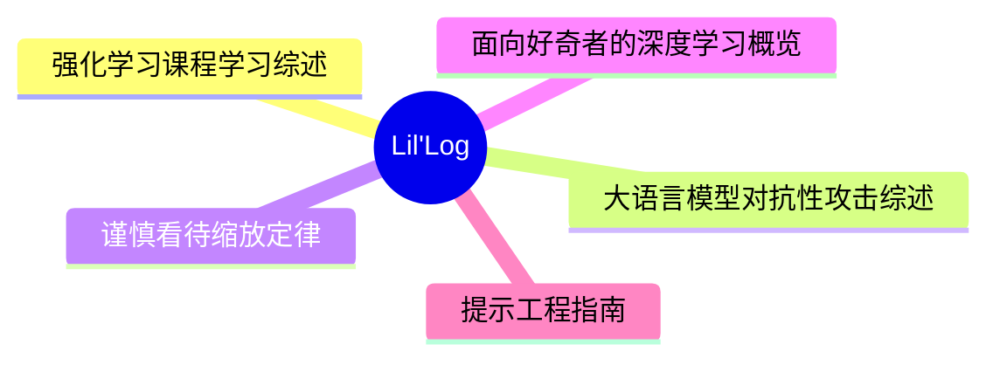
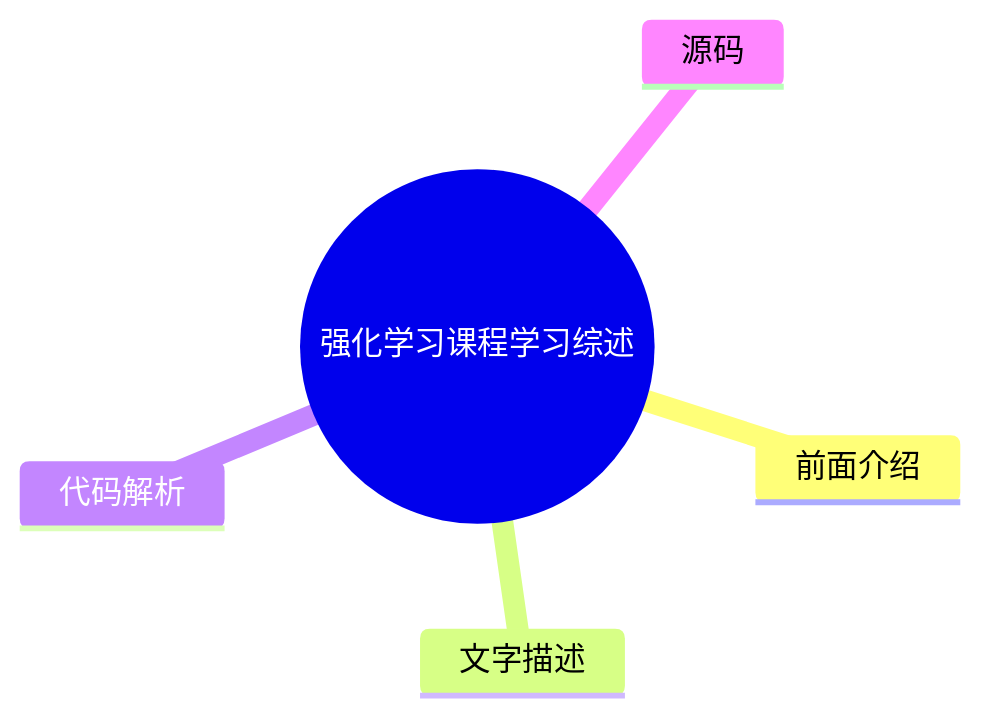
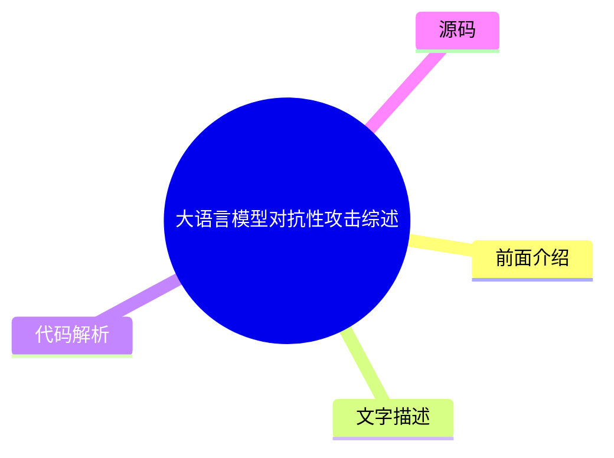
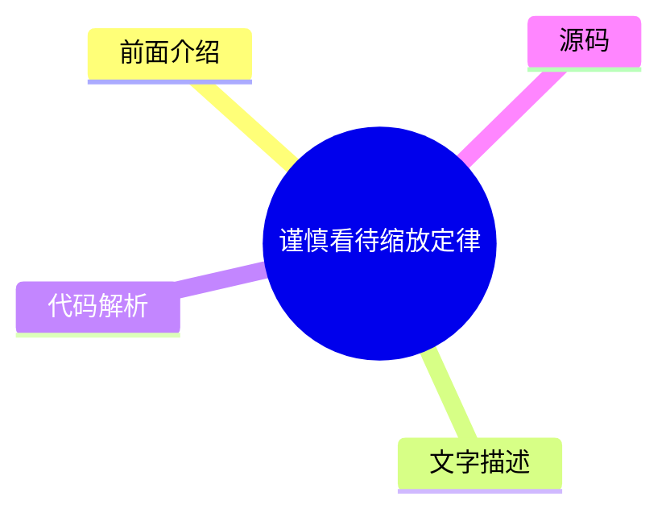
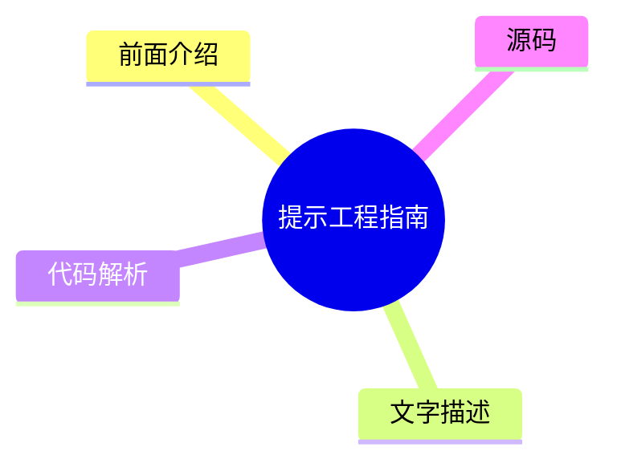

# 🧪 Lil'Log Top 5 (2026-07-30)

## 前面介绍

- 数据源：Lil'Log
- 抓取日期：2026-07-30
- 条目数：5
- 含完整正文：5
- 含代码片段：1
- 组织方式：前面介绍 / 树状图 / 文字描述 / 代码解析 / 源码

## 思维导图



## 详细整理（5 条，5 条含全文，1 条含代码）

### 1. 强化学习课程学习综述
- **链接**: [https://lilianweng.github.io/posts/2020-01-29-curriculum-rl/](https://lilianweng.github.io/posts/2020-01-29-curriculum-rl/)
- **发布**: Wed, 29 Jan 2020 00:00:00 +0000

#### 前面介绍

- 课程学习通过逐步增加任务难度来加速模型收敛
- 早期神经网络的语法学习证明了从简单到复杂训练的重要性
- 设计有效的课程策略比单纯增加数据量更具挑战性

#### 树状图



#### 文字描述

- Elman (1993) 提出通过限制简单数据并逐步增加复杂度来训练神经网络，解决了早期模型无法学习的问题。
- Bengio 等人 (2009) 提出了课程学习的两个核心假设：更清洁的示例能带来更好的泛化能力，以及引入更难示例能加速在线训练。
- Zaremba 和 Sutskever (2014) 的实验表明，单纯增加复杂度的朴素课程策略不如混合策略有效，混合策略有助于避免模型遗忘。
- Weinshall 等人 (2018) 提出使用预训练模型的最小损失来量化任务难度，从而对训练样本进行排序，构建有效的课程。
- 程序化内容生成 (PCG) 是一种通过算法随机性和人类专家知识创建不同难度游戏关卡的方法，常用于课程学习研究。

#### 代码解析

- 本文未提供源码，以下为实现思路或结构解析：
1. 定义任务复杂度的量化指标（如代码长度、嵌套深度或预训练损失）。
2. 实现课程调度器，按照预设策略（如先增加长度再增加嵌套，或随机混合）生成训练批次。
3. 在训练过程中动态调整批次难度，观察收敛速度和最终性能的变化。

#### 源码

#### 中文节选

[Updated on 2020-02-03: mentioning [PCG](#pcg) in the “Task-Specific Curriculum” section.

[Updated on 2020-02-04: Add a new [“curriculum through distillation”](#curriculum-through-distillation) section.

It sounds like an impossible task if we want to teach integral or derivative to a 3-year-old who does not even know basic arithmetics. That’s why education is important, as it provides a systematic way to break down complex knowledge and a nice curriculum for teaching concepts from simple to hard. A curriculum makes learning difficult things easier and approachable for us humans. But, how about machine learning models? Can we train our models more efficiently with a curriculum? Can we design a curriculum to speed up learning?

Back in 1993, Jeffrey Elman has proposed the idea of training neural networks with a curriculum. His early work on learning simple language grammar demonstrated the importance of such a strategy: starting with a restricted set of simple data and gradually increasing the complexity of training samples; otherwise the model was not able to learn at all.

Compared to training without a curriculum, we would expect the adoption of the curriculum to expedite the speed of convergence and may or may not improve the final model performance. To design an efficient and effective curriculum is not easy. Keep in mind that, a bad curriculum may even hamper learning.

Next, we will look into several categories of curriculum learning, as illustrated in Most cases are applied to Reinforcement Learning, with a few exceptions on Supervised Learning.

In “The importance of starting small” paper ([Elman 1993](http://citeseerx.ist.psu.edu/viewdoc/download?doi=10.1.1.128.4487&rep=rep1&type=pdf)), I especially like the starting sentences and find them both inspiring and affecting:


“人类在许多维度上与其他物种不同，但有两个维度尤为显著。人类表现出非凡的学习能力；而人类的显著之处在于，达到成熟所需的时间 unusually 长。学习的适应优势是显而易见的，并且可以说，通过文化，学习为非基于基因的行为传递奠定了基础，这可能加速了我们物种的进化。”

确实，学习可能是我们人类拥有的最好的超能力。

# Task-Specific Curriculum[#](#task-specific-curriculum)

[Bengio, et al. (2009)](https://www.researchgate.net/profile/Y_Bengio/publication/221344862_Curriculum_learning/links/546cd2570cf2193b94c577ac/Curriculum-learning.pdf) 在过去提供了关于课程学习的良好概述。该论文提出了两个观点，并使用手动设计的任务特定课程进行了玩具实验：

- 更清洁的示例可能更快地产生更好的泛化能力。
- 逐渐引入更困难的示例可以加速在线训练。

某些课程策略可能是无用甚至有害的。该领域需要回答的一个好问题是：*什么可能

#### 完整正文（中文）

[Updated on 2020-02-03: 在“任务特定课程”部分提及了 [PCG](#pcg)。

[Updated on 2020-02-04: 新增了一个 [“通过蒸馏进行课程学习”](#curriculum-through-distillation) 部分。

如果我们想教一个连基本算术都不知道的 3 岁孩子积分或导数，这听起来像是一项不可能完成的任务。这就是为什么教育很重要的原因，因为它提供了一种系统性的方法来分解复杂的知识，并为从简单到困难地教授概念提供了一个很好的课程。课程让学习困难的事情对我们人类来说变得更容易、更易于接受。但是，机器学习模型呢？我们能通过课程学习更高效地训练模型吗？我们可以设计一个课程来加速学习吗？

早在 1993 年，Jeffrey Elman 就提出了通过课程学习训练神经网络的想法。他在学习简单语言语法方面的早期工作证明了这种策略的重要性：从一组受限的简单数据开始，并逐渐增加训练样本的复杂性；否则，模型根本无法学习。

与没有课程的学习相比，我们预计采用课程学习将加快收敛速度，并且可能会或可能不会提高最终模型的性能。设计一个高效且有效的课程并不容易。请记住，糟糕的课程甚至可能会阻碍学习。

接下来，我们将研究几类课程学习，如图所示。大多数情况应用于强化学习，监督学习仅有少数例外。

在“The importance of starting small”论文（[Elman 1993](http://citeseerx.ist.psu.edu/viewdoc/download?doi=10.1.1.128.4487&rep=rep1&type=pdf)）中，我特别喜欢开篇的句子，发现它们既鼓舞人心又引人深思：

人类在其他许多维度上与其他物种不同，但有两个维度尤为显著。人类表现出非凡的学习能力；而且，人类在达到成熟期所需的 unusually 长时间方面也令人瞩目。学习的适应性优势是显而易见的，并且可以说，通过文化，学习为基于非遗传的行为传递奠定了基础，这可能会加速我们物种的进化。

确实，学习可能是我们人类拥有的最好超能力。

# 面向任务的课程[#](#task-specific-curriculum)

[Bengio 等人 (2009)](https://www.researchgate.net/profile/Y_Bengio/publication/221344862_Curriculum_learning/links/546cd2570cf2193b94c577ac/Curriculum-learning.pdf) 在过去提供了关于课程学习的良好概述。该论文提出了两个观点，并使用手动设计的面向任务的课程进行了玩具实验：

- 清洁的示例可能更快地产生更好的泛化能力。
- 逐渐引入更困难的示例可以加速在线训练。

某些课程策略可能是无用的，甚至是有害的。该领域一个值得回答的好问题是：*是什么通用原则使得某些课程策略比其他策略效果更好？* Bengio 2009 年的论文假设，让学习专注于“有趣”的示例（既不太难也不太容易）将是有益的。

如果我们的朴素课程是对样本进行逐渐增加复杂度的训练，我们需要一种方法来量化任务的难度。一个想法是使用其在另一个模型上的最小损失，而该模型在其他任务上进行了预训练（[Weinshall 等人 2018](https://arxiv.org/abs/1802.03796)）。通过这种方式，预训练模型的知识可以通过建议训练样本的排名来转移到新模型上。图 2 展示了 `curriculum` 组（绿色）相对于 `control`（随机顺序；黄色）和 `anti`（反转顺序；红色）组的有效性。

[Zaremba & Sutskever (2014)](https://arxiv.org/abs/1410.4615) 做了一个有趣的实验，训练 LSTM 来预测短 Python 程序的输出，该程序用于数学运算，而无需实际执行代码。他们发现课程学习对于学习是必要的。程序的复杂性由两个参数控制，`length` ∈ [1, a] 和 `nesting`∈ [1, b]。考虑了三种策略：

- **朴素课程**：首先增加 `length` 直到达到 `a`；然后增加 `nesting` 并将 `length` 重置为 1；重复此过程直到两者都达到最大值。
- **混合课程**：采样 `length`~ [1, a] 和 `nesting`~ [1, b]
- **组合**：朴素 + 混合。

他们注意到组合策略总是优于朴素课程，并且通常（但并非总是）优于混合策略——这表明在训练中混合简单任务对于 *避免遗忘* 非常重要。

[Procedural content generation (][PCG](https://en.wikipedia.org/wiki/Procedural_generation)) is a popular approach for creating video games of various levels of difficulty. PCG involves algorithmic randomness and a heavy dose of human expertise in designing game elements and dependencies among them. Procedurally generated levels have been introduced into several benchmark environments for evaluating whether an RL agent can generalize to a new level that it is not trained on ([meta-RL](https://lilianweng.github.io/posts/2019-06-23-meta-rl/)!), such as [GVGAI](http://www.gvgai.net/), OpenAI [CoinRun](https://openai.com/blog/quantifying-generalization-in-reinforcement-learning/) and [Procgen benchmark](https://openai.com/blog/procgen-benchmark/). Using GVGAI, [Justesen, et al. (2018)](https://arxiv.org/abs/1806.10729) demonstrated that an RL policy can easily overfit to a specific game but training over a simple curriculum that grows the task difficulty together with the model performance helps its generalization to new human-designed levels. Similar results are also found in CoinRun ([Cobbe, et al. 2018](https://arxiv.org/abs/1812.02341)). POET ([Wang et al, 2019](https://arxiv.org/abs/1901.01753)) is another example for leveraging evolutionary algorithm and procedural generated game levels to improve RL generalization, which I’ve described in details in my [meta-RL post](https://lilianweng.github.io/posts/2019-06-23-meta-rl/#evolutionary-algorithm-on-environment-generation).

To follow the curriculum learning approaches described above, generally we need to figure out two problems in the training procedure:

- Design a metric to quantify how hard a task is so that we can sort tasks accordingly.
- Provide a sequence of tasks with an increasing level of difficulty to the model during training.


However, the order of tasks does not have to be sequential. In our Rubik’s cube paper ([OpenAI et al, 2019](https://arxiv.org/abs/1910.07113.)), we depended on *Automatic domain randomization* (**ADR**) to generate a curriculum by growing a distribution of environments with increasing complexity. The difficulty of each task (i.e. solving a Rubik’s cube in a set of environments) depends on the randomization ranges of various environmental parameters. Even with a simplified assumption that all the environmental parameters are uncorrelated, we were able to create a decent curriculum for our robot hand to learn the task.

# Teacher-Guided Curriculum[#](#teacher-guided-curriculum)

[The idea of ]*Automatic Curriculum Learning* was proposed by [Graves, et al. 2017](https://arxiv.org/abs/1704.03003) slightly earlier. It considers a $N$-task curriculum as an [$N$-armed bandit](https://lilianweng.github.io/posts/2018-01-23-multi-armed-bandit/) problem and an adaptive policy which learns to optimize the returns from this bandit.

Two categories of learning signals have been considered in the paper:

- Loss-driven progress: the loss function change before and after one gradient update. This type of reward signals tracks the speed of the learning process, because the greatest task loss decrease is equivalent to the fastest learning.
- Complex-driven progress: the KL divergence between posterior and prior distribution over network weights. This type of learning signals are inspired by the [MDL](https://en.wikipedia.org/wiki/Minimum_description_length)principle, “increasing the model complexity by a certain amount is only worthwhile if it compresses the data by a greater amount”. The model complexity is therefore expected to increase most in response to the model nicely generalizing to training examples.


[This framework of proposing curriculum automatically through another RL agent was formalized as ]*Teacher-Student Curriculum Learning* (**TSCL**; [Matiisen, et al. 2017](https://arxiv.org/abs/1707.00183)). In TSCL, a *student* is an RL agent working on actual tasks while a *teacher* agent is a policy for selecting tasks. The student aims to master a complex task that might be hard to learn directly. To make this task easier to learn, we set up the teacher agent to guide the student’s training process by picking proper sub-tasks.

In the process, the student should learn tasks which:

- can help the student make fastest learning progress, or
- are at risk of being forgotten.

Note: The setup of framing the teacher model as an RL problem feels quite similar to Neural Architecture Search (NAS), but differently the RL model in TSCL operates on the task space and NAS operates on the main model architecture space.


Training the teacher model is to solve a [POMDP](https://en.wikipedia.org/wiki/Partially_observable_Markov_decision_process) problem:

- The unobserved $s_t$ is the full state of the student model.
- The observed $o = (x_t^{(1)}, \dots, x_t^{(N)})$ are a list of scores for $N$ tasks.
- The action $a$ is to pick on subtask.
- The reward per step is the score delta.$r_t = \sum_{i=1}^N x_t^{(i)} - x_{t-1}^{(i)}$ (i.e., equivalent to maximizing the score of all tasks at the end of the episode).

The method of estimating learning progress from noisy task scores while balancing exploration vs exploitation can be borrowed from the non-stationary multi-armed bandit problem — use [ε-greedy](https://lilianweng.github.io/posts/2018-01-23-multi-armed-bandit/#%CE%B5-greedy-algorithm), or [Thompson sampling](https://lilianweng.github.io/posts/2018-01-23-multi-armed-bandit/#thompson-sampling).

The core idea, in summary, is to use one policy to propose tasks for another policy to learn better. Interestingly, both works above (in the discrete task space) found that uniformly sampling from all tasks is a surprisingly strong benchmark.


What if the task space is continuous? [Portelas, et al. (2019)](https://arxiv.org/abs/1910.07224) studied a continuous teacher-student framework, where the teacher has to sample parameters from continuous task space to generate a learning curriculum. Given a newly sampled parameter $p$, the absolute learning progress (short for ALP) is measured as $\text{ALP}_p = \vert r - r_\text{old} \vert$, where $r$ is the episodic reward associated with $p$ and $r_\text{old}$ is the reward associated with $p_\text{old}$. Here, $p_\text{old}$ is a previous sampled parameter closest to $p$ in the task space, which can be retrieved by nearest neighbor. Note that how this ALP score is different from learning signals in [TSCL](#TSCL) or [Grave, et al. 2017](#grave-et-al-2017) above: ALP score measures the reward difference between two tasks rather than performance at two time steps of the same task.

On top of the task parameter space, a Gaussian mixture model is trained to fit the distribution of $\text{ALP}_p$ over $p$. ε-greedy is used when sampling the tasks: with some probability, sampling a random task; otherwise sampling proportionally to ALP score from the GMM model.

# Curriculum through Self-Play[#](#curriculum-through-self-play)

Different from the teacher-student framework, two agents are doing very different things. The teacher learns to pick a task for the student without any knowledge of the actual task content. What if we want to make both train on the main task directly? How about even make them compete with each other?

[Sukhb

...（截断，原文 31549+ 字符）


### 2. 大语言模型对抗性攻击综述
- **链接**: [https://lilianweng.github.io/posts/2023-10-25-adv-attack-llm/](https://lilianweng.github.io/posts/2023-10-25-adv-attack-llm/)
- **发布**: Wed, 25 Oct 2023 00:00:00 +0000

#### 前面介绍

- 对抗性攻击旨在通过输入微小扰动触发模型输出不受控内容
- 文本攻击比图像攻击更具挑战性，因为缺乏直接的梯度信号
- 攻击类型包括令牌操作、基于梯度的攻击、越狱提示和红队测试

#### 树状图



#### 文字描述

- 威胁模型分为分类任务和文本生成任务。分类任务关注输入扰动导致输出错误，生成任务关注模型输出违反安全行为。
- 白盒攻击假设攻击者拥有模型权重和架构信息，可利用梯度信号；黑盒攻击仅通过 API 交互，不暴露内部信息。
- 令牌操作攻击通过替换同义词或微调少量令牌来触发模型失败，这种方法在黑盒设置下非常有效。
- 基于梯度的攻击利用模型对输入的敏感性，通过优化算法寻找对抗性扰动。
- 越狱提示通常基于启发式规则，旨在绕过模型内置的安全对齐机制。

#### 代码解析

- 本文未提供源码，以下为实现思路或结构解析：
1. 实现令牌替换或插入逻辑，保持语义不变但改变模型预测。
2. 使用梯度下降或优化算法计算对抗性扰动，需处理离散数据的梯度问题。
3. 构建红队测试框架，结合人类评估或自动化分类器判断攻击是否成功。

#### 源码

#### 中文节选

The use of large language models in the real world has strongly accelerated by the launch of ChatGPT. We (including my team at OpenAI, shoutout to them) have invested a lot of effort to build default safe behavior into the model during the alignment process (e.g. via [RLHF](https://openai.com/research/learning-to-summarize-with-human-feedback)). However, adversarial attacks or jailbreak prompts could potentially trigger the model to output something undesired.

A large body of ground work on adversarial attacks is on images, and differently it operates in the continuous, high-dimensional space. Attacks for discrete data like text have been considered to be a lot more challenging, due to lack of direct gradient signals. My past post on [Controllable Text Generation](https://lilianweng.github.io/posts/2021-01-02-controllable-text-generation/) is quite relevant to this topic, as attacking LLMs is essentially to control the model to output a certain type of (unsafe) content.

There is also a branch of work on attacking LLMs to extract pre-training data, private knowledge ([Carlini et al, 2020](https://arxiv.org/abs/2012.07805)) or attacking model training process via data poisoning ([Carlini et al. 2023](https://arxiv.org/abs/2302.10149)). We would not cover those topics in this post.

# Basics[#](#basics)

## Threat Model[#](#threat-model)

Adversarial attacks are inputs that trigger the model to output something undesired. Much early literature focused on classification tasks, while recent effort starts to investigate more into outputs of generative models. In the context of large language models In this post we assume the attacks only happen **at inference time**, meaning that **model weights are fixed**.

### Classification[#](#classification)

Adversarial attacks on classifiers have attracted more attention in the research community in the past, many in the image domain. LLMs can be used for classification too. Given an input $\mathbf{x}$ and a classifier $f(.)$, we would like to find an adversarial version of the input, denoted as $\mathbf{x}_\text{adv}$, with imperceptible difference from $\mathbf{x}$, such that $f(\mathbf{x}) \neq f(\mathbf{x}_\text{adv})$.


### Text Generation[#](#text-generation)

Given an input $\mathbf{x}$ and a generative model $p(.)$, we have the model output a sample $\mathbf{y} \sim p(.\vert\mathbf{x})$ . An adversarial attack would identify such $p(\mathbf{x})$ that $\mathbf{y}$ would violate the built-in safe behavior of the model $p$; E.g. output unsafe content on illegal topics, leak private information or model training data. For generative tasks, it is not easy to judge the success of an attack, which demands a super high-quality classifier to judge whether $\mathbf{y}$ is unsafe or human review.

### White-box vs Black-box[#](#white-box-vs-black-box)

White-box attacks assume that attackers have full access to the model weights, architecture and training pipeline, such that attackers can obtain gradient signals

#### 完整正文（中文）

The use of large language models in the real world has strongly accelerated by the launch of ChatGPT. We (including my team at OpenAI, shoutout to them) have invested a lot of effort to build default safe behavior into the model during the alignment process (e.g. via [RLHF](https://openai.com/research/learning-to-summarize-with-human-feedback)). However, adversarial attacks or jailbreak prompts could potentially trigger the model to output something undesired.

A large body of ground work on adversarial attacks is on images, and differently it operates in the continuous, high-dimensional space. Attacks for discrete data like text have been considered to be a lot more challenging, due to lack of direct gradient signals. My past post on [Controllable Text Generation](https://lilianweng.github.io/posts/2021-01-02-controllable-text-generation/) is quite relevant to this topic, as attacking LLMs is essentially to control the model to output a certain type of (unsafe) content.

There is also a branch of work on attacking LLMs to extract pre-training data, private knowledge ([Carlini et al, 2020](https://arxiv.org/abs/2012.07805)) or attacking model training process via data poisoning ([Carlini et al. 2023](https://arxiv.org/abs/2302.10149)). We would not cover those topics in this post.

# Basics[#](#basics)

## Threat Model[#](#threat-model)

Adversarial attacks are inputs that trigger the model to output something undesired. Much early literature focused on classification tasks, while recent effort starts to investigate more into outputs of generative models. In the context of large language models In this post we assume the attacks only happen **at inference time**, meaning that **model weights are fixed**.

### Classification[#](#classification)

Adversarial attacks on classifiers have attracted more attention in the research community in the past, many in the image domain. LLMs can be used for classification too. Given an input $\mathbf{x}$ and a classifier $f(.)$, we would like to find an adversarial version of the input, denoted as $\mathbf{x}_\text{adv}$, with imperceptible difference from $\mathbf{x}$, such that $f(\mathbf{x}) \neq f(\mathbf{x}_\text{adv})$.


### Text Generation[#](#text-generation)

Given an input $\mathbf{x}$ and a generative model $p(.)$, we have the model output a sample $\mathbf{y} \sim p(.\vert\mathbf{x})$ . An adversarial attack would identify such $p(\mathbf{x})$ that $\mathbf{y}$ would violate the built-in safe behavior of the model $p$; E.g. output unsafe content on illegal topics, leak private information or model training data. For generative tasks, it is not easy to judge the success of an attack, which demands a super high-quality classifier to judge whether $\mathbf{y}$ is unsafe or human review.

### White-box vs Black-box[#](#white-box-vs-black-box)

White-box attacks assume that attackers have full access to the model weights, architecture and training pipeline, such that attackers can obtain gradient signals. We don’t assume attackers have access to the full training data. This is only possible for open-sourced models. Black-box attacks assume that attackers only have access to an API-like service where they provide input $\mathbf{x}$ and get back sample $\mathbf{y}$, without knowing further information about the model.

# Types of Adversarial Attacks[#](#types-of-adversarial-attacks)

There are various means to find adversarial inputs to trigger LLMs to output something undesired. We present five approaches here.

| Attack | Type | Description | 
|---|---|---|
| Token manipulation | Black-box | Alter a small fraction of tokens in the text input such that it triggers model failure but still remain its original semantic meanings. | 
| Gradient based attack | White-box | Rely on gradient signals to learn an effective attack. | 
| Jailbreak prompting | Black-box | Often heuristic based prompting to “jailbreak” built-in model safety. | 
| Human red-teaming | Black-box | Human attacks the model, with or without assist from other models. | 
| Model red-teaming | Black-box | Model attacks the model, where the attacker model can be fine-tuned. | 

## Token Manipulation[#](#token-manipulation)


给定一段包含一系列 token 的文本输入，我们可以应用简单的 token 操作，如同义词替换，来触发模型做出错误的预测。基于 token 操作的攻击在 **黑盒** 设置下有效。Python 框架 TextAttack ([Morris et al. 2020](https://arxiv.org/abs/2005.05909)) 实现了许多单词和 token 操作攻击方法，用于为 NLP 模型创建对抗样本。该领域的大多数工作都针对分类和蕴含预测进行了实验。

[Ribeiro et al (2018)](https://www.aclweb.org/anthology/P18-1079/) 依赖手动提出的语义等价对抗规则 (SEARs) 来进行最小化的 token 操作，从而使模型无法生成正确的答案。示例规则包括 (*What NOUN→Which NOUN*), (*WP is → WP’s’was→is*), 等。对抗操作后的语义等价性通过回译进行检查。这些规则是通过相当手动、启发式的过程提出的，而 SEARs 探测的模型“漏洞”类型仅限于对最小 token 变化的敏感性，随着基础 LLM 能力的增强，这不应成为问题。

相比之下，[EDA](https://lilianweng.github.io/posts/2022-04-15-data-gen/#EDA) (Easy Data Augmentation; [Wei & Zou 2019](https://arxiv.org/abs/1901.11196)) 定义了一组简单且更通用的操作来增强文本：同义词替换、随机插入、随机交换或随机删除。研究表明，EDA 增强可以提高多个基准测试的分类准确率。

TextFooler ([Jin et al. 2019](https://arxiv.org/abs/1907.11932)) 和 [BERT-Attack (][Li et al. 2020](https://aclanthology.org/2020.emnlp-main.500.pdf)) 遵循相同的过程：首先识别出最重要且脆弱的单词，这些单词最能改变模型预测，然后以某种方式替换这些单词。

给定分类器 $f$ 和输入文本字符串 $\mathbf{x}$，每个单词的重要性分数可以通过以下方式测量：

其中 $f_y$ 是标签 $y$ 的预测对数几率，$x_{\setminus w_i}$ 是排除目标词 $w_i$ 的输入文本。重要性高的词是很好的替换候选词，但应跳过停用词，以避免破坏语法。

TextFooler 首先根据词嵌入余弦相似度用顶级同义词替换这些词，然后通过检查替换词是否仍具有相同的词性标注以及句子级相似度是否高于阈值来进行进一步过滤。BERT-Attack 则通过 BERT 用语义相似的词替换词，因为上下文感知预测是掩码语言模型非常自然的用例。通过这种方式发现的对抗样本在不同模型之间具有一定的迁移性，具体取决于模型和任务。

## 基于梯度的攻击[#](#gradient-based-attacks)

在白盒设置中，我们可以完全访问模型参数和架构。因此，我们可以依靠梯度下降来编程学习最有效的攻击。基于梯度的攻击仅在白盒设置中有效，例如对于开源大语言模型。

**GBDA**（“基于梯度的分布攻击”；[Guo et al. 2021](https://arxiv.org/abs/2104.13733)）使用 Gumbel-Softmax 近似技巧来*使对抗损失优化可微*，其中使用 BERTScore 和困惑度来保证可感知性和流畅性。给定一个令牌输入 $\mathbf{x}=[x_1, x_2 \dots x_n]$，其中令牌 $x_i$ 可以从分类分布 $P_\Theta$ 中采样，其中 $\Theta \in \mathbb{R}^{n \times V}$ 且 $V$ 是令牌词表大小。考虑到 $V$ 通常约为 $O(10,000)$ 且大多数对抗示例只需要替换几个令牌，它具有高度过参数化的特征。我们有：

$$ x_i \sim P_{\Theta_i} = \text{Categorical}(\pi_i) = \text{Categorical}(\text{Softmax}(\Theta_i)) $$

其中 $\pi_i \in \mathbb{R}^V$ 是第 $i$ 个 token 的 token 概率向量。要最小化的对抗目标函数是让分类器 $f$ 对输入 $\mathbf{X}$ 产生不同于正确标签 $y$ 的错误标签：$\min_{\Theta \in \mathbb{R}^{n \times V}} \mathbb{E}_{\mathbf{x} \sim P_{\Theta}} \mathcal{L}_\text{adv}(\mathbf{X}, y; f)$。然而，由于类别分布的存在，表面上这不可微。使用 Gumbel-softmax 近似（[Jang et al. 2016](https://arxiv.org/abs/1611.01144)），我们通过 $\tilde{\boldsymbol{\pi}}$ 从 Gumbel 分布 $\tilde{P}_\Theta$ 近似类别分布：

其中 $g_{ij} \sim \text{Gumbel}(0, 1)$；温度 $\tau > 0$ 控制分布的平滑度。

Gumbel 分布用于对样本数量（无论其分布如何）的*极端*值、最大值或最小值进行建模。额外的 Gumbel 噪声引入了模仿从类别分布采样的随机决策过程。

低温度 $\tau \to 0$ 推动收敛到类别分布，因为使用温度为 0 的 softmax 进行采样是确定性的。“采样”部分仅取决于 $g_{ij}$ 的值，该值主要围绕 0 中心。

设 $\mathbf{e}_j$ 为 token $j$ 的嵌入表示。我们可以用 $\bar{e}(\tilde{\boldsymbol{\pi}})$ 近似 $\mathbf{x}$，这是与 token 概率对应的嵌入向量的加权平均：$\bar{e}(\pi_i) = \sum_{j=1}^V \pi_i^{(j)} \mathbf{e}_j$。请注意，当 $\pi_i$ 是对应于 token $x_i$ 的独热向量时，我们将有 $\bar{e}(\pi_i) = \mathbf{e}_{z_i}$。结合嵌入表示和 Gumbel-softmax 近似，我们有一个可微的目标函数来最小化：$\min_{\Theta \in \mathbb{R}^{n \times V}} \mathbb{E}_{\tilde{\boldsymbol{\pi}} \sim \tilde{P}_{\Theta}} \mathcal{L}_\text{adv}(\bar{e}(\tilde{\boldsymbol{\pi}}), y; f)$。

Meanwhile, it is also easy to apply differentiable soft constraints with white-box attacks. GBDA experimented with (1) a soft fluency constraint using NLL (negative log-likelihood) and (2) BERTScore (*“a similarity score for evaluating text generation that captures the semantic similarity between pairwise tokens in contextualized embeddings of a transformer model.”*; [Zhang et al. 2019](https://arxiv.org/abs/1904.09675)) to measure similarity between two text inputs to ensure the perturbed version does not diverge from the original version too much. Combining all constraints, the final objective function is as follows, where $\lambda_\text{lm}, \lambda_\text{sim} > 0$ are preset hyperparameters to control the strength of soft constraints:

Gumbel-softmax tricks are hard to be extended to token deletion or addition and thus it is restricted to only token replacement operations, not deletion or addition.

**HotFlip** ([Ebrahimi et al. 2018](https://arxiv.org/abs/1712.06751)) treats text operations as inputs in the vector space and measures the derivative of loss with regard to these vectors. Here let’s assume the input vector is a matrix of character-level one-hot encodings, $\mathbf{x} \in {0, 1}^{m \times n \times V}$ and $\mathbf{x}_{ij} \in {0, 1}^V$, where $m$ is the maximum number of words, $n$ is the maximum number of characters per word and $V$ is the alphabet size. Given the original input vector $\mathbf{x}$, we construct a new vector $\mathbf{x}_{ij, a\to b}$ with the $j$-th character of the $i$-th word changing from $a \to b$, and thus we have $x_{ij}^{(a)} = 1$ but $x_{ij, a\to b}^{(a)} = 0, x_{ij, a\to b}^{(b)} = 1$.

The change in loss according to first-order Taylor expansion is:

This objective is optimized to select the vector to minimize the adversarial loss using only one backward propagation.

To apply multiple flips, we can run a beam search of $r$ steps of th

...（截断，原文 46582+ 字符）


### 3. 谨慎看待缩放定律
- **链接**: [https://lilianweng.github.io/posts/2026-06-24-scaling-laws/](https://lilianweng.github.io/posts/2026-06-24-scaling-laws/)
- **发布**: Wed, 24 Jun 2026 00:00:00 +0000

#### 前面介绍

- 缩放定律描述了模型大小、数据量和计算量与训练损失之间的幂律关系
- 早期研究通过贝叶斯方法推导了不同学习曲线下的误差缩放规律
- 模型架构变化通常只影响缩放定律的截距，而不改变指数

#### 树状图



#### 文字描述

- 缩放定律是深度学习中最关键的实证发现之一，它表明随着模型参数 N、数据量 D 和计算量 C 的增加，训练损失 L 会按幂律曲线下降。
- Amari 等人 (1992) 通过贝叶斯方法推导了四种学习曲线，包括确定性算法、噪声数据和随机算法，均遵循幂律关系。
- Hestness 等人 (2017) 在多个深度学习领域观察到泛化误差随数据规模呈幂律缩放，且模型改进只改变曲线位置。
- Rosenfeld 等人 (2020) 提出了联合模型大小和数据规模的误差预测模型，通过拟合小规模实验数据来预测大规模配置的性能。
- 缩放定律的核心在于如何在不同因素间分配计算资源，以实现最优的损失降低。

#### 代码解析

- 本文未提供源码，以下为实现思路或结构解析：
1. 收集不同模型规模和数据规模的训练损失数据。
2. 拟合幂律函数 L = A * (N^alpha + D^beta) + E，确定参数 A、alpha、beta 和 E。
3. 利用拟合结果预测更大规模模型的训练需求，指导资源分配。

#### 源码

#### 中文节选

Scaling laws are one of the most critical empirical findings in deep learning. The observation is simple in form: the training loss $L$ decreases predictably as we scale up model size $N$, dataset size $D$, and compute $C$, following a power-law curve, which appears as a straight line on a log-log plot. We can view scaling laws as a framework for describing the relationship between compute, loss, model size and data; at its core, it is about how to allocate precious compute optimally between $N$ and $D$.

This predictability makes scaling laws highly valuable in practice. A common workflow is to fit scaling laws on a handful of small runs and then extrapolate to estimate the token and compute requirements for larger models.

| Symbol | Note | 
|---|---|
| $N$ | Model size, measured in parameter count. | 
| $D$ | Training dataset size, usually measured in token count. | 
| $C$ | Training compute in FLOPs. As a useful approximation, $C \approx 6ND$ ( [Kaplan et al. 2020](https://arxiv.org/abs/2001.08361)), where $2ND$ accounts for the forward pass and $4ND$ for backpropagation. | 
| $E$ | Irreducible loss | 
| $L, \hat{L}(.)$ | Test loss / test loss prediction function; can also refer to training loss, since they are strongly correlated. | 
| $\epsilon$ | Generalization error. | 

# Early days: ML loss predictability[#](#early-days-ml-loss-predictability)

The predictability of generalization error with scale had already been investigated before scaling laws became a mainstream concept.

[Amari et al. (1992)](https://ieeexplore.ieee.org/document/6796972) derived four types of learning curves using a Bayesian approach and the annealed approximation.

- Deterministic learning algorithm, noiseless data, one unique solution: $\epsilon \sim c \cdot D^{-1}$, where $c$ is some constant.
- Deterministic learning algorithm, noiseless data, multiple equivalent solutions: $\epsilon \sim c \cdot D^{-2}$; the learning is faster with each new data point, because the model only learns the optimal manifold of parameters, instead of finding the single solution point.

- 确定性学习算法，噪声数据：$\epsilon \sim c \cdot D^{-1/2}$；数据中的噪声使学习变得更困难。
- 随机学习算法，噪声数据：$\epsilon \sim c \cdot D^{-1} + E$；这里的不可约损失 $E$ 是随机学习器无法进一步降低的残差误差，例如当模型在大数据上耗尽容量时。所有四种类型的学习曲线都遵循幂律：

其中 $E$ 可以是 0，且 $\alpha = -2, -1, -1/2$。尽管它们的理论设定基于简化的二分类任务，但这为构建经验式机器学习损失预测模型指明了一个有用的方向。

[Hestness et al. (2017)](https://arxiv.org/abs/1712.00409) 最早期的经验研究之一解释了泛化误差、模型大小和数据之间的关系。对于给定的训练数据大小，他们通过网格搜索确定了最佳拟合模型大小，然后绘制

#### 完整正文（中文）

缩放定律是深度学习中最关键的实证发现之一。其观察结果形式简单：随着模型大小 $N$、数据集大小 $D$ 和计算量 $C$ 的增加，训练损失 $L$ 遵循幂律曲线呈可预测地下降，这在双对数图上表现为一条直线。我们可以将缩放定律视为描述计算量、损失、模型大小和数据之间关系的框架；其核心在于如何在这两者之间最优地分配宝贵的计算资源。

这种可预测性使缩放定律在实践中极具价值。常见的工作流程是在少量小规模运行中拟合缩放定律，然后进行外推，以估算更大模型的代币和计算需求。

| 符号 | 备注 |
|---|---|
| $N$ | 模型大小，以参数数量衡量。 |
| $D$ | 训练数据集大小，通常以代币数量衡量。 |
| $C$ | 以 FLOPs 为单位的训练计算量。作为一个有用的近似，$C \approx 6ND$（[Kaplan 等人 2020](https://arxiv.org/abs/2001.08361)），其中 $2ND$ 用于前向传播，$4ND$ 用于反向传播。 |
| $E$ | 不可约损失 |
| $L, \hat{L}(.)$ | 测试损失 / 测试损失预测函数；也可以指训练损失，因为它们之间有很强的相关性。 |
| $\epsilon$ | 泛化误差。 |

# 早期：机器学习损失的可预测性[#](#early-days-ml-loss-predictability)

在缩放定律成为主流概念之前，泛化误差的可预测性就已经被研究过了。

[Amari 等人 (1992)](https://ieeexplore.ieee.org/document/6796972) 使用贝叶斯方法和退火近似推导出了四种类型的学习曲线。

- 确定性学习算法，无噪声数据，唯一解：$\epsilon \sim c \cdot D^{-1}$，其中 $c$ 是某个常数。
- 确定性学习算法，无噪声数据，多个等价解：$\epsilon \sim c \cdot D^{-2}$；随着每个新数据点的加入，学习速度更快，因为模型只学习参数的最优流形，而不是寻找单个解点。

- Deterministic learning algorithm, noisy data: $\epsilon \sim c \cdot D^{-1/2}$; noises in data make learning harder.
- Stochastic learning algorithm, noisy data: $\epsilon \sim c \cdot D^{-1} + E$; here the irreducible loss $E$ is the residual error that a stochastic learner cannot reduce further, for example when the model runs out of capacity on large data. All four types of learning curves follow a power law:

where $E$ can be 0 and $\alpha = -2, -1, -1/2$. Although their theoretical setup is based on a simplified binary classification task, it points in a useful direction for building empirical ML loss prediction models.

One of the earliest empirical studies by [Hestness et al. (2017)](https://arxiv.org/abs/1712.00409) explained the relationship between generalization error, model size and data. For a given training data size, they identified the best-fit model size via grid search and then plotted loss against training dataset size. Across four different domains in deep learning (neural machine translation, image classification, language modeling, and speech recognition), a recurring pattern was observed where:

- Generalization error scales as a power law across a set of factors (e.g. data size).
- Model improvements shift the error curve but do not seem to affect the power-law exponent.
- Interestingly, architecture changes the offset ($E$) of the power-law fit but does not change the exponent ($\alpha$). The slope of the power law appears to be a property of the problem domain rather than the model architecture.
- The number of model parameters $N$ needed to fit a dataset of size $D$ also scales as a power law.

A conceptual illustration breaks the learning curve into three stages. In the small-data region, when there are not enough learning signals, the model performs only slightly better than random guessing. In the middle (“power-law region”), we observe a power-law relationship between loss, data, and model size. The final irreducible-error region can be attributed to factors such as noise in the data.


[Rosenfeld 等人 (2020)](https://arxiv.org/abs/1909.12673) 进一步推进了这一工作，试图将误差建模为模型大小 $N$ 和数据大小 $D$ 的联合函数，涵盖了多种架构（ResNet、WRN、LSTM、Transformer）和优化器（Adam、SGD 变体）。实证观察表明，在固定一个轴的情况下，误差随另一个轴呈幂律衰减：

这可以合并为一个联合形式：

其中 $A > 0, B > 0, \alpha \geq 0, \beta \geq 0$ 是标量常数，且 $E$ 不依赖于 $N$ 或 $D$。

因此，他们可以构建一个简单的参数化函数形式的预测模型，其参数为 $\boldsymbol{\theta} = \langle A, B, E, \alpha, \beta \rangle$，仅通过在较小训练配置集 $(D, N)$ < 某些阈值上进行训练，即可预测 $(D, N)$ > 某些阈值时的预期损失。

旁注：这些早期工作依赖于经典学习理论直觉，如 [VC 维](https://en.wikipedia.org/wiki/Vapnik%E2%80%93Chervonenkis_dimension)（模型能够打散的最大点集的基数）作为容量的代理，但在现代深度学习工作中，VC 维往往过于粗糙，无法解释其行为，而经验幂律结果比理论提供的最坏情况界限要清晰得多，也更实用。

# 数据无限区域的缩放定律[#](#scaling-laws-in-data-infinite-region)

## Kaplan 等人的缩放定律[#](#kaplan-et-als-scaling-laws)

[Kaplan et al. (2020)](https://arxiv.org/abs/2001.08361) popularized the concept of scaling laws in the language modeling community. They found that the cross-entropy test loss $L$ scales as a power law with each of model size $N$ (excluding embedding layers), dataset size $D$, and training compute $C$ across many orders of magnitude. The findings are aligned with early work in the last section, but Kaplan et al. formalized the concept with a focus on Transformer language models and empirical experimentation at a larger scale, with model size ranging from 768M to 1.5B non-embedding parameters and dataset size from 22M to 23B tokens. All training runs in the paper used a learning rate schedule with a 3000 step linear warmup, followed by a cosine decay to zero.

List of key findings:

- The loss $L$ scales as a power law with $N$, $D$, and $C$ individually; for optimal performance all three must scale in tandem.
- Training curves follow predictable power laws whose parameters are roughly independent of model size.
- Larger models are more sample-efficient, meaning that they reach a given loss with fewer optimization steps and fewer data points than small models.
- Architectural details (width, aspect ratio, etc.) matter less than sheer scale.
- Train loss and test loss are positively correlated. (Sounds trivial but this is the foundation for pretraining work. On the other hand, whether pretraining loss improvement transfers to posttraining evaluation needs separate studies.)
- Given a fixed compute budget, it is more efficient to train a very large model and stop *before convergence*than to train a smaller model all the way to convergence.**This finding is where the Chinchilla scaling laws (the next section) disagree: Kaplan et al. overestimated the optimal model size as their fitted exponent was larger.**

They summarize the joint dependence on $N$ and $D$ in a single equation:


A nice consequence of this form is that the extent of overfitting (i.e. model is complex or data is small) depends predominantly on the ratio $N^{\alpha / \beta} / D$, which indicates that the data needs to grow in a specific proportion to the growth of the model size to avoid training being data-limited.

The most influential and, in hindsight, most contested conclusion was the compute-optimal allocation. Kaplan et al. found $N_\text{opt} \propto C^{0.73}$ and concluded that model size should grow faster than dataset size. Concretely, for a 10x increase in compute they suggested scaling the model size by ~5.5x but the training tokens by only ~1.8x. The Chinchilla paper would later overturn this recommendation, arguing that it leaves large models badly *undertrained*.

Another useful analysis in Kaplan et al. approximates the number of training FLOPs needed based on $D$ and $N$. Each multiply-add is counted as ~2 FLOPs.

Given a standard config where $d_\text{attn} = d_\text{model} = d_\text{ff}/4$, and excluding embedding layers from $N$ and the per-token forward compute:

Then we count backward-pass FLOPs as twice the forward-pass FLOPs, because backpropagation runs two matrix multiplications, for gradients with respect to the input activations and the weights, respectively. Thus, in total, the training FLOPs per token are approximately $6N$, and the total FLOPs for training over $D$ tokens are $C \approx 6ND$.

## Chinchilla Scaling Laws[#](#chinchilla-scaling-laws)

The Chinchilla paper ([Hoffmann et al. 2022](https://arxiv.org/abs/2203.15556)) studied the relationship between the optimal model size $N$ (total parameters, *including* embeddings) and the number of tokens $D$ under a *fixed* compute budget $C$ with a more careful experimental design and arrived at a somewhat different answer from Kaplan et al..

The central question is on the best strategy to allocate resources given a constraint $\text{FLOPs}(N, D) = C \approx 6ND$. In other words, when we have only limited FLOPs (a given number of GPUs running for a given period of time), how should we choose between more data tokens and more model parameters?


The Chinchilla paper presented three neatly designed methods for scaling laws fitting.

The empirical experiments scanned over 400 models, with sizes from 70M to over 16B parameters and training tokens from 5B to 500B. The experiments were under the assumption that every training token is unique (the infinite-data regime). All runs used a cosine learning-rate schedule decaying by 10x over the training horizon. Sweeping over model sizes traces out the compute-optimal frontier.

### Method 1: Fix model sizes, vary the token budget[#](#method-1-fix-model-sizes-vary-the-token-budget)

For each parameter count $N$, train several runs with different token budgets, and record the minimal loss achieved per FLOP budget $C$.

### Method 2: IsoFLOP profiles[#](#method-2-isoflop-profiles)

Fix a compute budget $C$ and plot the final loss against parameter count $N$. Each iso-FLOP curve is roughly a parabola in log-space, and its minimum flags the optimal model size for that compute budget. Then repeating across budgets traces a power-law line in the plot.

### Method 3: Parametric fit[#](#method-3-parametric-fit)

[Fit the same parametric function as in ][Rosenfeld et al. (2020)](https://arxiv.org/abs/1909.12673) directly,

We can actually get a closed form approximation of optimal $N_\text{opt}(C), D_\text{opt}(C)$ by minimizing $\hat{L}(N, D)$ under the constraint $\text{FLOPs}(N,D) = C \approx 6ND$.

First let’s reduce the expression to contain only $N$:

When $\alpha \approx \beta$, model size and training tokens should scale at equal rates.

To find the optimal $\boldsymbol{\theta} = \langle A, B, E, \alpha, \beta\rangle$, the Chinchilla paper adopts a [Huber loss](https://en.wikipedia.org/wiki/Huber_loss) (robust to outliers; $\delta=10^{-3}$) and the [L-BFGS algorithm](https://en.wikipedia.org/wiki/Limited-memory_BFGS) (good for curve fitting with a small number of parameters).

Chinchilla arrives at its answer through three complementary methods whose final results agree with each other, and this is part of why the result was quite convincing.


The claim in the Chinchilla paper that most large models (at the time, ~2022) were undertrained is supported by a famous demonstration: under the same compute budget as Gopher ([Rae et al. 2021](https://arxiv.org/abs/2112.11446); 280B parameter count, 

...（截断，原文 29101+ 字符）


### 4. 面向好奇者的深度学习概览
- **链接**: [https://lilianweng.github.io/posts/2017-06-21-overview/](https://lilianweng.github.io/posts/2017-06-21-overview/)
- **发布**: Wed, 21 Jun 2017 00:00:00 +0000

#### 前面介绍

- AlphaGo 的胜利标志着深度学习在复杂决策任务上的突破
- 深度学习在数据量和计算能力大幅提升的背景下取得了成功
- CNN 受视觉皮层启发，通过卷积操作提取图像特征

#### 树状图


#### 文字描述

- 深度学习模型由大量层和节点组成，具有非线性特征提取能力，无需大量人工特征工程。
- Andrew Ng 的图表展示了随着数据规模扩大，传统机器学习模型逐渐被神经网络超越的趋势。
- 卷积神经网络 (CNN) 模拟视觉皮层的层级结构，通过卷积层和池化层提取边缘、颜色等视觉特征。
- 残差网络 (ResNet) 引入了跳跃连接，允许信息直接从浅层传递到深层，解决了深层网络的梯度消失问题。
- 深度学习在图像识别、自然语言处理、语音识别等领域取得了广泛应用。

#### 代码解析

- 本文未提供源码，以下为实现思路或结构解析：
1. 构建卷积层，定义卷积核大小和步长，对输入图像进行特征提取。
2. 实现池化层（如最大池化）以降低特征维度并增强平移不变性。
3. 使用残差块构建深层网络，通过反向传播优化参数。

#### 源码

#### 中文节选

(The post was originated from my talk for [WiMLDS x Fintech meetup](http://wimlds.org/chapters/about-bay-area/) hosted by [Affirm](www.affirm.com).)

I believe many of you have watched or heard of the [games](https://youtu.be/vFr3K2DORc8) between AlphaGo and professional Go player [Lee Sedol](https://en.wikipedia.org/wiki/Lee_Sedol) in 2016. Lee has the highest rank of nine dan and many world championships. No doubt, he is one of the best Go players in the world, but he [lost by 1-4](https://www.scientificamerican.com/article/how-the-computer-beat-the-go-master/) in this series versus AlphaGo. Before this, Go was considered to be an intractable game for computers to master, as its simple rules lay out an exponential number of variations in the board positions, many more than what in Chess. This event surely highlighted 2016 as a big year for AI. Because of AlphaGo, much attention has been attracted to the progress of AI.

Meanwhile, many companies are spending resources on pushing the edges of AI applications, that indeed have the potential to change or even revolutionize how we are gonna live. Familiar examples include self-driving cars, chatbots, home assistant devices and many others. One of the secret receipts behind the progress we have had in recent years is deep learning.

# Why Does Deep Learning Work Now?[#](#why-does-deep-learning-work-now)

Deep learning models, in simple words, are large and deep artificial neural nets. A neural network (“NN”) can be well presented in a [directed acyclic graph](https://en.wikipedia.org/wiki/Directed_acyclic_graph): the input layer takes in signal vectors; one or multiple hidden layers process the outputs of the previous layer. The initial concept of a neural network can be traced back to more than [half a century ago](https://cs.stanford.edu/people/eroberts/courses/soco/projects/neural-networks/History/history1.html). But why does it work now? Why do people start talking about them all of a sudden?

The reason is surprisingly simple:

- We have a lot **more data**.
- We have **much powerful computers**.


一个大型且深层的神经网络拥有更多的层 + 每层更多的节点，这导致需要调整的参数呈指数级增长。如果没有足够的数据，我们就无法高效地学习参数。如果没有强大的计算机，学习将会太慢且不足。

这是安德鲁·吴（Andrew Ng）在他关于“应用深度学习的核心要素”的演讲中提出的一个有趣的图表，展示了数据规模与模型性能之间的关系。在小数据集上，传统算法（回归、随机森林、支持向量机、梯度提升机等）或统计学习效果很好，但一旦数据规模达到天文数字，大型神经网络就会超越其他模型。部分原因在于，与传统的机器学习模型相比，神经网络模型拥有更多的参数，并且具备学习复杂非线性模式的能力。因此，我们期望模型能够选择最 h

#### 完整正文（中文）

(The post was originated from my talk for [WiMLDS x Fintech meetup](http://wimlds.org/chapters/about-bay-area/) hosted by [Affirm](www.affirm.com).)

I believe many of you have watched or heard of the [games](https://youtu.be/vFr3K2DORc8) between AlphaGo and professional Go player [Lee Sedol](https://en.wikipedia.org/wiki/Lee_Sedol) in 2016. Lee has the highest rank of nine dan and many world championships. No doubt, he is one of the best Go players in the world, but he [lost by 1-4](https://www.scientificamerican.com/article/how-the-computer-beat-the-go-master/) in this series versus AlphaGo. Before this, Go was considered to be an intractable game for computers to master, as its simple rules lay out an exponential number of variations in the board positions, many more than what in Chess. This event surely highlighted 2016 as a big year for AI. Because of AlphaGo, much attention has been attracted to the progress of AI.

Meanwhile, many companies are spending resources on pushing the edges of AI applications, that indeed have the potential to change or even revolutionize how we are gonna live. Familiar examples include self-driving cars, chatbots, home assistant devices and many others. One of the secret receipts behind the progress we have had in recent years is deep learning.

# Why Does Deep Learning Work Now?[#](#why-does-deep-learning-work-now)

Deep learning models, in simple words, are large and deep artificial neural nets. A neural network (“NN”) can be well presented in a [directed acyclic graph](https://en.wikipedia.org/wiki/Directed_acyclic_graph): the input layer takes in signal vectors; one or multiple hidden layers process the outputs of the previous layer. The initial concept of a neural network can be traced back to more than [half a century ago](https://cs.stanford.edu/people/eroberts/courses/soco/projects/neural-networks/History/history1.html). But why does it work now? Why do people start talking about them all of a sudden?

The reason is surprisingly simple:

- We have a lot **more data**.
- We have **much powerful computers**.


A large and deep neural network has many more layers + many more nodes in each layer, which results in exponentially many more parameters to tune. Without enough data, we cannot learn parameters efficiently. Without powerful computers, learning would be too slow and insufficient.

Here is an interesting plot presenting the relationship between the data scale and the model performance, proposed by Andrew Ng in his “[Nuts and Bolts of Applying Deep Learning](https://youtu.be/F1ka6a13S9I)” talk. On a small dataset, traditional algorithms (Regression, Random Forests, SVM, GBM, etc.) or statistical learning does a great job, but once the data scale goes up to the sky, the large NN outperforms others. Partially because compared to a traditional ML model, a neural network model has many more parameters and has the capability to learn complicated nonlinear patterns. Thus we expect the model to pick the most helpful features by itself without too much expert-involved manual feature engineering.

# Deep Learning Models[#](#deep-learning-models)

Next, let’s go through a few classical deep learning models.

## Convolutional Neural Network[#](#convolutional-neural-network)


Convolutional neural networks, short for “CNN”, is a type of feed-forward artificial neural networks, in which the connectivity pattern between its neurons is inspired by the organization of the visual cortex system. The primary visual cortex (V1) does edge detection out of the raw visual input from the retina. The secondary visual cortex (V2), also called prestriate cortex, receives the edge features from V1 and extracts simple visual properties such as orientation, spatial frequency, and color. The visual area V4 handles more complicated object attributes. All the processed visual features flow into the final logic unit, inferior temporal gyrus (IT), for object recognition. The shortcut between V1 and V4 inspires a special type of CNN with connections between non-adjacent layers: Residual Net ([He, et al. 2016](http://www.cv-foundation.org/openaccess/content_cvpr_2016/papers/He_Deep_Residual_Learning_CVPR_2016_paper.pdf)) containing “Residual Block” which supports some input of one layer to be passed to the component two layers later.

Convolution is a mathematical term, here referring to an operation between two matrices. The convolutional layer has a fixed small matrix defined, also called kernel or filter. As the kernel is sliding, or convolving, across the matrix representation of the input image, it is computing the element-wise multiplication of the values in the kernel matrix and the original image values. [Specially designed kernels](http://setosa.io/ev/image-kernels/) can process images for common purposes like blurring, sharpening, edge detection and many others, fast and efficiently.

[Convolutional](http://ufldl.stanford.edu/tutorial/supervised/FeatureExtractionUsingConvolution/) and [pooling](http://ufldl.stanford.edu/tutorial/supervised/Pooling/) (or “sub-sampling” in Fig. 4) layers act like the V1, V2 and V4 visual cortex units, responding to feature extraction. The object recognition reasoning happens in the later fully-connected layers which consume the extracted features.

## Recurrent Neural Network[#](#recurrent-neural-network)


序列模型通常被设计用来将输入序列转换为一个属于不同域的输出序列。循环神经网络，简称“RNN”，非常适合这一目的，并在手写识别、语音识别和机器翻译等问题上取得了巨大的改进（[Sutskever et al. 2011](http://machinelearning.wustl.edu/mlpapers/paper_files/ICML2011Sutskever_524.pdf), [Liwicki et al. 2007](http://www6.in.tum.de/Main/Publications/Liwicki2007a.pdf)）。

循环神经网络模型天生具备处理长序列数据以及解决时间上具有上下文扩散的任务的能力。该模型在一个时间步处理序列中的一个元素。经过计算后，新更新的单元状态被传递到下一个时间步，以促进下一个元素的计算。想象一下，当 RNN 模型逐个字符阅读所有维基百科文章时，它可以根据上下文预测接下来的单词。

然而，简单地将当前输入元素和上一个单元状态进行线性组合的感知神经元很容易丢失长期依赖关系。例如，我们以“爱丽丝在……工作”开始一个句子，几段话之后，我们希望正确地用“她”或“他”开始下一个句子。如果模型忘记了角色名字“爱丽丝”，我们就永远无法知道了。为了解决这个问题，研究人员创建了一种具有更复杂内部结构的特殊神经元，用于记忆长期上下文，这种神经元被称为 [“长短期记忆（LSTM）”](http://web.eecs.utk.edu/~itamar/courses/ECE-692/Bobby_paper1.pdf) 单元。它足够智能，可以学习应该记住旧信息多长时间，何时遗忘，何时利用新数据，以及如何将旧记忆与新输入结合起来。这篇 [介绍](http://colah.github.io/posts/2015-08-Understanding-LSTMs/) 写得非常好，我推荐所有对 LSTM 感兴趣的人阅读它。它已经在 [Tensorflow 文档](https://www.tensorflow.org/tutorials/recurrent) 中被正式推广了 ;-).

To demonstrate the power of RNNs, [Andrej Karpathy](http://karpathy.github.io/2015/05/21/rnn-effectiveness/) built a character-based language model using RNN with LSTM cells.  Without knowing any English vocabulary beforehand, the model could learn the relationship between characters to form words and then the relationship between words to form sentences. It could achieve a decent performance even without a huge set of training data.

## RNN: Sequence-to-Sequence Model[#](#rnn-sequence-to-sequence-model)

The [sequence-to-sequence model](https://arxiv.org/pdf/1406.1078.pdf) is an extended version of RNN, but its application field is distinguishable enough that I would like to list it in a separated section. Same as RNN, a sequence-to-sequence model operates on sequential data, but particularly it is commonly used to develop chatbots or personal assistants, both generating meaningful response for input questions. A sequence-to-sequence model consists of two RNNs, encoder and decoder. The encoder learns the contextual information from the input words and then hands over the knowledge to the decoder side through a “**context vector**” (or “thought vector”, as shown in Fig 8.). Finally, the decoder consumes the context vector and generates proper responses.

## Autoencoders[#](#autoencoders)

Different from the previous models, autoencoders are for unsupervised learning. It is designed to learn a **low-dimensional** representation of a **high-dimensional** data set, similar to what [Principal Components Analysis (PCA)](https://en.wikipedia.org/wiki/Principal_component_analysis) does. The autoencoder model tries to learn an approximation function $ f(x) \approx x $ to reproduce the input data. However, it is restricted by a bottleneck layer in the middle with a very small number of nodes. With limited capacity, the model is forced to form a very efficient encoding of the data, that is essentially the low-dimensional code we learned.


[Hinton and Salakhutdinov](https://pdfs.semanticscholar.org/7d76/b71b700846901ac4ac119403aa737a285e36.pdf) used autoencoders to compress documents on a variety of topics. As shown in Fig 10, when both PCA and autoencoder were applied to reduce the documents onto two dimensions, autoencoder demonstrated a much better outcome. With the help of autoencoder, we can do efficient data compression to speed up the information retrieval including both documents and images.

# Reinforcement (Deep) Learning[#](#reinforcement-deep-learning)

Since I started my post with AlphaGo, let us dig a bit more on why AlphaGo worked out. [Reinforcement learning (“RL”)](https://en.wikipedia.org/wiki/Reinforcement_learning) is one of the secrets behind its success. RL is a subfield of machine learning which allows machines and software agents to automatically determine the optimal behavior within a given context, with a goal to maximize the long-term performance measured by a given metric.


### 5. 提示工程指南
- **链接**: [https://lilianweng.github.io/posts/2023-03-15-prompt-engineering/](https://lilianweng.github.io/posts/2023-03-15-prompt-engineering/)
- **发布**: Wed, 15 Mar 2023 00:00:00 +0000

#### 前面介绍

- 提示工程通过调整输入文本引导大语言模型输出期望结果
- 零样本和少样本学习是两种基本的提示策略
- 提示词的格式、示例选择和顺序对模型性能影响显著

#### 树状图



#### 文字描述

- 零样本学习直接将任务文本输入模型，无需提供示例，适用于简单任务。
- 少样本学习通过提供高质量示例引导模型理解任务意图，通常能获得比零样本更好的性能，但消耗更多 token。
- Zhao 等人 (2021) 指出大语言模型存在多数标签偏差、近因偏差和常见令牌偏差，需通过校准方法缓解。
- 示例选择可以使用 k-NN 聚类在嵌入空间中寻找语义相似的示例，或使用图方法选择多样且具有代表性的示例。
- 提示工程是实证科学，不同模型对相同提示的反应差异较大，需要大量实验和启发式方法。

#### 代码解析

- 本文未提供源码，以下为实现思路或结构解析：
1. 构建提示模板，包含任务描述和示例输入输出对。
2. 实现示例选择算法，如基于嵌入相似度的 k-NN 或基于图结构的多样性采样。
3. 动态调整提示词格式和示例顺序，评估模型性能变化。

#### 源码

#### 源码片段 1（text）

```text
Text: i'll bet the video game is a lot more fun than the film.
Sentiment:
```

#### 源码片段 2（text）

```text
Text: (lawrence bounces) all over the stage, dancing, running, sweating, mopping his face and generally displaying the wacky talent that brought him fame in the first place.
Sentiment: positive
Text: despite all evidence to the contrary, this clunker has somehow managed to pose as an actual feature movie, the kind that charges full admission and gets hyped on tv and purports to amuse small children and ostensible adults.
Sentiment: negative
Text: for the first time in years, de niro digs deep emotionally, perhaps because he's been stirred by the powerful work of his co-stars.
Sentiment: positive
Text: i'll bet the video game is a lot more fun than the film.
Sentiment:
```

#### 源码片段 3（text）

```text
Please label the sentiment towards the movie of the given movie review. The sentiment label should be "positive" or "negative". 
Text: i'll bet the video game is a lot more fun than the film. 
Sentiment:
```

#### 完整正文（中文）

**Prompt Engineering**, also known as **In-Context Prompting**, refers to methods for how to communicate with LLM to steer its behavior for desired outcomes *without* updating the model weights. It is an empirical science and the effect of prompt engineering methods can vary a lot among models, thus requiring heavy experimentation and heuristics.

This post only focuses on prompt engineering for autoregressive language models, so nothing with Cloze tests, image generation or multimodality models. At its core, the goal of prompt engineering is about alignment and model steerability. Check my [previous post](https://lilianweng.github.io/posts/2021-01-02-controllable-text-generation/) on controllable text generation.

[My personal spicy take] In my opinion, some prompt engineering papers are not worthy 8 pages long, since those tricks can be explained in one or a few sentences and the rest is all about benchmarking. An easy-to-use and shared benchmark infrastructure should be more beneficial to the community. Iterative prompting or external tool use would not be trivial to set up. Also non-trivial to align the whole research community to adopt it.

# Basic Prompting[#](#basic-prompting)

Zero-shot and few-shot learning are two most basic approaches for prompting the model, pioneered by many LLM papers and commonly used for benchmarking LLM performance.

## Zero-Shot[#](#zero-shot)

**Zero-shot learning** is to simply feed the task text to the model and ask for results.

(All the sentiment analysis examples are from SST-2)

```
Text: i'll bet the video game is a lot more fun than the film.
Sentiment:
```
## Few-shot[#](#few-shot)

**Few-shot learning** presents a set of high-quality demonstrations, each consisting of both input and desired output, on the target task. As the model first sees good examples, it can better understand human intention and criteria for what kinds of answers are wanted. Therefore, few-shot learning often leads to better performance than zero-shot. However, it comes at the cost of more token consumption and may hit the context length limit when input and output text are long.

```

Text: (lawrence bounces) all over the stage, dancing, running, sweating, mopping his face and generally displaying the wacky talent that brought him fame in the first place.
Sentiment: positive
Text: despite all evidence to the contrary, this clunker has somehow managed to pose as an actual feature movie, the kind that charges full admission and gets hyped on tv and purports to amuse small children and ostensible adults.
Sentiment: negative
Text: for the first time in years, de niro digs deep emotionally, perhaps because he's been stirred by the powerful work of his co-stars.
Sentiment: positive
Text: i'll bet the video game is a lot more fun than the film.
Sentiment:
```
Many studies looked into how to construct in-context examples to maximize the performance and observed that **choice of prompt format, training examples, and the order of the examples can lead to dramatically different performance**, from near random guess to near SoTA.

[Zhao et al. (2021)](https://arxiv.org/abs/2102.09690) investigated the case of few-shot classification and proposed that several biases with LLM (they use GPT-3 in the experiments) contribute to such high variance: (1) *Majority label bias* exists if distribution of labels among the examples is unbalanced; (2) *Recency bias* refers to the tendency where the model may repeat the label at the end; (3) *Common token bias* indicates that LLM tends to produce common tokens more often than rare tokens. To conquer such bias, they proposed a method to calibrate the label probabilities output by the model to be uniform when the input string is `N/A`.

### Tips for Example Selection[#](#tips-for-example-selection)

- 
Choose examples that are semantically similar to the test example using $k$-NN clustering in the embedding space ( [Liu et al., 2021](https://arxiv.org/abs/2101.06804))
- 

为了选择多样且具有代表性的示例集，[Su 等人 (2022)](https://arxiv.org/abs/2209.01975) 提出使用基于图的方法：(1) 首先，基于样本之间的嵌入（例如通过 [SBERT](https://arxiv.org/abs/1908.10084) 或 [其他](https://arxiv.org/abs/2201.10005) [嵌入](https://platform.openai.com/docs/guides/embeddings) [模型](https://openai.com/blog/new-and-improved-embedding-model)）余弦相似度构建有向图 $G=(V, E)$，其中每个节点指向其 $k$ 个最近邻；(2) 从选定的样本集 $\mathcal{L}=\emptyset$ 和剩余样本集 $\mathcal{U}$ 开始。每个样本 $u \in \mathcal{U}$ 的得分由下式计算：
$$ \text{score}(u) = \sum_{v \in \{v \mid (u, v) \in E, v\in \mathcal{U}\}} s(v)\quad\text{其中 }s(v)=\rho^{- \vert \{\ell \in \mathcal{L} \vert (v, \ell)\in E \}\vert},\quad\rho > 1 $$
这样，如果 $v$ 的许多邻居被选中，则 $s(v)$ 较低，因此该评分鼓励选择多样化的样本。
- 
[Rubin 等人 (2022)](https://arxiv.org/abs/2112.08633) 提出通过针对单个训练数据集的 [对比学习](https://lilianweng.github.io/posts/2021-05-31-contrastive/) 来训练嵌入，以进行上下文学习示例选择。给定每个训练对 $(x, y)$，一个示例 $e_i$（格式化为输入-输出对）的质量可以通过 LM 分配的条件概率来衡量：$\text{score}(e_i) = P_\text{LM}(y \mid e_i, x)$。我们可以识别出具有最高-$k$ 和最低-$k$ 得分的其他示例，作为每个训练对的候选正例和负例集，并将其用于对比学习。
- 
一些研究人员尝试使用 [Q-Learning](https://lilianweng.github.io/posts/2018-02-19-rl-overview/#q-learning-off-policy-td-control) 进行示例选择。([Zhang 等人 2022](https://arxiv.org/abs/2211.04486))
- 
受基于不确定性的 [主动学习](https://lilianweng.github.io/posts/2022-02-20-active-learning/) 启发，[Diao 等人 (2023)](https://arxiv.org/abs/2302.12246) 建议识别在多次采样试验中具有高不一致性或熵的示例。然后对这些示例进行标注，以便在少样本提示中使用。

### Tips for Example Ordering[#](#tips-for-example-ordering)

- A general suggestion is to keep the selection of examples diverse, relevant to the test sample and in random order to avoid majority label bias and recency bias.
- Increasing model sizes or including more training examples does not reduce variance among different permutations of in-context examples. Same order may work well for one model but badly for another. When the validation set is limited, consider choosing the order such that the model does not produce extremely unbalanced predictions or being overconfident about its predictions. ([Lu et al. 2022](https://arxiv.org/abs/2104.08786))

# Instruction Prompting[#](#instruction-prompting)

The purpose of presenting few-shot examples in the prompt is to explain our intent to the model; in other words, describe the task instruction to the model in the form of demonstrations. However, few-shot can be expensive in terms of token usage and restricts the input length due to limited context length. So, why not just give the instruction directly?

*Instructed LM* (e.g. [InstructGPT](https://openai.com/research/instruction-following), [natural instruction](https://github.com/allenai/natural-instructions)) finetunes a pretrained model with high-quality tuples of (task instruction, input, ground truth output) to make LM better understand user intention and follow instruction. [RLHF](https://lilianweng.github.io/posts/2021-01-02-controllable-text-generation/#rl-fine-tuning-with-human-preferences) (Reinforcement Learning from Human Feedback) is a common method to do so. The benefit of instruction following style fine-tuning improves the model to be more aligned with human intention and greatly reduces the cost of communication.

When interacting with instruction models, we should describe the task requirement in details, trying to be *specific* and *precise* and avoiding say “not do something” but rather specify what to do.

```
Please label the sentiment towards the movie of the given movie review. The sentiment label should be "positive" or "negative". 
Text: i'll bet the video game is a lot more fun than the film. 
Sentiment:
```

Explaining the desired audience is another smart way to give instructions

- For example to produce education materials for kids,

```
Describe what is quantum physics to a 6-year-old.
```
- And safe content,

```
... in language that is safe for work.
```
*In-context instruction learning* ([Ye et al. 2023](https://arxiv.org/abs/2302.14691)) combines few-shot learning with instruction prompting. It incorporates multiple demonstration examples across different tasks in the prompt, each demonstration consisting of instruction, task input and output. Note that their experiments were only on classification tasks and the instruction prompt contains all label options.

```
Definition: Determine the speaker of the dialogue, "agent" or "customer".
Input: I have successfully booked your tickets.
Ouput: agent
Definition: Determine which category the question asks for, "Quantity" or "Location".
Input: What's the oldest building in US?
Ouput: Location
Definition: Classify the sentiment of the given movie review, "positive" or "negative".
Input: i'll bet the video game is a lot more fun than the film.
Output:
```
# Self-Consistency Sampling[#](#self-consistency-sampling)

**Self-consistency sampling** ([Wang et al. 2022a](https://arxiv.org/abs/2203.11171)) is to sample multiple outputs with temperature > 0 and then selecting the best one out of these candidates.
The criteria for selecting the best candidate can vary from task to task. A general solution is to pick **majority vote**. For tasks that are easy to validate such as a programming question with unit tests, we can simply run through the interpreter and verify the correctness with unit tests.

# Chain-of-Thought (CoT)[#](#chain-of-thought-cot)

**Chain-of-thought (CoT) prompting** ([Wei et al. 2022](https://arxiv.org/abs/2201.11903)) generates a sequence of short sentences to describe reasoning logics step by step, known as *reasoning chains* or *rationales*, to eventually lead to the final answer. The benefit of CoT is more pronounced for **complicated reasoning tasks**, while using **large models** (e.g. with more than 50B parameters). Simple tasks only benefit slightly from CoT prompting.


## CoT 提示的类型[#](#types-of-cot-prompts)

CoT 提示主要有两种类型：

- **少样本 CoT**。它是指用几个演示来提示模型，每个演示都包含人工编写（或模型生成）的高质量推理链。

（所有数学推理示例均来自 [GSM8k](https://github.com/openai/grade-school-math)）

```
Question: Tom and Elizabeth have a competition to climb a hill. Elizabeth takes 30 minutes to climb the hill. Tom takes four times as long as Elizabeth does to climb the hill. How many hours does it take Tom to climb up the hill?
Answer: It takes Tom 30*4 = <<30*4=120>>120 minutes to climb the hill.
It takes Tom 120/60 = <<120/60=2>>2 hours to climb the hill.
So the answer is 2.
===
Question: Jack is a soccer player. He needs to buy two pairs of socks and a pair of soccer shoes. Each pair of socks cost $9.50, and the shoes cost $92. Jack has $40. How much more money does Jack need?
Answer: The total cost of two pairs of socks is $9.50 x 2 = $<<9.5*2=19>>19.
The total cost of the socks and the shoes is $19 + $92 = $<<19+92=111>>111.
Jack need $111 - $40 = $<<111-40=71>>71 more.
So the answer is 71.
===
Question: Marty has 100 centimeters of ribbon that he must cut into 4 equal parts. Each of the cut parts must be divided into 5 equal parts. How long will each final cut be?
Answer:
```
- **零样本 CoT**。使用自然语言语句，如 `Let's think step by step`，来明确鼓励模型先生成推理链，然后

...（截断，原文 33128+ 字符）

