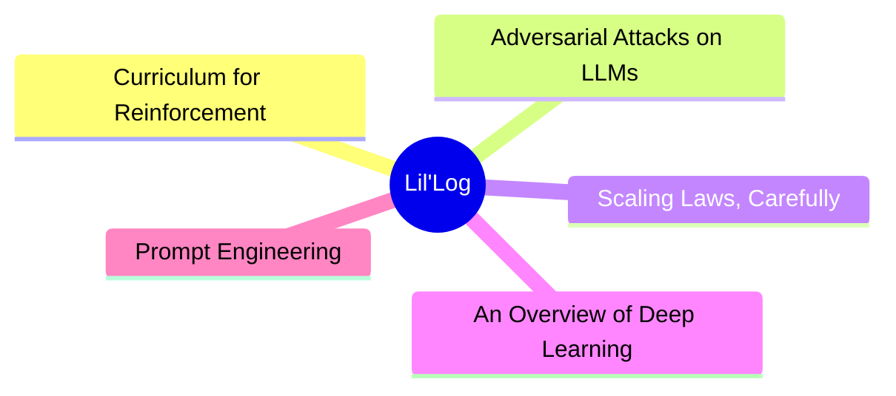
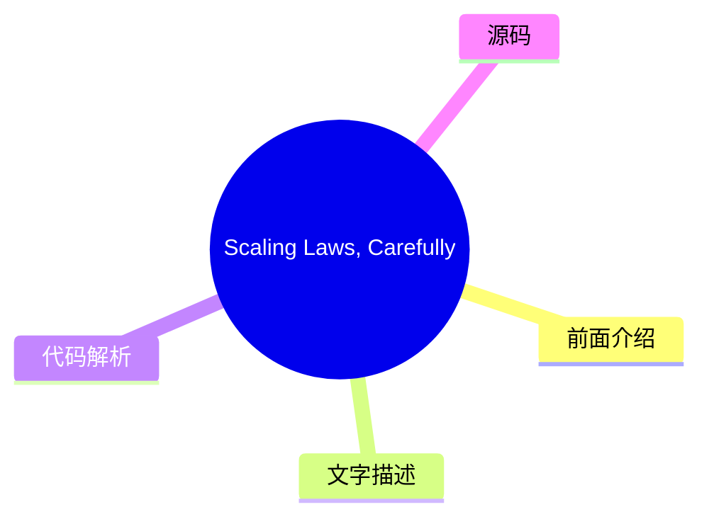
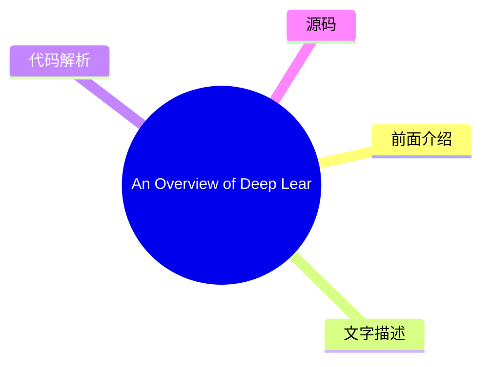
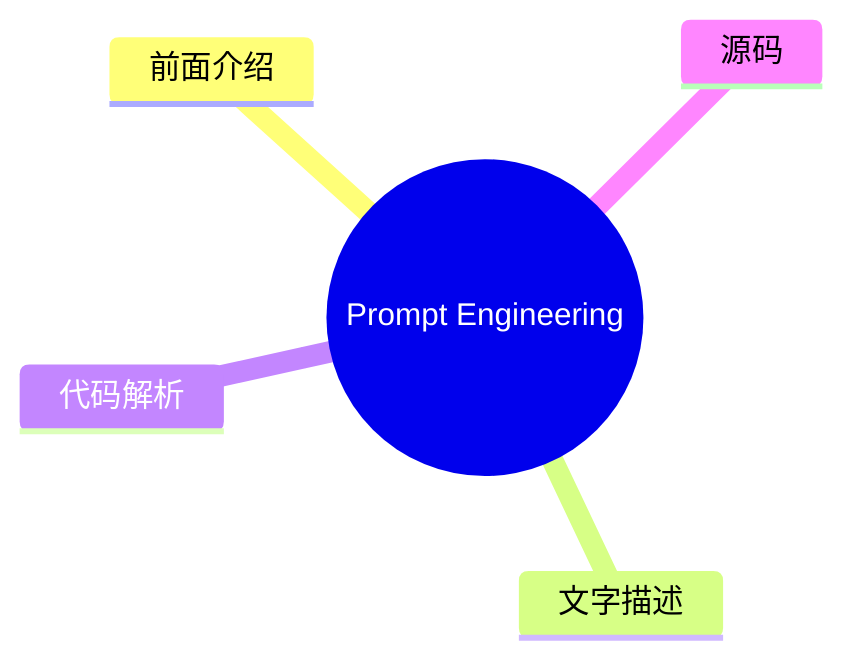

# 🧪 Lil'Log Top 5 (2026-07-31)

## 前面介绍

- 数据源：Lil'Log
- 抓取日期：2026-07-31
- 条目数：5
- 含完整正文：5
- 含代码片段：1
- 组织方式：前面介绍 / 树状图 / 文字描述 / 代码解析 / 源码

## 思维导图



## 详细整理（5 条，5 条含全文，1 条含代码）

### 1. Curriculum for Reinforcement Learning
- **链接**: [https://lilianweng.github.io/posts/2020-01-29-curriculum-rl/](https://lilianweng.github.io/posts/2020-01-29-curriculum-rl/)
- **发布**: Wed, 29 Jan 2020 00:00:00 +0000

#### 前面介绍

- [Updated on 2020-02-03: mentioning PCG in the &ldquo;Task-Specific Curriculum&rdquo; section.
[Updated on 2020-02-04: Add a new &ldquo;curriculum through distillation&rdquo; section.
- 发布时间：Wed, 29 Jan 2020 00:00:00 +0000

#### 树状图


#### 文字描述

- [Updated on 2020-02-03: mentioning [PCG](#pcg) in the “Task-Specific Curriculum” section. [Updated on 2020-02-04: Add a new [“curriculum through distillation”](#curriculum-through-distillation) section. It sounds like an impossible task if we want to teach integral or derivative to a 3-year-old who does not even know basic arithmetics. That’s why education is important, as it p
- # Task-Specific Curriculum[#](#task-specific-curriculum) [Bengio, et al. (2009)](https://www.researchgate.net/profile/Y_Bengio/publication/221344862_Curriculum_learning/links/546cd2570cf2193b94c577ac/Curriculum-learning.pdf) provided a good overview of curriculum learning in the old days. The paper presented two ideas with toy experiments using a manually designed task-specific
- # Teacher-Guided Curriculum[#](#teacher-guided-curriculum) [The idea of ]*Automatic Curriculum Learning* was proposed by [Graves, et al. 2017](https://arxiv.org/abs/1704.03003) slightly earlier. It considers a $N$-task curriculum as an [$N$-armed bandit](https://lilianweng.github.io/posts/2018-01-23-multi-armed-bandit/) problem and an adaptive policy which learns to optimize th
- # Curriculum through Self-Play[#](#curriculum-through-self-play) Different from the teacher-student framework, two agents are doing very different things. The teacher learns to pick a task for the student without any knowledge of the actual task content. What if we want to make both train on the main task directly? How about even make them compete with each other? [Sukhb ...（截断

#### 代码解析

- 本文未检测到明确代码块，内容更偏新闻、观点或方法论。

#### 源码

#### 中文节选

[Updated on 2020-02-03: mentioning [PCG](#pcg) in the “Task-Specific Curriculum” section.

[Updated on 2020-02-04: Add a new [“curriculum through distillation”](#curriculum-through-distillation) section.

It sounds like an impossible task if we want to teach integral or derivative to a 3-year-old who does not even know basic arithmetics. That’s why education is important, as it provides a systematic way to break down complex knowledge and a nice curriculum for teaching concepts from simple to hard. A curriculum makes learning difficult things easier and approachable for us humans. But, how about machine learning models? Can we train our models more efficiently with a curriculum? Can we design a curriculum to speed up learning?

Back in 1993, Jeffrey Elman has proposed the idea of training neural networks with a curriculum. His early work on learning simple language grammar demonstrated the importance of such a strategy: starting with a restricted set of simple data and gradually increasing the complexity of training samples; otherwise the model was not able to learn at all.

Compared to training without a curriculum, we would expect the adoption of the curriculum to expedite the speed of convergence and may or may not improve the final model performance. To design an efficient and effective curriculum is not easy. Keep in mind that, a bad curriculum may even hamper learning.

Next, we will look into several categories of curriculum learning, as illustrated in Most cases are applied to Reinforcement Learning, with a few exceptions on Supervised Learning.

In “The importance of starting small” paper ([Elman 1993](http://citeseerx.ist.psu.edu/viewdoc/download?doi=10.1.1.128.4487&rep=rep1&type=pdf)), I especially like the starting sentences and find them both inspiring and affecting:


“人类在许多维度上与其他物种不同，但有两个维度尤为显著。人类表现出卓越的学习能力；而且，人类在达到成熟期所需的时间之长方面也令人瞩目。学习的适应优势是显而易见的，并且可以认为，通过文化，学习为基于非遗传的行为传递奠定了基础，这可能会加速我们物种的进化。”

确实，学习可能是我们人类拥有的最好超能力。

# 面向任务的课程[#](#task-specific-curriculum)

[Bengio 等人 (2009)](https://www.researchgate.net/profile/Y_Bengio/publication/221344862_Curriculum_learning/links/546cd2570cf2193b94c577ac/Curriculum-learning.pdf) 在过去提供了关于课程学习的良好概述。该论文提出了两个观点，并使用手动设计的面向任务的具体课程进行了玩具实验：

- 更清洁的示例可能更快地带来更好的泛化能力。
- 逐渐引入更难的示例可以加速在线训练。

某些课程策略可能是无用甚至有害的。该领域需要回答的一个好问题是：*什么可能

#### 完整正文（中文）

[Updated on 2020-02-03: mentioning [PCG](#pcg) in the “Task-Specific Curriculum” section.

[Updated on 2020-02-04: Add a new [“curriculum through distillation”](#curriculum-through-distillation) section.

It sounds like an impossible task if we want to teach integral or derivative to a 3-year-old who does not even know basic arithmetics. That’s why education is important, as it provides a systematic way to break down complex knowledge and a nice curriculum for teaching concepts from simple to hard. A curriculum makes learning difficult things easier and approachable for us humans. But, how about machine learning models? Can we train our models more efficiently with a curriculum? Can we design a curriculum to speed up learning?

Back in 1993, Jeffrey Elman has proposed the idea of training neural networks with a curriculum. His early work on learning simple language grammar demonstrated the importance of such a strategy: starting with a restricted set of simple data and gradually increasing the complexity of training samples; otherwise the model was not able to learn at all.

Compared to training without a curriculum, we would expect the adoption of the curriculum to expedite the speed of convergence and may or may not improve the final model performance. To design an efficient and effective curriculum is not easy. Keep in mind that, a bad curriculum may even hamper learning.

Next, we will look into several categories of curriculum learning, as illustrated in Most cases are applied to Reinforcement Learning, with a few exceptions on Supervised Learning.

In “The importance of starting small” paper ([Elman 1993](http://citeseerx.ist.psu.edu/viewdoc/download?doi=10.1.1.128.4487&rep=rep1&type=pdf)), I especially like the starting sentences and find them both inspiring and affecting:


“Humans differ from other species along many dimensions, but two are particularly noteworthy. Humans display an exceptional capacity to learn; and humans are remarkable for the unusually long time it takes to reach maturity. The adaptive advantage of learning is clear, and it may be argued that, through culture, learning has created the basis for a non-genetically based transmission of behaviors which may accelerate the evolution of our species.”


Indeed, learning is probably the best superpower we humans have.

# Task-Specific Curriculum[#](#task-specific-curriculum)

[Bengio, et al. (2009)](https://www.researchgate.net/profile/Y_Bengio/publication/221344862_Curriculum_learning/links/546cd2570cf2193b94c577ac/Curriculum-learning.pdf) provided a good overview of curriculum learning in the old days. The paper presented two ideas with toy experiments using a manually designed task-specific curriculum:

- Cleaner Examples may yield better generalization faster.
- Introducing gradually more difficult examples speeds up online training.

It is plausible that some curriculum strategies could be useless or even harmful. A good question to answer in the field is: *What could be the general principles that make some curriculum strategies work better than others?* The Bengio 2009 paper hypothesized it would be beneficial to make learning focus on “interesting” examples that are neither too hard or too easy.

If our naive curriculum is to train the model on samples with a gradually increasing level of complexity, we need a way to quantify the difficulty of a task first. One idea is to use its minimal loss with respect to another model while this model is pretrained on other tasks ([Weinshall, et al. 2018](https://arxiv.org/abs/1802.03796)). In this way, the knowledge of the pretrained model can be transferred to the new model by suggesting a rank of training samples. Fig. 2 shows the effectiveness of the `curriculum` group (green), compared to `control` (random order; yellow) and `anti` (reverse the order; red) groups.


[Zaremba & Sutskever (2014)](https://arxiv.org/abs/1410.4615) 做了一个有趣的实验，训练 LSTM 来预测短 Python 程序的输出，该程序用于数学运算，而无需实际执行代码。他们发现课程学习对于学习是必要的。程序的复杂性由两个参数控制，`length` ∈ [1, a] 和 `nesting`∈ [1, b]。考虑了三种策略：

- **朴素课程**：首先增加 `length` 直到达到 `a`；然后增加 `nesting` 并将 `length` 重置为 1；重复此过程直到两者都达到最大值。
- **混合课程**：采样 `length`~ [1, a] 和 `nesting`~ [1, b]
- **组合**：朴素 + 混合。

他们注意到组合策略总是优于朴素课程，并且通常会（但并非总是）优于混合策略——这表明在训练中混合简单任务对于 *避免遗忘* 非常重要。

[Procedural content generation (][PCG](https://en.wikipedia.org/wiki/Procedural_generation)) is a popular approach for creating video games of various levels of difficulty. PCG involves algorithmic randomness and a heavy dose of human expertise in designing game elements and dependencies among them. Procedurally generated levels have been introduced into several benchmark environments for evaluating whether an RL agent can generalize to a new level that it is not trained on ([meta-RL](https://lilianweng.github.io/posts/2019-06-23-meta-rl/)!), such as [GVGAI](http://www.gvgai.net/), OpenAI [CoinRun](https://openai.com/blog/quantifying-generalization-in-reinforcement-learning/) and [Procgen benchmark](https://openai.com/blog/procgen-benchmark/). Using GVGAI, [Justesen, et al. (2018)](https://arxiv.org/abs/1806.10729) demonstrated that an RL policy can easily overfit to a specific game but training over a simple curriculum that grows the task difficulty together with the model performance helps its generalization to new human-designed levels. Similar results are also found in CoinRun ([Cobbe, et al. 2018](https://arxiv.org/abs/1812.02341)). POET ([Wang et al, 2019](https://arxiv.org/abs/1901.01753)) is another example for leveraging evolutionary algorithm and procedural generated game levels to improve RL generalization, which I’ve described in details in my [meta-RL post](https://lilianweng.github.io/posts/2019-06-23-meta-rl/#evolutionary-algorithm-on-environment-generation).

To follow the curriculum learning approaches described above, generally we need to figure out two problems in the training procedure:

- Design a metric to quantify how hard a task is so that we can sort tasks accordingly.
- Provide a sequence of tasks with an increasing level of difficulty to the model during training.


However, the order of tasks does not have to be sequential. In our Rubik’s cube paper ([OpenAI et al, 2019](https://arxiv.org/abs/1910.07113.)), we depended on *Automatic domain randomization* (**ADR**) to generate a curriculum by growing a distribution of environments with increasing complexity. The difficulty of each task (i.e. solving a Rubik’s cube in a set of environments) depends on the randomization ranges of various environmental parameters. Even with a simplified assumption that all the environmental parameters are uncorrelated, we were able to create a decent curriculum for our robot hand to learn the task.

# Teacher-Guided Curriculum[#](#teacher-guided-curriculum)

[The idea of ]*Automatic Curriculum Learning* was proposed by [Graves, et al. 2017](https://arxiv.org/abs/1704.03003) slightly earlier. It considers a $N$-task curriculum as an [$N$-armed bandit](https://lilianweng.github.io/posts/2018-01-23-multi-armed-bandit/) problem and an adaptive policy which learns to optimize the returns from this bandit.

Two categories of learning signals have been considered in the paper:

- Loss-driven progress: the loss function change before and after one gradient update. This type of reward signals tracks the speed of the learning process, because the greatest task loss decrease is equivalent to the fastest learning.
- Complex-driven progress: the KL divergence between posterior and prior distribution over network weights. This type of learning signals are inspired by the [MDL](https://en.wikipedia.org/wiki/Minimum_description_length)principle, “increasing the model complexity by a certain amount is only worthwhile if it compresses the data by a greater amount”. The model complexity is therefore expected to increase most in response to the model nicely generalizing to training examples.


[This framework of proposing curriculum automatically through another RL agent was formalized as ]*Teacher-Student Curriculum Learning* (**TSCL**; [Matiisen, et al. 2017](https://arxiv.org/abs/1707.00183)). In TSCL, a *student* is an RL agent working on actual tasks while a *teacher* agent is a policy for selecting tasks. The student aims to master a complex task that might be hard to learn directly. To make this task easier to learn, we set up the teacher agent to guide the student’s training process by picking proper sub-tasks.

In the process, the student should learn tasks which:

- can help the student make fastest learning progress, or
- are at risk of being forgotten.

Note: The setup of framing the teacher model as an RL problem feels quite similar to Neural Architecture Search (NAS), but differently the RL model in TSCL operates on the task space and NAS operates on the main model architecture space.


Training the teacher model is to solve a [POMDP](https://en.wikipedia.org/wiki/Partially_observable_Markov_decision_process) problem:

- The unobserved $s_t$ is the full state of the student model.
- The observed $o = (x_t^{(1)}, \dots, x_t^{(N)})$ are a list of scores for $N$ tasks.
- The action $a$ is to pick on subtask.
- The reward per step is the score delta.$r_t = \sum_{i=1}^N x_t^{(i)} - x_{t-1}^{(i)}$ (i.e., equivalent to maximizing the score of all tasks at the end of the episode).

The method of estimating learning progress from noisy task scores while balancing exploration vs exploitation can be borrowed from the non-stationary multi-armed bandit problem — use [ε-greedy](https://lilianweng.github.io/posts/2018-01-23-multi-armed-bandit/#%CE%B5-greedy-algorithm), or [Thompson sampling](https://lilianweng.github.io/posts/2018-01-23-multi-armed-bandit/#thompson-sampling).

The core idea, in summary, is to use one policy to propose tasks for another policy to learn better. Interestingly, both works above (in the discrete task space) found that uniformly sampling from all tasks is a surprisingly strong benchmark.


What if the task space is continuous? [Portelas, et al. (2019)](https://arxiv.org/abs/1910.07224) studied a continuous teacher-student framework, where the teacher has to sample parameters from continuous task space to generate a learning curriculum. Given a newly sampled parameter $p$, the absolute learning progress (short for ALP) is measured as $\text{ALP}_p = \vert r - r_\text{old} \vert$, where $r$ is the episodic reward associated with $p$ and $r_\text{old}$ is the reward associated with $p_\text{old}$. Here, $p_\text{old}$ is a previous sampled parameter closest to $p$ in the task space, which can be retrieved by nearest neighbor. Note that how this ALP score is different from learning signals in [TSCL](#TSCL) or [Grave, et al. 2017](#grave-et-al-2017) above: ALP score measures the reward difference between two tasks rather than performance at two time steps of the same task.

On top of the task parameter space, a Gaussian mixture model is trained to fit the distribution of $\text{ALP}_p$ over $p$. ε-greedy is used when sampling the tasks: with some probability, sampling a random task; otherwise sampling proportionally to ALP score from the GMM model.

# Curriculum through Self-Play[#](#curriculum-through-self-play)

Different from the teacher-student framework, two agents are doing very different things. The teacher learns to pick a task for the student without any knowledge of the actual task content. What if we want to make both train on the main task directly? How about even make them compete with each other?

[Sukhb

...（截断，原文 31549+ 字符）


### 2. Adversarial Attacks on LLMs
- **链接**: [https://lilianweng.github.io/posts/2023-10-25-adv-attack-llm/](https://lilianweng.github.io/posts/2023-10-25-adv-attack-llm/)
- **发布**: Wed, 25 Oct 2023 00:00:00 +0000

#### 前面介绍

- The use of large language models in the real world has strongly accelerated by the launch of ChatGPT. We (including my team at OpenAI, shoutout to them) have invested a lot of effort to build default safe behavior into the model during the alignment
- 发布时间：Wed, 25 Oct 2023 00:00:00 +0000

#### 树状图


#### 文字描述

- The use of large language models in the real world has strongly accelerated by the launch of ChatGPT. We (including my team at OpenAI, shoutout to them) have invested a lot of effort to build default safe behavior into the model during the alignment process (e.g. via [RLHF](https://openai.com/research/learning-to-summarize-with-human-feedback)). However, adversarial attacks or 
- # Basics[#](#basics)
- ## Threat Model[#](#threat-model) Adversarial attacks are inputs that trigger the model to output something undesired. Much early literature focused on classification tasks, while recent effort starts to investigate more into outputs of generative models. In the context of large language models In this post we assume the attacks only happen **at inference time**, meaning that *
- ### Classification[#](#classification) Adversarial attacks on classifiers have attracted more attention in the research community in the past, many in the image domain. LLMs can be used for classification too. Given an input $\mathbf{x}$ and a classifier $f(.)$, we would like to find an adversarial version of the input, denoted as $\mathbf{x}_\text{adv}$, with imperceptible dif

#### 代码解析

- 本文未检测到明确代码块，内容更偏新闻、观点或方法论。

#### 源码

#### 中文节选

The use of large language models in the real world has strongly accelerated by the launch of ChatGPT. We (including my team at OpenAI, shoutout to them) have invested a lot of effort to build default safe behavior into the model during the alignment process (e.g. via [RLHF](https://openai.com/research/learning-to-summarize-with-human-feedback)). However, adversarial attacks or jailbreak prompts could potentially trigger the model to output something undesired.

A large body of ground work on adversarial attacks is on images, and differently it operates in the continuous, high-dimensional space. Attacks for discrete data like text have been considered to be a lot more challenging, due to lack of direct gradient signals. My past post on [Controllable Text Generation](https://lilianweng.github.io/posts/2021-01-02-controllable-text-generation/) is quite relevant to this topic, as attacking LLMs is essentially to control the model to output a certain type of (unsafe) content.

There is also a branch of work on attacking LLMs to extract pre-training data, private knowledge ([Carlini et al, 2020](https://arxiv.org/abs/2012.07805)) or attacking model training process via data poisoning ([Carlini et al. 2023](https://arxiv.org/abs/2302.10149)). We would not cover those topics in this post.

# Basics[#](#basics)

## Threat Model[#](#threat-model)

Adversarial attacks are inputs that trigger the model to output something undesired. Much early literature focused on classification tasks, while recent effort starts to investigate more into outputs of generative models. In the context of large language models In this post we assume the attacks only happen **at inference time**, meaning that **model weights are fixed**.

### Classification[#](#classification)

Adversarial attacks on classifiers have attracted more attention in the research community in the past, many in the image domain. LLMs can be used for classification too. Given an input $\mathbf{x}$ and a classifier $f(.)$, we would like to find an adversarial version of the input, denoted as $\mathbf{x}_\text{adv}$, with imperceptible difference from $\mathbf{x}$, such that $f(\mathbf{x}) \neq f(\mathbf{x}_\text{adv})$.


### Text Generation[#](#text-generation)

Given an input $\mathbf{x}$ and a generative model $p(.)$, we have the model output a sample $\mathbf{y} \sim p(.\vert\mathbf{x})$ . An adversarial attack would identify such $p(\mathbf{x})$ that $\mathbf{y}$ would violate the built-in safe behavior of the model $p$; E.g. output unsafe content on illegal topics, leak private information or model training data. For generative tasks, it is not easy to judge the success of an attack, which demands a super high-quality classifier to judge whether $\mathbf{y}$ is unsafe or human review.

### White-box vs Black-box[#](#white-box-vs-black-box)

White-box attacks assume that attackers have full access to the model weights, architecture and training pipeline, such that attackers can obtain gradient signals

#### 完整正文（中文）

The use of large language models in the real world has strongly accelerated by the launch of ChatGPT. We (including my team at OpenAI, shoutout to them) have invested a lot of effort to build default safe behavior into the model during the alignment process (e.g. via [RLHF](https://openai.com/research/learning-to-summarize-with-human-feedback)). However, adversarial attacks or jailbreak prompts could potentially trigger the model to output something undesired.

A large body of ground work on adversarial attacks is on images, and differently it operates in the continuous, high-dimensional space. Attacks for discrete data like text have been considered to be a lot more challenging, due to lack of direct gradient signals. My past post on [Controllable Text Generation](https://lilianweng.github.io/posts/2021-01-02-controllable-text-generation/) is quite relevant to this topic, as attacking LLMs is essentially to control the model to output a certain type of (unsafe) content.

There is also a branch of work on attacking LLMs to extract pre-training data, private knowledge ([Carlini et al, 2020](https://arxiv.org/abs/2012.07805)) or attacking model training process via data poisoning ([Carlini et al. 2023](https://arxiv.org/abs/2302.10149)). We would not cover those topics in this post.

# Basics[#](#basics)

## Threat Model[#](#threat-model)

Adversarial attacks are inputs that trigger the model to output something undesired. Much early literature focused on classification tasks, while recent effort starts to investigate more into outputs of generative models. In the context of large language models In this post we assume the attacks only happen **at inference time**, meaning that **model weights are fixed**.

### Classification[#](#classification)

Adversarial attacks on classifiers have attracted more attention in the research community in the past, many in the image domain. LLMs can be used for classification too. Given an input $\mathbf{x}$ and a classifier $f(.)$, we would like to find an adversarial version of the input, denoted as $\mathbf{x}_\text{adv}$, with imperceptible difference from $\mathbf{x}$, such that $f(\mathbf{x}) \neq f(\mathbf{x}_\text{adv})$.


### Text Generation[#](#text-generation)

Given an input $\mathbf{x}$ and a generative model $p(.)$, we have the model output a sample $\mathbf{y} \sim p(.\vert\mathbf{x})$ . An adversarial attack would identify such $p(\mathbf{x})$ that $\mathbf{y}$ would violate the built-in safe behavior of the model $p$; E.g. output unsafe content on illegal topics, leak private information or model training data. For generative tasks, it is not easy to judge the success of an attack, which demands a super high-quality classifier to judge whether $\mathbf{y}$ is unsafe or human review.

### White-box vs Black-box[#](#white-box-vs-black-box)

White-box attacks assume that attackers have full access to the model weights, architecture and training pipeline, such that attackers can obtain gradient signals. We don’t assume attackers have access to the full training data. This is only possible for open-sourced models. Black-box attacks assume that attackers only have access to an API-like service where they provide input $\mathbf{x}$ and get back sample $\mathbf{y}$, without knowing further information about the model.

# Types of Adversarial Attacks[#](#types-of-adversarial-attacks)

There are various means to find adversarial inputs to trigger LLMs to output something undesired. We present five approaches here.

| Attack | Type | Description | 
|---|---|---|
| Token manipulation | Black-box | Alter a small fraction of tokens in the text input such that it triggers model failure but still remain its original semantic meanings. | 
| Gradient based attack | White-box | Rely on gradient signals to learn an effective attack. | 
| Jailbreak prompting | Black-box | Often heuristic based prompting to “jailbreak” built-in model safety. | 
| Human red-teaming | Black-box | Human attacks the model, with or without assist from other models. | 
| Model red-teaming | Black-box | Model attacks the model, where the attacker model can be fine-tuned. | 

## Token Manipulation[#](#token-manipulation)


Given a piece of text input containing a sequence of tokens, we can apply simple token operations like replacement with synonyms to trigger the model to make the incorrect predictions. Token manipulation based attacks work in **black box** settings. The Python framework, TextAttack ([Morris et al. 2020](https://arxiv.org/abs/2005.05909)), implemented many word and token manipulation attack methods to create adversarial examples for NLP models. Most work in this area experimented with classification and entailment prediction.

[Ribeiro et al (2018)](https://www.aclweb.org/anthology/P18-1079/) relied on manually proposed Semantically Equivalent Adversaries Rules (SEARs) to do minimal token manipulation such that the model would fail to generate the right answers. Example rules include (*What  NOUN→Which NOUN*), (

*), (*

`WP` is → `WP`’s’*was→is*), etc. The semantic equivalence after adversarial operation is checked via back-translation. Those rules are proposed via a pretty manual, heuristic process and the type of model “bugs” SEARs are probing for are only limited on sensitivity to minimal token variation, which should not be an issue with increased base LLM capability.

In comparison, [EDA](https://lilianweng.github.io/posts/2022-04-15-data-gen/#EDA) (Easy Data Augmentation; [Wei & Zou 2019](https://arxiv.org/abs/1901.11196)) defines a set of simple and more general operations to augment text: synonym replacement, random insertion, random swap or random deletion. EDA augmentation is shown to improve the classification accuracy on several benchmarks.

TextFooler ([Jin et al. 2019](https://arxiv.org/abs/1907.11932)) and [BERT-Attack (][Li et al. 2020](https://aclanthology.org/2020.emnlp-main.500.pdf)) follows the same process of first identifying the most important and vulnerable words that alter the model prediction the most and then replace those words in some way.

Given a classifier $f$ and an input text string $\mathbf{x}$, the importance score of each word can be measured by:


其中 $f_y$ 是标签 $y$ 的预测 logits，$x_{\setminus w_i}$ 是排除了目标词 $w_i$ 的输入文本。重要性高的词是很好的替换候选词，但应跳过停用词以避免破坏语法。

TextFooler 首先根据词嵌入余弦相似度用顶级同义词替换这些词，然后进一步通过检查替换词是否仍具有相同的词性标注以及句子级相似度是否高于阈值来进行过滤。BERT-Attack 则通过 BERT 用语义相似的词替换单词，因为上下文感知预测是掩码语言模型非常自然的用例。通过这种方式发现的对抗样本在不同模型之间具有一定的可迁移性，具体取决于模型和任务。

## 基于梯度的攻击[#](#gradient-based-attacks)

在白盒设置中，我们可以完全访问模型参数和架构。因此，我们可以依靠梯度下降来以编程方式学习最有效的攻击。基于梯度的攻击仅在白盒设置中有效，例如对于开源 LLM。

**GBDA**（“基于梯度的分布攻击”；[Guo et al. 2021](https://arxiv.org/abs/2104.13733)）使用 Gumbel-Softmax 近似技巧来*使对抗损失优化可微分*，其中使用 BERTScore 和困惑度来保证可感知性和流畅性。给定一个 token 输入 $\mathbf{x}=[x_1, x_2 \dots x_n]$，其中单个 token $x_i$ 可以从类别分布 $P_\Theta$ 中采样，其中 $\Theta \in \mathbb{R}^{n \times V}$ 且 $V$ 是 token 词汇表大小。考虑到 $V$ 通常约为 $O(10,000)$ 且大多数对抗示例只需要替换几个 token，它具有高度过参数化的特征。我们有：

$$ x_i \sim P_{\Theta_i} = \text{Categorical}(\pi_i) = \text{Categorical}(\text{Softmax}(\Theta_i)) $$

where $\pi_i \in \mathbb{R}^V$ is a vector of token probabilities for the $i$-th token. The adversarial objective function to minimize is to produce incorrect label different from the correct label $y$ for a classifier $f$: $\min_{\Theta \in \mathbb{R}^{n \times V}} \mathbb{E}_{\mathbf{x} \sim P_{\Theta}} \mathcal{L}_\text{adv}(\mathbf{X}, y; f)$. However, on the surface, this is not differentiable because of the categorical distribution. Using Gumbel-softmax approximation ([Jang et al. 2016](https://arxiv.org/abs/1611.01144)) we approximate the categorical distribution from the Gumbel distribution $\tilde{P}_\Theta$ by $\tilde{\boldsymbol{\pi}}$:

where $g_{ij} \sim \text{Gumbel}(0, 1)$; the temperature $\tau > 0$ controls the smoothness of the distribution.

Gumbel distribution is used to model the *extreme* value, maximum or minimum, of a number of samples, irrespective of the sample distribution. The additional Gumbel noise brings in the stochastic decisioning that mimic the sampling process from the categorical distribution.

A low temperature $\tau \to 0$ pushes the convergence to categorical distribution, since sampling from softmax with temperature 0 is deterministic. The “sampling” portion only depends on the value of $g_{ij}$, which is mostly centered around 0.

Let $\mathbf{e}_j$ be the embedding representation of token $j$. We can approximate $\mathbf{x}$ with $\bar{e}(\tilde{\boldsymbol{\pi}})$, a weighted average of the embedding vector corresponding to the token probabilities: $\bar{e}(\pi_i) = \sum_{j=1}^V \pi_i^{(j)} \mathbf{e}_j$. Note that when $\pi_i$ is a one-hot vector corresponding to the token $x_i$, we would have $\bar{e}(\pi_i) = \mathbf{e}_{z_i}$. Combining the embedding representation with the Gumbel-softmax approximation, we have a differentiable objective to minimize: $\min_{\Theta \in \mathbb{R}^{n \times V}} \mathbb{E}_{\tilde{\boldsymbol{\pi}} \sim \tilde{P}_{\Theta}} \mathcal{L}_\text{adv}(\bar{e}(\tilde{\boldsymbol{\pi}}), y; f)$.


Meanwhile, it is also easy to apply differentiable soft constraints with white-box attacks. GBDA experimented with (1) a soft fluency constraint using NLL (negative log-likelihood) and (2) BERTScore (*“a similarity score for evaluating text generation that captures the semantic similarity between pairwise tokens in contextualized embeddings of a transformer model.”*; [Zhang et al. 2019](https://arxiv.org/abs/1904.09675)) to measure similarity between two text inputs to ensure the perturbed version does not diverge from the original version too much. Combining all constraints, the final objective function is as follows, where $\lambda_\text{lm}, \lambda_\text{sim} > 0$ are preset hyperparameters to control the strength of soft constraints:

Gumbel-softmax tricks are hard to be extended to token deletion or addition and thus it is restricted to only token replacement operations, not deletion or addition.

**HotFlip** ([Ebrahimi et al. 2018](https://arxiv.org/abs/1712.06751)) treats text operations as inputs in the vector space and measures the derivative of loss with regard to these vectors. Here let’s assume the input vector is a matrix of character-level one-hot encodings, $\mathbf{x} \in {0, 1}^{m \times n \times V}$ and $\mathbf{x}_{ij} \in {0, 1}^V$, where $m$ is the maximum number of words, $n$ is the maximum number of characters per word and $V$ is the alphabet size. Given the original input vector $\mathbf{x}$, we construct a new vector $\mathbf{x}_{ij, a\to b}$ with the $j$-th character of the $i$-th word changing from $a \to b$, and thus we have $x_{ij}^{(a)} = 1$ but $x_{ij, a\to b}^{(a)} = 0, x_{ij, a\to b}^{(b)} = 1$.

The change in loss according to first-order Taylor expansion is:

This objective is optimized to select the vector to minimize the adversarial loss using only one backward propagation.

To apply multiple flips, we can run a beam search of $r$ steps of th

...（截断，原文 46582+ 字符）


### 3. Scaling Laws, Carefully
- **链接**: [https://lilianweng.github.io/posts/2026-06-24-scaling-laws/](https://lilianweng.github.io/posts/2026-06-24-scaling-laws/)
- **发布**: Wed, 24 Jun 2026 00:00:00 +0000

#### 前面介绍

- Scaling laws are one of the most critical empirical findings in deep learning. The observation is simple in form: the training loss $L$ decreases predictably as we scale up model size $N$, dataset size $D$, and compute $C$, following a power-law curv
- 发布时间：Wed, 24 Jun 2026 00:00:00 +0000

#### 树状图



#### 文字描述

- Scaling laws are one of the most critical empirical findings in deep learning. The observation is simple in form: the training loss $L$ decreases predictably as we scale up model size $N$, dataset size $D$, and compute $C$, following a power-law curve, which appears as a straight line on a log-log plot. We can view scaling laws as a framework for describing the relationship bet
- # Early days: ML loss predictability[#](#early-days-ml-loss-predictability) The predictability of generalization error with scale had already been investigated before scaling laws became a mainstream concept. [Amari et al. (1992)](https://ieeexplore.ieee.org/document/6796972) derived four types of learning curves using a Bayesian approach and the annealed approximation. - Deter
- # Scaling Laws in Data-Infinite Region[#](#scaling-laws-in-data-infinite-region)
- ## Kaplan et al.’s Scaling Laws[#](#kaplan-et-als-scaling-laws) [Kaplan et al. (2020)](https://arxiv.org/abs/2001.08361) popularized the concept of scaling laws in the language modeling community. They found that the cross-entropy test loss $L$ scales as a power law with each of model size $N$ (excluding embedding layers), dataset size $D$, and training compute $C$ across many 

#### 代码解析

- 本文未检测到明确代码块，内容更偏新闻、观点或方法论。

#### 源码

#### 中文节选

缩放定律是深度学习中最关键的实证发现之一。其观察结果形式简单：随着模型大小 $N$、数据集大小 $D$ 和计算量 $C$ 的增加，训练损失 $L$ 遵循幂律曲线（在双对数图上表现为直线）可预测地下降。我们可以将缩放定律视为描述计算量、损失、模型大小和数据之间关系的框架；其核心在于如何将宝贵的计算量在 $N$ 和 $D$ 之间进行最优分配。

这种可预测性使缩放定律在实践中极具价值。常见的工作流程是在少量小规模运行中拟合缩放定律，然后外推以估算更大模型的代币和计算需求。

| 符号 | 备注 | 
|---|---| 
| $N$ | 模型大小，以参数数量衡量。 | 
| $D$ | 训练数据集大小，通常以代币数量衡量。 | 
| $C$ | 以 FLOPs 为单位的训练计算量。作为一个有用的近似，$C \approx 6ND$（[Kaplan 等人 2020](https://arxiv.org/abs/2001.08361)），其中 $2ND$ 用于前向传播，$4ND$ 用于反向传播。 | 
| $E$ | 不可约损失 | 
| $L, \hat{L}(.)$ | 测试损失 / 测试损失预测函数；也可以指训练损失，因为它们高度相关。 | 
| $\epsilon$ | 泛化误差。 | 

# 早期：机器学习损失的可预测性[#](#early-days-ml-loss-predictability)

在缩放定律成为主流概念之前，泛化误差的可预测性就已经被研究过了。

[Amari 等人 (1992)](https://ieeexplore.ieee.org/document/6796972) 使用贝叶斯方法和退火近似推导出了四种类型的学习曲线。

- 确定性学习算法，无噪声数据，唯一解：$\epsilon \sim c \cdot D^{-1}$，其中 $c$ 是某个常数。
- 确定性学习算法，无噪声数据，多个等价解：$\epsilon \sim c \cdot D^{-2}$；随着每个新数据点的加入，学习速度更快，因为模型只学习参数的最优流形，而不是寻找单个解点。

- Deterministic learning algorithm, noisy data: $\epsilon \sim c \cdot D^{-1/2}$; noises in data make learning harder.
- Stochastic learning algorithm, noisy data: $\epsilon \sim c \cdot D^{-1} + E$; here the irreducible loss $E$ is the residual error that a stochastic learner cannot reduce further, for example when the model runs out of capacity on large data. All four types of learning curves follow a power law:

where $E$ can be 0 and $\alpha = -2, -1, -1/2$. Although their theoretical setup is based on a simplified binary classification task, it points in a useful direction for building empirical ML loss prediction models.

One of the earliest empirical studies by [Hestness et al. (2017)](https://arxiv.org/abs/1712.00409) explained the relationship between generalization error, model size and data. For a given training data size, they identified the best-fit model size via grid search and then plot

#### 完整正文（中文）

缩放定律是深度学习中最关键的实证发现之一。其观察结果形式简单：随着模型大小 $N$、数据集大小 $D$ 和计算量 $C$ 的增加，训练损失 $L$ 遵循幂律曲线（在双对数图上表现为直线）可预测地下降。我们可以将缩放定律视为描述计算量、损失、模型大小和数据之间关系的框架；其核心在于如何将宝贵的计算量在 $N$ 和 $D$ 之间进行最优分配。

这种可预测性使缩放定律在实践中极具价值。常见的工作流程是在少量小规模运行中拟合缩放定律，然后外推以估算更大模型的代币和计算需求。

| 符号 | 备注 | 
|---|---| 
| $N$ | 模型大小，以参数数量衡量。 | 
| $D$ | 训练数据集大小，通常以代币数量衡量。 | 
| $C$ | 以 FLOPs 为单位的训练计算量。作为一个有用的近似，$C \approx 6ND$（[Kaplan 等人 2020](https://arxiv.org/abs/2001.08361)），其中 $2ND$ 用于前向传播，$4ND$ 用于反向传播。 | 
| $E$ | 不可约损失 | 
| $L, \hat{L}(.)$ | 测试损失 / 测试损失预测函数；也可以指训练损失，因为它们高度相关。 | 
| $\epsilon$ | 泛化误差。 | 

# 早期：机器学习损失的可预测性[#](#early-days-ml-loss-predictability)

在缩放定律成为主流概念之前，泛化误差的可预测性就已经被研究过了。

[Amari 等人 (1992)](https://ieeexplore.ieee.org/document/6796972) 使用贝叶斯方法和退火近似推导出了四种类型的学习曲线。

- 确定性学习算法，无噪声数据，唯一解：$\epsilon \sim c \cdot D^{-1}$，其中 $c$ 是某个常数。
- 确定性学习算法，无噪声数据，多个等价解：$\epsilon \sim c \cdot D^{-2}$；随着每个新数据点的加入，学习速度更快，因为模型只学习参数的最优流形，而不是寻找单个解点。

- Deterministic learning algorithm, noisy data: $\epsilon \sim c \cdot D^{-1/2}$; noises in data make learning harder.
- Stochastic learning algorithm, noisy data: $\epsilon \sim c \cdot D^{-1} + E$; here the irreducible loss $E$ is the residual error that a stochastic learner cannot reduce further, for example when the model runs out of capacity on large data. All four types of learning curves follow a power law:

where $E$ can be 0 and $\alpha = -2, -1, -1/2$. Although their theoretical setup is based on a simplified binary classification task, it points in a useful direction for building empirical ML loss prediction models.

One of the earliest empirical studies by [Hestness et al. (2017)](https://arxiv.org/abs/1712.00409) explained the relationship between generalization error, model size and data. For a given training data size, they identified the best-fit model size via grid search and then plotted loss against training dataset size. Across four different domains in deep learning (neural machine translation, image classification, language modeling, and speech recognition), a recurring pattern was observed where:

- Generalization error scales as a power law across a set of factors (e.g. data size).
- Model improvements shift the error curve but do not seem to affect the power-law exponent.
- Interestingly, architecture changes the offset ($E$) of the power-law fit but does not change the exponent ($\alpha$). The slope of the power law appears to be a property of the problem domain rather than the model architecture.
- The number of model parameters $N$ needed to fit a dataset of size $D$ also scales as a power law.

A conceptual illustration breaks the learning curve into three stages. In the small-data region, when there are not enough learning signals, the model performs only slightly better than random guessing. In the middle (“power-law region”), we observe a power-law relationship between loss, data, and model size. The final irreducible-error region can be attributed to factors such as noise in the data.


[Rosenfeld 等人 (2020)](https://arxiv.org/abs/1909.12673) 通过尝试将误差建模为模型大小 $N$ 和数据大小 $D$ 的联合函数，在多种架构（ResNet、WRN、LSTM、Transformer）和优化器（Adam、SGD 变体）上进一步推进了这一工作。经验上，他们观察到，在固定一个轴的情况下，误差随另一个轴呈幂律衰减：

这可以合并为一个联合形式：

其中 $A > 0, B > 0, \alpha \geq 0, \beta \geq 0$ 是标量常数，且 $E$ 不依赖于 $N$ 或 $D$。

因此，他们可以构建一个简单参数化函数形式的预测模型，其参数向量为 $\boldsymbol{\theta} = \langle A, B, E, \alpha, \beta \rangle$，仅通过在较小的训练配置集 $(D, N)$ < 某些阈值上进行训练，来预测 $(D, N)$ > 某些阈值的预期损失。

附注：这些早期工作依赖于经典学习理论直觉，如 [VC 维度](https://en.wikipedia.org/wiki/Vapnik%E2%80%93Chervonenkis_dimension)（模型可以打散的最大点集的基数）作为容量的代理，但在现代深度学习工作中，VC 维度通常过于粗糙，无法解释行为，而经验幂律结果比理论提供的最坏情况界限要清晰得多，也更实用。

# 数据无限区域的缩放定律[#](#scaling-laws-in-data-infinite-region)

## Kaplan 等人的缩放定律[#](#kaplan-et-als-scaling-laws)

[Kaplan et al. (2020)](https://arxiv.org/abs/2001.08361) 在语言建模社区普及了缩放定律的概念。他们发现，交叉熵测试损失 $L$ 随着模型大小 $N$（不包括嵌入层）、数据集大小 $D$ 和训练计算量 $C$ 中的每一个，在多个数量级范围内都呈幂律缩放。这些发现与上一节中的早期工作一致，但 Kaplan 等人通过专注于 Transformer 语言模型并在更大规模上进行实证实验，正式化了这一概念，模型大小范围从 7.68 亿到 15 亿非嵌入参数，数据集大小从 2200 万到 230 亿个 token。论文中的所有训练运行都使用了学习率调度，包含 3000 步的线性预热，随后是衰减至零的余弦衰减。

关键发现列表：

- 损失 $L$ 分别与 $N$、$D$ 和 $C$ 呈幂律缩放；为了获得最佳性能，这三者必须同步缩放。
- 训练曲线遵循可预测的幂律，其参数大致与模型大小无关。
- 更大的模型具有更高的样本效率，这意味着它们比小模型在更少的优化步数和更少的数据点下就能达到给定的损失。
- 架构细节（宽度、长宽比等）的重要性不如单纯的规模。
- 训练损失和测试损失呈正相关。（这听起来微不足道，但这是预训练工作的基础。另一方面，预训练损失的改进是否会转移到后训练评估中，需要单独的研究。）
- 在固定的计算预算下，训练一个非常大的模型并在*收敛前*停止，比训练一个较小的模型直到收敛更有效。**这一发现是 Chinchilla 缩放定律（下一节） disagree 的地方：Kaplan 等人高估了最佳模型大小，因为其拟合的指数较大。**

他们在一个单一方程中总结了 $N$ 和 $D$ 的联合依赖关系：

A nice consequence of this form is that the extent of overfitting (i.e. model is complex or data is small) depends predominantly on the ratio $N^{\alpha / \beta} / D$, which indicates that the data needs to grow in a specific proportion to the growth of the model size to avoid training being data-limited.

The most influential and, in hindsight, most contested conclusion was the compute-optimal allocation. Kaplan et al. found $N_\text{opt} \propto C^{0.73}$ and concluded that model size should grow faster than dataset size. Concretely, for a 10x increase in compute they suggested scaling the model size by ~5.5x but the training tokens by only ~1.8x. The Chinchilla paper would later overturn this recommendation, arguing that it leaves large models badly *undertrained*.

Another useful analysis in Kaplan et al. approximates the number of training FLOPs needed based on $D$ and $N$. Each multiply-add is counted as ~2 FLOPs.

Given a standard config where $d_\text{attn} = d_\text{model} = d_\text{ff}/4$, and excluding embedding layers from $N$ and the per-token forward compute:

Then we count backward-pass FLOPs as twice the forward-pass FLOPs, because backpropagation runs two matrix multiplications, for gradients with respect to the input activations and the weights, respectively. Thus, in total, the training FLOPs per token are approximately $6N$, and the total FLOPs for training over $D$ tokens are $C \approx 6ND$.

## Chinchilla Scaling Laws[#](#chinchilla-scaling-laws)

The Chinchilla paper ([Hoffmann et al. 2022](https://arxiv.org/abs/2203.15556)) studied the relationship between the optimal model size $N$ (total parameters, *including* embeddings) and the number of tokens $D$ under a *fixed* compute budget $C$ with a more careful experimental design and arrived at a somewhat different answer from Kaplan et al..

The central question is on the best strategy to allocate resources given a constraint $\text{FLOPs}(N, D) = C \approx 6ND$. In other words, when we have only limited FLOPs (a given number of GPUs running for a given period of time), how should we choose between more data tokens and more model parameters?


Chinchilla 论文提出了三种设计精巧的方法来拟合缩放定律。

实证实验扫描了 400 多个模型，参数量从 70M 到超过 16B，训练 token 从 5B 到 500B。实验基于每个训练 token 都是唯一的假设（即无限数据 regime）。所有运行均使用余弦学习率调度，在训练过程中衰减 10 倍。扫描模型大小描绘出了计算最优前沿。

### 方法 1：固定模型大小，变化 token 预算[#](#method-1-fix-model-sizes-vary-the-token-budget)

对于每个参数量 $N$，使用不同的 token 预算训练多次运行，并记录每个 FLOP 预算 $C$ 下达到的最小损失。

### 方法 2：IsoFLOP 曲线[#](#method-2-isoflop-profiles)

固定计算预算 $C$，将最终损失绘制为参数量 $N$ 的函数。每个 iso-FLOP 曲线在 log 空间中大致呈抛物线，其最小值标记了该计算预算下的最优模型大小。然后在预算范围内重复此操作，在图中描绘出一条幂律线。

### 方法 3：参数拟合[#](#method-3-parametric-fit)

[直接拟合与 ][Rosenfeld et al. (2020)](https://arxiv.org/abs/1909.12673) 相同的参数函数，

我们实际上可以通过在约束条件 $\text{FLOPs}(N,D) = C \approx 6ND$ 下最小化 $\hat{L}(N, D)$，得到最优 $N_\text{opt}(C), D_\text{opt}(C)$ 的闭式近似。

首先让我们将表达式简化为仅包含 $N$：

当 $\alpha \approx \beta$ 时，模型大小和训练 token 应以相同的速率缩放。

为了找到最优 $\boldsymbol{\theta} = \langle A, B, E, \alpha, \beta\rangle$，Chinchilla 论文采用了 [Huber loss](https://en.wikipedia.org/wiki/Huber_loss)（对异常值具有鲁棒性；$\delta=10^{-3}$）和 [L-BFGS 算法](https://en.wikipedia.org/wiki/Limited-memory_BFGS)（适用于参数较少的曲线拟合）。

Chinchilla 通过三种互补方法得出其结论，其最终结果相互一致，这也是该结果相当令人信服的原因之一。

The claim in the Chinchilla paper that most large models (at the time, ~2022) were undertrained is supported by a famous demonstration: under the same compute budget as Gopher ([Rae et al. 2021](https://arxiv.org/abs/2112.11446); 280B parameter count, 

...（截断，原文 29101+ 字符）


### 4. An Overview of Deep Learning for Curious People
- **链接**: [https://lilianweng.github.io/posts/2017-06-21-overview/](https://lilianweng.github.io/posts/2017-06-21-overview/)
- **发布**: Wed, 21 Jun 2017 00:00:00 +0000

#### 前面介绍

- (The post was originated from my talk for WiMLDS x Fintech meetup hosted by Affirm.)
I believe many of you have watched or heard of the games between AlphaGo and professional Go player Lee Sedol in 2016. Lee has the highest rank of nine dan and many
- 发布时间：Wed, 21 Jun 2017 00:00:00 +0000

#### 树状图



#### 文字描述

- (The post was originated from my talk for [WiMLDS x Fintech meetup](http://wimlds.org/chapters/about-bay-area/) hosted by [Affirm](www.affirm.com).) I believe many of you have watched or heard of the [games](https://youtu.be/vFr3K2DORc8) between AlphaGo and professional Go player [Lee Sedol](https://en.wikipedia.org/wiki/Lee_Sedol) in 2016. Lee has the highest rank of nine dan 
- # Why Does Deep Learning Work Now?[#](#why-does-deep-learning-work-now) Deep learning models, in simple words, are large and deep artificial neural nets. A neural network (“NN”) can be well presented in a [directed acyclic graph](https://en.wikipedia.org/wiki/Directed_acyclic_graph): the input layer takes in signal vectors; one or multiple hidden layers process the outputs of t
- # Deep Learning Models[#](#deep-learning-models) Next, let’s go through a few classical deep learning models.
- ## Convolutional Neural Network[#](#convolutional-neural-network) Convolutional neural networks, short for “CNN”, is a type of feed-forward artificial neural networks, in which the connectivity pattern between its neurons is inspired by the organization of the visual cortex system. The primary visual cortex (V1) does edge detection out of the raw visual input from the retina. T

#### 代码解析

- 本文未检测到明确代码块，内容更偏新闻、观点或方法论。

#### 源码

#### 中文节选

（该帖子源于我在 [Affirm](www.affirm.com) 举办的 [WiMLDS x Fintech meetup](http://wimlds.org/chapters/about-bay-area/) 上所做的演讲。）

我相信你们许多人都在 2016 年看过或听说过 [AlphaGo 与职业围棋手 [李世石](https://en.wikipedia.org/wiki/Lee_Sedol) 之间的对局](https://youtu.be/vFr3K2DORc8)。李世石拥有九段最高段位和许多世界冠军头衔。毫无疑问，他是世界上最优秀的围棋手之一，但在这场系列赛中他以 1-4 输给了 AlphaGo。在此之前，围棋被认为是一个计算机难以掌握的难题，因为其简单的规则在棋盘位置上产生了指数级的变体，远多于国际象棋。这一事件无疑将 2016 年标记为 AI 的一个大年。由于 AlphaGo 的出现，人们对 AI 的进展给予了极大的关注。

与此同时，许多公司都在投入资源推动 AI 应用的前沿，这些应用确实有潜力改变甚至彻底改变我们将来的生活方式。熟悉的例子包括自动驾驶汽车、聊天机器人、家庭助手设备等。近年来我们所取得进展背后的一个秘诀就是深度学习。

# 为什么深度学习现在才有效？[#](#why-does-deep-learning-work-now)

简单来说，深度学习模型是大型且深层的人工神经网络。神经网络（“NN”）可以用 [有向无环图](https://en.wikipedia.org/wiki/Directed_acyclic_graph) 很好地表示：输入层接收信号向量；一个或多个隐藏层处理前一层的输出。神经网络的概念可以追溯到半个多世纪前。但为什么它现在才有效？为什么人们突然开始谈论它？

原因出奇地简单：

- 我们拥有多得多的**数据**。
- 我们拥有**更强大的计算机**。

A large and deep neural network has many more layers + many more nodes in each layer, which results in exponentially many more parameters to tune. Without enough data, we cannot learn parameters efficiently. Without powerful computers, learning would be too slow and insufficient.

Here is an interesting plot presenting the relationship between the data scale and the model performance, proposed by Andrew Ng in his “[Nuts and Bolts of Applying Deep Learning](https://youtu.be/F1ka6a13S9I)” talk. On a small dataset, traditional algorithms (Regression, Random Forests, SVM, GBM, etc.) or statistical learning does a great job, but once the data scale goes up to the sky, the large NN outperforms others. Partially because compared to a traditional ML model, a neural network model has many more parameters and has the capability to learn complicated nonlinear patterns. Thus we expect the model to pick the most h

#### 完整正文（中文）

（该帖子源于我在 [Affirm](www.affirm.com) 举办的 [WiMLDS x Fintech meetup](http://wimlds.org/chapters/about-bay-area/) 上所做的演讲。）

我相信你们许多人都在 2016 年看过或听说过 [AlphaGo 与职业围棋手 [李世石](https://en.wikipedia.org/wiki/Lee_Sedol) 之间的对局](https://youtu.be/vFr3K2DORc8)。李世石拥有九段最高段位和许多世界冠军头衔。毫无疑问，他是世界上最优秀的围棋手之一，但在这场系列赛中他以 1-4 输给了 AlphaGo。在此之前，围棋被认为是一个计算机难以掌握的难题，因为其简单的规则在棋盘位置上产生了指数级的变体，远多于国际象棋。这一事件无疑将 2016 年标记为 AI 的一个大年。由于 AlphaGo 的出现，人们对 AI 的进展给予了极大的关注。

与此同时，许多公司都在投入资源推动 AI 应用的前沿，这些应用确实有潜力改变甚至彻底改变我们将来的生活方式。熟悉的例子包括自动驾驶汽车、聊天机器人、家庭助手设备等。近年来我们所取得进展背后的一个秘诀就是深度学习。

# 为什么深度学习现在才有效？[#](#why-does-deep-learning-work-now)

简单来说，深度学习模型是大型且深层的人工神经网络。神经网络（“NN”）可以用 [有向无环图](https://en.wikipedia.org/wiki/Directed_acyclic_graph) 很好地表示：输入层接收信号向量；一个或多个隐藏层处理前一层的输出。神经网络的概念可以追溯到半个多世纪前。但为什么它现在才有效？为什么人们突然开始谈论它？

原因出奇地简单：

- 我们拥有多得多的**数据**。
- 我们拥有**更强大的计算机**。

一个大型且深层的神经网络拥有更多的层 + 每层更多的节点，这导致需要调整的参数呈指数级增加。如果没有足够的数据，我们无法高效地学习参数。如果没有强大的计算机，学习过程将太慢且不足。

下面是一个有趣的图表，展示了数据规模与模型性能之间的关系，这是 Andrew Ng 在他的 “[Nuts and Bolts of Applying Deep Learning](https://youtu.be/F1ka6a13S9I)” 演讲中提出的。在小数据集上，传统算法（回归、随机森林、SVM、GBM 等）或统计学习表现优异，但一旦数据规模达到天文数字，大型神经网络就会超越其他模型。部分原因在于，与传统的机器学习模型相比，神经网络模型拥有更多的参数，并且具备学习复杂非线性模式的能力。因此，我们期望模型能够自行挑选最有用的特征，而无需过多涉及专家参与的手动特征工程。

# 深度学习模型[#](#deep-learning-models)

接下来，让我们回顾几个经典的深度学习模型。

## 卷积神经网络[#](#convolutional-neural-network)

Convolutional neural networks, short for “CNN”, is a type of feed-forward artificial neural networks, in which the connectivity pattern between its neurons is inspired by the organization of the visual cortex system. The primary visual cortex (V1) does edge detection out of the raw visual input from the retina. The secondary visual cortex (V2), also called prestriate cortex, receives the edge features from V1 and extracts simple visual properties such as orientation, spatial frequency, and color. The visual area V4 handles more complicated object attributes. All the processed visual features flow into the final logic unit, inferior temporal gyrus (IT), for object recognition. The shortcut between V1 and V4 inspires a special type of CNN with connections between non-adjacent layers: Residual Net ([He, et al. 2016](http://www.cv-foundation.org/openaccess/content_cvpr_2016/papers/He_Deep_Residual_Learning_CVPR_2016_paper.pdf)) containing “Residual Block” which supports some input of one layer to be passed to the component two layers later.

Convolution is a mathematical term, here referring to an operation between two matrices. The convolutional layer has a fixed small matrix defined, also called kernel or filter. As the kernel is sliding, or convolving, across the matrix representation of the input image, it is computing the element-wise multiplication of the values in the kernel matrix and the original image values. [Specially designed kernels](http://setosa.io/ev/image-kernels/) can process images for common purposes like blurring, sharpening, edge detection and many others, fast and efficiently.

[Convolutional](http://ufldl.stanford.edu/tutorial/supervised/FeatureExtractionUsingConvolution/) and [pooling](http://ufldl.stanford.edu/tutorial/supervised/Pooling/) (or “sub-sampling” in Fig. 4) layers act like the V1, V2 and V4 visual cortex units, responding to feature extraction. The object recognition reasoning happens in the later fully-connected layers which consume the extracted features.

## Recurrent Neural Network[#](#recurrent-neural-network)


序列模型通常被设计用来将输入序列转换为属于不同域的输出序列。循环神经网络，简称“RNN”，非常适合这一目的，并在手写识别、语音识别和机器翻译等问题上取得了巨大的改进 ([Sutskever et al. 2011](http://machinelearning.wustl.edu/mlpapers/paper_files/ICML2011Sutskever_524.pdf), [Liwicki et al. 2007](http://www6.in.tum.de/Main/Publications/Liwicki2007a.pdf))。

循环神经网络模型天生具备处理长序列数据以及解决时间上具有上下文扩散的任务的能力。该模型在每一个时间步处理序列中的一个元素。经过计算后，新更新的单元状态被传递到下一个时间步，以促进下一个元素的计算。想象一下，当 RNN 模型逐个字符阅读所有维基百科文章时，它可以根据上下文预测接下来的单词。

然而，简单地将当前输入元素和上一个单元状态进行线性组合的感知神经元很容易丢失长期依赖关系。例如，我们以“爱丽丝在……工作”开始一个句子，几段话之后，我们希望正确地用“她”或“他”开始下一句话。如果模型忘记了角色的名字“爱丽丝”，我们就永远无法知道了。为了解决这个问题，研究人员创建了一种具有更复杂内部结构的特殊神经元，用于记忆长期上下文，这种神经元被称为 [“长短期记忆（LSTM）”](http://web.eecs.utk.edu/~itamar/courses/ECE-692/Bobby_paper1.pdf) 单元。它足够智能，可以学习应该记忆旧信息多长时间，何时遗忘，何时利用新数据，以及如何将旧记忆与新输入结合起来。这篇 [介绍](http://colah.github.io/posts/2015-08-Understanding-LSTMs/) 写得非常好，我推荐所有对 LSTM 感兴趣的人阅读它。它已经在 [Tensorflow 文档](https://www.tensorflow.org/tutorials/recurrent) 中被正式推广了 ;-).

为了展示 RNN 的强大功能，[Andrej Karpathy](http://karpathy.github.io/2015/05/21/rnn-effectiveness/) 使用带有 LSTM 单元的 RNN 构建了一个基于字符的语言模型。在事先不了解任何英语词汇的情况下，该模型能够学习字符之间的关系以形成单词，然后学习单词之间的关系以形成句子。即使没有庞大的训练数据集，它也能取得相当不错的性能。

## RNN：序列到序列模型[#](#rnn-sequence-to-sequence-model)

[序列到序列模型](https://arxiv.org/pdf/1406.1078.pdf) 是 RNN 的扩展版本，但其应用领域足够独特，因此我想将其列在单独的部分。与 RNN 一样，序列到序列模型处理序列数据，但特别地，它通常用于开发聊天机器人或个人助理，两者都能为输入问题生成有意义的回复。序列到序列模型由两个 RNN 组成，即编码器和解码器。编码器从输入单词中学习上下文信息，然后通过“**上下文向量**”（或“思维向量”，如图 8 所示）将知识传递给解码器一侧。最后，解码器消耗上下文向量并生成适当的回复。

## 自编码器[#](#autoencoders)

与之前的模型不同，自编码器用于无监督学习。它旨在学习**高维**数据集的**低维**表示，类似于 [主成分分析 (PCA)](https://en.wikipedia.org/wiki/Principal_component_analysis) 所做的那样。自编码器模型试图学习一个近似函数 $ f(x) \approx x $ 来重现输入数据。然而，它受到中间层瓶颈层的限制，该层节点数量非常少。由于容量有限，该模型被迫形成数据的高效编码，即我们学习到的低维代码。

[Hinton and Salakhutdinov](https://pdfs.semanticscholar.org/7d76/b71b700846901ac4ac119403aa737a285e36.pdf) used autoencoders to compress documents on a variety of topics. As shown in Fig 10, when both PCA and autoencoder were applied to reduce the documents onto two dimensions, autoencoder demonstrated a much better outcome. With the help of autoencoder, we can do efficient data compression to speed up the information retrieval including both documents and images.

# Reinforcement (Deep) Learning[#](#reinforcement-deep-learning)

Since I started my post with AlphaGo, let us dig a bit more on why AlphaGo worked out. [Reinforcement learning (“RL”)](https://en.wikipedia.org/wiki/Reinforcement_learning) is one of the secrets behind its success. RL is a subfield of machine learning which allows machines and software agents to automatically determine the optimal behavior within a given context, with a goal to maximize the long-term performance measured by a given metric.


### 5. Prompt Engineering
- **链接**: [https://lilianweng.github.io/posts/2023-03-15-prompt-engineering/](https://lilianweng.github.io/posts/2023-03-15-prompt-engineering/)
- **发布**: Wed, 15 Mar 2023 00:00:00 +0000

#### 前面介绍

- Prompt Engineering, also known as In-Context Prompting, refers to methods for how to communicate with LLM to steer its behavior for desired outcomes without updating the model weights. It is an empirical science and the effect of prompt engineering m
- 发布时间：Wed, 15 Mar 2023 00:00:00 +0000

#### 树状图



#### 文字描述

- **Prompt Engineering**, also known as **In-Context Prompting**, refers to methods for how to communicate with LLM to steer its behavior for desired outcomes *without* updating the model weights. It is an empirical science and the effect of prompt engineering methods can vary a lot among models, thus requiring heavy experimentation and heuristics. This post only focuses on promp
- # Basic Prompting[#](#basic-prompting) Zero-shot and few-shot learning are two most basic approaches for prompting the model, pioneered by many LLM papers and commonly used for benchmarking LLM performance.
- ## Zero-Shot[#](#zero-shot) **Zero-shot learning** is to simply feed the task text to the model and ask for results. (All the sentiment analysis examples are from SST-2) ``` Text: i'll bet the video game is a lot more fun than the film. Sentiment: ```
- ## Few-shot[#](#few-shot) **Few-shot learning** presents a set of high-quality demonstrations, each consisting of both input and desired output, on the target task. As the model first sees good examples, it can better understand human intention and criteria for what kinds of answers are wanted. Therefore, few-shot learning often leads to better performance than zero-shot. Howev

#### 代码解析

- `text`: 代码片段可作为实现参考，建议结合上下文确认输入输出和边界条件。
- `text`: 代码片段可作为实现参考，建议结合上下文确认输入输出和边界条件。
- `text`: 代码片段可作为实现参考，建议结合上下文确认输入输出和边界条件。

#### 源码

#### 源码片段 1（text）

```text
Text: i'll bet the video game is a lot more fun than the film.
Sentiment:
```

#### 源码片段 2（text）

```text
Text: (lawrence bounces) all over the stage, dancing, running, sweating, mopping his face and generally displaying the wacky talent that brought him fame in the first place.
Sentiment: positive
Text: despite all evidence to the contrary, this clunker has somehow managed to pose as an actual feature movie, the kind that charges full admission and gets hyped on tv and purports to amuse small children and ostensible adults.
Sentiment: negative
Text: for the first time in years, de niro digs deep emotionally, perhaps because he's been stirred by the powerful work of his co-stars.
Sentiment: positive
Text: i'll bet the video game is a lot more fun than the film.
Sentiment:
```

#### 源码片段 3（text）

```text
Please label the sentiment towards the movie of the given movie review. The sentiment label should be "positive" or "negative". 
Text: i'll bet the video game is a lot more fun than the film. 
Sentiment:
```

#### 完整正文（中文）

**Prompt Engineering**, also known as **In-Context Prompting**, refers to methods for how to communicate with LLM to steer its behavior for desired outcomes *without* updating the model weights. It is an empirical science and the effect of prompt engineering methods can vary a lot among models, thus requiring heavy experimentation and heuristics.

This post only focuses on prompt engineering for autoregressive language models, so nothing with Cloze tests, image generation or multimodality models. At its core, the goal of prompt engineering is about alignment and model steerability. Check my [previous post](https://lilianweng.github.io/posts/2021-01-02-controllable-text-generation/) on controllable text generation.

[My personal spicy take] In my opinion, some prompt engineering papers are not worthy 8 pages long, since those tricks can be explained in one or a few sentences and the rest is all about benchmarking. An easy-to-use and shared benchmark infrastructure should be more beneficial to the community. Iterative prompting or external tool use would not be trivial to set up. Also non-trivial to align the whole research community to adopt it.

# Basic Prompting[#](#basic-prompting)

Zero-shot and few-shot learning are two most basic approaches for prompting the model, pioneered by many LLM papers and commonly used for benchmarking LLM performance.

## Zero-Shot[#](#zero-shot)

**Zero-shot learning** is to simply feed the task text to the model and ask for results.

(All the sentiment analysis examples are from SST-2)

```
Text: i'll bet the video game is a lot more fun than the film.
Sentiment:
```
## Few-shot[#](#few-shot)

**Few-shot learning** presents a set of high-quality demonstrations, each consisting of both input and desired output, on the target task. As the model first sees good examples, it can better understand human intention and criteria for what kinds of answers are wanted. Therefore, few-shot learning often leads to better performance than zero-shot. However, it comes at the cost of more token consumption and may hit the context length limit when input and output text are long.

```

Text: (lawrence bounces) all over the stage, dancing, running, sweating, mopping his face and generally displaying the wacky talent that brought him fame in the first place.
Sentiment: positive
Text: despite all evidence to the contrary, this clunker has somehow managed to pose as an actual feature movie, the kind that charges full admission and gets hyped on tv and purports to amuse small children and ostensible adults.
Sentiment: negative
Text: for the first time in years, de niro digs deep emotionally, perhaps because he's been stirred by the powerful work of his co-stars.
Sentiment: positive
Text: i'll bet the video game is a lot more fun than the film.
Sentiment:
```
Many studies looked into how to construct in-context examples to maximize the performance and observed that **choice of prompt format, training examples, and the order of the examples can lead to dramatically different performance**, from near random guess to near SoTA.

[Zhao et al. (2021)](https://arxiv.org/abs/2102.09690) investigated the case of few-shot classification and proposed that several biases with LLM (they use GPT-3 in the experiments) contribute to such high variance: (1) *Majority label bias* exists if distribution of labels among the examples is unbalanced; (2) *Recency bias* refers to the tendency where the model may repeat the label at the end; (3) *Common token bias* indicates that LLM tends to produce common tokens more often than rare tokens. To conquer such bias, they proposed a method to calibrate the label probabilities output by the model to be uniform when the input string is `N/A`.

### Tips for Example Selection[#](#tips-for-example-selection)

- 
Choose examples that are semantically similar to the test example using $k$-NN clustering in the embedding space ( [Liu et al., 2021](https://arxiv.org/abs/2101.06804))
- 

To select a diverse and representative set of examples, [Su et al. (2022)](https://arxiv.org/abs/2209.01975)proposed to use a graph-based approach: (1) First, construct a directed graph $G=(V, E)$ based on the embedding (e.g. by[SBERT](https://arxiv.org/abs/1908.10084)or[other](https://arxiv.org/abs/2201.10005)[embedding](https://platform.openai.com/docs/guides/embeddings)[models](https://openai.com/blog/new-and-improved-embedding-model)) cosine similarity between samples, where each node points to its $k$ nearest neighbors; (2) Start with a set of selected samples $\mathcal{L}=\emptyset$ and a set of remaining samples $\mathcal{U}$. Each sample $u \in \mathcal{U}$ is scored by $$ \text{score}(u) = \sum_{v \in \{v \mid (u, v) \in E, v\in \mathcal{U}\}} s(v)\quad\text{where }s(v)=\rho^{- \vert \{\ell \in \mathcal{L} \vert (v, \ell)\in E \}\vert},\quad\rho > 1 $$ such that $s(v)$ is low if many of $v$’s neighbors are selected and thus the scoring encourages to pick diverse samples.
- 
[Rubin et al. (2022)](https://arxiv.org/abs/2112.08633)proposed to train embeddings via[contrastive learning](https://lilianweng.github.io/posts/2021-05-31-contrastive/)specific to one training dataset for in-context learning sample selection. Given each training pair $(x, y)$, the quality of one example $e_i$ (formatted input-output pair) can be measured by a conditioned probability assigned by LM: $\text{score}(e_i) = P_\text{LM}(y \mid e_i, x)$. We can identify other examples with top-$k$ and bottom-$k$ scores as positive and negative sets of candidates for every training pair and use that for contrastive learning.
- 
Some researchers tried [Q-Learning](https://lilianweng.github.io/posts/2018-02-19-rl-overview/#q-learning-off-policy-td-control)to do sample selection. ([Zhang et al. 2022](https://arxiv.org/abs/2211.04486))
- 
Motivated by uncertainty-based [active learning](https://lilianweng.github.io/posts/2022-02-20-active-learning/),[Diao et al. (2023)](https://arxiv.org/abs/2302.12246)suggested to identify examples with high disagreement or entropy among multiple sampling trials. Then annotate these examples to be used in few-shot prompts.


### Tips for Example Ordering[#](#tips-for-example-ordering)

- A general suggestion is to keep the selection of examples diverse, relevant to the test sample and in random order to avoid majority label bias and recency bias.
- Increasing model sizes or including more training examples does not reduce variance among different permutations of in-context examples. Same order may work well for one model but badly for another. When the validation set is limited, consider choosing the order such that the model does not produce extremely unbalanced predictions or being overconfident about its predictions. ([Lu et al. 2022](https://arxiv.org/abs/2104.08786))

# Instruction Prompting[#](#instruction-prompting)

The purpose of presenting few-shot examples in the prompt is to explain our intent to the model; in other words, describe the task instruction to the model in the form of demonstrations. However, few-shot can be expensive in terms of token usage and restricts the input length due to limited context length. So, why not just give the instruction directly?

*Instructed LM* (e.g. [InstructGPT](https://openai.com/research/instruction-following), [natural instruction](https://github.com/allenai/natural-instructions)) finetunes a pretrained model with high-quality tuples of (task instruction, input, ground truth output) to make LM better understand user intention and follow instruction. [RLHF](https://lilianweng.github.io/posts/2021-01-02-controllable-text-generation/#rl-fine-tuning-with-human-preferences) (Reinforcement Learning from Human Feedback) is a common method to do so. The benefit of instruction following style fine-tuning improves the model to be more aligned with human intention and greatly reduces the cost of communication.

When interacting with instruction models, we should describe the task requirement in details, trying to be *specific* and *precise* and avoiding say “not do something” but rather specify what to do.

```
Please label the sentiment towards the movie of the given movie review. The sentiment label should be "positive" or "negative". 
Text: i'll bet the video game is a lot more fun than the film. 
Sentiment:
```

Explaining the desired audience is another smart way to give instructions

- For example to produce education materials for kids,

```
Describe what is quantum physics to a 6-year-old.
```
- And safe content,

```
... in language that is safe for work.
```
*In-context instruction learning* ([Ye et al. 2023](https://arxiv.org/abs/2302.14691)) combines few-shot learning with instruction prompting. It incorporates multiple demonstration examples across different tasks in the prompt, each demonstration consisting of instruction, task input and output. Note that their experiments were only on classification tasks and the instruction prompt contains all label options.

```
Definition: Determine the speaker of the dialogue, "agent" or "customer".
Input: I have successfully booked your tickets.
Ouput: agent
Definition: Determine which category the question asks for, "Quantity" or "Location".
Input: What's the oldest building in US?
Ouput: Location
Definition: Classify the sentiment of the given movie review, "positive" or "negative".
Input: i'll bet the video game is a lot more fun than the film.
Output:
```
# Self-Consistency Sampling[#](#self-consistency-sampling)

**Self-consistency sampling** ([Wang et al. 2022a](https://arxiv.org/abs/2203.11171)) is to sample multiple outputs with temperature > 0 and then selecting the best one out of these candidates.
The criteria for selecting the best candidate can vary from task to task. A general solution is to pick **majority vote**. For tasks that are easy to validate such as a programming question with unit tests, we can simply run through the interpreter and verify the correctness with unit tests.

# Chain-of-Thought (CoT)[#](#chain-of-thought-cot)

**Chain-of-thought (CoT) prompting** ([Wei et al. 2022](https://arxiv.org/abs/2201.11903)) generates a sequence of short sentences to describe reasoning logics step by step, known as *reasoning chains* or *rationales*, to eventually lead to the final answer. The benefit of CoT is more pronounced for **complicated reasoning tasks**, while using **large models** (e.g. with more than 50B parameters). Simple tasks only benefit slightly from CoT prompting.


## Types of CoT prompts[#](#types-of-cot-prompts)

Two main types of CoT prompting:

- **Few-shot CoT**. It is to prompt the model with a few demonstrations, each containing manually written (or model-generated) high-quality reasoning chains.

(All the math reasoning examples are from [GSM8k](https://github.com/openai/grade-school-math))

```
Question: Tom and Elizabeth have a competition to climb a hill. Elizabeth takes 30 minutes to climb the hill. Tom takes four times as long as Elizabeth does to climb the hill. How many hours does it take Tom to climb up the hill?
Answer: It takes Tom 30*4 = <<30*4=120>>120 minutes to climb the hill.
It takes Tom 120/60 = <<120/60=2>>2 hours to climb the hill.
So the answer is 2.
===
Question: Jack is a soccer player. He needs to buy two pairs of socks and a pair of soccer shoes. Each pair of socks cost $9.50, and the shoes cost $92. Jack has $40. How much more money does Jack need?
Answer: The total cost of two pairs of socks is $9.50 x 2 = $<<9.5*2=19>>19.
The total cost of the socks and the shoes is $19 + $92 = $<<19+92=111>>111.
Jack need $111 - $40 = $<<111-40=71>>71 more.
So the answer is 71.
===
Question: Marty has 100 centimeters of ribbon that he must cut into 4 equal parts. Each of the cut parts must be divided into 5 equal parts. How long will each final cut be?
Answer:
```
- **Zero-shot CoT**. Use natural language statement like- `Let's think step by step`to explicitly encourage the model to first generate reasoning chains and then 

...（截断，原文 33128+ 字符）

