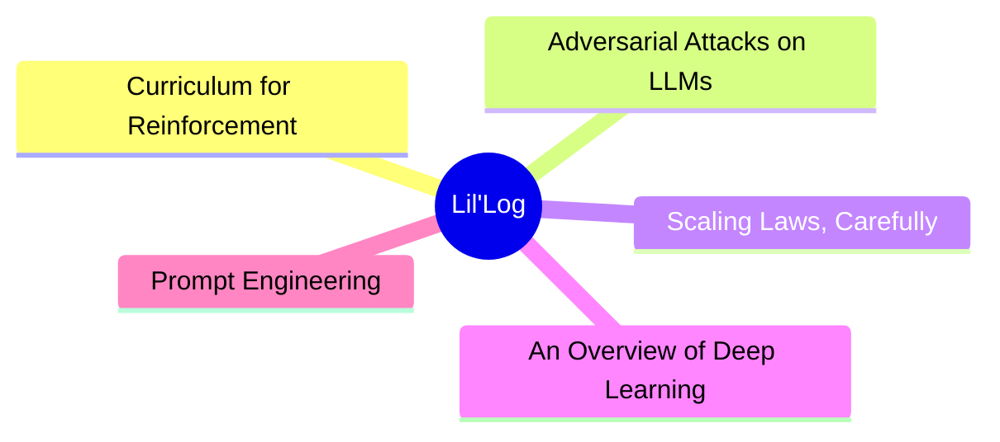
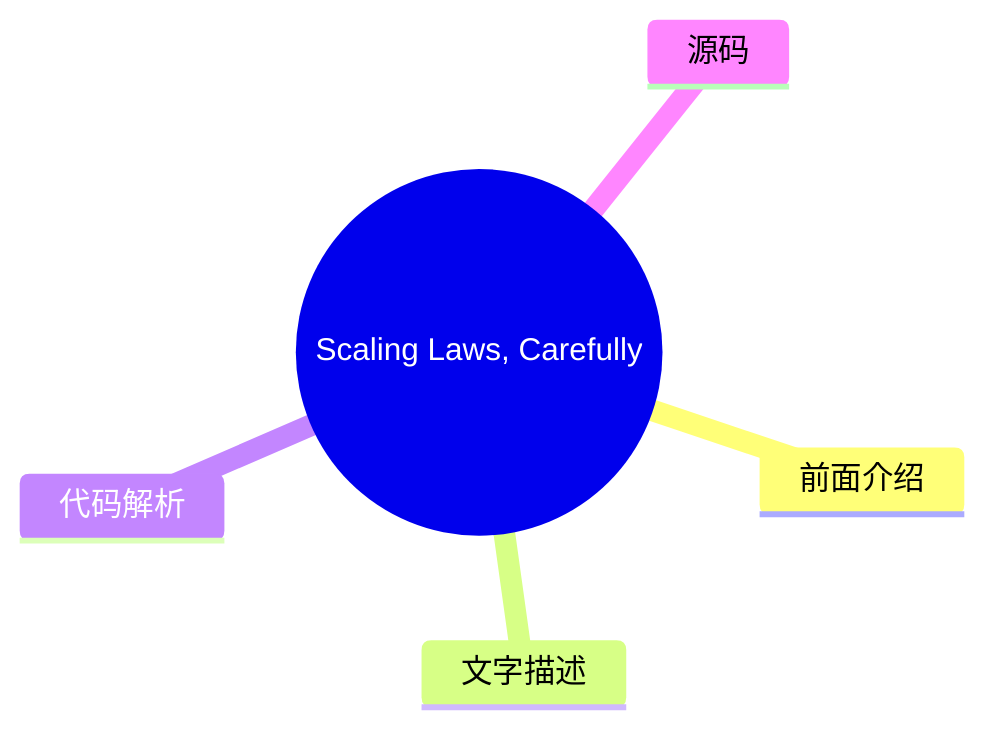
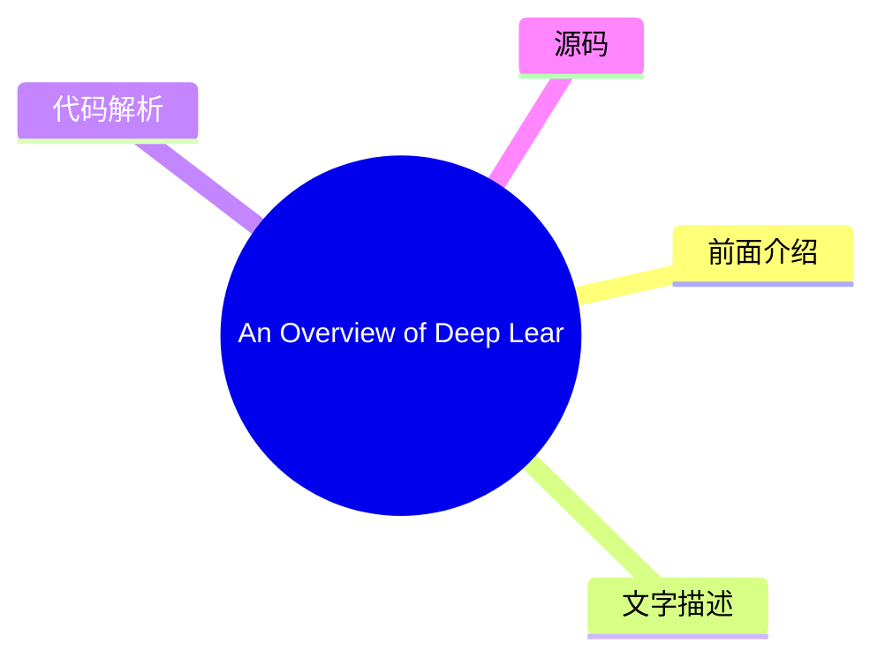
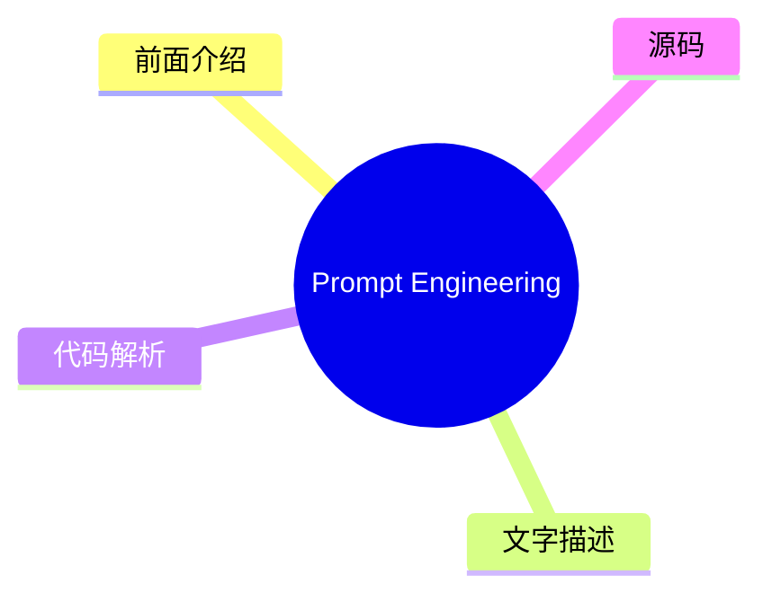

# 🧪 Lil'Log Top 5 (2026-08-02)

## 前面介绍

- 数据源：Lil'Log
- 抓取日期：2026-08-02
- 条目数：5
- 含完整正文：5
- 含代码片段：1
- 组织方式：前面介绍 / 树状图 / 文字描述 / 代码解析 / 源码

## 思维导图



## 详细整理（5 条，5 条含全文，1 条含代码）

### 1. Curriculum for Reinforcement Learning
- **链接**: [https://lilianweng.github.io/posts/2020-01-29-curriculum-rl/](https://lilianweng.github.io/posts/2020-01-29-curriculum-rl/)
- **发布**: Wed, 29 Jan 2020 00:00:00 +0000

#### 前面介绍

- [Updated on 2020-02-03: mentioning PCG in the &ldquo;Task-Specific Curriculum&rdquo; section.
[Updated on 2020-02-04: Add a new &ldquo;curriculum through distillation&rdquo; section.
- 发布时间：Wed, 29 Jan 2020 00:00:00 +0000

#### 树状图


#### 文字描述

- [Updated on 2020-02-03: mentioning [PCG](#pcg) in the “Task-Specific Curriculum” section. [Updated on 2020-02-04: Add a new [“curriculum through distillation”](#curriculum-through-distillation) section. It sounds like an impossible task if we want to teach integral or derivative to a 3-year-old who does not even know basic arithmetics. That’s why education is important, as it p
- # Task-Specific Curriculum[#](#task-specific-curriculum) [Bengio, et al. (2009)](https://www.researchgate.net/profile/Y_Bengio/publication/221344862_Curriculum_learning/links/546cd2570cf2193b94c577ac/Curriculum-learning.pdf) provided a good overview of curriculum learning in the old days. The paper presented two ideas with toy experiments using a manually designed task-specific
- # Teacher-Guided Curriculum[#](#teacher-guided-curriculum) [The idea of ]*Automatic Curriculum Learning* was proposed by [Graves, et al. 2017](https://arxiv.org/abs/1704.03003) slightly earlier. It considers a $N$-task curriculum as an [$N$-armed bandit](https://lilianweng.github.io/posts/2018-01-23-multi-armed-bandit/) problem and an adaptive policy which learns to optimize th
- # Curriculum through Self-Play[#](#curriculum-through-self-play) Different from the teacher-student framework, two agents are doing very different things. The teacher learns to pick a task for the student without any knowledge of the actual task content. What if we want to make both train on the main task directly? How about even make them compete with each other? [Sukhb ...（截断

#### 代码解析

- 本文未检测到明确代码块，内容更偏新闻、观点或方法论。

#### 源码

#### 中文节选

[Updated on 2020-02-03: 在“任务特定课程”部分提及了 [PCG](#pcg)。

[Updated on 2020-02-04: 新增了一个 [“通过蒸馏进行课程学习”](#curriculum-through-distillation) 部分。

如果我们想教一个连基本算术都不懂的三岁孩子积分或导数，这听起来像是一项不可能完成的任务。这就是为什么教育很重要的原因，因为它提供了一种系统性的方法来分解复杂的知识，并为从简单到困难地教授概念提供了一个很好的课程。课程让学习困难的事情对我们人类来说变得更容易、更可及。但是，机器学习模型呢？我们能否通过课程学习更高效地训练模型？我们能否设计一个课程来加速学习？

早在 1993 年，Jeffrey Elman 就提出了用课程训练神经网络的想法。他在学习简单语言语法方面的早期工作证明了这种策略的重要性：从一组受限的简单数据开始，并逐渐增加训练样本的复杂性；否则，模型根本无法学习。

与没有课程的学习相比，我们预期采用课程学习可以加速收敛速度，并且可能会或可能不会提高最终模型的性能。设计一个高效且有效的课程并不容易。请记住，糟糕的课程甚至可能会阻碍学习。

接下来，我们将研究几类课程学习，如图所示。大多数情况应用于强化学习，监督学习只有少数例外。

在“The importance of starting small”论文（[Elman 1993](http://citeseerx.ist.psu.edu/viewdoc/download?doi=10.1.1.128.4487&rep=rep1&type=pdf)）中，我特别喜欢开篇的句子，发现它们既鼓舞人心又引人深思：

“人类与其他物种在许多方面存在差异，但有两个方面尤为显著。人类表现出卓越的学习能力；而人类在达到成熟期所需的时间之长也令人瞩目。学习的适应优势显而易见，并且可以说，通过文化，学习为基于非遗传的行为传递奠定了基础，这可能加速了我们物种的进化。”

确实，学习可能是我们人类拥有的最佳超能力。

# 针对任务的课程[#](#task-specific-curriculum)

[Bengio 等人 (2009)](https://www.researchgate.net/profile/Y_Bengio/publication/221344862_Curriculum_learning/links/546cd2570cf2193b94c577ac/Curriculum-learning.pdf) 在过去提供了关于课程学习的良好概述。该论文通过使用手动设计的针对任务的课程进行的玩具实验，提出了两个观点：

- 更清晰的示例可能更快地带来更好的泛化能力。
- 逐步引入更困难的示例可以加速在线训练。

某些课程策略可能是无用甚至有害的。该领域一个值得回答的好问题是：*什么可能是

#### 完整正文（中文）

[Updated on 2020-02-03: 在“任务特定课程”部分提及了 [PCG](#pcg)。

[Updated on 2020-02-04: 新增了一个 [“通过蒸馏进行课程学习”](#curriculum-through-distillation) 部分。

如果我们想教一个连基本算术都不懂的三岁孩子积分或导数，这听起来像是一项不可能完成的任务。这就是为什么教育很重要的原因，因为它提供了一种系统性的方法来分解复杂的知识，并为从简单到困难地教授概念提供了一个很好的课程。课程让学习困难的事情对我们人类来说变得更容易、更可及。但是，机器学习模型呢？我们能否通过课程学习更高效地训练模型？我们能否设计一个课程来加速学习？

早在 1993 年，Jeffrey Elman 就提出了用课程训练神经网络的想法。他在学习简单语言语法方面的早期工作证明了这种策略的重要性：从一组受限的简单数据开始，并逐渐增加训练样本的复杂性；否则，模型根本无法学习。

与没有课程的学习相比，我们预期采用课程学习可以加速收敛速度，并且可能会或可能不会提高最终模型的性能。设计一个高效且有效的课程并不容易。请记住，糟糕的课程甚至可能会阻碍学习。

接下来，我们将研究几类课程学习，如图所示。大多数情况应用于强化学习，监督学习只有少数例外。

在“The importance of starting small”论文（[Elman 1993](http://citeseerx.ist.psu.edu/viewdoc/download?doi=10.1.1.128.4487&rep=rep1&type=pdf)）中，我特别喜欢开篇的句子，发现它们既鼓舞人心又引人深思：

人类在许多维度上与其他物种不同，但有两个维度尤为显著。人类表现出卓越的学习能力；而且，人类在达到成熟期所需的时间之长方面也令人瞩目。学习的适应性优势是显而易见的，而且可以说，通过文化，学习为非基于基因的行为传递奠定了基础，这可能加速了我们物种的进化。

确实，学习可能是我们人类拥有的最好超能力。

# 针对特定任务的课程[#](#task-specific-curriculum)

[Bengio等人 (2009)](https://www.researchgate.net/profile/Y_Bengio/publication/221344862_Curriculum_learning/links/546cd2570cf2193b94c577ac/Curriculum-learning.pdf) 在过去提供了关于课程学习的良好概述。该论文提出了两个观点，并使用手动设计的针对特定任务的课程进行了玩具实验：

- 更清洁的示例可能更快地带来更好的泛化能力。
- 逐步引入更困难的示例可以加速在线训练。

某些课程策略可能是无用甚至有害的。该领域需要回答的一个好问题是：*是什么通用原则使得某些课程策略比其他策略效果更好？* Bengio 2009年的论文假设，让学习专注于“有趣”的示例（既不太难也不太容易）将是有益的。

如果我们简单的课程是对样本按逐渐增加的复杂度进行训练，那么我们需要首先一种方法来量化任务的难度。一个想法是使用其在另一个模型上的最小损失，而该模型在其他任务上进行了预训练（[Weinshall等人 2018](https://arxiv.org/abs/1802.03796)）。通过这种方式，预训练模型的知识可以通过建议训练样本的排名来转移到新模型上。图2展示了`curriculum`组（绿色）相对于`control`组（随机顺序；黄色）和`anti`组（倒序；红色）的有效性。

[Zaremba & Sutskever (2014)](https://arxiv.org/abs/1410.4615) 做了一个有趣的实验，训练 LSTM 来预测短 Python 程序的输出，该程序用于数学运算，但并未实际执行代码。他们发现课程学习对于学习是必要的。程序的复杂性由两个参数控制，`length` ∈ [1, a] 和 `nesting`∈ [1, b]。考虑了三种策略：

- **朴素课程**：首先增加 `length` 直到达到 `a`；然后增加 `nesting` 并将 `length` 重置为 1；重复此过程直到两者都达到最大值。
- **混合课程**：采样 `length`~ [1, a] 和 `nesting`~ [1, b]
- **组合**：朴素 + 混合。

他们注意到组合策略总是优于朴素课程，并且通常（但并非总是）优于混合策略——这表明在训练中混合简单任务对于 *避免遗忘* 非常重要。

[程序化内容生成 (][PCG](https://en.wikipedia.org/wiki/Procedural_generation)) 是创建各种难度视频游戏的一种流行方法。PCG 涉及算法随机性以及大量的人类专业知识，用于设计游戏元素及其相互依赖关系。程序化生成的关卡已被引入几个基准环境中，用于评估强化学习智能体是否能够泛化到它未训练过的新关卡（[元强化学习](https://lilianweng.github.io/posts/2019-06-23-meta-rl/)！），例如 [GVGAI](http://www.gvgai.net/)、OpenAI [CoinRun](https://openai.com/blog/quantifying-generalization-in-reinforcement-learning/) 和 [Procgen benchmark](https://openai.com/blog/procgen-benchmark/)。使用 GVGAI，[Justesen 等人 (2018)](https://arxiv.org/abs/1806.10729) 证明了一个强化学习策略可以很容易地过拟合到特定的游戏，但在一个简单的课程上进行训练，该课程随着模型性能的提高而增加任务难度，有助于其泛化到新的人类设计关卡。在 CoinRun 中也发现了类似的结果 ([Cobbe 等人 2018](https://arxiv.org/abs/1812.02341))。POET ([Wang 等人, 2019](https://arxiv.org/abs/1901.01753)) 是另一个利用进化算法和程序化生成的游戏关卡来提高强化学习泛化能力的例子，我在我的 [元强化学习文章](https://lilianweng.github.io/posts/2019-06-23-meta-rl/#evolutionary-algorithm-on-environment-generation) 中详细描述了这一点。

为了遵循上述课程学习方法，通常我们需要在训练过程中解决两个问题：

- 设计一个指标来量化任务的难度，以便我们可以据此对任务进行排序。
- 在训练期间向模型提供一系列难度递增的任务。

然而，任务的顺序不必是顺序的。在我们的魔方论文（[OpenAI et al, 2019](https://arxiv.org/abs/1910.07113.））中，我们依赖于*自动领域随机化*（**ADR**）通过增长一系列复杂度递增的环境分布来生成课程。每个任务的难度（即在特定环境中解开魔方）取决于各种环境参数的随机化范围。即使假设所有环境参数都不相关，我们也能够为我们的机械手创建一个不错的课程来学习该任务。

# Teacher-Guided Curriculum[#](#teacher-guided-curriculum)

*自动课程学习*（**ACL**）的概念由[Graves 等人 2017](https://arxiv.org/abs/1704.03003)稍早提出。它将一个 $N$ 任务课程视为一个[$N$臂老虎机](https://lilianweng.github.io/posts/2018-01-23-multi-armed-bandit/)问题，以及一个学习优化该老虎机回报的自适应策略。

论文中考虑了两类学习信号：

- 驱动进度的损失：一次梯度更新前后损失函数的变化。这种类型的奖励信号跟踪学习过程的速度，因为最大的任务损失减少等同于最快的学习。
- 复杂驱动进度的 KL 散度：网络权重后验分布与先验分布之间的 KL 散度。这种类型的学习信号受到[MDL](https://en.wikipedia.org/wiki/Minimum_description_length)原理的启发，“增加一定量的模型复杂度只有在压缩数据量更大的情况下才是值得的”。因此，模型复杂度预期在模型很好地泛化到训练示例时增长最多。

[This framework of proposing curriculum automatically through another RL agent was formalized as ]*Teacher-Student Curriculum Learning* (**TSCL**; [Matiisen, et al. 2017](https://arxiv.org/abs/1707.00183)). In TSCL, a *student* is an RL agent working on actual tasks while a *teacher* agent is a policy for selecting tasks. The student aims to master a complex task that might be hard to learn directly. To make this task easier to learn, we set up the teacher agent to guide the student’s training process by picking proper sub-tasks.

In the process, the student should learn tasks which:

- can help the student make fastest learning progress, or
- are at risk of being forgotten.

Note: The setup of framing the teacher model as an RL problem feels quite similar to Neural Architecture Search (NAS), but differently the RL model in TSCL operates on the task space and NAS operates on the main model architecture space.


Training the teacher model is to solve a [POMDP](https://en.wikipedia.org/wiki/Partially_observable_Markov_decision_process) problem:

- The unobserved $s_t$ is the full state of the student model.
- The observed $o = (x_t^{(1)}, \dots, x_t^{(N)})$ are a list of scores for $N$ tasks.
- The action $a$ is to pick on subtask.
- The reward per step is the score delta.$r_t = \sum_{i=1}^N x_t^{(i)} - x_{t-1}^{(i)}$ (i.e., equivalent to maximizing the score of all tasks at the end of the episode).

The method of estimating learning progress from noisy task scores while balancing exploration vs exploitation can be borrowed from the non-stationary multi-armed bandit problem — use [ε-greedy](https://lilianweng.github.io/posts/2018-01-23-multi-armed-bandit/#%CE%B5-greedy-algorithm), or [Thompson sampling](https://lilianweng.github.io/posts/2018-01-23-multi-armed-bandit/#thompson-sampling).

The core idea, in summary, is to use one policy to propose tasks for another policy to learn better. Interestingly, both works above (in the discrete task space) found that uniformly sampling from all tasks is a surprisingly strong benchmark.


What if the task space is continuous? [Portelas, et al. (2019)](https://arxiv.org/abs/1910.07224) studied a continuous teacher-student framework, where the teacher has to sample parameters from continuous task space to generate a learning curriculum. Given a newly sampled parameter $p$, the absolute learning progress (short for ALP) is measured as $\text{ALP}_p = \vert r - r_\text{old} \vert$, where $r$ is the episodic reward associated with $p$ and $r_\text{old}$ is the reward associated with $p_\text{old}$. Here, $p_\text{old}$ is a previous sampled parameter closest to $p$ in the task space, which can be retrieved by nearest neighbor. Note that how this ALP score is different from learning signals in [TSCL](#TSCL) or [Grave, et al. 2017](#grave-et-al-2017) above: ALP score measures the reward difference between two tasks rather than performance at two time steps of the same task.

On top of the task parameter space, a Gaussian mixture model is trained to fit the distribution of $\text{ALP}_p$ over $p$. ε-greedy is used when sampling the tasks: with some probability, sampling a random task; otherwise sampling proportionally to ALP score from the GMM model.

# Curriculum through Self-Play[#](#curriculum-through-self-play)

Different from the teacher-student framework, two agents are doing very different things. The teacher learns to pick a task for the student without any knowledge of the actual task content. What if we want to make both train on the main task directly? How about even make them compete with each other?

[Sukhb

...（截断，原文 31549+ 字符）


### 2. Adversarial Attacks on LLMs
- **链接**: [https://lilianweng.github.io/posts/2023-10-25-adv-attack-llm/](https://lilianweng.github.io/posts/2023-10-25-adv-attack-llm/)
- **发布**: Wed, 25 Oct 2023 00:00:00 +0000

#### 前面介绍

- The use of large language models in the real world has strongly accelerated by the launch of ChatGPT. We (including my team at OpenAI, shoutout to them) have invested a lot of effort to build default safe behavior into the model during the alignment
- 发布时间：Wed, 25 Oct 2023 00:00:00 +0000

#### 树状图


#### 文字描述

- The use of large language models in the real world has strongly accelerated by the launch of ChatGPT. We (including my team at OpenAI, shoutout to them) have invested a lot of effort to build default safe behavior into the model during the alignment process (e.g. via [RLHF](https://openai.com/research/learning-to-summarize-with-human-feedback)). However, adversarial attacks or 
- # Basics[#](#basics)
- ## Threat Model[#](#threat-model) Adversarial attacks are inputs that trigger the model to output something undesired. Much early literature focused on classification tasks, while recent effort starts to investigate more into outputs of generative models. In the context of large language models In this post we assume the attacks only happen **at inference time**, meaning that *
- ### Classification[#](#classification) Adversarial attacks on classifiers have attracted more attention in the research community in the past, many in the image domain. LLMs can be used for classification too. Given an input $\mathbf{x}$ and a classifier $f(.)$, we would like to find an adversarial version of the input, denoted as $\mathbf{x}_\text{adv}$, with imperceptible dif

#### 代码解析

- 本文未检测到明确代码块，内容更偏新闻、观点或方法论。

#### 源码

#### 中文节选

ChatGPT 的发布极大地加速了大型语言模型在现实世界中的应用。我们（包括我在 OpenAI 的团队，向他们致敬）在对齐过程中投入了大量精力，将默认的安全行为构建到模型中（例如通过 [RLHF](https://openai.com/research/learning-to-summarize-with-human-feedback)）。然而，对抗性攻击或越狱提示可能会触发模型输出不受希望的内容。

大量关于对抗性攻击的基础工作集中在图像上，且操作方式不同，它运行在连续的高维空间中。由于缺乏直接的梯度信号，离散数据（如文本）的攻击被认为要困难得多。我之前关于 [Controllable Text Generation](https://lilianweng.github.io/posts/2021-01-02-controllable-text-generation/) 的帖子与此话题非常相关，因为攻击 LLM 本质上就是控制模型输出某种类型（不安全）的内容。

还有一部分工作致力于攻击 LLM 以提取预训练数据、私有知识（[Carlini et al, 2020](https://arxiv.org/abs/2012.07805)）或通过数据投毒攻击模型训练过程（[Carlini et al. 2023](https://arxiv.org/abs/2302.10149)）。我们不会在本文中涵盖这些话题。

# 基础知识[#](#basics)

## 威胁模型[#](#threat-model)

对抗性攻击是触发模型输出不受希望内容的输入。早期的文献主要集中在分类任务上，而最近的研究开始更多地关注生成模型的输出。在大型语言模型的背景下，本文假设攻击仅发生在**推理时**，这意味着**模型权重是固定的**。

### 分类[#](#classification)

分类器上的对抗性攻击在过去的研究社区中引起了更多关注，许多是在图像领域。LLM 也可以用于分类。给定输入 $\mathbf{x}$ 和分类器 $f(.)$，我们希望找到输入的一个对抗版本，记为 $\mathbf{x}_\text{adv}$，它与 $\mathbf{x}$ 的差异不可察觉，使得 $f(\mathbf{x}) \neq f(\mathbf{x}_\text{adv})$。

### 文本生成[#](#text生成)

给定输入 $\mathbf{x}$ 和生成模型 $p(.)$，模型输出一个样本 $\mathbf{y} \sim p(.\vert\mathbf{x})$。对抗性攻击将识别出这样的 $p(\mathbf{x})$，使得 $\mathbf{y}$ 违反模型的内置安全行为；例如，在非法话题上输出不安全内容，泄露私人信息或模型训练数据。对于生成任务，判断攻击是否成功并不容易，这需要一个非常高质量的分类器来判断 $\mathbf{y}$ 是否不安全或进行人工审查。

### 白盒与黑盒[#](#白盒与黑盒)

白盒攻击假设攻击者拥有对模型权重、架构和训练流程的完全访问权限，从而使攻击者能够获得梯度信号

#### 完整正文（中文）

ChatGPT 的发布极大地加速了大型语言模型在现实世界中的应用。我们（包括我在 OpenAI 的团队，向他们致敬）在对齐过程中投入了大量精力，将默认的安全行为构建到模型中（例如通过 [RLHF](https://openai.com/research/learning-to-summarize-with-human-feedback)）。然而，对抗性攻击或越狱提示可能会触发模型输出不受希望的内容。

大量关于对抗性攻击的基础工作集中在图像上，且操作方式不同，它运行在连续的高维空间中。由于缺乏直接的梯度信号，离散数据（如文本）的攻击被认为要困难得多。我之前关于 [Controllable Text Generation](https://lilianweng.github.io/posts/2021-01-02-controllable-text-generation/) 的帖子与此话题非常相关，因为攻击 LLM 本质上就是控制模型输出某种类型（不安全）的内容。

还有一部分工作致力于攻击 LLM 以提取预训练数据、私有知识（[Carlini et al, 2020](https://arxiv.org/abs/2012.07805)）或通过数据投毒攻击模型训练过程（[Carlini et al. 2023](https://arxiv.org/abs/2302.10149)）。我们不会在本文中涵盖这些话题。

# 基础知识[#](#basics)

## 威胁模型[#](#threat-model)

对抗性攻击是触发模型输出不受希望内容的输入。早期的文献主要集中在分类任务上，而最近的研究开始更多地关注生成模型的输出。在大型语言模型的背景下，本文假设攻击仅发生在**推理时**，这意味着**模型权重是固定的**。

### 分类[#](#classification)

分类器上的对抗性攻击在过去的研究社区中引起了更多关注，许多是在图像领域。LLM 也可以用于分类。给定输入 $\mathbf{x}$ 和分类器 $f(.)$，我们希望找到输入的一个对抗版本，记为 $\mathbf{x}_\text{adv}$，它与 $\mathbf{x}$ 的差异不可察觉，使得 $f(\mathbf{x}) \neq f(\mathbf{x}_\text{adv})$。

### 文本生成[#](#text-generation)

给定输入 $\mathbf{x}$ 和生成模型 $p(.)$，模型输出一个样本 $\mathbf{y} \sim p(.\vert\mathbf{x})$。对抗性攻击将识别出这样的 $p(\mathbf{x})$，使得 $\mathbf{y}$ 违反模型的内置安全行为；例如，在非法话题上输出不安全内容，泄露私人信息或模型训练数据。对于生成任务，判断攻击是否成功并不容易，这需要高质量的分类器来判断 $\mathbf{y}$ 是否不安全，或者进行人工审查。

### 白盒与黑盒攻击[#](#white-box-vs-black-box)

白盒攻击假设攻击者拥有对模型权重、架构和训练流程的完全访问权限，从而攻击者可以获取梯度信号。我们并不假设攻击者拥有对完整训练数据的访问权限。这仅适用于开源模型。黑盒攻击假设攻击者只能访问类似 API 的服务，他们提供输入 $\mathbf{x}$ 并返回样本 $\mathbf{y}$，而不知道关于模型的任何其他信息。

# 对抗性攻击类型[#](#types-of-adversarial-attacks)

有多种方法可以找到对抗性输入，以触发 LLM 输出不需要的内容。我们在此介绍五种方法。

| 攻击方式 | 类型 | 描述 | 
|---|---|---|
| Token 操作 | 黑盒 | 改变文本输入中一小部分 token，使其触发模型故障，但仍保持其原始语义含义。 | 
| 基于梯度的攻击 | 白盒 | 依赖梯度信号来学习有效的攻击。 | 
| 越狱提示 | 黑盒 | 通常基于启发式提示来“越狱”内置的模型安全机制。 | 
| 人工红队测试 | 黑盒 | 人工攻击模型，可能得到其他模型的辅助。 | 
| 模型红队测试 | 黑盒 | 模型攻击模型，其中攻击模型可以被微调。 | 

## Token 操作[#](#token-manipulation)

给定一段包含一系列 token 的文本输入，我们可以应用简单的 token 操作，如使用同义词替换，来触发模型做出不正确的预测。基于 token 操作的攻击在 **黑盒** 设置中有效。Python 框架 TextAttack ([Morris et al. 2020](https://arxiv.org/abs/2005.05909)) 实现了许多单词和 token 操作攻击方法，以创建 NLP 模型的对抗样本。该领域的大多数工作都实验了分类和蕴含预测。

[Ribeiro et al (2018)](https://www.aclweb.org/anthology/P18-1079/) 依赖手动提出的语义等价对抗规则 (SEARs) 来进行最小化 token 操作，从而使模型无法生成正确的答案。示例规则包括 (*What  NOUN→Which NOUN*), (*

*), (*

`WP` is → `WP`’s’*was→is*), 等。对抗操作后的语义等价性通过回译进行检查。这些规则是通过相当手动、启发式的过程提出的，SEARs 探测的模型“漏洞”类型仅限于对最小 token 变化的敏感性，随着基础 LLM 能力的提高，这不应成为问题。

相比之下，[EDA](https://lilianweng.github.io/posts/2022-04-15-data-gen/#EDA) (Easy Data Augmentation; [Wei & Zou 2019](https://arxiv.org/abs/1901.11196)) 定义了一组简单且更通用的操作来增强文本：同义词替换、随机插入、随机交换或随机删除。EDA 增强被证明可以提高多个基准测试的分类准确率。

TextFooler ([Jin et al. 2019](https://arxiv.org/abs/1907.11932)) 和 [BERT-Attack (][Li et al. 2020](https://aclanthology.org/2020.emnlp-main.500.pdf)) 遵循相同的流程：首先识别出最重要且脆弱的单词，这些单词会最大程度地改变模型预测，然后以某种方式替换这些单词。

给定一个分类器 $f$ 和一个输入文本字符串 $\mathbf{x}$，每个单词的重要性分数可以通过以下方式测量：

其中 $f_y$ 是标签 $y$ 的预测 logits，$x_{\setminus w_i}$ 是排除了目标词 $w_i$ 的输入文本。重要性高的词是很好的替换候选词，但应跳过停用词，以避免破坏语法。

TextFooler 基于词嵌入余弦相似度用顶级同义词替换这些词，然后通过检查替换词是否仍具有相同的词性标注以及句子级相似度是否高于阈值来进行进一步过滤。BERT-Attack 则通过 BERT 用语义相似的词替换词，因为上下文感知预测是掩码语言模型非常自然的用例。通过这种方式发现的对抗样本在不同模型之间具有一定的迁移性，具体取决于模型和任务。

## 基于梯度的攻击[#](#gradient-based-attacks)

在白盒设置中，我们可以完全访问模型参数和架构。因此，我们可以依靠梯度下降来编程学习最有效的攻击。基于梯度的攻击仅在白盒设置中有效，例如对于开源 LLM。

**GBDA**（“基于梯度的分布攻击”；[Guo et al. 2021](https://arxiv.org/abs/2104.13733)）使用 Gumbel-Softmax 近似技巧来*使对抗损失优化可微*，其中使用 BERTScore 和困惑度来保证可感知性和流畅性。给定一个 token 输入 $\mathbf{x}=[x_1, x_2 \dots x_n]$，其中一个 token $x_i$ 可以从分类分布 $P_\Theta$ 中采样，其中 $\Theta \in \mathbb{R}^{n \times V}$ 且 $V$ 是 token 词汇表大小。考虑到 $V$ 通常约为 $O(10,000)$ 且大多数对抗示例只需要几个 token 替换，它具有高度过参数化的特征。我们有：

$$ x_i \sim P_{\Theta_i} = \text{Categorical}(\pi_i) = \text{Categorical}(\text{Softmax}(\Theta_i)) $$

其中 $\pi_i \in \mathbb{R}^V$ 是第 $i$ 个 token 的 token 概率向量。要最小化的对抗目标函数是让分类器 $f$ 对输入 $\mathbf{X}$ 产生与正确标签 $y$ 不同的错误标签：$\min_{\Theta \in \mathbb{R}^{n \times V}} \mathbb{E}_{\mathbf{x} \sim P_{\Theta}} \mathcal{L}_\text{adv}(\mathbf{X}, y; f)$。然而，表面上由于是分类分布，这不可微。使用 Gumbel-softmax 近似 ([Jang et al. 2016](https://arxiv.org/abs/1611.01144))，我们通过 $\tilde{\boldsymbol{\pi}}$ 从 Gumbel 分布 $\tilde{P}_\Theta$ 近似分类分布：

其中 $g_{ij} \sim \text{Gumbel}(0, 1)$；温度 $\tau > 0$ 控制分布的平滑度。

Gumbel 分布用于对样本数量（无论样本分布如何）的 *极端* 值、最大值或最小值进行建模。额外的 Gumbel 噪声引入了模拟从分类分布中采样的随机决策过程。

低温度 $\tau \to 0$ 推动收敛到分类分布，因为从温度为 0 的 softmax 中采样是确定性的。“采样”部分仅取决于 $g_{ij}$ 的值，该值主要围绕 0 中心。

设 $\mathbf{e}_j$ 为 token $j$ 的嵌入表示。我们可以用 $\bar{e}(\tilde{\boldsymbol{\pi}})$ 近似 $\mathbf{x}$，即对应于 token 概率的嵌入向量的加权平均：$\bar{e}(\pi_i) = \sum_{j=1}^V \pi_i^{(j)} \mathbf{e}_j$。请注意，当 $\pi_i$ 是对应于 token $x_i$ 的 one-hot 向量时，我们将有 $\bar{e}(\pi_i) = \mathbf{e}_{z_i}$。结合嵌入表示和 Gumbel-softmax 近似，我们有一个可最小化的可微目标：$\min_{\Theta \in \mathbb{R}^{n \times V}} \mathbb{E}_{\tilde{\boldsymbol{\pi}} \sim \tilde{P}_{\Theta}} \mathcal{L}_\text{adv}(\bar{e}(\tilde{\boldsymbol{\pi}}), y; f)$。

与此同时，也很容易应用可微的软约束来进行白盒攻击。GBDA 实验了（1）使用 NLL（负对数似然）的软流畅度约束和（2）BERTScore（*“一种用于评估文本生成的相似度分数，能够捕捉 Transformer 模型上下文嵌入中成对标记之间的语义相似度。”*；[Zhang et al. 2019](https://arxiv.org/abs/1904.09675)）来测量两个文本输入之间的相似度，以确保扰动后的版本不会与原始版本偏离太远。结合所有约束，最终的目标函数如下，其中 $\lambda_\text{lm}, \lambda_\text{sim} > 0$ 是预设的超参数，用于控制软约束的强度：

Gumbel-softmax 技巧很难扩展到标记删除或添加，因此它仅限于标记替换操作，不包括删除或添加。

**HotFlip** ([Ebrahimi et al. 2018](https://arxiv.org/abs/1712.06751)) 将文本操作视为向量空间中的输入，并测量损失对这些向量的导数。这里假设输入向量是一个字符级独热编码矩阵，$\mathbf{x} \in {0, 1}^{m \times n \times V}$ 且 $\mathbf{x}_{ij} \in {0, 1}^V$，其中 $m$ 是单词的最大数量，$n$ 是每个单词的最大字符数，$V$ 是字母表大小。给定原始输入向量 $\mathbf{x}$，我们构造一个新的向量 $\mathbf{x}_{ij, a\to b}$，其中第 $i$ 个单词的第 $j$ 个字符从 $a \to b$ 发生变化，因此我们有 $x_{ij}^{(a)} = 1$ 但 $x_{ij, a\to b}^{(a)} = 0, x_{ij, a\to b}^{(b)} = 1$。

根据一阶泰勒展开，损失的变化为：

该目标函数经过优化，以仅使用一次反向传播来选择使对抗损失最小的向量。

为了应用多次翻转，我们可以运行一个 $r$ 步的束搜索

...（截断，原文 46582+ 字符）


### 3. Scaling Laws, Carefully
- **链接**: [https://lilianweng.github.io/posts/2026-06-24-scaling-laws/](https://lilianweng.github.io/posts/2026-06-24-scaling-laws/)
- **发布**: Wed, 24 Jun 2026 00:00:00 +0000

#### 前面介绍

- Scaling laws are one of the most critical empirical findings in deep learning. The observation is simple in form: the training loss $L$ decreases predictably as we scale up model size $N$, dataset size $D$, and compute $C$, following a power-law curv
- 发布时间：Wed, 24 Jun 2026 00:00:00 +0000

#### 树状图



#### 文字描述

- Scaling laws are one of the most critical empirical findings in deep learning. The observation is simple in form: the training loss $L$ decreases predictably as we scale up model size $N$, dataset size $D$, and compute $C$, following a power-law curve, which appears as a straight line on a log-log plot. We can view scaling laws as a framework for describing the relationship bet
- # Early days: ML loss predictability[#](#early-days-ml-loss-predictability) The predictability of generalization error with scale had already been investigated before scaling laws became a mainstream concept. [Amari et al. (1992)](https://ieeexplore.ieee.org/document/6796972) derived four types of learning curves using a Bayesian approach and the annealed approximation. - Deter
- # Scaling Laws in Data-Infinite Region[#](#scaling-laws-in-data-infinite-region)
- ## Kaplan et al.’s Scaling Laws[#](#kaplan-et-als-scaling-laws) [Kaplan et al. (2020)](https://arxiv.org/abs/2001.08361) popularized the concept of scaling laws in the language modeling community. They found that the cross-entropy test loss $L$ scales as a power law with each of model size $N$ (excluding embedding layers), dataset size $D$, and training compute $C$ across many 

#### 代码解析

- 本文未检测到明确代码块，内容更偏新闻、观点或方法论。

#### 源码

#### 中文节选

缩放定律是深度学习中最关键的实证发现之一。其观察结果形式简单：随着模型大小 $N$、数据集大小 $D$ 和计算量 $C$ 的增加，训练损失 $L$ 遵循幂律曲线呈可预测地下降，这在双对数图上表现为一条直线。我们可以将缩放定律视为描述计算量、损失、模型大小和数据之间关系的框架；其核心在于如何在这两者之间最优地分配宝贵的计算资源。

这种可预测性使缩放定律在实践中极具价值。常见的工作流程是在少量小规模运行中拟合缩放定律，然后进行外推，以估算更大模型的代币和计算需求。

| 符号 | 备注 |
|---|---|
| $N$ | 模型大小，以参数数量衡量。 |
| $D$ | 训练数据集大小，通常以代币数量衡量。 |
| $C$ | 以 FLOPs 为单位的训练计算量。作为一个有用的近似，$C \approx 6ND$（[Kaplan 等人 2020](https://arxiv.org/abs/2001.08361)），其中 $2ND$ 用于前向传播，$4ND$ 用于反向传播。 |
| $E$ | 不可约损失 |
| $L, \hat{L}(.)$ | 测试损失 / 测试损失预测函数；也可以指训练损失，因为它们之间存在强相关性。 |
| $\epsilon$ | 泛化误差。 |

# 早期：机器学习损失的可预测性[#](#early-days-ml-loss-predictability)

在缩放定律成为主流概念之前，泛化误差的可预测性就已经被研究过了。

[Amari 等人 (1992)](https://ieeexplore.ieee.org/document/6796972) 使用贝叶斯方法和退火近似推导出了四种类型的学习曲线。

- 确定性学习算法、无噪声数据、唯一解：$\epsilon \sim c \cdot D^{-1}$，其中 $c$ 是某个常数。
- 确定性学习算法、无噪声数据、多个等价解：$\epsilon \sim c \cdot D^{-2}$；随着每个新数据点的加入，学习速度更快，因为模型只学习参数的最优流形，而不是寻找单个解点。

- 确定性学习算法，噪声数据：$\epsilon \sim c \cdot D^{-1/2}$；数据中的噪声使得学习变得更困难。
- 随机学习算法，噪声数据：$\epsilon \sim c \cdot D^{-1} + E$；这里的不可约损失 $E$ 是随机学习者无法进一步降低的残差误差，例如当模型在大数据上耗尽容量时。所有四种类型的学习曲线都遵循幂律：

其中 $E$ 可以是 0，且 $\alpha = -2, -1, -1/2$。尽管其理论设定基于简化的二分类任务，但这为构建经验式机器学习损失预测模型指明了一个有用的方向。

[Hestness et al. (2017)](https://arxiv.org/abs/1712.00409) 最早的经验研究之一解释了泛化误差、模型大小和数据之间的关系。对于给定的训练数据大小，他们通过网格搜索确定了最佳拟合模型大小，然后绘制

#### 完整正文（中文）

缩放定律是深度学习中最关键的实证发现之一。其观察结果形式简单：随着模型大小 $N$、数据集大小 $D$ 和计算量 $C$ 的增加，训练损失 $L$ 遵循幂律曲线呈可预测地下降，这在双对数图上表现为一条直线。我们可以将缩放定律视为描述计算量、损失、模型大小和数据之间关系的框架；其核心在于如何在这两者之间最优地分配宝贵的计算资源。

这种可预测性使缩放定律在实践中极具价值。常见的工作流程是在少量小规模运行中拟合缩放定律，然后进行外推，以估算更大模型的代币和计算需求。

| 符号 | 备注 |
|---|---|
| $N$ | 模型大小，以参数数量衡量。 |
| $D$ | 训练数据集大小，通常以代币数量衡量。 |
| $C$ | 以 FLOPs 为单位的训练计算量。作为一个有用的近似，$C \approx 6ND$（[Kaplan 等人 2020](https://arxiv.org/abs/2001.08361)），其中 $2ND$ 用于前向传播，$4ND$ 用于反向传播。 |
| $E$ | 不可约损失 |
| $L, \hat{L}(.)$ | 测试损失 / 测试损失预测函数；也可以指训练损失，因为它们之间存在强相关性。 |
| $\epsilon$ | 泛化误差。 |

# 早期：机器学习损失的可预测性[#](#early-days-ml-loss-predictability)

在缩放定律成为主流概念之前，泛化误差的可预测性就已经被研究过了。

[Amari 等人 (1992)](https://ieeexplore.ieee.org/document/6796972) 使用贝叶斯方法和退火近似推导出了四种类型的学习曲线。

- 确定性学习算法、无噪声数据、唯一解：$\epsilon \sim c \cdot D^{-1}$，其中 $c$ 是某个常数。
- 确定性学习算法、无噪声数据、多个等价解：$\epsilon \sim c \cdot D^{-2}$；随着每个新数据点的加入，学习速度更快，因为模型只学习参数的最优流形，而不是寻找单个解点。

- 确定性学习算法，噪声数据：$\epsilon \sim c \cdot D^{-1/2}$；数据中的噪声使学习变得更困难。
- 随机学习算法，噪声数据：$\epsilon \sim c \cdot D^{-1} + E$；这里的不可约损失 $E$ 是随机学习者无法进一步降低的残差误差，例如当模型在大数据上耗尽容量时。所有四种类型的学习曲线都遵循幂律：

其中 $E$ 可以是 0，且 $\alpha = -2, -1, -1/2$。尽管其理论设定基于简化的二分类任务，但它为构建经验式机器学习损失预测模型指明了一个有用的方向。

[Hestness et al. (2017)](https://arxiv.org/abs/1712.00409) 最早的经验研究之一解释了泛化误差、模型大小和数据之间的关系。对于给定的训练数据大小，他们通过网格搜索确定了最佳拟合模型大小，然后将损失与训练数据集大小进行绘图。在深度学习的四个不同领域（神经机器翻译、图像分类、语言建模和语音识别）中，观察到了一种反复出现的模式，即：

- 泛化误差随一组因素（例如数据大小）按幂律缩放。
- 模型改进会移动误差曲线，但似乎不会影响幂律指数。
- 有趣的是，架构改变了幂律拟合的偏移量（$E$），但不会改变指数（$\alpha$）。幂律的斜率似乎是问题域的属性，而不是模型架构的属性。
- 拟合大小为 $D$ 的数据集所需的模型参数数量 $N$ 也按幂律缩放。

一个概念性示意图将学习曲线分为三个阶段。在小数据区域，当学习信号不足时，模型的性能仅略好于随机猜测。在中间（“幂律区域”），我们观察到损失、数据和模型大小之间存在幂律关系。最终的不可约误差区域可归因于数据中的噪声等因素。

[Rosenfeld 等人 (2020)](https://arxiv.org/abs/1909.12673) 通过尝试将误差建模为模型大小 $N$ 和数据大小 $D$ 的联合函数，在多种架构（ResNet、WRN、LSTM、Transformer）和优化器（Adam、SGD 变体）上进一步推进了这一工作。实证观察表明，在固定一个轴的情况下，误差随另一个轴呈幂律衰减：

这可以合并为一个联合形式：

其中 $A > 0, B > 0, \alpha \geq 0, \beta \geq 0$ 是标量常数，且 $E$ 不依赖于 $N$ 或 $D$。

因此，他们可以构建一个简单的参数化函数形式的预测模型，其参数为 $\boldsymbol{\theta} = \langle A, B, E, \alpha, \beta \rangle$，仅通过在较小的训练配置集合 $(D, N)$ < 某些阈值上进行训练，来预测 $(D, N)$ > 某些阈值的预期损失。

附注：这些早期工作依赖于经典的机器学习理论直觉，例如 [VC 维](https://en.wikipedia.org/wiki/Vapnik%E2%80%93Chervonenkis_dimension)（模型可以打散的最大点集的基数）作为容量的代理，但在现代深度学习工作中，VC 维往往过于粗糙，无法解释这种行为，而经验幂律结果比理论提供的最坏情况界限要清晰得多，也更具实用性。

# 数据无限区域的缩放定律[#](#scaling-laws-in-data-infinite-region)

## Kaplan 等人的缩放定律[#](#kaplan-et-als-scaling-laws)

[Kaplan et al. (2020)](https://arxiv.org/abs/2001.08361) 在语言建模社区普及了缩放定律的概念。他们发现，交叉熵测试损失 $L$ 随着模型大小 $N$（不包括嵌入层）、数据集大小 $D$ 和训练计算量 $C$ 的变化，在许多数量级范围内呈现出幂律关系。这些发现与上一节中的早期工作一致，但 Kaplan 等人通过专注于 Transformer 语言模型并在更大规模上进行实证实验，正式化了这一概念，模型大小范围从 7.68 亿到 15 亿个非嵌入参数，数据集大小范围从 2200 万到 230 亿个 token。论文中的所有训练运行都使用了学习率调度，包含 3000 步的线性预热，随后是衰减至零的余弦衰减。

关键发现列表：

- 损失 $L$ 分别与 $N$、$D$ 和 $C$ 呈幂律关系；为了获得最佳性能，这三者必须同步缩放。
- 训练曲线遵循可预测的幂律，其参数大致与模型大小无关。
- 更大的模型具有更高的样本效率，这意味着它们在更少的优化步数和更少的数据点下就能达到给定的损失。
- 架构细节（宽度、长宽比等）的重要性不如单纯的规模。
- 训练损失和测试损失呈正相关。（听起来微不足道，但这为预训练工作奠定了基础。另一方面，预训练损失的改进是否能转移到后训练评估上，需要单独研究。）
- 在固定的计算预算下，训练一个非常大的模型并在*收敛前*停止，比训练较小的模型直到收敛更高效。**这一发现与 Chinchilla 缩放定律（下一节）相矛盾：Kaplan 等人高估了最佳模型大小，因为其拟合的指数较大。**

他们在一个方程中总结了 $N$ 和 $D$ 的联合依赖关系：

这种形式的另一个好处是，过拟合的程度（即模型复杂或数据较少）主要取决于 $N^{\alpha / \beta} / D$ 的比值，这表明数据需要以特定的比例随模型大小的增长而增长，以避免训练受限于数据量。

Kaplan 等人发现 $N_\text{opt} \propto C^{0.73}$，并得出结论，模型大小的增长速度应快于数据集大小的增长速度。具体来说，对于计算量增加 10 倍，他们建议将模型大小增加约 5.5 倍，但仅将训练标记增加约 1.8 倍。Chinchilla 论文后来推翻了这一建议，认为这会导致大型模型严重*欠训练*。

Kaplan 等人进行的另一个有用的分析是根据 $D$ 和 $N$ 近似计算所需的训练 FLOPs。每次乘加运算大约算作 2 FLOPs。

假设标准配置为 $d_\text{attn} = d_\text{model} = d_\text{ff}/4$，并从 $N$ 中排除嵌入层以及每个标记的前向计算：

然后我们将反向传播的 FLOPs 计算为前向传播 FLOPs 的两倍，因为反向传播运行了两次矩阵乘法，分别用于计算关于输入激活值和权重的梯度。因此，总训练 FLOPs 每个标记约为 $6N$，而 $D$ 个标记的总训练 FLOPs 为 $C \approx 6ND$。

## Chinchilla 扩展定律[#](#chinchilla-scaling-laws)

Chinchilla 论文 ([Hoffmann et al. 2022](https://arxiv.org/abs/2203.15556)) 在固定计算预算 $C$ 下，通过更严谨的实验设计研究了最优模型大小 $N$（总参数，*包括*嵌入层）与标记数量 $D$ 之间的关系，得出了与 Kaplan 等人略有不同的结论。

核心问题是在约束条件 $\text{FLOPs}(N, D) = C \approx 6ND$ 下，如何分配资源才是最佳策略。换句话说，当我们只有有限的 FLOPs（即给定数量的 GPU 运行给定的时间）时，我们应如何在更多的数据标记和更多的模型参数之间做出选择？

Chinchilla 论文提出了三种设计精巧的方法来拟合缩放定律。

实证实验扫描了 400 多个模型，参数量从 70M 到超过 16B，训练 token 从 5B 到 500B。实验基于每个训练 token 都是唯一的假设（无限数据 regime）。所有运行都使用了余弦学习率调度，在训练过程中衰减 10 倍。扫描模型大小描绘出了计算最优前沿。

### 方法 1：固定模型大小，变化 token 预算[#](#method-1-fix-model-sizes-vary-the-token-budget)

对于每个参数量 $N$，使用不同的 token 预算训练多次运行，并记录每个 FLOP 预算 $C$ 下达到的最小损失。

### 方法 2：IsoFLOP 曲线[#](#method-2-isoflop-profiles)

固定计算预算 $C$，将最终损失绘制为参数量 $N$ 的函数。每个 iso-FLOP 曲线在 log 空间中大致呈抛物线，其最小值标记了该计算预算下的最优模型大小。然后在预算之间重复此过程，在图中描绘出一条幂律线。

### 方法 3：参数拟合[#](#method-3-parametric-fit)

[直接拟合与 ][Rosenfeld et al. (2020)](https://arxiv.org/abs/1909.12673) 中相同的参数函数，

我们实际上可以通过在约束条件 $\text{FLOPs}(N,D) = C \approx 6ND$ 下最小化 $\hat{L}(N, D)$，得到最优 $N_\text{opt}(C), D_\text{opt}(C)$ 的闭式近似。

首先让我们将表达式简化为仅包含 $N$：

当 $\alpha \approx \beta$ 时，模型大小和训练 token 应以相同的速率缩放。

为了找到最优的 $\boldsymbol{\theta} = \langle A, B, E, \alpha, \beta\rangle$，Chinchilla 论文采用了 [Huber loss](https://en.wikipedia.org/wiki/Huber_loss)（对异常值具有鲁棒性；$\delta=10^{-3}$）和 [L-BFGS 算法](https://en.wikipedia.org/wiki/Limited-memory_BFGS)（适合参数较少的曲线拟合）。

Chinchilla 通过三种互补方法得出其结论，其最终结果相互一致，这也是该结果相当令人信服的原因之一。

The claim in the Chinchilla paper that most large models (at the time, ~2022) were undertrained is supported by a famous demonstration: under the same compute budget as Gopher ([Rae et al. 2021](https://arxiv.org/abs/2112.11446); 280B parameter count, 

...（截断，原文 29101+ 字符）


### 4. An Overview of Deep Learning for Curious People
- **链接**: [https://lilianweng.github.io/posts/2017-06-21-overview/](https://lilianweng.github.io/posts/2017-06-21-overview/)
- **发布**: Wed, 21 Jun 2017 00:00:00 +0000

#### 前面介绍

- (The post was originated from my talk for WiMLDS x Fintech meetup hosted by Affirm.)
I believe many of you have watched or heard of the games between AlphaGo and professional Go player Lee Sedol in 2016. Lee has the highest rank of nine dan and many
- 发布时间：Wed, 21 Jun 2017 00:00:00 +0000

#### 树状图



#### 文字描述

- (The post was originated from my talk for [WiMLDS x Fintech meetup](http://wimlds.org/chapters/about-bay-area/) hosted by [Affirm](www.affirm.com).) I believe many of you have watched or heard of the [games](https://youtu.be/vFr3K2DORc8) between AlphaGo and professional Go player [Lee Sedol](https://en.wikipedia.org/wiki/Lee_Sedol) in 2016. Lee has the highest rank of nine dan 
- # Why Does Deep Learning Work Now?[#](#why-does-deep-learning-work-now) Deep learning models, in simple words, are large and deep artificial neural nets. A neural network (“NN”) can be well presented in a [directed acyclic graph](https://en.wikipedia.org/wiki/Directed_acyclic_graph): the input layer takes in signal vectors; one or multiple hidden layers process the outputs of t
- # Deep Learning Models[#](#deep-learning-models) Next, let’s go through a few classical deep learning models.
- ## Convolutional Neural Network[#](#convolutional-neural-network) Convolutional neural networks, short for “CNN”, is a type of feed-forward artificial neural networks, in which the connectivity pattern between its neurons is inspired by the organization of the visual cortex system. The primary visual cortex (V1) does edge detection out of the raw visual input from the retina. T

#### 代码解析

- 本文未检测到明确代码块，内容更偏新闻、观点或方法论。

#### 源码

#### 中文节选

(The post was originated from my talk for [WiMLDS x Fintech meetup](http://wimlds.org/chapters/about-bay-area/) hosted by [Affirm](www.affirm.com).)

I believe many of you have watched or heard of the [games](https://youtu.be/vFr3K2DORc8) between AlphaGo and professional Go player [Lee Sedol](https://en.wikipedia.org/wiki/Lee_Sedol) in 2016. Lee has the highest rank of nine dan and many world championships. No doubt, he is one of the best Go players in the world, but he [lost by 1-4](https://www.scientificamerican.com/article/how-the-computer-beat-the-go-master/) in this series versus AlphaGo. Before this, Go was considered to be an intractable game for computers to master, as its simple rules lay out an exponential number of variations in the board positions, many more than what in Chess. This event surely highlighted 2016 as a big year for AI. Because of AlphaGo, much attention has been attracted to the progress of AI.

Meanwhile, many companies are spending resources on pushing the edges of AI applications, that indeed have the potential to change or even revolutionize how we are gonna live. Familiar examples include self-driving cars, chatbots, home assistant devices and many others. One of the secret receipts behind the progress we have had in recent years is deep learning.

# Why Does Deep Learning Work Now?[#](#why-does-deep-learning-work-now)

Deep learning models, in simple words, are large and deep artificial neural nets. A neural network (“NN”) can be well presented in a [directed acyclic graph](https://en.wikipedia.org/wiki/Directed_acyclic_graph): the input layer takes in signal vectors; one or multiple hidden layers process the outputs of the previous layer. The initial concept of a neural network can be traced back to more than [half a century ago](https://cs.stanford.edu/people/eroberts/courses/soco/projects/neural-networks/History/history1.html). But why does it work now? Why do people start talking about them all of a sudden?

The reason is surprisingly simple:

- We have a lot **more data**.
- We have **much powerful computers**.


A large and deep neural network has many more layers + many more nodes in each layer, which results in exponentially many more parameters to tune. Without enough data, we cannot learn parameters efficiently. Without powerful computers, learning would be too slow and insufficient.

Here is an interesting plot presenting the relationship between the data scale and the model performance, proposed by Andrew Ng in his “[Nuts and Bolts of Applying Deep Learning](https://youtu.be/F1ka6a13S9I)” talk. On a small dataset, traditional algorithms (Regression, Random Forests, SVM, GBM, etc.) or statistical learning does a great job, but once the data scale goes up to the sky, the large NN outperforms others. Partially because compared to a traditional ML model, a neural network model has many more parameters and has the capability to learn complicated nonlinear patterns. Thus we expect the model to pick the most h

#### 完整正文（中文）

(The post was originated from my talk for [WiMLDS x Fintech meetup](http://wimlds.org/chapters/about-bay-area/) hosted by [Affirm](www.affirm.com).)

I believe many of you have watched or heard of the [games](https://youtu.be/vFr3K2DORc8) between AlphaGo and professional Go player [Lee Sedol](https://en.wikipedia.org/wiki/Lee_Sedol) in 2016. Lee has the highest rank of nine dan and many world championships. No doubt, he is one of the best Go players in the world, but he [lost by 1-4](https://www.scientificamerican.com/article/how-the-computer-beat-the-go-master/) in this series versus AlphaGo. Before this, Go was considered to be an intractable game for computers to master, as its simple rules lay out an exponential number of variations in the board positions, many more than what in Chess. This event surely highlighted 2016 as a big year for AI. Because of AlphaGo, much attention has been attracted to the progress of AI.

Meanwhile, many companies are spending resources on pushing the edges of AI applications, that indeed have the potential to change or even revolutionize how we are gonna live. Familiar examples include self-driving cars, chatbots, home assistant devices and many others. One of the secret receipts behind the progress we have had in recent years is deep learning.

# Why Does Deep Learning Work Now?[#](#why-does-deep-learning-work-now)

Deep learning models, in simple words, are large and deep artificial neural nets. A neural network (“NN”) can be well presented in a [directed acyclic graph](https://en.wikipedia.org/wiki/Directed_acyclic_graph): the input layer takes in signal vectors; one or multiple hidden layers process the outputs of the previous layer. The initial concept of a neural network can be traced back to more than [half a century ago](https://cs.stanford.edu/people/eroberts/courses/soco/projects/neural-networks/History/history1.html). But why does it work now? Why do people start talking about them all of a sudden?

The reason is surprisingly simple:

- We have a lot **more data**.
- We have **much powerful computers**.


一个大型且深层的神经网络拥有更多的层 + 每一层中更多的节点，这导致需要调整的参数呈指数级增长。如果没有足够的数据，我们无法高效地学习参数。如果没有强大的计算机，学习过程将过于缓慢且不足。

以下是安德鲁·吴（Andrew Ng）在其“[应用深度学习的核心要素](https://youtu.be/F1ka6a13S9I)”演讲中提出的一个有趣的图表，展示了数据规模与模型性能之间的关系。在小数据集上，传统算法（回归、随机森林、SVM、GBM 等）或统计学习表现优异，但一旦数据规模激增，大型神经网络将超越其他方法。部分原因是与传统的机器学习模型相比，神经网络模型拥有更多的参数，并且具备学习复杂非线性模式的能力。因此，我们期望模型能够自行挑选最有用的特征，而无需过多涉及专家参与的手动特征工程。

# 深度学习模型[#](#deep-learning-models)

接下来，让我们回顾几个经典的深度学习模型。

## 卷积神经网络[#](#convolutional-neural-network)

Convolutional neural networks, short for “CNN”, is a type of feed-forward artificial neural networks, in which the connectivity pattern between its neurons is inspired by the organization of the visual cortex system. The primary visual cortex (V1) does edge detection out of the raw visual input from the retina. The secondary visual cortex (V2), also called prestriate cortex, receives the edge features from V1 and extracts simple visual properties such as orientation, spatial frequency, and color. The visual area V4 handles more complicated object attributes. All the processed visual features flow into the final logic unit, inferior temporal gyrus (IT), for object recognition. The shortcut between V1 and V4 inspires a special type of CNN with connections between non-adjacent layers: Residual Net ([He, et al. 2016](http://www.cv-foundation.org/openaccess/content_cvpr_2016/papers/He_Deep_Residual_Learning_CVPR_2016_paper.pdf)) containing “Residual Block” which supports some input of one layer to be passed to the component two layers later.

Convolution is a mathematical term, here referring to an operation between two matrices. The convolutional layer has a fixed small matrix defined, also called kernel or filter. As the kernel is sliding, or convolving, across the matrix representation of the input image, it is computing the element-wise multiplication of the values in the kernel matrix and the original image values. [Specially designed kernels](http://setosa.io/ev/image-kernels/) can process images for common purposes like blurring, sharpening, edge detection and many others, fast and efficiently.

[Convolutional](http://ufldl.stanford.edu/tutorial/supervised/FeatureExtractionUsingConvolution/) and [pooling](http://ufldl.stanford.edu/tutorial/supervised/Pooling/) (or “sub-sampling” in Fig. 4) layers act like the V1, V2 and V4 visual cortex units, responding to feature extraction. The object recognition reasoning happens in the later fully-connected layers which consume the extracted features.

## Recurrent Neural Network[#](#recurrent-neural-network)


A sequence model is usually designed to transform an input sequence into an output sequence that lives in a different domain. Recurrent neural network, short for “RNN”, is suitable for this purpose and has shown tremendous improvement in problems like handwriting recognition, speech recognition, and machine translation ([Sutskever et al. 2011](http://machinelearning.wustl.edu/mlpapers/paper_files/ICML2011Sutskever_524.pdf), [Liwicki et al. 2007](http://www6.in.tum.de/Main/Publications/Liwicki2007a.pdf)).

A recurrent neural network model is born with the capability to process long sequential data and to tackle tasks with context spreading in time. The model processes one element in the sequence at one time step. After computation, the newly updated unit state is passed down to the next time step to facilitate the computation of the next element. Imagine the case when an RNN model reads all the Wikipedia articles, character by character, and then it can predict the following words given the context.

However, simple perceptron neurons that linearly combine the current input element and the last unit state may easily lose the long-term dependencies. For example, we start a sentence with “Alice is working at …” and later after a whole paragraph, we want to start the next sentence with “She” or “He” correctly. If the model forgets the character’s name “Alice”, we can never know. To resolve the issue, researchers created a special neuron with a much more complicated internal structure for memorizing long-term context, named [“Long-short term memory (LSTM)”](http://web.eecs.utk.edu/~itamar/courses/ECE-692/Bobby_paper1.pdf) cell. It is smart enough to learn for how long it should memorize the old information, when to forget, when to make use of the new data, and how to combine the old memory with new input. This [introduction](http://colah.github.io/posts/2015-08-Understanding-LSTMs/) is so well written that I recommend everyone with interest in LSTM to read it. It has been officially promoted in the [Tensorflow documentation](https://www.tensorflow.org/tutorials/recurrent) ;-)


To demonstrate the power of RNNs, [Andrej Karpathy](http://karpathy.github.io/2015/05/21/rnn-effectiveness/) built a character-based language model using RNN with LSTM cells.  Without knowing any English vocabulary beforehand, the model could learn the relationship between characters to form words and then the relationship between words to form sentences. It could achieve a decent performance even without a huge set of training data.

## RNN: Sequence-to-Sequence Model[#](#rnn-sequence-to-sequence-model)

The [sequence-to-sequence model](https://arxiv.org/pdf/1406.1078.pdf) is an extended version of RNN, but its application field is distinguishable enough that I would like to list it in a separated section. Same as RNN, a sequence-to-sequence model operates on sequential data, but particularly it is commonly used to develop chatbots or personal assistants, both generating meaningful response for input questions. A sequence-to-sequence model consists of two RNNs, encoder and decoder. The encoder learns the contextual information from the input words and then hands over the knowledge to the decoder side through a “**context vector**” (or “thought vector”, as shown in Fig 8.). Finally, the decoder consumes the context vector and generates proper responses.

## Autoencoders[#](#autoencoders)

Different from the previous models, autoencoders are for unsupervised learning. It is designed to learn a **low-dimensional** representation of a **high-dimensional** data set, similar to what [Principal Components Analysis (PCA)](https://en.wikipedia.org/wiki/Principal_component_analysis) does. The autoencoder model tries to learn an approximation function $ f(x) \approx x $ to reproduce the input data. However, it is restricted by a bottleneck layer in the middle with a very small number of nodes. With limited capacity, the model is forced to form a very efficient encoding of the data, that is essentially the low-dimensional code we learned.


[Hinton 和 Salakhutdinov](https://pdfs.semanticscholar.org/7d76/b71b700846901ac4ac119403aa737a285e36.pdf) 使用自编码器对各种主题的文档进行了压缩。如图 10 所示，当 PCA 和自编码器都被应用于将文档降维到二维时，自编码器展示了更好的效果。借助自编码器，我们可以进行高效的数据压缩，从而加速包括文档和图像在内的信息检索。

# 强化（深度）学习[#](#reinforcement-deep-learning)

既然我以 AlphaGo 开头，让我们更深入地探讨一下 AlphaGo 为何成功。[强化学习（“RL”）](https://en.wikipedia.org/wiki/Reinforcement_learning) 是其成功背后的秘诀之一。RL 是机器学习的一个子领域，它允许机器和软件代理在给定上下文中自动确定最优行为，其目标是通过给定的指标来最大化长期性能。


### 5. Prompt Engineering
- **链接**: [https://lilianweng.github.io/posts/2023-03-15-prompt-engineering/](https://lilianweng.github.io/posts/2023-03-15-prompt-engineering/)
- **发布**: Wed, 15 Mar 2023 00:00:00 +0000

#### 前面介绍

- Prompt Engineering, also known as In-Context Prompting, refers to methods for how to communicate with LLM to steer its behavior for desired outcomes without updating the model weights. It is an empirical science and the effect of prompt engineering m
- 发布时间：Wed, 15 Mar 2023 00:00:00 +0000

#### 树状图



#### 文字描述

- **Prompt Engineering**, also known as **In-Context Prompting**, refers to methods for how to communicate with LLM to steer its behavior for desired outcomes *without* updating the model weights. It is an empirical science and the effect of prompt engineering methods can vary a lot among models, thus requiring heavy experimentation and heuristics. This post only focuses on promp
- # Basic Prompting[#](#basic-prompting) Zero-shot and few-shot learning are two most basic approaches for prompting the model, pioneered by many LLM papers and commonly used for benchmarking LLM performance.
- ## Zero-Shot[#](#zero-shot) **Zero-shot learning** is to simply feed the task text to the model and ask for results. (All the sentiment analysis examples are from SST-2) ``` Text: i'll bet the video game is a lot more fun than the film. Sentiment: ```
- ## Few-shot[#](#few-shot) **Few-shot learning** presents a set of high-quality demonstrations, each consisting of both input and desired output, on the target task. As the model first sees good examples, it can better understand human intention and criteria for what kinds of answers are wanted. Therefore, few-shot learning often leads to better performance than zero-shot. Howev

#### 代码解析

- `text`: 代码片段可作为实现参考，建议结合上下文确认输入输出和边界条件。
- `text`: 代码片段可作为实现参考，建议结合上下文确认输入输出和边界条件。
- `text`: 代码片段可作为实现参考，建议结合上下文确认输入输出和边界条件。

#### 源码

#### 源码片段 1（text）

```text
Text: i'll bet the video game is a lot more fun than the film.
Sentiment:
```

#### 源码片段 2（text）

```text
Text: (lawrence bounces) all over the stage, dancing, running, sweating, mopping his face and generally displaying the wacky talent that brought him fame in the first place.
Sentiment: positive
Text: despite all evidence to the contrary, this clunker has somehow managed to pose as an actual feature movie, the kind that charges full admission and gets hyped on tv and purports to amuse small children and ostensible adults.
Sentiment: negative
Text: for the first time in years, de niro digs deep emotionally, perhaps because he's been stirred by the powerful work of his co-stars.
Sentiment: positive
Text: i'll bet the video game is a lot more fun than the film.
Sentiment:
```

#### 源码片段 3（text）

```text
Please label the sentiment towards the movie of the given movie review. The sentiment label should be "positive" or "negative". 
Text: i'll bet the video game is a lot more fun than the film. 
Sentiment:
```

#### 完整正文（中文）

**Prompt Engineering**, also known as **In-Context Prompting**, refers to methods for how to communicate with LLM to steer its behavior for desired outcomes *without* updating the model weights. It is an empirical science and the effect of prompt engineering methods can vary a lot among models, thus requiring heavy experimentation and heuristics.

This post only focuses on prompt engineering for autoregressive language models, so nothing with Cloze tests, image generation or multimodality models. At its core, the goal of prompt engineering is about alignment and model steerability. Check my [previous post](https://lilianweng.github.io/posts/2021-01-02-controllable-text-generation/) on controllable text generation.

[My personal spicy take] In my opinion, some prompt engineering papers are not worthy 8 pages long, since those tricks can be explained in one or a few sentences and the rest is all about benchmarking. An easy-to-use and shared benchmark infrastructure should be more beneficial to the community. Iterative prompting or external tool use would not be trivial to set up. Also non-trivial to align the whole research community to adopt it.

# Basic Prompting[#](#basic-prompting)

Zero-shot and few-shot learning are two most basic approaches for prompting the model, pioneered by many LLM papers and commonly used for benchmarking LLM performance.

## Zero-Shot[#](#zero-shot)

**Zero-shot learning** is to simply feed the task text to the model and ask for results.

(All the sentiment analysis examples are from SST-2)

```
Text: i'll bet the video game is a lot more fun than the film.
Sentiment:
```
## Few-shot[#](#few-shot)

**Few-shot learning** presents a set of high-quality demonstrations, each consisting of both input and desired output, on the target task. As the model first sees good examples, it can better understand human intention and criteria for what kinds of answers are wanted. Therefore, few-shot learning often leads to better performance than zero-shot. However, it comes at the cost of more token consumption and may hit the context length limit when input and output text are long.

```

Text: (劳伦斯在舞台上蹦来蹦去) 跳舞、奔跑、流汗、擦脸，并普遍展示了他最初成名的那种古怪才华。
Sentiment: positive
Text: 尽管有相反的证据，但这堆垃圾不知怎么竟然冒充了一部真正的剧情片，那种收全价票并在电视上大肆宣传、声称能取悦小孩子和所谓的成年人的电影。
Sentiment: negative
Text: 罗伯特·德尼罗多年来首次在情感上深入挖掘，也许是因为他被搭档们强有力的表演所打动。
Sentiment: positive
Text: 我敢打赌，电子游戏比电影有趣得多。
Sentiment:
```
许多研究探讨了如何构建上下文示例以最大化性能，并观察到**提示词格式的选择、训练示例以及示例的顺序会导致性能出现巨大差异**，从接近随机猜测到接近 SOTA（最先进水平）不等。

[Zhao et al. (2021)](https://arxiv.org/abs/2102.09690) 调查了少样本分类的情况，并提出 LLM（他们在实验中使用的是 GPT-3）的几种偏差导致了如此高的方差：(1) 如果示例中的标签分布不平衡，则存在*多数标签偏差*；(2) *近因偏差* 指的是模型倾向于在末尾重复标签的倾向；(3) *常见词偏差* 指的是 LLM 倾向于比稀有词更频繁地产生常见词。为了克服这种偏差，他们提出了一种方法，当输入字符串为 `N/A` 时，将模型输出的标签概率校准为均匀分布。

### 示例选择技巧[#](#tips-for-example-selection)

- 
使用嵌入空间中的 $k$-NN 聚类选择与测试示例在语义上相似的示例（ [Liu et al., 2021](https://arxiv.org/abs/2101.06804)）
-

为了选择一组多样且具有代表性的示例，[Su 等人 (2022)](https://arxiv.org/abs/2209.01975) 提出使用基于图的方法：(1) 首先，基于样本之间的嵌入（例如通过 [SBERT](https://arxiv.org/abs/1908.10084) 或 [其他](https://arxiv.org/abs/2201.10005) [嵌入](https://platform.openai.com/docs/guides/embeddings) [模型](https://openai.com/blog/new-and-improved-embedding-model)）余弦相似度构建有向图 $G=(V, E)$，其中每个节点指向其 $k$ 个最近邻；(2) 从选定的样本集合 $\mathcal{L}=\emptyset$ 和剩余样本集合 $\mathcal{U}$ 开始。每个样本 $u \in \mathcal{U}$ 的得分为 $$ \text{score}(u) = \sum_{v \in \{v \mid (u, v) \in E, v\in \mathcal{U}\}} s(v)\quad\text{其中 }s(v)=\rho^{- \vert \{\ell \in \mathcal{L} \vert (v, \ell)\in E \}\vert},\quad\rho > 1 $$ 使得如果 $v$ 的许多邻居被选中，则 $s(v)$ 较低，因此评分鼓励选择多样化的样本。
- 
[Rubin 等人 (2022)](https://arxiv.org/abs/2112.08633) 提出通过针对单个训练数据集的 [对比学习](https://lilianweng.github.io/posts/2021-05-31-contrastive/) 来训练嵌入，以用于上下文学习样本选择。给定每个训练对 $(x, y)$，一个示例 $e_i$（格式化为输入-输出对）的质量可以通过 LM 分配的条件概率来衡量：$\text{score}(e_i) = P_\text{LM}(y \mid e_i, x)$。我们可以识别出具有最高-$k$ 和最低-$k$ 得分的其他示例，作为每个训练对的候选正集和负集，并利用它们进行对比学习。
- 
一些研究人员尝试使用 [Q-Learning](https://lilianweng.github.io/posts/2018-02-19-rl-overview/#q-learning-off-policy-td-control) 进行样本选择。([Zhang 等人 2022](https://arxiv.org/abs/2211.04486))
- 
受基于不确定性的 [主动学习](https://lilianweng.github.io/posts/2022-02-20-active-learning/) 启发，[Diao 等人 (2023)](https://arxiv.org/abs/2302.12246) 建议识别在多次采样试验中具有高度不一致性或熵的示例。然后对这些示例进行标注，以用于少样本提示。

### Tips for Example Ordering[#](#tips-for-example-ordering)

- A general suggestion is to keep the selection of examples diverse, relevant to the test sample and in random order to avoid majority label bias and recency bias.
- Increasing model sizes or including more training examples does not reduce variance among different permutations of in-context examples. Same order may work well for one model but badly for another. When the validation set is limited, consider choosing the order such that the model does not produce extremely unbalanced predictions or being overconfident about its predictions. ([Lu et al. 2022](https://arxiv.org/abs/2104.08786))

# Instruction Prompting[#](#instruction-prompting)

The purpose of presenting few-shot examples in the prompt is to explain our intent to the model; in other words, describe the task instruction to the model in the form of demonstrations. However, few-shot can be expensive in terms of token usage and restricts the input length due to limited context length. So, why not just give the instruction directly?

*Instructed LM* (e.g. [InstructGPT](https://openai.com/research/instruction-following), [natural instruction](https://github.com/allenai/natural-instructions)) finetunes a pretrained model with high-quality tuples of (task instruction, input, ground truth output) to make LM better understand user intention and follow instruction. [RLHF](https://lilianweng.github.io/posts/2021-01-02-controllable-text-generation/#rl-fine-tuning-with-human-preferences) (Reinforcement Learning from Human Feedback) is a common method to do so. The benefit of instruction following style fine-tuning improves the model to be more aligned with human intention and greatly reduces the cost of communication.

When interacting with instruction models, we should describe the task requirement in details, trying to be *specific* and *precise* and avoiding say “not do something” but rather specify what to do.

```
Please label the sentiment towards the movie of the given movie review. The sentiment label should be "positive" or "negative". 
Text: i'll bet the video game is a lot more fun than the film. 
Sentiment:
```

解释目标受众是给出指令的另一种明智方式

- 例如，为儿童制作教育材料，

```
向6岁的孩子解释什么是量子物理。
```
- 以及安全内容，

```
... 使用适合工作场所的语言。
```
*上下文指令学习* ([Ye et al. 2023](https://arxiv.org/abs/2302.14691)) 将少样本学习与指令提示相结合。它在提示中包含了跨不同任务的多个演示示例，每个演示由指令、任务输入和输出组成。请注意，他们的实验仅限于分类任务，且指令提示包含所有标签选项。

```
定义：确定对话的说话者，"agent"（代理）或 "customer"（客户）。
输入：我已经成功为您预订了票。
输出：agent
定义：确定问题询问的类别，"Quantity"（数量）或 "Location"（位置）。
输入：美国最古老的建筑是什么？
输出：Location
定义：对给定的电影评论进行情感分类，"positive"（正面）或 "negative"（负面）。
输入：我敢打赌电子游戏比电影有趣得多。
输出：
```
# 自洽采样[#](#self-consistency-sampling)

**自洽采样** ([Wang et al. 2022a](https://arxiv.org/abs/2203.11171)) 是使用温度 > 0 采样多个输出，然后从这些候选项中选择最佳的一个。
选择最佳候选项的标准因任务而异。一个通用的解决方案是选择**多数投票**。对于易于验证的任务，例如带有单元测试的编程问题，我们可以简单地运行解释器并使用单元测试验证正确性。

# 思维链 (CoT)[#](#chain-of-thought-cot)

**思维链 (CoT) 提示** ([Wei et al. 2022](https://arxiv.org/abs/2201.11903)) 生成一系列简短的句子，逐步描述推理逻辑，称为*推理链*或*理由*，最终引出最终答案。CoT 的好处在**复杂的推理任务**中更为明显，而在使用**大模型**（例如参数超过 500 亿）时。简单的任务仅从 CoT 提示中略微受益。

## Types of CoT prompts[#](#types-of-cot-prompts)

Two main types of CoT prompting:

- **Few-shot CoT**. It is to prompt the model with a few demonstrations, each containing manually written (or model-generated) high-quality reasoning chains.

(All the math reasoning examples are from [GSM8k](https://github.com/openai/grade-school-math))

```
Question: Tom and Elizabeth have a competition to climb a hill. Elizabeth takes 30 minutes to climb the hill. Tom takes four times as long as Elizabeth does to climb the hill. How many hours does it take Tom to climb up the hill?
Answer: It takes Tom 30*4 = <<30*4=120>>120 minutes to climb the hill.
It takes Tom 120/60 = <<120/60=2>>2 hours to climb the hill.
So the answer is 2.
===
Question: Jack is a soccer player. He needs to buy two pairs of socks and a pair of soccer shoes. Each pair of socks cost $9.50, and the shoes cost $92. Jack has $40. How much more money does Jack need?
Answer: The total cost of two pairs of socks is $9.50 x 2 = $<<9.5*2=19>>19.
The total cost of the socks and the shoes is $19 + $92 = $<<19+92=111>>111.
Jack need $111 - $40 = $<<111-40=71>>71 more.
So the answer is 71.
===
Question: Marty has 100 centimeters of ribbon that he must cut into 4 equal parts. Each of the cut parts must be divided into 5 equal parts. How long will each final cut be?
Answer:
```
- **Zero-shot CoT**. Use natural language statement like- `Let's think step by step`to explicitly encourage the model to first generate reasoning chains and then 

...（截断，原文 33128+ 字符）

