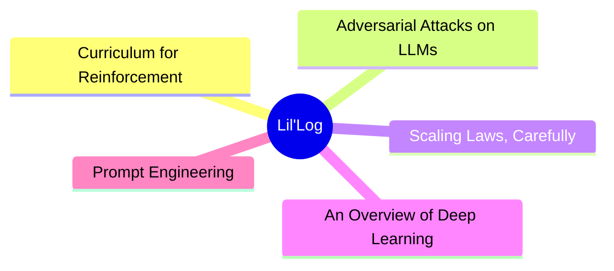
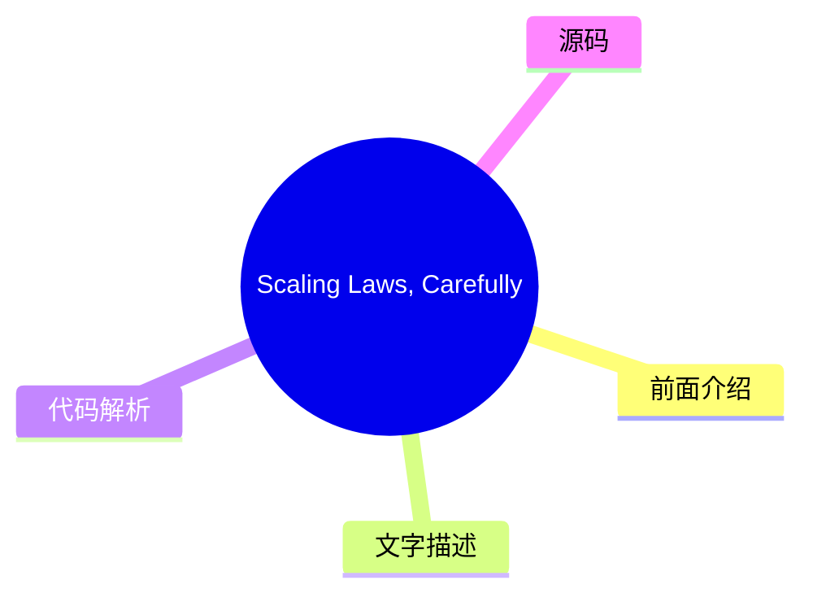
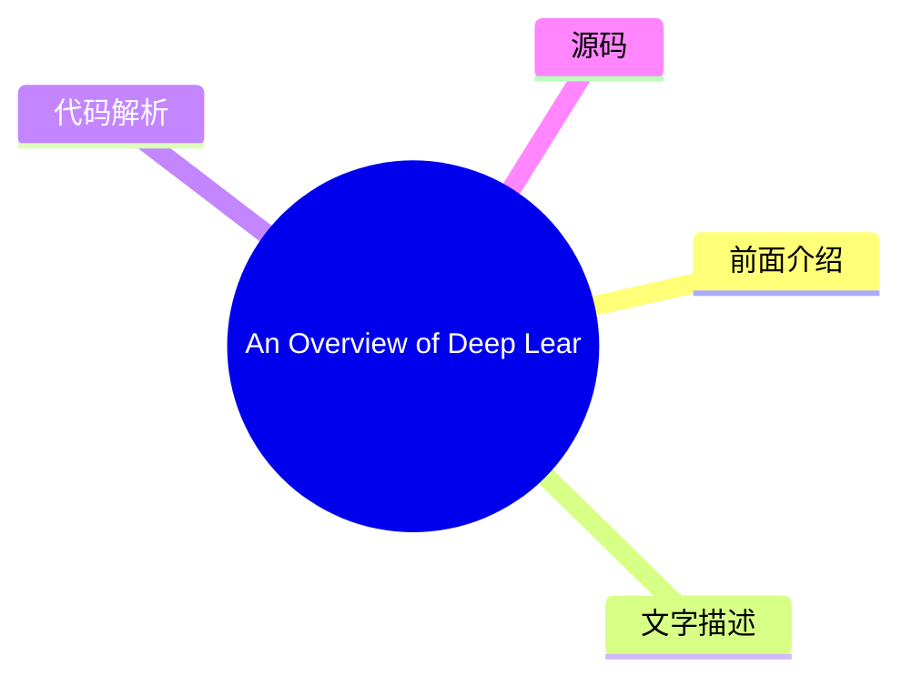
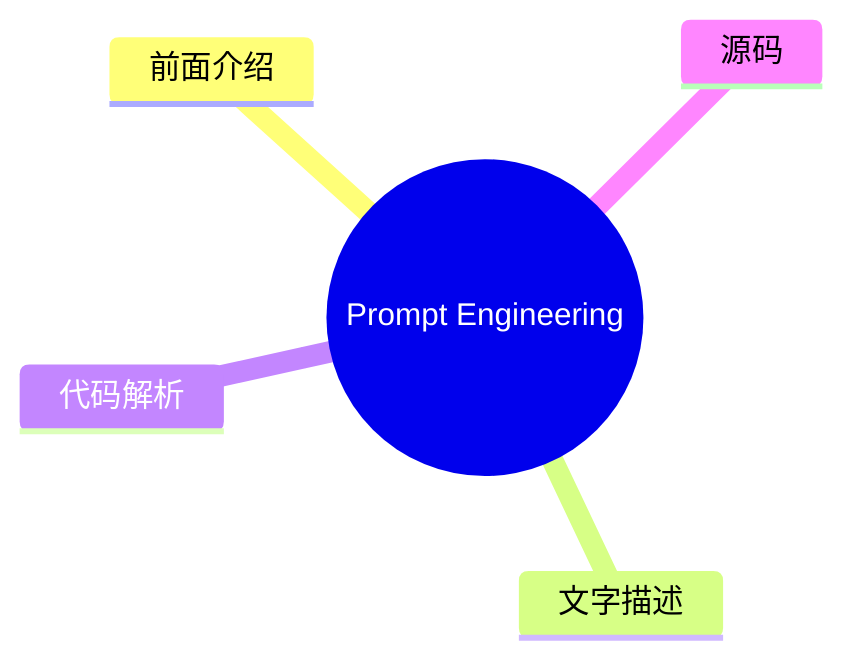

# 🧪 Lil'Log Top 5 (2026-08-03)

## 前面介绍

- 数据源：Lil'Log
- 抓取日期：2026-08-03
- 条目数：5
- 含完整正文：5
- 含代码片段：1
- 组织方式：前面介绍 / 树状图 / 文字描述 / 代码解析 / 源码

## 思维导图



## 详细整理（5 条，5 条含全文，1 条含代码）

### 1. Curriculum for Reinforcement Learning
- **链接**: [https://lilianweng.github.io/posts/2020-01-29-curriculum-rl/](https://lilianweng.github.io/posts/2020-01-29-curriculum-rl/)
- **发布**: Wed, 29 Jan 2020 00:00:00 +0000

#### 前面介绍

- [Updated on 2020-02-03: mentioning PCG in the &ldquo;Task-Specific Curriculum&rdquo; section.
[Updated on 2020-02-04: Add a new &ldquo;curriculum through distillation&rdquo; section.
- 发布时间：Wed, 29 Jan 2020 00:00:00 +0000

#### 树状图


#### 文字描述

- [Updated on 2020-02-03: mentioning [PCG](#pcg) in the “Task-Specific Curriculum” section. [Updated on 2020-02-04: Add a new [“curriculum through distillation”](#curriculum-through-distillation) section. It sounds like an impossible task if we want to teach integral or derivative to a 3-year-old who does not even know basic arithmetics. That’s why education is important, as it p
- # Task-Specific Curriculum[#](#task-specific-curriculum) [Bengio, et al. (2009)](https://www.researchgate.net/profile/Y_Bengio/publication/221344862_Curriculum_learning/links/546cd2570cf2193b94c577ac/Curriculum-learning.pdf) provided a good overview of curriculum learning in the old days. The paper presented two ideas with toy experiments using a manually designed task-specific
- # Teacher-Guided Curriculum[#](#teacher-guided-curriculum) [The idea of ]*Automatic Curriculum Learning* was proposed by [Graves, et al. 2017](https://arxiv.org/abs/1704.03003) slightly earlier. It considers a $N$-task curriculum as an [$N$-armed bandit](https://lilianweng.github.io/posts/2018-01-23-multi-armed-bandit/) problem and an adaptive policy which learns to optimize th
- # Curriculum through Self-Play[#](#curriculum-through-self-play) Different from the teacher-student framework, two agents are doing very different things. The teacher learns to pick a task for the student without any knowledge of the actual task content. What if we want to make both train on the main task directly? How about even make them compete with each other? [Sukhb ...（截断

#### 代码解析

- 本文未检测到明确代码块，内容更偏新闻、观点或方法论。

#### 源码

#### 中文节选

[Updated on 2020-02-03: 在“任务特定课程”部分提及 [PCG](#pcg)。

[Updated on 2020-02-04: 新增一个 [“通过蒸馏进行课程学习”](#curriculum-through-distillation) 部分。

如果我们想教一个连基本算术都不懂的 3 岁孩子积分或导数，这听起来像是一项不可能完成的任务。这就是为什么教育很重要的原因，因为它提供了一种系统化的方法来分解复杂知识，并为从简单到困难地教授概念提供了一个很好的课程。课程让学习困难的事情对我们人类来说变得更容易、更可及。但是，机器学习模型呢？我们能否通过课程学习更高效地训练模型？我们能否设计一个课程来加速学习？

早在 1993 年，Jeffrey Elman 就提出了通过课程学习训练神经网络的想法。他在学习简单语言语法方面的早期工作证明了这种策略的重要性：从一组受限的简单数据开始，并逐渐增加训练样本的复杂性；否则，模型根本无法学习。

与没有课程的学习相比，我们预计采用课程学习会加速收敛速度，并且可能会或可能不会提高最终模型的性能。设计一个高效且有效的课程并不容易。请记住，糟糕的课程甚至可能会阻碍学习。

接下来，我们将研究几类课程学习，如图所示。大多数情况应用于强化学习，在监督学习中有少数例外。

在“The importance of starting small”论文（[Elman 1993](http://citeseerx.ist.psu.edu/viewdoc/download?doi=10.1.1.128.4487&rep=rep1&type=pdf)）中，我特别喜欢开篇的句子，发现它们既鼓舞人心又引人深思：

“Humans differ from other species along many dimensions, but two are particularly noteworthy. Humans display an exceptional capacity to learn; and humans are remarkable for the unusually long time it takes to reach maturity. The adaptive advantage of learning is clear, and it may be argued that, through culture, learning has created the basis for a non-genetically based transmission of behaviors which may accelerate the evolution of our species.”


Indeed, learning is probably the best superpower we humans have.

# Task-Specific Curriculum[#](#task-specific-curriculum)

[Bengio, et al. (2009)](https://www.researchgate.net/profile/Y_Bengio/publication/221344862_Curriculum_learning/links/546cd2570cf2193b94c577ac/Curriculum-learning.pdf) provided a good overview of curriculum learning in the old days. The paper presented two ideas with toy experiments using a manually designed task-specific curriculum:

- Cleaner Examples may yield better generalization faster.
- Introducing gradually more difficult examples speeds up online training.

It is plausible that some curriculum strategies could be useless or even harmful. A good question to answer in the field is: *What could be

#### 完整正文（中文）

[Updated on 2020-02-03: 在“任务特定课程”部分提及 [PCG](#pcg)。

[Updated on 2020-02-04: 新增一个 [“通过蒸馏进行课程学习”](#curriculum-through-distillation) 部分。

如果我们想教一个连基本算术都不懂的 3 岁孩子积分或导数，这听起来像是一项不可能完成的任务。这就是为什么教育很重要的原因，因为它提供了一种系统化的方法来分解复杂知识，并为从简单到困难地教授概念提供了一个很好的课程。课程让学习困难的事情对我们人类来说变得更容易、更可及。但是，机器学习模型呢？我们能否通过课程学习更高效地训练模型？我们能否设计一个课程来加速学习？

早在 1993 年，Jeffrey Elman 就提出了通过课程学习训练神经网络的想法。他在学习简单语言语法方面的早期工作证明了这种策略的重要性：从一组受限的简单数据开始，并逐渐增加训练样本的复杂性；否则，模型根本无法学习。

与没有课程的学习相比，我们预计采用课程学习会加速收敛速度，并且可能会或可能不会提高最终模型的性能。设计一个高效且有效的课程并不容易。请记住，糟糕的课程甚至可能会阻碍学习。

接下来，我们将研究几类课程学习，如图所示。大多数情况应用于强化学习，在监督学习中有少数例外。

在“The importance of starting small”论文（[Elman 1993](http://citeseerx.ist.psu.edu/viewdoc/download?doi=10.1.1.128.4487&rep=rep1&type=pdf)）中，我特别喜欢开篇的句子，发现它们既鼓舞人心又引人深思：

“Humans differ from other species along many dimensions, but two are particularly noteworthy. Humans display an exceptional capacity to learn; and humans are remarkable for the unusually long time it takes to reach maturity. The adaptive advantage of learning is clear, and it may be argued that, through culture, learning has created the basis for a non-genetically based transmission of behaviors which may accelerate the evolution of our species.”


Indeed, learning is probably the best superpower we humans have.

# Task-Specific Curriculum[#](#task-specific-curriculum)

[Bengio, et al. (2009)](https://www.researchgate.net/profile/Y_Bengio/publication/221344862_Curriculum_learning/links/546cd2570cf2193b94c577ac/Curriculum-learning.pdf) provided a good overview of curriculum learning in the old days. The paper presented two ideas with toy experiments using a manually designed task-specific curriculum:

- Cleaner Examples may yield better generalization faster.
- Introducing gradually more difficult examples speeds up online training.

It is plausible that some curriculum strategies could be useless or even harmful. A good question to answer in the field is: *What could be the general principles that make some curriculum strategies work better than others?* The Bengio 2009 paper hypothesized it would be beneficial to make learning focus on “interesting” examples that are neither too hard or too easy.

If our naive curriculum is to train the model on samples with a gradually increasing level of complexity, we need a way to quantify the difficulty of a task first. One idea is to use its minimal loss with respect to another model while this model is pretrained on other tasks ([Weinshall, et al. 2018](https://arxiv.org/abs/1802.03796)). In this way, the knowledge of the pretrained model can be transferred to the new model by suggesting a rank of training samples. Fig. 2 shows the effectiveness of the `curriculum` group (green), compared to `control` (random order; yellow) and `anti` (reverse the order; red) groups.


[Zaremba & Sutskever (2014)](https://arxiv.org/abs/1410.4615) did an interesting experiment on training LSTM to predict the output of a short Python program for mathematical ops without actually executing the code. They found curriculum is necessary for learning. The program’s complexity is controlled by two parameters, `length` ∈ [1, a] and `nesting`∈ [1, b]. Three strategies are considered:

- Naive curriculum: increase `length`first until reaching`a`; then increase`nesting`and reset`length`to 1; repeat this process until both reach maximum.
- Mix curriculum: sample `length`~ [1, a] and`nesting`~ [1, b]
- Combined: naive + mix.

They noticed that combined strategy always outperformed the naive curriculum and would generally (but not always) outperform the mix strategy — indicating that it is quite important to mix in easy tasks during training to *avoid forgetting*.


[Procedural content generation (][PCG](https://en.wikipedia.org/wiki/Procedural_generation)) is a popular approach for creating video games of various levels of difficulty. PCG involves algorithmic randomness and a heavy dose of human expertise in designing game elements and dependencies among them. Procedurally generated levels have been introduced into several benchmark environments for evaluating whether an RL agent can generalize to a new level that it is not trained on ([meta-RL](https://lilianweng.github.io/posts/2019-06-23-meta-rl/)!), such as [GVGAI](http://www.gvgai.net/), OpenAI [CoinRun](https://openai.com/blog/quantifying-generalization-in-reinforcement-learning/) and [Procgen benchmark](https://openai.com/blog/procgen-benchmark/). Using GVGAI, [Justesen, et al. (2018)](https://arxiv.org/abs/1806.10729) demonstrated that an RL policy can easily overfit to a specific game but training over a simple curriculum that grows the task difficulty together with the model performance helps its generalization to new human-designed levels. Similar results are also found in CoinRun ([Cobbe, et al. 2018](https://arxiv.org/abs/1812.02341)). POET ([Wang et al, 2019](https://arxiv.org/abs/1901.01753)) is another example for leveraging evolutionary algorithm and procedural generated game levels to improve RL generalization, which I’ve described in details in my [meta-RL post](https://lilianweng.github.io/posts/2019-06-23-meta-rl/#evolutionary-algorithm-on-environment-generation).

To follow the curriculum learning approaches described above, generally we need to figure out two problems in the training procedure:

- Design a metric to quantify how hard a task is so that we can sort tasks accordingly.
- Provide a sequence of tasks with an increasing level of difficulty to the model during training.


然而，任务顺序不必是顺序的。在我们的魔方论文（[OpenAI et al, 2019](https://arxiv.org/abs/1910.07113.））中，我们依赖*自动领域随机化*（**ADR**）通过增长具有递增复杂度的环境分布来生成课程。每个任务的难度（即在特定环境中解决魔方）取决于各种环境参数的随机化范围。即使假设所有环境参数都不相关，我们仍然能够为我们的机械手创建一个不错的课程来学习该任务。

# Teacher-Guided Curriculum[#](#teacher-guided-curriculum)

*自动课程学习*（**ACL**）的想法由 [Graves, et al. 2017](https://arxiv.org/abs/1704.03003) 稍早提出。它将 $N$-任务课程视为一个[$N$臂老虎机](https://lilianweng.github.io/posts/2018-01-23-multi-armed-bandit/)问题，以及一个学习优化该老虎机回报的自适应策略。

论文中考虑了两类学习信号：

- 损失驱动的进度：一次梯度更新前后的损失函数变化。这种类型的奖励信号跟踪学习过程的速度，因为最大的任务损失下降等同于最快的学习。
- 复杂度驱动的进度：网络权重后验分布与先验分布之间的 KL 散度。这种类型的学习信号受到[MDL](https://en.wikipedia.org/wiki/Minimum_description_length)原则的启发，“增加一定量的模型复杂度只有在压缩数据量更大的情况下才是值得的”。因此，模型复杂度预期会在模型很好地泛化到训练示例时增长最多。

[通过另一个 RL 代理自动提出课程的方法被形式化为 ]*Teacher-Student Curriculum Learning* (**TSCL**; [Matiisen, et al. 2017](https://arxiv.org/abs/1707.00183))。在 TSCL 中，*学生*是一个正在执行实际任务的 RL 代理，而 *教师* 代理则是用于选择任务的策略。学生的目标是掌握一个可能很难直接学习的复杂任务。为了使这个任务更容易学习，我们设置教师代理通过选择适当的子任务来指导学生的训练过程。

在这个过程中，学生应该学习以下任务：

- 能帮助学生取得最快的学习进展，或者
- 有被遗忘的风险。

注意：将教师模型构建为 RL 问题的设定感觉与神经架构搜索 (NAS) 非常相似，但不同的是，TSCL 中的 RL 模型在任务空间上运行，而 NAS 在主模型架构空间上运行。

训练教师模型是解决一个 [POMDP](https://en.wikipedia.org/wiki/Partially_observable_Markov_decision_process) 问题：

- 未观测到的 $s_t$ 是学生模型的完整状态。
- 观测到的 $o = (x_t^{(1)}, \dots, x_t^{(N)})$ 是 $N$ 个任务的分数列表。
- 动作 $a$ 是选择一个子任务。
- 每一步的奖励是分数差 $r_t = \sum_{i=1}^N x_t^{(i)} - x_{t-1}^{(i)}$（即，相当于在回合结束时最大化所有任务的分数）。

从嘈杂的任务分数中估计学习进展，同时平衡探索与利用的方法可以从非平稳多臂老虎机问题中借鉴——使用 [ε-greedy](https://lilianweng.github.io/posts/2018-01-23-multi-armed-bandit/#%CE%B5-greedy-algorithm)，或 [Thompson sampling](https://lilianweng.github.io/posts/2018-01-23-multi-armed-bandit/#thompson-sampling)。

总结来说，核心思想是使用一个策略为另一个策略提出任务，以便后者学得更好。有趣的是，上述两项工作（在离散任务空间中）都发现从所有任务中均匀采样是一个出奇强大的基准。

如果任务空间是连续的呢？[Portelas, et al. (2019)](https://arxiv.org/abs/1910.07224) 研究了一个连续的教师-学生框架，其中教师必须从连续任务空间中采样参数来生成学习课程。给定一个新采样的参数 $p$，绝对学习进度（Absolute Learning Progress，简称 ALP）被测量为 $\text{ALP}_p = \vert r - r_\text{old} \vert$，其中 $r$ 是与 $p$ 相关的回合奖励，$r_\text{old}$ 是与 $p_\text{old}$ 相关的奖励。这里，$p_\text{old}$ 是任务空间中与 $p$ 最近的先前采样的参数，可以通过最近邻检索到。请注意，这个 ALP 分数与 [TSCL](#TSCL) 或 [Grave, et al. 2017](#grave-et-al-2017) 中的学习信号有何不同：ALP 分数测量的是两个任务之间的奖励差异，而不是同一任务在两个时间步上的性能。

在任务参数空间之上，训练了一个高斯混合模型来拟合 $\text{ALP}_p$ 在 $p$ 上的分布。在采样任务时使用 ε-greedy 策略：以一定的概率采样一个随机任务；否则，从 GMM 模型中按 ALP 分数比例采样。

# 通过自博弈进行课程学习[#](#curriculum-through-self-play)

与教师-学生框架不同，两个智能体在做非常不同的事情。教师学习为学生选择任务，而不了解实际的任务内容。如果我们想让他们直接在主任务上进行训练呢？甚至让他们互相竞争怎么样？

[Sukhb


### 2. Adversarial Attacks on LLMs
- **链接**: [https://lilianweng.github.io/posts/2023-10-25-adv-attack-llm/](https://lilianweng.github.io/posts/2023-10-25-adv-attack-llm/)
- **发布**: Wed, 25 Oct 2023 00:00:00 +0000

#### 前面介绍

- The use of large language models in the real world has strongly accelerated by the launch of ChatGPT. We (including my team at OpenAI, shoutout to them) have invested a lot of effort to build default safe behavior into the model during the alignment
- 发布时间：Wed, 25 Oct 2023 00:00:00 +0000

#### 树状图


#### 文字描述

- The use of large language models in the real world has strongly accelerated by the launch of ChatGPT. We (including my team at OpenAI, shoutout to them) have invested a lot of effort to build default safe behavior into the model during the alignment process (e.g. via [RLHF](https://openai.com/research/learning-to-summarize-with-human-feedback)). However, adversarial attacks or 
- # Basics[#](#basics)
- ## Threat Model[#](#threat-model) Adversarial attacks are inputs that trigger the model to output something undesired. Much early literature focused on classification tasks, while recent effort starts to investigate more into outputs of generative models. In the context of large language models In this post we assume the attacks only happen **at inference time**, meaning that *
- ### Classification[#](#classification) Adversarial attacks on classifiers have attracted more attention in the research community in the past, many in the image domain. LLMs can be used for classification too. Given an input $\mathbf{x}$ and a classifier $f(.)$, we would like to find an adversarial version of the input, denoted as $\mathbf{x}_\text{adv}$, with imperceptible dif

#### 代码解析

- 本文未检测到明确代码块，内容更偏新闻、观点或方法论。

#### 源码

#### 中文节选

The use of large language models in the real world has strongly accelerated by the launch of ChatGPT. We (including my team at OpenAI, shoutout to them) have invested a lot of effort to build default safe behavior into the model during the alignment process (e.g. via [RLHF](https://openai.com/research/learning-to-summarize-with-human-feedback)). However, adversarial attacks or jailbreak prompts could potentially trigger the model to output something undesired.

A large body of ground work on adversarial attacks is on images, and differently it operates in the continuous, high-dimensional space. Attacks for discrete data like text have been considered to be a lot more challenging, due to lack of direct gradient signals. My past post on [Controllable Text Generation](https://lilianweng.github.io/posts/2021-01-02-controllable-text-generation/) is quite relevant to this topic, as attacking LLMs is essentially to control the model to output a certain type of (unsafe) content.

There is also a branch of work on attacking LLMs to extract pre-training data, private knowledge ([Carlini et al, 2020](https://arxiv.org/abs/2012.07805)) or attacking model training process via data poisoning ([Carlini et al. 2023](https://arxiv.org/abs/2302.10149)). We would not cover those topics in this post.

# Basics[#](#basics)

## Threat Model[#](#threat-model)

Adversarial attacks are inputs that trigger the model to output something undesired. Much early literature focused on classification tasks, while recent effort starts to investigate more into outputs of generative models. In the context of large language models In this post we assume the attacks only happen **at inference time**, meaning that **model weights are fixed**.

### Classification[#](#classification)

Adversarial attacks on classifiers have attracted more attention in the research community in the past, many in the image domain. LLMs can be used for classification too. Given an input $\mathbf{x}$ and a classifier $f(.)$, we would like to find an adversarial version of the input, denoted as $\mathbf{x}_\text{adv}$, with imperceptible difference from $\mathbf{x}$, such that $f(\mathbf{x}) \neq f(\mathbf{x}_\text{adv})$.

### 文本生成[#](#text-generation)

给定输入 $\mathbf{x}$ 和生成模型 $p(.)$，模型输出一个样本 $\mathbf{y} \sim p(.\vert\mathbf{x})$。对抗攻击将识别出这样的 $p(\mathbf{x})$，使得 $\mathbf{y}$ 违反模型的内置安全行为；例如在非法话题上输出不安全内容，泄露私人信息或模型训练数据。对于生成任务，判断攻击是否成功并不容易，这需要高质量分类器来判断 $\mathbf{y}$ 是否不安全或进行人工审查。

### 白盒与黑盒[#](#white-box-vs-black-box)

白盒攻击假设攻击者拥有对模型权重、架构和训练流程的完全访问权限，从而攻击者可以获得梯度信号

#### 完整正文（中文）

ChatGPT 的推出极大地加速了大型语言模型在现实世界中的应用。我们（包括我在 OpenAI 的团队，向他们致敬）在对齐过程中投入了大量精力，将默认的安全行为构建到模型中（例如通过 [RLHF](https://openai.com/research/learning-to-summarize-with-human-feedback)）。然而，对抗性攻击或越狱提示可能会触发模型输出不受欢迎的内容。

关于对抗性攻击的大量基础工作集中在图像上，且操作方式不同，它运行在连续的高维空间中。由于缺乏直接的梯度信号，离散数据（如文本）的攻击被认为要困难得多。我之前关于 [Controllable Text Generation](https://lilianweng.github.io/posts/2021-01-02-controllable-text-generation/) 的帖子与这个话题非常相关，因为攻击 LLM 本质上就是控制模型输出某种类型（不安全）的内容。

还有一类工作致力于攻击 LLM 以提取预训练数据、私有知识（[Carlini et al, 2020](https://arxiv.org/abs/2012.07805)）或通过数据投毒攻击模型训练过程（[Carlini et al. 2023](https://arxiv.org/abs/2302.10149)）。我们不会在本文中涵盖这些话题。

# Basics[#](#basics)

## Threat Model[#](#threat-model)

对抗性攻击是触发模型输出不受欢迎内容的输入。早期的文献主要集中在分类任务上，而最近的努力开始更多地研究生成模型的输出。在大型语言模型的背景下，本文假设攻击仅发生在**推理时**，这意味着**模型权重是固定的**。

### Classification[#](#classification)

过去，针对分类器的对抗性攻击在研究社区中受到了更多关注，许多工作集中在图像领域。LLM 也可以用于分类。给定输入 $\mathbf{x}$ 和分类器 $f(.)$，我们希望找到输入的一个对抗版本，记为 $\mathbf{x}_\text{adv}$，它与 $\mathbf{x}$ 的差异不可察觉，使得 $f(\mathbf{x}) \neq f(\mathbf{x}_\text{adv})$。


### Text Generation[#](#text-generation)

Given an input $\mathbf{x}$ and a generative model $p(.)$, we have the model output a sample $\mathbf{y} \sim p(.\vert\mathbf{x})$ . An adversarial attack would identify such $p(\mathbf{x})$ that $\mathbf{y}$ would violate the built-in safe behavior of the model $p$; E.g. output unsafe content on illegal topics, leak private information or model training data. For generative tasks, it is not easy to judge the success of an attack, which demands a super high-quality classifier to judge whether $\mathbf{y}$ is unsafe or human review.

### White-box vs Black-box[#](#white-box-vs-black-box)

White-box attacks assume that attackers have full access to the model weights, architecture and training pipeline, such that attackers can obtain gradient signals. We don’t assume attackers have access to the full training data. This is only possible for open-sourced models. Black-box attacks assume that attackers only have access to an API-like service where they provide input $\mathbf{x}$ and get back sample $\mathbf{y}$, without knowing further information about the model.

# Types of Adversarial Attacks[#](#types-of-adversarial-attacks)

There are various means to find adversarial inputs to trigger LLMs to output something undesired. We present five approaches here.

| Attack | Type | Description | 
|---|---|---|
| Token manipulation | Black-box | Alter a small fraction of tokens in the text input such that it triggers model failure but still remain its original semantic meanings. | 
| Gradient based attack | White-box | Rely on gradient signals to learn an effective attack. | 
| Jailbreak prompting | Black-box | Often heuristic based prompting to “jailbreak” built-in model safety. | 
| Human red-teaming | Black-box | Human attacks the model, with or without assist from other models. | 
| Model red-teaming | Black-box | Model attacks the model, where the attacker model can be fine-tuned. | 

## Token Manipulation[#](#token-manipulation)


给定一段包含一系列 token 的文本输入，我们可以应用简单的 token 操作，如同义词替换，来触发模型做出错误的预测。基于 token 操作的攻击在**黑盒**设置中有效。Python 框架 TextAttack ([Morris et al. 2020](https://arxiv.org/abs/2005.05909)) 实现了许多单词和 token 操作攻击方法，用于为 NLP 模型创建对抗样本。该领域的大多数工作都针对分类和蕴含预测进行了实验。

[Ribeiro et al (2018)](https://www.aclweb.org/anthology/P18-1079/) 依赖手动提出的语义等价对抗规则 (SEARs) 来进行最小的 token 操作，从而使模型无法生成正确的答案。示例规则包括 (*What  NOUN→Which NOUN*), (*`WP` is → `WP`’s’*was→is*), 等。对抗操作后的语义等价性通过回译进行检查。这些规则是通过相当手动、启发式的过程提出的，SEARs 探测的模型“漏洞”类型仅限于对最小 token 变化的敏感性，随着基础 LLM 能力的提高，这不应成为问题。

相比之下，[EDA](https://lilianweng.github.io/posts/2022-04-15-data-gen/#EDA) (Easy Data Augmentation; [Wei & Zou 2019](https://arxiv.org/abs/1901.11196)) 定义了一组简单且更通用的操作来增强文本：同义词替换、随机插入、随机交换或随机删除。研究表明，EDA 增强提高了多个基准测试的分类准确率。

TextFooler ([Jin et al. 2019](https://arxiv.org/abs/1907.11932)) 和 [BERT-Attack (][Li et al. 2020](https://aclanthology.org/2020.emnlp-main.500.pdf)) 遵循相同的过程：首先识别出对模型预测影响最大且最脆弱的单词，然后以某种方式替换这些单词。

给定分类器 $f$ 和输入文本字符串 $\mathbf{x}$，每个单词的重要性分数可以通过以下方式测量：

where $f_y$ is the predicted logits for label $y$ and $x_{\setminus w_i}$ is the input text excluding the target word $w_i$. Words with high importance are good candidates to be replaced, but stop words should be skipped to avoid grammar destruction.

TextFooler replaces those words with top synonyms based on word embedding cosine similarity and then further filters by checking that the replacement word still has the same POS tagging and the sentence level similarity is above a threshold. BERT-Attack instead replaces words with semantically similar words via BERT given that context-aware prediction is a very natural use case for masked language models. Adversarial examples discovered this way have some transferability between models, varying by models and tasks.

## Gradient based Attacks[#](#gradient-based-attacks)

In the white-box setting, we have full access to the model parameters and architecture. Therefore we can rely on gradient descent to programmatically learn the most effective attacks. Gradient based attacks only work in the white-box setting, like for open source LLMs.

**GBDA** (“Gradient-based Distributional Attack”; [Guo et al. 2021](https://arxiv.org/abs/2104.13733)) uses Gumbel-Softmax approximation trick to *make adversarial loss optimization differentiable*, where BERTScore and perplexity are used to enforce perceptibility and fluency. Given an input of tokens $\mathbf{x}=[x_1, x_2 \dots x_n]$ where one token $x_i$ can be sampled from a categorical distribution $P_\Theta$, where  $\Theta \in \mathbb{R}^{n \times V}$ and $V$ is the token vocabulary size. It is highly over-parameterized, considering that  $V$ is usually around $O(10,000)$  and most adversarial examples only need a few token replacements. We have:

$$ x_i \sim P_{\Theta_i} = \text{Categorical}(\pi_i) = \text{Categorical}(\text{Softmax}(\Theta_i)) $$


其中 $\pi_i \in \mathbb{R}^V$ 是第 $i$ 个 token 的 token 概率向量。要最小化的对抗目标函数是让分类器 $f$ 对输入 $\mathbf{X}$ 产生与正确标签 $y$ 不同的错误标签：$\min_{\Theta \in \mathbb{R}^{n \times V}} \mathbb{E}_{\mathbf{x} \sim P_{\Theta}} \mathcal{L}_\text{adv}(\mathbf{X}, y; f)$。然而，由于是分类分布，这在表面上不可微。使用 Gumbel-softmax 近似（[Jang et al. 2016](https://arxiv.org/abs/1611.01144)），我们通过 $\tilde{\boldsymbol{\pi}}$ 从 Gumbel 分布 $\tilde{P}_\Theta$ 近似分类分布：

其中 $g_{ij} \sim \text{Gumbel}(0, 1)$；温度 $\tau > 0$ 控制分布的平滑度。

Gumbel 分布用于对样本数量（无论样本分布如何）的*极端*值、最大值或最小值进行建模。额外的 Gumbel 噪声引入了模仿从分类分布中采样的随机决策过程。

低温度 $\tau \to 0$ 推动收敛到分类分布，因为从温度为 0 的 softmax 中采样是确定性的。“采样”部分仅取决于 $g_{ij}$ 的值，该值主要围绕 0 中心。

设 $\mathbf{e}_j$ 为 token $j$ 的嵌入表示。我们可以用 $\bar{e}(\tilde{\boldsymbol{\pi}})$ 近似 $\mathbf{x}$，即对应于 token 概率的嵌入向量的加权平均：$\bar{e}(\pi_i) = \sum_{j=1}^V \pi_i^{(j)} \mathbf{e}_j$。请注意，当 $\pi_i$ 是对应于 token $x_i$ 的 one-hot 向量时，我们将有 $\bar{e}(\pi_i) = \mathbf{e}_{z_i}$。结合嵌入表示和 Gumbel-softmax 近似，我们有一个可最小化的可微目标：$\min_{\Theta \in \mathbb{R}^{n \times V}} \mathbb{E}_{\tilde{\boldsymbol{\pi}} \sim \tilde{P}_{\Theta}} \mathcal{L}_\text{adv}(\bar{e}(\tilde{\boldsymbol{\pi}}), y; f)$。

与此同时，也很容易应用可微软约束来进行白盒攻击。GBDA 实验了（1）使用 NLL（负对数似然）的软流畅度约束和（2）BERTScore（“一种用于评估文本生成的相似度分数，能够捕捉 Transformer 模型上下文嵌入中成对标记之间的语义相似性”；[Zhang et al. 2019](https://arxiv.org/abs/1904.09675)）来衡量两个文本输入之间的相似度，以确保扰动后的版本不会与原始版本偏离太远。结合所有约束，最终的目标函数如下，其中 $\lambda_\text{lm}, \lambda_\text{sim} > 0$ 是预设的超参数，用于控制软约束的强度：

Gumbel-softmax 技巧很难扩展到标记删除或添加，因此它仅限于标记替换操作，不包括删除或添加。

**HotFlip** ([Ebrahimi et al. 2018](https://arxiv.org/abs/1712.06751)) 将文本操作视为向量空间中的输入，并衡量损失对这些向量的导数。这里假设输入向量是一个字符级独热编码矩阵，$\mathbf{x} \in {0, 1}^{m \times n \times V}$ 且 $\mathbf{x}_{ij} \in {0, 1}^V$，其中 $m$ 是单词的最大数量，$n$ 是每个单词的最大字符数，$V$ 是字母表大小。给定原始输入向量 $\mathbf{x}$，我们构造一个新的向量 $\mathbf{x}_{ij, a\to b}$，其中第 $i$ 个单词的第 $j$ 个字符从 $a$ 变为 $b$，因此我们有 $x_{ij}^{(a)} = 1$ 但 $x_{ij, a\to b}^{(a)} = 0, x_{ij, a\to b}^{(b)} = 1$。

根据一阶泰勒展开，损失的变化为：

该目标函数经过优化，以选择仅使用一次反向传播即可最小化对抗损失的向量。

为了应用多次翻转，我们可以运行一个 $r$ 步的束搜索

...（截断，原文 46582+ 字符）


### 3. Scaling Laws, Carefully
- **链接**: [https://lilianweng.github.io/posts/2026-06-24-scaling-laws/](https://lilianweng.github.io/posts/2026-06-24-scaling-laws/)
- **发布**: Wed, 24 Jun 2026 00:00:00 +0000

#### 前面介绍

- Scaling laws are one of the most critical empirical findings in deep learning. The observation is simple in form: the training loss $L$ decreases predictably as we scale up model size $N$, dataset size $D$, and compute $C$, following a power-law curv
- 发布时间：Wed, 24 Jun 2026 00:00:00 +0000

#### 树状图



#### 文字描述

- Scaling laws are one of the most critical empirical findings in deep learning. The observation is simple in form: the training loss $L$ decreases predictably as we scale up model size $N$, dataset size $D$, and compute $C$, following a power-law curve, which appears as a straight line on a log-log plot. We can view scaling laws as a framework for describing the relationship bet
- # Early days: ML loss predictability[#](#early-days-ml-loss-predictability) The predictability of generalization error with scale had already been investigated before scaling laws became a mainstream concept. [Amari et al. (1992)](https://ieeexplore.ieee.org/document/6796972) derived four types of learning curves using a Bayesian approach and the annealed approximation. - Deter
- # Scaling Laws in Data-Infinite Region[#](#scaling-laws-in-data-infinite-region)
- ## Kaplan et al.’s Scaling Laws[#](#kaplan-et-als-scaling-laws) [Kaplan et al. (2020)](https://arxiv.org/abs/2001.08361) popularized the concept of scaling laws in the language modeling community. They found that the cross-entropy test loss $L$ scales as a power law with each of model size $N$ (excluding embedding layers), dataset size $D$, and training compute $C$ across many 

#### 代码解析

- 本文未检测到明确代码块，内容更偏新闻、观点或方法论。

#### 源码

#### 中文节选

缩放定律是深度学习中最关键的实证发现之一。其观察结果形式简单：随着模型大小 $N$、数据集大小 $D$ 和计算量 $C$ 的增加，训练损失 $L$ 遵循幂律曲线呈可预测地下降，这在双对数图上表现为一条直线。我们可以将缩放定律视为描述计算量、损失、模型大小和数据之间关系的框架；其核心在于如何在这两者之间最优地分配宝贵的计算资源。

这种可预测性使缩放定律在实践中极具价值。常见的工作流程是在少量小规模运行中拟合缩放定律，然后外推以估算更大模型的代币和计算需求。

| 符号 | 备注 | 
|---|---|
| $N$ | 模型大小，以参数数量衡量。 | 
| $D$ | 训练数据集大小，通常以代币数量衡量。 | 
| $C$ | 以 FLOPs 为单位的训练计算量。作为一个有用的近似，$C \approx 6ND$ ( [Kaplan et al. 2020](https://arxiv.org/abs/2001.08361))，其中 $2ND$ 用于前向传播，$4ND$ 用于反向传播。 | 
| $E$ | 不可约损失 | 
| $L, \hat{L}(.)$ | 测试损失 / 测试损失预测函数；也可以指训练损失，因为它们之间有很强的相关性。 | 
| $\epsilon$ | 泛化误差。 | 

# 早期：机器学习损失的可预测性[#](#early-days-ml-loss-predictability)

在缩放定律成为主流概念之前，泛化误差的可预测性就已经被研究过了。

[Amari et al. (1992)](https://ieeexplore.ieee.org/document/6796972) 使用贝叶斯方法和退火近似推导出了四种类型的学习曲线。

- 确定性学习算法，无噪声数据，唯一解：$\epsilon \sim c \cdot D^{-1}$，其中 $c$ 是某个常数。
- 确定性学习算法，无噪声数据，多个等价解：$\epsilon \sim c \cdot D^{-2}$；随着每个新数据点的加入，学习速度更快，因为模型只学习参数的最优流形，而不是寻找单个解点。

- 确定性学习算法，噪声数据：$\epsilon \sim c \cdot D^{-1/2}$；数据中的噪声使学习变得更困难。
- 随机学习算法，噪声数据：$\epsilon \sim c \cdot D^{-1} + E$；这里不可约损失 $E$ 是随机学习者无法进一步降低的残差误差，例如当模型在大数据上耗尽容量时。所有四种类型的学习曲线都遵循幂律：

其中 $E$ 可以是 0 且 $\alpha = -2, -1, -1/2$。尽管其理论设定基于简化的二分类任务，但它为构建经验式机器学习损失预测模型指明了一个有用的方向。

[Hestness et al. (2017)](https://arxiv.org/abs/1712.00409) 最早期的经验研究之一解释了泛化误差、模型大小和数据之间的关系。对于给定的训练数据大小，他们通过网格搜索确定了最佳拟合模型大小，然后绘制

#### 完整正文（中文）

缩放定律是深度学习中最关键的实证发现之一。其观察结果形式简单：随着模型大小 $N$、数据集大小 $D$ 和计算量 $C$ 的增加，训练损失 $L$ 遵循幂律曲线呈可预测地下降，这在双对数图上表现为一条直线。我们可以将缩放定律视为描述计算量、损失、模型大小和数据之间关系的框架；其核心在于如何在这两者之间最优地分配宝贵的计算资源。

这种可预测性使缩放定律在实践中极具价值。常见的工作流程是在少量小规模运行中拟合缩放定律，然后外推以估算更大模型的代币和计算需求。

| 符号 | 备注 | 
|---|---|
| $N$ | 模型大小，以参数数量衡量。 | 
| $D$ | 训练数据集大小，通常以代币数量衡量。 | 
| $C$ | 以 FLOPs 为单位的训练计算量。作为一个有用的近似，$C \approx 6ND$ ( [Kaplan et al. 2020](https://arxiv.org/abs/2001.08361))，其中 $2ND$ 用于前向传播，$4ND$ 用于反向传播。 | 
| $E$ | 不可约损失 | 
| $L, \hat{L}(.)$ | 测试损失 / 测试损失预测函数；也可以指训练损失，因为它们之间有很强的相关性。 | 
| $\epsilon$ | 泛化误差。 | 

# 早期：机器学习损失的可预测性[#](#early-days-ml-loss-predictability)

在缩放定律成为主流概念之前，泛化误差的可预测性就已经被研究过了。

[Amari et al. (1992)](https://ieeexplore.ieee.org/document/6796972) 使用贝叶斯方法和退火近似推导出了四种类型的学习曲线。

- 确定性学习算法，无噪声数据，唯一解：$\epsilon \sim c \cdot D^{-1}$，其中 $c$ 是某个常数。
- 确定性学习算法，无噪声数据，多个等价解：$\epsilon \sim c \cdot D^{-2}$；随着每个新数据点的加入，学习速度更快，因为模型只学习参数的最优流形，而不是寻找单个解点。

- 确定性学习算法，噪声数据：$\epsilon \sim c \cdot D^{-1/2}$；数据中的噪声使得学习更加困难。
- 随机学习算法，噪声数据：$\epsilon \sim c \cdot D^{-1} + E$；这里的不可约损失 $E$ 是随机学习者无法进一步降低的残差误差，例如当模型在大数据上耗尽容量时。所有四种类型的学习曲线都遵循幂律：

其中 $E$ 可以是 0，且 $\alpha = -2, -1, -1/2$。尽管其理论设置基于简化的二分类任务，但它为构建经验式机器学习损失预测模型指明了一个有用的方向。

[Hestness 等人 (2017)](https://arxiv.org/abs/1712.00409) 最早的经验研究之一解释了泛化误差、模型大小和数据之间的关系。对于给定的训练数据大小，他们通过网格搜索确定了最佳拟合模型大小，然后将损失与训练数据集大小进行绘图。在深度学习的四个不同领域（神经机器翻译、图像分类、语言建模和语音识别）中，观察到了一种反复出现的模式，即：

- 泛化误差随一组因素（例如数据大小）按幂律缩放。
- 模型改进会移动误差曲线，但似乎不会影响幂律指数。
- 有趣的是，架构改变了幂律拟合的偏移量（$E$），但不会改变指数（$\alpha$）。幂律的斜率似乎是问题域的属性，而不是模型架构的属性。
- 拟合大小为 $D$ 的数据集所需的模型参数数量 $N$ 也按幂律缩放。

一个概念性示意图将学习曲线分解为三个阶段。在小数据区域，由于学习信号不足，模型的性能仅略优于随机猜测。在中间（“幂律区域”），我们观察到损失、数据和模型大小之间存在幂律关系。最终的不可约误差区域可以归因于数据中的噪声等因素。

[Rosenfeld et al. (2020)](https://arxiv.org/abs/1909.12673) pushed this further by trying to model error as a joint function of both model size $N$ and data size $D$, across a diverse set of architectures (ResNet, WRN, LSTM, Transformer) and optimizers (Adam, SGD variants). Empirically they observed that, holding one axis fixed, the error decays as a power law in the other:

which can be combined into a joint form:

where $A > 0, B > 0, \alpha \geq 0, \beta \geq 0$ are scalar constants and $E$ is not dependent on either $N$ or $D$.

Thus, they can build a prediction model in the form of a simple parametric function with $\boldsymbol{\theta} = \langle A, B, E, \alpha, \beta \rangle$ to predict the expected loss for $(D, N)$ > certain thresholds by only training on a set of smaller training configs, $(D, N)$ < certain thresholds.

Side note: These early works lean on classical learning-theory intuition like the [VC dimension](https://en.wikipedia.org/wiki/Vapnik%E2%80%93Chervonenkis_dimension) (the cardinality of the largest set of points a model can shatter) as a proxy for capacity, but in modern deep learning work the VC dimension is often too coarse to explain the behavior and the empirical power laws turned out to be much cleaner and more practical than the worst-case bounds that theory provides.

# Scaling Laws in Data-Infinite Region[#](#scaling-laws-in-data-infinite-region)

## Kaplan et al.’s Scaling Laws[#](#kaplan-et-als-scaling-laws)


[Kaplan 等人 (2020)](https://arxiv.org/abs/2001.08361) 在语言建模社区普及了缩放定律的概念。他们发现，交叉熵测试损失 $L$ 随着模型大小 $N$（不包括嵌入层）、数据集大小 $D$ 和训练计算量 $C$ 的变化，在许多数量级范围内遵循幂律。这些发现与上一节中的早期工作一致，但 Kaplan 等人通过专注于 Transformer 语言模型以及在更大规模下的实证实验，正式化了这一概念，模型大小范围从 7.68 亿到 15 亿个非嵌入参数，数据集大小从 2200 万到 230 亿个 token。论文中的所有训练运行都使用了学习率调度，包含 3000 步的线性预热，随后是衰减至零的余弦衰减。

关键发现列表：

- 损失 $L$ 分别与 $N$、$D$ 和 $C$ 呈幂律关系；为了获得最佳性能，这三者必须同步缩放。
- 训练曲线遵循可预测的幂律，其参数大致与模型大小无关。
- 更大的模型样本效率更高，这意味着它们在更少的优化步数和更少的数据点下就能达到给定的损失。
- 架构细节（宽度、长宽比等）的重要性不如单纯的规模。
- 训练损失和测试损失呈正相关。（这听起来微不足道，但这是预训练工作的基础。另一方面，预训练损失的改善是否会转移到后训练评估，需要单独研究。）
- 在固定的计算预算下，训练一个非常大的模型并在*收敛前*停止，比训练一个较小的模型直到收敛更高效。**这一发现与下一节中的 Chinchilla 缩放定律（Chinchilla scaling laws）相矛盾：Kaplan 等人高估了最佳模型大小，因为他们拟合出的指数较大。**

他们在一个方程中总结了 $N$ 和 $D$ 的联合依赖关系：

这种形式的一个很好的结果是，过拟合的程度（即模型复杂或数据量小）主要取决于比率 $N^{\alpha / \beta} / D$，这表明数据需要以特定的比例随模型大小的增长而增长，以避免训练受限于数据。

Kaplan 等人发现 $N_\text{opt} \propto C^{0.73}$，并得出结论，模型大小应该比数据集大小增长得更快。具体来说，对于计算量的 10 倍增加，他们建议将模型大小增加约 5.5 倍，但仅将训练标记增加约 1.8 倍。Chinchilla 论文后来推翻了这一建议，认为这会导致大型模型严重*欠训练*。

Kaplan 等人的另一个有用分析基于 $D$ 和 $N$ 近似计算所需的训练 FLOPs。每次乘加运算大约算作 2 FLOPs。

假设标准配置为 $d_\text{attn} = d_\text{model} = d_\text{ff}/4$，并且从 $N$ 中排除嵌入层以及每个标记的前向计算：

那么我们将反向传播的 FLOPs 计为前向传播 FLOPs 的两倍，因为反向传播运行两次矩阵乘法，分别用于计算相对于输入激活和权重的梯度。因此，每个标记的总训练 FLOPs 约为 $6N$，而 $D$ 个标记的总训练 FLOPs 为 $C \approx 6ND$。

## Chinchilla Scaling Laws[#](#chinchilla-scaling-laws)

Chinchilla 论文 ([Hoffmann et al. 2022](https://arxiv.org/abs/2203.15556)) 在更仔细的实验设计下，研究了在*固定*计算预算 $C$ 下，最优模型大小 $N$（总参数，*包括*嵌入）与标记数量 $D$ 之间的关系，得出了与 Kaplan 等人略有不同的答案。

核心问题是，在约束条件 $\text{FLOPs}(N, D) = C \approx 6ND$ 下，如何分配资源才是最佳策略。换句话说，当我们只有有限的 FLOPs（即给定数量的 GPU 运行给定的时间）时，我们应如何在更多的数据标记和更多的模型参数之间做出选择？

The Chinchilla paper presented three neatly designed methods for scaling laws fitting.

The empirical experiments scanned over 400 models, with sizes from 70M to over 16B parameters and training tokens from 5B to 500B. The experiments were under the assumption that every training token is unique (the infinite-data regime). All runs used a cosine learning-rate schedule decaying by 10x over the training horizon. Sweeping over model sizes traces out the compute-optimal frontier.

### Method 1: Fix model sizes, vary the token budget[#](#method-1-fix-model-sizes-vary-the-token-budget)

For each parameter count $N$, train several runs with different token budgets, and record the minimal loss achieved per FLOP budget $C$.

### Method 2: IsoFLOP profiles[#](#method-2-isoflop-profiles)

Fix a compute budget $C$ and plot the final loss against parameter count $N$. Each iso-FLOP curve is roughly a parabola in log-space, and its minimum flags the optimal model size for that compute budget. Then repeating across budgets traces a power-law line in the plot.

### Method 3: Parametric fit[#](#method-3-parametric-fit)

[Fit the same parametric function as in ][Rosenfeld et al. (2020)](https://arxiv.org/abs/1909.12673) directly,

We can actually get a closed form approximation of optimal $N_\text{opt}(C), D_\text{opt}(C)$ by minimizing $\hat{L}(N, D)$ under the constraint $\text{FLOPs}(N,D) = C \approx 6ND$.

First let’s reduce the expression to contain only $N$:

When $\alpha \approx \beta$, model size and training tokens should scale at equal rates.

To find the optimal $\boldsymbol{\theta} = \langle A, B, E, \alpha, \beta\rangle$, the Chinchilla paper adopts a [Huber loss](https://en.wikipedia.org/wiki/Huber_loss) (robust to outliers; $\delta=10^{-3}$) and the [L-BFGS algorithm](https://en.wikipedia.org/wiki/Limited-memory_BFGS) (good for curve fitting with a small number of parameters).

Chinchilla arrives at its answer through three complementary methods whose final results agree with each other, and this is part of why the result was quite convincing.


The claim in the Chinchilla paper that most large models (at the time, ~2022) were undertrained is supported by a famous demonstration: under the same compute budget as Gopher ([Rae et al. 2021](https://arxiv.org/abs/2112.11446); 280B parameter count, 

...（截断，原文 29101+ 字符）


### 4. An Overview of Deep Learning for Curious People
- **链接**: [https://lilianweng.github.io/posts/2017-06-21-overview/](https://lilianweng.github.io/posts/2017-06-21-overview/)
- **发布**: Wed, 21 Jun 2017 00:00:00 +0000

#### 前面介绍

- (The post was originated from my talk for WiMLDS x Fintech meetup hosted by Affirm.)
I believe many of you have watched or heard of the games between AlphaGo and professional Go player Lee Sedol in 2016. Lee has the highest rank of nine dan and many
- 发布时间：Wed, 21 Jun 2017 00:00:00 +0000

#### 树状图



#### 文字描述

- (The post was originated from my talk for [WiMLDS x Fintech meetup](http://wimlds.org/chapters/about-bay-area/) hosted by [Affirm](www.affirm.com).) I believe many of you have watched or heard of the [games](https://youtu.be/vFr3K2DORc8) between AlphaGo and professional Go player [Lee Sedol](https://en.wikipedia.org/wiki/Lee_Sedol) in 2016. Lee has the highest rank of nine dan 
- # Why Does Deep Learning Work Now?[#](#why-does-deep-learning-work-now) Deep learning models, in simple words, are large and deep artificial neural nets. A neural network (“NN”) can be well presented in a [directed acyclic graph](https://en.wikipedia.org/wiki/Directed_acyclic_graph): the input layer takes in signal vectors; one or multiple hidden layers process the outputs of t
- # Deep Learning Models[#](#deep-learning-models) Next, let’s go through a few classical deep learning models.
- ## Convolutional Neural Network[#](#convolutional-neural-network) Convolutional neural networks, short for “CNN”, is a type of feed-forward artificial neural networks, in which the connectivity pattern between its neurons is inspired by the organization of the visual cortex system. The primary visual cortex (V1) does edge detection out of the raw visual input from the retina. T

#### 代码解析

- 本文未检测到明确代码块，内容更偏新闻、观点或方法论。

#### 源码

#### 中文节选

(The post was originated from my talk for [WiMLDS x Fintech meetup](http://wimlds.org/chapters/about-bay-area/) hosted by [Affirm](www.affirm.com).)

I believe many of you have watched or heard of the [games](https://youtu.be/vFr3K2DORc8) between AlphaGo and professional Go player [Lee Sedol](https://en.wikipedia.org/wiki/Lee_Sedol) in 2016. Lee has the highest rank of nine dan and many world championships. No doubt, he is one of the best Go players in the world, but he [lost by 1-4](https://www.scientificamerican.com/article/how-the-computer-beat-the-go-master/) in this series versus AlphaGo. Before this, Go was considered to be an intractable game for computers to master, as its simple rules lay out an exponential number of variations in the board positions, many more than what in Chess. This event surely highlighted 2016 as a big year for AI. Because of AlphaGo, much attention has been attracted to the progress of AI.

Meanwhile, many companies are spending resources on pushing the edges of AI applications, that indeed have the potential to change or even revolutionize how we are gonna live. Familiar examples include self-driving cars, chatbots, home assistant devices and many others. One of the secret receipts behind the progress we have had in recent years is deep learning.

# Why Does Deep Learning Work Now?[#](#why-does-deep-learning-work-now)

Deep learning models, in simple words, are large and deep artificial neural nets. A neural network (“NN”) can be well presented in a [directed acyclic graph](https://en.wikipedia.org/wiki/Directed_acyclic_graph): the input layer takes in signal vectors; one or multiple hidden layers process the outputs of the previous layer. The initial concept of a neural network can be traced back to more than [half a century ago](https://cs.stanford.edu/people/eroberts/courses/soco/projects/neural-networks/History/history1.html). But why does it work now? Why do people start talking about them all of a sudden?

The reason is surprisingly simple:

- We have a lot **more data**.
- We have **much powerful computers**.


A large and deep neural network has many more layers + many more nodes in each layer, which results in exponentially many more parameters to tune. Without enough data, we cannot learn parameters efficiently. Without powerful computers, learning would be too slow and insufficient.

Here is an interesting plot presenting the relationship between the data scale and the model performance, proposed by Andrew Ng in his “[Nuts and Bolts of Applying Deep Learning](https://youtu.be/F1ka6a13S9I)” talk. On a small dataset, traditional algorithms (Regression, Random Forests, SVM, GBM, etc.) or statistical learning does a great job, but once the data scale goes up to the sky, the large NN outperforms others. Partially because compared to a traditional ML model, a neural network model has many more parameters and has the capability to learn complicated nonlinear patterns. Thus we expect the model to pick the most h

#### 完整正文（中文）

(The post was originated from my talk for [WiMLDS x Fintech meetup](http://wimlds.org/chapters/about-bay-area/) hosted by [Affirm](www.affirm.com).)

I believe many of you have watched or heard of the [games](https://youtu.be/vFr3K2DORc8) between AlphaGo and professional Go player [Lee Sedol](https://en.wikipedia.org/wiki/Lee_Sedol) in 2016. Lee has the highest rank of nine dan and many world championships. No doubt, he is one of the best Go players in the world, but he [lost by 1-4](https://www.scientificamerican.com/article/how-the-computer-beat-the-go-master/) in this series versus AlphaGo. Before this, Go was considered to be an intractable game for computers to master, as its simple rules lay out an exponential number of variations in the board positions, many more than what in Chess. This event surely highlighted 2016 as a big year for AI. Because of AlphaGo, much attention has been attracted to the progress of AI.

Meanwhile, many companies are spending resources on pushing the edges of AI applications, that indeed have the potential to change or even revolutionize how we are gonna live. Familiar examples include self-driving cars, chatbots, home assistant devices and many others. One of the secret receipts behind the progress we have had in recent years is deep learning.

# Why Does Deep Learning Work Now?[#](#why-does-deep-learning-work-now)

Deep learning models, in simple words, are large and deep artificial neural nets. A neural network (“NN”) can be well presented in a [directed acyclic graph](https://en.wikipedia.org/wiki/Directed_acyclic_graph): the input layer takes in signal vectors; one or multiple hidden layers process the outputs of the previous layer. The initial concept of a neural network can be traced back to more than [half a century ago](https://cs.stanford.edu/people/eroberts/courses/soco/projects/neural-networks/History/history1.html). But why does it work now? Why do people start talking about them all of a sudden?

The reason is surprisingly simple:

- We have a lot **more data**.
- We have **much powerful computers**.


一个大型且深层的神经网络拥有更多的层 + 每层更多的节点，这导致需要调整的参数呈指数级增长。如果没有足够的数据，我们无法高效地学习参数。如果没有强大的计算机，学习将会太慢且不足。

下面是一个有趣的图表，展示了数据规模与模型性能之间的关系，这是 Andrew Ng 在他的“[应用深度学习的核心要素](https://youtu.be/F1ka6a13S9I)”演讲中提出的。在小数据集上，传统算法（回归、随机森林、SVM、GBM 等）或统计学习表现优异，但一旦数据规模达到天文数字，大型神经网络就会超越其他模型。部分原因在于，与传统的机器学习模型相比，神经网络模型拥有更多的参数，并且具备学习复杂非线性模式的能力。因此，我们期望模型能够自行挑选最有用的特征，而无需过多涉及专家参与的手动特征工程。

# 深度学习模型[#](#deep-learning-models)

接下来，让我们回顾几个经典的深度学习模型。

## 卷积神经网络[#](#convolutional-neural-network)

卷积神经网络，简称“CNN”，是一种前馈人工神经网络，其神经元之间的连接模式受到视觉皮层系统组织的启发。初级视觉皮层（V1）从视网膜的原始视觉输入中进行边缘检测。次级视觉皮层（V2），也称为纹状皮层，接收来自V1的边缘特征并提取简单的视觉属性，如方向、空间频率和颜色。视觉区域V4处理更复杂的物体属性。所有处理后的视觉特征流入最终的逻辑单元——下颞回（IT），以进行物体识别。V1和V4之间的捷径启发了CNN的一种特殊类型，即非相邻层之间具有连接的残差网络（[He, et al. 2016](http://www.cv-foundation.org/openaccess/content_cvpr_2016/papers/He_Deep_Residual_Learning_CVPR_2016_paper.pdf)），其中包含支持某一层的部分输入传递到两层后的组件的“残差块”。

卷积是一个数学术语，这里指的是两个矩阵之间的运算。卷积层具有一个固定的小矩阵，也称为核或滤波器。当核在输入图像的矩阵表示上滑动（即卷积）时，它计算核矩阵中的值与原始图像值的逐元素乘积。[专门设计的核](http://setosa.io/ev/image-kernels/)可以快速高效地处理图像，以实现模糊、锐化、边缘检测等常见目的。

[卷积](http://ufldl.stanford.edu/tutorial/supervised/FeatureExtractionUsingConvolution/)和[池化](http://ufldl.stanford.edu/tutorial/supervised/Pooling/)（或图4中的“下采样”）层的作用类似于V1、V2和V4视觉皮层单元，用于响应特征提取。物体识别推理发生在后期的全连接层中，这些层消耗提取出的特征。

## 循环神经网络[#](#recurrent-neural-network)

A sequence model is usually designed to transform an input sequence into an output sequence that lives in a different domain. Recurrent neural network, short for “RNN”, is suitable for this purpose and has shown tremendous improvement in problems like handwriting recognition, speech recognition, and machine translation ([Sutskever et al. 2011](http://machinelearning.wustl.edu/mlpapers/paper_files/ICML2011Sutskever_524.pdf), [Liwicki et al. 2007](http://www6.in.tum.de/Main/Publications/Liwicki2007a.pdf)).

A recurrent neural network model is born with the capability to process long sequential data and to tackle tasks with context spreading in time. The model processes one element in the sequence at one time step. After computation, the newly updated unit state is passed down to the next time step to facilitate the computation of the next element. Imagine the case when an RNN model reads all the Wikipedia articles, character by character, and then it can predict the following words given the context.

However, simple perceptron neurons that linearly combine the current input element and the last unit state may easily lose the long-term dependencies. For example, we start a sentence with “Alice is working at …” and later after a whole paragraph, we want to start the next sentence with “She” or “He” correctly. If the model forgets the character’s name “Alice”, we can never know. To resolve the issue, researchers created a special neuron with a much more complicated internal structure for memorizing long-term context, named [“Long-short term memory (LSTM)”](http://web.eecs.utk.edu/~itamar/courses/ECE-692/Bobby_paper1.pdf) cell. It is smart enough to learn for how long it should memorize the old information, when to forget, when to make use of the new data, and how to combine the old memory with new input. This [introduction](http://colah.github.io/posts/2015-08-Understanding-LSTMs/) is so well written that I recommend everyone with interest in LSTM to read it. It has been officially promoted in the [Tensorflow documentation](https://www.tensorflow.org/tutorials/recurrent) ;-)


为了展示 RNN 的强大功能，[Andrej Karpathy](http://karpathy.github.io/2015/05/21/rnn-effectiveness/) 使用带有 LSTM 单元的 RNN 构建了一个基于字符的语言模型。在事先不知道任何英语词汇的情况下，该模型能够学习字符之间的关系以形成单词，然后学习单词之间的关系以形成句子。即使没有庞大的训练数据集，它也能取得相当不错的性能。

## RNN：序列到序列模型[#](#rnn-sequence-to-sequence-model)

[序列到序列模型](https://arxiv.org/pdf/1406.1078.pdf) 是 RNN 的扩展版本，但其应用领域足够独特，因此我想将其列在一个单独的部分。与 RNN 一样，序列到序列模型处理序列数据，但特别地，它通常用于开发聊天机器人或个人助理，两者都能为输入问题生成有意义的回复。序列到序列模型由两个 RNN 组成，即编码器和解码器。编码器从输入单词中学习上下文信息，然后通过“**上下文向量**”（或如图 8 所示的“思维向量”）将知识传递给解码器一侧。最后，解码器消耗上下文向量并生成适当的回复。

## 自编码器[#](#autoencoders)

与之前的模型不同，自编码器用于无监督学习。它旨在学习**高维**数据集的**低维**表示，类似于 [主成分分析 (PCA)](https://en.wikipedia.org/wiki/Principal_component_analysis) 所做的工作。自编码器模型试图学习一个近似函数 $ f(x) \approx x $ 来重现输入数据。然而，它在中间受到瓶颈层的限制，该层节点数量非常少。由于容量有限，模型被迫形成数据的高效编码，这本质上就是我们学习到的低维代码。

[Hinton 和 Salakhutdinov](https://pdfs.semanticscholar.org/7d76/b71b700846901ac4ac119403aa737a285e36.pdf) 使用自编码器对各种主题的文档进行压缩。如图 10 所示，当同时应用 PCA 和自编码器将文档降维到二维时，自编码器展示了更好的效果。借助自编码器，我们可以进行高效的数据压缩，从而加速包括文档和图像在内的信息检索。

# 强化（深度）学习[#](#reinforcement-deep-learning)

既然我以 AlphaGo 开头，让我们更深入地探讨一下 AlphaGo 为何成功。[强化学习（“RL”）](https://en.wikipedia.org/wiki/Reinforcement_learning) 是其成功背后的秘诀之一。RL 是机器学习的一个子领域，它允许机器和软件代理在给定上下文中自动确定最优行为，其目标是最大化由给定指标衡量的长期性能。


### 5. Prompt Engineering
- **链接**: [https://lilianweng.github.io/posts/2023-03-15-prompt-engineering/](https://lilianweng.github.io/posts/2023-03-15-prompt-engineering/)
- **发布**: Wed, 15 Mar 2023 00:00:00 +0000

#### 前面介绍

- Prompt Engineering, also known as In-Context Prompting, refers to methods for how to communicate with LLM to steer its behavior for desired outcomes without updating the model weights. It is an empirical science and the effect of prompt engineering m
- 发布时间：Wed, 15 Mar 2023 00:00:00 +0000

#### 树状图



#### 文字描述

- **Prompt Engineering**, also known as **In-Context Prompting**, refers to methods for how to communicate with LLM to steer its behavior for desired outcomes *without* updating the model weights. It is an empirical science and the effect of prompt engineering methods can vary a lot among models, thus requiring heavy experimentation and heuristics. This post only focuses on promp
- # Basic Prompting[#](#basic-prompting) Zero-shot and few-shot learning are two most basic approaches for prompting the model, pioneered by many LLM papers and commonly used for benchmarking LLM performance.
- ## Zero-Shot[#](#zero-shot) **Zero-shot learning** is to simply feed the task text to the model and ask for results. (All the sentiment analysis examples are from SST-2) ``` Text: i'll bet the video game is a lot more fun than the film. Sentiment: ```
- ## Few-shot[#](#few-shot) **Few-shot learning** presents a set of high-quality demonstrations, each consisting of both input and desired output, on the target task. As the model first sees good examples, it can better understand human intention and criteria for what kinds of answers are wanted. Therefore, few-shot learning often leads to better performance than zero-shot. Howev

#### 代码解析

- `text`: 代码片段可作为实现参考，建议结合上下文确认输入输出和边界条件。
- `text`: 代码片段可作为实现参考，建议结合上下文确认输入输出和边界条件。
- `text`: 代码片段可作为实现参考，建议结合上下文确认输入输出和边界条件。

#### 源码

#### 源码片段 1（text）

```text
Text: i'll bet the video game is a lot more fun than the film.
Sentiment:
```

#### 源码片段 2（text）

```text
Text: (lawrence bounces) all over the stage, dancing, running, sweating, mopping his face and generally displaying the wacky talent that brought him fame in the first place.
Sentiment: positive
Text: despite all evidence to the contrary, this clunker has somehow managed to pose as an actual feature movie, the kind that charges full admission and gets hyped on tv and purports to amuse small children and ostensible adults.
Sentiment: negative
Text: for the first time in years, de niro digs deep emotionally, perhaps because he's been stirred by the powerful work of his co-stars.
Sentiment: positive
Text: i'll bet the video game is a lot more fun than the film.
Sentiment:
```

#### 源码片段 3（text）

```text
Please label the sentiment towards the movie of the given movie review. The sentiment label should be "positive" or "negative". 
Text: i'll bet the video game is a lot more fun than the film. 
Sentiment:
```

#### 完整正文（中文）

**提示工程**，也称为**上下文提示**，指的是如何与 LLM 沟通以引导其行为以获得期望结果的方法，而*无需*更新模型权重。它是一门经验科学，提示工程方法的效果在不同模型之间差异很大，因此需要大量的实验和启发式方法。

本文仅关注自回归语言模型的提示工程，因此不涉及填空测试、图像生成或多模态模型。其核心在于，提示工程的目标是关于对齐和模型的可引导性。请查看我关于可控文本生成的[上一篇文章](https://lilianweng.github.io/posts/2021-01-02-controllable-text-generation/)。

[我的个人观点] 在我看来，一些提示工程论文不值得占用 8 页篇幅，因为这些技巧可以用一两句话解释清楚，剩下的都是关于基准测试。一个易于使用且共享的基准测试基础设施对社区会更有益。迭代提示或使用外部工具设置起来并不简单。此外，将整个研究社区引导至采用它也并非易事。

# 基础提示[#](#basic-prompting)

零样本和少样本学习是提示模型的最基本方法，由许多 LLM 论文开创，并广泛用于基准测试 LLM 的性能。

## 零样本[#](#zero-shot)

**零样本学习**是指简单地给模型提供任务文本并要求其给出结果。

（所有情感分析示例均来自 SST-2）

```
Text: i'll bet the video game is a lot more fun than the film.
Sentiment:
```
## 少样本[#](#few-shot)

**少样本学习**在目标任务上展示一组高质量的演示示例，每个示例都包含输入和期望输出。由于模型首先看到的是好的示例，它可以更好地理解人类意图以及什么样的回答是期望的。因此，少样本学习通常比零样本学习带来更好的性能。然而，这需要消耗更多的 token，并且当输入和输出文本较长时，可能会触及上下文长度限制。

```

Text: 劳伦斯在舞台上蹦来蹦去，跳舞、奔跑、流汗，擦着脸，并总体上展示了他当初成名的那种古怪才华。
Sentiment: positive
Text: 尽管有相反的证据，这堆垃圾不知怎么竟然冒充了一部真正的剧情片，那种收全价票、在电视上大肆宣传、声称能让小孩子和所谓的成年人感到有趣的电影。
Sentiment: negative
Text: 德尼罗多年来首次在情感上深入挖掘，也许是因为他被搭档们强有力的表演所打动。
Sentiment: positive
Text: 我敢打赌，电子游戏比电影有趣得多。
Sentiment:
```
许多研究探讨了如何构建上下文示例以最大化性能，并观察到**提示格式、训练示例的选择以及示例的顺序会导致性能出现巨大差异**，从接近随机猜测到接近 SOTA（最先进水平）不等。

[Zhao et al. (2021)](https://arxiv.org/abs/2102.09690) 调查了少样本分类的情况，并提出 LLM（他们在实验中使用了 GPT-3）的几种偏差导致了如此高的方差：(1) 如果示例中的标签分布不平衡，则存在*多数标签偏差*；(2) *近因偏差* 指的是模型倾向于在末尾重复标签的倾向；(3) *常见词偏差* 表明 LLM 更倾向于产生常见词而不是稀有词。为了克服这种偏差，他们提出了一种方法，当输入字符串为 `N/A` 时，将模型输出的标签概率校准为均匀分布。

### 示例选择技巧[#](#tips-for-example-selection)

- 
使用嵌入空间中的 $k$-NN 聚类选择与测试示例在语义上相似的示例（ [Liu et al., 2021](https://arxiv.org/abs/2101.06804)）
-

为了选择多样且具有代表性的示例集，[Su 等人 (2022)](https://arxiv.org/abs/2209.01975) 提出使用基于图的方法：(1) 首先，基于样本之间的嵌入（例如通过 [SBERT](https://arxiv.org/abs/1908.10084) 或 [其他](https://arxiv.org/abs/2201.10005) [嵌入](https://platform.openai.com/docs/guides/embeddings) [模型](https://openai.com/blog/new-and-improved-embedding-model)）余弦相似度构建有向图 $G=(V, E)$，其中每个节点指向其 $k$ 个最近邻；(2) 从选定的样本集 $\mathcal{L}=\emptyset$ 和剩余样本集 $\mathcal{U}$ 开始。每个样本 $u \in \mathcal{U}$ 的得分为 $$ \text{score}(u) = \sum_{v \in \{v \mid (u, v) \in E, v\in \mathcal{U}\}} s(v)\quad\text{其中 }s(v)=\rho^{- \vert \{\ell \in \mathcal{L} \vert (v, \ell)\in E \}\vert},\quad\rho > 1 $$ 使得如果 $v$ 的许多邻居被选中，则 $s(v)$ 较低，因此该评分鼓励选择多样化的样本。
- 
[Rubin 等人 (2022)](https://arxiv.org/abs/2112.08633) 提出通过针对单个训练数据集的 [对比学习](https://lilianweng.github.io/posts/2021-05-31-contrastive/) 来训练嵌入，用于上下文学习示例选择。给定每个训练对 $(x, y)$，一个示例 $e_i$（格式化为输入-输出对）的质量可以通过 LM 分配的条件概率来衡量：$\text{score}(e_i) = P_\text{LM}(y \mid e_i, x)$。我们可以识别出具有最高-$k$ 和最低-$k$ 得分的其他示例，作为每个训练对的候选正集和负集，并将其用于对比学习。
- 
一些研究人员尝试使用 [Q-Learning](https://lilianweng.github.io/posts/2018-02-19-rl-overview/#q-learning-off-policy-td-control) 进行示例选择。([Zhang 等人 2022](https://arxiv.org/abs/2211.04486))
- 
受基于不确定性的 [主动学习](https://lilianweng.github.io/posts/2022-02-20-active-learning/) 启发，[Diao 等人 (2023)](https://arxiv.org/abs/2302.12246) 建议识别在多次采样试验中具有高不一致性或熵的示例。然后对这些示例进行标注，以用于少样本提示。

### 示例排序技巧[#](#tips-for-example-ordering)

- 一般建议是保持示例选择的多样性，与测试样本相关，并按随机顺序排列，以避免多数标签偏差和时效性偏差。
- 增加模型规模或包含更多训练示例并不能减少上下文示例不同排列组合之间的方差。相同的顺序可能对某个模型效果很好，但对另一个模型效果很差。当验证集有限时，考虑选择模型不会产生极其不平衡的预测或对其预测过于自信的顺序。（[Lu et al. 2022](https://arxiv.org/abs/2104.08786)）

# 指令提示[#](#instruction-prompting)

在提示中展示少样本示例的目的是向模型解释我们的意图；换句话说，以演示的形式向模型描述任务指令。然而，少样本在令牌使用方面成本较高，并且由于上下文长度有限而限制了输入长度。那么，为什么不直接给出指令呢？

*指令化语言模型*（例如 [InstructGPT](https://openai.com/research/instruction-following)，[自然指令](https://github.com/allenai/natural-instructions)）使用高质量的（任务指令、输入、真实输出）元组对预训练模型进行微调，使语言模型更好地理解用户意图并遵循指令。[RLHF](https://lilianweng.github.io/posts/2021-01-02-controllable-text-generation/#rl-fine-tuning-with-human-preferences)（基于人类反馈的强化学习）是常用的方法。指令遵循风格微调的好处是提高了模型与人类意图的一致性，并极大地降低了通信成本。

与指令模型交互时，我们应该详细描述任务要求，力求*具体*和*精确*，避免说“不要做某事”，而是明确说明要做什么。

```
请对给定电影评论的电影情感进行标注。情感标签应为“positive”或“negative”。
Text: i'll bet the video game is a lot more fun than the film.
Sentiment:
```

向受众解释是给出指令的另一种明智方式

- 例如为儿童制作教育材料，

```
Describe what is quantum physics to a 6-year-old.
```
- 以及安全内容，

```
... in language that is safe for work.
```
*上下文指令学习* ([Ye et al. 2023](https://arxiv.org/abs/2302.14691)) 结合了少样本学习和指令提示。它在提示中包含了跨不同任务的多个演示示例，每个演示由指令、任务输入和输出组成。请注意，他们的实验仅限于分类任务，且指令提示包含所有标签选项。

```
Definition: Determine the speaker of the dialogue, "agent" or "customer".
Input: I have successfully booked your tickets.
Ouput: agent
Definition: Determine which category the question asks for, "Quantity" or "Location".
Input: What's the oldest building in US?
Ouput: Location
Definition: Classify the sentiment of the given movie review, "positive" or "negative".
Input: i'll bet the video game is a lot more fun than the film.
Output:
```
# 自洽采样[#](#self-consistency-sampling)

**自洽采样** ([Wang et al. 2022a](https://arxiv.org/abs/2203.11171)) 是使用温度 > 0 采样多个输出，然后从这些候选项中选择最佳的一个。选择最佳候选项的标准因任务而异。一个通用的解决方案是选择**多数投票**。对于易于验证的任务（例如带有单元测试的编程问题），我们可以简单地运行解释器并使用单元测试验证正确性。

# 思维链 (CoT)[#](#chain-of-thought-cot)

**思维链 (CoT) 提示** ([Wei et al. 2022](https://arxiv.org/abs/2201.11903)) 生成一系列短句，逐步描述推理逻辑，称为*推理链*或*理由*，最终引出最终答案。CoT 的益处在**复杂的推理任务**中更为明显，而在使用**大模型**（例如参数超过 50B）时效果更佳。简单任务仅从 CoT 提示中略微受益。

## Types of CoT prompts[#](#types-of-cot-prompts)

Two main types of CoT prompting:

- **Few-shot CoT**. It is to prompt the model with a few demonstrations, each containing manually written (or model-generated) high-quality reasoning chains.

(All the math reasoning examples are from [GSM8k](https://github.com/openai/grade-school-math))

```
Question: Tom and Elizabeth have a competition to climb a hill. Elizabeth takes 30 minutes to climb the hill. Tom takes four times as long as Elizabeth does to climb the hill. How many hours does it take Tom to climb up the hill?
Answer: It takes Tom 30*4 = <<30*4=120>>120 minutes to climb the hill.
It takes Tom 120/60 = <<120/60=2>>2 hours to climb the hill.
So the answer is 2.
===
Question: Jack is a soccer player. He needs to buy two pairs of socks and a pair of soccer shoes. Each pair of socks cost $9.50, and the shoes cost $92. Jack has $40. How much more money does Jack need?
Answer: The total cost of two pairs of socks is $9.50 x 2 = $<<9.5*2=19>>19.
The total cost of the socks and the shoes is $19 + $92 = $<<19+92=111>>111.
Jack need $111 - $40 = $<<111-40=71>>71 more.
So the answer is 71.
===
Question: Marty has 100 centimeters of ribbon that he must cut into 4 equal parts. Each of the cut parts must be divided into 5 equal parts. How long will each final cut be?
Answer:
```
- **Zero-shot CoT**. Use natural language statement like- `Let's think step by step`to explicitly encourage the model to first generate reasoning chains and then 

...（截断，原文 33128+ 字符）

