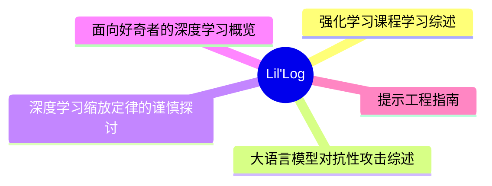
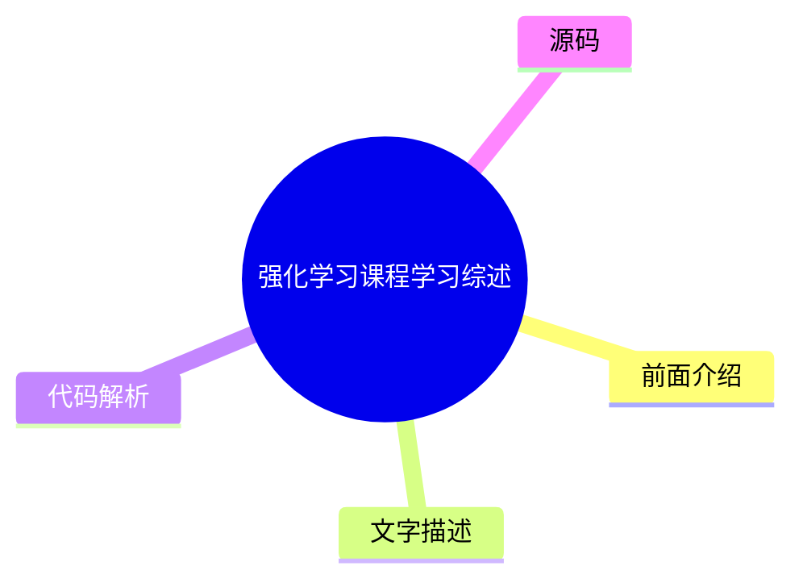
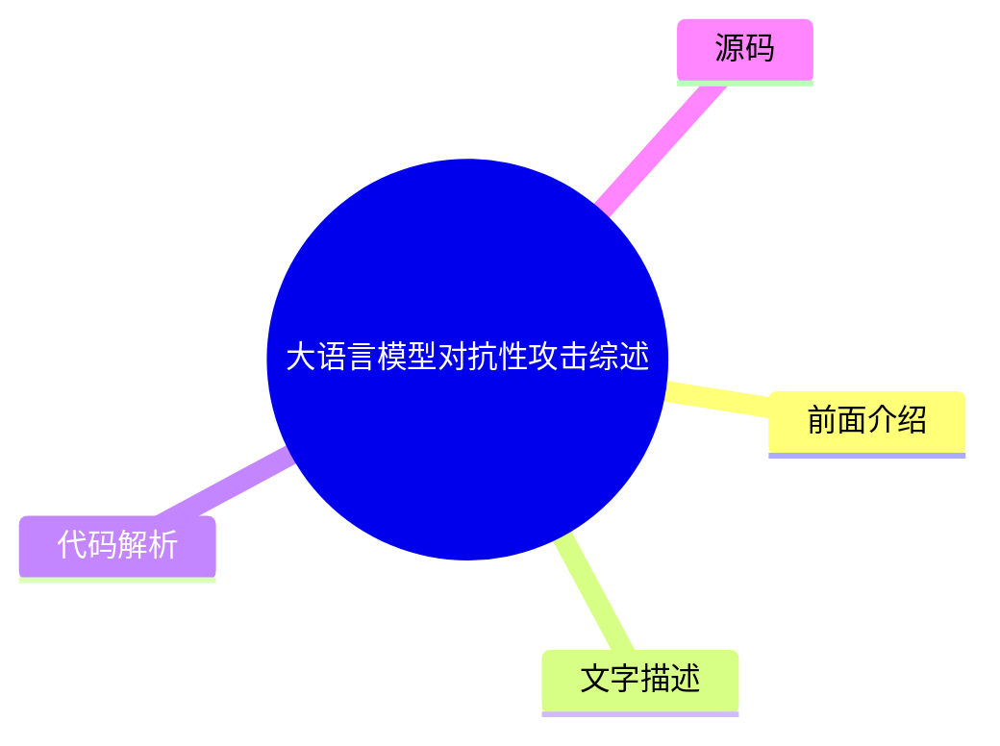
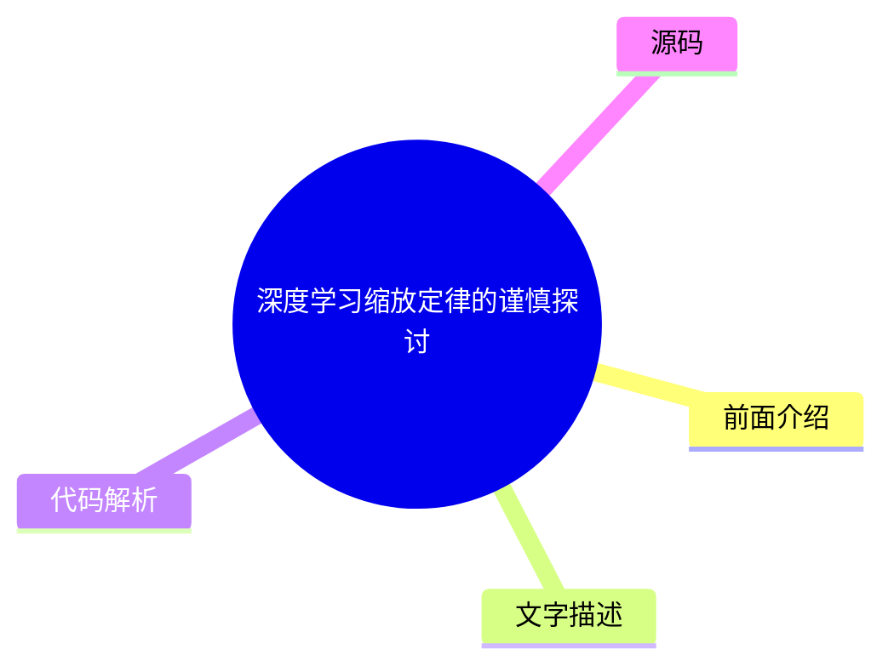
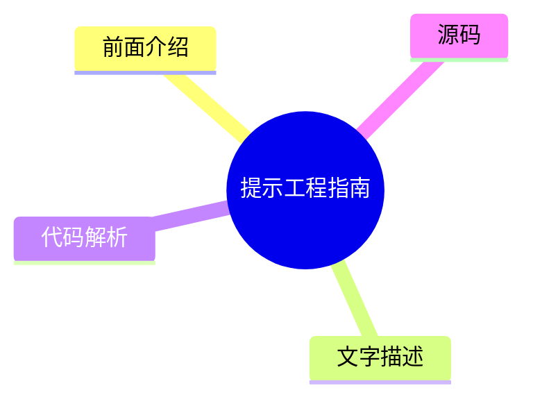

# 🧪 Lil'Log Top 5 (2026-08-05)

## 前面介绍

- 数据源：Lil'Log
- 抓取日期：2026-08-05
- 条目数：5
- 含完整正文：5
- 含代码片段：1
- 组织方式：前面介绍 / 树状图 / 文字描述 / 代码解析 / 源码

## 思维导图



## 详细整理（5 条，5 条含全文，1 条含代码）

### 1. 强化学习课程学习综述
- **链接**: [https://lilianweng.github.io/posts/2020-01-29-curriculum-rl/](https://lilianweng.github.io/posts/2020-01-29-curriculum-rl/)
- **发布**: Wed, 29 Jan 2020 00:00:00 +0000

#### 前面介绍

- 课程学习通过逐步增加训练样本的难度来加速模型收敛
- 早期研究表明，从简单任务开始有助于模型学习语言语法等复杂模式
- 设计有效的课程策略需要量化任务的难度，例如使用预训练模型的损失

#### 树状图



#### 文字描述

- Elman (1993) 提出了神经网络课程学习的概念，通过从受限的简单数据集开始，逐步增加训练样本的复杂性来训练模型
- Bengio 等人 (2009) 提出了课程学习的两个核心观点：更清洁的示例能带来更好的泛化能力，引入更难的示例能加速在线训练
- Zaremba 和 Sutskever (2014) 的实验表明，混合策略（结合简单和复杂任务）通常优于单纯的递增难度策略，有助于避免遗忘
- Weinshall 等人 (2018) 提出利用预训练模型的最小损失来对训练样本进行排序，从而构建任务特定的课程
- 程序化内容生成 (PCG) 是一种创建不同难度视频游戏的方法，涉及算法随机性和人类专业知识的设计

#### 代码解析

- 本文未提供源码，以下为实现思路或结构解析

#### 源码

#### 中文节选

[Updated on 2020-02-03: 在“任务特定课程”部分提及 [PCG](#pcg)。

[Updated on 2020-02-04: 新增一个 [“通过蒸馏进行课程学习”](#curriculum-through-distillation) 章节。

如果我们想教一个连基本算术都不知道的3岁孩子积分或导数，这听起来像是一项不可能完成的任务。这就是为什么教育很重要的原因，因为它提供了一种系统化的方法来分解复杂知识，并为从简单到困难的概念教学提供了一个很好的课程。课程让学习困难的事情对我们人类来说变得更容易、更易于接受。但是，机器学习模型呢？我们能否通过课程学习更高效地训练模型？我们能否设计一个课程来加速学习？

早在1993年，Jeffrey Elman 就提出了通过课程学习训练神经网络的想法。他在学习简单语言语法方面的早期工作证明了这种策略的重要性：从一组受限的简单数据开始，并逐渐增加训练样本的复杂性；否则，模型根本无法学习。

与没有课程的学习相比，我们预期采用课程学习会加速收敛速度，并且可能会或可能不会提高最终模型的性能。设计一个高效且有效的课程并不容易。请记住，糟糕的课程甚至可能会阻碍学习。

接下来，我们将研究几类课程学习，如图所示。大多数情况应用于强化学习，在监督学习中有少数例外。

在“The importance of starting small”论文（[Elman 1993](http://citeseerx.ist.psu.edu/viewdoc/download?doi=10.1.1.128.4487&rep=rep1&type=pdf)）中，我特别喜欢开篇的句子，发现它们既鼓舞人心又引人深思：

“人类在许多维度上与其他物种不同，但有两个维度尤为显著。人类表现出非凡的学习能力；而人类在达到成熟所需的时间之长方面也令人瞩目。学习的适应优势是显而易见的，并且可以说，通过文化，学习为非基于基因的行为传递奠定了基础，这可能加速了我们物种的进化。”

确实，学习可能是我们人类拥有的最好超能力。

# Task-Specific Curriculum[#](#task-specific-curriculum)

[Bengio 等人 (2009)](https://www.researchgate.net/profile/Y_Bengio/publication/221344862_Curriculum_learning/links/546cd2570cf2193b94c577ac/Curriculum-learning.pdf) 在过去提供了关于课程学习的良好概述。该论文提出了两个观点，并使用手动设计的任务特定课程进行了玩具实验：

- 更干净的示例可能更快地带来更好的泛化能力。
- 逐渐引入更困难的示例可以加速在线训练。

某些课程策略可能是无用的，甚至是有害的。该领域一个值得回答的好问题是：*什么可能

#### 完整正文（中文）

[Updated on 2020-02-03: 在“任务特定课程”部分提及 [PCG](#pcg)。

[Updated on 2020-02-04: 新增一个 [“通过蒸馏进行课程学习”](#curriculum-through-distillation) 章节。

如果我们想教一个连基本算术都不知道的3岁孩子积分或导数，这听起来像是一项不可能完成的任务。这就是为什么教育很重要的原因，因为它提供了一种系统化的方法来分解复杂知识，并为从简单到困难的概念教学提供了一个很好的课程。课程让学习困难的事情对我们人类来说变得更容易、更易于接受。但是，机器学习模型呢？我们能否通过课程学习更高效地训练模型？我们能否设计一个课程来加速学习？

早在1993年，Jeffrey Elman 就提出了通过课程学习训练神经网络的想法。他在学习简单语言语法方面的早期工作证明了这种策略的重要性：从一组受限的简单数据开始，并逐渐增加训练样本的复杂性；否则，模型根本无法学习。

与没有课程的学习相比，我们预期采用课程学习会加速收敛速度，并且可能会或可能不会提高最终模型的性能。设计一个高效且有效的课程并不容易。请记住，糟糕的课程甚至可能会阻碍学习。

接下来，我们将研究几类课程学习，如图所示。大多数情况应用于强化学习，在监督学习中有少数例外。

在“The importance of starting small”论文（[Elman 1993](http://citeseerx.ist.psu.edu/viewdoc/download?doi=10.1.1.128.4487&rep=rep1&type=pdf)）中，我特别喜欢开篇的句子，发现它们既鼓舞人心又引人深思：

人类在其他许多维度上与其他物种不同，但有两个维度尤为显著。人类表现出非凡的学习能力；而且，人类在达到成熟期所需的 unusually 长时间方面也令人瞩目。学习的适应性优势是显而易见的，而且可以说，通过文化，学习为基于非遗传的行为传递奠定了基础，这可能加速了我们物种的进化。”

确实，学习可能是我们人类拥有的最好的超能力。

# 针对任务的课程[#](#task-specific-curriculum)

[Bengio 等人 (2009)](https://www.researchgate.net/profile/Y_Bengio/publication/221344862_Curriculum_learning/links/546cd2570cf2193b94c577ac/Curriculum-learning.pdf) 在过去提供了关于课程学习的良好概述。该论文提出了两个观点，并使用手动设计的针对任务的课程进行了玩具实验：

- 更干净的示例可能更快地产生更好的泛化能力。
- 逐渐引入更难的示例可以加速在线训练。

某些课程策略可能是无用甚至有害的。该领域一个值得回答的好问题是：*是什么通用原则使得某些课程策略比其他策略更有效？* Bengio 2009 年的论文假设，让学习专注于既不太难也不太容易的“有趣”示例是有益的。

如果我们天真的课程是按逐渐增加的复杂度水平对样本进行训练，我们需要一种方法来量化任务的难度。一个想法是使用其在另一个模型上的最小损失，而该模型在其他任务上进行了预训练 ([Weinshall 等人 2018](https://arxiv.org/abs/1802.03796))。通过这种方式，预训练模型的知识可以通过建议训练样本的排名来转移到新模型上。图 2 展示了 `curriculum` 组（绿色）相对于 `control`（随机顺序；黄色）和 `anti`（反转顺序；红色）组的有效性。

[Zaremba & Sutskever (2014)](https://arxiv.org/abs/1410.4615) 做了一个有趣的实验，训练 LSTM 来预测短 Python 程序的输出，该程序用于数学运算，而无需实际执行代码。他们发现课程学习对于学习是必要的。程序的复杂性由两个参数控制，`length` ∈ [1, a] 和 `nesting`∈ [1, b]。考虑了三种策略：

- **朴素课程**：首先增加 `length` 直到达到 `a`；然后增加 `nesting` 并将 `length` 重置为 1；重复此过程直到两者都达到最大值。
- **混合课程**：采样 `length`~ [1, a] 和 `nesting`~ [1, b]
- **组合**：朴素 + 混合。

他们注意到组合策略总是优于朴素课程，并且通常会（但并非总是）优于混合策略——这表明在训练期间混合简单任务对于 *避免遗忘* 至关重要。

[程序化内容生成 (][PCG](https://en.wikipedia.org/wiki/Procedural_generation)) 是创建各种难度视频游戏的一种流行方法。PCG 涉及算法随机性，并在设计游戏元素及其依赖关系时注入大量的人类专业知识。程序化生成的关卡已被引入多个基准环境，用于评估强化学习智能体是否能够泛化到它未训练过的新关卡（[元强化学习](https://lilianweng.github.io/posts/2019-06-23-meta-rl/)！），例如 [GVGAI](http://www.gvgai.net/)、OpenAI [CoinRun](https://openai.com/blog/quantifying-generalization-in-reinforcement-learning/) 和 [Procgen benchmark](https://openai.com/blog/procgen-benchmark/)。使用 GVGAI，[Justesen 等人 (2018)](https://arxiv.org/abs/1806.10729) 证明，强化学习策略很容易过拟合到特定游戏，但在一个随模型性能增长而增加任务难度的简单课程上进行训练，有助于其泛化到新的人类设计关卡。在 CoinRun 中也发现了类似的结果 ([Cobbe 等人 2018](https://arxiv.org/abs/1812.02341))。POET ([Wang 等人, 2019](https://arxiv.org/abs/1901.01753)) 是利用进化算法和程序化生成的游戏关卡来提高强化学习泛化能力的另一个例子，我在我的 [元强化学习文章](https://lilianweng.github.io/posts/2019-06-23-meta-rl/#evolutionary-algorithm-on-environment-generation) 中对此进行了详细描述。

为了遵循上述课程学习方法，通常我们需要在训练过程中解决两个问题：

- 设计一个指标来量化任务的难度，以便我们可以据此对任务进行排序。
- 在训练期间向模型提供一系列难度递增的任务。

然而，任务的顺序不必是顺序的。在我们的魔方论文中，我们依赖于*自动领域随机化*（**ADR**）通过增长一系列复杂度递增的环境分布来生成课程。每个任务的难度（即在特定环境中解决魔方）取决于各种环境参数的随机化范围。即使假设所有环境参数都不相关，我们也能够为我们的机械手创建一个相当不错的课程。

# 教师引导式课程[#](#teacher-guided-curriculum)

*自动课程学习*的概念由 [Graves 等人 2017](https://arxiv.org/abs/1704.03003) 稍早提出。它将 $N$ 任务课程视为一个 [$N$ 臂老虎机](https://lilianweng.github.io/posts/2018-01-23-multi-armed-bandit/) 问题，以及一个学习优化该老虎机回报的自适应策略。

论文中考虑了两种类别的学习信号：

- 损失驱动的进度：一次梯度更新前后损失函数的变化。这种类型的奖励信号跟踪学习过程的速度，因为最大的任务损失降低等同于最快的学习。
- 复杂度驱动的进度：网络权重后验分布与先验分布之间的 KL 散度。这种类型的学习信号受到 [MDL](https://en.wikipedia.org/wiki/Minimum_description_length) 原则的启发，“增加一定量的模型复杂度只有在压缩数据量更大的情况下才是值得的”。因此，模型复杂度预期在模型对训练示例良好泛化时增长最多。

[通过另一个 RL 代理自动提出课程的方法被形式化为 ]*Teacher-Student Curriculum Learning* (**TSCL**; [Matiisen, et al. 2017](https://arxiv.org/abs/1707.00183))。在 TSCL 中，*学生* 是一个正在执行实际任务的 RL 代理，而 *教师* 代理则是用于选择任务的策略。学生的目标是掌握一个可能难以直接学习的复杂任务。为了使该任务更容易学习，我们设置了教师代理，通过选择适当的子任务来指导学生的训练过程。

在这个过程中，学生应该学习能够：

- 帮助学生取得最快学习进展的任务，或
- 有被遗忘风险的任务。

注意：将教师模型构建为 RL 问题的设置感觉与神经架构搜索 (NAS) 非常相似，但不同的是 TSCL 中的 RL 模型在任务空间上操作，而 NAS 在主模型架构空间上操作。

训练教师模型是解决一个 [POMDP](https://en.wikipedia.org/wiki/Partially_observable_Markov_decision_process) 问题：

- 未观察到的 $s_t$ 是学生模型的完整状态。
- 观察到的 $o = (x_t^{(1)}, \dots, x_t^{(N)})$ 是 $N$ 个任务的分数列表。
- 动作 $a$ 是选择一个子任务。
- 每一步的奖励是分数差 $r_t = \sum_{i=1}^N x_t^{(i)} - x_{t-1}^{(i)}$（即，相当于在回合结束时最大化所有任务的分数）。

从嘈杂的任务分数中估计学习进展，同时平衡探索与利用的方法，可以从非平稳多臂老虎机问题中借鉴 —— 使用 [ε-greedy](https://lilianweng.github.io/posts/2018-01-23-multi-armed-bandit/#%CE%B5-greedy-algorithm)，或 [Thompson sampling](https://lilianweng.github.io/posts/2018-01-23-multi-armed-bandit/#thompson-sampling)。

总结来说，核心思想是使用一个策略为另一个策略提出任务，以便后者学习得更好。有趣的是，上述两项工作（在离散任务空间中）都发现从所有任务中均匀采样是一个令人惊讶的强大基准。

如果任务空间是连续的呢？[Portelas 等人 (2019)](https://arxiv.org/abs/1910.07224) 研究了一个连续的教师-学生框架，其中教师必须从连续任务空间中采样参数来生成学习课程。给定一个新采样的参数 $p$，绝对学习进度（Absolute Learning Progress，简称 ALP）被测量为 $\text{ALP}_p = \vert r - r_\text{old} \vert$，其中 $r$ 是与 $p$ 相关的回合奖励，$r_\text{old}$ 是与 $p_\text{old}$ 相关的奖励。这里，$p_\text{old}$ 是任务空间中距离 $p$ 最近的先前采样的参数，可以通过最近邻检索到。请注意，这个 ALP 分数与上文 [TSCL](#TSCL) 或 [Grave 等人 2017](#grave-et-al-2017) 中的学习信号有何不同：ALP 分数测量的是两个任务之间的奖励差异，而不是同一任务在两个时间步上的性能。

在任务参数空间之上，训练了一个高斯混合模型来拟合 $\text{ALP}_p$ 在 $p$ 上的分布。在采样任务时使用 ε-greedy 策略：以一定的概率采样一个随机任务；否则，从 GMM 模型中按 ALP 分数比例采样。

# 通过自我博弈进行课程学习[#](#curriculum-through-self-play)

与教师-学生框架不同，两个智能体在做非常不同的事情。教师学习为学生选择任务，而无需了解实际的任务内容。如果我们想让两者都直接在主任务上训练呢？甚至让它们互相竞争怎么样？

[Sukhb


### 2. 大语言模型对抗性攻击综述
- **链接**: [https://lilianweng.github.io/posts/2023-10-25-adv-attack-llm/](https://lilianweng.github.io/posts/2023-10-25-adv-attack-llm/)
- **发布**: Wed, 25 Oct 2023 00:00:00 +0000

#### 前面介绍

- 对抗性攻击旨在通过精心设计的输入触发模型输出不受欢迎的内容
- 文本攻击比图像攻击更具挑战性，因为缺乏直接的梯度信号
- 攻击类型包括黑盒的令牌操作、白盒的基于梯度的攻击以及越狱提示词等

#### 树状图



#### 文字描述

- 威胁模型假设攻击仅发生在推理阶段，模型权重固定。白盒攻击假设攻击者拥有模型权重和架构的完全访问权限，而黑盒攻击仅通过 API 进行交互
- 分类任务中的对抗性攻击寻找与原始输入差异微小但分类结果不同的输入，而生成任务中的攻击旨在让模型输出非法或泄露隐私的内容
- 基于梯度的攻击利用模型权重和架构信息来寻找有效的攻击方法，通常需要计算梯度
- 越狱提示词 (Jailbreak Prompting) 是一种启发式的提示方法，旨在绕过模型内置的安全行为
- 令牌操作攻击通过替换同义词等简单操作来触发模型错误预测，TextAttack 等框架实现了多种此类方法

#### 代码解析

- 本文未提供源码，以下为实现思路或结构解析

#### 源码

#### 中文节选

ChatGPT 的发布极大地加速了大型语言模型在现实世界中的应用。我们（包括我在 OpenAI 的团队，向他们致敬）在对齐过程中投入了大量精力，将默认的安全行为构建到模型中（例如通过 [RLHF](https://openai.com/research/learning-to-summarize-with-human-feedback)）。然而，对抗性攻击或越狱提示可能会触发模型输出不受希望的内容。

大量关于对抗性攻击的早期工作集中在图像上，其操作方式不同，是在连续的高维空间中进行的。由于缺乏直接的梯度信号，针对离散数据（如文本）的攻击被认为要困难得多。我之前关于 [Controllable Text Generation](https://lilianweng.github.io/posts/2021-01-02-controllable-text-generation/) 的帖子与这个话题非常相关，因为攻击 LLM 本质上就是控制模型输出某种类型（不安全）的内容。

还有另一类工作涉及攻击 LLM 以提取预训练数据、私有知识（[Carlini et al, 2020](https://arxiv.org/abs/2012.07805)）或通过数据投毒攻击模型训练过程（[Carlini et al. 2023](https://arxiv.org/abs/2302.10149)）。我们不会在本文中涵盖这些话题。

# 基础知识[#](#basics)

## 威胁模型[#](#threat-model)

对抗性攻击是触发模型输出不受希望内容的输入。早期的许多文献集中在分类任务上，而最近的努力开始更多地研究生成模型的输出。在大型语言模型的背景下，本文假设攻击仅发生在**推理时**，这意味着**模型权重是固定的**。

### 分类[#](#classification)

分类器上的对抗性攻击在过去的研究社区中引起了更多关注，许多是在图像领域。LLM 也可以用于分类。给定输入 $\mathbf{x}$ 和分类器 $f(.)$，我们希望找到输入的一个对抗版本，记为 $\mathbf{x}_\text{adv}$，它与 $\mathbf{x}$ 的差异不可察觉，使得 $f(\mathbf{x}) \neq f(\mathbf{x}_\text{adv})$。

### 文本生成[#](#text-generation)

给定输入 $\mathbf{x}$ 和生成模型 $p(.)$，模型输出一个样本 $\mathbf{y} \sim p(.\vert\mathbf{x})$。对抗性攻击将识别出这样的 $p(\mathbf{x})$，使得 $\mathbf{y}$ 违反模型的内置安全行为；例如在非法话题上输出不安全内容、泄露私人信息或模型训练数据。对于生成任务，判断攻击是否成功并不容易，这需要一个非常高质量的分类器来判断 $\mathbf{y}$ 是否不安全或进行人工审查。

### 白盒与黑盒[#](#white-box-vs-black-box)

白盒攻击假设攻击者拥有对模型权重、架构和训练流程的完全访问权限，从而攻击者可以获得梯度信号

#### 完整正文（中文）

ChatGPT 的发布极大地加速了大型语言模型在现实世界中的应用。我们（包括我在 OpenAI 的团队，向他们致敬）在对齐过程中投入了大量精力，将默认的安全行为构建到模型中（例如通过 [RLHF](https://openai.com/research/learning-to-summarize-with-human-feedback)）。然而，对抗性攻击或越狱提示可能会触发模型输出不受希望的内容。

大量关于对抗性攻击的早期工作集中在图像上，其操作方式不同，是在连续的高维空间中进行的。由于缺乏直接的梯度信号，针对离散数据（如文本）的攻击被认为要困难得多。我之前关于 [Controllable Text Generation](https://lilianweng.github.io/posts/2021-01-02-controllable-text-generation/) 的帖子与这个话题非常相关，因为攻击 LLM 本质上就是控制模型输出某种类型（不安全）的内容。

还有另一类工作涉及攻击 LLM 以提取预训练数据、私有知识（[Carlini et al, 2020](https://arxiv.org/abs/2012.07805)）或通过数据投毒攻击模型训练过程（[Carlini et al. 2023](https://arxiv.org/abs/2302.10149)）。我们不会在本文中涵盖这些话题。

# 基础知识[#](#basics)

## 威胁模型[#](#threat-model)

对抗性攻击是触发模型输出不受希望内容的输入。早期的许多文献集中在分类任务上，而最近的努力开始更多地研究生成模型的输出。在大型语言模型的背景下，本文假设攻击仅发生在**推理时**，这意味着**模型权重是固定的**。

### 分类[#](#classification)

分类器上的对抗性攻击在过去的研究社区中引起了更多关注，许多是在图像领域。LLM 也可以用于分类。给定输入 $\mathbf{x}$ 和分类器 $f(.)$，我们希望找到输入的一个对抗版本，记为 $\mathbf{x}_\text{adv}$，它与 $\mathbf{x}$ 的差异不可察觉，使得 $f(\mathbf{x}) \neq f(\mathbf{x}_\text{adv})$。

### 文本生成[#](#text-generation)

给定输入 $\mathbf{x}$ 和生成模型 $p(.)$，模型输出一个样本 $\mathbf{y} \sim p(.\vert\mathbf{x})$。对抗性攻击将识别出这样的 $p(\mathbf{x})$，使得 $\mathbf{y}$ 违反模型的内置安全行为；例如，在非法话题上输出不安全内容，泄露私人信息或模型训练数据。对于生成任务，判断攻击是否成功并不容易，这需要一个非常高质量的分类器来判断 $\mathbf{y}$ 是否不安全，或者进行人工审查。

### 白盒与黑盒攻击[#](#white-box-vs-black-box)

白盒攻击假设攻击者拥有对模型权重、架构和训练流程的完全访问权限，从而攻击者可以获得梯度信号。我们并不假设攻击者拥有对完整训练数据的访问权限。这仅对开源模型是可能的。黑盒攻击假设攻击者只能访问类似 API 的服务，他们提供输入 $\mathbf{x}$ 并返回样本 $\mathbf{y}$，而不知道关于模型的任何进一步信息。

# 对抗性攻击类型[#](#types-of-adversarial-attacks)

有多种方法可以找到对抗性输入，以触发 LLM 输出不需要的内容。我们在此介绍五种方法。

| 攻击类型 | 类型 | 描述 | 
|---|---|---|
| Token 操作 | 黑盒 | 改变文本输入中一小部分 token，使其触发模型故障，但仍然保持其原始语义含义。 | 
| 基于梯度的攻击 | 白盒 | 依赖梯度信号来学习有效的攻击。 | 
| 越狱提示 | 黑盒 | 通常基于启发式提示来“越狱”内置的模型安全机制。 | 
| 人工红队测试 | 黑盒 | 人工攻击模型，可以借助其他模型，也可以不借助。 | 
| 模型红队测试 | 黑盒 | 模型攻击模型，其中攻击模型可以被微调。 | 

## Token 操作[#](#token-manipulation)

给定一段包含一系列 token 的文本输入，我们可以应用简单的 token 操作，如同义词替换，来触发模型做出错误的预测。基于 token 操作的攻击在**黑盒**设置中有效。Python 框架 TextAttack ([Morris et al. 2020](https://arxiv.org/abs/2005.05909)) 实现了许多单词和 token 操作攻击方法，用于为 NLP 模型创建对抗样本。该领域的大多数工作都针对分类和蕴含预测进行了实验。

[Ribeiro et al (2018)](https://www.aclweb.org/anthology/P18-1079/) 依赖手动提出的语义等价对抗规则 (SEARs) 来进行最小化的 token 操作，从而使模型无法生成正确的答案。示例规则包括 (*What  NOUN→Which NOUN*), (*

*), (*

`WP` is → `WP`’s’*was→is*), 等。对抗操作后的语义等价性通过回译进行检查。这些规则是通过相当手动、启发式的过程提出的，SEARs 探测的模型“漏洞”类型仅限于对最小 token 变化的敏感性，随着基础 LLM 能力的提高，这不应成为问题。

相比之下，[EDA](https://lilianweng.github.io/posts/2022-04-15-data-gen/#EDA) (Easy Data Augmentation; [Wei & Zou 2019](https://arxiv.org/abs/1901.11196)) 定义了一组简单且更通用的操作来增强文本：同义词替换、随机插入、随机交换或随机删除。研究表明，EDA 增强可以提高多个基准测试的分类准确率。

TextFooler ([Jin et al. 2019](https://arxiv.org/abs/1907.11932)) 和 [BERT-Attack (][Li et al. 2020](https://aclanthology.org/2020.emnlp-main.500.pdf)) 遵循相同的过程：首先识别出对模型预测影响最大且最脆弱的单词，然后以某种方式替换这些单词。

给定分类器 $f$ 和输入文本字符串 $\mathbf{x}$，每个单词的重要性分数可以通过以下方式测量：

其中 $f_y$ 是标签 $y$ 的预测 logits，$x_{\setminus w_i}$ 是排除了目标词 $w_i$ 的输入文本。重要性高的词是很好的替换候选词，但应跳过停用词以避免语法破坏。

TextFooler 首先根据词嵌入余弦相似度用顶级同义词替换这些词，然后通过检查替换词是否仍具有相同的词性标注以及句子级相似度是否超过阈值来进行进一步过滤。BERT-Attack 则通过 BERT 用语义相似的词替换，因为上下文感知预测是掩码语言模型非常自然的用例。通过这种方式发现的对抗样本在不同模型之间具有一定的可迁移性，具体取决于模型和任务。

## 基于梯度的攻击[#](#gradient-based-attacks)

在白盒设置中，我们可以完全访问模型参数和架构。因此，我们可以依靠梯度下降来编程学习最有效的攻击。基于梯度的攻击仅在白盒设置中有效，例如对于开源 LLM。

**GBDA**（“基于梯度的分布式攻击”；[Guo et al. 2021](https://arxiv.org/abs/2104.13733)）使用 Gumbel-Softmax 近似技巧来*使对抗损失优化可微*，其中使用 BERTScore 和困惑度来保证感知度和流畅度。给定一个 token 序列 $\mathbf{x}=[x_1, x_2 \dots x_n]$，其中每个 token $x_i$ 可以从分类分布 $P_\Theta$ 中采样，其中 $\Theta \in \mathbb{R}^{n \times V}$ 且 $V$ 是 token 词汇表大小。考虑到 $V$ 通常约为 $O(10,000)$ 且大多数对抗示例只需要替换几个 token，因此它具有高度过参数化。我们有：

$$ x_i \sim P_{\Theta_i} = \text{Categorical}(\pi_i) = \text{Categorical}(\text{Softmax}(\Theta_i)) $$

其中 $\pi_i \in \mathbb{R}^V$ 是第 $i$ 个 token 的概率向量。要最小化的对抗目标函数是让分类器 $f$ 对输入 $\mathbf{X}$ 产生与正确标签 $y$ 不同的错误标签：$\min_{\Theta \in \mathbb{R}^{n \times V}} \mathbb{E}_{\mathbf{x} \sim P_{\Theta}} \mathcal{L}_\text{adv}(\mathbf{X}, y; f)$。然而，由于是分类分布，这在表面上看是不可微的。使用 Gumbel-softmax 近似（[Jang et al. 2016](https://arxiv.org/abs/1611.01144)），我们通过 $\tilde{\boldsymbol{\pi}}$ 从 Gumbel 分布 $\tilde{P}_\Theta$ 近似分类分布：

其中 $g_{ij} \sim \text{Gumbel}(0, 1)$；温度 $\tau > 0$ 控制分布的平滑度。

Gumbel 分布用于对样本数量（无论样本分布如何）的*极端*值、最大值或最小值进行建模。额外的 Gumbel 噪声引入了模拟从分类分布中采样过程的随机决策。

低温度 $\tau \to 0$ 推动收敛到分类分布，因为使用温度为 0 的 softmax 进行采样是确定性的。“采样”部分仅取决于 $g_{ij}$ 的值，该值主要集中在 0 附近。

设 $\mathbf{e}_j$ 为 token $j$ 的嵌入表示。我们可以用 $\bar{e}(\tilde{\boldsymbol{\pi}})$ 近似 $\mathbf{x}$，即对应于 token 概率的嵌入向量的加权平均：$\bar{e}(\pi_i) = \sum_{j=1}^V \pi_i^{(j)} \mathbf{e}_j$。请注意，当 $\pi_i$ 是对应于 token $x_i$ 的独热向量时，我们将有 $\bar{e}(\pi_i) = \mathbf{e}_{z_i}$。将嵌入表示与 Gumbel-softmax 近似相结合，我们有一个可最小化的可微目标：$\min_{\Theta \in \mathbb{R}^{n \times V}} \mathbb{E}_{\tilde{\boldsymbol{\pi}} \sim \tilde{P}_{\Theta}} \mathcal{L}_\text{adv}(\bar{e}(\tilde{\boldsymbol{\pi}}), y; f)$。

与此同时，也很容易应用可微分的软约束来进行白盒攻击。GBDA 实验了（1）使用 NLL（负对数似然）的软流畅度约束和（2）BERTScore（*“一种用于评估文本生成的相似度分数，捕捉了 Transformer 模型上下文嵌入中成对令牌之间的语义相似度。”*；[Zhang et al. 2019](https://arxiv.org/abs/1904.09675)）来测量两个文本输入之间的相似度，以确保扰动后的版本不会偏离原始版本太远。结合所有约束，最终的目标函数如下，其中 $\lambda_\text{lm}, \lambda_\text{sim} > 0$ 是预设的超参数，用于控制软约束的强度：

Gumbel-softmax 技巧很难扩展到令牌删除或添加，因此它仅限于令牌替换操作，不包括删除或添加。

**HotFlip** ([Ebrahimi et al. 2018](https://arxiv.org/abs/1712.06751)) 将文本操作视为向量空间中的输入，并测量损失对这些向量的导数。这里假设输入向量是一个字符级独热编码矩阵，$\mathbf{x} \in {0, 1}^{m \times n \times V}$ 且 $\mathbf{x}_{ij} \in {0, 1}^V$，其中 $m$ 是单词的最大数量，$n$ 是每个单词的最大字符数，$V$ 是字母表大小。给定原始输入向量 $\mathbf{x}$，我们构造一个新的向量 $\mathbf{x}_{ij, a\to b}$，其中第 $i$ 个单词的第 $j$ 个字符从 $a \to b$ 发生变化，因此我们有 $x_{ij}^{(a)} = 1$ 但 $x_{ij, a\to b}^{(a)} = 0, x_{ij, a\to b}^{(b)} = 1$。

根据一阶泰勒展开，损失的变化为：

该目标函数经过优化，以仅使用一次反向传播来选择使对抗损失最小的向量。

为了应用多次翻转，我们可以运行一个 $r$ 步的束搜索

...（截断，原文 46582+ 字符）


### 3. 深度学习缩放定律的谨慎探讨
- **链接**: [https://lilianweng.github.io/posts/2026-06-24-scaling-laws/](https://lilianweng.github.io/posts/2026-06-24-scaling-laws/)
- **发布**: Wed, 24 Jun 2026 00:00:00 +0000

#### 前面介绍

- 缩放定律描述了模型大小、数据集大小和计算量与训练损失之间的幂律关系
- 该定律可用于通过少量小规模实验预测更大模型的计算和令牌需求
- 早期研究（如 Amari 1992, Hestness 2017）已观察到泛化误差随数据规模呈幂律衰减

#### 树状图



#### 文字描述

- 缩放定律的核心是关于如何在模型大小 (N) 和数据集大小 (D) 之间最优分配计算资源 (C)
- 计算量 C 与模型参数 N 和数据令牌数 D 的近似关系为 C ≈ 6ND
- Amari 等人 (1992) 使用贝叶斯方法推导了四种不同条件下的学习曲线，均遵循幂律形式
- Hestness 等人 (2017) 的研究发现，泛化误差随数据规模呈幂律衰减，且幂律指数由问题领域决定而非模型架构
- Rosenfeld 等人 (2020) 提出了联合函数模型，将误差建模为 N 和 D 的幂律组合，可用于预测预期损失

#### 代码解析

- 本文未提供源码，以下为实现思路或结构解析

#### 源码

#### 中文节选

缩放定律是深度学习中最关键的实证发现之一。其观察结果形式简单：随着模型大小 $N$、数据集大小 $D$ 和计算量 $C$ 的增加，训练损失 $L$ 遵循幂律曲线，在双对数图上表现为一条直线。我们可以将缩放定律视为描述计算量、损失、模型大小和数据之间关系的框架；其核心在于如何在这两者之间最优地分配宝贵的计算资源。

这种可预测性使缩放定律在实践中极具价值。常见的工作流程是在少量小规模运行中拟合缩放定律，然后进行外推，以估算更大模型的代币和计算需求。

| 符号 | 备注 | 
|---|---|
| $N$ | 模型大小，以参数数量衡量。 | 
| $D$ | 训练数据集大小，通常以代币数量衡量。 | 
| $C$ | 以 FLOPs 为单位的训练计算量。作为一个有用的近似，$C \approx 6ND$（[Kaplan et al. 2020](https://arxiv.org/abs/2001.08361)），其中 $2ND$ 用于前向传播，$4ND$ 用于反向传播。 | 
| $E$ | 不可约损失 | 
| $L, \hat{L}(.)$ | 测试损失 / 测试损失预测函数；也可以指训练损失，因为两者高度相关。 | 
| $\epsilon$ | 泛化误差。 | 

# 早期：机器学习损失的可预测性[#](#early-days-ml-loss-predictability)

在缩放定律成为主流概念之前，泛化误差的可预测性就已经被研究过了。

[Amari et al. (1992)](https://ieeexplore.ieee.org/document/6796972) 使用贝叶斯方法和退火近似推导出了四种类型的学习曲线。

- 确定性学习算法，无噪声数据，唯一解：$\epsilon \sim c \cdot D^{-1}$，其中 $c$ 是某个常数。
- 确定性学习算法，无噪声数据，多个等价解：$\epsilon \sim c \cdot D^{-2}$；随着每个新数据点的加入，学习速度更快，因为模型只学习参数的最优流形，而不是寻找单个解点。

- 确定性学习算法，噪声数据：$\epsilon \sim c \cdot D^{-1/2}$；数据中的噪声使得学习变得更加困难。
- 随机学习算法，噪声数据：$\epsilon \sim c \cdot D^{-1} + E$；这里的不可约损失 $E$ 是随机学习者无法进一步降低的残差误差，例如当模型在大数据上耗尽容量时。所有四种类型的学习曲线都遵循幂律：

其中 $E$ 可以是 0，且 $\alpha = -2, -1, -1/2$。尽管它们的理论设定基于简化的二分类任务，但这为构建经验式机器学习损失预测模型指明了一个有用的方向。

[Hestness et al. (2017)](https://arxiv.org/abs/1712.00409) 最早的经验研究之一解释了泛化误差、模型大小和数据之间的关系。对于给定的训练数据大小，他们通过网格搜索确定了最佳拟合模型大小，然后绘制

#### 完整正文（中文）

缩放定律是深度学习中最关键的实证发现之一。其观察结果形式简单：随着模型大小 $N$、数据集大小 $D$ 和计算量 $C$ 的增加，训练损失 $L$ 遵循幂律曲线，在双对数图上表现为一条直线。我们可以将缩放定律视为描述计算量、损失、模型大小和数据之间关系的框架；其核心在于如何在这两者之间最优地分配宝贵的计算资源。

这种可预测性使缩放定律在实践中极具价值。常见的工作流程是在少量小规模运行中拟合缩放定律，然后进行外推，以估算更大模型的代币和计算需求。

| 符号 | 备注 | 
|---|---|
| $N$ | 模型大小，以参数数量衡量。 | 
| $D$ | 训练数据集大小，通常以代币数量衡量。 | 
| $C$ | 以 FLOPs 为单位的训练计算量。作为一个有用的近似，$C \approx 6ND$（[Kaplan et al. 2020](https://arxiv.org/abs/2001.08361)），其中 $2ND$ 用于前向传播，$4ND$ 用于反向传播。 | 
| $E$ | 不可约损失 | 
| $L, \hat{L}(.)$ | 测试损失 / 测试损失预测函数；也可以指训练损失，因为两者高度相关。 | 
| $\epsilon$ | 泛化误差。 | 

# 早期：机器学习损失的可预测性[#](#early-days-ml-loss-predictability)

在缩放定律成为主流概念之前，泛化误差的可预测性就已经被研究过了。

[Amari et al. (1992)](https://ieeexplore.ieee.org/document/6796972) 使用贝叶斯方法和退火近似推导出了四种类型的学习曲线。

- 确定性学习算法，无噪声数据，唯一解：$\epsilon \sim c \cdot D^{-1}$，其中 $c$ 是某个常数。
- 确定性学习算法，无噪声数据，多个等价解：$\epsilon \sim c \cdot D^{-2}$；随着每个新数据点的加入，学习速度更快，因为模型只学习参数的最优流形，而不是寻找单个解点。

- 确定性学习算法，噪声数据：$\epsilon \sim c \cdot D^{-1/2}$；数据中的噪声使学习变得更困难。
- 随机学习算法，噪声数据：$\epsilon \sim c \cdot D^{-1} + E$；这里不可约损失 $E$ 是随机学习者无法进一步降低的残差误差，例如当模型在大数据上耗尽容量时。所有四种类型的学习曲线都遵循幂律：

其中 $E$ 可以是 0，且 $\alpha = -2, -1, -1/2$。尽管其理论设置基于简化的二分类任务，但它为构建经验式机器学习损失预测模型指明了一个有用的方向。

[Hestness et al. (2017)](https://arxiv.org/abs/1712.00409) 最早的经验研究之一解释了泛化误差、模型大小和数据之间的关系。对于给定的训练数据大小，他们通过网格搜索确定了最佳拟合模型大小，然后将损失与训练数据集大小进行绘图。在深度学习的四个不同领域（神经机器翻译、图像分类、语言建模和语音识别）中，观察到了一种反复出现的模式，即：

- 泛化误差随一组因素（例如数据大小）按幂律缩放。
- 模型改进会移动误差曲线，但似乎不会影响幂律指数。
- 有趣的是，架构改变了幂律拟合的偏移量（$E$），但不会改变指数（$\alpha$）。幂律的斜率似乎是问题域的属性，而不是模型架构的属性。
- 拟合大小为 $D$ 的数据集所需的模型参数数量 $N$ 也按幂律缩放。

概念图解将学习曲线分为三个阶段。在小数据区域，当学习信号不足时，模型的性能仅略优于随机猜测。在中间（“幂律区域”），我们观察到损失、数据和模型大小之间存在幂律关系。最终的不可约误差区域可以归因于数据中的噪声等因素。

[Rosenfeld 等人 (2020)](https://arxiv.org/abs/1909.12673) 通过尝试将误差建模为模型大小 $N$ 和数据大小 $D$ 的联合函数，进一步推进了这一工作，涵盖了多种架构（ResNet、WRN、LSTM、Transformer）和优化器（Adam、SGD 变体）。经验上，他们观察到，在固定一个轴的情况下，误差随另一个轴呈幂律衰减：

可以将其合并为一个联合形式：

其中 $A > 0, B > 0, \alpha \geq 0, \beta \geq 0$ 是标量常数，且 $E$ 不依赖于 $N$ 或 $D$。

因此，他们可以构建一个简单参数化函数形式的预测模型，其参数向量为 $\boldsymbol{\theta} = \langle A, B, E, \alpha, \beta \rangle$，仅通过在较小的训练配置集 $(D, N)$ < 某些阈值上进行训练，来预测 $(D, N)$ > 某些阈值的预期损失。

附注：这些早期工作依赖于经典学习理论直觉，如 [VC 维度](https://en.wikipedia.org/wiki/Vapnik%E2%80%93Chervonenkis_dimension)（模型可以打散的最大点集的基数）作为容量的代理，但在现代深度学习工作中，VC 维度往往过于粗糙，无法解释其行为，而经验幂律结果比理论提供的最坏情况界限要清晰得多，也更实用。

# 数据无限区域的缩放定律[#](#scaling-laws-in-data-infinite-region)

## Kaplan 等人的缩放定律[#](#kaplan-et-als-scaling-laws)

[Kaplan 等 (2020)](https://arxiv.org/abs/2001.08361) 在语言建模社区普及了缩放定律的概念。他们发现，交叉熵测试损失 $L$ 随着模型大小 $N$（不包括嵌入层）、数据集大小 $D$ 和训练计算量 $C$ 的变化，在许多数量级范围内遵循幂律。这些发现与上一节中的早期工作一致，但 Kaplan 等人通过专注于 Transformer 语言模型以及更大规模的实证实验，正式化了这一概念，其模型大小范围从 7.68 亿到 15 亿个非嵌入参数，数据集大小范围从 2200 万到 230 亿个 token。论文中的所有训练运行都使用了学习率调度，即 3000 步线性预热，随后是衰减至零的余弦衰减。

关键发现列表：

- 损失 $L$ 分别与 $N$、$D$ 和 $C$ 呈幂律关系；为了获得最佳性能，这三者必须同步缩放。
- 训练曲线遵循可预测的幂律，其参数大致与模型大小无关。
- 更大的模型具有更高的样本效率，这意味着它们比小模型用更少的优化步数和更少的数据点就能达到给定的损失。
- 架构细节（宽度、长宽比等）的重要性不如单纯的规模。
- 训练损失和测试损失呈正相关。（听起来微不足道，但这是对预训练工作的基础。另一方面，预训练损失的改进是否会转移到后训练评估，需要单独研究。）
- 在固定的计算预算下，训练一个非常大的模型并在*收敛前*停止，比训练一个较小的模型直到收敛更高效。**这一发现与下一节中的 Chinchilla 缩放定律（Chinchilla scaling laws）相矛盾：Kaplan 等人高估了最佳模型大小，因为其拟合的指数较大。**

他们在一个方程中总结了 $N$ 和 $D$ 的联合依赖关系：

这种形式的另一个有益之处在于，过拟合的程度（即模型复杂或数据量小）主要取决于比率 $N^{\alpha / \beta} / D$，这表明数据需要以特定的比例随模型大小的增长而增长，以避免训练受限于数据。

最具影响力且事后看来最具争议的结论是计算最优分配。Kaplan 等人发现 $N_\text{opt} \propto C^{0.73}$，并得出结论，模型大小的增长应快于数据集大小的增长。具体而言，对于计算量的 10 倍增长，他们建议将模型大小增加约 5.5 倍，但仅将训练标记增加约 1.8 倍。Chinchilla 论文后来推翻了这一建议，认为这会导致大型模型严重*欠训练*。

Kaplan 等人进行的另一种有用的分析根据 $D$ 和 $N$ 近似计算所需的训练 FLOPs。每次乘加运算被计为约 2 FLOPs。

假设标准配置为 $d_\text{attn} = d_\text{model} = d_\text{ff}/4$，并从 $N$ 中排除嵌入层以及每个标记的前向计算：

然后我们将反向传播的 FLOPs 计为前向传播 FLOPs 的两倍，因为反向传播运行两次矩阵乘法，分别用于计算相对于输入激活值和权重的梯度。因此，总训练 FLOPs 每个标记约为 $6N$，而训练 $D$ 个标记的总 FLOPs 为 $C \approx 6ND$。

## Chinchilla 扩展定律[#](#chinchilla-scaling-laws)

Chinchilla 论文 ([Hoffmann et al. 2022](https://arxiv.org/abs/2203.15556)) 在固定计算预算 $C$ 下，通过更严谨的实验设计研究了最优模型大小 $N$（总参数，*包括*嵌入）与标记数量 $D$ 之间的关系，得出了与 Kaplan 等人略有不同的答案。

核心问题是在给定约束 $\text{FLOPs}(N, D) = C \approx 6ND$ 的情况下，如何分配资源。换句话说，当我们只有有限的 FLOPs（给定数量的 GPU 运行给定的时间）时，我们应如何在更多的数据标记和更多的模型参数之间做出选择？

Chinchilla 论文提出了三种设计精巧的方法来拟合缩放定律。

实证实验扫描了 400 多个模型，参数量从 70M 到 16B 以上，训练 token 从 5B 到 500B。实验基于每个训练 token 都是唯一的假设（即无限数据范围）。所有运行均使用余弦学习率调度，在训练过程中衰减 10 倍。扫描模型大小描绘出了计算最优前沿。

### 方法 1：固定模型大小，变化 token 预算[#](#method-1-fix-model-sizes-vary-the-token-budget)

对于每个参数量 $N$，使用不同的 token 预算训练多次运行，并记录每个 FLOP 预算 $C$ 下达到的最小损失。

### 方法 2：IsoFLOP 曲线[#](#method-2-isoflop-profiles)

固定计算预算 $C$，将最终损失绘制为参数量 $N$ 的函数。每个 iso-FLOP 曲线在 log 空间中大致呈抛物线，其最小值标记了该计算预算下的最优模型大小。然后在预算范围内重复此过程，在图中描绘出一条幂律线。

### 方法 3：参数拟合[#](#method-3-parametric-fit)

[直接拟合与 ][Rosenfeld et al. (2020)](https://arxiv.org/abs/1909.12673) 中相同的参数函数，

我们实际上可以通过在约束条件 $\text{FLOPs}(N,D) = C \approx 6ND$ 下最小化 $\hat{L}(N, D)$，得到最优 $N_\text{opt}(C), D_\text{opt}(C)$ 的闭式近似。

首先，让我们将表达式简化为仅包含 $N$：

当 $\alpha \approx \beta$ 时，模型大小和训练 token 应以相同的速率缩放。

为了找到最优的 $\boldsymbol{\theta} = \langle A, B, E, \alpha, \beta\rangle$，Chinchilla 论文采用了 [Huber 损失](https://en.wikipedia.org/wiki/Huber_loss)（对异常值具有鲁棒性；$\delta=10^{-3}$）和 [L-BFGS 算法](https://en.wikipedia.org/wiki/Limited-memory_BFGS)（适用于参数较少的曲线拟合）。

Chinchilla 通过三种互补方法得出其结论，其最终结果相互一致，这也是该结果相当令人信服的原因之一。

Chinchilla 论文中关于当时（约 2022 年）大多数大型模型训练不足的论断，得到了一个著名的演示的支持：在相同的计算预算下（与 Gopher 相同，[Rae et al. 2021](https://arxiv.org/abs/2112.11446)；280B 参数数量，

...（截断，原文 29101+ 字符）


### 4. 面向好奇者的深度学习概览
- **链接**: [https://lilianweng.github.io/posts/2017-06-21-overview/](https://lilianweng.github.io/posts/2017-06-21-overview/)
- **发布**: Wed, 21 Jun 2017 00:00:00 +0000

#### 前面介绍

- 深度学习之所以现在流行，是因为我们拥有更多的数据和更强大的计算机
- 与传统机器学习相比，神经网络具有更多参数，能够自动学习复杂的非线性模式
- 卷积神经网络 (CNN) 受视觉皮层组织结构的启发，通过卷积操作提取图像特征

#### 树状图


#### 文字描述

- AlphaGo 在 2016 年击败李世石的事件标志着深度学习在复杂推理任务上的突破
- 深度学习模型通常表示为有向无环图，输入层接收信号，隐藏层处理输出，最终层输出结果
- Andrew Ng 提出的图表展示了随着数据规模扩大，神经网络相比传统算法的性能优势
- 卷积操作涉及固定的小矩阵（核）在输入图像上的滑动，计算元素乘积，可执行模糊、锐化或边缘检测等操作
- 残差网络 (ResNet) 引入了跳跃连接，允许输入直接传递到较远的层，解决了深层网络的梯度消失问题

#### 代码解析

- 本文未提供源码，以下为实现思路或结构解析

#### 源码

#### 中文节选

（该帖子源于我在 [Affirm](www.affirm.com) 举办的 [WiMLDS x Fintech meetup](http://wimlds.org/chapters/about-bay-area/) 上所做的演讲。）

我相信你们中的许多人都在 2016 年观看或听说过 [AlphaGo 与职业围棋手 [李世石](https://en.wikipedia.org/wiki/Lee_Sedol) 之间的对局](https://youtu.be/vFr3K2DORc8)。李世石拥有九段最高段位和许多世界冠军头衔。毫无疑问，他是世界上最优秀的围棋手之一，但在这场系列赛中他以 1-4 输给了 AlphaGo。在此之前，围棋被认为是一个计算机难以掌握的难题，因为其简单的规则在棋盘位置上产生了指数级的变体，远超国际象棋。这一事件无疑将 2016 年标记为 AI 的一个重要年份。由于 AlphaGo 的出现，人们对 AI 的进展给予了极大的关注。

与此同时，许多公司正在投入资源推动 AI 应用的前沿，这些应用确实有潜力改变甚至彻底改变我们将来的生活方式。熟悉的例子包括自动驾驶汽车、聊天机器人、家庭助手设备等。近年来我们所取得进展背后的一个秘密秘诀就是深度学习。

# 为什么深度学习现在才起效？[#](#why-does-deep-learning-work-now)

简单来说，深度学习模型是大型且深层的神经网络。神经网络（“NN”）可以用 [有向无环图](https://en.wikipedia.org/wiki/Directed_acyclic_graph) 很好地表示：输入层接收信号向量；一个或多个隐藏层处理前一层的输出。神经网络的概念可以追溯到半个多 [世纪前](https://cs.stanford.edu/people/eroberts/courses/soco/projects/neural-networks/History/history1.html)。但是为什么它现在才起效？为什么人们突然开始谈论它？

原因出奇地简单：

- 我们拥有多得 **多的数据**。
- 我们拥有 **强大得多的计算机**。

一个大型且深层的神经网络拥有更多的层 + 每一层中更多的节点，这导致需要调整的参数呈指数级增加。如果没有足够的数据，我们无法高效地学习参数。如果没有强大的计算机，学习将过于缓慢且不足。

这是安德鲁·吴在他的“[深度学习应用指南](https://youtu.be/F1ka6a13S9I)”演讲中提出的一个有趣的图表，展示了数据规模与模型性能之间的关系。在小数据集上，传统算法（回归、随机森林、支持向量机、梯度提升机等）或统计学习表现优异，但一旦数据规模呈指数级上升，大型神经网络就会超越其他方法。部分原因在于，与传统的机器学习模型相比，神经网络模型拥有更多的参数，并且具备学习复杂非线性模式的能力。因此，我们期望模型能够选择最 h

#### 完整正文（中文）

（该帖子源于我在 [Affirm](www.affirm.com) 举办的 [WiMLDS x Fintech meetup](http://wimlds.org/chapters/about-bay-area/) 上所做的演讲。）

我相信你们中的许多人都在 2016 年观看或听说过 [AlphaGo 与职业围棋手 [李世石](https://en.wikipedia.org/wiki/Lee_Sedol) 之间的对局](https://youtu.be/vFr3K2DORc8)。李世石拥有九段最高段位和许多世界冠军头衔。毫无疑问，他是世界上最优秀的围棋手之一，但在这场系列赛中他以 1-4 输给了 AlphaGo。在此之前，围棋被认为是一个计算机难以掌握的难题，因为其简单的规则在棋盘位置上产生了指数级的变体，远超国际象棋。这一事件无疑将 2016 年标记为 AI 的一个重要年份。由于 AlphaGo 的出现，人们对 AI 的进展给予了极大的关注。

与此同时，许多公司正在投入资源推动 AI 应用的前沿，这些应用确实有潜力改变甚至彻底改变我们将来的生活方式。熟悉的例子包括自动驾驶汽车、聊天机器人、家庭助手设备等。近年来我们所取得进展背后的一个秘密秘诀就是深度学习。

# 为什么深度学习现在才起效？[#](#why-does-deep-learning-work-now)

简单来说，深度学习模型是大型且深层的神经网络。神经网络（“NN”）可以用 [有向无环图](https://en.wikipedia.org/wiki/Directed_acyclic_graph) 很好地表示：输入层接收信号向量；一个或多个隐藏层处理前一层的输出。神经网络的概念可以追溯到半个多 [世纪前](https://cs.stanford.edu/people/eroberts/courses/soco/projects/neural-networks/History/history1.html)。但是为什么它现在才起效？为什么人们突然开始谈论它？

原因出奇地简单：

- 我们拥有多得 **多的数据**。
- 我们拥有 **强大得多的计算机**。

一个大型且深层的神经网络拥有更多的层 + 每层更多的节点，这导致需要调整的参数呈指数级增长。如果没有足够的数据，我们无法高效地学习参数。如果没有强大的计算机，学习过程将过于缓慢且不足。

这是安德鲁·吴在他的“[应用深度学习的核心要素](https://youtu.be/F1ka6a13S9I)”演讲中提出的一个有趣的图表，展示了数据规模与模型性能之间的关系。在小数据集上，传统算法（回归、随机森林、SVM、GBM 等）或统计学习表现优异，但一旦数据规模达到天空（极大），大型神经网络就会超越其他模型。部分原因是与传统的机器学习模型相比，神经网络模型拥有更多的参数，并且具备学习复杂非线性模式的能力。因此，我们期望模型能够自行挑选最有用的特征，而无需过多涉及专家参与的手动特征工程。

# 深度学习模型[#](#deep-learning-models)

接下来，让我们通过几个经典的深度学习模型。

## 卷积神经网络[#](#convolutional-neural-network)

卷积神经网络，简称“CNN”，是一种前馈人工神经网络，其神经元之间的连接模式受到视觉皮层系统组织的启发。初级视觉皮层（V1）从视网膜的原始视觉输入中进行边缘检测。次级视觉皮层（V2），也称为纹状皮层，从V1接收边缘特征并提取简单的视觉属性，如方向、空间频率和颜色。视觉区域V4处理更复杂的物体属性。所有处理过的视觉特征流入最终的逻辑单元——下颞回（IT），用于物体识别。V1和V4之间的捷径启发了CNN的一种特殊类型，即层与层之间具有连接的非相邻层：残差网络 ([He, et al. 2016](http://www.cv-foundation.org/openaccess/content_cvpr_2016/papers/He_Deep_Residual_Learning_CVPR_2016_paper.pdf))，其中包含支持某一层的部分输入传递到两层后的组件的“残差块”。

卷积是一个数学术语，这里指两个矩阵之间的运算。卷积层具有一个定义好的固定小矩阵，也称为核或滤波器。当核在输入图像的矩阵表示上滑动（即卷积）时，它计算核矩阵中的值与原始图像值之间的逐元素乘法。[专门设计的核](http://setosa.io/ev/image-kernels/)可以快速高效地处理图像以实现常见目的，如模糊、锐化、边缘检测等。

[卷积](http://ufldl.stanford.edu/tutorial/supervised/FeatureExtractionUsingConvolution/)和[池化](http://ufldl.stanford.edu/tutorial/supervised/Pooling/)（或图4中的“下采样”）层类似于V1、V2和V4视觉皮层单元，用于响应特征提取。物体识别推理发生在后面的全连接层中，这些层消耗提取出的特征。

## 循环神经网络[#](#recurrent-neural-network)

序列模型通常被设计用来将输入序列转换到另一个域的输出序列。循环神经网络，简称“RNN”，非常适合这一目的，并在手写识别、语音识别和机器翻译等问题上取得了巨大的改进 ([Sutskever et al. 2011](http://machinelearning.wustl.edu/mlpapers/paper_files/ICML2011Sutskever_524.pdf), [Liwicki et al. 2007](http://www6.in.tum.de/Main/Publications/Liwicki2007a.pdf))。

循环神经网络模型天生具备处理长序列数据以及解决时间上具有上下文扩散的任务的能力。该模型在每一个时间步处理序列中的一个元素。经过计算后，新更新的单元状态被传递到下一个时间步，以促进下一个元素的计算。想象一下，当 RNN 模型逐个字符阅读所有维基百科文章，然后根据上下文预测接下来的单词。

然而，简单地将当前输入元素和上一个单元状态进行线性组合的感知机神经元很容易丢失长期依赖关系。例如，我们以“爱丽丝在……工作”开始一个句子，几段话之后，我们希望正确地用“她”或“他”开始下一句话。如果模型忘记了角色的名字“爱丽丝”，我们就永远无法知道了。为了解决这个问题，研究人员创建了一种具有更复杂内部结构的特殊神经元，用于记忆长期上下文，名为 [“长短期记忆（LSTM）”](http://web.eecs.utk.edu/~itamar/courses/ECE-692/Bobby_paper1.pdf) 单元。它足够智能，可以学习应该记住旧信息多长时间，何时遗忘，何时利用新数据，以及如何将旧记忆与新输入结合起来。这篇 [介绍](http://colah.github.io/posts/2015-08-Understanding-LSTMs/) 写得非常好，我推荐所有对 LSTM 感兴趣的人都去读一读。它已经在 [Tensorflow 文档](https://www.tensorflow.org/tutorials/recurrent) 中被正式推广了 ;-).

为了展示 RNN 的强大功能，[Andrej Karpathy](http://karpathy.github.io/2015/05/21/rnn-effectiveness/) 使用带有 LSTM 单元的 RNN 构建了一个基于字符的语言模型。在事先不了解任何英语词汇的情况下，该模型能够学习字符之间的关系以形成单词，然后学习单词之间的关系以形成句子。即使没有庞大的训练数据集，它也能实现相当不错的性能。

## RNN：序列到序列模型[#](#rnn-sequence-to-sequence-model)

[序列到序列模型](https://arxiv.org/pdf/1406.1078.pdf) 是 RNN 的一个扩展版本，但其应用领域足够独特，因此我想将其列在一个单独的部分。与 RNN 一样，序列到序列模型处理序列数据，但特别地，它通常用于开发聊天机器人或个人助理，两者都能为输入问题生成有意义的回复。序列到序列模型由两个 RNN 组成，即编码器和解码器。编码器从输入单词中学习上下文信息，然后通过“**上下文向量**”（或“思维向量”，如图 8 所示）将知识传递给解码器一侧。最后，解码器消耗上下文向量并生成适当的回复。

## 自编码器[#](#autoencoders)

与之前的模型不同，自编码器用于无监督学习。它旨在学习**高维**数据集的**低维**表示，类似于 [主成分分析 (PCA)](https://en.wikipedia.org/wiki/Principal_component_analysis) 所做的工作。自编码器模型试图学习一个近似函数 $ f(x) \approx x $ 来重现输入数据。然而，它受到中间瓶颈层的限制，该层节点数量非常少。由于容量有限，该模型被迫形成数据的高效编码，即我们学习到的低维代码。

[Hinton 和 Salakhutdinov](https://pdfs.semanticscholar.org/7d76/b71b700846901ac4ac119403aa737a285e36.pdf) 使用自编码器对各种主题的文档进行了压缩。如图 10 所示，当同时应用 PCA 和自编码器将文档降维到二维时，自编码器展示了更好的效果。借助自编码器，我们可以进行高效的数据压缩，从而加速包括文档和图像在内的信息检索。

# 强化（深度）学习[#](#reinforcement-deep-learning)

既然我以 AlphaGo 开头，让我们更深入地探讨一下 AlphaGo 成功的原因。[强化学习（“RL”）](https://en.wikipedia.org/wiki/Reinforcement_learning) 是其成功背后的秘诀之一。RL 是机器学习的一个子领域，它允许机器和软件代理在给定上下文中自动确定最优行为，其目标是最大化由给定指标衡量的长期性能。


### 5. 提示工程指南
- **链接**: [https://lilianweng.github.io/posts/2023-03-15-prompt-engineering/](https://lilianweng.github.io/posts/2023-03-15-prompt-engineering/)
- **发布**: Wed, 15 Mar 2023 00:00:00 +0000

#### 前面介绍

- 提示工程通过调整输入提示来引导大语言模型的行为，而无需更新模型权重
- 零样本和少样本学习是两种基本的提示方法
- 提示示例的选择、格式和顺序对模型性能有显著影响

#### 树状图



#### 文字描述

- 零样本学习直接将任务文本输入模型并请求结果，无需提供示例
- 少样本学习提供高质量的输入-输出示例，有助于模型理解人类意图，但会消耗更多令牌并可能触及上下文长度限制
- Zhao 等人 (2021) 指出大语言模型存在多数标签偏差、近因偏差和常见令牌偏差，并提出了一种校准方法
- Liu 等人 (2021) 建议使用 k-NN 聚类选择与测试示例语义相似的示例
- Su 等人 (2022) 提出了一种基于图的多样性选择方法，通过构建节点间的邻接关系来选择具有代表性的示例

#### 代码解析

- 零样本提示示例：Text: i'll bet the video game is a lot more fun than the film. Sentiment:
- 少样本提示示例：Text: (lawrence bounces) all over the stage... Sentiment: positive
- 提示示例选择公式：score(u) = sum(s(v))，其中 s(v) 随已选邻居数量增加而降低，鼓励多样性
- 基于图的提示选择步骤：1. 构建有向图 G=(V,E)，节点指向 k 个最近邻；2. 初始化已选集合 L 和剩余集合 U；3. 计算剩余样本的分数以选择代表性示例

#### 源码

#### 源码片段 1（text）

```text
Text: i'll bet the video game is a lot more fun than the film.
Sentiment:
```

#### 源码片段 2（text）

```text
Text: (lawrence bounces) all over the stage, dancing, running, sweating, mopping his face and generally displaying the wacky talent that brought him fame in the first place.
Sentiment: positive
Text: despite all evidence to the contrary, this clunker has somehow managed to pose as an actual feature movie, the kind that charges full admission and gets hyped on tv and purports to amuse small children and ostensible adults.
Sentiment: negative
Text: for the first time in years, de niro digs deep emotionally, perhaps because he's been stirred by the powerful work of his co-stars.
Sentiment: positive
Text: i'll bet the video game is a lot more fun than the film.
Sentiment:
```

#### 源码片段 3（text）

```text
Please label the sentiment towards the movie of the given movie review. The sentiment label should be "positive" or "negative". 
Text: i'll bet the video game is a lot more fun than the film. 
Sentiment:
```

#### 完整正文（中文）

**提示工程**，也称为**上下文提示**，指的是如何与 LLM 沟通以引导其行为以获得期望结果的方法，而无需更新模型权重。它是一门经验科学，提示工程方法的效果在不同模型之间差异很大，因此需要大量的实验和启发式方法。

本文仅关注自回归语言模型的提示工程，因此不涉及填空测试、图像生成或多模态模型。其核心在于，提示工程的目标是关于对齐和模型的可引导性。请查看我关于可控文本生成的[上一篇文章](https://lilianweng.github.io/posts/2021-01-02-controllable-text-generation/)。

[我的个人观点] 在我看来，一些提示工程论文不值得占用 8 页篇幅，因为这些技巧可以用一两句话解释清楚，剩下的都是关于基准测试。一个易于使用且共享的基准测试基础设施对社区会更有益。迭代提示或使用外部工具设置起来并不简单。此外，将整个研究社区引导至采用它也并非易事。

# 基础提示[#](#basic-prompting)

零样本和少样本学习是提示模型的两种最基本方法，由许多 LLM 论文开创，并常用于基准测试 LLM 性能。

## 零样本[#](#zero-shot)

**零样本学习**是指简单地给模型提供任务文本并要求其给出结果。

（所有情感分析示例均来自 SST-2）

```
Text: i'll bet the video game is a lot more fun than the film.
Sentiment:
```
## 少样本[#](#few-shot)

**少样本学习**在目标任务上展示一组高质量的演示，每个演示都包含输入和期望输出。由于模型首先看到的是好的示例，它可以更好地理解人类意图以及什么样的回答是期望的。因此，少样本学习通常比零样本学习带来更好的性能。然而，这需要消耗更多的 token，并且当输入和输出文本很长时，可能会触及上下文长度限制。

```

Text: 劳伦斯在舞台上蹦蹦跳跳，跳舞、奔跑、流汗，擦擦脸，总体上展示了他当初成名的那种古怪才华。
Sentiment: positive
Text: 尽管证据与此相反，这部破烂之作竟然设法伪装成一部真正的剧情片，那种会收取全价票、在电视上大肆宣传、声称能逗乐小孩子和所谓的成年人的电影。
Sentiment: negative
Text: 罗伯特·德尼罗多年来首次在情感上深入挖掘，也许是因为他被搭档们强有力的表演所打动。
Sentiment: positive
Text: 我敢打赌，这个电子游戏比电影有趣得多。
Sentiment:
```
许多研究探讨了如何构建上下文示例以最大化性能，并观察到**提示词格式、训练示例的选择以及示例的顺序会导致性能出现巨大差异**，从接近随机猜测到接近最先进水平。

[Zhao et al. (2021)](https://arxiv.org/abs/2102.09690) 调查了少样本分类的情况，并提出 LLM（他们在实验中使用了 GPT-3）的几种偏差导致了如此高的方差：(1) 如果示例中的标签分布不平衡，则存在*多数标签偏差*；(2) *近因偏差*指的是模型可能重复最后一个标签的倾向；(3) *常见词偏差*表明 LLM 倾向于比稀有词更频繁地产生常见词。为了克服这种偏差，他们提出了一种方法，当输入字符串为 `N/A` 时，将模型输出的标签概率校准为均匀分布。

### 示例选择技巧[#](#tips-for-example-selection)

- 
使用嵌入空间中的 $k$-NN 聚类选择与测试示例在语义上相似的示例（ [Liu et al., 2021](https://arxiv.org/abs/2101.06804)）
-

为了选择多样且具有代表性的示例集，[Su 等人 (2022)](https://arxiv.org/abs/2209.01975) 提出使用基于图的方法：(1) 首先，基于样本之间的嵌入（例如通过 [SBERT](https://arxiv.org/abs/1908.10084) 或 [其他](https://arxiv.org/abs/2201.10005) [嵌入](https://platform.openai.com/docs/guides/embeddings) [模型](https://openai.com/blog/new-and-improved-embedding-model)）余弦相似度构建有向图 $G=(V, E)$，其中每个节点指向其 $k$ 个最近邻；(2) 从选定的样本集 $\mathcal{L}=\emptyset$ 和剩余样本集 $\mathcal{U}$ 开始。每个样本 $u \in \mathcal{U}$ 的得分为 $$ \text{score}(u) = \sum_{v \in \{v \mid (u, v) \in E, v\in \mathcal{U}\}} s(v)\quad\text{其中 }s(v)=\rho^{- \vert \{\ell \in \mathcal{L} \vert (v, \ell)\in E \}\vert},\quad\rho > 1 $$ 使得如果 $v$ 的许多邻居被选中，则 $s(v)$ 较低，因此评分鼓励选择多样化的样本。
- 
[Rubin 等人 (2022)](https://arxiv.org/abs/2112.08633) 提出通过针对单个训练数据集的 [对比学习](https://lilianweng.github.io/posts/2021-05-31-contrastive/) 来训练嵌入，用于上下文学习示例选择。给定每个训练对 $(x, y)$，一个示例 $e_i$（格式化为输入-输出对）的质量可以通过 LM 分配的条件概率来衡量：$\text{score}(e_i) = P_\text{LM}(y \mid e_i, x)$。我们可以识别出具有最高-$k$ 和最低-$k$ 得分的其他示例，作为每个训练对的候选正集和负集，并利用它们进行对比学习。
- 
一些研究人员尝试使用 [Q-Learning](https://lilianweng.github.io/posts/2018-02-19-rl-overview/#q-learning-off-policy-td-control) 进行示例选择。（[Zhang 等人 2022](https://arxiv.org/abs/2211.04486)）
- 
受基于不确定性的 [主动学习](https://lilianweng.github.io/posts/2022-02-20-active-learning/) 启发，[Diao 等人 (2023)](https://arxiv.org/abs/2302.12246) 建议识别在多次采样试验中具有高不一致性或熵的示例。然后对这些示例进行标注，以用于少样本提示。

### 示例排序技巧[#](#tips-for-example-ordering)

- 一般建议保持示例选择的多样性，与测试样本相关，并采用随机顺序，以避免多数标签偏差和时效性偏差。
- 增大模型规模或增加更多训练示例并不能减少上下文示例不同排列组合之间的方差。相同的顺序可能对一个模型效果很好，但对另一个模型效果很差。当验证集有限时，考虑选择模型不会产生极其不平衡的预测或对其预测过于自信的顺序。（[Lu 等人 2022](https://arxiv.org/abs/2104.08786)）

# 指令提示[#](#instruction-prompting)

在提示中展示少样本示例的目的是向模型解释我们的意图；换句话说，以演示的形式向模型描述任务指令。然而，少样本在令牌使用方面成本较高，并且由于上下文长度有限而限制了输入长度。那么，为什么不直接给出指令呢？

*指令化语言模型*（例如 [InstructGPT](https://openai.com/research/instruction-following)，[自然指令](https://github.com/allenai/natural-instructions)）使用高质量的（任务指令、输入、真实输出）元组对预训练模型进行微调，以使语言模型更好地理解用户意图并遵循指令。[RLHF](https://lilianweng.github.io/posts/2021-01-02-controllable-text-generation/#rl-fine-tuning-with-human-preferences)（基于人类反馈的强化学习）是常用的方法。指令遵循风格微调的好处是提高了模型与人类意图的一致性，并极大地降低了通信成本。

与指令模型交互时，我们应该详细描述任务要求，尽量做到*具体*和*精确*，避免说“不要做某事”，而是明确说明要做什么。

```
请对给定电影评论的情感进行标注。情感标签应为“positive”或“negative”。
Text: i'll bet the video game is a lot more fun than the film.
Sentiment:
```

解释目标受众是给出指令的另一种明智方式

- 例如，为儿童制作教育材料，

```
Describe what is quantum physics to a 6-year-old.
```
- 以及安全内容，

```
... in language that is safe for work.
```
*上下文指令学习* ([Ye et al. 2023](https://arxiv.org/abs/2302.14691)) 将少样本学习与指令提示相结合。它在提示中包含了跨不同任务的多个演示示例，每个演示由指令、任务输入和输出组成。请注意，他们的实验仅限于分类任务，且指令提示包含所有标签选项。

```
Definition: Determine the speaker of the dialogue, "agent" or "customer".
Input: I have successfully booked your tickets.
Ouput: agent
Definition: Determine which category the question asks for, "Quantity" or "Location".
Input: What's the oldest building in US?
Ouput: Location
Definition: Classify the sentiment of the given movie review, "positive" or "negative".
Input: i'll bet the video game is a lot more fun than the film.
Output:
```
# 自洽采样[#](#self-consistency-sampling)

**自洽采样** ([Wang et al. 2022a](https://arxiv.org/abs/2203.11171)) 是以温度 > 0 采样多个输出，然后从这些候选项中选择最佳的一个。选择最佳候选项的标准因任务而异。一个通用的解决方案是选择**多数投票**。对于易于验证的任务（例如带有单元测试的编程问题），我们可以简单地运行解释器并使用单元测试验证正确性。

# 思维链 (CoT)[#](#chain-of-thought-cot)

**思维链 (CoT) 提示** ([Wei et al. 2022](https://arxiv.org/abs/2201.11903)) 生成一系列短句来逐步描述推理逻辑，称为*推理链*或*理由*，最终引出最终答案。CoT 的益处在**复杂的推理任务**中更为明显，而使用**大型模型**（例如参数超过 500 亿的任务）。简单的任务仅从 CoT 提示中略微受益。

## CoT 提示的类型[#](#cot-prompts)

CoT 提示主要有两种类型：

- **少样本 CoT**。这是通过提供少量演示来提示模型，每个演示都包含手动编写（或模型生成）的高质量推理链。

（所有数学推理示例均来自 [GSM8k](https://github.com/openai/grade-school-math)）

```
Question: Tom and Elizabeth have a competition to climb a hill. Elizabeth takes 30 minutes to climb the hill. Tom takes four times as long as Elizabeth does to climb the hill. How many hours does it take Tom to climb up the hill?
Answer: It takes Tom 30*4 = <<30*4=120>>120 minutes to climb the hill.
It takes Tom 120/60 = <<120/60=2>>2 hours to climb the hill.
So the answer is 2.
===
Question: Jack is a soccer player. He needs to buy two pairs of socks and a pair of soccer shoes. Each pair of socks cost $9.50, and the shoes cost $92. Jack has $40. How much more money does Jack need?
Answer: The total cost of two pairs of socks is $9.50 x 2 = $<<9.5*2=19>>19.
The total cost of the socks and the shoes is $19 + $92 = $<<19+92=111>>111.
Jack need $111 - $40 = $<<111-40=71>>71 more.
So the answer is 71.
===
Question: Marty has 100 centimeters of ribbon that he must cut into 4 equal parts. Each of the cut parts must be divided into 5 equal parts. How long will each final cut be?
Answer:
```
- **零样本 CoT**。使用自然语言语句，如 `Let's think step by step`，来明确鼓励模型首先生成推理链，然后

...（截断，原文 33128+ 字符）

