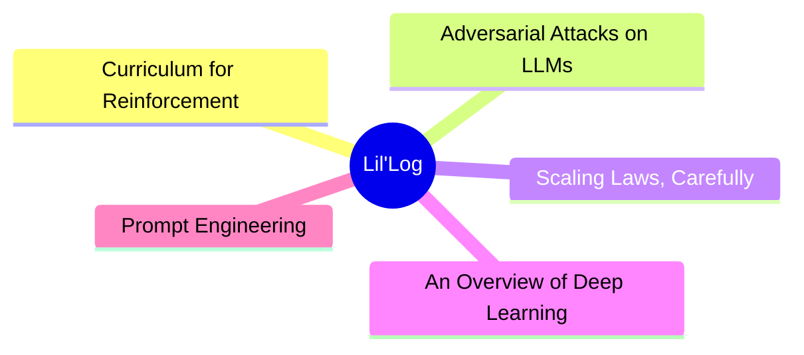
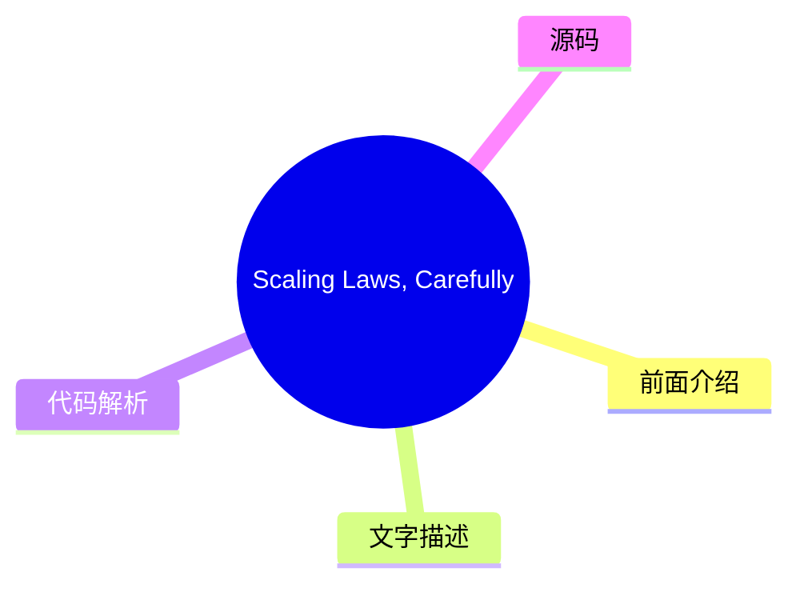
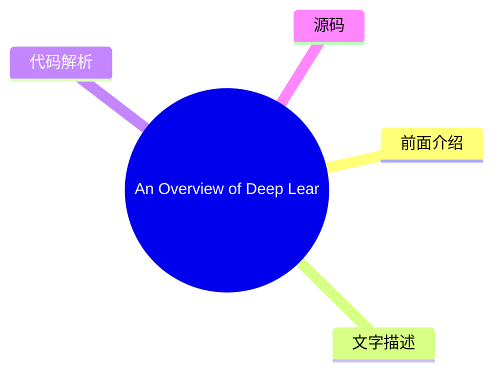
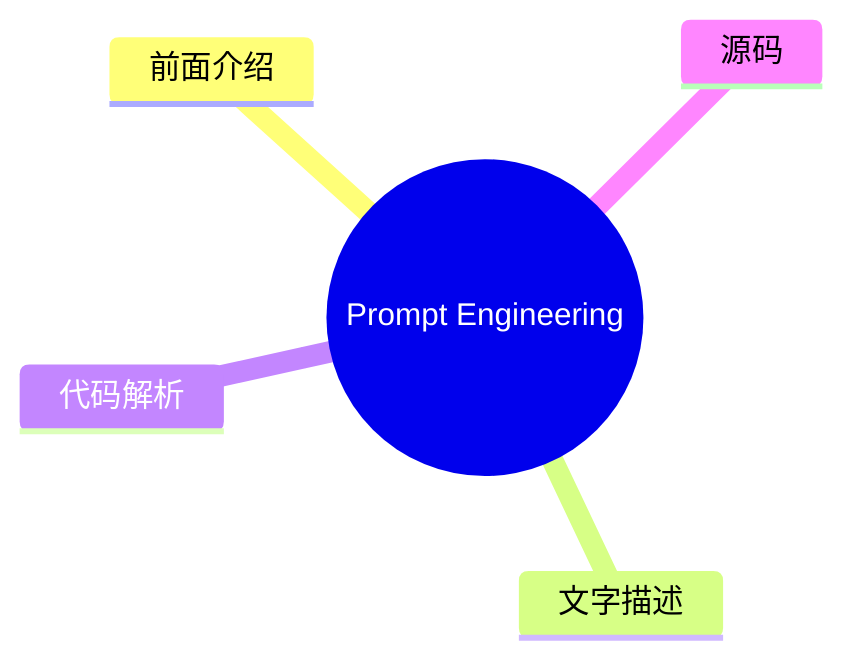

# 🧪 Lil'Log Top 5 (2026-08-06)

## 前面介绍

- 数据源：Lil'Log
- 抓取日期：2026-08-06
- 条目数：5
- 含完整正文：5
- 含代码片段：1
- 组织方式：前面介绍 / 树状图 / 文字描述 / 代码解析 / 源码

## 思维导图



## 详细整理（5 条，5 条含全文，1 条含代码）

### 1. Curriculum for Reinforcement Learning
- **链接**: [https://lilianweng.github.io/posts/2020-01-29-curriculum-rl/](https://lilianweng.github.io/posts/2020-01-29-curriculum-rl/)
- **发布**: Wed, 29 Jan 2020 00:00:00 +0000

#### 前面介绍

- [Updated on 2020-02-03: mentioning PCG in the &ldquo;Task-Specific Curriculum&rdquo; section.
[Updated on 2020-02-04: Add a new &ldquo;curriculum through distillation&rdquo; section.
- 发布时间：Wed, 29 Jan 2020 00:00:00 +0000

#### 树状图


#### 文字描述

- [Updated on 2020-02-03: mentioning [PCG](#pcg) in the “Task-Specific Curriculum” section. [Updated on 2020-02-04: Add a new [“curriculum through distillation”](#curriculum-through-distillation) section. It sounds like an impossible task if we want to teach integral or derivative to a 3-year-old who does not even know basic arithmetics. That’s why education is important, as it p
- # Task-Specific Curriculum[#](#task-specific-curriculum) [Bengio, et al. (2009)](https://www.researchgate.net/profile/Y_Bengio/publication/221344862_Curriculum_learning/links/546cd2570cf2193b94c577ac/Curriculum-learning.pdf) provided a good overview of curriculum learning in the old days. The paper presented two ideas with toy experiments using a manually designed task-specific
- # Teacher-Guided Curriculum[#](#teacher-guided-curriculum) [The idea of ]*Automatic Curriculum Learning* was proposed by [Graves, et al. 2017](https://arxiv.org/abs/1704.03003) slightly earlier. It considers a $N$-task curriculum as an [$N$-armed bandit](https://lilianweng.github.io/posts/2018-01-23-multi-armed-bandit/) problem and an adaptive policy which learns to optimize th
- # Curriculum through Self-Play[#](#curriculum-through-self-play) Different from the teacher-student framework, two agents are doing very different things. The teacher learns to pick a task for the student without any knowledge of the actual task content. What if we want to make both train on the main task directly? How about even make them compete with each other? [Sukhb ...（截断

#### 代码解析

- 本文未检测到明确代码块，内容更偏新闻、观点或方法论。

#### 源码

#### 中文节选

[Updated on 2020-02-03: 在“任务特定课程”部分提及 [PCG](#pcg)。

[Updated on 2020-02-04: 新增一个 [“通过蒸馏进行课程学习”](#curriculum-through-distillation) 部分。

如果我们想教一个连基本算术都不懂的三岁孩子积分或导数，这听起来像是一项不可能完成的任务。这就是为什么教育很重要的原因，因为它提供了一种系统化的方法来分解复杂知识，并为从简单到困难的概念教学提供了一个很好的课程。课程让学习困难的事情对我们人类来说变得更容易、更易于接受。但是，机器学习模型呢？我们能否通过课程学习更高效地训练模型？我们能否设计一个课程来加速学习？

早在 1993 年，Jeffrey Elman 就提出了通过课程学习训练神经网络的想法。他在学习简单语言语法方面的早期工作证明了这种策略的重要性：从一组受限的简单数据开始，并逐渐增加训练样本的复杂性；否则模型根本无法学习。

与没有课程的学习相比，我们预期采用课程学习可以加速收敛速度，并且可能会或可能不会提高最终模型的性能。设计一个高效且有效的课程并不容易。请记住，糟糕的课程甚至可能会阻碍学习。

接下来，我们将研究几种类别的课程学习，如图所示。大多数情况应用于强化学习，监督学习只有少数例外。

在“The importance of starting small”论文（[Elman 1993](http://citeseerx.ist.psu.edu/viewdoc/download?doi=10.1.1.128.4487&rep=rep1&type=pdf)）中，我特别喜欢开篇的句子，发现它们既鼓舞人心又引人深思：

“Humans differ from other species along many dimensions, but two are particularly noteworthy. Humans display an exceptional capacity to learn; and humans are remarkable for the unusually long time it takes to reach maturity. The adaptive advantage of learning is clear, and it may be argued that, through culture, learning has created the basis for a non-genetically based transmission of behaviors which may accelerate the evolution of our species.”


Indeed, learning is probably the best superpower we humans have.

# Task-Specific Curriculum[#](#task-specific-curriculum)

[Bengio, et al. (2009)](https://www.researchgate.net/profile/Y_Bengio/publication/221344862_Curriculum_learning/links/546cd2570cf2193b94c577ac/Curriculum-learning.pdf) provided a good overview of curriculum learning in the old days. The paper presented two ideas with toy experiments using a manually designed task-specific curriculum:

- Cleaner Examples may yield better generalization faster.
- Introducing gradually more difficult examples speeds up online training.

It is plausible that some curriculum strategies could be useless or even harmful. A good question to answer in the field is: *What could be

#### 完整正文（中文）

[Updated on 2020-02-03: 在“任务特定课程”部分提及 [PCG](#pcg)。

[Updated on 2020-02-04: 新增一个 [“通过蒸馏进行课程学习”](#curriculum-through-distillation) 部分。

如果我们想教一个连基本算术都不懂的三岁孩子积分或导数，这听起来像是一项不可能完成的任务。这就是为什么教育很重要的原因，因为它提供了一种系统化的方法来分解复杂知识，并为从简单到困难的概念教学提供了一个很好的课程。课程让学习困难的事情对我们人类来说变得更容易、更易于接受。但是，机器学习模型呢？我们能否通过课程学习更高效地训练模型？我们能否设计一个课程来加速学习？

早在 1993 年，Jeffrey Elman 就提出了通过课程学习训练神经网络的想法。他在学习简单语言语法方面的早期工作证明了这种策略的重要性：从一组受限的简单数据开始，并逐渐增加训练样本的复杂性；否则模型根本无法学习。

与没有课程的学习相比，我们预期采用课程学习可以加速收敛速度，并且可能会或可能不会提高最终模型的性能。设计一个高效且有效的课程并不容易。请记住，糟糕的课程甚至可能会阻碍学习。

接下来，我们将研究几种类别的课程学习，如图所示。大多数情况应用于强化学习，监督学习只有少数例外。

在“The importance of starting small”论文（[Elman 1993](http://citeseerx.ist.psu.edu/viewdoc/download?doi=10.1.1.128.4487&rep=rep1&type=pdf)）中，我特别喜欢开篇的句子，发现它们既鼓舞人心又引人深思：

“Humans differ from other species along many dimensions, but two are particularly noteworthy. Humans display an exceptional capacity to learn; and humans are remarkable for the unusually long time it takes to reach maturity. The adaptive advantage of learning is clear, and it may be argued that, through culture, learning has created the basis for a non-genetically based transmission of behaviors which may accelerate the evolution of our species.”


Indeed, learning is probably the best superpower we humans have.

# Task-Specific Curriculum[#](#task-specific-curriculum)

[Bengio, et al. (2009)](https://www.researchgate.net/profile/Y_Bengio/publication/221344862_Curriculum_learning/links/546cd2570cf2193b94c577ac/Curriculum-learning.pdf) provided a good overview of curriculum learning in the old days. The paper presented two ideas with toy experiments using a manually designed task-specific curriculum:

- Cleaner Examples may yield better generalization faster.
- Introducing gradually more difficult examples speeds up online training.

It is plausible that some curriculum strategies could be useless or even harmful. A good question to answer in the field is: *What could be the general principles that make some curriculum strategies work better than others?* The Bengio 2009 paper hypothesized it would be beneficial to make learning focus on “interesting” examples that are neither too hard or too easy.

If our naive curriculum is to train the model on samples with a gradually increasing level of complexity, we need a way to quantify the difficulty of a task first. One idea is to use its minimal loss with respect to another model while this model is pretrained on other tasks ([Weinshall, et al. 2018](https://arxiv.org/abs/1802.03796)). In this way, the knowledge of the pretrained model can be transferred to the new model by suggesting a rank of training samples. Fig. 2 shows the effectiveness of the `curriculum` group (green), compared to `control` (random order; yellow) and `anti` (reverse the order; red) groups.


[Zaremba & Sutskever (2014)](https://arxiv.org/abs/1410.4615) 做了一个有趣的实验，训练 LSTM 来预测短 Python 程序的输出，该程序用于数学运算，而无需实际执行代码。他们发现课程学习对于学习是必要的。程序的复杂度由两个参数控制，`length` ∈ [1, a] 和 `nesting`∈ [1, b]。考虑了三种策略：

- **朴素课程**：先增加 `length` 直到达到 `a`；然后增加 `nesting` 并将 `length` 重置为 1；重复此过程直到两者都达到最大值。
- **混合课程**：采样 `length`~ [1, a] 和 `nesting`~ [1, b]
- **组合**：朴素 + 混合。

他们注意到组合策略总是优于朴素课程，并且通常（但并非总是）优于混合策略——这表明在训练期间混合简单任务对于 *避免遗忘* 至关重要。

[程序化内容生成 (][PCG](https://en.wikipedia.org/wiki/Procedural_generation)) 是创建各种难度视频游戏的一种流行方法。PCG 涉及算法随机性，并在设计游戏元素及其依赖关系时注入了大量的人类专业知识。程序化生成的关卡已被引入多个基准环境，用于评估强化学习智能体是否能够泛化到它未训练过的新关卡 ([元强化学习](https://lilianweng.github.io/posts/2019-06-23-meta-rl/)!)，例如 [GVGAI](http://www.gvgai.net/)、OpenAI [CoinRun](https://openai.com/blog/quantifying-generalization-in-reinforcement-learning/) 和 [Procgen benchmark](https://openai.com/blog/procgen-benchmark/)。使用 GVGAI，[Justesen 等人 (2018)](https://arxiv.org/abs/1806.10729) 证明强化学习策略很容易过拟合到特定的游戏，但在一个随着模型性能提升而增加任务难度的简单课程上进行训练，有助于其泛化到新的人类设计关卡。在 CoinRun 中也发现了类似的结果 ([Cobbe 等人 2018](https://arxiv.org/abs/1812.02341))。POET ([Wang 等人, 2019](https://arxiv.org/abs/1901.01753)) 是另一个利用进化算法和程序化生成的游戏关卡来提高强化学习泛化能力的例子，我在我的 [元强化学习文章](https://lilianweng.github.io/posts/2019-06-23-meta-rl/#evolutionary-algorithm-on-environment-generation) 中详细描述了这一点。

为了遵循上述课程学习的方法，通常我们需要在训练过程中解决两个问题：

- 设计一个指标来量化任务的难度，以便我们可以据此对任务进行排序。
- 在训练期间向模型提供一系列难度递增的任务。

However, the order of tasks does not have to be sequential. In our Rubik’s cube paper ([OpenAI et al, 2019](https://arxiv.org/abs/1910.07113.)), we depended on *Automatic domain randomization* (**ADR**) to generate a curriculum by growing a distribution of environments with increasing complexity. The difficulty of each task (i.e. solving a Rubik’s cube in a set of environments) depends on the randomization ranges of various environmental parameters. Even with a simplified assumption that all the environmental parameters are uncorrelated, we were able to create a decent curriculum for our robot hand to learn the task.

# Teacher-Guided Curriculum[#](#teacher-guided-curriculum)

[The idea of ]*Automatic Curriculum Learning* was proposed by [Graves, et al. 2017](https://arxiv.org/abs/1704.03003) slightly earlier. It considers a $N$-task curriculum as an [$N$-armed bandit](https://lilianweng.github.io/posts/2018-01-23-multi-armed-bandit/) problem and an adaptive policy which learns to optimize the returns from this bandit.

Two categories of learning signals have been considered in the paper:

- Loss-driven progress: the loss function change before and after one gradient update. This type of reward signals tracks the speed of the learning process, because the greatest task loss decrease is equivalent to the fastest learning.
- Complex-driven progress: the KL divergence between posterior and prior distribution over network weights. This type of learning signals are inspired by the [MDL](https://en.wikipedia.org/wiki/Minimum_description_length)principle, “increasing the model complexity by a certain amount is only worthwhile if it compresses the data by a greater amount”. The model complexity is therefore expected to increase most in response to the model nicely generalizing to training examples.


[通过另一个强化学习代理自动提出课程的方法被形式化为 ]*教师-学生课程学习* (**TSCL**; [Matiisen, et al. 2017](https://arxiv.org/abs/1707.00183))。在 TSCL 中，一个 *学生* 是一个在实际任务上工作的强化学习代理，而一个 *教师* 代理是用于选择任务的策略。学生的目标是掌握一个可能很难直接学习的复杂任务。为了使这个任务更容易学习，我们设置教师代理通过选择适当的子任务来指导学生的训练过程。

在这个过程中，学生应该学习能够：

- 帮助学生实现最快学习进度的任务，或者
- 有被遗忘风险的任务。

注意：将教师模型构建为强化学习问题的设置感觉与神经架构搜索 (NAS) 非常相似，但不同的是 TSCL 中的强化学习模型在任务空间上运行，而 NAS 在主模型架构空间上运行。

训练教师模型是解决一个 [POMDP](https://en.wikipedia.org/wiki/Partially_observable_Markov_decision_process) 问题：

- 未观察到的 $s_t$ 是学生模型的完整状态。
- 观察到的 $o = (x_t^{(1)}, \dots, x_t^{(N)})$ 是 $N$ 个任务的分数列表。
- 动作 $a$ 是选择一个子任务。
- 每步的奖励是分数差值 $r_t = \sum_{i=1}^N x_t^{(i)} - x_{t-1}^{(i)}$（即，相当于在回合结束时最大化所有任务的分数）。

从嘈杂的任务分数中估计学习进度，同时平衡探索与利用的方法，可以借鉴非平稳多臂老虎机问题——使用 [ε-greedy](https://lilianweng.github.io/posts/2018-01-23-multi-armed-bandit/#%CE%B5-greedy-algorithm)，或 [Thompson sampling](https://lilianweng.github.io/posts/2018-01-23-multi-armed-bandit/#thompson-sampling)。

总结来说，核心思想是使用一个策略为另一个策略提出任务，以便后者能学得更好。有趣的是，上述两项工作（在离散任务空间中）都发现从所有任务中均匀采样是一个令人惊讶的强基准。

如果任务空间是连续的呢？[Portelas, et al. (2019)](https://arxiv.org/abs/1910.07224) 研究了一个连续的教师-学生框架，其中教师必须从连续任务空间中采样参数来生成学习课程。给定一个新采样的参数 $p$，绝对学习进度（Absolute Learning Progress，简称 ALP）被测量为 $\text{ALP}_p = \vert r - r_\text{old} \vert$，其中 $r$ 是与 $p$ 相关的回合奖励，$r_\text{old}$ 是与 $p_\text{old}$ 相关的奖励。这里，$p_\text{old}$ 是任务空间中距离 $p$ 最近的先前采样的参数，可以通过最近邻检索到。请注意，这个 ALP 分数与上面 [TSCL](#TSCL) 或 [Grave, et al. 2017](#grave-et-al-2017) 中的学习信号有何不同：ALP 分数测量的是两个任务之间的奖励差异，而不是同一任务在两个时间步上的性能。

在任务参数空间之上，训练了一个高斯混合模型来拟合 $\text{ALP}_p$ 在 $p$ 上的分布。采样任务时使用 ε-greedy 策略：以一定的概率采样一个随机任务；否则，从 GMM 模型中按 ALP 分数比例采样。

# Curriculum through Self-Play[#](#curriculum-through-self-play)

与教师-学生框架不同，两个智能体在做非常不同的事情。教师学习为学生选择任务，而无需了解实际的任务内容。如果我们想让他们直接在主任务上进行训练呢？甚至让他们互相竞争怎么样？

[Sukhb


### 2. Adversarial Attacks on LLMs
- **链接**: [https://lilianweng.github.io/posts/2023-10-25-adv-attack-llm/](https://lilianweng.github.io/posts/2023-10-25-adv-attack-llm/)
- **发布**: Wed, 25 Oct 2023 00:00:00 +0000

#### 前面介绍

- The use of large language models in the real world has strongly accelerated by the launch of ChatGPT. We (including my team at OpenAI, shoutout to them) have invested a lot of effort to build default safe behavior into the model during the alignment
- 发布时间：Wed, 25 Oct 2023 00:00:00 +0000

#### 树状图


#### 文字描述

- The use of large language models in the real world has strongly accelerated by the launch of ChatGPT. We (including my team at OpenAI, shoutout to them) have invested a lot of effort to build default safe behavior into the model during the alignment process (e.g. via [RLHF](https://openai.com/research/learning-to-summarize-with-human-feedback)). However, adversarial attacks or 
- # Basics[#](#basics)
- ## Threat Model[#](#threat-model) Adversarial attacks are inputs that trigger the model to output something undesired. Much early literature focused on classification tasks, while recent effort starts to investigate more into outputs of generative models. In the context of large language models In this post we assume the attacks only happen **at inference time**, meaning that *
- ### Classification[#](#classification) Adversarial attacks on classifiers have attracted more attention in the research community in the past, many in the image domain. LLMs can be used for classification too. Given an input $\mathbf{x}$ and a classifier $f(.)$, we would like to find an adversarial version of the input, denoted as $\mathbf{x}_\text{adv}$, with imperceptible dif

#### 代码解析

- 本文未检测到明确代码块，内容更偏新闻、观点或方法论。

#### 源码

#### 中文节选

The use of large language models in the real world has strongly accelerated by the launch of ChatGPT. We (including my team at OpenAI, shoutout to them) have invested a lot of effort to build default safe behavior into the model during the alignment process (e.g. via [RLHF](https://openai.com/research/learning-to-summarize-with-human-feedback)). However, adversarial attacks or jailbreak prompts could potentially trigger the model to output something undesired.

A large body of ground work on adversarial attacks is on images, and differently it operates in the continuous, high-dimensional space. Attacks for discrete data like text have been considered to be a lot more challenging, due to lack of direct gradient signals. My past post on [Controllable Text Generation](https://lilianweng.github.io/posts/2021-01-02-controllable-text-generation/) is quite relevant to this topic, as attacking LLMs is essentially to control the model to output a certain type of (unsafe) content.

There is also a branch of work on attacking LLMs to extract pre-training data, private knowledge ([Carlini et al, 2020](https://arxiv.org/abs/2012.07805)) or attacking model training process via data poisoning ([Carlini et al. 2023](https://arxiv.org/abs/2302.10149)). We would not cover those topics in this post.

# Basics[#](#basics)

## Threat Model[#](#threat-model)

Adversarial attacks are inputs that trigger the model to output something undesired. Much early literature focused on classification tasks, while recent effort starts to investigate more into outputs of generative models. In the context of large language models In this post we assume the attacks only happen **at inference time**, meaning that **model weights are fixed**.

### Classification[#](#classification)

Adversarial attacks on classifiers have attracted more attention in the research community in the past, many in the image domain. LLMs can be used for classification too. Given an input $\mathbf{x}$ and a classifier $f(.)$, we would like to find an adversarial version of the input, denoted as $\mathbf{x}_\text{adv}$, with imperceptible difference from $\mathbf{x}$, such that $f(\mathbf{x}) \neq f(\mathbf{x}_\text{adv})$.

### 文本生成[#](#text-generation)

给定输入 $\mathbf{x}$ 和生成模型 $p(.)$，模型输出一个样本 $\mathbf{y} \sim p(.\vert\mathbf{x})$。对抗性攻击将识别出这样的 $p(\mathbf{x})$，使得 $\mathbf{y}$ 违反模型的内置安全行为；例如，在非法主题上输出不安全内容，泄露私人信息或模型训练数据。对于生成任务，判断攻击的成功与否并不容易，这需要极高精度的分类器来判断 $\mathbf{y}$ 是否不安全或进行人工审查。

### 白盒与黑盒[#](#white-box-vs-black-box)

白盒攻击假设攻击者拥有对模型权重、架构和训练流程的完全访问权限，从而攻击者可以获得梯度信号

#### 完整正文（中文）

The use of large language models in the real world has strongly accelerated by the launch of ChatGPT. We (including my team at OpenAI, shoutout to them) have invested a lot of effort to build default safe behavior into the model during the alignment process (e.g. via [RLHF](https://openai.com/research/learning-to-summarize-with-human-feedback)). However, adversarial attacks or jailbreak prompts could potentially trigger the model to output something undesired.

A large body of ground work on adversarial attacks is on images, and differently it operates in the continuous, high-dimensional space. Attacks for discrete data like text have been considered to be a lot more challenging, due to lack of direct gradient signals. My past post on [Controllable Text Generation](https://lilianweng.github.io/posts/2021-01-02-controllable-text-generation/) is quite relevant to this topic, as attacking LLMs is essentially to control the model to output a certain type of (unsafe) content.

There is also a branch of work on attacking LLMs to extract pre-training data, private knowledge ([Carlini et al, 2020](https://arxiv.org/abs/2012.07805)) or attacking model training process via data poisoning ([Carlini et al. 2023](https://arxiv.org/abs/2302.10149)). We would not cover those topics in this post.

# Basics[#](#basics)

## Threat Model[#](#threat-model)

Adversarial attacks are inputs that trigger the model to output something undesired. Much early literature focused on classification tasks, while recent effort starts to investigate more into outputs of generative models. In the context of large language models In this post we assume the attacks only happen **at inference time**, meaning that **model weights are fixed**.

### Classification[#](#classification)

Adversarial attacks on classifiers have attracted more attention in the research community in the past, many in the image domain. LLMs can be used for classification too. Given an input $\mathbf{x}$ and a classifier $f(.)$, we would like to find an adversarial version of the input, denoted as $\mathbf{x}_\text{adv}$, with imperceptible difference from $\mathbf{x}$, such that $f(\mathbf{x}) \neq f(\mathbf{x}_\text{adv})$.


### Text Generation[#](#text-generation)

Given an input $\mathbf{x}$ and a generative model $p(.)$, we have the model output a sample $\mathbf{y} \sim p(.\vert\mathbf{x})$ . An adversarial attack would identify such $p(\mathbf{x})$ that $\mathbf{y}$ would violate the built-in safe behavior of the model $p$; E.g. output unsafe content on illegal topics, leak private information or model training data. For generative tasks, it is not easy to judge the success of an attack, which demands a super high-quality classifier to judge whether $\mathbf{y}$ is unsafe or human review.

### White-box vs Black-box[#](#white-box-vs-black-box)

White-box attacks assume that attackers have full access to the model weights, architecture and training pipeline, such that attackers can obtain gradient signals. We don’t assume attackers have access to the full training data. This is only possible for open-sourced models. Black-box attacks assume that attackers only have access to an API-like service where they provide input $\mathbf{x}$ and get back sample $\mathbf{y}$, without knowing further information about the model.

# Types of Adversarial Attacks[#](#types-of-adversarial-attacks)

There are various means to find adversarial inputs to trigger LLMs to output something undesired. We present five approaches here.

| Attack | Type | Description | 
|---|---|---|
| Token manipulation | Black-box | Alter a small fraction of tokens in the text input such that it triggers model failure but still remain its original semantic meanings. | 
| Gradient based attack | White-box | Rely on gradient signals to learn an effective attack. | 
| Jailbreak prompting | Black-box | Often heuristic based prompting to “jailbreak” built-in model safety. | 
| Human red-teaming | Black-box | Human attacks the model, with or without assist from other models. | 
| Model red-teaming | Black-box | Model attacks the model, where the attacker model can be fine-tuned. | 

## Token Manipulation[#](#token-manipulation)


Given a piece of text input containing a sequence of tokens, we can apply simple token operations like replacement with synonyms to trigger the model to make the incorrect predictions. Token manipulation based attacks work in **black box** settings. The Python framework, TextAttack ([Morris et al. 2020](https://arxiv.org/abs/2005.05909)), implemented many word and token manipulation attack methods to create adversarial examples for NLP models. Most work in this area experimented with classification and entailment prediction.

[Ribeiro et al (2018)](https://www.aclweb.org/anthology/P18-1079/) relied on manually proposed Semantically Equivalent Adversaries Rules (SEARs) to do minimal token manipulation such that the model would fail to generate the right answers. Example rules include (*What  NOUN→Which NOUN*), (

*), (*

`WP` is → `WP`’s’*was→is*), etc. The semantic equivalence after adversarial operation is checked via back-translation. Those rules are proposed via a pretty manual, heuristic process and the type of model “bugs” SEARs are probing for are only limited on sensitivity to minimal token variation, which should not be an issue with increased base LLM capability.

In comparison, [EDA](https://lilianweng.github.io/posts/2022-04-15-data-gen/#EDA) (Easy Data Augmentation; [Wei & Zou 2019](https://arxiv.org/abs/1901.11196)) defines a set of simple and more general operations to augment text: synonym replacement, random insertion, random swap or random deletion. EDA augmentation is shown to improve the classification accuracy on several benchmarks.

TextFooler ([Jin et al. 2019](https://arxiv.org/abs/1907.11932)) and [BERT-Attack (][Li et al. 2020](https://aclanthology.org/2020.emnlp-main.500.pdf)) follows the same process of first identifying the most important and vulnerable words that alter the model prediction the most and then replace those words in some way.

Given a classifier $f$ and an input text string $\mathbf{x}$, the importance score of each word can be measured by:


where $f_y$ is the predicted logits for label $y$ and $x_{\setminus w_i}$ is the input text excluding the target word $w_i$. Words with high importance are good candidates to be replaced, but stop words should be skipped to avoid grammar destruction.

TextFooler replaces those words with top synonyms based on word embedding cosine similarity and then further filters by checking that the replacement word still has the same POS tagging and the sentence level similarity is above a threshold. BERT-Attack instead replaces words with semantically similar words via BERT given that context-aware prediction is a very natural use case for masked language models. Adversarial examples discovered this way have some transferability between models, varying by models and tasks.

## Gradient based Attacks[#](#gradient-based-attacks)

In the white-box setting, we have full access to the model parameters and architecture. Therefore we can rely on gradient descent to programmatically learn the most effective attacks. Gradient based attacks only work in the white-box setting, like for open source LLMs.

**GBDA** (“Gradient-based Distributional Attack”; [Guo et al. 2021](https://arxiv.org/abs/2104.13733)) uses Gumbel-Softmax approximation trick to *make adversarial loss optimization differentiable*, where BERTScore and perplexity are used to enforce perceptibility and fluency. Given an input of tokens $\mathbf{x}=[x_1, x_2 \dots x_n]$ where one token $x_i$ can be sampled from a categorical distribution $P_\Theta$, where  $\Theta \in \mathbb{R}^{n \times V}$ and $V$ is the token vocabulary size. It is highly over-parameterized, considering that  $V$ is usually around $O(10,000)$  and most adversarial examples only need a few token replacements. We have:

$$ x_i \sim P_{\Theta_i} = \text{Categorical}(\pi_i) = \text{Categorical}(\text{Softmax}(\Theta_i)) $$


where $\pi_i \in \mathbb{R}^V$ is a vector of token probabilities for the $i$-th token. The adversarial objective function to minimize is to produce incorrect label different from the correct label $y$ for a classifier $f$: $\min_{\Theta \in \mathbb{R}^{n \times V}} \mathbb{E}_{\mathbf{x} \sim P_{\Theta}} \mathcal{L}_\text{adv}(\mathbf{X}, y; f)$. However, on the surface, this is not differentiable because of the categorical distribution. Using Gumbel-softmax approximation ([Jang et al. 2016](https://arxiv.org/abs/1611.01144)) we approximate the categorical distribution from the Gumbel distribution $\tilde{P}_\Theta$ by $\tilde{\boldsymbol{\pi}}$:

where $g_{ij} \sim \text{Gumbel}(0, 1)$; the temperature $\tau > 0$ controls the smoothness of the distribution.

Gumbel distribution is used to model the *extreme* value, maximum or minimum, of a number of samples, irrespective of the sample distribution. The additional Gumbel noise brings in the stochastic decisioning that mimic the sampling process from the categorical distribution.

A low temperature $\tau \to 0$ pushes the convergence to categorical distribution, since sampling from softmax with temperature 0 is deterministic. The “sampling” portion only depends on the value of $g_{ij}$, which is mostly centered around 0.

Let $\mathbf{e}_j$ be the embedding representation of token $j$. We can approximate $\mathbf{x}$ with $\bar{e}(\tilde{\boldsymbol{\pi}})$, a weighted average of the embedding vector corresponding to the token probabilities: $\bar{e}(\pi_i) = \sum_{j=1}^V \pi_i^{(j)} \mathbf{e}_j$. Note that when $\pi_i$ is a one-hot vector corresponding to the token $x_i$, we would have $\bar{e}(\pi_i) = \mathbf{e}_{z_i}$. Combining the embedding representation with the Gumbel-softmax approximation, we have a differentiable objective to minimize: $\min_{\Theta \in \mathbb{R}^{n \times V}} \mathbb{E}_{\tilde{\boldsymbol{\pi}} \sim \tilde{P}_{\Theta}} \mathcal{L}_\text{adv}(\bar{e}(\tilde{\boldsymbol{\pi}}), y; f)$.


Meanwhile, it is also easy to apply differentiable soft constraints with white-box attacks. GBDA experimented with (1) a soft fluency constraint using NLL (negative log-likelihood) and (2) BERTScore (*“a similarity score for evaluating text generation that captures the semantic similarity between pairwise tokens in contextualized embeddings of a transformer model.”*; [Zhang et al. 2019](https://arxiv.org/abs/1904.09675)) to measure similarity between two text inputs to ensure the perturbed version does not diverge from the original version too much. Combining all constraints, the final objective function is as follows, where $\lambda_\text{lm}, \lambda_\text{sim} > 0$ are preset hyperparameters to control the strength of soft constraints:

Gumbel-softmax tricks are hard to be extended to token deletion or addition and thus it is restricted to only token replacement operations, not deletion or addition.

**HotFlip** ([Ebrahimi et al. 2018](https://arxiv.org/abs/1712.06751)) treats text operations as inputs in the vector space and measures the derivative of loss with regard to these vectors. Here let’s assume the input vector is a matrix of character-level one-hot encodings, $\mathbf{x} \in {0, 1}^{m \times n \times V}$ and $\mathbf{x}_{ij} \in {0, 1}^V$, where $m$ is the maximum number of words, $n$ is the maximum number of characters per word and $V$ is the alphabet size. Given the original input vector $\mathbf{x}$, we construct a new vector $\mathbf{x}_{ij, a\to b}$ with the $j$-th character of the $i$-th word changing from $a \to b$, and thus we have $x_{ij}^{(a)} = 1$ but $x_{ij, a\to b}^{(a)} = 0, x_{ij, a\to b}^{(b)} = 1$.

The change in loss according to first-order Taylor expansion is:

This objective is optimized to select the vector to minimize the adversarial loss using only one backward propagation.

To apply multiple flips, we can run a beam search of $r$ steps of th

...（截断，原文 46582+ 字符）


### 3. Scaling Laws, Carefully
- **链接**: [https://lilianweng.github.io/posts/2026-06-24-scaling-laws/](https://lilianweng.github.io/posts/2026-06-24-scaling-laws/)
- **发布**: Wed, 24 Jun 2026 00:00:00 +0000

#### 前面介绍

- Scaling laws are one of the most critical empirical findings in deep learning. The observation is simple in form: the training loss $L$ decreases predictably as we scale up model size $N$, dataset size $D$, and compute $C$, following a power-law curv
- 发布时间：Wed, 24 Jun 2026 00:00:00 +0000

#### 树状图



#### 文字描述

- Scaling laws are one of the most critical empirical findings in deep learning. The observation is simple in form: the training loss $L$ decreases predictably as we scale up model size $N$, dataset size $D$, and compute $C$, following a power-law curve, which appears as a straight line on a log-log plot. We can view scaling laws as a framework for describing the relationship bet
- # Early days: ML loss predictability[#](#early-days-ml-loss-predictability) The predictability of generalization error with scale had already been investigated before scaling laws became a mainstream concept. [Amari et al. (1992)](https://ieeexplore.ieee.org/document/6796972) derived four types of learning curves using a Bayesian approach and the annealed approximation. - Deter
- # Scaling Laws in Data-Infinite Region[#](#scaling-laws-in-data-infinite-region)
- ## Kaplan et al.’s Scaling Laws[#](#kaplan-et-als-scaling-laws) [Kaplan et al. (2020)](https://arxiv.org/abs/2001.08361) popularized the concept of scaling laws in the language modeling community. They found that the cross-entropy test loss $L$ scales as a power law with each of model size $N$ (excluding embedding layers), dataset size $D$, and training compute $C$ across many 

#### 代码解析

- 本文未检测到明确代码块，内容更偏新闻、观点或方法论。

#### 源码

#### 中文节选

Scaling laws are one of the most critical empirical findings in deep learning. The observation is simple in form: the training loss $L$ decreases predictably as we scale up model size $N$, dataset size $D$, and compute $C$, following a power-law curve, which appears as a straight line on a log-log plot. We can view scaling laws as a framework for describing the relationship between compute, loss, model size and data; at its core, it is about how to allocate precious compute optimally between $N$ and $D$.

This predictability makes scaling laws highly valuable in practice. A common workflow is to fit scaling laws on a handful of small runs and then extrapolate to estimate the token and compute requirements for larger models.

| Symbol | Note | 
|---|---|
| $N$ | Model size, measured in parameter count. | 
| $D$ | Training dataset size, usually measured in token count. | 
| $C$ | Training compute in FLOPs. As a useful approximation, $C \approx 6ND$ ( [Kaplan et al. 2020](https://arxiv.org/abs/2001.08361)), where $2ND$ accounts for the forward pass and $4ND$ for backpropagation. | 
| $E$ | Irreducible loss | 
| $L, \hat{L}(.)$ | Test loss / test loss prediction function; can also refer to training loss, since they are strongly correlated. | 
| $\epsilon$ | Generalization error. | 

# Early days: ML loss predictability[#](#early-days-ml-loss-predictability)

The predictability of generalization error with scale had already been investigated before scaling laws became a mainstream concept.

[Amari et al. (1992)](https://ieeexplore.ieee.org/document/6796972) derived four types of learning curves using a Bayesian approach and the annealed approximation.

- Deterministic learning algorithm, noiseless data, one unique solution: $\epsilon \sim c \cdot D^{-1}$, where $c$ is some constant.
- Deterministic learning algorithm, noiseless data, multiple equivalent solutions: $\epsilon \sim c \cdot D^{-2}$; the learning is faster with each new data point, because the model only learns the optimal manifold of parameters, instead of finding the single solution point.

- Deterministic learning algorithm, noisy data: $\epsilon \sim c \cdot D^{-1/2}$; noises in data make learning harder.
- Stochastic learning algorithm, noisy data: $\epsilon \sim c \cdot D^{-1} + E$; here the irreducible loss $E$ is the residual error that a stochastic learner cannot reduce further, for example when the model runs out of capacity on large data. All four types of learning curves follow a power law:

where $E$ can be 0 and $\alpha = -2, -1, -1/2$. Although their theoretical setup is based on a simplified binary classification task, it points in a useful direction for building empirical ML loss prediction models.

One of the earliest empirical studies by [Hestness et al. (2017)](https://arxiv.org/abs/1712.00409) explained the relationship between generalization error, model size and data. For a given training data size, they identified the best-fit model size via grid search and then plot

#### 完整正文（中文）

缩放定律是深度学习中最关键的实证发现之一。其观察结果形式简单：随着模型大小 $N$、数据集大小 $D$ 和计算量 $C$ 的增加，训练损失 $L$ 遵循幂律曲线呈可预测地下降，这在双对数图上表现为一条直线。我们可以将缩放定律视为描述计算量、损失、模型大小和数据之间关系的框架；其核心在于如何最优地分配宝贵的计算资源于 $N$ 和 $D$ 之间。

这种可预测性使缩放定律在实践极具价值。常见的工作流程是在少量小规模运行中拟合缩放定律，然后外推以估算更大模型的代币和计算需求。

| 符号 | 备注 |
|---|---|
| $N$ | 模型大小，以参数数量衡量。 |
| $D$ | 训练数据集大小，通常以代币数量衡量。 |
| $C$ | 以 FLOPs 为单位的训练计算量。作为一个有用的近似，$C \approx 6ND$ ( [Kaplan et al. 2020](https://arxiv.org/abs/2001.08361))，其中 $2ND$ 用于前向传播，$4ND$ 用于反向传播。 |
| $E$ | 不可约损失 |
| $L, \hat{L}(.)$ | 测试损失 / 测试损失预测函数；也可以指训练损失，因为它们高度相关。 |
| $\epsilon$ | 泛化误差。 |

# 早期：机器学习损失的可预测性[#](#early-days-ml-loss-predictability)

在缩放定律成为主流概念之前，泛化误差随规模的可预测性已经被研究过。

[Amari et al. (1992)](https://ieeexplore.ieee.org/document/6796972) 使用贝叶斯方法和退火近似推导出了四种类型的学习曲线。

- 确定性学习算法，无噪声数据，唯一解：$\epsilon \sim c \cdot D^{-1}$，其中 $c$ 是某个常数。
- 确定性学习算法，无噪声数据，多个等价解：$\epsilon \sim c \cdot D^{-2}$；随着每个新数据点的加入，学习速度更快，因为模型只学习参数的最优流形，而不是寻找单个解点。

- 确定性学习算法，噪声数据：$\epsilon \sim c \cdot D^{-1/2}$；数据中的噪声使得学习变得更加困难。
- 随机学习算法，噪声数据：$\epsilon \sim c \cdot D^{-1} + E$；这里不可约损失 $E$ 是随机学习者无法进一步降低的残差误差，例如当模型在大数据上耗尽容量时。所有四种类型的学习曲线都遵循幂律：

其中 $E$ 可以是 0，$\alpha = -2, -1, -1/2$。尽管其理论设定基于简化的二分类任务，但它为构建经验式机器学习损失预测模型指明了一个有用的方向。

[Hestness 等人 (2017)](https://arxiv.org/abs/1712.00409) 最早的经验研究之一解释了泛化误差、模型大小和数据之间的关系。对于给定的训练数据大小，他们通过网格搜索确定了最佳拟合模型大小，然后将损失与训练数据集大小进行绘图。在深度学习的四个不同领域（神经机器翻译、图像分类、语言建模和语音识别）中，观察到了一种反复出现的模式，即：

- 泛化误差随一组因素（例如数据大小）按幂律缩放。
- 模型改进会移动误差曲线，但似乎不会影响幂律指数。
- 有趣的是，架构改变了幂律拟合的偏移量（$E$），但不会改变指数（$\alpha$）。幂律的斜率似乎是问题域的属性，而不是模型架构的属性。
- 拟合大小为 $D$ 的数据集所需的模型参数数量 $N$ 也按幂律缩放。

概念图解将学习曲线分解为三个阶段。在小数据区域，由于学习信号不足，模型的性能仅略优于随机猜测。在中间区域（“幂律区域”），我们观察到损失、数据和模型大小之间存在幂律关系。最终的不可约误差区域可以归因于数据中的噪声等因素。

[Rosenfeld 等人 (2020)](https://arxiv.org/abs/1909.12673) 通过尝试将误差建模为模型大小 $N$ 和数据大小 $D$ 的联合函数，在多种架构（ResNet、WRN、LSTM、Transformer）和优化器（Adam、SGD 变体）上进一步推进了这一工作。经验上，他们观察到，在固定一个轴的情况下，误差随另一个轴呈幂律衰减：

这可以合并为一个联合形式：

其中 $A > 0, B > 0, \alpha \geq 0, \beta \geq 0$ 是标量常数，且 $E$ 不依赖于 $N$ 或 $D$。

因此，他们可以构建一个简单参数化函数形式的预测模型，其参数为 $\boldsymbol{\theta} = \langle A, B, E, \alpha, \beta \rangle$，仅通过在较小的训练配置集 $(D, N)$ < 某些阈值上进行训练，来预测 $(D, N)$ > 某些阈值的预期损失。

旁注：这些早期工作依赖于经典学习理论直觉，如 [VC 维度](https://en.wikipedia.org/wiki/Vapnik%E2%80%93Chervonenkis_dimension)（模型可以打散的最大点集的基数）作为容量的代理，但在现代深度学习工作中，VC 维度通常过于粗糙，无法解释行为，而经验幂律结果比理论提供的最坏情况界限要清晰得多，也更实用。

# 数据无限区域的缩放定律[#](#scaling-laws-in-data-infinite-region)

## Kaplan 等人的缩放定律[#](#kaplan-et-als-scaling-laws)

[Kaplan 等人 (2020)](https://arxiv.org/abs/2001.08361) 在语言建模社区普及了缩放定律的概念。他们发现，交叉熵测试损失 $L$ 随模型大小 $N$（不包括嵌入层）、数据集大小 $D$ 和训练计算量 $C$ 的变化呈幂律关系，且跨越了多个数量级。这些发现与上一节中的早期工作一致，但 Kaplan 等人通过专注于 Transformer 语言模型并在更大规模上进行实证实验，正式确立了这一概念，其模型大小范围从 7.68 亿到 15 亿个非嵌入参数，数据集大小从 2200 万到 230 亿个 token。论文中的所有训练运行都使用了学习率调度，包含 3000 步的线性预热，随后是衰减至零的余弦衰减。

关键发现列表：

- 损失 $L$ 分别与 $N$、$D$ 和 $C$ 呈幂律关系；为了获得最佳性能，这三者必须同步缩放。
- 训练曲线遵循可预测的幂律，其参数大致与模型大小无关。
- 更大的模型样本效率更高，这意味着它们比小模型在更少的优化步数和更少的数据点下达到给定的损失。
- 架构细节（宽度、长宽比等）的重要性不如单纯的规模。
- 训练损失和测试损失呈正相关。（这听起来微不足道，但这是预训练工作的基础。另一方面，预训练损失的改进是否会转移到后训练评估中，需要单独的研究。）
- 在固定的计算预算下，训练一个非常大的模型并在收敛*之前*停止，比训练一个较小的模型直到收敛更高效。**这一发现与下一节中的 Chinchilla 缩放定律（Chinchilla scaling laws）相矛盾：Kaplan 等人高估了最佳模型大小，因为其拟合的指数较大。**

他们用单个方程总结了 $N$ 和 $D$ 的联合依赖关系：

这种形式的一个有益的后果是，过拟合的程度（即模型复杂或数据量小）主要取决于比率 $N^{\alpha / \beta} / D$，这表明数据需要以特定的比例增长，以避免训练受限于数据。

最具影响力且事后看来最具争议的结论是计算最优分配。Kaplan 等人发现 $N_\text{opt} \propto C^{0.73}$，并得出结论，模型大小的增长应快于数据集大小的增长。具体来说，对于计算量的 10 倍增长，他们建议将模型大小增加约 5.5 倍，但仅将训练标记数增加约 1.8 倍。Chinchilla 论文后来推翻了这一建议，认为这会导致大型模型严重*欠训练*。

Kaplan 等人进行的另一个有用的分析是根据 $D$ 和 $N$ 近似计算所需的训练 FLOPs。每次乘加运算大约计为 2 FLOPs。

假设一个标准配置，其中 $d_\text{attn} = d_\text{model} = d_\text{ff}/4$，并且从 $N$ 中排除嵌入层以及每个标记的前向计算：

然后我们将反向传播的 FLOPs 计为前向传播 FLOPs 的两倍，因为反向传播运行两次矩阵乘法，分别用于计算关于输入激活值和权重的梯度。因此，总共每个标记的训练 FLOPs 约为 $6N$，而 $D$ 个标记的总训练 FLOPs 为 $C \approx 6ND$。

## Chinchilla 扩展定律[#](#chinchilla-scaling-laws)

Chinchilla 论文 ([Hoffmann et al. 2022](https://arxiv.org/abs/2203.15556)) 在固定计算预算 $C$ 下，通过更仔细的实验设计研究了最优模型大小 $N$（总参数，*包括*嵌入）与标记数 $D$ 之间的关系，得出了与 Kaplan 等人略有不同的答案。

核心问题是，在给定约束 $\text{FLOPs}(N, D) = C \approx 6ND$ 的情况下，如何分配资源才是最佳策略。换句话说，当我们只有有限的 FLOPs（即给定数量的 GPU 运行给定的时间）时，我们应如何在更多的数据标记和更多的模型参数之间做出选择？

《Chinchilla》论文提出了三种设计精巧的方法来拟合缩放定律。

实证实验扫描了 400 多个模型，参数量从 70M 到超过 16B，训练 token 从 5B 到 500B。实验基于每个训练 token 都是唯一的假设（无限数据场景）。所有运行均使用余弦学习率调度，在训练过程中衰减 10 倍。扫描模型大小描绘出了计算最优前沿。

### 方法 1：固定模型大小，变化 token 预算[#](#method-1-fix-model-sizes-vary-the-token-budget)

对于每个参数量 $N$，使用不同的 token 预算训练多次运行，并记录每个 FLOP 预算 $C$ 下达到的最小损失。

### 方法 2：IsoFLOP 曲线[#](#method-2-isoflop-profiles)

固定计算预算 $C$，将最终损失绘制为参数量 $N$ 的函数。每条 iso-FLOP 曲线在 log 空间中大致呈抛物线，其最小值标记了该计算预算下的最优模型大小。然后在预算之间重复此操作，在图中描绘出一条幂律线。

### 方法 3：参数拟合[#](#method-3-parametric-fit)

[直接拟合与 ][Rosenfeld 等人 (2020)](https://arxiv.org/abs/1909.12673) 相同的参数函数，

我们实际上可以通过在约束条件 $\text{FLOPs}(N,D) = C \approx 6ND$ 下最小化 $\hat{L}(N, D)$，得到最优 $N_\text{opt}(C), D_\text{opt}(C)$ 的闭式近似。

首先让我们将表达式简化为仅包含 $N$：

当 $\alpha \approx \beta$ 时，模型大小和训练 token 应以相同的速率缩放。

为了找到最优的 $\boldsymbol{\theta} = \langle A, B, E, \alpha, \beta\rangle$，《Chinchilla》论文采用了 [Huber 损失](https://en.wikipedia.org/wiki/Huber_loss)（对异常值具有鲁棒性；$\delta=10^{-3}$）和 [L-BFGS 算法](https://en.wikipedia.org/wiki/Limited-memory_BFGS)（适合参数较少的曲线拟合）。

《Chinchilla》通过三种互补方法得出其结论，其最终结果相互一致，这也是该结果相当令人信服的原因之一。

Chinchilla 论文中关于当时大多数大型模型（约 2022 年）训练不足的论断，得到了一个著名的演示的支持：在相同的计算预算下，与 Gopher（[Rae et al. 2021](https://arxiv.org/abs/2112.11446)；280B 参数量，

...（截断，原文 29101+ 字符）


### 4. An Overview of Deep Learning for Curious People
- **链接**: [https://lilianweng.github.io/posts/2017-06-21-overview/](https://lilianweng.github.io/posts/2017-06-21-overview/)
- **发布**: Wed, 21 Jun 2017 00:00:00 +0000

#### 前面介绍

- (The post was originated from my talk for WiMLDS x Fintech meetup hosted by Affirm.)
I believe many of you have watched or heard of the games between AlphaGo and professional Go player Lee Sedol in 2016. Lee has the highest rank of nine dan and many
- 发布时间：Wed, 21 Jun 2017 00:00:00 +0000

#### 树状图



#### 文字描述

- (The post was originated from my talk for [WiMLDS x Fintech meetup](http://wimlds.org/chapters/about-bay-area/) hosted by [Affirm](www.affirm.com).) I believe many of you have watched or heard of the [games](https://youtu.be/vFr3K2DORc8) between AlphaGo and professional Go player [Lee Sedol](https://en.wikipedia.org/wiki/Lee_Sedol) in 2016. Lee has the highest rank of nine dan 
- # Why Does Deep Learning Work Now?[#](#why-does-deep-learning-work-now) Deep learning models, in simple words, are large and deep artificial neural nets. A neural network (“NN”) can be well presented in a [directed acyclic graph](https://en.wikipedia.org/wiki/Directed_acyclic_graph): the input layer takes in signal vectors; one or multiple hidden layers process the outputs of t
- # Deep Learning Models[#](#deep-learning-models) Next, let’s go through a few classical deep learning models.
- ## Convolutional Neural Network[#](#convolutional-neural-network) Convolutional neural networks, short for “CNN”, is a type of feed-forward artificial neural networks, in which the connectivity pattern between its neurons is inspired by the organization of the visual cortex system. The primary visual cortex (V1) does edge detection out of the raw visual input from the retina. T

#### 代码解析

- 本文未检测到明确代码块，内容更偏新闻、观点或方法论。

#### 源码

#### 中文节选

(The post was originated from my talk for [WiMLDS x Fintech meetup](http://wimlds.org/chapters/about-bay-area/) hosted by [Affirm](www.affirm.com).)

I believe many of you have watched or heard of the [games](https://youtu.be/vFr3K2DORc8) between AlphaGo and professional Go player [Lee Sedol](https://en.wikipedia.org/wiki/Lee_Sedol) in 2016. Lee has the highest rank of nine dan and many world championships. No doubt, he is one of the best Go players in the world, but he [lost by 1-4](https://www.scientificamerican.com/article/how-the-computer-beat-the-go-master/) in this series versus AlphaGo. Before this, Go was considered to be an intractable game for computers to master, as its simple rules lay out an exponential number of variations in the board positions, many more than what in Chess. This event surely highlighted 2016 as a big year for AI. Because of AlphaGo, much attention has been attracted to the progress of AI.

Meanwhile, many companies are spending resources on pushing the edges of AI applications, that indeed have the potential to change or even revolutionize how we are gonna live. Familiar examples include self-driving cars, chatbots, home assistant devices and many others. One of the secret receipts behind the progress we have had in recent years is deep learning.

# Why Does Deep Learning Work Now?[#](#why-does-deep-learning-work-now)

Deep learning models, in simple words, are large and deep artificial neural nets. A neural network (“NN”) can be well presented in a [directed acyclic graph](https://en.wikipedia.org/wiki/Directed_acyclic_graph): the input layer takes in signal vectors; one or multiple hidden layers process the outputs of the previous layer. The initial concept of a neural network can be traced back to more than [half a century ago](https://cs.stanford.edu/people/eroberts/courses/soco/projects/neural-networks/History/history1.html). But why does it work now? Why do people start talking about them all of a sudden?

The reason is surprisingly simple:

- We have a lot **more data**.
- We have **much powerful computers**.


一个大型且深层的神经网络拥有更多的层 + 每一层更多的节点，这导致需要调整的参数呈指数级增长。如果没有足够的数据，我们就无法高效地学习参数。如果没有强大的计算机，学习将会太慢且不足。

这是安德鲁·吴在他的“[深度学习应用指南](https://youtu.be/F1ka6a13S9I)”演讲中提出的一个有趣的图表，展示了数据规模与模型性能之间的关系。在小数据集上，传统算法（回归、随机森林、支持向量机、梯度提升机等）或统计学习表现优异，但一旦数据规模达到天文数字，大型神经网络就会超越其他模型。部分原因在于与传统的机器学习模型相比，神经网络模型拥有更多的参数，并且具备学习复杂非线性模式的能力。因此，我们期望模型能够选择最……

#### 完整正文（中文）

（这篇文章源于我在 [Affirm](www.affirm.com) 举办的 [WiMLDS x Fintech meetup](http://wimlds.org/chapters/about-bay-area/) 上所做的演讲。）

我相信你们中的许多人都在 2016 年观看过或听说过 [AlphaGo](https://youtu.be/vFr3K2DORc8) 与职业围棋手 [李世石](https://en.wikipedia.org/wiki/Lee_Sedol) 之间的对局。李世石拥有九段最高段位和许多世界冠军头衔。毫无疑问，他是世界上最优秀的围棋手之一，但在这场系列赛中他以 1-4 输给了 AlphaGo。在此之前，围棋被认为是一门计算机难以掌握的难题，因为其简单的规则在棋盘位置上产生了指数级的变化，远超国际象棋。这一事件无疑将 2016 年标记为 AI 的一个大年。由于 AlphaGo 的出现，人们对 AI 的进展给予了极大的关注。

与此同时，许多公司正在投入资源推动 AI 应用的前沿，这些应用确实有潜力改变甚至彻底改变我们要如何生活。熟悉的例子包括自动驾驶汽车、聊天机器人、家庭助手设备等。近年来我们所取得进展背后的一个秘密秘诀就是深度学习。

# 为什么深度学习现在才有效？[#](#why-does-deep-learning-work-now)

简单来说，深度学习模型是大型且深层的 artificial neural nets（人工神经网络）。神经网络（“NN”）可以用 [有向无环图](https://en.wikipedia.org/wiki/Directed_acyclic_graph) 很好地表示：输入层接收信号向量；一个或多个隐藏层处理上一层的输出。神经网络的概念可以追溯到半个多 [世纪前](https://cs.stanford.edu/people/eroberts/courses/soco/projects/neural-networks/History/history1.html)。但为什么它现在才有效？为什么人们突然开始谈论它？

原因令人惊讶地简单：

- 我们拥有多得 **多的数据**。
- 我们拥有 **更强大的计算机**。

A large and deep neural network has many more layers + many more nodes in each layer, which results in exponentially many more parameters to tune. Without enough data, we cannot learn parameters efficiently. Without powerful computers, learning would be too slow and insufficient.

Here is an interesting plot presenting the relationship between the data scale and the model performance, proposed by Andrew Ng in his “[Nuts and Bolts of Applying Deep Learning](https://youtu.be/F1ka6a13S9I)” talk. On a small dataset, traditional algorithms (Regression, Random Forests, SVM, GBM, etc.) or statistical learning does a great job, but once the data scale goes up to the sky, the large NN outperforms others. Partially because compared to a traditional ML model, a neural network model has many more parameters and has the capability to learn complicated nonlinear patterns. Thus we expect the model to pick the most helpful features by itself without too much expert-involved manual feature engineering.

# Deep Learning Models[#](#deep-learning-models)

Next, let’s go through a few classical deep learning models.

## Convolutional Neural Network[#](#convolutional-neural-network)


Convolutional neural networks, short for “CNN”, is a type of feed-forward artificial neural networks, in which the connectivity pattern between its neurons is inspired by the organization of the visual cortex system. The primary visual cortex (V1) does edge detection out of the raw visual input from the retina. The secondary visual cortex (V2), also called prestriate cortex, receives the edge features from V1 and extracts simple visual properties such as orientation, spatial frequency, and color. The visual area V4 handles more complicated object attributes. All the processed visual features flow into the final logic unit, inferior temporal gyrus (IT), for object recognition. The shortcut between V1 and V4 inspires a special type of CNN with connections between non-adjacent layers: Residual Net ([He, et al. 2016](http://www.cv-foundation.org/openaccess/content_cvpr_2016/papers/He_Deep_Residual_Learning_CVPR_2016_paper.pdf)) containing “Residual Block” which supports some input of one layer to be passed to the component two layers later.

Convolution is a mathematical term, here referring to an operation between two matrices. The convolutional layer has a fixed small matrix defined, also called kernel or filter. As the kernel is sliding, or convolving, across the matrix representation of the input image, it is computing the element-wise multiplication of the values in the kernel matrix and the original image values. [Specially designed kernels](http://setosa.io/ev/image-kernels/) can process images for common purposes like blurring, sharpening, edge detection and many others, fast and efficiently.

[Convolutional](http://ufldl.stanford.edu/tutorial/supervised/FeatureExtractionUsingConvolution/) and [pooling](http://ufldl.stanford.edu/tutorial/supervised/Pooling/) (or “sub-sampling” in Fig. 4) layers act like the V1, V2 and V4 visual cortex units, responding to feature extraction. The object recognition reasoning happens in the later fully-connected layers which consume the extracted features.

## Recurrent Neural Network[#](#recurrent-neural-network)


序列模型通常被设计用来将输入序列转换为一个存在于不同域的输出序列。循环神经网络，简称“RNN”，非常适合这一目的，并在手写识别、语音识别和机器翻译等问题上取得了巨大的改进（[Sutskever et al. 2011](http://machinelearning.wustl.edu/mlpapers/paper_files/ICML2011Sutskever_524.pdf), [Liwicki et al. 2007](http://www6.in.tum.de/Main/Publications/Liwicki2007a.pdf)）。

循环神经网络模型天生具备处理长序列数据以及解决时间上具有上下文扩散的任务的能力。该模型在一个时间步处理序列中的一个元素。经过计算后，新更新的单元状态被传递到下一个时间步，以促进下一个元素的计算。想象一下，当 RNN 模型逐个字符阅读所有维基百科文章时，它可以根据上下文预测接下来的单词。

然而，简单地线性组合当前输入元素和上一个单元状态的感知机神经元很容易丢失长期依赖关系。例如，我们以“爱丽丝在……工作”开始一个句子，几段话之后，我们希望正确地以“她”或“他”开始下一句话。如果模型忘记了角色的名字“爱丽丝”，我们就永远无法知道了。为了解决这个问题，研究人员创建了一种具有更复杂内部结构的特殊神经元，用于记忆长期上下文，这种神经元被称为[“长短期记忆（LSTM）”](http://web.eecs.utk.edu/~itamar/courses/ECE-692/Bobby_paper1.pdf)单元。它足够智能，可以学习应该记忆旧信息多长时间、何时遗忘、何时利用新数据，以及如何将旧记忆与新输入结合起来。这篇[介绍](http://colah.github.io/posts/2015-08-Understanding-LSTMs/)写得非常好，我推荐所有对 LSTM 感兴趣的人都去阅读。它已经在 [Tensorflow 文档](https://www.tensorflow.org/tutorials/recurrent)中被正式推广了 ;-).

To demonstrate the power of RNNs, [Andrej Karpathy](http://karpathy.github.io/2015/05/21/rnn-effectiveness/) built a character-based language model using RNN with LSTM cells.  Without knowing any English vocabulary beforehand, the model could learn the relationship between characters to form words and then the relationship between words to form sentences. It could achieve a decent performance even without a huge set of training data.

## RNN: Sequence-to-Sequence Model[#](#rnn-sequence-to-sequence-model)

The [sequence-to-sequence model](https://arxiv.org/pdf/1406.1078.pdf) is an extended version of RNN, but its application field is distinguishable enough that I would like to list it in a separated section. Same as RNN, a sequence-to-sequence model operates on sequential data, but particularly it is commonly used to develop chatbots or personal assistants, both generating meaningful response for input questions. A sequence-to-sequence model consists of two RNNs, encoder and decoder. The encoder learns the contextual information from the input words and then hands over the knowledge to the decoder side through a “**context vector**” (or “thought vector”, as shown in Fig 8.). Finally, the decoder consumes the context vector and generates proper responses.

## Autoencoders[#](#autoencoders)

Different from the previous models, autoencoders are for unsupervised learning. It is designed to learn a **low-dimensional** representation of a **high-dimensional** data set, similar to what [Principal Components Analysis (PCA)](https://en.wikipedia.org/wiki/Principal_component_analysis) does. The autoencoder model tries to learn an approximation function $ f(x) \approx x $ to reproduce the input data. However, it is restricted by a bottleneck layer in the middle with a very small number of nodes. With limited capacity, the model is forced to form a very efficient encoding of the data, that is essentially the low-dimensional code we learned.


[Hinton 和 Salakhutdinov](https://pdfs.semanticscholar.org/7d76/b71b700846901ac4ac119403aa737a285e36.pdf) 使用自编码器对各种主题的文档进行了压缩。如图 10 所示，当同时应用 PCA 和自编码器将文档降维至二维时，自编码器表现出了更好的效果。借助自编码器，我们可以进行高效的数据压缩，从而加速包括文档和图像在内的信息检索。

# 强化（深度）学习[#](#reinforcement-deep-learning)

既然我以 AlphaGo 开头，让我们更深入地探讨一下 AlphaGo 成功的原因。[强化学习（“RL”）](https://en.wikipedia.org/wiki/Reinforcement_learning) 是其成功背后的秘诀之一。RL 是机器学习的一个子领域，它允许机器和软件代理在给定上下文中自动确定最优行为，其目标是通过给定的指标最大化长期性能。


### 5. Prompt Engineering
- **链接**: [https://lilianweng.github.io/posts/2023-03-15-prompt-engineering/](https://lilianweng.github.io/posts/2023-03-15-prompt-engineering/)
- **发布**: Wed, 15 Mar 2023 00:00:00 +0000

#### 前面介绍

- Prompt Engineering, also known as In-Context Prompting, refers to methods for how to communicate with LLM to steer its behavior for desired outcomes without updating the model weights. It is an empirical science and the effect of prompt engineering m
- 发布时间：Wed, 15 Mar 2023 00:00:00 +0000

#### 树状图



#### 文字描述

- **Prompt Engineering**, also known as **In-Context Prompting**, refers to methods for how to communicate with LLM to steer its behavior for desired outcomes *without* updating the model weights. It is an empirical science and the effect of prompt engineering methods can vary a lot among models, thus requiring heavy experimentation and heuristics. This post only focuses on promp
- # Basic Prompting[#](#basic-prompting) Zero-shot and few-shot learning are two most basic approaches for prompting the model, pioneered by many LLM papers and commonly used for benchmarking LLM performance.
- ## Zero-Shot[#](#zero-shot) **Zero-shot learning** is to simply feed the task text to the model and ask for results. (All the sentiment analysis examples are from SST-2) ``` Text: i'll bet the video game is a lot more fun than the film. Sentiment: ```
- ## Few-shot[#](#few-shot) **Few-shot learning** presents a set of high-quality demonstrations, each consisting of both input and desired output, on the target task. As the model first sees good examples, it can better understand human intention and criteria for what kinds of answers are wanted. Therefore, few-shot learning often leads to better performance than zero-shot. Howev

#### 代码解析

- `text`: 代码片段可作为实现参考，建议结合上下文确认输入输出和边界条件。
- `text`: 代码片段可作为实现参考，建议结合上下文确认输入输出和边界条件。
- `text`: 代码片段可作为实现参考，建议结合上下文确认输入输出和边界条件。

#### 源码

#### 源码片段 1（text）

```text
Text: i'll bet the video game is a lot more fun than the film.
Sentiment:
```

#### 源码片段 2（text）

```text
Text: (lawrence bounces) all over the stage, dancing, running, sweating, mopping his face and generally displaying the wacky talent that brought him fame in the first place.
Sentiment: positive
Text: despite all evidence to the contrary, this clunker has somehow managed to pose as an actual feature movie, the kind that charges full admission and gets hyped on tv and purports to amuse small children and ostensible adults.
Sentiment: negative
Text: for the first time in years, de niro digs deep emotionally, perhaps because he's been stirred by the powerful work of his co-stars.
Sentiment: positive
Text: i'll bet the video game is a lot more fun than the film.
Sentiment:
```

#### 源码片段 3（text）

```text
Please label the sentiment towards the movie of the given movie review. The sentiment label should be "positive" or "negative". 
Text: i'll bet the video game is a lot more fun than the film. 
Sentiment:
```

#### 完整正文（中文）

**提示工程**，也称为**上下文提示**，指的是如何与 LLM 沟通以引导其行为以获得期望结果的方法，*无需*更新模型权重。它是一门经验科学，提示工程方法的效果在不同模型之间差异很大，因此需要大量的实验和启发式方法。

本文仅关注自回归语言模型的提示工程，因此不涉及填空测试、图像生成或多模态模型。其核心在于，提示工程的目标是关于对齐和模型的可引导性。请查看我关于可控文本生成的[上一篇文章](https://lilianweng.github.io/posts/2021-01-02-controllable-text-generation/)。

[我的个人观点] 在我看来，一些提示工程论文并不值得占用 8 页篇幅，因为这些技巧可以用一两句话解释清楚，剩下的都是关于基准测试。一个易于使用且共享的基准测试基础设施对社区更有益。迭代提示或使用外部工具设置起来并不简单。此外，将整个研究社区引导至采用它也并非易事。

# 基础提示[#](#basic-prompting)

零样本和少样本学习是提示模型的两种最基本方法，由许多 LLM 论文开创，并常用于基准测试 LLM 性能。

## 零样本[#](#zero-shot)

**零样本学习**是指简单地给模型提供任务文本并要求其给出结果。

（所有情感分析示例均来自 SST-2）

```
Text: i'll bet the video game is a lot more fun than the film.
Sentiment:
```
## 少样本[#](#few-shot)

**少样本学习**在目标任务上呈现一组高质量演示，每个演示都包含输入和期望输出。由于模型首先看到好的示例，它可以更好地理解人类意图以及期望何种答案的标准。因此，少样本学习通常比零样本学习带来更好的性能。然而，这需要消耗更多的 token，并且当输入和输出文本较长时，可能会触及上下文长度限制。

```

Text: 劳伦斯在舞台上蹦蹦跳跳，跑来跑去，满头大汗，擦擦脸，总体上展示了他当初成名的那种古怪才艺。
Sentiment: positive
Text: 尽管有相反的证据，但这堆垃圾不知怎么竟然冒充成了一部真正的电影，那种收全价票、在电视上大肆宣传、声称能取悦小孩子和所谓的成年人的电影。
Sentiment: negative
Text: 罗伯特·德尼罗多年来首次在情感上深入挖掘，也许是因为他被搭档们强有力的表演所打动。
Sentiment: positive
Text: 我敢打赌，这款电子游戏比这部电影有趣得多。
Sentiment:
```
许多研究探讨了如何构建上下文示例以最大化性能，并观察到**提示词格式、训练示例的选择以及示例的顺序会导致性能出现巨大差异**，从接近随机猜测到接近最先进水平。

[Zhao 等人 (2021)](https://arxiv.org/abs/2102.09690) 调查了少样本分类的情况，并提出 LLM（他们在实验中使用了 GPT-3）的几种偏差导致了如此高的方差：(1) 如果示例中的标签分布不平衡，则存在*多数标签偏差*；(2) *近因偏差*指的是模型倾向于在末尾重复标签的倾向；(3) *常见词偏差*表明 LLM 倾向于比稀有词更频繁地产生常见词。为了克服这种偏差，他们提出了一种方法，当输入字符串为 `N/A` 时，将模型输出的标签概率校准为均匀分布。

### 示例选择技巧[#](#tips-for-example-selection)

- 
使用嵌入空间中的 $k$-NN 聚类选择与测试示例在语义上相似的示例（ [Liu 等人，2021](https://arxiv.org/abs/2101.06804)）
-

To select a diverse and representative set of examples, [Su et al. (2022)](https://arxiv.org/abs/2209.01975)proposed to use a graph-based approach: (1) First, construct a directed graph $G=(V, E)$ based on the embedding (e.g. by[SBERT](https://arxiv.org/abs/1908.10084)or[other](https://arxiv.org/abs/2201.10005)[embedding](https://platform.openai.com/docs/guides/embeddings)[models](https://openai.com/blog/new-and-improved-embedding-model)) cosine similarity between samples, where each node points to its $k$ nearest neighbors; (2) Start with a set of selected samples $\mathcal{L}=\emptyset$ and a set of remaining samples $\mathcal{U}$. Each sample $u \in \mathcal{U}$ is scored by $$ \text{score}(u) = \sum_{v \in \{v \mid (u, v) \in E, v\in \mathcal{U}\}} s(v)\quad\text{where }s(v)=\rho^{- \vert \{\ell \in \mathcal{L} \vert (v, \ell)\in E \}\vert},\quad\rho > 1 $$ such that $s(v)$ is low if many of $v$’s neighbors are selected and thus the scoring encourages to pick diverse samples.
- 
[Rubin et al. (2022)](https://arxiv.org/abs/2112.08633)proposed to train embeddings via[contrastive learning](https://lilianweng.github.io/posts/2021-05-31-contrastive/)specific to one training dataset for in-context learning sample selection. Given each training pair $(x, y)$, the quality of one example $e_i$ (formatted input-output pair) can be measured by a conditioned probability assigned by LM: $\text{score}(e_i) = P_\text{LM}(y \mid e_i, x)$. We can identify other examples with top-$k$ and bottom-$k$ scores as positive and negative sets of candidates for every training pair and use that for contrastive learning.
- 
Some researchers tried [Q-Learning](https://lilianweng.github.io/posts/2018-02-19-rl-overview/#q-learning-off-policy-td-control)to do sample selection. ([Zhang et al. 2022](https://arxiv.org/abs/2211.04486))
- 
Motivated by uncertainty-based [active learning](https://lilianweng.github.io/posts/2022-02-20-active-learning/),[Diao et al. (2023)](https://arxiv.org/abs/2302.12246)suggested to identify examples with high disagreement or entropy among multiple sampling trials. Then annotate these examples to be used in few-shot prompts.


### 示例排序技巧[#](#tips-for-example-ordering)

- 一般建议是保持示例选择的多样性，与测试样本相关，并按随机顺序排列，以避免多数标签偏差和近因偏差。
- 增加模型大小或包含更多训练示例并不能减少上下文示例不同排列之间的方差。相同的顺序可能对一个模型效果很好，但对另一个模型效果很差。当验证集有限时，考虑选择模型不会产生极其不平衡的预测或对其预测过于自信的顺序。（[Lu et al. 2022](https://arxiv.org/abs/2104.08786)）

# 指令提示[#](#instruction-prompting)

在提示中展示少样本示例的目的是向模型解释我们的意图；换句话说，以演示的形式向模型描述任务指令。然而，少样本在令牌使用方面成本较高，并且由于上下文长度有限而限制了输入长度。那么，为什么不直接给出指令呢？

*指令化语言模型*（例如 [InstructGPT](https://openai.com/research/instruction-following)，[自然指令](https://github.com/allenai/natural-instructions)）通过高质量的（任务指令、输入、真实输出）元组对预训练模型进行微调，使语言模型更好地理解用户意图并遵循指令。[RLHF](https://lilianweng.github.io/posts/2021-01-02-controllable-text-generation/#rl-fine-tuning-with-human-preferences)（基于人类反馈的强化学习）是常用的方法。指令遵循风格微调的好处是提高了模型与人类意图的一致性，并极大地降低了通信成本。

与指令模型交互时，我们应该详细描述任务要求，尽量做到*具体*和*精确*，避免说“不要做某事”，而是指定要做什么。

```
请对给定电影评论的电影情感进行标注。情感标签应为“positive”或“negative”。
Text: i'll bet the video game is a lot more fun than the film.
Sentiment:
```

解释目标受众是给出指令的另一种明智方式

- 例如，为儿童制作教育材料，

```
向6岁的孩子解释什么是量子物理。
```
- 以及安全内容，

```
... 使用适合工作场所的语言。
```
*上下文指令学习* ([Ye et al. 2023](https://arxiv.org/abs/2302.14691)) 将少样本学习与指令提示相结合。它在提示中包含了跨不同任务的多个演示示例，每个演示由指令、任务输入和输出组成。请注意，他们的实验仅针对分类任务，且指令提示包含所有标签选项。

```
定义：确定对话的说话者，"agent"（代理）或 "customer"（客户）。
输入：我已经成功为您预订了票。
输出：agent
定义：确定问题询问的类别，"Quantity"（数量）或 "Location"（地点）。
输入：美国最古老的建筑是什么？
输出：Location
定义：对给定的电影评论进行情感分类，"positive"（正面）或 "negative"（负面）。
输入：我敢打赌电子游戏比电影有趣得多。
输出：
```
# 自洽采样[#](#self-consistency-sampling)

**自洽采样** ([Wang et al. 2022a](https://arxiv.org/abs/2203.11171)) 是以温度 > 0 采样多个输出，然后从这些候选项中选择最佳的一个。选择最佳候选项的标准因任务而异。一个通用的解决方案是选择**多数投票**。对于易于验证的任务（例如带有单元测试的编程问题），我们可以简单地运行解释器并使用单元测试验证正确性。

# 思维链 (CoT)[#](#chain-of-thought-cot)

**思维链 (CoT) 提示** ([Wei et al. 2022](https://arxiv.org/abs/2201.11903)) 生成一系列简短的句子来逐步描述推理逻辑，称为*推理链*或*理由*，最终引出最终答案。CoT 的好处在**复杂的推理任务**中更为明显，而在使用**大型模型**（例如参数超过 500 亿）时。简单的任务仅从 CoT 提示中略微受益。

## Types of CoT prompts[#](#types-of-cot-prompts)

Two main types of CoT prompting:

- **Few-shot CoT**. It is to prompt the model with a few demonstrations, each containing manually written (or model-generated) high-quality reasoning chains.

(All the math reasoning examples are from [GSM8k](https://github.com/openai/grade-school-math))

```
Question: Tom and Elizabeth have a competition to climb a hill. Elizabeth takes 30 minutes to climb the hill. Tom takes four times as long as Elizabeth does to climb the hill. How many hours does it take Tom to climb up the hill?
Answer: It takes Tom 30*4 = <<30*4=120>>120 minutes to climb the hill.
It takes Tom 120/60 = <<120/60=2>>2 hours to climb the hill.
So the answer is 2.
===
Question: Jack is a soccer player. He needs to buy two pairs of socks and a pair of soccer shoes. Each pair of socks cost $9.50, and the shoes cost $92. Jack has $40. How much more money does Jack need?
Answer: The total cost of two pairs of socks is $9.50 x 2 = $<<9.5*2=19>>19.
The total cost of the socks and the shoes is $19 + $92 = $<<19+92=111>>111.
Jack need $111 - $40 = $<<111-40=71>>71 more.
So the answer is 71.
===
Question: Marty has 100 centimeters of ribbon that he must cut into 4 equal parts. Each of the cut parts must be divided into 5 equal parts. How long will each final cut be?
Answer:
```
- **Zero-shot CoT**. Use natural language statement like- `Let's think step by step`to explicitly encourage the model to first generate reasoning chains and then 

...（截断，原文 33128+ 字符）

