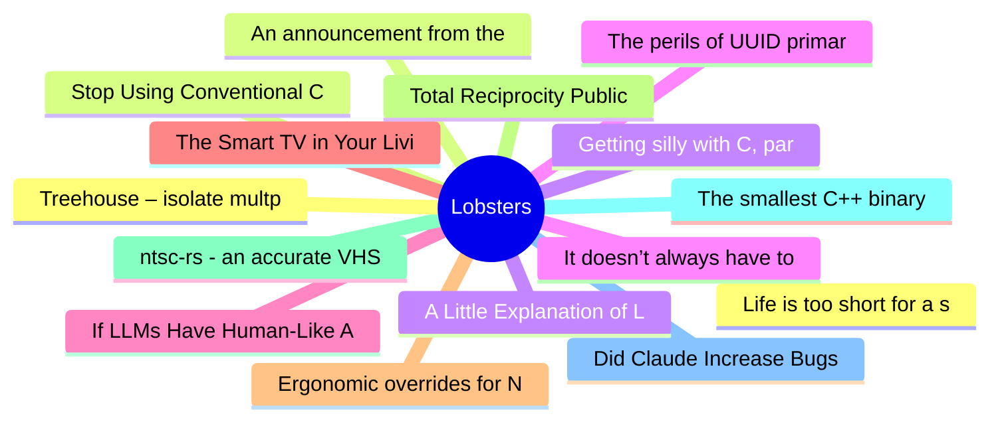

# Lobsters Top 15 (2026-06-06)

## 思维导图

## 列表（15 条）

### 1. Life is too short for a slow terminal
- **链接**: [https://mijndertstuij.nl/posts/life-is-too-short-for-a-slow-terminal/](https://mijndertstuij.nl/posts/life-is-too-short-for-a-slow-terminal/)
- **作者**:  | **评论**: 0
- **摘要**: 
<a href="https://lobste.rs/s/k0sbbv/life_is_too_short_for_slow_terminal">Comments</a>

### 2. Stop Using Conventional Commits
- **链接**: [https://sumnerevans.com/posts/software-engineering/stop-using-conventional-commits/](https://sumnerevans.com/posts/software-engineering/stop-using-conventional-commits/)
- **作者**:  | **评论**: 0
- **摘要**: 
<a href="https://lobste.rs/s/oqlpna/stop_using_conventional_commits">Comments</a>

### 3. Getting silly with C, part &((int*)-8)[3]
- **链接**: [https://lcamtuf.substack.com/p/getting-silly-with-c-part-and-int1](https://lcamtuf.substack.com/p/getting-silly-with-c-part-and-int1)
- **作者**:  | **评论**: 0
- **摘要**: 
<a href="https://lobste.rs/s/iqazo4/getting_silly_with_c_part_int_8_3">Comments</a>

### 4. The perils of UUID primary keys in SQLite
- **链接**: [https://andersmurphy.com/2026/06/05/the-perils-of-uuid-primary-keys-in-sqlite.html](https://andersmurphy.com/2026/06/05/the-perils-of-uuid-primary-keys-in-sqlite.html)
- **作者**:  | **评论**: 0
- **摘要**: 
<a href="https://lobste.rs/s/76plqm/perils_uuid_primary_keys_sqlite">Comments</a>

### 5. If LLMs Have Human-Like Attributes, Then So Does Age of Empires II
- **链接**: [https://arxiv.org/pdf/2605.31514](https://arxiv.org/pdf/2605.31514)
- **作者**:  | **评论**: 0
- **摘要**: 
<a href="https://lobste.rs/s/owclks/if_llms_have_human_like_attributes_then_so">Comments</a>

### 6. The Smart TV in Your LivingRoom Is a Node in the AIScraping Economy
- **链接**: [https://blog.includesecurity.com/2026/06/the-smart-tv-in-your-livingroom-is-a-node-in-the-aiscraping-economy/](https://blog.includesecurity.com/2026/06/the-smart-tv-in-your-livingroom-is-a-node-in-the-aiscraping-economy/)
- **作者**:  | **评论**: 0
- **摘要**: 
<a href="https://lobste.rs/s/k67xnh/smart_tv_your_livingroom_is_node">Comments</a>

### 7. Ergonomic overrides for Nixpkgs
- **链接**: [https://haskellforall.com/2026/06/ergonomic-overrides-for-nixpkgs](https://haskellforall.com/2026/06/ergonomic-overrides-for-nixpkgs)
- **作者**:  | **评论**: 0
- **摘要**: 
<a href="https://lobste.rs/s/yfj5qc/ergonomic_overrides_for_nixpkgs">Comments</a>

### 8. Total Reciprocity Public License
- **链接**: [https://trplfoundation.org/](https://trplfoundation.org/)
- **作者**:  | **评论**: 0
- **摘要**: 
<a href="https://lobste.rs/s/oazsak/total_reciprocity_public_license">Comments</a>

### 9. ntsc-rs - an accurate VHS video effect
- **链接**: [https://ntsc.rs/](https://ntsc.rs/)
- **作者**:  | **评论**: 0
- **摘要**: 
<a href="https://lobste.rs/s/1nojpo/ntsc_rs_accurate_vhs_video_effect">Comments</a>

### 10. The smallest C++ binary
- **链接**: [https://blog.weineng.me/posts/smallest_c/](https://blog.weineng.me/posts/smallest_c/)
- **作者**:  | **评论**: 0
- **摘要**: 
<a href="https://lobste.rs/s/eetcxi/smallest_c_binary">Comments</a>

### 11. Did Claude Increase Bugs in rsync?
- **链接**: [https://alexispurslane.github.io/rsync-analysis/](https://alexispurslane.github.io/rsync-analysis/)
- **作者**:  | **评论**: 0
- **摘要**: 
<a href="https://lobste.rs/s/mf5ryi/did_claude_increase_bugs_rsync">Comments</a>

### 12. Treehouse – isolate multple dev environments on different Git worktrees
- **链接**: [https://github.com/stemps/treehouse](https://github.com/stemps/treehouse)
- **作者**:  | **评论**: 0
- **摘要**: 
It assigns a stable number for each worktree, so you can use this number to derive per-worktree local configuration like ports, database names, etc... or anything you want isolated per worktree.
<a href="https://lobste.rs/s/tmzmta/announcement_from_steering_council">Comments</a>

### 14. A Little Explanation of Little's Law
- **链接**: [https://rugu.dev/en/blog/littles-law/](https://rugu.dev/en/blog/littles-law/)
- **作者**:  | **评论**: 0
- **摘要**: 
<a href="https://lobste.rs/s/bcrtaz/little_explanation_little_s_law">Comments</a>

### 15. It doesn’t always have to be Linux
- **链接**: [https://media.ccc.de/v/gpn24-611-it-doesn-t-always-have-to-be-linux-an-intro-to-freebsd](https://media.ccc.de/v/gpn24-611-it-doesn-t-always-have-to-be-linux-an-intro-to-freebsd)
- **作者**:  | **评论**: 0
- **摘要**: 
<a href="https://lobste.rs/s/fccz7i/it_doesn_t_always_have_be_linux">Comments</a>

