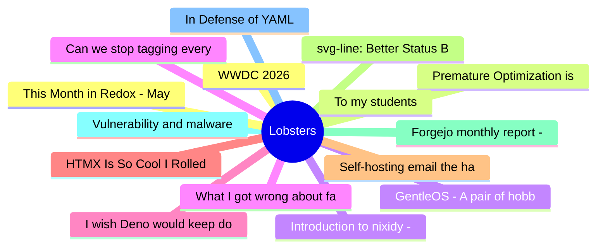

# Lobsters Top 15 (2026-06-09)

## 思维导图

## 列表（15 条）

### 1. WWDC 2026
- **链接**: [https://www.apple.com/apple-events/event-stream/](https://www.apple.com/apple-events/event-stream/)
- **作者**:  | **评论**: 0
- **摘要**: 
You'd think I'd forget dubdub? (Title isn't WWDC because the site thinks I'M SCREAMING IN ALL CAPS.)

<a href="https://lobste.rs/s/awlukh/wwdc_2026">Comments</a>

### 2. Premature Optimization is Fun Sometimes (2025)
- **链接**: [https://invlpg.com/posts/2025-06-19-premature-optimization.html](https://invlpg.com/posts/2025-06-19-premature-optimization.html)
- **作者**:  | **评论**: 0
- **摘要**: 
<a href="https://lobste.rs/s/109l2t/premature_optimization_is_fun_sometimes">Comments</a>

### 3. GentleOS - A pair of hobby OSes for vintage 32-bit and 16-bit PCs
- **链接**: [https://github.com/luke8086/gentleos32](https://github.com/luke8086/gentleos32)
- **作者**:  | **评论**: 0
- **摘要**: 
<a href="https://lobste.rs/s/1umrbv/gentleos_pair_hobby_oses_for_vintage_32">Comments</a>

### 4. Can we stop tagging every thing as vibecoding?
- **链接**: [https://lobste.rs/s/qgy6ak/can_we_stop_tagging_every_thing_as](https://lobste.rs/s/qgy6ak/can_we_stop_tagging_every_thing_as)
- **作者**:  | **评论**: 0
- **摘要**: 
Any article that even slightly mentions that AI exists is tagged as vibecoding, even when they have nothing to do with it. It:s getting out of hand.

EXAMPLE 1:

<a href="https://lobste

### 5. I wish Deno would keep doing what it does best
- **链接**: [https://hackers.pub/@hongminhee/2026/i-wish-deno-would-keep-doing-what-it-does-best](https://hackers.pub/@hongminhee/2026/i-wish-deno-would-keep-doing-what-it-does-best)
- **作者**:  | **评论**: 0
- **摘要**: 
<a href="https://lobste.rs/s/cpyxnw/i_wish_deno_would_keep_doing_what_it_does">Comments</a>

### 6. HTMX Is So Cool I Rolled My Own (2024)
- **链接**: [https://dbushell.com/2024/04/16/htmx-and-modern-javascript/](https://dbushell.com/2024/04/16/htmx-and-modern-javascript/)
- **作者**:  | **评论**: 0
- **摘要**: 
<a href="https://lobste.rs/s/8hiogg/htmx_is_so_cool_i_rolled_my_own_2024">Comments</a>

### 7. Self-hosting email the hard way from your own routable IPv4 block up
- **链接**: [https://anil.recoil.org/notes/recoil-self-hosting-2026](https://anil.recoil.org/notes/recoil-self-hosting-2026)
- **作者**:  | **评论**: 0
- **摘要**: 
<a href="https://lobste.rs/s/cw7vxa/self_hosting_email_hard_way_from_your_own">Comments</a>

### 8. svg-line: Better Status Bars for Emacs
- **链接**: [https://www.chiply.dev/post-svg-line](https://www.chiply.dev/post-svg-line)
- **作者**:  | **评论**: 0
- **摘要**: 
<a href="https://lobste.rs/s/bqjxzj/svg_line_better_status_bars_for_emacs">Comments</a>

### 9. Forgejo monthly report - May 2026
- **链接**: [https://forgejo.org/2026-05-monthly-report/](https://forgejo.org/2026-05-monthly-report/)
- **作者**:  | **评论**: 0
- **摘要**: 
<a href="https://lobste.rs/s/ewaxh7/forgejo_monthly_report_may_2026">Comments</a>

### 10. Vulnerability and malware checks in uv
- **链接**: [https://astral.sh/blog/uv-audit](https://astral.sh/blog/uv-audit)
- **作者**:  | **评论**: 0
- **摘要**: 
<a href="https://lobste.rs/s/mct5rz/vulnerability_malware_checks_uv">Comments</a>

### 11. In Defense of YAML
- **链接**: [https://opensource.posit.co/blog/2026-05-21_in-defense-of-yaml/](https://opensource.posit.co/blog/2026-05-21_in-defense-of-yaml/)
- **作者**:  | **评论**: 0
- **摘要**: 
<a href="https://lobste.rs/s/metnis/defense_yaml">Comments</a>

### 12. This Month in Redox - May 2026 - Redox - Your Next(Gen) OS
- **链接**: [https://www.redox-os.org/news/this-month-260531/](https://www.redox-os.org/news/this-month-260531/)
- **作者**:  | **评论**: 0
- **摘要**: 
<a href="https://lobste.rs/s/6ixkjy/this_month_redox_may_2026_redox_your_next">Comments</a>

### 13. To my students
- **链接**: [http://ozark.hendrix.edu/~yorgey/forest/00FD/index.xml](http://ozark.hendrix.edu/~yorgey/forest/00FD/index.xml)
- **作者**:  | **评论**: 0
- **摘要**: 
<a href="https://lobste.rs/s/ly0vif/my_students">Comments</a>

### 14. Introduction to nixidy - Kubernetes GitOps with nix
- **链接**: [https://codedbearder.com/posts/nixidy-part-1-introduction/](https://codedbearder.com/posts/nixidy-part-1-introduction/)
- **作者**:  | **评论**: 0
- **摘要**: 
<a href="https://lobste.rs/s/nwrobx/introduction_nixidy_kubernetes_gitops">Comments</a>

### 15. What I got wrong about fast terminals
- **链接**: [https://mijndertstuij.nl/posts/what-i-got-wrong-about-fast-terminals/](https://mijndertstuij.nl/posts/what-i-got-wrong-about-fast-terminals/)
- **作者**:  | **评论**: 0
- **摘要**: 
<a href="https://lobste.rs/s/pf0tx3/what_i_got_wrong_about_fast_terminals">Comments</a>

