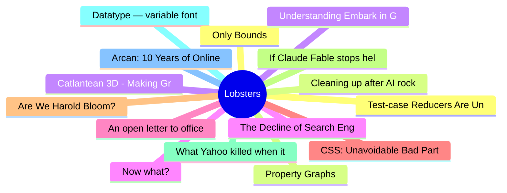

# Lobsters Top 15 (2026-06-10)

## 思维导图

## 列表（15 条）

### 1. Test-case Reducers Are Underappreciated Debugging Tools
- **链接**: [https://tratt.net/laurie/blog/2026/test_case_reducers_are_underappreciated_debugging_tools.html](https://tratt.net/laurie/blog/2026/test_case_reducers_are_underappreciated_debugging_tools.html)
- **作者**:  | **评论**: 0
- **摘要**: 
<a href="https://lobste.rs/s/zwn4xe/test_case_reducers_are_underappreciated">Comments</a>

### 2. Cleaning up after AI rockstar developers
- **链接**: [https://www.codingwithjesse.com/blog/rockstar-developers/](https://www.codingwithjesse.com/blog/rockstar-developers/)
- **作者**:  | **评论**: 0
- **摘要**: 
<a href="https://lobste.rs/s/uvwcdo/cleaning_up_after_ai_rockstar_developers">Comments</a>

### 3. Catlantean 3D - Making Graphics Like It's 1993
- **链接**: [https://staniks.github.io/articles/catlantean-3d-blog-1/](https://staniks.github.io/articles/catlantean-3d-blog-1/)
- **作者**:  | **评论**: 0
- **摘要**: 
<a href="https://lobste.rs/s/oytnfw/catlantean_3d_making_graphics_like_it_s">Comments</a>

### 4. The Decline of Search Engines is an Opportunity
- **链接**: [https://lewiscampbell.tech/blog/260609.html](https://lewiscampbell.tech/blog/260609.html)
- **作者**:  | **评论**: 0
- **摘要**: 
<a href="https://lobste.rs/s/5hk3s6/decline_search_engines_is_opportunity">Comments</a>

### 5. An open letter to office suite users, just before the Euro-Office announcement
- **链接**: [https://blog.documentfoundation.org/blog/2026/06/08/an-open-letter/](https://blog.documentfoundation.org/blog/2026/06/08/an-open-letter/)
- **作者**:  | **评论**: 0
- **摘要**: 
<a href="https://lobste.rs/s/fpgqm0/open_letter_office_suite_users_just">Comments</a>

### 6. CSS: Unavoidable Bad Parts
- **链接**: [https://matklad.github.io/2026/06/04/css-unavoidable-bad-parts.html](https://matklad.github.io/2026/06/04/css-unavoidable-bad-parts.html)
- **作者**:  | **评论**: 0
- **摘要**: 
<a href="https://lobste.rs/s/pwmlvz/css_unavoidable_bad_parts">Comments</a>

### 7. Are We Harold Bloom?
- **链接**: [https://abner.page/post/are-we-harold-bloom/](https://abner.page/post/are-we-harold-bloom/)
- **作者**:  | **评论**: 0
- **摘要**: 
<a href="https://lobste.rs/s/tgzdhf/are_we_harold_bloom">Comments</a>

### 8. If Claude Fable stops helping you, you'll never know
- **链接**: [https://jonready.com/blog/posts/claude-fable5-is-allowed-to-sabotage-your-app-if-youre-a-competitor.html](https://jonready.com/blog/posts/claude-fable5-is-allowed-to-sabotage-your-app-if-youre-a-competitor.html)
- **作者**:  | **评论**: 0
- **摘要**: 
<a href="https://lobste.rs/s/f2fwny/if_claude_fable_stops_helping_you_you_ll">Comments</a>

### 9. What Yahoo killed when it bought Maktoob
- **链接**: [https://lr0.org/blog/p/yahoo/](https://lr0.org/blog/p/yahoo/)
- **作者**:  | **评论**: 0
- **摘要**: 
<a href="https://lobste.rs/s/pfffbz/what_yahoo_killed_when_it_bought_maktoob">Comments</a>

### 10. Datatype — variable font that turns text into charts
- **链接**: [https://franktisellano.github.io/datatype/](https://franktisellano.github.io/datatype/)
- **作者**:  | **评论**: 0
- **摘要**: 
<a href="https://lobste.rs/s/cebwpi/datatype_variable_font_turns_text_into">Comments</a>

### 11. Arcan: 10 Years of Online Obscurity
- **链接**: [https://arcan-fe.com/2026/06/02/arcan-10-years-of-online-obscurity/](https://arcan-fe.com/2026/06/02/arcan-10-years-of-online-obscurity/)
- **作者**:  | **评论**: 0
- **摘要**: 
<a href="https://lobste.rs/s/cssoxa/arcan_10_years_online_obscurity">Comments</a>

### 12. Only Bounds
- **链接**: [https://smallcultfollowing.com/babysteps/blog/2026/06/09/only-bounds/](https://smallcultfollowing.com/babysteps/blog/2026/06/09/only-bounds/)
- **作者**:  | **评论**: 0
- **摘要**: 
<a href="https://lobste.rs/s/srq2wf/only_bounds">Comments</a>

### 13. Property Graphs
- **链接**: [https://www.postgresql.org/docs/19/ddl-property-graphs.html](https://www.postgresql.org/docs/19/ddl-property-graphs.html)
- **作者**:  | **评论**: 0
- **摘要**: 
<a href="https://lobste.rs/s/ncunjo/property_graphs">Comments</a>

### 14. Understanding Embark in GNU Emacs (a bit) and some 'stupid' Embark tricks
- **链接**: [https://utcc.utoronto.ca/~cks/space/blog/programming/EmacsUnderstandingEmbark](https://utcc.utoronto.ca/~cks/space/blog/programming/EmacsUnderstandingEmbark)
- **作者**:  | **评论**: 0
- **摘要**: 
<a href="https://lobste.rs/s/secptg/understanding_embark_gnu_emacs_bit_some">Comments</a>

### 15. Now what?
- **链接**: [https://blog.danieljanus.pl/now-what/](https://blog.danieljanus.pl/now-what/)
- **作者**:  | **评论**: 0
- **摘要**: 
<a href="https://lobste.rs/s/azfaop/now_what">Comments</a>

