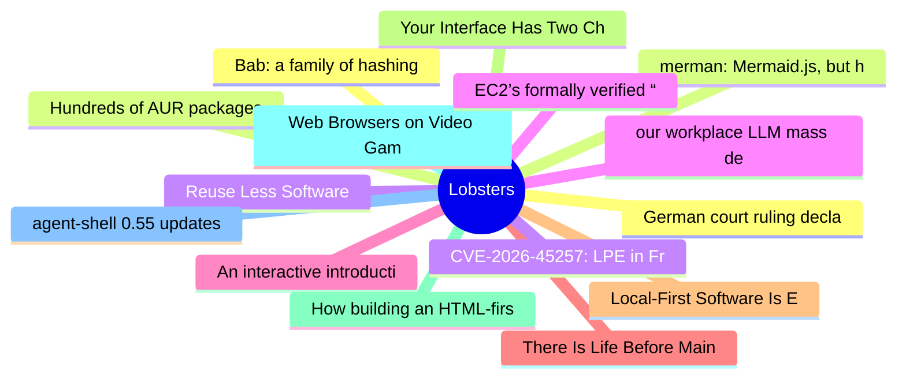

# Lobsters Top 15 (2026-06-12)

## 思维导图

## 列表（15 条）

### 1. German court ruling declares Google's AI Overviews are Google's own words and makes it liable for false answers
- **链接**: [https://the-decoder.com/landmark-german-ruling-declares-googles-ai-overviews-are-googles-own-words-and-makes-it-liable-for-false-answers/](https://the-decoder.com/landmark-german-ruling-declares-googles-ai-overviews-are-googles-own-words-and-makes-it-liable-for-false-answers/)
- **作者**:  | **评论**: 0
- **摘要**: 
Title trimmed slightly without altering meaning.

<a href="https://lobste.rs/s/lxoosd/german_court_ruling_declares_google_s_ai">Comments</a>

### 2. Hundreds of AUR packages attacked by infostealer
- **链接**: [https://lists.archlinux.org/archives/list/aur-general@lists.archlinux.org/thread/FGXPCB3ZVCJIV7FX323SBAX2JHYB7ZS4/](https://lists.archlinux.org/archives/list/aur-general@lists.archlinux.org/thread/FGXPCB3ZVCJIV7FX323SBAX2JHYB7ZS4/)
- **作者**:  | **评论**: 0
- **摘要**: 
More info in Mastodon post: <a href="https://gaysex.cloud/notes/andaxow7itfn05x9" rel="ugc">https://gaysex.cloud/notes/andaxow7itfn05x9</a>

List of affected packages: <a href="https://gr.ht/

### 3. Reuse Less Software
- **链接**: [https://wiki.alopex.li/ReuseLessSoftware](https://wiki.alopex.li/ReuseLessSoftware)
- **作者**:  | **评论**: 0
- **摘要**: 
<a href="https://lobste.rs/s/3mg7xo/reuse_less_software">Comments</a>

### 4. our workplace LLM mass delusion
- **链接**: [https://blog.avas.space/llm-circus/](https://blog.avas.space/llm-circus/)
- **作者**:  | **评论**: 0
- **摘要**: 
<a href="https://lobste.rs/s/lrjceq/our_workplace_llm_mass_delusion">Comments</a>

### 5. An interactive introduction to the terrific experience of rendering Arabic typography and its technical debt
- **链接**: [https://lr0.org/blog/p/arabic/](https://lr0.org/blog/p/arabic/)
- **作者**:  | **评论**: 0
- **摘要**: 
<a href="https://lobste.rs/s/ptkd7x/interactive_introduction_terrific">Comments</a>

### 6. There Is Life Before Main in Rust
- **链接**: [https://grack.com/blog/2026/06/11/life-before-main/](https://grack.com/blog/2026/06/11/life-before-main/)
- **作者**:  | **评论**: 0
- **摘要**: 
<a href="https://lobste.rs/s/rs1t8s/there_is_life_before_main_rust">Comments</a>

### 7. Local-First Software Is Easier to Scale
- **链接**: [https://elijahpotter.dev/articles/local-first_software_is_easier_to_scale](https://elijahpotter.dev/articles/local-first_software_is_easier_to_scale)
- **作者**:  | **评论**: 0
- **摘要**: 
<a href="https://lobste.rs/s/o1dzcn/local_first_software_is_easier_scale">Comments</a>

### 8. Your Interface Has Two Channels
- **链接**: [https://tomeraberba.ch/your-interface-has-two-channels](https://tomeraberba.ch/your-interface-has-two-channels)
- **作者**:  | **评论**: 0
- **摘要**: 
<a href="https://lobste.rs/s/khavt4/your_interface_has_two_channels">Comments</a>

### 9. How building an HTML-first site doubled our users overnight
- **链接**: [https://mohkohn.co.uk/writing/html-first/](https://mohkohn.co.uk/writing/html-first/)
- **作者**:  | **评论**: 0
- **摘要**: 
<a href="https://lobste.rs/s/esvncd/how_building_html_first_site_doubled_our">Comments</a>

### 10. Web Browsers on Video Game Consoles
- **链接**: [https://vale.rocks/posts/game-console-browsers](https://vale.rocks/posts/game-console-browsers)
- **作者**:  | **评论**: 0
- **摘要**: 
<a href="https://lobste.rs/s/fp6pal/web_browsers_on_video_game_consoles">Comments</a>

### 11. agent-shell 0.55 updates
- **链接**: [https://xenodium.com/agent-shell-0-55-updates](https://xenodium.com/agent-shell-0-55-updates)
- **作者**:  | **评论**: 0
- **摘要**: 
<a href="https://lobste.rs/s/qulbgz/agent_shell_0_55_updates">Comments</a>

### 12. Bab: a family of hashing functions for p2p networks
- **链接**: [https://bab-hash.org/](https://bab-hash.org/)
- **作者**:  | **评论**: 0
- **摘要**: 
<a href="https://lobste.rs/s/wcdzpt/bab_family_hashing_functions_for_p2p">Comments</a>

### 13. merman: Mermaid.js, but headless, in Rust
- **链接**: [https://github.com/Latias94/merman](https://github.com/Latias94/merman)
- **作者**:  | **评论**: 0
- **摘要**: 
<a href="https://lobste.rs/s/qchywn/merman_mermaid_js_headless_rust">Comments</a>

### 14. CVE-2026-45257: LPE in FreeBSD via kTLS-RX
- **链接**: [https://bumsrake.de](https://bumsrake.de)
- **作者**:  | **评论**: 0
- **摘要**: 
<a href="https://lobste.rs/s/bdyu6l/cve_2026_45257_lpe_freebsd_via_ktls_rx">Comments</a>

### 15. EC2’s formally verified “isolation engine” provides mathematical assurance of virtual-machine isolation
- **链接**: [https://www.amazon.science/blog/ec2s-formally-verified-isolation-engine-provides-mathematical-assurance-of-virtual-machine-isolation](https://www.amazon.science/blog/ec2s-formally-verified-isolation-engine-provides-mathematical-assurance-of-virtual-machine-isolation)
- **作者**:  | **评论**: 0
- **摘要**: 
<a href="https://lobste.rs/s/efnxre/ec2_s_formally_verified_isolation_engine">Comments</a>

