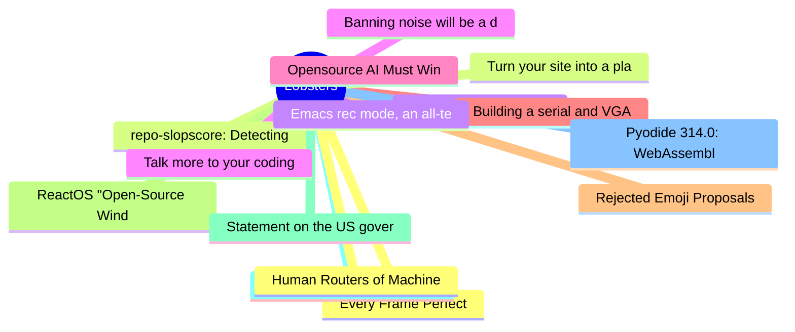

# Lobsters Top 15 (2026-06-14)

## 思维导图

## 列表（15 条）

### 1. Every Frame Perfect
- **链接**: [https://tonsky.me/blog/every-frame-perfect/](https://tonsky.me/blog/every-frame-perfect/)
- **作者**:  | **评论**: 0
- **摘要**: 
<a href="https://lobste.rs/s/bt7rtp/every_frame_perfect">Comments</a>

### 2. repo-slopscore: Detecting AI/LLM contributions in git repositories via commit history analysis
- **链接**: [https://slopscan.ava.pet/](https://slopscan.ava.pet/)
- **作者**:  | **评论**: 0
- **摘要**: 
<a href="https://codeberg.org/polyphony/repo-slopscore" rel="ugc">Link to source code</a>
Disclaimer: This is self-promotion, as I am the author of the tool

<a href="https://lobste.rs/s/7s8f

### 3. Extinction-level capitalism
- **链接**: [https://matthewbutterick.com/extinction-level-capitalism.html](https://matthewbutterick.com/extinction-level-capitalism.html)
- **作者**:  | **评论**: 0
- **摘要**: 
<a href="https://lobste.rs/s/rnmkrg/extinction_level_capitalism">Comments</a>

### 4. Banning noise will be a disaster for statistical data products
- **链接**: [https://desfontain.es/blog/banning-noise.html](https://desfontain.es/blog/banning-noise.html)
- **作者**:  | **评论**: 0
- **摘要**: 
<a href="https://lobste.rs/s/jcpzqt/banning_noise_will_be_disaster_for">Comments</a>

### 5. Opensource AI Must Win
- **链接**: [https://opensourceaimustwin.com](https://opensourceaimustwin.com)
- **作者**:  | **评论**: 0
- **摘要**: 
<a href="https://lobste.rs/s/sqh2uq/opensource_ai_must_win">Comments</a>

### 6. Building a serial and VGA "everything console"
- **链接**: [http://oldvcr.blogspot.com/2026/06/building-serial-and-vga-everything.html](http://oldvcr.blogspot.com/2026/06/building-serial-and-vga-everything.html)
- **作者**:  | **评论**: 0
- **摘要**: 
<a href="https://lobste.rs/s/jdaf1d/building_serial_vga_everything_console">Comments</a>

### 7. Rejected Emoji Proposals
- **链接**: [https://charlottebuff.com/unicode/misc/rejected-emoji-proposals/](https://charlottebuff.com/unicode/misc/rejected-emoji-proposals/)
- **作者**:  | **评论**: 0
- **摘要**: 
<a href="https://lobste.rs/s/tigq8d/rejected_emoji_proposals">Comments</a>

### 8. ReactOS "Open-Source Windows" Reaches The Milestone Of Being Able To Run Half-Life
- **链接**: [https://www.phoronix.com/news/ReactOS-Running-Half-Life](https://www.phoronix.com/news/ReactOS-Running-Half-Life)
- **作者**:  | **评论**: 0
- **摘要**: 
<a href="https://lobste.rs/s/matdjp/reactos_open_source_windows_reaches">Comments</a>

### 9. Statement on the US government directive to suspend access to Fable 5 and Mythos 5
- **链接**: [https://www.anthropic.com/news/fable-mythos-access](https://www.anthropic.com/news/fable-mythos-access)
- **作者**:  | **评论**: 0
- **摘要**: 
<a href="https://lobste.rs/s/nbaa0n/statement_on_us_government_directive">Comments</a>

### 10. Webxdc - Secure mini apps for chats
- **链接**: [https://webxdc.org/](https://webxdc.org/)
- **作者**:  | **评论**: 0
- **摘要**: 
<a href="https://lobste.rs/s/bilqbs/webxdc_secure_mini_apps_for_chats">Comments</a>

### 11. Pyodide 314.0: WebAssembly wheels for PyPI
- **链接**: [https://blog.pyodide.org/posts/314-release/](https://blog.pyodide.org/posts/314-release/)
- **作者**:  | **评论**: 0
- **摘要**: 
<a href="https://lobste.rs/s/azz673/pyodide_314_0_webassembly_wheels_for_pypi">Comments</a>

### 12. Human Routers of Machine Words
- **链接**: [https://borretti.me/article/human-routers-of-machine-words](https://borretti.me/article/human-routers-of-machine-words)
- **作者**:  | **评论**: 0
- **摘要**: 
<a href="https://lobste.rs/s/zcl92t/human_routers_machine_words">Comments</a>

### 13. Turn your site into a place people can bump into each other
- **链接**: [https://cauenapier.com/blog/townsquare_release/](https://cauenapier.com/blog/townsquare_release/)
- **作者**:  | **评论**: 0
- **摘要**: 
<a href="https://lobste.rs/s/bsavh7/turn_your_site_into_place_people_can_bump">Comments</a>

### 14. Emacs rec mode, an all-text database system
- **链接**: [https://www.homepages.ucl.ac.uk/~ucecesf/blog/20260602.html](https://www.homepages.ucl.ac.uk/~ucecesf/blog/20260602.html)
- **作者**:  | **评论**: 0
- **摘要**: 
<a href="https://lobste.rs/s/p78ttt/emacs_rec_mode_all_text_database_system">Comments</a>

### 15. Talk more to your coding agents
- **链接**: [https://www.datawill.io/posts/2026-06-my-agent-workflow/](https://www.datawill.io/posts/2026-06-my-agent-workflow/)
- **作者**:  | **评论**: 0
- **摘要**: 
<a href="https://lobste.rs/s/4rcwmh/talk_more_your_coding_agents">Comments</a>

