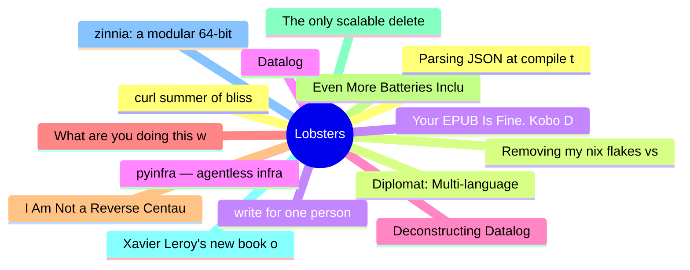

# Lobsters Top 15 (2026-06-15)

## 思维导图

## 列表（15 条）

### 1. curl summer of bliss
- **链接**: [https://daniel.haxx.se/blog/2026/06/15/curl-summer-of-bliss/](https://daniel.haxx.se/blog/2026/06/15/curl-summer-of-bliss/)
- **作者**:  | **评论**: 0
- **摘要**: 
<a href="https://lobste.rs/s/uqagn2/curl_summer_bliss">Comments</a>

### 2. Removing my nix flakes vs guix post
- **链接**: [https://coopi.neocities.org/posts/taking-down-nix-flakes-vs-guix](https://coopi.neocities.org/posts/taking-down-nix-flakes-vs-guix)
- **作者**:  | **评论**: 0
- **摘要**: 
I have known the author personally for quite a while, I am sad they had to go through this.

<a href="https://lobste.rs/s/guyifg/removing_my_nix_flakes_vs_guix_post">Comments</a>

### 3. write for one person
- **链接**: [https://wizardzines.com/comics/write-for-one-person/](https://wizardzines.com/comics/write-for-one-person/)
- **作者**:  | **评论**: 0
- **摘要**: 
<a href="https://lobste.rs/s/1xyby4/write_for_one_person">Comments</a>

### 4. pyinfra — agentless infrastructure automation, in plain Python
- **链接**: [https://pyinfra.com](https://pyinfra.com)
- **作者**:  | **评论**: 0
- **摘要**: 
<a href="https://lobste.rs/s/htfm3p/pyinfra_agentless_infrastructure">Comments</a>

### 5. Deconstructing Datalog
- **链接**: [https://www.rntz.net/post/my-thesis.html](https://www.rntz.net/post/my-thesis.html)
- **作者**:  | **评论**: 0
- **摘要**: 
<a href="https://lobste.rs/s/lvodx4/deconstructing_datalog">Comments</a>

### 6. What are you doing this week?
- **链接**: [https://lobste.rs/s/fwohh5/what_are_you_doing_this_week](https://lobste.rs/s/fwohh5/what_are_you_doing_this_week)
- **作者**:  | **评论**: 0
- **摘要**: 
What are you doing this week? Feel free to share!

Keep in mind it’s OK to do nothing at all, too.

### 7. I Am Not a Reverse Centaur
- **链接**: [https://blog.miguelgrinberg.com/post/i-am-not-a-reverse-centaur](https://blog.miguelgrinberg.com/post/i-am-not-a-reverse-centaur)
- **作者**:  | **评论**: 0
- **摘要**: 
<a href="https://lobste.rs/s/udagdr/i_am_not_reverse_centaur">Comments</a>

### 8. Even More Batteries Included With Emacs
- **链接**: [https://karthinks.com/software/even-more-batteries-included-with-emacs/](https://karthinks.com/software/even-more-batteries-included-with-emacs/)
- **作者**:  | **评论**: 0
- **摘要**: 
Karthik is an amazing blogger for Emacs.  He's very good at recognizing patterns and conveying how to use them well, and I find his content useful for Emacs beginners and veterans alike.

Thi

### 9. The only scalable delete in Postgres is DROP TABLE
- **链接**: [https://planetscale.com/blog/the-only-scalable-delete](https://planetscale.com/blog/the-only-scalable-delete)
- **作者**:  | **评论**: 0
- **摘要**: 
<a href="https://lobste.rs/s/zieeza/only_scalable_delete_postgres_is_drop">Comments</a>

### 10. Xavier Leroy's new book on Control Sturctures in Programming
- **链接**: [https://xavierleroy.org/control-structures/book/index.html](https://xavierleroy.org/control-structures/book/index.html)
- **作者**:  | **评论**: 0
- **摘要**: 
<a href="https://lobste.rs/s/eolbw3/xavier_leroy_s_new_book_on_control">Comments</a>

### 11. zinnia: a modular 64-bit Unix-like kernel written in Rust
- **链接**: [https://zinnia-os.org/](https://zinnia-os.org/)
- **作者**:  | **评论**: 0
- **摘要**: 
<a href="https://lobste.rs/s/0ichrt/zinnia_modular_64_bit_unix_like_kernel">Comments</a>

### 12. Parsing JSON at compile time with C++26 static reflection
- **链接**: [https://lemire.me/blog/2026/06/14/parsing-json-at-compile-time-with-c26-static-reflection/](https://lemire.me/blog/2026/06/14/parsing-json-at-compile-time-with-c26-static-reflection/)
- **作者**:  | **评论**: 0
- **摘要**: 
<a href="https://lobste.rs/s/xqxidz/parsing_json_at_compile_time_with_c_26">Comments</a>

### 13. Diplomat: Multi-language FFI for Rust Libraries
- **链接**: [http://manishearth.github.io/blog/2026/06/14/diplomat-multi-language-ffi-for-rust-libraries/](http://manishearth.github.io/blog/2026/06/14/diplomat-multi-language-ffi-for-rust-libraries/)
- **作者**:  | **评论**: 0
- **摘要**: 
<a href="https://lobste.rs/s/mgbtd6/diplomat_multi_language_ffi_for_rust">Comments</a>

### 14. Your EPUB Is Fine. Kobo Disagrees. Blame Adobe
- **链接**: [https://andreklein.net/your-epub-is-fine-kobo-disagrees-blame-adobe/](https://andreklein.net/your-epub-is-fine-kobo-disagrees-blame-adobe/)
- **作者**:  | **评论**: 0
- **摘要**: 
<a href="https://lobste.rs/s/dwfhdc/your_epub_is_fine_kobo_disagrees_blame">Comments</a>

### 15. Datalog
- **链接**: [https://www.philipzucker.com/notes/Languages/datalog/](https://www.philipzucker.com/notes/Languages/datalog/)
- **作者**:  | **评论**: 0
- **摘要**: 
<a href="https://lobste.rs/s/jkowsn/datalog">Comments</a>

