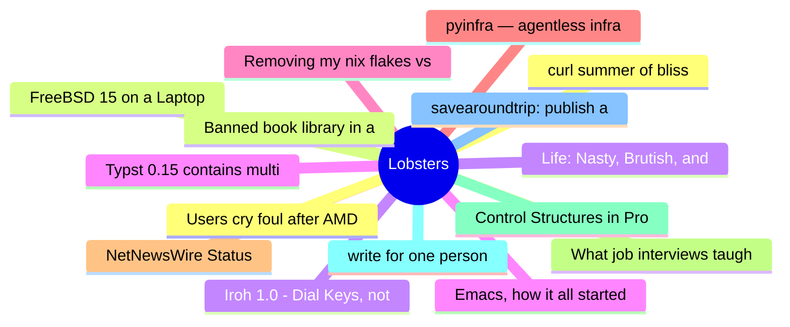

# Lobsters Top 15 (2026-06-16)

## 思维导图

## 列表（15 条）

### 1. curl summer of bliss
- **链接**: [https://daniel.haxx.se/blog/2026/06/15/curl-summer-of-bliss/](https://daniel.haxx.se/blog/2026/06/15/curl-summer-of-bliss/)
- **作者**:  | **评论**: 0
- **摘要**: 
<a href="https://lobste.rs/s/uqagn2/curl_summer_bliss">Comments</a>

### 2. FreeBSD 15 on a Laptop
- **链接**: [https://www.sacredheartsc.com/blog/freebsd-15-on-a-laptop/](https://www.sacredheartsc.com/blog/freebsd-15-on-a-laptop/)
- **作者**:  | **评论**: 0
- **摘要**: 
<a href="https://lobste.rs/s/vodqhe/freebsd_15_on_laptop">Comments</a>

### 3. Iroh 1.0 - Dial Keys, not IPs
- **链接**: [https://www.iroh.computer/blog/v1](https://www.iroh.computer/blog/v1)
- **作者**:  | **评论**: 0
- **摘要**: 
<a href="https://lobste.rs/s/cslljn/iroh_1_0_dial_keys_not_ips">Comments</a>

### 4. Typst 0.15 contains multitudes
- **链接**: [https://typst.app/blog/2026/typst-0.15/](https://typst.app/blog/2026/typst-0.15/)
- **作者**:  | **评论**: 0
- **摘要**: 
<a href="https://lobste.rs/s/fkoa80/typst_0_15_contains_multitudes">Comments</a>

### 5. Removing my nix flakes vs guix post
- **链接**: [https://coopi.neocities.org/posts/taking-down-nix-flakes-vs-guix](https://coopi.neocities.org/posts/taking-down-nix-flakes-vs-guix)
- **作者**:  | **评论**: 0
- **摘要**: 
I have known the author personally for quite a while, I am sad they had to go through this.

<a href="https://lobste.rs/s/guyifg/removing_my_nix_flakes_vs_guix_post">Comments</a>

### 6. pyinfra — agentless infrastructure automation, in plain Python
- **链接**: [https://pyinfra.com](https://pyinfra.com)
- **作者**:  | **评论**: 0
- **摘要**: 
<a href="https://lobste.rs/s/htfm3p/pyinfra_agentless_infrastructure">Comments</a>

### 7. NetNewsWire Status
- **链接**: [https://inessential.com/2026/06/15/netnewswire-status.html](https://inessential.com/2026/06/15/netnewswire-status.html)
- **作者**:  | **评论**: 0
- **摘要**: 
<a href="https://lobste.rs/s/0mximk/netnewswire_status">Comments</a>

### 8. What job interviews taught me about Kubernetes
- **链接**: [https://notnotp.com/notes/what-job-interviews-taught-me-about-kubernetes/](https://notnotp.com/notes/what-job-interviews-taught-me-about-kubernetes/)
- **作者**:  | **评论**: 0
- **摘要**: 
<a href="https://lobste.rs/s/k6qon4/what_job_interviews_taught_me_about">Comments</a>

### 9. Control Structures in Programming Languages
- **链接**: [https://xavierleroy.org/control-structures/book/index.html](https://xavierleroy.org/control-structures/book/index.html)
- **作者**:  | **评论**: 0
- **摘要**: 
<a href="https://lobste.rs/s/eolbw3/control_structures_programming">Comments</a>

### 10. write for one person
- **链接**: [https://wizardzines.com/comics/write-for-one-person/](https://wizardzines.com/comics/write-for-one-person/)
- **作者**:  | **评论**: 0
- **摘要**: 
<a href="https://lobste.rs/s/1xyby4/write_for_one_person">Comments</a>

### 11. savearoundtrip: publish an HTTPS DNS record, skip a round trip
- **链接**: [https://savearoundtrip.com/](https://savearoundtrip.com/)
- **作者**:  | **评论**: 0
- **摘要**: 
<a href="https://lobste.rs/s/wlm6dv/savearoundtrip_publish_https_dns_record">Comments</a>

### 12. Users cry foul after AMD stripped memory crypto from its consumer CPUs
- **链接**: [https://arstechnica.com/security/2026/06/users-cry-foul-after-amd-stripped-memory-crypto-from-its-consumer-cpus/](https://arstechnica.com/security/2026/06/users-cry-foul-after-amd-stripped-memory-crypto-from-its-consumer-cpus/)
- **作者**:  | **评论**: 0
- **摘要**: 
<a href="https://lobste.rs/s/i2cjew/users_cry_foul_after_amd_stripped_memory">Comments</a>

### 13. Banned book library in a Wi-Fi lightbulb
- **链接**: [https://www.richardosgood.com/posts/banned-book-library/](https://www.richardosgood.com/posts/banned-book-library/)
- **作者**:  | **评论**: 0
- **摘要**: 
<a href="https://lobste.rs/s/jfo6xs/banned_book_library_wi_fi_lightbulb">Comments</a>

### 14. Life: Nasty, Brutish, and Short
- **链接**: [https://www.jsoftware.com/papers/eem/life.htm](https://www.jsoftware.com/papers/eem/life.htm)
- **作者**:  | **评论**: 0
- **摘要**: 
<a href="https://lobste.rs/s/aq0dz1/life_nasty_brutish_short">Comments</a>

### 15. Emacs, how it all started (for me)
- **链接**: [https://xvw.lol/en/articles/emacs-start.html](https://xvw.lol/en/articles/emacs-start.html)
- **作者**:  | **评论**: 0
- **摘要**: 
<a href="https://lobste.rs/s/kycuyg/emacs_how_it_all_started_for_me">Comments</a>

