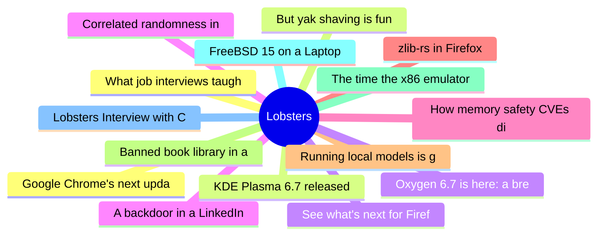

# Lobsters Top 15 (2026-06-17)

## 思维导图

## 列表（15 条）

### 1. Google Chrome's next update will mark the end of popular ad blockers
- **链接**: [https://9to5google.com/2026/06/15/google-chromes-next-update-will-mark-the-end-of-popular-ad-blockers/](https://9to5google.com/2026/06/15/google-chromes-next-update-will-mark-the-end-of-popular-ad-blockers/)
- **作者**:  | **评论**: 0
- **摘要**: 
<a href="https://lobste.rs/s/mxfd45/google_chrome_s_next_update_will_mark_end">Comments</a>

### 2. KDE Plasma 6.7 released
- **链接**: [https://kde.org/announcements/plasma/6/6.7.0/](https://kde.org/announcements/plasma/6/6.7.0/)
- **作者**:  | **评论**: 0
- **摘要**: 
<a href="https://lobste.rs/s/gqqw6z/kde_plasma_6_7_released">Comments</a>

### 3. See what's next for Firefox
- **链接**: [https://www.firefox.com/en-US/whatsnext/](https://www.firefox.com/en-US/whatsnext/)
- **作者**:  | **评论**: 0
- **摘要**: 
<a href="https://lobste.rs/s/zqc7bj/see_what_s_next_for_firefox">Comments</a>

### 4. A backdoor in a LinkedIn job offer
- **链接**: [https://roman.pt/posts/linkedin-backdoor/](https://roman.pt/posts/linkedin-backdoor/)
- **作者**:  | **评论**: 0
- **摘要**: 
<a href="https://lobste.rs/s/2u1z4w/backdoor_linkedin_job_offer">Comments</a>

### 5. How memory safety CVEs differ between Rust and C/C++
- **链接**: [https://kobzol.github.io/rust/2026/06/15/how-memory-safety-cves-differ-between-rust-and-c-cpp.html](https://kobzol.github.io/rust/2026/06/15/how-memory-safety-cves-differ-between-rust-and-c-cpp.html)
- **作者**:  | **评论**: 0
- **摘要**: 
<a href="https://lobste.rs/s/tmeqrk/how_memory_safety_cves_differ_between">Comments</a>

### 6. zlib-rs in Firefox
- **链接**: [https://trifectatech.org/blog/zlib-rs-in-firefox/](https://trifectatech.org/blog/zlib-rs-in-firefox/)
- **作者**:  | **评论**: 0
- **摘要**: 
<a href="https://lobste.rs/s/erc2po/zlib_rs_firefox">Comments</a>

### 7. Running local models is good now
- **链接**: [https://vickiboykis.com/2026/06/15/running-local-models-is-good-now/](https://vickiboykis.com/2026/06/15/running-local-models-is-good-now/)
- **作者**:  | **评论**: 0
- **摘要**: 
<a href="https://lobste.rs/s/hwqdvt/running_local_models_is_good_now">Comments</a>

### 8. Banned book library in a Wi-Fi lightbulb
- **链接**: [https://www.richardosgood.com/posts/banned-book-library/](https://www.richardosgood.com/posts/banned-book-library/)
- **作者**:  | **评论**: 0
- **摘要**: 
<a href="https://lobste.rs/s/jfo6xs/banned_book_library_wi_fi_lightbulb">Comments</a>

### 9. The time the x86 emulator team found code so bad that they fixed it during emulation
- **链接**: [https://devblogs.microsoft.com/oldnewthing/20260615-00/?p=112419](https://devblogs.microsoft.com/oldnewthing/20260615-00/?p=112419)
- **作者**:  | **评论**: 0
- **摘要**: 
<a href="https://lobste.rs/s/mjkp4m/time_x86_emulator_team_found_code_so_bad">Comments</a>

### 10. FreeBSD 15 on a Laptop
- **链接**: [https://www.sacredheartsc.com/blog/freebsd-15-on-a-laptop/](https://www.sacredheartsc.com/blog/freebsd-15-on-a-laptop/)
- **作者**:  | **评论**: 0
- **摘要**: 
<a href="https://lobste.rs/s/vodqhe/freebsd_15_on_laptop">Comments</a>

### 11. Lobsters Interview with Claudius
- **链接**: [https://alexalejandre.com/programming/interview-with-claude-roux/](https://alexalejandre.com/programming/interview-with-claude-roux/)
- **作者**:  | **评论**: 0
- **摘要**: 
<a href="https://lobste.rs/~Claudius" rel="ugc">@Claudius</a> maintains <a href="https://github.com/naver/lispe" rel="ugc">LispE</a> and previously <a href="https://github.com/naver/tamgu" rel="ugc

### 12. What job interviews taught me about Kubernetes
- **链接**: [https://notnotp.com/notes/what-job-interviews-taught-me-about-kubernetes/](https://notnotp.com/notes/what-job-interviews-taught-me-about-kubernetes/)
- **作者**:  | **评论**: 0
- **摘要**: 
<a href="https://lobste.rs/s/k6qon4/what_job_interviews_taught_me_about">Comments</a>

### 13. But yak shaving is fun
- **链接**: [https://parksb.github.io/en/article/32.html](https://parksb.github.io/en/article/32.html)
- **作者**:  | **评论**: 0
- **摘要**: 
<a href="https://lobste.rs/s/zpjomk/yak_shaving_is_fun">Comments</a>

### 14. Oxygen 6.7 is here: a breath of fresh air for KDE’s classic theme
- **链接**: [https://filipfila.wordpress.com/2026/06/16/oxygen-6-7-is-here-a-breath-of-fresh-air-for-kdes-classic-theme/](https://filipfila.wordpress.com/2026/06/16/oxygen-6-7-is-here-a-breath-of-fresh-air-for-kdes-classic-theme/)
- **作者**:  | **评论**: 0
- **摘要**: 
<a href="https://lobste.rs/s/qkli6l/oxygen_6_7_is_here_breath_fresh_air_for_kde_s">Comments</a>

### 15. Correlated randomness in Slay the Spire 2
- **链接**: [https://tck.mn/blog/correlated-randomness-sts2/](https://tck.mn/blog/correlated-randomness-sts2/)
- **作者**:  | **评论**: 0
- **摘要**: 
<a href="https://lobste.rs/s/irws5p/correlated_randomness_slay_spire_2">Comments</a>

