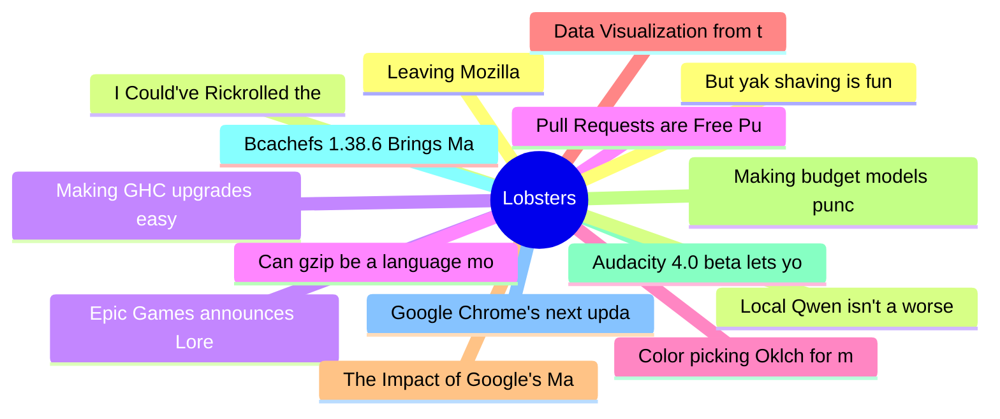

# Lobsters Top 15 (2026-06-18)

## 思维导图

## 列表（15 条）

### 1. Leaving Mozilla
- **链接**: [https://blog.unitedheroes.net/5751](https://blog.unitedheroes.net/5751)
- **作者**:  | **评论**: 0
- **摘要**: 
<a href="https://lobste.rs/s/myczjs/leaving_mozilla">Comments</a>

### 2. I Could've Rickrolled the Entire FIFA World Cup. All I Needed Was My ID
- **链接**: [https://bobdahacker.com/blog/fifa-hack](https://bobdahacker.com/blog/fifa-hack)
- **作者**:  | **评论**: 0
- **摘要**: 
<a href="https://lobste.rs/s/z5wfi9/i_could_ve_rickrolled_entire_fifa_world">Comments</a>

### 3. Epic Games announces Lore version control system
- **链接**: [https://lore.org/](https://lore.org/)
- **作者**:  | **评论**: 0
- **摘要**: 
<a href="https://lobste.rs/s/r9fmgk/epic_games_announces_lore_version">Comments</a>

### 4. Pull Requests are Free Puppies
- **链接**: [https://www.youtube.com/watch?v=x8_ZZhRL3YU&t=1733s](https://www.youtube.com/watch?v=x8_ZZhRL3YU&t=1733s)
- **作者**:  | **评论**: 0
- **摘要**: 
Lightly edited transcript of Richard Hipp, creator of SQLite, from 28'53":

<blockquote>

Suppose you had a pull request for SQLite. "Hey, I've got this new feature for SQLite. Here's the pull

### 5. Color picking Oklch for mortals
- **链接**: [https://hugodaniel.com/posts/color-picking-oklch/](https://hugodaniel.com/posts/color-picking-oklch/)
- **作者**:  | **评论**: 0
- **摘要**: 
<a href="https://lobste.rs/s/hnoijy/color_picking_oklch_for_mortals">Comments</a>

### 6. Data Visualization from the Comfort of your Terminal
- **链接**: [https://github.com/medialab/xan/blob/master/docs/cookbook/dataviz.md](https://github.com/medialab/xan/blob/master/docs/cookbook/dataviz.md)
- **作者**:  | **评论**: 0
- **摘要**: 
<a href="https://lobste.rs/s/1shdvp/data_visualization_from_comfort_your">Comments</a>

### 7. The Impact of Google's Manifest Version 3 Update on Ad Blocker Effectiveness
- **链接**: [https://arxiv.org/abs/2503.01000](https://arxiv.org/abs/2503.01000)
- **作者**:  | **评论**: 0
- **摘要**: 
<a href="https://lobste.rs/s/fxulig/impact_google_s_manifest_version_3_update">Comments</a>

### 8. Making budget models punch above their weight with a smart Rust harness
- **链接**: [https://yogthos.net/posts/2026-06-08-dirge-code.html](https://yogthos.net/posts/2026-06-08-dirge-code.html)
- **作者**:  | **评论**: 0
- **摘要**: 
<a href="https://lobste.rs/s/goo5sh/making_budget_models_punch_above_their">Comments</a>

### 9. Audacity 4.0 beta lets you test its new (nicer) Qt interface
- **链接**: [https://www.omgubuntu.co.uk/2026/06/audacity-4-0-beta](https://www.omgubuntu.co.uk/2026/06/audacity-4-0-beta)
- **作者**:  | **评论**: 0
- **摘要**: 
<a href="https://lobste.rs/s/kfkgl2/audacity_4_0_beta_lets_you_test_its_new">Comments</a>

### 10. Bcachefs 1.38.6 Brings Many Performance Improvements
- **链接**: [https://www.phoronix.com/news/Bcachefs-Tools-1.38.6](https://www.phoronix.com/news/Bcachefs-Tools-1.38.6)
- **作者**:  | **评论**: 0
- **摘要**: 
<a href="https://lobste.rs/s/mgvyrc/bcachefs_1_38_6_brings_many_performance">Comments</a>

### 11. Google Chrome's next update will mark the end of popular ad blockers
- **链接**: [https://9to5google.com/2026/06/15/google-chromes-next-update-will-mark-the-end-of-popular-ad-blockers/](https://9to5google.com/2026/06/15/google-chromes-next-update-will-mark-the-end-of-popular-ad-blockers/)
- **作者**:  | **评论**: 0
- **摘要**: 
<a href="https://lobste.rs/s/mxfd45/google_chrome_s_next_update_will_mark_end">Comments</a>

### 12. But yak shaving is fun
- **链接**: [https://parksb.github.io/en/article/32.html](https://parksb.github.io/en/article/32.html)
- **作者**:  | **评论**: 0
- **摘要**: 
<a href="https://lobste.rs/s/zpjomk/yak_shaving_is_fun">Comments</a>

### 13. Local Qwen isn't a worse Opus, it's a different tool
- **链接**: [https://blog.alexellis.io/local-ai-is-not-opus/](https://blog.alexellis.io/local-ai-is-not-opus/)
- **作者**:  | **评论**: 0
- **摘要**: 
<a href="https://lobste.rs/s/sgebfp/local_qwen_isn_t_worse_opus_it_s_different">Comments</a>

### 14. Making GHC upgrades easy
- **链接**: [https://blog.haskell.org/making-ghc-upgrades-easy/](https://blog.haskell.org/making-ghc-upgrades-easy/)
- **作者**:  | **评论**: 0
- **摘要**: 
<a href="https://lobste.rs/s/njidax/making_ghc_upgrades_easy">Comments</a>

### 15. Can gzip be a language model?
- **链接**: [https://nathan.rs/posts/gzip-lm/](https://nathan.rs/posts/gzip-lm/)
- **作者**:  | **评论**: 0
- **摘要**: 
<a href="https://lobste.rs/s/j11pew/can_gzip_be_language_model">Comments</a>

