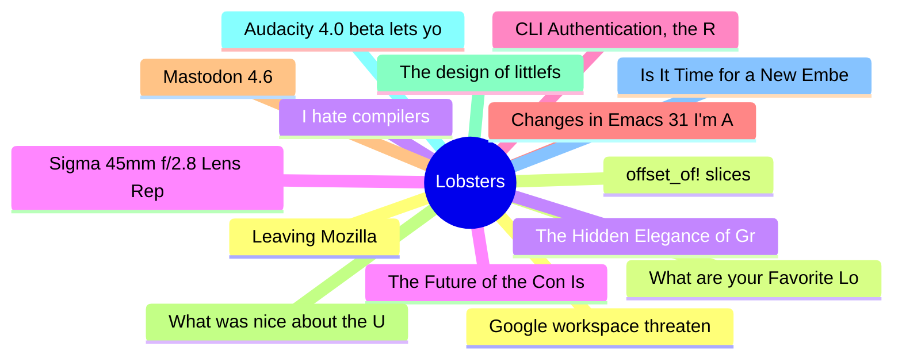

# Lobsters Top 15 (2026-06-19)

## 思维导图

## 列表（15 条）

### 1. Google workspace threatening to block firefox access
- **链接**: [https://tales.fromprod.com/2026/169/google-workspace-threatening-to-block-firefox.html](https://tales.fromprod.com/2026/169/google-workspace-threatening-to-block-firefox.html)
- **作者**:  | **评论**: 0
- **摘要**: 
<a href="https://lobste.rs/s/mnycr3/google_workspace_threatening_block">Comments</a>

### 2. What are your Favorite Lobste.rs Comments?
- **链接**: [https://lobste.rs/s/crl4fj/what_are_your_favorite_lobste_rs_comments](https://lobste.rs/s/crl4fj/what_are_your_favorite_lobste_rs_comments)
- **作者**:  | **评论**: 0
- **摘要**: 
The forum has been around for a long time and I occasionally find old gems, I wonder what great insights etc. I've missed from the past.

### 3. I hate compilers
- **链接**: [https://xeiaso.net/notes/2026/anubis-wasm-vendor-binary/](https://xeiaso.net/notes/2026/anubis-wasm-vendor-binary/)
- **作者**:  | **评论**: 0
- **摘要**: 
<a href="https://lobste.rs/s/azy6y2/i_hate_compilers">Comments</a>

### 4. The Future of the Con Is Already Here, It's Just Not Evenly Distributed
- **链接**: [http://manishearth.github.io/blog/2026/06/17/the-future-of-the-con-is-already-here/](http://manishearth.github.io/blog/2026/06/17/the-future-of-the-con-is-already-here/)
- **作者**:  | **评论**: 0
- **摘要**: 
<a href="https://lobste.rs/s/5majlp/future_con_is_already_here_it_s_just_not">Comments</a>

### 5. CLI Authentication, the Right Way
- **链接**: [https://www.abgeo.dev/blog/cli-authentication-the-right-way/](https://www.abgeo.dev/blog/cli-authentication-the-right-way/)
- **作者**:  | **评论**: 0
- **摘要**: 
<a href="https://lobste.rs/s/nqv7yo/cli_authentication_right_way">Comments</a>

### 6. Changes in Emacs 31 I'm Already Daily Driving
- **链接**: [https://rahuljuliato.com/posts/emacs-31-around-the-corner](https://rahuljuliato.com/posts/emacs-31-around-the-corner)
- **作者**:  | **评论**: 0
- **摘要**: 
<a href="https://lobste.rs/s/b0mp2e/changes_emacs_31_i_m_already_daily_driving">Comments</a>

### 7. Mastodon 4.6
- **链接**: [https://blog.joinmastodon.org/2026/06/mastodon-4.6/](https://blog.joinmastodon.org/2026/06/mastodon-4.6/)
- **作者**:  | **评论**: 0
- **摘要**: 
It brings Collections for creating/sharing collections of profiles.

<a href="https://lobste.rs/s/0mlwcf/mastodon_4_6">Comments</a>

### 8. What was nice about the UI of Windows 2000
- **链接**: [https://movq.de/blog/postings/2026-06-16/0/POSTING-en.html](https://movq.de/blog/postings/2026-06-16/0/POSTING-en.html)
- **作者**:  | **评论**: 0
- **摘要**: 
<a href="https://lobste.rs/s/sl8ibi/what_was_nice_about_ui_windows_2000">Comments</a>

### 9. The design of littlefs
- **链接**: [https://github.com/littlefs-project/littlefs/blob/master/DESIGN.md](https://github.com/littlefs-project/littlefs/blob/master/DESIGN.md)
- **作者**:  | **评论**: 0
- **摘要**: 
<a href="https://lobste.rs/s/mhymex/design_littlefs">Comments</a>

### 10. Audacity 4.0 beta lets you test its new (nicer) Qt interface
- **链接**: [https://www.omgubuntu.co.uk/2026/06/audacity-4-0-beta](https://www.omgubuntu.co.uk/2026/06/audacity-4-0-beta)
- **作者**:  | **评论**: 0
- **摘要**: 
<a href="https://lobste.rs/s/kfkgl2/audacity_4_0_beta_lets_you_test_its_new">Comments</a>

### 11. Is It Time for a New Embedded Linux Build System?
- **链接**: [https://yoebuild.org/blog/time-for-a-new-build-system/](https://yoebuild.org/blog/time-for-a-new-build-system/)
- **作者**:  | **评论**: 0
- **摘要**: 
<a href="https://lobste.rs/s/4hcq97/is_it_time_for_new_embedded_linux_build">Comments</a>

### 12. Leaving Mozilla
- **链接**: [https://blog.unitedheroes.net/5751](https://blog.unitedheroes.net/5751)
- **作者**:  | **评论**: 0
- **摘要**: 
<a href="https://lobste.rs/s/myczjs/leaving_mozilla">Comments</a>

### 13. offset_of! slices
- **链接**: [https://bal-e.org/blog/2026/offset-of-slices/](https://bal-e.org/blog/2026/offset-of-slices/)
- **作者**:  | **评论**: 0
- **摘要**: 
<a href="https://lobste.rs/s/yas7ik/offset_slices">Comments</a>

### 14. The Hidden Elegance of Gradient Noise
- **链接**: [https://yogthos.net/posts/2026-06-17-perlin-flow.html](https://yogthos.net/posts/2026-06-17-perlin-flow.html)
- **作者**:  | **评论**: 0
- **摘要**: 
<a href="https://lobste.rs/s/ept8fv/hidden_elegance_gradient_noise">Comments</a>

### 15. Sigma 45mm f/2.8 Lens Repair & Analysis
- **链接**: [https://salvagedcircuitry.com/sigma-45mm.html](https://salvagedcircuitry.com/sigma-45mm.html)
- **作者**:  | **评论**: 0
- **摘要**: 
<a href="https://lobste.rs/s/up3pfu/sigma_45mm_f_2_8_lens_repair_analysis">Comments</a>

