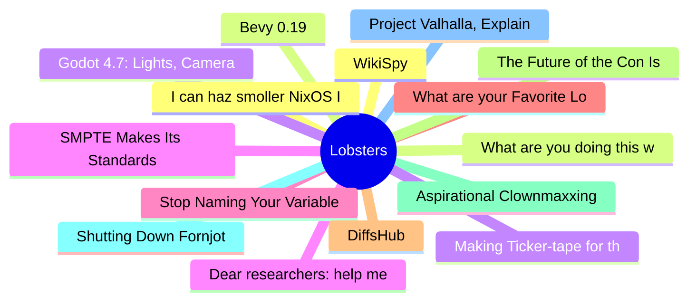

# Lobsters Top 15 (2026-06-20)

## 思维导图

## 列表（15 条）

### 1. I can haz smoller NixOS ISOs?
- **链接**: [https://natkr.com/2026-06-19-nixos-but-smol/](https://natkr.com/2026-06-19-nixos-but-smol/)
- **作者**:  | **评论**: 0
- **摘要**: 
<a href="https://lobste.rs/s/nvfvjt/i_can_haz_smoller_nixos_isos">Comments</a>

### 2. Bevy 0.19
- **链接**: [https://bevy.org/news/bevy-0-19/](https://bevy.org/news/bevy-0-19/)
- **作者**:  | **评论**: 0
- **摘要**: 
<a href="https://lobste.rs/s/k5raot/bevy_0_19">Comments</a>

### 3. Godot 4.7: Lights, Camera, Action
- **链接**: [https://godotengine.org/releases/4.7/](https://godotengine.org/releases/4.7/)
- **作者**:  | **评论**: 0
- **摘要**: 
<a href="https://lobste.rs/s/heb0am/godot_4_7_lights_camera_action">Comments</a>

### 4. SMPTE Makes Its Standards Freely Accessible
- **链接**: [https://www.smpte.org/blog/smpte-makes-its-standards-freely-accessible-openingstandards-library-to-the-global-media-technology-community](https://www.smpte.org/blog/smpte-makes-its-standards-freely-accessible-openingstandards-library-to-the-global-media-technology-community)
- **作者**:  | **评论**: 0
- **摘要**: 
<a href="https://lobste.rs/s/fbsqfs/smpte_makes_its_standards_freely">Comments</a>

### 5. Stop Naming Your Variables "Flag": The Art of Boolean Prefixes
- **链接**: [https://thatamazingprogrammer.com/posts/stop-naming-your-variables-flag-the-art-of-boolean-prefixes/](https://thatamazingprogrammer.com/posts/stop-naming-your-variables-flag-the-art-of-boolean-prefixes/)
- **作者**:  | **评论**: 0
- **摘要**: 
<a href="https://lobste.rs/s/kjp3wi/stop_naming_your_variables_flag_art">Comments</a>

### 6. What are your Favorite Lobste.rs Comments?
- **链接**: [https://lobste.rs/s/crl4fj/what_are_your_favorite_lobste_rs_comments](https://lobste.rs/s/crl4fj/what_are_your_favorite_lobste_rs_comments)
- **作者**:  | **评论**: 0
- **摘要**: 
The forum has been around for a long time and I occasionally find old gems, I wonder what great insights etc. I've missed from the past.

### 7. DiffsHub
- **链接**: [https://diffshub.com/](https://diffshub.com/)
- **作者**:  | **评论**: 0
- **摘要**: 
<a href="https://lobste.rs/s/u0nv8q/diffshub">Comments</a>

### 8. The Future of the Con Is Already Here, It's Just Not Evenly Distributed
- **链接**: [http://manishearth.github.io/blog/2026/06/17/the-future-of-the-con-is-already-here/](http://manishearth.github.io/blog/2026/06/17/the-future-of-the-con-is-already-here/)
- **作者**:  | **评论**: 0
- **摘要**: 
<a href="https://lobste.rs/s/5majlp/future_con_is_already_here_it_s_just_not">Comments</a>

### 9. Aspirational Clownmaxxing and Joey's cadillac todo list
- **链接**: [https://charlesleifer.com/blog/aspirational-clownmaxxing-and-joey-s-cadillac-todo-list/](https://charlesleifer.com/blog/aspirational-clownmaxxing-and-joey-s-cadillac-todo-list/)
- **作者**:  | **评论**: 0
- **摘要**: 
<a href="https://lobste.rs/s/dsy6r3/aspirational_clownmaxxing_joey_s">Comments</a>

### 10. Shutting Down Fornjot
- **链接**: [https://fornjot.app/blog/shutting-down-fornjot/](https://fornjot.app/blog/shutting-down-fornjot/)
- **作者**:  | **评论**: 0
- **摘要**: 
<a href="https://lobste.rs/s/ggp2ov/shutting_down_fornjot">Comments</a>

### 11. Project Valhalla, Explained: How a Decade of Work Arrives in JDK 28
- **链接**: [https://www.jvm-weekly.com/p/project-valhalla-explained-how-a](https://www.jvm-weekly.com/p/project-valhalla-explained-how-a)
- **作者**:  | **评论**: 0
- **摘要**: 
<a href="https://lobste.rs/s/jk5k9i/project_valhalla_explained_how_decade">Comments</a>

### 12. WikiSpy
- **链接**: [https://neal.fun/wiki-spy/](https://neal.fun/wiki-spy/)
- **作者**:  | **评论**: 0
- **摘要**: 
<a href="https://lobste.rs/s/9rbscj/wikispy">Comments</a>

### 13. What are you doing this weekend?
- **链接**: [https://lobste.rs/s/wemk3j/what_are_you_doing_this_weekend](https://lobste.rs/s/wemk3j/what_are_you_doing_this_weekend)
- **作者**:  | **评论**: 0
- **摘要**: 
Feel free to tell what you plan on doing this weekend and even ask for help or feedback.

Please keep in mind it’s more than OK to do nothing at all too!

### 14. Making Ticker-tape for the Knicks Parade
- **链接**: [https://joe.lothan.net/blog/ticker-tape/](https://joe.lothan.net/blog/ticker-tape/)
- **作者**:  | **评论**: 0
- **摘要**: 
<a href="https://lobste.rs/s/wf0kd6/making_ticker_tape_for_knicks_parade">Comments</a>

### 15. Dear researchers: help me deal with incidents
- **链接**: [https://surfingcomplexity.blog/wp-content/uploads/2026/06/dear-researchers.pdf](https://surfingcomplexity.blog/wp-content/uploads/2026/06/dear-researchers.pdf)
- **作者**:  | **评论**: 0
- **摘要**: 
<a href="https://lobste.rs/s/xnbxed/dear_researchers_help_me_deal_with">Comments</a>

