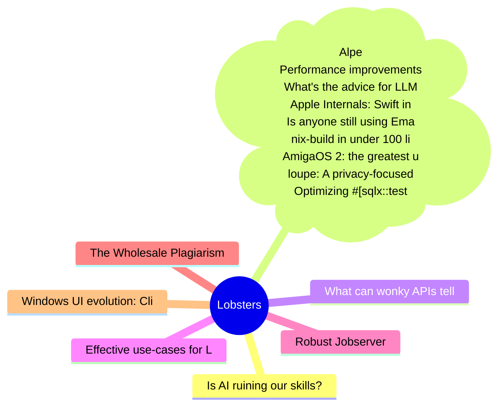

# Lobsters Top 15 (2026-06-22)

## 思维导图

## 列表（15 条）

### 1. Is AI ruining our skills? Early results are in and they’re not good
- **链接**: [https://www.nature.com/articles/d41586-026-01947-1](https://www.nature.com/articles/d41586-026-01947-1)
- **作者**:  | **评论**: 0
- **摘要**: 
<a href="https://lobste.rs/s/d0vsgl/is_ai_ruining_our_skills_early_results_are">Comments</a>

### 2. postmarketOS v26.06 (Alpen Avocado) released
- **链接**: [https://postmarketos.org/blog/2026/06/21/v26.06-release/](https://postmarketos.org/blog/2026/06/21/v26.06-release/)
- **作者**:  | **评论**: 0
- **摘要**: 
<a href="https://lobste.rs/s/kn7fi8/postmarketos_v26_06_alpen_avocado">Comments</a>

### 3. Performance improvements in libffi
- **链接**: [https://atgreen.github.io/repl-yell/posts/libffi-plan-cache/](https://atgreen.github.io/repl-yell/posts/libffi-plan-cache/)
- **作者**:  | **评论**: 0
- **摘要**: 
<a href="https://lobste.rs/s/agw0rr/performance_improvements_libffi">Comments</a>

### 4. What's the advice for LLM poisoning of artwork these days?
- **链接**: [https://lobste.rs/s/lbjdlo/what_s_advice_for_llm_poisoning_artwork](https://lobste.rs/s/lbjdlo/what_s_advice_for_llm_poisoning_artwork)
- **作者**:  | **评论**: 0
- **摘要**: 
My wife doesn't want to put her artwork online as she does not want it to be used to train LLMs. I wonder if this has culminated in any libraries that makes it feasible for me to build her a custom

### 5. Apple Internals: Swift in the Kernel
- **链接**: [https://blog.calif.io/p/apple-internals-swift-in-the-kernel](https://blog.calif.io/p/apple-internals-swift-in-the-kernel)
- **作者**:  | **评论**: 0
- **摘要**: 
<a href="https://lobste.rs/s/5j33bp/apple_internals_swift_kernel">Comments</a>

### 6. Is anyone still using Emacs?
- **链接**: [https://jmmv.dev/2026/06/is-anyone-still-using-emacs.html](https://jmmv.dev/2026/06/is-anyone-still-using-emacs.html)
- **作者**:  | **评论**: 0
- **摘要**: 
<a href="https://lobste.rs/s/s1ep1w/is_anyone_still_using_emacs">Comments</a>

### 7. nix-build in under 100 lines
- **链接**: [https://fzakaria.com/2026/06/21/nix-build-in-under-100-lines](https://fzakaria.com/2026/06/21/nix-build-in-under-100-lines)
- **作者**:  | **评论**: 0
- **摘要**: 
<a href="https://lobste.rs/s/gig3cr/nix_build_under_100_lines">Comments</a>

### 8. AmigaOS 2: the greatest upgrade
- **链接**: [https://www.datagubbe.se/os20up/](https://www.datagubbe.se/os20up/)
- **作者**:  | **评论**: 0
- **摘要**: 
<a href="https://lobste.rs/s/ontg5a/amigaos_2_greatest_upgrade">Comments</a>

### 9. loupe: A privacy-focused iOS app that raises awareness about what native apps can see
- **链接**: [https://github.com/mysk-research/loupe](https://github.com/mysk-research/loupe)
- **作者**:  | **评论**: 0
- **摘要**: 
<a href="https://lobste.rs/s/hitg0z/loupe_privacy_focused_ios_app_raises">Comments</a>

### 10. Optimizing #[sqlx::test] rebuild time
- **链接**: [https://kobzol.github.io/rust/2026/06/21/optimizing-sqlx-test-rebuild-time.html](https://kobzol.github.io/rust/2026/06/21/optimizing-sqlx-test-rebuild-time.html)
- **作者**:  | **评论**: 0
- **摘要**: 
<a href="https://lobste.rs/s/xhplww/optimizing_sqlx_test_rebuild_time">Comments</a>

### 11. What can wonky APIs tell us about the web?
- **链接**: [https://alexwlchan.net/2026/wonky-web-apis/](https://alexwlchan.net/2026/wonky-web-apis/)
- **作者**:  | **评论**: 0
- **摘要**: 
<a href="https://lobste.rs/s/fb5nuv/what_can_wonky_apis_tell_us_about_web">Comments</a>

### 12. Effective use-cases for LLMs
- **链接**: [https://aggressivelyparaphrasing.me/2026/06/21/effective-use-cases-for-llms/](https://aggressivelyparaphrasing.me/2026/06/21/effective-use-cases-for-llms/)
- **作者**:  | **评论**: 0
- **摘要**: 
<a href="https://lobste.rs/s/77kygu/effective_use_cases_for_llms">Comments</a>

### 13. Robust Jobserver
- **链接**: [https://codeberg.org/mlugg/robust-jobserver/src/branch/main/spec.md](https://codeberg.org/mlugg/robust-jobserver/src/branch/main/spec.md)
- **作者**:  | **评论**: 0
- **摘要**: 
<a href="https://lobste.rs/s/1jcvyh/robust_jobserver">Comments</a>

### 14. The Wholesale Plagiarism of Obscure Sorrows
- **链接**: [https://waxy.org/2026/06/the-wholesale-plagiarism-of-obscure-sorrows/](https://waxy.org/2026/06/the-wholesale-plagiarism-of-obscure-sorrows/)
- **作者**:  | **评论**: 0
- **摘要**: 
<a href="https://lobste.rs/s/m36bsm/wholesale_plagiarism_obscure_sorrows">Comments</a>

### 15. Windows UI evolution: Clicking an unassociated file
- **链接**: [https://movq.de/blog/postings/2026-06-20/0/POSTING-en.html](https://movq.de/blog/postings/2026-06-20/0/POSTING-en.html)
- **作者**:  | **评论**: 0
- **摘要**: 
<a href="https://lobste.rs/s/vutq1m/windows_ui_evolution_clicking">Comments</a>

