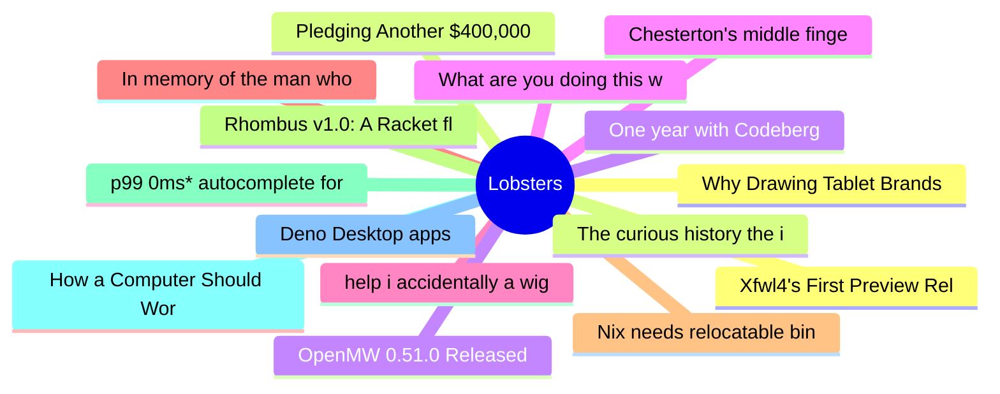

# Lobsters Top 15 (2026-06-23)

## 思维导图

## 列表（15 条）

### 1. Why Drawing Tablet Brands Won't Collaborate on Linux FLOSS Drivers
- **链接**: [https://www.davidrevoy.com/article1154/why-drawing-tablet-brands-wont-collaborate-on-linux-floss-drivers](https://www.davidrevoy.com/article1154/why-drawing-tablet-brands-wont-collaborate-on-linux-floss-drivers)
- **作者**:  | **评论**: 0
- **摘要**: 
<a href="https://lobste.rs/s/rq2t8j/why_drawing_tablet_brands_won_t">Comments</a>

### 2. Pledging Another $400,000 to the Zig Software Foundation
- **链接**: [https://mitchellh.com/writing/zig-donation-2026](https://mitchellh.com/writing/zig-donation-2026)
- **作者**:  | **评论**: 0
- **摘要**: 
<a href="https://lobste.rs/s/lz3dbc/pledging_another_400_000_zig_software">Comments</a>

### 3. One year with Codeberg
- **链接**: [https://guix.gnu.org/en/blog/2026/one-year-with-codeberg/](https://guix.gnu.org/en/blog/2026/one-year-with-codeberg/)
- **作者**:  | **评论**: 0
- **摘要**: 
<a href="https://lobste.rs/s/pifl3k/one_year_with_codeberg">Comments</a>

### 4. Chesterton's middle finger
- **链接**: [https://www.arp242.net/chestersons-finger.html](https://www.arp242.net/chestersons-finger.html)
- **作者**:  | **评论**: 0
- **摘要**: 
<a href="https://lobste.rs/s/dh6o8k/chesterton_s_middle_finger">Comments</a>

### 5. help i accidentally a wigglegram
- **链接**: [https://lmao.center/blog/wiggle-accidents/](https://lmao.center/blog/wiggle-accidents/)
- **作者**:  | **评论**: 0
- **摘要**: 
<a href="https://lobste.rs/s/uuyjxb/help_i_accidentally_wigglegram">Comments</a>

### 6. In memory of the man who put red and green squiggles under words
- **链接**: [https://devblogs.microsoft.com/oldnewthing/20260622-00/?p=112451](https://devblogs.microsoft.com/oldnewthing/20260622-00/?p=112451)
- **作者**:  | **评论**: 0
- **摘要**: 
<a href="https://lobste.rs/s/wnlece/memory_man_who_put_red_green_squiggles">Comments</a>

### 7. Nix needs relocatable binaries
- **链接**: [https://fzakaria.com/2026/06/21/nix-needs-relocatable-binaries](https://fzakaria.com/2026/06/21/nix-needs-relocatable-binaries)
- **作者**:  | **评论**: 0
- **摘要**: 
<a href="https://lobste.rs/s/pa1atu/nix_needs_relocatable_binaries">Comments</a>

### 8. Rhombus v1.0: A Racket flavored language with syntax
- **链接**: [https://blog.racket-lang.org/2026/06/rhombus-v1.0.html](https://blog.racket-lang.org/2026/06/rhombus-v1.0.html)
- **作者**:  | **评论**: 0
- **摘要**: 
<a href="https://lobste.rs/s/bkwkz5/rhombus_v1_0_racket_flavored_language">Comments</a>

### 9. p99 0ms* autocomplete for 240 million domain names
- **链接**: [https://ruurtjan.com/articles/p99-0ms-autocomplete-for-240-million-domain-names](https://ruurtjan.com/articles/p99-0ms-autocomplete-for-240-million-domain-names)
- **作者**:  | **评论**: 0
- **摘要**: 
<a href="https://lobste.rs/s/xhpauz/p99_0ms_autocomplete_for_240_million">Comments</a>

### 10. How a Computer Should Work
- **链接**: [https://pkgdemon.github.io/how-a-computer-should-work.html](https://pkgdemon.github.io/how-a-computer-should-work.html)
- **作者**:  | **评论**: 0
- **摘要**: 
<a href="https://lobste.rs/s/2nljgf/how_computer_should_work">Comments</a>

### 11. Deno Desktop apps
- **链接**: [https://docs.deno.com/runtime/desktop/](https://docs.deno.com/runtime/desktop/)
- **作者**:  | **评论**: 0
- **摘要**: 
<a href="https://lobste.rs/s/0noyze/deno_desktop_apps">Comments</a>

### 12. Xfwl4's First Preview Release
- **链接**: [https://www.spurint.org/journal/2026/06/xfwl4s-first-preview-release](https://www.spurint.org/journal/2026/06/xfwl4s-first-preview-release)
- **作者**:  | **评论**: 0
- **摘要**: 
<a href="https://lobste.rs/s/ut8idd/xfwl4_s_first_preview_release">Comments</a>

### 13. The curious history the invention of the CMD+K quick switcher
- **链接**: [https://ux.stackexchange.com/questions/153299/how-did-cmd-k-come-to-be-the-standard-shortcut-for-both-adding-a-hyperlink-and-o](https://ux.stackexchange.com/questions/153299/how-did-cmd-k-come-to-be-the-standard-shortcut-for-both-adding-a-hyperlink-and-o)
- **作者**:  | **评论**: 0
- **摘要**: 
<a href="https://lobste.rs/s/zszeab/curious_history_invention_cmd_k_quick">Comments</a>

### 14. OpenMW 0.51.0 Released
- **链接**: [https://openmw.org/2026/openmw-0-51-0-released/](https://openmw.org/2026/openmw-0-51-0-released/)
- **作者**:  | **评论**: 0
- **摘要**: 
<a href="https://lobste.rs/s/uz2qia/openmw_0_51_0_released">Comments</a>

### 15. What are you doing this week?
- **链接**: [https://lobste.rs/s/12jy9c/what_are_you_doing_this_week](https://lobste.rs/s/12jy9c/what_are_you_doing_this_week)
- **作者**:  | **评论**: 0
- **摘要**: 
What are you doing this week? Feel free to share!

Keep in mind it’s OK to do nothing at all, too.

