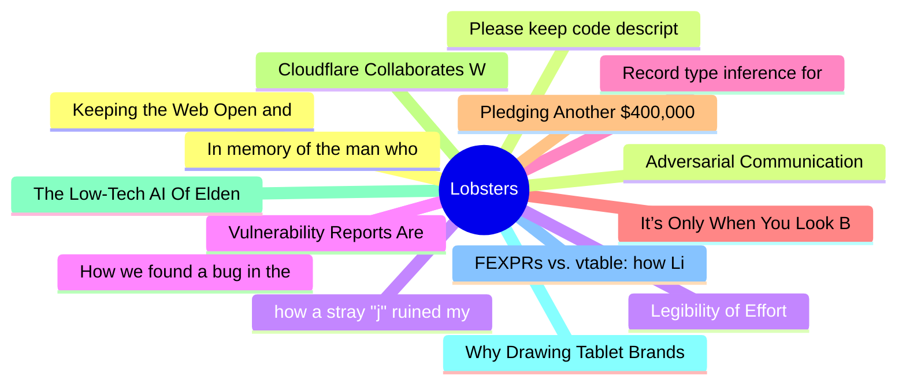

# Lobsters Top 15 (2026-06-24)

## 思维导图

## 列表（15 条）

### 1. Keeping the Web Open and Private in the Bot Era
- **链接**: [https://blog.mozilla.org/en/privacy-security/keeping-the-web-open-and-private-in-the-bot-era/](https://blog.mozilla.org/en/privacy-security/keeping-the-web-open-and-private-in-the-bot-era/)
- **作者**:  | **评论**: 0
- **摘要**: 
<a href="https://lobste.rs/s/sdqqbb/keeping_web_open_private_bot_era">Comments</a>

### 2. Please keep code descriptions simple
- **链接**: [https://akselmo.dev/posts/please-keep-code-descriptions-simple/](https://akselmo.dev/posts/please-keep-code-descriptions-simple/)
- **作者**:  | **评论**: 0
- **摘要**: 
<a href="https://lobste.rs/s/y4hgjd/please_keep_code_descriptions_simple">Comments</a>

### 3. how a stray "j" ruined my evening
- **链接**: [https://napkins.mtmn.name/posts/stray-jay.html](https://napkins.mtmn.name/posts/stray-jay.html)
- **作者**:  | **评论**: 0
- **摘要**: 
<a href="https://lobste.rs/s/cjnnk3/how_stray_j_ruined_my_evening">Comments</a>

### 4. Vulnerability Reports Are Not Special Anymore
- **链接**: [https://words.filippo.io/vuln-reports/](https://words.filippo.io/vuln-reports/)
- **作者**:  | **评论**: 0
- **摘要**: 
<a href="https://lobste.rs/s/bcjwwn/vulnerability_reports_are_not_special">Comments</a>

### 5. Record type inference for dummies
- **链接**: [https://haskellforall.com/2026/06/record-type-inference-for-dummies](https://haskellforall.com/2026/06/record-type-inference-for-dummies)
- **作者**:  | **评论**: 0
- **摘要**: 
<a href="https://lobste.rs/s/ufml52/record_type_inference_for_dummies">Comments</a>

### 6. It’s Only When You Look Back
- **链接**: [https://www.markround.com/blog/2026/06/17/25-its-only-when-you-look-back/](https://www.markround.com/blog/2026/06/17/25-its-only-when-you-look-back/)
- **作者**:  | **评论**: 0
- **摘要**: 
<a href="https://lobste.rs/s/f2ixyf/it_s_only_when_you_look_back">Comments</a>

### 7. Pledging Another $400,000 to the Zig Software Foundation
- **链接**: [https://mitchellh.com/writing/zig-donation-2026](https://mitchellh.com/writing/zig-donation-2026)
- **作者**:  | **评论**: 0
- **摘要**: 
<a href="https://lobste.rs/s/lz3dbc/pledging_another_400_000_zig_software">Comments</a>

### 8. Cloudflare Collaborates With Leading Browsers to Develop a Privacy-First Protocol For the Global Internet
- **链接**: [https://cloudflare.net/news/news-details/2026/Cloudflare-Collaborates-With-Leading-Browsers-to-Develop-a-Privacy-First-Protocol-For-the-Global-Internet/default.aspx](https://cloudflare.net/news/news-details/2026/Cloudflare-Collaborates-With-Leading-Browsers-to-Develop-a-Privacy-First-Protocol-For-the-Global-Internet/default.aspx)
- **作者**:  | **评论**: 0
- **摘要**: 
<a href="https://lobste.rs/s/fdwnzt/cloudflare_collaborates_with_leading">Comments</a>

### 9. The Low-Tech AI Of Elden Ring
- **链接**: [https://nega.tv/posts/low-tech-ai-of-elden-ring.html](https://nega.tv/posts/low-tech-ai-of-elden-ring.html)
- **作者**:  | **评论**: 0
- **摘要**: 
<a href="https://lobste.rs/s/fzz7pf/low_tech_ai_elden_ring">Comments</a>

### 10. Why Drawing Tablet Brands Won't Collaborate on Linux FLOSS Drivers
- **链接**: [https://www.davidrevoy.com/article1154/why-drawing-tablet-brands-wont-collaborate-on-linux-floss-drivers](https://www.davidrevoy.com/article1154/why-drawing-tablet-brands-wont-collaborate-on-linux-floss-drivers)
- **作者**:  | **评论**: 0
- **摘要**: 
<a href="https://lobste.rs/s/rq2t8j/why_drawing_tablet_brands_won_t">Comments</a>

### 11. FEXPRs vs. vtable: how LispE interpreter works
- **链接**: [https://github.com/naver/lispe/wiki/2.7-FEXPR-vs.-vtable](https://github.com/naver/lispe/wiki/2.7-FEXPR-vs.-vtable)
- **作者**:  | **评论**: 0
- **摘要**: 
<a href="https://lobste.rs/s/leh6g3/fexprs_vs_vtable_how_lispe_interpreter">Comments</a>

### 12. In memory of the man who put red and green squiggles under words
- **链接**: [https://devblogs.microsoft.com/oldnewthing/20260622-00/?p=112451](https://devblogs.microsoft.com/oldnewthing/20260622-00/?p=112451)
- **作者**:  | **评论**: 0
- **摘要**: 
<a href="https://lobste.rs/s/wnlece/memory_man_who_put_red_green_squiggles">Comments</a>

### 13. Adversarial Communication
- **链接**: [https://blog.glyph.im/2026/06/adversarial-communication.html](https://blog.glyph.im/2026/06/adversarial-communication.html)
- **作者**:  | **评论**: 0
- **摘要**: 
<a href="https://lobste.rs/s/gfroei/adversarial_communication">Comments</a>

### 14. Legibility of Effort
- **链接**: [https://eieio.games/blog/legibility-of-effort/](https://eieio.games/blog/legibility-of-effort/)
- **作者**:  | **评论**: 0
- **摘要**: 
<a href="https://lobste.rs/s/7q9qwr/legibility_effort">Comments</a>

### 15. How we found a bug in the hyper HTTP library
- **链接**: [https://blog.cloudflare.com/hyper-bug/](https://blog.cloudflare.com/hyper-bug/)
- **作者**:  | **评论**: 0
- **摘要**: 
<a href="https://lobste.rs/s/pvdvww/how_we_found_bug_hyper_http_library">Comments</a>

