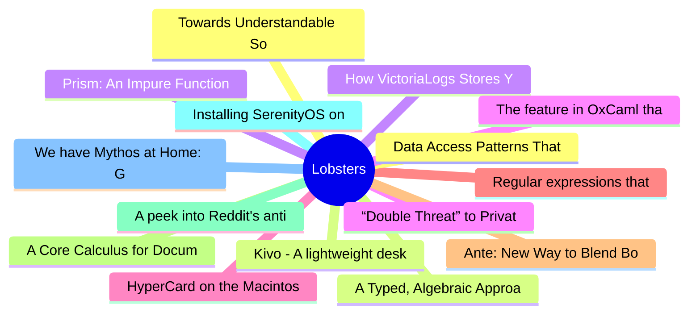

# Lobsters Top 15 (2026-06-29)

## 思维导图

## 列表（15 条）

### 1. Towards Understandable Software
- **链接**: [https://gracefulliberty.com/articles/towards-understandable-software/](https://gracefulliberty.com/articles/towards-understandable-software/)
- **作者**:  | **评论**: 0
- **摘要**: 
<a href="https://lobste.rs/s/vgqcgi/towards_understandable_software">Comments</a>

### 2. A Typed, Algebraic Approach to Parsing (2019)
- **链接**: [https://www.cl.cam.ac.uk/~nk480/parsing.pdf](https://www.cl.cam.ac.uk/~nk480/parsing.pdf)
- **作者**:  | **评论**: 0
- **摘要**: 
<a href="https://lobste.rs/s/ljvfaf/typed_algebraic_approach_parsing_2019">Comments</a>

### 3. How VictoriaLogs Stores Your Logs in a Columnar Layout
- **链接**: [https://victoriametrics.com/blog/victorialogs-internals-columnar-storage-on-disk/](https://victoriametrics.com/blog/victorialogs-internals-columnar-storage-on-disk/)
- **作者**:  | **评论**: 0
- **摘要**: 
<a href="https://lobste.rs/s/2m10ql/how_victorialogs_stores_your_logs">Comments</a>

### 4. “Double Threat” to Private Communications: Undemocratic Chat Control Backroom Deals and Imminent Concessions Spark Relaunch of fightchatcontrol.eu
- **链接**: [https://www.patrick-breyer.de/en/double-threat-to-private-communications-undemocratic-chat-control-backroom-deals-and-imminent-concessions-spark-relaunch-of-fightchatcontrol-eu/](https://www.patrick-breyer.de/en/double-threat-to-private-communications-undemocratic-chat-control-backroom-deals-and-imminent-concessions-spark-relaunch-of-fightchatcontrol-eu/)
- **作者**:  | **评论**: 0
- **摘要**: 
<a href="https://lobste.rs/s/tw0v1d/double_threat_private_communications">Comments</a>

### 5. HyperCard on the Macintosh
- **链接**: [https://stonetools.ghost.io/hypercard-mac/](https://stonetools.ghost.io/hypercard-mac/)
- **作者**:  | **评论**: 0
- **摘要**: 
<a href="https://lobste.rs/s/osjghb/hypercard_on_macintosh">Comments</a>

### 6. Regular expressions that work “everywhere”
- **链接**: [https://www.johndcook.com/blog/2026/06/23/regex-everywhere/](https://www.johndcook.com/blog/2026/06/23/regex-everywhere/)
- **作者**:  | **评论**: 0
- **摘要**: 
<a href="https://lobste.rs/s/mq245g/regular_expressions_work_everywhere">Comments</a>

### 7. Ante: New Way to Blend Borrow Checking and Reference Counting
- **链接**: [https://verdagon.dev/blog/ante-blending-borrowing-rc](https://verdagon.dev/blog/ante-blending-borrowing-rc)
- **作者**:  | **评论**: 0
- **摘要**: 
<a href="https://lobste.rs/s/vv4fhi/ante_new_way_blend_borrow_checking">Comments</a>

### 8. A Core Calculus for Documents
- **链接**: [https://dl.acm.org/doi/pdf/10.1145/3632865](https://dl.acm.org/doi/pdf/10.1145/3632865)
- **作者**:  | **评论**: 0
- **摘要**: 
<a href="https://lobste.rs/s/bbr7q9/core_calculus_for_documents">Comments</a>

### 9. A peek into Reddit's anti-spam internals
- **链接**: [https://lyra.horse/blog/2026/06/reddit-spam-internals/](https://lyra.horse/blog/2026/06/reddit-spam-internals/)
- **作者**:  | **评论**: 0
- **摘要**: 
<a href="https://lobste.rs/s/boap41/peek_into_reddit_s_anti_spam_internals">Comments</a>

### 10. Installing SerenityOS on My Old ThinkPad T60
- **链接**: [https://btxx.org/posts/serenity-t60/](https://btxx.org/posts/serenity-t60/)
- **作者**:  | **评论**: 0
- **摘要**: 
<a href="https://lobste.rs/s/igaqk9/installing_serenityos_on_my_old_thinkpad">Comments</a>

### 11. We have Mythos at Home: GLM 5.2 beats Claude in our Cyber Benchmarks
- **链接**: [https://semgrep.dev/blog/2026/we-have-mythos-at-home-glm-52-beats-claude-in-our-cyber-benchmarks](https://semgrep.dev/blog/2026/we-have-mythos-at-home-glm-52-beats-claude-in-our-cyber-benchmarks)
- **作者**:  | **评论**: 0
- **摘要**: 
<a href="https://lobste.rs/s/tinc3e/we_have_mythos_at_home_glm_5_2_beats_claude">Comments</a>

### 12. Data Access Patterns That Makes Your CPU Really Angry
- **链接**: [https://blog.weineng.me/posts/slowest_add/](https://blog.weineng.me/posts/slowest_add/)
- **作者**:  | **评论**: 0
- **摘要**: 
<a href="https://lobste.rs/s/xmsj3r/data_access_patterns_makes_your_cpu">Comments</a>

### 13. Kivo - A lightweight desktop teleprompter built with PySide6
- **链接**: [https://github.com/rajtilakjee/kivo](https://github.com/rajtilakjee/kivo)
- **作者**:  | **评论**: 0
- **摘要**: 
Kivo provides a clean, always-on-top reading overlay for scripts, AI-generated content, presentations, and video recordings.

Features

<ul>
<li>Frameless, always-on-top overlay</li>
<li>M

### 14. Prism: An Impure Functional Language With Typed Effects
- **链接**: [https://www.stephendiehl.com/posts/prism/](https://www.stephendiehl.com/posts/prism/)
- **作者**:  | **评论**: 0
- **摘要**: 
<a href="https://lobste.rs/s/bgnc5q/prism_impure_functional_language_with">Comments</a>

### 15. The feature in OxCaml that more languages should steal
- **链接**: [https://theconsensus.dev/p/2026/06/27/the-feature-in-oxcaml-more-languages-should-steal.html](https://theconsensus.dev/p/2026/06/27/the-feature-in-oxcaml-more-languages-should-steal.html)
- **作者**:  | **评论**: 0
- **摘要**: 
<a href="https://lobste.rs/s/51qnh7/feature_oxcaml_more_languages_should">Comments</a>

