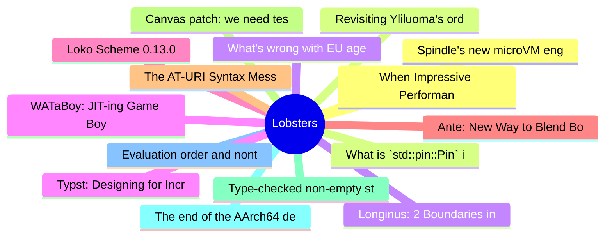

# Lobsters Top 15 (2026-06-30)

## 思维导图

## 列表（15 条）

### 1. When Impressive Performance Gains Do Not Matter
- **链接**: [https://blog.colinbreck.com/when-impressive-performance-gains-do-not-matter/](https://blog.colinbreck.com/when-impressive-performance-gains-do-not-matter/)
- **作者**:  | **评论**: 0
- **摘要**: 
<a href="https://lobste.rs/s/fok2dp/when_impressive_performance_gains_do_not">Comments</a>

### 2. What is `std::pin::Pin` in Rust?
- **链接**: [https://vrong.me/blog/what-is-pinning-in-rust/](https://vrong.me/blog/what-is-pinning-in-rust/)
- **作者**:  | **评论**: 0
- **摘要**: 
<a href="https://lobste.rs/s/ltzfkv/what_is_std_pin_pin_rust">Comments</a>

### 3. What's wrong with EU age verification? (Nothing)
- **链接**: [https://blog.vrypan.net/2026/06/29/260629-whats-wrong-with-eu-age-verification/](https://blog.vrypan.net/2026/06/29/260629-whats-wrong-with-eu-age-verification/)
- **作者**:  | **评论**: 0
- **摘要**: 
<a href="https://lobste.rs/s/29laqs/what_s_wrong_with_eu_age_verification">Comments</a>

### 4. WATaBoy: JIT-ing Game Boy Instructions to Wasm Beats a Native Interpreter
- **链接**: [https://humphri.es/blog/WATaBoy/](https://humphri.es/blog/WATaBoy/)
- **作者**:  | **评论**: 0
- **摘要**: 
<a href="https://lobste.rs/s/krqeoc/wataboy_jit_ing_game_boy_instructions">Comments</a>

### 5. Loko Scheme 0.13.0
- **链接**: [https://weinholt.se/articles/loko-scheme-0-13-0/](https://weinholt.se/articles/loko-scheme-0-13-0/)
- **作者**:  | **评论**: 0
- **摘要**: 
<a href="https://lobste.rs/s/uofjjs/loko_scheme_0_13_0">Comments</a>

### 6. Ante: New Way to Blend Borrow Checking and Reference Counting
- **链接**: [https://verdagon.dev/blog/ante-blending-borrowing-rc](https://verdagon.dev/blog/ante-blending-borrowing-rc)
- **作者**:  | **评论**: 0
- **摘要**: 
<a href="https://lobste.rs/s/vv4fhi/ante_new_way_blend_borrow_checking">Comments</a>

### 7. The AT-URI Syntax Mess
- **链接**: [https://bnewbold.leaflet.pub/3mph4hzvbdc2v](https://bnewbold.leaflet.pub/3mph4hzvbdc2v)
- **作者**:  | **评论**: 0
- **摘要**: 
<a href="https://lobste.rs/s/7fjqgc/at_uri_syntax_mess">Comments</a>

### 8. Canvas patch: we need testers
- **链接**: [https://monadicsheep.org/blog/call-for-canvas-patch-testers.html](https://monadicsheep.org/blog/call-for-canvas-patch-testers.html)
- **作者**:  | **评论**: 0
- **摘要**: 
<a href="https://lobste.rs/s/dkky2i/canvas_patch_we_need_testers">Comments</a>

### 9. Type-checked non-empty strings
- **链接**: [https://exploring-better-ways.bellroy.com/haskell-koan-type-checked-non-empty-strings.html](https://exploring-better-ways.bellroy.com/haskell-koan-type-checked-non-empty-strings.html)
- **作者**:  | **评论**: 0
- **摘要**: 
<a href="https://lobste.rs/s/r1uxyo/type_checked_non_empty_strings">Comments</a>

### 10. The end of the AArch64 desktopexperiment
- **链接**: [https://marcin.juszkiewicz.com.pl/2026/06/26/the-end-of-the-aarch64-desktop-experiment/](https://marcin.juszkiewicz.com.pl/2026/06/26/the-end-of-the-aarch64-desktop-experiment/)
- **作者**:  | **评论**: 0
- **摘要**: 
<a href="https://lobste.rs/s/pjcplu/end_aarch64_desktopexperiment">Comments</a>

### 11. Evaluation order and nontermination in query languages
- **链接**: [https://www.rntz.net/post/2026-06-11-datalog-nontermination.html](https://www.rntz.net/post/2026-06-11-datalog-nontermination.html)
- **作者**:  | **评论**: 0
- **摘要**: 
<a href="https://lobste.rs/s/0p04p0/evaluation_order_nontermination_query">Comments</a>

### 12. Spindle's new microVM engine
- **链接**: [https://blog.tangled.org/spindle-microvm/](https://blog.tangled.org/spindle-microvm/)
- **作者**:  | **评论**: 0
- **摘要**: 
<a href="https://lobste.rs/s/ybcofm/spindle_s_new_microvm_engine">Comments</a>

### 13. Revisiting Yliluoma’s ordered dither algorithm
- **链接**: [https://30fps.net/pages/revisiting-yliluoma-2/](https://30fps.net/pages/revisiting-yliluoma-2/)
- **作者**:  | **评论**: 0
- **摘要**: 
<a href="https://lobste.rs/s/cxxgbt/revisiting_yliluoma_s_ordered_dither">Comments</a>

### 14. Longinus: 2 Boundaries in One Bug, Piercing Chrome’s Renderer and V8 Sandbox with a Single Vulnerability, CVE-2026-6307
- **链接**: [https://nebusec.ai/research/v8-cve-2026-6307-writeup/](https://nebusec.ai/research/v8-cve-2026-6307-writeup/)
- **作者**:  | **评论**: 0
- **摘要**: 
<a href="https://lobste.rs/s/uaoe9y/longinus_2_boundaries_one_bug_piercing">Comments</a>

### 15. Typst: Designing for Incrementality
- **链接**: [https://youtu.be/yWWVhbyOWWE](https://youtu.be/yWWVhbyOWWE)
- **作者**:  | **评论**: 0
- **摘要**: 
<a href="https://lobste.rs/s/hj0exw/typst_designing_for_incrementality">Comments</a>

