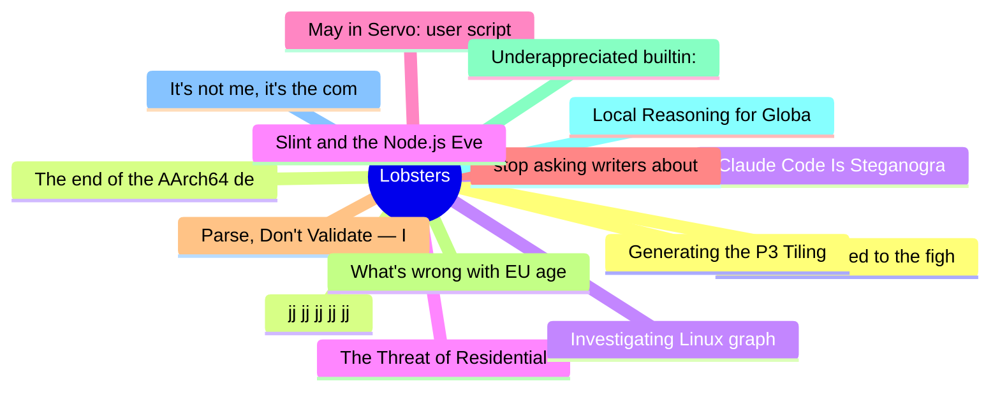

# Lobsters Top 15 (2026-07-01)

## 思维导图

## 列表（15 条）

### 1. What happened to the fight for the internet?
- **链接**: [https://dustycloud.org/blog/what-happened-to-the-fight-for-the-internet/](https://dustycloud.org/blog/what-happened-to-the-fight-for-the-internet/)
- **作者**:  | **评论**: 0
- **摘要**: 
<a href="https://lobste.rs/s/rfkmw3/what_happened_fight_for_internet">Comments</a>

### 2. jj jj jj jj jj
- **链接**: [https://caiustheory.com/jj-jj-jj-jj-jj/](https://caiustheory.com/jj-jj-jj-jj-jj/)
- **作者**:  | **评论**: 0
- **摘要**: 
<a href="https://lobste.rs/s/96kp1m/jj_jj_jj_jj_jj">Comments</a>

### 3. Claude Code Is Steganographically Marking Requests
- **链接**: [https://thereallo.dev/blog/claude-code-prompt-steganography](https://thereallo.dev/blog/claude-code-prompt-steganography)
- **作者**:  | **评论**: 0
- **摘要**: 
<a href="https://lobste.rs/s/qs2sxd/claude_code_is_steganographically">Comments</a>

### 4. The Threat of Residential Proxies
- **链接**: [https://www.feistyduck.com/newsletter/issue_138_the_threat_of_residential_proxies](https://www.feistyduck.com/newsletter/issue_138_the_threat_of_residential_proxies)
- **作者**:  | **评论**: 0
- **摘要**: 
<a href="https://lobste.rs/s/x8qug8/threat_residential_proxies">Comments</a>

### 5. May in Servo: user scripts, mp4 compat, blackboxing in DevTools, and more
- **链接**: [https://servo.org/blog/2026/06/30/may-in-servo/](https://servo.org/blog/2026/06/30/may-in-servo/)
- **作者**:  | **评论**: 0
- **摘要**: 
<a href="https://lobste.rs/s/t2gomd/may_servo_user_scripts_mp4_compat">Comments</a>

### 6. stop asking writers about "AI"
- **链接**: [https://benjaminhollon.com/musings/stop-asking-writers-about-ai/](https://benjaminhollon.com/musings/stop-asking-writers-about-ai/)
- **作者**:  | **评论**: 0
- **摘要**: 
<a href="https://lobste.rs/s/v2cbi5/stop_asking_writers_about_ai">Comments</a>

### 7. Parse, Don't Validate — In a Language That Doesn't Want You To
- **链接**: [https://cekrem.github.io/posts/parse-dont-validate-typescript/](https://cekrem.github.io/posts/parse-dont-validate-typescript/)
- **作者**:  | **评论**: 0
- **摘要**: 
<a href="https://lobste.rs/s/lzewut/parse_don_t_validate_language_doesn_t_want">Comments</a>

### 8. What's wrong with EU age verification? (Nothing)
- **链接**: [https://blog.vrypan.net/2026/06/29/260629-whats-wrong-with-eu-age-verification/](https://blog.vrypan.net/2026/06/29/260629-whats-wrong-with-eu-age-verification/)
- **作者**:  | **评论**: 0
- **摘要**: 
<a href="https://lobste.rs/s/29laqs/what_s_wrong_with_eu_age_verification">Comments</a>

### 9. Underappreciated builtin: Grand Unified Debugger
- **链接**: [https://tusharhero.codeberg.page/underappreciated-builtin-gud.html](https://tusharhero.codeberg.page/underappreciated-builtin-gud.html)
- **作者**:  | **评论**: 0
- **摘要**: 
<a href="https://lobste.rs/s/g6wquq/underappreciated_builtin_grand_unified">Comments</a>

### 10. Local Reasoning for Global Properties
- **链接**: [https://tratt.net/laurie/blog/2026/local_reasoning_for_global_properties.html](https://tratt.net/laurie/blog/2026/local_reasoning_for_global_properties.html)
- **作者**:  | **评论**: 0
- **摘要**: 
<a href="https://lobste.rs/s/4rfzbl/local_reasoning_for_global_properties">Comments</a>

### 11. It's not me, it's the compiler
- **链接**: [https://parsa.wtf/cast/](https://parsa.wtf/cast/)
- **作者**:  | **评论**: 0
- **摘要**: 
<a href="https://lobste.rs/s/v7ghbn/it_s_not_me_it_s_compiler">Comments</a>

### 12. Generating the P3 Tiling
- **链接**: [https://k-monk.org/blog/generating-the-p3-tiling/](https://k-monk.org/blog/generating-the-p3-tiling/)
- **作者**:  | **评论**: 0
- **摘要**: 
<a href="https://lobste.rs/s/uaubz8/generating_p3_tiling">Comments</a>

### 13. The end of the AArch64 desktop experiment
- **链接**: [https://marcin.juszkiewicz.com.pl/2026/06/26/the-end-of-the-aarch64-desktop-experiment/](https://marcin.juszkiewicz.com.pl/2026/06/26/the-end-of-the-aarch64-desktop-experiment/)
- **作者**:  | **评论**: 0
- **摘要**: 
<a href="https://lobste.rs/s/pjcplu/end_aarch64_desktop_experiment">Comments</a>

### 14. Investigating Linux graphics (2025)
- **链接**: [https://roscidus.com/blog/blog/2025/06/24/graphics/](https://roscidus.com/blog/blog/2025/06/24/graphics/)
- **作者**:  | **评论**: 0
- **摘要**: 
<a href="https://lobste.rs/s/wenqxh/investigating_linux_graphics_2025">Comments</a>

### 15. Slint and the Node.js Event Loop
- **链接**: [https://slint.dev/blog/slint-and-the-nodejs-event-loop](https://slint.dev/blog/slint-and-the-nodejs-event-loop)
- **作者**:  | **评论**: 0
- **摘要**: 
<a href="https://lobste.rs/s/mml4wf/slint_node_js_event_loop">Comments</a>

